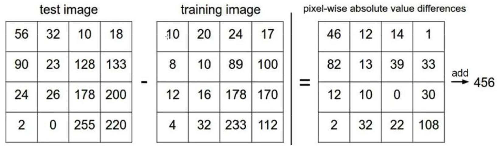
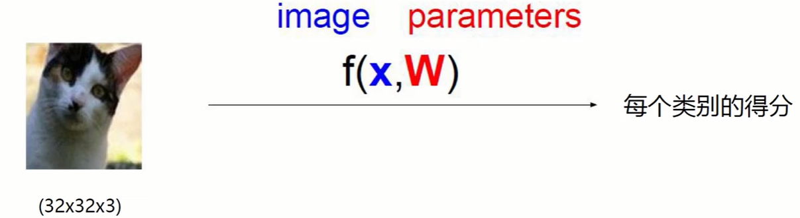

# Neural Network

> 深度学习适用数据集庞大情况，但是速度比较慢，结果却比较准确
>
> 且数据集生成比较容易，能够根据已有数据继续生成新数据

推荐数据集

> CIFAR-10：http://www.cs.toronto.edu/~kriz/cifar.html
>
> 使用—— [ CIFAR-10数据集](https://blog.csdn.net/qq_40755283/article/details/125209463?utm_medium=distribute.pc_relevant.none-task-blog-2~default~baidujs_baidulandingword~default-0-125209463-blog-82793025.235^v36^pc_relevant_default_base3&spm=1001.2101.3001.4242.1&utm_relevant_index=3) 

## 一.Base

### 1.K近邻

算法思想：

- 计算已知类别数据集中点与当前点距离
- 按照距离依次排序
- 选取与当前点距离最小的K个点
- 确定前K个点所在类别的出现概率
- 返回前K个点出现频率最高的类别作为当前点预测分类

> **例如：**
>
> 存在两种类别的点：方块和三角
>
> 如果放入绿色点，那么其点属于方块还是三角？
>
> 设`K=3`，因此计算距离绿点最近的三个点，通过分析出现的类别数量可得绿点属于三角形
>
> 


>  **计算机中图像的三维表示**
>
> 一张图片的颜色是由RGB三个通道构成, 可以把一张图片上的每一个像素点看成一个对象, 这个对象又由RGB三种颜色叠加, 即用一个一维数组表示,假如我们有一张 `m * n `个像素点的图片, 那么每一行有 n 个像素, 即每一行有 n 个一维数组, 即这一行是一个二维数组, 那一张图片又有 m 行, 那么我们就得到了 m 个二维数组, 这m 个二维数组构成了一个三维数组。（即每个最内层的数组有三个元素，代表着RGB三个通道的灰度值。第二层和第三层则负责遍历整个行和列） 
>
>   


**假设用K近邻进行图像分类任务**

计算两个图像矩阵之间每个像素差值，最后得到测试图像与训练图像的距离，然后进行归类




> 最后结果发现，少数结果能够匹配之外，大多数会出现偏差，这是因为**K近邻无法区分背景和主体**，因此可能把完全不同类型的图像归类到一起。**所以不适合做图像分类任务**

### 2.得分函数

**将输入--->输出的映射**



> 例如这张猫的图片由3072个像素点组成，那么每个像素点都会影响最后结果，因此每个像素点有权重参数`W`


> 每一种类别都有其权重参数，设某一类别的权重参数为`Wi`，则将`Wi`与该图片的像素点`x(这里排列成一列)`进行矩阵运算，得到该该类别下的得分。
>
> `b`代表微调参数，每个类别计算结果都会加上各自的微调参数


> 按照图中所示，进行得分计算，权重参数中，值越大，代表影响越大，越小，代表干扰越大
>
> `权重参数W`需要进行不断调整优化，最终才可能得到比较理想结果

### 3.损失函数

> 参考—— [损失函数（Loss Function](https://zhuanlan.zhihu.com/p/261059231) 

损失函数（loss function）就是用来度量模型的预测值f(x)与真实值Y的差异程度的运算函数，它是一个非负实值函数，通常使用L(Y, f(x))来表示，损失函数越小，模型的鲁棒性就越好。 

> 假设损失函数如下：
>
> 
>
> 通过错误类别结果和正确类别分数差值来判断是否损失，数值越小，损失越小，**末尾的`1`代表容忍参数，意思是至少两者差值要大于1以上才算没有损失**
>
> 
>

**损失函数作用**

- 计算输出和目标之间的差距
- 更新输出提供依据(反向传播)

#### (1)过拟合

> 参考—— [理解过拟合 ](https://zhuanlan.zhihu.com/p/38224147) 
>
>  [ 过拟合(overfitting)与解决办法 ](https://zhuanlan.zhihu.com/p/266658432) 

**什么是过拟合：**

> **过拟合 = 过度自信 = 自负**
>
> `Overfitting `也被称为过度学习，过度拟合。 
>
> 它的直观表现是算法在训练集上表现好，但在测试集上表现不好，泛化性能差。过拟合是在模型参数拟合过程中由于训练数据包含抽样误差，在训练时复杂的模型将抽样误差也进行了拟合导致的 
>
> **引起过拟合的可能原因有：**
>
> - 模型本身过于复杂，以至于拟合了训练样本集中的噪声。此时需要选用更简单的模型，或者对模型进行裁剪。
> - 训练样本太少或者缺乏代表性。此时需要增加样本数，或者增加样本的多样性。
> - 训练样本噪声的干扰，导致模型拟合了这些噪声，这时需要剔除噪声数据或者改用对噪声不敏感的模型。
>
>   
>
> 如上图所示， **训练样本存在噪声，为了照顾它们，分类曲线的形状非常复杂，导致在真实测试时会产生错分类。** 

**解决过拟合的办法**

> **①增加数据量**
>
> **②运用正则化**
>
> **③剪枝(drop-out)**
>
> **④精简模型**


#### (2)使用正规化解决过拟合

通常定义一个`正则化惩罚项目`


### 4.分类处理

#### (1)归一化

**Normalization**

> 参考—— [如何理解归一化（normalization）?](https://zhuanlan.zhihu.com/p/424518359) 
>
>  [什么是批归一化 ](https://zhuanlan.zhihu.com/p/24810318) 

我们通过`得分函数`得到的是具体的分数，为了更好的对生成分数进行表示，进行归一化处理

> 归一化的目的就是使得**预处理的数据**被**限定在一定的范围内**（比如[0,1]或者[-1,1]），从而消除奇异样本数据导致的不良影响。
>
> **为什么归一化：**
>
> 消除纲量，加快收敛：
>
> 不同特征往往具有不同的量纲单位，这样的情况会影响到数据分析的结果，为了消除指标之间的量纲影响，需要进行数据归一化处理，以解决数据指标之间的可比性。原始数据经过数据归一化处理后，各指标处于[0,1]之间的小数，适合进行综合对比评价。
>
> 提高精度。

**常用的归一化处理**

>  [理解CNN中的Batch Normalization](https://zhuanlan.zhihu.com/p/403073810) 
>
>  `softmax`

#### (2)标准化

**Standardization**

> [归一化(normalization)和标准化(standardization)](https://www.jianshu.com/p/967f2199cd8c) 
>
> [标准化](https://blog.csdn.net/neweastsun/article/details/124230769)

> **归一化：**
>
>  归一化是利用特征（可理解为某个数据集合）的最大值，最小值，将特征的值缩放到[0,1]区间，对于每一列的特征使用min - max函数进行缩放。 

> **标准化：**
>
> 标准化是**通过特征的平均值和标准差，将特征缩放成一个标准的正态分布，缩放后均值为0，方差为1**。但即使数据不服从正态分布，也可以用此法。特别适用于数据的最大值和最小值未知，或存在孤立点。 
>
> **为什么要标准化**
>
> 1）标准化是为了方便数据的下一步处理，而进行的数据缩放等变换，不同于归一化，**并不是为了方便与其他数据一同处理或比较**。
>
> 2）标准化后的变量值围绕0上下波动，大于0说明高于平均水平，小于0说明低于平均水平。

#### (3)正则化

**Regularization**


#### (4)激活函数

> 参考—— [激活函数sigmoid、tanh、relu、Swish ](https://www.cnblogs.com/wzdLY/p/9710478.html#:~:text=sigmoid函,需要归一化数据。) 

层与层之间需要`激活函数`进行`非线性变换`，从而决定下一个神经元连接的情况，并接收上一个单元输出的信号，转换成某形式，并作为一个单元输出。


#### (4)激活函数和归一化顺序

**先Batch Normalization再激活** 

> 归一化和激活函数都可以进行数据预处理

### 5.梯度

梯度就是矩阵的导数，图像上就是斜率

神经网络求梯度的作用是更新神经网络中的参数，以最小化损失函数。通过计算损失函数对参数的导数，可以确定参数应该朝着哪个方向进行调整，从而使得网络的预测结果更加准确。这个过程被称为反向传播算法。 

### 6.反向传播

> 参考：
>
> [梯度下降和反向传播](https://blog.csdn.net/pwh1209/article/details/106965635)

反向传播是一种用于训练神经网络的算法。它通过将网络的输出与期望的输出之间的误差反向传播回网络中的每个神经元，从而调整每个神经元的权重和偏置，以最小化误差。简单来说，它是一种优化算法，用于调整神经网络中的参数以最大程度地减少误差。 

其实是求导的链式过程

> 


### 7.一些关键名词

>  [深度学习中Epoch、Batch以及Batch size的设定 ](https://zhuanlan.zhihu.com/p/390341772) 
>
>   [ epoch, batch, iteration ](https://zhuanlan.zhihu.com/p/66021413) 

- **Epoch（时期）：**

> 当一个完整的数据集通过了神经网络一次并且返回了一次，这个过程称为一次epoch。（也就是说，所有训练样本在神经网络中都进行了一次正向传播和一次反向传播 ）
>
> 再通俗一点，**一个Epoch就是将所有训练样本训练一次的过程。**
>
> 然而，当一个Epoch的样本（也就是所有的训练样本）数量可能太过庞大（对于计算机而言），就需要把它分成多个小块，也就是就是分成多个Batch 来进行训练。

- **Batch（批 / 一批样本）：**

> 将整个训练样本分成若干个Batch。

- **Batch_Size（批大小）：**

> 每批样本的大小。

- **Iteration（一次迭代）：**

>  1个iteration即迭代一次，也就是用batchsize个样本训练一次； 
>
> > `epoch`指的是次数，epoch = 10 指的是把整个数据集丢进神经网络训练10次。
> >
> > `batch size` 指的是数据的个数，batch size = 10 指的是每次扔进神经网络训练的数据是10个。
> >
> > `iteration`同样指的是次数，iteration = 10 指的是把整个数据集分成10次扔进神经网络。
> >
> > **所以如果有100个数据集，batch size设为10，那么iteration就是100/10=10**


**(1)无监督、有监督、半监督**


有监督、半监督、无监督是根据训练数据中是否包含标签来划分的。

**有监督学习**

在有监督学习中，训练数据中包含标签。模型通过学习输入和标签之间的关系来进行预测或分类。

**半监督学习**

在半监督学习中，训练数据中包含少量有标签数据和大量无标签数据。模型通过学习有标签数据和无标签数据之间的关系来进行预测或分类。

**无监督学习**

在无监督学习中，训练数据中不包含标签。模型通过学习数据中的隐藏模式来进行预测或分类。

| 学习类型 | 训练数据                                     | 模型                               | 应用                 |
| -------- | -------------------------------------------- | ---------------------------------- | -------------------- |
| 有监督   | 包含标签                                     | 学习输入和标签关系                 | 分类、回归、聚类     |
| 半监督   | 包含少量标签（部分标注和部分未标注的数据集） | 学习有标签数据和无标签数据之间关系 | 分类、回归、聚类     |
| 无监督   | 不包含标签                                   | 学习数据中隐藏模式                 | 聚类、降维、异常检测 |
| 弱监督   | 有限的、含有噪声的或者标注不准确的数据       |                                    |                      |
| 自监督   |                                              |                                    |                      |

> **自监督学习和无监督学习的区别在于其学习的策略和目标**。 自监督学习更加侧重于利用数据内在的信息进行预测，以促进模型的自主学习。 而无监督学习则更注重发现数据之间的模式和结构，以便更好地理解数据的特征。 


## 二、NN整体架构

### 1.全连接层(线性层)


> 参考：
>
> https://www.zhihu.com/question/41037974

 **线性层（Linear Layer），也称全连接层（Fully Connected Layer）** 

> 线性层通常包含一个`输入矩阵`，`一个权重矩阵`和`一个偏置向量`。
>
> 
>
> 
>
> > **x**是全连接层输入，记为
> > $$
> > x = [x1,x2,x3..xn]^T
> > $$
> > **W**是全连接层的权重矩阵，记为
> > $$
> > W = [[w_{11}  w_{12} w_{13}],[w_{21},w_{22},w_{23}]]
> > $$
> > **b(bias)**是偏置项
>
> 输入矩阵的每一行表示一个样本，每一列表示一个特征，权重矩阵的每一行表示一个输出神经元的权重，偏置向量是一个常数向量，用于调整输出结果。 
>
> ```
> 线性层的计算过程可以简单地表示为：输出 = 输入 × 权重矩阵 + 偏置向量。
> 其中:
> 1.输入是一个形状为 [batch_size, input_size] 的矩阵，
> 2.权重矩阵是一个形状为 [input_size, output_size] 的矩阵，
> 3.偏置向量是一个长度为 output_size 的向量，
> 4.输出是一个形状为 [batch_size, output_size] 的矩阵。 (通过矩阵乘法 (1*input_s)x(input_s*output_s)转换为outputsize
> ```

> **线性层的作用是对输入数据进行线性变换，从而得到新的特征表示。在深度学习中，通常会将线性层与激活函数层组合使用，构成一个完整的神经网络层结构。常见的激活函数包括ReLU、Sigmoid和Tanh等，它们的作用是对线性层的输出进行非线性变换，从而增强模型的表达能力。**

> 最后一层是全连接层，那么这个全连接层必然承担两种任务之一：
>
> - 分类问题(Classification)
> - 回归问题(Regression)

> **全连接层的输入通常是一个二维矩阵，也可以是一个一维向量。如果输入是一个二维矩阵，那么通常需要将其先展开为一维向量，然后再进行全连接操作**
>
> 通俗点来说，就是将卷积结果展开成1维，因为全连接最后需要做的是分类，所以将每个特征进行全连接最后得到其中一个对象的概率
>
>  
>
>  
>
> > 参考：
> >
> > https://paddlepedia.readthedocs.io/en/latest/tutorials/CNN/convolution_operator/Convolution.html
> >
> > https://codeantenna.com/a/I43dRDGrsa

-------------

### 2.非线性激活

> **参考：**
>
> [Relu激活函数](https://zhuanlan.zhihu.com/p/428448728)

层与层之间需要`激活函数`进行非线性变换，从而决定下一个神经元连接的情况，并接收上一个单元输出的信号，转换成某形式，并作为一个单元输出。 **具体来讲，激活函数，是指如何把“激活的神经元的特征”通过函数把特征保留并映射出来，即负责将神经元的输入映射到输出端。** 

> **为什么要非线性激活**
>
> 如果不用激活函数，在这种情况下每一层输出都是上层输入的线性函数。容易验证，无论神经网络有多少层，输出都是输入的线性组合，与没有隐藏层效果相当，这种情况就是最原始的感知机（Perceptron）了。因此引入非线性函数作为激活函数，这样深层神经网络就有意义了（不再是输入的线性组合，可以逼近任意函数）。

#### 激活函数

> 常见的`激活函数`包括
>
> `sigmoid，softmax，Relu，Tanh`
>
> **sigmoid**
>
> >  对于**二分类问题**，我们可以使用`Sigmoid`函数（又称Logistic函数）。将`(−∞,+∞)`范围内的数值映射成为一个`(0,1)`区间的数值，一个`(0,1)`区间的数值恰好可以用来表示概率。 
> >
> > 
> >
> >  Sigmod函数是Softmax函数的一个特例，Sigmod函数只能用于预测值为0或1的二元分类。 
> >
> > 并且`sigmoid`随着参数增大，可能出现梯度消失
> >
> > > 参考——[Softmax函数](https://zhuanlan.zhihu.com/p/168562182) 
>
> **softmax**
>
> > **对于多分类问题，一种常用的方法是Softmax函数，它可以预测每个类别的概率。** 
> >
> > Softmax是一种激活函数，它可以将一个数值向量**归一化为一个概率分布向量，且各个概率之和为1**。Softmax一般用来作为神经网络的最后一层，用于多分类问题的输出。Softmax层常常和交叉熵损失函数一起结合使用。 
> >
> > 
> >
> > 例如下图，将一个向量转换成和为1的另一组向量
> >
> >  
> >
> >  Softmax函数使用了指数，对于每个输入`Zi`，需要计算`Zi`的指数。因为进行反向传播需要求导，而指数求导很方便: 
> >
> > **使用Numpy实现一个softmax：**
> >
> > ```python
> > def softmax(x):
> >     return np.exp(x) / np.sum(np.exp(x), axis=0)
> > 
> > a = np.asarray([2, 3, 5]) 
> > softmax(a)
> > >> array([0.04201007, 0.1141952 , 0.84379473])
> > ```
> >
> > 如果不用指数，直接计算百分比
> >
> > ```python
> > def percentile(x):
> >     return x / np.sum(x, axis=0)
> > 
> > percentile(a)
> > >> array([0.2, 0.3, 0.5])
> > ```
> >
> > 可以看到通过指数计算，能够将向量中的每个数值差距拉大，因为指数函数在x轴正轴的变化非常明显，斜率越来越大。x轴上一个很小的变化都会导致y轴非常大的变化。 
> >
> > **但是因为指数函数在X正轴增长过快，如果`Zi`过大，那`exp(Zi)`也会过大，导致数值溢出，解决办法是 先求得输入向量的最大值，然后所有向量都减去这个最大值 ：**
> >
> > 
> >
> > > 参考—— [Softmax函数](https://zhuanlan.zhihu.com/p/168562182) 
>
> **Relu**
>
> > 
> >
> > 
> >
> > ReLu会使一部分神经元的输出为0，这样就造成了 **网络的稀疏性**，并且减少了参数的相互依存关系，**缓解了过拟合**问题的发生。 
>
> **softmax**
>
>  softmax是一种常用的激活函数，通常用于`多分类问题`中将输出转化为概率分布。它将一个K维向量压缩到0到1之间，并且所有元素的和为1。最常见的问题是如何在神经网络中使用Softmax来进行多分类任务。 
>
> **例如我们上面得分函数得到的分数进行归一化处理并重新计算损失值**
>
> > 
> >
> > 对应函数公式如下：
> >
> > 
> >
> > 
>
> 


### 3.数据预处理


### 4.参数初始化

常见参数初始化分为：

- 随机初始化
- Xavier初始化
- He初始化

### 5.Drop-Out

为了解决**`过拟合`**问题，在训练模型时候需要随机删除每一层等比例的神经元，成为`drop-out`（剪枝）


## 三.CNN

### 1.应用领域：

- 图像检测
- 分类和检索
- 超分辨率重构(图像修复)
- 自动驾驶
- 人脸识别

### 2.架构

- 输入层
- 卷积层：提取特征
- 池化层：压缩特征
- 全连接层


> 往往**带参数计算**的层才纳入到神经网络层数中，所以上面图片是7层神经网络(6个conv，一个FC)


**卷积做了什么**

#### 特征图

#### 卷积核

> 

> 最右边绿色的矩阵代表每个`3x3x3`区域进行卷积后提取的特征值，也叫**`特征图(Feature map)`**
>
> 蓝色框里面的`权重参数矩阵`又称为**`卷积核`**，**往往卷积核的大小采用正奇数**

**图像颜色通道**

因为图像都是由`RGB`三个色度混合一起呈现的，所以在卷积的时候要分别对三个通道(`R Channel`,`G Channel`,`B Channel`)分别做特征提取处理

### 3.卷积特征值计算方法


> `Bias`为偏置项

最后得到的第一个`3x3x3区域进行卷积`特征值结果是`3`:


> 上面有**两个`特征图`**，这两个特征图分别利用两个卷积核(filter)得到

### 4.卷积层涉及参数

#### (1)stride

**定义每次做卷积的`步长`，也就是区域滑动的长度**

步长越少，最终得到的特征值也越多，但是花费时间也更长


#### (2)kernal_size

> 参考—— [卷积神经网络中的卷积核](https://blog.csdn.net/Vermont_/article/details/108690251) 

往往都是3x3

#### (3)padding


因为数据矩阵在卷积计算时候，可能会出现边缘的计算次数少，而中间的计算次数多，从而造成最后特征值有差异，因此进行一个边缘填充，让边缘的数据变成中间数据，`如上图`,`pad+1`待变填充一圈，并且都赋值为0，因为0不影响最后的卷积结果

#### (4)卷积核个数


#### (5)卷积结果计算公式


> 其中:
>
> `W1、H1`表示输入的宽度、长度；
>
> `W2、H2`表示输出特征图的宽度、长度； 
>
> `F`表示卷积核长和宽的大小；
>
> `S`表示滑动窗口的步长；
>
> `P`表示边界填充(加几圈0)。  

**例如：**


### 5.pooling

在经过卷积之后得到的特征图往往数量很多，因此通过`池化`进行特征图压缩，去除掉不那么重要的特征。

#### max pooling

一般采用`最大池化`，就是选取某个范围内的最大特征值代表这个范围


> 最大池化也叫下采样

--------------

#### conv pooling

 Conv pooling 是Convolutional Neural Networks (CNN)中的一个概念，它通常是指在卷积层后接一个池化层。这两层是一起使用的，用于对图像进行特征提取。 


#### 采样(sampling)

> [上采样与下采样：原理与应用详解 ](https://zhuanlan.zhihu.com/p/626592564) 


### 6.全连接(FC)

>  [什么是全连接层（Fully Connected Layer）](https://zhuanlan.zhihu.com/p/33841176) 

作用是实现分类，也就是判断概率

### 7.感受野

> 参考—— [感受野(Receptive Field)的理解与计算](https://zhuanlan.zhihu.com/p/113487374) 

`Receptive Field`

> **定义：**
>
> **感受野**是指特征图上的某个点能看到的输入图像的区域,即特征图上的点是由输入图像中感受野大小区域的计算得到的。
>
> 
>
> 感受野的值越大表示其能接触到的原始图像范围就越大，也意味着它可能蕴含更为全局，语义层次更高的特征；相反，值越小则表示其所包含的特征越趋向局部和细节。因此**感受野的值可以用来大致判断每一层的抽象层次** 

> **计算感受野：**
>
> 只有`卷积层`和`池化层`会影响感受野
>
> 

### 8.bias

在卷积神经网络（Convolutional Neural Network，CNN）中，bias（偏置项）是指在每个卷积核（convolutional kernel）或全连接层（fully connected layer）中添加的一个可学习的参数。bias的作用是调节激活函数的输出，使得模型能够更好地拟合数据。

具体来说，在卷积层中，每个卷积核都有一个对应的bias参数。在进行卷积运算时，bias会被加到卷积核与输入特征图进行元素乘法运算后的结果上，从而调节输出特征图的值。在全连接层中，每个神经元也都有一个对应的bias参数，它会被加到神经元的输入上，从而调节神经元的输出值。

bias参数的初始值通常被设置为0，在训练过程中会通过梯度下降算法进行更新。通过调节bias参数，可以使模型更灵活地拟合数据，提高模型的性能和泛化能力。


### 经典CNN

#### (1)VGG

> 参考—— [VGG网络 ](https://zhuanlan.zhihu.com/p/41423739#Vgg优缺点) 

 VGG有两种结构，分别是VGG16和VGG19，两者并没有本质上的区别，只是网络深度不一样。 


#### (2)Resnet

> 参考—— [残差网络](https://zhuanlan.zhihu.com/p/42706477) 
>
>  [ResNet网络 残差块的作用](https://blog.csdn.net/weixin_44492824/article/details/123189456) 

**残差网络**，传统网络随着深度(层数)增加，网络发生了退化（degradation）的现象：训练集loss逐渐下降，然后趋于饱和，当你再增加网络深度的话，训练集loss反而会增大。残差网络出现解决了这一问题

> 残差是网络搭建的一种操作，任何使用了这种操作的网络都可以称之为残差网络。 


> ***\*ResNet的核心思想就是引入了残差边。\****即一条直接从输入添加到输出的边。(如上图) 
>
> 这样做有什么用处呢？可以这样理解：假如新加的这些层的学习效果非常差，那我们就可以通过一条残差边将这一部分直接“跳过”。实现这一目的很简单，将这些层的权重参数设置为0就行了。这样一来，不管网络中有多少层，效果好的层我们保留，效果不好的我们可以跳过。总之，添加的新网络层至少不会使效果比原来差，就可以较为稳定地通过加深层数来提高模型的效果了。
> 


#### (3)DCNN

> 参考—— [如何理解扩张卷积(dilated convolution)](https://blog.csdn.net/chaipp0607/article/details/99671483) 
>
>  [Dilated Convolution —— 空洞卷积（膨胀卷积）](https://blog.csdn.net/qq_30241709/article/details/88080367?spm=1001.2101.3001.6650.1&utm_medium=distribute.pc_relevant.none-task-blog-2~default~CTRLIST~Rate-1-88080367-blog-99671483.235^v38^pc_relevant_sort_base1&depth_1-utm_source=distribute.pc_relevant.none-task-blog-2~default~CTRLIST~Rate-1-88080367-blog-99671483.235^v38^pc_relevant_sort_base1&utm_relevant_index=2) 

`Dilated Convolution`（扩张卷积/**空洞卷积**/膨胀卷积）

就是在标准卷积核中注入空洞，增加模型的`感受野（reception field）`，扩张卷积多了一个参数`dilation rate`就是卷积核点的间隔数量。

> **原理：**
>
>  
>
> 上图中(a)是基础的卷积核，扩张卷积就是在这个基础卷积核加入间隔，上图(b)对应3 × 3  的dilation rate=2的卷积，但是间隔为1，也就是相当于对应7 × 7 的图像块，可以理解为kernel size还是变成了7 × 7 ，但是却只有9个点有参数，其余的位置参数都是0，和输入特征图对应位置的像素进行卷积计算，其余的位置都略过。图(c)和图(b)是类似的，只是dilation rate=4，相当于变成了15 × 15 的卷积核。
> 

 

## 四.RNN


## 五.GAN

### 1.概述

`GAN`的基本结构就是生成器和判别器之间的博弈，生成器不断更新更新生成内容以达到期盼判别器目的


### 2.Test

#### (1)损失函数

通过一个demo进行`损失函数`测试

```python
from torch import autograd
from torch import nn
import torch
import math

input = autograd.Variable(torch.tensor([[1.9072, 1.1079, 1.4906],
                                        [-0.6584, -0.0512, 0.7608],
                                        [-0.0614, 0.6583, 0.1095]]),
                          requires_grad=True)
print(input)
print(torch.cuda.is_available())

m = nn.Sigmoid()  # 激活函数将数据预处理，范围变为[0,1]
print(m(input))
print('-' * 100)

target = torch.FloatTensor([[0, 1, 1], [1, 1, 1], [0, 0, 0]])  # 标签
print(target)
print('-' * 100)

# 手动计算损失函数
#r11 = 0 * math.log(0.8707) + (1 - 0) * math.log((1 - 0.8707))
#r12 = 1 * math.log(0.7517) + (1 - 1) * math.log((1 - 0.7517))
#r13 = 1 * math.log(0.8162) + (1 - 1) * math.log((1 - 0.8162))
#r21 = 1 * math.log(0.3411) + (1 - 1) * math.log((1 - 0.3411))
#r22 = 1 * math.log(0.4872) + (1 - 1) * math.log((1 - 0.4872))
#r23 = 1 * math.log(0.6815) + (1 - 1) * math.log((1 - 0.6815))
#r31 = 0 * math.log(0.4847) + (1 - 0) * math.log((1 - 0.4847))
#r32 = 0 * math.log(0.6589) + (1 - 0) * math.log((1 - 0.6589))
#r33 = 0 * math.log(0.5273) + (1 - 0) * math.log((1 - 0.5273))

#r1 = -(r11 + r12 + r13) / 3
## 0.8447112733378236
#r2 = -(r21 + r22 + r23) / 3
## 0.7260397266631787
#r3 = -(r31 + r32 + r33) / 3
## 0.8292933181294807
#bceloss = (r1 + r2 + r3) / 3
#print(bceloss)
#print('-' * 100)

#------------------------------------------------------------------
# 使用torch包里面的BCELoss，计算结果和上面手动算的一致
loss = nn.BCELoss()
print(loss(m(input), target))
print('-' * 100)

# 不需要数据预处理变换(sigmoid)
loss = nn.BCEWithLogitsLoss()
print(loss(input, target))
```


#### (2)Generator/Discriminator

```python

import argparse
import os
import numpy as np
import math

import torchvision.transforms as transforms
from torchvision.utils import save_image

from torch.utils.data import DataLoader
from torchvision import datasets
from torch.autograd import Variable

import torch.nn as nn
import torch.nn.functional as F
import torch

os.makedirs("images", exist_ok=True)

parser = argparse.ArgumentParser()
parser.add_argument("--n_epochs", type=int, default=100, help="number of epochs of training")
parser.add_argument("--batch_size", type=int, default=128, help="size of the batches")
parser.add_argument("--lr", type=float, default=0.0002, help="adam: learning rate")
parser.add_argument("--b1", type=float, default=0.5, help="adam: decay of first order momentum of gradient")
parser.add_argument("--b2", type=float, default=0.999, help="adam: decay of first order momentum of gradient")
parser.add_argument("--n_cpu", type=int, default=8, help="number of cpu threads to use during batch generation")
parser.add_argument("--latent_dim", type=int, default=100, help="dimensionality of the latent space")
parser.add_argument("--img_size", type=int, default=28, help="size of each image dimension")
parser.add_argument("--channels", type=int, default=1, help="number of image channels")
parser.add_argument("--sample_interval", type=int, default=400, help="interval betwen image samples")
opt = parser.parse_args() #解析参数
print(opt)

img_shape = (opt.channels, opt.img_size, opt.img_size)

cuda = True if torch.cuda.is_available() else False # 使用gpu运算

# 生成器
class Generator(nn.Module):
    # 构造函数
    def __init__(self):
        super(Generator, self).__init__()

        #内部方法
        def block(in_feat, out_feat, normalize=True):
            layers = [nn.Linear(in_feat, out_feat)] # 使用全连接层代替卷积
            if normalize:#是否归一化处理
                layers.append(nn.BatchNorm1d(out_feat, 0.8))
            layers.append(nn.LeakyReLU(0.2, inplace=True))
            return layers

        #nn.Sequential()指的是,调用pytorch.nn类下的Sequential序列化方法进行模型搭建. 模型中按照顺序执行
        self.model = nn.Sequential(
            *block(opt.latent_dim, 128, normalize=False),
            *block(128, 256),
            *block(256, 512),
            *block(512, 1024),
            nn.Linear(1024, int(np.prod(img_shape))),
            nn.Tanh()
        )

    def forward(self, z):
        img = self.model(z)
        img = img.view(img.size(0), *img_shape)
        return img

# 判别器
class Discriminator(nn.Module):
    def __init__(self):
        super(Discriminator, self).__init__()

        self.model = nn.Sequential(
            nn.Linear(int(np.prod(img_shape)), 512),
            nn.LeakyReLU(0.2, inplace=True),
            nn.Linear(512, 256),
            nn.LeakyReLU(0.2, inplace=True),
            nn.Linear(256, 1),
            nn.Sigmoid(),
        )

    def forward(self, img):
        img_flat = img.view(img.size(0), -1)
        validity = self.model(img_flat)

        return validity


# Loss function
adversarial_loss = nn.BCELoss()

# Initialize generator and discriminator
generator = Generator()
discriminator = Discriminator()

if cuda:
    generator.cuda()
    discriminator.cuda()
    adversarial_loss.cuda()

# Configure data loader
# 加载数据
os.makedirs("./data/mnist", exist_ok=True)
dataloader = torch.utils.data.DataLoader(
    datasets.MNIST(
        "./data/mnist",
        train=True,
        download=True,
        transform=transforms.Compose(
            [transforms.Resize(opt.img_size), transforms.ToTensor(), transforms.Normalize([0.5], [0.5])]
        ),
    ),
    batch_size=opt.batch_size,
    shuffle=True,
)

# Optimizers
optimizer_G = torch.optim.Adam(generator.parameters(), lr=opt.lr, betas=(opt.b1, opt.b2))
optimizer_D = torch.optim.Adam(discriminator.parameters(), lr=opt.lr, betas=(opt.b1, opt.b2))


Tensor = torch.cuda.FloatTensor if cuda else torch.FloatTensor

# ----------
#  Training
# ----------

for epoch in range(opt.n_epochs):
    for i, (imgs, _) in enumerate(dataloader):

        # Adversarial ground truths
        valid = Variable(Tensor(imgs.size(0), 1).fill_(1.0), requires_grad=False) # 真图片标签为1
        fake = Variable(Tensor(imgs.size(0), 1).fill_(0.0), requires_grad=False) # 假图片标签为0

        # Configure input
        real_imgs = Variable(imgs.type(Tensor))

        # -----------------
        #  Train Generator
        # -----------------

        optimizer_G.zero_grad()

        # Sample noise as generator input
        z = Variable(Tensor(np.random.normal(0, 1, (imgs.shape[0], opt.latent_dim))))

        # Generate a batch of images
        gen_imgs = generator(z)

        # Loss measures generator's ability to fool the discriminator
        g_loss = adversarial_loss(discriminator(gen_imgs), valid)

        g_loss.backward()
        optimizer_G.step()

        # ---------------------
        #  Train Discriminator
        # ---------------------

        optimizer_D.zero_grad()

        # Measure discriminator's ability to classify real from generated samples
        real_loss = adversarial_loss(discriminator(real_imgs), valid)
        fake_loss = adversarial_loss(discriminator(gen_imgs.detach()), fake)
        d_loss = (real_loss + fake_loss) / 2

        d_loss.backward()
        optimizer_D.step()

        print(
            "[Epoch %d/%d] [Batch %d/%d] [D loss: %f] [G loss: %f]"
            % (epoch, opt.n_epochs, i, len(dataloader), d_loss.item(), g_loss.item())
        )

        # 保存模型
        batches_done = epoch * len(dataloader) + i
        if batches_done % opt.sample_interval == 0:
            save_image(gen_imgs.data[:25], "images/%d.png" % batches_done, nrow=5, normalize=True)

```


### CycleGan

> 参考—— [CycleGAN详细解读](https://zhuanlan.zhihu.com/p/402819206) 
>
> github项目—— [pytorch-CycleGAN-and-pix2pix](https://github.com/junyanz/pytorch-CycleGAN-and-pix2pix) 

>  CycleGAN的一个重要应用领域是Domain Adaptation（域迁移：可以通俗的理解为画风迁移），比如可以把一张普通的风景照变化成梵高化作，或者将游戏画面变化成真实世界画面等等。以下是原论文中给出的一些应用： 

CycleGAN网络结构：

- 两个生成器
- 两个判别器
- 四个损失函数(2G,2D)


#### CycleGan-pix2pix

以开源项目为例进行测试

> 数据集来源—— [Horse2zebra Dataset | Kaggle](https://www.kaggle.com/datasets/balraj98/horse2zebra-dataset) 
>
> 参考—— [Cycle GAN（复现）](https://zhuanlan.zhihu.com/p/512643289) 

将下好的数据集放到项目的`datasets`目录下


**训练模型**

```shell
python train.py --dataroot ./datasets/Horse2Zebra --name maps_cyclegan --model cycle_gan
# name是训练完模型的名称
# model是使用什么模式，还可以选择test模式
```

> **训练pre-trained model**
>
> 可以在`download_cyclegan_model.sh`里下载训练好的模型，然后放到`checkpoints`目录，目录最终结构如下
>
> 
>
> ```shell
> python test.py --dataroot datasets/horse2zebra/testA --name horse2zebra.pth_pretrained --model test --no_dropout
> 
> # 下载的模型为horse2zebra_pretrained
> # 使用test模式，no_dropout
> ```
>
> **这里用电脑gpu跑没成功，因为cuda版本低，导致适配的torchvision版本低，不满足代码需要的参数，因此尝试cpu跑**
>
> 然后又出现下面错误，是因为源码判断gpu
>
> ```
> AttributeError: module 'torch._C' has no attribute '_cuda_setDevice'
> ```
>
> 将设置gpu代码设置（参考—— [【BUG】PyTorch AttributeError: module ‘torch._C‘ ](https://blog.csdn.net/xiangduixuexi/article/details/107580108) ）
>
> ```python
> torch.cuda.set_device(-1) #没解决，是因为代码中对运行时候命令行参数有检测，因此在运行时候加入参数即可
> 
> python test.py --dataroot datasets/Horse2zebra/testA --name horse2zebra.pth --model test --no_dropout --gpu_ids -1 # --gpu_ids -1即可
> ```
>
> **通过输入` python -m visdom.server `，然后访问  [http://localhost:8097] 可以查看训练的过程**


