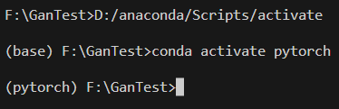
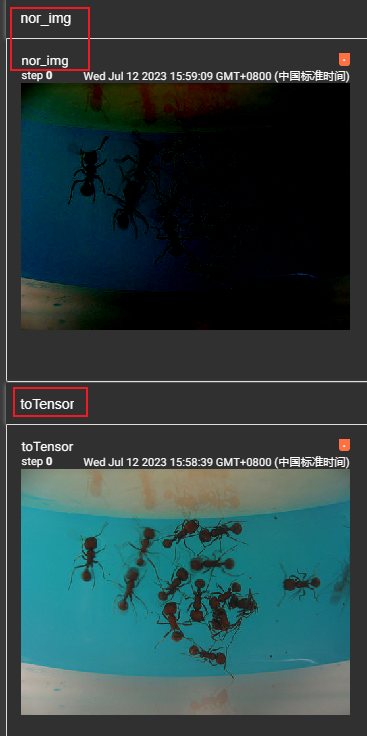

# 一、安装

>  [Anaconda的卸载与安装（tensorflow+Keras+spyder+添加镜像源）_anaconda卸载keras_Inochigohan的博客](https://blog.csdn.net/Inochigohan/article/details/120400990) 
>
>  [Pytorch安装教程，基于Pycharn和vscode ](https://zhuanlan.zhihu.com/p/419215964) 
>
>  [ 解决VScode中无法激活conda虚拟环境的问题](https://blog.csdn.net/jujudeyueyue/article/details/123255940) 
>
>  [解决Win10 PowerShell无法激活Anaconda环境的问题 ](https://www.cnblogs.com/dereen/p/ps_conda_env.html) 
>
>  [添加清华镜像源](https://www.cnblogs.com/canneddream/p/17012219.html)
>
>  [添加阿里镜像源](https://developer.aliyun.com/mirror/anaconda/)
>
>  [anaconda的pkgs目录以及清除](https://www.jb51.net/article/266999.htm)

## VSCode环境

### (1)运行

- 必须是cmd下，才可以激活pytorch虚拟环境
- 必须先激活pytorch环境



### (2)调试

> 参考—— [ Vscode工作区调试（虚拟环境）配置](https://blog.csdn.net/q1_6_2_what_123/article/details/109125858) 

- 首先在调试区的`lauch.json`添加想要调试的虚拟环境路径

  > 

- 然后选择添加调试名进行调试

  > 

## 1.conda命令

>  [conda创建、查看、删除虚拟环境（anaconda命令集](https://blog.csdn.net/miracleoa/article/details/106115730) 
>
>  [出现：DEBUG:urllib3.connectionpool](https://blog.csdn.net/weixin_64546620/article/details/132274964)

### pip安装镜像

> ```shell
> pip install -i https://pypi.tuna.tsinghua.edu.cn/simple [包名]
> ```

**配置代理：**

> https://zhuanlan.zhihu.com/p/371953325

## 2.问题

### (1)cannot import name 'OrderedDict' from 'typing'

导入`import torchvision`模块运行时候报错 

`cannot import name 'OrderedDict' from 'typing'`

网上查资料发现是pytorch和python版本不对应的原因，更新pytorch环境的python版本即可

```shell
conda install python==3.7.2 -n 要更新环境的名字，这里环境名是pytorch
```

> 参考—— [ ImportError: cannot import name ‘OrderedDict‘ from ‘typing‘的解决办法](https://blog.csdn.net/weixin_42092516/article/details/128405985) 


### (2)虚拟环境包无法自动补全

>   参考——[vscode python 第三方库自动补全 第三方库的智能提示](https://blog.csdn.net/weixin_40583088/article/details/119685872) 

**①首先，先卸载Pylance**

**②配置setting——python——setting.json**

插入三方包的路径


**③然后再次安装pylance，重启vscode即可**


### （3）打包环境

```shell
pip install conda-pack

conda pack -n my_env

#如果是prefix
conda pack -p my_env
```


## 3.pycharm配置jupyter

> https://blog.csdn.net/Julse/article/details/102543897

# 二、Base


## 1.Pytorch简介

从[官网]( [torchvision — Torchvision 0.15 documentation (pytorch.org)](https://pytorch.org/vision/stable/index.html) )介绍来看，`Pytorch`提供了很多用于深度学习数据处理的工具，包括

- `torchaudio`
- `torchvision`
- `torchtext`
- `torcharrow`
- `ToechData`
- `TorchRec`
- `TorchServe`
- `TorchX`


## 2.Torch

### 2.1 torch.utils

#### (1)数据加载

##### 1)dataset

`torch.utils.data.datasets` 是一个通用的数据集加载模块，可以用于加载任何类型的数据集。 （如果处理图片数据，可以用`torchvision里面的datasets`，里面已经有很多可以使用的图片数据集供下载使用）

**exp:**

> ```python
> from torch.utils.data import Dataset
> from PIL import Image
> import os
> 
> class MyData(Dataset):
> 
>     def __init__(self, root_dir, label_dir):
>         self.root_dir = root_dir
>         self.label_dir = label_dir  # 训练数据相对路径
>         self.path = os.path.join(self.root_dir, self.label_dir)  # 将根路径和标签路径结合
>         self.img_path_lis = os.listdir(self.path)  # 将这个路径下的文件列出
> 	
>     # 重写getter方法
>     def __getitem__(self, idx):
>         img_name = self.img_path_lis[idx]
>         img_item_path = os.path.join(self.path, img_name)
>         img = Image.open(img_item_path)
>         label = self.label_dir
>         return img, label
> 
>     # 返回训练数据集列表长度
>     def __len__(self):
>         return len(self.img_path_lis)
> 
> root_dir = 'dataset\\hymenoptera_data\\train'
> ants_label_dir = 'ants'
> ants_dataset = MyData(root_dir, ants_label_dir)
> ```

**上面是针对形式为如下数据集的数据加载**

```
---data
   |___train
   	   |___ants
   	   |___bees
```

还有可能是label和图片分开


##### 2)dataloader

 `Dataset`负责生产数据，`torch.utils.data.DataLoader`负责数据的`分批（batch_size）`、`采样(sampler)`、`传输 `

```python
DataLoader(dataset, batch_size=1, shuffle=False, sampler=None,
           batch_sampler=None, num_workers=0, collate_fn=None,
           pin_memory=False, drop_last=False, timeout=0,
           worker_init_fn=None, *, prefetch_factor=2,
           persistent_workers=False)
```

> - dataset(Dataset)：传入的数据集
> - batch_size(int, optional)：每个`batch`有多少个样本
> - shuffle(bool, optional)：在每个`epoch`开始的时候，对数据进行重新打乱
> - sampler(Sampler, optional)：自定义从数据集中取样本的策略，如果指定这个参数，那么shuffle必须为False
> - batch_sampler(Sampler, optional)：与sampler类似，但是一次只返回一个`batch的indices`（索引），需要注意的是，一旦指定了这个参数，那么`batch_size,shuffle,sampler,drop_last`就不能再制定了（互斥——Mutually exclusive）
> - num_workers (int, optional)：这个参数决定了有几个进程来处理`data loading`。0意味着所有的数据都会被load进主进程。（默认为0）
> - collate_fn (callable, optional)：将一个list的sample组成一个mini-batch的函数
> - pin_memory (bool, optional)：如果设置为True，那么`data loader`将会在返回它们之前，将tensors拷贝到CUDA中的固定内存（`CUDA pinned memory`）中.
> - drop_last (bool, optional)：如果设置为True：这个是对最后的未完成的batch来说的，比如你的batch_size设置为64，而一个epoch只有100个样本，那么训练的时候后面的36个就被扔掉了…
>   如果为False（默认），那么会继续正常执行，只是最后的batch_size会小一点。
> - timeout(numeric, optional)：如果是正数，表明等待从worker进程中收集一个batch等待的时间，若超出设定的时间还没有收集到，那就不收集这个内容了。这个numeric应总是大于等于0。默认为0
> - worker_init_fn (callable, optional)：每个worker初始化函数， 如果不是 None，则将在每个工作线程子进程上调用此操作，并在种子设定之后和数据加载之前，将工作线程 `ID（[0， num_workers - 1] 中的 int）`作为输入。

> **例子：**
>
> ```python
> import torchvision
> from torch.utils.data import DataLoader
> set_transform = torchvision.transforms.Compose([
>     torchvision.transforms.ToTensor()
> ])
> train_set = torchvision.datasets.CIFAR10(root="./data",train=True,transform=set_transform)
> test_set = torchvision.datasets.CIFAR10(root="./data",train=False,transform=set_transform)
> test_loader = DataLoader(test_set,batch_size=4,shuffle=True,num_workers=0)
> 
> print(test_set[0])
> 
> for data in test_loader:
>     img,target = data
>     print(img.shape)
>     print(target)
> ```
>
> 
>
> > `torch.Size()`的三个参数分别表示：`有4个数据(batch_size)`，`3个通道`，`height`，`width`


##### 3)Tensor类型

###### Tensor变形

> **参考：**
>
> [view和reshape细微区别](https://funian788.github.io/post/pytorch-view-reshape/)
>
> [view vs reshape](https://stackoverflow.com/questions/49643225/whats-the-difference-between-reshape-and-view-in-pytorch)

-------------

**(1) flatten()**

**将矩阵降维成1维**

```python
t = torch.tensor([[[1, 2],
                   [3, 4]],
                  [[5, 6],
                   [7, 8]]])
torch.flatten(t)
torch.flatten(t, start_dim=1)
```

------------

**(2) view()**

`torch.Tensor.view()`通过**共享内存地址**的方式使用原tensor的基础数据，通过改变数据读取方式来返回一个具有新shape的新tensor；只能使用`torch.Tensor.view()`方式调用；在使用时要求新shape与原shape的尺寸兼容，即函数只能应用于**内存中连续存储**的tensor，使用`transpose`、`permute`等函数改变tensor在内存内连续性后需使用`contiguous()`方法返回拷贝后的值再调用该函数。 

```python
import torch

a = torch.arange(24).view(1,2,3,4)
b = a.view(1,3,2,4)     # b.shape: 1 * 3 * 2 * 4  
c = a.transpose(1,2)    # c.shape: 1 * 3 * 2 * 4
# d = c.view(2, 12)     # raise error because of the uncontinuous data.
d = c.contiguous().view(2, 12)
print(b)
'''
tensor([[[[ 0,  1,  2,  3],
          [ 4,  5,  6,  7]],

         [[ 8,  9, 10, 11],
          [12, 13, 14, 15]],

         [[16, 17, 18, 19],
          [20, 21, 22, 23]]]])
'''
print(c)
'''
tensor([[[[ 0,  1,  2,  3],
          [12, 13, 14, 15]],

         [[ 4,  5,  6,  7],
          [16, 17, 18, 19]],

         [[ 8,  9, 10, 11],
          [20, 21, 22, 23]]]])
'''
print(id(b) == id(c))           # False
print(id(b.data) == id(c.data)) # True

b[0, 0, :, :] = 100
print(a, b) # 'a' will also change its data.
```

------------

**(3) torch.reshape()**

`torch.reshape()`通过拷贝(copy)并使用原tensor的基础数据(而**非共享内存地址**)以返回一个具有新shape的新tensor；可使用`torch.reshape()`或`torch.Tensor.reshape()`方法调用。此函数不依赖tensor在内存的连续性，当内存连续时，该函数与`torch.view()`函数等价，当内存不连续时，会自动复制后再改变形状，相当于`contiguous().view()`。此函数于Pytorch0.4时加入，解决了之前只有`view`函数时的部分遗留问题。 

```python
import torch
a = torch.zeros(3, 2)
b = a.reshape(6)
c = a.t().reshape(6)
a.fill_(1)
print(b)    # tensor([1., 1., 1., 1., 1., 1.])
print(c)    # tensor([0., 0., 0., 0., 0., 0.])
```


> **如果只想重塑张量，使用`torch.reshape`. 如果还担心内存使用情况并希望确保两个张量共享相同的数据，使用`torch.view`. **

--------------

#### (2)Tensorboard

> 参考—— [TensorBoard使用教程](https://zhuanlan.zhihu.com/p/471198169) 
>
>  [Tensorboard的使用 ---- SummaryWriter类（pytorch版](https://blog.csdn.net/qq_41764621/article/details/126210936) 

 TensorBoard 是一组用于数据可视化的工具。 主要功能包括：

- 可视化模型的网络架构
- 跟踪模型指标，如损失和准确性等
- 检查机器学习工作流程中权重、偏差和其他组件的直方图
- 显示非表格数据，包括图像、文本和音频
- 将高维嵌入投影到低维空间


##### 1)add_scalar

有以下参数:

> - `tag`：数据标识
> - `scalar_value `：y轴，对应数值
> - `global_step`：X轴，对应的步长


**example**

```python
from torch.utils.tensorboard import Summarywrite

writer = Summarywrite("log")  #对应的结果存储到log目录下面
for i in range(100):
    writer.add_scalar('y=x', i, i)
writer.close()
```

需要先启动`TensorBoard`

```shell
tensorboard --logdir=<directory_name> --port=[指定端口] #directory_name 为保存数据的目录。 默认是“logs”
```

然后运行代码，之后访问启动之后提供了网址


##### 2)add_image

> 参考——
>
>  [add_scalar与add_image](https://blog.csdn.net/weixin_38132153/article/details/107362650) 
>
>  [tansorboard (add_scalar、add_image) 参数详解](https://blog.csdn.net/qq_38737428/article/details/121720853) 

> - `tag (string)`: 数据标签
> - `img_tensor (torch.Tensor, numpy.array, or string/blobname)`: 图片数据，只能是括号中的类型
> - `global_step (int)`:   第几张图片 ，如果tag重名，出现scrollBar可以拖拽选择图片
> - `walltime (float)`:   记录发生的时间，默认为 time.time() ，
> -  dataformats (string, optional): 图像数据的格式(排列情况)， 默认`CHW(channel，height，width)`，`tensor是CHW，numpy是HWC `

**exp**:

> **引入numpy类型**
>
> ```python
> from torch.utils.tensorboard import SummaryWriter
> from PIL import Image
> import numpy as np
> writer = SummaryWriter("logs")  #对应的结果存储到log目录下面
> imag_path = '../pytorchTest/data/testTensorboard/train/ants_image/0013035.jpg' #图片相对路径
> img_PIL = Image.open(imag_path) # 打开图片
> img_array = np.array(img_PIL) # 因为writer.add_image需要传入类型是
> 
> print(type(img_array))
> print(img_array.shape)
> 
> writer.add_image("test",img_array,global_step=2,dataformats='HWC')
> writer.close()
> ```

> **引入tensor类型**
>
> ```python
> from torch.utils.tensorboard import SummaryWriter
> import cv2
> from torchvision import transforms
> 
> writer = SummaryWriter("logs")
> image = cv2.imread('C:/Users/msi/Desktop/20200103_212904.jpg')
> print(image.shape)
> tran = transforms.ToTensor()
> img_tensor = tran(image)
> 
> print(img_tensor.shape)
> writer.add_image("test", img_tensor, 1)
> 
> writer.close()
> ```


##### 3)问题

打开tensorboard界面，没有运行数据。发现是因为没有找到日志文件原因，在启动tensorboard时候放入日志文件的绝对路径即可：


### 2.2 torch.nn

> **torch.nn包括的模块**
>
> - Containers
> - Convolution Layers
> - Pooling layers
> - Padding Layers
> - Non-linear Activations (weighted sum, nonlinearity)
> - Non-linear Activations (other)
> - Normalization Layers
> - Recurrent Layers
> - Transformer Layers
> - Linear Layers
> - Dropout Layers
> - Sparse Layers
> - Distance Functions
> - Loss Functions
> - Vision Layers
> - Shuffle Layers
> - DataParallel Layers (multi-GPU, distributed)
> - Utilities
> - Quantized Functions
> - Lazy Modules Initialization

#### (1)Containers

##### Module

所有神经网络模块的基类。自己写的模型也应该对此类进行子类化。

> **例子：**
>
> ```python
> import torch.nn as nn
> import torch.nn.functional as F
> 
> class Model(nn.Module):
>  def __init__(self):
>      super().__init__()
>      self.conv1 = nn.Conv2d(1, 20, 5) #卷积
>      self.conv2 = nn.Conv2d(20, 20, 5)
> 
>  #前向传播函数
>  def forward(self, x):
>      x = F.relu(self.conv1(x)) #先卷积，然后激活函数
>      return F.relu(self.conv2(x))
> ```
>
> 

#### (2)CONV

> **参考：**
>
>  [torch.nn — PyTorch 2.0 documentation](https://pytorch.org/docs/stable/nn.html#convolution-layers) 

```python
torch.nn.Conv2d(in_channels, #输入通道数
                out_channels, 
                kernel_size, #卷积核大小
                stride=1, #步长
                padding=0, #边缘填充
                dilation=1, # 空洞卷积
                groups=1, 
                bias=True, 
                padding_mode='zeros', 
                device=None, 
                dtype=None)
```

**卷积输入和输出的大小计算公式**


> 
>
> 
>
> 输出的两个通道进行叠加

> **dilation： controls the spacing between the kernel points; **
>
>   
>
> 上图是`dilation=2`的情况
>
> **使用dilation的卷积，那么这个有效感受野会增长得更快**

##### exp

```python
from torch import nn
import torchvision
from torch.utils.data import DataLoader


# 对CIFAR10数据集进行卷积
# train = false ,使用测试数据集而不是训练数据集，因为训练数据集很大
dataset = torchvision.datasets.CIFAR10("./data/",train=False,
                                       transform= torchvision.transforms.ToTensor(),download=False)

dataloader = DataLoader(dataset=dataset,batch_size=64)

class MyModule(nn.Module):
    def __init__(self):
        super().__init__()
        self.conv2 = nn.Conv2d(in_channels=3,out_channels=6,kernel_size=3,stride=1,padding=0)

    def forward(self,input):
        input = self.conv2(input)
        return input
    
mymodule = MyModule()

kevin = MyModule()

for data in dataloader:
    img,target = data
    output = kevin(img)
    print(img.shape)
    print(output.shape)

```

> **运行结果**
>
> 
>
> > **torch.size参数解析**
> >
> > **torch.Size括号中有几个数字就是几维**
> >
> > - 第一层（最外层）中括号里面包含了两个中括号（以逗号进行分割），这就是（2，3，4）中的2
> > - 第二层中括号里面包含了三个中括号（以逗号进行分割），这就是（2，3，4）中的3，指的是第二层中括号下每个矩阵包含三个向量（张量） 
> > - 第三层中括号里面包含了四个数（以逗号进行分割），这就是（2，3，4）中的4，指的是第三个中括号，即每个向量中含四个元素（标量）。 
> >
> >  
> >
> > > 参考——https://blog.csdn.net/weixin_42802447/article/details/118394274

----


#### (3)Pooling

> **参考：**
>
>  [pooling — PyTorch 2.0 documentation](https://pytorch.org/docs/stable/nn.html#pooling-layers) 

```python
# 以2维最大池化为例
torch.nn.MaxPool2d(kernel_size, stride=None, padding=0, dilation=1, 
                   return_indices=False, 
                   ceil_mode=False)#如果为true，小数向上取整(ceil)，反之向下取整(floor)
```

> **ceil_mode**
>
> 

> **一维池化和二维池化的主要区别在于**，一维池化适用于时间序列数据或一维信号数据等一维数据，而二维池化适用于图像等二维数据。

##### exp

```python
import torch
from torch import nn 

data = torch.tensor([[1,2,0,3,1],
                    [0,1,2,3,1],
                    [1,2,1,0,0],
                    [5,2,3,1,1],
                    [2,1,0,1,1]],dtype=torch.float32)#要制定type为浮点数，否则默认为int

data = torch.reshape(data,(-1,1,5,5))#将数据转换为1维，5行，5列（第一个参数如果不确定一概填-1）
class MyPool(nn.Module):
    def __init__(self):
        super().__init__()
        self.maxpool = nn.MaxPool2d(kernel_size=3,ceil_mode=True)

    def forward(self,input):
        output = self.maxpool(input)
        return output
    
mypool = MyPool()
output = mypool(data)
print(output)


#输出：
tensor([[[[2., 3.],
          [5., 1.]]]])
```

```python
#如果将ceil_mode设为false，则输出为
tensor([[[[2.]]]])
```


-----------

#### (4)non-linear-activation

> **参考：**
>
>  [non-linear-activation](https://pytorch.org/docs/stable/nn.html#non-linear-activations-weighted-sum-nonlinearity) 

-----------

##### Relu


```python
import torch
from torch import nn

data = torch.tensor([[1,2],[-1,3]],dtype=torch.float32)
data = torch.reshape(data,(-1,1,2,2))
# print(data)

class MyNonLinear(nn.Module):
    def __init__(self):
        super().__init__()
        self.myRelu = nn.ReLU()

    def forward(self,input):
        output = self.myRelu(input)
        return output
    
myNon = MyNonLinear()
print(myNon(data))

##输出
tensor([[[[1., 2.],
          [0., 3.]]]])
```


-----


##### sigmoid


```python
import torch
from torch import nn


data = torch.tensor([[1,2],[-1,3]],dtype=torch.float32)

data = torch.reshape(data,(-1,1,2,2))
# print(data)

class MyNonLinear(nn.Module):
    def __init__(self):
        super().__init__()
        # self.myRelu = nn.ReLU()
        self.mySigmoid = nn.Sigmoid()
    def forward(self,input):
        output = self.mySigmoid(input)
        return output
    
myNon = MyNonLinear()
print(myNon(data))

###输出
tensor([[[[0.7311, 0.8808],
          [0.2689, 0.9526]]]])
```


-----------

#### (5)nn.Linear()

> 参考:
>
>  [PyTorch的nn.Linear](https://blog.csdn.net/qq_42079689/article/details/102873766?ydreferer=aHR0cHM6Ly9jbi5iaW5nLmNvbS8%3D) 
>
> [nn.Linear(a,b)代表什么](https://blog.csdn.net/adreammaker/article/details/126507184)

 `nn.Linear（）`用于设置网络中的**全连接层的** 

**在二维图像处理的任务中，全连接层的输入与输出一般都设置为二维张量，形状通常为`[batch_size, size]`** 

```
`nn.Linear(in_features,out_features,bias=True)`
```

> - `in_features`指的是输入的二维张量的大小，即**输入的**`[batch_size, size]`中的`size`。
> - `out_features`指的是输出的二维张量的大小，即**输出的二维张量的形状为**`[batch_size，output_size]`，当然，它也代表了**该全连接层的神经元个数**。 

> **例1：**
>
> ```python
> net = nn.Sequential(
> 		#第一层
>         nn.Linear(5, 3),
>         nn.ReLU(),
>         #第二层
>         nn.Linear(3, 2),
>         nn.ReLU(),
> 		#第三层(输出层)
>         nn.Linear(2, 1)
>         )
> ```
>
> 将其可视化
>
>   
>
>  **nn.Linear(5, 3) 这句话,代表了网络的第一层,它有5个输入和3个输出.**
>
> > 上面这句话意思是，最左边为样本的五个特征，
> >
> > 
> >
> > 如何让其变为三个特征，运用矩阵相乘的公式可以得知
> > $$
> > [x_1,x_2,x_3,x_4,x_5]_{1×5} × W_{5×3} = [x_{new1},x_{new2},x_{new3}]
> > $$
> > nn.Linear(5,3)这句话的目的,输入的是5维，输出要是3维，也就是生成一个`W 5 × 3 `来对特征的维度进行变换 
> >
> > 
>
> **demo**
>
> ```python
> import torch
> from torch import nn
> 
> data = torch.tensor([[1,2],[-1,3]],dtype=torch.float32)
> 
> data = torch.flatten(data)
> # print(data)
> myLin = nn.Linear(4,2)
> out = myLin(data)
> print(out)
> ```

> **例2：**
>
> ```python
> import torch as t
> from torch import nn
> 
> # in_features由输入张量的形状决定，out_features则决定了输出张量的形状 
> connected_layer = nn.Linear(in_features = 64*64*3, out_features = 1)
> 
> # 假定输入的图像形状为[64,64,3]
> input = t.randn(1,64,64,3)
> 
> # 因为在将四维张量转换为二维张量之后，才能作为全连接层的输入
> input = input.view(1,64*64*3)# 展开成1维
> print(input.shape)
> output = connected_layer(input) # 调用全连接层
> print(output.shape)
> ```
>
> ```python
> # 输出结果
> input shape is %s torch.Size([1, 12288])
> output shape is %s torch.Size([1, 1])
> ```

----------

#### (6)Loss Function

##### functions：

**1) L1LOSS()**

```python
torch.nn.L1Loss(size_average=None, reduce=None, reduction='mean')
# reduction 可以选择mean或sum，前者损失值求平均，后者不求平均
```

计算公式是：
$$
l_n = | x_n - y_n|
$$

> ```python
> import torch
> from torch import nn
> 
> output = torch.tensor([1,2,4],dtype=torch.float32)
> target = torch.tensor([1,2,6],dtype=torch.float32)
> 
> loss = nn.L1Loss()
> resLoss = loss(output,target)
> print(resLoss)
> 
> #输出
> tensor(0.6667)
> 
> # 如果参数修改：
> loss = nn.L1Loss(reduction="sum")
> #输出
> tensor(2.)
> ```

-------------

**2) MSELOSS**
$$
l_n=(x_n−y_n)^2
$$

---------------

**3) CROSSENTROPYLOSS**

交叉熵损失

> 参考：[交叉熵损失](https://blog.csdn.net/geter_CS/article/details/84857220)


> ```python
> import torch
> from torch import nn
> import torchvision
> from torch.utils.data import DataLoader
> 
> dataset = torchvision.datasets.CIFAR10('../data',train=False,transform=torchvision.transforms.ToTensor(),download=True)
> 
> dataloader = DataLoader(dataset,batch_size = 1)
> 
> class MyModule(nn.Module):
> 
>     def __init__(self):
>         super().__init__()
>         self.seq = nn.Sequential(
>             nn.Conv2d(in_channels=3,out_channels=32,kernel_size=5,padding=2),#通过计算得到，要想output的size为32*32，padding最小取2
>             nn.MaxPool2d(kernel_size=2),
>             nn.Conv2d(32,32,5,padding=2),
>             nn.MaxPool2d(kernel_size=2),
>             nn.Conv2d(32,64,5,padding=2),
>             nn.MaxPool2d(kernel_size=2),
>             nn.Flatten(),
>             nn.Linear(64*4*4,64),
>             nn.Linear(64,10)
>         )
> 
>     def forward(self,x):
>         x = self.seq(x)
>         return x
>     
> mymo = MyModule()
> myLoss = nn.CrossEntropyLoss()
> for data in dataloader:
>     img,target = data
>     output = mymo(img)
>     result_loss = myLoss(output,target)#计算损失值
>     result_loss.backward()#反向传播
>     print(result_loss)
> ```

------

**4) BCELoss()**

> 参考—— [torch.nn.BCELoss()](https://blog.csdn.net/qq_43115981/article/details/115357685) 

`BCELoss()`是计算目标值和预测值之间的二进制[交叉熵](https://so.csdn.net/so/search?q=交叉熵&spm=1001.2101.3001.7020)损失函数。

> 第一个参数是预测值，也就是判别器得到的结果
>
> 第二个参数是标签值，就是与预测值进行损失计算，看判别器的判别结果是否正确。

----

##### backward

损失函数的值可以作为反向传播的依据，并以此做优化

```python
import torch
from torch import nn,optim
import torchvision
from torch.utils.data import DataLoader

dataset = torchvision.datasets.CIFAR10('../data',train=False,transform=torchvision.transforms.ToTensor(),download=False)

dataloader = DataLoader(dataset,batch_size = 1)

class MyModule(nn.Module):

    def __init__(self):
        super().__init__()
        self.seq = nn.Sequential(
            nn.Conv2d(in_channels=3,out_channels=32,kernel_size=5,padding=2),#通过计算得到，要想output的size为32*32，padding最小取2
            nn.MaxPool2d(kernel_size=2),
            nn.Conv2d(32,32,5,padding=2),
            nn.MaxPool2d(kernel_size=2),
            nn.Conv2d(32,64,5,padding=2),
            nn.MaxPool2d(kernel_size=2),
            nn.Flatten(),
            nn.Linear(64*4*4,64),
            nn.Linear(64,10)
        )

    def forward(self,x):
        x = self.seq(x)
        return x
    
mymo = MyModule()
myLoss = nn.CrossEntropyLoss()
myoprim = optim.SGD(mymo.parameters(),lr=0.01)# lr代表learning rate
for data in dataloader:
    img,target = data
    output = mymo(img)
    result_loss = myLoss(output,target)
    myoprim.zero_grad()#将之前的梯度清零，避免影响下一次优化
    result_loss.backward()
    myoprim.step()#进行优化
    print(result_loss)
```


---------

#### (7)sequential

将一连串的网络操作放进sequential容器里面，链式调用每一层网络操作，简化了复杂的网络调用

```python
# Using Sequential to create a small model. When `model` is run,
# input will first be passed to `Conv2d(1,20,5)`. The output of
# `Conv2d(1,20,5)` will be used as the input to the first
# `ReLU`; the output of the first `ReLU` will become the input
# for `Conv2d(20,64,5)`. Finally, the output of
# `Conv2d(20,64,5)` will be used as input to the second `ReLU`
model = nn.Sequential(
          nn.Conv2d(1,20,5),
          nn.ReLU(),
          nn.Conv2d(20,64,5),
          nn.ReLU()
        )

# Using Sequential with OrderedDict. This is functionally the
# same as the above code
model = nn.Sequential(OrderedDict([
          ('conv1', nn.Conv2d(1,20,5)),
          ('relu1', nn.ReLU()),
          ('conv2', nn.Conv2d(20,64,5)),
          ('relu2', nn.ReLU())
        ]))
```


##### exp:

> 通过下面图的网络过程来简单涉及一个CNN
>
> 
>
> ```python
> from torch import nn
> import torch
> 
> class MyModule(nn.Module):
> 
>     def __init__(self):
>         super().__init__()
>         self.seq = nn.Sequential(
>             nn.Conv2d(in_channels=3,out_channels=32,kernel_size=5,padding=2),#通过计算得到，要想output的size为32*32，padding最小取2
>             nn.MaxPool2d(kernel_size=2),
>             nn.Conv2d(32,32,5,padding=2),
>             nn.MaxPool2d(kernel_size=2),
>             nn.Conv2d(32,64,5,padding=2),
>             nn.MaxPool2d(kernel_size=2),
>             nn.Flatten(),
>             nn.Linear(64*4*4,64),
>             nn.Linear(64,10)
>         )
> 
>     def forward(self,x):
>         x = self.seq(x)
>         return x
>     
> mymo = MyModule()
> input = torch.ones((64,3,32,32))#用测试数据测试网络正确性
> output = mymo(input)
> print(output.shape)
> ```
>
> ```
> 输出：
> torch.Size([64, 10])
> ```

------------

### 2.3 torch.optim

> 参考：
>
> [pytorch_optim](https://pytorch.org/docs/stable/optim.html)

优化器，通过损失函数反向传播降低梯度

```python
import torch
from torch import nn,optim
import torchvision
from torch.utils.data import DataLoader

dataset = torchvision.datasets.CIFAR10('../data',train=False,transform=torchvision.transforms.ToTensor(),download=False)

dataloader = DataLoader(dataset,batch_size = 1)

class MyModule(nn.Module):

    def __init__(self):
        super().__init__()
        self.seq = nn.Sequential(
            nn.Conv2d(in_channels=3,out_channels=32,kernel_size=5,padding=2),#通过计算得到，要想output的size为32*32，padding最小取2
            nn.MaxPool2d(kernel_size=2),
            nn.Conv2d(32,32,5,padding=2),
            nn.MaxPool2d(kernel_size=2),
            nn.Conv2d(32,64,5,padding=2),
            nn.MaxPool2d(kernel_size=2),
            nn.Flatten(),
            nn.Linear(64*4*4,64),
            nn.Linear(64,10)
        )

    def forward(self,x):
        x = self.seq(x)
        return x
    
mymo = MyModule()
myLoss = nn.CrossEntropyLoss()
myoprim = optim.SGD(mymo.parameters(),lr=0.01)# lr代表learning rate
for data in dataloader:
    img,target = data
    output = mymo(img)
    result_loss = myLoss(output,target)
    myoprim.zero_grad()#将之前的梯度清零，避免影响下一次优化
    result_loss.backward()
    myoprim.step()#进行优化
    print(result_loss)
```


### 2.4 模型保存和加载

有两种方式保存模型

> - **模型结构+模型参数**
>
>   > ```python
>   > from torchvision import models
>   > from torch import nn
>   > import torch
>   > 
>   > resnet = models.resnet18(pretrained = True)
>   > torch.save(resnet,"resnet18_model.pth")#后缀可以自定义
>   > 
>   > #加载模型
>   > model = torch.load("resnet18_model.pth")
>   > ```
>   >
>   > 
>
> - **模型参数**
>
>   > ```python
>   > from torchvision import models
>   > from torch import nn
>   > import torch
>   > 
>   > resnet = models.resnet18(pretrained = True)
>   > torch.save(resnet.state_dict(),"resnet18_model.pth")
>   > 
>   > #加载模型
>   > resnet = models.resnet18(pretrained = False)
>   > resnet.load_state_dict(torch.load("resnet18_model.pth"))
>   > ```


### 2.5  完整训练套路


---------

## 3.TorchVision

### (1)transform

> 参考：
>
>  [pytorch中transform函数详解](https://blog.csdn.net/HMH2_YY/article/details/85099523) 

`torchvision.transforms`是pytorch中的图像预处理包，包含了很多种对**图像数据进行变换**的函数。

#### 1) compose

 Compose方法是将多种变换组合在一起。 

> ```python
> data_transforms = transforms.Compose([
>         transforms.RandomResizedCrop(224),
>         transforms.RandomHorizontalFlip(),
>         transforms.ToTensor(),
>         transforms.Normalize([0.485, 0.456, 0.406], [0.229, 0.224, 0.225])
>     ])
> ```
>
> 上述对data_transforms进行了四种变换:
>
> - 前两个是对PILImage进行的，分别对其进行随机大小和随机宽高比的裁剪，之后resize到指定大小224，以及对原始图像进行随机的水平翻转；
> - 第三个transforms.ToTensor()将PILImage转变为torch.FloatTensor的数据形式；
> - 最后一个Normalize则是对tensor进行的。
>
> > ***多种组合变换有一定的先后顺序***，处理PILImage的变换方法（大多数方法）都需要放在ToTensor方法之前，而处理tensor的方法（比如Normalize方法）就要放在ToTensor方法之后。 

> **针对PILImage的操作函数**
>
> `CenterCrop`：在图片的中间区域进行裁
> `RandomCrop`：在一个随机的位置进行裁
> `RandomHorizontalFlip`：以0.5的概率水平翻转给定的PIL图像
> `RandomVerticalFlip`：以0.5的概率竖直翻转给定的PIL图像
> `RandomResizedCrop`：将PIL图像裁剪成任意大小和纵横比
> `Grayscale`：将图像转换为灰度图像
> `RandomGrayscale`：将图像以一定的概率转换为灰度图像
> `FiceCrop`：把图像裁剪为四个角和一个中心
> `Pad`：填充
> `ColorJitter`：随机改变图像的亮度对比度和饱和度
>
> > **`RandomCrop`**
> >
> > ```python
> > from torchvision import transforms
> > from torch.utils.tensorboard import SummaryWriter
> > from PIL import Image
> > 
> > writer = SummaryWriter("logTransform")
> > img_path = 'E:\\vs-code\\pytorchTest\\data\\testTensorboard\\train\\ants_image\\5650366_e22b7e1065.jpg'
> > img_pil = Image.open(img_path) # 打开图片，得到的是pil格式
> > print(img_pil)
> > 
> > trans_totensor = transforms.ToTensor() # 转换为tensor
> > # img_tensor = trans_totensor(img_pil)
> > 
> > #随机裁剪100像素
> > resize = transforms.RandomCrop(100)
> > trans_compose = transforms.Compose([resize,trans_totensor])
> > #随机裁剪10个图像
> > for i in range(10):
> >     ima = trans_compose(img_pil)
> >     writer.add_image('crop_img',ima,global_step=i)
> > 
> > writer.close()
> > ```
> >
> > 

#### 2) toTensor

> Convert a PIL Image or ndarray to tensor and scale the values accordingly
>
>  `ToTensor()`将`shape`为`(H, W, C)`的`nump.ndarray`或`img`转为`shape`为`(C, H, W)`的`tensor` 

> ```python
> from torchvision import transforms
> from PIL import Image
> 
> img_path = '../pytorchTest/data/testTensorboard/train/ants_image/5650366_e22b7e1065.jpg'
> img_pil = Image.open(img_path) # 打开图片，得到的是pil格式
> 
> # 方法一
> trans_totensor = transforms.ToTensor() # 获取call方法引用
> img_tensor = trans_totensor(img_pil) # 转换为tensor
> print(img_tensor)
> 
> #方法二
> trans_totensor = transforms.ToTensor()(img_pil) # 转换为tensor
> print(trans_totensor)
> ```
>
> 

#### 3) Normalize

> 参考：
>
>  [ transforms.ToTensor()和归一化函数transforms.Normalize()的使用](https://blog.csdn.net/qq_51570094/article/details/123589421) 

> Normalize a `tensor` image with mean and standard deviation.
>
> 只支持`tensor`类型数据，要先将PIL数据转换成tensor
>
>  **`使用公式`"(x-mean)/std"`，将每个元素分布到(-1,1)`** 归一化操作

**参数解析：**

> **计算方式：output = (input - mean) / std**
>
> - `mean`:各通道的均值
> - `std`：各通道的方差
> - `inplace`：是否原地操作 

> **exp：**
>
> ```python
> from torchvision import transforms
> from torch.utils.tensorboard import SummaryWriter
> from PIL import Image
> 
> writer = SummaryWriter("logTransform")
> img_path = 'E:\\vs-code\\pytorchTest\\data\\testTensorboard\\train\\ants_image\\5650366_e22b7e1065.jpg'
> img_pil = Image.open(img_path) # 打开图片，得到的是pil格式
> 
> # 转换为tensor然后添加图片
> trans_totensor = transforms.ToTensor() 
> img_tensor = trans_totensor(img_pil)
> writer.add_image('toTensor',img_tensor=img_tensor)
> 
> #进行归一化，再添加图片
> trans_normalization = transforms.Normalize([0.5,0.5,0.5],[0.5,0.5,0.5])
> res_nor = trans_normalization(img_tensor)
> writer.add_image('nor_img',res_nor)
> 
> writer.close()
> ```
>
> 


### (2) datasets

`Torchvision`在模块中提供了许多内置数据集，以及用于构建自己的数据集的实用程序类：`torchvision.datasets` 。`torchvision.datasets` 还包含一些常用的计算机视觉数据集的预处理和转换函数，例如随机裁剪、随机旋转等 

> `torchvision.datasets` 是 `torch.utils.data.datasets`的子类

> 包括数据集：
>
> - MNIST
> - COCO（用于图像标注和目标检测）(Captioning and Detection)
> - LSUN Classification
> - ImageFolder
> - Imagenet-12
> - CIFAR10 and CIFAR100
> - STL10

#### 1）CIFAR10

官网文档有数据集对象的使用方法和参数

```python
root (string) –数据集的根目录，其中目录存在，或者如果下载设置为 True，则将保存到该目录。

train (bool, optional) – 如果为 True，则从训练集创建数据集，否则从测试集创建数据集。

transform (callable, optional) –  一个函数/转换，用于接收 PIL 图像并返回转换后的版本。例如，

target_transform (callable, optional) – 接收目标并对其进行转换的函数/转换。

download (bool, optional) –  如果为 true，则从互联网下载数据集并将其放在根目录中。如果数据集已下载，则不会再次下载。
```

> ```python
> import torchvision
> 
> train_set = torchvision.datasets.CIFAR10(root="./data",train=True,download=False)
> test_set = torchvision.datasets.CIFAR10(root="./data",train=False,download=False)
> 
> print(test_set[0])
> img,target = test_set[0]
> print(img) # 图片对象
> print(target) # 图片的标签
> 
> #标签对应的名称可以再classes属性看到
> test_set.classes
> 
> #显示图片
> img.show()
> ```
>
> 
>
> **批量转换为tensor类型**
>
> ```python
> import torchvision
> 
> set_transform = torchvision.transforms.Compose([
>     torchvision.transforms.ToTensor()
> ])
> train_set = torchvision.datasets.CIFAR10(root="./data",train=True,transform=set_transform,download=False)
> test_set = torchvision.datasets.CIFAR10(root="./data",train=False,transform=set_transform,download=False)
> 
> print(test_set[0])
> ```
>
> 


### (3)models

> 参考：
>
> [torchvision.models](https://pytorch.org/vision/stable/models.html)

包含了很多图像处理的网络模型，可以拿来直接使用和更改

#### ResNet

> 以残差网络为例子：
>
> ```python
> from torchvision.models import resnet50, ResNet50_Weights
> 
> # Using pretrained weights:
> resnet50(weights=ResNet50_Weights.IMAGENET1K_V1)
> resnet50(weights="IMAGENET1K_V1")
> resnet50(pretrained=True)  # deprecated
> resnet50(True)  # deprecated
> 
> # Using no weights:
> resnet50(weights=None)
> resnet50()
> resnet50(pretrained=False)  # deprecated
> resnet50(False)  # deprecated
> ```
>
> ```python
> from torchvision import models
> 
> resnet = models.resnet18(pretrained = True)
> print(resnet)
> ```
>
> 上面代码，控制台会打印残差网络的结构
>
> 
>
> 如果想在模型添加自己的步骤，可以按以下操作：
>
> ```python
> from torchvision import models
> from torch import nn
> 
> resnet = models.resnet18(pretrained = True)
> resnet.add_module('add_linear',nn.Linear(1000,10))
> ```
>
> 


## 4.TorchAudio

