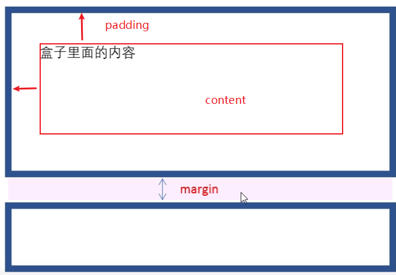

# CSS

CSS是层叠样式表(Cascading Style Sheets)简称，又称为CSS样式表或级联样式表


**构成：**

选择器 + 多条声明


**结构**


**书写格式**

-样式大小写都可以，但是尽量使用小写(特殊情况除外)

-属性值前面，冒号后面保留一个空格

-选择器(标签)和大括号中间保留空格

```css
h3 {
    color: pink;
}

H3{
    COLOR: PINK;
}
```


## 引入方式

### 1.行内样式表(内联)

行内样式在相关元素的 "style" 属性中定义：

```html
<!DOCTYPE html>
<html>
    <body>

        <h1 style="color:blue;text-align:center;">This is a heading</h1>
        <p style="color:red;">This is a paragraph.</p>

    </body>
</html>
```


### 2.内部样式表

内部样式在 HTML 页面的 <head> 部分内的 <style> 元素中进行定义：

```html
<!DOCTYPE html>
<html>
    <head>
        <style>
            body {
              background-color: linen;
            }

            h1 {
              color: maroon;
              margin-left: 40px;
            } 
        </style>
    </head>
    <body>

        <h1>This is a heading</h1>
        <p>This is a paragraph.</p>

    </body>
</html>
```


### 3.外部样式表

外部样式在 HTML 页面 <head> 部分内的 <link> 元素中进行定义：

```html
<!DOCTYPE html>
<html>
    <head>
        <link rel="stylesheet" type="text/css" href="mystyle.css">
    </head>
    <body>

        <h1>This is a heading</h1>
        <p>This is a paragraph.</p>

    </body>
</html>
```


## CSS三大特性：

**(1)层叠性：**

相同选择器给设置相同样式，此时最后设置的样式覆盖前面的样式

```css
div {
	color: red;
}

div {
    color: green;/*覆盖之前的样式*/
}
```


**(2)继承性：**

子标签会继承父标签*某些*样式，如文本颜色、字号

```css
div{
    color: pink;/*子标签字体颜色会变为粉色*/
}


<div>
	<p>继承</p>
</div>
```

```
一般继承(text- , font- , line- 开头的元素)
```


**继承性还用在行高的设置上面:**

后面不带单位，代表***行高就为前面字体大小乘以该小数***

```css
body {
    font: 12px/1.5 'Microsoft YaHei';/*此处1.5没有带单位，代表了子元素行高为：子元素fontsize × 1.5 */
}

/*子元素p*/
p {
    font-size: 14px;/*此时子元素真正的行高为14 × 1.5*/
}
```


**(3)优先级**

归纳起来就是选择器越精确，越靠近选择的标签，则优先级越高


```css
div {
    color: pink!important/*优先级最高*/
}
```


**复合选择器权重会叠加：**

```css
/*权重为 0,0,0,1 +0,0,0,1 = 0,0,0,2*/
ul li{
    color: green;
}
```


## 一.选择器

**选择器作用**

选择特定标签，然后将属性值赋给对应标签


### 1.基础选择器

#### (1)标签(元素)选择器

元素选择器根据元素名称来选择 HTML 元素。

在这里，页面上的所有 <p> 元素都将居中对齐，并带有红色文本颜色：

```css
p {
  text-align: center;
  color: red;
}
```


#### (2)类选择器

类选择器选择有特定 class 属性的 HTML 元素。

如需选择拥有特定 class 的元素，请写一个句点（.）字符，后面跟类名。

```css
//在此例中，所有带有 class="center" 的 HTML 元素将为红色且居中对齐：
.center {
  text-align: center;
  color: red;
}
```

```css
您还可以指定只有特定的 HTML 元素会受类的影响。

实例
//在这个例子中，只有具有 class="center" 的 <p> 元素会居中对齐：
p.center {
  text-align: center;
  color: red;
}
```


**HTML 元素也可以引用多个类。**

```html
<!--在这个例子中，<p> 元素将根据 class="center" 和 class="large" 进行样式设置：-->
 
<p class="center large">这个段落引用两个类。</p>
```

<font color="red">多类名机制可以很好地将一些共有特性抽离出来，类似于java的类</font>


#### (3)id选择器

id 选择器使用 HTML 元素的 id 属性来选择特定元素。

元素的 id 在页面中是**唯一**的，因此 id 选择器用于选择一个**唯一的元素**！

要选择具有特定 id 的元素，请写一个井号（＃），后跟该元素的 id。

```css
//这条 CSS 规则将应用于 id="para1" 的 HTML 元素：

#para1 {
  text-align: center;
  color: red;
}
```

```
注意：id名称不能以数字开头
```


#### (4)通配符选择器


```css
* {
    color: red;
}
/*将所有元素都修改样式*/
```


### 2.复合选择器

#### (1)后代选择器

又称为包含选择器，可以选择父元素里面子元素。其写法就是把外层标签写在前面，内层标签写在后面，中间用空格分隔。

```css
元素1 元素2 {
    样式声明
}
```


#### (2)子选择器

只选择作为元素**最近的一级子元素**，简单理解就是选择亲儿子元素

```css
元素1 > 元素2 {
    样式声明
}
```


#### (3)并集选择器

```css
元素一,
元素二{
    color: pink;
}
```

```
并集选择器喜欢竖着写
```


### 3.伪类选择器

伪类用于定义元素的特殊状态。

例如，它可以用于：

- 设置鼠标悬停在元素上时的样式
- 为已访问和未访问链接设置不同的样式
- 设置元素获得焦点时的样式


```css
/* 未访问的链接 */
a:link {
  color: #FF0000;
}

/* 已访问的链接 */
a:visited {
  color: #00FF00;
}

/* 鼠标悬停链接 */
a:hover {
  color: #FF00FF;
}

/* 已选择的链接 */
a:active {
  color: #0000FF;
}
```

<font color="red">**注意：**`a:hover` 必须在 CSS 定义中的 `a:link` 和 `a:visited` 之后，才能生效！`a:active` 必须在 CSS 定义中的 `a:hover` 之后才能生效！伪类名称对大小写不敏感。`LVHA`</font>

#### 伪类和 CSS 类

伪类可以与 CSS 类结合使用：

当您将鼠标悬停在例子中的链接上时，它会改变颜色：

```css
a.highlight:hover {
  color: #ff0000;
}
```

#### 伪类和元素

在 <div> 元素上使用 :hover 伪类的实例：

```css
div:hover {
  background-color: blue;
}
```


#### CSS - :first-child 伪类

:first-child 伪类与指定的元素匹配：该元素是另一个元素的第一个子元素。

```
口诀：  `:first-child` 前面是A就代表匹配首个A的。。。
```


匹配首个 <p> 元素

在下面的例子中，选择器匹配作为任何元素的第一个子元素的任何 <p> 元素：

```css
p:first-child {
  color: blue;
}
```


**匹配所有 <p> 元素中的首个 <i> 元素**

在下面的例子中，选择器匹配所有 <p> 元素中的第一个 <i> 元素：

```css
p i:first-child {
  color: blue;
}
```


#### :focus伪类选择器

用于**选取获得焦点的表单元素**(谁获得焦点，谁调用)，往往input标签类元素才能获取焦点，所以常用在input上

```css
input:focus {
    background-color: yellow;
}
```


#### 关于表单伪类选择器


## 二、基本属性

### 1.字体属性

**定义字体：**

```css
/*会按顺序匹配字体，电脑不存在则依次往后*/
body {
    font-family: "微软雅黑",Arial,sans-serif;
}
```

**文字大小**

```css
font-size: 20px;
```

**字体粗细**

```css
font-weight: normal(400)|bold(700)|../*也可以跟数字(100-900)，不用带单位*/
```

**文字样式：**

```css
font-style: italic;/*斜体*/
font-style: normal;/*使倾斜字体变正常*/
```


#### **复合写法：**

严格按照顺序书写，size 和 family不允许省略

```css
/*font: font-style font-weight font-size/line-height font-family*/
font: italic 700 60px '微软雅黑'
```


### 2.文本属性

**文本颜色：**

```css
div {
    color: red;/#FF0000;/rgb(255.0.0);/*三种表示形式*/
}
```

| 表示         | 属性值                    |
| ------------ | ------------------------- |
| 预定于颜色值 | red,green,blue            |
| 十六进制     | #FF0000 , #FF6600 #29D794 |
| RGB代码      | rgb(255.0.0)              |


**对齐文本：**

让对应容器内的文字中间对齐

```css
text-align: center；
```

| 属性值 | 释义     |
| ------ | -------- |
| left   | 左对齐   |
| right  | 右对齐   |
| center | 居中对齐 |


**装饰文本：**

```css
text-decoration: 
```

| 属性值       | 描述                   |
| ------------ | ---------------------- |
| none         | 默认                   |
| underline    | 下划线，连接自带下划线 |
| overline     | 上划线                 |
| line-through | 删除线                 |


**文本缩进**

```css
text-indent: 10px;/*首行缩进*/
```

也可以取负值，就是往-x轴缩进


<font color="red">可以使用em作为单位，1em = 16px(1em代表一个文字大小)</font>

**行间距:**

```css
line-height: 10px;
```


当然也可以用下面写法

```css
font: 16px/28px;/*代表文字大小为16，行间距为28*/
```


**当把行高和块高设置为相同值是，内容文字就能够垂直居中**

```css
a {
    display: block;
    width: 190px;
    height: 48px;
    line-height: 48px;

}
```


**文字阴影：**

```css
text-shadow: h-shadow v-shadow blur color;
```


| 值       | 描述               |
| -------- | ------------------ |
| h-shadow | 必需，水平阴影位置 |
| v-shadow | 必需，垂直阴影位置 |
| blur     | 可选，模糊距离     |
| color    | 可选，阴影颜色     |


### 3.背景属性

**(1)背景颜色：**

```css
background-color: transparent|color/*transparent是透明*/
```

**(2)背景图片：**

```css
background-image: url(images/logo.png);
```

**(3)背景平铺：**

平铺就是或让图片重复以至占满整个容器。

默认情况，背景图片是平铺的

```css
background-repeat: repeat | 
                    no-repeat | 
                    repeat-x | 沿着x轴平铺
                    repeat-y沿着y轴平铺
```

**(4)背景图片位置：**

通常插入图标或者其他的图片不适用img标签而是background-image，因为容易控制坐标

```css
background-position: x y;

/*方位*/
background-position: center top;//可以变换顺序

/*精确坐标*/
background-position: 50px 20px(x y轴)
```

| 参数值   | 说明                                                    |
| -------- | ------------------------------------------------------- |
| length   | 百分数 \| 浮点数字和单位标识符组成的长度值              |
| position | top \| center \| bottom \|left \| center \| right方位词 |

*如果只指定了一个方位名词，另一个值省略，则第二个值默认就是居中对齐*


**(5)背景图像固定(附着)**

```css
background-attachment: scroll /*随着内容滚动*/
					   | fixed;/*固定*/
```


**(6)背景复合写法：**

没有特定书写顺序，一般习惯性约定顺序

```css
background: 背景颜色 背景图片地址 背景平铺 背景图像滚动 背景图片位置
```


**(7)背景色半透明：**

```css
background: rgba(0,0,0,0.3);/*透明度从0-1*/
```

也可以通过opacity属性实现:

```css
opacity: 0.1;
```


**(8)背景图片尺寸**

``` 
background-size: length |
				percentage |
				cover |
				contain |
```

| 值         | 描述                                                         |
| ---------- | ------------------------------------------------------------ |
| length     | 设置背景图片高度和宽度。第一个值设置宽度，第二个值设置的高度。如果只给出一个值，第二个是设置为 **auto**(自动) |
| percentage | 将计算相对于背景定位区域的百分比。第一个值设置宽度，第二个值设置的高度。如果只给出一个值，第二个是设置为"auto(自动)" |
| cover      | 此时会保持图像的纵横比并将图像缩放成将完全覆盖背景定位区域的最小大小。(图片会被裁剪) |
| contain    | 此时会保持图像的纵横比并将图像缩放成将适合背景定位区域的最大大小。(图片不会被裁剪) |


### 4.元素显示、隐藏

**方法一**

```css
display: none;//隐藏元素，不再占有原来位置
		block;//显示元素（转换为块级元素）
		table;//转换为块级元素，并且一行显示
```


**方法二**

```css
visibility: hidden;//隐藏元素，但是继续占有原位置
			visible;//元素可视
```


**方法三：**

```css
overflow: hidden;//溢出部分隐藏
		  visible;//溢出的照常显示
		  auto;//只有溢出才显示滚动条
		  scroll;//不管是否溢出，添加滚动条
```


### 5.鼠标样式

```css
li {
    cursor: pointer;
}
```

| 属性值      | 描述 |
| ----------- | ---- |
| default     | 默认 |
| pointer     | 小手 |
| move        | 移动 |
| text        | 文本 |
| not-allowed | 禁止 |

### 6.表单相关操作

表单输入框默认点击会出现蓝色轮库线，使用：

```css
input {
    outline: none;//去除轮廓线
}
```


去掉textarea的自由拖拽区域

```css
textarea {
    resize: none;
}
```


### 7.vertival-align

该属性常常用于设置图片或者表单（行内块元素）和**文字垂直对齐**。

*只针对行内元素和行内块元素*

```css
vertival-align: baseline|/*元素放置在父元素基线上*/
				top|/*把元素顶端与行中最高元素顶端对齐*/
				middle|/*把此元素放置在父元素中部*/
				bottom/*把元素顶端与行中最低元素顶端对齐*/
```


## 三、布局

### 1.三大核心

#### (1)盒子模型



盒子模型组成：

- ***border边框***

  ```css
  border-width: 12px;/*定义边框粗细*/
  
  border-style: solid(实线) | dashed(虚线) | dotted(点线)/*边框样式*/
  
  border-color: /*边框颜色*/
  
  /*复合写法*/
  border: width style color;/*没有先后顺序*/
  ```

  *可以单独选择方向*：

  ```css
  border-top:
  border-bottom:
  border-left:
  border-right:
  ```

  *合并相邻边框*：

  有时候给一些元素设置边框之后，互相重叠的部分会使边框变粗(特别是表格)，这时候可以使用：

  ```css
  border-collapse: collapse;
  ```


***圆角边框***

```css
border-radius: length;/*可以写四个值：左上，右上，右下，左下*/
```

length可以是百分比，也可以是像素(px)

| 属性                       | 描述 |
| -------------------------- | ---- |
| border-top-left-radius     | 左上 |
| border-top-right-radius    | 左下 |
| border-bottom-right-radius | 右上 |
| border-bottom-left-radius  | 右下 |


***盒子阴影***

```css
box-shadow: 10px 10px 10px 10px gray;
```

| 值       | 描述                       |
| -------- | -------------------------- |
| h-shadow | 必需，水平阴影位置         |
| v-shadow | 必需，垂直阴影位置         |
| blur     | 可选，模糊距离             |
| spread   | 可选，阴影尺寸             |
| color    | 可选，阴影颜色             |
| inset    | 可选，外部阴影改为内部阴影 |


- ***content内容***

  

- ***padding内边距***

  | 属性           | 作用     |
  | -------------- | -------- |
  | padding-left   | 左内边距 |
  | padding-right  | 右内边距 |
  | padding-top    | 上内边距 |
  | padding-bottom | 下内边距 |

*复合写法*

| 值个数                       | 表达意思                         |
| ---------------------------- | -------------------------------- |
| padding: 5px;                | 上下左右都是5px内边距            |
| padding: 5px 10px;           | 上下是5px，左右是10px            |
| padding: 5px 10px 20px;      | 上是5px，左右是10px，下是20px    |
| padding: 5px 10px 20px 30px; | 依次代表上、右、下、左（顺时针） |

**！！给盒子指定了内边距之后会撑大盒子，使得盒子宽高边大**

```css
div.demo {
    width: 200px;
    height: 200px;
    background-color: #f00;
}
```


```css
/*指定了padding*/
div.demo {
    width: 200px;
    height: 200px;
    background-color: #f00;
}
```


***不会撑开padding的情况***

```css
/*当没有指定width或者height时，对应padding设置了就不会撑开，也就是说padding无效*/
div {
    padding: 20px;
}
```


*padding应用*

```
通常在做导航栏的时候，不设置每一个块元素宽度，而是指定padding，根据内容自适应，这样就会和谐很多
```


- ***margin外边距***

  | 属性          | 作用     |
  | ------------- | -------- |
  | margin-left   | 左外边距 |
  | margin-right  | 右外边距 |
  | margin-top    | 上外边距 |
  | margin-bottom | 下外边距 |

  **margin的复合写法与padding完全一致，不再赘述**


***1)外边距应用***

可以让**块级盒子**水平**居中**，但是必须满足两个条件：

①盒子必须制定宽度(width)

②盒子左右外边距都设置auto

```css
.header {
    width: 900px;
    height: 200px;
    margin:0 auto;
}
```

**如果想让行内块元素对齐，则只需要制定text-align center属性即可**


<font color="red">***2)外边距合并，嵌套块元素塌陷：***</font>

对于两个嵌套关系的块元素，父元素有上外边距同时子元素也有上外边距，此时父元素会塌陷较大的外边距值


```css
.father {
    width: 200px;
    height: 200px;
    background-color: #f00;
    font-size: 19px;

}

.son {
    width: 50px;
    height: 50px;
    margin: 20px;
    background-color: antiquewhite;
}

/*解决办法*/
①为父元素定义上边框
②为父元素定义上边距
③为父元素添加overflow:hidden;
```


***3)清除元素默认的内外边距***

很多元素都自带内外边距，所以在设计前先清零

```css
* {
    padding: 0;
    margin: 0;
}
```


***4)行内元素内外边距***

对于行内元素内外边距**只有左右有效**，设置上下行内边距是无效的

#### (2)浮动(传统布局方式之一)

#### (3)定位(传统布局方式之一)


### 2.传统布局

#### (1)标准流

就是标签按照规定好的默认方式排列

#### (2)浮动

很多布局效果，标准流没办法完成，可以利用浮动完成布局。

最典型的应用就是：让多个块级元素一行内排列显示

<font color="red">多个块级元素纵向排列找标准流，多个块级元素横向排列找浮动</font>

**1)浮动语法：**

```css
选择器 {
    float: 属性值；
}
```

| 属性值 | 描述       |
| ------ | ---------- |
| none   | 元素不浮动 |
| left   | 左浮动     |
| right  | 右浮动     |


**2)浮动特性：**

①浮动元素会脱离标准流(脱标)

- 脱离标准流控制浮动到指定位置
- 浮动的盒子不再保留原先位置

②浮动元素会一行内显示并且元素*顶部对齐*

- 浮动元素互相贴靠在一起(不会有缝隙)，如果父级宽度装不下这些浮动元素，会另起一行

③浮动元素会具有行内块元素特性

- 如果块级盒子没有设置宽度，默认宽度和父级一样宽，但是添加浮动后，大小根据内容来决定
- 浮动盒子中间没有缝隙，紧挨着一起的
- 行内元素同理


**3)浮动和标准流一起搭配**

通常是在一个标准流里面添加浮动元素，也就是**纵向靠标准流，横向靠浮动**


**4)浮动注意点：**

浮动盒子只会影响浮动盒子后面的标准流不会影响前面标准流


**5)清除浮动：**

由于网页内容很多时候不确定，所以我们往往不给标准流盒子设置高度，而是让子元素自己撑开，但是这会造成一个问题就是**如果不给父容器设置高度**而子元素设置浮动，那么就会出现父元素高度为0的问题。这就需要清除浮动

*方法一（额外标签法）*

在最后一个浮动元素后面添加一个标签(`必须是块级元素，不能是行内元素`)，然后添加属性clear


```css
选择器 {
	clear: 属性值；
}
```

| 属性值   | 描述                                   |
| -------- | -------------------------------------- |
| left     | 不允许左侧有浮动元素(清楚左侧浮动影响) |
| right    | 清除右侧浮动影响                       |
| **both** | 同时清除左右两侧浮动影响               |


*方法二*

父级添加overflow属性

```css
overflow: hidden|auto|scroll
```


*方法三*

父级添加after伪元素


*方法四*

父级添加双伪元素


#### (3)定位

定位实现在页面中可以让盒子自由在某个盒子内移动位置或者固定屏幕中某个位置，并且可以压在其他盒子上面，类似于网页中的一些导航栏


**1)定位组成**

- 定位模式

  用于指定一个元素在文档中定位的方式

- 边便宜

  决定该元素最终位置


**3)定位模式：**

通过css的position属性设置

| 值       | 语义     |
| -------- | -------- |
| static   | 静态定位 |
| relative | 相对定位 |
| absolute | 绝对定位 |
| fixed    | 固定定位 |


**①静态定位：**

就是我们常用的流式定位

```css
选择器 {
    position: static;
}
```

**②相对定位：**

相对定位是元素在移动位置时候，相对于它原来位置来说的

```css
选择器 {
    position: relative;
}
```

*特点：*

- **相对于自己原来位置移动**（移动参照点使自己原来位置），会压住其他盒子
- 原来在标准流的位置继续占有，后面盒子仍然以标准流方式对待它（**不脱标，原来位置继续保留**）

```css
.box1 {
    position: relative;
    top: 100px;
    left: 50px;
    width: 300px;
    height: 200px;
    background-color: antiquewhite;
}

.box2 {
    width: 300px;
    height: 200px;
    background-color: aqua;
}
```


**③绝对定位：**

绝对定位是元素在移动位置时候，相对于祖先元素来说的

*特点：*

- 如果**没有祖先元素**或者**祖先元素没有设置定位**，则该元素定位以浏览器为基准
- 如果**父元素有定位**(相对，绝对，固定定位)，则以**最近一级**的有定位祖先元素为参考点移动位置
- 绝对定位不再占有原来位置(脱离标准流)

> 绝对定位如何**水平居中**：
>
> 不可以使用auto来居中，但是可以使用算法：
>
> - 先移动到父容器一半：left:50%
> - margin-left: -100px代表：在现在位置基础上左走半个盒子距离


**!!!两者使用总结!!!：**

“子绝父相”：子级是绝对定位的话，父级要用相对定位：

- 子级绝对定位，不会占有位置，可以放到父盒子里面任何一个地方，不会影响其他兄弟盒子（浮动只会影响后面盒子，不会影响前面盒子）
- 父盒子需要加定位限制子盒子在父盒子内显示
- 父盒子布局时，要占有位置，因此父盒子只能是相对定位。


**4)边偏移：**

**定位的盒子移动到最终位置**，有top、bottom、left、right4个属性

| 属性   | 示例         | 描述                                         |
| ------ | ------------ | -------------------------------------------- |
| top    | top：80px    | 顶端偏移量，定义元素相对于其父元素上边线距离 |
| bottom | bottom：80px | 底部偏移量，定义元素相对于父元素下边线的距离 |
| left   | left：80px   | 左侧偏移量，定义元素相对于父元素左边线距离   |
| right  | right：80px  | 右侧偏移量，定义元素相对于其父元素右边线距离 |


**④固定定位**

固定定位是元素固定于浏览器可视区位置，主要使用场景：**可以在浏览器页面滚动时元素位置不会改变。**

```css
选择器 {position: fixed;}
```

特点：

- 跟父元素没有任何关系
- 不随滚动条滚动
- 固定定位不占有原先位置（特殊的绝对定位）


***固定定位fixed技巧：***

固定在版心右侧位置：

1)让固定定位的盒子left:50% ，走到浏览器可视区中间

2)让固定定位盒子再margin-left版心宽度一半距离。(这里是指**相对该固定盒子再右移**)

以上操作就可以让固定位置和版心右侧对齐了


```css
.box1 {
    width: 900px;
    height: 500px;
    margin: 0 auto;
    background-color: antiquewhite;
}

.box2 {
    position: fixed;
    left: 50%;

    margin-left: 450px;
    width: 60px;
    height: 150px;
    background-color: aqua;
}
```


**⑤粘性定位(sticky)：**

粘性定位可以被认为是相对定位和固定定位的混合

```css
选择器 {
    position: sticky;
    top: 10px;/*当元素距离顶部10像素时就固定了*/
}
```

特点：

- 以浏览器的可视窗口为参照点移动元素
- 粘性定位占有原先位置
- 必须添加top、left、right、bottom其中一个才有效

**注意：粘性定位的组件必须要在父布局的宽度里面滚动才生效，如果没有设置body（该粘性布局在的容器）为1000px，则粘性布局不会生效，因为滚动的是box1的内容**

```css
<style>
        body {
            height: 1000px;
        }

        .box1 {
            float: left;
            width: 900px;
            height: 1000px;
            margin: 0 auto;
            background-color: antiquewhite;
        }

        .box2 {
            position: sticky;
            top: 10px;
            left: 910px;
            width: 60px;
            height: 150px;
            background-color: aqua;
        }
    </style>
</head>

<body>


    <div class="box1"></div>
    <div class="box2"></div>

</body>
```


##### **定位的叠放次序：**

使用定位布局时，可能出现盒子重叠情况，此时，可以使用z-index来控制盒子上下次序(z轴)

```css
选择器 {
    z-index: 1;
}
```

- 数值可以是整数、负数或0（auto）
- 如果属性相同，则按照书写顺序排列
- 数字后面不加单位


##### 定位特殊特性：

①**绝对定位和固定定位也和浮动类似**：

- *行内元素*添加绝对或者固定定位，可以直接设置高度和宽度
- *块级元素*添加绝对或者固定定位，如果不给宽度或高度，默认大小是内容大小

②**绝对定位(固定定位)会完全压住盒子**：

浮动元素不同，它不会压住下面标准流盒子里面的文字，但是绝对定位会压住下面标准流所有的内容。

之所以产生这样原因是因为浮动目的最初就是为了做文字环绕效果，文字会围绕浮动元素。

#### (4)常见网页布局


### 3.Flex布局

用在移动端比较多，更加灵活，但是PC端兼容性差

> 通过给父盒子添加flex属性，来控制子盒子的位置和排列方式


#### 常见父项属性


> - flex-direction:
>
>   > | 属性           | 说明                     |
>   > | -------------- | ------------------------ |
>   > | row            | 默认，从左到右           |
>   > | row-reverse    | 从右到左                 |
>   > | column         | 从上到下，将纵轴变为主轴 |
>   > | column-reverse | 从下到上                 |
>
> - justify-content：
>
>   > | 属性          | 说明                                        |
>   > | ------------- | ------------------------------------------- |
>   > | flex-start    | 默认，从头部开始；如果主轴是x轴，则从左到右 |
>   > | flex-end      | 从尾部开始排列                              |
>   > | center        | 主轴居中对齐                                |
>   > | space-around  | 平分剩余空间                                |
>   > | space-between | 先两边贴边，再平分剩余空间                  |
>
> - flex-wrap：
>
>   > flex布局中，默认子元素不会换行
>   >
>   > | 属性   | 说明           |
>   > | ------ | -------------- |
>   > | nowrap | 默认值，不换行 |
>   > | wrap   | 换行           |
>
> - align-items
>
>   > 侧轴上子元素排列方式
>   >
>   > | 属性       | 说明         |
>   > | ---------- | ------------ |
>   > | flex-start | 从上到下     |
>   > | flex-end   | 从下到上     |
>   > | center     | 垂直居中     |
>   > | stretch    | 拉伸，默认值 |
>
> - align-content：
>
>   > 只有**换行之后**才会对所以子元素有效。
>   >
>   > 属性值和align-item类似
>   >
>   > 


#### 常见子项属性

- flex:

  > 定义子项目**分配剩余空间**，来表示占多少份数
  >
  > ```css
  > /*此时剩余空间分配份数*/
  > .item{
  >     flex:<number>
  > }
  > ```

- align-self：

  > 在父亲设置子元素排列顺序会作用在所以的子元素身上，如果想要单独给某个元素设置排列方式，可以使用这个属性

- order：

  > 子元素显示的优先级，越高的显示在越前面

## 四、CSS高级技巧

### 1.精灵图

一个网页中往往会有很多小图片作为修饰，当网页中图像过多时，服务器会频繁接收和发送请求图片，造成压力过大，这将大大降低页面加载速度。

因此，为了有效减少服务器接收和发送请求次数，提高页面加载速度，出现了CSS精灵技术(CSS Sprites)

**使用精灵技术：**

- 把多个小背景图片正和岛一张大图片中
- 这个大图片成为精灵图
- 移动图片位置，**使用background-position**移动背景图片可以达到指定地方
- 移动距离就是这个目标图片x和y坐标，注意网页中坐标有所不同


### 2.字体图标

字体图标可以为前端工程师提供一种方便高效的图标使用方式，**展示的是图标，本质属于字体**

字体图标本质是文字，可以改变颜色，大小等


**(1)字体图标下载**

- iconmoon字库 http://iconmoon.io
- iconfont字库 http://www.iconfont.cn/


**(2)如何使用：**

以iconmoon为例，

- 下载之后解压，将fonts文件夹放到html页面根目录下

- 在css样式中全局声明字体，就是引入字体，将以下代码复制到style标签里面(解压后的文件夹会有一个style.css文件)：

  

- 然后打开解压后的文件夹的demo.html

   

  复制对应的方框：


- 然后在html里面粘贴复制的方框，并且设置样式font-family为刚刚复制代码里面的font-family：

  


**追加图标：**


然后继续选择新的图标即可


### 3.制作对话框样式

```css
border-top: 10px solid pink;
border-left: 10px solid red;
border-bottom: 10px solid blue;
border-right: 10px solid green;
/*以上代码可以看出，其实如果没有指定方框宽、高，只指定边框，边框是三角形的*/
```


所以我们可以只取某一个方位的三角形设置颜色，其余的都透明就可以达到目的

```css
.box2 {
    width: 0;
    height: 0;
    border: 50px solid transparent;
    border-top-color: pink;
}
```


### 4.多余文字省略号代替：

**单行文本**

```css
/*这个单词意思是如果文字显示不开也必须强制一行*/
white-space: nowrap;
/*溢出部分隐藏*/
overflow: hidden;
/*溢出时用省略号代替*/
text-overflow: ellipsis;
```

**多行文本(设计兼容性问题)**

多文本溢出显示省略号，有较大的兼容性问题吗，适合webkit浏览器或移动端

```css
overflow: hidden;
text-overflow: ellipsis;
/*弹性伸缩盒子模型展示*/
display: -webkit-box;
/*限制在一个块元素显示的文本行数*/
-webkit-line-clamp: 2;
/*设置或检索伸缩盒子对象子元素排列方式*/
-webkit-box-orient: vertical;
```


### 5.多个盒子排列问题：

通过巧用margin-left 负值，可以使得盒子边框之间进行重叠，从而减小宽度


**鼠标移动到盒子上时边框改变：**

方法一：

鼠标移动到的盒子添加相对定位，就会覆盖其他盒子


方法二：

如果所有盒子都设置了定位，则添加优先级


### 6.CSS初始化

不同浏览器对有些标签默认值是不同的，为了消除不同浏览器对HTML文本呈现诧异，照顾浏览器的兼容，我们需要对CSS初始化。简单来说就是：重设浏览器样式

```css
* {
    margin: 0;
    padding: 0;
}

body {
    -webkit-font-smoothing: antialiased;//防止文字放大有锯齿
    font-family: '\9ED1\4F53';/*把中文字体名称用相应Unicode编码来代替，这样可以有效避免浏览器解释CSS时候出现乱码问题，
    比如 黑体\9ED1\4F53
         宋体\5B8B\4F53
    	 微软雅黑\5FAE\8F6F\96C5\9ED1
    */
}
```


## 五、CSS3

### 1.属性选择器

**权重是10**

**(1)选择具有某一些属性的元素**

```html
/*必须是input，但是同时具有value这个属性*/
input[value] {
	color: pink;
}

<input type="text" value="输入用户名"/>
```

**(2)还可以选择`属性=值`的某些元素**

```html
input[type=text]{

}

<input type="text"/>
```

**(3)还可以选择`属性值开头`的某些元素**

| 选择符      | 简介                                  |
| ----------- | ------------------------------------- |
| E[att]      | 选择具有att属性的E元素                |
| E[att=val]  | 选择具有att属性且属性值等于val的E元素 |
| E[att^=val] | 匹配具有att属性且值以val开头的E元素   |
| E[att$=val] | 匹配具有att属性且值以val结尾的E元素   |
| E[att*=val] | 匹配具有att属性且值中含有val的E元素   |


### 2.结构伪类选择器

主要根据文档结构来选择元素，常用于根据父级选择器里面的子元素

| 选择符                        | 简介                       |
| ----------------------------- | -------------------------- |
| E:first-child                 | 匹配父元素中第一个子元素E  |
| E:last-child                  | 匹配父元素中最后一个E元素  |
| E:nth-child(n)n填写选择的数字 | 匹配父元素中的第n个子元素E |
| E:first-of-type               | 指定类型E的第一个          |
| E:last-of-type                | 指定类型E的最后一个        |
| E:nth-of-type(n)              | 指定类型E的第n个           |


**E:nth-child(n)**

- n可以是数字，关键字

- n如果是公式，就是选择第n个子元素，里面数字从1开始

- n可以是关键字：**even偶数、odd基数**

- n可以是公式：常见公式如下(如果n是公式，则从0开始计算，但是第0个元素和超出元素忽略)

  | 公式 | 取值               |
  | ---- | ------------------ |
  | 2n   | 偶数               |
  | 2n+1 | 奇数               |
  | 5n   | 5 10 15 。。       |
  | n+5  | 从第五个开始到最后 |
  | -n+5 | 前五个(包括第五个) |

  

  > ```css
  > E:nth-child(even) {
  >     /*选择所有偶数孩子*/
  > }
  > 
  > E:nth-child(n) {
  >     /*选择所有孩子*/
  > }
  > ```


**E:nth-of-type(n)和nth-child(n)区别**

- nth-child(n)会**先将所有子盒子排序，然后选择第一个元素，看是否和冒号前面类型匹配**，如果匹配则执行里面属性，否则不执行

- nth-of-type(n)会把**指定元素盒子排列序号**

  ```css
  section div:nth-child(1){
      /*匹配不成功，都不选择*/
  }
  
  section div:nth-of-type(1){
      /*匹配第一个div*/
  }
  
  
  <section>
  	<p></p>
  	<div></div>
  </section>
  ```

  


### 3.伪元素选择器

伪元素选择器可以帮助我们利用CSS创建新标签元素，而不需要HTML标签。

| 选择符   | 简介                     |
| -------- | ------------------------ |
| ::before | 在元素内部的前面插入内容 |
| ::after  | 在元素内部后面插入内容   |

**注意：**

- before和after创建一个元素，但是属于行内元素
- 新创建的这个元素在文档树中是找不到的，所以我们称为伪元素
- 语法：element::before{}
- before和after必须有content属性
- before在父元素内容的前面创建元素，after在父元素内容后面插入元素
- 伪元素选择器和标签选择器一样，权重为1


```css
.box1::before {
    content: '我是前面';/*必须要有content*/
}

.box1::after {
    content: '我是后面';
}


<div class="box1" style="background-color: bisque;">
我是中间
</div>
```


**应用：**

常常应用与做文本框里面的图标或者其他占位图


```css
div {
    position: relative;
    height: 70px;
    width: 150px;
    border: 1px solid red;
}

div::after {
    position: absolute;
    content: '\e191';
    font-family: 'icomoon';
    color: red;
    font-size: 18px;
}
```


还可以实现以下遮罩的效果：


```html
<style>
    div {
        width: 250px;
        height: 250px;
        margin: 0 auto;
    }
    
    div::before {
        content: '';
        position: absolute;
        top: 0;
        left: 0;
        width: 100%;
        height: 100%;
        background: rgba(0, 0, 0, .4) url(playbutton.png) no-repeat center;
     }
    
    /*鼠标经过这个盒子就会有遮罩显示*/
    div:hover::before {
        display: block;
    }
</style>
<body>
    <div class="box1">
        
    </div>
</body>
```


### 4.border-box

CSS3中可以通过box-sizing来指定盒模型，2个值：<font color="red">content-box、border-box</font>，这样我们计算盒子大小的方式就改变

> - box-sizing：content-box 盒子大小为width+padding+border
> - box-sizing： border-box **盒子大小就为width。**


### 5.filter

**该属性**将模糊或颜色偏移等图形效果应用于元素

```css
filter: 函数(); 
例如：
filter: blur(5px);/*blur模糊处理，数值越大越模糊*/
```


### 6.calc函数

声明属性值是可以执行一些计算，可以使用 + - * /

```css
width: calc(100%-30px);
/*无论父元素怎么变化，该元素总是比父元素小30px*/
```


### 7.transition过渡：

过渡动画：一个状态过渡到另一个状态

**经常和hover一起搭配使用**

```css
transition: 过渡属性 花费时间 运动曲线 何时开始;
```

> - 属性：指定要进行过渡的属性，如果所有属性都过渡，使用all
> - 花费时间：单位是秒（必须写单位）
> - 运动曲线： 默认是ease(逐渐慢下来)、linear(线性)、ease-in(加速)、ease-out(减速)、ease-in-out(先加速后减速)
> - 何时开始： 单位是s，可以设置延迟触发时间

如果想写多个属性，利用逗号分隔

```css
div{
    transition: width .5s,height .5s;
}
```

**!!!谁过渡给谁加！！！**