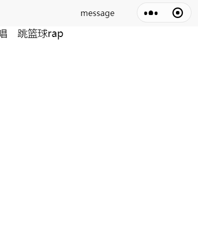
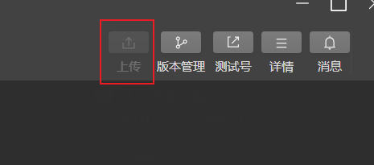

# Uniapp

## 一、环境搭建

### 1.下载HBuilderX

> https://www.dcloud.io/hbuilderx.html

### 2.下载微信开发者工具


### 3.创建项目

在`文件->新建->项目`


**然后运行到微信小程序即可**


> 注意，初次使用需要配置小程序开发者工具的ide路径
>
> 同时需要在小程序开发者工具里面开启端口
>
> 


### 4.开发规范

- 页面文件遵循Vue单文件组件规范
- 组件标签靠近小程序规范
- 接口能力（JS API）靠近小程序规范，前缀`wx`替换为`uni`
- 数据绑定及事件处理通`vue.js`规范，同时补充App及页面生命周期
- 为兼容多端运行，建议使用Flex布局进行开发 

## 二、开发知识


### 1.项目文件


#### （1）page.json文件

主要负责应用全局的设置，例如导航栏颜色，导航栏文字颜色等等，决定页面文件的路径、窗口样式、原生的导航栏、底部的原生tabbar 等。


```
pages:里面属于页面级的配置
globalStyle：属于全局的配置
```

```
具体配置项目可以参考：https://uniapp.dcloud.io/collocation/pages.html
```


##### ①tabbar

通过`page.json`配置

###### 属性


其中list为数组，每个项目都是一个对象


###### 例子

```json
"tabBar": {
		"list": [
			{
				"text": "首页",
				"pagePath": "pages/message/message"
			},
			{
				"text": "个人",
				"pagePath": "pages/index/index"
			}
		]
	}
```


##### ②condition启动模式

启动模式配置，仅开发期间生效，用于模拟直达页面的场景，如：小程序转发后，用户点击所打开的页面。

###### 属性

| 属性    | 类型   | 必须 | 描述                             |
| ------- | ------ | ---- | -------------------------------- |
| current | Number | 是   | 当前激活的模式，List节点的索引值 |
| list    | Array  | 是   | 启动模式列表                     |

list说明：

| 属性  | 类型   | 是否必填 | 描述                               |
| ----- | ------ | -------- | ---------------------------------- |
| name  | String | 是       | 启动模式名称                       |
| path  | String | 是       | 启动页面路径                       |
| query | String | 否       | 启动参数，可在页面的onLoad函数获得 |


###### 例子

```json
"condition": { //模式配置，仅开发期间生效
	"current": 0, //当前激活的模式（list 的索引项）
	"list": [{
			"name": "swiper", //模式名称
			"path": "pages/component/swiper/swiper", //启动页面，必选
			"query": "interval=4000&autoplay=false" //启动参数，在页面的onLoad函数里面得到。
		},
		{
			"name": "test",
			"path": "pages/component/switch/switch"
		}
	]
}
```

之后在运行时候就可以通过选择直达condition配置的页面


#### （2）manifest.json

`manifest.json` 文件是应用的配置文件，用于指定应用的名称、图标、权限等。HBuilderX 创建的工程此文件在根目录，CLI 创建的工程此文件在 src 目录。


#### （3）package.json

在开发小程序时，经常有扩展小程序平台，比如基于阿里小程序的钉钉小程序、淘宝小程序。

uni-app 通过在`package.json`文件中增加`uni-app`扩展节点，可实现自定义条件编译平台。

扩展新的平台后，有3点影响：

1. 可以在代码里编写自定义的条件编译，为这个新平台编写专用代码
2. 运行时可以执行面向新平台的编译运行
3. 发行时可以执行面向新平台的编译发行


#### （4）uni.scss

`uni.scss`文件的用途是为了方便整体控制应用的风格。比如按钮颜色、边框风格，`uni.scss`文件里预置了一批scss变量预置。

> **scss和less区别**
>
> CSS预处理器是一种脚本语言，用一种专门的编程语言来进行 Web 页面样式设计，然后再转换为正常的 CSS样式，进而实现构建动态CSS样式。
>
> CSS 预处理器为 CSS 增加了一些编程的特性，无需考虑浏览器的兼容性问题。
>
> Sass和Less就是两种常见的CSS预处理器，我们可以把Sass和Less编辑的样式转换为正常css样式。
>
> 
>
> CSS预处理器的学习是有相似地方的，一旦我们学习了一个CSS预处理器，如果需要，切换到另一个CSS预处理器学习是不难的。
>
> **1、Less在JS上运行，Sass在Ruby上使用。**
>
> Sass基于Ruby，需要安装Ruby。Less和Sass在Ruby中构建相似，但它已被移植到JavaScript中。为了使用LESS，我们可以将适用的JavaScript文件上载到服务器或通过脱机编译器编译CSS表。
>
> **2、编写变量的方式不同。**
>
> Sass使用$，而Less使用@。
>
> **3、在Less中，仅允许循环数值。**
>
> 在Sass中，我们可以遍历任何类型的数据。但在Less中，我们只能使用递归函数循环数值。
>
> **4、Sass有Compass，Less有Preboot**
>
> Sass和LESS有可用于集成mixins的扩展（在整个站点中存储和共享CSS声明的能力）。
>
> Sass有适用于mixins的Compass，其中包括所有可用的选项以及未来支持的更新。
>
> LESS有Preboot.less，LESS Mixins，LESS Elements，gs和Frameless。LESS的软件支持比Sass更加分散，导致许多不同的扩展选项可能不会以相同的方式运行。对于项目，我们可能需要所有列出的扩展以获得与Compass类似的性能。

### 2.组件

#### （1）内置组件

##### ①uniapp组件

###### **Text**

> 文本组件，用于包裹文本内容
>
> | 属性名      | 类型   | 默认值 | 说明                                                         | 平台差异            |
> | ----------- | ------ | ------ | ------------------------------------------------------------ | ------------------- |
> | selectable  | Bool   | false  | 文本是否可选                                                 | App、H5、快手小程序 |
> | user-select | Bool   | false  | 是否可选                                                     | 微信小程序          |
> | space       | String |        | 显示连续空格，1.ensp：中文字符空格一半大小；2.emsp：中文字符空格大小；3.nbsp：根据字体设置的空格大小 | App、H5、微信       |
> | decode      | Bool   | false  | 是否解码                                                     | App、H5、微信       |
>
> > tips:
> >
> > - text组件只支持嵌套text
> > - decode可以解析的有：`&nbsp;`、`&lt;`、`&amp;`、`&apos;`、`&ensp;`、`&emsp;`、
>
> 
>
> **示例**
>
> ```vue
> <view>
>     <text user-select="true" space="emsp">唱 跳篮球rap</text>
> </view>
> ```
>
> 

###### **view**

> 它类似于传统html中的div，用于包裹各种元素内容。
>
> 


###### button

> 详细的属性配置参考：https://uniapp.dcloud.io/component/button.html
>
> | 属性名                 | 类型    | 默认值       | 说明                                                         | 生效时机                       | 平台差异说明                                             |
> | :--------------------- | :------ | :----------- | :----------------------------------------------------------- | :----------------------------- | :------------------------------------------------------- |
> | size                   | String  | default      | 按钮的大小                                                   |                                |                                                          |
> | type                   | String  | default      | 按钮的样式类型                                               |                                |                                                          |
> | plain                  | Boolean | false        | 按钮是否镂空，背景色透明                                     |                                |                                                          |
> | disabled               | Boolean | false        | 是否禁用                                                     |                                |                                                          |
> | loading                | Boolean | false        | 名称前是否带 loading 图标                                    |                                | H5、App(App-nvue 平台，在 ios 上为雪花，Android上为圆圈) |
> | form-type              | String  |              | 用于 `<form>` 组件，点击分别会触发 `<form>` 组件的 submit/reset 事件 |                                |                                                          |
> | open-type              | String  |              | 开放能力                                                     |                                |                                                          |
> | hover-class            | String  | button-hover | 指定按钮按下去的样式类。当 hover-class="none" 时，没有点击态效果 |                                | App-nvue 平台暂不支持                                    |
> | hover-start-time       | Number  | 20           | 按住后多久出现点击态，单位毫秒                               |                                |                                                          |
> | hover-stay-time        | Number  | 70           | 手指松开后点击态保留时间，单位毫秒                           |                                |                                                          |
> | app-parameter          | String  |              | 打开 APP 时，向 APP 传递的参数，open-type=launchApp时有效    |                                | 微信小程序、QQ小程序                                     |
> | hover-stop-propagation | boolean | false        | 指定是否阻止本节点的祖先节点出现点击态                       |                                | 微信小程序                                               |
> | lang                   | string  | 'en'         | 指定返回用户信息的语言，zh_CN 简体中文，zh_TW 繁体中文，en 英文。 |                                | 微信小程序                                               |
> | session-from           | string  |              | 会话来源，open-type="contact"时有效                          |                                | 微信小程序                                               |
> | send-message-title     | string  | 当前标题     | 会话内消息卡片标题，open-type="contact"时有效                |                                | 微信小程序                                               |
> | send-message-path      | string  | 当前分享路径 | 会话内消息卡片点击跳转小程序路径，open-type="contact"时有效  |                                | 微信小程序                                               |
> | send-message-img       | string  | 截图         | 会话内消息卡片图片，open-type="contact"时有效                |                                | 微信小程序                                               |
> | show-message-card      | boolean | false        | 是否显示会话内消息卡片，设置此参数为 true，用户进入客服会话会在右下角显示"可能要发送的小程序"提示，用户点击后可以快速发送小程序消息，open-type="contact"时有效 |                                | 微信小程序                                               |
> | group-id               | String  |              | 打开群资料卡时，传递的群号                                   | open-type="openGroupProfile"   | QQ小程序                                                 |
> | guild-id               | String  |              | 打开频道页面时，传递的频道号                                 | open-type="openGuildProfile"   | QQ小程序                                                 |
> | public-id              | String  |              | 打开公众号资料卡时，传递的号码                               | open-type="openPublicProfile"  | QQ小程序                                                 |
> | @getphonenumber        | Handler |              | 获取用户手机号回调                                           | open-type="getPhoneNumber"     | 微信、支付宝、百度、字节、快手、京东小程序               |
> | @getuserinfo           | Handler |              | 用户点击该按钮时，会返回获取到的用户信息，从返回参数的detail中获取到的值同uni.getUserInfo | open-type="getUserInfo"        | 微信、QQ、百度、快手、京东小程序                         |
> | @error                 | Handler |              | 当使用开放能力时，发生错误的回调                             | open-type="launchApp"          | 微信、QQ、快手、京东小程序                               |
> | @opensetting           | Handler |              | 在打开授权设置页并关闭后回调                                 | open-type="openSetting"        | 微信、QQ、百度、快手、京东小程序                         |
> | @launchapp             | Handler |              | 从小程序打开 App 成功的回调                                  | open-type="launchApp"          | 微信、QQ、快手、京东小程序                               |
> | @contact               | Handler |              | 客服消息回调                                                 | open-type="contact"            | 微信、QQ、百度、快手小程序                               |
> | @chooseavatar          | Handler |              | 获取用户头像回调                                             | open-type="chooseAvatar"       | 微信小程序                                               |
> | @addgroupapp           | Handler |              | 添加群应用的回调                                             | open-type="addGroupApp"        | QQ小程序                                                 |
> | @chooseaddress         | Handler |              | 调起用户编辑并选择收货地址的回调                             | open-type="chooseAddress"      | 百度小程序                                               |
> | @chooseinvoicetitle    | Handler |              | 用户选择发票抬头的回调                                       | open-type="chooseInvoiceTitle" | 百度小程序                                               |
> | @subscribe             | Handler |              | 订阅消息授权回调                                             | open-type="subscribe"          | 百度小程序                                               |
> | @login                 | Handler |              | 登录回调                                                     | open-type="login"              | 百度小程序                                               |
>
> **size 有效值**
>
> | 值      | 说明     |
> | :------ | :------- |
> | default | 默认大小 |
> | mini    | 小尺寸   |
>
> **type 有效值**
>
> | 值      | 说明                                                         |
> | :------ | :----------------------------------------------------------- |
> | primary | 微信小程序、360小程序为绿色，App、H5、百度小程序、支付宝小程序、飞书小程序、快应用为蓝色，字节跳动小程序为红色，QQ小程序为浅蓝色。如想在多端统一颜色，请改用default，然后自行写样式 |
> | default | 白色                                                         |
> | warn    | 红色                                                         |
>
> **form-type 有效值**
>
> | 值     | 说明     |
> | :----- | :------- |
> | submit | 提交表单 |
> | reset  | 重置表单 |
>
> **open-type 有效值**
>
> | 值                   | 说明                                                         | 平台差异说明                                                 |
> | :------------------- | :----------------------------------------------------------- | :----------------------------------------------------------- |
> | feedback             | 打开“意见反馈”页面，用户可提交反馈内容并上传日志             | App、微信小程序、QQ小程序                                    |
> | share                | 触发用户转发                                                 | 微信小程序、百度小程序、支付宝小程序、字节跳动小程序、飞书小程序、QQ小程序、快手小程序、京东小程序、360小程序 |
> | getUserInfo          | 获取用户信息，可以从@getuserinfo回调中获取到用户信息         | 微信小程序、百度小程序、QQ小程序、快手小程序、京东小程序、360小程序 |
> | contact              | 打开客服会话，如果用户在会话中点击消息卡片后返回应用，可以从 @contact 回调中获得具体信息 | 微信小程序、百度小程序、快手小程序                           |
> | getPhoneNumber       | 获取用户手机号，可以从@getphonenumber回调中获取到用户信息    | 微信小程序、百度小程序、字节跳动小程序、支付宝小程序、快手小程序、京东小程序。App平台另见[一键登陆(opens new window)](https://uniapp.dcloud.net.cn/univerify) |
> | launchApp            | 小程序中打开APP，可以通过app-parameter属性设定向APP传的参数  | [微信小程序 (opens new window)](https://developers.weixin.qq.com/miniprogram/dev/framework/open-ability/launchApp.html)、[QQ小程序 (opens new window)](https://q.qq.com/wiki/develop/miniprogram/frame/open_ability/open_app.html)、快手小程序、京东小程序 |
> | openSetting          | 打开授权设置页                                               | 微信小程序、QQ小程序、百度小程序、快手小程序、京东小程序、360小程序 |
> | chooseAvatar         | 获取用户头像，可以从@chooseavatar回调中获取到头像信息        | 微信小程序2.21.2版本+                                        |
> | getAuthorize         | 支持小程序授权                                               | 支付宝小程序                                                 |
> | lifestyle            | 关注生活号                                                   | 支付宝小程序                                                 |
> | contactShare         | 分享到通讯录好友                                             | 支付宝小程序基础库1.11.0版本+                                |
> | openGroupProfile     | 呼起QQ群资料卡页面，可以通过group-id属性设定需要打开的群资料卡的群号，同时manifest.json中必须配置groupIdList | QQ小程序基础库1.4.7版本+                                     |
> | openGuildProfile     | 呼起频道页面，可以通过guild-id属性设定需要打开的频道ID       | QQ小程序基础库1.46.8版本+                                    |
> | openPublicProfile    | 打开公众号资料卡，可以通过public-id属性设定需要打开的公众号资料卡的号码，同时manifest.json中必须配置publicIdList | QQ小程序基础库1.12.0版本+                                    |
> | shareMessageToFriend | 在自定义开放数据域组件中,向指定好友发起分享据                | QQ小程序基础库1.17.0版本+                                    |
> | addFriend            | 添加好友， 对方需要通过该小程序进行授权，允许被加好友后才能调用成功用户授权 | QQ小程序                                                     |
> | addColorSign         | 添加彩签，点击后添加状态有用户提示，无回调                   | QQ小程序基础库1.10.0版本+                                    |
> | addGroupApp          | 添加群应用（只有管理员或群主有权操作），添加后给button绑定@addgroupapp事件接收回调数据 | QQ小程序基础库1.16.0版本+                                    |
> | addToFavorites       | 收藏当前页面，点击按钮后会触发Page.onAddToFavorites方法      | QQ小程序基础库1.19.0版本+                                    |
> | chooseAddress        | 选择用户收货地址，可以从@chooseaddress回调中获取到用户选择的地址信息 | 百度小程序3.160.3版本+                                       |
> | chooseInvoiceTitle   | 选择用户发票抬头，可以从@chooseinvoicetitle回调中获取到用户选择发票抬头信息 | 百度小程序3.160.3版本+                                       |
> | login                | 登录，可以从@login回调中确认是否登录成功                     | 百度小程序3.230.1版本+                                       |
> | subscribe            | 订阅类模板消息，需要用户授权才可发送                         | 百度小程序                                                   |
> | favorite             | 触发用户收藏                                                 | 快手小程序                                                   |
> | watchLater           | 触发用户稍后再看                                             | 快手小程序                                                   |
> | openProfile          | 触发打开用户主页                                             | 快手小程序                                                   |


###### image

> 图片容器
>
> | 属性名                 | 类型        | 默认值        | 说明                                                         | 平台差异说明                                       |
> | :--------------------- | :---------- | :------------ | :----------------------------------------------------------- | :------------------------------------------------- |
> | src                    | String      |               | 图片资源地址                                                 |                                                    |
> | mode                   | String      | 'scaleToFill' | 图片裁剪、缩放的模式                                         |                                                    |
> | lazy-load              | Boolean     | false         | 图片懒加载。只针对page与scroll-view下的image有效             | 微信小程序、百度小程序、字节跳动小程序、飞书小程序 |
> | fade-show              | Boolean     | true          | 图片显示动画效果                                             | 仅App-nvue 2.3.4+ Android有效                      |
> | webp                   | boolean     | false         | 在系统不支持webp的情况下是否单独启用webp。默认false，只支持网络资源。webp支持详见下面说明 | 微信小程序2.9.0                                    |
> | show-menu-by-longpress | boolean     | false         | 开启长按图片显示识别小程序码菜单                             | 微信小程序2.7.0                                    |
> | draggable              | boolean     | true          | 是否能拖动图片                                               | H5 3.1.1+、App（iOS15+）                           |
> | @error                 | HandleEvent |               | 当错误发生时，发布到 AppService 的事件名，事件对象event.detail = {errMsg: 'something wrong'} |                                                    |
> | @load                  | HandleEvent |               | 当图片载入完毕时，发布到 AppService 的事件名，事件对象event.detail = {height:'图片高度px', width:'图片宽度px'} |                                                    |
>
> **mode 有效值：**
>
> mode 有 14 种模式，其中 5 种是缩放模式，9 种是裁剪模式。
>
> | 模式 | 值           | 说明                                                         |
> | :--- | :----------- | :----------------------------------------------------------- |
> | 缩放 | scaleToFill  | 不保持纵横比缩放图片，使图片的宽高完全拉伸至填满 image 元素  |
> | 缩放 | aspectFit    | 保持纵横比缩放图片，使图片的长边能完全显示出来。也就是说，可以完整地将图片显示出来。 |
> | 缩放 | aspectFill   | 保持纵横比缩放图片，只保证图片的短边能完全显示出来。也就是说，图片通常只在水平或垂直方向是完整的，另一个方向将会发生截取。 |
> | 缩放 | widthFix     | 宽度不变，高度自动变化，保持原图宽高比不变                   |
> | 缩放 | heightFix    | 高度不变，宽度自动变化，保持原图宽高比不变 **App 和 H5 平台 HBuilderX 2.9.3+ 支持、微信小程序需要基础库 2.10.3** |
> | 裁剪 | top          | 不缩放图片，只显示图片的顶部区域                             |
> | 裁剪 | bottom       | 不缩放图片，只显示图片的底部区域                             |
> | 裁剪 | center       | 不缩放图片，只显示图片的中间区域                             |
> | 裁剪 | left         | 不缩放图片，只显示图片的左边区域                             |
> | 裁剪 | right        | 不缩放图片，只显示图片的右边区域                             |
> | 裁剪 | top left     | 不缩放图片，只显示图片的左上边区域                           |
> | 裁剪 | top right    | 不缩放图片，只显示图片的右上边区域                           |
> | 裁剪 | bottom left  | 不缩放图片，只显示图片的左下边区域                           |
> | 裁剪 | bottom right | 不缩放图片，只显示图片的右下边区域                           |
>
> > Tips:
> >
> > - `<image>` 组件默认宽度 320px、高度 240px；`app-nvue平台，暂时默认为屏幕宽度、高度 240px；`
> >- `src` 仅支持相对路径、绝对路径，支持 base64 码；
> > - 页面结构复杂，css样式太多的情况，使用 image 可能导致样式生效较慢，出现 “闪一下” 的情况，此时设置 `image{will-change: transform}` ,可优化此问题。


##### ②vue组件


##### ③NVUE组件


##### ④小程序组件

#### （2）拓展组件

##### uni-ui

> **介绍：**
>
> uni-ui是DCloud提供的一个跨端ui库，它是基于vue组件的、flex布局的、无dom的跨全端ui框架。
>
> uni-ui不包括基础组件，**它是基础组件的补充**。
>
> **使用方法：**
>
> 
>
> 
>
> **使用：**
>
> ```html
> <view>
>     <uni-calendar 
>     :insert="true"
>     :lunar="true" 
>     :start-date="'2019-3-2'"
>     :end-date="'2019-5-20'"
>     @change="change"
>      />
> </view>
> ```
>
> > 参考--https://uniapp.dcloud.net.cn/component/uniui/uni-ui.html

### 3.uni-app中的样式

- **rpx**

> rpx即`响应式`px，一种根据屏幕宽度自适应的动态单位，以750宽的屏幕为基准，750rpx恰好为屏幕宽度，屏幕变宽，rpx实际显示效果会等比放大。**1px=2rpx**

- uni-app中不能使用`*`选择器

- page相当于body节点

- 定义在App.vue中的样式为全局样式吗，作用于每一个页面，在pages目录下的vue文件中定义的样式为局部样式，只作用在对应的页面，并会全局覆盖App.vue的同名样式

- scss/less使用

  > 安装scss工具
  >
  > 
  >
  > ```vue
  > <view>
  >     <text user-select="true" space="emsp">唱 跳篮球rap</text>
  >     <button type="default" open-type="share">hello</button>
  > </view>
  > 
  > <!--嵌套写css-->
  > <style lang="scss">
  >     view{
  >         text{
  >             color: aqua;
  >         }
  >     }
  > </style>
  > ```
  >
  > 使用全局样式
  >
  > 


### 4.生命周期函数

#### （1）应用生命周期

| 函数名   | 说明                                      |
| -------- | ----------------------------------------- |
| onLaunch | 当uni-app初始化完成时触发（全局触发一次） |
| onShow   | 当uni-app启动，或从后台进入前台显示       |
| onHide   | 当uni-app从前台进入后台                   |
| onError  | 当uni-app报错时触发                       |


#### （2）页面生命周期函数

| 函数名                              | 说明                                                         | 平台差异说明                                                 | 最低版本 |
| :---------------------------------- | :----------------------------------------------------------- | :----------------------------------------------------------- | :------- |
| onInit                              | 监听页面初始化，其参数同 onLoad 参数，为上个页面传递的数据，参数类型为 Object（用于页面传参），触发时机早于 onLoad | 百度小程序                                                   | 3.1.0+   |
| onLoad                              | 监听页面加载，其参数为上个页面传递的数据，参数类型为 Object（用于页面传参），参考[示例](https://uniapp.dcloud.io/api/router#navigateto) |                                                              |          |
| onShow                              | 监听页面显示。页面每次出现在屏幕上都触发，包括从下级页面点返回露出当前页面 |                                                              |          |
| onReady                             | 监听页面初次渲染完成。注意如果渲染速度快，会在页面进入动画完成前触发 |                                                              |          |
| onHide                              | 监听页面隐藏                                                 |                                                              |          |
| onUnload                            | 监听页面卸载                                                 |                                                              |          |
| onResize                            | 监听窗口尺寸变化                                             | App、微信小程序、快手小程序                                  |          |
| onPullDownRefresh                   | 监听用户下拉动作，一般用于下拉刷新，参考[示例](https://uniapp.dcloud.io/api/ui/pulldown) |                                                              |          |
| onReachBottom                       | 页面滚动到底部的事件（不是scroll-view滚到底），常用于下拉下一页数据。具体见下方注意事项 |                                                              |          |
| onTabItemTap                        | 点击 tab 时触发，参数为Object，具体见下方注意事项            | 微信小程序、QQ小程序、支付宝小程序、百度小程序、H5、App、快手小程序、京东小程序 |          |
| onShareAppMessage                   | 用户点击右上角分享                                           | 微信小程序、QQ小程序、支付宝小程序、字节小程序、飞书小程序、快手小程序、京东小程序 |          |
| onPageScroll                        | 监听页面滚动，参数为Object                                   | nvue暂不支持                                                 |          |
| onNavigationBarButtonTap            | 监听原生标题栏按钮点击事件，参数为Object                     | App、H5                                                      |          |
| onBackPress                         | 监听页面返回，返回 event = {from:backbutton、 navigateBack} ，backbutton 表示来源是左上角返回按钮或 android 返回键；navigateBack表示来源是 uni.navigateBack ；详细说明及使用：[onBackPress 详解 (opens new window)](http://ask.dcloud.net.cn/article/35120)。支付宝小程序只有真机能触发，只能监听非navigateBack引起的返回，不可阻止默认行为。 | app、H5、支付宝小程序                                        |          |
| onNavigationBarSearchInputChanged   | 监听原生标题栏搜索输入框输入内容变化事件                     | App、H5                                                      | 1.6.0    |
| onNavigationBarSearchInputConfirmed | 监听原生标题栏搜索输入框搜索事件，用户点击软键盘上的“搜索”按钮时触发。 | App、H5                                                      | 1.6.0    |
| onNavigationBarSearchInputClicked   | 监听原生标题栏搜索输入框点击事件（pages.json 中的 searchInput 配置 disabled 为 true 时才会触发） | App、H5                                                      | 1.6.0    |
| onShareTimeline                     | 监听用户点击右上角转发到朋友圈                               | 微信小程序                                                   | 2.8.1+   |
| onAddToFavorites                    | 监听用户点击右上角收藏                                       | 微信小程序                                                   | 2.8.1+   |


**onPullDownRefresh()**

> 主要用于监听用户下拉刷新，首先需要在page.json里面配置enablePullDownRefresh为true
>
> 然后在该页面生命周期开始时进行刷新回调监听
>
> ```js
> onPullDownRefresh() {
>     console.log("下拉刷新");
>     uni.stopPullDownRefresh();//停止刷新，一般用在请求延时，手动关闭刷新
> }
> ```

**onReachBottom()**

> 主要用于上拉加载
>
> ```js
> onReachBottom(){
>     console.log("上拉加载")
> }
> ```
>
> 还可以在page.json里面配置页面上拉触底事件触发时距页面底部距离，单位只支持px
>
> ```js
> style:{
>     "onReachBottomDistance":70
> }
> ```


### 5.网络请求

#### uni.request(OBJECT)

**OBJECT 参数说明**


| 参数名          | 类型                      | 必填 | 默认值 | 说明                                               | 平台差异说明                                                 |
| :-------------- | :------------------------ | :--- | :----- | :------------------------------------------------- | :----------------------------------------------------------- |
| url             | String                    | 是   |        | 开发者服务器接口地址                               |                                                              |
| data            | Object/String/ArrayBuffer | 否   |        | 请求的参数                                         | App 3.3.7 以下不支持 ArrayBuffer 类型                        |
| header          | Object                    | 否   |        | 设置请求的 header，header 中不能设置 Referer。     | App、H5端会自动带上cookie，且H5端不可手动修改                |
| method          | String                    | 否   | GET    | 有效值详见下方说明                                 |                                                              |
| timeout         | Number                    | 否   | 60000  | 超时时间，单位 ms                                  | H5(HBuilderX 2.9.9+)、APP(HBuilderX 2.9.9+)、微信小程序（2.10.0）、支付宝小程序 |
| dataType        | String                    | 否   | json   | 如果设为 json，会尝试对返回的数据做一次 JSON.parse |                                                              |
| responseType    | String                    | 否   | text   | 设置响应的数据类型。合法值：text、arraybuffer      | 支付宝小程序不支持                                           |
| sslVerify       | Boolean                   | 否   | true   | 验证 ssl 证书                                      | 仅App安卓端支持（HBuilderX 2.3.3+），不支持离线打包          |
| withCredentials | Boolean                   | 否   | false  | 跨域请求时是否携带凭证（cookies）                  | 仅H5支持（HBuilderX 2.6.15+）                                |
| firstIpv4       | Boolean                   | 否   | false  | DNS解析时优先使用ipv4                              | 仅 App-Android 支持 (HBuilderX 2.8.0+)                       |
| success         | Function                  | 否   |        | 收到开发者服务器成功返回的回调函数                 |                                                              |
| fail            | Function                  | 否   |        | 接口调用失败的回调函数                             |                                                              |
| complete        | Function                  | 否   |        | 接口调用结束的回调函数（调用成功、失败都会执行）   |                                                              |

**method 有效值**

注意：method有效值必须大写，每个平台支持的method有效值不同，详细见下表。

| method  | App  |  H5  | 微信小程序 | 支付宝小程序 | 百度小程序 | 字节跳动小程序、飞书小程序 | 快手小程序 | 京东小程序 |
| :-----: | :--: | :--: | :--------: | :----------: | :--------: | :------------------------: | :--------: | :--------: |
|   GET   |  √   |  √   |     √      |      √       |     √      |             √              |     √      |     √      |
|  POST   |  √   |  √   |     √      |      √       |     √      |             √              |     √      |     √      |
|   PUT   |  √   |  √   |     √      |      x       |     √      |             √              |     x      |     x      |
| DELETE  |  √   |  √   |     √      |      x       |     √      |             x              |     x      |     x      |
| CONNECT |  x   |  √   |     √      |      x       |     x      |             x              |     x      |     x      |
|  HEAD   |  x   |  √   |     √      |      x       |     √      |             x              |     x      |     x      |
| OPTIONS |  √   |  √   |     √      |      x       |     √      |             x              |     x      |     x      |
|  TRACE  |  x   |  √   |     √      |      x       |     x      |             x              |     x      |     x      |


**例子**

```js
uni.request({
    url: 'https://www.example.com/request', //仅为示例，并非真实接口地址。
    data: {
        text: 'uni.request'
    },
    header: {
        'custom-header': 'hello' //自定义请求头信息
    },
    success: (res) => {
        console.log(res.data);
        this.text = 'request success';
    }
});
```

```js
//返回一个请求对象
var requestTask = uni.request({
	url: 'https://www.example.com/request', //仅为示例，并非真实接口地址。
	complete: ()=> {}
});
```


#### 封装并挂载全局

```js
//封装
const BASE_URL="https://api-hmugo-web.itheima.net/api/public/v1/"

export const httpGet({url}){
	return new Promise((resolve,reject)=>{
		uni.request({
			url:BASE_URL+url,
			method:"GET",
			success:(res)=>{
				if(res.data.meta.status != 200){
					return uni.showToast({
						title:"加载数据失败"
					})
				}
				resolve(res)
			},
			fail: (err) => {
				uni.showToast({
					title:"服务器访问失败"
				})
				reject(err)
			}
		})
	})
	
}
```

**全局挂载**


**使用**

```js
this.$httpGet({
    url:'api/public/v1/home/swiperdata'
}).then((res)=>{
    console.log(res)
})
```


### 6.数据缓存

#### **异步存取**

##### uni.setStorage(Object)

> 将数据存储在本地缓存中指定的 key 中，会覆盖掉原来该 key 对应的内容，这是一个异步接口。
>
> **OBJECT 参数说明**
>
> | 参数名   | 类型     | 必填 | 说明                                                         |
> | :------- | :------- | :--- | :----------------------------------------------------------- |
> | key      | String   | 是   | 本地缓存中的指定的 key                                       |
> | data     | Any      | 是   | 需要存储的内容，只支持原生类型、及能够通过 JSON.stringify 序列化的对象 |
> | success  | Function | 否   | 接口调用成功的回调函数                                       |
> | fail     | Function | 否   | 接口调用失败的回调函数                                       |
> | complete | Function | 否   | 接口调用结束的回调函数（调用成功、失败都会执行）             |
>
> ```js
> uni.setStorage({
> 	key: 'storage_key',
> 	data: 'hello',
> 	success: function () {
> 		console.log('success');
> 	}
> });
> ```
>
> > - `uni-`、`uni_`、`dcloud-`、`dcloud_`为前缀的key，为系统保留关键前缀。如`uni_deviceId`、`uni_id_token`，请开发者为key命名时避开这些前缀。

##### uni.getStorage(Object)

> 从本地缓存中异步获取指定 key 对应的内容。
>
> **OBJECT 参数说明**
>
> | 参数名   | 类型     | 必填 | 说明                                             |
> | :------- | :------- | :--- | :----------------------------------------------- |
> | key      | String   | 是   | 本地缓存中的指定的 key                           |
> | success  | Function | 是   | 接口调用的回调函数，res = {data: key对应的内容}  |
> | fail     | Function | 否   | 接口调用失败的回调函数                           |
> | complete | Function | 否   | 接口调用结束的回调函数（调用成功、失败都会执行） |
>
> **success 返回参数说明**
>
> | 参数 | 类型 | 说明           |
> | :--- | :--- | :------------- |
> | data | Any  | key 对应的内容 |
>
> ```javascript
> uni.getStorage({
> 	key: 'storage_key',
> 	success: function (res) {
> 		console.log(res.data);
> 	}
> });
> ```

#####  uni.removeStorage(Object)

> 从本地缓存中异步移除指定 key。
>
> **OBJECT 参数说明**
>
> | 参数名   | 类型     | 必填 | 说明                                             |
> | :------- | :------- | :--- | :----------------------------------------------- |
> | key      | String   | 是   | 本地缓存中的指定的 key                           |
> | success  | Function | 是   | 接口调用的回调函数                               |
> | fail     | Function | 否   | 接口调用失败的回调函数                           |
> | complete | Function | 否   | 接口调用结束的回调函数（调用成功、失败都会执行） |
>
> **示例**
>
> ```javascript
> uni.removeStorage({
> 	key: 'storage_key',
> 	success: function (res) {
> 		console.log('success');
> 	}
> });
> ```

##### uni.clearStorage()

清理本地数据缓存。


#### **同步存取**

##### uni.setStorageSync(KEY,DATA)

> 将 data 存储在本地缓存中指定的 key 中，会覆盖掉原来该 key 对应的内容，这是一个同步接口。
>
> **参数说明**
>
> | 参数 | 类型   | 必填 | 说明                                                         |
> | :--- | :----- | :--- | :----------------------------------------------------------- |
> | key  | String | 是   | 本地缓存中的指定的 key                                       |
> | data | Any    | 是   | 需要存储的内容，只支持原生类型、及能够通过 JSON.stringify 序列化的对象 |
>
> ```javascript
> try {
> 	uni.setStorageSync('storage_key', 'hello');
> } catch (e) {
> 	// error
> }
> ```


##### uni.getStorageSync(KEY)

> 从本地缓存中同步获取指定 key 对应的内容。
>
> **参数说明**
>
> | 参数 | 类型   | 必填 | 说明                   |
> | :--- | :----- | :--- | :--------------------- |
> | key  | String | 是   | 本地缓存中的指定的 key |
>
> **示例**
>
> ```javascript
> try {
> 	const value = uni.getStorageSync('storage_key');
> 	if (value) {
> 		console.log(value);
> 	}
> } catch (e) {
> 	// error
> }
> ```

##### uni.removeStorageSync(KEY)

> 从本地缓存中同步移除指定 key。
>
> **参数说明**
>
> | 参数名 | 类型   | 必填 | 说明                   |
> | :----- | :----- | :--- | :--------------------- |
> | key    | String | 是   | 本地缓存中的指定的 key |
>
> **示例**
>
> ```javascript
> try {
> 	uni.removeStorageSync('storage_key');
> } catch (e) {
> 	// error
> }
> ```

##### uni.clearStorageSync()

同步清理本地数据缓存。


### 7.图片上传下载

##### uni.chooseImage(Object)

> 从本地相册选择图片或使用相机拍照。
>
> **OBJECT 参数说明**
>
> 
>
> | 参数名     | 类型          | 必填 | 说明                                                         | 平台差异说明                              |
> | :--------- | :------------ | :--- | :----------------------------------------------------------- | :---------------------------------------- |
> | count      | Number        | 否   | 最多可以选择的图片张数，默认9                                | 见下方说明                                |
> | sizeType   | Array<String> | 否   | original 原图，compressed 压缩图，默认二者都有               | App、微信小程序、支付宝小程序、百度小程序 |
> | extension  | Array<String> | 否   | 根据文件拓展名过滤，每一项都不能是空字符串。默认不过滤。     | H5(HBuilder X2.9.9+)                      |
> | sourceType | Array<String> | 否   | album 从相册选图，camera 使用相机，默认二者都有。如需直接开相机或直接选相册，请只使用一个选项 |                                           |
> | crop       | Object        | 否   | 图像裁剪参数，设置后 sizeType 失效                           | App 3.1.19+                               |
> | success    | Function      | 是   | 成功则返回图片的本地文件路径列表 tempFilePaths               |                                           |
> | fail       | Function      | 否   | 接口调用失败的回调函数                                       | 小程序、App                               |
> | complete   | Function      | 否   | 接口调用结束的回调函数（调用成功、失败都会执行）             |                                           |
>
> **crop 参数说明**
>
> 
>
> | 参数名  | 类型    | 必填 | 说明                                                         | 平台差异说明 |
> | :------ | :------ | :--- | :----------------------------------------------------------- | :----------- |
> | quality | Number  | 否   | 取值范围为1-100，数值越小，质量越低（仅对jpg格式有效）。默认值为80。 |              |
> | width   | Number  | 是   | 裁剪的宽度，单位为px，用于计算裁剪宽高比。                   |              |
> | height  | Number  | 是   | 裁剪的高度，单位为px，用于计算裁剪宽高比。                   |              |
> | resize  | Boolean | 否   | 是否将width和height作为裁剪保存图片真实的像素值。默认值为true。注：设置为false时在裁剪编辑界面显示图片的像素值，设置为true时不显示 |              |
>
> **success 返回参数说明**
>
> | 参数          | 类型                       | 说明                                       |
> | :------------ | :------------------------- | :----------------------------------------- |
> | tempFilePaths | Array<String>              | 图片的本地文件路径列表                     |
> | tempFiles     | Array<Object>、Array<File> | 图片的本地文件列表，每一项是一个 File 对象 |
>
> **File 对象结构如下**
>
> | 参数 | 类型   | 说明                           |
> | :--- | :----- | :----------------------------- |
> | path | String | 本地文件路径                   |
> | size | Number | 本地文件大小，单位：B          |
> | name | String | 包含扩展名的文件名称，仅H5支持 |
> | type | String | 文件类型，仅H5支持             |
>
> **示例**：
>
> ```javascript
> uni.chooseImage({
> 	count: 6, //默认9
> 	sizeType: ['original', 'compressed'], //可以指定是原图还是压缩图，默认二者都有
> 	sourceType: ['album'], //从相册选择
> 	success: function (res) {
> 		console.log(JSON.stringify(res.tempFilePaths));
> 	}
> });
> ```


##### uni.previewImage(OBJECT)

> **OBJECT 参数说明**
>
> 
>
> | 参数名           | 类型          | 必填         | 说明                                                         | 平台差异说明 |
> | :--------------- | :------------ | :----------- | :----------------------------------------------------------- | :----------- |
> | current          | String/Number | 详见下方说明 | current 为当前显示图片的链接/索引值，不填或填写的值无效则为 urls 的第一张。**App平台在 1.9.5至1.9.8之间，current为必填。不填会报错** |              |
> | urls             | Array<String> | 是           | 需要预览的图片链接列表                                       |              |
> | indicator        | String        | 否           | 图片指示器样式，可取值："default" - 底部圆点指示器； "number" - 顶部数字指示器； "none" - 不显示指示器。 | App          |
> | loop             | Boolean       | 否           | 是否可循环预览，默认值为 false                               | App          |
> | longPressActions | Object        | 否           | 长按图片显示操作菜单，如不填默认为**保存相册**               | App 1.9.5+   |
> | success          | Function      | 否           | 接口调用成功的回调函数                                       |              |
> | fail             | Function      | 否           | 接口调用失败的回调函数                                       |              |
> | complete         | Function      | 否           | 接口调用结束的回调函数（调用成功、失败都会执行）             |              |
>
> **longPressActions 参数说明**
>
> | 参数      | 类型          | 必填 | 说明                                             |
> | :-------- | :------------ | :--- | :----------------------------------------------- |
> | itemList  | Array<String> | 是   | 按钮的文字数组                                   |
> | itemColor | String        | 否   | 按钮的文字颜色，字符串格式，默认为"#000000"      |
> | success   | Function      | 否   | 接口调用成功的回调函数，详见返回参数说明         |
> | fail      | Function      | 否   | 接口调用失败的回调函数                           |
> | complete  | Function      | 否   | 接口调用结束的回调函数（调用成功、失败都会执行） |
>
> **success 返回参数说明**
>
> | 参数     | 类型   | 说明                     |
> | :------- | :----- | :----------------------- |
> | index    | Number | 用户长按图片的索引值     |
> | tapIndex | Number | 用户点击按钮列表的索引值 |
>
> **示例**
>
> ```javascript
> // 从相册选择6张图
> uni.chooseImage({
> 	count: 6,
> 	sizeType: ['original', 'compressed'],
> 	sourceType: ['album'],
> 	success: function(res) {
> 		// 预览图片
> 		uni.previewImage({
> 			urls: res.tempFilePaths,
> 			longPressActions: {
> 				itemList: ['发送给朋友', '保存图片', '收藏'],
> 				success: function(data) {
> 					console.log('选中了第' + (data.tapIndex + 1) + '个按钮,第' + (data.index + 1) + '张图片');
> 				},
> 				fail: function(err) {
> 					console.log(err.errMsg);
> 				}
> 			}
> 		});
> 	}
> 	});
> ```


### 8.路由

#### **navigator组件跳转**

> 跳转项目本地页面，并且页面必须在page.json里面注册
>
> | 属性名                 | 类型    | 默认值          | 说明                                                         | 平台差异说明               |
> | :--------------------- | :------ | :-------------- | :----------------------------------------------------------- | :------------------------- |
> | **url**                | String  |                 | 应用内的跳转链接，值为相对路径或绝对路径，如："../first/first"，"/pages/first/first"，注意不能加 `.vue` 后缀 |                            |
> | **open-type**          | String  | navigate        | 跳转方式                                                     |                            |
> | delta                  | Number  |                 | 当 open-type 为 'navigateBack' 时有效，表示回退的层数        |                            |
> | animation-type         | String  | pop-in/out      | 当 open-type 为 navigate、navigateBack 时有效，窗口的显示/关闭动画效果 | App                        |
> | animation-duration     | Number  | 300             | 当 open-type 为 navigate、navigateBack 时有效，窗口显示/关闭动画的持续时间。 | App                        |
> | hover-class            | String  | navigator-hover | 指定点击时的样式类，当hover-class="none"时，没有点击态效果   |                            |
> | hover-stop-propagation | Boolean | false           | 指定是否阻止本节点的祖先节点出现点击态                       | 微信小程序                 |
> | hover-start-time       | Number  | 50              | 按住后多久出现点击态，单位毫秒                               |                            |
> | hover-stay-time        | Number  | 600             | 手指松开后点击态保留时间，单位毫秒                           |                            |
> | target                 | String  | self            | 在哪个小程序目标上发生跳转，默认当前小程序，值域self/miniProgram | 微信2.0.7+、百度2.5.2+、QQ |
>
> **open-type 有效值**
>
> | 值            | 说明                                                         | 平台差异说明                     |
> | :------------ | :----------------------------------------------------------- | :------------------------------- |
> | **navigate**  | **保留当前页面，跳转到应用内的某个页面，使用`uni.navigateBack`可以返回到原页面。** |                                  |
> | **redirect**  | 关闭**当前**页面，跳转到应用内的某个页面。                   |                                  |
> | **switchTab** | **跳转到 tabBar 页面，并关闭其他所有非 tabBar 页面。**       |                                  |
> | reLaunch      | 关闭**所有**页面，打开到应用内的某个页面。                   | 字节跳动小程序与飞书小程序不支持 |
> | navigateBack  | 关闭当前页面，返回上一页面或多级页面。可通过 `getCurrentPages()` 获取当前的页面栈，决定需要返回几层。 |                                  |
> | exit          | 退出小程序，target="miniProgram"时生效                       | 微信2.1.0+、百度2.5.2+、QQ1.4.7+ |
>
> **例子**
>
> ```vue
> <navigator url="/pages/navigator/navigator" open-type="redirect">
>     <button type="default">跳转到新页面-</button>
> </navigator>
> ```

#### **代码跳转**

> - ### uni.navigateTo(OBJECT)
>
>   > | 参数              | 类型     | 必填 | 默认值 | 说明                                                         |
>   > | :---------------- | :------- | :--- | :----- | :----------------------------------------------------------- |
>   > | url               | String   | 是   |        | 需要跳转的应用内非 tabBar 的页面的路径 , 路径后可以带参数。参数与路径之间使用?分隔，参数键与参数值用=相连，不同参数用&分隔；如 'path?key=value&key2=value2'，path为下一个页面的路径，下一个页面的onLoad函数可得到传递的参数 |
>   > | animationType     | String   | 否   | pop-in | 窗口显示的动画效果                                           |
>   > | animationDuration | Number   | 否   | 300    | 窗口动画持续时间，单位为 ms                                  |
>   > | events            | Object   | 否   |        | 页面间通信接口，用于监听被打开页面发送到当前页面的数据。2.8.9+ 开始支持。 |
>   > | success           | Function | 否   |        | 接口调用成功的回调函数                                       |
>   > | fail              | Function | 否   |        | 接口调用失败的回调函数                                       |
>   > | complete          | Function | 否   |        | 接口调用结束的回调函数（调用成功、失败都会执行）             |
>   >
>   > **object.success 回调函数**
>   >
>   > **参数** ：**Object res**
>   >
>   > | 属性         | 类型         | 说明                 |
>   > | :----------- | :----------- | :------------------- |
>   > | eventChannel | EventChannel | 和被打开页面进行通信 |
>   >
>   > **例子**
>   >
>   > ```js
>   > // 在起始页面跳转到test.vue页面，并监听test.vue发送过来的事件数据
>   > uni.navigateTo({
>   >   url: 'pages/test?id=1',
>   >   events: {
>   >     // 为指定事件添加一个监听器，获取被打开页面传送到当前页面的数据
>   >     acceptDataFromOpenedPage: function(data) {
>   >       console.log(data)
>   >     },
>   >     someEvent: function(data) {
>   >       console.log(data)
>   >     }
>   >     ...
>   >   },
>   >   success: function(res) {
>   >     // 通过eventChannel向被打开页面传送数据
>   >     res.eventChannel.emit('acceptDataFromOpenerPage', { data: 'data from starter page' })
>   >   }
>   > })
>   > 
>   > // 在test.vue页面，向起始页通过事件传递数据
>   > onLoad: function(option) {
>   >   // #ifdef APP-NVUE
>   >   const eventChannel = this.$scope.eventChannel; // 兼容APP-NVUE
>   >   // #endif
>   >   // #ifndef APP-NVUE
>   >   const eventChannel = this.getOpenerEventChannel();
>   >   // #endif
>   >   eventChannel.emit('acceptDataFromOpenedPage', {data: 'data from test page'});
>   >   eventChannel.emit('someEvent', {data: 'data from test page for someEvent'});
>   >   // 监听acceptDataFromOpenerPage事件，获取上一页面通过eventChannel传送到当前页面的数据
>   >   eventChannel.on('acceptDataFromOpenerPage', function(data) {
>   >     console.log(data)
>   >   })
>   > }
>   > ```
>   >
>   > 
>
> - ### uni.redirectTo(OBJECT)
>
>   > | 参数     | 类型     | 必填 | 说明                                                         |
>   > | :------- | :------- | :--- | :----------------------------------------------------------- |
>   > | url      | String   | 是   | 需要跳转的应用内非 tabBar 的页面的路径，路径后可以带参数。参数与路径之间使用?分隔，参数键与参数值用=相连，不同参数用&分隔；如 'path?key=value&key2=value2' |
>   > | success  | Function | 否   | 接口调用成功的回调函数                                       |
>   > | fail     | Function | 否   | 接口调用失败的回调函数                                       |
>   > | complete | Function | 否   | 接口调用结束的回调函数（调用成功、失败都会执行）             |
>
> - ### uni.reLaunch(OBJECT)
>
>   > 参数同上
>   >
>   > **示例**
>   >
>   > ```js
>   > //页面一
>   > uni.reLaunch({
>   > 	url: 'test?id=1'
>   > });
>   > //页面二
>   > export default {
>   > 	onLoad: function (option) {
>   > 		console.log(option.id);//获取参数
>   > 	}
>   > }
>   > ```
>   >
>   > 
>
> - ### uni.switchTab(OBJECT)
>
>   > **参数同上**
>
> - ### uni.navigateBack(OBJECT)


### 9.组件通信

基本和vue的组件通信类似

#### （1）通过props传值

> 这种方式常常用于父子组件的传值

#### （2）通过emit来发送事件

> 子组件触发时间通过
>
> ```js
> this.$emit("eventName",data);//触发事件
> ```
>
> 父组件接收数据并处理事件
>
> ```vue
> <!--父组件给子组件触发事件绑定一个函数处理-->
> <son @eventName="handleEvent"></son>
> 
> <script>
>     methods:{
>         handleEvent(data){
>             .....
>         }
>     }
> </script>	
> ```

#### (3)EventBus全局总线来发送事件

> ### ①uni.$emit(eventName,OBJECT)
>
> 触发全局的自定义事件，附加参数都会传给监听器回调函数。
>
> ### ②uni.$on(eventName,callback)
>
> 监听全局的自定义事件，**事件由 `uni.$emit` 触发**，回调函数会接收事件触发函数的传入参数。
>
> ### ③ uni.$once(eventName,callback)
>
> 监听全局的自定义事件，**事件由 `uni.$emit` 触发**，**但仅触发一次**，在第一次触发之后移除该监听器。
>
> ### ④uni.$off([eventName, callback])
>
> 移除全局自定义事件监听器。
>
> | 属性      | 类型            | 描述           |
> | --------- | --------------- | -------------- |
> | eventName | Array＜String＞ | 事件名         |
> | callback  | Function        | 事件的回调函数 |


## 三、项目优化

### 1.条件编译跨端兼容

条件编译是用特殊的注释作为标记，在编译时根据这些特殊的注释，将注释里面的代码编译到不同平台，

```vue
以#ifdef加平台标识开头，以#endif结尾
<!--#ifdef H5-->
<view>我希望只在h5页面中看见</view>
<!--#endif-->

<!-- #ifdef -->
<view>我希望只在微信小程序页面中看见</view>
<!--#endif-->
```

| 值         | 平台                     |
| ---------- | ------------------------ |
| APP-PLUS   | 5+App                    |
| H5         | H5                       |
| MP-WEIXIN  | 微信小程序               |
| MP-ALIPAY  | 支付宝小程序             |
| MP-BAIDU   | 百度小程序               |
| MP-TOUTIAO | 头条小程序               |
| MP-QQ      | QQ小程序                 |
| MP         | 微信/支付宝/百度/头条/QQ |

```js
//在js里面
//#ifdef H5
console.log("我希望H5")
//#endif
```

> css同理

## 四、项目打包

### 1.微信小程序打包


**还需要在微信公众平台配置服务器域名以及ip等信息**



之后打开微信开发者工具，右上角上传，填写版本等信息（**注意：项目里面的引用本地静态资源的文件需要修改路径，例如iconfont，改成网络上可以访问的路径**）


**之后去微信公众平台官网查看自己上传的版本信息，并且提交审核**


### 2.H5打包

首先进行配置


打包


### 3.Android打包

①配置

②打包

> 采用云打包

之后在控制台会出现应用的下载地址

