# 一.电脑通过ssh链接github

> 参考：
>
> https://developer.aliyun.com/article/1049888
>
> https://blog.csdn.net/wuyujin1997/article/details/106165502
>
> [菜鸟](https://www.runoob.com/git/git-tutorial.html)

### 1.步骤

- 将自己的电脑与指定github账户关联

  > 创建一个github账户
  >
  > 在本机上设置你的github的邮箱和用户名
  >
  > git config --global user.name "用户名"
  > git config --global user.email "邮箱"
  >
  > > 之后会在`C:\Users\89464\.gitconfig`文件里出现刚刚添加的用户名

- 生成本机的SSH key

  > ```shell
  > ssh-keygen -t rsa -C "邮箱"
  > ```
  >
  > 根据提示，按三次回车键，最后会生成ssh key值，并告诉你key值存放的文件的位置，找到该文件并复制ssh key

- 打开github主页。找到Settings,

  > 选择SSH and GPG keys ，再选择new SSH key，title 随意填，key值就是刚刚生成的本机 SSH KEY（在 `.pub`文件中）

  

### 2.git clone每次输入密码

> 参考：
>
> [git clone 每次输入密码](https://juejin.cn/s/git%20clone%20%E6%AF%8F%E6%AC%A1%E9%83%BD%E8%A6%81%E8%BE%93%E5%85%A5%E5%AF%86%E7%A0%81)

每次使用`git clone`命令从远程仓库克隆代码时都需要输入密码，那么可能是因为使用的是`HTTP协议`进行访问。为了避免每次都需要输入密码，可以尝试使用`SSH协议`进行访问，这样就可以通过SSH密钥进行身份验证，而无需输入密码。 

> 前提是`在1.步骤`中创建好了ssh公钥，并添加到github中
>
> 然后可以使用SSH协议进行克隆 
>
> ```shell
> git clone git@github.com:user/repo.git #就是仓库的ssh路径
> ```


### 3.报错

**(1)The file will have its original line endings in your working directory**

> 参考：
>
> https://blog.csdn.net/qq_37521610/article/details/88327286

**问题描述**

 git add：添加至暂存区，但并未提交至服务器。git add . 是表示把当前目录下的所有更新添加至暂存区。有时在终端操作这个会提示： 

```
warning: LF will be replaced by CRLF in ball_pool/assets/Main.js.
The file will have its original line endings in your working directory
```


**原因：**

因为文件中换行符的差别导致的。这个提示的意思是说：会把windows格式（CRLF（也就是回车换行））转换成Unix格式（LF），这些是转换文件格式的警告，不影响使用。 

**解决办法**

```shell
git rm -r --cached .
git config core.autocrlf false
git add .
git commit -m ''
git push
```


----------


# 二.概念

> https://www.cnblogs.com/qdhxhz/p/9757390.html

## 分区

Git往往有三部分组成，工作区、暂存区和版本库

- **工作区Workspace：**就是你在电脑里能看到的目录。
- **暂存区Stage：**英文叫 stage 或 index。一般存放在 **.git** 目录下的 index 文件（.git/index）中，所以我们把暂存区有时也叫作索引（index）。
- **仓库Repository：**工作区有一个隐藏目录 **.git**，这个不算工作区，而是 Git 的版本库。
- **远程仓库Remote：** 远程仓库，托管代码的服务器，可以简单的认为是你项目组中的一台电脑用于远程数据交换 

 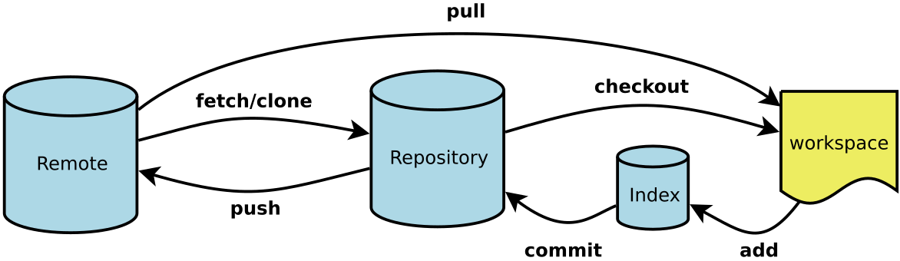 


## 状态

  

**Untracked:**  未跟踪, 此文件在文件夹中, 但并没有加入到git库, 不参与版本控制. 通过`git add`状态变为`Staged`.

**Unmodify:**  文件已经入库, 未修改, 即版本库中的文件快照内容与文件夹中完全一致. 这种类型的文件有两种去处,：

- 如果它被修改, 而变为`Modified`.
- 如果使用`git rm`移出版本库, 则成为`Untracked`文件

**Modified:** 文件已修改, 仅仅是修改, 并没有进行其他的操作. 这个文件也有两个去处：

- 通过`git add`可进入暂存`staged`状态, 使用`git checkout`则丢弃修改
- 返回到`unmodify`状态, 这个`git checkout`即从库中取出文件, 覆盖当前修改

 **Staged:** 暂存状态. 执行`git commit`则将修改同步到库中, 这时库中的文件和本地文件又变为一致, 文件为`Unmodify`状态. 执行`git reset HEAD filename`取消暂存,文件状态为Modified

> 新建文件--->Untracked
>
> 使用add命令将新建的文件加入到暂存区--->Staged
>
> 使用commit命令将暂存区的文件提交到本地仓库--->Unmodified
>
> 如果对Unmodified状态的文件进行修改---> modified
>
> 如果对Unmodified状态的文件进行remove操作--->Untracked


## 版本管理

使用git的每次提交，Git都会自动把它们串成一条时间线，这条时间线就是一个分支。如果没有新建分支，那么只有一条时间线，即只有一个分支，在Git里，这个分支叫主分支，即master分支。有一个HEAD指针指向当前分支（只有一个分支的情况下会指向master，而master是指向最新提交）。每个版本都会有自己的版本信息，如特有的版本号、版本名等。如下图，假设只有一个分支：
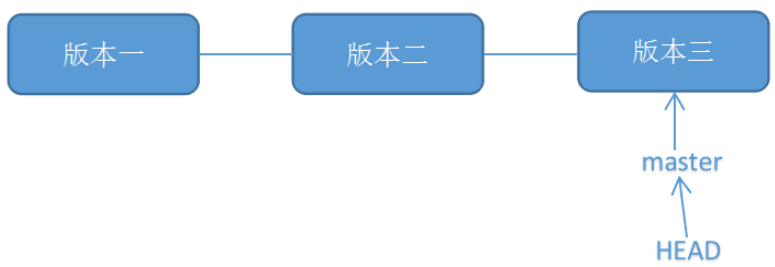 

# 三.command

> 参考：
>
> [菜鸟——git命令](https://www.runoob.com/git/git-basic-operations.html)

## 分支管理

### 删除分支

####  删除本地分支`master`： 

```shell
git branch -d master
```

####  删除远程分支`master`： 

将本地 master 分支推送到远程仓库 origin 的 master 分支，并 删除 远程仓库 origin 的 master 分支。

```shell
git push origin :master 
#或者
git push origin --delete master
```


### 查看分支

#### 查看本地分支

```shell
git branch
```

#### 查看远程分支

```shell
git branch -r
```

#### 查看本地分支和远程分支链接情况

```shell
git branch -vv

* main 11222f8 [origin/main] '2024-3-6'
```


### 修改分支

#### 修改本地分支名

```shell
git branch -M main #修改当前分支名为main
```


### 创建分支

#### 创建本地分支

**基于本地分支创建分支**

```shell
# 复制当前分支，并创建一个分支并切换到该分支，
$ git checkout -b <branch-name>

# 只创建一个分支
$ git branch <branch-name>
```

> **注意:**
>
> 实际上`git checkout -b `是根据指定分支复制来创建新的分支，一次不指定第二个参数，默认就是复制当前分支
>
> ```shell
> git checkout -b [NEW_BRANCH] [FROM_BRANCH]
> ```
>
> 


**基于远程分支创建本地分支**

```shell
git checkout -b dev origin/dev #基于远程分支创建本地分支
```


#### 创建远程分支


```shell
git checkout -b my-test  //在当前分支下创建my-test的本地分支分支
git push origin my-test  //将my-test分支推送到远程
git branch --set-upstream-to=origin/my-test //将本地分支my-test关联到远程分支my-test上   
git branch -a //查看远程分支 
```


### 切换分支

```shell
git checkout (branch) #切换到对于分支
```

**也可以先创建分支，然后切换到该分支下**

```shell
git checkout -b (branchname)#创建新分支并且切换到该分支下
```


### 合并分支

> [merge和git rebase](https://dingjingmaster.github.io/2022/05/0002-rebase%E4%B8%8Emerge%E7%9A%84%E5%8C%BA%E5%88%AB/)

合并分支非常重要，对于多个分支而言。有两个参数可以合并分支，要仔细区分他们的区别

**先说结论：**

`git rebase` 和 `git merge` 这两个命令旨在将更改代码从一个分支合并到另一个分支，只是两者合并方式不一样。

- 融合代码到公共分支的时候用 `git merge`，而不能使用 `git rebase`
- 融合代码到个人分支的时候用 `git rebase`， 可以不污染分支的提交记录，形成简洁的线性提交历史记录


**场景**

假设当前我们有master和feature分支，当你在专用分支上开发新 feature 时，然后另一个团队成员在 master 分支提交了新的 commits，这种属于正常的Git工作场景。如下图： 

 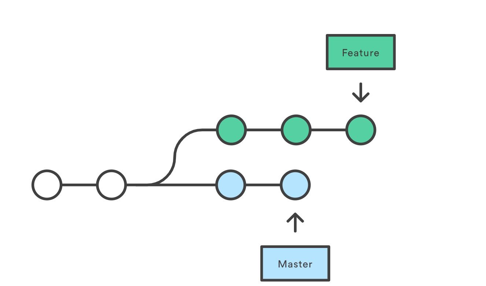 

#### merge

使用merge合并master道feature

```shell
git checkout feature
git merge master

#或者缩写形式
git merge feature master
```

 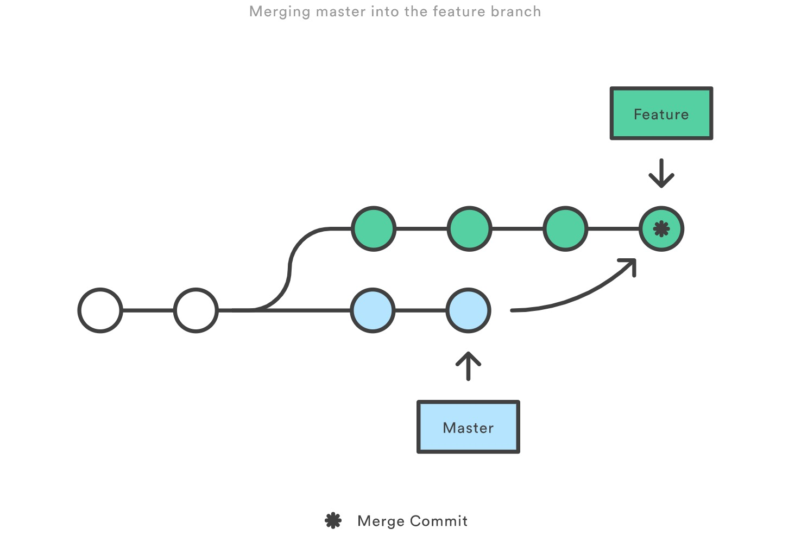 

由此可见，`git merge` 会在 `feature` 分支中新增一个新的 `merge commit`，然后将两个分支的历史联系在一起

- 使用 `merge` 是很好的方式，因为它是一种非破坏性的操作，对现有分支不会以任何方式被更改
- 另一方面，这也意味着 `feature` 分支每次需要合并上游更改时候，都会产生一个额外的合并提交。
- 如果 `master` 提交非常活跃，这可能会严重污染你的 `feature` 分支历史记录。不过这个问题可以使用高级选项 `git log` 来缓解


#### rebase

例如有两个分支`master`、`develop`，rebase合并过程如下

```shell
git checkout  feature
git rebase master

#或者简介写法

git rebase feature master
```

 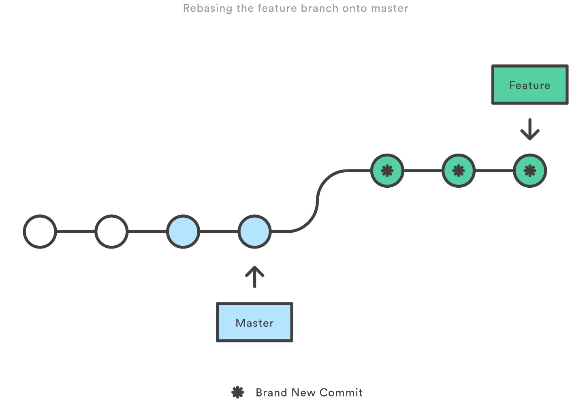 

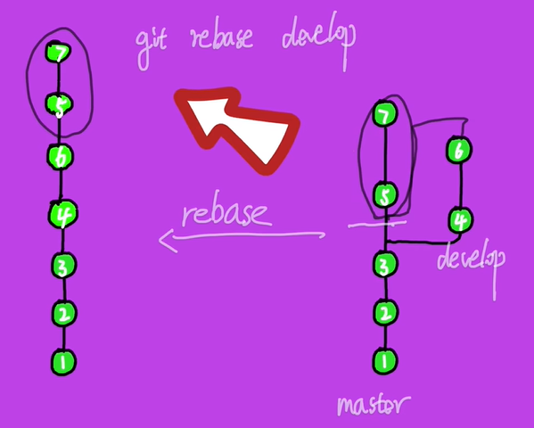

> **注意：此时master的5，7是新的提交记录，有新的commit id**

- `rebase` 会将整个 `feature` 分支移动到 `master` 分支的顶端，从而有效地整合了所有 `master` 分支上的提交。
- 但是，与`merge` 提交方式不同，`rebase`通过为原始分之中的每个提交创建全新的 commits 来重写项目历史记录，特点是仍然会在 `feature` 分支上形成线性提交。
- `rebase` 的主要好处是可以获得更清晰的项目历史。首先，它消除了 `git merge` 所需的不必要的合并提交；其次，正如你在上图中所看到的，`rebase` 会产生完美线性的历史记录，你可以在 `feature` 分支上没有任何分叉的情况下一直追寻到项目的初始提交。


#### 如何选择merge、rebase

根据上面的对比可知：

- `git merge` 分支代码合并后不破坏原分支的代码提交记录，缺点就是会产生额外的提交记录并进行两条分支的合并
- `git rebase` 优点是无须新增提交记录到目标分支，rebase后可以将对象分支的提交历史续上目标分支上，形成线性提交历史记录，进行review的时候更加直观
- `git merge` 如果有多人进行开发并进行分支合并，会形成复杂的合并分支图


##### rebase黄金法则：

**但是注意：不能在共享分支上运用rebase**

所谓共享的分支，即是指那些存在于远端并且允许团队中的其他人进行Pull操作的分支，比如我们Git工作的master分支就是最常见的公共分支。

假设现在Bob和Anna在同一个项目组中工作，项目所属的仓库和分支大概是下图这样：

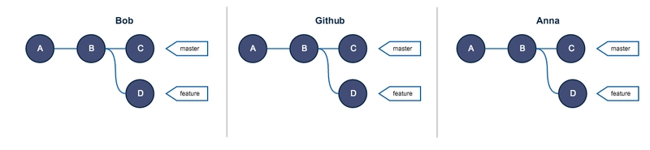

现在Bob为了图一时方便打破了原则(使用了`git rebase`)，正巧这时Anna在特征分支上进行了新的提交，此时的结构图大概是这样的：

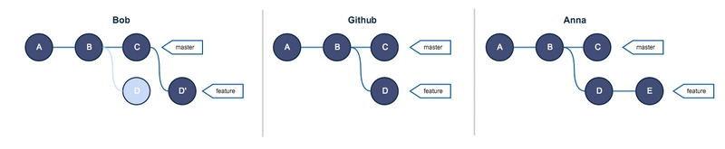

当Bob推送自己的分支到远端的时候，现在的分支情况如下：

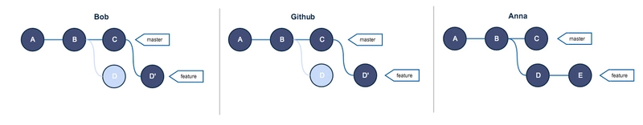

然后呢，当Anna也进行推送的时候，她会得到如下的提醒，Git提醒Anna她本地的版本与远程分支并不一致，需要向远端服务器拉取代码进行同步：

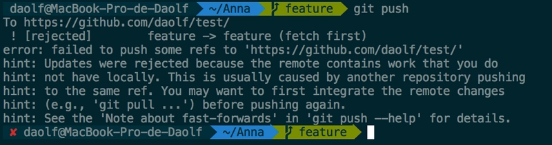

在Anna提交之前，分支中的Commit序列是如下这样的：

```shell
A--B--C--D'   origin/feature // GitHub

A--B--D--E    feature        // Anna
```


在进行Pull操作之后，Git会进行自动地合并操作，结果大概是这样的：

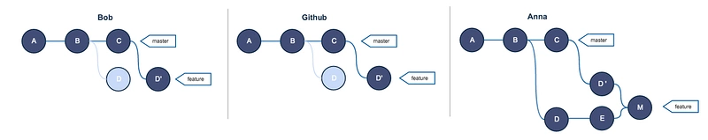

这个第M个提交即代表着合并的提交，也就是Anna本地的分支与Github上的特征分支最终合并的点，现在Anna解决了所有的合并冲突并且可以Push她的代码，在Bob进行Pull之后，每个人的Git Commit结构为：

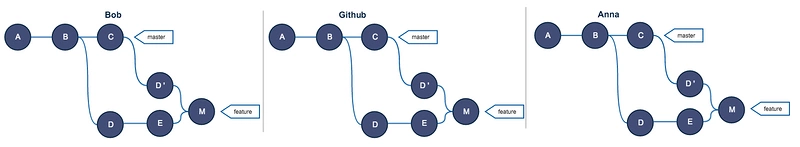

看到上面这个混乱的流线图，相信你对于Rebase和所谓的黄金准则也有了更形象深入的理解。

假设下还有一哥们Emma，第三个开发人员，在他进行了本地Commit并且Push到远端之后，仓库变为了：

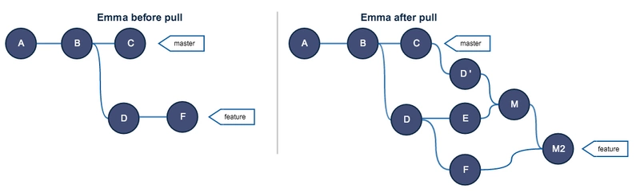

另外，相信你也注意到，在远端的仓库中存有大量的重复的Commit信息，这会大大浪费我们的存储空间。

因此，**不能在一个共享的分支上进行Git rebase操作,避免出现项目分支代码提交记录错乱和浪费存储空间的现象。**


##### 合并commit

merge和rebase还有一个非常重要的功能，就是可以额合并多个commit。

> **场景：**
>
> 我们可能会提交多次代码，但是这几次提交的都是同一模块代码，所有可以合并为一个commit，减少commit的复杂度，方便review

**尝试合并分支最近4次的提交记录**

```shell
git rebase -i HEAD~4
```

> 输入上面命令之后会进入vim模式
>
>  进入编辑模式，第一列为操作指令，第二列为commit号，第三列为commit信息。 - pick：保留该commit - reword：保留该commit但是修改commit信息 - edit：保留该commit但是要修改commit内容 - squash：将该commit和前一个commit合并 - fixup：将该commit和前一个commit合并，并不保留该commit的commit信息 - exec：执行shell命令 - drop：删除该commit 

按照上面命令修改代码，将4条commit合并为1条

```shell
p 799770a add article
s 72530e4 add article
s 53284b1 add article
s 9f6e388 add article
```


### 合并提交

#### 合并一次提交

如果只是想将指定的提交(commit)应用于其他分支

```shell
git cherry-pick <commitHash>
```

例如： 代码仓库有`master`和`feature`两个分支。 

```shell
a - b - c - d   Master
         \
           e - f - g Feature
```

 现在将提交`f`应用到`master`分支。 

```shell
# 切换到 master 分支
$ git checkout master

# Cherry pick 操作
$ git cherry-pick f
```

完成上述操作后，代码库变成：

```shell
a - b - c - d - f   Master
         \
           e - f - g Feature
```

可以看到，master分支的末尾增加了一个提交f


#### 合并多次提交

```shell
git cherry-pick <HashA> <HashB>
```

上面的命令将 A 和 B 两个提交应用到当前分支。这会在当前分支生成两个对应的新提交。 

**如果转移一系列连续提交，可以使用下面的简便语法**

```shell
git cherry-pick A..B 
```

上面的命令可以转移从 A 到 B 的所有提交。它们必须按照正确的顺序放置：**提交 A 必须早于提交 B，否则命令将失败，但不会报错**。 


#### 合并最新提交

参数还可以是分支名，表示转移该分支的最新提交

```shell
git cherry-pick feature
```

上面代码表示将feature分支的最近一次提交，转移到当前分支


### 本地分支链接到远程分支

在本地创建了一个新分支，如果要链接远程分支的话使用如下命令

```shell
git branch --set-upstream-to=origin/<远程分支名> <本地分支名>
#或者是
git branch -u origin/<远程分支名> <本地分支名>
```


## 仓库管理

### 管理本地仓库

#### 创建仓库

```shell
git init #指定当前目录为仓库

git init newrepo  #指定目录为仓库
```


### 管理远程仓库

主要通过`git remote`命令来管理远程仓库

####  列出当前仓库中已配置的远程仓库

```git
git remote
```


#### 添加远程仓库

命令将指定的 GitHub 仓库 URL 添加为本地 Git 仓库的远程仓库，并命名为 “origin”

```shell
git remote add origin <仓库地址> 
```


#### 重命名远程仓库

 将已配置的远程仓库重命名 

```shell
git remote rename <old_name> <new_name>
```


#### 删除远程仓库

 从当前仓库中删除指定的远程仓库 

```shell
git remote remove <remote_name>
```


#### 修改URL

 修改指定远程仓库的 URL 

```shell
git remote set-url <remote_name> <new_url>
```


#### 列出已配置远程仓库

 列出当前仓库中已配置的远程仓库，并显示它们的 URL。 

```shell
git remote -v
```


## 版本、撤销管理

### （1）回退某个文件版本

> [git回退文件版本](https://blog.csdn.net/panweiwei1994/article/details/78501371)

**场景1：**修改了文件/path/to/file，**没有add**，但是觉得改的不好，想还原。

```
git checkout -- /path/to/file
```


**场景二：** 修改了文件/path/to/file，**已经commit**，但是觉得改的不好，想还原到上一版本。 

```shell
#1.首先查看文件的历史版本。
git log /path/to/file

#2. 找到你想要还原的版本。如:
commit 052c0233bcaef35bbf6e6ebd43bfd6a648e3d93b
Author: panww <panww@gmail.com>
Date: Wed Nov 8 11:48:31 2017 +0800
commit modify/path/to/file

#3. 将文件还原到你想要还原的版本。$ git checkout ${commit} /path/to/file。即
git checkout 052c0233bcaef35bbf6e6ebd43bfd6a648e3d93b /path/to/file

```


### （2）撤销add和commit

> [git回退版本](https://blog.csdn.net/yxlshk/article/details/79944535)
>
> [撤销add和commit](https://www.cnblogs.com/FengZeng666/p/15753153.html)

#### 撤销add.

```shell
git reset . #撤销所有的add

git reset <filename> #撤销单个文件修改
```


#### 撤销commit

 git reset的作用是修改HEAD的位置，即将HEAD指向的位置改变为之前存在的某个版本 

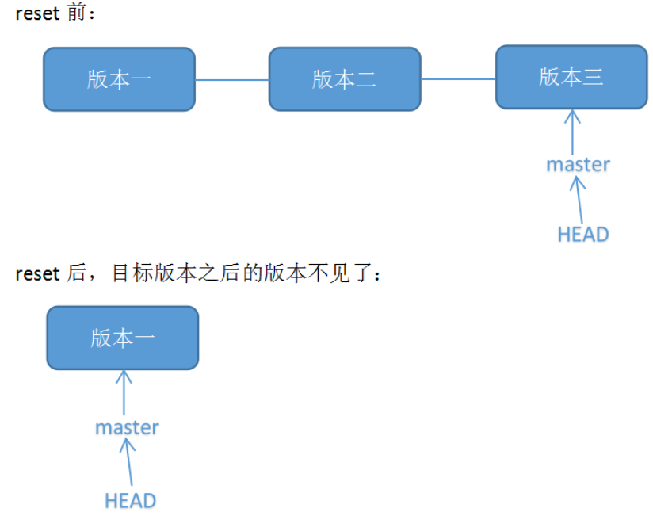 

```shell
git reset --soft HEAD^ 

#HEAD^的意思是上一个版本，也可以写成HEAD~1
#如果你进行了2次commit，想都撤回，可以使用HEAD~2
```

> **其他参数解析：**
>
> - **--soft**
>   不删除工作空间改动代码，撤销commit，**不撤销git add** .
> - **--mixed**
>   不删除工作空间改动代码，撤销commit，**并且撤销git add** .
>   这个为默认参数, git reset --mixed HEAD^ 和 git reset HEAD^ 效果是一样的。
> - **--hard**
>   **删除工作空间改动代码**，撤销commit，**并且撤销git add** .
>
> > 最好不要使用`--hard`，不然改动代码也会被删除


**具体操作：**

**查看版本号：**
可以使用命令“git log”查看： 

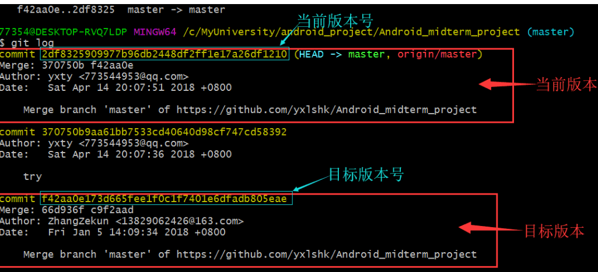 


然后**使用`git reset --hard 目标版本号`命令将版本回退** 

 **使用“git push -f”提交更改：**

> 此时如果用“git push”会报错，因为我们本地库HEAD指向的版本比远程库的要旧： 

  


#### **git revert**

**原理**：` git revert`是用于“反做”某一个版本，以达到撤销该版本的修改的目的。比如，我们commit了三个版本（版本一、版本二、 版本三），突然发现版本二不行（如：有bug），想要撤销版本二，但又不想影响撤销版本三的提交，就可以用 `git revert`命令来反做版本二，生成新的版本四，这个版本四里会保留版本三的东西，但撤销了版本二的东西。如下图所示：
  

**查看版本号：**

如图，最近的两个版本分别叫：“add text.txt”（即新增了文件text.txt）、“add text2.txt”（新增了文件text2.txt）。这个时候我们不需要text.txt这个文件了，那就是说不想要“add text.txt”那个版本的操作，那可以通过反做“add text.txt”这个版本来实现。
  

 **使用“git revert -n 版本号”反做，并使用“git commit -m 版本名”提交：**

（1）反做，使用“git revert -n 版本号”命令。如下命令，我们反做版本号为8b89621的版本： 

```shell
git revert -n 8b89621019c9adc6fc4d242cd41daeb13aeb9861
```

 **注意：** 这里可能会出现冲突，那么需要手动修改冲突的文件。而且要`git add 文件名`。

（2）提交，使用“git commit -m”，如： 

```shell
git commit -m "revert add text.txt" 
```


## 基本仓库操作

首先在本地项目初始化仓库

```shell
git init
```

然后添加远程仓库

```shell
git remote add origin <仓库地址> # 命令将指定的 GitHub 仓库 URL 添加为本地 Git 仓库的远程仓库，并命名为 “origin”
```

然后就可以推送内容了

```shell
git add .
git commit -m "Initial commit"
git push -u origin <远程分支名> #将当前本地分支的内容推送到远程分支名为<远程分支名>的分支
```


# 六.问题

### 1.ssh同时绑定gitee和github

> [同时使用Gitee和Github并设置代理](https://duter2016.github.io/2021/01/22/Git%E5%90%8C%E6%97%B6%E4%BD%BF%E7%94%A8Gitee%E5%92%8CGithub%E5%B9%B6%E8%AE%BE%E7%BD%AE%E4%BB%A3%E7%90%86/)
>
> [github和gitee配置](https://www.css3er.com/p/347.html)

最开始我创建一个ssh同时用于`gitee`和`github`，但是之后发现gitee可以用，但是github一直报`ssh: connect to host github.com port 22: Connection timed out`的错，所以怀疑是不是因为一个ssh不能同时用两个网站。

#### (1)分别绑定gitee和GitHub

所以我**首先按照操作给gitee和github分别设置了ssh密钥。**

```shell
#先删除全局的名字和邮箱
$ git config --global --unset user.name "你的名字"
$ git config --global --unset user.email "你的邮箱"

#生成GitHub 的钥匙
ssh-keygen -t rsa -f "~/.ssh/id_rsa.github" -C "邮箱"

#生成Gitee 的钥匙
ssh-keygen -t rsa -f "~/.ssh/id_rsa.gitee" -C "邮箱"
```


**多账户必须配置config文件**，若无 config 文件，则需创建 config 文件 

```
#Default gitHub user Self
Host github.com
Hostname ssh.github.com
Port 443
HostName github.com
User your@email
PreferredAuthentications publickey
IdentityFile ~/.ssh/id_rsa.github

#Add gitee user
Host gitee.com
HostName gitee.com
User your@email
PreferredAuthentications publickey
IdentityFile ~/.ssh/id_rsa.gitee
```

> > - Host
> >   它涵盖了下面一个段的配置，我们可以通过他来替代将要连接的服务器地址。
> >   这里可以使用任意字段或通配符。
> >   当ssh的时候如果服务器地址能匹配上这里Host指定的值，则Host下面指定的HostName将被作为最终的服务器地址使用，并且将使用该Host字段下面配置的所有自定义配置来覆盖默认的/etc/ssh/ssh_config配置信息。
>
> > - Port
> >   自定义的端口。默认为22，可不配置
>
> > - User
> >   自定义的用户名，默认为git，设置为你的注册邮箱,也可不配置，不写邮箱，每次都报please tell who you are！
>
> > - HostName
> >   真正连接的服务器地址
>
> > - PreferredAuthentications
> >   指定优先使用哪种方式验证，支持密码和秘钥验证方式
>
> > - IdentityFile
> >   指定本次连接使用的密钥文件


**之后再把ssh公钥添加到github和gitee上面，在本地进行测试：**

```shell
ssh -T git@github.com

ssh -T git@gitee.com
```

> **如果报错` Bad owner or permissions on /home/username/.ssh/config `**
>
> 可以参考如下：
>
> [报错bad owner](https://support.huaweicloud.com/modelarts_faq/modelarts_05_3211.html)


#### (2)同时绑定gitee和github

> [绑定gitee和GitHub](https://www.css3er.com/p/347.html)


### 2.git push和git push origin master的区别

> [git push和git push origin master](https://blog.csdn.net/weixin_41287260/article/details/89743120)

**git push是git push origin master的一种简写形式**

> - `origin`远程仓库的别名
> - `master`远程仓库的分支名

（1）当只关联一个远程，只有一个分支时，这两个命令没什么区别。

（2）当你关联了两个甚至多个、有多个分支时，git push可能会报错，因为它不知道要上传代码到哪里去；


### 3.master分支和main分支

> [为什么默认分支从master变为了main](https://pages.carm.cc/doc/branch-main.html)
>
> [Github仓库master分支到main分支迁移指南](https://zhuanlan.zhihu.com/p/339370999)


# 七.文件

### 1.`“.gitignore”`

> 参考：
>
> https://www.freecodecamp.org/chinese/news/gitignore-file-how-to-ignore-files-and-folders-in-git/

#### (1)gitignore应该包含什么

其中一些可能包括：

- 操作系统文件。每个操作系统（如 macOS、Windows 和 Linux）都会生成系统特定的隐藏文件，其他开发者不需要使用这些文件，因为他们的系统也会生成这些文件。例如，在 macOS 上，Finder 会生成一个 `.DS_Store` 文件，其中包括用户对文件夹的外观和显示的偏好，如图标的大小和位置。
- 由代码编辑器和 IDE（IDE 代表集成开发环境）等应用程序生成的配置文件。这些文件是为你、你的配置和你的偏好设置定制的。
- 从你的项目中使用的编程语言或框架自动生成的文件，以及编译后的代码特定文件，如 `.o` 文件。
- 由软件包管理器生成的文件夹，如 npm 的 `node_modules` 文件夹。这是一个用于保存和跟踪你在本地安装的每个软件包的依赖关系的文件夹。
- 包含敏感数据和个人信息的文件。这类文件的一些例子是含有你的凭证（用户名和密码）的文件和含有环境变量的文件，如 `.env` 文件（`.env` 文件含有需要保持安全和隐私的 API 密钥）。
- 运行时文件，如 `.log` 文件。它们提供关于操作系统的使用活动和错误的信息，以及在操作系统中发生的事件的历史。

#### (2)忽略操作

**忽略一个文件和文件夹**

如果想忽略一个根目录下的`text.txt`文件

```
/text.txt
```

如果想忽略一个根目录下的目录`test`下的`text.txt`文件

```
/test/text.txt
或者
test/text.txt
```

如果想忽略所有特定名称的文件：例如忽略任何`text.txt`文件：

```
text.txt
```


如果想忽略目录及其所有内容( 这个命令将忽略位于你的项目中任何地方的名为 `test` 的目录（包括目录中的其他文件和其他子目录))

```
test/
```


忽略所有以`img`开头的文件和目录

```
img*
```

忽略所有以`.md`文件结尾的文件

```
*.md
```


**不忽略某些文件**

有些文件可能是例外，例如`README.md`

```
# 忽略所有 .md 文件
.md

# 不忽略 README.md 文件
!README.md
```

> **注意，如果是一个已经被忽略的目录，要想不忽略它底下的文件和目录是不可行的**
>
> ```
> # 忽略所有名字带有 test 的目录
> test/
> 
> # 试图在一个被忽略的目录内排除一个文件是行不通的
> !test/example.md
> ```
>


# 命令

## cherry-pick

> https://www.ruanyifeng.com/blog/2020/04/git-cherry-pick.html

