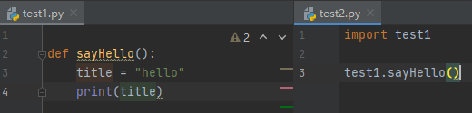

# Py1

## 一.

### 1.模块导入

- **import：引入一个模块整体**

  > 
  >
  > ```python
  > import module1[, module2[,... moduleN]]
  > ```
  >
  > 

- **from**

  > 
  >
  > ```python
  > from test1 import sayHello as new #进行更名
  > new()
  > ```
  >
  > 

  

- **reload():是一个函数**

 导入是一个开销很大的操作，以至于每个程序运行只可以导入一次。想再次运行除非调用内置reload函数： 

  


> 常用模块
>
> ```
> difflib python diff比较模块
> datetime python 处理日期与时间的模块
> chardet 字符串/文件 编码检测(很好用)
> 
> adodb：数据库连接组件
> Cheetah-1.0：我比较喜欢这个版本的cheetah
> cherrypy：一个WEB framework
> ctypes：用来调用动态链接库
> DBUtils：数据库连接池
> django：一个WEB framework
> docutils：用来写文档的
> dpkt：数据包的解包和组包
> MySQLdb：连接MySQL数据库的
> py2exe：用来生成windows可执行文件
> Pylons：推荐的web framework
> pysqlite2：SQLite的连接组件
> pythonwin：Python的Windows扩展
> setuptools：PEAK的一套python包管理机制
> sqlalchemy：数据库连接池
> SQLObject：数据库连接池
> twisted：巨无霸的网络编程框架
> pypcap：抓包的
> python-dnet：控制网络安全的其他设备
> pyevent：Python的事件支持
> pydot：画图的，graphiz
> sendpkt：Python发包
> simplejson：JSON的支持
> 
> DPKT：raw-scoket网络编程
> Cx-oracle：连接oracle的好东东
> Mechanize：爬虫连接网站常用
> PIL：图像处理工具包
> ```
>
> 


#### (1)模块导入详解

> https://blog.csdn.net/Dteam_f/article/details/121615753

**概念**

> **python模块（Module）**：
> 以.py结尾的python文件，其中的成员可以包括“变量、函数、类 ”等等。
>
> **python包（package）**：
> 简单来说，包就是文件夹，但该文件夹下一般存在 __init__.py 文件（python3不严格要求，但强烈建议）, 该文件的内容可以为空。__init__.py 用于标识当前文件夹是一个包，当一个包被import时，首先会自动加载它的__init__.py文件。
>
> **搜索路径：**
> 当导入一个模块，Python 解析器对模块位置的搜索顺序是：
>
> - 当前目录
> - 如果不在当前目录，Python 则搜索在 shell 变量 PYTHONPATH 下的每个目录。
> - 如果都找不到，Python会察看默认路径。UNIX下，默认路径一般为/usr/local/lib/pythonx.x/… ，anaconda安装一般为/xxx/anacondax/pythonx.x/lib/… 。

**语法：**

> ## import [module | package] ：
>
> import语句用来载入模块，使用这种语法格式的 import 语句，会导入指定模块中的所有成员（包括变量、函数、类等）。当需要使用模块中的成员时，需用该模块名作为前缀，否则 Python 解释器会报错。
>
> > ```python
> > import PIL.Image
> > 
> > PIL.Image.new #正确
> > 
> > new #错误
> > ```
> >
> > PIL是包，Image是模块。Import 模块（Image）后，需要使用其中的函数（new）还是需要写上完整的前缀（PIL.Image.new）  
> >
> >  ```python
> > import PIL
> > 
> > PIL.Image #如果没有init指明，则报错
> >  ```
> >
> > 包（PIL）可也被直接import，但是如果只是导入一个包而不指名任何模块，且包中的__init__.py没有任何初始化操作，那么并不可以使用包内的模块及模块内的函数。 
> >
> > ```python
> > import PIL.Image.new #错误
> > ```
> >
> >  import语句不能直接引用模块内的成员。 
>
> ## from [module | package] import [member | module]：
>
> from … import … 可以从模块中引用它内部的成员（函数，变量等），此时可以不加模块的前缀直接使用。（建议使用某模块少量成员时使用此方法）
>
> from … import … 可以从包中引用模块，此时可以直接使用”模块名.成员名“来调用模块内的所有成员。
>
> > ```python
> > from PIL.Image import new
> > 
> > new
> > ```
> >
> >  PIL.Image 是模块，new是模块内的函数，new可以不加模块前缀（Image）直接使用。 
> >
> > ```python
> > from PIL import Image
> > 
> > Image.new
> > ```
> >
> >  其中PIL是包，Image是模块。引用后可以使用”模块名.成员名“来调用模块内的所有成员。 


### 2.函数

#### 主函数

 python中是没有你理解中的“main()”方法的。

```python
if __name__ == "__main__":
```

可以看成是python程序的入口，就像java中的main()方法，但不完全正确。 

> __name__其实是一个内置属性，指示当前py文件调用方式的方法。当上述例子运行的时候，整个程序中不管是哪个位置的__name__属性，值都是__main__,当这个hello.py文件作为模块被导入到另一个.py文件中(即import)比如说world.py，并且你运行的是world.py，此时hello.py中的__name__属性就会变成hello，所谓的入口因为if判断失败就不执行了。( *每个文件都有一个内置的属性叫__name__，这个值取决于该文件如何执行。如果这个文件是直接执行的，__name__的值等于__main__；如果这个文件是被别的文件调用的，那么__name__值就是该文件的名字(不含后缀)。* )
>
> 所以if语句的判断成功虚拟了一个main()方法。

#### 函数

```python
def functionname( parameters ):
   "函数_文档字符串"
   function_suite
   return [expression]
```


##### 关键字参数

关键字参数和函数调用关系紧密，函数调用使用关键字参数来确定传入的参数值。

使用关键字参数允许函数调用时参数的顺序与声明时不一致

```python
#可写函数说明
def printinfo( name, age ):
   "打印任何传入的字符串"
   print "Name: ", name
   print "Age ", age
   return
 
#调用printinfo函数
printinfo( age=50, name="miki" ) #关键字参数使得参数顺序不那么重要
```

##### 指定参数类型

```python
from typing import List  # 导入该模块，使函数参数不报错
#指定传入参数类型，对于序列类型要导入typing包模块
def canJump(nums: List[int]) -> bool:
```


##### 默认参数

如果没有传入，则默认使用

```python
def printinfo( name, age = 50 ):
   "打印任何传入的字符串"
   print "Name: ", name
   print "Age ", age
   return
```

##### 不定长参数

 可能需要一个函数能处理比当初声明时更多的参数。这些参数叫做不定长参数 

```python
# 可写函数说明
def printinfo( arg1, *vartuple ):
   "打印任何传入的参数"
   print "输出: "
   print arg1
   for var in vartuple:
      print var
   return
 
# 调用printinfo 函数
printinfo( 10 )
printinfo( 70, 60, 50 )
```


##### 匿名参数

 使用 lambda 来创建匿名函数。 

- lambda的主体是一个表达式，而不是一个代码块。仅仅能在lambda表达式中封装有限的逻辑进去。
- lambda函数拥有自己的命名空间，且不能访问自有参数列表之外或全局命名空间里的参数。
- 虽然lambda函数看起来只能写一行，却不等同于C或C++的内联函数，后者的目的是调用小函数时不占用栈内存从而增加运行效率。

```python
lambda [arg1 [,arg2,.....argn]]:expression
```

```python
# 可写函数说明
sum = lambda arg1, arg2: arg1 + arg2
 
# 调用sum函数
print "相加后的值为 : ", sum( 10, 20 )
print "相加后的值为 : ", sum( 20, 20 )
```


##### 返回类型

可以特别指定函数的返回类型

```python
def uniquePaths(self, m: int, n: int) -> int:
```


##### call()

如果在创建class的时候写了**call**（）方法， 那么该class实例化出实例后， 实例名()就是调用**call**（）方法。 

```python
class Animal(object):

    __call__(self, words):
        print "Hello: ", words

if __name__ == "__main__":
    cat = Animal()
    cat("I am cat!")

>>> Hello: I am cat!
```


### 3.程序结构

Python的程序由包，模块（即一个Python文件）和函数组成。包是由一系列模块组成的集合。模块是处理某一类问题的函数和类的集合。


包中必须至少含有一个`__init__.py`文件，该文件的内容可以为空。用于标识当前文件夹是一个包。


### 4.条件判断以及循环


#### if

```python
from test1 import sayHello as new,title

if title=="ss":
    print(title)
elif title == "":
    print("none")
else:
    new()
```


#### for

```python
a=[1,2,3,4]
for x in a:
    print(x)
```


**遍历`range`**

```python
for i in range(3): 
    print(i, 'Pythons',sep='-')
   
0-Pythons
1-Pythons
2-Pythons
```

**还可以将遍历出来的数据执行方法**

```python
test3 = ["尊敬的市民：", np.nan, "您好!首先感谢您的信任！您的留言已收悉。"]
test3[isinstance(t, str) for t in test3]
```


#### while

```python
x = "span"
while x:
    print(x)
    x=x[1:] #每次截取第二个字符到最后
    
span
pan
an
n
```


**break,continue**

```python
x = "span"
while x:
    print(x)
    if x == "pan":
        break
    x=x[1:]
```

#### pass

pass 是空语句，是为了保持程序结构的完整性。

**pass** 不做任何事情，一般用做占位语句。

```python
def count():
    sum = 0
    for i in range(5):
        sum += i
        if i == 2:
            pass
            print('this is pass')

    print(sum)
```

### 5.数据类型


#### (1)数字类型

```python
i = 3.14
i = int(i)
print(i)

3
```

```python
#复数
c = 1.0 + 2.3j
c = complex(1.0, 2.3)
print(c.real,c.imag)
```


##### 运算符号

```python
3 // 2.0 # 整除
 
3 ** 2 # 幂运算 =3^2

~1 # 1取反后为-2的补码

1 ^ 3 # 01 和 11 异或得到10，就是2

1 | 3 # 01 和 11 位或得到11，就是3

1 & 3 # 01 和 11 位与得到01，就是1
```


##### 常用数字型函数

```python
print(abs(-2)) #绝对值

#########
divmod(10, 3) #把除法和取余运算结合起来，返回一个包含商和余数的元组。

##########
pow(2, 5) # 2**5
pow(2, 5, 10)  #2**5%10

##########
round(3.4) #四舍五入

#conjugate()：复数取共轭
c = 2 + 3j
c.conjugate()
(2-3j)
```


```python
from math import floor,ceil,sqrt
floor(3.6) #向下取整 -- 3
ceil(3.6) #向上取整 --4
sqrt(9) #开方 --3
```


**正负无穷**

```python
# 正无穷
print(float("inf"))
print(float("inf")+1)
# 负无穷
print(float("-inf"))
print(float("-inf")+1)

# 输出
inf
inf
-inf
-inf


```


#### (2)序列类型

列表和元组是任意对象的序列，*字符串和元组是不可变的*。

##### 字符串

```python
s = '''string'''

用于保留原样输出
email_message ='''
亲爱的赵飞用户：
    你注册的抖音用户未激活，请点击下方的链接激活用户，
    请点击：激活用户
    激活用户后可以刷抖音视频。

  From：douyin.team
     date:2020/7/19
'''
print(email_message)
```

 


###### 方法

| 方法                             | 描述                                                         |
| -------------------------------- | ------------------------------------------------------------ |
| index(sub[,start[,end]])         | 找到子字符串sub首次出现的位置，否则报错                      |
| find(sub[,start[,end]])          | 找到子字符串sub首次出现的位置，否则返回-1；(`rfind`从右边开始) |
| startswith(prefix[,start[,end]]) | 检查是否以prefix开头                                         |
| count(sub[,start[,end]])         | 计算子字符串sub出现的次数                                    |
| decode([encoding[, errors]])     | 以dencoding解码字符串，返回unicode字符串(只用于字节字符串)   |
| encode([encoding[, errors]])     | 以encoding编码字符串(只用于unicode字符串)                    |
| upper()                          | 返回大写形式                                                 |
| lower()                          | 返回小写形式                                                 |
| split(sep[,maxsplit])            | 以sep为分隔符分割字符串，maxsplit为最大分割次数              |
| join(t)                          | 使用当前字符串为分隔符连接t中的字符串                        |
| format(*args, **kwargs)**        | 格式化字符串                                                 |


**decode & encode**

> 两个语法
>  Encode: 把普通字符串 转为 机器可识别的bytes
>  Decode: 把bytes转为字符串
>
> 两个差异
>  Python3的str 默认不是bytes，所以不能decode，只能先encode转为bytes，再decode
>  python2的str 默认是bytes，所以能decode


**join**

```python
strIndex = 'abcdefg'
str2 = ','
i = str2.join(strIndex)

a,b,c,d,e,f,g
```


**format**

```python
"Here is {0},I'm {name}.".format("wuyuans.com", name="wuyuan")
"Here is wuyuans.com,I'm wuyuan"
```


##### 列表/元组

```python
l = [1, 2, 3, '4', '5'] # 列表
l = list((1, 2, 3, '4', '5'))


t = (1, 2, 3, '4', '5') # 元组
t = tuple("1234")
```


**列表:**

| 方法                        | 描述                                   |
| --------------------------- | -------------------------------------- |
| list(s)                     | 将s转化为一个列表                      |
| s.append(x)                 | 将新元素x加到s的尾部                   |
| s.extend(t)                 | 将新列表t加到s的尾部                   |
| s.count(x)                  | 计算x的出现次数                        |
| s.index(x[, start[, stop]]) | 搜索x元素                              |
| s.insert(i, x)              | 在i处添加x                             |
| s.pop([i])                  | 弹出第i个元素，如果省略i，弹出最后一个 |
| s.remove(x)                 | 移除x                                  |
| s.reverse(x)                | 反转列表                               |
| s.sort([key[, reverse]])    | 排序                                   |


```python
l = [1,2,3]
del l[0] #可以直接通过下标删除

t = (1,2,3)
```


###### 序列操作

 所有序列都可以通过索引来访问

第一个元素的索引为0，-1为最后一个元素，-2倒数第二个，以此类推。 

切片：指定索引范围，返回相应子序列

```python
t[1:4] # 索引1~4
t[1:4:2] # 索引1~4，步进为2

len(t)
max(t)
min(t)
sum(t)
```


##### xange()对象

 xrange()对象比较特殊，表示一个整数范围，只有访问它时才会计算他的值，*所以切片操作是不能用于xrange对象的*。

**xrange([i, ] j [, stride])**

> 函数创建，i为起始值，stride为步进值。 

```python
x= xrange(1,10,2)
for i in x:
    print(i)
    
1
3
5
7
9
```


##### 字典

 字典(dict)是python为唯一的内置映射类型，任何**不可变对象都可以用作字典的键值，如字符串、数字、元组等**。字典使用大括号表示，键和值之间用冒号分割，各个键值间用逗号隔开。映射对象是无序的。 

```python
d = {'name':'kevin','age':17}
for i in d:
    print(i+':',end="")
    print(d[i])
    
name:kevin
age:17
```

| 方法和操作             | 描述                                                   |
| ---------------------- | ------------------------------------------------------ |
| len(d)                 | 返回字典d的项目数                                      |
| d[k]                   | d中键k的值                                             |
| del d[k]               | 删除d[k]                                               |
| k in d                 | 如果k是d的键值，返回True                               |
| d.clear()              | 清空d                                                  |
| d.copy()               | 返回d的一个拷贝                                        |
| d.fromkeys(s[, value]) | 返回一个新字典，s中的所有元素作为新字典的键，值为value |
| d.get(k[, v])          | 返回d[k]，没有则返回v                                  |
| d.items()              | 返回由键值组成的序列，主要用于历遍                     |
| d.keys()               | 返回由键组成的序列                                     |
| d.values()             | 返回由值组成的序列                                     |
| d.pop(k[, default])    | 弹出d[k]，没有则返回default                            |
| d.update(b)            | 将b中对象添加到d中                                     |


```python
d = {'name':'kevin','age':17}
print(d.pop('age'))
```

```python
a = {'one': 1, 'two': 2, 'three': 3}
a.update({'one':4.5, 'four': 9.3})
print(a)

{'one': 4.5, 'two': 2, 'three': 3, 'four': 9.3}
```

**遍历**

```python
for k,v in d.items():
    print(k,v,sep=':')
```


##### 集合

 集合是**唯一项**的无序集，集合**不提供索引或切片**操作，集合的长度可变，但**内容必须是不可变**的。集合分为两种：可变集合(set)和不可变集合(frozenset)。 

```python
s = set([1, 2, 3])
fs = frozenset([1, 2, 3])
```


**通用方法**

| 方法和操作        | 描述                               |
| ----------------- | ---------------------------------- |
| len(s)            | 返回集合s的项目数                  |
| s.copy()          | 返回集合s的一份副本                |
| s.difference(t)   | 求差集，返回在s中，但不在t中的项目 |
| s.intersection(t) | 求交集，返回同时在s和t中的项目     |
| s.isdisjoint(t)   | s和t中没有相同项，返回True         |
| s.issubset(t)     | s是t的子集，返回True               |
| s.issuperset(t)   | s是t的超集，返回True               |
| s.union(t)        | 求并集，返回在s或t中的项目         |

**可变集合set的方法和操作**

| 方法和操作             | 描述                                      |
| ---------------------- | ----------------------------------------- |
| s.add(item)            | 添加item                                  |
| s.clear()              | 清空集合s                                 |
| s.difference_update(t) | 在s中删除同时在s和t中的项目               |
| s.discard(item)        | 删除item                                  |
| s.pop()                | 弹出***任一项***                          |
| s.remove(item)         | 删除item，*没有则引发异常*                |
| s.update(t)            | 将t中所有项添加到s中，t为任意支持迭代对象 |


#### (3)日期和时间

Python 提供了一个 time 和 calendar 模块可以用于格式化日期和时间。

时间间隔是以秒为单位的浮点小数。

每个时间戳都以自从1970年1月1日午夜（历元）经过了多长时间来表示。

```python
import time

t = time.time()
print(t)
```


##### **时间元组：**

| 序号 | 字段         | 值                                   |
| :--- | :----------- | :----------------------------------- |
| 0    | 4位数年      | 2008                                 |
| 1    | 月           | 1 到 12                              |
| 2    | 日           | 1到31                                |
| 3    | 小时         | 0到23                                |
| 4    | 分钟         | 0到59                                |
| 5    | 秒           | 0到61 (60或61 是闰秒)                |
| 6    | 一周的第几日 | 0到6 (0是周一)                       |
| 7    | 一年的第几日 | 1到366 (儒略历)                      |
| 8    | 夏令时       | -1, 0, 1, -1是决定是否为夏令时的旗帜 |

其属性：

| 序号 | 属性     | 值                                   |
| :--- | :------- | :----------------------------------- |
| 0    | tm_year  | 2008                                 |
| 1    | tm_mon   | 1 到 12                              |
| 2    | tm_mday  | 1 到 31                              |
| 3    | tm_hour  | 0 到 23                              |
| 4    | tm_min   | 0 到 59                              |
| 5    | tm_sec   | 0 到 61 (60或61 是闰秒)              |
| 6    | tm_wday  | 0到6 (0是周一)                       |
| 7    | tm_yday  | 1 到 366(儒略历)                     |
| 8    | tm_isdst | -1, 0, 1, -1是决定是否为夏令时的旗帜 |

```python
import time

time_struct = time.localtime(time.time())
print(time_struct)
#time.struct_time(tm_year=2023, tm_mon=3, tm_mday=10, tm_hour=15, tm_min=27, tm_sec=36, tm_wday=4, tm_yday=69, tm_isdst=0)
```


##### 获取格式化时间

**①使用asctime函数**

```python
import time
 
localtime = time.asctime( time.localtime(time.time()) )
print "本地时间为 :", localtime
#本地时间为 : Thu Apr  7 10:05:21 2016
```

**②使用strftime函数**

```python
time.strftime(format[, t])
```

```python
import time

import time
 
# 格式化成2016-03-20 11:45:39形式
print time.strftime("%Y-%m-%d %H:%M:%S", time.localtime()) 
 
# 格式化成Sat Mar 28 22:24:24 2016形式
print time.strftime("%a %b %d %H:%M:%S %Y", time.localtime()) 
  
# 将格式字符串转换为时间戳
a = "Sat Mar 28 22:24:24 2016"
print time.mktime(time.strptime(a,"%a %b %d %H:%M:%S %Y"))
```

> 日期格式化符号：
>
> - %y 两位数的年份表示（00-99）
> - %Y 四位数的年份表示（000-9999）
> - %m 月份（01-12）
> - %d 月内中的一天（0-31）
> - %H 24小时制小时数（0-23）
> - %I 12小时制小时数（01-12）
> - %M 分钟数（00-59）
> - %S 秒（00-59）
> - %a 本地简化星期名称
> - %A 本地完整星期名称
> - %b 本地简化的月份名称
> - %B 本地完整的月份名称
> - %c 本地相应的日期表示和时间表示
> - %j 年内的一天（001-366）
> - %p 本地A.M.或P.M.的等价符
> - %U 一年中的星期数（00-53）星期天为星期的开始
> - %w 星期（0-6），星期天为星期的开始
> - %W 一年中的星期数（00-53）星期一为星期的开始
> - %x 本地相应的日期表示
> - %X 本地相应的时间表示
> - %Z 当前时区的名称
> - %% %号本身

##### 获取日历

```python
import calendar

cal = calendar.month(2023, 1)
print(cal)
'''
January 2023
Mo Tu We Th Fr Sa Su
                   1
 2  3  4  5  6  7  8
 9 10 11 12 13 14 15
16 17 18 19 20 21 22
23 24 25 26 27 28 29
30 31
'''
```

##### time模块

| 序号 | 函数及描述                                                   |
| :--- | :----------------------------------------------------------- |
| 1    | [time.altzone](https://www.runoob.com/python/att-time-altzone.html) 返回格林威治西部的夏令时地区的偏移秒数。如果该地区在格林威治东部会返回负值（如西欧，包括英国）。对夏令时启用地区才能使用。 |
| 2    | [time.asctime([tupletime\])](https://www.runoob.com/python/att-time-asctime.html) 接受时间元组并返回一个可读的形式为"Tue Dec 11 18:07:14 2008"（2008年12月11日 周二18时07分14秒）的24个字符的字符串。 |
| 3    | [time.clock( )](https://www.runoob.com/python/att-time-clock.html) 用以浮点数计算的秒数返回当前的CPU时间。用来衡量不同程序的耗时，比time.time()更有用。 |
| 4    | [time.ctime([secs\])](https://www.runoob.com/python/att-time-ctime.html) 作用相当于asctime(localtime(secs))，未给参数相当于asctime() |
| 5    | [time.gmtime([secs\])](https://www.runoob.com/python/att-time-gmtime.html) 接收时间戳（1970纪元后经过的浮点秒数）并返回格林威治天文时间下的时间元组t。注：t.tm_isdst始终为0 |
| 6    | [time.localtime([secs\])](https://www.runoob.com/python/att-time-localtime.html) 接收时间戳（1970纪元后经过的浮点秒数）并返回当地时间下的时间元组t（t.tm_isdst可取0或1，取决于当地当时是不是夏令时）。 |
| 7    | [time.mktime(tupletime)](https://www.runoob.com/python/att-time-mktime.html) 接受时间元组并返回时间戳（1970纪元后经过的浮点秒数）。 |
| 8    | [time.sleep(secs)](https://www.runoob.com/python/att-time-sleep.html) 推迟调用线程的运行，secs指秒数。 |
| 9    | [time.strftime(fmt[,tupletime\])](https://www.runoob.com/python/att-time-strftime.html) 接收以时间元组，并返回以可读字符串表示的当地时间，格式由fmt决定。 |
| 10   | [time.strptime(str,fmt='%a %b %d %H:%M:%S %Y')](https://www.runoob.com/python/att-time-strptime.html) 根据fmt的格式把一个时间字符串解析为时间元组。 |
| 11   | [time.time( )](https://www.runoob.com/python/att-time-time.html) 返回当前时间的时间戳（1970纪元后经过的浮点秒数）。 |
| 12   | [time.tzset()](https://www.runoob.com/python/att-time-tzset.html) 根据环境变量TZ重新初始化时间相关设置。 |


##### calendar模块

| 序号 | 函数及描述                                                   |
| :--- | :----------------------------------------------------------- |
| 1    | **calendar.calendar(year,w=2,l=1,c=6)** 返回一个多行字符串格式的year年年历，3个月一行，间隔距离为c。 每日宽度间隔为w字符。每行长度为21* W+18+2* C。l是每星期行数。 |
| 2    | **calendar.firstweekday( )** 返回当前每周起始日期的设置。默认情况下，首次载入 calendar 模块时返回 0，即星期一。 |
| 3    | **calendar.isleap(year)** 是闰年返回 True，否则为 False。`>>> import calendar >>> print(calendar.isleap(2000)) True >>> print(calendar.isleap(1900)) False` |
| 4    | **calendar.leapdays(y1,y2)** 返回在Y1，Y2两年之间的闰年总数。 |
| 5    | **calendar.month(year,month,w=2,l=1)** 返回一个多行字符串格式的year年month月日历，两行标题，一周一行。每日宽度间隔为w字符。每行的长度为7* w+6。l是每星期的行数。 |
| 6    | **calendar.monthcalendar(year,month)** 返回一个整数的单层嵌套列表。每个子列表装载代表一个星期的整数。Year年month月外的日期都设为0;范围内的日子都由该月第几日表示，从1开始。 |
| 7    | **calendar.monthrange(year,month)** 返回两个整数。第一个是该月的星期几的日期码，第二个是该月的日期码。日从0（星期一）到6（星期日）;月从1到12。 |
| 8    | **calendar.prcal(year,w=2,l=1,c=6)** 相当于 **print calendar.calendar(year,w=2,l=1,c=6)**。 |
| 9    | **calendar.prmonth(year,month,w=2,l=1)** 相当于 **print calendar.month(year,month,w=2,l=1)** 。 |
| 10   | **calendar.setfirstweekday(weekday)** 设置每周的起始日期码。0（星期一）到6（星期日）。 |
| 11   | **calendar.timegm(tupletime)** 和time.gmtime相反：接受一个时间元组形式，返回该时刻的时间戳（1970纪元后经过的浮点秒数）。 |
| 12   | **calendar.weekday(year,month,day)** 返回给定日期的日期码。0（星期一）到6（星期日）。月份为 1（一月） 到 12（12月）。 |


#### (4)type查看类型

使用该函数查看类型

```python
a = 1;
type(a)
```


#### (5)判空

```python
if X is None:
```


#### (6)队列

> https://www.jianshu.com/p/6acf82c84fc5

```python
from queue import Queue
```

模块实现了三种类型的队列，它们的区别仅仅是条目取回的顺序，分别由3个类进行表示，Queue，LifoQueue，PriorityQueue

- queue.Queue(maxsize=0)

  > 先进先出队列，maxsize 是个整数，用于设置可以放入队列中的项目数的上限。当达到这个大小的时候，插入操作将阻塞至队列中的项目被消费掉。如果 maxsize 小于等于零，队列尺寸为无限大。
  >
  > ```python
  > from queue import Queue
  > # FIFO
  > queue_obj = Queue()  # 创建一个队列对象
  > for i in range(4):
  >     queue_obj.put(i)
  > while not queue_obj.empty():
  >     print(queue_obj.get())
  > 
  > # 输出顺序
  > 0
  > 1
  > 2
  > 3
  > ```
  >
  > 

- queue.LifoQueue(maxsize=0)

  > 后进先出
  >
  > ```python
  > from queue import Queue,LifoQueue
  > 
  > # LIFO
  > queue_obj = LifoQueue()  # 创建一个队列对象
  > for i in range(4):
  >     queue_obj.put(i)
  > while not queue_obj.empty():
  >     print(queue_obj.get())
  >  
  > # 输出顺序
  > 3
  > 2
  > 1
  > 0
  > ```
  >
  > 

- queue.PriorityQueue(maxsize=0)

  > 优先级队列构造器，按照级别顺序取出元素，级别最低的最先取出
  > 队列中的元素一般采取元组的形式进行存储**`(priority_number, data)`**
  >
  > ```python
  > # 优先级不同
  > PriorityQueue_obj = PriorityQueue()
  > PriorityQueue_obj.put((5,45))
  > PriorityQueue_obj.put((1,42))
  > PriorityQueue_obj.put((2,47))
  > while not PriorityQueue_obj.empty():
  >     print(PriorityQueue_obj.get())
  > # 输出顺序
  > (1, 42)
  > (2, 47)
  > (5, 45)
  > ```
  >
  > ```python
  > # 优先级相同，比较数字大小
  > priorityQueue_obj = PriorityQueue()
  > priorityQueue_obj.put((1,45))
  > priorityQueue_obj.put((1,42))
  > priorityQueue_obj.put((1,47))
  > while not PriorityQueue_obj.empty():
  >     print(PriorityQueue_obj.get())
  > 
  > (1, 42)
  > (1, 45)
  > (1, 47)
  > 
  > priorityQueue_obj = PriorityQueue()
  > priorityQueue_obj.put((1,[1,4]))
  > priorityQueue_obj.put((1,[2,4]))
  > priorityQueue_obj.put((1,[2,3]))
  > while not PriorityQueue_obj.empty():
  >     print(PriorityQueue_obj.get())
  >     
  > (1, [1, 4])
  > (1, [2, 3])
  > (1, [2, 4])
  > 当优先级一样的时候，会在比较数据部分的大小，同上字符串也可以比较大小，
  > ```

**常用方法**

**①Queue.qsize()**

> 返回队列的大致大小。

**②Queue.empty()**

> 如果队列为空，返回 True ，否则返回 False 。

**③Queue.full()**

> 如果队列是满的返回 True ，否则返回 False 。

**④Queue.put(item, block=True, timeout=None)**

> 将 item 放入队列。如果可选参数 block 是 true 并且 timeout 是 None (默认)，则在必要时阻塞至有空闲插槽可用。如果 timeout 是个正数，将最多阻塞 timeout 秒，如果在这段时间没有可用的空闲插槽，将引发 Full 异常。反之 (block 是 false)，如果空闲插槽立即可用，则把 item 放入队列，否则引发 Full 异常 ( 在这种情况下，timeout 将被忽略)。

**⑤Queue.put_nowait(item)**

> 相当于 put(item, block=False)。

**⑥Queue.get(block=True, timeout=None)**

> 从队列中移除并返回一个项目。如果可选参数 block 是 true 并且 timeout 是 None (默认值)，则在必要时阻塞至项目可得到。如果 timeout 是个正数，将最多阻塞 timeout 秒，如果在这段时间内项目不能得到，将引发 Empty 异常。反之 (block 是 false) , 如果一个项目立即可得到，则返回一个项目，否则引发 Empty 异常 (这种情况下，timeout 将被忽略)。

**⑦Queue.get_nowait()**

> 相当于 get(block=False) 。

**⑧Queue.task_done()**

> 在完成一项工作以后，task_done()告诉队列，该任务已处理完成

**⑨Queue.join()**

> 阻塞至队列中所有的元素都被接收和处理完毕。
> 队列添加新工作时，未完成任务的计数就会增一，当调用task_done()函数后，就代表执行完一个工作，未完成任务的计数就会减一，当计数为0时 join() 阻塞被解除。
>

##### 阻塞与抛出异常

阻塞的意思就是当添加元素超过长度时候，这时候就不着急添加该元素，一直阻塞，知道取出一个时间之后解除阻塞

> 参考——https://blog.csdn.net/qq_52007481/article/details/125673224

### 6.I/O

#### (1)读取键盘输入

-  ***raw_input([prompt])*** : 从标准输入读取一个行，并返回一个字符串（去掉结尾的换行符）(**已经被弃用**) 

-  ***input([prompt])*** :函数和 **raw_input([prompt])** 函数基本类似，但是 input 可以接收一个Python表达式作为输入，并将运算结果返回。 

  > ```python
  > str = input('输入:')
  > print('输入内容：', str)
  > ```
  >
  > ```
  > 请输入：[x*5 for x in range(2,10,2)]
  > 你输入的内容是:  [10, 20, 30, 40]
  > ```

#### (2)读写文件

##### **open()**

 先用Python内置的open()函数打开一个文件，创建一个file对象，相关的方法才可以调用它进行读写。 

```python
file object = open(file_name [, access_mode][, buffering])
# access_mode：access_mode决定了打开文件的模式：只读，写入，追加等。所有可取值见如下的完全列表。这个参数是非强制的，默认文件访问模式为只读(r)。
# buffering:如果buffering的值被设为0，就不会有寄存。如果buffering的值取1，访问文件时会寄存行。如果将buffering的值设为大于1的整数，表明了这就是的寄存区的缓冲大小。如果取负值，寄存区的缓冲大小则为系统默认。
```

> access_mode:https://www.runoob.com/python/python-files-io.html
>
> |    模式    |  r   |  r+  |  w   |  w+  |  a   |  a+  |
> | :--------: | :--: | :--: | :--: | :--: | :--: | :--: |
> |     读     |  +   |  +   |      |  +   |      |  +   |
> |     写     |      |  +   |  +   |  +   |  +   |  +   |
> |    创建    |      |      |  +   |  +   |  +   |  +   |
> |    覆盖    |      |      |  +   |  +   |      |      |
> | 指针在开始 |  +   |  +   |  +   |  +   |      |      |
> | 指针在结尾 |      |      |      |      |  +   |  +   |

##### **file对象**

当打开一个文件之后，就得到了一个file对象，可以获取该文件的各种信息。

| 属性           | 描述                                                         |
| :------------- | :----------------------------------------------------------- |
| file.closed    | 如果文件已被关闭返回true，否则返回false。                    |
| file.mode      | 返回被打开文件的访问模式。                                   |
| file.name      | 返回文件的名称。                                             |
| file.softspace | 如果用print输出后，必须跟一个空格符，则返回false。否则返回true。 |


##### **read()**

 read（）方法从一个打开的文件中读取一个字符串。 （为给定或负数则读完）

```python
file = open("./test.txt", "r")
print(file.read(5))

#test.txt内容：hello world
#运行输出：hello
```

##### **file.readlines([sizeint\])**

读取所有行并返回列表，若给定sizeint>0，返回总和大约为sizeint字节的行, 实际读取值可能比 sizeint 较大, 因为需要填充缓冲区。


##### **write()**

 write()方法可将任何字符串写入一个打开的文件。 **不会在末尾添加换行符**，返回写入字符长度

```python
file = open("./test.txt", "w")
file.write("this is the new content")
```

##### **writelines()** 

方法用于向文件中写入一序列的字符串。这一序列字符串可以是由迭代对象产生的，如一个字符串列表。**换行需要制定换行符 \n。**

```python
fo = open("test.txt", "w")
print ("文件名为: ", fo.name)
seq = ["菜鸟教程 1\n", "菜鸟教程 2"]
fo.writelines( seq )
```


##### **close()**

 File 对象的 close（）方法刷新缓冲区里任何还没写入的信息，并关闭该文件，这之后便不能再进行写入。 

```python
file = open("./test.txt", "w")
file.write("this is the new content")
file.close()
```


##### **文件定位**

- **tell()**

  > 告诉文件内的当前位置。

  

- **seek(offset[,from])**

  > 改变当前文件位置，`Offset`表示要移动的**字节数**。`From`指定开始移动的字节参考位置（0代表从文件开头作为移动字节参考位置；1代表当前位置作为参考位置；2代表末尾作为参考位置）

  

  ```python
  file = open("./test.txt", "r")
  pos = file.tell()
  print("当前位置:", pos, sep='', end='\n') #输出0
  file.seek(0, 2) # 从文件末尾移动0个字节
  print('当前位置:', file.tell()) #输出23
  file.close()
  ```

  

#### (3)重命名和删除文件

##### os模块

Python的os模块提供了帮你执行文件处理操作的方法，比如重命名和删除文件。

要使用这个模块，你必须*先导入它*，然后才可以调用相关的各种功能。

###### **rename()**

 两个参数，当前的文件名和新文件名。 

```python
import os
os.rename('./test.txt', 'test2.txt')
```

###### **remove()**

提供删除的文件名

```python
import os
os.remove('./test2.txt')
```


###### **mkdir()**

 可以使用os模块的mkdir()方法在当前目录下创建新的目录们。 

```python
import os
os.mkdir("newdir")
```


###### **chdir()**

改变当前目录

```python
import os
os.chdir('/home/newdir') # 改变目录为newdir
```

###### **getcwd()**

显示路径，类似于pwd


###### **rmdir()**

 在删除这个目录之前，它的所有内容应该先被清除。 


##### shutil 模块

针对日常的文件和目录管理任务，:mod:shutil 模块提供了一个易于使用的高级接口:

```python
shutil.copyfile('./test.txt', './testcopy.txt')
shutil.move('/build/executables', 'installdir')
```


### 7.异常

 捕捉异常可以使用try/except语句。 

```python
try:
<语句>        #运行别的代码
except <名字>：
<语句>        #如果在try部份引发了'name'异常
except <名字>，<数据>:
<语句>        #如果引发了'name'异常，获得附加的数据
else:
<语句>        #如果没有异常发生

# or

try:
    正常的操作
except(Exception1[, Exception2[,...ExceptionN]]):
   发生以上多个异常中的一个，执行这块代码
else:
    如果没有异常执行这块代码
    
# or

try:
<语句>
finally:
<语句>    #退出try时总会执行
raise
```

```python
try:
    fh = open("testfile", "w")
    fh.write("这是一个测试文件，用于测试异常!!")
except IOError:
    print "Error: 没有找到文件或读取文件失败"
else:
    print "内容写入文件成功"
    fh.close()
```


#### 异常参数

```python
try:
    正常的操作
except ExceptionType, Argument:
    你可以在这输出 Argument 的值... 
```

```python
#!/usr/bin/python
# -*- coding: UTF-8 -*-

# 定义函数
def temp_convert(var):
    try:
        return int(var)
    except ValueError, Argument:
        print "参数没有包含数字\n", Argument

# 调用函数
temp_convert("xyz")

#执行结果
参数没有包含数字
invalid literal for int() with base 10: 'xyz'
```


#### 触发异常

 可以使用raise语句自己触发异常 

```python
raise [Exception [, args [, traceback]]] #Exception 是异常的类型（例如，NameError）参数标准异常中任一种，args 是自已提供的异常参数。
```

```python
# 定义函数
def mye( level ):
    if level < 1:
        raise Exception,"Invalid level!"
        # 触发异常后，后面的代码就不会再执行
try:
    mye(0)            # 触发异常
except Exception,err:
    print 1,err
else:
    print 2
```

#### 自定义异常

通过创建一个异常类来实现自定义异常，并且自定义异常类需要继承Exception类

以下为与RuntimeError相关的实例,实例中创建了一个类，基类为RuntimeError，用于在异常触发时输出更多的信息。

在try语句块中，用户自定义的异常后执行except块语句，变量 e 是用于创建Networkerror类的实例。

```python
class Networkerror(RuntimeError):
    def __init__(self, arg):
        self.args = arg
    
# 触发异常
try:
	raise Networkerror("Bad hostname")
except Networkerror,e:
	print e.args
```


> 类函数——https://www.zhihu.com/question/46973549


### 8.迭代器和生成器

#### 迭代器

迭代器是一个可以记住遍历的位置的对象。

迭代器对象从集合的第一个元素开始访问，直到所有的元素被访问完结束。迭代器只能往前不会后退。

迭代器有两个基本的方法：**iter()** 和 **next()**。

```python
list = [1, 2, 3]
it = iter(list)
print(next(it))
```

遍历迭代器对象

```python
list=[1,2,3,4]
it = iter(list)    # 创建迭代器对象
for x in it:
    print (x, end=" ")
```

```python
import sys         # 引入 sys 模块
 
list=[1,2,3,4]
it = iter(list)    # 创建迭代器对象
 
while True:
    try:
        print (next(it))
    except StopIteration: # StopIteration 异常标识迭代的完成
        sys.exit()
```

把一个类作为一个迭代器使用需要在类中实现两个方法 __iter__() 与 __next__() 。

- `__iter__()` 方法返回一个特殊的迭代器对象， 这个迭代器对象实现了 __next__() 方法并通过 StopIteration 异常标识迭代的完成。
- `__next__()` 方法（Python 2 里是 next()）会返回下一个迭代器对象。

```python
# 创建一个返回数字的迭代器，初始值为 1，逐步递增 1：
class MyNumbers:
  def __iter__(self):
    self.a = 1
    return self
 
  def __next__(self):
    x = self.a
    self.a += 1
    return x
 
myclass = MyNumbers()
myiter = iter(myclass)
 
print(next(myiter))
print(next(myiter))
print(next(myiter))
print(next(myiter))
print(next(myiter))
```

**StopIteration**

StopIteration 异常用于标识迭代的完成，防止出现无限循环的情况，在 __next__() 方法中我们可以设置在完成指定循环次数后触发 StopIteration 异常来结束迭代。

```python
class MyNumbers:
  def __iter__(self):
    self.a = 1
    return self
 
  def __next__(self):
    if self.a <= 20:
      x = self.a
      self.a += 1
      return x
    else:
      raise StopIteration # 大于20次触发
```


#### 生成器

使用了 yield 的函数被称为生成器（generator）。**生成器是一个返回迭代器的函数**，只能用于迭代操作，更简单点理解生成器就是一个迭代器。***在调用生成器运行的过程中，每次遇到 yield 时函数会暂停并保存当前所有的运行信息，返回 yield 的值, 并在下一次执行 next() 方法时从当前位置继续运行。***

实现斐波那契函数

```python
import sys
 
def fibonacci(n): # 生成器函数 - 斐波那契
    a, b, counter = 0, 1, 0
    while True:
        if (counter > n): 
            return
        yield a
        a, b = b, a + b
        counter += 1
f = fibonacci(10) # f 是一个迭代器，由生成器返回生成
 
while True:
    try:
        print (next(f), end=" ")
    except StopIteration:
        sys.exit()
```


### 9.标准库

> - os 模块：os 模块提供了许多与操作系统交互的函数，例如创建、移动和删除文件和目录，以及访问环境变量等。
> - sys 模块：sys 模块提供了与 Python 解释器和系统相关的功能，例如解释器的版本和路径，以及与 stdin、stdout 和 stderr 相关的信息。
> - time 模块：time 模块提供了处理时间的函数，例如获取当前时间、格式化日期和时间、计时等。
> - datetime 模块：datetime 模块提供了更高级的日期和时间处理函数，例如处理时区、计算时间差、计算日期差等。
> - random 模块：random 模块提供了生成随机数的函数，例如生成随机整数、浮点数、序列等。
> - math 模块：math 模块提供了数学函数，例如三角函数、对数函数、指数函数、常数等。
> - re 模块：re 模块提供了正则表达式处理函数，可以用于文本搜索、替换、分割等。
> - json 模块：json 模块提供了 JSON 编码和解码函数，可以将 Python 对象转换为 JSON 格式，并从 JSON 格式中解析出 Python 对象。
> - urllib 模块：urllib 模块提供了访问网页和处理 URL 的功能，包括下载文件、发送 POST 请求、处理 cookies 等。

#### OS库

> 参考：
>
> [菜鸟——os](https://www.runoob.com/python/os-file-methods.html)

**列出目录下子目录**

> 参考——https://www.techiedelight.com/zh/list-all-subdirectories-in-directory-python/

#### 文件通配符

glob模块提供了一个函数用于从目录通配符搜索中生成文件列表:

```python
import glob
glob.glob('*.py')
['primes.py', 'random.py', 'quote.py']
```

#### 数学

**math**模块为浮点运算提供了对底层C函数库的访问

```python
import math
math.cos(math.pi / 4)
math.log(1024, 2)
```

##### **math 模块常量**

| 常量                                                         | 描述                                                         |
| :----------------------------------------------------------- | :----------------------------------------------------------- |
| [math.e](https://www.runoob.com/python3/ref-math-e.html)     | 返回欧拉数 (2.7182...)                                       |
| [math.inf](https://www.runoob.com/python3/ref-math-inf.html) | 返回正无穷大浮点数                                           |
| [math.nan](https://www.runoob.com/python3/ref-math-nan.html) | 返回一个浮点值 NaN (not a number)                            |
| [math.pi](https://www.runoob.com/python3/ref-math-pi.html)   | π 一般指圆周率。 圆周率 PI (3.1415...)                       |
| [math.tau](https://www.runoob.com/python3/ref-math-tau.html) | 数学常数 τ = 6.283185...，精确到可用精度。Tau 是一个圆周常数，等于 2π，圆的周长与半径之比。 |

##### math 模块方法

| 方法                                                         | 描述                                                         |
| :----------------------------------------------------------- | :----------------------------------------------------------- |
| [math.acos(x)](https://www.runoob.com/python3/ref-math-acos.html) | 返回 x 的反余弦，结果范围在 0 到 pi 之间。                   |
| [math.acosh(x)](https://www.runoob.com/python3/ref-math-acosh.html) | 返回 x 的反双曲余弦值。                                      |
| [math.asin(x)](https://www.runoob.com/python3/ref-math-asin.html) | 返回 x 的反正弦值，结果范围在 -pi/2 到 pi/2 之间。           |
| [math.asinh(x)](https://www.runoob.com/python3/ref-math-asinh.html) | 返回 x 的反双曲正弦值。                                      |
| [math.atan(x)](https://www.runoob.com/python3/ref-math-atan.html) | 返回 x 的反正切值，结果范围在 -pi/2 到 pi/2 之间。           |
| [math.atan2(y, x)](https://www.runoob.com/python3/ref-math-atan2.html) | 返回给定的 X 及 Y 坐标值的反正切值，结果是在 -pi 和 pi 之间。 |
| [math.atanh(x)](https://www.runoob.com/python3/ref-math-atanh.html) | 返回 x 的反双曲正切值。                                      |
| [math.ceil(x)](https://www.runoob.com/python3/ref-math-ceil.html) | 将 x 向上舍入到最接近的整数                                  |
| [math.comb(n, k)](https://www.runoob.com/python3/ref-math-comb.html) | 返回不重复且无顺序地从 n 项中选择 k 项的方式总数。           |
| [math.copysign(x, y)](https://www.runoob.com/python3/ref-math-copysign.html) | 返回一个基于 x 的绝对值和 y 的符号的浮点数。                 |
| [math.cos()](https://www.runoob.com/python3/ref-math-cos.html) | 返回 x 弧度的余弦值。                                        |
| [math.cosh(x)](https://www.runoob.com/python3/ref-math-cosh.html) | 返回 x 的双曲余弦值。                                        |
| [math.degrees(x)](https://www.runoob.com/python3/ref-math-degrees.html) | 将角度 x 从弧度转换为度数。                                  |
| [math.dist(p, q)](https://www.runoob.com/python3/ref-math-dist.html) | 返回 p 与 q 两点之间的欧几里得距离，以一个坐标序列（或可迭代对象）的形式给出。 两个点必须具有相同的维度。 |
| [math.erf(x)](https://www.runoob.com/python3/ref-math-erf.html) | 返回一个数的误差函数                                         |
| [math.erfc(x)](https://www.runoob.com/python3/ref-math-erfc.html) | 返回 x 处的互补误差函数                                      |
| [math.exp(x)](https://www.runoob.com/python3/ref-math-exp.html) | 返回 e 的 x 次幂，Ex， 其中 e = 2.718281... 是自然对数的基数。 |
| [math.expm1()](https://www.runoob.com/python3/ref-math-expm1.html) | 返回 Ex - 1， e 的 x 次幂，Ex，其中 e = 2.718281... 是自然对数的基数。这通常比 math.e ** x 或 pow(math.e, x) 更精确。 |
| [math.fabs(x)](https://www.runoob.com/python3/ref-math-fabs.html) | 返回 x 的绝对值。                                            |
| [math.factorial(x)](https://www.runoob.com/python3/ref-math-factorial.html) | 返回 x 的阶乘。 如果 x 不是整数或为负数时则将引发 ValueError。 |
| [math.floor()](https://www.runoob.com/python3/ref-math-floor.html) | 将数字向下舍入到最接近的整数                                 |
| [math.fmod(x, y)](https://www.runoob.com/python3/ref-math-fmod.html) | 返回 x/y 的余数                                              |
| [math.frexp(x)](https://www.runoob.com/python3/ref-math-frexp.html) | 以 (m, e) 对的形式返回 x 的尾数和指数。 m 是一个浮点数， e 是一个整数，正好是 x == m * 2**e 。 如果 x 为零，则返回 (0.0, 0) ，否则返回 0.5 <= abs(m) < 1 。 |
| [math.fsum(iterable)](https://www.runoob.com/python3/ref-math-fsum.html) | 返回可迭代对象 (元组, 数组, 列表, 等)中的元素总和，是浮点值。 |
| [math.gamma(x)](https://www.runoob.com/python3/ref-math-gamma.html) | 返回 x 处的伽马函数值。                                      |
| [math.gcd()](https://www.runoob.com/python3/ref-math-gcd.html) | 返回给定的整数参数的最大公约数。                             |
| [math.hypot()](https://www.runoob.com/python3/ref-math-hypot.html) | 返回欧几里得范数，sqrt(sum(x**2 for x in coordinates))。 这是从原点到坐标给定点的向量长度。 |
| [math.isclose(a,b)](https://www.runoob.com/python3/ref-math-isclose.html) | 检查两个值是否彼此接近，若 a 和 b 的值比较接近则返回 True，否则返回 False。。 |
| [math.isfinite(x)](https://www.runoob.com/python3/ref-math-isfinite.html) | 判断 x 是否有限，如果 x 既不是无穷大也不是 NaN，则返回 True ，否则返回 False 。 |
| [math.isinf(x)](https://www.runoob.com/python3/ref-math-isinf.html) | 判断 x 是否是无穷大，如果 x 是正或负无穷大，则返回 True ，否则返回 False 。 |
| [math.isnan()](https://www.runoob.com/python3/ref-math-isnan.html) | 判断数字是否为 NaN，如果 x 是 NaN（不是数字），则返回 True ，否则返回 False 。 |
| [math.isqrt()](https://www.runoob.com/python3/ref-math-isqrt.html) | 将平方根数向下舍入到最接近的整数                             |
| [math.ldexp(x, i)](https://www.runoob.com/python3/ref-math-ldexp.html) | 返回 x * (2**i) 。 这基本上是函数 [math.frexp() 的反函数。](https://www.runoob.com/python3/ref-math-frexp.html) |
| [math.lgamma()](https://www.runoob.com/python3/ref-math-lgamma.html) | 返回伽玛函数在 x 绝对值的自然对数。                          |
| [math.log(x[, base\])](https://www.runoob.com/python3/ref-math-log.html) | 使用一个参数，返回 x 的自然对数（底为 e ）。                 |
| [math.log10(x)](https://www.runoob.com/python3/ref-math-log10.html) | 返回 x 底为 10 的对数。                                      |
| [math.log1p(x)](https://www.runoob.com/python3/ref-math-log1p.html) | 返回 1+x 的自然对数（以 e 为底）。                           |
| [math.log2(x)](https://www.runoob.com/python3/ref-math-log2.html) | 返回 x 以 2 为底的对数                                       |
| [math.perm(n, k=None)](https://www.runoob.com/python3/ref-math-perm.html) | 返回不重复且有顺序地从 n 项中选择 k 项的方式总数。           |
| [math.pow(x, y)](https://www.runoob.com/python3/ref-math-pow.html) | 将返回 x 的 y 次幂。                                         |
| [math.prod(iterable)](https://www.runoob.com/python3/ref-math-prod.html) | 计算可迭代对象中所有元素的积。                               |
| [math.radians(x)](https://www.runoob.com/python3/ref-math-radians.html) | 将角度 x 从度数转换为弧度。                                  |
| [math.remainder(x, y)](https://www.runoob.com/python3/ref-math-remainder.html) | 返回 IEEE 754 风格的 x 除于 y 的余数。                       |
| [math.sin(x)](https://www.runoob.com/python3/ref-math-sin.html) | 返回 x 弧度的正弦值。                                        |
| [math.sinh(x)](https://www.runoob.com/python3/ref-math-sinh.html) | 返回 x 的双曲正弦值。                                        |
| [math.sqrt(x)](https://www.runoob.com/python3/ref-math-sqrt.html) | 返回 x 的平方根。                                            |
| [math.tan(x)](https://www.runoob.com/python3/ref-math-tan.html) | 返回 x 弧度的正切值。                                        |
| [math.tanh(x)](https://www.runoob.com/python3/ref-math-tanh.html) | 返回 x 的双曲正切值。                                        |
| [math.trunc(x)](https://www.runoob.com/python3/ref-math-trunc.html) | 返回 x 截断整数的部分，即返回整数部分，删除小数部分          |


##### **random**提供了生成随机数的工具

```python
import random
>>> random.choice(['apple', 'pear', 'banana'])
'apple'

>>> random.sample(range(100), 10)   # sampling without replacement
[30, 83, 16, 4, 8, 81, 41, 50, 18, 33]

>>> random.random()    # random float
0.17970987693706186

>>> random.randrange(6) # random integer chosen from range(6)
4
```

> 参考——https://www.runoob.com/python3/python-random.html

#### 数据压缩

以下模块直接支持通用的数据打包和压缩格式：zlib，gzip，bz2，zipfile，以及 tarfile

```python
import zlib
>>> s = b'witch which has which witches wrist watch'
>>> len(s)
41
>>> t = zlib.compress(s)
>>> len(t)
37
>>> zlib.decompress(t)
b'witch which has which witches wrist watch'
>>> zlib.crc32(s)
226805979
```


#### 特殊字符(u,r,b)含义

- **u:**

  > 例：u"我是含有中文字符组成的字符串。"
  >
  > 作用：
  >
  > *后面字符串以 Unicode 格式 进行编码，一般用在中文字符串前面，防止因为源码储存格式问题，导致再次使用时出现乱码。*

- **b:**

  > 例：r"\n\n\n\n”　　# 表示一个普通生字符串 \n\n\n\n，而不表示换行了。
  >
  > **作用：**
  >
  > *去掉反斜杠的转义机制。*
  >
  > （特殊字符：即那些，反斜杠加上对应字母，表示对应的特殊含义的，比如最常见的”\n”表示换行，”\t”表示Tab等。 ）
  >
  > **应用：**
  >
  > 常用于正则表达式，对应着re模块。
  >
  > ```python
  > str_ll1 = 'll\r\nsome\tare'
  > str_ll2 = r'll\r\nsome\tare'
  > print('不加r: ', str_ll1)
  > print('加上r: ', str_ll2)
  > ```

- **r:**

  > 例:` response = b'<h1>Hello World!</h1>'  `    ***b' ' 表示这是一个 bytes 对象***
  >
  > **作用：**
  > b" "前缀表示：后面字符串是bytes 类型。
  >
  > **用处：**
  > 网络编程中，服务器和浏览器只认bytes 类型数据。
  > 如：send 函数的参数和 recv 函数的返回值都是 bytes 类型

#### 性能度量

timeit模块可以用来测试小段代码的运行时间

主要是两个方法:

```python
def timeit(stmt="pass", setup="pass", timer=default_timer,
           number=default_number, globals=None):
    """Convenience function to create Timer object and call timeit method."""
    return Timer(stmt, setup, timer, globals).timeit(number)

def repeat(stmt="pass", setup="pass", timer=default_timer,
           repeat=default_repeat, number=default_number, globals=None):
    """Convenience function to create Timer object and call repeat method."""
    return Timer(stmt, setup, timer, globals).repeat(repeat, number)


#stmt：用于传入要测试时间的代码，可以直接接受字符串的表达式，也可以接受单个变量，也可以接受函数。传入函数时要把函数申明在当前文件中，然后在 stmt = func() 执行函数，然后使用setup = from __main__ import func

#setup：传入stmt的运行环境，比如stmt中使用到的参数、变量，要导入的模块等。可以写一行语句，也可以写多行语句，写多行语句时要用分号；隔开语句。

#number：要测试的代码的运行次数，默认100000次，对于耗时的代码，运行太多次会比较慢，此时建议自己修改一下运行次数

#repeat：指测试要重复几次，每次的结果构成列表返回，默认3次。
```


两种方式使用timeit模块

**①直接timeit.timeit()、tiemit.repeat()**

```python
import timeit 

print(timeit.timeit(stmt= 'list(i**2 for i in normal_list)',setup = 'normal_list=range(10000)',number=10))
#0.3437936799875755
print(timeit.repeat(stmt= 'list(i**2 for i in normal_list)', setup='normal_list=range(10000)',repeat=2,number=10))
#[0.33649995761778984, 0.3394490767789293]
#setup 为复合语句
print(timeit.timeit(stmt= 'list(i**2 for i in normal_list)',setup = 'a=10000;normal_list=range(a)',number=10))
#0.33272367424748817
print(timeit.repeat(stmt= 'list(i**2 for i in normal_list)', setup='a=10000;normal_list=range(a)',repeat=2,number=10))
#[0.3323106610316342, 0.3356380911962764]

def func():
    normal_list=range(10000)
    L = [i**2 for i in normal_list]

#stmt为函数
print(timeit.timeit("func()", setup="from __main__ import func",number=10))
#0.12436874684622312
print(timeit.repeat("func()", setup="from __main__ import func",repeat=2,number=10))
#[0.12142133435126468, 0.12079555675148601]
```

**②先生成timer对象，然后调用这两个方法**

```python
import timeit 

#生成timer
timer1 = timeit.Timer(stmt= 'list(i**2 for i in normal_list)',setup = 'normal_list=range(10000)')
#调用timeit和repeat时还传number和repeat参数
print(timer1.timeit(number=10))
#0.34721554568091145
print(timer1.repeat(repeat=2,number=10))
#[0.3391925079630199, 0.34103400077255097]

#setup 为复合语句
timer1 = timeit.Timer(stmt= 'list(i**2 for i in normal_list)',setup = 'a=10000;normal_list=range(a)')
print(timer1.timeit(number=10))
0.34383463997592467
print(timer1.repeat(repeat=2,number=10))
#[0.34573984832288773, 0.34413273766891006]

#stmt为函数
def func():
    normal_list=range(10000)
    L = [i**2 for i in normal_list]

timer1 = timeit.Timer("func()", setup="from __main__ import func")
print(timer1.timeit(number=10))
#0.1223264363160359
print(timer1.repeat(repeat=2,number=10))
#[0.12266321844246209, 0.1264150395975001]
```


#### 测试

##### doctest

doctest模块会搜索那些看起来像是python交互式会话中的代码片段，然后尝试执行并验证结果。

> 下面的模块只有一个函数，里面嵌入了两个doctest测试用例。
>
> ```python
> '''
> 这个例子展示如何在源码中嵌入doctest用例。
> '>>>' 开头的行就是doctest测试用例。
> 不带 '>>>' 的行就是测试用例的输出。
> 如果实际运行的结果与期望的结果不一致，就标记为测试失败。
> '''
> def multiply(a, b):
>     """
>     >>> multiply(4, 3)
>     12
>     >>> multiply('a', 3)
>     'aaa'
>     """
>     return a * b
> if __name__=='__main__':
>     import doctest
>     doctest.testmod(verbose=True)
> ```
>
> ```
> # 有两个地方可以放doctest测试用例，一个位置是模块的最开头，另一个位置是函数声明语句的下一行（就像上面的例子这样）。除此之外的其它地方不能放，放了也不会执行。
> # verbose参数，如果设置为True则在执行测试的时候会输出详细信息。默认是False，表示运行测试时，只有失败的用例会输出详细信息，成功的测试用例不会输入任何信息。
> ```
>
> ```
> 输出结果：
> Trying:
>     multiply(4, 3)
> Expecting:        
>     12
> ok
> Trying:
>     multiply('a', 3)     
> Expecting:
>     'aaa'
> ok
> 4 items had no tests:    
>     __main__
>     __main__.fibonacci   
>     __main__.httpRequest 
>     __main__.yht
> 1 items passed all tests:
>    2 tests in __main__.multiply
> 2 tests in 5 items.
> 2 passed and 0 failed.
> Test passed.
> ```
>
> **如果不想嵌入到源码中，可以建立一个独立文本文件保存测试用例**
>
> 将源码naruto.py中的测试模块拷贝出来放入sasuke.txt文件中
>
> ```
> >>> from naruto import multiply
> >>> multiply(4, 3)
> 12
> >>> multiply('a', 3)
> 'aaa'
> ```
>
> ```shell
> python -m doctest -v sasuke.txt
> ```
>
> 

##### unittest

不像 doctest模块那么容易使用，不过它可以在一个独立的文件里提供一个更全面的测试集

```python
import unittest

class TestStatisticalFunctions(unittest.TestCase):

    def test_average(self):
        self.assertEqual(average([20, 30, 70]), 40.0)
        self.assertEqual(round(average([1, 5, 7]), 1), 4.3)
        self.assertRaises(ZeroDivisionError, average, [])
        self.assertRaises(TypeError, average, 20, 30, 70)

unittest.main() # Calling from the command line invokes all tests
```


> 更多参考——https://docs.python.org/zh-cn/3/library/index.html


### 10.内置函数

#### (1)map

**map()** 会根据提供的函数对指定序列做映射。

```
map(function, iterable, ...)
```

```python
def square(x) :         # 计算平方数
...     return x ** 2
...
>>> map(square, [1,2,3,4,5])    # 计算列表各个元素的平方
<map object at 0x100d3d550>     # 返回迭代器
>>> list(map(square, [1,2,3,4,5]))   # 使用 list() 转换为列表
[1, 4, 9, 16, 25]
>>> list(map(lambda x: x ** 2, [1, 2, 3, 4, 5]))   # 使用 lambda 匿名函数
[1, 4, 9, 16, 25]
```


## 二、

### 1.面向对象

**创建一个类**

```python
class Employee:
   '所有员工的基类'
   empCount = 0
 
   def __init__(self, name, salary):
      self.name = name
      self.salary = salary
      Employee.empCount += 1
   
   def displayCount(self):
     print "Total Employee %d" % Employee.empCount
 
   def displayEmployee(self):
      print "Name : ", self.name,  ", Salary: ", self.salary
```

> - empCount 变量是一个类变量，***它的值将在这个类的所有实例之间共享***。你可以在内部类或外部类使用 Employee.empCount 访问。
>
>   > ```python
>   > person = Person('kevin', 1000, 1)
>   > person2 = Person('y', 1, 3)
>   > print(person.empCount)
>   > print(person2.empCount)
>   > 
>   > #输出:3 3，可以看到empCount是一个静态全局的变量，被所有实例共享
>   > ```
>   >
>   > 
>
> - `__init__`: 称为类的构造函数或初始化方法，当创建了这个类的实例时就会调用该方法 
>
> - `self `：代表类的实例，self 在定义类的方法时是必须有的，虽然在调用时不必传入相应的参数。(***类似于java的this***)


#### 属性类型

**私有属性：**

 ***两个下划线***开头，声明该属性为私有

```python
class JustCounter:
    __secretCount = 0  # 私有变量
    publicCount = 0    # 公开变量
    
counter = JustCounter()
print counter.publicCount
print counter.__secretCount  # 报错，实例不能访问私有变量
```

>  Python不允许实例化的类访问私有数据，但你可以使用 **object._className__attrName**（ **对象名._类名__私有属性名** ）访问属性 
>
> ```python
> class Runoob:
>     __site = "www.runoob.com"
> 
> runoob = Runoob()
> print runoob._Runoob__site
> ```

**protected**

 ***一个下划线***开头

**访问属性**

除了用`.`来访问属性之外，还可以用函数

- getattr(obj, name[, default]) : 访问对象的属性。
- hasattr(obj,name) : 检查是否存在一个属性。
- setattr(obj,name,value) : 设置一个属性。如果属性不存在，会创建一个新属性。
- delattr(obj, name) : 删除属性。

#### 内置类属性

- `__dict__` : 类的属性（包含一个字典，由类的数据属性组成）
- `__doc__` :类的文档字符串
- `__name__`: 类名
- `__module__`: 类定义所在的模块（类的全名是'__main__.className'，如果类位于一个导入模块mymod中，那么className.__module__ 等于 mymod）
- `__bases__ `: 类的所有父类构成元素（包含了一个由所有父类组成的元组）

```python
person = Person()
print(Person.__dict__)
print(Person.__doc__)
print(Person.__name__)
print(Person.__name__)
```


#### 析构函数

 析构函数 __del__ ，__del__在对象销毁的时候被调用，当对象不再被使用时，__del__方法运行： 

```python
class Point:
   def __init__( self, x=0, y=0):
      self.x = x
      self.y = y
   def __del__(self):
      class_name = self.__class__.__name__
      print class_name, "销毁"
 
pt1 = Point()
pt2 = pt1
pt3 = pt1
print id(pt1), id(pt2), id(pt3) # 打印对象的id
del pt1
del pt2
del pt3
```


#### 继承

```python
class SubClassName (ParentClass1[, ParentClass2, ...]):
```

 Python 总是首先查找对应类型的方法，如果它不能在派生类中找到对应的方法，它才开始到基类中逐个查找。（先在本类中查找调用的方法，找不到才去基类中找） 

```python
class Parent:        # 定义父类
   parentAttr = 100
   def __init__(self):
      print "调用父类构造函数"
 
   def parentMethod(self):
      print '调用父类方法'
 
   def setAttr(self, attr):
      Parent.parentAttr = attr
 
   def getAttr(self):
      print "父类属性 :", Parent.parentAttr
 
class Child(Parent): # 定义子类
   def __init__(self):
      print "调用子类构造方法"
 
   def childMethod(self):
      print '调用子类方法'
 
c = Child()          # 实例化子类
c.childMethod()      # 调用子类的方法
c.parentMethod()     # 调用父类方法
c.setAttr(200)       # 再次调用父类的方法 - 设置属性值
c.getAttr()          # 再次调用父类的方法 - 获取属性值


#结果
调用子类构造方法
调用子类方法
调用父类方法
父类属性 : 200
```


**函数检测**

- `issubclass(sub,sup) `- 布尔函数判断一个类是另一个类的子类或者子孙类
- `isinstance(obj, Class) `-布尔函数如果obj是Class类的实例对象或者是一个Class子类的实例对象则返回true。


#### 重写内置方法

| 序号 | 方法, 描述 & 简单的调用                                      |
| :--- | :----------------------------------------------------------- |
| 1    | **__init__ ( self [,args...] )** 构造函数 简单的调用方法: *obj = className(args)* |
| 2    | **__del__( self )** 析构方法, 删除一个对象 简单的调用方法 : *del obj* |
| 3    | **__repr__( self )** 转化为供解释器读取的形式 简单的调用方法 : *repr(obj)* |
| 4    | **__str__( self )** 用于将值转化为适于人阅读的形式 简单的调用方法 : *str(obj)* |
| 5    | **__cmp__ ( self, x )** 对象比较 简单的调用方法 : *cmp(obj, x)* |

```python
class Vector:
   def __init__(self, a, b):
      self.a = a
      self.b = b
 
   def __str__(self):
      return 'Vector (%d, %d)' % (self.a, self.b)
   
   def __add__(self,other):
      return Vector(self.a + other.a, self.b + other.b)
 
v1 = Vector(2,10)
v2 = Vector(5,-2)
print v1 + v2

#输出：Vector(7,8)
```


### 2.正则

python的正则表达式由`re`模块提供

#### re.match()

尝试从字符串的起始位置匹配一个模式，匹配成功返回匹配对象。如果不是起始位置匹配成功的话，match() 就返回 none。 

```python
re.match(pattern, string, flags=0)
#pattern：匹配的正则表达式
#string：匹配的字符串
#flags：标志位，用于控制正则表达式的匹配方式，如：是否区分大小写，多行匹配等等。
```

```python
import re
str = 'hello kevin yang'
print(re.match('hello', str))#起始位置匹配到
print(re.match('kevin', str))#并非起始位置匹配到

#结果
#<re.Match object; span=(0, 5), match='hello'>
#None
```


**可以使用 group(num) 或 groups() 匹配对象函数来获取匹配表达式。**

| 匹配对象方法   | 描述                                                         |
| :------------- | :----------------------------------------------------------- |
| `group(num=0)` | 匹配的字符串，group() 可以一次输入多个组号，这种情况下它将返回一个包含那些组所对应值的元组。当要获得整个匹配的子串时，可直接使用 `group()` 或 `group(0)`； |
| `groups()`     | 返回一个包含所有小组字符串的元组，从 1 到 所含的小组号。     |

> group(1) 列出第一个括号匹配部分，group(2) 列出第二个括号匹配部分，group(3) 列出第三个括号匹配部分。

```python
import re

str = 'hello kevin yang'
# 输出匹配的结果集
print(re.match('hello', str).group())

# 输出:
# hello
```

```python
import re

line = "Cats are smarter than dogs"

matchObj = re.match(r'(.*) are (.*?) .*', line, re.M | re.I)

if matchObj:
    print("matchObj.groups() : ", matchObj.groups())
    print("matchObj.group(1) : ", matchObj.group(1)) #第一个括号的匹配结果
    print("matchObj.group(2) : ", matchObj.group(2)) #第二个括号的匹配结果
else:
    print("No match!!")
    
    
# 输出: 
# matchObj.groups() :  ('Cats', 'smarter')
# matchObj.group(1) :  Cats   
# matchObj.group(2) :  smarter
```


#### re.search()

扫描整个字符串，返回第一个匹配的结果

```python
re.search(pattern, string, flags=0)
```


#### re.sub

用于替换字符串中的匹配项

```python
re.sub(pattern, repl, string, count=0, flags=0)

# repl : 替换的字符串，也可为一个函数。
# count : 模式匹配后替换的最大次数，默认 0 表示替换所有的匹配。
```

```python
import re

line = "2004-959-559 # 这是一个国外电话号码"
matchObj = re.sub(r'#.*$', "", line) #删除注释符及其后面的内容
print('电话号码:', matchObj)

#输出：
#2004-959-559
```


**当repl是一个函数**

```python
import re
#将数字全部乘2
def double(matched):
    print('matched:', matched)
    value = int(matched.group('value'))
    print('group(value):', value)
    return str(value * 2)


s = 'A23G4HFD567'
print(re.sub('(?P<value>\d+)', double, s))

#输出：
matched: <re.Match object; span=(1, 3), match='23'>  
group(value): 23
matched: <re.Match object; span=(4, 5), match='4'>   
group(value): 4
matched: <re.Match object; span=(8, 11), match='567'>
group(value): 567
A46G8HFD1134
```


#### re.compile()

compile 函数用于编译正则表达式，生成一个正则表达式（ Pattern ）对象，供 match() 和 search() 这两个函数使用。

```python
re.compile(pattern[, flags])
```

```python
import re
pattern = re.compile(r'\d+')                    # 用于匹配至少一个数字
m = pattern.match('one12twothree34four')        # 查找头部，没有匹配

m = pattern.match('one12twothree34four', 2, 10) # 从'e'的位置开始匹配，没有匹配
print m
```


**一些正则方法**

```python
pattern = re.compile(r'\d+')                    # 用于匹配至少一个数字
m = pattern.match('one12twothree34four', 3, 10)
m.group(0)   # 可省略 0
'12'
m.start(0)   # 可省略 0
3
m.end(0)     # 可省略 0
5
m.span(0)    # 可省略 0
(3, 5)
```

- `start([group])` 方法用于获取分组匹配的子串在整个字符串中的起始位置（子串第一个字符的索引），参数默认值为 0；
- `end([group])` 方法用于获取分组匹配的子串在整个字符串中的结束位置（子串最后一个字符的索引+1），参数默认值为 0；
- `span([group])` 方法返回 `(start(group), end(group))`。***返回的是匹配的子串的起始位置***


#### findall()

match和search只匹配一个，而findall是匹配所有。返回一个列表，如果有多个匹配模式，则返回元组列表，如果没有找到匹配的，则返回空列表。

```python
findall(string[, pos[, endpos]])

# 可选参数，指定字符串的起始位置，默认为 0。
# endpos : 可选参数，指定字符串的结束位置，默认为字符串的长度。
```

**单个匹配模式**

```python
import re
 
pattern = re.compile(r'\d+')   # 查找数字
result1 = pattern.findall('runoob 123 google 456')
result2 = pattern.findall('run88oob123google456', 0, 10)
```

**多个匹配模式**

```python
result = re.findall(r'(\w+)=(\d+)', 'set width=20 and height=10')
print(result)

#输出
[('width', '20'), ('height', '10')]
```


#### finditer

和 findall 类似，在字符串中找到正则表达式所匹配的所有子串，并把它们作为一个迭代器返回。

```python
re.finditer(pattern, string, flags=0)
```

```python
import re
 
it = re.finditer(r"\d+","12a32bc43jf3") 
for match in it: 
    print (match.group() )
```


#### re.split

split 方法按照能够匹配的子串将字符串分割后返回列表，它的使用形式如下：

```python
re.split(pattern, string[, maxsplit=0, flags=0])

# maxsplit	分隔次数，maxsplit=1 分隔一次，默认为 0，不限制次数。
```


#### 正则对象

##### re.RegexObject

re.compile() 返回 RegexObject 对象。

##### re.MatchObject

group() 返回被 RE 匹配的字符串。


#### *flags标志位

**flags** : 可选，表示匹配模式，比如忽略大小写，多行模式等，具体参数为：

1. **re.I** 忽略大小写
2. **re.L** 表示特殊字符集 \w, \W, \b, \B, \s, \S 依赖于当前环境
3. **re.M** 多行模式，影响 ^ 和 $
4. **re.S** 即为 **.** 并且包括换行符在内的任意字符（**.** 不包括换行符）
5. **re.U** 表示特殊字符集 \w, \W, \b, \B, \d, \D, \s, \S 依赖于 Unicode 字符属性数据库
6. **re.X** 为了增加可读性，忽略空格和 **#** 后面的注释


#### 正则表达式

**模式元素(如 r'\t'，等价于 '\\t')匹配相应的特殊字符。**

| 模式        | 描述                                                         |
| :---------- | :----------------------------------------------------------- |
| ^           | 匹配字符串的开头                                             |
| $           | 匹配字符串的末尾。                                           |
| .           | 匹配任意字符，除了换行符，当re.DOTALL标记被指定时，则可以匹配包括换行符的任意字符。 |
| [...]       | 用来表示一组字符,单独列出：[amk] 匹配 'a'，'m'或'k'          |
| [^...]      | 不在[]中的字符：`[^abc]`匹配除了a,b,c之外的字符。            |
| re*         | 匹配0个或多个的表达式。                                      |
| re+         | 匹配1个或多个的表达式。                                      |
| re?         | 匹配0个或1个由前面的正则表达式定义的片段，非贪婪方式         |
| re{ n}      | 精确匹配 n 个前面表达式。例如， **o{2}** 不能匹配 "Bob" 中的 "o"，但是能匹配 "food" 中的两个 o。 |
| re{ n,}     | 匹配 n 个前面表达式。例如， o{2,} 不能匹配"Bob"中的"o"，但能匹配 "foooood"中的所有 o。"o{1,}" 等价于 "o+"。"o{0,}" 则等价于 "o*"。 |
| re{ n, m}   | 匹配 n 到 m 次由前面的正则表达式定义的片段，贪婪方式         |
| a\| b       | 匹配a或b                                                     |
| (re)        | 对正则表达式分组并记住匹配的文本                             |
| (?imx)      | 正则表达式包含三种可选标志：i, m, 或 x 。只影响括号中的区域。 |
| (?-imx)     | 正则表达式关闭 i, m, 或 x 可选标志。只影响括号中的区域。     |
| (?: re)     | 类似 (...), 但是不表示一个组                                 |
| (?imx: re)  | 在括号中使用i, m, 或 x 可选标志                              |
| (?-imx: re) | 在括号中不使用i, m, 或 x 可选标志                            |
| (?#...)     | 注释.                                                        |
| (?= re)     | 前向肯定界定符。如果所含正则表达式，以 ... 表示，在当前位置成功匹配时成功，否则失败。但一旦所含表达式已经尝试，匹配引擎根本没有提高；模式的剩余部分还要尝试界定符的右边。 |
| (?! re)     | 前向否定界定符。与肯定界定符相反；当所含表达式不能在字符串当前位置匹配时成功 |
| (?> re)     | 匹配的独立模式，省去回溯。                                   |
| \w          | 匹配字母数字及下划线                                         |
| \W          | 匹配非字母数字及下划线                                       |
| \s          | 匹配任意空白字符，等价于 **[ \t\n\r\f]**。                   |
| \S          | 匹配任意非空字符                                             |
| \d          | 匹配任意数字，等价于 [0-9].                                  |
| \D          | 匹配任意非数字                                               |
| \A          | 匹配字符串开始                                               |
| \Z          | 匹配字符串结束，如果是存在换行，只匹配到换行前的结束字符串。 |
| \z          | 匹配字符串结束                                               |
| \G          | 匹配最后匹配完成的位置。                                     |
| \b          | 匹配一个单词边界，也就是指单词和空格间的位置。例如， 'er\b' 可以匹配"never" 中的 'er'，但不能匹配 "verb" 中的 'er'。 |
| \B          | 匹配非单词边界。'er\B' 能匹配 "verb" 中的 'er'，但不能匹配 "never" 中的 'er'。 |
| \n, \t, 等. | 匹配一个换行符。匹配一个制表符。等                           |
| \1...\9     | 匹配第n个分组的内容。                                        |
| \10         | 匹配第n个分组的内容，如果它经匹配。否则指的是八进制字符码的表达式。 |

| 实例        | 描述                              |
| :---------- | :-------------------------------- |
| [Pp]ython   | 匹配 "Python" 或 "python"         |
| rub[ye]     | 匹配 "ruby" 或 "rube"             |
| [aeiou]     | 匹配中括号内的任意一个字母        |
| [0-9]       | 匹配任何数字。类似于 [0123456789] |
| [a-z]       | 匹配任何小写字母                  |
| [A-Z]       | 匹配任何大写字母                  |
| [a-zA-Z0-9] | 匹配任何字母及数字                |
| [^aeiou]    | 除了aeiou字母以外的所有字符       |
| [^0-9]      | 匹配除了数字外的字符              |


### 3.Python网络编程

Python网络编程相关模块

| 协议   | 功能用处                         | 端口号 | Python 模块                |
| :----- | :------------------------------- | :----- | :------------------------- |
| HTTP   | 网页访问                         | 80     | httplib, urllib, xmlrpclib |
| NNTP   | 阅读和张贴新闻文章，俗称为"帖子" | 119    | nntplib                    |
| FTP    | 文件传输                         | 20     | ftplib, urllib             |
| SMTP   | 发送邮件                         | 25     | smtplib                    |
| POP3   | 接收邮件                         | 110    | poplib                     |
| IMAP4  | 获取邮件                         | 143    | imaplib                    |
| Telnet | 命令行                           | 23     | telnetlib                  |
| Gopher | 信息查找                         | 70     | gopherlib, urllib          |


#### socket通信

- 低级别的网络服务支持基本的 `Socket`，它提供了标准的 BSD Sockets API，可以访问底层操作系统 Socket 接口的全部方法。
- 高级别的网络服务模块 `SocketServer`， 它提供了服务器中心类，可以简化网络服务器的开发。

使用socket()函数创建连接套接字

```python
socket.socket([family[, type[, proto]]])

family: 套接字家族可以使用 AF_UNIX 或者 AF_INET。
type: 套接字类型可以根据是面向连接的还是非连接分为 SOCK_STREAM 或 SOCK_DGRAM。
protocol: 一般不填默认为 0。
```

|                 函数                 |                             描述                             |
| :----------------------------------: | :----------------------------------------------------------: |
|          **服务器端套接字**          |                                                              |
|               s.bind()               | 绑定地址（host,port）到套接字， 在 AF_INET下，以元组（host,port）的形式表示地址。 |
|              s.listen()              | 开始 TCP 监听。backlog 指定在拒绝连接之前，操作系统可以挂起的最大连接数量。该值至少为 1，大部分应用程序设为 5 就可以了。 |
|              s.accept()              |         被动接受TCP客户端连接,(阻塞式)等待连接的到来         |
|           **客户端套接字**           |                                                              |
|             s.connect()              | 主动初始化TCP服务器连接，。一般address的格式为元组（hostname,port），如果连接出错，返回socket.error错误。 |
|            s.connect_ex()            |   connect()函数的扩展版本,出错时返回出错码,而不是抛出异常    |
|       **公共用途的套接字函数**       |                                                              |
|           s.recv(bufsize)            | 接收 TCP 数据，数据以字符串形式返回，bufsize 指定要接收的最大数据量。flag 提供有关消息的其他信息，通常可以忽略。 |
|               s.send()               | 发送 TCP 数据，将 string 中的数据发送到连接的套接字。返回值是要发送的字节数量，该数量可能小于 string 的字节大小。 |
|             s.sendall()              | 完整发送 TCP 数据。将 string 中的数据发送到连接的套接字，但在返回之前会尝试发送所有数据。成功返回 None，失败则抛出异常。 |
|             s.recvfrom()             | 接收 UDP 数据，与 recv() 类似，但返回值是（data,address）。其中 data 是包含接收数据的字符串，address 是发送数据的套接字地址。 |
|              s.sendto()              | 发送 UDP 数据，将数据发送到套接字，address 是形式为（ipaddr，port）的元组，指定远程地址。返回值是发送的字节数。 |
|              s.close()               |                          关闭套接字                          |
|           s.getpeername()            | 返回连接套接字的远程地址。返回值通常是元组（ipaddr,port）。  |
|           s.getsockname()            |      返回套接字自己的地址。通常是一个元组(ipaddr,port)       |
|  s.setsockopt(level,optname,value)   |                   设置给定套接字选项的值。                   |
| s.getsockopt(level,optname[.buflen]) |                     返回套接字选项的值。                     |
|        s.settimeout(timeout)         | 设置套接字操作的超时期，timeout是一个浮点数，单位是秒。值为None表示没有超时期。一般，超时期应该在刚创建套接字时设置，因为它们可能用于连接的操作（如connect()） |
|            s.gettimeout()            | 返回当前超时期的值，单位是秒，如果没有设置超时期，则返回None。 |
|              s.fileno()              |                   返回套接字的文件描述符。                   |
|         s.setblocking(flag)          | 如果flag为0，则将套接字设为非阻塞模式，否则将套接字设为阻塞模式（默认值）。非阻塞模式下，如果调用recv()没有发现任何数据，或send()调用无法立即发送数据，那么将引起socket.error异常。 |
|             s.makefile()             |                创建一个与该套接字相关连的文件                |


**实例**

①服务端，用 socket 模块的 **socket** 函数来创建一个 socket 对象。socket 对象可以通过调用其他函数来设置一个 socket 服务。现在我们可以通过调用 **bind(hostname, port)** 函数来指定服务的 *port(端口)*。

```python
import socket               # 导入 socket 模块
 
s = socket.socket()         # 创建 socket 对象
host = socket.gethostname() # 获取本地主机名
port = 12345                # 设置端口
s.bind((host, port))        # 绑定端口
 
s.listen(5)                 # 等待客户端连接
while True:
    c,addr = s.accept()     # 建立客户端连接
    print '连接地址：', addr
    c.send('欢迎访问菜鸟教程！')
    c.close()                # 关闭连接
```

②客户端，用 socket 模块的 **socket** 函数来创建一个 socket 对象。socket对象调用connect来连接socket

```python
import socket               # 导入 socket 模块
 
s = socket.socket()         # 创建 socket 对象
host = socket.gethostname() # 获取本地主机名
port = 12345                # 设置端口号
 
s.connect((host, port))
print s.recv(1024)
s.close()
```


#### http通信

自带库：

- **`urllib(python3)`**

  > 参考——https://www.runoob.com/python3/python-urllib.html

- **`httplib`**

三方库：

- **`requests`**

  > ```python
  > import requests
  >   
  > # get
  > ret = requests.get('https://github.com/timeline.json')
  > print ret.url
  > print ret.text
  > 
  > # post
  > payload = {'key1': 'value1', 'key2': 'value2'}
  > ret = requests.post("http://httpbin.org/post", data=payload)
  > print ret.text
  > ```
  >
  > ```python
  > import requests
  > import json
  > # 发送请求头和数据实例
  > url = 'https://api.github.com/some/endpoint'
  > payload = {'some': 'data'}
  > headers = {'content-type': 'application/json'}
  >   
  > ret = requests.post(url, data=json.dumps(payload), headers=headers)
  > ```
  >
  
  

### 4.线程

Python3 线程中常用的两个模块为：

- **_thread**
- **threading(推荐使用)**

#### (1)_thread

调用 _thread 模块中的start_new_thread()函数来产生新线程。

```python
_thread.start_new_thread ( function, args[, kwargs] )

#function - 线程函数。
#args - 传递给线程函数的参数,他必须是个tuple类型。
#kwargs - 可选参数。
```

```python
import _thread
import time

# 为线程定义一个函数
def print_time( threadName, delay):
   count = 0
   while count < 5:
      time.sleep(delay)
      count += 1
      print ("%s: %s" % ( threadName, time.ctime(time.time()) ))

# 创建两个线程
try:
   _thread.start_new_thread( print_time, ("Thread-1", 2, ) )
   _thread.start_new_thread( print_time, ("Thread-2", 4, ) )
except:
   print ("Error: 无法启动线程")

while 1:
   pass
```


#### (2)threading

线程模块同样提供了***Thread类***来处理线程，Thread类提供了以下方法:

- **run():** 用以表示线程活动的方法。

- start():

  启动线程活动。

  

- **join([time]):** 等待至线程中止。这阻塞调用线程直至线程的join() 方法被调用中止-正常退出或者抛出未处理的异常-或者是可选的超时发生。

- **isAlive():** 返回线程是否活动的。

- **getName():** 返回线程名。

- **setName():** 设置线程名。

可以通过直接从 ***threading.Thread 继承创建一个新的子类***，并实例化后调用 start() 方法启动新线程，即它调用了线程的 run() 方法：

```python
import threading
import time

exitFlag = 0

class myThread (threading.Thread):
    def __init__(self, threadID, name, delay):
        threading.Thread.__init__(self)
        self.threadID = threadID
        self.name = name
        self.delay = delay
    def run(self):
        print ("开始线程：" + self.name)
        print_time(self.name, self.delay, 5)
        print ("退出线程：" + self.name)

def print_time(threadName, delay, counter):
    while counter:
        if exitFlag:
            threadName.exit()
        time.sleep(delay)
        print ("%s: %s" % (threadName, time.ctime(time.time())))
        counter -= 1

# 创建新线程
thread1 = myThread(1, "Thread-1", 1)
thread2 = myThread(2, "Thread-2", 2)

# 开启新线程
thread1.start()
thread2.start()
thread1.join()
thread2.join()
print ("退出主线程")
```

#### (3)线程同步

使用 Thread 对象的 Lock 和 Rlock 可以实现简单的线程同步，这两个对象都有 acquire 方法和 release 方法，对于那些需要每次只允许一个线程操作的数据，可以将其操作放到 acquire 和 release 方法之间。

```python
import threading
import time

class myThread (threading.Thread):
    def __init__(self, threadID, name, delay):
        threading.Thread.__init__(self)
        self.threadID = threadID
        self.name = name
        self.delay = delay
    def run(self):
        print ("开启线程： " + self.name)
        # 获取锁，用于线程同步
        threadLock.acquire()
        print_time(self.name, self.delay, 3)
        # 释放锁，开启下一个线程
        threadLock.release()

def print_time(threadName, delay, counter):
    while counter:
        time.sleep(delay)
        print ("%s: %s" % (threadName, time.ctime(time.time())))
        counter -= 1

threadLock = threading.Lock()  # 获取锁对象
threads = []

# 创建新线程
thread1 = myThread(1, "Thread-1", 1)
thread2 = myThread(2, "Thread-2", 2)

# 开启新线程
thread1.start()
thread2.start()

# 添加线程到线程列表
threads.append(thread1)
threads.append(thread2)

# 等待所有线程完成
for t in threads:
    t.join()
print ("退出主线程")
```

#### (4)线程优先级队列

Queue 模块中提供了同步的、线程安全的队列类，包括FIFO（先入先出)队列Queue，LIFO（后入先出）队列LifoQueue，和优先级队列 PriorityQueue。

常用方法:

- Queue.qsize() 返回队列的大小
- Queue.empty() 如果队列为空，返回True,反之False
- Queue.full() 如果队列满了，返回True,反之False
- Queue.full 与 maxsize 大小对应
- Queue.get([block[, timeout]])获取队列，timeout等待时间
- Queue.get_nowait() 相当Queue.get(False)
- Queue.put(item) 写入队列，timeout等待时间
- Queue.put_nowait(item) 相当Queue.put(item, False)
- Queue.task_done() 在完成一项工作之后，Queue.task_done()函数向任务已经完成的队列发送一个信号
- Queue.join() 实际上意味着等到队列为空，再执行别的操作

```python
import queue

workQueue = queue.Queue(10)
threads = []
threadID = 1
# 等待队列清空
while not workQueue.empty():
    pass
```

