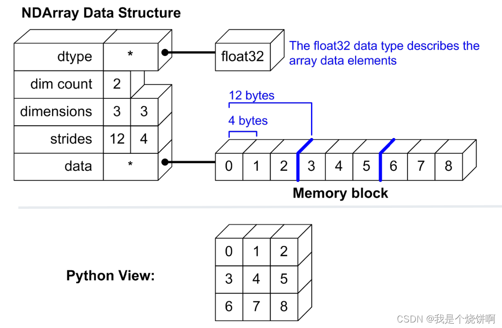
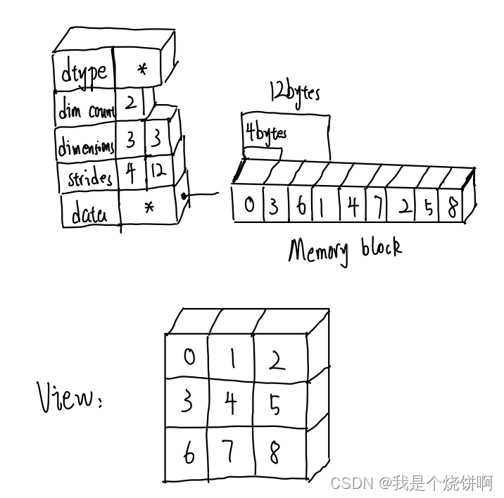
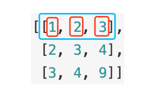
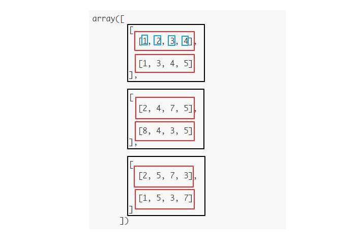
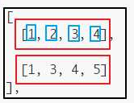
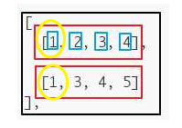
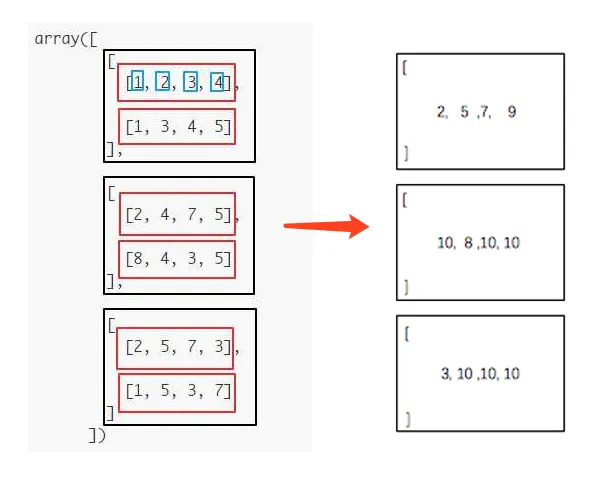
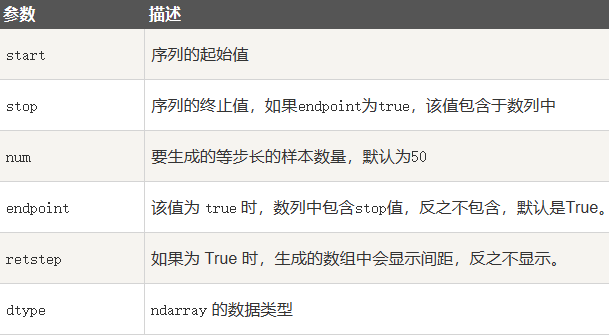
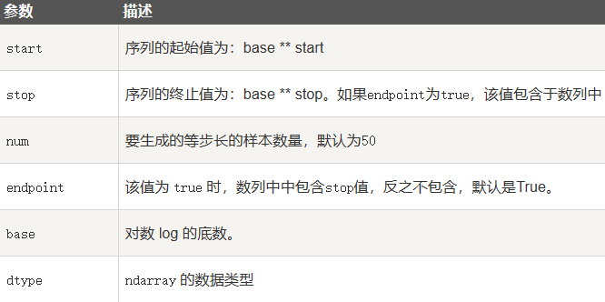
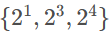

# 一、Numpy

>  [NumPy 教程 | 菜鸟教程 (runoob.com)](https://www.runoob.com/numpy/numpy-tutorial.html) 

NumPy(Numerical Python) 是 Python 语言的一个扩展程序库，支持大量的维度数组与矩阵运算，此外也针对数组运算提供大量的数学函数库。 

> **应用**
>
> NumPy 通常与 `SciPy（Scientific Python）`和 `Matplotlib（绘图库）`一起使用， 这种组合广泛用于替代 MatLab。
>
> - `SciPy` 是一个开源的 Python 算法库和数学工具包。SciPy 包含的模块有最优化、线性代数、积分、插值、特殊函数、快速傅里叶变换、信号处理和图像处理、常微分方程求解和其他科学与工程中常用的计算。
> - `Matplotlib` 是 Python 编程语言及其数值数学扩展包 NumPy 的可视化操作界面。它为利用通用的图形用户界面工具包，如 Tkinter, wxPython, Qt 或 GTK+ 向应用程序嵌入式绘图提供了应用程序接口（API）。

## 1.Ndarray对象

N 维数组对象 ndarray，它是一系列同类型数据的集合。

ndarray 对象是用于存放同类型元素的多维数组。

ndarray 中的每个元素在内存中都有相同存储大小的区域。

ndarray 内部由以下内容组成：

- 一个指向数据（内存或内存映射文件中的一块数据）的指针。
- 数据类型或 dtype，描述在数组中的固定大小值的格子。
- 一个表示数组形状（shape）的元组，表示各维度大小的元组。
- 一个跨度元组（stride），其中的整数指的是为了前进到当前维度下一个元素需要"跨过"的字节数。(类似切片中的步长)

### 创建ndarray对象

```python
numpy.array(object, dtype = None, copy = True, order = None, subok = False, ndmin = 0)
```

> | 名称   | 描述                                                      |
> | :----- | :-------------------------------------------------------- |
> | object | 数组或嵌套的数列                                          |
> | dtype  | 数组元素的数据类型，可选                                  |
> | copy   | 对象是否需要复制，可选                                    |
> | order  | 创建数组的样式，C为行方向，F为列方向，A为任意方向（默认） |
> | subok  | 默认返回一个与基类类型一致的数组                          |
> | ndmin  | 指定生成数组的**最小维度**                                |
>
> 
>
> >  **这个order参数：首先要说明ndarray在内存中存储的情况**
> >
> >   
> >
> >   从ndarray.strides可以读出数据的存储方式，得到的结果有两个数字： 
> >
> > - 第一个参数代表第一个维度(行)之间相差的字节数,a[0,0]与a[1,0]相差12个字节
> > - 第二个参数代表第二个维度(列)之间相差的字节数，a[0,0]与a[0,1]相差4个字节
> >
> >  `(12,4)可以读出该数组是按行存储的，即一行中的元素在内存中是相互邻近的 `
> >
> > **如果order是以列来存储**
> >
> >   
>
> 

```python
import numpy as np
a = np.array([[1, 2, 3], [4, 5, 6], [7, 8, 9]], order='C', ndmin=2)
print(a.strides)
```

```python
# dtype 参数  
import numpy as np 
a = np.array([1,  2,  3], dtype = complex)  
print (a)

[1.+0.j 2.+0.j 3.+0.j]
```

## 2.Dtype

 numpy 支持的数据类型比 Python 内置的类型要多很多 ， 下表列举了常用 NumPy 基本类型 

| 名称       | 描述                                                         |
| :--------- | :----------------------------------------------------------- |
| bool_      | 布尔型数据类型（True 或者 False）                            |
| int_       | 默认的整数类型（类似于 C 语言中的 long，int32 或 int64）     |
| intc       | 与 C 的 int 类型一样，一般是 int32 或 int 64                 |
| intp       | 用于索引的整数类型（类似于 C 的 ssize_t，一般情况下仍然是 int32 或 int64） |
| int8       | 字节（-128 to 127）                                          |
| int16      | 整数（-32768 to 32767）                                      |
| int32      | 整数（-2147483648 to 2147483647）                            |
| int64      | 整数（-9223372036854775808 to 9223372036854775807）          |
| uint8      | 无符号整数（0 to 255）                                       |
| uint16     | 无符号整数（0 to 65535）                                     |
| uint32     | 无符号整数（0 to 4294967295）                                |
| uint64     | 无符号整数（0 to 18446744073709551615）                      |
| float_     | float64 类型的简写                                           |
| float16    | 半精度浮点数，包括：1 个符号位，5 个指数位，10 个尾数位      |
| float32    | 单精度浮点数，包括：1 个符号位，8 个指数位，23 个尾数位      |
| float64    | 双精度浮点数，包括：1 个符号位，11 个指数位，52 个尾数位     |
| complex_   | complex128 类型的简写，即 128 位复数                         |
| complex64  | 复数，表示双 32 位浮点数（实数部分和虚数部分）               |
| complex128 | 复数，表示双 64 位浮点数（实数部分和虚数部分）               |

数据类型对象（numpy.dtype 类的实例）用来描述与数组对应的内存区域是如何使用，它描述了数据的以下几个方面：：

- 数据的类型（整数，浮点数或者 Python 对象）

- 数据的大小（例如， 整数使用多少个字节存储）

- **数据的字节顺序（小端法或大端法）**

  > 字节顺序是通过对数据类型预先设定 **<** 或 **>** 来决定的。 **<** 意味着小端法(最小值存储在最小的地址，即低位组放在最前面)。**>** 意味着大端法(最重要的字节存储在最小的地址，即高位组放在最前面)。 

- 在结构化类型的情况下，字段的名称、每个字段的数据类型和每个字段所取的内存块的部分


### 创建dtype对象

```python
numpy.dtype(object, align, copy)
```

> - object - 要转换为的数据类型对象
> - align - 如果为 true，填充字段使其类似 C 的结构体。
> - copy - 复制 dtype 对象 ，如果为 false，则是对内置数据类型对象的引用

> ```python
> import numpy as np
> # int8, int16, int32, int64 四种数据类型可以使用字符串 'i1','i2','i4','i8' 代替
> dt = np.dtype('i4')
> print(dt)
> 
> 输出：int32
> ```
>
> ```python
> import numpy as np
> # 字节顺序标注
> dt = np.dtype('<i4')
> print(dt)
> ```
>
> ```python
> # 类型字段名可以用于存取实际的 age 列
> import numpy as np
> dt = np.dtype([('age',np.int8)]) 
> a = np.array([(10,),(20,),(30,)], dtype = dt) 
> print(a['age'])
> 
> 输出：[10 20 30]
> ```
>
> ```python
> import numpy as np
> 
> student = np.dtype([('name', 'S20'), ('age', 'i1'), ('marks', 'f4')])
> a = np.array([('abc', 21, 50), ('xyz', 18, 75)], dtype=student)
> print(a['name'])
> 
> 输出：[b'abc' b'xyz']
> ```


## 3.数组属性

### 秩

NumPy 数组的维数称为`秩（rank）`，**秩就是轴的数量**，即数组的维度，一维数组的秩为 1，二维数组的秩为 2，以此类推。 

### 轴(axis)

每一个线性的数组称为是一个`轴（axis）`，也就是`维度（dimensions）`。比如说，二维数组相当于是两个一维数组，其中第一个一维数组中每个元素又是一个一维数组。所以一维数组就是 NumPy 中的轴（axis），第一个轴相当于是底层数组，第二个轴是底层数组里的数组。而轴的数量——秩，就是数组的维数。 

> `axis`选择不同参数代表的含义不同
>
> **设axis=i，则Numpy沿着第i个下标变化的方向进行操作**
>
> > **二维数组**
> >
> > 比如`np.sum(a, axis=1)`，结合下面的数组， `a[0][0]`=1、`a[0][1]`=2、`a[0][2]`=3 ，下标会发生变化的方向是数组的第一维。 
> >
> >   
> >
> > ```
> > 最终结果：
> > [
> >   [6],
> >   [9],
> >   [16]
> > ]
> > ```
>
> > **三维数组**
> >
> > 比如下边这个`np.shape(a)=(3,2,4)`的3维数组，该数组第0维的长度为3(黑色框框)，再深入一层，第1维的长度为2(红色框框)，再深入一层，第2维的长度为4(蓝色框框)。 
> >
> >   
> >
> >  要计算`np.sum(a, axis=1)`，在第一个黑色框框中， 
> >
> >   
> >
> >  要把上下两个红色框框相加起来 
> >
> >   
> >
> >  按照同样的逻辑处理第二个和第三个黑色的框框，可以得出最终结果： 
> >
> >   
>
> > 参考—— [Numpy:对Axis的理解](https://zhuanlan.zhihu.com/p/31275071)


 NumPy 的数组中比较重要 ndarray 对象属性有： 

| 属性             | 说明                                                         |
| :--------------- | :----------------------------------------------------------- |
| ndarray.ndim     | 秩，即轴的数量或维度的数量                                   |
| ndarray.shape    | 数组的维度，对于矩阵，n 行 m 列                              |
| ndarray.size     | 数组元素的总个数，相当于 .shape 中 n*m 的值                  |
| ndarray.dtype    | ndarray 对象的元素类型                                       |
| ndarray.itemsize | ndarray 对象中每个元素的大小，以字节为单位                   |
| ndarray.flags    | ndarray 对象的内存信息                                       |
| ndarray.real     | ndarray元素的实部                                            |
| ndarray.imag     | ndarray 元素的虚部                                           |
| ndarray.data     | 包含实际数组元素的缓冲区，由于一般通过数组的索引获取元素，所以通常不需要使用这个属性。 |


### ndarray.ndim

 返回数组的维数，等于秩。 

```python
import numpy as np 
a = np.arange(24)  
print (a.ndim)             # a 现只有一个维度
```


### ndarray.shape

 ndarray.shape 表示数组的维度，返回一个元组，这个元组的长度就是维度的数目 

```python
import numpy as np  
 
a = np.array([[1,2,3],[4,5,6]])  
print (a.shape)

输出：(2, 3)
```

```python
# 调整数组大小
import numpy as np 
 
a = np.array([[1,2,3],[4,5,6]]) 
a.shape =  (3,2)  
print (a)

输出：
[[1 2]
 [3 4]
 [5 6]]
```

#### reshape()

可以使用`reshape`调整数组大小

```python
import numpy as np 
 
a = np.array([[1,2,3],[4,5,6]]) 
b = a.reshape(3,2)  
print (b)
```

### ndarray.itemsize

 ndarray.itemsize 以字节的形式返回数组中每一个元素的大小。 

```python
import numpy as np 
 
# 数组的 dtype 为 int8（一个字节）  
x = np.array([1,2,3,4,5], dtype = np.int8)  
print (x.itemsize)
 
# 数组的 dtype 现在为 float64（八个字节） 
y = np.array([1,2,3,4,5], dtype = np.float64)  
print (y.itemsize)
```


## 4.创建数组

### (1)ndarray对象

### (2)numpy.empty

numpy.empty 方法用来创建一个指定形状（shape）、数据类型（dtype）且未初始化的数组：

```python
numpy.empty(shape, dtype = float, order = 'C') # 数组元素为随机值，未初始化
```

### (3)numpy.zeros

 数组元素以 0 来填充： 

 ```python
numpy.zeros(shape, dtype = float, order = 'C')
 ```

```python
# 设置类型为整数
y = np.zeros((5,), dtype = int) 
print(y)
```


> **因为括号`()`既可以表示tuple，又可以表示数学公式中的小括号，这就产生了歧义，因此，Python规定，这种情况下，按小括号进行计算，计算结果自然是`1`。**
>
> ***\*所以，只有1个元素的tuple定义时必须加一个逗号`,`，来消除歧义：\****

#### numpy.zeros_like

用于创建一个与`给定数组`具有相同形状的数组，数组元素以 0 来填充。 

```python
numpy.zeros_like(a, dtype=None, order='K', subok=True, shape=None)
# shape:创建的数组的形状，如果不指定，则默认为 a 数组的形状。
```


### (4)numpy.ones

 数组元素以 1 来填充： 

#### numpy.ones_like

略

### (5)从已有的数组创建数组

**numpy.asarray**

```python
numpy.asarray(a, dtype = None, order = None)
```

```python
t = ((1, 2), (3, 4))
x = np.asarray(t)
print(x)

>>[[1 2]
  [3 4]]
```

**numpy.frombuffer**

用于实现动态数组，接收buffer输入参数，以流的形式读入转化成 ndarray 对象 

```python
numpy.frombuffer(buffer, dtype = float, count = -1, offset = 0)
# count读取的数据数量
# 读取的起始位置
```

>  ***buffer 是字符串的时候，Python3 默认 str 是 Unicode 类型，所以要转成 bytestring 在原 str 前加上 b。*** 

```python
import numpy as np

s = b'hello kevin'
x = np.frombuffer(s, dtype='S1')
print(x)

>> [b'h' b'e' b'l' b'l' b'o' b' ' b'k' b'e' b'v' b'i' b'n']
```

**numpy.fromiter**

 从可迭代对象中建立 ndarray 对象，**返回一维数组**。 

### (6)从数值范围创建数组

**numpy.arange**

```python
numpy.arange(start, stop, step, dtype)
```

**numpy.linspace**

创建一维等差数列

```python
np.linspace(start, stop, num=50, endpoint=True, retstep=False, dtype=None)
```



> ```python
> import numpy as np
> a = np.linspace(1,10,10)
> print(a)
> 
> >>[ 1.  2.  3.  4.  5.  6.  7.  8.  9. 10.]
> ```
>
> ```python
> import numpy as np
> a = np.linspace(1,1,10)
> print(a)
> 
> >>[1. 1. 1. 1. 1. 1. 1. 1. 1. 1.]
> ```
>
> 

**numpy.logspace**

用于创建一个于等比数列 

```
np.logspace(start, stop, num=50, endpoint=True, base=10.0, dtype=None)
```



对于np.logspace(1,5,3,base=2)，我们先使用前3个参数，将[1,5]均匀分成3个数，得到{1,3,5}，然后利用第4个参数base=2(默认是10）使用指数函数可以得到最终输出结果



## 5.NumPy切片和索引

**使用内置`slice`函数**

```python
import numpy as np
 
a = np.arange(10)
s = slice(2,7,2)   # 从索引 2 开始到索引 7 停止，间隔为2
print (a[s])

>> [2  4  6]
```

**使用冒号分隔切片**

```python
import numpy as np
 
a = np.arange(10)  
b = a[2:7:2]   # 从索引 2 开始到索引 7 停止，间隔为 2
print(b)
```

**省略号切片**

切片还可以包括省略号 **…**，来使选择元组的长度与数组的维度相同。 如果在行位置使用省略号，它将返回包含行中元素的 `ndarray`。 

```python
import numpy as np
 
a = np.array([[1,2,3],[3,4,5],[4,5,6]])  
print (a[...,1])   # 第2列元素
print (a[1,...])   # 第2行元素
print (a[...,1:])  # 第2列及剩下的所有元素
```

**补充以下对于二维以上数组的切片**

X[:, 0]：取二维数组中所有行的第0个数据，即第1列数据
X[n, :]：取二维数组中第n行的所有数据，即第n行数据
X[:, m:n]：取二维数组中第m到n-1列数据 

> 例如
>
> ```python
> import numpy as np
> 
> x = np.ndarray((3, 4), dtype=int)
> print(x)
> s1 = x[:, 2:4]
> print(s1)
> 
> >>[[4128860 6029375 3801156 7340124]
>  [7602297 7274600 6029422 7209065]
>  [7602291 7077985 6029420 6881388]]
> 
> >>[[3801156 7340124]
>  [6029422 7209065]
>  [6029420 6881388]]
> ```


### (1)高级索引

> 参考—— [Numpy学习之整数数组索引_numpy 整数数组索引_](https://blog.csdn.net/m0_46457700/article/details/109249673) 

#### 整数数组索引

指使用一个数组来访问另一个数组元素，这个数组中每个元素都是目标数组中某个维度上索引值。

> **获取数组中 `(0,0)`，`(1,1)`和 `(2,0)` 位置处的元素 **
>
> ```python
> import numpy as np 
>  
> x = np.array([[1,  2],  [3,  4],  [5,  6]]) 
> y = x[[0,1,2],  [0,1,0]]  
> print (y)
> 
> >>[1 4 5]
> ```

> 获取了 4X3 数组中的四个角的元素。 行索引是 [0,0] 和 [3,3]，而列索引是 [0,2] 和 [0,2]。 
>
> ```python
> import numpy as np 
>  
> x = np.array([[  0,  1,  2],[  3,  4,  5],[  6,  7,  8],[  9,  10,  11]])  
> print ('我们的数组是：' )
> print (x)
> print ('\n')
> rows = np.array([[0,0],[3,3]]) 
> cols = np.array([[0,2],[0,2]]) 
> y = x[rows,cols]  
> print  ('这个数组的四个角元素是：')
> print (y)
> 
> >>我们的数组是：
> [[ 0  1  2]
>  [ 3  4  5]
>  [ 6  7  8]
>  [ 9 10 11]]
> 
> 这个数组的四个角元素是：
> [[ 0  2]
>  [ 9 11]]
> ```
>
> **如果要用一维输出：**
>
> ```python
> x = np.array([[0, 1, 2], [3, 4, 5], [6, 7, 8], [9, 10, 11]])
> rows = np.array([0, 0, 3, 3])
> cols = np.array([0, 2, 0, 2])
> y = x[rows, cols]
> 
> >>[ 0  2  9 11]
> ```

#### 布尔索引

 可以通过一个布尔数组来索引目标数组。 

> **获取大于 5 的元素：**
>
> ```python
> import numpy as np 
>  
> x = np.array([[  0,  1,  2],[  3,  4,  5],[  6,  7,  8],[  9,  10,  11]])  
> 
> # 现在我们会打印出大于 5 的元素  
> print  ('大于 5 的元素是：')
> print (x[x >  5])
> 
> >>大于 5 的元素是：
> [ 6  7  8  9 10 11]
> ```

>  使用了 **~**（取补运算符）来过滤 NaN。 
>
> ```python
> import numpy as np 
>  
> a = np.array([np.nan,  1,2,np.nan,3,4,5])  
> print (a[~np.isnan(a)])
> 
> >>[ 1.   2.   3.   4.   5.]
> ```

#### 花式索引

**花式索引根据索引数组的值作为目标数组的某个`轴`的下标来取值。** `花式索引和切片不同，总是将数据复制到新数组中`

> 例如：
>
> - 一维数组，索引结果就是对用位置元素
>
>   > ```python
>   > import numpy as np
>   > 
>   > x = np.arange(9)
>   > print(x)
>   > # 一维数组读取指定下标对应的元素
>   > print("-------读取下标对应的元素-------")
>   > x2 = x[[0, 6]] # 使用花式索引
>   > print(x2)
>   > 
>   > print(x2[0])
>   > print(x2[1])
>   > 
>   > >>[0 1 2 3 4 5 6 7 8]
>   > -------读取下标对应的元素-------
>   > [0 6]
>   > 0
>   > 6
>   > ```
>   >
>   > 
>
> - 二维数组，对应下标的行
>
>   > ```python
>   > import numpy as np 
>   >  
>   > x=np.arange(32).reshape((8,4))
>   > print(x)
>   > # 二维数组读取指定下标对应的行
>   > print("-------读取下标对应的行-------")
>   > print (x[[4,2,1,7]]) #输出下标为4,2,1,7对应的行
>   > 
>   > >>[[ 0  1  2  3]
>   >  [ 4  5  6  7]
>   >  [ 8  9 10 11]
>   >  [12 13 14 15]
>   >  [16 17 18 19]
>   >  [20 21 22 23]
>   >  [24 25 26 27]
>   >  [28 29 30 31]]
>   > -------读取下标对应的行-------
>   > [[16 17 18 19]
>   >  [ 8  9 10 11]
>   >  [ 4  5  6  7]
>   >  [28 29 30 31]]
>   > ```


## 6.广播

广播(Broadcast)是 numpy 对不同形状(shape)的数组进行`数值计算`的方式， 对数组的算术运算通常在相应的元素上进行。 

分三种情况：

> **两个数组 a 和 b 形状相同**
>
> 即满足 `a.shape == b.shape`，那么 a*b 的结果就是 a 与 b 数组对应位相乘。 
>
> ```python
> import numpy as np 
>  
> a = np.array([1,2,3,4]) 
> b = np.array([10,20,30,40]) 
> c = a * b 
> print (c)
> 
> >>[ 10  40  90 160]
> ```

> **2 个数组的形状不同时**
>
> 将触发广播机制
>
> ```python
> import numpy as np 
>  
> a = np.array([[ 0, 0, 0],
>            [10,10,10],
>            [20,20,20],
>            [30,30,30]])
> b = np.array([0,1,2])
> print(a + b)
> 
> >>[[ 0  1  2]
>  [10 11 12]
>  [20 21 22]
>  [30 31 32]]
> ```
>
>   

### 广播规则

- 让所有输入数组都向其中形状最长的数组看齐，形状中不足的部分都通过在前面加 1 补齐。
- 如果输入数组的某个维度和输出数组的对应维度的长度相同或者其长度为 1 时，这个数组能够用来计算，否则出错。
- 当输入数组的某个维度的长度为 1 时，沿着此维度运算时都用此维度上的第一组值。

> **总结：**
>
> **简单理解：**对两个数组，分别比较他们的每一个维度（若其中一个数组没有当前维度则忽略），满足：
>
> - 数组拥有相同形状。
> - 当前维度的值相等。
> - 当前维度的值有一个是 1。
>
> 若条件不满足，抛出 **"ValueError: frames are not aligned"** 异常。

# 二、解压缩文件

> 参考：
>
> [解压zip、rar](https://www.cnblogs.com/zhuminghui/p/11699313.html)
>
> [解压rar](https://juejin.cn/s/python%20%E8%A7%A3%E5%8E%8B%E7%BC%A9%20rar)

## 1.zip

**使用自带的zipfile包**

```python
zipfile.ZipFile(filename[,mode[,compression[,allowZip64]]])

# mode：可选 r,w,a 代表不同的打开文件的方式；r 只读；w 重写；a 添加
# compression：指出这个 zipfile 用什么压缩方法，默认是 ZIP_STORED，另一种选择是 ZIP_DEFLATED；
# allowZip64：bool型变量，当设置为True时可以创建大于 2G 的 zip 文件，默认值 True；
```


```python
zip_file = zipfile.ZipFile(path)

zip_list = zip_file.namelist() # 得到压缩包里所有文件

for f in zip_list:
    zip_file.extract(f, folder_abs) # 循环解压文件到指定目录
 
zip_file.close() # 关闭文件，必须有，释放内存
```

```python
zipfile.is_zipfile('xxx.zip') # 判断文件是否是个有效的zipfile
zipfile.namelist('xxx.zip') # 列表，存储zip文件中所有子文件的path（相对于zip文件包而言的）
zipfile.infolist('xxx.zip') # 列表，存储每个zip文件中子文件的ZipInfo对象
zipfile.printdir() # 打印输出zip文件的目录结构，包括每个文件的path，修改时间和大小
zipfile.open(name[,mode[,pwd]]) # 获取一个子文件的文件对象，可以对其进行read,readline,write等操作
zipfile.setpassword(psw)，为zip文件设置默认密码
zipfile.testzip() # 读取zip中的所有文件，验证他们的CRC校验和。返回第一个损坏文件的名称，如果所有文件都是完整的就返回None
zipfile.write(filename[,arcname[,compression_type]]) # 将zip外的文件filename写入到名为arcname的子文件中（当然arcname也是带有相对zip包的路径的），打开方式为w或a
zipfile.extract(member, path=None, pwd=None) # 解压一个zip中的文件，path为解压存储路径，pwd为密码
zipfile.extractall(path[,pwd]) # 解压zip中的所有文件，path为解压存储路径，pwd为密码
```


## 2.rar

> 参考：
>
> [解压rar安装依赖之后，还需要另外下载一个依赖]((https://blog.csdn.net/xrinosvip/article/details/120396624))

**使用三方库：unrar/rarfile**

```python
import rarfile

# 打开 RAR 文件
rar = rarfile.RarFile('example.rar')

# 解压缩文件到指定路径
rar.extractall(path='path/to/extract')

# 关闭 RAR 文件
rar.close()

example.rar 是要解压缩的 RAR 文件的路径，path/to/extract 是要解压缩到的文件夹路径。如果没有指定路径，则会解压缩到当前目录下。
```


# 三、处理文件

## 1.yml

> 参考：
>
> https://cloud.tencent.com/developer/article/1571186


# 四、进度条

> 参考：
>
> [进度条配置](https://blog.csdn.net/qq_33472765/article/details/82940843?spm=1001.2101.3001.6650.1&utm_medium=distribute.pc_relevant.none-task-blog-2%7Edefault%7EBlogCommendFromBaidu%7ERate-1-82940843-blog-54798823.235%5Ev38%5Epc_relevant_sort&depth_1-utm_source=distribute.pc_relevant.none-task-blog-2%7Edefault%7EBlogCommendFromBaidu%7ERate-1-82940843-blog-54798823.235%5Ev38%5Epc_relevant_sort&utm_relevant_index=2)
>
> https://blog.csdn.net/langb2014/article/details/54798823
>
> 


# 五、计算CRC

> 参考： [Python 计算文件的CRC校验码|极客笔记 (deepinout.com)](https://deepinout.com/python/python-qa/821_python_compute_crc_of_file_in_python.html#:~:text=要计算文件的CRC校验码，我们需要使用Python中的crcmod库。 crcmod库是Python的一个第三方库，提供了用于计算CRC校验码的函数和方法。 首先，我们需要安装crcmod库。 可以使用pip命令来安装crcmod库：,pip install crcmod 安装完成后，我们就可以开始计算文件的CRC校验码了。 下面是一个示例代码：) 


# 六、OCR

> [提取文字](https://blog.51cto.com/u_15303040/3110833)
>
> **git:**
>
> [easyOCR](https://github.com/JaidedAI/EasyOCR)

> cv.imread乱码：https://blog.csdn.net/liuqinshouss/article/details/78696032

> [tesseract](https://www.osgeo.cn/python-tutorial/imgs-docx-imgs.html)
>
> [配置环境](https://blog.csdn.net/weixin_53660567/article/details/123664015)

# 七、读ppt

> [读ppt](https://cloud.tencent.com/developer/article/1708628)
>
> [读ppt2](https://blog.csdn.net/AI_LINNGLONG/article/details/104358105)


## 1.ppt转pptx

> https://docs.aspose.com/slides/python-net/convert-ppt-to-pptx/

## 2.读ppt


# 八、读eml

> [python 三方库](https://yanxizhen.github.io/2019/python3.7%E4%B8%8B%E4%BD%BF%E7%94%A8%E7%AC%AC%E4%B8%89%E6%96%B9email%E6%89%A9%E5%B1%95%E5%BA%93flanker%E5%A4%9A%E8%BF%9B%E7%A8%8B/)
>
> [flanker](https://github.com/mailgun/flanker)
>
> [python内置库](https://www.cnblogs.com/QKSword/p/10777075.html)
>
> https://www.jb51.net/article/232335.htm