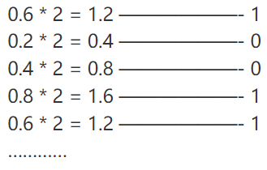
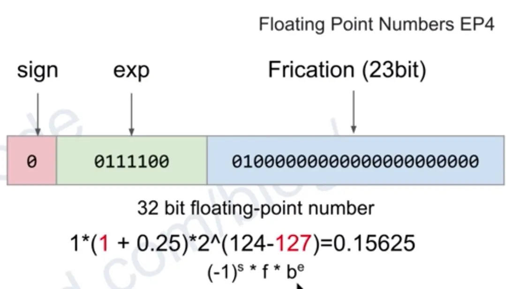

## 二进制操作


### 1.小数二进制表示

> [整数和浮点数](https://www.cnblogs.com/wyt123/p/10918576.html)
>
> [小数的二进制表示](https://www.cnblogs.com/lightmare/p/10398830.html)

小数的二进制表示过程：

- 用小数部分乘2，得到的结果`x`取整数部分
- 整数部分大于1则该位为1，否则为0
- 再用`x`乘以2，重复操作

例如0.6表示为二进制



> 可以发现在该计算中已经出现了循环，0.6用二进制表示为 1001 1001 1001 1001 ……  
>
> **这也是为什么浮点数无法精确表示小数，因此往往需要确定精度的位数**

**如何将二进制小数还原为十进制**

再拿0.6的二进制表示举例：1001 1001 1001 1001 
文字描述：从左到右，v[i] * 2^( - i ), i 为从左到右的index，v[i]为该位的值 

```
0.6 = 1 * 2^-1 + 0 * 2^-2 + 0 * 2^-3 + 1 * 2^-4 + ……
```


### 拓展

#### (1)定点数和浮点数

> [浮点数和定点数的区别](https://www.jianshu.com/p/40bddd5126f9)
>
> [java的二进制操作（讲的很详细）](https://www.cnblogs.com/V1haoge/p/10420178.html)

在编程语言中，用`float`或者`double`来表示浮点数，而`float`类型数字表示方法

  