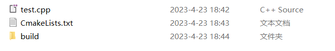
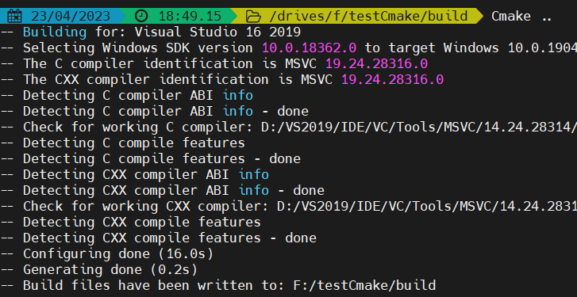
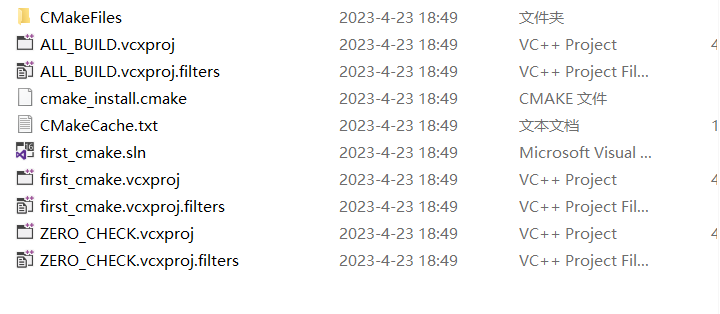
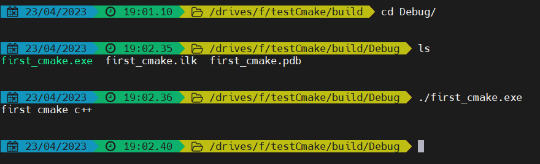
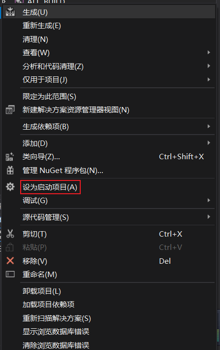

# Cmake

> 参考——
>
> https://zhuanlan.zhihu.com/p/534439206

## 1.配置使用Cmake

**下载Cmake**

> https://cmake.org/download/
>
> 官方文档——https://cmake.org/documentation/
>
> 中文文档——https://www.zybuluo.com/khan-lau/note/254724

**下载好之后查看版本**

```
Cmake /V
```


**创建Cpp文件**

```cpp
//first_cmake.cpp 
#include <iostream> 
using namespace std; 
int main(int argc,char *argv[])
{ 
 cout<<"first cmake c++"<<endl; 
 return 0; 
}
```

**配置CmakeList**

```
# CMakeLists.txt 
cmake_minimum_required (VERSION 3.0) 
project (first_cmake) 
add_executable(first_cmake first_cmake.cpp)
```

> - **cmake_minimum_required** 指定最低的cmake版本
> - project 项目名称，后面可以通过变量获取此名称
> - **add_executable**：将名为`first_cmake.cpp `的源文件编译成一个名称为 `first_cmake` 的可执行文件。

**目录结构**



> 源码目录下面创建一个编译目录build，用于生成cmake的临时文件和项目文件，放在独立的目录方便清理和查看。

**Windows平台编译**

CMake=》vs项目=》cl编译

**进入编译目录build，直接运行cmake .. 使用默认生成项目文件，下图生成的是vs2019的64位项目（文件所在的路径和目录层次不能太深，太深会找不到编译器）。**





**编译项目**

​	有两种编译方法：

- 第一种直接进入build目录打开vs解决方案进行编译。
- 第二种，控制台进入生成的项目文件路径 build，然后运行 cmake --build . 后面的点表示当前路径。


**运行**

4


使用VS2019运行报错

> **/All_BUILD 拒绝访问，**
>
> 解决办法：将项目设置为启动项目即可
>
> 


## **c++项目创建cmakelist文件**

```cmake
cmake_minimum_required(VERSION 3.0.0)
project(cpp_cygwin VERSION 0.1.0 LANGUAGES C CXX)

include(CTest)
enable_testing()
aux_source_directory(./10-25 SOURCES) #添加目录，将编译目录下的所有文件
add_executable(10-25  ${SOURCES}) #生成可执行文件10-25.exe

set(CPACK_PROJECT_NAME ${PROJECT_NAME})
set(CPACK_PROJECT_VERSION ${PROJECT_VERSION})
set(EXECUTABLE_OUTPUT_PATH ..) #生成的可执行文件位置
include(CPack)
```


## **NDK项目cmakelist文件**

```cmake
#指定CMake的最小版本
cmake_minimum_required(VERSION 3.10.2)

#项目名字
project("ndkpro2")

include_directories("inc") #添加包含头文件的目录

file(GLOB allCPP *.c *.h *.cpp) #批量导入所有源文件

#创建一个静态或者动态库，并提供其关联的源文件路径，开发者可以定义多个库，CMake会自动去构建它们。Gradle可以自动将它们打包进APK中。
#第一个参数——native-lib：是库的名称，最后生成native-lib.so
#第二个参数——SHARED：是库的类别，是动态的还是静态的
#第三个参数——src/main/cpp/native-lib.cpp：是库的源文件的路径

add_library( # Sets the name of the library.
             native-lib

             # Sets the library as a shared library.
             SHARED

             # Provides a relative path to your source file(s).
             native-lib.cpp 
             
             ${allCPP} #上面导入的所有源文件
             )


#找到一个预编译的库，并作为一个变量保存起来。由于CMake在搜索库路径的时候会包含系统库，并且CMake会检查它自己之前编译的库的名字，所以开发者需要保证开发者自行添加的库的名字的独特性。
#第一个参数——log-lib：设置路径变量的名称
#第一个参数—— log：指定NDK库的名子，这样CMake就可以找到这个库

find_library( # Sets the name of the path variable.
              log-lib

              # Specifies the name of the NDK library that
              # you want CMake to locate.
              log )


#指定CMake链接到目标库。开发者可以链接多个库，比如开发者可以在此定义库的构建脚本，并且预编译第三方库或者系统库。
#第一个参数——native-lib：指定的目标库
#第一个参数——${log-lib}：将目标库链接到NDK中的日志库，

target_link_libraries( # Specifies the target library.
                       native-lib

                       # Links the target library to the log library
                       # included in the NDK.
                       ${log-lib} )
```

