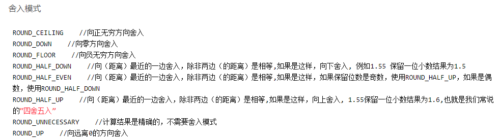

# JAVA基础

## 一、数据类型

### 1.long(Long) 加 L的问题

#### 用long定义长整型数字时

```java
long a = 1;  // 类型int向上转型为long
long a = 1L; // 类型直接定义为long

long a = 2147483648;  // 错误 int的最大表示范围是2147483647
long a = 2147483648L; // 正确 2147483648为长整型
```

> 1、由于Java默认数字是int类型的，而int向上转型为long是安全的，所以第一句正确执行；
> 2、数字后面加了`l`或`L`后，类型变为长整型，第二句自然没问题；
> 3、***int能表示的数字有一定范围，超过这个范围必须加`l`或`L`才不会出错，所以第三句出错，第四句正确。***
>
> 所以定义long类型时候特别注意超出int范围的问题。

#### 用Long定义长整型数字时

```java
Long a = 1;  // 错误 Long的自动装箱必须要求long类型的数字
Long a = 1L; // 正确 1L是long类型 自动装箱

Long a = new Long(1); // 正确 Long构造器的形参要求long类型的数字，int类型可以向上转型为long类型
Long a = new Long(1L); // 正确 1L是long类型

Long a = new Long(2147483648);  // 错误 int的最大表示范围是2147483647，表示错误
Long a = new Long(2147483648L); // 正确 2147483648为长整型
```

> 上面六行代码：
>
>   1、自动装箱严格要求对应的基本类型要一致，所以第1行错误第2行正确；
>   2、使用构造器创建Long类型数字时，形参是long类型，int类型可以去向上转型，所以第3、4行正确；
>   3、使用构造器时，必须注意int不可以超过范围。

#### 结论

1、使用`long`和`new Long()`定义时，当数字超过int类型的表示范围时必须要在数字后加`L`；
2、使用`Long`定义时，数字必须要加`L`。


### 2.保留小数点问题

**(1)DecimalFormat** 

```java
float num1 = 3.1415916f;
DecimalFormat df = new DecimalFormat("00.##");//保留两位小数
System.out.println(df.format(num1));

00表示输出两个数字，不足则补0。
##表示四舍五入保留两位小数，若最后一位为0，则舍弃。
```

**(2)String中的format方法**

```java
String.format("%.2f",需要进行格式化的数字);// %.2f表示保留 两位小数 %.3f表示保留 三位小数
```

**利用这个方法还可以在数字前面加前导0**

```java
int a = 3;
String paddedWithZero = String.format("%4s", Integer.toBinaryString(a)).replace(' ', '0');//转换成2进制，然后前面加了4个占位符，将占位符替换为0即可
System.out.println(paddedWithZero);

输出：0011
```

**(3)BigDecimal**

***setScale(精度，方式)***：第一位参数表示保留小数进度，第二种方式表示取整方式

```java
BigDecimal bd = new BigDecimal();
bd.setScale(x, BigDecimal.ROUND_HALF_UP).doubleValue();
```



> 参考——https://www.cnblogs.com/duiyuedangge/p/15770551.html


### 3.变量初始化规则

局部变量（在方法中声明的变量）必须在使用前初始化，否则会导致编译错误。但成员变量（在类中声明的变量）可以不初始化，它们会根据默认值自动初始化。 

```java
// 成员变量
public class Test {
    private int a; // 默认为 0
    private String b; // 默认为 null

    public static void main(String[] args) {
       ....
    }
}

// 局部变量
public class Test {
    public static void main(String[] args) {
        int a; // 未初始化，编译报错
        System.out.println(a); // 无法访问未初始化的变量
    }
}
```


## 二、Java堆栈

> https://blog.csdn.net/qq_34467922/article/details/80790443

## 三、关键字

### super关键字

> **参考：**
>
>  [【Java】子类的构造函数什么时候需要加 super()](https://blog.csdn.net/weixin_40473794/article/details/104624515) 

#### 	1.概述

super关键字是一个引用变量，用于引用直接父类对象。

> 当父类存在无参数构造函数时，JVM会在子类的构造函数中自动添加隐式的 **super();** 
>
> 当父类中只存在有参数构造函数，必须在子类的构造函数中添加 **super(参数列表);**，且 **super()** 的参数列表必须与父类构造函数的参数列表相同。 

#### 	2.用法

- `super`可以用来引用直接父类的实例变量。

  ```java 
  class Animal {
      String color = "white";
  }
  
  class Dog extends Animal {
      String color = "black";
  
      void printColor() {
          System.out.println(color);// prints color of Dog class
          System.out.println(super.color);// prints color of Animal class
      }
  }
  
  class TestSuper1 {
      public static void main(String args[]) {
          Dog d = new Dog();
          d.printColor();
      }
  }
  ```

- `super`可以用来调用直接父类方法。

  ```java
  class Animal {
      void eat() {
          System.out.println("eating...");
      }
  }
  
  class Dog extends Animal {
      void eat() {
          System.out.println("eating bread...");
      }
  
      void bark() {
          System.out.println("barking...");
      }
  
      void work() {
          super.eat();//调用父类方法
          bark();
      }
  }
  
  class TestSuper2 {
      public static void main(String args[]) {
          Dog d = new Dog();
          d.work();
      }
  }
  ```

- `super()`可以用于调用直接父类构造函数。

  ```java
  class Animal {
      Animal() {
          System.out.println("animal is created");
      }
  }
  
  class Dog extends Animal {
      Dog() {
          super();//如果没有调用，则会隐式的调用，并且总是第一行
          System.out.println("dog is created");
      }
  }
  ```

  **如果父类包含有参构造函数，不包含无参构造函数，则必须显示调用父类的有参构造函数，因为有参构造函数会覆盖无参构造函数**

  ```java
  public class Father {
      public String name;
  
      public Father(String name) {//覆盖无参构造函数
          this.name = name;
          }
  }
   
  public class Son extends Father{
   
  public Son(String name) {
  	super(name);//必须调用，否则他会默认调用父类的无参构造函数，而父类的无参构造函数已经被有参的覆盖，所以找不到
  	}
  }
  ```

  > 当然，构造函数的参数列表可以任意，不过如果其不包含`super()`所需的全部参数，必须在子类中初始化成员变量。格式为 **static 变量类型 变量名 = 常量；** 
  >
  > ```java
  > class Super {
  >     Super(String msg) {
  >         System.out.println("Super--" + msg);
  >     }
  > }
  > 
  > class Demo extends Super {
  >     Demo(String msg) {
  >         super(msg);
  >         System.out.println("Demo--" + msg);
  >     }
  > 
  >     static String msg = "test2";
  > 
  >     Demo(int x) {
  >         super(msg);
  >         System.out.println("Demo--" + x);
  >     }
  > 
  >     public static void main(String[] args) {
  >         new Demo("test1");
  >         new Demo(0);
  >     }
  > }
  > ```
  >
  > 

### this关键字

#### 1.概念：

 在java中，这是一个引用当前对象的引用变量。

#### 2.用法

this关键字的用法如下：

this关键字可用来引用当前类的实例变量。
this关键字可用于调用当前类方法(隐式)。
this()可以用来调用当前类的构造函数。
this关键字可作为调用方法中的参数传递。
this关键字可作为参数在构造函数调用中传递。
this关键字可用于从方法返回当前类的实例。

①引用当前类实例变量

```java
//this关键字可以用来引用当前类的实例变量。如果实例变量和参数之间存在歧义，则 this 关键字可用于明确地指定类变量以解决歧义问题。
class Student {
    int rollno;
    String name;
    float fee;

    Student(int rollno, String name, float fee) {
        this.rollno = rollno;
        this.name = name;
        this.fee = fee;
    }
}
```

②调用当前类方法

如果不使用this关键字，编译器会在调用方法时自动添加此 this 关键字


③调用当前类的构造函数

`this()`构造函数调用可以用来调用当前类的构造函数。 它用于重用构造函数。 换句话说，它用于构造函数链接。

```java
class A {
    A() {
        System.out.println("hello a");
    }

    A(int x) {
        this();
        System.out.println(x);
    }
}

class TestThis5 {
    public static void main(String args[]) {
        A a = new A(10);
    }
}

结果：
hello a
10
    
//默认构造函数调用参数化构造函数
class A {
    A() {
        this(5);
        System.out.println("hello a");
    }

    A(int x) {
        System.out.println(x);
    }
}

class TestThis6 {
    public static void main(String args[]) {
        A a = new A();
    }
}

结果：
5
hello a
```

以上this必须放在第一行，否则编译不通过


④this作为参数传递

```java
class S2 {
    void m(S2 obj) {
        System.out.println("method is invoked");
    }

    void p() {
        m(this);
    }

    public static void main(String args[]) {
        S2 s1 = new S2();
        s1.p();
    }
}
```

⑤返回类的实例

```java
class A {
    A getA() {
        return this;
    }

    void msg() {
        System.out.println("Hello java");
    }
}

class Test1 {
    public static void main(String args[]) {
        new A().getA().msg();
    }
}

结果：
 Hello java
```

### transient关键字

> 参考——[java transient](https://javabetter.cn/io/transient.html#_01%E3%80%81transient-%E7%9A%84%E4%BD%9C%E7%94%A8%E5%8F%8A%E4%BD%BF%E7%94%A8%E6%96%B9%E6%B3%95)

一个对象只要实现了`Serilizable接口`，它就可以被序列化。

在实际开发过程中，我们常常会遇到这样的问题，一个类的有些字段需要序列化，有些字段不需要，比如说用户的一些敏感信息（如密码、银行卡号等），为了安全起见，不希望在网络操作中传输或者持久化到磁盘文件中，那这些字段就可以加上 `transient` 关键字。

> 需要注意的是，被 transient 关键字修饰的成员变量在反序列化时会被自动初始化为默认值，例如基本数据类型为 0，引用类型为 null。 

```java
public class TransientTest {
    public static void main(String[] args) {

        User user = new User();
        user.setUsername("沉默王二");
        user.setPasswd("123456");

        System.out.println("read before Serializable: ");
        System.out.println("username: " + user.getUsername());
        System.err.println("password: " + user.getPasswd());

        try {
            ObjectOutputStream os = new ObjectOutputStream(
                new FileOutputStream("user.txt"));
            os.writeObject(user); // 将User对象写进文件
            os.flush();
            os.close();
        } catch (FileNotFoundException e) {
            e.printStackTrace();
        } catch (IOException e) {
            e.printStackTrace();
        }
        try {
            ObjectInputStream is = new ObjectInputStream(new FileInputStream(
                "user.txt"));
            user = (User) is.readObject(); // 从流中读取User的数据
            is.close();

            System.out.println("\nread after Serializable: ");
            System.out.println("username: " + user.getUsername());
            System.err.println("password: " + user.getPasswd());

        } catch (FileNotFoundException e) {
            e.printStackTrace();
        } catch (IOException e) {
            e.printStackTrace();
        } catch (ClassNotFoundException e) {
            e.printStackTrace();
        }
    }
}

class User implements Serializable {
    private static final long serialVersionUID = 8294180014912103005L;  

    private String username;
    private transient String passwd;

    public String getUsername() {
        return username;
    }

    public void setUsername(String username) {
        this.username = username;
    }

    public String getPasswd() {
        return passwd;
    }

    public void setPasswd(String passwd) {
        this.passwd = passwd;
    }

}


//输出：
read before Serializable:
username: 沉默王二
password: 123456 
read after Serializable:
username: 沉默王二
password: null//密码字段为null，说明反序列化时根本没从文件中获取到信息
```


**小结：**

一旦字段被 transient 修饰，成员变量将不再是对象持久化的一部分，该变量的值在序列化后无法访问。

2）transient 关键字只能修饰字段，而不能修饰方法和类。

3）被 transient 关键字修饰的字段不能被序列化，一个静态变量（static关键字修饰）不管是否被 transient 修饰，均不能被序列化


## 四、多态

  ### 	1.概念：

通过不同方式执行单个方法，java有两种类型多态性：①编译时多态性和运行时多态性。

### 2.实现多态方法

- 方法重载
- 方法覆盖（重写）

###   3.重载:

重载实现的是**编译时的多态性**；发生在一个类中，方法名相同，但是参数类型或参数个数不同，返回类型也可以不同。

### 4.重写:

实现的是**运行时候的多态性。**发生在子类和父类之间，重写要求子类重写方法和父类有相同参数列表，有兼容的返回类型（例如：子类中方法的返回类型是父类中返回类型的子类），且**子类函数的访问修饰权限不能少于父类的**

> 参考
>
> https://blog.csdn.net/weixin_36461619/article/details/113084266

## 五、继承

### 1.为什么使用继承:

对于方法覆盖(因此可以实现运行时的多态性)，提高代码可重用性。在Java中，子类可继承父类中的方法，而不需要重新编写相同的方法。但有时子类并不想原封不动地继承父类的方法，而是想作一定的修改，这就需要采用方法的重写(覆盖)

###   2.继承类型：

java中有三种类型继承：单一、多级、分层，**但java不支持多继承**

  

### 3.当实例化子类的时候，子类和父类的方法执行顺序

例如：

```java
class BaseClass{
    public BaseClass(){}
    
    {
        System.out.println("i am BaseClass");
    }
    
    static {
        System.out.println("static baseclass");
    }
}

//继承BaseClass
public class Base extends BaseClass{
    public Base(){}
    {
        System.out.println("i am Base");
    }
    static{
        System.out.println("static Base");
    }
    public static void main(String[] args){
        new Base();
    }
}

执行结果：
static baseclass
static Base
i am BaseClass
i am Base
```

执行顺序:

1. 父类静态代码块、静态变量
2. 子类静态代码块、静态变量
3. 父类局部代码块、成员变量
4. 父类构造函数
5. 子类局部代码块、成员变量
6. 子类构造函数

 **静态优先，构造随后，无论静态还是构造，先父再子**


### 4.向上向下转型

> Java中的继承机制使得一个类可以继承另一个类，继承的类称为子类，被继承的类称为父类。在一个子类被创建的时候，首先会在内存中创建一个父类对象，然后在父类对象外部放上子类独有的属性，两者合起来形成一个子类的对象，所以子类可以继承父类中所有的属性和方法，包括private修饰的属性和方法，但是子类只是拥有父类private修饰的属性和方法，却不能直接使用它，也就是无法直接访问到它（子类可以通过调用父类的public声明的get方法来获取父类的private属性，但无法访问父类的private方法）。同时子类可以对继承的方法进行重写（@Override），并且新建自己独有的方法。

#### 向上转型:

假设有一个Fruit类，Fruit类中有一个show（）方法，代码如下：

```java
class Fruit{
	public void show() {
		System.out.println("this is a fruit");
	}
}
有一个Apple类继承自Fruit类，该类有自己的方法test（），并且重写了父类的show（）方法，代码如下：

class Apple extends Fruit{
    @Override
    public void show() {
	System.out.println("this is a apple");
    }
    public void test() {
	System.out.println("i am a apple");
    }
}
```


实例化Apple类，并新建一个Fruit类的引用变量引用该实例，调用实例的show（）方法：

```java
Fruit fruit = new Apple();
fruit.show();
```


调用实例的test（）方法：

```java
fruit.test();
```


**分析：**这里用到了向上转型，换言之，就是用父类的引用变量去引用子类的实例，这是允许的。当向上转型之后，父类引用变量可以访问子类中属于父类的属性和方法，但是不能访问子类独有的属性和方法。例子中由于子类重写了父类的show（）方法，所以调用的show（）方法是子类的show（）方法，输出结果为：“this is a apple”,而调用子类的test（）方法则会报错。


#### 向下转型：

**并不是所有的对象都可以向下转型，只有当这个对象原本就是子类对象通过向上转型得到的时候才能够成功转型。**

实例化Apple类，并新建一个Fruit类的引用变量“fruit”引用该实例，然后新建一个Apple类的引用变量，引用向下转型的“fruit”变量，代码如下：

```java
Fruit fruit = new Apple();
Apple apple = (Apple) fruit;
```

上述代码是允许的，因为fruit引用的对象原本就是Apple对象向上转型得到的，在对fruit向下转型后得到的还是Apple类的对象，能够被Apple类的引用变量引用。

假设有一个Orange类继承自Fruit类，代码如下：

```java

class Orange extends Fruit{
    @Override
    public void show() {
	System.out.println("this is a Orange");
    }
    public void test() {
	System.out.println("i am a Orange");
    }
}
```

实例化Apple类，并新建一个Fruit类的引用变量“fruit”引用该实例，然后新建一个Orange类的引用变量，引用向下转型的“fruit”变量，代码如下：

```java
Fruit fruit = new Apple();
Orange orange = (Orange) fruit;
```

上述代码虽然能够编译成功，但是在运行的时候会报错，因为fruit对象是由Apple对象向上转型得到的，只能够向下转型成Apple对象，不能够向下转型成Orange对象。

#### 转型好处

通过向上向下转型肯定是有好处的，比如可以**减少编程代码**。

假设在主类中定义了一个run（）方法，该方法传入一个Fruit参数，并调用了Fruit对象的show（）方法，代码如下：

```java
public static void run(Fruit fruit) {
	fruit.show();
   }
```

在main（）方法中的代码如下：

```java
public static void main(String[] args) {
    run(new Fruit());
    run(new Apple());
    run(new Orange());
    }
```

上述代码中，调用run（）方法时的参数不仅是Fruit对象，也可以是Apple对象和Orange对象，当传入的是Apple对象和Orange对象时，就会向上转型成Fruit对象，但是调用的show（）方法还是Apple对象和Orange对象的show（）方法。**这样就不需要在主类中同时重载三个run（）方法，减少了代码量。**


## 六、抽象

### 1.概念：

抽象是隐藏实现细节并仅向用户显示功能的过程。

另一种方式，它只向用户显示重要的事情，并隐藏内部详细信息，例如：发送短信，只需输入文本并发送消息。您也不需要知道有关邮件传递的内部处理过程。

抽象可以让你专注于对象做什么(实现的功能)，而不是它如何做。

### 2.实现方式：

1. 抽象类(部分)

   使用 `abstract`关键字声明的类被称为抽象类。需要扩展和实现它的方法。 

   > **抽象类不能被实例化**。

   **抽象类可以有数据成员，抽象方法，方法体，构造函数甚至`main()`方法**

   **规则：如果在类中有任何抽象方法，那个类必须声明为抽象的。**

2. 接口 (完全)


## 七、运算符以及进制表示

### 1.运算符：


**元运算符**


**算数运算符**


>  求幂运算符是 `**`。例如，`2 ** 3 = 8`。 

**移位运算符**


> ***移位操作是bit层面，因此 1<< 10 并不等于 10^10，而是等于2^10;***

**位运算符**


**关系运算符**


**逻辑运算符**


**赋值运算符**


### 2.进制表示

​	java中的二进制数据都是以补码表示（最高位为符号位），所以如果是整数则它的二进制数；如果是负数，则先转换成原码，在转换成补码。（原码和补码互相转换:①符号位不变，整数位取反；②整个数加一）

```java
System.out.println("Java二进制7: "+Integer.toBinaryString(7));
System.out.println("Java二进制-7: "+Integer.toBinaryString(-7));

输出：
Java二进制7: 111
Java二进制-7: 11111111111111111111111111111001
//Java中对于不满32位的int二进制自动补齐，所以变成了 (29个0)111
```

可以看到，java中的二进制数都是有符号数，但如果我们想要二进制表示为无符号数，且将其转换成十进制，可以在引用类型中调用

```java
Byte.toUnsignedInt((byte) -2)
这样就将二进制数一律看做正数进行转换
    
输出：254（因为-2的二进制为 11111110 ）
```

进制间的转换:

```java
byte a = 20;
String c = Integer.toHexString(a);//转换成十六进制
//toOctalString(int)八进制
int radixO = Integer.parseInt(c, 16);//将16进制的c转换成10进制
```

当int和long变量的值为负数的时候，问题就出现了:

```java
int var = -23243;
String hex = Integer.toHexString(var);
Integer.parseInt(hex, 16);
会报错，因为Integer.parseInt，会将传入的十六进制数字一致认为是正数，由于负数前面都是1为符号位，导致该数字超出int的最大范围，解决方案：
    
BigInteger bi = new BigInteger(hex, 16);
通过BigInteger.intValue();和 BigInteger.longValue(); 得到你所需要的int或long型值。
```


## 八、范型

> https://blog.csdn.net/evilcry2012/article/details/83617632


## 九、函数参数

java函数参数经常有三个点

```java
public Object query(String sql, ResultSetHandler<?> rsh, Object... params)
```

**表示可以接受多个Object类型的参数，这种写法的形参只能写到最后，否则报错**

### 1.和传统数组

对比传统数组，该方法不仅也可以接收多个同类型参数，即使参数个数为0也不会报错

```java
// 传统的方式

// 正常的输出
test_Array(new int[]{1,2,3,4});  
// 报错，提示参数不能为空
test_Array();
```

```java
// 三个点的方式
// 正常输出
test_dots(1,2,2,3,4);  
// 也可以正常输出
test_dots();

```


