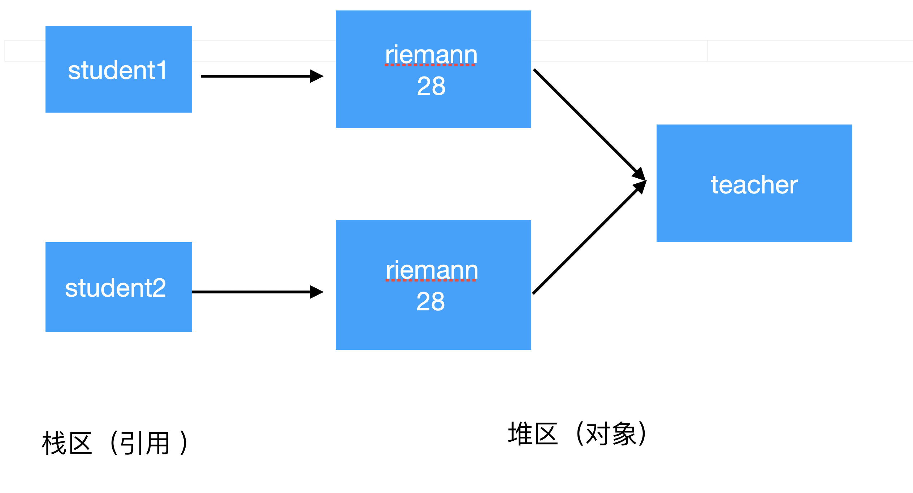

# JAVA基础

> [Java面试总结](https://javaguide.cn/java/basis/java-basic-questions-01.html)
>
> [Java知识体系](https://pdai.tech/md/java/basic/java-basic-oop.html)

## 一、数据类型

### 基本数据类型范围：

| 类型   | 字节长度 | 取值范围                                               |
| ------ | -------- | ------------------------------------------------------ |
| int    | 4B       | -2 147 483 648 ~ 2 147 483 647(-2^31~2^31-1)           |
| short  | 2B       | -32 768 ~ 32 767                                       |
| long   | 8B       | -9 223 372 036 854 775 808 ~ 9 223 372 036 854 775 807 |
| byte   | 1B       | -128 ~ 127                                             |
| float  | 4B       | 大约±3.402 823 47E+38F(6~7位有效数字)                  |
| double | 8B       | 大约±1.797 693 134 862 315 70E+308(15位有效数字)       |


### 1.long(Long) 加 L的问题

#### 用long定义长整型数字时

```java
long a = 1;  // 类型int，然后向上转型为long
long a = 1L; // 类型直接定义为long

long a = 2147483648;  // 错误 int的最大表示范围是2147483647
long a = 2147483648L; // 正确 2147483648为长整型
```

> 1、由于**Java默认数字是int类型**的，而int向上转型为long是安全的，所以第一句正确执行；
> 2、数字后面加了`l`或`L`后，类型变为长整型，第二句自然没问题；
> 3、***int能表示的数字有一定范围，超过这个范围必须加大小写`l`才不会出错，所以第三句出错，第四句正确。***
>
> 总结：默认数字类型是int，所以即使声明变量类型是long，也会从int转上去，除非赋值的时候加上`L/l`

#### 用Long定义长整型数字时

```java
Long a = 1;  // 错误 Long的自动装箱必须要求long类型的数字
Long a = 1L; // 正确 1L是long类型 自动装箱

Long a = new Long(1); // 正确 Long构造器的形参要求long类型的数字，int类型可以向上转型为long类型
Long a = new Long(1L); // 正确 1L是long类型

Long a = new Long(2147483648);  // 错误 int的最大表示范围是2147483647，表示错误
Long a = new Long(2147483648L); // 正确 2147483648为长整型
```

> 上面六行代码：
>
>   1、自动装箱严格要求对应的基本类型要一致，所以第1行错误第2行正确；
>   2、使用构造器创建Long类型数字时，形参是long类型，int类型可以去向上转型，所以第3、4行正确；
>   3、使用构造器时，必须注意int不可以超过范围。

#### 结论

1、使用`long`和`new Long()`定义时，当数字超过int类型的表示范围时必须要在数字后加`L`；
2、使用`Long`定义时，数字必须要加`L`。


### 2.保留小数点问题

> 参考——https://www.cnblogs.com/duiyuedangge/p/15770551.html

**(1)DecimalFormat** 

```java
float num1 = 3.1415916f;
DecimalFormat df = new DecimalFormat("00.##");//保留两位小数
System.out.println(df.format(num1));

00表示输出两个数字，不足则补在前面0。
##表示四舍五入保留两位小数，若最后一位为0，则舍弃。
```

**(2)String中的format方法**

```java
String.format("%.2f",需要进行格式化的数字);// %.2f表示保留 两位小数 %.3f表示保留 三位小数
```

**利用这个方法还可以在数字前面加前导0**

```java
int a = 3;
String paddedWithZero = String.format("%4s", Integer.toBinaryString(a)).replace(' ', '0');//先转换成2进制，然后前面加了4个占位符，将占位符替换为0即可
System.out.println(paddedWithZero);

输出：0011
```

**(3)BigDecimal**

***setScale(精度，方式)***：第一位参数表示保留小数进度，第二种方式表示取整方式

```java
BigDecimal bd = new BigDecimal();
bd.setScale(x, BigDecimal.ROUND_HALF_UP).doubleValue();
```


### 3.变量初始化规则

局部变量（在方法中声明的变量）必须在使用前初始化，否则会导致编译错误。但成员变量（在类中声明的变量）可以不初始化，它们会根据默认值自动初始化。 

```java
// 成员变量
public class Test {
    private int a; // 默认为 0
    private String b; // 默认为 null

    public static void main(String[] args) {
       ....
    }
}

// 局部变量
public class Test {
    public static void main(String[] args) {
        int a; // 未初始化，编译报错
        System.out.println(a); // 无法访问未初始化的变量
    }
}
```


### 4.String/StringBuilder/StringBuffer

> https://www.cnblogs.com/h--d/p/14008508.html

**①是否可变**

String是不可变，相当于常量

StringBuilder和StringBuffer都继承自 `AbstractStringBuilder` 类，使用字符数组存放数据

**②线程安全**

String不可变，相当于常量，线程安全

StringBuffer对方法加了同步锁，所以是线程安全的

StringBuilder没有对方法添加同步锁，非安全。

**③性能**

每次改变String类型，都生成一个新的String对象，并将指针指向新的String对象。

相同情况下，StringBuilder相比StringBuffer仅提升10%~15%性能。


**使用场景**

- 操作少量数据：String
- 单线程下操作大量数据：StringBuilder
- 多线程下操作大量数据：StringBuffer


**String创建字符对象问题：**

```java
String s1 = new String("abc");//这句话创建了几个字符串对象？
```

分情况：

- 如果字符串常量池已经有`abc`的引用，那么就只创建一个对象

  ```java
  // 字符串常量池中已存在字符串对象“abc”的引用
  String s1 = "abc";
  // 下面这段代码只会在堆中创建 1 个字符串对象“abc”
  String s2 = new String("abc");
  ```

  

- 如果没有`abc`的引用，那么创建两个对象：①"abc"对象，并保存在常量池；②String对象，把①中创建的复制

  > 把它拆分成"abc"和new String()，首先在字符串常量池去寻找有没有"abc"这个字符串，没有就创建一个“abc”字符串对象在栈中，然后new String把这个字符串对象拷贝一份到堆中，返回这个对象的引用 


**另外一个特殊的例子**

```java
final String str1 = "str";
final String str2 = "ing";
String c = "str" + "ing";// 常量池中的对象
String d = str1 + str2; // 在堆上创建的新的对象
System.out.println(c == d);// false
```


#### StringBuffer与StringBuilder清空

> [内容清空效率比较](https://blog.csdn.net/ladymorgana/article/details/90294186)
>
> [delete与setLength](https://www.cnblogs.com/dengjk/p/10432635.html)

`setLength`和`delete`都可以用于`StringBuilder`/`StringBuffer`的清空，且效率都很高，**但是硬要比较，那setLength效率要更高**

**源码：**

两者都是继承自`AbstractStringBuilder.java`

```java
public void setLength(int newLength) {
    if (newLength < 0)
        throw new StringIndexOutOfBoundsException(newLength);
    ensureCapacityInternal(newLength);

    if (count < newLength) {
        Arrays.fill(value, count, newLength, '\0');
    }

    count = newLength;
}
```

> 可以看到，`setLength（length）`如果改变字符串长度，如果参数大于长度，则填充`'\o'`，否则长度赋值即可

```java
public AbstractStringBuilder delete(int start, int end) {
    if (start < 0)
        throw new StringIndexOutOfBoundsException(start);
    if (end > count)
        end = count;
    if (start > end)
        throw new StringIndexOutOfBoundsException();
    int len = end - start;
    if (len > 0) {
        System.arraycopy(value, start+len, value, start, count-end);
        count -= len;
    }
    return this;
}
```

> delete函数删除指定索引范围的数组，但是会多执行一步复制数组的操作

综上，`setLength`最佳


## 二、Java堆栈

> https://blog.csdn.net/qq_34467922/article/details/80790443

## 三、关键字

### super关键字

> **参考：**
>
> [【Java】子类的构造函数什么时候需要加 super()](https://blog.csdn.net/weixin_40473794/article/details/104624515) 
>
> https://blog.csdn.net/abe_abd/article/details/75255577

#### 	1.概述

super关键字是一个引用变量，用于引用直接父类对象。

> 当父类存在无参数构造函数时，JVM会在子类的构造函数中自动添加隐式的**super();** 
>
> 当父类中只存在有参数构造函数，必须在子类的构造函数中添加 **super(参数列表);**，且 **super()** 的参数列表必须与父类构造函数的参数列表相同。 

#### 	2.用法

- `super`可以用来引用直接父类的实例变量。

  ```java 
  class Animal {
      String color = "white";
  }
  
  class Dog extends Animal {
      String color = "black";
  
      void printColor() {
          System.out.println(color);// prints color of Dog class
          System.out.println(super.color);// prints color of Animal class
      }
  }
  
  class TestSuper1 {
      public static void main(String args[]) {
          Dog d = new Dog();
          d.printColor();
      }
  }
  ```

- `super`可以用来调用直接父类方法。

  ```java
  class Animal {
      void eat() {
          System.out.println("eating...");
      }
  }
  
  class Dog extends Animal {
      void eat() {
          System.out.println("eating bread...");
      }
  
      void bark() {
          System.out.println("barking...");
      }
  
      void work() {
          super.eat();//调用父类方法
          bark();
      }
  }
  
  class TestSuper2 {
      public static void main(String args[]) {
          Dog d = new Dog();
          d.work();
      }
  }
  ```

- `super()`可以用于调用直接父类构造函数。

  ```java
  class Animal {
      Animal() {
          System.out.println("animal is created");
      }
  }
  
  class Dog extends Animal {
      Dog() {
          super();//如果没有调用，则会隐式的调用，并且总是第一行
          System.out.println("dog is created");
      }
  }
  ```

  **如果父类包含有参构造函数，不包含无参构造函数，则必须显示调用父类的有参构造函数，因为有参构造函数会覆盖无参构造函数**

  ```java
  public class Father {
      public String name;
  
      public Father(String name) {//覆盖无参构造函数
          this.name = name;
      }
  }
  
  public class Son extends Father{
  
      public Son(String name) {
          super(name);//必须调用，否则他会默认调用父类的无参构造函数，而父类的无参构造函数已经被有参的覆盖，所以找不到
      }
  }
  ```

  > 当然，构造函数的参数列表可以任意，不过如果其不包含`super()`所需的全部参数，必须在子类中初始化成员变量。格式为 **`static 变量类型 变量名 = 常量；`** 
  >
  > ```java
  > class Super {
  >        Super(String msg) {
  >            System.out.println("Super--" + msg);
  >        }
  > }
  > 
  > class Demo extends Super {
  >        Demo(String msg) {
  >            super(msg);
  >            System.out.println("Demo--" + msg);
  >        }
  > 
  >        static String msg = "test2";
  > 
  >        Demo(int x) {
  >            super(msg);
  >            System.out.println("Demo--" + x);
  >        }
  > 
  >        public static void main(String[] args) {
  >            new Demo("test1");
  >            new Demo(0);
  >        }
  > }
  > ```
  >
  > 

### this关键字

#### 1.概念：

 在java中，这是一个引用当前对象的引用变量。

#### 2.用法

this关键字的用法如下：

this关键字可用来引用当前类的实例变量。
this关键字可用于调用当前类方法(隐式)。
this()可以用来调用当前类的构造函数。
this关键字可作为调用方法中的参数传递。
this关键字可作为参数在构造函数调用中传递。
this关键字可用于从方法返回当前类的实例。

①引用当前类实例变量

```java
//this关键字可以用来引用当前类的实例变量。如果实例变量和参数之间存在歧义，则 this 关键字可用于明确地指定类变量以解决歧义问题。
class Student {
    int rollno;
    String name;
    float fee;

    Student(int rollno, String name, float fee) {
        this.rollno = rollno;
        this.name = name;
        this.fee = fee;
    }
}
```

②调用当前类方法

如果不使用this关键字，编译器会在调用方法时自动添加此 this 关键字


③调用当前类的构造函数

`this()`构造函数调用可以用来调用当前类的构造函数。 它用于重用构造函数。 换句话说，它用于构造函数链接。

```java
class A {
    A() {
        System.out.println("hello a");
    }

    A(int x) {
        this();
        System.out.println(x);
    }
}

class TestThis5 {
    public static void main(String args[]) {
        A a = new A(10);
    }
}

结果：
hello a
10
    
//默认构造函数调用参数化构造函数
class A {
    A() {
        this(5);
        System.out.println("hello a");
    }

    A(int x) {
        System.out.println(x);
    }
}

class TestThis6 {
    public static void main(String args[]) {
        A a = new A();
    }
}

结果：
5
hello a
```

以上this必须放在第一行，否则编译不通过


④this作为参数传递

```java
class S2 {
    void m(S2 obj) {
        System.out.println("method is invoked");
    }

    void p() {
        m(this);
    }

    public static void main(String args[]) {
        S2 s1 = new S2();
        s1.p();
    }
}
```

⑤返回类的实例

```java
class A {
    A getA() {
        return this;
    }

    void msg() {
        System.out.println("Hello java");
    }
}

class Test1 {
    public static void main(String args[]) {
        new A().getA().msg();
    }
}

结果：
 Hello java
```

### <a name=transient>transient关键字</a>

> 参考——[java transient](https://javabetter.cn/io/transient.html#_01%E3%80%81transient-%E7%9A%84%E4%BD%9C%E7%94%A8%E5%8F%8A%E4%BD%BF%E7%94%A8%E6%96%B9%E6%B3%95)

一个对象只要实现了`Serilizable接口`，它就可以被序列化。

在实际开发过程中，我们常常会遇到这样的问题，一个类的有些字段需要序列化，有些字段不需要，比如说用户的一些敏感信息（如密码、银行卡号等），为了安全起见，**不希望在网络操作中传输或者持久化到磁盘文件中，不希望序列化**，那这些字段就可以加上 `transient` 关键字。

> 需要注意的是，被`transient`关键字修饰的成员变量在反序列化时会被自动初始化为默认值，例如基本数据类型为 0，引用类型为 null。 

```java
public class TransientTest {
    public static void main(String[] args) {

        User user = new User();
        user.setUsername("沉默王二");
        user.setPasswd("123456");

        System.out.println("read before Serializable: ");
        System.out.println("username: " + user.getUsername());
        System.err.println("password: " + user.getPasswd());

        try {
            ObjectOutputStream os = new ObjectOutputStream(
                new FileOutputStream("user.txt"));
            os.writeObject(user); // 将User对象写进文件
            os.flush();
            os.close();
        } catch (FileNotFoundException e) {
            e.printStackTrace();
        } catch (IOException e) {
            e.printStackTrace();
        }
        try {
            ObjectInputStream is = new ObjectInputStream(new FileInputStream(
                "user.txt"));
            user = (User) is.readObject(); // 从流中读取User的数据
            is.close();

            System.out.println("\nread after Serializable: ");
            System.out.println("username: " + user.getUsername());
            System.err.println("password: " + user.getPasswd());

        } catch (FileNotFoundException e) {
            e.printStackTrace();
        } catch (IOException e) {
            e.printStackTrace();
        } catch (ClassNotFoundException e) {
            e.printStackTrace();
        }
    }
}

class User implements Serializable {
    private static final long serialVersionUID = 8294180014912103005L;  

    private String username;
    private transient String passwd;

    public String getUsername() {
        return username;
    }

    public void setUsername(String username) {
        this.username = username;
    }

    public String getPasswd() {
        return passwd;
    }

    public void setPasswd(String passwd) {
        this.passwd = passwd;
    }

}


//输出：
read before Serializable:
username: 沉默王二
password: 123456 
read after Serializable:
username: 沉默王二
password: null//密码字段为null，说明反序列化时根本没从文件中获取到信息
```


**小结：**

1)  一旦字段被 transient 修饰，成员变量将不再是对象持久化的一部分，该变量的值在序列化后无法访问。

2）transient关键字只能修饰字段，而不能修饰方法和类。

3）被 transient 关键字修饰的字段不能被序列化，**一个静态变量（static关键字修饰）不管是否被 transient 修饰，均不能被序列化**


### final

- 被final修饰的变量是基本数据类型不能被修改，是引用类型则不能被重新指向其他对象
- 修饰的类不能被继承
- 修饰的方法不能被重写


## 四、多态

  ### 	1.概念：

通过不同方式执行单个方法，java有两种类型多态性：①编译时多态性和运行时多态性。

### 2.实现多态方法

- 方法重载
- 方法重写

###   3.重载:

重载实现的是**编译时的多态性**；发生在一个类中，方法名相同，但是参数类型或参数个数不同，返回类型也可以不同。

### 4.重写:

实现的是**运行时候的多态性。**发生在子类和父类之间，**重写要求子类重写方法和父类有相同参数列表**，有兼容的返回类型（例如：子类中方法的返回类型是父类中返回类型的子类），且**子类函数的访问修饰权限不能少于父类的**

> 参考
>
> https://blog.csdn.net/weixin_36461619/article/details/113084266

## 五、继承

### 1.为什么使用继承:

提高代码可重用性。在Java中，子类可继承父类中的方法，而不需要重新编写相同的方法。但有时子类并不想原封不动地继承父类的方法，而是想作一定的修改，这就需要采用方法的重写

> **继承**
>
> 在一个子类被创建的时候，首先会在内存中创建一个父类对象，然后在父类对象外部放上子类独有的属性，两者合起来形成一个子类的对象，所以子类可以继承父类中所有的属性和方法，包括private修饰的属性和方法，但是子类只是拥有父类private修饰的属性和方法，却不能直接使用它，也就是无法直接访问到它（子类可以通过调用父类的public声明的get方法来获取父类的private属性，但无法访问父类的private方法）。同时子类可以对继承的方法进行重写（@Override），并且新建自己独有的方法。

###   2.继承类型：

java中有三种类型继承：单一、多级、分层，**（java不支持多继承）**

  

### 3.当实例化子类的时候，子类和父类的方法执行顺序

例如：

```java
class BaseClass{
    public BaseClass(){}
    
    {
        System.out.println("i am BaseClass");
    }
    
    static {
        System.out.println("static baseclass");
    }
}

//继承BaseClass
public class Base extends BaseClass{
    public Base(){}
    {
        System.out.println("i am Base");
    }
    static{
        System.out.println("static Base");
    }
    public static void main(String[] args){
        new Base();
    }
}

执行结果：
static baseclass
static Base
i am BaseClass
i am Base
```

> 执行顺序:
>
> 1. 父类静态代码块、静态变量
> 2. 子类静态代码块、静态变量
> 3. 父类局部代码块、成员变量
> 4. 父类构造函数
> 5. 子类局部代码块、成员变量
> 6. 子类构造函数
>
>  **静态优先，构造随后，无论静态还是构造，先父再子**


#### 静态代码块和实例代码块

**①静态代码块**在类被加载和初始化时执行，并且只会执行一次 

 静态代码块可以用于初始化静态变量和静态资源，也可以用于在类加载时执行一些特定的操作。 

```java
public class Demo extends BaseClass{
    public Demo(){}
    {
        System.out.println("i am Base");
    }
    static{
        System.out.println("static Base");
    }

    public static void main(String[] args) {
        Demo demo;//只执行静态代码块
    }
}

class BaseClass{
    public BaseClass(){}

    {
        System.out.println("i am BaseClass");
    }

    static {
        System.out.println("static baseclass");
    }
}
```

**②实例代码块**在每次创建新实例时执行，并且在构造函数执行之前执行 

实例代码块可以用于初始化实例变量和资源，也可以用于在创建实例时执行一些特定的操作 


### 4.上下转型

#### 向上转型:

假设有一个Fruit类，Fruit类中有一个show（）方法，代码如下：

```java
class Fruit{
	public void show() {
		System.out.println("this is a fruit");
	}
}
//有一个Apple类继承自Fruit类，该类有自己的方法test（），并且重写了父类的show（）方法，代码如下：
class Apple extends Fruit{
    @Override
    public void show() {
	System.out.println("this is a apple");
    }
    public void test() {
	System.out.println("i am a apple");
    }
}
```


实例化Apple类，并新建一个Fruit类的引用变量引用该实例，调用实例的show（）方法：

```java
Fruit fruit = new Apple();
fruit.show();
```


调用实例的test（）方法：

```java
fruit.test();
```


**分析：**这里用到了向上转型，换言之，就是用父类的引用变量去引用子类的实例，这是允许的。**当向上转型之后，父类引用变量可以访问子类中属于父类的属性和方法，但是不能访问子类独有的属性和方法**。例子中由于子类重写了父类的show（）方法，所以调用的show（）方法是子类的show（）方法，输出结果为：“this is a apple”,而调用子类的test（）方法则会报错。


#### 向下转型：

**并不是所有的对象都可以向下转型，只有当这个对象原本就是子类对象通过向上转型得到的时候才能够成功转型。**

实例化Apple类，并新建一个Fruit类的引用变量“fruit”引用该实例，然后新建一个Apple类的引用变量，引用向下转型的“fruit”变量，代码如下：

```java
Fruit fruit = new Apple();
Apple apple = (Apple) fruit;
```

上述代码是允许的，因为fruit引用的对象原本就是Apple对象向上转型得到的，在对fruit向下转型后得到的还是Apple类的对象，能够被Apple类的引用变量引用。

假设有一个Orange类继承自Fruit类，代码如下：

```java

class Orange extends Fruit{
    @Override
    public void show() {
	System.out.println("this is a Orange");
    }
    public void test() {
	System.out.println("i am a Orange");
    }
}
```

实例化Apple类，并新建一个Fruit类的引用变量“fruit”引用该实例，然后新建一个Orange类的引用变量，引用向下转型的“fruit”变量，代码如下：

```java
Fruit fruit = new Apple();
Orange orange = (Orange) fruit;
```

上述代码虽然能够编译成功，但是在运行的时候会报错，因为fruit对象是由Apple对象向上转型得到的，只能够向下转型成Apple对象，不能够向下转型成Orange对象。

#### 转型好处

通过向上向下转型肯定是有好处的，比如可以**减少编程代码**。

假设在主类中定义了一个run（）方法，该方法传入一个Fruit参数，并调用了Fruit对象的show（）方法，代码如下：

```java
public static void run(Fruit fruit) {
    fruit.show();
}
```

在main（）方法中的代码如下：

```java
public static void main(String[] args) {
    run(new Fruit());
    run(new Apple());
    run(new Orange());
    }
```

上述代码中，调用run（）方法时的参数不仅是Fruit对象，也可以是Apple对象和Orange对象，当传入的是Apple对象和Orange对象时，就会向上转型成Fruit对象，但是调用的show（）方法还是Apple对象和Orange对象的show（）方法。**这样就不需要在主类中同时重载三个run（）方法，减少了代码量。**


## 六、抽象

### 1.概念：

抽象是隐藏实现细节并仅向用户显示功能的过程。

抽象可以让你专注于对象做什么(实现的功能)，而不是它如何做。

### 2.实现方式：

#### 抽象类(部分)

使用 `abstract`关键字声明的类被称为抽象类。需要扩展和实现它的方法。 

> **抽象类不能被实例化**。
>
> **抽象类可以有数据成员，抽象方法，方法体，构造函数甚至`main()`方法**
>
> **规则：如果在类中有任何抽象方法，那个类必须声明为抽象的。**


#### 接口 (完全)

接口也不能被实例化

> 从java8开始，支持接口中方法进行默认实现
>
> ```java
> interface InnerApple {
>        default public void hello(){
>            System.out.println("s");
>        }
> }
> ```


## 七、运算符以及进制表示

### 1.运算符：


**元运算符**


**算数运算符**


>  求幂运算符是 `**`。例如，`2 ** 3 = 8`。 

**移位运算符**


> ***移位操作是bit层面，因此 1<< 10 并不等于 10^10，而是等于2^10;***

**位运算符**


**关系运算符**


**逻辑运算符**


**赋值运算符**


### 2.进制表示

java中的二进制数据都是以补码表示（最高位为符号位），所以：

- 如果是整数则直接为它的二进制数；
- 如果是负数，先将负数转换为无符号整数，然后再转换为补码 。（原码和补码互相转换:①符号位不变，整数位取反；②整个数加一）

```java
System.out.println("Java二进制7: "+Integer.toBinaryString(7));
System.out.println("Java二进制-7: "+Integer.toBinaryString(-7));//先将-7转换为无符号整数7,然后求7的补码也就是1001

输出：
Java二进制7: 111
Java二进制-7: 11111111111111111111111111111001 //Java中对于不满32位的int二进制自动补齐，所以变成了 (29个0)111
```

可以看到，java中的二进制数都是有符号数，但如果我们想要二进制表示为无符号数，且将其转换成十进制

```java
Byte.toUnsignedInt((byte) -2)//这样就将二进制数一律看做正数进行转换
    
输出：254（因为-2的二进制为 11111110 ）
```

进制间的转换:

```java
byte a = 20;
String c = Integer.toHexString(a);//转换成十六进制
//toOctalString(int)八进制
int radixO = Integer.parseInt(c, 16);//将16进制的c转换成10进制
```

当int和long变量的值为负数的时候，问题就出现了:

```java
int var = -23243;
String hex = Integer.toHexString(var);
int radix = Integer.parseInt(hex, 16);

//会报错，因为Integer.parseInt，会将传入的十六进制数字一致认为是正数，由于负数前面都是1为符号位，导致该数字超出int的最大范围，解决方案：
    
BigInteger bi = new BigInteger(hex, 16);
通过BigInteger.intValue();和 BigInteger.longValue(); 得到你所需要的int或long型值。
```


## 八、范型

> https://blog.csdn.net/evilcry2012/article/details/83617632


## 九、函数

### 参数

java函数参数如果带有`...`

```java
public Object query(String sql, ResultSetHandler<?> rsh, Object... params)
```

**表示可以接受多个Object类型的参数，这种写法的形参只能写到最后，否则报错**

#### 1.和传统数组

对比传统数组，该方法不仅也可以接收多个同类型参数，即使参数个数为0也不会报错

```java
// 传统的方式
// 该传参正常输出
test_Array(new int[]{1,2,3,4});  
// 报错，提示参数不能为空
test_Array();
```

```java
// 三个点的方式
// 该传参正常输出
test_dots(1,2,2,3,4);  
// 也可以正常输出
test_dots();

```


### 修饰符

● **private(当前类访问级别)**：如果类的成员被private访问控制符来修饰，则这个成员只能被该类的其他成员访问，其他类无法直接访问。类的良好封装就是通过private关键字来实现的。

● **default(包访问级别)**：如果一个类或者类的成员不使用任何访问控制符修饰，则称它为默认访问控制级别，这个类或者类的成员只能被本包中的其他类访问。

● **protected(子类访问级别)**：如果一个类的成员被protected访问控制符修饰，那么这个成员既能被同一包下的其他类访问，也能被不同包下该类的子类访问。

● **public(公共访问级别)**：这是一个最宽松的访问控制级别，如果一个类或者类的成员被public访问控制符修饰，那么这个类或者类的成员能被所有的类访问，不管访问类与被访问类是否在同一个包中。


## 十、引用

> https://juejin.cn/post/6844904200015446023

java中的引用分四类：

- `强引用(StrongReference)`
- `软引用（SoftReference ）`
- `弱引用：（WeakReference ）`
- `虚引用：（PhantomReference）`

> 这几种引用的父类是`Reference`


### 1.强引用

**最常用，声明对象都是强引用，不用显示声明。**

如果一个对象具备强引用，垃圾回收器绝不会回收它。当内存空间不足，JVM宁愿抛出`OutOfMemoryError`错误，使程序异常终止，也不会出现回收具有强引用的对象来解决内存不足的情况。 

```java
Client client = new Client()
```


### 2.软引用

对于软引用关联着的对象，**在JVM应用即将发生OOM之前**，将会把这些软引用关联的对象列进回收对象范围之中进行第二次回收。如果这次回收之后还是没有足够的内存，才会抛出内存溢出异常。 

> 软引用对于**实现缓存**很有用，因为您想尽可能长时间地在内存中保留对象，但是如果内存不足，您不希望阻止垃圾收集器回收内存。 

```java
Object object = new Object();
SoftReference<Object> softReference = new SoftReference<>(object)
```


**例子**

 一个典型的应用场景是图片缓存。在内存充足的情况下，可以将图片缓存在内存中以提高访问速度。但当内存不足时，这些缓存的图片可以被回收，以确保更重要的对象得到保留。 

```java
import java.lang.ref.SoftReference;
import java.util.HashMap;
import java.util.Map;

public class SoftReferenceExample {

    static class Image {
        private final String name;

        public Image(String name) {
            this.name = name;
        }

        @Override
        public String toString() {
            return "Image{" + "name='" + name + '\'' + '}';
        }
    }

    public static void main(String[] args) {
        Map<String, SoftReference<Image>> imageCache = new HashMap<>();

        Image image = new Image("example.jpg");
        SoftReference<Image> softReference = new SoftReference<>(image);
        imageCache.put("example.jpg", softReference);

        // 模拟内存不足，触发垃圾回收
        System.gc();

        SoftReference<Image> cachedImageRef = imageCache.get("example.jpg");
        Image cachedImage = cachedImageRef != null ? cachedImageRef.get() : null;

        if (cachedImage != null) {
            System.out.println("Image found in cache: " + cachedImage);
        } else {
            System.out.println("Image not found in cache, need to reload.");
        }
    }
}
```


### 3.弱引用

**被弱引用关联的对象只能生存到下一次垃圾收集发生之前**

简言之就是：一旦发生GC必定回收被弱引用关联的对象，不管当前的内存是否足够。也就是弱引用只能活到下次GC之时。 

```java
Object object = new Object();
WeakReference<Object> weakReference = new WeakReference<>(object);
```


### 4.虚引用

一个对象是否关联到虚引用，完全不会影响该对象的生命周期，也无法通过虚引用来获取一个对象的实例(`PhantomReference`覆盖了`Reference.get()`并且总是返回null)。

为对象设置一个虚引用的唯一目的是：能在此对象被垃圾收集器回收的时候收到一个**系统通知**。在对象被垃圾回收之前做一些清理工作，例如释放非必要资源、跟踪对象的生命周期等。由于虚引用本身不影响对象的生存时间，所以在实际开发中使用较少。 

```java
public class PhantomReference<T> extends Reference<T> {
    /**
     * Returns this reference object's referent.  Because the referent of a
     * phantom reference is always inaccessible, this method always returns
     * <code>null</code>.
     *
     * @return  <code>null</code>
     */
    public T get() {
        return null;
    }
    public PhantomReference(T referent, ReferenceQueue<? super T> q) {
        super(referent, q);
    }
}
```

 **虚引用必须和引用队列一起使用**，例如下面例子

```java
import java.lang.ref.PhantomReference;
import java.lang.ref.ReferenceQueue;
import java.util.concurrent.TimeUnit;

public class PhantomReferenceExample {

    static class MyObject {
        private final String name;

        public MyObject(String name) {
            this.name = name;
        }

        @Override
        public String toString() {
            return "MyObject{" + "name='" + name + '\'' + '}';
        }
    }

    public static void main(String[] args) throws InterruptedException {
        ReferenceQueue<MyObject> referenceQueue = new ReferenceQueue<>();
        MyObject myObject = new MyObject("Virtual Object");
        PhantomReference<MyObject> phantomReference = new PhantomReference<>(myObject, referenceQueue);

        // 断开强引用，对象可能被回收
        myObject = null;
        System.out.println("Waiting for the object to be garbage collected...");

        // 等待一段时间，让垃圾回收器有机会运行
        TimeUnit.SECONDS.sleep(5);

        // 检查引用队列，查看是否有虚引用被加入
        PhantomReference<MyObject> polledReference;
        while ((polledReference = (PhantomReference<MyObject>) referenceQueue.poll()) != null) {
            System.out.println("Object was garbage collected: " + polledReference.get());
            // 在这里进行一些清理工作
        }
    }
}
```


## 十一、条件判断

**switch**

switch只**支持传入int或短于int的变量(byte，short，char)作为条件**。JDK1.7以后支持了String


## 十二、异常

Java 中的异常类都是从 `java.lang.Throwable`类继承而来的。

 Throwable 类有两个直接子类：

- Error

  > Error 类一般表示程序无法处理的错误，比如内存溢出、栈溢出等，这些错误通常是不可恢复的，并且不建议在程序中捕获和处理它们。 

- Exception

  > Exception 类则表示程序可能遇到的各种异常情况，比如文件找不到、网络连接失败等，这些异常可以在程序中捕获和处理。 


### 1.Exception

**RuntimeException:**

RuntimeException 是一个**非检查型异常(不需要try-catch)**，RuntimeException 类及其子类表示可能在 Java 虚拟机正常运行期间发生的各种异常情况。 

例如：

1. NullPointerException：当程序试图在需要对象引用的地方使用 null 值时抛出。
2. ArithmeticException：当执行算术运算时发生错误时抛出，例如除以零。
3. ArrayIndexOutOfBoundsException：当使用无效的索引访问数组时抛出。
4. ClassCastException：当试图将对象强制转换为不兼容的类型时抛出。
5. IllegalArgumentException：当向方法传递了一个不合法或不适当的参数时抛出。
6. IllegalStateException：当在对象处于不适当或不可能的状态下调用方法时抛出。
7. IndexOutOfBoundsException：当使用无效的索引访问集合、列表或字符串等数据结构时抛出。
8. NumberFormatException：当应用程序试图将字符串转换为数字，但该字符串不能表示为有效的数字时抛出。
9. SecurityException：当违反安全规则时抛出。
10. UnsupportedOperationException：当调用不支持的操作时抛出。


## 十三、Object

### 1.Object的常用方法

```java
/**
 * native 方法，用于返回当前运行时对象的 Class 对象，使用了 final 关键字修饰，故不允许子类重写。
 */
public final native Class<?> getClass()
/**
 * native 方法，用于返回对象的哈希码，主要使用在哈希表中，比如 JDK 中的HashMap。
 */
public native int hashCode()
/**
 * 用于比较 2 个对象的内存地址是否相等，String 类对该方法进行了重写以用于比较字符串的值是否相等。
 */
public boolean equals(Object obj)
/**
 * native 方法，用于创建并返回当前对象的一份拷贝。
 */
protected native Object clone() throws CloneNotSupportedException
/**
 * 返回类的名字实例的哈希码的 16 进制的字符串。建议 Object 所有的子类都重写这个方法。
 */
public String toString()
/**
 * native 方法，并且不能重写。唤醒一个在此对象监视器上等待的线程(监视器相当于就是锁的概念)。如果有多个线程在等待只会任意唤醒一个。
 */
public final native void notify()
/**
 * native 方法，并且不能重写。跟 notify 一样，唯一的区别就是会唤醒在此对象监视器上等待的所有线程，而不是一个线程。
 */
public final native void notifyAll()
/**
 * native方法，并且不能重写。暂停线程的执行。注意：sleep 方法没有释放锁，而 wait 方法释放了锁 ，timeout 是等待时间。
 */
public final native void wait(long timeout) throws InterruptedException
/**
 * 多了 nanos 参数，这个参数表示额外时间（以纳秒为单位，范围是 0-999999）。 所以超时的时间还需要加上 nanos 纳秒。。
 */
public final void wait(long timeout, int nanos) throws InterruptedException
/**
 * 跟之前的2个wait方法一样，只不过该方法一直等待，没有超时时间这个概念
 */
public final void wait() throws InterruptedException
/**
 * 实例被垃圾回收器回收的时候触发的操作
 */
protected void finalize() throws Throwable { }

```


### 2.重写equals方法必须重写hashCode

因为两个相等的对象的 `hashCode` 值必须是相等。也就是说如果 `equals` 方法判断两个对象是相等的，那这两个对象的 `hashCode` 值也要相等。

如果重写 `equals()` 时没有重写 `hashCode()` 方法的话就可能会导致 `equals` 方法判断是相等的两个对象，`hashCode` 值却不相等。


**例如：**

对于集合：`HashMap`，`HashSet`等需要散列值作为寻址的类，如果判断就会出现两种情况：

- 如果只重写了`equals`，那两个对象值相同，但是hashcode不同，就会导致插入重复数据
- 如果只重写了`hashcode`，那两个对象hashcode可能相同，但是值并不同，发生hash碰撞，会删除多余的数据

```java
import java.util.*;
import java.lang.Comparable;

/**
 * @desc 比较equals() 返回true 以及 返回false时， hashCode()的值。
 *
 * @author skywang
 * @emai kuiwu-wang@163.com
 */
public class ConflictHashCodeTest1{

    public static void main(String[] args) {
        // 新建Person对象，
        Person p1 = new Person("eee", 100);
        Person p2 = new Person("eee", 100);
        Person p3 = new Person("aaa", 200);

        // 新建HashSet对象
        HashSet set = new HashSet();
        set.add(p1);
        set.add(p2);
        set.add(p3);

        // 比较p1 和 p2， 并打印它们的hashCode()
        System.out.printf("p1.equals(p2) : %s; p1(%d) p2(%d)\n", p1.equals(p2), p1.hashCode(), p2.hashCode());
        // 打印set
        System.out.printf("set:%s\n", set);
    }

    /**
     * @desc Person类。
     */
    private static class Person {
        int age;
        String name;

        public Person(String name, int age) {
            this.name = name;
            this.age = age;
        }

        public String toString() {
            return "("+name + ", " +age+")";
        }

        /**
         * @desc 覆盖equals方法
         */
        @Override
        public boolean equals(Object obj){
            if(obj == null){
                return false;
            }

            //如果是同一个对象返回true，反之返回false
            if(this == obj){
                return true;
            }

            //判断是否类型相同
            if(this.getClass() != obj.getClass()){
                return false;
            }

            Person person = (Person)obj;
            return name.equals(person.name) && age==person.age;
        }
    }
}
```

> 输出：
>
> p1.equals(p2) : true; p1(168907708) p2(447718425)
> set:[(eee, 100), (aaa, 200), (eee, 100)]
>
> 可以看到，set里面出现了重复的值，这是因为虽然值相同，但是hashcode不同，set则认为他们不相同。

改进方法：同时覆写`hashCode`

```java
import java.util.*;
import java.lang.Comparable;

/**
 * @desc 比较equals() 返回true 以及 返回false时， hashCode()的值。
 *
 * @author skywang
 * @emai kuiwu-wang@163.com
 */
public class ConflictHashCodeTest2{

    public static void main(String[] args) {
        // 新建Person对象，
        Person p1 = new Person("eee", 100);
        Person p2 = new Person("eee", 100);
        Person p3 = new Person("aaa", 200);
        Person p4 = new Person("EEE", 100);

        // 新建HashSet对象
        HashSet set = new HashSet();
        set.add(p1);
        set.add(p2);
        set.add(p3);

        // 比较p1 和 p2， 并打印它们的hashCode()
        System.out.printf("p1.equals(p2) : %s; p1(%d) p2(%d)\n", p1.equals(p2), p1.hashCode(), p2.hashCode());
        // 比较p1 和 p4， 并打印它们的hashCode()
        System.out.printf("p1.equals(p4) : %s; p1(%d) p4(%d)\n", p1.equals(p4), p1.hashCode(), p4.hashCode());
        // 打印set
        System.out.printf("set:%s\n", set);
    }

    /**
     * @desc Person类。
     */
    private static class Person {
        int age;
        String name;

        public Person(String name, int age) {
            this.name = name;
            this.age = age;
        }

        public String toString() {
            return name + " - " +age;
        }

        /**
         * @desc重写hashCode
         */
        @Override
        public int hashCode(){
            int nameHash =  name.toUpperCase().hashCode();
            return nameHash ^ age;
        }

        /**
         * @desc 覆盖equals方法
         */
        @Override
        public boolean equals(Object obj){
            if(obj == null){
                return false;
            }

            //如果是同一个对象返回true，反之返回false
            if(this == obj){
                return true;
            }

            //判断是否类型相同
            if(this.getClass() != obj.getClass()){
                return false;
            }

            Person person = (Person)obj;
            return name.equals(person.name) && age==person.age;
        }
    }
}
```

> ```
> p1.equals(p2) : true; p1(68545) p2(68545)
> p1.equals(p4) : false; p1(68545) p4(68545)
> set:[aaa - 200, eee - 100]
> ```
>
> ①p1和p2的hashcode相同，所以重复
>
> ②p1和p4的hashcode也相同，所以判断为重复


# 拓展

## 一、深拷贝、浅拷贝

> 参考——https://blog.csdn.net/riemann_/article/details/87217229

### 1.两种引用

**引用拷贝**和**对象拷贝**

**引用拷贝：**

```java
Teacher teacher = new Teacher("riemann", 28);
Teacher otherTeacher = teacher;//otherTeacher指向teacher，两者地址相同
System.out.println(teacher);
System.out.println(otherTeacher);

//输出
com.test.Teacher@28a418fc
com.test.Teacher@28a418fc
```

**对象拷贝：**

```java
public class ObjectCopy {
    public static void main(String[] args) throws CloneNotSupportedException {
        Teacher teacher = new Teacher("riemann", 28);
        Teacher otherTeacher = (Teacher) teacher.clone();
        System.out.println(teacher);
        System.out.println(otherTeacher);
    }
}

class Teacher implements Cloneable {
    private String name;
    private int age;

    public Teacher(String name, int age) {
        this.name = name;
        this.age = age;
    }

    public String getName() {
        return name;
    }

    public void setName(String name) {
        this.name = name;
    }

    public int getAge() {
        return age;
    }

    public void setAge(int age) {
        this.age = age;
    }

    public Object clone() throws CloneNotSupportedException {
        Object object = super.clone();
        return object;
    }
}


//输出
com.test.Teacher@28a418fc
com.test.Teacher@5305068a
```


**一个重要结论：**

> 深拷贝和浅拷贝都是**对象拷贝**


### 2.浅拷贝

对象的浅拷贝会对“主”对象进行拷贝，但不会复制主对象里面的对象。”里面的对象“会在原来的对象和它的副本之间共享。

> 简而言之**，浅拷贝仅仅复制所考虑的对象，而不复制它所引用的对象。**

  

```java
public class ShallowCopy {
    public static void main(String[] args) throws CloneNotSupportedException {
        Teacher teacher = new Teacher();
        teacher.setName("riemann");
        teacher.setAge(28);

        Student student1 = new Student();
        student1.setName("edgar");
        student1.setAge(18);
        student1.setTeacher(teacher);

        Student student2 = (Student) student1.clone();
        System.out.println("-------------拷贝后-------------");
        System.out.println(student2.getName());
        System.out.println(student2.getAge());
        System.out.println(student2.getTeacher().getName());
        System.out.println(student2.getTeacher().getAge());

        System.out.println("-------------修改老师的信息后-------------");
        // 修改老师的信息
        teacher.setName("jack");
        System.out.println("student1的teacher为： " + student1.getTeacher().getName());
        System.out.println("student2的teacher为： " + student2.getTeacher().getName());

    }
}

class Teacher implements Cloneable {
    private String name;
    private int age;

    .......
}

class Student implements Cloneable {
    private String name;
    private int age;
    private Teacher teacher;

    .......

    public Object clone() throws CloneNotSupportedException {
        Object object = super.clone();
        return object;
    }
}
```


### 3.深拷贝

深拷贝会拷贝所有的属性,并拷贝属性指向的动态分配的内存。当对象和它所引用的对象一起拷贝时即发生深拷贝。深拷贝相比于浅拷贝速度较慢并且花销较大。 

简而言之，`深拷贝把要复制的对象所引用的对象都复制了一遍。` 

```java
public class DeepCopy {
    public static void main(String[] args) throws CloneNotSupportedException {
        Teacher teacher = new Teacher();
        teacher.setName("riemann");
        teacher.setAge(28);

        Student student1 = new Student();
        student1.setName("edgar");
        student1.setAge(18);
        student1.setTeacher(teacher);

        Student student2 = (Student) student1.clone();
        System.out.println("-------------拷贝后-------------");
        System.out.println(student2.getName());
        System.out.println(student2.getAge());
        System.out.println(student2.getTeacher().getName());
        System.out.println(student2.getTeacher().getAge());

        System.out.println("-------------修改老师的信息后-------------");
        // 修改老师的信息
        teacher.setName("jack");
        System.out.println("student1的teacher为： " + student1.getTeacher().getName());
        System.out.println("student2的teacher为： " + student2.getTeacher().getName());
    }
}

class Teacher implements Cloneable {
    private String name;
    private int age;

    ......

    public Object clone() throws CloneNotSupportedException {
        return super.clone();
    }
}

class Student implements Cloneable {
    private String name;
    private int age;
    private Teacher teacher;

    ......

    public Object clone() throws CloneNotSupportedException {
        // 浅复制时：
        // Object object = super.clone();
        // return object;

        // 改为深复制：
        Student student = (Student) super.clone();
        // 本来是浅复制，现在将Teacher对象复制一份并重新set进来
        student.setTeacher((Teacher) student.getTeacher().clone());
        return student;

    }
}
```


#### 实现深拷贝的方法

**重写 `clone()` 方法**：Java 中的 `Object` 类提供了一个 `clone()` 方法，用于创建对象的副本。但是，默认情况下，`clone()` 方法执行的是浅拷贝。为了实现深拷贝，需要重写 `clone()` 方法，并在其中对对象的属性进行递归拷贝。

**使用序列化和反序列化**：Java 中的序列化和反序列化可以实现对象的深拷贝。通过将对象写入字节流，然后再从字节流中读取出来，就可以创建一个新的对象，而不是简单地复制引用。这种方式要求被复制的类及其所有被引用的类都必须实现 `Serializable` 接口。

**使用第三方库**：有些第三方库提供了深拷贝的功能，比如 Apache Commons Lang 和 Gson。这些库通常提供了更灵活和强大的深拷贝实现，可以处理更复杂的对象结构和关系。


## 二、序列化与反序列化

> https://cloud.tencent.com/developer/article/1798815

如果我们需要持久化 Java 对象比如将 Java 对象持久化在文件中，或者在网络传输 Java 对象，这些场景都需要用到序列化。

简单来说：

- **序列化**：将数据结构或对象转换成二进制字节流的过程
- **反序列化**：将在序列化过程中所生成的二进制字节流转换成数据结构或者对象的过程

序列化和反序列化常见应用场景：

- 对象在进行网络传输（比如远程方法调用 RPC 的时候）之前需要先被序列化，接收到序列化的对象之后需要再进行反序列化；
- 将对象存储到文件之前需要进行序列化，将对象从文件中读取出来需要进行反序列化；
- 将对象存储到数据库（如 Redis）之前需要用到序列化，将对象从缓存数据库中读取出来需要反序列化；
- 将对象存储到内存之前需要进行序列化，从内存中读取出来之后需要进行反序列化。

> 在OSI七层模型中， **表示层**做的事情主要就是对应用层的用户数据进行处理转换为二进制流，所以序列化和反序列化是表示层做的内容。

### 1.常见的序列化协议

常用的序列化协议有 Hessian、Kryo、Protobuf、ProtoStuff，这些都是基于二进制的序列化协议 

**Java自带的序列化协议：**

只需实现 `java.io.Serializable`接口即可 

```java
@AllArgsConstructor
@NoArgsConstructor
@Getter
@Builder
@ToString
public class RpcRequest implements Serializable {
    private static final long serialVersionUID = 1905122041950251207L;
    private String requestId;
    private String interfaceName;
    private String methodName;
    private Object[] parameters;
    private Class<?>[] paramTypes;
    private RpcMessageTypeEnum rpcMessageTypeEnum;
}
```

> **serialVersionUID 有什么作用？**
>
> 序列化号 `serialVersionUID` 属于版本控制的作用。反序列化时，会检查 `serialVersionUID` 是否和当前类的 `serialVersionUID` 一致。如果 `serialVersionUID` 不一致则会抛出 `InvalidClassException` 异常。强烈推荐每个序列化类都手动指定其 `serialVersionUID`，如果不手动指定，那么编译器会动态生成默认的 `serialVersionUID`。


### 2.不想序列化的变量

使用[transient](#transient)关键字


### 3.Serializable缺点

主要原因有下面这些原因：

- **不支持跨语言调用** : 如果调用的是其他语言开发的服务的时候就不支持了。
- **性能差**：相比于其他序列化框架性能更低，主要原因是序列化之后的字节数组体积较大，导致传输成本加大。
- **存在安全问题**：序列化和反序列化本身并不存在问题。但当输入的反序列化的数据可被用户控制，那么攻击者即可通过构造恶意输入，让反序列化产生非预期的对象，在此过程中执行构造的任意代码。


### 4.其他的序列化工具

可以使用前面提到的Hessian、Kryo、Protobuf、ProtoStuff


## 三、GC

> https://juejin.cn/post/7123853933801373733
>
> [finalize()](https://juejin.cn/post/6844903880086536199)


## 四、JVM内存结构

> https://pdai.tech/md/java/jvm/java-jvm-struct.html

## 五、JMM

> https://javaguide.cn/java/concurrent/jmm.html