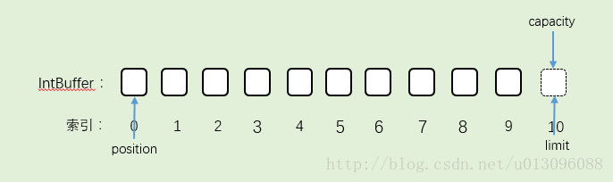

# NIO

> 参考——https://www.cnblogs.com/mikechenshare/p/16587635.html

## 一、概览

NIO 中的 N 可以理解为 ***Non-blocking***，不单纯是 New，是解决高并发、I/O高性能的有效方式。

Java NIO是Java1.4之后推出来的一套IO接口，NIO提供了一种完全不同的操作方式， NIO支持面向缓冲区的、基于通道的IO操作。

新增了许多用于处理输入输出的类，这些类都被放在java.nio包及子包下，并且对原java.io包中的很多类进行改写，新增了满足NIO的功能。


## 二、NIO vs BIO

### 1.BIO

### BIO

BIO全称是Blocking IO，同步阻塞式IO，是JDK1.4之前的传统IO模型。

Java BIO：服务器实现模式为一个连接一个线程，即客户端有连接请求时服务器端就需要启动一个线程进行处理，如下图所示：


虽然此时服务器具备了高并发能力，即能够同时处理多个客户端请求了，但是却带来了一个问题，随着开启的线程数目增多，将会消耗过多的内存资源，导致服务器变慢甚至崩溃。


### 2.NIO

同步非阻塞，服务器实现模式为一个线程处理多个请求(连接)，即客户端发送的连接请求都会注册到多路复用器上，多路复用器轮询到连接,有I/O请求就进行处理。


## 三、核心组成

**NIO 包含3个核心的组件：**

- Channel(通道)
- Buffer(缓冲区)
- Selector(选择器)


> 1. 每个 Channel 对应一个 Buffer。
> 2. Selector 对应一个线程，一个线程对应多个 Channel。
> 3. 该图反应了有三个 Channel 注册到该 Selector。
> 4. 程序切换到那个 Channel 是由事件决定的（Event）。
> 5. Selector 会根据不同的事件，在各个通道上切换。
> 6. Buffer 就是一个内存块，底层是有一个数组。
> 7. 数据的读取和写入是通过 Buffer，但是需要flip()切换读写模式，而 BIO 是单向的，要么输入流要么输出流。


### 1.Channel

Channel 是 NIO 的核心概念，它表示一个打开的连接，这个连接可以连接到 I/O 设备（例如：磁盘文件，Socket）或者一个支持 I/O 访问的应用程序，Java NIO **使用缓冲区和通道来进行数据传输**。


#### FileChannel类

本地文件IO通道，用于读取、写入、映射和操作文件的通道，使用文件通道操作文件的一般流程为：

##### （1）获取通道

文件通道通过 FileChannel 的静态方法 open() 来获取，获取时需要指定文件路径和文件打开方式。

```java
// 获取文件通道
FileChannel.open(Paths.get(fileName), StandardOpenOption.READ);
```


##### （2）创建字节缓冲区

文件相关的字节缓冲区有两种，一种是基于堆的 HeapByteBuffer，另一种是基于文件映射，放在堆外内存中的 MappedByteBuffer。

```java
// 分配字节缓存
ByteBuffer buf = ByteBuffer.allocate(10);
```


##### （3）读写操作

> **从 I/O 设备读取数据时：**
>
> 1）应用程序调用通道 Channel 的 read() 方法；
>
> 2）通道往缓冲区 Buffer 中填入 I/O 设备中的数据，填充完成之后返回；
>
> 3）应用程序从缓冲区 Buffer 中获取数据。
>
> **往 I/O 设备写数据时：**
> 1）应用程序往缓冲区 Buffer 中填入要写到 I/O 设备中的数据；
> 2）调用通道 Channel 的 write() 方法，通道将数据传输至 I/O 设备。

**读数据：需要注意切换 ByteBuffer 的读写模式。**

```java
while (channel.read(buf) != -1){ // 读取通道中的数据，并写入到 buf 中
    buf.flip(); // 缓存区切换到读模式
    while (buf.position() < buf.limit()){ // 读取 buf 中的数据
        text.append((char)buf.get());
    }
    buf.clear(); // 清空 buffer，缓存区切换到写模式
}
```

**写数据：**

```java
for (int i = 0; i < text.length(); i++) {
    buf.put((byte)text.charAt(i)); // 填充缓冲区，需要将 2 字节的 char 强转为 1 字节的 byte
    if (buf.position() == buf.limit() || i == text.length() - 1) { // 缓存区已满或者已经遍历到最后一个字符
        buf.flip(); // 将缓冲区由写模式置为读模式
        channel.write(buf); // 将缓冲区的数据写到通道
        buf.clear(); // 清空缓存区，将缓冲区置为写模式，下次才能使用
    }
}
```

> **`flip()`函数**主要是反转缓存，从而实现读写效果
>
> ```java
> public Buffer flip() {
>  limit = position;
>  position = 0;
>  mark = -1;
>  return this;
> }
> ```
>
> 如上源码看到，将position赋值给limit，将position置0，具体演示如下图：
>
> 
>
> 往Buffer里加一个数据。position位置移动，capacity不变，limit不变。
>
> 
>
> Buffer读完之后，往bufer里写了5个数据，position指向索引为5的第6个数据，capacity不变，limit不变。
>
> 
>
> 执行flip()。把position的值赋给limit,所以limit=5，然后position=0。capacity不变。结果就是：
>
> 
>
> **因为position始终指向读写位置，所以反转好处是读写数据可以有效数据长度**
>
> > 参考——https://blog.csdn.net/yuxin6866/article/details/120843912
>
> **compact()函数**
>
> > 相同点：调用完compcat和clear方法之后的buffer对象一般都是继续往该buffer中写入数据的
> >
> > 不同点：
> >
> > （1）clear是把position=0，limit=capcity等，也就是说，除了内部数组，其他属性都还原到buffer创建时的初始值，而内部数组的数据虽然没赋为null，但只要不在clear之后误用buffer.get就不会有问题，正确用法是使用buffer.put从头开始写入数据;
> >
> > （2）而compcat是把buffer中内部数组剩余未读取的数据复制到该数组从索引为0开始，然后position设置为复制剩余数据后的最后一位元素的索引+1，limit设置为capcity，此时在0~position之间是未读数据，而position~limit之间是buffer的剩余空间，可以put数据。
> >
> > > 参考——https://blog.csdn.net/qq_36951116/article/details/87209456


##### （4）刷新

将数据刷出到物理磁盘

```java
channel.force(false);
```

##### （5）关闭通道

```java
channel.close();
```


#### SocketChannel类

网络套接字IO通道，TCP协议，针对面向流的连接套接字的可选择通道（**一般用在客户端**）。

TCP 客户端使用 SocketChannel 与服务端进行交互的流程为：

##### （1）打开通道

```java
SocketChannel channel = SocketChannel.open(); // 打开通道，此时还没有打开 TCP 连接
channel.connect(new InetSocketAddress("localhost", 9090)); // 连接到服务端
```


##### （2）分配缓冲区

```java
ByteBuffer buf = ByteBuffer.allocate(10); // 分配一个 10 字节的缓冲区，（不实用，容量太小）
```


##### （3）配置是否为阻塞方式。（默认为阻塞方式）

```java
channel.configureBlocking(false); // 配置通道为非阻塞模式
```


##### （4）与服务端交互


##### （5）关闭通道

```java
channel.close(); 
```


#### ServerSocketChannel类

网络通信IO操作，TCP协议，针对面向流的监听套接字的可选择通道（一般用于服务端）：

##### （1）打开通道

```java
ServerSocketChannel server = ServerSocketChannel.open();
```

##### （2）绑定端口

```java
server.bind(new InetSocketAddress(9090));
```

##### （3）等待连接

阻塞等待连接到来，有新连接时会创建一个 SocketChannel 通道，服务端可以通过这个通道与连接过来的客户端进行通信。等待连接到来的代码一般放在一个循环结构中。

```java
SocketChannel client = server.accept(); // 阻塞，直到有连接过来
```

##### （4）通过 SocketChannel 与客户端进行数据交互

##### （5）关闭通道

```java
server.close();
client.close();
```


### 2.Buffer

缓冲区 Buffer 是 Java NIO 中一个核心概念，在NIO库中，所有数据都是用缓冲区处理的。

在读取数据时，它是直接读到缓冲区中的,在写入数据时，它也是写入到缓冲区中的,任何时候访问 NIO 中的数据，都是将它放到缓冲区中。

（而在面向流I/O系统中，所有数据都是直接写入或者直接将数据读取到Stream对象中。）


#### (1)数据类型


#### (2)数据流程


#### (3)核心方法

**put():存入数据到缓冲区**

- put(byte b)：将给定单个字节写入缓冲区的当前位置
- put(byte[] src)：将 src 中的字节写入缓冲区的当前位置
- put(int index, byte b)：将指定字节写入缓冲区的索引位置(不会移动 position)

**get():获取缓冲区的数据**

- get() ：读取单个字节
- get(byte[] dst)：批量读取多个字节到 dst 中
- get(int index)：读取指定索引位置的字节(不会移动 position)


### 3.selector

Selector类是NIO的核心类，Selector（选择器）选择器提供了选择已经就绪的任务的能力。

**Selector会不断的轮询注册在上面的所有channel，如果某个channel为读写等事件做好准备，那么就处于就绪状态，通过Selector可以不断轮询发现出就绪的channel，进行后续的IO操作。**

一个Selector能够同时轮询多个channel，这样，一个单独的线程就可以管理多个channel，从而管理多个网络连接


#### (1)注册选择器

```java
Selector selector = Selector.open(); // 获取一个选择器实例
```


#### (2)获取可选择通道

能够被选择器监控的通道必须实现了 SelectableChannel 接口，并且需要将通道配置成非阻塞模式，否则后续的注册步骤会抛出 IllegalBlockingModeException。

```java
SocketChannel socketChannel = SocketChannel.open(new InetSocketAddress("localhost", 9090)); // 打开 SocketChannel 并连接到本机 9090 端口
socketChannel.configureBlocking(false); // 配置通道为非阻塞模式
```


#### (3)将通道注册到选择器

```java
socketChannel.register(selector, SelectionKey.OP_READ | SelectionKey.OP_WRITE); // 将套接字通过到注册到选择器，关注 read 和 write 事件
```


#### (4)轮询select就绪事件

通过调用选择器的 Selector.select() 方法可以获取就绪事件，该方法会将就绪事件放到一个 SelectionKey 集合中，然后返回就绪的事件的个数。这个方法映射多路复用 I/O 模型中的 select 系统调用，它是一个阻塞方法。正常情况下，直到至少有一个就绪事件，或者其它线程调用了当前 Selector 对象的 wakeup() 方法，或者当前线程被中断时返回。

```java
while (selector.select() > 0){ // 轮询，且返回时有就绪事件
    Set<SelectionKey> keys = selector.selectedKeys(); // 获取就绪事件集合
    .......
}
```


有 3 种方式可以 select 就绪事件：

- select() 阻塞方法，有一个就绪事件，或者其它线程调用了 wakeup() 或者当前线程被中断时返回。
- select(long timeout) 阻塞方法，有一个就绪事件，或者其它线程调用了 wakeup()，或者当前线程被中断，或者阻塞时长达到了 timeout 时返回。不抛出超时异常。
- selectNode() 不阻塞，如果无就绪事件，则返回 0；如果有就绪事件，则将就绪事件放到一个集合，返回就绪事件的数量。


#### (5)处理就绪事件

每次可以 select 出一批就绪的事件，所以需要对这些事件进行迭代。

```java
for(SelectionKey key : keys){
    if(key.isWritable()){ // 可写事件
        if("Bye".equals( (line = scanner.nextLine()) )){
            socketChannel.shutdownOutput();
            socketChannel.close();
            break;
        }
        buf.put(line.getBytes());
        buf.flip();
        socketChannel.write(buf);
        buf.compact();
    }
}
```

从一个 SelectionKey 对象可以得到：1）就绪事件的对应的通道；2）就绪的事件。通过这些信息，就可以很方便地进行 I/O 操作。


# Netty

