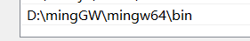
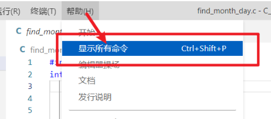

# 一、配置开发环境

## 1.配置C/C++环境

> 参考：
>
> [vscode 配置c/c++](https://blog.csdn.net/weixin_42294124/article/details/124766738)

**下载code run和C++插件**


**配置code run**


> 第二个设置是希望运行时候能够在终端运行，方便控制台输入


**下载MinGW**

 C/C++的编译器有很多种，这里选择开源的MinGW编译器。 

> https://sourceforge.net/projects/mingw-w64/files/mingw-w64/mingw-w64-release/
>
> 

**配置系统环境变量**



**打开cmd，输入gcc -v验证是否成功**


**配置编译器：**

 按快捷键Ctrl+Shift+P调出命令面板，或者点菜单栏 帮助—显示所有命令，输入C/C++，选择“Edit Configurations(UI)”进入配置。 




**配置两个选项：**

> 1. 编译器路径：D:\A_Software\mingw64\bin\g++.exe
> 2. IntelliSense 模式：windows-gcc-x64


 配置完成后，此时在侧边栏可以发现多了一个.vscode文件夹，并且里面有一个c_cpp_properties.json文件， 

**创建并且编写一个简单的c程序**


**然后运行：**


**编辑调试配置文件**

前提是已经下载好MingGw并且配置了环境变量

创建.vscode文件夹然后分别创建tasks.json和launch.json文件


**然后分别配置：**

```json
/*launch.json*/
{
    "version": "0.2.0",  
    "configurations": [  
        { 
            "name": "(gdb) Launch", // 配置名称，将会在启动配置的下拉菜单中显示
            "type": "cppdbg",       // 配置类型，这里只能为cppdbg
            "request": "launch",    // 请求配置类型，可以为launch（启动）或attach（附加）  
            "program": "${fileDirname}/${fileBasenameNoExtension}",// 将要进行调试的程序的路径  
            "args": [],             // 程序调试时传递给程序的命令行参数，一般设为空即可  
            "stopAtEntry": false,   // 设为true时程序将暂停在程序入口处，一般设置为false  
            "cwd": "${workspaceFolder}", // 调试程序时的工作目录，一般为${workspaceFolder}即代码所在目录 
            "environment": [],  
            "externalConsole": true, // 调试时是否显示控制台窗口，一般设置为true显示控制台  
            "MIMode": "gdb",  
            "miDebuggerPath": "[自己mingw的路径]bin\\gdb.exe", // miDebugger的路径，注意这里要与MinGw的路径对应  
            "preLaunchTask": "g++", // 调试会话开始前执行的任务，一般为编译程序，c++为g++, c为gcc  
            "setupCommands": [  
                {   
            "description": "Enable pretty-printing for gdb",  
                    "text": "-enable-pretty-printing",  
                    "ignoreFailures": true  
                }  
            ]  
        }  
    ]  
}

```


```json
/*tasks.json*/
{
    "version": "2.0.0",
    "command": "g++", // 注意对应
    "args": ["-g","${file}","-o","${fileDirname}/${fileBasenameNoExtension}"],    // 编译命令参数
    "problemMatcher": {
        "owner": "cpp",
        "fileLocation": ["relative", "${workspaceFolder}"],
        "pattern": {
            "regexp": "^(.*):(\\d+):(\\d+):\\s+(warning|error):\\s+(.*)$",
            "file": 1,
            "line": 2,
            "column": 3,
            "severity": 4,
            "message": 5
        }
    }
}
```

**调试：F5或者是菜单栏进行调试**

**需要注意的是：调试的源程序文件存放的路径不允许有中文，否则会失败**


**这样做只可以调试c(遇到sanf会出现问题)，c++不能成功**

------------

### 问题：

**（1）控制台出现中文乱码问题**

点击右下角：


将编码模式换成GBK（Simplified Chinese）


### (2)配置cmake

> 参考：
>
> [vscode cmake](https://blog.csdn.net/weixin_43470971/article/details/119621643?spm=1001.2101.3001.6650.1&utm_medium=distribute.pc_relevant.none-task-blog-2%7Edefault%7ECTRLIST%7ERate-1-119621643-blog-93545513.235%5Ev38%5Epc_relevant_sort_base3&depth_1-utm_source=distribute.pc_relevant.none-task-blog-2%7Edefault%7ECTRLIST%7ERate-1-119621643-blog-93545513.235%5Ev38%5Epc_relevant_sort_base3&utm_relevant_index=2)
>
> https://www.jianshu.com/p/ad29eee7b736

C++ 工程，有四个必要的`json`配置文件，先`ctrl+shift+p`打开输入指令分别是：

- `c_cpp_properties.json `：配置项目结构，自动生成和更新，输入`C/C++:Edit configuration` 
- `task.json`: 构建和编译运行项目，输入`Task:Configure Task`，模板，Others
- `launch.json`: 调试，读取可执行文件

**下载Cmake**

**在Vscode中创建cmake配置文件：使用的编译器等等**


**然后会让你输入要编译的项目名，直接输入写的cpp代码目录即可**

**之后目录下面出现`build`目录和`CMakeLists.txt`**


`CMakeLists.txt`文件内容如下

```
cmake_minimum_required(VERSION 3.0.0)
project(CPPTEST VERSION 0.1.0 LANGUAGES C CXX)#项目名字和版本

include(CTest)#包含测试框架，我们可以不用
enable_testing()

add_executable(CPPTEST  test.cpp Student.cpp Student.h)#添加源文件

set(CPACK_PROJECT_NAME ${PROJECT_NAME})
set(CPACK_PROJECT_VERSION ${PROJECT_VERSION})
include(CPack)
```


**在命令行运行编译文件**

```shell
cmake --build build #build指build文件夹路径
```

然后会在build目录下生成可执行文件，直接运行即可


如果要更换可执行文件生成位置

```
set(EXECUTABLE_OUTPUT_PATH ..)
```


## 2.配置python

**配置调试环境**

> 参考—— [ Vscode工作区调试（虚拟环境）配置](https://blog.csdn.net/q1_6_2_what_123/article/details/109125858) 

首先在调试区的`lauch.json`添加想要调试的虚拟环境路径

> 

然后选择添加调试名进行调试


### 问题：

**(1)虚拟环境包补全问题：**

> 参考——[vscode python 第三方库自动补全 第三方库的智能提示](https://blog.csdn.net/weixin_40583088/article/details/119685872) 

**①首先，先卸载Pylance**

**②配置setting——python——setting.json**

插入三方包的路径


**③然后再次安装pylance，重启vscode即可**


# 二、usage

## 1.自动格式化代码

