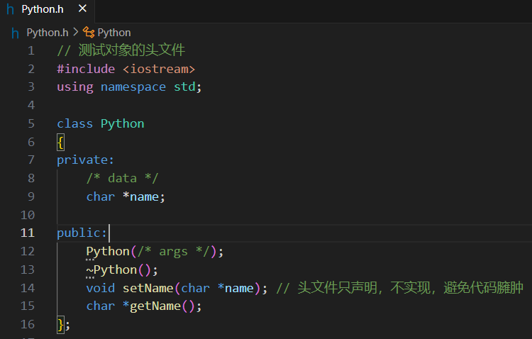
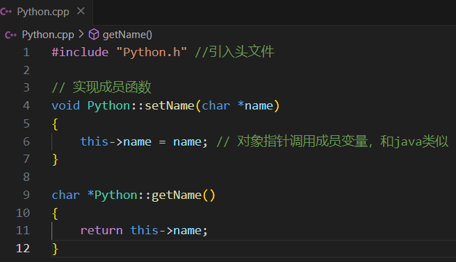
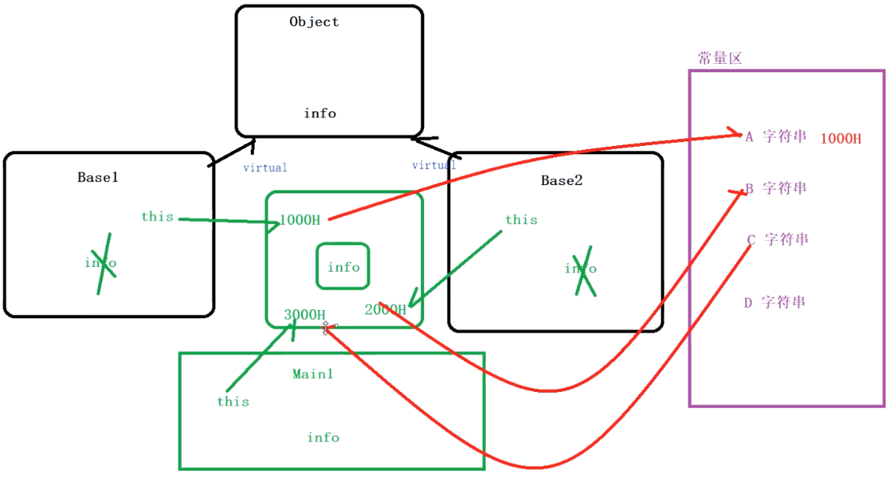
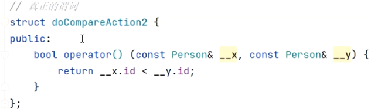
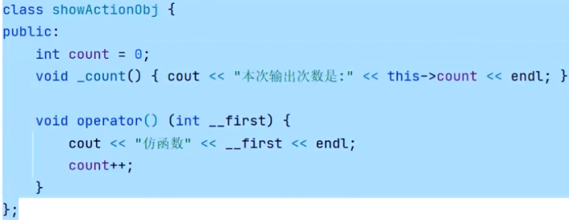
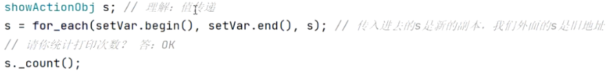
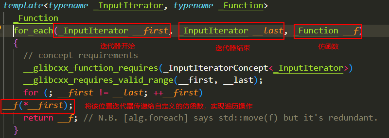
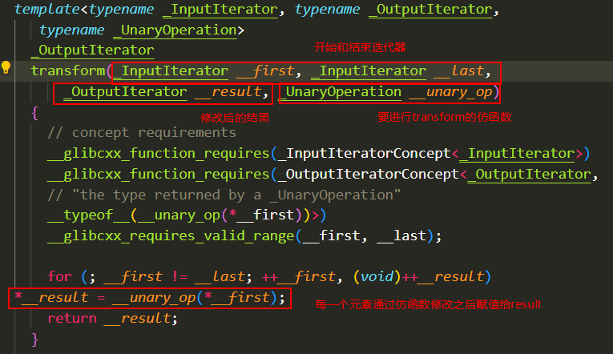

# 一、基础

## 1.数据类型

### (1)字符串

两种类型字符串表示形式：

- C风格字符串
- C++引入的string类型

**C风格字符串**

--------

 这种形式字符串实际上是使用 **null** 字符 **\0** 终止的一维字符数组。 

```c
char site[7] = {'R', 'U', 'N', 'O', 'O', 'B', '\0'};
//或者写成（不需要手动把\0放到末尾，编译器初始化数组时候自动加上）
char site[] = "RUNOOB";
```


**可以用指针指向字符数组，形成字符串指针**

```c++
char *p = "hello,world!";

//访问元素
char c = *p;// 访问字符数组中的第一个元素
char c = *(p+1);// 访问字符数组中的第二个元素
char c = *(p + strlen(p) - 1);// 访问字符数组中的最后一个元素
```


**string类**

-----

C++标准库`string`类型

```c++
#include <iostream>
#include <string>
 
using namespace std;
 
int main ()
{
   string str1 = "runoob";
   string str2 = "google";
   string str3;
   int  len ;
 
   // 复制 str1 到 str3
   str3 = str1;
   cout << "str3 : " << str3 << endl;
 
   // 连接 str1 和 str2
   str3 = str1 + str2;
   cout << "str1 + str2 : " << str3 << endl;
 
   // 连接后，str3 的总长度
   len = str3.size();
   cout << "str3.size() :  " << len << endl;
 
   return 0;
}
```


### (2)auto

 auto是一个关键字，可以用于声明变量。auto变量的类型由初始化表达式来推导。 

```c++
#include <iostream>
using namespace std;

int main() {
    // 声明一个int类型的auto变量
    auto x = 10;
    // 声明一个std::string类型的auto变量
    auto y = "Hello, world!";
    
    cout << x << endl;
    cout << y << endl;

    return 0;
}
```


### (3)初始化

在`JAVA`中，如果不给初始类型赋值，则系统默认赋默认值；

在`C++`中，不给赋值，就是系统值-64664

## 2.io

### (1)控制台io

- `cin>>`:输入
- `cout<<`输出

> `<<`和`>>`都是操作符重载


## 3.指针运算符

> [指针运算符](https://www.runoob.com/cplusplus/cpp-pointer-operators.html)

### (1)取地址运算符 `&`

c++中推荐使用引用`&`

 `&` 是一元运算符，返回操作数的内存地址。 

### (2)间接寻址运算符 `*`

`*`是一元运算符，返回操作数所指定地址的变量的值。 

### (3)两种运算符操作总结

| 用法                                  | 说明                                                         |
| ------------------------------------- | ------------------------------------------------------------ |
| 声明时:基本类型 **`&`**               | 声明**引用变量**。它是某个已存在变量的**别名**，即该引用变量名称与原始变量名称都代表同一个变量。 |
| 声明时:基本类型 **`*`**               | 声明**指针变量**。它的值是另一个变量的**地址**               |
| 声明时:基本类型 `**`                  | 声明**二级指针变量**。它的值是另一个一级"基本类型 *"指针变量的地址 (**指针的指针**)。 |
| 调用时:变量前加 "**&**"               | 使用**取地址运算符**获取该变量的**地址**                     |
| 调用时:指针变量前加 "*****"           | 使用间接寻址运算符获取该指针变量所指向的变量                 |
| 调用时:**二级**指针变量前加 "***\***" | 获取该二级指针变量所指向的指针所指向的变量                   |

```c++
#include <iostream>
using namespace std; 
int main(){
    int  var;     // 声明int类型变量var
    int * ptr;    // 声明指针变量ptr
    ptr = &var;   // 先使用 & 运算符获取变量var的地址，再把该地址赋值给指针变量ptr
    int ** pptr;  // 声明二级指针变量pptr
    pptr = &ptr;  // 先使用 & 运算符获取变量ptr的地址，再把该地址赋值给二级指针变量pptr
    int & ref1 = var;   // 声明引用变量ref1, ref1是变量var的别名(引用必须在创建时被初始化)
    int & ref2 = *ptr;  // 先使用*运算符获取指针变量ptr所指向的变量(即var)，再用该变量(var)初始化引用变量ref2(声明引用变量ref2的同时对它进行初始化)。也就是说，该行代码执行后，ref2也是变量var的别名 
    var = 20
}

Value of var: 20
Value of &var: 0x7ffce63490bc    (var的地址)

Value of ptr: 0x7ffce63490bc    (等于&var)
Value of *ptr: 20        (等于var)
Value of &ptr: 0x7ffce63490b0    (ptr的地址)

Value of pptr: 0x7ffce63490b0    (等于&ptr)
Value of *pptr: 0x7ffce63490bc    (等于ptr, 等于&var)
Value of **pptr: 20        (等于*ptr, 等于var)
Value of &pptr: 0x7ffce63490a8    (pptr的地址)

Value of ref1: 20        (等于var)
Value of &ref1: 0x7ffce63490bc    (等于&var)

Value of ref2: 20        (等于var)
Value of &ref2: 0x7ffce63490bc    (等于&var)
```


### (4)悬空指针

悬空指针的产生原因主要有以下几种：

- 指针指向的内存空间被释放，但指针本身没有被置为空。
- 指针指向的内存空间被释放，但指针被传递给了另一个函数或方法。
- 指针指向的内存空间被释放，但指针被用作函数或方法的返回值。

```c++
// 指针指向的内存空间被释放，但指针本身没有被置为空
int* p = new int(10);
delete p; // 释放内存空间,指针 p 仍然指向已经释放的内存空间

// 指针指向的内存空间被释放，但指针被传递给了另一个函数或方法
void foo(int* p) {
  delete p; // 释放内存空间
}
foo(p); // 指针 p 仍然指向已经释放的内存空间，报错
```


**避免办法：**

```c++
// 指针指向的内存空间被释放，但指针本身没有被置为空
int* p = new int(10);
delete p; // 释放内存空间,指针 p 仍然指向已经释放的内存空间
p = NULL;

// 指针指向的内存空间被释放，但指针被传递给了另一个函数或方法
void foo(int* p) {
  delete p; // 释放内存空间
}
foo(p); // 指针 p 仍然指向已经释放的内存空间，报错
```


### (5)常量指针

```c++
int num = 9;
int num2 = 10;
const int * numberP = &num;

*numberP = 100;//报错，不允许修改常量指针存放地址对应的值
numberP = &num2;//正确，允许重新指向常量指针存放的地址
```


### (6)指针常量

```c++
int num = 9;
int num2 = 10;
int *const numberP = &num;
*num = 100;//正确，运行修改指针常量存放地址对应的值
numberP = &num2;//错误，不允许重新指向指针常量存放的地址
```

### (7)常量指针常量

都不允许修改

```c++
const int * const numerP = &num;
```


## 4.引用

引用是变量的别名，特点是：

- 引用在创建时必须初始化
- 不存在空引用。引用必须连接到一块合法的内存。
- 一旦引用被初始化为一个对象，就不能被指向到另一个对象。(指针可以在任何时候指向到另一个对象)

```c++
int a = 10;
int &b = a;

cout<<"地址 "<<"a:"<<&a<<" b:"<<&b<<endl;
cout<<"值 "<<"a:"<<a<<" b:"<<b<<endl;

b = 99;

cout<<"地址 "<<"a:"<<&a<<" b:"<<&b<<endl;
cout<<"值 "<<"a:"<<a<<" b:"<<b<<endl;

//输出：
地址 a:0x61fe14 b:0x61fe14
值 a:10 b:10
地址 a:0x61fe14 b:0x61fe14
值 a:99 b:99
```

> 因此推荐使用引用进行变量数值交换
>
> ```c++
> void changeNumber(int &num1,int &num2){//参数为对变量的引用
>     int temp = 0;
>     temp = num1;
>     num1 = num2;
>     num2 = temp;
> }
> 
> int main(){
>     int a = 10;
>     int b = 99;
> 
>     cout<<"地址 "<<"a:"<<&a<<" b:"<<&b<<endl;
>     cout<<"值 "<<"a:"<<a<<" b:"<<b<<endl;
> 
>     changeNumber(a,b);
>     
>     cout<<"地址 "<<"a:"<<&a<<" b:"<<&b<<endl;
>     cout<<"值 "<<"a:"<<a<<" b:"<<b<<endl;
> }
> 
> //输出
> 地址 a:0x61fe1c b:0x61fe18
> 值 a:10 b:99
> 地址 a:0x61fe1c b:0x61fe18
> 值 a:99 b:10
> ```
>


### (1)常量引用

 常量引用是指不能通过引用来修改其所指向的对象的值。 

```c++
//格式
const type &ref_name = object_name;
```

最常见的用法是用在函数参数，这样变量不能被修改

```c++
void func(const int &a) {
  // 不能修改对象的值
  a = 20; // 编译错误
}

int main() {
  int a = 10;
  func(a); // 可以传入一个普通变量

  // 也可以传入一个常量对象
  const int b = 20;
  func(b); 
}
```


### (2)引用的高阶运用

引用只是变量的别名，就是同一个内存空间，多个不同的名称

```c++
class MyClass
{
    string name = "Kevin";

public:
    string getInfo()
    {
        return this->name;
    }

    string &getInfo2()
    {
        return this->name;
    }
};

int main()
{
    MyClass obj;

    string res;
    obj.getInfo() = "Lucy";
    res = obj.getInfo();
    cout << "res1:" << res << endl;
    
    obj.getInfo2() = "Lucy";//该方法是引用类型，所以是作为了Lucy变量的别名
    res = obj.getInfo2();
    cout << "res2:" << res << endl;
}

//输出
res1:Kevin
res2:Lucy
```


## 5.函数

### (1)默认形参

c++支持默认形参

```c++
void func(int a = 10,double a){
    
}
```

### (2)可变参数

```c++
#include <iostream>
#include <stdarg.h> //引入头文件
using namespace std;
// 可变参数
void sum(int count, ...)
{
    va_list arg;
    va_start(arg, count); // 第二个参数必须是变量，不能是具体值。用作存储地址参考值。

    // 取第一个可变参数的变量
    int argc = va_arg(arg, int);
    cout << "argc_0 = " << argc << endl;

    //取第二个可变参数的变量
    int argv = va_arg(arg, int);
    cout << "argv_1 = " << argv << endl;
    
    
    va_end(arg)
}

int main()
{
    sum(2, 10, 20);//这里的count可以是任意值，一般为可变参数长度，方便后面遍历
    return 0;
}

输出
argc_0 = 10
argv_1 = 20
```


### (3)无名形参

 C++中，形参可以只指定类型，不指定名称。这种形参被称为“无名形参”或“占位符形参”。在函数定义中，可以使用类型名代替形参名来定义一个无名形参。 

无名形参有以下应用场景

> - 需要指定参数类型，但不需要实际参数情况
>
>   ```c++
>   int sum(int, int);
>   
>   int main() {
>     int a, b;
>     cin >> a >> b;
>   
>     // 调用函数，不传入任何实参
>     int result = sum(a, b);
>     cout << result << endl;
>   }
>   ```
>
>   
>
> - 定义函数模板
>
>   ```c++
>   template <typename T>
>   T sum(T a, T b) {
>     return a + b;
>   }
>   
>   int main() {
>     int a = 10;
>     int b = 20;
>   
>     // 调用函数，传入两个整数
>     int result = sum<int>(a, b);
>     cout << result << endl;
>   
>     // 调用函数，传入两个浮点数
>     float c = 1.5;
>     float d = 2.5;
>     float result2 = sum<float>(c, d);
>     cout << result2 << endl;
>   }
>   ```
>


### (4)运算符重载

> 参考：[运算符重载](https://www.runoob.com/cplusplus/cpp-overloading.html)

可以重载内置的运算符以满足某些要求

**重载的运算符是带有特殊名称的函数，函数名是由关键字 operator 和其后要重载的运算符符号构成的。**

#### `+`运算符重载

```c++
class Box
{
   public:
    double getVolume(void)
      {
         return length * breadth * height;
      }
      void setLength( double len )
      {
          length = len;
      }
 
      void setBreadth( double bre )
      {
          breadth = bre;
      }
 
      void setHeight( double hei )
      {
          height = hei;
      }
      // 重载 + 运算符，用于把两个 Box 对象相加
      //运算符重载写在类中，方便调用类的成员变量
      Box operator+(const Box& b)
      {
         Box box;
         box.length = this->length + b.length;
         box.breadth = this->breadth + b.breadth;
         box.height = this->height + b.height;
         return box;
      }
   private:
      double length;      // 长度
      double breadth;     // 宽度
      double height;      // 高度
};

int main( )
{
   Box Box1;                // 声明 Box1，类型为 Box
   Box Box2;                // 声明 Box2，类型为 Box
   Box Box3;                // 声明 Box3，类型为 Box
   double volume = 0.0;     // 把体积存储在该变量中
 
   // Box1 详述
   Box1.setLength(6.0); 
   Box1.setBreadth(7.0); 
   Box1.setHeight(5.0);
 
   // Box2 详述
   Box2.setLength(12.0); 
   Box2.setBreadth(13.0); 
   Box2.setHeight(10.0);
 
   // 把两个对象相加，得到 Box3
   Box3 = Box1 + Box2;
 
   // Box3 的体积
   volume = Box3.getVolume();
   cout << "Volume of Box3 : " << volume <<endl;
 
   return 0;
}
```


#### `<<`运算符重载

**重载函数必须是友元函数；**

```c++
#include <iostream>
using namespace std;
class Student
{
public:

    Student(char *name, int age) : name(name), age(age)
    {
        cout << "name:" <<this->name<< endl;
        cout << "age:" << this->age << endl;
    }

    void setName(char *name);
    char *getName();
    int getAge();
 
    ~Student()
    {
        cout << "xi gou han shu" << endl;
        delete[] nums;
    }
    //输出符号重载
    //必须是友元函数
    friend ostream &operator<<(ostream &os, const Student &stu){
        os << "operator <<:" << stu.name << " " << stu.age << " "<<endl;
    	return os;//放回重载操作对象，能够支持打印多个重载
    }
private:
    char *name;
    int age;
};

int main()
{
    Student s1("John", 10); // 栈区开辟空间
    cout << s1;
}


//输出
operator <<:John 10
```


#### `>>`运算符重载

**重载函数必须是友元函数**

```c++
#include <iostream>
using namespace std;
class Student
{
public:

    Student(char *name, int age) : name(name), age(age)
    {
        cout << "name:" <<this->name<< endl;
        cout << "age:" << this->age << endl;
    }

    void setName(char *name);
    char *getName();
    int getAge();
 
    ~Student()
    {
        cout << "xi gou han shu" << endl;
        delete[] nums;
    }
    //输入符号重载
    //必须是友元函数
    friend istream &operator>>(istream &is, const Student &stu){
        is >>  stu.name >> stu.age;
    	return is;//放回重载操作对象，能够支持打印多个重载
    }
private:
    char *name;
    int age;
};

int main()
{
    Student s1("John", 10); // 栈区开辟空间
    cin >> s1;
}


//输出
operator <<:John 10
```


#### `()`运算符重载

> [运算符()重载](https://www.runoob.com/cplusplus/function-call-operator-overloading.html)


### (5)只读函数

> 参考——[函数后加const](https://blog.csdn.net/SMF0504/article/details/52311207)

函数后面加上const代表只读函数，不可修改类的成员变量

```c++
class Test{
public:
	bool isInit() const{//只读
        return false;
    }    	
}
```


## 6.面向对象

**声明类：**

-----



头文件声明类及其成员变量和函数，不实现函数，**因为头文件被多个源文件包含，如果在头文件中实现函数，那么每个源文件都会包含相同的函数实现，这会导致代码膨胀和重复定义的错误。** 


**实现类的函数和成员变量:**

----------



创建`cpp`文件实现类的成员函数，`this`是类指针，指向这个类，可以用于访问成员函数和变量。


### (1)`.`和`->`

> 参考：
>
> [C++中的.和::和：和->的区别](https://blog.csdn.net/s15868887695/article/details/56834685)

- `A.B`则A为对象或者结构体；
- `A->B`则A为指针，->是成员提取，A->B是提取A中的成员B，A只能是指向类、结构、联合的指针；
- `::`是作用域运算符，A::B表示作用域A中的名称B，A可以是名字空间、类、结构；
- `：`一般用来表示继承；


**Example：**

 c++中当定义类对象是指针对象时候，就需要用到->指向类中的成员；当定义一般对象时候时就需要用到"."指向类中的成员。 

```c++
class A
{　　
    public play();
}

//如果定义如下
A *p //则使用：p->play(); 左边是结构指针。
A p //则使用：p.paly(); 左边是结构变量。

```

### (2)创建类对象

#### 开辟堆、栈空间

```c++
Student s1 ;//栈区开辟空间，由系统自动分配、释放
s1.setName("John");
cout<<s1.getName()<<endl;

/*堆区开辟空间*/
Student *s2 = new Student();
s2->setName("Mary");
cout<<s2->getName()<<endl;
delete s2;//必须手动释放堆空间

//调用静态函数，不用创建类的对象
Tests::printss();
```


#### 聚合初始化器 

使用 聚合初始化器 初始化一个类对象

```c++
class Person {
public:
    int age;
    char* name;
};

int main() {
    Person person = {1, "hello"};

    std::cout << person.age << " " << person.name << std::endl;

    return 0;
}
```


### (3)构造函数

构造函数后面跟上`:`代表初始化，在编译阶段

```c++
Student(char *name):name(name),age(age){//初始化
    cout<<"赋值给name"<<endl;
}

//等价于
Student(char *name){
    this->name = name;
    this->age = age;
}
```

又例如当前构造函数要调用多参数构造函数

```c++
//会先调用两个参数构造函数，再调用本构造函数
Student(char *name):Student(name,87){
    cout<<"赋值给name"<<endl;
}

Student(char *name,int age){
    this->name = name;
    this->age = age;
}
```


**当一个类的成员包含对象时候，必须使用：形式初始化**

```c++
class Person{
private:
    char* name;
public:
    Person(name):name(name){};
};


class Student{
private:
    Person person;
public:
    Student(char* name):person(name)//必须在：后面初始化成员对象
    {
        
    }
}
```


#### 拷贝构造函数

①使用`=`会调用**默认的**拷贝构造函数

```c++
Student s1 = {"John"}; // 栈区开辟空间

Student s2; // 默认拷贝构造函数
s2 = s1;
cout << &s2 << endl;
cout << &s1 << endl;

输出：
0x61fe00
0x61fe08
```

**自定义拷贝构造函数，覆盖默认拷贝构造函数**

```c++
//自定义拷贝构造函数
Student(const Student &s){
    cout << "copy constructor" << endl;
    this->name = s.name;
}


//调用自定义拷贝构造函数
Student s1 = {"kevin"};
Student s2 = s1;

//调用默认拷贝构造函数
Student s3;
s3 = s1;
```

> **注意：**
>
> ```c++
> Student *st1 = new Student("jack",23);
> 
> Student *st2 = st1;//这个不会调用拷贝构造函数，这是st2指向st1的地址
> ```
>

**③函数参数有对象也会拷贝**

```c++
void showStudent(Student stu)
{
    cout << "show function:" << &stu << endl; // 这里看看是否调用拷贝构造函数
}

int main()
{
    Student s1("John"); // 栈区开辟空间
    cout << "main s1:" << &s1 << endl;
    showStudent(s1);
}

输出：
main s1:0x61fe00
custom copy constructor
show function:0x61fe08
```


#### 浅拷贝与深拷贝

> 参考——[浅拷贝、深拷贝](https://www.cnblogs.com/hellowooorld/p/11259560.html)

当出现类的等号赋值时，即会调用拷贝函数

**区别：**

> - 在未定义显示拷贝构造函数的情况下，系统会调用默认的拷贝函数——即浅拷贝，它能够完成成员的一一复制。当数据成员中没有指针时，浅拷贝是可行的；**但当数据成员中有指针时**，如果采用简单的浅拷贝，则两类中的两个指针将指向同一个地址，当对象快结束时，会调用两次析构函数，而导致指针悬空现象，所以，此时，必须采用深拷贝。
> - 深拷贝与浅拷贝的区别就在于深拷贝会在堆内存中另外申请空间来储存数据，从而也就解决了指针悬空的问题。简而言之，当数据成员中有指针时，必须要用深拷贝。

**例子：**

**浅拷贝**就是对象的数据成员之间的简单赋值，如你设计了一个没有类而没有提供它的复制构造函数，当用该类的一个对象去给令一个对象赋值时所执行的过程就是浅拷贝，如：

```c++
class A 
{ 
    public: 
    A(int _data) : data(_data){} 
    A(){}
    private: 
    int data;
 };
int main() 
{ 
    A a(5), b = a; // 仅仅是数据成员之间的赋值 
}
```

但是如果对象中有其他资源(如：堆、文件、系统资源等)

```c++
class A 
{ 
    public: 
    A(int _size) : size(_size)
    {
        data = new int[size];
    } // 假如其中有一段动态分配的内存 
    A(){};
     ~A()
    {
        delete [] data;
    } // 析构时释放资源
    private: 
    int* data;
    int size; 
}
int main() 
{ 
    A a(5), b = a; // 注意这一句 
}


b.size = a.size;
b.data = a.data; // Oops!
这里b的指针data和a的指针指向了堆上的同一块内存，a和b析构时，b先把其data指向的动态分配的内存释放了一次，而后a析构时又将这块已经被释放过的内存再释放一次。对同一块动态内存执行2次以上释放的结果是未定义的，所以这将导致内存泄露或程序崩溃。
```

> 针对上面情况，需要用深拷贝来解决。深拷贝指的就是当拷贝对象中有对其他资源（如堆、文件、系统等）的引用时（引用可以是指针或引用）时，对象的另开辟一块新的资源，而不再对拷贝对象中有对其他资源的引用的指针或引用进行单纯的赋值。
>
> ```c++
> class A 
> { 
>     public: 
>     A(int _size) : size(_size)
>     {
>         data = new int[size];
>     } // 假如其中有一段动态分配的内存 
>     A(){};
>     A(const A& _A) : size(_A.size)
>     {
>         data = new int[size];
>     } // 深拷贝 
>     ~A()
>     {
>         delete [] data;
>     } // 析构时释放资源
>     private: 
>     int* data; 
>      int size;
>  }
> int main() 
> { 
>     A a(5), b = a; // 这次就没问题了 
> }
> ```
>
> 


### (4)析构函数

析构函数用于释放对象的内存空间，调用`delete`时，析构函数必被调用，而调用`free`时，析构函数不会调用。**析构函数不具备任何参数**

```c++
~Student(){
    ....
}
```

> 例如当对象中为某个对象分配的内存空间
>
> ```c++
> Student(char *name){
>     this->name = (char *)(malloc(sizeof(char *) * 10)) ;
>     strycpy(this->name,name);
> }
> ```
>
> 此时应该再析构函数里释放内存
>
> ```c++
> ~Student(){
>     if(this->name){
>         free(this->name);
>         this->name = NULL;//执行NULL的地址，避免悬空指针
>     }
> }
> ```


### (5)静态变量

静态变量只能在类里面声明，在类外初始化

```c++
class Student
{
public:
    int *nums;
    static int age;
};

int Student::age = 10;//不需要static
```

### (6)友元

#### ①友元函数

友元函数是一个定义在类外部，但有权访问类的所有私有（private）成员和保护（protected）成员的函数。 

```c++
class Person {
private:
    int age;
    std::string name;

public:
    void setAge(int age) {
        this->age = age;
    }
    void setName(std::string name) {
        this->name = name;
    }

    friend void printPersonInfo(Person *person); // 友元函数声明
};

void printPersonInfo(Person *person) {
    std::cout << "age: " << person->age << std::endl;//能够访问私有变量
    std::cout << "name: " << person->name << std::endl;
}

int main() {
    Person person;
    person.setAge(10);
    person.setName("Bard");

    printPersonInfo(&person); // 调用友元函数
    return 0;
}
```


#### ②友元类

友元类是指一个类可以访问另一个类的所有私有（private）成员和保护（protected）成员。友元类的声明格式如下： 

```c++
class ClassName {
public:
    // ...
private:
    // ...
    friend class FriendClass; // 友元类声明
};

class FriendClass{
public:
    ClassName classname;
    
    //可以访问ClassName的所有成员
}
```


### (7)this指针

每个对象创建都会有一个this指针，指向不同区域的成员变量，防止出错

**this指针实质是一个`指针常量`**

```c++
class Worker{
public:
    int age = NULL;
    ...
        
    //隐式的含有this
    //Worker * const this:指针地址无法北修改，但是值可以被修改
        
    void change(){
       //this = 0x6545;//指针地址无法被修改
    	this->age = 20;//指针指向的成员变量的值可以被修改
    }
}
```


### (8)继承

> [c++继承到底继承了什么](https://www.cnblogs.com/zhaozhibo/p/14977043.html)

```c++
class Parent{
    
}

//默认是私有继承，要指明范围
class Son:public Parent{
    
}
```


#### 多继承

不同于Java，c++支持多继承，并且通过`::`解决二义性问题

```c++
class Base1{
    void show(){
        
    }
}

class Base2{
    void show(){
        
    }
}

class Base3{
    void show(){
        
    }
}

class MainAct:public Base1,public Base2,public Base3{
    void show(){
        
    }
}

int main(){
    MainAct mainact;
    
    mainact.Base1::show();//指明调用的基类的方法
}
```


#### 虚继承

> 参考——[虚基类](http://c.biancheng.net/view/2280.html)

当多继承出现下面菱形继承的时候：

  

类 A 派生出类 B 和类 C，类 D 继承自类 B 和类 C，这个时候类 A 中的成员变量和成员函数继承到类 D 中变成了两份，一份来自 A-->B-->D 这条路径，另一份来自 A-->C-->D 这条路径。 

 **假如类 A 有一个成员变量 a，那么在类 D 中直接访问 a 就会产生歧义，编译器不知道它究竟来自 A -->B-->D 这条路径，还是来自 A-->C-->D 这条路径。** 

```c++
//间接基类A
class A{
protected:
    int m_a;
};
//直接基类B
class B: public A{
protected:
    int m_b;
};
//直接基类C
class C: public A{
protected:
    int m_c;
};
//派生类D
class D: public B, public C{
public:
    void seta(int a){ m_a = a; }  //命名冲突
    void setb(int b){ m_b = b; }  //正确
    void setc(int c){ m_c = c; }  //正确
    void setd(int d){ m_d = d; }  //正确
private:
    int m_d;
};
int main(){
    D d;
    return 0;
}
```


**解决办法**

> - **指明基类**
>
> ```c++
> void seta(int a){ B::m_a = a; }
> void seta(int a){ C::m_a = a; }
> ```
>
> - **虚继承**
>
> ```c++
> //间接基类A
> class A{
> protected:
>    int m_a;
> };
> 
> //直接基类B
> class B: virtual public A{  //虚继承
> protected:
>    int m_b;
> };
> 
> //直接基类C
> class C: virtual public A{  //虚继承
> protected:
>    int m_c;
> };
> 
> //派生类D
> class D: public B, public C{
> public:
>    void seta(int a){ m_a = a; }  //正确
>    void setb(int b){ m_b = b; }  //正确
>    void setc(int c){ m_c = c; }  //正确
>    void setd(int d){ m_d = d; }  //正确
> private:
>    int m_d;
> };
> 
> int main(){
>   A a;
>   B b;
>   C c;
>   D d;
>   a.m_a = 10;
>   b.m_a = 100;
>   c.m_a = 1000;
>   d.m_a = 10000;
>   cout<<"a.m_a"<<a.m_a<<endl;
>   cout<<"b.m_a"<<a.m_a<<endl;
>   cout<<"c.m_a"<<a.m_a<<endl;
>   cout<<"d.m_a"<<a.m_a<<endl;
> }
> 
> 
> //输出
> 10
> 100
> 1000
> 10000
> ```
>
> 这样在派生类 D 中就只保留了一份成员变量 m_a，直接访问就不会再有歧义了。 
>
> 上述虚继承的关系可以下图表示：
>
> 
>
>   > **在上图中，当定义 D 类时才出现了对虚派生的需求，但是如果 B 类和 C 类不是从 A 类虚派生得到的，那么 D 类还是会保留 A 类的两份成员。**

### (9)多态

#### 动态多态——重写

c++默认关闭多态，如果启用多态，使用虚函数。

动态多态只有在运行时候才会找哪个成员方法运行

```c++
class Base1
{
public:
    int m_a = 10;
    virtual void onStart(){//虚函数启用多态（动态多态-重写）
        cout<<"Base1"<<endl;
    }
};

class Home : public Base1
{
public:
    void onStart(){
        cout<<"Home"<<endl;
    }
};

class Login : public Base1
{
public:
    void onStart(){
        cout<<"Login"<<endl;
    }
};

void onShow(Base1 *base){
    base->onStart();
}

int main(){
    Base1* home = new Home();
    Base1* login = new Login();
    
    onShow(home);
    onShow(login);
}
```


### (10)抽象

c++实现`抽象`是通过**`纯虚函数`**

```c++
class MyAbstract{
public:
    virtual string hello();//虚函数，可以不实现
    virtual void initView()=0;//纯虚函数
};

class Son:public MyAbstract{
public:
  void initView(){
      //实现方法。
      //如果子类不实现，那么该类也是抽象类
  }  
};
```

> 利用抽象实现回调
>
> ```c++
> #include<iostream>
> using namespace std;
> 
> class ClickListener{
> public:
>     virtual void onClick() = 0;
> };
> 
> //实现父类的方法
> class MyClick:public ClickListener{
> public:
>     void onClick(){
>         cout<<"click"<<endl;
>     }
> };
> 
> void clickEvent(ClickListener &clickEvent){
>     clickEvent.onClick();
> }
> 
> int main(){
>     MyClick click;
>     int loginType = 1;
>     if(loginType == 1)
>         clickEvent(click);
> }
> ```

## 7.命名空间

为了防止不同库下面的函数重名情况

```c++
include <iostream>
using namespace std;
 
// 第一个命名空间
namespace first_space{
   void func(){
      cout << "Inside first_space" << endl;
   }
}
// 第二个命名空间
namespace second_space{
   void func(){
      cout << "Inside second_space" << endl;
   }
}
int main ()
{
   // 调用第一个命名空间中的函数
   first_space::func();
   // 调用第二个命名空间中的函数
   second_space::func(); 
 
   return 0;
}
```

### 嵌套

```c++
namespace namespace_name1 {
   // 代码声明
   namespace namespace_name2 {
      // 代码声明
   }
}

// 访问 namespace_name2 中的成员
using namespace namespace_name1::namespace_name2;
 
// 访问 namespace_name1 中的成员
using namespace namespace_name1;
```

### 不连续的命名空间

命名空间可以放在不同文件下面。

因此下面的命名空间定义可以是定义一个新的命名空间，也可以是为已有的命名空间增加新的元素： 

```c++
namespace namespace_name {
    // 代码声明
}
```


## 8.宏

> 参考——[宏定义](http://c.biancheng.net/view/446.html)


## 9.条件编译

> 参考：
>
> [条件编译-博客园](https://www.cnblogs.com/wanqieddy/p/4377937.html)

 

### (1)主要形式

条件编译是C语言中预处理部分的内容，它是编译器编译代码时最先处理的部分， 

 它的意思是如果宏条件符合，编译器就编译这段代码，否则，编译器就忽略这段代码而不编译。

条件编译指令主要有以下几种：

- `#ifdef` 和 `#endif`
- `#ifndef` 和 `#endif`
- `#if` 和 `#endif`
- `#elif`
- `#else`

**Example：** 

```c++
#define  A 0  //把A定义为0

#if (A > 1)

printf("A > 1");  //编译器没有编译该语句,该语句不生成汇编代码

#elif (A == 1)

printf("A == 1"); //编译器没有编译该语句,该语句不生成汇编代码

#else

printf("A < 1");   //编译器编译了这段代码，且生成了汇编代码，执行该语句

#endif

```


**常见的条件编译的三种形式：**

> ```c++
> #if defined(或者是ifdef)<标识符(条件)> 
> 
> <程序段1>
> 
> #endif  
> ```

> ```c++
> #if !defined(或者是ifndef)<标识符(条件)> 
> 
> <程序段1> 
> 
> #ifdef … 
> 
> [#elif … ] 
> 
> [#elif …] 
> 
> #else …  
> 
> #endif
> ```

### (2)应用场景

条件编译可以用于以下场景：

- 在不同平台上编译不同的代码
- 在不同版本的库或硬件上编译不同的代码
- 在调试和发布版本中编译不同的代码


## 10.模板

c++使用`模板`来实现类似于java的`泛型`

### (1)模板函数

```c++
template <typename T>
void functon(T n1,T n2){
    ...
}
```

```c++
template <typename T>
void functon(T n1,T n2){
    cout<<n1+n2<<endl;
}

int main(){
    function(1,2);
    function(1.1f,2.2f);
}
```

### (2)模板类

```c++
template <typename T>
class MyClass {
    public:
    MyClass() {}

    void set(T value) {
        this->value = value;
    }

    T get() {
        return value;
    }

    private:
    T value;
};


int main(){
    MyClass<int> my_class;
    my_class.set(10);
}
```


### (3)优缺点

模板具有以下优点：

- 可以让程序员编写通用的代码，而无需考虑具体的类型。
- 可以提高代码的可重用性和可维护性。
- 可以减少代码量。

模板也有一些缺点：

- 模板编译可能比较慢。
- 模板可能会导致代码膨胀。


## 11.STL

### (1)vector

> 参考——[vector](https://www.runoob.com/w3cnote/cpp-vector-container-analysis.html)

**构造函数**

```c++
vector<int> vec1(int size,int defaultValue);//可以指定尺寸和默认初值

vector():创建一个空vector
vector(int nSize):创建一个vector,元素个数为nSize
vector(int nSize,const t& t):创建一个vector，元素个数为nSize,且值均为t
vector(const vector&):复制构造函数
vector(begin,end):复制[begin,end)区间内另一个数组的元素到vector中
```

> vector重载了`[]`运算符，可以直接访问
>
> ```c++
> //直接访问元素
> vector<int> v(10,10);
> v[0] = 100;
> ```

**迭代器**

```c++
vec1.begin();//返回向量头指针，指向第一个元素
vec1.end();//返回向量尾指针，指向最后一个元素的下一个位置

vec1.rbegin();//反向迭代器，指向最后一个元素
vec1.rend();//反向迭代器，指向第一个元素之前的位置

vec1.at(int pos);//返回pos位置元素的引用

vec1.front();//返回首元素的引用
	vec1.front() = 99;//修改第一个元素

vec1.back();//返回尾元素的引用
```

> **遍历**
>
> ①通过下标遍历
>
> ②通过迭代器遍历
>
> ```c++
> //下标遍历
> vector<int> v(10,10);
> v[0] = 100;
> 
> for(int i = 0;i<v.size();i++){
>     cout<<v[i]<<endl;
> }
> ```
>
> ```c++
> //迭代器遍历
> for(vector<int>::iterator it = v.begin();it!=v.end();it++){
>     cout<<*it<<endl;//类似指针
> }
> 
> //自推导类型
> for(auto iterator it = v.begin();it!=v.end();it++){
>     cout<<*it<<endl;//类似指针
> }
> ```

**插入**

```c++
vec1.insert(vec1.begin(),10);//在向量头插入

vec1.push_back(a);//向量尾部增加一个元素X
```


**删除**

```c++
vec1.erase(vec1.begin());//删除迭代器指向的元素

vec1.erase(vec1.begin(),vec1.end());//删除向量范围的元素

vec1.pop_back();//删除向量中最后一个元素

vec1.clear()
```


### (2)stack

> 参考-[stack用法](https://c.biancheng.net/view/478.html)

**stack没有迭代器**

- top()：返回一个栈顶元素的引用，类型为 T&。如果栈为空，返回值未定义。
- push(const T& obj)：可以将对象副本压入栈顶。这是通过调用底层容器的 push_back() 函数完成的。
- push(T&& obj)：以移动对象的方式将对象压入栈顶。这是通过调用底层容器的有右值引用参数的 push_back() 函数完成的。
- pop()：弹出栈顶元素。
- size()：返回栈中元素的个数。
- empty()：在栈中没有元素的情况下返回 true。
- emplace()：用传入的参数调用构造函数，在栈顶生成对象。
- swap(stack<T> & other_stack)：将当前栈中的元素和参数中的元素交换。参数所包含元素的类型必须和当前栈的相同。对于 stack 对象有一个特例化的全局函数 swap() 可以使用。


### (3)queue

> [queue](https://c.biancheng.net/view/479.html)

queue 和 stack 有一些成员函数相似，但在一些情况下，工作方式有些不同：

- front()：返回 queue 中第一个元素的引用。如果 queue 是常量，就返回一个常引用；如果 queue 为空，返回值是未定义的。
- back()：返回 queue 中最后一个元素的引用。如果 queue 是常量，就返回一个常引用；如果 queue 为空，返回值是未定义的。
- push(const T& obj)：在 queue 的尾部添加一个元素的副本。这是通过调用底层容器的成员函数 push_back() 来完成的。
- push(T&& obj)：以移动的方式在 queue 的尾部添加元素。这是通过调用底层容器的具有右值引用参数的成员函数 push_back() 来完成的。
- pop()：删除 queue 中的第一个元素。
- size()：返回 queue 中元素的个数。
- empty()：如果 queue 中没有元素的话，返回 true。
- emplace()：用传给 emplace() 的参数调用 T 的构造函数，在 queue 的尾部生成对象。
- swap(queue<T> &other_q)：将当前 queue 中的元素和参数 queue 中的元素交换。它们需要包含相同类型的元素。也可以调用全局函数模板 swap() 来完成同样的操作。

> 和 stack 一样，**queue 也没有迭代器**。访问元素的唯一方式是遍历容器内容，并移除访问过的每一个元素。例如： 
>
> ```c++
> std::deque<double> values {1.5, 2.5, 3.5, 4.5}; 
> std::queue<double> numbers(values);
> 
> while (!numbers, empty())
> {
>     std::cout << numbers.front() << " ";// Output the 1st element 
>     numbers.pop();// Delete the 1st element
> }
> std::cout << std::endl;
> ```

#### 优先队列

> 参考——[优先队列](https://blog.csdn.net/weixin_36888577/article/details/79937886)

```c++
priority_queue<Type, Container, Functional>

1.Type 就是数据类型
2.Container 就是容器类型（Container必须是用数组实现的容器，比如vector,deque等等，但不能用 list。STL里面默认用的是vector）
3.Functional 就是比较的方式，当需要用自定义的数据类型时才需要传入这三个参数，使用基本数据类型时，只需要传入数据类型，默认是大顶堆
```

```c++
//升序队列
priority_queue <int,vector<int>,greater<int> > q;
//降序队列，默认类型
priority_queue <int,vector<int>,less<int> >q;
```

```c++
//自定义类型
#include <iostream>
#include <queue>
using namespace std;

//方法1
struct tmp1 //运算符重载<
{
    int x;
    tmp1(int a) {x = a;}
    bool operator<(const tmp1& a) const
    {
        return x < a.x; //大顶堆
    }
};

//方法2
struct tmp2 //重写仿函数
{
    bool operator() (tmp1 a, tmp1 b) 
    {
        return a.x < b.x; //大顶堆
    }
};

int main() 
{
    tmp1 a(1);
    tmp1 b(2);
    tmp1 c(3);
    priority_queue<tmp1> d;
    d.push(b);
    d.push(c);
    d.push(a);
    while (!d.empty()) 
    {
        cout << d.top().x << '\n';
        d.pop();
    }
    cout << endl;

    priority_queue<tmp1, vector<tmp1>, tmp2> f;
    f.push(c);
    f.push(b);
    f.push(a);
    while (!f.empty()) 
    {
        cout << f.top().x << '\n';
        f.pop();
    }
}
```


#### deque

> https://blog.csdn.net/sevenjoin/article/details/88530962


### (4)list

> https://c.biancheng.net/view/6892.html
>
> https://blog.csdn.net/qq_46659987/article/details/115552578

`list`又称双向链表容器，即该容器的底层是以双向链表的形式实现的 。 它可以在序列已知的任何位置快速插入或删除元素（时间复杂度为`O(1)`）。并且在 list 容器中移动元素，也比其它容器的效率高 

> **list没有重载`[]`**


### (5)set

> https://c.biancheng.net/view/7192.html

**默认less升序排序**

> **注意如果插入重复的数据：**
>
> ```c++
> set<string> setVar;
> 
> //重复插入，并不会报错std::pair<iteratorbool>
> pair<set<int,Less<int>>::iterator,bool> res=setvar.insert(x:8);
> 
> //res.first获收第1个元素选代器
> //res.second获取第2个元素bool
> bool insert_success=res.second;
> if(insert_success){
> 	cout<<“基喜你，插入成功”<endl；
> 	//插入成功后，我用第·个元素趣历
> 	for(;res.first!=setvar.end();res.first++){
> 		cout<<*res.first<<endl;
>  }else{
> 		cout<<"哎，插入失败.."<<end；
>  }
> ```

**自定义仿函数**

> ```c++
> class CompareObject{
> public:
>     bool operator()(const string & _x,const string & _y) const{
>         return _x > _y;
>     }
> };
> 
> int main(){
>     set<string,CompareObject> setVar;//自定义了仿函数，因此会升序排序
> }
> ```


**如果传入的元素是类，那么应该自定义排序给规则， 也就是谓词**

> 谓词一般写在结构体里面
>
> 


### (6)map

> 参考——

**map会对key进行排序**

```c++
map<int,string> mapVar;
```


**添加**

```c++
//map有四种方式添加键值对
//1.通过pair对的方式
mapVar.insert(pair<int,string>(1,"kevin"));

//2.使用make_pair不用指定类型
mapVar.insert(make_pair(2,"john"));

//3.插入一个map对
mapVar.insert(map<int,string>::value_type(3,"jack"));

//4.通过下标添加
mapVar[5] = "elena";
```

> **注意：上面四种添加方式除了第四种以外，前面三种添加重复的键不会覆盖。**

**遍历**

> **迭代器遍历：**
>
> map有多种迭代器：
>
> - `iterator`：常规迭代器
> - `const_iterator`：只读迭代器
> - `reverse_iterator`：反转迭代器

```c++
map<int,string> m;
m[1]="abc";
m[2]="def";
m[3]="ghi";

for(auto i=m.begin();i!=m.end();i++){
    cout<<i->first<<"."<<i->second<<"\t";
}
```


**获取插入之后返回的结果至**

```c++
//param1：该内容的迭代器；param2：是否插入成功   
pair<map<int,string>::iterator,bool> p = m.insert(map<int,string>::value_type(5,"lucy"));

if(p.second == true){
    cout<<"insert success"<<endl;
    for(p.first;p.first!=m.end();p.first++){//从当前插入的位置开始遍历map
        cout<<p.first->first<<"."<<p.first->second<<"\t";
    }
}else{
    cout<<"insert fail"<<endl;
}
```


**查找**

```c++
map<int,string>::iterator i = m.find(3);//通过键查找，返回查找位置的迭代器
if(i != m.end()){
    cout<<"find success"<<endl;
}else{
    cout<<"find fail"<<endl;
}
```


#### multimap

**multimap允许插入重复键，并且会自动对键进行排序。因为这个功能，所以可以多键值对进行分组**

```c++
multimap<int,string> multi;
multi.insert(make_pair(1,"abc"));
multi.insert(make_pair(1,"def"));
multi.insert(make_pair(2,"ghi"));
multi.insert(make_pair(3,"jkl"));
multi.insert(make_pair(2,"lmn"));

//查找，返回的是第一个符合条件的键值对的迭代器位置
map<int,string>::iterator i = multi.find(2);

while(i!=multi.end()){
    //遍历我们查找的键为1的键值对
    cout<<i->first<<"."<<i->second<<"\t";
    i++;
	//自定义判断条件，拿到我们想要的内容
    if (i->first != 2 || i == multi.end())
    {
        break;
    }
}
```

> **注意：通过find方法返回的对象是第一个查找到的元素的迭代器，因此遍历时候需要自定义条件终止，否则会遍历到末尾**


### (7)string

[c_str](https://blog.csdn.net/xiexu911/article/details/79965330)


### (8)函数适配器

> [函数适配器](https://www.cnblogs.com/ssyfj/p/10794574.html)

STL中已经定义了大量的函数对象,但是有时候需要对函数返回值进行进一步的简单计算，或者填上多余的参数，才可以带入其他的算法中进行下一步数据处理，不能直接带入算法。


#### 例子：

比如查询set中是否存在某个值：

```c++
int main()
{
    set<string,less<string>> s;
    s.insert("aaa");
    s.insert("bbb");
    s.insert("ccc");

    //函数适配器bind2nd，将数值绑定到二元函数的第二个参数，适配成一元函数
    set<string,less<string>>::iterator it = find_if(s.begin(),s.end(),bind2nd(equal_to<string>(),"ccc"));

    if(it!=s.end()){
        cout<<"find it"<<endl;
    }else{
        cout<<"not find it"<<endl;
    }
}
```


## 12.仿函数和谓词

### (1)仿函数

 仿函数是指重载了 `operator()` 运算符的类。仿函数可以像函数一样被调用，但**它不是函数**，而是对象。 

**优势：** 仿函数的优势在于，它可以提供比函数更灵活的功能。例如，仿函数可以具有状态，也可以有成员变量。 

```c++
#include <iostream>
#include <map>
#include<algorithm>
using namespace std;
//自定义仿函数，用于打印数据
class MyActionShow{
public:
    void operator()(const std::pair<int, std::string>& p){
        cout<<p.first<<":"<<p.second<<endl;
    }
};

int main()
{
    multimap<int, string> multi;
    multi.insert(make_pair(1, "abc"));
    multi.insert(make_pair(1, "def"));
    multi.insert(make_pair(2, "ghi"));
    multi.insert(make_pair(3, "jkl"));
    multi.insert(make_pair(2, "lmn"));

    map<int, string>::iterator i = multi.find(2);
    for_each(i, multi.end(), MyActionShow());//通过for_each和仿函数遍历访问字典数据
}
```


> 为仿函数添加其他遍变量
>
> 
>
> 遍历map的内部元素
>
> 


### (2)谓词

谓词是指`返回 bool类型值`的*函数*或*仿函数*。谓词通常用于判断某个条件是否成立。

谓词的优势在于，它可以用于各种需要判断条件的场合，例如**过滤、排序、搜索**等。

```c++
#include <iostream>
#include <map>
#include <algorithm>
using namespace std;
//谓词
void showMethod(const pair<int,string> &p){
    cout << p.first << ":" << p.second << endl;
}

int main()
{
    multimap<int, string> multi;
    multi.insert(make_pair(1, "abc"));
    multi.insert(make_pair(1, "def"));
    multi.insert(make_pair(2, "ghi"));
    multi.insert(make_pair(3, "jkl"));
    multi.insert(make_pair(2, "lmn"));

    map<int, string>::iterator i = multi.find(2);

    for_each(i, multi.end(), showMethod);//for_each和谓词打印元素
}
```

> 接受一个参数，叫做一元谓词
>
> 接受两个参数，叫做二元谓词


## 13.typedef

> [typedef_and_using](https://learn.microsoft.com/zh-cn/cpp/cpp/aliases-and-typedefs-cpp?view=msvc-170)
>
> [typedef_bokeyuan](https://www.cnblogs.com/charley_yang/archive/2010/12/15/1907384.html)

`typedef`可以为变量定制别名，使得初始化更方便

```c++
typedef char* PCHAR; // 一般用大写
PCHAR pa, pb; // 同时声明了两个指向字符变量的指针
```

> 其他用途见第二参考项


**在`c++11`出现了一个新的关键字`using`，作用了`typedef`类似**		

```c++
// C++11
using counter = long;

// C++03 equivalent:
// typedef long counter;
```


# 二、库函数


## 1.预定义函数

> [预定义函数](https://blog.51cto.com/u_15346415/3674270)

```c++
plus<int> add_func;
int r = add_func(1,2);

plus<string> add_func2;
string str = add_func2("AAA","BBB");
```


## 2.algorithm库

### (1)for_each

解析源码



```cpp
#include <iostream>
#include <set>
#include <algorithm>
using namespace std;

// 自定义仿函数，用于打印数据
class MyActionShow
{
public:
    void operator()(string v)
    {
        cout << "元素：" << v << endl;
    }
};

int main()
{
    set<string, less<string>> s;
    s.insert("aaa");
    s.insert("bbb");
    s.insert("ccc");

    // 遍历打印
    for_each(s.begin(), s.end(), MyActionShow());
}
```


### (2)transform

transform可以对集合序列的元素进行变换，源码：



```c++
#include <iostream>
#include <vector>
#include <algorithm>
using namespace std;

// 自定义仿函数，用于打印数据
class MyActionShow
{
public:
    void operator()(int v)
    {
        cout << "元素：" << v << endl;
    }
};

class TransAction
{
public:
    int operator()(int v)
    {
        return v * 2;
    }
};

int main()
{
    vector<int> s;
    s.push_back(1);
    s.push_back(2);
    s.push_back(3);

    transform(s.begin(), s.end(), s.begin(), TransAction());
    for_each(s.begin(), s.end(), MyActionShow());
}
//打印：
元素：2
元素：4
元素：6
```

> 正确写法其实应该是创捷一个新的vector接收进行操作后的元素
>
> ```c++
> vector<int> s;
> s.push_back(1);
> s.push_back(2);
> s.push_back(3);
> 
> vector<int> x;
> x.resize(s.size());
> 
> transform(s.begin(), s.end(), x.begin(), TransAction());
> for_each(s.begin(), s.end(), MyActionShow());
> ```


### (3)查找

#### find

找到匹配的元素，**不需要传入仿函数**，源码如下：

```c++
template<typename _InputIterator, typename _Tp>
inline _InputIterator
find(_InputIterator __first, _InputIterator __last,
     const _Tp& __val)
{
    // concept requirements
    __glibcxx_function_requires(_InputIteratorConcept<_InputIterator>)
        __glibcxx_function_requires(_EqualOpConcept<
                                    typename iterator_traits<_InputIterator>::value_type, _Tp>)
        __glibcxx_requires_valid_range(__first, __last);
    return std::__find_if(__first, __last,
                          __gnu_cxx::__ops::__iter_equals_val(__val));
}
```

如果找到则返回该迭代器的值，否则返回一个指向值为0的指针

#### find_if

需要传入一个bool类型()的仿函数，对元素进行判断，源码如下：

```c++
template<typename _InputIterator, typename _Predicate>
inline _InputIterator
find_if(_InputIterator __first, _InputIterator __last,
        _Predicate __pred)
{
    // concept requirements
   ......

    return std::__find_if(__first, __last,
                          __gnu_cxx::__ops::__pred_iter(__pred));//调用__find_if进行判断
}
```

> ```cpp
> template<typename _InputIterator, typename _Predicate>
> inline _InputIterator
> __find_if(_InputIterator __first, _InputIterator __last,
>           _Predicate __pred, input_iterator_tag)
> {
>     while (__first != __last && !__pred(__first))
>         ++__first;
>     return __first;
> }
> ```
>
> `__find_if`的源码

**实例：**

```cpp
class find_if_action
{
public:
    bool operator()(int v)
    {
        return v == 2;
    }
};

int main()
{
    vector<int> s;
    s.push_back(1);
    s.push_back(2);
    s.push_back(3);
   
    auto res = find_if(s.begin(), s.end(), find_if_action());
    if (res != s.end())
    {
        cout << "find it" << endl;
    }
}
```


### (4)计数

#### count

查找符合条件的元素，并计数

```cpp
template<typename _InputIterator, typename _Tp>
inline typename iterator_traits<_InputIterator>::difference_type
count(_InputIterator __first, _InputIterator __last, const _Tp& __value)
{
    return std::__count_if(__first, __last,
                           __gnu_cxx::__ops::__iter_equals_val(__value));
}
```


#### count_if

需要传入仿函数


### (5)merge

合并两个序列

```c++
int main()
{
    vector<int> s;
    s.push_back(1);
    s.push_back(2);
    s.push_back(3);

    vector<int> s2;
    s2.push_back(4);
    s2.push_back(5);

    vector<int> s3(s.size() + s2.size());

    merge(s.begin(), s.end(), s2.begin(), s2.end(), s3.begin());

    for_each(s3.begin(), s3.end(), MyActionShow());
}
```


### (6)sort

排序

```c++
sort(s3.begin(), s3.end(),less<int>());//升序排序
```

### (7)random_shuffle

随机打乱序列

```cpp
random_shuffle(s3.begin(), s3.end());
```

### (8)copy

C++ 中的 `copy()` 函数用于将一个序列的元素复制到另一个序列中。它接受两个序列容器作为参数，并将第一个序列中的元素复制到第二个序列中。

```cpp
template <class InputIterator, class OutputIterator>
OutputIterator copy(InputIterator first, InputIterator last, OutputIterator result);//第三个参数指向接收赋值元素的迭代器
```

**例子：**

```cpp
#include <iostream>
#include <algorithm>
#include <vector>

int main() {
  std::vector<int> v1 = {1, 2, 3, 4, 5};
  std::vector<int> v2(v1.size());

  // 将 v1 中的元素复制到 v2 中
  std::copy(v1.begin(), v1.end(), v2.begin());

  // 输出 v2 中的元素
  for (int i : v2) {
    std::cout << i << " ";
  }
  std::cout << std::endl;

  return 0;
}
```

追加到末尾

```cpp
std::vector<int> v1 = {1, 2, 3};
std::vector<int> v2 = {4, 5};

// 将 v1 中的元素追加到 v2 的末尾
std::copy(v1.begin(), v1.end(), std::back_inserter(v2));
```


### (9)replace

C++ 中的 `replace()` 函数用于将一个序列中的元素替换为另一个元素。它接受三个参数：一个序列容器、一个要替换的元素和一个新的元素。

`replace()` 函数的语法如下：

```c++
template <class ForwardIterator, class T>
void replace(ForwardIterator first, ForwardIterator last, const T& old_value, const T& new_value);
```

**例子：**

```cpp
#include <iostream>
#include <algorithm>
#include <vector>

int main() {
  std::vector<int> v = {1, 2, 3, 4, 5};

  // 将序列中的所有 3 替换为 6
  std::replace(v.begin(), v.end(), 3, 6);

  // 输出序列中的元素
  for (int i : v) {
    std::cout << i << " ";
  }
  std::cout << std::endl;

  return 0;
}
```


# 三、线程

 有两个线程工具包

- `thread`：c++11提出
- `pthread`（主流）: pthread是C++98接口且**只支持Linux（AndroidNDK自动集成，MinGW32没有环境）**，使用时需要包含头文件#include `<pthread.h>`，编译时需要链接pthread库 

> 涉及到线程，使用`Cygwin`环境，否则需要手动添加依赖

## 1.thread

```c++
#include<iostream>
#include<thread>
#include<unistd.h>
using namespace std;

void foo(int num){
    for (int i = 0; i < num; i++)
    {
        cout<<"foo:"<<i<<endl;
        sleep(1);//输出一次休眠1s
    }
    
}
int main(){

    thread t(foo,10);
    sleep(3);//最多等待线程3s，3s后直接结束运行
}

//输出
oo:0
foo:1
foo:2
terminate called without an active exception
      0 [main] 10-25 419 cygwin_exception::open_stackdumpfile: Dumping stack trace to 10-25.exe.stackdump
foo:3
```


和java类似，如果需要等待线程执行完毕就需要利用`join`

```c++
#include<iostream>
#include<thread>
#include<unistd.h>
using namespace std;

void foo(int num){
    for (int i = 0; i < num; i++)
    {
        cout<<"foo:"<<i<<endl;
        sleep(1);
    }
    
}
int main(){
    thread t(foo,10);
    t.join();//等待线程执行完毕
}
```


## 2.pthread

### (1)构造函数

```c++
pthread_t pthread_create(pthread_t *thread, const pthread_attr_t *attr, void *(*start_routine)(void *), void *arg);

pthread_t pthread_create(pthread_t *thread, const pthread_attr_t *attr, void *(*start_routine)(void *), void *arg, size_t stack_size);
```

> - `thread`：指向新线程的句柄。
> - `attr`：线程属性，可以为NULL。
> - `start_routine`：线程函数的指针。
> - `arg`：传递给线程函数的参数。
> -  第二个构造函数增加了一个参数`stack_size`，用于指定线程的堆栈大小。 

**例如：**

```c++
#include<iostream>
#include<pthread.h>
using namespace std;

//函数指针
void * thread_func(void *arg){
    int number = *static_cast<int *>(arg);//类型转换
    cout<<"thread_func:"<<number<<endl;
    return 0;//必须有返回值，否则报错
}
int main(){

   pthread_t ptreadId;
   pthread_create(&ptreadId,NULL,thread_func,new int(10));
   pthread_join(ptreadId,NULL);//等待线程执行完毕
}
```

>  static_cast是C++中的一种强制类型转换函数，它用于将表达式的值转换为另一种类型。static_cast的转换是安全的，在编译时进行类型检查，因此不会发生数据损坏。 
>
> ```
> static_cast<目标类型>(表达式);
> ```
>
> static_cast可以用于以下类型转换：
>
> - 基本类型之间的转换，例如int到double的转换。
> - 指针和引用之间的转换，例如int*到const int*的转换。
> - 类之间的转换，例如基类到派生类的转换。
>
> static_cast的优点是转换安全，在编译时进行类型检查。static_cast的缺点是转换不灵活，不能用于进行一些特殊的转换。

### (2)互斥锁

```c++
#include <iostream>
#include <pthread.h>
#include <unistd.h>
#include <queue>
using namespace std;

pthread_mutex_t mut_lock; // 声明锁
queue<int> queData;

// 线程方法
void *thread_que(void *arg)
{
    pthread_mutex_lock(&mut_lock);//拿到锁
    cout << "异步线程——当前标记的线程是：" << *static_cast<int *>(arg) << endl;
    if (!queData.empty())
    {
        cout << "异步线程——队列不为空，取出数据：" << queData.front() << endl;
        queData.pop();
    }
    else
    {
        cout << "异步线程——队列空，退出" << endl;
    }

    pthread_mutex_unlock(&mut_lock);//释放锁
    sleep(1);

    return 0;
}

int main()
{
    // 初始化锁
    pthread_mutex_init(&mut_lock, NULL);

    for (int i = 1000; i <=1010; i++)
    {
        queData.push(i);
    }

    // 初始化5个线程
    pthread_t tids[5];
    for (int i = 0; i < 5; ++i)
    {
        pthread_create(&tids[i], NULL, thread_que, &i);
    }

    sleep(10); // main等待多线程
    // 销毁锁
    pthread_mutex_destroy(&mut_lock);
}
```


#### wait() & notify()

`pthread_cond_wait`和`pthread_cond_broadcast`实现类似java中`wait`和`notify`的功能

要实现线程条件，需要声明一个条件对象，然后通过wait和broadcast函数调用条件声明

```c++
//secui.h文件
#ifndef SECURI_H
#define SECURI_H
#endif

#pragma once

#include <iostream>
#include <pthread.h>
#include <queue>

using namespace std;

template <typename _T>
class securi
{
    private:
    queue<_T> q;
    pthread_mutex_t mutex;//锁
    pthread_cond_t cond; // 条件

    public:
    securi()
    {
        // 初始化锁
        pthread_mutex_init(&mutex, NULL);
        //初始化条件
        pthread_cond_init(&cond, NULL);
    }

    ~securi()
    {
        pthread_mutex_destroy(&mutex);
        pthread_cond_destroy(&cond);
    }

    void add(_T data)
    {
        pthread_mutex_lock(&mutex);
        q.push(data);
        // pthread_cond_signal(&cond);//通知单个线程
        pthread_cond_broadcast(&cond); //像所有线程发送更新通知
        printf("已经添加数据-notify\n");
        pthread_mutex_unlock(&mutex);
    }

    // 获取数据
    void get(_T &data)
    {
        pthread_mutex_lock(&mutex);
        while (q.empty())
        {
            printf("等待数据-wait\n");
            pthread_cond_wait(&cond, &mutex); // 等待有数据，并且一直持有锁
        }
        data = q.front();
        printf("已经获取数据%d\n",data);
        q.pop();
        pthread_mutex_unlock(&mutex);
    }
};
```

```cpp
#include <iostream>
#include <pthread.h>
#include <queue>
#include "securi.h"

#pragma once

using namespace std;
securi<int> sec;

//线程方法——获取数据
void * getMethod(void *arg){

    while(true){
        printf("获取数据方法\n");

        int n;
        sec.get(n);

        if(-1 == n){
            printf("已经获取全部数据\n");
            break;
        }
    }
    return 0;
}

void * insertMethod(void *arg){
    while (true)
    {
        /* code */
        int value;
        printf("输入数据:");
        cin>>value;

        sec.add(value);
        if(-1==value){
            printf("输入结束\n");
            break;
        }
    }

    return 0;
    
}

int main()
{

    pthread_t thread_getter;
    pthread_create(&thread_getter, NULL, getMethod, NULL);
    pthread_t thread_inserter;
    pthread_create(&thread_inserter, NULL, insertMethod, NULL);

    pthread_join(thread_getter,0);
    pthread_join(thread_inserter,0);    
}
```


# 四、前置符号处理

## 1.#pragma once

> [pragma once](https://blog.csdn.net/fengbingchun/article/details/78696814)

`#pragma once`是一个非标准但是被广泛支持的前置处理符号，它会让所在的文件在一个单独的编译中只被包含一次。以此方式，`#pragma once`提供类似include防范的目的，但是拥有较少的代码且能避免名称的碰撞。 

```c++
#pragma once
#include <stdio.h>

int main() {
  printf("Hello, world!\n");
  return 0;
}
```


**该代码将只被编译器包含一次，无论头文件被包含多少次。**

> #pragma once是编译器相关的，有的编译器支持，有的编译器不支持。 
>
> #ifndef，#define，#endif是C/C++语言中的宏定义，通过宏定义避免文件多次编译。所以在所有支持C++语言的编译器上都是有效的，如果写的程序要跨平台，最好使用这种方式。 

