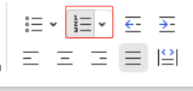
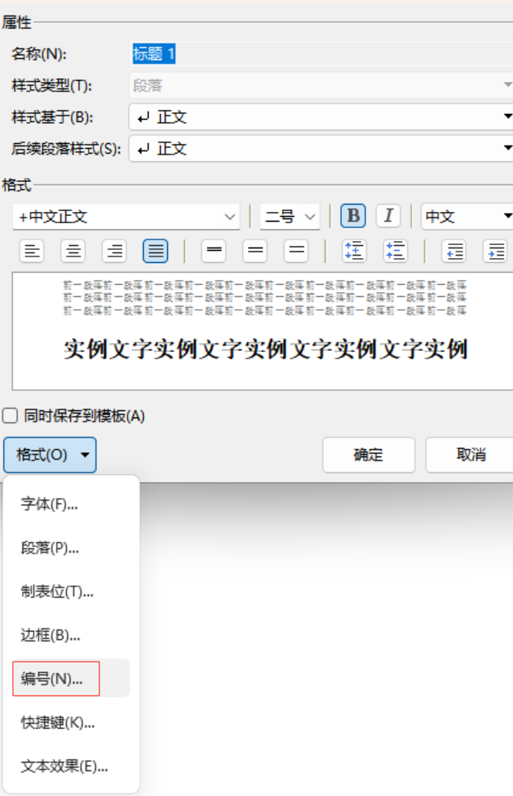

## 1.引用

### 插入题注

给图片和表格加入题注

**步骤：**

- 右键图片选择题注

  

- 选择要题注的标签是图还是表

  

- 如果希望按照章节来进行编号，例如：图1-1（第一章），需要勾选编号-包含章节编号

  

  > 这里可能生成的是：图0-1，也就是章节默认为0，这个情况是因为没有给大标题编号，具体看[编号](#编号)
  >
  > > 参考——https://blog.csdn.net/m0_51698023/article/details/127965540

### 交叉引用

## 2.<a name=编号>编号</a>

给章节进行编号，这样不用手动去更改章节序号

- 首先选择一个标题，点击修改样式

> 当然也可以选择编号
>
> 

- 修改样式-格式-编号

  

- 自定义列表-左边选择一个类型-自定义

  

- 这里左边是第几级标题，右边就是格式：

  例如一级标题就是“第1章”这样的格式，之后新建一级标题，序号会自增。

  如果级别选择2，就代表第二级别格式，也是类似

  

  也可以自己定义编号格式，只要编号样式用占位符替换即可

  > **对于写论文中，涉及多级标题，最好用同一个自定义的编号格式，把每个级别格式都定好，不容易出错**

  