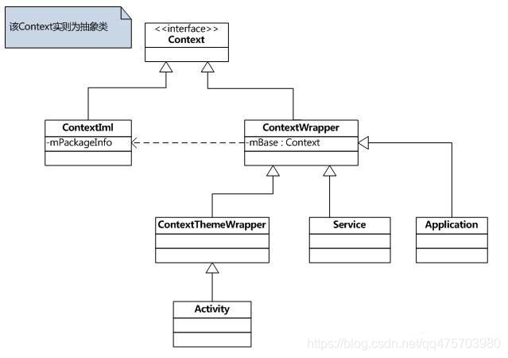

# 一、安卓

## 1.sp频繁操作会有什么后果?sp能存多少数据？

`sp( SharedPreferences )`的底层由xml来实现，操作sp的过程就是xml的序列化和解析。

- xml是存在磁盘上的， 频繁地读写 SP 会导致磁盘 IO 频繁，从而影响应用程序的性能 
- 另外`dvm`的内存是有限的，同时dvm的堆内存为16M所以不能超过此数字
-  SP 的存储空间不会太大，通常在几百 KB 到几 MB 之间，所有不适合存储大容量数据 


## 2.dvm与jvm的区别

**dvm**

DVM( Dalvik Virtual Machine ) 是 Android 操作系统中使用的一种虚拟机，它是为了在移动设备上运行 Java 代码而开发的。DVM 使用一种名为 DEX（Dalvik Executable）格式的中间代码，该中间代码是通过将 Java 字节码(.class文件)转换为 DEX 格式生成的。DVM 在运行时将 DEX 代码转换为机器码，然后执行该机器码。 

**jvm**

JVM 是 Java 语言的虚拟机，它负责运行 Java 字节码。JVM 是一种通用的虚拟机，可以在多种操作系统和硬件平台上运行。JVM 的设计目标是实现“写一次，到处运行”的概念，使得 Java 程序可以在不同的平台上运行。 

> **一个java文件从编码到执行需要经过下面几个阶段**
>
> 1、编译阶段：首先`.java`经过javac编译成`.class`文件
>
> 2、加载阶段：然后`.class`文件经过类加载器加载到JVM内存。
>
> 3、解释阶段：class字节码经过字节码解释器解释成系统可识别的指令码。
>
> 4、执行阶段：系统再向硬件设备发送指令码执行操作。

**两者区别**

DVM 与 JVM 有一些相似之处：

- 都使用垃圾回收机制来管理内存等。

DVM 与 JVM 也有一些不同之处：

- 例如 DVM 使用 DEX 格式的中间代码，而 JVM 使用 Java 字节码；
- DVM 在运行时将 DEX 代码转换为机器码，而 JVM 则直接执行 Java 字节码等。 
- JVM基于栈，需要去栈中读写数据；DVM基于寄存器


## 3.Context

> 参考——
>
> [activity、service、application与context区别](https://blog.csdn.net/qq475703980/article/details/88430891)
>
> [context](https://blog.csdn.net/guolin_blog/article/details/47028975)

  

> `Context`:是一个接口类，主要提供通用接口
>
> `ContextImpl`:Context接口的具体实现类
>
> `ContextWrapper`：Context的包装类，内部持有一个ContextImpl的实例对象mBase,对Context的操作最终都进入ContextImpl类
>
> `ContextThemeWrappe`r：该类内部包含了主题(Theme)相关的接口，即android:theme属性指定的。Service不需要主题，所以Service直接继承于ContextWrapper类。而Activity继承此类。


## 4.Application能不能启动Activity

可以开始一个Activity，但是它需要创建一个新的task 

```java
startActivity(intent,Intent.FLAG_ACTIVITY_NEW_TASK);
```


## 5.Android框架结构

回答framework相关的内容


## 6.View绘制过程


## 7.Canvas原理


## 8.Handler原理

# 二、JAVA