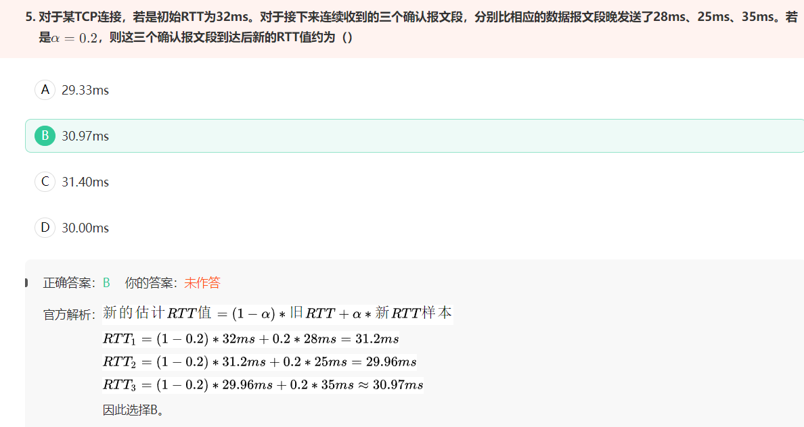

# 一、安卓

## 1.sp频繁操作会有什么后果?sp能存多少数据？

`sp( SharedPreferences )`的底层由xml来实现，操作sp的过程就是xml的序列化和解析。

- xml是存在磁盘上的， 频繁地读写 SP 会导致磁盘 IO 频繁，从而影响应用程序的性能 
- 另外`dvm`的内存是有限的，同时dvm的堆内存为16M所以不能超过此数字
-  SP 的存储空间不会太大，通常在几百 KB 到几 MB 之间，所有不适合存储大容量数据 


## 2.dvm与jvm的区别

**dvm**

DVM( Dalvik Virtual Machine ) 是 Android 操作系统中使用的一种虚拟机，它是为了在移动设备上运行 Java 代码而开发的。DVM 使用一种名为 `DEX（Dalvik Executable）`格式的中间代码，该中间代码是通过将 Java 字节码(.class文件)转换为 DEX 格式生成的。DVM 在运行时将 DEX 代码转换为机器码，然后执行该机器码。 

**jvm**

JVM 是 Java 语言的虚拟机，它负责运行 Java 字节码。JVM 是一种通用的虚拟机，可以在多种操作系统和硬件平台上运行。JVM 的设计目标是实现“写一次，到处运行”的概念，使得 Java 程序可以在不同的平台上运行。 

> **一个java文件从编码到执行需要经过下面几个阶段**
>
> 1、编译阶段：首先`.java`经过javac编译成`.class`文件
>
> 2、加载阶段：然后`.class`文件经过类加载器加载到JVM内存。
>
> 3、解释阶段：`class字节码`经过字节码解释器解释成系统可识别的指令码。
>
> 4、执行阶段：系统再向硬件设备发送指令码执行操作。

**两者区别**

DVM 与 JVM 有一些相似之处：

- 都使用垃圾回收机制来管理内存等。

DVM 与 JVM 也有一些不同之处：

- 例如 DVM 使用 DEX 格式的中间代码，而 JVM 使用 Java 字节码；
- DVM 在运行时将 DEX 代码转换为机器码，而 JVM 则直接执行 Java 字节码等。 
- JVM基于栈，需要去栈中读写数据；DVM基于寄存器


## 3.Context

> 参考"Android--四大组件"
>


## 4.Application能不能启动Activity

可以开始一个Activity，但是它需要创建一个新的task 

```java
startActivity(intent,Intent.FLAG_ACTIVITY_NEW_TASK);
```


## 5.Android框架结构

**回答framework相关的内容**


## 6.View绘制过程


## 7.Canvas原理


## 8.Handler原理


## 9.安卓中的事件分发(事件如何一层层传到button上)

# 二、JAVA

## 1.运行时环境

**不同的数据存放区存放的数据和对应的管理方法是不同的。对于某些数据，如果在编译期间就可以确定数据对象的大小和数据对象的数目，在编译期间为数据对象分配存储空间，这些数据对应的存储分配策略是（）？**

**数据区可以分为：**

- **静态数据区**：

  > 静态数据区是指**程序编译时分配的内存区域**，用于存储程序中定义的全局变量和静态变量。静态数据区在程序运行期间是固定不变的，并且在程序结束后由操作系统释放。静态数据区可以分为初始化数据区和未初始化数据区，初始化数据区用于存储已初始化的全局变量和静态变量，未初始化数据区用于存储未初始化的全局变量和静态变量。 

- **动态数据区**：动态数据区可以分为`堆区`和`栈区`

> 之所以这样划分，是因为不同的数据存放区存放的数据和对应的管理方法是不同的。静态存储区、堆区和栈区的存储空间分配对应三种不同的策略，分别是静态存储分配、堆式存储分配以及栈式存储分配。

**选项解析：**

- 静态数据区对应的静态存储分配在编译期间为数据对象分配存储空间，这要求编译期间就可以确定数据对象的大小和数据对象的数目，所以`静态数据区`是正确的；

- 当数据的生存期与创建它的函数执行期无关时，比如某些数据可能在函数执行以后长期存在，堆式存储分配是一种灵活的存储方式，但缺点是代价可能比较昂贵，`堆式存储分配`是不符合题意的；

- 栈式存储分配通常用于可动态嵌套的程序结构，如过程、函数以及可嵌套程序块等，栈式存储分配将数据对象的运行存储按照栈的方式来管理，`栈式存储分配`是不符合题意的；

- 动态存储分配是一个统筹的概念，堆式存储分配和栈式存储分配都属于动态存储分配的范畴，所以`动态数据区`是不符合题意的。

## 2.JUC是什么

`JUC`是Java Util Concurrent的缩写，中文名为Java并发工具包。它是Java SE 5.0引入的一个用于简化多线程编程的工具包，位于java.util.concurrent包下。JUC包提供了许多用于管理线程、锁、Condition、并发集合、原子变量等的工具类，使得多线程编程变得更加简单和高效。 

**JUC包中的主要内容包括：**

1. 线程池（Executor）：提供了一种管理线程的方式，可以通过线程池来创建、管理和回收线程。
2. 锁（Lock）：提供了比synchronized关键字更灵活、更高效的锁机制，如ReentrantLock、ReadWriteLock等。
3. Condition：提供了更灵活的线程间通信和协调机制，如await()和signal()方法。
4. 并发集合（Concurrent Collection）：提供了许多线程安全的集合类，如ConcurrentHashMap、CopyOnWriteArrayList等。
5. 原子变量（Atomic Variable）：提供了一种在多线程环境下安全地更新变量的方式，如AtomicInteger、AtomicLong等。
6. 同步工具类（Synchronizer）：提供了一些用于控制多线程访问共享资源的工具类，如Semaphore、CountDownLatch等。

## 3.字节流和字符流区别？

`1字符 = 2字节` 、 `1字节(byte) = 8位(bit) ` 一个汉字占两个字节长度

- 字节流：每次读取(写出)一个字节，当传输的资源文件有中文时，就会出现乱码
- 字符流：每次读取(写出)两个字节，有中文时，使用该流就可以正确传输显示中文。

> **字符流的由来：** Java中字符是采用Unicode标准，一个字符是16位，即一个字符使用两个字节来表示。为此，JAVA中引入了处理字符的流。因为数据编码的不同，而有了对字符进行高效操作的流对象。本质其实就是基于字节流读取时，去查了指定的码表。

**处理单元不同：**

- 字节流：以字节为单位，可以处理任何类型的数据，如图片、音频、视频等二进制文件。 
- 字符流：以字符（Unicode码元）为单位，根据码表映射字符，一次可能读多个字节。 

**编码方式不同：**

- 字节流：但是字节流不考虑编码，处理二进制方面有优势
- 字符流：考虑数据的编码方式，如UTF-8、GBK等，在读写文本数据时需要指定正确的编码方式，否则可能会导致数据乱码。 

**是否设置缓冲区：**

- 字节流： **默认不使用缓冲区**，是文件本身直接操作的，这意味着每调用一次`read`方法都会请求操作系统来读取一个字节（这往往会伴随着一次磁盘IO，因此效率会比较低。要使用内存缓冲区以提高读取的效率，应该使用`BufferedInputStream`。 ），**字节流是与文件本身操作的，所以字节流操作文件时候，即使不关闭资源，文件也会输出。**
- 字符流： 由于字符流在输出前实际上是要完成Unicode码元序列到相应编码方式的字节序列的转换，所以它会使用内存缓冲区来存放转换后得到的字节序列，等待都转换完毕再一同写入磁盘文件中。 所以如果不调用flush或close方法，不会输出任何内容。

## 4. 线程池是被封装的，它底层创建线程并运行的核心原理是什么 

- 线程池的创建：线程池在创建时需要指定一些参数，如核心线程数、最大线程数、线程空闲时间、工作队列等。这些参数用于控制线程池的行为和性能。
- 任务的提交：当向线程池提交一个任务时，线程池会根据当前的状态和配置来决定如何处理这个任务。如果当前线程数少于核心线程数，则创建一个新线程来执行任务；如果当前线程数大于等于核心线程数，但小于最大线程数，则将任务放入工作队列中等待执行；如果工作队列已满，则创建一个新线程来执行任务；如果当前线程数已达到最大线程数，则根据拒绝策略来处理任务。
- 线程的创建和重用：线程池在创建线程时，会使用一个可重用的线程工厂来创建新线程。当一个任务执行完毕后，线程池不会立即销毁该线程，而是将其放入空闲线程队列中，等待下一个任务的到来。当一个新任务到来时，线程池会优先使用空闲线程队列中的线程来执行任务，以提高线程的重用率。
- 线程的管理和监控：线程池会不断地监控线程的状态和工作队列的情况，以便及时地创建新线程或销毁多余的线程。线程池还提供了一些监控和统计信息，如当前线程数、活动线程数、任务数等，用于监控和调优线程池的性能。


## 5. 最大线程和核心线程有什么区别 

1. 核心线程：**核心线程是线程池中永不会被回收的线程数量**。当向线程池提交一个新任务时，如果当前活动线程数小于核心线程数，则会创建一个新线程来执行任务，即使此时工作队列中还有空闲空间。如果当前活动线程数大于等于核心线程数，则会将任务放入工作队列中等待执行。核心线程数的大小会直接影响线程池的响应速度和吞吐量。
2. 最大线程：**最大线程是线程池中允许创建的最大线程数量**。当向线程池提交一个新任务时，如果当前活动线程数大于等于核心线程数，且工作队列已满，则会创建新线程来执行任务，直到活动线程数达到最大线程数为止。如果当前活动线程数已达到最大线程数，则根据拒绝策略来处理任务。最大线程数的大小会直接影响线程池的资源占用和稳定性。


## 6. isEmpty和size()==0

通常来说，`isEmpty()`方法和`size()==0`时间复杂度都是O(1) 

但在ConcurrentLinkedQueue、ConcurrentHashMap中，size()时间复杂度不是O(1)的，因此**工程实践上使用isEmpty()更加合适**。 


## 7.深拷贝、浅拷贝


## 8.JAVA内存区域(JVM内存结构)和Java内存模型(JMM)

> https://zhuanlan.zhihu.com/p/29881777
>
> [java内存模型](https://javaguide.cn/java/concurrent/jmm.html)
>
> [jvm和jmm](https://zhuanlan.zhihu.com/p/38348646)

这是一个比较常见的问题，很多初学者非常容易搞混。 **Java 内存区域和内存模型是完全不一样的两个东西**：

- JVM 内存结构和 Java 虚拟机的运行时区域相关，定义了 JVM 在运行时如何分区存储程序数据，就比如说堆主要用于存放对象实例。
- Java 内存模型和 Java 的并发编程相关，抽象了线程和主内存之间的关系就比如说线程之间的共享变量必须存储在主内存中，规定了从 Java 源代码到 CPU 可执行指令的这个转化过程要遵守哪些和并发相关的原则和规范，其主要目的是为了简化多线程编程，增强程序可移植性的。

------


# 三、数学

## 1.8个苹果（相同）3个箱子（不同），多少种分法

> 参考——https://zhuanlan.zhihu.com/p/92361742

如果给你8个苹果，要求把这些苹果放在3个盘子里。那么一共有多少种放法？这就是今天要讨论的苹果与盘子问题。由于8个苹果可以相同，也可以不同；3个盘子可以相同或不同；可以允许盘子空或者不空。所以一共有8种情况：

###  (1) **8个相同的苹果放在3个不同的盘子里，每个盘子至少一个苹果，请问一共有几种放法？** 

因为苹果均相同，盘子不同，相当于用2块板在8个苹果的7个空里插板。每次插板之后将苹果分为3份，每份对应一个不同的盘子，这就是插板法。所以共有`C(7,2)= 21`种放法。 


# 四、计算机网络

## 1.




## 2.http1.0/1.1/2.0之间的区别

`http1.0和http1.1`


## 3.http和https的区别


## 4.网络字节序


## 5.浏览器缓存

浏览器缓存是指浏览器在本地存储的一些资源文件，如 HTML 页面、CSS 样式表、JavaScript 脚本、图像文件等。浏览器缓存可以减少网络请求次数，提高页面加载速度，改善用户体验。

浏览器缓存分为强缓存和协商缓存两种类型。

1. **强缓存**：强缓存是指浏览器直接从缓存中读取资源，无需向服务器发送请求。强缓存通过设置 HTTP 响应头中的 `Cache-Control` 和 `Expires` 字段来实现。`Cache-Control `字段用于指定缓存的最大有效时间，`Expires` 字段用于指定缓存的过期时间。当缓存的资源在有效期内时，浏览器将直接从缓存中读取资源，无需向服务器发送请求。
2. **协商缓存**：协商缓存是指浏览器向服务器发送请求，询问资源是否更新，如果资源未更新，则返回 304 Not Modified 响应，浏览器继续使用缓存中的资源。协商缓存通过设置 HTTP 响应头中的 `ETag` 和 `Last-Modified` 字段来实现。`ETag` 字段用于标识资源的唯一性，`Last-Modified `字段用于标识资源的最后修改时间。当缓存的资源过期时，浏览器将向服务器发送请求，询问资源是否更新，如果资源未更新，则返回 304 Not Modified 响应，浏览器继续使用缓存中的资源。


## 6.对称加密和非对称加密应用场景

1. 对称加密：对称加密是指使用同一个密钥进行加密和解密的加密技术。对称加密通常用于数据传输过程中的加密和解密，如 SSL/TLS 协议中的对话密钥加密。由于对称加密的加密和解密速度较快，因此它适用于对性能要求较高的场景，如大规模数据的加密传输。但是，对称加密的密钥分发和管理比较困难，因为密钥需要在通信双方之间安全地传递和存储。
2. 非对称加密：非对称加密是指使用不同的密钥进行加密和解密的加密技术。非对称加密通常用于数字签名、身份认证和密钥交换等场景。非对称加密的加密和解密速度较慢，因此它不适用于大规模数据的加密传输。但是，非对称加密的密钥分发和管理比较方便，因为公钥可以公开分发，而私钥则由用户自己保存

# 五、操作系统

## 用户态和内核态

**用户态：**

是操作系统为用户进程提供的一种运行模式，在这种模式下，用户进程只能访问自己的地址空间，不能直接访问操作系统内核的数据结构和代码。用户态下运行的进程具有较低的权限，不能执行特权指令，也不能直接访问硬件设备。用户态下的进程可以通过系统调用，请求操作系统内核提供的服务，例如文件读写、进程管理、网络通信等。 

**内核态：**

是操作系统内核运行的一种运行模式，在这种模式下，操作系统内核可以直接访问硬件设备和内存，具有最高的权限。内核态下运行的进程可以执行特权指令，可以直接访问硬件设备，也可以访问操作系统内核的数据结构和代码。内核态下的进程可以响应中断和异常，也可以执行系统调用。 

**用户态和内核态之间的转换**

通过中断、异常和系统调用来实现的。

当用户进程需要访问内核提供的服务时，就会通过系统调用请求内核态下的操作系统内核来完成相应的操作。在系统调用过程中，操作系统会将用户进程的运行模式从用户态转换为内核态，以便执行特权指令和访问硬件设备。当内核态下的操作完成后，操作系统会将运行模式从内核态转换回用户态，并将控制权返回给用户进程。 


# 六、其他

## 1.视频编码

1. **H.264/AVC**：H.264/AVC 是一种广泛使用的视频编码标准，它是 MPEG-4 标准的第 10 部分。H.264/AVC 支持高清视频编码，并且具有很好的压缩比和视频质量。
2. **H.265/HEVC**：H.265/HEVC 是 H.264/AVC 的继任者，它是一种更高效的视频编码标准。H.265/HEVC 支持 4K 和 8K 超高清视频编码，并且比 H.264/AVC 具有更好的压缩比和视频质量。
3. **VP8/VP9**：VP8 和 VP9 是 Google 开发的开源视频编码标准。VP8 和 VP9 支持高清视频编码，并且具有很好的压缩比和视频质量。
4. **AV1**：AV1 是一个新一代的开源视频编码标准，它是由联盟的多家公司共同开发的。AV1 支持高清视频编码，并且比 H.265/HEVC 具有更好的压缩比和视频质量。
5. **MPEG-2**：MPEG-2 是一种早期的视频编码标准，它广泛用于数字电视和 DVD 视频编码。MPEG-2 支持标清视频编码，并且具有较好的压缩比和视频质量。
6. **MPEG-4**：MPEG-4 是一种广泛使用的视频编码标准，它包括多种子标准，如 H.264/AVC 和 AAC 音频编码。MPEG-4 支持高清视频编码，并且具有很好的压缩比和视频质量。