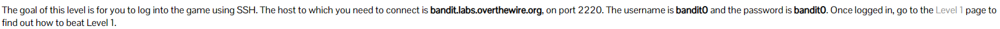
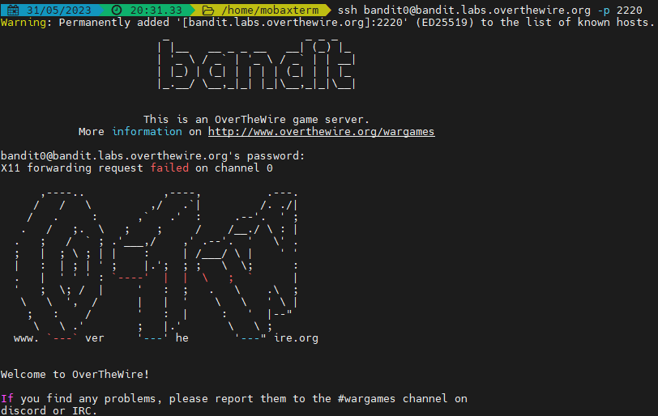
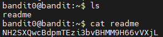
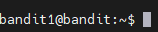
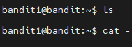
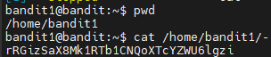
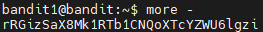
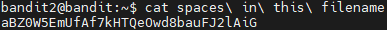
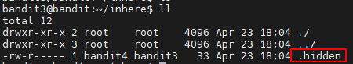
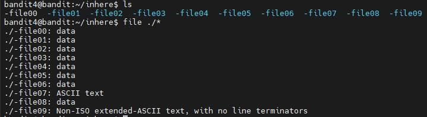

## 1.level 0

熟悉`ssh`远程登录命令



```shell
ssh bandit0@bandit.labs.overthewire.org -p 2220
```




## 2.level 1

The password for the next level is stored in a file called **readme** located in the home directory. Use this password to log into bandit1 using SSH. Whenever you find a password for a level, use SSH (on port 2220) to log into that level and continue the game. 





```
NH2SXQwcBdpmTEzi3bvBHMM9H66vVXjL
```


## 3.level 2

 The password for the next level is stored in a file called **-** located in the home directory 

> 这道题使用 `cat`直接读会显示不出来, 因为文件名是一个`-`，这个在linux中有特殊意义导致直接cat不好用 
>
> 
>
> 尝试输入绝对路径读取
>
> 
>
> 当然用`more`命令读取可以读到
>
> 

```
rRGizSaX8Mk1RTb1CNQoXTcYZWU6lgzi
```


## 4.level 3

 The password for the next level is stored in a file called **spaces in this filename** located in the home directory 

> 这道题考察转义符号，`转移空格`
>
> 
>
> 当然，把文件名加上双引号也可以
>
> ```shell
> cat "spaces in this filename"
> ```

```
aBZ0W5EmUfAf7kHTQeOwd8bauFJ2lAiG
```


## 5.level 4

 The password for the next level is stored in a hidden file in the **inhere** directory. 

> 密码在隐藏文件里面
>
> 

```
2EW7BBsr6aMMoJ2HjW067dm8EgX26xNe
```

## 6.level 5

The password for the next level is stored in the only human-readable file in the **inhere** directory. Tip: if your terminal is messed up, try the “reset” command. 

> 可以看到目录里面有几个文件，通过 通过file命令可以用于辨识文件类型。 
>
> 
>
> ```
> lrIWWI6bB37kxfiCQZqUdOIYfr6eEeqR
> ```
>
> 

