# 一、操作系统结构

> https://www.xiaolincoding.com/os/

**操作系统核心的东西是内核。**

## 1.内核

### 什么是内核

计算机是由各种外部硬件设备组成的，比如内存、cpu、硬盘等，如果每个应用都要和这些硬件设备对接通信协议，那这样太累了，所以这个中间人就由内核来负责，**让内核作为应用连接硬件设备的桥梁**，应用程序只需关心与内核交互，不用关心硬件的细节。

   

### 内核具备能力

- **进程调度**：管理进程、线程，决定哪个进程、线程使用 CPU；
- **内存管理**：管理内存，决定内存的分配和回收；
- **硬件通信能力**：管理硬件设备，为进程与硬件设备之间提供通信能力；
- **提供系统调用**：如果应用程序要运行更高权限运行的服务，那么就需要有系统调用，它是用户程序与操作系统之间的接口。
- ......

### 如何工作

大多数操作系统，把**内存**分成了两个区域：

- **内核空间**：用于存放操作系统内核代码和数据的内存区域 ，这个内存空间只有内核程序可以访问；
- **用户空间**：用于存放用户应用程序代码和数据的内存区域 ，这个内存空间专门给应用程序使用；

当程序使用用户空间时，常说该程序在**用户态**执行，而当程序使内核空间时，程序则在**内核态**执行。 

> - **用户态**：用户应用程序运行时的状态，在这个状态下，用户应用程序只能访问受限的系统资源，无法直接访问操作系统内核中的数据结构和代码。用户态下的程序运行速度较快，但是对系统资源的访问权限有限。
> - **内核态**： 指操作系统内核运行时的状态，在这个状态下，内核代码拥有最高的权限，可以访问所有的系统资源，包括硬件设备、内存和CPU等。内核态下的程序运行速度较慢，但是可以直接访问系统资源 。 

### 中断

> https://www.cnblogs.com/z-sm/p/15162076.html

**中断是指CPU在执行过程中，出现了突发事件，CPU必须暂停当前程序的运行，保持现场，转而处理突发事件，处理完毕之后，恢复现场继续执行**。 

中断分为：**内部中断和外部中断**

- 内部中断： **CPU执行出现异常时触发** 、 **通过软件（通常是系统调用）触发** 
- 外部中断： **外部设备通过CPU引脚触发** 

  


应用程序如果需要进入内核空间，就需要通过 **系统调用**，也就是中断 ：

> > **中断是让操作系统内核夺回CPU的唯一途径**
>
>  
>
>  - 当应用程序使用系统调用时，会产生一个中断。
>- 发生中断后， CPU 会中断当前在执行的用户程序（保存上下文），转而跳转到中断处理程序，也就是开始执行内核程序（例如键盘输入、I/O）。
> - 内核处理完后，主动触发中断，把 CPU 执行权限交回给用户程序，回到用户态继续工作。 


# 二、进程管理

## 1.进程

我们编写的代码通过编译后就会生成二进制可执行文件，当运行这个可执行文件后，它会被装载到内存中，接着 CPU 会执行程序中的每一条指令，那么这个**运行中的程序，就被称为「进程」（Process）**。 

### **并发**

对于一个支持多进程的单核CPU，CPU从一个进程快速切换到另一个进程，每个进程运行几十毫秒，这在宏观上看似并行，其实微观上时并发。

### 进程状态

**一个进程的活动期间至少具备三种基本状态，即运行状态、就绪状态、阻塞状态。** 

  

如果加入创建和结束，那么就是：

 

> 当由大量阻塞状态进程时候，可能会导致内存浪费，因此在虚拟内存管理的操作系统中，会把阻塞状态的进程的物理内存空间换到硬盘，等需要再次运行的时候，再从硬盘换入到物理内存。 

需要一个新的状态，来**描述进程没有占用实际的物理内存空间的情况，这个状态就是挂起状态**。 

 

### 进程的结构控制

在操作系统中，是用**进程控制块**（*process control block，PCB*）数据结构来描述进程的。  **PCB 是进程存在的唯一标识** 


### 进程的上下文切换

**一个进程切换到另一个进程运行，称为进程的上下文切换**。 

> 进程是由内核管理和调度的，所以**进程的切换只能发生在内核态**。 

**进程的上下文切换不仅包含了虚拟内存、栈、全局变量等用户空间的资源，还包括了内核堆栈、寄存器等内核空间的资源。** 

> **进程上下文切换有哪些场景：**
>
> - 为了保证所有进程可以得到公平调度，CPU 时间被划分为一段段的时间片，这些时间片再被轮流分配给各个进程。这样，当某个进程的时间片耗尽了，进程就从运行状态变为就绪状态，系统从就绪队列选择另外一个进程运行；
> - 进程在系统资源不足（比如内存不足）时，要等到资源满足后才可以运行，这个时候进程也会被挂起，并由系统调度其他进程运行；
> - 当进程通过睡眠函数 sleep 这样的方法将自己主动挂起时，自然也会重新调度；
> - 当有优先级更高的进程运行时，为了保证高优先级进程的运行，当前进程会被挂起，由高优先级进程来运行；
> - 发生硬件中断时，CPU 上的进程会被中断挂起，转而执行内核中的中断服务程序；


### 进程间通信

#### 管道（Pipe）：

管道其实是一个特殊的共享文件，又名pipe文件，其实就是**在内存中开辟一个大小固定的内存缓冲区**。

- 管道是一种**半双工通信**方式，它可以用于具有亲缘关系的进程之间的通信

- 管道有两种形式：匿名管道和命名管道

  > `匿名管道`只能用于具有亲缘关系的进程之间的通信
  >
  > `命名管道`则可以用于任意两个进程之间的通信。

- 各个进程互斥地访问管道

- 管道存储的是无格式的字节流

##### 匿名管道

```shell
$ ps auxf | grep mysql
```

管道符`|`两边的进程都是shell创建的子进程

##### 命名管道

数据是`FIFO`，类似于`循环队列`

```shell
$ mkfifo myPipe #创建管道，mypipe，实际上是一个文件
```

进程A写入数据

```shell
$ echo "hello" > myPipe  # 将数据写进管道
                         # 停住了 ... 因为内容没被读取
```

进程B读取数据

```shell
$ cat < myPipe  # 读取管道里的数据
hello
```


#### 消息队列（Message Queue）：

消息队列本质其实是一个**内核提供的链表**，内核基于这个链表，实现了一个数据结构 ，消息队列允许进程向队列中发送和接收消息。


- 进程间通信以`格式化数据块(Message)`通信


- 进程通过操作系统提供的“发送消息/接收消息”两个**原语**进行数据交换
- 在**内核空间中，每个进程PCB管理对应进程的消息队列，用来接收消息**


##### 直接通信方式

假设有进程P、Q：

- 进程P通过发送原语，将消息从P的用户空间复制到内核空间中Q的消息队列
- 进程Q通过接收原语，从内核空间中消息队列中，把消息从内核区复制到用户空间中。

##### 间接通信方式

发送进程申请在内核空间创建邮箱，然后将消息块发送到邮箱中。

接收进程从邮箱中取出消息快


##### 优缺点

**优点：**

- 通过数据块进行通信，可以指定数据结构，而非字节流。

**缺点：**

- 每个数据块的最大长度是有上限的，系统上全体队列的最大总长度也有一个上限 
- 存在用户态与内核态之间的数据拷贝开销。


##### 与管道的区别

- 进程向消息队列写入消息前，并不需要某个进程在该队列上等待该消息的到达；而管道和FIFO是相反的，进程向其中写消息时，管道和FIFO必须已经打开来读，否则写进程就会阻塞（默认情况下）。
- IPC的持续性不同。管道和FIFO是随进程的持续性，当管道和FIFO最后一次关闭发生时，仍在管道和FIFO中的数据会被丢弃。消息队列是随内核的持续性，即一个进程向消息队列写入消息后，然后终止，另外一个进程可以在以后某个时刻打开该队列读取消息。只要内核没有重新自举，消息队列没有被删除。


#### 共享内存（Shared Memory）：

共享内存是一种允许多个进程访问同一块内存区域的机制。共享内存通常用于**需要大量数据交换的进程间通信中，因为它可以减少数据拷贝的开销**。

> **虚拟内存**
>
> 现代操作系统，对于内存管理，采用的是虚拟内存技术，**也就是每个进程都有自己独立的虚拟内存空间，不同进程的虚拟内存映射到不同的物理内存中**。

**共享内存的机制，就是拿出一块虚拟地址空间来，映射到相同的物理内存中**。这样这个进程写入的东西，另外一个进程马上就能看到了，都不需要拷贝来拷贝去，传来传去，大大提高了进程间通信的速度。 

 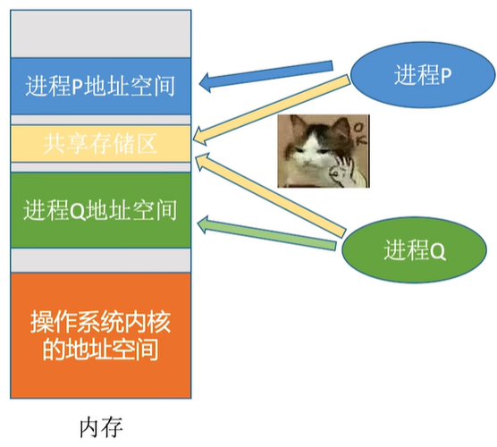 


##### 信号量（Semaphore）：

信号量是一种用于进程间同步和互斥的机制。**信号量可以用于控制对共享资源的访问，以避免进程间的竞争条件。**

**信号量其实是一个整型的计数器，主要用于实现进程间的互斥与同步，而不是用于缓存进程间通信的数据**。 

信号量表示资源的数量，控制信号量的方式有两种原子操作：

- 一个是 **P 操作**，这个操作会把信号量减去 1，相减后如果信号量 < 0，则表明资源已被占用，进程需阻塞等待；相减后如果信号量 >= 0，则表明还有资源可使用，进程可正常继续执行。 
- 另一个是 **V 操作**，这个操作会把信号量加上 1，相加后如果信号量 <= 0，则表明当前有阻塞中的进程，于是会将该进程唤醒运行；相加后如果信号量 > 0，则表明当前没有阻塞中的进程；

>  P 操作是用在进入共享资源之前，V 操作是用在离开共享资源之后，这两个操作是必须成对出现的。 

信号量可以实现两个功能：

- 互斥信号量
- 同步信号量


###### 互斥信号量

如果两个进程互斥的访问共享内存，可以**初始化信号量为1**：

- 进程 A 在访问共享内存前，先执行了 P 操作，由于信号量的初始值为 1，故在进程 A 执行 P 操作后信号量变为 0，表示共享资源可用，于是进程 A 就可以访问共享内存。
- 若此时，进程 B 也想访问共享内存，执行了 P 操作，结果信号量变为了 -1，这就意味着临界资源已被占用，因此进程 B 被阻塞。
- 直到进程 A 访问完共享内存，才会执行 V 操作，使得信号量恢复为 0，接着就会唤醒阻塞中的线程 B，使得进程 B 可以访问共享内存，最后完成共享内存的访问后，执行 V 操作，使信号量恢复到初始值 1。


###### 同步信号量

如果希望多个进程能够密切合作，实现一个共同任务，可以**初始化信号量为0**

例如，进程 A 是负责生产数据，而进程 B 是负责读取数据，这两个进程是相互合作、相互依赖的，进程 A 必须先生产了数据，进程 B 才能读取到数据，所以执行是有前后顺序的。

- 进程B比进程A先执行，执行到P操作时候，由于信号量初始值为0，故信号量会变为-1，表示进程A还没生产完数据，于是进程B就阻塞等待。
- 接着，当进程A生产完数据，执行了V操作，就会使得信号量变为0，于是会唤醒阻塞在P操作的进程B。
- 最后，进程B被唤醒后，意味着进程A已经产生了数据，于是进程B就可以正常读取数据了。


#### 套接字（Socket）：

套接字是一种用于网络通信的机制，它也可以用于进程间通信。套接字允许进程在网络上发送和接收数据，从而实现进程间的通信。

#### 远程过程调用（RPC）：

远程过程调用是一种允许进程在网络上调用其他进程的函数或过程的机制。RPC可以用于实现分布式系统中的进程间通信。


## 2.线程

**线程是进程当中的一条执行流程。是程序执行的基本单位 **

### 线程的优点：

- 一个进程中可以同时存在多个线程；
- 各个线程之间可以并发执行；
- 各个线程之间可以共享地址空间和文件等资源；

### 线程上下文切换

线程的上下文切换开销，比进程上下文切换小得多。

- 当两个线程不是属于同一个进程，则切换的过程就跟进程上下文切换一样；
- **当两个线程是属于同一个进程，因为虚拟内存是共享的，所以在切换时，虚拟内存这些资源就保持不动，只需要切换线程的私有数据、寄存器等不共享的数据**；

### 线程与进程比较

线程与进程的比较如下：

- 进程是资源（包括内存、打开的文件等）分配的单位，线程(严格来说是内核级线程)是 CPU 调度的基本单位；
- 进程是拥有资源的一个独立单位，线程不拥有系统资源，但是可以访问隶属于进程的资源。 
- 线程同样具有就绪、阻塞、执行三种基本状态，同样具有状态之间的转换关系；
- 线程能减少并发执行的时间和空间开销；
- 线程的上下文切换比进程快得多，且开销也小很多


### 线程的实现

#### 用户级线程(ULT)

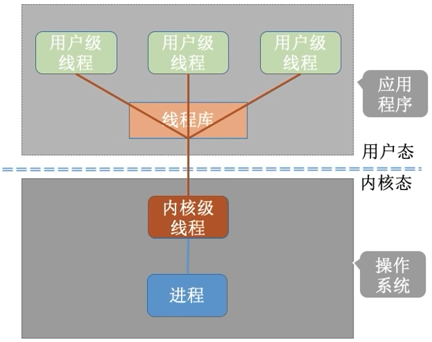

用户线程是基于用户态的线程管理库来实现的。 

**用户线程的整个线程管理和调度，操作系统是不直接参与的，而是由用户级线程库函数来完成线程的管理，包括线程的创建、终止、同步和调度等。** 不需要用户态/核心态切换，速度快。**内核对ULT无感知，线程阻塞则进程（包括它所有的线程）阻塞**

> **协程也可以看作是用户级线程**

##### 优点

- 每个进程都需要有它私有的线程控制块（TCB）列表，用来跟踪记录它各个线程状态信息（PC、栈指针、寄存器），TCB 由用户级线程库函数来维护，可用于不支持线程技术的操作系统；
- 用户线程的切换也是由线程库函数来完成的，无需用户态与内核态的切换，所以速度特别快；

##### 缺点

- 由于操作系统不参与线程的调度，如果一个线程发起了系统调用而阻塞，那进程所包含的用户线程都不能执行了。
- 当一个线程开始运行后，除非它主动地交出 CPU 的使用权，否则它所在的进程当中的其他线程无法运行，因为用户态的线程没法打断当前运行中的线程，它没有这个特权，只有操作系统才有，但是用户线程不是由操作系统管理的。
- 由于时间片分配给进程，故与其他进程比，在多线程执行时，每个线程得到的时间片较少，执行会比较慢；


#### 内核级线程(KLT)

系统内核管理线程（KLT），内核保存线程的状态和上下文信息，线程阻塞不会引起进程阻塞。 **线程的创建、终止和管理都是由操作系统负责。**效率要比ULT慢，比进程操作快。 

> [Java线程是不是存粹的内核级线程](https://cloud.tencent.com/developer/article/2134440)

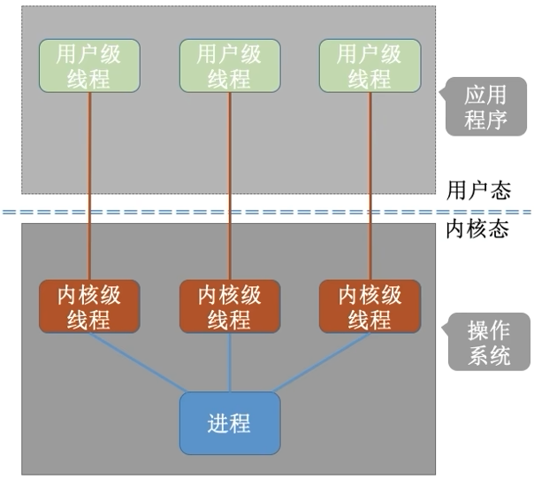

内核线程的**优点**：

- 在一个进程当中，如果某个内核线程发起系统调用而被阻塞，并不会影响其他内核线程的运行；
- 分配给线程，多线程的进程获得更多的 CPU 运行时间；

内核线程的**缺点**：

- 在支持内核线程的操作系统中，由内核来维护进程和线程的上下文信息，如 PCB 和 TCB；
- 线程的创建、终止和切换都是通过系统调用的方式来进行，因此对于系统来说，系统开销比较大；


#### LWP

轻量级进程（Light-weight process，LWP）是内核支持的用户线程，一个进程可有一个或多个 LWP，每个 LWP 是跟内核线程一对一映射的，也就是 LWP 都是由一个内核线程支持，而且 LWP 是由内核管理并像普通进程一样被调度。 这种实现方式使得用户线程可以更好地利用多核处理器和其他硬件资源，提高程序的并发性和性能。 


### 多线程模型

#### 多对一


就是用户级线程那样，多个用户级线程映射到一个内核级线程，且一个进程只分配一个内核级线程

**优点**

用户级线程的切换在用户空间即可完成，不需要切换到核心态，线程管理的系统开销小，效率高

**缺点**

当一个用户级线程被阻塞后，整个进程都会被阻塞，并发度不高。多个线程不可在多核处理机上并行运行


#### 一对一


一个用户级线程映射到一个内核级线程。每个用户进程有着与用户级线程同数量的内核级线程。

**优点**

当一个线程被阻塞后，别的线程还可以继续执行，并发能力强。多线程可在多核处理机上并行执行。

**缺点**

一个用户进程会占用多个内核级线程，线程切换由操作系统内核完成，需要切换到核心态，因此线程管理的成本高，开销大。


#### 多对多

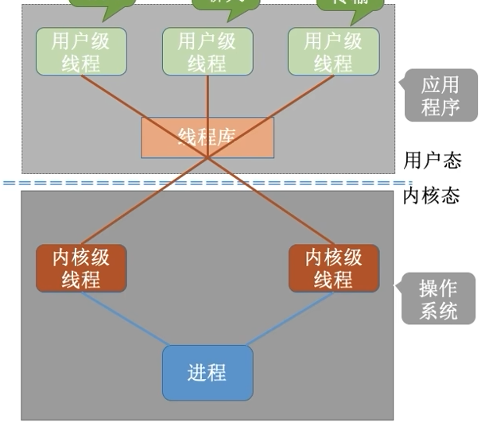

n用户及线程映射到m个内核级线程（n>=m）。每个用户进程对应m个内核级线程。

**优点**

- 克服了多对一模型并发度不高的缺点（一个阻塞全体阻塞）
- 又克服了一对一模型中，一个用户进程占用太多内核级线程，开销太大的缺点。


## 线程和进程的区别

> https://blog.csdn.net/weixin_42981419/article/details/86162071
>
> https://blog.csdn.net/mu_wind/article/details/124616643


（1）调度：线程作为调度和分配的基本单位，进程作为拥有资源的基本单位

（2）并发性：不仅进程之间可以并发执行，同一个进程的多个线程之间也可并发执行

（3）拥有资源：进程是拥有资源的一个独立单位，线程不拥有系统资源，但可以访问隶属于进程的资源.

（4）系统开销：在创建或撤消进程时，由于系统都要为之分配和回收资源，导致系统的开销明显大于创建或撤消线程时的开销。 每个进程都有独立的[地址空间](https://so.csdn.net/so/search?q=地址空间&spm=1001.2101.3001.7020)，进程之间的切换会有较大的开销；线程可以看做轻量级的进程，同一个进程内的线程共享进程的地址空间，每个线程都有自己独立的运行栈和程序计数器，线程之间切换的开销小。 


## 3.调度

cpu选择进程能够获取执行的机会，成为调度


### 调度的时机

当进程主动或被动放弃处理机的时候，处理机都会进行调度，例如：

- *从就绪态 -> 运行态*：当进程被创建时，会进入到就绪队列，操作系统会从就绪队列选择一个进程运行；
- *从运行态 -> 阻塞态*：当进程发生 I/O 事件而阻塞时，操作系统必须选择另外一个进程运行；
- *从运行态 -> 结束态*：当进程退出结束后，操作系统得从就绪队列选择另外一个进程运行；

> **不可以调度和切换的情况**
>
> - 处理中断的过程中
> - 进程在操作系统内核程序临界区中
> - 在原子操作过程中。（修改PCB中程序状态标志，并把PCB放到相应队列）

### 调度方式

**非抢占式调度**：只允许进程主动放弃处理机。在运行过程中即便有更紧迫任务到达，当前进程依然会继续使用处理机，直到该进程终止或主动要求进入阻塞态。

**抢占式调度**：挑选一个进程，然后让该进程只运行某段时间，如果在该时段结束时，该进程仍然在运行时，则会把它挂起，接着调度程序从就绪队列挑选另外一个进程。 这种抢占式调度处理，需要在时间间隔的末端发生**时钟中断**，以便把 CPU 控制返回给调度程序进行调度，也就是常说的**时间片机制**。 


### 调度算法

**单核CPU系统常见的调度算法**

#### **①先来先服务**

> 先来后到，**每次从就绪队列选择最先进入队列的进程，然后一直运行，直到进程退出或被阻塞，才会继续从队列中选择第一个进程接着运行。** 
>
> **利弊**
>
> FCFS对长作业有利，**适用于CPU繁忙型作业的系统，而不适用于I/O繁忙型作业系统；**

#### **②最短作业优先**

> **最短作业优先（Shortest Job First, SJF）调度算法**同样也是顾名思义，它会**优先选择运行时间最短的进程来运行**，这有助于提高系统的吞吐量。 
>
> **利弊**
>
> 对长作业不利，如果就绪队列存在很多短作业，就会使得长作业不断往后推，周转时间变长，致使长作业不会被运行。

#### **③高响应比优先**

> **高响应比优先 （*Highest Response Ratio Next, HRRN*）调度算法**主要是权衡了短作业和长作业。
>
> **每次进行进程调度时，先计算「响应比优先级」，然后把「响应比优先级」最高的进程投入运行**，「响应比优先级」的计算公式：
>
>    
>
> **利弊**
>
> - 如果两个进程等待时间相同，要求服务时间越短，响应比越高(兼顾短作业)
> - 如果两个进程要求服务时间相等，那等待时间越长，响应比越高(兼顾长作业)

#### ④**时间片轮转算法**

最公平且使用最广就是**时间片轮转(Round Robin，RR)**

> **每个进程被分配一个时间段，称为时间片（*Quantum*），即允许该进程在该时间段中运行。**
>
> - 如果时间片用完，进程还在运行，那么将会把此进程从 CPU 释放出来，并把 CPU 分配给另外一个进程；
> - 如果该进程在时间片结束前阻塞或结束，则 CPU 立即进行切换；
>
> 另外，时间片的长度就是一个很关键的点：
>
> - 如果时间片设得太短会导致过多的进程上下文切换，降低了 CPU 效率；
> - 如果设得太长又可能引起对短作业进程的响应时间变长。将
>
> **一般来说，时间片设为 `20ms~50ms` 通常是一个比较合理的折中值。**

#### **⑤最高优先级调度**

> 对于多用户计算机系统就有不同的看法了，它们希望调度是有优先级的，即希望调度程序能**从就绪队列中选择最高优先级的进程进行运行，这称为最高优先级（\*Highest Priority First，HPF\*）调度算法**。
>
> 进程的优先级可以分为，静态优先级和动态优先级：
>
> - `静态优先级`：创建进程时候，就已经确定了优先级了，然后整个运行时间优先级都不会变化；
> - `动态优先级`：根据进程的动态变化调整优先级，比如如果进程运行时间增加，则降低其优先级，如果进程等待时间（就绪队列的等待时间）增加，则升高其优先级，也就是**随着时间的推移增加等待进程的优先级**。
>
> 该算法也有两种处理优先级高的方法，非抢占式和抢占式：
>
> - 非抢占式：当就绪队列中出现优先级高的进程，运行完当前进程，再选择优先级高的进程。
> - 抢占式：当就绪队列中出现优先级高的进程，当前进程挂起，调度优先级高的进程运行。
>
> 但是依然有缺点，可能会导致低优先级的进程永远不会运行。

#### **⑥多级反馈队列调度算法**

综合了`时间片轮转`和`最高优先级算法`

- **多级**：有多个队列，每个队列优先级从高到低。
- **反馈**：有新的进程加入，放入高优先级队列，并立刻停止当前在运行的进程，转而运行优先级高的的队列

  

假设有进程A,B,C，到达时间分别为0，1，5；运行时间分别为8，4，1；

有三个就绪队列1，2，3；时间片分别为1，2，4。

那么调度情况如下：

- A先到达，放入就绪队列1，运行1时间片后，还没运行完，放入队列2，并且此时B到达，放入队列1
- 因为B所在队列优先级高，所有运行B，运行1时间片后，B没运行完，放入队列2
- 队列1已经没有作业，所有开始调度队列2的作用，首先是A，运行2时间后，A还没完，放入队列3。然后开始运行B
- B运行1个时间单位后，C到达并放入队列1，这时候队列2会抢占CPU，导致B停止并放到队列2的队尾，转而运行C
- C运行一个时间，刚好等于队列1的时间片，这时候开始运行队列2的作业。
- 队列2运行完成之后运行队列3的作业，直到3中作业完成。


# 三、内存管理

## 1.虚拟内存

为了防止多个进程直接操作同一个物理地址，导致可能冲突，操作系统设置**虚拟内存**

**操作系统会提供一种机制，将不同进程的虚拟地址和不同内存的物理地址映射起来。**

> 如果程序要访问虚拟地址的时候，由操作系统转换成不同的物理地址，这样不同的进程运行的时候，写入的是不同的物理地址，这样就不会冲突了。

进程持有的虚拟地址会通过 CPU 芯片中的内存管理单元（MMU）的映射关系，来转换变成物理地址，然后再通过物理地址访问内存：

 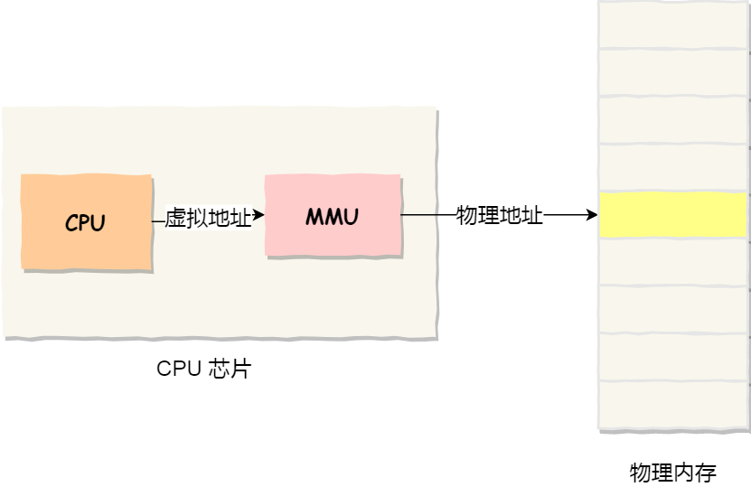 


## 2.管理虚拟地址和物理地址

### 分段

程序是由若干个逻辑分段组成的，如可由代码分段、数据分段、栈段、堆段组成。**不同的段是有不同的属性的，所以就用分段（Segmentation）的形式把这些段分离出来。** 

分段机制下的虚拟地址由两部分组成：

- **段选择因子**
- **段内偏移量**

  

> - **段选择因子**就保存在段寄存器里面。段选择因子里面最重要的是**段号**，用作段表的索引。
> - **段表**里面保存的是这个**段的基地址、段的界限和特权等级**等。
> - 虚拟地址中的**段内偏移量**应该位于 0 和段界限之间，如果段内偏移量是合法的，就将段基地址加上段内偏移量得到物理内存地址。

分段机制会把程序的虚拟地址分成 4 个段，每个段在段表中有一个项，在这一项**找到段的基地址，再加上偏移量，于是就能找到物理内存中的地址**，例如下面例子：

  

 如果要访问段 3 中偏移量 500 的虚拟地址，我们可以计算出物理地址为，段 3 基地址 7000 + 偏移量 500 = 7500。 


#### 缺点

- 第一个就是**内存碎片**的问题。

  >  如果关闭浏览器，则出现两个内存碎片，无法打开大于128MB的应用
  >
  >  
  >
  > 内存碎片分为`内部内存碎片`和`外部内存碎片`，主要讨论外部内存碎片，也就是上面说的。
  >
  > 
  >
  > **解决外部内存碎片的方式是`内存交换`**
  >
  > 可以把音乐程序占用的那 256MB 内存写到硬盘上，然后再从硬盘上读回来到内存里。不过再读回的时候，不能装载回原来的位置，而是紧紧跟着那已经被占用了的 512MB 内存后面。这样就能空缺出连续的 256MB 空间，于是新的 200MB 程序就可以装载进来。 
  >
  > **内存交换空间：**
  >
  > Linux系统中用于内存交换的空间，**从硬盘划出来**。

  

- 第二个就是**内存交换的效率低**的问题

  > 内存交换需要访问硬盘，但硬盘读写速度远远小于内存，存在效率低问题。


### 分页

为了解决尽量少出现内存碎片，并且内存交换时候，交换写入或者从磁盘转载的数据更少一些，设计出**分页**

**分页是把整个虚拟和物理内存空间切成一段段固定尺寸的大小**。这样一个连续并且尺寸固定的内存空间，我们叫**页**（*Page*）。在 Linux 下，每一页的大小为 `4KB`。 

虚拟地址与物理地址之间通过**页表**来映射，如下图： 

  

页表是存储在内存里的，**内存管理单元** （*MMU*）就做将虚拟内存地址转换成物理地址的工作。 

而当进程访问的虚拟地址在页表中查不到时，系统会产生一个**缺页异常**，进入系统内核空间分配物理内存、更新进程页表，最后再返回用户空间，恢复进程的运行。 


**虚拟地址和物理地址的映射：**

虚拟地址分为两部分，**页号**和**页内偏移**。页号作为页表的索引，**页表**包含物理页每页所在**物理内存的基地址**，这个基地址与页内偏移的组合就形成了物理内存地址 

 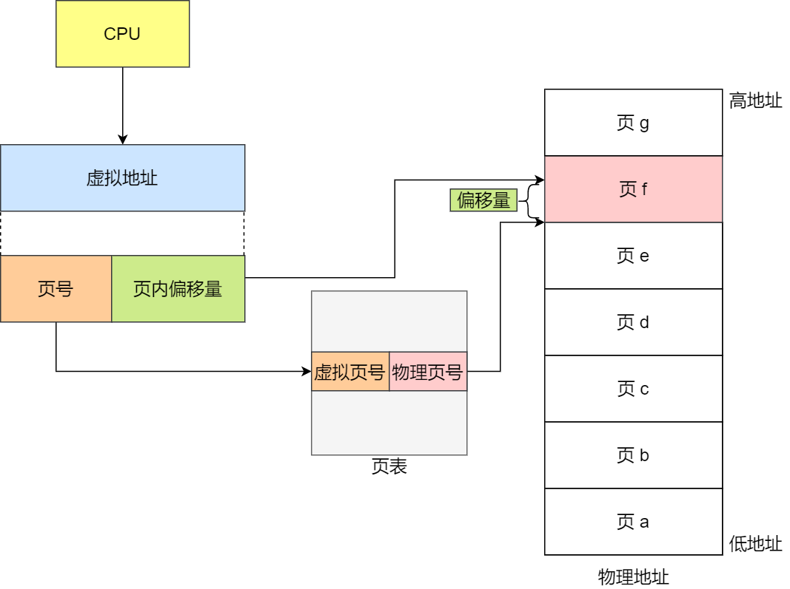 

分页情况下，一个内存地址转换的步骤如下：

- 把虚拟内存地址，切分成页号和偏移量；
- 根据页号，从页表里面，查询对应的物理页号；
- 直接拿物理页号，加上前面的偏移量，就得到了物理内存地址。

 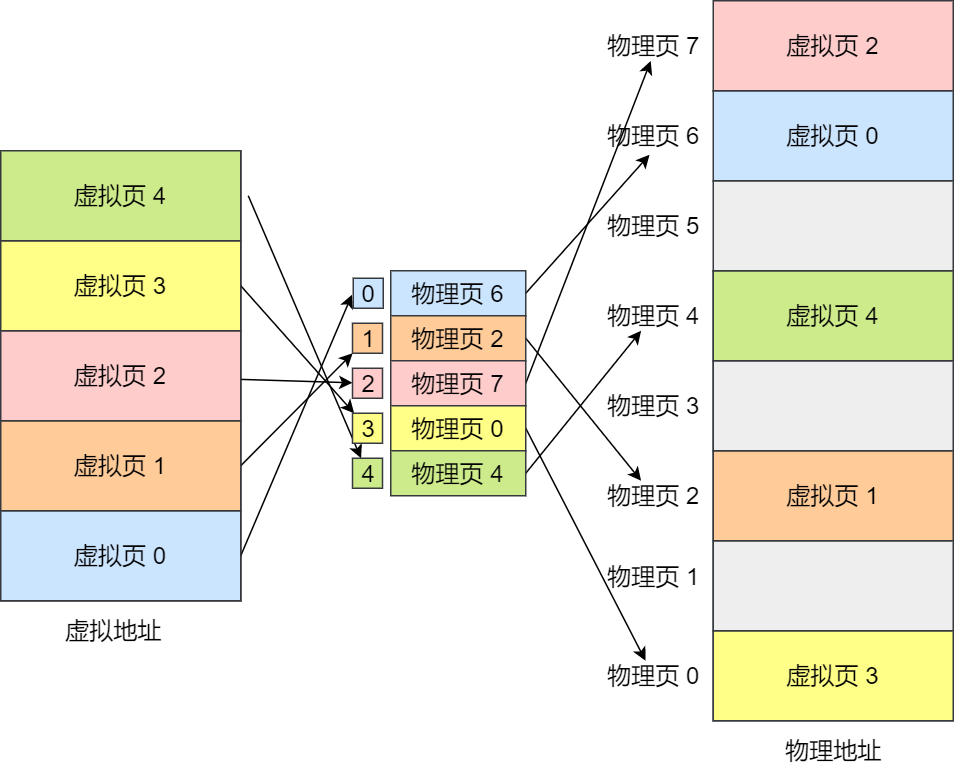 


#### 优势

**①解决外部内存碎片的问题**

分页的内存空间是预先划分好的，**页与页之间是紧密排列的，不会出现外部碎片**，不会像内存分段一样，段之间存在间隙


**②内存交换效率比较高**

如果内存空间不够，操作系统会把其他正在运行的进程中的「最近没被使用」的**内存页面**给释放掉，也就是暂时写在硬盘上，称为**换出**（*Swap Out*）。一旦需要的时候，再加载进来，称为**换入**（*Swap In*）。所以，一次性写入磁盘的也只有少数的一个页或者几个页，不会花太多时间，**内存交换的效率就相对比较高。** 

 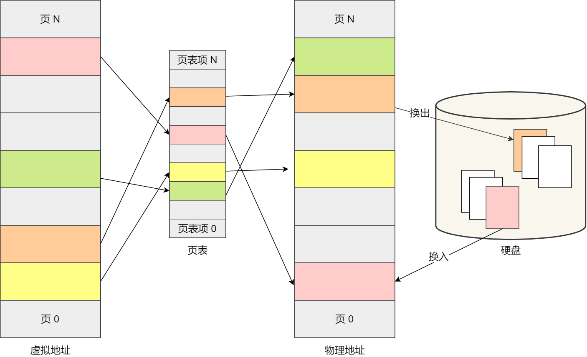 

> 每一个**页表项**包括：
>
> 1. 页框号（Page Frame Number，PFN）：指向物理内存中的一个页框，用于存储虚拟内存页的实际内容。
> 2. 访问权限：指定该页是否可读、可写、可执行，以及是否允许用户模式访问。
> 3. 修改位（Modified bit）：指示该页自上次被加载到内存后是否被修改过。
> 4. 引用位（Reference bit）：指示该页自上次被加载到内存后是否被访问过。
> 5. 脏位（Dirty bit）：指示该页是否已经被修改过但尚未写回磁盘。
> 6. 缓存禁用位（Cache Disable bit）：指示该页是否应该被缓存在处理器的缓存中。
> 7. 写时复制位（Write-Through bit）：指示处理器是否应该在写入该页时立即将其写回内存，还是先将其缓存在高速缓存中。
> 8. 全局位（Global bit）：指示该页是否在多个地址空间中共享。

分页的方式使得在加载程序的时候，不再需要一次性都把程序加载到物理内存中。而是完全可以在进行虚拟内存和物理内存的页之间的映射之后，并不真的把页全部加载到物理内存里，而是**只有在程序运行中，需要用到对应虚拟内存页里面的指令和数据时，再加载到物理内存里面去。** 


#### 缺点

**①会产生内部碎片**

因为最少只能分配一页，所有可能出现内存浪费的情况，即**分页会有内部内存碎片**

**②分页产生的页表会非常庞大**

> 在 32 位的环境下，虚拟地址空间共有 4GB，假设一个页的大小是 4KB（2^12），那么就需要大约 100 万 （2^20） 个页，每个「页表项」需要 4 个字节大小来存储，那么整个 4GB 空间的映射就需要有 `4MB` 的内存来存储页表。
>
> 这 4MB 大小的页表，看起来也不是很大。但是要知道**每个进程都是有自己的虚拟地址空间的，也就说都有自己的页表。**
>
> 那么，`100` 个进程的话，就需要 `400MB` 的内存来存储页表，这是非常大的内存了，更别说 64 位的环境了。

#### 多级页表

多级页表就是类似，把上面提到的100多万个页表项的单级页表再分页，例如：

页表分为1024个二级页表，每个二级页表又包含1024个页表项，形成二级分页。

> 也就是说4GB的地址空间就需要4KB一级页表+4MB的二级页表。

 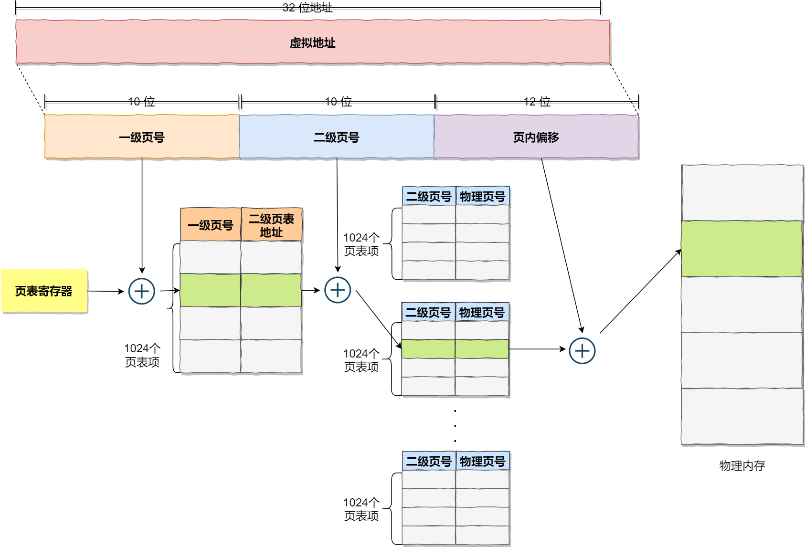 

> 上面出现一个问题，**创建了二级页表占用空间不更大了吗？**
>
> 其实是 **如果某个一级页表的页表项没有被用到，也就不需要创建这个页表项对应的二级页表了，即可以在需要时才创建二级页表**。做个简单的计算，假设只有 20% 的一级页表项被用到了，那么页表占用的内存空间就只有 4KB（一级页表） + 20% * 4MB（二级页表）= `0.804MB`，这对比单级页表的 `4MB` 是一个巨大的节约 

**64位系统，有四级目录：**

- 全局页目录项 PGD（*Page Global Directory*）；
- 上层页目录项 PUD（*Page Upper Directory*）；
- 中间页目录项 PMD（*Page Middle Directory*）；
- 页表项 PTE（*Page Table Entry*）；

  


#### TLB

**分页的问题**

分页会造成的时间上的问题，虚拟地址到物理地址转换过程中多了几道转换工序，降低了转换速度。

**解决办法：**

**由于程序执行是有局限性的**， 整个程序的执行仅限于程序中的某一部分。相应地，执行所访问的存储空间也局限于某个内存区域。 

利用这一特性，**把最常访问的几个页表项存储到访问速度更快的硬件**，于是计算机科学家们，就在 CPU 芯片中，加入了一个专门存放程序最常访问的页表项的 Cache，这个 Cache 就是 TLB（***Translation Lookaside Buffer***）。

 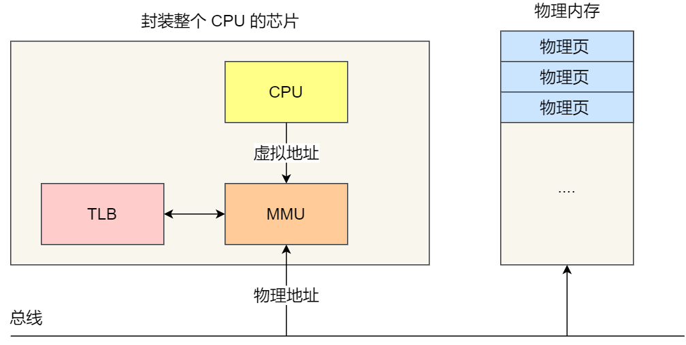 

如上图，CPU寻址时候先通过**内存管理单元（*Memory Management Unit*）芯片** ，去TLB寻址，如果没有找到则去正常的页表项寻址。

> **页表和MMU关系**
>
> 页表是存储虚拟地址与物理地址映射关系的数据结构，而MMU是负责执行这种映射的硬件组件。 它们在虚拟内存管理中密切合作，使操作系统能够在有限的物理内存上实现更大的虚拟地址空间，并提供了更高的灵活性和资源利用率。 

**TLB的命中率非常高，因为程序最常访问的页就那几个**


### 段页式内存管理

分段和分页也可以结合起来使用，称为**段页式管理**

**段页式内存管理实现的方式：**

- 先将程序划分为多个有逻辑意义的段，也就是前面提到的分段机制；
- 接着再把每个段划分为多个页，也就是对分段划分出来的连续空间，再划分固定大小的页；

 地址结构就由**段号、段内页号和页内位移**三部分组成 

 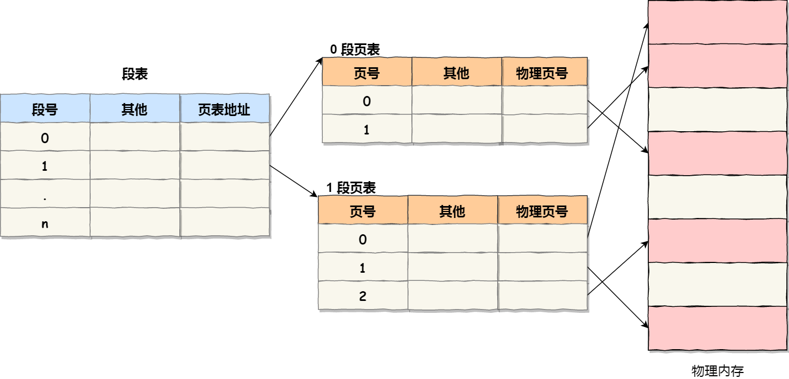 

> 用于段页式地址变换的数据结构是每一个程序一张段表，每个段又建立一张页表，段表中的地址是页表的起始地址，而页表中的地址则为某页的物理页号 


## 3.Linux的虚拟地址空间分布

虚拟地址空间的内部又被分为**内核空间和用户空间**两部分，不同位数的系统，地址空间的范围也不同。比如最常见的 32 位和 64 位系统 

 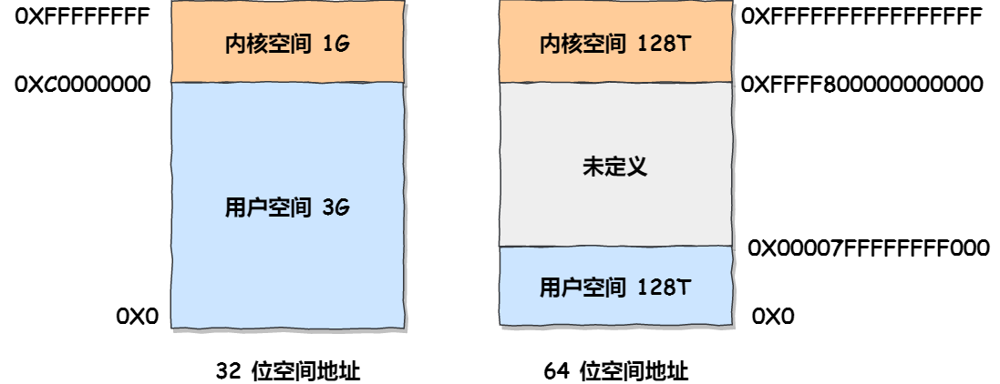 

- 32位系统的内核空间占用1G，位于高位，而剩下的3G全部分配给用户空间
- `64` 位系统的内核空间和用户空间都是 `128T`，分别占据整个内存空间的最高和最低处，剩下的中间部分是未定义的。

### 用户空间划分

以三十二位的系统为例：

  

从**低到高**分别是 6 种不同的内存段：

- 代码段，包括二进制可执行代码；
- 数据段，包括已初始化的静态常量和全局变量；
- BSS 段，包括未初始化的静态变量和全局变量；
- 堆段，包括动态分配的内存，从低地址开始向上增长；
- 文件映射段，包括动态库、共享内存等，从低地址开始向上增长（跟硬件和内核版本有关 (opens new window)）；
- 栈段，包括局部变量和函数调用的上下文等。栈的大小是固定的，一般是 `8 MB`。当然系统也提供了参数，以便我们自定义大小；

>  代码段下面还有一段内存空间的（灰色部分），这一块区域是「保留区」 


## 4.虚拟内存为何可以远超物理内存

> https://zhuanlan.zhihu.com/p/572341150


## 5.内存溢出

**内存分配过程：**

①应用程序通过`malloc`申请内存适合，申请的是虚拟内存。

②当应用程序读写这块虚拟内存适合，CPU会访问这个虚拟内存，这时候发现这个虚拟内存没有映射到物理内存，CPU产生缺页中断，进程切换到内核态。

③缺页中断处理函数查看是否有空闲的物理内存：

- 有则直接分配，并建立虚拟内存和物理内存之间的映射
- 没有，则内核开始进行**回收内存**的工作。

### （1）内存回收

回收方式主要是两种：

- 直接内存回收：物理内存紧张的时候，
- 后台内存回收