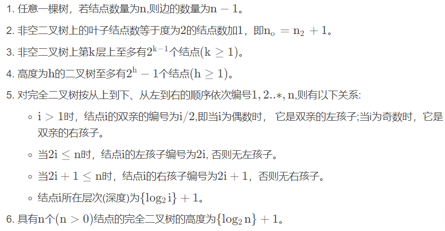

# 一、树和二叉树

> 参考——https://blog.csdn.net/Real_Fool_/article/details/113930623

## 	1.定义:

 树(Tree)是 n(n≥0)个结点的有限集。若 n=0， 称为空树；若 n > 0，则它满足如下两个条件：
  (1)  有且仅有一个特定的称为根 (Root) 的结点；
  (2)  其余结点可分为 m (m≥0) 个互不相交的有限集 T1, T2, T3, …, Tm， 其中每一个集合本身又 
         是一棵树，并称为根的子树 (SubTree)。


**形式化定义:**

T={D,R}。D是包含n个节点的有穷集合（n≥0）。当n=0时为空树，否则关系R满足以下条件:

- 有且仅有一个节点`d0∈D`，它对于关系R来说没有前驱节点，节点d0称作树的根节点。
-  除节点d0外，D中的每个节点对于关系R来说都有且仅有一个前驱节点。
-  D中每个节点对于关系R来说可以有零个或多个后继节点。

**表示法**

​	树形表示法：


​	广义表示法:


## 	2.树的基本属性

**①度：**

​	**结点的度：** 一个结点的孩子个数，`如上图结点B的度是2，结点D的度为3`

​	**树的度：**树内结点的最大度数 ，`如上图树的度为3`

**②树中的节点数等于所有结点的度数加1**

**③度为m的树中第i层上至多有`m^(i-1)`个节点（i≥1）**

**④高度为h的m叉树至多有****个节点**

**⑤具有n个节点的m次树的最小高度为 `[logm(n(m-1)+1)]`（就是上面公式反推）**


## 3.树的遍历:


### (1)先序遍历：

先遍历左子树，然后遍历右子树，最后访问根结点。

### (2)中序遍历：

先遍历左子树，然后访问根结点，最后遍历右子树。

### (3)后序遍历：

先遍历左子树，然后遍历右子树，最后访问根结点。


## 4.二叉树：

### 	(1)定义：

二叉树是 `n (n≥0) `个结点的有限集，它**或者是空集 (n = 0)**，或者由一个根结点及两棵互不相交的分别称作这个根的左子树和右子树的二叉树组成。

​	**特点:**

- 每个结点最多有俩孩子（不存在度大于2的结点）
- 子树有左右之分，其次序不能颠倒
- 二叉树可为空集合，根可有空的左子树或空的右子树


**二叉树与树的区别：**

二叉树结点子树要区分左子树还是右子树。即具有两颗结点的二叉树有两种状态


### 	(2)性质




### 几种特殊的二叉树

#### 	(1)满二叉树

一棵高度为 k 且有 `2^k- 1` 个结点的二叉树称为满二叉树。

树中每层都含有最多的结点。

> 对满二叉树按层序编号:约定编号从根结点(根结点编号为1起，自上而下，自左向右。这样，每个结点对应一个编号,对于编号为`i`的结点，若有双亲，则其双亲为`i / 2 `,若有左孩子，则左孩子为`2i `;若有右孩子，则右孩子为`2i+1`。


#### 	(2)完全二叉树

深度为 k 的具有 n 个结点的二叉树，当且仅当 其每一个结点都与深度为 k 的满二叉树中编号为 1~n 的结点一一对应时，称之为完全二叉树。

**特点:**

叶子只可能分布在层次最大的两层上。 对任一结点，如果其右子树的最大层次为 l， 则其左子树的最大层次必为 l 或 l + 1。 

**性质:**

则对任一结点 i (1≤i≤n)，有： 
         (1)  如果 i = 1，则结点 i 是二叉树的根，无双亲； 
                如果 i >1，则其双亲是结点  i / 2。 
         (2)  如果 2i > n，则结点 i 为叶子结点，无左孩子； 
                否则，其左孩子是结点 2i。
         (3)  如果 2i + 1 > n，则结点 i 无右孩子；否则，其 
                右孩子是结点 2i + 1。

#### (3)二叉查找树(二叉搜索树/二叉排序树)

​	**①定义：**

它或者是一颗空树，或者具有下列性质的二叉树。

- 若它的左子树不空，则左子树上所有节点的值均小于它的根节点的值；
- 若它的右子树不空，则右子树上所有节点的值均大于它的根节点的值；
- 它的左、右子树也分别为二叉排序树。

​	

#### (4)平衡二叉树(AVL)

​		**①定义：**

它或者是一颗空树，或者具有以下性质的二叉排序树：它的左子树和右子树的**深度之差(平衡因子)的绝对值不超过1**，且它的左子树和右子树都是一颗平衡二叉树。

**一棵AVL必须有如下条件:**

- 它必须是二叉查找树
- 每个节点的左子树和右子树的高度差至多为1


左边二叉树的节点45左子树高度2，右子树高度0，左右子树高度差为2-0=2，不满足条件二；
右边二叉树的节点均满足左右子树高度差至多为1，同时它满足二叉搜索树的要求，因此它是一棵平衡二叉树。

**AVL树的查找、插入、删除操作在平均和最坏的情况下都是O（logn）**，这得益于它时刻维护着二叉树的平衡。如果我们需要查找的集合本身没有顺序，在频繁查找的同时也经常的插入和删除，AVL树是不错的选择。不平衡的二叉查找树在查找时的效率是很低的，因此，AVL如何维护二叉树的平衡是我们的学习重点。

​	**②相关概念：**

​	**平衡因子**：将二叉树上节点的左子树高度减去右子树高度的值称为该节点的平衡因子BF(Balance Factor)。对于平衡二叉树，BF的取值范围为[-1,1]。如果发现某个节点的BF值不在此范围，则需要对树进行调整。

​	**最小不平衡子树**：距离插入节点最近的，且平衡因子的绝对值大于1的节点为根的子树.。


在图三中，左边二叉树的节点45的BF = 1，插入节点43后，节点45的BF = 2。节点45是距离插入点43最近的BF不在[-1,1]范围内的节点，因此以节点45为根的子树为最小不平衡子树

​	**③平衡二叉树调整**

整个实现过程是通过在一棵平衡二叉树中依次插入元素(按照二叉排序树的方式)，若出现不平衡，则要根据新插入的结点与最低不平衡结点的位置关系进行相应的调整。分为LL型、RR型、LR型和RL型4种类型，各调整方法如下(下面用A表示最低不平衡结点)：

​	**LL型调整：**

```markdown
由于在A的左孩子(L)的左子树(L)上插入新结点，使原来平衡二叉树变得不平衡，此时A的平衡因子由1增至2。下面图1是LL型的最简单形式。显然，按照大小关系，结点B应作为新的根结点，其余两个节点分别作为左右孩子节点才能平衡，A结点就好像是绕结点B顺时针旋转一样。
```


```markdown
LL型调整的一般形式如下图2所示，表示在A的左孩子B的左子树BL(不一定为空)中插入结点(图中阴影部分所示)而导致不平衡( h 表示子树的深度)。这种情况调整如下：①将A的左孩子B提升为新的根结点；②将原来的根结点A降为B的右孩子；③各子树按大小关系连接(BL和AR不变，BR调整为A的左子树)。
```


​	**RR型调整：**

由于在A的右孩子(R)的右子树(R)上插入新结点，使原来平衡二叉树变得不平衡，此时A的平衡因子由-1变为-2。图3是RR型的最简单形式。显然，按照大小关系，结点B应作为新的根结点，其余两个节点分别作为左右孩子节点才能平衡，A结点就好像是绕结点B逆时针旋转一样。


**LR型调整**

```java
由于在A的左孩子(L)的右子树(R)上插入新结点，使原来平衡二叉树变得不平衡，此时A的平衡因子由1变为2。图5是LR型的最简单形式。显然，按照大小关系，结点C应作为新的根结点，其余两个节点分别作为左右孩子节点才能平衡。
```


```markdown
LR型调整的一般形式如下图6所示，表示在A的左孩子B的右子树(根结点为C，不一定为空)中插入结点(图中两个阴影部分之一)而导致不平衡( h 表示子树的深度)。这种情况调整如下：①将B的左孩子C提升为新的根结点；②将原来的根结点A降为C的右孩子；③各子树按大小关系连接(BL和AR不变，CL和CR分别调整为B的右子树和A的左子树)。
```


**RL型调整：**

```markdown
由于在A的右孩子(R)的左子树(L)上插入新结点，使原来平衡二叉树变得不平衡，此时A的平衡因子由-1变为-2。图7是RL型的最简单形式。显然，按照大小关系，结点C应作为新的根结点，其余两个节点分别作为左右孩子节点才能平衡。
```


```markdown
RL型调整的一般形式如下图8所示，表示在A的右孩子B的左子树(根结点为C，不一定为空)中插入结点(图中两个阴影部分之一)而导致不平衡( h 表示子树的深度)。这种情况调整如下：①将B的左孩子C提升为新的根结点；②将原来的根结点A降为C的左孩子；③各子树按大小关系连接(AL和BR不变，CL和CR分别调整为A的右子树和B的左子树)。
```


## 5.哈夫曼树

### 	(1)定义：

哈夫曼树(最优树)：带权路径长度最短的树

### 	(2)特点：

- 哈夫曼树中权越大的叶子离根越近
- 具有相同带权结点的哈夫曼树不唯一
- 满二叉树不一定是哈夫曼树


### 	(3)构造哈夫曼树

在众多结点中，每次选择两个权值最小的结点进行合并形成一棵新的树。直到最后合并成一棵哈夫曼树


包含n个叶子结点的哈夫曼树中共有2n-1个结点

### 	(4)应用：哈夫曼编码

- 为了解决数据的最小冗余编码问题(短编码表示频率大的字符)
- 解决译码唯一性的问题：要求任一字符的编码都不能是另一字符编码的前缀！


上图中，以出现频率作为权重来生成哈夫曼树


## 6.最小生成树

> https://blog.csdn.net/qq_35644234/article/details/59106779


## 7.B树

​	**概述：**

Ｂ树和Ｂ＋树的出现是因为另外一个问题，那就是磁盘ＩＯ；众所周知，ＩＯ操作的效率很低，那么，当在大量数据存储中，查询时我们不能一下子将所有数据加载到内存中，只能逐一加载磁盘页，每个磁盘页对应树的节点。造成大量磁盘ＩＯ操作（最坏情况下为树的高度）。平衡二叉树由于树深度过大而造成磁盘IO读写过于频繁，进而导致效率低下。

​	为了减少磁盘IO的次数，必须降低树的深度，基本想法是：

​	   （1）、**每个节点存储多个元素**
　　（2）、**摒弃二叉树结构，采用多叉树**

​	**特征：**

- 树的结点 最多 有 多少个孩子结点（子树）称为B树的阶，通常用m表示
- 一个结点有k个孩子时，必有k-1个关键字才能将子树中所有关键字划分为k个子集

```java
1.根结点至少有两个子女。
2.每个中间节点都包含k-1个元素和k个孩子，其中 ceil（m/2） ≤ k ≤ m
3.每一个叶子节点都包含k-1个元素，其中 ceil（m/2） ≤ k ≤ m
4.所有的叶子结点都位于同一层。
5.每个节点中的元素从小到大排列，节点当中k-1个元素正好是k个孩子包含的元素的值域划分
6.除根结点外，其它每个分支至少有 t = ⌈m/2⌉棵子树。
   
```

示例：三阶B树


**查询：**

　以上图为例：若查询的数值为５：
　　第一次磁盘ＩＯ：在内存中定位（与17、35比较），比17小，左子树；
　　第二次磁盘ＩＯ：在内存中定位（与８、12比较），比８小，左子树；
　　第三次磁盘ＩＯ：在内存中定位（与3、5比较），找到5，终止。
整个过程中，我们可以看出：比较的次数并不比二叉查找树少，尤其是当某一节点中的数据很多时，但是磁盘IO的次数却是大大减少。比较是在内存中进行的，相比于磁盘IO的速度，比较的耗时几乎可以忽略。所以当树的高度足够低的话，就可以极大的提高效率。相比之下，节点中的元素多点也没关系，仅仅是多了几次内存交互而已，只要不超过磁盘页的大小即可。

**插入：**

​	对于高度为k的m阶B树，新结点一般插在叶子层。通过检索确定关键码插入的位置，然后分两种情况讨论:

- 若该结点中关键码个数小于m-1，则直接插入
- 若该结点中的关键码个数等于m-1，则将引起结点的分裂，此时以**中间关键码**为界限将结点一分为二，产生新的结点，并把**中间关键码**插入到父节点。

重复上述工作，最坏情况一直分裂到根结点，建立一个新的根节点，B树增加一层

**例如:**在下面B树中插入key:4


第一步：检索key插入的结点位置，在3-5之间。

第二步：判断节点中关键码个数，由于该B树阶为3，所以每个结点最多有2个关键字，此时无法增加，父节点2,6也无法增加，所以增加到根节点。

第三步：结点分裂，拆分3,5与2,6，让根节点9升级为两元素结点4,9。节点6独立为根节点的第二个孩子


**删除：**

在删除B树结点时，为了避免回溯，当遇到需要合并的结点时就立即执行合并，B树的删除算法如下：从root向叶子结点按照查询规律遍历：

     （1）如果target在叶结点x中，则直接从x中删除target，情况（2）和（3）会保证当再叶子结点找到target时，肯定能借结点或合并成功而不会引起父结点的关键字个数少于t-1。
     （2）如果target在内部结点（简称内结点：非叶子结点）x中：  
      		(a)如果x的左分支结点y至少包含t个关键字，则找出y的最右的关键字prev，并替换target，并在y中递归删除prev。
    
             (b) 如果x的右分支结点z至少包含t个关键字，则找出z的最左的关键字next，并替换target，并在z中递归删除next。
    
             (c) 否则，如果y和z都只有t-1个关键字，则将target与z合并到y中，使得y有2t-1个关键字，再从y中递归删除target。
    
      (3) 如果关键字不在内部结点x中，则必然在x的某个分支结点p[i]为根的子树中，如果p[i]结点只有t-1个关键字，执行3a、3b或者3c以保证我们降至一个包含至少t个关键字的结点，然后通过对x的某个合适的子结点递归而结束。
    
             (a) 如果p[i-1]拥有至少t个关键字，则将x的某个关键字降至p[i]中，将p[i-1]的最大结点上升至x中。
             (b) 如果p[i+1]拥有至少t个关键字，则将x个某个关键字降至p[i]中，将p[i+1]的最小关键字上升至x个。 否则将p[i]与其中一个兄弟合并，将x的一个关键字降至合并的结点中，成为中间关键字。

​	删除下图中的T，其中阶层为3；

(1) 根结点的右子树的关键字个数为3 > 2，直接下降至LOT结点。

  (2) 由于T在内部结点LOT，T的前子结点和后子结点都只包含t-1 = 1个关键字，所以满足②c将两个子结点和T合并，生成结点PTY，并递归从PTY中删除T。

 (3) T在PTY中，而且PTY是一个叶子结点，所以直接删除。


​	删除元素11：


第一步：判断该元素是否在叶子结点上。
　　　该元素在叶子节点上，可以直接删去，但是删除之后，中间节点12只有一个孩子，不符合B树的定义：每个中间节点都包含k个孩子，（其中 ceil（m/2） <= k <= m）所以需要调整；

第二步：判断其左右兄弟结点中有“多余”的关键字，即：原关键字个数n>=ceil(m/2) - 1；
　　显然结点11的右兄弟节点中有多余的关键字。那么可将右兄弟结点中最小关键字上移至双亲结点。而将双亲结点中小于该上移关键字的关键字下移至被删关键字所在结点中即可


#### 	B+树

**Ｂ＋树是Ｂ树的变种，有着比Ｂ树更高的查询效率**


**特点**一个m阶的B+树有如下几个特征:

```java
1.有k个子树的中间节点包含有k个元素（B树中是k-1个元素），每个元素不保存数据，只用来索引，所有数据都保存在叶子节点。

2.所有的叶子结点中包含了全部元素的信息，及指向含这些元素记录的指针，且叶子结点本身依关键字的大小自小而大顺序链接。

3.所有的中间节点元素都同时存在于子节点，在子节点元素中是最大（或最小）元素。
```

下面是一棵3阶的B+树


B+树通常有两个指针，一个指向根结点，另一个指向关键字最小的叶子结点。因此，对于B+树进行查找两种运算：一种是从最小关键字起顺序查找，另一种是从根结点开始，进行随机查找。

**查找：**

**B+树的优势在于查找效率**上，下面做一具体说明：
　　首先，Ｂ＋树的查找和Ｂ树一样，类似于二叉查找树。起始于根节点，自顶向下遍历树，选择其分离值在要查找值的任意一边的子指针。在节点内部典型的使用是二分查找来确定这个位置。

​	（1）不同的是，**Ｂ＋树中间节点没有数据**（索引元素所指向的数据记录），只有索引，而Ｂ树每个结点中的每个关键字都有数据；这就意味着同样的大小的磁盘页可以容纳更多节点元素，在相同的数据量下，Ｂ＋树更加“矮胖”，ＩＯ操作更少

​    （2）、其次，因为卫星数据的不同，导致查询过程也不同；Ｂ树的查找只需找到匹配元素即可，最好情况下查找到根节点，最坏情况下查找到叶子结点，所说性能很不稳定，而Ｂ＋树每次必须查找到叶子结点，性能稳定

B树的卫星数据：


B+树的卫星数据：


 (3)在范围查询方面，B+树的优势更加明显
　　B树的范围查找需要不断依赖中序遍历。首先二分查找到范围下限，在不断通过中序遍历，知道查找到范围的上限即可。整个过程比较耗时。
　　而B+树的范围查找则简单了许多。首先通过二分查找，找到范围下限，然后同过叶子结点的链表顺序遍历，直至找到上限即可，整个过程简单许多，效率也比较高。
　　例如：同样查找范围[3-11]，两者的查询过程如下：
		B树的查找过程：


B+树查找过程：


**插入：**

B+树的插入与B树的插入过程类似。不同的是B+树在叶结点上进行，如果叶结点中的关键码个数超过m，就必须分裂成关键码数目大致相同的两个结点，并保证上层结点中有这两个结点的最大关键码。

**删除：**

B+树中的关键码在叶结点层删除后，其在上层的复本可以保留，作为一个”分解关键码”存在，如果因为删除而造成结点中关键码数小于ceil(m/2)，其处理过程与B-树的处理一样。在此，我就不多做介绍了。


#### 总结：

​	   ①、B树主要用于文件系统以及部分数据库索引，例如： MongoDB。而大部分关系数据库则使用B+树做索引，例如：mysql数据库；
　　②、从查找效率考虑一般要求B树的阶数m >= 3;
　　③、B树上算法的执行时间主要由读、写磁盘的次数来决定，故一次I/O操作应读写尽可能多的信息。因此B树的结点规模一般以一个磁盘页为单位。一个结点包含的关键字及其孩子个数取决于磁盘页的大小。

​		④、单一节点存储更多的元素，使得查询的IO次数更少；

# 二、链表

