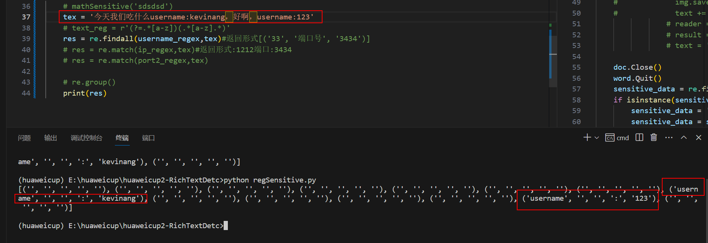

# 一.

- `\d`：匹配任何数字字符
- `\w`：匹配任何字母数字字符
- `\s`：匹配任何空白字符
- `.`：匹配任何字符
- `*`：匹配前面的字符零次或多次
- `+`：匹配前面的字符一次或多次
- `?`：匹配前面的字符零次或一次
- `[]`：匹配括号中的字符集合
- `()`：将正则表达式分组
- `|`：匹配左侧或右侧的正则表达式
- ^：匹配开头
- $：匹配结尾

> **例子：**
>
> - `\d{3}-\d{3}-\d{4}`：匹配美国的电话号码
> - `[a-zA-Z0-9_.]+@[a-zA-Z0-9_.]+\.[a-zA-Z]+`：匹配电子邮件地址
> - `\w+`：匹配任何字母数字字符串
> - `.+`：匹配任何字符串


**?=.***

 `?=` 表示 **非贪婪模式**。在非贪婪模式下，匹配器会尽可能少地匹配匹配模式。 

在 `?=.*` 这个正则表达式中，`.*` 表示匹配任意字符的任意数量。在贪婪模式下，匹配器会匹配到字符串的末尾，但在非贪婪模式下，匹配器只会匹配到第一个空格。 

```python
import re

pattern = r"^[a-z]+?.*$"

string = "hello world"

match = re.match(pattern, string)

if match:
    print(match.group())
else:
    print("匹配失败")

# 输出：
# hello

```

>  上述示例中，`[a-z]+?` 表示匹配至少一个小写字母。在贪婪模式下，匹配器会匹配到字符串的末尾，即 `world`，但在非贪婪模式下，匹配器只会匹配到第一个空格，即 `hello`。 

> 参考：
>
> https://www.zhihu.com/question/350775991
>
> `(?=.*[a-z])` 是一个正则表达式中的零宽度正预测先行断言，它表示匹配当前位置后面的内容，如果这些内容中包含至少一个小写字母 `[a-z]`，则匹配成功，否则匹配失败。
>
> 其中 `(?=pattern)` 表示正预测先行断言，意思是匹配输入字符串中紧随当前位置（即断言字符之后）的字符序列，这个字符序列必须与 `pattern` 匹配。而 `.` 表示匹配任意单个字符（除了换行符之外的任何字符），`*` 表示匹配前面的子表达式零次或多次。
>
> 因此，`(?=.*[a-z])` 表示匹配任何字符串，只要在其中能够找到至少一个小写字母，就可以匹配成功。例如，该正则表达式可以匹配 `Abc`, `123aBC`, `ABcd`, `abcD`, `1#2d3f4z5q6`, 等等。
>
> 另外就是，`(?=.*[a-z])` 只是一个零宽度断言，它并不会将对应的字符作为匹配结果返回。如果需要匹配包含小写字母的实际字符序列，需要在正则表达式中加入对应的子表达式，例如 `(.*[a-z].*)`。
>
> **例如：**
>
> ```python
> tex = '1ereeas'
> text_reg = r'(?=.*[a-z])(.*[a-z].*)'
> res = re.findall(text_reg,tex)
> #匹配成功， 因为tex有小写字母
> 
> tex = '1'
> text_reg = r'(?=.*[a-z])(.*[a-z].*)'
> res = re.findall(text_reg,tex)
> #匹配失败
> ```


**多个模式**

> 参考：https://blog.csdn.net/ningyanggege/article/details/105254241




```
{
	"文件名"：提取的敏感词内容
}
```

