## 一、数组和字符串

### 1.三数之和

给你一个整数数组 nums ，判断是否存在三元组 [nums[i], nums[j], nums[k]] 满足 i != j、i != k 且 j != k ，同时还满足 nums[i] + nums[j] + nums[k] == 0 。请

你返回所有和为 0 且不重复的三元组。

注意：答案中不可以包含重复的三元组。

> **示例 1：**
>
> 输入：nums = [-1,0,1,2,-1,-4]
> 输出：[[-1,-1,2],[-1,0,1]]
> 解释：
> nums[0] + nums[1] + nums[2] = (-1) + 0 + 1 = 0 。
> nums[1] + nums[2] + nums[4] = 0 + 1 + (-1) = 0 。
> nums[0] + nums[3] + nums[4] = (-1) + 2 + (-1) = 0 。
> 不同的三元组是 [-1,0,1] 和 [-1,-1,2] 。
> 注意，输出的顺序和三元组的顺序并不重要。
>
> **示例 2：**
>
> 输入：nums = [0,1,1]
> 输出：[]
> 解释：唯一可能的三元组和不为 0 。
>
> **示例 3：**
>
> 输入：nums = [0,0,0]
> 输出：[[0,0,0]]
> 解释：唯一可能的三元组和为 0 。


可以固定一个数字，然后双指针分别从前、后搜索，找到符合条件的就存入集合。所以我们需要过滤掉重复的结果。怎么过滤，我们来思考这样一个问题，在数组

***[a,a,b,c]***

如果a+b+c=0，因为有两个a，那么就会出现两个a+b+c=0的结果，所以我们需要过滤掉一个，怎么过滤呢，就是当前数字如果和前面一个数字相同，我们就跳过。比如上面第2个a和第一个a相同，我们直接跳过。

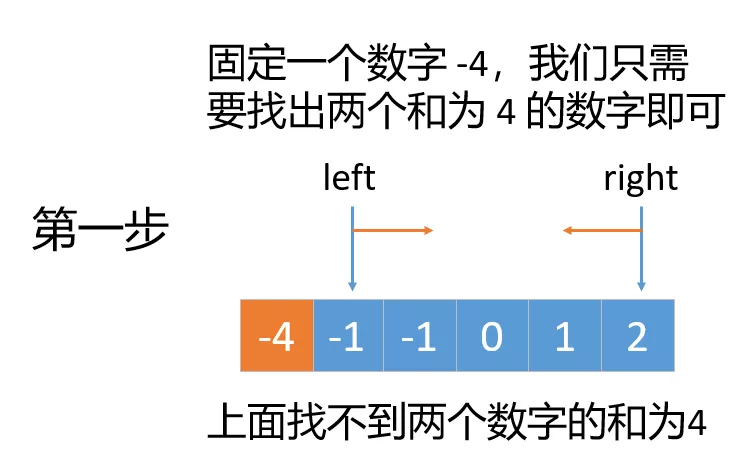

```java
class Solution {
    public List<List<Integer>> threeSum(int[] nums) {
        if(nums.length<3)return new ArrayList();
        
        Arrays.sort(nums);

        List<List<Integer>> list = new ArrayList();

        for(int i = 0;i<nums.length;i++){
		   //当指针到正数的时候就不适合继续下去了，因为正数相加肯定大于等于0
            if(nums[i]>0)return list;
            //去重，如果相等就要跳过这次循环
            if(i>0&&nums[i]==nums[i-1])continue;

            int left = i+1;
            int right = nums.length-1;

            while(left<right){
                int sum = nums[i]+nums[left]+nums[right];
                if(sum==0){
                    list.add(Arrays.asList(nums[i],nums[left],nums[right]));

                    //如果前后是相同的数，那么需要去重
                    while(left<right && nums[left]==nums[left+1])left++;
                    while(left<right&& nums[right]==nums[right-1])right--;

                    right--;
                    left++;
                }else if(sum<0){
                    left++;
                }else{
                    right--;
                }
            }
        }
        return list;
    }
}
```


### 2.矩阵置零

给定一个 `*m* x *n*` 的矩阵，如果一个元素为 **0** ，则将其所在行和列的所有元素都设为 **0** 。请使用 **原地** 算法**。**

示例 1：


输入：matrix = [[1,1,1],[1,0,1],[1,1,1]]
输出：[[1,0,1],[0,0,0],[1,0,1]]

示例 2：


输入：matrix = [[0,1,2,0],[3,4,5,2],[1,3,1,5]]
输出：[[0,0,0,0],[0,4,5,0],[0,3,1,0]]


**解题思路：**

> **①**这道题存在一个问题，那就是如果某一行(列)**存在多个为0**的数字，那么应该如何区分。这里通过遍历记录下矩阵中为0的下标，然后只对记录下标所在行、列进行置零
>
> ```java
> public void setZeroes(int[][] matrix) {
>         /*考虑如果某一行、列置为0之后如何避免 */
>         Set<Integer> setR = new HashSet();//用来存放已经归为0的行
>         Set<Integer> setC = new HashSet();//用来存放已经归为0的列
>         
>         //先遍历，存储本身0的位置
>         for(int i = 0;i<matrix.length;i++){
>             for(int j = 0;j<matrix[0].length;j++){
> 
>                 if(matrix[i][j] == 0){
>                     //记录行列数
>                     setR.add(i);
>                     setC.add(j);
>                 }
>             }
>         }
> 
>         //遍历修改set
>         for(Integer r : setR){
>             placeZero(matrix,r,0);
>         }
> 
>         for(Integer c : setC){
>             placeZero(matrix,c,1);
>         }  
>     }
> 
> 
>     public void placeZero(int[][] matrix,int i,int RowOrCol){//0为row，1为col
>         if(RowOrCol==1){
>             for(int r = 0;r<matrix.length;r++){
>                 matrix[r][i] = 0;
>             }
>         }else{
>             for(int c = 0;c<matrix[0].length;c++){
>                 matrix[i][c] = 0;
>             }
>         } 
>     }
> ```
>
> 
>
> **②**上面方法使用两个额外空间，可以将第一行，第一列作为记录的“额外空间”。从第二行第二列开始，如果存在0，则将第一行和第一列同位置的置为0，当然，应该首先记录第一行，第一列本身为0的数字下标，最好置零
>
> 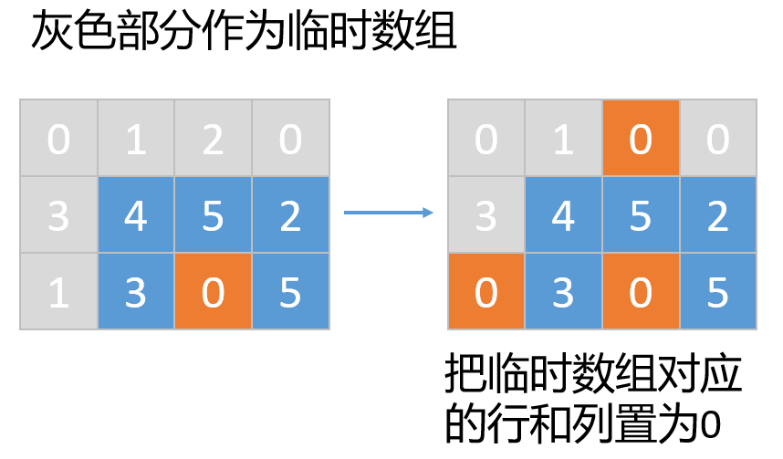
>
> ```java
>  public void setZeroes(int[][] matrix) {
>         //标记第一行是否有数字0
>         boolean row = false;
>         //标记第一列是否有数字0
>         boolean col = false;
>         for (int i = 0; i < matrix.length; i++) {
>             for (int j = 0; j < matrix[0].length; j++) {
>                 if (matrix[i][j] == 0) {
>                     //如果第一行或者第一列本来就有0，就把他标记一
>                     //下，最后再把第一行或者第一列全部置为0
>                     if (i == 0)
>                         row = true;
>                     if (j == 0)
>                         col = true;
>                     //把最上面一行和最左边一列对应的位置标注为0
>                     matrix[0][j] = matrix[i][0] = 0;
>                 }
>             }
>         }
>         //把那些应该为0的行和列全部置为0
>         for (int i = 1; i < matrix.length; i++) {
>             for (int j = 1; j < matrix[0].length; j++) {
>                 if (matrix[i][0] == 0 || matrix[0][j] == 0)
>                     matrix[i][j] = 0;
>             }
>         }
>         //如果第一列本来就有0，把第一列全部变为0
>         if (col) {
>             for (int i = 0; i < matrix.length; i++)
>                 matrix[i][0] = 0;
>         }
>         //如果第一行本来就有0，把第一行全部变为0
>         if (row) {
>             for (int j = 0; j < matrix[0].length; j++)
>                 matrix[0][j] = 0;
>         }
>     }
> ```
>


### 3.字母异位词分组

 给你一个字符串数组，请你将 字母异位词 组合在一起。可以按任意顺序返回结果列表。

字母异位词 是由重新排列源单词的字母得到的一个新单词，所有源单词中的字母通常恰好只用一次。

> 示例 1:
>
> 输入: strs = ["eat", "tea", "tan", "ate", "nat", "bat"]
> 输出: [["bat"],["nat","tan"],["ate","eat","tea"]]
>
> 示例 2:
>
> 输入: strs = [""]
> 输出: [[""]]
>
> 示例 3:
>
> 输入: strs = ["a"]
> 输出: [["a"]]

这道题思路是将字符串数组的每个数进行排序之后，将排序的字符串作为key，来进行归类。

```java
public List<List<String>> groupAnagrams(String[] strs) {
        if(strs.length==1 && strs[0] == ""){
            List<List<String>> list1 = new ArrayList();
            return list1;
        }
         
        //创建一个map
        //将strs中的每一个字符串按照字母Ascii排序，然后放进以排序后结果为key的map中。
        
        //key：将每个字符串排序之后结果；value：乱序的单词集合
        Map<String,List<String>> mapList = new HashMap();

        //遍历strs
        for(String str:strs){
            char[] chs = str.toCharArray();
            Arrays.sort(chs);//进行排序
            String strSort = new String(chs); //涉及到字符数组->字符串转化问题。
            if(mapList.containsKey(strSort)){
                mapList.get(strSort).add(str);
            }else{
                List<String> tempList = new ArrayList();
                tempList.add(str);
                mapList.put(strSort,tempList);
            }
        }

        List<List<String>> returnList = new ArrayList(mapList.values());
        return returnList;
    }
```


### 4.无重复字符的最长子串

给定一个字符串 `s` ，请你找出其中不含有重复字符的 **最长子串** 的长度。

> 示例 1:
>
> 输入: s = "abcabcbb"
> 输出: 3 
> 解释: 因为无重复字符的最长子串是 "abc"，所以其长度为 3。
>
> 示例 2:
>
> 输入: s = "bbbbb"
> 输出: 1
> 解释: 因为无重复字符的最长子串是 "b"，所以其长度为 1。
>
> 示例 3:
>
> 输入: s = "pwwkew"
> 输出: 3
> 解释: 因为无重复字符的最长子串是 "wke"，所以其长度为 3。
>      请注意，你的答案必须是 子串 的长度，"pwke" 是一个子序列，不是子串。

> **解法一：**
>
> 采用双指针，一个数组记录每个字符下标。
>
> **当遇到重复字符的时候，更新左指针和下标。**
> 
>    ```java
>    public int lengthOfLongestSubstring(String s) {
>        int[] index = new int[128];// 记录字符的下标
> 
>        Arrays.fill(index, -1);
>        int res = 0;
>        int left = 0;// 左指针
>    
>        for (int i = 0; i < s.length(); i++) {
>            if (index[s.charAt(i)] == -1) {
>                index[s.charAt(i)] = i;// 记录下标
>            }else{
>                left = Math.max(left, index[s.charAt(i)]+1);//更新左指针
>                index[s.charAt(i)] = i;//更新下标
>            }
>            res = Math.max(res, i - left+1);
>        }
>        return res;
>    }
>    ```
> 
>    
>    
> **解法二：**
>
> 采用bool数组方式记录每一次无重复字串的字母情况
>
> ```java
>public int lengthOfLongestSubstring(String s) {
> 
> //字符不一定全部由字母构成
>     boolean[] seen = new boolean[255];
>      //max：最长子串长度
>        //j：表示不含有重复字符的子串的第一个字符下标
>        int max = 0, j = 0;
>        for (int i = 0; i < s.length(); i++) {
>            int cInt = s.charAt(i);//记录当前字符的ASCII码
>            //当出现了重复的字符，就将j向后推移直到找到第一个重复的字符
>            while (seen[cInt]) {
>                seen[s.charAt(j)] = false;
>                j++;//一直推移到重复位置
>            }
>            //每次访问到一个不同的字符，将其标记为已经访问
>            seen[cInt] = true;
>            max = Math.max(max, i - j + 1);
>        }
>        return max;
>    }
>    
>    ```
>    
>    
> 
> **解法三：**
>
> 使用队列方式，如果出现重复，就出队，保证队列永远不存在重复的字符
>
> ```java
>public int lengthOfLongestSubstring(String s) {
>      //创建队列
>     Queue<Character> queue = new LinkedList<>();
>      int max = 0;
>       for (char c : s.toCharArray()) {
>             while (queue.contains(c)) {
>                 //如果有重复的，队头出队，直到没有重复的为止
>                 queue.poll();
>             }
>             //添加到队尾
>             queue.add(c);
>             //更新max
>             max = Math.max(max, queue.size());
>         }
>         return max;
>     }
>    ```
>    
>    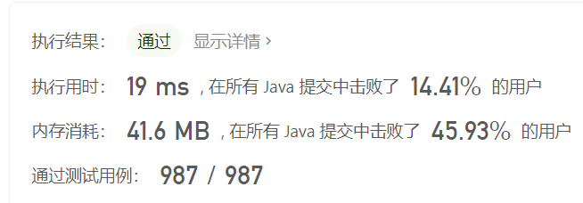


### 5.递增的三元子序列

给你一个整数数组 nums ，判断这个数组中是否存在长度为 3 的递增子序列。

如果存在这样的三元组下标 (i, j, k) 且满足 i < j < k ，使得 nums[i] < nums[j] < nums[k] ，返回 true ；否则，返回 false 。

> 示例 1：
>
> 输入：nums = [1,2,3,4,5]
> 输出：true
> 解释：任何 i < j < k 的三元组都满足题意
> 示例 2：
>
> 输入：nums = [5,4,3,2,1]
> 输出：false
> 解释：不存在满足题意的三元组
> 示例 3：
>
> 输入：nums = [2,1,5,0,4,6]
> 输出：true
> 解释：三元组 (3, 4, 5) 满足题意，因为 nums[3] == 0 < nums[4] == 4 < nums[5] == 6

> **解法一：**
>
> 只需要使用两个变量即可，一个记录扫描过的最小值，一个记录扫描过的第二小的值。他们的初始值都是Integer.MAX_VALUE
>
> 要保证最小值和第二小的值尽可能的小。
>
> 如果当前数字比最小值还小，我们就更新最小值
> 如果当前数字大于最小值并且小于第二小的值，我们就更新第二小的值
> 如果当前数字大于第二小的值，说明找到了递增的三元子序列，直接返回true。
> 这里前两条很好理解，我们主要看一下第三条，因为第二小的值默认是Integer.MAX_VALUE，如果当前数字比他大，说明第二小的值已经被赋值了，第二小的值被赋值的条件是最小值也已经被赋值了，因为如果最小值没有被赋值的话，那么最小值优先被赋值。所以这里有个隐含的条件就是，如果第二小的值被赋值了，那么最小的值肯定存在。
>
> ```java
> public boolean increasingTriplet(int[] nums) {
>         //3个数字，small记录最小的数字
>         int small = Integer.MAX_VALUE;
>         //mid记录中间的数字
>         int mid = Integer.MAX_VALUE;
>         for (int num : nums) {
>             if (num <= small) {
>                 //记录遍历过的最小值
>                 small = num;
>             } else if (num <= mid) {
>                 //记录比small大的最小值，也就是mid的值
>                 mid = num;
>             } else {
>                 //mid如果赋值了，那么之前肯定有个比
>                 //mid小的值，这里又有个比mid大的值，
>                 //所以他们三个可以构成递增的三元子序列
>                 return true;
>             }
>         }
>         return false;
>     }
> ```
>
> 

### **6.有效的数独**

请你判断一个 9 x 9 的数独是否有效。只需要 根据以下规则 ，验证已经填入的数字是否有效即可。

数字 1-9 在每一行只能出现一次。
数字 1-9 在每一列只能出现一次。
数字 1-9 在每一个以粗实线分隔的 3x3 宫内只能出现一次。（请参考示例图）

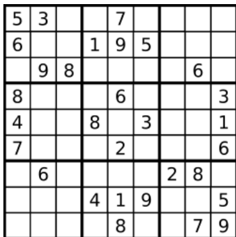

```
输入：board = 
[["5","3",".",".","7",".",".",".","."]
,["6",".",".","1","9","5",".",".","."]
,[".","9","8",".",".",".",".","6","."]
,["8",".",".",".","6",".",".",".","3"]
,["4",".",".","8",".","3",".",".","1"]
,["7",".",".",".","2",".",".",".","6"]
,[".","6",".",".",".",".","2","8","."]
,[".",".",".","4","1","9",".",".","5"]
,[".",".",".",".","8",".",".","7","9"]]
输出：true

输入：board = 
[["8","3",".",".","7",".",".",".","."]
,["6",".",".","1","9","5",".",".","."]
,[".","9","8",".",".",".",".","6","."]
,["8",".",".",".","6",".",".",".","3"]
,["4",".",".","8",".","3",".",".","1"]
,["7",".",".",".","2",".",".",".","6"]
,[".","6",".",".",".",".","2","8","."]
,[".",".",".","4","1","9",".",".","5"]
,[".",".",".",".","8",".",".","7","9"]]
输出：false
解释：除了第一行的第一个数字从 5 改为 8 以外，空格内其他数字均与 示例1 相同。 但由于位于左上角的 3x3 宫内有两个 8 存在, 因此这个数独是无效的。
```


```java
解题思路：
这道题，首先需要用三个二维数组存放每一列，每一行，每一个宫格块已经存在的数，每一次比较都会去判断是否是重复出现的数字，如果三者某一个出现则退出循环。！！难点在于：三行三列宫格的下标计算问题，是一个设计数学的知识
    
  public boolean isValidSudoku(char[][] board) {
        // 记录某行，某位数字是否已经被摆放
        boolean[][] row = new boolean[9][9];
        // 记录某列，某位数字是否已经被摆放
        boolean[][] col = new boolean[9][9];
        // 记录某 3x3 宫格内，某位数字是否已经被摆放
        boolean[][] block = new boolean[9][9];

        for(int i = 0;i<9;i++){
            for(int j = 0;j<9;j++){
                if(board[i][j]!='.'){
                    int num = board[i][j] -'1';//这里是存放对应数字
                    int blockIndex = i /3 * 3 + j / 3;//一共有9个宫格，那么对此进行标号，每一个宫格的计算方法。
                    if(row[i][num] || col[j][num] || block[blockIndex][num]){
                        return false;//出现重复立马退出循环
                    }else{
                        row[i][num] = true;//表明该行数字num+1已经存在
                        col[j][num] = true;
                        block[blockIndex][num] = true;
                    }
                }
            }
        }

        return true;

    }
```

### **7.旋转图像：**

给定一个 n × n 的二维矩阵 matrix 表示一个图像。请你将图像顺时针旋转 90 度。

你必须在 原地 旋转图像，这意味着你需要直接修改输入的二维矩阵。请不要 使用另一个矩阵来旋转图像。

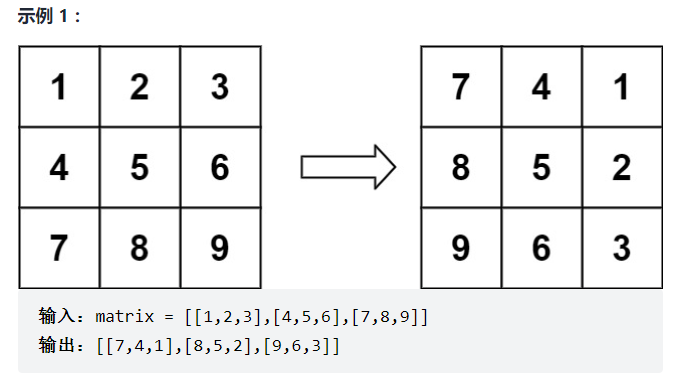

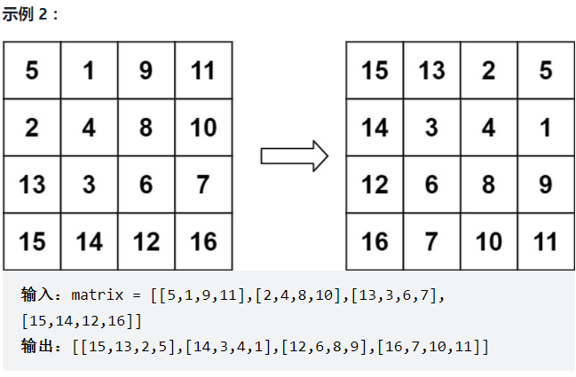

**解题思路：**

将n纬矩形想象成n/2层正方形包裹，然后逐层进行交换

```java
class Solution {
    public void rotate(int[][] matrix) {
        int n = matrix.length;
        for (int i = 0; i < n / 2; ++i) {
            for (int j = 0; j < (n + 1) / 2; ++j) {
                int temp = matrix[i][j];
                matrix[i][j] = matrix[n - j - 1][i];
                matrix[n - j - 1][i] = matrix[n - i - 1][n - j - 1];
                matrix[n - i - 1][n - j - 1] = matrix[j][n - i - 1];
                matrix[j][n - i - 1] = temp;
            }
        }
    }
}
```


### 8.搜索旋转排序数组

整数数组 `nums` 按升序排列，数组中的值 **互不相同** 。

在传递给函数之前，`nums` 在预先未知的某个下标 `k`（`0 <= k < nums.length`）上进行了 **旋转**，使数组变为 `[nums[k], nums[k+1], ..., nums[n-1], nums[0], nums[1], ..., nums[k-1]]`（下标 **从 0 开始** 计数）。例如， `[0,1,2,4,5,6,7]` 在下标 `3` 处经旋转后可能变为 `[4,5,6,7,0,1,2]` 。

给你 **旋转后** 的数组 `nums` 和一个整数 `target` ，如果 `nums` 中存在这个目标值 `target` ，则返回它的下标，否则返回 `-1` 。

你必须设计一个时间复杂度为 `O(log n)` 的算法解决此问题。

**示例 1：**

```
输入：nums = [4,5,6,7,0,1,2], target = 0
输出：4
```

**示例 2：**

```
输入：nums = [4,5,6,7,0,1,2], target = 3
输出：-1
```

**示例 3：**

```
输入：nums = [1], target = 0
输出：-1
```

**解题思路**

这道题要求时间复杂度要小于O(n)，并且是有序数组，所以找到旋转点，旋转点两边也是有序数组，首先二分查找找到旋转点，然后二分查找找到target

```java
class Solution {
public:
    int search(vector<int>& nums, int target) {
        int t = nums[0];
        int l = 0, r = nums.size() - 1;
        while (l <= r) {
            int mid = l + (r - l) / 2;
            if (t > nums[mid]) r = mid - 1;
            else l = mid + 1;
        }

        if (target >= t) l = 0;
        else r = nums.size() - 1;
        while (l <= r) {
            int mid = l + (r - l) / 2;
            if (target > nums[mid]) l = mid + 1;
            else if (target < nums[mid]) r = mid - 1;
            else return mid;
        }
        return -1;
    }
};
```

> 时间复杂度O(2logn) = O(logn)


### 9.复原IP地址

> 2024-4-12 WXG面试

**有效 IP 地址** 正好由四个整数（每个整数位于 `0` 到 `255` 之间组成，且不能含有前导 `0`），整数之间用 `'.'` 分隔。

- 例如：`"0.1.2.201"` 和` "192.168.1.1"` 是 **有效** IP 地址，但是 `"0.011.255.245"`、`"192.168.1.312"` 和 `"192.168@1.1"` 是 **无效** IP 地址。

给定一个只包含数字的字符串 `s` ，用以表示一个 IP 地址，返回所有可能的**有效 IP 地址**，这些地址可以通过在 `s` 中插入 `'.'` 来形成。你 **不能** 重新排序或删除 `s` 中的任何数字。你可以按 **任何** 顺序返回答案。

**示例 1：**

```
输入：s = "25525511135"
输出：["255.255.11.135","255.255.111.35"]
```

**示例 2：**

```
输入：s = "0000"
输出：["0.0.0.0"]
```

**示例 3：**

```
输入：s = "101023"
输出：["1.0.10.23","1.0.102.3","10.1.0.23","10.10.2.3","101.0.2.3"]
```


**解题思路**

由于我们需要找出**所有**可能复原出的 IP 地址，因此可以考虑使用回溯的方法，对所有可能的字符串分隔方式进行搜索，并筛选出满足要求的作为答案。 

设题目中给出的字符串为`s`。用递归函数`dfs（segId，segStart）`表示正在从`s[segStart]`的位置开始，搜索IP地址中的第`segId`段，其中`segId∈{0,1,2,3}`。由于IP地址的每一段必须是[0,255]中的整数，因此从`segStart`开始，从小到大依次枚举当前这一段IP地址的结束位置`segEnd`。如果满足要求，就递归地进行下一段搜索，调用递归函数`dfs（segId+1，segEnd+1）`。

特别地，由于IP地址的每一段不能有前导零，因此如果`s[segStart]`等于字符0，那么IP地址的第`segId`段只能为0，需要作为特殊情况进行考虑。

在搜索的过程中，如果已经得到了全部的4段IP地址（即segId=4），并且遍历完了整个字符串（即segStart=|s，其中|s|表示字符串s的长度），那么就复原出了一种满足题目要求的IP地址，将其加入答案。在其它的时刻，如果提前遍历完了整个字符串，那么需要结束搜索，回溯到上一步。

```java
class Solution {
    static final int SEG_COUNT = 4;
    List<String> ans = new ArrayList<String>();
    int[] segments;// 用来表示第i段（一共四段）

    public List<String> restoreIpAddresses(String s) {
        segments = new int[SEG_COUNT];
        dfs(s, 0, 0);
        return ans;
    }

    public void dfs(String s, int segId, int segStart) {
        // 如果找到了 4 段 IP 地址并且遍历完了字符串，那么就是一种答案
        if (segId == SEG_COUNT) {
            if (segStart == s.length()) {
                StringBuilder sBuilder = new StringBuilder();
                for (int i = 0; i < SEG_COUNT; i++) {
                    sBuilder.append(segments[i]);
                    if (i != SEG_COUNT - 1)
                        sBuilder.append(".");

                }
                ans.add(sBuilder.toString());
            }
            return;
        }

        // 如果已经到头，直接返回
        if (segStart == s.length()) {
            return;
        }

        // 如果为0，那该段只能是0
        if (s.charAt(segStart) == '0') {
            segments[segId] = 0;
            dfs(s, segId + 1, segStart + 1);
            return;
        }

        // 遍历和回溯
        int temp = 0;
        for (int i = segStart; i < s.length(); i++) {
            temp = temp * 10 + (s.charAt(i) - '0');// 拼接地址
            if (temp > 0 && temp <= 0xFF) {
                segments[segId] = temp;
                dfs(s, segId + 1, i + 1);
            } else {
                break;// 回溯
            }
        }
    }
}
```


### 10.下一个排列

> https://leetcode.cn/problems/next-permutation/description/


### 11. [字符串转换整数 (atoi)](https://leetcode.cn/problems/string-to-integer-atoi/) 

请你来实现一个 `myAtoi(string s)` 函数，使其能将字符串转换成一个 32 位有符号整数。

函数 `myAtoi(string s)` 的算法如下：

1. **空格：**读入字符串并丢弃无用的前导空格（`" "`）
2. **符号：**检查下一个字符（假设还未到字符末尾）为 `'-'` 还是 `'+'`。如果两者都不存在，则假定结果为正。
3. **转换：**通过跳过前置零来读取该整数，直到遇到非数字字符或到达字符串的结尾。如果没有读取数字，则结果为0。
4. **舍入：**如果整数数超过 32 位有符号整数范围 `[−231, 231 − 1]` ，需要截断这个整数，使其保持在这个范围内。具体来说，小于 `−231` 的整数应该被舍入为 `−231` ，大于 `231 − 1` 的整数应该被舍入为 `231 − 1` 。

返回整数作为最终结果。


**示例 1：**

**输入：**s = "42"

**输出：**42

**解释：**加粗的字符串为已经读入的字符，插入符号是当前读取的字符。

```
带下划线线的字符是所读的内容，插入符号是当前读入位置。
第 1 步："42"（当前没有读入字符，因为没有前导空格）
         ^
第 2 步："42"（当前没有读入字符，因为这里不存在 '-' 或者 '+'）
         ^
第 3 步："42"（读入 "42"）
           ^
```

**示例 2：**

**输入：**s = " -042"

**输出：**-42

**解释：**

```
第 1 步："   -042"（读入前导空格，但忽视掉）
            ^
第 2 步："   -042"（读入 '-' 字符，所以结果应该是负数）
             ^
第 3 步："   -042"（读入 "042"，在结果中忽略前导零）
               ^
```

**示例 3：**

**输入：**s = "1337c0d3"

**输出：**1337

**解释：**

```
第 1 步："1337c0d3"（当前没有读入字符，因为没有前导空格）
         ^
第 2 步："1337c0d3"（当前没有读入字符，因为这里不存在 '-' 或者 '+'）
         ^
第 3 步："1337c0d3"（读入 "1337"；由于下一个字符不是一个数字，所以读入停止）
             ^
```

**示例 4：**

**输入：**s = "0-1"

**输出：**0

**解释：**

```
第 1 步："0-1" (当前没有读入字符，因为没有前导空格)
         ^
第 2 步："0-1" (当前没有读入字符，因为这里不存在 '-' 或者 '+')
         ^
第 3 步："0-1" (读入 "0"；由于下一个字符不是一个数字，所以读入停止)
          ^
```

**示例 5：**

**输入：**s = "words and 987"

**输出：**0

**解释：**

读取在第一个非数字字符“w”处停止。


**解题思路：**

这道题可以直接用正则表达式来做。

```java
public int myAtoi(String s) {
    String str = s.trim();
    if (str.length() > 0) {
        char c = str.charAt(0);
        String reg = "\\D+";
        String[] strs;
        if (c == '+' || c == '-') {
            str = str.substring(1);
        }
        if ((strs = str.split(reg)).length == 0 || "".equals(strs[0])) return 0;
        try {
            return c == '-' ? -Integer.parseInt(strs[0]) : Integer.parseInt(strs[0]);
        } catch (Exception e) {
            return c == '-' ? Integer.MIN_VALUE : Integer.MAX_VALUE;
        }
    }
    return 0;
}
```


### 12.比较版本号

> https://leetcode.cn/problems/compare-version-numbers/description/


### 13.字符串相乘

> https://blog.csdn.net/afei__/article/details/83891547


### 14.删除有序数组中的重复项ii

> 题目描述：
>
> https://leetcode.cn/problems/remove-duplicates-from-sorted-array-ii/description/

**解题思路**

这道题两种方式：

- 一种是计数的方式，然后快慢指针。
- 另一种就是快慢指针

两种方式其实思路大致一样，只是第一种更好想，我做的第一种，但是做复杂导致没弄出来

```java
//通过计数的方式
class Solution {
    public int removeDuplicates(int[] nums) {
        int left=0,right=0,n=nums.length;
        int preNum = nums[0],cnt=0;
        while(right<n){
            if(nums[right]==preNum){
                cnt++;
                if(cnt>2){
                    right++;
                    continue;
                }
            }else{
                preNum = nums[right];
                cnt=1;
            }
            nums[left++]=nums[right++];
        }
        return left;
    }
}
```

```java
//快慢指针方式，官方题解
class Solution {
    public int removeDuplicates(int[] nums) {
        int n = nums.length;
        if (n <= 2) {
            return n;
        }
        int slow = 2, fast = 2;
        while (fast < n) {
            if (nums[slow - 2] != nums[fast]) {
                nums[slow] = nums[fast];
                ++slow;
            }
            ++fast;
        }
        return slow;
    }
}
```


## 二、链表

### 总结：

- **快慢指针**：①如果要找到倒数第i个链表的节点。（例如找到中间节点）；②环形链表
- 链表排序使用归并最佳


### 1.奇偶链表

给定单链表的头节点 head ，将所有`索引为奇数的节点`和`索引为偶数的节点`分别组合在一起，然后返回重新排序的列表。

第一个节点的索引被认为是奇数 ， 第二个节点的索引为 偶数 ，以此类推。

请注意，偶数组和奇数组内部的相对顺序应该与输入时保持一致。

你必须在 O(1) 的额外空间复杂度和 O(n) 的时间复杂度下解决这个问题。


> 示例 1:
>
> 
>
> 输入: head = [1,2,3,4,5]
> 输出: [1,3,5,2,4]
>
> 示例 2:
>
> 
>
> 输入: head = [2,1,3,5,6,4,7]
> 输出: [2,3,6,7,1,5,4]
>
> 

> **解法：**
>
> 这道题就是将索引为奇数的串一块，后面接索引为偶数的串
>
> ```java
> public ListNode oddEvenList(ListNode head) {
>         /*
>         1.奇数和偶数都分别创建头指针、移动指针
>         2.分别移动奇偶指针进行串接
>         3.最后拼接奇偶两个链表
>          */
> 
>          if (head == null || head.next == null)
>             return head;
> 
>         ListNode linkedEven = head.next;//偶数头指针
>         ListNode linkedEvenMove = linkedEven;//偶数移动指针
> 
>         ListNode linkedOdd = head;//奇数头指针
>         ListNode linkedOddMove = head;//计数移动指针
>         while(linkedEvenMove!=null && linkedEvenMove.next!=null){//因为偶数指针总是走在前面，所以只需要判断偶数指针即可
>             
>             linkedOddMove.next = linkedOddMove.next.next;//奇数指针拼接
> 
>             linkedEvenMove.next = linkedEvenMove.next.next;//偶数指针拼接
> 
>             //奇偶指针后移
>             linkedEvenMove = linkedEvenMove.next;
>             linkedOddMove = linkedOddMove.next;
>             
>          }
> 
>          linkedOddMove.next = linkedEven;//奇偶链表拼接
> 
>          return linkedOdd;
>     }
> ```
>
> 


### 2.相交链表

给你两个单链表的头节点 headA 和 headB ，请你找出并返回两个单链表相交的起始节点。如果两个链表不存在相交节点，返回 null 。

图示两个链表在节点 c1 开始相交：


> 示例 1：
>
> 
>
> 输入：intersectVal = 8, listA = [4,1,8,4,5], listB = [5,6,1,8,4,5], skipA = 2, skipB = 3
> 输出：Intersected at '8'
>
> 解释：相交节点的值为 8 （注意，如果两个链表相交则不能为 0）。
> 从各自的表头开始算起，链表 A 为 [4,1,8,4,5]，链表 B 为 [5,6,1,8,4,5]。
> 在 A 中，相交节点前有 2 个节点；在 B 中，相交节点前有 3 个节点。
> — 请注意相交节点的值不为 1，因为在链表 A 和链表 B 之中值为 1 的节点 (A 中第二个节点和 B 中第三个节点) 是不同的节点。换句话说，它们在内存中指向两个不同的位置，而链表 A 和链表 B 中值为 8 的节点 (A 中第三个节点，B 中第四个节点) 在内存中指向相同的位置。
>
>
> 示例 2：
>
> 
>
> 输入：intersectVal = 2, listA = [1,9,1,2,4], listB = [3,2,4], skipA = 3, skipB = 1
> 输出：Intersected at '2'
> 解释：相交节点的值为 2 （注意，如果两个链表相交则不能为 0）。
> 从各自的表头开始算起，链表 A 为 [1,9,1,2,4]，链表 B 为 [3,2,4]。
> 在 A 中，相交节点前有 3 个节点；在 B 中，相交节点前有 1 个节点。
>
> 示例 3：
>
> 
>
> 输入：intersectVal = 0, listA = [2,6,4], listB = [1,5], skipA = 3, skipB = 2
> 输出：null
> 解释：从各自的表头开始算起，链表 A 为 [2,6,4]，链表 B 为 [1,5]。
> 由于这两个链表不相交，所以 intersectVal 必须为 0，而 skipA 和 skipB 可以是任意值。
> 这两个链表不相交，因此返回 null 。
>

> **解法一：**
>
> ```java
> public ListNode getIntersectionNode(ListNode headA, ListNode headB) {
>         /**
>         方法一：set
>         先把某一个链表每个节点存入set，然后再依次判断链表2节点是否在set中
>          */
>         //创建集合set
>         Set<ListNode> set = new HashSet<>();
>         //先把链表A的结点全部存放到集合set中
>         while (headA != null) {
>             set.add(headA);
>             headA = headA.next;
>         }
> 
>         //然后访问链表B的结点，判断集合中是否包含链表B的结点，如果包含就直接返回
>         while (headB != null) {
>             if (set.contains(headB))
>                 return headB;
>             headB = headB.next;
>         }
>         //如果集合set不包含链表B的任何一个结点，说明他们没有交点，直接返回null
>         return null;
> 
>     }
> ```
>
> 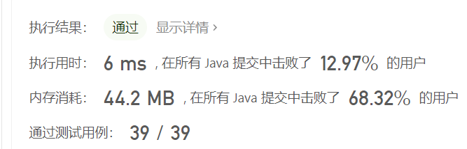
>
> 
>
> **解法二：**
>
> 统计两个链表的长度
> 还可以先统计两个链表的长度，如果两个链表的长度不一样，就让链表长的先走，直到两个链表长度一样，这个时候两个链表再同时每次往后移一步，看节点是否一样，如果有相等的，说明这个相等的节点就是两链表的交点，否则如果走完了还没有找到相等的节点，说明他们没有交点，直接返回null即可，来画个图看一下。
>
> 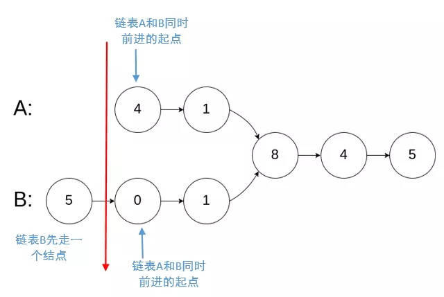
>
> ```java
> public ListNode getIntersectionNode(ListNode headA, ListNode headB) {
>     //统计链表A和链表B的长度
>     int lenA = length(headA), lenB = length(headB);
> 
>     //如果节点长度不一样，节点多的先走，直到他们的长度一样为止
>     while (lenA != lenB) {
>         if (lenA > lenB) {
>             //如果链表A长，那么链表A先走
>             headA = headA.next;
>             lenA--;
>         } else {
>             //如果链表B长，那么链表B先走
>             headB = headB.next;
>             lenB--;
>         }
>     }
> 
>     //然后开始比较，如果他俩不相等就一直往下走
>     while (headA != headB) {
>         headA = headA.next;
>         headB = headB.next;
>     }
>     //走到最后，最终会有两种可能，一种是headA为空，
>     //也就是说他们俩不相交。还有一种可能就是headA
>     //不为空，也就是说headA就是他们的交点
>     return headA;
> }
> 
> //统计链表的长度
> private int length(ListNode node) {
>     int length = 0;
>     while (node != null) {
>         node = node.next;
>         length++;
>     }
>     return length;
> }
> ```
>
> 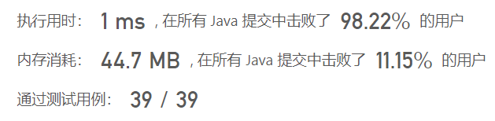
>
> **解法三：**
>
> 可以使用两个指针，最开始的时候一个指向链表A，一个指向链表B，然后他们每次都要往后移动一位，顺便查看节点是否相等。如果链表A和链表B不相交，基本上没啥可说的，我们这里假设链表A和链表B相交。那么就会有两种情况：
>
> - A、B链表长度相同
>
> - A、B链表长度不同
>
>   > 
>   >
>   > 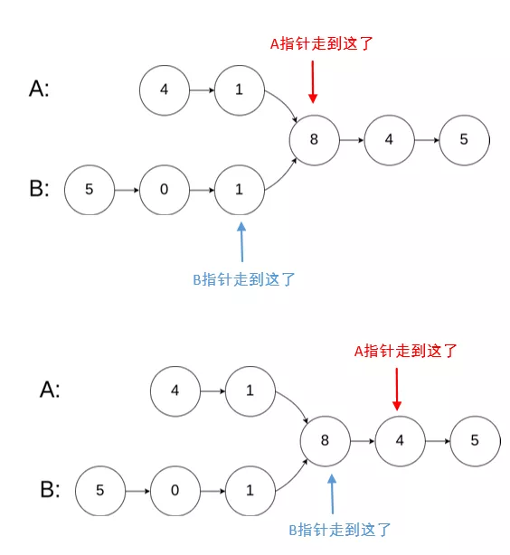
>   >
>   > 仔细看下上面的图，**如果A指针把链表A走完了，然后再从链表B开始走到相遇点就相当于把这两个链表的所有节点都走了一遍**。所以如果A指针走到链表末尾，下一步就让他从链表B开始。同理如果B指针走到链表末尾，下一步就让他从链表A开始。只要这两个链表相交最终肯定会在相交点相遇，如果不相交，最终他们都会同时走到两个链表的末尾
>   >
>   > 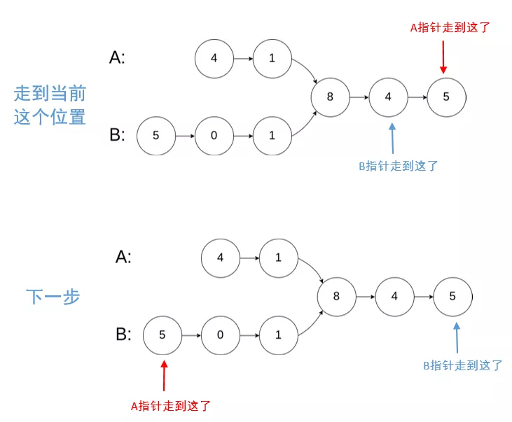
>   >
>   > 
>   >
>   > 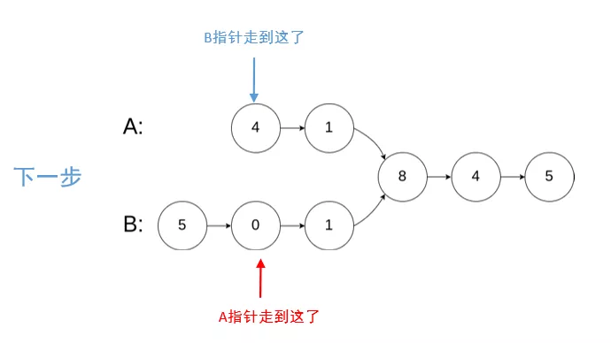
>
> ```java
> public ListNode getIntersectionNode(ListNode headA, ListNode headB) {
>        //tempA和tempB我们可以认为是A,B两个指针
>        ListNode tempA = headA;
>        ListNode tempB = headB;
>        while (tempA != tempB) {
>            //如果指针tempA不为空，tempA就往后移一步。
>            //如果指针tempA为空，就让指针tempA指向headB（注意这里是headB不是tempB）
>            tempA = tempA == null ? headB : tempA.next;
>            //指针tempB同上
>            tempB = tempB == null ? headA : tempB.next;
>        }
>        //tempA要么是空，要么是两链表的交点
>        return tempA;
> }
> ```
>

### 3.环形链表

给你一个链表的头节点 `head` ，判断链表中是否有环。

如果链表中有某个节点，可以通过连续跟踪 `next` 指针再次到达，则链表中存在环。 为了表示给定链表中的环，评测系统内部使用整数 `pos` 来表示链表尾连接到链表中的位置（索引从 0 开始）。**注意：`pos` 不作为参数进行传递** 。仅仅是为了标识链表的实际情况。

*如果链表中存在环* ，则返回 `true` 。 否则，返回 `false` 。

> **示例 1：**
>
> 
>
> ```
> 输入：head = [3,2,0,-4], pos = 1
> 输出：true
> 解释：链表中有一个环，其尾部连接到第二个节点。
> ```

**解题思路：**

这道题用快慢指针做是最容易的，一个快指针每次走两步，一个慢指针每次走一步，如果存在环，那快指针必定会追上慢指针

```java
/**
 * Definition for singly-linked list.
 * class ListNode {
 *     int val;
 *     ListNode next;
 *     ListNode(int x) {
 *         val = x;
 *         next = null;
 *     }
 * }
 */
public class Solution {
    //快慢指针
    //无环终究会出现null，由环快指针会追上慢指针
    public boolean hasCycle(ListNode head) {
        if(head ==null)return false;

        ListNode fast = head;
        ListNode slow = head;

        while(fast!=null && fast.next!=null){
            slow = slow.next;
            fast = fast.next.next;

            if(slow==fast)return true;
        }

        return false;

    }
}
```


### 4.环形链表2

> 参考——https://www.cnblogs.com/lonely-wolf/p/15773656.html

给定一个链表的头节点  `head` ，返回链表开始入环的第一个节点。 *如果链表无环，则返回 `null`。*

如果链表中有某个节点，可以通过连续跟踪 `next` 指针再次到达，则链表中存在环。 为了表示给定链表中的环，评测系统内部使用整数 `pos` 来表示链表尾连接到链表中的位置（**索引从 0 开始**）。如果 `pos` 是 `-1`，则在该链表中没有环。**注意：`pos` 不作为参数进行传递**，仅仅是为了标识链表的实际情况。

**不允许修改** 链表。


**解题思路：**

如果 `slow` 和 `fast` 相遇了，那么这时候我们**再定义一个指针指向链表起点，一次走一步，`slow` 指针也同步继续往后走，那么这两个指针就一定会在链表的入口位置相遇**。 

> 原因参考上面的参考文章

```java
public static ListNode findCyclePosition(ListNode head){
    if (null == head || null == head.next){
        return null;
    }
    ListNode slow = head;
    ListNode fast = head;
    while (null != fast && null != fast.next){
        slow = slow.next;
        fast = fast.next.next;
        if (slow == fast){//快慢指针相遇时
            ListNode ptr = head;//定义一个新指针
            while (ptr != slow){
                ptr = ptr.next;
                slow = slow.next;
            }
            return ptr;//返回环的入口位置
        }
    }
    return null;
}
```


### 5.LRU缓存

请你设计并实现一个满足 [LRU (最近最少使用) 缓存](https://baike.baidu.com/item/LRU) 约束的数据结构。

实现 `LRUCache` 类：

- `LRUCache(int capacity)` 以 **正整数** 作为容量 `capacity` 初始化 LRU 缓存
- `int get(int key)` 如果关键字 `key` 存在于缓存中，则返回关键字的值，否则返回 `-1` 。
- `void put(int key, int value)` 如果关键字 `key` 已经存在，则变更其数据值 `value` ；如果不存在，则向缓存中插入该组 `key-value` 。如果插入操作导致关键字数量超过 `capacity` ，则应该 **逐出** 最久未使用的关键字。

函数 `get` 和 `put` 必须以 `O(1)` 的平均时间复杂度运行。

> ```
> 输入
> ["LRUCache", "put", "put", "get", "put", "get", "put", "get", "get", "get"]
> [[2], [1, 1], [2, 2], [1], [3, 3], [2], [4, 4], [1], [3], [4]]
> 输出
> [null, null, null, 1, null, -1, null, -1, 3, 4]
> 
> 解释
> LRUCache lRUCache = new LRUCache(2);
> lRUCache.put(1, 1); // 缓存是 {1=1}
> lRUCache.put(2, 2); // 缓存是 {1=1, 2=2}
> lRUCache.get(1);    // 返回 1
> lRUCache.put(3, 3); // 该操作会使得关键字 2 作废，缓存是 {1=1, 3=3}
> lRUCache.get(2);    // 返回 -1 (未找到)
> lRUCache.put(4, 4); // 该操作会使得关键字 1 作废，缓存是 {4=4, 3=3}
> lRUCache.get(1);    // 返回 -1 (未找到)
> lRUCache.get(3);    // 返回 3
> lRUCache.get(4);    // 返回 4
> ```

**解题思路**

①这道题需要用到一个hash表和双向链表，如果不自己实现，那么可以使用JAVA中已经封装好的类`LinkedHashMap`:

```java
class LRUCache extends LinkedHashMap<Integer, Integer>{
    private int capacity;
    
    public LRUCache(int capacity) {
        super(capacity, 0.75F, true);
        this.capacity = capacity;
    }

    public int get(int key) {
        return super.getOrDefault(key, -1);
    }

    public void put(int key, int value) {
        super.put(key, value);
    }

    @Override
    protected boolean removeEldestEntry(Map.Entry<Integer, Integer> eldest) {
        return size() > capacity; 
    }
}
```


**②哈希表+双向链表**

> 参考——https://leetcode.cn/problems/OrIXps/solutions/1398888/zui-jin-zui-shao-shi-yong-huan-cun-by-le-p3c2/

算法

LRU 缓存机制可以通过哈希表辅以双向链表实现

**用一个哈希表和一个双向链表维护所有在缓存中的键值对。**

- 双向链表按照被使用的顺序存储了这些键值对，靠近头部的键值对是最近使用的，而靠近尾部的键值对是最久未使用的。

- 哈希表即为普通的哈希映射（HashMap），通过缓存数据的键映射到其在双向链表中的位置。

首先使用哈希表进行定位，找出缓存项在双向链表中的位置，随后将其移动到双向链表的头部，即可在 O(1)的时间内完成 get 或者 put 操作。具体的方法如下：

对于 get 操作，首先判断 key 是否存在：

- 如果 key 不存在，则返回 −1；

- 如果 key 存在，则 key 对应的节点是最近被使用的节点。通过哈希表定位到该节点在双向链表中的位置，并将其移动到双向链表的头部，最后返回该节点的值。

对于 put 操作，首先判断 key 是否存在：

- 如果 key 不存在，使用 key 和 value 创建一个新的节点，在双向链表的头部添加该节点，并将 key 和该节点添加进哈希表中。然后判断双向链表的节点数是否超出容量，如果超出容量，则删除双向链表的尾部节点，并删除哈希表中对应的项；

- 如果 key 存在，则与 get 操作类似，先通过哈希表定位，再将对应的节点的值更新为 value，并将该节点移到双向链表的头部。

上述各项操作中，访问哈希表的时间复杂度为 O(1)，在双向链表的头部添加节点、在双向链表的尾部删除节点的复杂度也为 O(1)。而将一个节点移到双向链表的头部，可以分成「删除该节点」和「在双向链表的头部添加节点」两步操作，都可以在 O(1) 时间内完成。

> 在双向链表的实现中，使用一个伪头部（dummy head）和伪尾部（dummy tail）标记界限，这样在添加节点和删除节点的时候就不需要检查相邻的节点是否存在。
>

 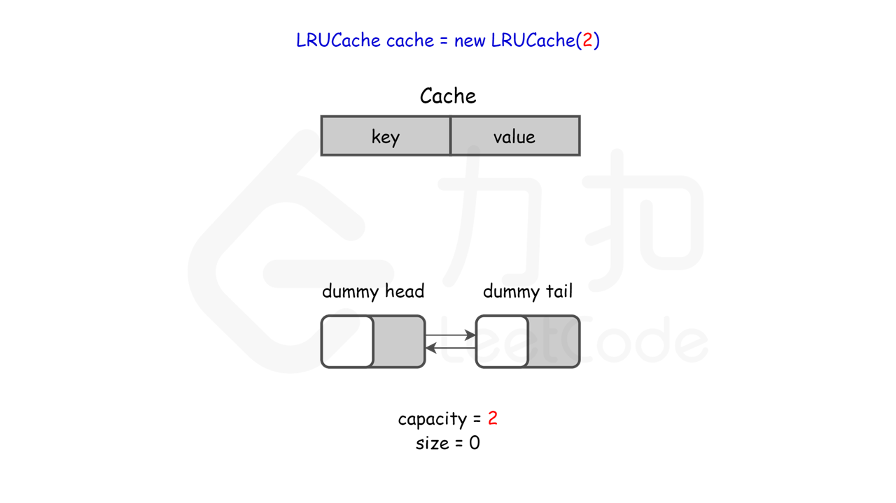 

```java
public class LRUCache {
    class DLinkedNode {//定义节点
        int key;
        int value;
        DLinkedNode prev;
        DLinkedNode next;
        public DLinkedNode() {}
        public DLinkedNode(int _key, int _value) {key = _key; value = _value;}
    }

    //存放key对应的值在链表中的节点
    private Map<Integer, DLinkedNode> cache = new HashMap<Integer, DLinkedNode>();
    private int size;//大小
    private int capacity;//容量
    private DLinkedNode head, tail;

    public LRUCache(int capacity) {
        this.size = 0;
        this.capacity = capacity;
        // 使用伪头部和伪尾部节点
        head = new DLinkedNode();
        tail = new DLinkedNode();
        head.next = tail;
        tail.prev = head;
    }

    public int get(int key) {
        //先通过哈希表定位
        DLinkedNode node = cache.get(key);
        if (node == null) {
            return -1;
        }
        // 如果 key 存在，再移到头部
        moveToHead(node);
        return node.value;
    }

    public void put(int key, int value) {
        DLinkedNode node = cache.get(key);
        if (node == null) {
            // 如果 key 不存在，创建一个新的节点
            DLinkedNode newNode = new DLinkedNode(key, value);
            // 添加进哈希表
            cache.put(key, newNode);
            // 添加至双向链表的头部
            addToHead(newNode);
            ++size;
            if (size > capacity) {
                // 如果超出容量，删除双向链表的尾部节点
                DLinkedNode tail = removeTail();
                // 删除哈希表中对应的项
                cache.remove(tail.key);
                --size;
            }
        }
        else {
            // 如果 key 存在，先通过哈希表定位，再修改 value，并移到头部
            node.value = value;
            moveToHead(node);
        }
    }

    private void addToHead(DLinkedNode node) {
        node.prev = head;
        node.next = head.next;
        head.next.prev = node;
        head.next = node;
    }

    private void removeNode(DLinkedNode node) {
        node.prev.next = node.next;
        node.next.prev = node.prev;
    }

    private void moveToHead(DLinkedNode node) {
        removeNode(node);
        addToHead(node);
    }

    private DLinkedNode removeTail() {
        DLinkedNode res = tail.prev;
        removeNode(res);
        return res;
    }
}
```

> **着重注意的情况：**
>
> - 删除结点要同步删除hashmap中的结点
> - 如果出现重复key，在链表中直接移动到链表头，而不要重复添加
> - key和val可能不同，因此每个结点要分别记录key和val


### 6.反转链表II

给你单链表的头指针 `head` 和两个整数 `left` 和 `right` ，其中 `left <= right` 。请你反转从位置 `left` 到位置 `right` 的链表节点，返回 **反转后的链表** 。 

  

```
输入：head = [1,2,3,4,5], left = 2, right = 4
输出：[1,4,3,2,5]
```


**解题思路：**

> **首先找到要反转的部分，然后截断翻转部分，进行翻转：**
>
> > 翻转采取头插法
>
> ```java
> class Solution {
>     public ListNode reverseBetween(ListNode head, int left, int right) {
>         // 因为头节点有可能发生变化，使用虚拟头节点可以避免复杂的分类讨论
>         ListNode dummyNode = new ListNode(-1);
>         dummyNode.next = head;
> 
>         ListNode pre = dummyNode;
>         // 第 1 步：从虚拟头节点走 left - 1 步，来到 left 节点的前一个节点
>         // 建议写在 for 循环里，语义清晰
>         for (int i = 0; i < left - 1; i++) {
>             pre = pre.next;
>         }
> 
>         // 第 2 步：从 pre 再走 right - left + 1 步，来到 right 节点
>         ListNode rightNode = pre;
>         for (int i = 0; i < right - left + 1; i++) {
>             rightNode = rightNode.next;
>         }
> 
>         // 第 3 步：切断出一个子链表（截取链表）
>         ListNode leftNode = pre.next;
>         ListNode curr = rightNode.next;
> 
>         // 注意：切断链接
>         pre.next = null;
>         rightNode.next = null;
> 
>         // 第 4 步：同第 206 题，反转链表的子区间
>         reverseLinkedList(leftNode);
> 
>         // 第 5 步：接回到原来的链表中
>         pre.next = rightNode;
>         leftNode.next = curr;
>         return dummyNode.next;
>     }
> 
>     private void reverseLinkedList(ListNode head) {
>         // 通过头插法反转一个链表
>         ListNode pre = null;
>         ListNode cur = head;
> 
>         while (cur != null) {
>             ListNode next = cur.next;
>             cur.next = pre;
>             pre = cur;
>             cur = next;
>         }
>     }
> }
> ```

> **②上面方法使得要先找反转区间，所以如果区间包含整个链表，那么会躲遍历一次**
>
> 因此可以边遍历，边头插
>
>   
>
> ```java
> class Solution {
>     public ListNode reverseBetween(ListNode head, int left, int right) {
>         // 设置 dummyNode 是这一类问题的一般做法
>         ListNode dummyNode = new ListNode(-1);
>         dummyNode.next = head;
>         ListNode pre = dummyNode;
>         for (int i = 0; i < left - 1; i++) {
>             pre = pre.next;
>         }
>         ListNode cur = pre.next;
>         ListNode next;
>         for (int i = 0; i < right - left; i++) {
>             next = cur.next;
>             cur.next = next.next;
>             next.next = pre.next;
>             pre.next = next;
>         }
>         return dummyNode.next;
>     }
> }
> ```
>
> > 链接：https://leetcode.cn/problems/reverse-linked-list-ii/solutions/634701/fan-zhuan-lian-biao-ii-by-leetcode-solut-teyq/


### 7.重排链表

给定一个单链表 `L` 的头节点 `head` ，单链表 `L` 表示为：

```
L0 → L1 → … → Ln - 1 → Ln
```

请将其重新排列后变为：

```
L0 → Ln → L1 → Ln - 1 → L2 → Ln - 2 → …
```

不能只是单纯的改变节点内部的值，而是需要实际的进行节点交换。


**示例 1：**


```
输入：head = [1,2,3,4]
输出：[1,4,2,3]
```


**解题思路：**

这道题采用的是**链表反转+链表合并**

- 链表反转：因为要和末尾结点交叉插入，所以需要反转链表
- 链表合并：当反转链表之后，需要合并两个链表

> **题目要求在源链表上操作**
>
> 最开始想要重新创建一个链表，然后把引用对象赋给head，但是行不通，可能和方法栈有关

```java
public static void reorderList(ListNode head) {
    ListNode l = head, r = head, cur = new ListNode(r.val), pre = null;
    int count = 0;// 计数

    while (r != null) {
        // 头插法反转链表，只不过新创建一个链表
        cur = new ListNode(r.val);
        cur.next = pre;
        pre = cur;

        // r指针后移
        r = r.next;
        count++;
    }


    // cur指向反向链表的链表头
    // l指向正向链表的链表头
    int index = 1;
    pre = null;

    ListNode LA;
    ListNode LB;
    while (index <= (count) / 2) {
        // 在源链表基础上更改
        //蛇形方式合并
        LA = l.next;
        LB = cur.next;

        l.next = cur;
        l = LA;

        cur.next = l;
        pre = cur;
        cur = LB;

        index++;
    }

    if(count % 2 ==0){
        //偶数，重复合并了一项
        pre.next = null;
    }else{
        l.next = null;
    }
}
```

> 时间复杂度：反转链表遍历`n`次，合并`2/n`，所以`O(n+n/2) = O(n)`


### 8.排序链表

> https://leetcode.cn/problems/sort-list/description/


### 9.两数相加


## 三、树、图

### 1.二叉树的中序遍历

给定一个二叉树的根节点 `root` ，返回 *它的 **中序** 遍历* 。

> 示例 1：
>
> 
>
> 输入：root = [1,null,2,3]
> 输出：[1,3,2]
>
> 示例 2：
>
> 输入：root = []
> 输出：[]
>
> 示例 3：
>
> 输入：root = [1]
> 输出：[1]
>
> 

> **解法一：递归**
>
> 树的中序遍历就是先遍历左子树，然后中间节点，最后右子树。
>
> ```java
> class Solution {
>     List<Integer> list = new ArrayList();
>     public List<Integer> inorderTraversal(TreeNode root) {
> 
>         if(root==null)
>             return new ArrayList();
>         
>         inorderTraversal(root.left);
>         list.add(root.val);
>         inorderTraversal(root.right);
> 
>         return list;
>     }
> }
> ```
>
> 
>
> **解法二：迭代遍历**
>
> ```java
> public List<Integer> inorderTraversal(TreeNode root) {
>     if (root == null) {
>         return new ArrayList<>();
>     }
>     List<Integer> list = new ArrayList<>();
>     Stack<TreeNode> stack = new Stack<>();
>     while (root != null || !stack.isEmpty()) {
>         while (root != null) {
>             stack.push(root);
>             root = root.left;
>         }
>         if (!stack.isEmpty()) {
>             TreeNode node = stack.pop();
>             list.add(node.val);
>             root = node.right;
>         }
>     }
>     return list;
> }
> ```
>
> 


### 2.二叉树的层序遍历

给你二叉树的根节点 `root` ，返回其节点值的 **层序遍历** 。 （即逐层地，从左到右访问所有节点）。 

**示例 1：**


```
输入：root = [3,9,20,null,null,15,7]
输出：[[3],[9,20],[15,7]]
```

**示例 2：**

```
输入：root = [1]
输出：[[1]]
```

**示例 3：**

```
输入：root = []
输出：[]
```


**解题思路**

用队列比较容易，但是题意要求没一层单独用一个集合表示，所以需要多一个循环来判断每一层的个数

```java
public List<List<Integer>> levelOrder(TreeNode root) {
    if(root == null)
        return new ArrayList<>();

    Queue<TreeNode> queue = new LinkedList<>();
    List<List<Integer>> resBFS = new ArrayList<>();
    queue.offer(root);
    // 循环条件应该是queue是不为空
    while (!queue.isEmpty()) {

        List<Integer> everyLayer = new ArrayList<>();
        int layerSize = queue.size();
        for (int i = 0; i < layerSize; i++) {
            TreeNode parentNode = queue.poll();// 出队头
            everyLayer.add(parentNode.val);// 父节点的值

            TreeNode lefNode;
            if (parentNode.left != null) {// 左儿子不为空，则左儿子入队
                lefNode = parentNode.left;
                queue.offer(lefNode);
            }
            TreeNode rightNode;
            if (parentNode.right != null) {// 右儿子不为空，则右儿子入队
                rightNode = parentNode.right;
                queue.offer(rightNode);
            }
        }
        resBFS.add(everyLayer);
    }
    return resBFS;
}
```

> 时间复杂度：应该是O(n)，遍历了一次二叉树


#### 二叉树的锯齿形层次遍历

给你二叉树的根节点 `root` ，返回其节点值的 **锯齿形层序遍历** 。（即先从左往右，再从右往左进行下一层遍历，以此类推，层与层之间交替进行）。

> 示例 1：
>
> 
>
> 输入：root = [3,9,20,null,null,15,7]
> 输出：[[3],[20,9],[15,7]]
> 示例 2：
>
> 输入：root = [1]
> 输出：[[1]]
> 示例 3：
>
> 输入：root = []
> 输出：[]

> **解法一：**
>
> 这道题其实是考察BFS（广度优先搜索），只不过加了条件，横向搜索的方向会变化。所以需要记录每一层节点数目，然后对应层进行变换方向。
>
> ```java
> /*
> 	1.用到广度优先搜索（BFS）
>     2.使用队列来进行遍历
>     3.记录每一层节点个数，以便存储
>     4.通过一个reverse变量，来进行翻转
>  */
> public List<List<Integer>> zigzagLevelOrder(TreeNode root) {
>     if(root==null)
>         return new ArrayList();
> 
> 
>     List<List<Integer>> list = new ArrayList();
>     Map<Integer,Integer> map = new HashMap();//记录每一层的节点数量
>     map.put(1,1);//第一层一个节点
> 
>     boolean reverse = false;//是否反方向;
>     Queue<TreeNode> que = new LinkedList();//用来遍历
>     que.add(root);
> 
>     int countLay = 1;//记录层数
>     while(!que.isEmpty()){
>         int nodeNextCount = 0;//记录下一层节点数目
>         int nodeCount = map.get(countLay);//取出本层节点数目
>         countLay++;//层数加一，准备记录下一层节点数目
>         List<Integer> listTemp = new ArrayList();//每一层的节点
>         while(nodeCount >0){
>             TreeNode node = que.poll();//出队列
>             listTemp.add(node.val);
>    
>          TreeNode nodeLeft = node.left;
>             if(nodeLeft!=null){
>                 que.add(nodeLeft);
>                 nodeNextCount++;
>             }
>    
>          TreeNode nodeRight = node.right;
>             if(nodeRight!=null){
>                 que.add(nodeRight);
>                 nodeNextCount++;
>             }
>    
>          nodeCount--;//取出了一个节点，本层待取出节点数目-1
>         }
>    
>      map.put(countLay,nodeNextCount);//放入下一层节点数目
>    
>      if(reverse){
>             Collections.reverse(listTemp);//如果reverse为false就需要翻转
>         }
>         list.add(listTemp);
>    
>      reverse = !reverse;
>     }
>    
>  return list;
>    }
> ```
> 
>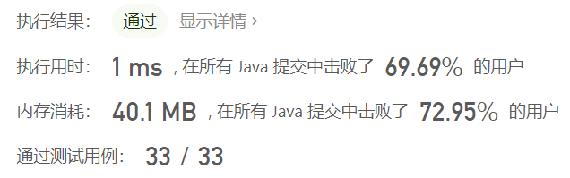
> 
>**解法二：递归**
> 
>```java
> class Solution {
>      public List<List<Integer>> zigzagLevelOrder(TreeNode root) {
>            List<List<Integer>> res = new ArrayList<>();
>            traverse(root,0,res);
>            return res;
>        }
>    
>      private void traverse(TreeNode root, int depth, List<List<Integer>> res){
>            if(root == null) return ;
>            if(depth>= res.size()){
>                res.add(new ArrayList<Integer>());
>            }
>            if(depth%2==0){
>                res.get(depth).add(root.val);
>            }else{
>                res.get(depth).add(0,root.val);
>            }
>            traverse(root.left,depth+1,res);
>            traverse(root.right,depth+1,res);
>        }
>    }
> ```
> 
>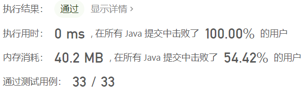


### 3.从前序与中序遍历序列构造二叉树

给定两个整数数组 preorder 和 inorder ，其中 preorder 是二叉树的先序遍历， inorder 是同一棵树的中序遍历，请构造二叉树并返回其根节点。

> 示例 1:
>
> 
>
> 输入: preorder = [3,9,20,15,7], inorder = [9,3,15,20,7]
> 输出: [3,9,20,null,null,15,7]
>
> 示例 2:
>
> 输入: preorder = [-1], inorder = [-1]
> 输出: [-1]
>
> > 1 <= preorder.length <= 3000
> > inorder.length == preorder.length
> > -3000 <= preorder[i], inorder[i] <= 3000
> > preorder 和 inorder 均 无重复 元素
> > inorder 均出现在 preorder
> > preorder 保证 为二叉树的前序遍历序列
> > inorder 保证 为二叉树的中序遍历序列


> **解法一：递归**
>
> 因为中序遍历是先遍历左子树，在遍历根节点，最后遍历右子树。
>
> 而前序遍历是先根，所以通过前序遍历找到根，然后在中序遍历中找到根节点，其左边的数为左子树，右边的数字为右子树，以此递归
>
> 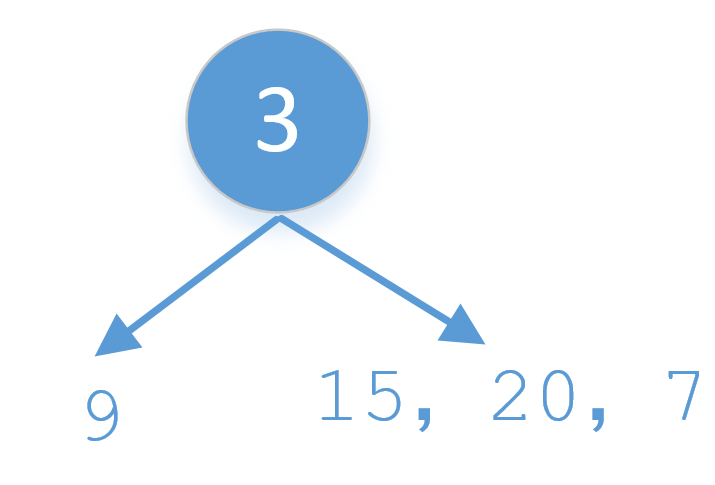
>
> ```java
> public TreeNode buildTree(int[] preorder, int[] inorder) {
>      //把前序遍历的值和中序遍历的值放到list中
>      List<Integer> preorderList = new ArrayList<>();
>      List<Integer> inorderList = new ArrayList<>();
>      for (int i = 0; i < preorder.length; i++) {
>            preorderList.add(preorder[i]);
>            inorderList.add(inorder[i]);
>      }
>      return helper(preorderList, inorderList);
> }
> 
> private TreeNode helper(List<Integer> preorderList, List<Integer> inorderList) {
>      if (inorderList.size() == 0)
>            return null;
>      //前序遍历的第一个值就是根节点
>      int rootVal = preorderList.remove(0);
>      //创建跟结点
>      TreeNode root = new TreeNode(rootVal);
>      //查看根节点在中序遍历中的位置，然后再把中序遍历的数组劈两半，前面部分是
>      //根节点左子树的所有值，后面部分是根节点右子树的所有值
>      int mid = inorderList.indexOf(rootVal);
>      //[0，mid)是左子树的所有值，inorderList.subList(0, mid)表示截取inorderList
>      //的值，截取的范围是[0，mid)，包含0不包含mid。
>      root.left = helper(preorderList, inorderList.subList(0, mid));
>      //[mid+1，inorderList.size())是右子树的所有值，
>      // inorderList.subList(mid + 1, inorderList.size())表示截取inorderList
>      //的值，截取的范围是[mid+1，inorderList.size())，包含mid+1不包含inorderList.size()。
>      root.right = helper(preorderList, inorderList.subList(mid + 1, inorderList.size()));
>      return root;
> }
> ```
>
> 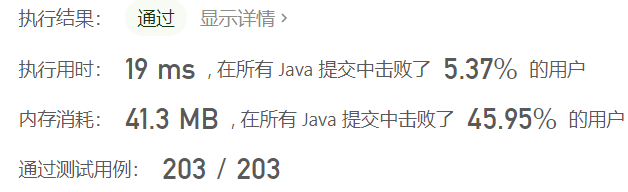
>
> 
>
> **解法二：指针**
>
> 只需要使用3个指针即可。一个是preStart，他表示的是前序遍历开始的位置，一个是inStart，他表示的是中序遍历开始的位置。一个是inEnd，他表示的是中序遍历结束的位置，我们主要是对中序遍历的数组进行拆解，下面就以下面的这棵树来画个图分析下
>
> 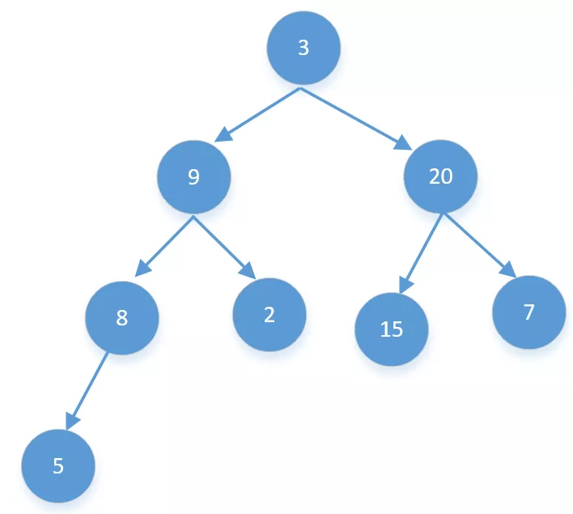
>
> 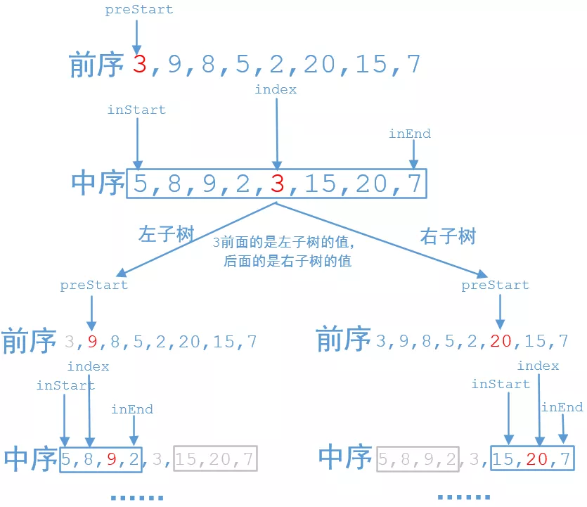
>
> 这里只要找到了前序遍历的结点在中序遍历的位置，我们就可以把中序遍历数组分解为两部分了。如果index是前序遍历的某个值在中序遍历数组中的索引，以index为根节点划分的话，那么中序遍历中
>
> [0，index-1]就是根节点左子树的所有节点，
>
> [index+1，inorder.length-1]就是根节点右子树的所有节点。
>
> 中序遍历好划分，那么前序遍历呢，如果是左子树：
>
> preStart=index+1；
>
> 如果是右子树就稍微麻烦点，
>
> preStart=preStart+(index-instart+1)；
>
> preStart是当前节点比如m先序遍历开始的位置，index-instart+1就是当前节点m左子树的数量加上当前节点的数量，所以preStart+(index-instart+1)就是当前节点m右子树前序遍历开始的位置，我们来看下完整代码
>
> ```java
> public TreeNode buildTree(int[] preorder, int[] inorder) {
>     return helper(0, 0, inorder.length - 1, preorder, inorder);
> }
> 
> public TreeNode helper(int preStart, int inStart, int inEnd, int[] preorder, int[] inorder) {
>     if (preStart > preorder.length - 1 || inStart > inEnd) {
>         return null;
>     }
>     //创建结点
>     TreeNode root = new TreeNode(preorder[preStart]);
>     int index = 0;
>     //找到当前节点root在中序遍历中的位置，然后再把数组分两半
>     for (int i = inStart; i <= inEnd; i++) {
>         if (inorder[i] == root.val) {
>             index = i;
>             break;
>         }
>     }
>     root.left = helper(preStart + 1, inStart, index - 1, preorder, inorder);
>     root.right = helper(preStart + index - inStart + 1, index + 1, inEnd, preorder, inorder);
>     return root;
> }
> ```
>
> 
>
> **解法三：栈**
>
> 如果使用栈来解决首先要搞懂一个知识点，就是前序遍历挨着的两个值比如m和n，他们会有下面两种情况之一的关系。
>
> 1，n是m左子树节点的值。
>
> 2，n是m右子树节点的值或者是m某个祖先节点的右节点的值。
>
> 对于第一个知识点我们很容易理解，如果m的左子树不为空，那么n就是m左子树节点的值。
>
> 对于第二个问题，如果一个结点没有左子树只有右子树，那么n就是m右子树节点的值，如果一个结点既没有左子树也没有右子树，那么n就是m某个祖先节点的右节点，我们只要找到这个祖先节点就好办了。
>
> 
>
> > 他的前序遍历是：`[3,9,8,5,2,20,15,7]`
> >
> > 他的中序遍历是：`[5,8,9,2,3,15,20,7]`
>
> ```java
> public TreeNode buildTree(int[] preorder, int[] inorder) {
>     if (preorder.length == 0)
>         return null;
>     Stack<TreeNode> s = new Stack<>();
>     //前序的第一个其实就是根节点
>     TreeNode root = new TreeNode(preorder[0]);
>     TreeNode cur = root;
>     for (int i = 1, j = 0; i < preorder.length; i++) {
>         //第一种情况
>         if (cur.val != inorder[j]) {
>             cur.left = new TreeNode(preorder[i]);
>             s.push(cur);
>             cur = cur.left;
>         } else {
>             //第二种情况
>             j++;
>             //找到合适的cur，然后确定他的右节点
>             while (!s.empty() && s.peek().val == inorder[j]) {
>                 cur = s.pop();
>                 j++;
>             }
>             //给cur添加右节点
>             cur = cur.right = new TreeNode(preorder[i]);
>         }
>     }
>     return root;
> }
> ```
>
> 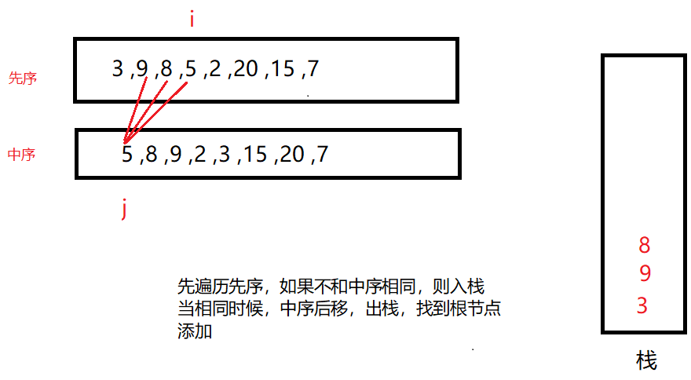
>
> 


### 4.填充每个节点的下一个右侧节点指针

给定一个 **完美二叉树** ，其所有叶子节点都在同一层，每个父节点都有两个子节点。二叉树定义如下：

```java
class Node {
    public int val;
    public Node left;
    public Node right;
    public Node next;

    public Node() {}
    
    public Node(int _val) {
        val = _val;
    }

    public Node(int _val, Node _left, Node _right, Node _next) {
        val = _val;
        left = _left;
        right = _right;
        next = _next;
    }
}
```

填充它的每个 next 指针，让这个指针指向其下一个右侧节点。如果找不到下一个右侧节点，则将 next 指针设置为 NULL。

初始状态下，所有 next 指针都被设置为 NULL。


> 示例 1：
>
> 
>
> 输入：root = [1,2,3,4,5,6,7]
> 输出：[1,#,2,3,#,4,5,6,7,#]
> 解释：给定二叉树如图 A 所示，你的函数应该填充它的每个 next 指针，以指向其下一个右侧节点，如图 B 所示。序列化的输出按层序遍历排列，同一层节点由 next 指针连接，'#' 标志着每一层的结束。
> 示例 2:
>
> 输入：root = []
> 输出：[]
>
> 

> **解法一：**
>
> 和`二叉树的锯齿形层次遍历`类似，都是以BFS为基础进行拓展编写
>
> ```java
> public Node connect(Node root) {
>         
>     /**
>             1.广度优先遍历
>             2.因为是完美二叉树，所以可以很精确知道每一层有多少节点
>             3.多余的工作就是填充next
>          */
> 
>     if(root == null)
>         return root;
> 
>     int layCount = 1;//记录层数
>     Queue<Node> que = new LinkedList();//用来存放便利的树
>     que.add(root);
>     double nodeCount = 1;//记录每一层结点数量
>     while(!que.isEmpty()){
>         nodeCount = Math.pow(2,layCount-1);//这一层结点数量就是2^（n-1）
> 
>         Node pre = null;//不同子树之间要记录
>         while(nodeCount>0){
> 
>             Node node = que.poll();//出队列
> 
>             if(nodeCount==1){
>                 node.next = null;//最后一个结点
>             }
> 
>             if(pre!=null){
>                 pre.next = node;
>             }
>             pre = node;
> 
>             Node left = node.left;
>             Node right = node.right;
> 
>             if(left!=null){
>                 que.add(left);
>                 que.add(right);
>             }
> 
> 
> 
>             nodeCount--;
>         }
>         layCount++;
>     }
>     return root;
> 
> }
> ```
>
> 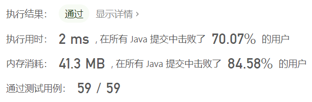


### 5.岛屿数量


### 6.二叉树的最近公共祖先


## 四、回溯

### 1.电话号码的字母组合

给定一个仅包含数字 2-9 的字符串，返回所有它能表示的字母组合。答案可以按 任意顺序 返回。

给出数字到字母的映射如下（与电话按键相同）。注意 1 不对应任何字母。


> 示例 1：
>
> 输入：digits = "23"
> 输出：["ad","ae","af","bd","be","bf","cd","ce","cf"]
>
> 示例 2：
>
> 输入：digits = ""
> 输出：[]
>
> 示例 3：
>
> 输入：digits = "2"
> 输出：["a","b","c"]

**解题思路**

> **解法一：BFS**
>
> 可以将这道题的数据看做是`树`，每一个digit数字代表这个树的一层，而每一个数字代表3-4个字符（电话按键），因此可以通过BFS来遍历相加
>
> 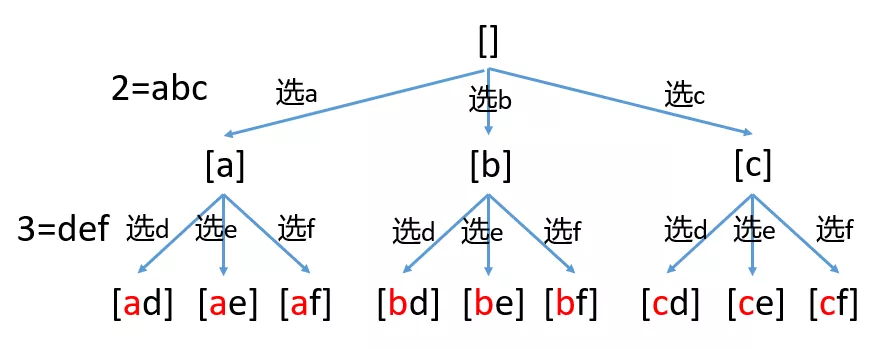
>
> ```java
> public List<String> letterCombinations(String digits) {
>     if(digits.equals(""))
>         return new ArrayList();
> 
>     LinkedList<String> res = new LinkedList();
>     char[][] tab = {{'a', 'b', 'c'}, {'d', 'e', 'f'}, {'g', 'h', 'i'},
>                     {'j', 'k', 'l'}, {'m', 'n', 'o'}, {'p', 'q', 'r', 's'},
>                     {'t', 'u', 'v'}, {'w', 'x', 'y', 'z'}};
> 
>     res.add("");//根节点为空
>     //判断是否到根节点方法就是判断路径长度是否和digits长度相同
>     while(res.peek().length()!=digits.length()){
>         String out = res.poll();//取出队头
>         char[] nodes = tab[digits.charAt(out.length())-'2'];//取出第i层结点
>         for(int i = 0;i<nodes.length;i++){
>             res.add(out+nodes[i]);
>         }
>     }
>     return res;
> }
> ```
>
> 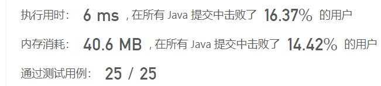

> **解法二：DFS**
>
> 既然当成了树，同样可以用DFS解决
>
> ```java
> public List<String> letterCombinations(String digits) {
>     List<String> res = new ArrayList<>();
>     if (digits == null || digits.isEmpty())
>         return res;
>     char[][] tab = {{'a', 'b', 'c'}, {'d', 'e', 'f'}, {'g', 'h', 'i'},
>             {'j', 'k', 'l'}, {'m', 'n', 'o'}, {'p', 'q', 'r', 's'},
>             {'t', 'u', 'v'}, {'w', 'x', 'y', 'z'}};
>     dfs(res, 0, digits, tab, "");
>     return res;
> }
> 
> /**
>  * @param res
>  * @param index  表示访问到第几个数字了，也可以认为访问到树的第几层了
>  * @param digits
>  * @param tab
>  * @param path   从根节点到叶子结点的路径
>  */
> private void dfs(List<String> res, int index, String digits, char[][] tab, String path) {
>     //到叶子节点了，就把这条路径选择的字符添加到res中
>     if (path.length() == digits.length()) {
>         res.add(path);
>         return;
>     }
>     char[] chars = tab[digits.charAt(index) - '2'];
>     //访问当前节点的所有子节点
>     for (int i = 0; i < chars.length; i++) {
>         dfs(res, index + 1, digits, tab, path + chars[i]);
>         //因为字符串是创建了一个新的对象，所以这里不需要撤销
>     }
> }
> ```

### 2.括号生成

数字 `n` 代表生成括号的对数，请你设计一个函数，用于能够生成所有可能的并且 **有效的** 括号组合。

> 示例 1：
>
> 输入：n = 3
> 输出：["((()))","(()())","(())()","()(())","()()()"]
>
> 示例 2：
>
> 输入：n = 1
> 输出：["()"]

**解题思路**

> **解法一：**
>
> 对于生成的有效括号：
>
> - 任意位置左括号总是>=右括号
> - 最终组合左括号等于右括号
>
> 有了上面两个特征，可以构建`dfs`解决,**以`n`等于`2`为例来画个图**
>
> 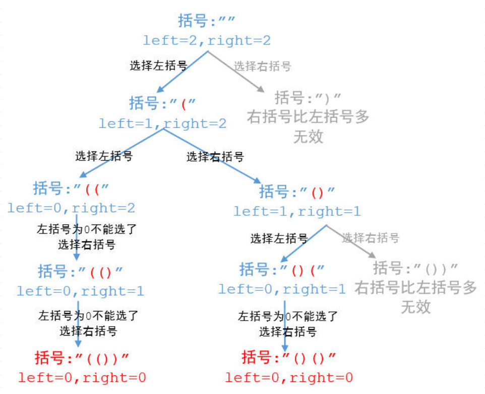
>
> 又一次想象成树，然后使用前序遍历就可以得到括号序列，但是最后return判断条件要重新书写，结合上面两个特征能够得出
>
> ```java
> public List<String> generateParenthesis(int n) {
>     List<String> res = new ArrayList<>();
>     dfs(res, n, n, "");
>     return res;
> }
> 
> //left是左括号剩余的数量，right是右括号剩余的数量
> private void dfs(List<String> res, int left, int right, String curStr) {
>     if (left == 0 && right == 0) { // 左右括号都不剩余了，说明找到了有效的括号
>         res.add(curStr);
>         return;
>     }
>     //左括号只有剩余的时候才可以选，如果左括号的数量已经选完了，是不能再选左括号了。
>     //如果选完了左括号我们是还可以选择右括号的。
>     if (left < 0)
>         return;
>     // 如果右括号剩余数量小于左括号剩余的数量，说明之前选择的无效
>     if (right < left)
>         return;
>     //选择左括号
>     dfs(res, left - 1, right, curStr + "(");
>     //选择右括号
>     dfs(res, left, right - 1, curStr + ")");
> }
> ```
>
> 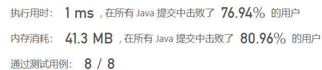

> **解法二：动态规划**
>
> **暂时没看懂递推公式**
>
> 我们用`dp[i]`表示的是`n`等于`i`的时候生成的有效括号组合
>
> ```
> dp[i]="("+dp[m]+")"+dp[k]   其中m+k=i-1
> ```
>
> 因为他再加上我们添加的一对括号正好是`i`，（其中`m`是从`0`到`i-1`）所以这里我们需要枚举`m`的所有值。
>
> ```java
> for (int m = 0; m < i; m++) {
>     int k = i - 1 - m;
>     List<String> str1 = dp[m];
>     List<String> str2 = dp[k];
>     for (String s1 : str1) {
>         for (String s2 : str2) {
>             cur.add("(" + s1 + ")" + s2);
>         }
>     }
> }
> ```
>
> 这题的边界条件是`dp[0]=""`，因为`0`的时候是没有括号的。所以完整代码如下
>
> ```java
> public static List<String> generateParenthesis(int n) {
>     List<String>[] dp = new List[n + 1];
>     List<String> dp0 = new ArrayList<>();
>     dp0.add("");
>     dp[0] = dp0;
>     for (int i = 1; i <= n; i++) {
>         List<String> cur = new ArrayList<>();
>         for (int m = 0; m < i; m++) {
>             int k = i - 1 - m;
>             List<String> str1 = dp[m];
>             List<String> str2 = dp[k];
>             for (String s1 : str1) {
>                 for (String s2 : str2) {
>                     cur.add("(" + s1 + ")" + s2);
>                 }
>             }
>         }
>         dp[i] = cur;
>     }
>     return dp[n];
> }
> ```
>
> 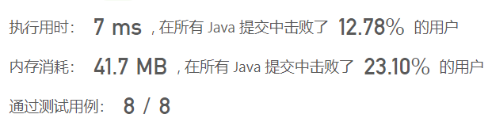

### 3.全排列

给定一个不含重复数字的数组 `nums` ，返回其 *所有可能的全排列* 。你可以 **按任意顺序** 返回答案。

> 示例 1：
>
> 输入：nums = [1,2,3]
> 输出：[[1,2,3],[1,3,2],[2,1,3],[2,3,1],[3,1,2],[3,2,1]]
>
> 示例 2：
>
> 输入：nums = [0,1]
> 输出：[[0,1],[1,0]]
>
> 示例 3：
>
> 输入：nums = [1]
> 输出：[[1]]
>
> 

**解题思路:**

> **回溯(dfs)**
>
> 实际上也是dfs的演化，
>
> 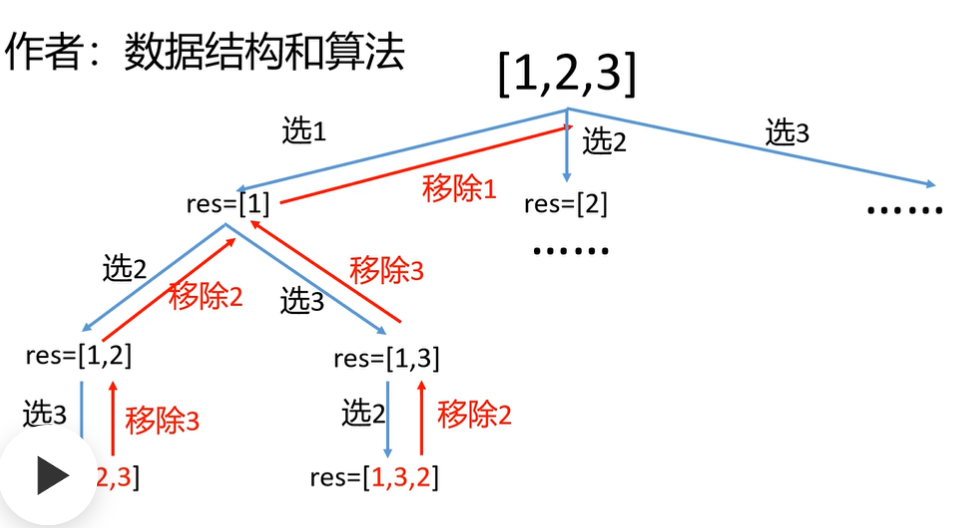
>
> ```java
> public List<List<Integer>> permute(int[] nums) {
>     List<List<Integer>> list = new ArrayList<>();
>     backtrack(list, new ArrayList<>(), nums);
>     return list;
> }
> 
> private void backtrack(List<List<Integer>> list, List<Integer> tempList, int[] nums) {
>     //终止条件，如果数字都被使用完了，说明找到了一个排列，（可以把它看做是n叉树到
>     //叶子节点了，不能往下走了，所以要返回）
>     if (tempList.size() == nums.length) {
>         //因为list是引用传递，这里必须要重新new一个
>         list.add(new ArrayList<>(tempList));
>         return;
>     }
>     //（可以把它看做是遍历n叉树每个节点的子节点）
>     for (int i = 0; i < nums.length; i++) {
>         //因为不能有重复的，所以有重复的就跳过
>         if (tempList.contains(nums[i]))
>             continue;
>         //选择当前值
>         tempList.add(nums[i]);
>         //递归（可以把它看做遍历子节点的子节点）
>         backtrack(list, tempList, nums);
>         //回溯，把最后一次添加的值给移除
>         tempList.remove(tempList.size() - 1);
>     }
> }
> ```
>
> 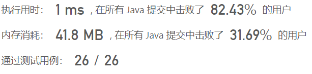

> **回溯：交换**
>
> 比如我们先选择第一个数字，然后和后面的所有数字都交换一遍，这样全排列的第一位就确定了。然后第二个数字在和后面的所有数字交换一遍，这样全排列的第二位数字也确定了……，一直继续下去，直到最后一个数字不能交换为止
>
> 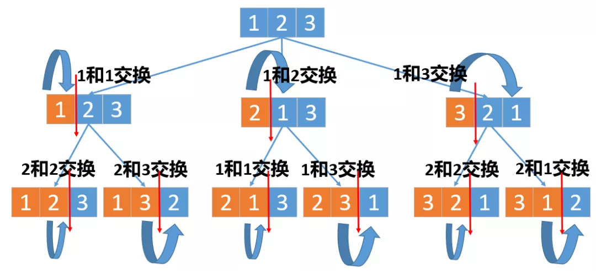
>
> ```java
> public List<List<Integer>> permute(int[] nums) {
>        List<List<Integer>> res = new ArrayList<>();
>        backtrack(nums, 0, res);
>        return res;
> }
> 
> public void backtrack(int[] nums, int index, List<List<Integer>> res) {
>        //到最后一个数字，没法再交换了，直接把数组转化为list
>        if (index == nums.length - 1) {
>            //把数组转为list
>            List<Integer> tempList = new ArrayList<>();
>            for (int num : nums)
>                tempList.add(num);
>            //把list加入到res中
>            res.add(tempList);
>            return;
>        }
>        for (int i = index; i < nums.length; i++) {
>            //但前数字nums[index]要和后面所有的数字都要交换一遍（包括
>            // 他自己）
>            swap(nums, index, i);
>            //递归，数组[0,index]默认是已经排列好的，然后从index+1开始
>            //后面元素的交换
>            backtrack(nums, index + 1, res);
>            //还原回来
>            swap(nums, index, i);
>        }
> }
> 
> //交换两个数字的值
> private void swap(int[] nums, int i, int j) {
>        if (i != j) {
>            nums[i] ^= nums[j];
>            nums[j] ^= nums[i];
>            nums[i] ^= nums[j];
>        }
> }
> ```

### 4.全排列 II

 给定一个可包含重复数字的序列 `nums` ，***按任意顺序*** 返回所有不重复的全排列。 

> ```
> 输入：nums = [1,1,2]
> 输出：
> [[1,1,2],
> [1,2,1],
> [2,1,1]]
> ```
>
> ```
> 输入：nums = [1,2,3]
> 输出：[[1,2,3],[1,3,2],[2,1,3],[2,3,1],[3,1,2],[3,2,1]]
> ```
>
> 

> **解题思路：**
>
> 整个递归函数分为两个情况： 
>
> - 如果 *idx*=*n*，说明我们已经填完了 *n* 个位置，找到了一个可行的解，我们将 *perm* 放入答案数组中，递归结束。
> - 如果 *idx*<*n*，我们要考虑第 *idx* 个位置填哪个数。 因为题目要求，所以不能填重复的数字，因此用一个数组`vis`保存已经填过数字下标， 那么在填第 *idx* 个数的时候我们遍历题目给定的 *n* 个数，如果这个数没有被标记过，我们就尝试填入，并将其标记，继续尝试填下一个位置， 并且回溯的时候要撤销这个填过的位置。
> - 此外，对于相邻重复数字的问题，每一次需要提前判断，避免重复序列出现。
>
> ```java
> static boolean[] vis;// 用来标记已经选取的数
> 
> public static List<List<Integer>> permuteUnique(int[] nums) {
>        List<List<Integer>> ans = new ArrayList<List<Integer>>();
>        List<Integer> perm = new ArrayList<Integer>();
>        vis = new boolean[nums.length];
>        Arrays.sort(nums);// 先排序
>        backtrack(nums, ans, 0, perm);
>        return ans;
> }
> 
> public static void backtrack(int[] nums, List<List<Integer>> ans, int idx, List<Integer> perm) {
>        if (idx == nums.length) {
>            ans.add(new ArrayList<Integer>(perm));
>            return;
>        }
>        for (int i = 0; i < nums.length; ++i) {
>            // 因为最后结果序列不能够重复，所以这里进行判断
>            // "!vis[i-1]"这个判断条件，其实是针对相邻重复数去重，
>            // 假设1,1相邻，那么第一次递归就是一种情况
>            // 上面情况结束，进行回溯，第一个1的vis为false,再进行递归，如果不加以判断，又会出现重复情况。而上一次递归已经考虑到vis[i-1]的情况，并且vis[i-1]回溯为false，所以加一个判断"!vis[i-1]"这个情况
>            if (vis[i] || (i > 0 && nums[i] == nums[i - 1] && !vis[i - 1])) {
>                continue;
>            }
>            perm.add(nums[i]);
>            vis[i] = true;
>            backtrack(nums, ans, idx + 1, perm);
>            vis[i] = false;
>            perm.remove(idx);
>        }
>    }
> ```


### 5.子集

给你一个整数数组 `nums` ，数组中的元素 **互不相同** 。返回该数组所有可能的子集（幂集）。

解集 **不能** 包含重复的子集。你可以按 **任意顺序** 返回解集。

> 示例 1：
>
> 输入：nums = [1,2,3]
> 输出：[[],[1],[2],[1,2],[3],[1,3],[2,3],[1,2,3]]
>
> 示例 2：
>
> 输入：nums = [0]
> 输出：[[],[0]]

**解题思路**

> 回溯类型算法的模板
>
> ```java
> private void backtrack("原始参数") {
>     //终止条件(递归必须要有终止条件)
>     if ("终止条件") {
>         //一些逻辑操作（可有可无，视情况而定）
>         return;
>     }
> 
>     for (int i = "for循环开始的参数"; i < "for循环结束的参数"; i++) {
>         //一些逻辑操作（可有可无，视情况而定）
> 
>         //做出选择
> 
>         //递归
>         backtrack("新的参数");
>         //一些逻辑操作（可有可无，视情况而定）
> 
>         //撤销选择
>     }
> }
> ```
>
> 这道题和上面题目类似，看做是一棵树的DFS来遍历，只不过没有终止条件
>
> ```java
> public List<List<Integer>> subsets(int[] nums) {
>     List<List<Integer>> list = new ArrayList<>();
>     backtrack(list, new ArrayList<>(), nums, 0);
>     return list;
> }
> 
> private void backtrack(List<List<Integer>> list, List<Integer> tempList, int[] nums, int start) {
>     //走过的所有路径都是子集的一部分，所以都要加入到集合中
>     list.add(new ArrayList<>(tempList));
>     for (int i = start; i < nums.length; i++) {
>         //做出选择
>         tempList.add(nums[i]);
>         //递归
>         backtrack(list, tempList, nums, i + 1);
>         //撤销选择
>         tempList.remove(tempList.size() - 1);
>     }
> }
> ```
>
> 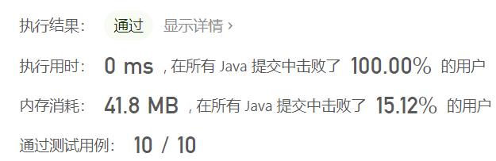

> **位运算解法：**
>
> 数组中的每一个数字都有**选和不选**两种状态，我们可以用`0`和`1`表示，**0表示不选**，**1表示选择**。如果数组的长度是`n`，那么子集的数量就是`2^n`。
>
> 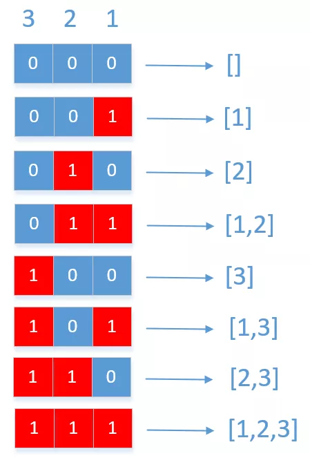
>
> 按照1来找子集
>
> ```java
> public static List<List<Integer>> subsets(int[] nums) {
>     //子集的长度是2的nums.length次方，这里通过移位计算
>     int length = 1 << nums.length;//移位，等于8
>     List<List<Integer>> res = new ArrayList<>(length);
>     //遍历从0到length中间的所有数字，根据数字中1的位置来找子集
>     for (int i = 0; i < length; i++) {
>         List<Integer> list = new ArrayList<>();
>         for (int j = 0; j < nums.length; j++) {
>             //如果数字i的某一个位置是1，就把数组中对
>             //应的数字添加到集合
>             if (((i >> j) & 1) == 1)//判断这个数字的某一位，是否为1，如果为就添加
>                 list.add(nums[j]);
>         }
>         res.add(list);
>     }
>     return res;
> }
> ```
>

### 6.单词搜索

给定一个 m x n 二维字符网格 board 和一个字符串单词 word 。如果 word 存在于网格中，返回 true ；否则，返回 false 。

单词必须按照字母顺序，通过相邻的单元格内的字母构成，其中“相邻”单元格是那些水平相邻或垂直相邻的单元格。同一个单元格内的字母不允许被重复使用。

> 示例 1：
>
> 
>
> 输入：board = [["A","B","C","E"],["S","F","C","S"],["A","D","E","E"]], word = "ABCCED"
> 输出：true
>
> 示例 2：
>
> 
>
> 输入：board = [["A","B","C","E"],["S","F","C","S"],["A","D","E","E"]], word = "SEE"
> 输出：true
>
> 示例 3：
>
> 
>
> 输入：board = [["A","B","C","E"],["S","F","C","S"],["A","D","E","E"]], word = "ABCB"
> 输出：false

**解题思路**

> 和之前的`岛屿数量`问题类似，使用dfs进行搜索
>
> 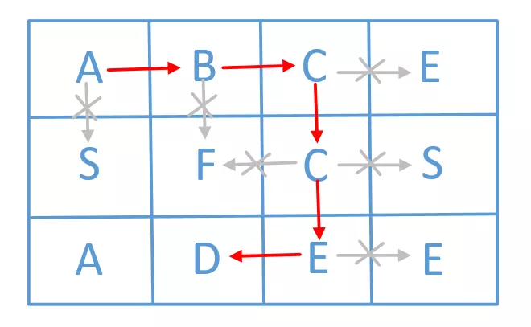
>
> 关键代码是dfs这个函数，因为每一个点都可以往他的4个方向查找，所以我们可以把它想象为一棵4叉树，就是每个节点有4个子节点，而树的遍历我们最容易想到的就是递归，我们来大概看一下
>
> ```java
> boolean dfs(char[][] board, char[] word, int i, int j, int index) {
>     if (边界条件的判断) {
>         return;
>     }
> 
>     一些逻辑处理
> 
>     boolean res;
>     //往右
>     res = dfs(board, word, i + 1, j, index + 1)
>     //往左
>     res |= dfs(board, word, i - 1, j, index + 1)
>     //往下
>     res |= dfs(board, word, i, j + 1, index + 1)
>     //往上
>     res |= dfs(board, word, i, j - 1, index + 1)
>     //上面4个方向，只要有一个能查找到，就返回true；
>     return res;
> }
> ```
>
> 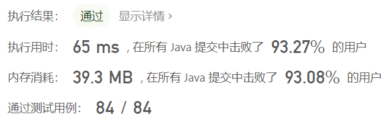


### 7.组合总和

给你一个 无重复元素 的整数数组 candidates 和一个目标整数 target ，找出 candidates 中可以使数字和为目标数 target 的 所有 不同组合 ，并以列表形式返回。你可以按 任意顺序 返回这些组合。

candidates 中的 同一个 数字可以 无限制重复被选取 。如果至少一个数字的被选数量不同，则两种组合是不同的。 

对于给定的输入，保证和为 target 的不同组合数少于 150 个。

> ```
> 输入：candidates = [2,3,6,7], target = 7
> 输出：[[2,2,3],[7]]
> 解释：
> 2 和 3 可以形成一组候选，2 + 2 + 3 = 7 。注意 2 可以使用多次。
> 7 也是一个候选， 7 = 7 。
> 仅有这两种组合。
> ```
>
> ```
> 输入: candidates = [2,3,5], target = 8
> 输出: [[2,2,2,2],[2,3,3],[3,5]]
> ```
>
> ```
> 输入: candidates = [2], target = 1
> 输出: []
> ```

> **解题思路：**
>
> 这道题是一道比较简单的回溯题目，主要是确保每一种可能性
>
> ```java
> public static List<List<Integer>> combinationSum(int[] candidates, int target) {
>     List<List<Integer>> res = new ArrayList<>();
>     Arrays.sort(candidates);
>     // System.out.println(candidates);
>     backtrack(candidates, target, res, 0, new ArrayList<Integer>());
>     return res;
> }
> 
> private static void backtrack(int[] candidates, int target, List<List<Integer>> res, int i,
>                               ArrayList<Integer> tmp_list) {
>     if (target < 0)
>         return;
>     if (target == 0) {
>         res.add(new ArrayList<>(tmp_list));
>         return;
>     }
>     for (int start = i; start < candidates.length; start++) {
>         if (target < 0)
>             break;
>         tmp_list.add(candidates[start]);
>         backtrack(candidates, target - candidates[start], res, start, tmp_list);
>         tmp_list.remove(tmp_list.size() - 1);
>     }
> }
> ```


### 8.二进制手表

二进制手表顶部有 4 个 LED 代表 **小时（0-11）**，底部的 6 个 LED 代表 **分钟（0-59）**。每个 LED 代表一个 0 或 1，最低位在右侧。 


>  例如，下面的二进制手表读取 `"3:25"` 。
>
>   
>
>  给你一个整数 turnedOn ，表示当前亮着的 LED 的数量，返回二进制手表可以表示的所有可能时间。你可以 按任意顺序 返回答案。
>
>  小时不会以零开头：
>
>  ​	`例如，"01:00" 是无效的时间，正确的写法应该是 "1:00" 。`
>  分钟必须由两位数组成，可能会以零开头：
>
>  ​	`例如，"10:2" 是无效的时间，正确的写法应该是 "10:02" 。`

> ```
> 输入：turnedOn = 1
> 输出：["0:01","0:02","0:04","0:08","0:16","0:32","1:00","2:00","4:00","8:00"]
> ```
>
> ```
> 输入：turnedOn = 9
> 输出：[]
> ```

> **解题思路**
>
> 直接上代码吧，使用数组存储LED数，回溯函数中使用两个int存储小时和分钟
>
> ```java
> public static List<String> readBinaryWatch(int turnedOn) {
>     List<String> res = new ArrayList<>();
>     int[] hour_minute = { 8, 4, 2, 1, 32, 16, 8, 4, 2, 1 };
>     backTrace(turnedOn, hour_minute, 0, 0, 0, res);
> 
>     return res;
> }
> 
> static void backTrace(int num, int[] nums, int start, int hour, int minute, List<String> res) {
>     if (num == 0) {
>         //判断hour和minute是否合法
>         if (hour > 11 || minute > 59)
>             return;
>         StringBuilder sb = new StringBuilder();
>         sb.append(hour);
>         sb.append(":");
> 
>         // minute一定是两位
>         if (minute < 10)
>             sb.append("0" + minute);
>         else
>             sb.append(minute);
> 
>         res.add(sb.toString());
>         return;
>     }
> 
>     for (int i = start; i < nums.length; i++) {
>         if (i < 4)
>             hour += nums[i];
>         else
>             minute += nums[i];
>         backTrace(num - 1, nums, i + 1, hour, minute, res);
>         if (i < 4)
>             hour -= nums[i];
>         else
>             minute -= nums[i];
>     }
> }
> ```
>


## 五、排序和搜索

### 1.前 K 个高频元素

给你一个整数数组 `nums` 和一个整数 `k` ，请你返回其中出现频率前 `k` 高的元素。你可以按 **任意顺序** 返回答案。

> 示例 1:
>
> 输入: nums = [1,1,1,2,2,3], k = 2
> 输出: [1,2]
> 示例 2:
>
> 输入: nums = [1], k = 1
> 输出: [1]


**解题思路**

> 这道题运用根堆的思想很好解，将数组数字放到哈希表，进行统计计数，然后再把哈希表里面键值对全部放入根堆，最后取前k个高频数字
>
> ```java
> public int[] topKFrequent(int[] nums, int k) {
>     /**
>         1.使用大跟堆
>         2.使用小根堆
>         3.java api掌握不熟练
>      */
> 
>     Map<Integer,Integer> map = new HashMap();
>     for(int num:nums){
>         map.put(num,map.getOrDefault(num,0)+1);//放入map，如果不存在键的映射，则创建默认值
>     }
> 
>     PriorityQueue<int[]> queue = new PriorityQueue<>((a,b)->b[1]-a[1]);
>     for(int key:map.keySet()){
>         queue.add(new int[]{key,map.get(key)});
>     }
> 
>     int[] res = new int[k];//取堆中最大的k个元素
>     for(int i = 0;i<k;i++){
>         res[i] = queue.poll()[0];
>     }
> 
>     return res;
> }
> ```
>
> 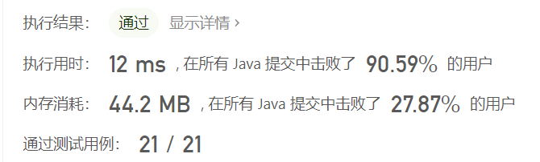


### 2.数组中的第K个最大元素

给定整数数组 nums 和整数 k，请返回数组中第 k 个最大的元素。

请注意，你需要找的是数组排序后的第 k 个最大的元素，而不是第 k 个不同的元素。

你必须设计并实现时间复杂度为 O(n) 的算法解决此问题。

> 示例 1:
>
> 输入: [3,2,1,5,6,4], k = 2
> 输出: 5
> 示例 2:
>
> 输入: [3,2,3,1,2,4,5,5,6], k = 4
> 输出: 4

**解题思路：**

> **解法一：最大堆排序**
>
> ```java
> public int findKthLargest(int[] nums, int k) {
>     /**
>      1.堆排序解决
>  */
>     PriorityQueue<Integer> que = new PriorityQueue<>((a,b)->b-a);
>     for(int num : nums){
>         que.add(num);
>     }
>     int res = 0;
>     for(int i = 0;i<k;i++){
>         res = que.poll();
>     }
> 
>     return res;
> }
> ```
>
> 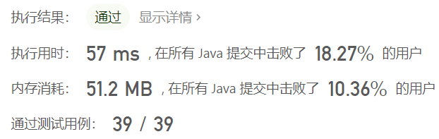
>
> **不调用API的话，就自己实现大根堆，当第k大元素调整到栈顶时候就返回**
>
> ```java
> public static int findKthLargest(int[] nums, int k) {
> 
>     int heapSize = nums.length;
>     buildHeap(nums, heapSize);// 只在最开始构建一次大根堆
>     for (int i = nums.length - 1; i >= nums.length - k + 1; i--) {
>         swap(nums, 0, i);
>         --heapSize;//因为排好序一个元素，所以需要排序的减一
>         maxHeap(nums, 0, heapSize);// 调整堆，成为大根堆
>     }
> 
>     return nums[0];
> }
> 
> // 构建大根堆
> static void buildHeap(int[] a, int heapSize) {
>     for (int i = heapSize / 2 - 1; i >= 0; i--) {
>         maxHeap(a, i, heapSize);
>     }
> }
> 
> // 用来调整堆，使之成为大根堆
> static void maxHeap(int[] a, int i, int heapSize) {
>     int leftChild = i * 2 + 1;
>     int rightChild = i * 2 + 2;
>     int largest = i;// 父节点
> 
>     if (leftChild < heapSize && a[leftChild] > a[largest])
>         largest = leftChild;
> 
>     if (rightChild < heapSize && a[rightChild] > a[largest])
>         largest = rightChild;
> 
>     if (largest != i) {
>         swap(a, i, largest);
>         maxHeap(a, largest, heapSize);
>     }
> }
> 
> static void swap(int[] a, int i, int j) {
>     int temp = a[i];
>     a[i] = a[j];
>     a[j] = temp;
> }
> ```

> **解法二：最小堆**
>
> ```java
> //这题只让找出最大的第k个元素即可，没说一定要对数组进行排序，所以我们还可以使用最小堆来解决。解决方式就是一个个遍历原数组的值，添加到堆中，添加之后如果堆中元素个数大于k的时候，我们就把最顶端的元素给移除掉，因为是最小堆，所以移除的就是堆中最小的值。
> 
> public int findKthLargest(int[] nums, int k) {
>     final PriorityQueue<Integer> queue = new PriorityQueue<>();
>     for (int val : nums) {
>         queue.add(val);//加入堆中
>         //如果堆中元素大于k，则把堆顶元素给移除
>         if (queue.size() > k)
>             queue.poll();
>     }
>     return queue.peek();//返回堆顶元素
> }
> ```
>


### 3.在排序数组中查找元素的第一个和最后一个位置

给你一个按照非递减顺序排列的整数数组 nums，和一个目标值 target。请你找出给定目标值在数组中的开始位置和结束位置。

如果数组中不存在目标值 target，返回 [-1, -1]。

你必须设计并实现时间复杂度为 O(log n) 的算法解决此问题。

> 示例 1：
>
> 输入：nums = [5,7,7,8,8,10], target = 8
> 输出：[3,4]
> 示例 2：
>
> 输入：nums = [5,7,7,8,8,10], target = 6
> 输出：[-1,-1]
> 示例 3：
>
> 输入：nums = [], target = 0
> 输出：[-1,-1]


**解题思路**

> 这道题有复杂度要求，那么不能用双指针，而是采用二分法。
>
> 首先通过二分法找到第一个出现的数字，找到第一个数字之后，将第一个数字作为第二次查找的首个数字，然后找最后一个出现的数字
>
> ```java
> public int[] searchRange(int[] nums, int target) {
>     /*
>         1.二分法
>         2.先找到第第一个，然后再找最后一个
>         3.nums数组是一个升序数组，利用起来
>          */
> 
>     if(nums.length == 0){
>         return new int[]{-1,-1};
>     }
> 
>     int left = 0;
>     int right = nums.length-1;
>     int[] index = {-1,-1};
> 
>     while(left<=right){
>         int mid = (left+right)/2;
>         if(nums[mid]==target){
>             index[0] = mid;
>             right = mid-1;
>         }
>         else if(nums[mid]<target)
>             left = mid+1;
>         else
>             right = mid-1;
>     }
>     if(index[0] ==-1)
>         return index;
>     left = index[0];
>     right = nums.length-1;
> 
>     while(left<=right){
>         int mid = (left+right)/2;
>         if(nums[mid]==target){
>             index[1] = mid;
>             left = mid+1;
>         }else if(nums[mid]<target)
>             left = mid+1;
>         else
>             right = mid-1;
>     }
>     return index;
> 
> }
> ```
>


### 4.合并区间

以数组 intervals 表示若干个区间的集合，其中单个区间为 intervals[i] = [starti, endi] 。请你合并所有重叠的区间，并返回 一个不重叠的区间数组，该数组需恰好覆盖输入中的所有区间 。

>示例 1：
>
>输入：intervals = [[1,3],[2,6],[8,10],[15,18]]
>输出：[[1,6],[8,10],[15,18]]
>解释：区间 [1,3] 和 [2,6] 重叠, 将它们合并为 [1,6].
>示例 2：
>
>输入：intervals = [[1,4],[4,5]]
>输出：[[1,5]]
>解释：区间 [1,4] 和 [4,5] 可被视为重叠区间。

**解题思路：**

> "这道题重点就是要将第i个区间和前面的所有区间比较，因为可能存在交集，所以要先进行排序，而排序是把每个小区间的第一个数进行排序，这样我们只需要确定后面一个数是否在交集就可以了"
>
> ```java
> public int[][] merge(int[][] intervals) {
> 
>     if(intervals.length == 1)
>         return intervals;
> 
>     //按区间左侧端点值进行排序
>     Arrays.sort(intervals, (a, b) -> Integer.compare(a[0], b[0]));
>     List<int[]> ans = new ArrayList<>();
>     for (int i = 0; i < intervals.length; i++) {
>         //处理末位区间
>         if (i == intervals.length - 1) {
>             ans.add(new int[]{intervals[i][0], intervals[i][1]});
>             break;
>         }
>         //处理常规区间，区间存在交集时，将前面统计的交集赋值给下标为i+1的区间
>         if (intervals[i][1] >= intervals[i + 1][0] && intervals[i][0] <= intervals[i + 1][1]) {
>             intervals[i + 1][0] = intervals[i][0] ;//是为了标记目前最小的一个数
>             intervals[i + 1][1] = intervals[i][1] >= intervals[i + 1][1] ? intervals[i][1] : intervals[i + 1][1];
>             continue;
>         }
>         //区间不存在交集时，存入集合
>         ans.add(new int[]{intervals[i][0], intervals[i][1]});
>     }
>     return ans.toArray(new int[ans.size()][2]);
> 
> }
> ```
>
> 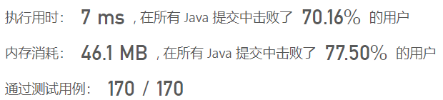


## 六、动态规划

### 1.跳跃游戏

给定一个非负整数数组 `nums` ，你最初位于数组的 **第一个下标** 。

数组中的每个元素代表你在该位置可以跳跃的最大长度。

判断你是否能够到达最后一个下标。

**示例 1：**

输入：nums = [2,3,1,1,4]
输出：true
解释：可以先跳 1 步，从下标 0 到达下标 1, 然后再从下标 1 跳 3 步到达最后一个下标。

**示例 2：**

输入：nums = [3,2,1,0,4]
输出：false
解释：无论怎样，总会到达下标为 3 的位置。但该下标的最大跳跃长度是 0 ， 所以永远不可能到达最后一个下标。


> **解题思路：**
>
> ①自己做的方法，其实O(n^2)的规划，但是显然不是最优解，遇到很大范围数字就超时了
>
> 本质上就是计算出到达每一步的可能性，然后递推出到达最后一步的可能性
>
> ```python
> class Solution:
> 
>     def canJump(self, nums: List[int]) -> bool:
> 
>         if len(nums) == 1:
>             return True
> 
>         dp = [0 for i in range(len(nums))]  # 初始化数组
>         dp[0] = nums[0]
>         for i in range(len(nums) - 1):
>             if dp[i] == 0:
>                 return False  # 如果等于0证明不可达，直接退出
> 
>             for j in range(1, nums[i] + 1):
>                 index = j + i
>                 if index >= len(nums):  # 如果加上的步长大于了数组长度，应该推出
>                     break
>                 dp[index] += 1  # 证明该位置可以到达
> 
>         # 如果最后一个数为0证明不可到达
>         if dp[-1] == 0:
>             return False
> 
>         return True
> ```
>
> 
>
> ②题解的做法：
>
> 设`dp[i]`为在下标`i `处，可以最多往后跳几步。动态规划解空间（即dp 数组）中，当前项一定可以由之前某一（几）项推导出,求当前项时需要做出选择：
>
> - 不在当前位置停留，从上一位置继续往后跳，最大跳跃步数更新为`dp[i-1] - 1`；
> - 在当前位置停留，最大跳跃步数更新为`max(dp[i-1]-1,nums[i])`；
>
> ```python
> class Solution:
>     def canJump(self, nums: List[int]) -> bool:
>         if len(nums) == 1:
>             return True
>         if (nums[0] == 0):
>             return False
> 
>         dp = [0 for i in range(len(nums))]  # 初始化数组
>         dp[0] = nums[0]
>         for i in range(len(nums)):
>             dp[i] = max(dp[i - 1] - 1, nums[i])
>             if (dp[i] + i + 1 >= len(nums)):
>                 return True
>             elif dp[i] == 0:
>                 return False
> 
>         return False
> ```
>
> 
>
> **③贪心**
>
> 1、从前往后走，标记 能到达的最远距离为 maxFar, maxFar初始化为nums[0]
> 2、如果 maxFar >= i, 表示位置 i 能达到, 则更新 maxFar = max( maxFar, nums[i] + i)
> 3、返回 maxFar 是否 大于等于 (nums.length - 1);
>
> ```java
> public boolean canJump(int[] nums) {
>     int maxFar = nums[0];
>     for (int i = 1; i < nums.length; i++) {
>         if (i <= maxFar) {
>             maxFar = Math.max(maxFar, nums[i] + i);
>         }
>     }
>     return maxFar >= nums.length - 1;
> }
> ```
>


### 2.不同路径

一个机器人位于一个 m x n 网格的左上角 （起始点在下图中标记为 “Start” ）。

机器人每次只能向下或者向右移动一步。机器人试图达到网格的右下角（在下图中标记为 “Finish” ）。

问总共有多少条不同的路径？

实例1：


```
输入：m = 3, n = 7
输出：28
```

> **结题思路：**
>
> 比较简单的规划题，因为每次只能往右或者往下，因此到达第（i，j）步时候，上一步可能是从上面下来或者从左边往右边，因此状态方程：
>
> ```
> dp[i][j] = dp[i - 1][j] + dp[i][j - 1]
> ```
>
> 边界条件就是第一行和第一列
>
> 代码：
>
> ```python
> def uniquePaths(self, m: int, n: int) -> int:
>         dp = [[0 for j in range(n)] for i in range(m)]  # 定义动态规划二维数组
>         dp[0][0] = 1
>         for i in range(m):
>             for j in range(n):
>                 if i == 0 and j == 0:
>                     continue
>                 if i == 0:
>                     # 第一行只能是向右走
>                     dp[i][j] = dp[i][j - 1]
>                 elif j == 0:
>                     # 如果j为第一列，那么只能是上面往下走
>                     dp[i][j] = dp[i - 1][j]
>                 else:
>                     # 否则有两种走法，要么是上面往下走，要么是左边往右边走
>                     dp[i][j] = dp[i - 1][j] + dp[i][j - 1]
> 
>         return dp[m - 1][n - 1]  # 返回最后的结果
> ```
>
> 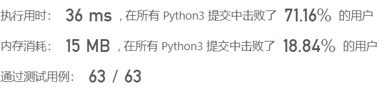


### 3.零钱兑换

给你一个整数数组 coins ，表示不同面额的硬币；以及一个整数 amount ，表示总金额。

计算并返回可以凑成总金额所需的 最少的硬币个数 。如果没有任何一种硬币组合能组成总金额，返回 -1 。

你可以认为每种硬币的数量是无限的。

```
示例 1：

输入：coins = [1, 2, 5], amount = 11
输出：3 
解释：11 = 5 + 5 + 1
```

```
示例 2：

输入：coins = [2], amount = 3
输出：-1
```

```
示例 3：

输入：coins = [1], amount = 0
输出：0
```


> **解题思路：**
>
> 这道题两种方法解，一种是BFS，一种是动态规划
>
> **①动态规划**
>
> 首先设置dp数组，`dp[i]`表示第i金额需要的最小硬币数量，因此可以得出状态方程：
>
> ```
> dp[i] = Math.min(dp[i-coins[0]],dp[i-coins[1]].....,dp[i-coins[i-1]])+1
> ```
>
> 上面式子表示的是，**如果i金额可以达成，那必然是其上一个面额加上硬币集合的某一硬币之后得到的**，其实就是假设在满足dp[i]的情况下，拿走一个硬币时需要的个数，然后+1。拿走硬币是什么意思呢?就是dp[i-coin],coin是选取的硬币的面值,如果dp[i-coin]!=-1，说明dp[i-coin]有解，那么dp[i-coin+coin]也就有解了，那么需要的硬币数量就是dp[i-coin]+1
>
> ```python
> def coinChange(self, coins: List[int], amount: int) -> int:
>         dp = [-1] * (amount + 1)
>         dp[0] = 0
>         # 初始化状态数组
>         for coin in coins:
>             if coin <= amount:
>                 dp[coin] = 1
> 
>         for i, num in enumerate(dp):
>             if num != -1:
>                 continue
> 
>             min_num = float('inf')
> 
>             for c in coins:
>                 if c < i and dp[i - c] != -1 and dp[i - c] < min_num:
>                     min_num = dp[i - c]
> 
>             if min_num != float('inf'):
>                 dp[i] = min_num + 1
> 
>         return dp[amount]
> ```
>

### 4.最长递增子序列

给你一个整数数组 nums ，找到其中最长严格递增子序列的长度。

子序列 是由数组派生而来的序列，删除（或不删除）数组中的元素而不改变其余元素的顺序。例如，[3,6,2,7] 是数组 [0,3,1,6,2,2,7] 的子序列。

> 示例 1：
>
> ```
> 输入：nums = [10,9,2,5,3,7,101,18]
> 输出：4
> 解释：最长递增子序列是 [2,3,7,101]，因此长度为 4 。
> ```
>
> 示例 2：
>
> ```
> 输入：nums = [0,1,0,3,2,3]
> 输出：4
> ```
>
> 示例 3：
>
> ```
> 输入：nums = [7,7,7,7,7,7,7]
> 输出：1
> ```

> **结题思路：**
>
> 设`dp[i]`为索引 i 到字符串末尾的最大严格递增子序列的长度，对于输入`[0,1,0,3,2,3]`，枚举子问题的解大致过程如下：
>
> ```java
> // nums[2] === nums[0]，所以不可以选择dp[2]
> dp[0] = Math.max(dp[1], dp[3], dp[4], dp[5], 0) + 1 = 4;
> 
> // nums[2] < nums[1],所以不可以选择dp[2]
> dp[1] = Math.max(dp[3], dp[4], dp[5], 0) + 1 = 3;
> 
> // 所有子问题的解都可以选择
> dp[2] = Math.max(dp[3], dp[4], dp[5], 0) + 1 = 3;
> 
> // nums[4] < nums[3]，nums[5] = nums[3]，所以都不可以选择
> dp[3] = Math.max(0) + 1 = 1;
> 
> dp[4] = Math.max(dp[5], 0) + 1 = 2;
> 
> dp[5] = Math.max(0) + 1 = 1;
> ```
>
> 发现`dp[i]`就是在所有子问题`dp[i - 1],dp[i - 2],...,dp[dp.length - 1]`的解中做选择，选择长度最大的一个解`max`,
>
> 且此时隐含的意思就是已经选定了`nums[i]`，所以`dp[i] = max + 1`
>
> 因此状态方程
>
> ```
> //必须符合nums[i] < nums[j] && i < j < nums.length）
> dp[i] = Math.max(0, dp[j]) + 1;
> ```
>
> ```python
> 	def lengthOfLIS(self, nums: List[int]) -> int:
>         ''' 状态方程 dp[i] = max(dp[j],0)+1 其中length>j>i
>             反向
>         '''
>         dp = [0 for _ in range(len(nums))]
>         dp[len(nums) - 1] = 1
>         res = 1
>         for i in range(len(nums) - 2, -1, -1):  # 从最后开始
>             maxDp = 0
>             for j in range(i + 1, len(nums)):
>                 if nums[j] > nums[i]:
>                     maxDp = max(dp[j], maxDp)
> 
>             dp[i] = maxDp + 1
>             res = max(dp[i], res)
>         return res
> ```
>
> ```python
> 	'''正向'''
>      dp = [0 for _ in range(len(nums))]
>      dp[0] = 1
>      res = 1
>      for i in range(1, len(nums)):
>           maxDp = 0
>           for j in range(i):
>               if nums[j] < nums[i]:
>                   maxDp = max(dp[j], maxDp)
>           dp[i] = maxDp + 1
>           res = max(dp[i], res)
> 
>       return res
> ```

### 5.最长公共子序列

给定两个字符串 `text1` 和 `text2`，返回这两个字符串的最长 **公共子序列** 的长度。如果不存在 **公共子序列** ，返回 `0` 。

一个字符串的 **子序列** 是指这样一个新的字符串：它是由原字符串在不改变字符的相对顺序的情况下删除某些字符（也可以不删除任何字符）后组成的新字符串。

- 例如，`"ace"` 是 `"abcde"` 的子序列，但 `"aec"` 不是 `"abcde"` 的子序列。

两个字符串的 **公共子序列** 是这两个字符串所共同拥有的子序列。

**示例 1：**

```
输入：text1 = "abcde", text2 = "ace" 
输出：3  
解释：最长公共子序列是 "ace" ，它的长度为 3 。
```

**示例 2：**

```
输入：text1 = "abc", text2 = "abc"
输出：3
解释：最长公共子序列是 "abc" ，它的长度为 3 。
```


**解题思路：**

二维动态规划问题

> 参考——https://leetcode.cn/problems/longest-common-subsequence/solutions/696763/zui-chang-gong-gong-zi-xu-lie-by-leetcod-y7u0/

```java
public int longestCommonSubsequence(String text1, String text2) {
    int m = text1.length(), n = text2.length();
    int[][] dp = new int[m + 1][n + 1];//分别记录text1[0:m]和text[0:n]的最长公共子序列
    for (int i = 1; i <= m; i++) {
        char c1 = text1.charAt(i - 1);
        for (int j = 1; j <= n; j++) {
            char c2 = text2.charAt(j - 1);
            if (c1 == c2) {
                dp[i][j] = dp[i - 1][j - 1] + 1;
            } else {
                dp[i][j] = Math.max(dp[i - 1][j], dp[i][j - 1]);
            }
        }
    }
    return dp[m][n];
}
```


### 6.零钱兑换

给你一个整数数组 `coins` ，表示不同面额的硬币；以及一个整数 `amount` ，表示总金额。

计算并返回可以凑成总金额所需的 **最少的硬币个数** 。如果没有任何一种硬币组合能组成总金额，返回 `-1` 。

你可以认为每种硬币的数量是无限的。

**示例 1：**

```
输入：coins = [1, 2, 5], amount = 11
输出：3 
解释：11 = 5 + 5 + 1
```

**示例 2：**

```
输入：coins = [2], amount = 3
输出：-1
```

**示例 3：**

```
输入：coins = [1], amount = 0
输出：0
```


**解题思路：**

这道题两种方式，一种是从上至下将任务拆分；另一种是从下至上找答案。

通过题意可以得到该问题可以描述为方程：

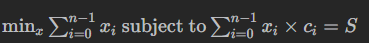

> 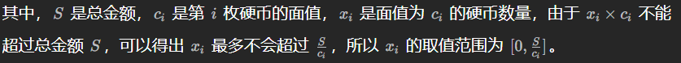


第一种方式略，通过记忆搜索法，动态规划

第二种自下而上的方式采用动态规划，状态方程式为：

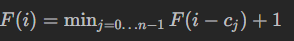

> cj代表当前遍历硬币的值，因此i-cj，代表从之前状态转换过来，并且加上当前硬币数量，为1

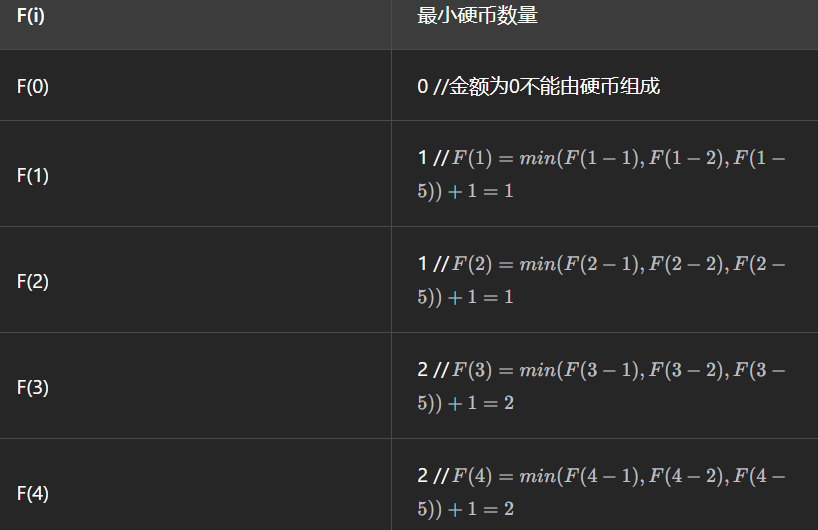


```java
public int coinChange(int[] coins, int amount) {
    int[] resdp = new int[amount + 1];
    int max = amount + 1;
    Arrays.fill(resdp, max);
    resdp[0] = 0;
    for (int i = 1; i <= amount; i++) {
        for (int j = 0; j < coins.length; j++) {
            if (coins[j] <= i) {
                resdp[i] = Math.min(resdp[i], resdp[i - coins[j]] + 1);
            }
        }
    }

    return resdp[amount] > amount ? -1 : resdp[amount];
}
```

> **时间复杂度**：O(Sn)，其中 S 是金额，n 是面额数。一共需要计算 O(S)个状态，S 为题目所给的总金额。对于每个状态，每次需要枚举 n个面额来转移状态，所以一共需要 O(Sn)的时间复杂度。
>
> **空间复杂度**：O(S)。数组 dp需要开长度为总金额 S的空间。

## 七、设计问题

### 1.二叉树的序列化与反序列化

序列化是将一个数据结构或者对象转换为连续的比特位的操作，进而可以将转换后的数据存储在一个文件或者内存中，同时也可以通过网络传输到另一个计算机环境，采取相反方式重构得到原数据。

请设计一个算法来实现二叉树的序列化与反序列化。这里不限定你的序列 / 反序列化算法执行逻辑，你只需要保证一个二叉树可以被序列化为一个字符串并且将这个字符串反序列化为原始的树结构。

> **示例 1：**
>
> 
>
> ```
> 输入：root = [1,2,3,null,null,4,5]
> 输出：[1,2,3,null,null,4,5]
> ```


> **解题思路：**
>
> 这道题就是通过树的不同类型遍历实现：前序，后序，层序
>
> 本道题自己使用的是层序，通过队列存储每一层遍历的结点，知道队列为空，主要的难点是测试样例结点的值存在负数，因此需要利用分隔符来隔开结果，否则解码的时候会出错。
>
> ```python
> # from typing import List  # 导入该模块，使函数参数不报错
> from queue import Queue
> 
> 
> class TreeNode(object):
> 
>     def __init__(self, x):
>         self.val = x
>         self.left = None
>         self.right = None
> 
> 
> class Codec:
> 
>     res = ''
>     nodeQue = Queue()
> 
>     # 编码，存在负数情况，需要加上分割器
>     def serialize(self, root):
>         """Encodes a tree to a single string.
>         
>         :type root: TreeNode
>         :rtype: str
>         """
>         self.res = '' # 初始化原因是因为用例调用的时候使用的重复对象，因此必须每次初始化
>         self.nodeQue = Queue() # 初始化原因是因为用例调用的时候使用的重复对象，因此必须每次初始化
>         if root is None:
>             return ''
>         self.nodeQue.put(root)
>         while (not self.nodeQue.empty()):
>             r = self.nodeQue.get()
> 
>             if r is not None:
>                 self.res += str(r.val)
>                 # 放左孩子
>                 self.nodeQue.put(r.left)
>                 # 放右孩子
>                 self.nodeQue.put(r.right)
>             else:
>                 self.res += 'z'
> 
>             self.res += ','  # 分隔符
> 
>         return self.res
> 
>     # 解码
>     def deserialize(self, data):
>         """Decodes your encoded data to tree.
>         
>         :type data: str
>         :rtype: TreeNode
>         """
>         self.nodeQue = Queue()
>         if data == '':
>             return None
>         # 双指针，依次遍历父亲结点和其子节点
>         # count = 0 # 记录层数
>         indexF = 0  # 记录根节点下标
>         index = 1  # 记录孩子下标
>         lis = data[:-1].split(',')
>         root = TreeNode(lis[0])  # 保存root状态，最后返回
>         self.nodeQue.put(root)  # 首先将根节点放进队列
>         while index < len(lis):  # 边界条件是index小于data长度
> 
>             nodeTemp = self.nodeQue.get()
>             # 如果该父节点不为空，则取出
>             if nodeTemp != 'z':
>                 if lis[index] != 'z':
>                     leftC = TreeNode(int(lis[index]))
>                     nodeTemp.left = leftC
>                     self.nodeQue.put(leftC)
>                 else:
>                     self.nodeQue.put('z')
>                 index += 1  # 子节点坐标后移
> 
>                 if lis[index] != 'z':
>                     rightC = TreeNode(int(lis[index]))
>                     nodeTemp.right = rightC
>                     self.nodeQue.put(rightC)
>                 else:
>                     self.nodeQue.put('z')
> 
>                 index += 1  # 子节点坐标后移
>             indexF += 1  # 该结点为空，往后移动
> 
>         return root
> 
> if __name__ == "__main__":
>     ser = Codec()
>     deser = Codec()
>     root = TreeNode(1)  # [1,2,3,null,null,4,5,6,7]
>     root2 = TreeNode(2)
>     root3 = TreeNode(3)
>     root.left = root2
>     root.right = root3
>     root4 = TreeNode(4)
>     root5 = TreeNode(5)
>     root3.left = root4
>     root3.right = root5
>     root6 = TreeNode(6)
>     root7 = TreeNode(7)
>     root4.left = root6
>     root4.right = root7
> 
>     print(deser.deserialize(ser.serialize(root)))
> ```
>


### 2.常数时间插入、删除和获取随机元素

实现RandomizedSet 类：

RandomizedSet() 初始化 RandomizedSet 对象
bool insert(int val) 当元素 val 不存在时，向集合中插入该项，并返回 true ；否则，返回 false 。
bool remove(int val) 当元素 val 存在时，从集合中移除该项，并返回 true ；否则，返回 false 。
int getRandom() 随机返回现有集合中的一项（测试用例保证调用此方法时集合中至少存在一个元素）。每个元素应该有 相同的概率 被返回。
你必须实现类的所有函数，并满足每个函数的 平均 时间复杂度为 O(1) 。

> ```
> 输入
> ["RandomizedSet", "insert", "remove", "insert", "getRandom", "remove", "insert", "getRandom"]
> [[], [1], [2], [2], [], [1], [2], []]
> 输出
> [null, true, false, true, 2, true, false, 2]
> 
> 解释
> RandomizedSet randomizedSet = new RandomizedSet();
> randomizedSet.insert(1); // 向集合中插入 1 。返回 true 表示 1 被成功地插入。
> randomizedSet.remove(2); // 返回 false ，表示集合中不存在 2 。
> randomizedSet.insert(2); // 向集合中插入 2 。返回 true 。集合现在包含 [1,2] 。
> randomizedSet.getRandom(); // getRandom 应随机返回 1 或 2 。
> randomizedSet.remove(1); // 从集合中移除 1 ，返回 true 。集合现在包含 [2] 。
> randomizedSet.insert(2); // 2 已在集合中，所以返回 false 。
> randomizedSet.getRandom(); // 由于 2 是集合中唯一的数字，getRandom 总是返回 2 。
> ```

> **解题思路：**
>
> 由于要求时间复杂度是0，所以不能够直接利用map或者list本身的方法来遍历查询或者删除，而是利用动态数组方式
>
> ```java
> class RandomizedSet {
> 
>     public Map<Integer, Integer> map;
>     public List<Integer> list;
> 
>     public RandomizedSet() {
>         map = new HashMap<>();
>         list = new ArrayList<>();
>     }
> 
>     public boolean insert(int val) {
>         if(map.containsKey(val)){
>             return false;
>         }
>         list.add(val);
>         map.put(val, list.size() - 1);//用来存放val在列表中的下标
>         return true;
>     }
> 
>     public boolean remove(int val) {
>         if(!map.containsKey(val)){
>             return false;
>         }
>         int lastVal = list.get(list.size() - 1);//首先获取列表最后一个元素的下标
>         int index = map.get(val);//然后获取要删除的元素下标
>         list.set(index, lastVal);//将该删除元素下标指向列表最后一个元素
>         map.replace(lastVal, index);//map同样这样
>         map.remove(val);//移除val
>         list.remove(list.size() - 1);//因为前面已经将列表最后一个元素进行换位，所以直接删除
>         return true;
>     }
> 
>     public int getRandom() {
>         return list.get((int)(Math.random() * list.size()));
>     }
> }
> ```


## 八、数学

### 1.快乐数

编写一个算法来判断一个数 n 是不是快乐数。

「快乐数」 定义为：

- 对于一个正整数，每一次将该数替换为它每个位置上的数字的平方和。
- 然后重复这个过程直到这个数变为 1，也可能是 无限循环 但始终变不到 1。
- 如果这个过程 结果为 1，那么这个数就是快乐数。
- 如果 n 是 快乐数 就返回 true ；不是，则返回 false 。

> 示例1：
>
> ```
> 输入：n = 19
> 输出：true
> 解释：
> 12 + 92 = 82
> 82 + 22 = 68
> 62 + 82 = 100
> 12 + 02 + 02 = 1
> ```
>
> 示例2：
>
> ```
> 输入：n = 2
> 输出：false
> ```

> **解题：**
>
> 这道题难点在于如何知道一个数字是否造成死循环，通过观察发现，**一个数字不是快乐数，那在其递归过程中或出现重复的数字**，因此判断是否出现重复数字来判断一个数能否达成快乐数
>
> ```java
> public static boolean isHappy(int n) {
> 
>     Set<Integer> set = new HashSet<>();//用set来判断是否出现重复数字
>     while (n != 1) {
>         int tem = n;
>         int sum = 0;
>         while (tem >= 10) {// 逐个按位取
>             int mod = tem % 10;
>             sum += mod * mod;
>             tem /= 10;
>         }
>         sum += tem * tem;
> 
>         if (!set.add(sum)) {
>             return false;// 出现重复，会陷入死循环，因此结束
>         }
>         n = sum;
>     }
>     return true;
> }
> ```

### 2.阶乘后的零

给定一个整数 `n` ，返回 `n!` 结果中尾随零的数量。

提示 `n! = n * (n - 1) * (n - 2) * ... * 3 * 2 * 1`

> ```
> 输入：n = 3
> 输出：0
> 解释：3! = 6 ，不含尾随 0
> ```
>
> ```
> 输入：n = 5
> 输出：1
> 解释：5! = 120 ，有一个尾随 0
> ```

> **解题思路：**
>
> ①这道题求阶层结果尾随0个数，世界上就是求阶层的乘数中5的个数
>
> ```java
> public static int trailingZeroes(int n) {
>     int sum = 0;
>     for (int i = n; i >= 5; i--) {
>         int temp = i;
>         while (temp % 5 == 0 && temp > 0) {//找到该数的因数中5的个数
>             sum++;
>             temp /= 5;
>         }
>     }
>     return sum;
> }
> ```
>
> 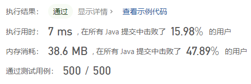
>
> **②优化**
>
> 其实可以发现归类，每隔5个数就会出现一个5，因此只需要求n中包含的5的个数即可
>
> 例如25！ = ...×5 ... ×10... ×15... ×20... ×25   （其中包含6个5，也就是25/5+ 25/5/5）
>
> ```java
> public int trailingZeroes(int n) {
>     int count = 0;
>     while (n > 0) {
>         count += n / 5;
>         n = n / 5;
>     }
>     return count;
> }
> ```
>


### 3.Excel表列序号

给你一个字符串 `columnTitle` ，表示 Excel 表格中的列名称。返回 *该列名称对应的列序号* 。

> ```
> A -> 1
> B -> 2
> C -> 3
> ...
> Z -> 26
> AA -> 27
> AB -> 28 
> ...
> ```

> **解题思路**
>
> 这道题也是一个计算，通过总结得出规律，（**看解析发现是26进制转换为10进制**）
>
> ```
> 如果是两位长度，例如ZY：26*26 + 25
> 
> 如果是三位长度，例如ZYY：26*26*26 + 26*25 + 25
> 
> 类推
> ```
>
> ```java
> public static int titleToNumber(String columnTitle) {
> 
>     int res = 0;
>     int len = columnTitle.length();
>     int temp = len - 1;
>     for (int i = 0; i < columnTitle.length(); i++) {
> 
>         int a = (int) (columnTitle.charAt(i) - 'A') + 1;
>         res += (int) (Math.pow(26, temp) * a);
>         temp--;
>     }
> 
>     return res;
> }
> ```
>
> 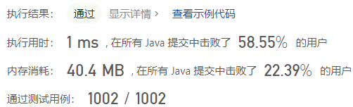

### 4.Pow(x, n)

实现 `pow(*x*, *n*)`，即计算 `x` 的整数 `n` 次幂函数（即，`xn` ）。

> ```
> 输入：x = 2.00000, n = 10
> 输出：1024.00000
> ```
>
> ```
> 输入：x = 2.10000, n = 3
> 输出：9.26100
> ```

> **解题思路**
>
> 这道题最开始想的暴力求解，一个数一个数的乘，但是如果数字太大，比如`0.0000001`这样的数字求幂，那会造成超时
>
> 看题解，发现了要通过**`幂指数折半法`**求解
>
> ```java
> // 幂指数折半法：2^8 = (2^4)*(2^4) = (4)^4 = (4^2)*(4^2) = (16)^2
> // 注意如果指数是奇数的情况，要多乘以一个底数
> public static double myPow(double x, int n) {
> 
>     double res = 1.0;
> 
>     int m = n;
>     while (m != 0) {
>         if (m % 2 != 0) {
>             res *= x;
>         }
>         x *= x;
>         m /= 2;
>     }
>     return n >= 0 ? res : 1 / res;
> }
> 
> ```
>


### 5.x 的平方根

给你一个非负整数 x ，计算并返回 x 的 算术平方根 。

由于返回类型是整数，结果只保留 整数部分 ，小数部分将被 舍去 。

> ```
> 输入：x = 4
> 输出：2
> ```
>
> ```
> 输入：x = 8
> 输出：2
> 解释：8 的算术平方根是 2.82842..., 由于返回类型是整数，小数部分将被舍去。
> ```

> **解题思路：**
>
> 这道题通过二分法来得到结果
>
> ```java
> public int mySqrt(int x) {
>     //二分查找，用x/m<m而不是m*m>x防止溢出
>     if(x == 1)
>         return 1;
>     int min = 0;
>     int max = x;
>     while(max-min>1)
>     {
>         int m = (max+min)/2;
>         if(x/m<m)
>             max = m;
>         else
>             min = m;
>     }
>     return min;
> 
> }
> ```

### 6.两数相除

给你两个整数，被除数 dividend 和除数 divisor。将两数相除，要求 不使用 乘法、除法和取余运算。

整数除法应该向零截断，也就是截去（truncate）其小数部分。例如，8.345 将被截断为 8 ，-2.7335 将被截断至 -2 。

返回被除数 dividend 除以除数 divisor 得到的 商 。

> 注意：假设我们的环境只能存储 32 位 有符号整数，其数值范围是 [−231,  231 − 1] 。本题中，如果商 严格大于 231 − 1 ，则返回 231 − 1 ；如果商 严格小于 -231 ，则返回 -231 。

> ```
> 输入: dividend = 10, divisor = 3
> 输出: 3
> 解释: 10/3 = 3.33333.. ，向零截断后得到 3 。
> ```


> **解题思路**
>
> 题目规定「只能存储 3232 位整数」，本题解的正文部分和代码中都不会使用任何 64位整数。
>
> > 首先对于溢出或者容易出错的边界情况进行讨论：
> >
> > - 当被除数为 32位有符号整数的最小值 −2^31 时：
> >   - 如果除数为 1，那么我们可以直接返回答案 −2^31；
> >   - 如果除数为 −1，那么答案为 2^31，产生了溢出。此时我们需要返回 2^31−1。
> > - 当除数为 32 位有符号整数的最小值 −2^31 时：
> >   - 如果被除数同样为 −2^31，那么我们可以直接返回答案 1；
> >   - 对于其余的情况，我们返回答案 0。
> > - 当被除数为 0时，我们可以直接返回答案 0。
> >
> > 因为需要考虑除数和被除数的正负情况，所以为了方便编码，**可以将被除数或者除数取相反数，使得它们符号相同。**将除数和被除数都变为负数，这样编码时候就只考虑一种情况，并且不会溢出(如果负数转为正数，例如-2^31变为2^31就溢出)
>
> **二分法：**
>
> > 记被除数为X,除数为Y，并且X和Y都是负数，需要找出X/Y的结果Z，Z一定是正数或者0。
> >
> > 根据除法以及余数的定义，我们可以将其改成乘法的等价形式，即：
> >
> > 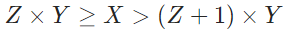
> >
> > 因此只需要通过二分法查找到Z即可，又因为不能使用乘法，因此使用`快速乘`(和Pow(x,n)中的快速幂类似，只是将乘改为加)
>
> ```java
> class Solution {
>     public int divide(int dividend, int divisor) {//被除数，除数
>         // 考虑被除数为最小值的情况
>         if (dividend == Integer.MIN_VALUE) {
>             if (divisor == 1) {
>                 return Integer.MIN_VALUE;
>             }
>             if (divisor == -1) {
>                 return Integer.MAX_VALUE;
>             }
>         }
>         // 考虑除数为最小值的情况
>         if (divisor == Integer.MIN_VALUE) {
>             return dividend == Integer.MIN_VALUE ? 1 : 0;
>         }
>         // 考虑被除数为 0 的情况
>         if (dividend == 0) {
>             return 0;
>         }
> 
>         // 一般情况，使用二分查找
>         // 将所有的正数取相反数，这样就只需要考虑一种情况
>         boolean rev = false;
>         if (dividend > 0) {
>             dividend = -dividend;
>             rev = !rev;
>         }
>         if (divisor > 0) {
>             divisor = -divisor;
>             rev = !rev;
>         }
> 
>         int left = 1, right = Integer.MAX_VALUE, ans = 0;
>         while (left <= right) {
>             // 注意溢出，并且不能使用除法
>             int mid = left + ((right - left) >> 1);
>             boolean check = quickAdd(divisor, mid, dividend);
>             if (check) {
>                 ans = mid;
>                 // 注意溢出
>                 if (mid == Integer.MAX_VALUE) {
>                     break;
>                 }
>                 left = mid + 1;
>             } else {
>                 right = mid - 1;
>             }
>         }
> 
>         return rev ? -ans : ans;
>     }
> 
>     // 快速乘
>     public boolean quickAdd(int y, int z, int x) {
>         // x 和 y 是负数，z 是正数
>         // 需要判断 z * y >= x 是否成立
>         int result = 0, add = y;
>         while (z != 0) {
>             if ((z & 1) != 0) {
>                 // 需要保证 result + add >= x
>                 if (result < x - add) {
>                     return false;
>                 }
>                 result += add;
>             }
>             if (z != 1) {
>                 // 需要保证 add + add >= x
>                 if (add < x - add) {
>                     return false;
>                 }
>                 add += add;
>             }
>             // 不能使用除法
>             z >>= 1;
>         }
>         return true;
>     }
> }
> ```
>


### 7.分数到小数

给定两个整数，分别表示分数的分子 numerator 和分母 denominator，以 字符串形式返回小数 。

如果小数部分为循环小数，则将循环的部分括在括号内。

如果存在多个答案，只需返回 任意一个 。

对于所有给定的输入，保证 答案字符串的长度小于 104 。

> ```
> 输入：numerator = 1, denominator = 2
> 输出："0.5"
> ```
>
> ```
> 输入：numerator = 2, denominator = 1
> 输出："2"
> ```
>
> ```
> 输入：numerator = 4, denominator = 333
> 输出："0.(012)"
> ```

> **解题思路：**
>
> **`长除法：`**
>
> 分数化为小数无非三种情况
>
> ```
> 1.分数能够化为整数
> 
> 2.分数能够化为有限小数 (1/2)
> 
> 3.分数能够化为无限循环小数(8/7,4/333)
> ```
>
> ①如果能够化为整数，那么直接返回结果即可
>
> ②如果是2,3情况，那么需要先计算整数，然后计算小数部分。然后进行拼接
>
> > 计算小数部分时，每次将余数乘以 10，然后计算小数的下一位数字，并得到新的余数。重复上述操作直到余数变成 
> > 0,或者找到循环节。
> >
> > - 如果余数变成 0，则结果是有限小数，将小数部分拼接到结果中。
> > - 如果找到循环节，则找到循环节的开始位置和结束位置并加上括号，然后将小数部分拼接到结果中。
> >
> > 如何找到循环节，对于相同的余数，计算得到的小数下一位数字一定是相同的，因此如果计算过程中发现某一位的余数在之前已经出现过，则找到循环节 ，通过hash表存储每个小数第一出现的位置。（**其实就是用代码复现一个除法的过程**）
> >
> > 
> >
> > 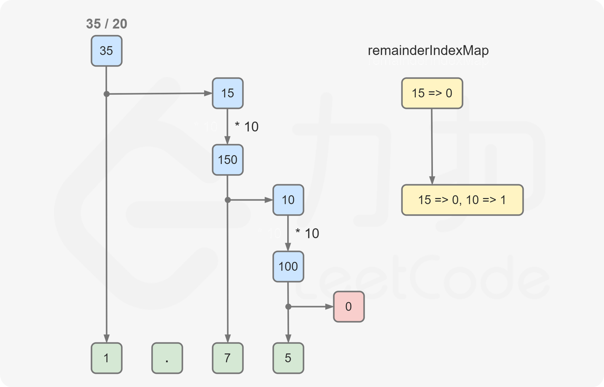
> >
> > 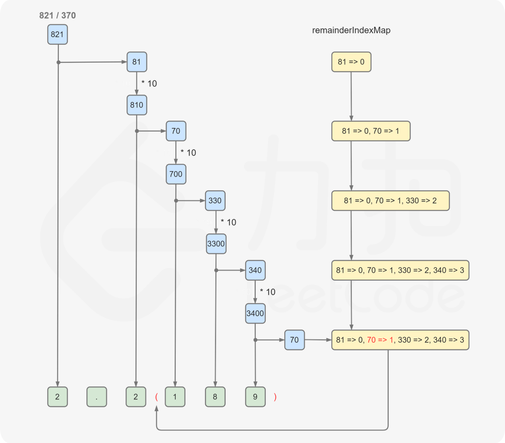
>
> ```java
> public static String fractionToDecimal(int numerator, int denominator) {
>     long numeratorLong = (long) numerator;// 防止溢出
>     long denominatorLong = (long) denominator;
>     if (numeratorLong % denominatorLong == 0) {
>         return String.valueOf(numeratorLong / denominatorLong);
>     }
> 
>     StringBuffer sb = new StringBuffer();
>     if (numeratorLong < 0 ^ denominatorLong < 0) {
>         sb.append('-');// 如果分子分母符号相反，则结果为负数
>     }
> 
>     // 整数部分
>     numeratorLong = Math.abs(numeratorLong);
>     denominatorLong = Math.abs(denominatorLong);
>     long integerPart = numeratorLong / denominatorLong;
>     sb.append(integerPart);
>     sb.append('.');
> 
>     // 小数部分
>     StringBuffer fractionPart = new StringBuffer();
>     Map<Long, Integer> remainderIndexMap = new HashMap<Long, Integer>();
>     long remainder = numeratorLong % denominatorLong;
>     int index = 0;
>     while (remainder != 0 && !remainderIndexMap.containsKey(remainder)) {
>         remainderIndexMap.put(remainder, index);
>         remainder *= 10;
>         fractionPart.append(remainder / denominatorLong);
>         remainder %= denominatorLong;
>         index++;
>     }
>     if (remainder != 0) { // 有循环节
>         int insertIndex = remainderIndexMap.get(remainder);
>         fractionPart.insert(insertIndex, '(');
>         fractionPart.append(')');
>     }
>     sb.append(fractionPart.toString());
> 
>     return sb.toString();
> }
> 
> ```
>


## 九、其他

### 1.两整数之和

给你两个整数 `a` 和 `b` ，**不使用** 运算符 `+` 和 `-` ，计算并返回两整数之和。

> ```
> 输入：a = 1, b = 2
> 输出：3
> ```

**解题思路：**

（1）`^`异或运算，用来求两个二进制位相加的情况，**但只能求得没有进位的部分**

```
0 + 0 = 0
0 + 1 = 1
1 + 0 = 1
1 + 1 = 0 (进位)
```

（2）`&`与运算，只有`1&1 =1`，因此可以求得进位的部分，然后左移就求得进位部分

（3）进位部分和没有进位部分相加最后就是结果


所以这道题先用与运算求进位结果，亦或运算求不带进位的结果

```java
public int getSum(int a, int b) {
    while (b != 0) {
        int carry = (a & b) << 1;//求进位情况，然后左移一位
        a = a ^ b;//亦或运算求没有进位的情况
        b = carry;//保存进位结果
    }
    return a;
}
```

