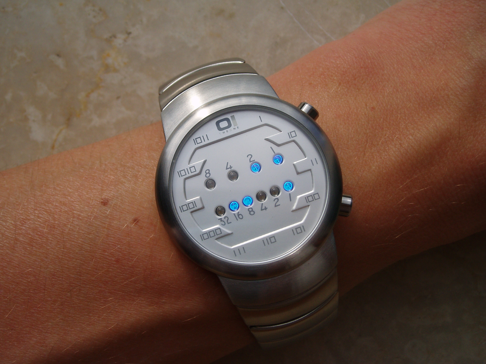

# 1.组合总和

给你一个 无重复元素 的整数数组 candidates 和一个目标整数 target ，找出 candidates 中可以使数字和为目标数 target 的 所有 不同组合 ，并以列表形式返回。你可以按 任意顺序 返回这些组合。

candidates 中的 同一个 数字可以 无限制重复被选取 。如果至少一个数字的被选数量不同，则两种组合是不同的。 

对于给定的输入，保证和为 target 的不同组合数少于 150 个。

> ```
> 输入：candidates = [2,3,6,7], target = 7
> 输出：[[2,2,3],[7]]
> 解释：
> 2 和 3 可以形成一组候选，2 + 2 + 3 = 7 。注意 2 可以使用多次。
> 7 也是一个候选， 7 = 7 。
> 仅有这两种组合。
> ```
>
> ```
> 输入: candidates = [2,3,5], target = 8
> 输出: [[2,2,2,2],[2,3,3],[3,5]]
> ```
>
> ```
> 输入: candidates = [2], target = 1
> 输出: []
> ```

> **解题思路：**
>
> 这道题是一道比较简单的回溯题目，主要是确保每一种可能性
>
> ```java
> public static List<List<Integer>> combinationSum(int[] candidates, int target) {
>     List<List<Integer>> res = new ArrayList<>();
>     Arrays.sort(candidates);
>     // System.out.println(candidates);
>     backtrack(candidates, target, res, 0, new ArrayList<Integer>());
>     return res;
> }
> 
> private static void backtrack(int[] candidates, int target, List<List<Integer>> res, int i,
>                               ArrayList<Integer> tmp_list) {
>     if (target < 0)
>         return;
>     if (target == 0) {
>         res.add(new ArrayList<>(tmp_list));
>         return;
>     }
>     for (int start = i; start < candidates.length; start++) {
>         if (target < 0)
>             break;
>         tmp_list.add(candidates[start]);
>         backtrack(candidates, target - candidates[start], res, start, tmp_list);
>         tmp_list.remove(tmp_list.size() - 1);
>     }
> }
> ```

# 2.全排列 II

 给定一个可包含重复数字的序列 `nums` ，***按任意顺序*** 返回所有不重复的全排列。 

> ```
> 输入：nums = [1,1,2]
> 输出：
> [[1,1,2],
>  [1,2,1],
>  [2,1,1]]
> ```
>
> ```
> 输入：nums = [1,2,3]
> 输出：[[1,2,3],[1,3,2],[2,1,3],[2,3,1],[3,1,2],[3,2,1]]
> ```
>
> 

> **解题思路：**
>
>  整个递归函数分为两个情况： 
>
> - 如果 *idx*=*n*，说明我们已经填完了 *n* 个位置，找到了一个可行的解，我们将 *perm* 放入答案数组中，递归结束。
> -  如果 *idx*<*n*，我们要考虑第 *idx* 个位置填哪个数。 因为题目要求，所以不能填重复的数字，因此用一个数组`vis`保存已经填过数字下标， 那么在填第 *idx* 个数的时候我们遍历题目给定的 *n* 个数，如果这个数没有被标记过，我们就尝试填入，并将其标记，继续尝试填下一个位置， 并且回溯的时候要撤销这个填过的位置。
> - 此外，对于相邻重复数字的问题，每一次需要提前判断，避免重复序列出现。
>
> ```java
> static boolean[] vis;// 用来标记已经选取的数
> 
> public static List<List<Integer>> permuteUnique(int[] nums) {
>     List<List<Integer>> ans = new ArrayList<List<Integer>>();
>     List<Integer> perm = new ArrayList<Integer>();
>     vis = new boolean[nums.length];
>     Arrays.sort(nums);// 先排序
>     backtrack(nums, ans, 0, perm);
>     return ans;
> }
> 
> public static void backtrack(int[] nums, List<List<Integer>> ans, int idx, List<Integer> perm) {
>     if (idx == nums.length) {
>         ans.add(new ArrayList<Integer>(perm));
>         return;
>     }
>     for (int i = 0; i < nums.length; ++i) {
>         // 因为最后结果序列不能够重复，所以这里进行判断
>         // "!vis[i-1]"这个判断条件，其实是针对相邻重复数去重，
>         // 假设1,1相邻，那么第一次递归就是一种情况
>         // 上面情况结束，进行回溯，第一个1的vis为false,在进行递归，如果不加以判断，又会出现重复情况，而上一次递归玩回溯已经vis[i-1]
>         // 为false，所以是判断"!vis[i-1]"这个情况
>         if (vis[i] || (i > 0 && nums[i] == nums[i - 1] && !vis[i - 1])) {
>             continue;
>         }
>         perm.add(nums[i]);
>         vis[i] = true;
>         backtrack(nums, ans, idx + 1, perm);
>         vis[i] = false;
>         perm.remove(idx);
>     }
> }
> ```
>


# 3.二进制手表

二进制手表顶部有 4 个 LED 代表 **小时（0-11）**，底部的 6 个 LED 代表 **分钟（0-59）**。每个 LED 代表一个 0 或 1，最低位在右侧。 


>  例如，下面的二进制手表读取 `"3:25"` 。
>
>  
>
> 给你一个整数 turnedOn ，表示当前亮着的 LED 的数量，返回二进制手表可以表示的所有可能时间。你可以 按任意顺序 返回答案。
>
> 小时不会以零开头：
>
> ​	`例如，"01:00" 是无效的时间，正确的写法应该是 "1:00" 。`
> 分钟必须由两位数组成，可能会以零开头：
>
> ​	`例如，"10:2" 是无效的时间，正确的写法应该是 "10:02" 。`

> ```
> 输入：turnedOn = 1
> 输出：["0:01","0:02","0:04","0:08","0:16","0:32","1:00","2:00","4:00","8:00"]
> ```
>
> ```
> 输入：turnedOn = 9
> 输出：[]
> ```

> **解题思路**
>
> 直接上代码吧，使用数组存储LED数，回溯函数中使用两个int存储小时和分钟
>
> ```java
> public static List<String> readBinaryWatch(int turnedOn) {
>     List<String> res = new ArrayList<>();
>     int[] hour_minute = { 8, 4, 2, 1, 32, 16, 8, 4, 2, 1 };
>     backTrace(turnedOn, hour_minute, 0, 0, 0, res);
> 
>     return res;
> }
> 
> static void backTrace(int num, int[] nums, int start, int hour, int minute, List<String> res) {
>     if (num == 0) {
>         //判断hour和minute是否合法
>         if (hour > 11 || minute > 59)
>             return;
>         StringBuilder sb = new StringBuilder();
>         sb.append(hour);
>         sb.append(":");
> 
>         // minute一定是两位
>         if (minute < 10)
>             sb.append("0" + minute);
>         else
>             sb.append(minute);
> 
>         res.add(sb.toString());
>         return;
>     }
> 
>     for (int i = start; i < nums.length; i++) {
>         if (i < 4)
>             hour += nums[i];
>         else
>             minute += nums[i];
>         backTrace(num - 1, nums, i + 1, hour, minute, res);
>         if (i < 4)
>             hour -= nums[i];
>         else
>             minute -= nums[i];
>     }
> }
> ```
>
> 