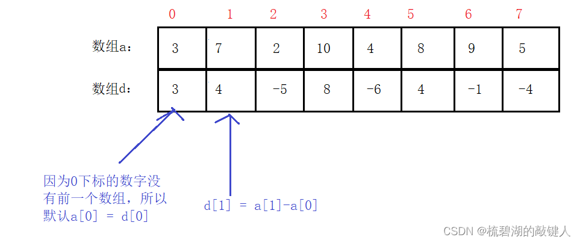
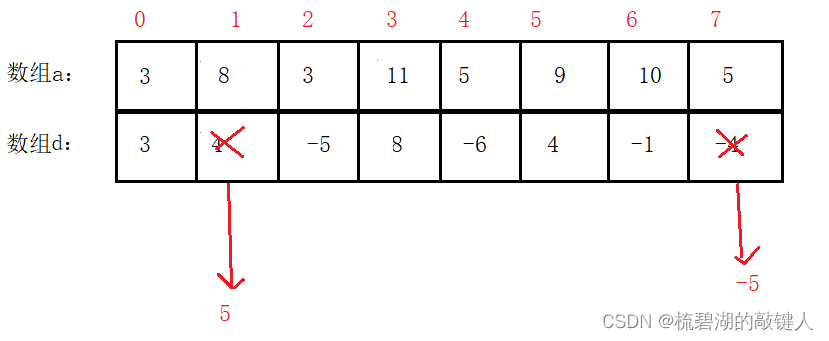

# 常用算法

## 一、五大算法

### 1.递归与分治

**递归算法：**直接或者间接不断反复调用自身来达到解决问题的方法。这就要求原始问题可以分解成相同问题的子问题。

示例：阶乘、斐波纳契数列、汉诺塔问题


**分治算法：**待解决复杂的问题能够简化为几个若干个小规模相同的问题，然后逐步划分，达到易于解决的程度。

示例：棋盘覆盖、找出伪币、求最值


### 2.动态规划

#### (1)基本概念

> 动态规划过程是：每次决策依赖于当前状态，又随即引起状态的转移。一个决策序列就是在变化的状态中产生出来的，所以，这种多阶段最优化决策解决问题的过程就称为动态规划。（例如Floyd算法求最优路径）


#### (2)算法基本思想和策略

**基本思想与分治法类似**，也是将待求解的问题分解为若干个子问题（阶段），按顺序求解子阶段，前一子问题的解，为后一子问题的求解提供了有用的信息。在求解任一子问题时，列出各种可能的局部解，通过决策保留那些有可能达到最优的局部解，丢弃其他局部解。依次解决各子问题，最后一个子问题就是初始问题的解。

   由于动态规划解决的问题多数有重叠子问题这个特点，为减少重复计算，对每一个子问题只解一次，将其不同阶段的不同状态保存在一个二维数组中。

   **与分治法最大的差别是**：<span style="color:red;">适合于用动态规划法求解的问题，经分解后得到的子问题往往不是互相独立的（即下一个子阶段的求解是建立在上一个子阶段的解的基础上，进行进一步的求解）。</span>


#### (3)适用情况

能采用动态规划求解的问题的一般要具有3个性质：

  (1) 最优化原理：如果问题的最优解所包含的子问题的解也是最优的，就称该问题具有最优子结构，即满足最优化原理。

  (2) 无后效性：即某阶段状态一旦确定，就不受这个状态以后决策的影响。也就是说，某状态以后的过程不会影响以前的状态，只与当前状态有关。

  （3）有重叠子问题：即子问题之间是不独立的，一个子问题在下一阶段决策中可能被多次使用到。（<font color='red'>该性质并不是动态规划适用的必要条件，但是如果没有这条性质，动态规划算法同其他算法相比就不具备优势</font>）


#### (4)求解基本步骤

动态规划所处理的问题是一个多阶段决策问题，一般由初始状态开始，通过对中间阶段决策的选择，达到结束状态。这些决策形成了一个决策序列，同时确定了完成整个过程的一条活动路线(通常是求最优的活动路线)。如图所示。动态规划的设计都有着一定的模式，一般要经历以下几个步骤。


​       <font color='red'>初始状态→│决策１│→│决策２│→…→│决策ｎ│→结束状态</font>

​         

  (1)**划分阶段**：按照问题的时间或空间特征，把问题分为若干个阶段。在划分阶段时，注意<font color='red'>划分后的阶段一定要是有序的或者是可排序的，否则问题就无法求解</font>。

  (2)**确定状态和状态变量**：将问题发展到各个阶段时所处于的各种客观情况用不同的状态表示出来。当然，状态的选择要满足无后效性。

  (3)**确定决策并写出状态转移方程**：因为决策和状态转移有着天然的联系，<font color='red'>状态转移就是根据上一阶段的状态和决策来导出本阶段的状态。所以如果确定了决策，状态转移方程也就可写出。但事实上常常是反过来做，根据相邻两个阶段的状态之间的关系来确定决策方法和状态转移方程</font>。

  (4)**寻找边界条件**：给出的状态转移方程是一个递推式，需要一个递推的终止条件或边界条件。

   一般，只要解决问题的阶段、状态和状态转移决策确定了，就可以写出状态转移方程（包括边界条件）。

实际应用中可以按以下几个简化的步骤进行设计：

   （1）分析最优解的性质，并刻画其结构特征。

   （2）递归的定义最优解。（递归可以替换成递推，只保留最优值，舍弃其他值，这样大大减少时间复杂度）

   （3）以自底向上或自顶向下的记忆化方式（备忘录法）计算出最优值

   （4）根据计算最优值时得到的信息，构造问题的最优解


#### (5)经典例子

##### ①**数字三角形问题：**


**在上面的数字三角形中寻找一条从顶部到底部的路径，使得路径上所经过的所有数字之和最大，只需求出这个最大和即可，不必给出具体路径。**


**分析：**

可以从题目中我们分析出，将最后一行作为边界，用二维数组存放数字三角形：

> **D( r , j )** :第r行第j个数字

定义一个递归函数：

> MaxSum（r , j）:从D（r , j）到底边的各条路径中，最佳路径数字之和

从D（r ,  j）出发，下一步不是D（r +1,  j）就是D（r +1,  j+1）：


**C++代码：**


上述代码虽然已经实现了功能，但是仔细观察就会发现会存在重复计算的情况，那么我们进行优化，使用一个二维数组保存每一次计算的值，这样避免了重复计算：


这就是使用递归的最优解，但是前面已经叙述过，在动态规划可以使用递推更由于递归，不仅是时间复杂度，空间复杂度也会的到优化。


##### ②**背包问题：**

- **1-0背包**

**题目描述：**

>  有一个背包，背包容量是M=150。有7个物品，物品可以分割成任意大小。 
> 要求尽可能让装入背包中的物品总价值最大，但不能超过总容量。 
> 物品 A B C D E F G 
> 重量 35 30 60 50 40 10 25 
> 价值 10 40 30 50 35 40 30 

设**第i个物品的重量为W[i]**，**i个物品的价值为V[i]**,我们的目标是书包内物品的总价值，而变量是物品和书包的限重，所以我们可定义状态dp:

```text
dp[i][j]表示将前i件物品装进限重为j的背包可以获得的最大价值, 0<=i<=N, 0<=j<=W
```

| 装载前N个物品 | 背包容量剩余0 | 背包容量剩余1 | ...... | 背包容量剩余max |
| ------------- | ------------- | ------------- | ------ | --------------- |
| 0             | 0             | 0             | ...    | 0               |
| 1             | 0             | 0             | ...    | 10              |
| 2             | 0             | 0             | ...    | 50              |
| 3             | ...           | ...           | ...    | ...             |
| ....          | ...           | ...           | ...    | ...             |
| 6             | ...           | ...           | ...    | ...             |

我们可以把`dp[i][j]`简化为以上表格，行下标代表装进前N个包，而纵下标代表背包剩余的容量，当背包容量剩余0是，能够装机的最大价值为0，一次类推。

所以我们只需要讨论两种情况：


代码核心思想为：

```java
for (int i=1; i<=N; i++)  
        for (int j=1; j<=M; j++)  
        {  
            if (weight[i]<=j)
            {  
                f[i][j]=max(f[i-1][j],f[i-1][j-weight[i]]+value[i]);  
            }  
            else  
                f[i][j]=f[i-1][j];  
        }  
```

由上述状态转移方程可知，`dp[i][j]`的值只与`dp[i-1][0,...,j-1]`有关，所以我们可以采用动态规划常用的方法（滚动数组）对空间进行优化（即去掉dp的第一维）。需要注意的是，为了防止上一层循环的`dp[0,...,j-1]`被覆盖，循环的时候 j 只能**逆向枚举**（空间优化前没有这个限制），伪代码为：

```java
// 01背包问题伪代码(空间优化版)
dp[0,...,W] = 0
for i = 1,...,N
    for j = W,...,w[i] // 必须逆向枚举!!!
        dp[j] = max(dp[j], dp[j−w[i]]+v[i])
```


**完全背包问题**


>  参考--：https://zhuanlan.zhihu.com/p/93857890/**、**https://blog.csdn.net/qq_39630587/article/details/77535557**


### 3.贪心算法

#### (1)基本概念

**贪心算法是就问题而言，选择当下最好的选择，而不从整体最优考虑，通过局部最优希望导致全局最优。贪心算法一定要确保无后效性，并且要经过验证**

#### (2)基本思路

1.建立数学模型来描述问题。

2.把求解的问题分成若干个子问题。

3.对每一子问题求解，得到子问题的局部最优解。

4.把子问题的解局部最优解合成原来解问题的一个解。


#### (3)适用情况

贪心策略适用的前提是：局部最优策略能导致产生全局最优解。


#### (4)存在问题

1. <font color="red">不能保证求得的最后解是最佳的；</font>

2. 不能用来求最大或最小解问题；

3. 只能求满足某些约束条件的可行解的范围。

   

#### (5)经典例子

**示例：背包问题，均分纸牌，最大整数**

##### ①**背包问题**

> **题目描述：**
>
> 有一个背包，背包容量是M=150。有7个物品，物品可以分割成任意大小。 
> 要求尽可能让装入背包中的物品总价值最大，但不能超过总容量。 
> 物品 A B C D E F G 
> 重量 35 30 60 50 40 10 25 
> 价值 10 40 30 50 35 40 30 

分析题目要求可以得到三种能够使用贪心策略的解决方案

（1）根据贪心的策略，每次挑选价值最大的物品装入背包，得到的结果是否最优？ 
（2）每次挑选所占重量最小的物品装入是否能得到最优解？ 
（3）每次选取单位重量价值最大的物品，是否成为解本题的策略? 


贪心算法是很常见的算法之一，这是由于它简单易行，构造贪心策略简单。<font color='red'>但是，它需要证明后才能真正运用到题目的算法中</font>。一般来说，贪心算法的证明围绕着整个问题的最优解一定由在贪心策略中存在的子问题的最优解得来的。

**对于本例题中的3种贪心策略，都无法成立，即无法被证明，解释如下：** 
（1）贪心策略：选取价值最大者。反例： 
W=30 
物品：A B C 
重量：28 12 12 
价值：30 20 20 
根据策略，首先选取物品A，接下来就无法再选取了，可是，选取B、C则更好。 
（2）贪心策略：选取重量最小。它的反例与第一种策略的反例差不多。 
（3）贪心策略：选取单位重量价值最大的物品。反例： 
W=30 
物品：A B C 
重量：28 20 10 
价值：28 20 10 
根据策略，三种物品单位重量价值一样，程序无法依据现有策略作出判断，如果选择A，则答案错误。 
值得注意的是，贪心算法并不是完全不可以使用，贪心策略一旦经过证明成立后，它就是一种高效的算法。比如，求最小生成树的Prim算法和Kruskal算法都是漂亮的贪心算法。 


**背包问题的解决方法是使用动态规划**

##### ②**均分纸牌**

有N堆纸牌，编号分别为1，2，…，n。每堆上有若干张,但**纸牌总数必为n的倍数**.可以在任一堆上取若干张纸牌,然后移动。移牌的规则为：在编号为1上取的纸牌，只能移到编号为2的堆上；在编号为n的堆上取的纸牌，只能移到编号为n-1的堆上；其他堆上取的纸牌，可以移到相邻左边或右边的堆上。现在要求找出一种移动方法，用最少的移动次数使每堆上纸牌数都一样多。例如：n=4，4堆纸牌分别为：① 9 ② 8 ③ 17 ④ 6 移动三次可以达到目的：从③取4张牌放到④ 再从③区3张放到②然后从②去1张放到①。 
输入输出样例：4 
9 8 17 6 
屏幕显示：3 
算法分析：设**a[i]为第I堆纸牌的张数（0<=I<=n），v为均分后每堆纸牌的张数，s为最小移动次数。** 
我们用贪心算法，按照从左到右的顺序移动纸牌。如第I堆的纸牌数不等于平均值，则移动一次（即s加1），分两种情况移动： 
**1．若a[i]>v，则将a[i]-v张从第I堆移动到第I+1堆；** 
**2．若a[i]< v，则将v-a[i]张从第I+1堆移动到第I堆。**

为了设计的方便，我们**把这两种情况统一看作是将a[i]-v从第I堆移动到第I+1堆，移动后有a[i]=v; a[I+1]=a[I+1]+a[i]-v.** 
在从第I+1堆取出纸牌补充第I堆的过程中可能回出现第I+1堆的纸牌小于零的情况。 
如n=3，三堆指派数为1 2 27 ，这时v=10，为了使第一堆为10，要从第二堆移9张到第一堆，而第二堆只有2张可以移，这是不是意味着刚才使用贪心法是错误的呢？ 
我们继续按规则分析移牌过程，从第二堆移出9张到第一堆后，第一堆有10张，第二堆剩下-7张，在从第三堆移动17张到第二堆，刚好三堆纸牌都是10，最后结果是对的，我们在移动过程中，只是改变了移动的顺序，而移动次数不便，因此此题使用贪心法可行的。

```java
public void testMoveCard() {
    //总共4堆
    int heap = 4;
//        int[] cards = {9, 8, 17, 6};
    int[] cards = {10, 10, 20, 0};
    int count = moveCards(cards, heap);
    System.out.println("移动次数:" + count);
    for (int i = 0; i < cards.length; i++) {
        System.out.println("第" + (i + 1) + "堆牌数:" + cards[i]);
    }
}
 
/**
 * 均分纸牌
 * @param cards
 * @param heap
 * @return
 */
public int moveCards(int[] cards, int heap) {
    //总牌数
    int sum = 0;
    for (int i = 0; i < cards.length; i++) {
        sum += cards[i];
    }
    //每堆平均牌数
    int avg = sum / heap;
    //移动次数
    int count = 0;
    for (int i = 0; i < cards.length; i++) {
        if(cards[i] != avg) {
            int moveCards = cards[i] - avg;
            cards[i] -= moveCards;
            cards[i + 1] += moveCards;
            count++;
        }
    }
    return count;
}
```


##### ③**最大整数**

设有n个正整数，将它们连接成一排，组成一个最大的多位整数。 
例如：n=3时，3个整数13，312，343，连成的最大整数为34331213。 
又如：n=4时，4个整数7，13，4，246，连成的最大整数为7424613。 
输入：n 
N个数 
输出：连成的多位数 
算法分析：此题很容易想到使用贪心法，在考试时有很多同学把整数按从大到小的顺序连接起来，测试题目的例子也都符合，但最后测试的结果却不全对。按这种标准，我们很容易找到反例：12，121应该组成12121而非12112，那么是不是相互包含的时候就从小到大呢？也不一定，如12，123就是12312而非12123，这种情况就有很多种了。是不是此题不能用贪心法呢？ 
其实此题可以用贪心法来求解，只是刚才的标准不对，正确的标准是：**先把整数转换成字符串，然后在比较a+b和b+a，如果a+b>=b+a，就把a排在b的前面，反之则把a排在b的后面。**

```java
public void testMaxNum() {
    //有n个正整数，将它们连接成一排，组成一个最大的多位整数
    //12112错误
    //12121正解
//        int[] nums = {12, 121};
    int[] nums = {12, 123};
    String result = maxNum(nums);
    System.out.println("组成最大整数:" + result);
}
 
/**
 * 根据给定的整数组成最大的多位数
 * @param nums
 */
public String maxNum(int[] nums) {
    String result = "";
    for (int i = 0; i < nums.length; i++) {
        String num1 = nums[i] + "";
        for (int j = 1; j < nums.length; j++) {
            String num2 = nums[j] + "";
            if ((num1 + num2).compareTo(num2 + num1) < 0) {
                int temp = nums[j];
                nums[j] = nums[i];
                nums[i] = temp;
            }
        }
    }
    for (int i = 0; i < nums.length; i++) {
        result += nums[i];
    }
    return result;
}
```


### 4.回溯算法

#### (1)基本概念

**回溯法是一种搜索算法**，从根节点出发，按照**深度优先搜索**的策略进行搜索，到达某一节点后 ，探索该节点是否包含该问题的解，如果包含则进入下一个节点进行搜索，若是不包含则回溯到父节点选择其他支路进行搜索。

回溯法的设计步骤：

1）针对所给的原问题，定义问题的解空间

2）确定易于搜索的解空间结构

3）以深度优先方式搜索解空间，并在搜索过程中**用剪枝函数除去无效搜索**。

示例：0-背包问题、旅行商问题、八皇后问题

#### (2)实现方法

**递归：**

思路简单，设计容易，但效率低，其设计范式如下

```pseudocode
//针对N叉树的递归回溯方法  
void backtrack (int t)  
{  
    if (t>n) output(x); //叶子节点，输出结果，x是可行解  
    else  
       for i = 1 to k//当前节点的所有子节点  
        {  
            x[t]=value(i); //每个子节点的值赋值给x  
            //满足约束条件和限界条件  
          if (constraint(t)&&bound(t))   
                backtrack(t+1);  //递归下一层  
        }  
}  
```

​	

**递推：**

算法设计相对复杂，但效率高。

```pseudocode
//针对N叉树的迭代回溯方法  
void iterativeBacktrack ()  
{  
    int t=1;  
    while (t>0) {  
        if(ExistSubNode(t)) //当前节点的存在子节点  
        {  
            for i = 1 to k  //遍历当前节点的所有子节点  
            {  
                x[t]=value(i);//每个子节点的值赋值给x  
                if (constraint(t)&&bound(t))//满足约束条件和限界条件   
                {  
                    //solution表示在节点t处得到了一个解  
                    if (solution(t)) output(x);//得到问题的一个可行解，输出  
                    else t++;//没有得到解，继续向下搜索  
                }  
            }  
        }  
        else //不存在子节点，返回上一层  
        {  
            t--;  
        }  
    }  
}  
```

#### (3)解空间

定义问题的解空间，转化成树（即解空间树）。解空间树分为两种：子集树和排列树。两种在算法结构和思路上大体相同。

**子集树**

所给的问题是从n个元素的集合S中找出满足某种性质的子集时，相应的解空间成为子集树。如0-1背包问题，从所给重量、价值不同的物品中挑选几个物品放入背包，使得在满足背包不超重的情况下，背包内物品价值最大。它的解空间就是一个典型的子集树。

​    回溯法搜索子集树的算法范式如下：

```pseudocode
void backtrack (int t)  
{  
  if (t>n) output(x);  
    else  
      for (int i=0;i<=1;i++) {  
        x[t]=i;  
        if (constraint(t)&&bound(t)) backtrack(t+1);  
      }  
}  
```


**排列树**

 所给的问题是确定n个元素满足某种性质的排列时，相应的解空间就是排列树。
如旅行售货员问题，一个售货员把几个城市旅行一遍，要求走的路程最小。它的解就是几个城市的排列，解空间就是排列树。
   回溯法搜索排列树的算法范式如下：

```pseudocode
void backtrack (int t)  
{  
  if (t>n) output(x);  
    else  
      for (int i=t;i<=n;i++) {  
        swap(x[t], x[i]);  
        if (constraint(t)&&bound(t)) backtrack(t+1);  
        swap(x[t], x[i]);  
      }  
}   
```


#### (4)经典例子

#####  ①0-1背包问题

​    **问题：**给定n种物品和一背包。物品i的重量是wi，其价值为pi，背包的容量为C。问应如何选择装入背包的物品，使得装入背包中物品的总价值最大?
​    **分析：**问题是n个物品中选择部分物品，可知，问题的解空间是子集树。比如物品数目n=3时，其解空间树如下图，边为1代表选择该物品，边为0代表不选择该物品。使用x[i]表示物品i是否放入背包，x[i]=0表示不放，x[i]=1表示放入。回溯搜索过程，如果来到了叶子节点，表示一条搜索路径结束，如果该路径上存在更优的解，则保存下来。如果不是叶子节点，是中点的节点（如B），就遍历其子节点（D和E），如果子节点满足剪枝条件，就继续回溯搜索子节点。


```c
#include <stdio.h>  
   
#define N 3         //物品的数量  
#define C 16        //背包的容量  
   
int w[N]={10,8,5};  //每个物品的重量  
int v[N]={5,4,1};   //每个物品的价值  
int x[N]={0,0,0};   //x[i]=1代表物品i放入背包，0代表不放入  
   
int CurWeight = 0;  //当前放入背包的物品总重量  
int CurValue = 0;   //当前放入背包的物品总价值  
   
int BestValue = 0;  //最优值；当前的最大价值，初始化为0  
int BestX[N];       //最优解；BestX[i]=1代表物品i放入背包，0代表不放入  
   
//t = 0 to N-1  
void backtrack(int t)  
{  
    //叶子节点，输出结果  
    if(t>N-1)   
    {  
        //如果找到了一个更优的解  
        if(CurValue>BestValue)  
        {  
            //保存更优的值和解  
            BestValue = CurValue;  
            for(int i=0;i<N;++i) BestX[i] = x[i];  
        }  
    }  
    else  
    {  
        //遍历当前节点的子节点：0 不放入背包，1放入背包  
        for(int i=0;i<=1;++i)  
        {  
            x[t]=i;  
   
            if(i==0) //不放入背包  
            {  
                backtrack(t+1);  
            }  
            else //放入背包  
            {  
                 //约束条件：放的下  
                if((CurWeight+w[t])<=C)  
                {  
                    CurWeight += w[t];  
                    CurValue += v[t];  
                    backtrack(t+1);  
                    CurWeight -= w[t];  
                    CurValue -= v[t];  
                }  
            }  
        }  
        //PS:上述代码为了更符合递归回溯的范式，并不够简洁  
    }  
}  
   
int main(int argc, char* argv[])  
{  
    backtrack(0);  
   
    printf("最优值：%d\n",BestValue);  
   
    for(int i=0;i<N;i++)  
    {  
       printf("最优解：%-3d",BestX[i]);  
    }  
    return 0;  
}  
```


##### ②N皇后问题

**问题：**在n×n格的棋盘上放置彼此不受攻击的n个皇后。按照国际象棋的规则，皇后可以攻击与之处在同一行或同一列或同一斜线上的棋子。

​    N皇后问题等价于在n×n格的棋盘上放置n个皇后，任何2个皇后不放在同一行或同一列或同一斜线上。

   **分析：**从n×n个格子中选择n个格子摆放皇后。可见解空间树为子集树。

   使用Board[N][N]来表示棋盘，Board[i][j]=0 表示(I,j)位置为空，Board[i][j]=1 表示(I,j)位置摆放有一个皇后。

   全局变量way表示总共的摆放方法数目。

   使用Queen(t)来摆放第t个皇后。Queen(t) 函数符合子集树时的递归回溯范式。当t>N时，说明所有皇后都已经摆  放完成，这是一个可行的摆放方法，输出结果；否则，遍历棋盘，找皇后t所有可行的摆放位置，Feasible(i,j) 判断皇后t能否摆放在位置(i,j)处，如果可以摆放则继续递归摆放皇后t+1，如果不能摆放，则判断下一个位置。

​    Feasible(row,col)函数首先判断位置(row,col)是否合法，继而判断(row,col)处是否已有皇后，有则冲突，返回0，无则继续判断行、列、斜方向是否冲突。斜方向分为左上角、左下角、右上角、右下角四个方向，每次从（row,col）向四个方向延伸一个格子，判断是否冲突。如果所有方向都没有冲突，则返回1，表示此位置可以摆放一个皇后。


```c
#include <stdio.h>  
   
#define N 8  
   
int Board[N][N];//棋盘 0表示空白 1表示有皇后  
int way;//摆放的方法数  
   
   
//判断能否在(x,y)的位置摆放一个皇后；0不可以，1可以  
int Feasible(int row,int col)  
{  
    //位置不合法  
    if(row>N || row<0 || col >N || col<0)  
        return 0;  
   
    //该位置已经有皇后了，不能  
    if(Board[row][col] != 0)  
    {   //在行列冲突判断中也包含了该判断，单独提出来为了提高效率  
        return 0;  
    }  
   
    //  
    //下面判断是否和已有的冲突  
   
    //行和列是否冲突  
    for(int i=0;i<N;++i)  
    {  
        if(Board[row][i] != 0 || Board[i][col]!=0)  
            return 0;  
    }  
   
    //斜线方向冲突  
   
    for(int i=1;i<N;++i)  
    {  
/* i表示从当前点(row,col)向四个斜方向扩展的长度 
  
左上角 \  / 右上角   i=2 
        \/           i=1 
        /\           i=1 
左下角 /  \ 右下角   i=2 
*/  
        //左上角  
        if((row-i)>=0 && (col-i)>=0)    //位置合法  
        {  
            if(Board[row-i][col-i] != 0)//此处已有皇后，冲突  
                return 0;  
        }  
   
        //左下角  
        if((row+i)<N && (col-i)>=0)  
        {  
            if(Board[row+i][col-i] != 0)  
                return 0;  
        }  
   
        //右上角  
        if((row-i)>=0 && (col+i)<N)  
        {  
            if(Board[row-i][col+i] != 0)  
                return 0;  
        }  
   
        //右下角  
        if((row+i)<N && (col+i)<N)  
        {  
            if(Board[row+i][col+i] != 0)  
                return 0;  
        }  
    }  
   
    return 1; //不会发生冲突，返回1  
}  
   
   
//摆放第t个皇后 ；从1开始  
void Queen(int t)  
{  
    //摆放完成，输出结果  
    if(t>N)  
    {  
        way++;  
        /*如果N较大，输出结果会很慢；N较小时，可以用下面代码输出结果 
        for(int i=0;i<N;++i){ 
            for(int j=0;j<N;++j) 
                printf("%-3d",Board[i][j]); 
            printf("\n"); 
        } 
        printf("\n------------------------\n\n"); 
        */  
    }  
    else  
    {  
        for(int i=0;i<N;++i)  
        {  
            for(int j=0;j<N;++j)  
            {  
                //（i,j）位置可以摆放皇后，不冲突  
                if(Feasible(i,j))  
                {  
                    Board[i][j] = 1;  //摆放皇后t  
                    Queen(t+1);       //递归摆放皇后t+1  
                    Board[i][j] = 0;  //恢复  
                }  
            }  
        }  
    }  
}  
   
//返回num的阶乘,num!  
int factorial(int num)  
{  
    if(num==0 || num==1)  
        return 1;  
    return num*factorial(num-1);  
}  
   
   
int main(int argc, char* argv[])  
{  
    //初始化  
    for(int i=0;i<N;++i)  
    {  
        for(int j=0;j<N;++j)  
        {  
            Board[i][j]=0;  
        }  
    }  
   
    way = 0;  
   
    Queen(1);  //从第1个皇后开始摆放  
   
    //如果每个皇后都不同  
    printf("考虑每个皇后都不同，摆放方法：%d\n",way);//N=8时, way=3709440 种  
   
    //如果每个皇后都一样，那么需要除以 N！出去重复的答案（因为相同，则每个皇后可任意调换位置）  
    printf("考虑每个皇后都不同，摆放方法：%d\n",way/factorial(N));//N=8时, way=3709440/8! = 92种  
   
    return 0;  
}  
```


##### ③迷宫问题

**问题：**给定一个迷宫，找到从入口到出口的所有可行路径，并给出其中最短的路径

**分析：**用二维数组来表示迷宫，则走迷宫问题用回溯法解决的的思想类似于图的深度遍历。从入口开始，选择下一个可以走的位置，如果位置可走，则继续往前，如果位置不可走，则返回上一个位置，重新选择另一个位置作为下一步位置。


> 参考--https://blog.csdn.net/weiyuefei/article/details/79316653


### 5.分支限界法

**和回溯法相似，也是一种搜索算法，但回溯法是找出问题的许多解，而分支限界法是找出原问题的一个解。**或是在满足约束条件的解中找出使某一目标函数值达到极大或极小的解，即在某种意义下的最优解

在当前节点（扩展节点）处，先生成其所有的儿子节点（分支），然后再从当前的活节点（当前节点的子节点）表中选择下一个扩展节点。为了有效地选择下一个扩展节点，加速搜索的进程，在每一个活节点处，计算一个函数值（限界），并根据函数值，从当前活节点表中选择一个最有利的节点作为扩展节点，使搜索朝着解空间上有最优解的分支推进，以便尽快地找出一个最优解。

分支限界法：

1）FIFO分支限界法

3）优先队列分支限界法：按照优先队列中规定的优先级选取优先级最高的节点成为当前扩展节点。

示例：装载问题，旅行售货员问题


## 二、其他算法

### 1.KMP算法

#### 概述

KMP（Knuth-Morris-Pratt 算法）算法是一个字符串匹配算法，

> **本文用 `pat` 表示模式串，长度为 `M`，`txt` 表示文本串，长度为 `N`。KMP 算法是在 `txt` 中查找子串 `pat`，如果存在，返回这个子串的起始索引，否则返回 -1**。


首先看一下KMP和暴力算法区别，暴力的字符串匹配算法很容易写，看一下它的运行逻辑：

```pseudocode
// 暴力匹配（伪代码）
int search(String pat, String txt) {
    int M = pat.length;
    int N = txt.length;
    for (int i = 0; i <= N - M; i++) {
        int j;
        for (j = 0; j < M; j++) {
            if (pat[j] != txt[i+j])
                break;
        }
        // pat 全都匹配了
        if (j == M) return i;
    }
    // txt 中不存在 pat 子串
    return -1;
}
```

对于暴力算法，如果出现不匹配字符，同时回退 `txt` 和 `pat` 的指针，嵌套 for 循环，时间复杂度 `O(M*N)`，空间复杂度`O(1)`。最主要的问题是，如果字符串中重复的字符比较多，该算法就显得很蠢。

`比如 txt = "aaacaaab" pat = "aaab"：`


很明显，`pat` 中根本没有字符 c，根本没必要回退指针 `i`，暴力解法明显多做了很多不必要的操作。

而KMP算法会花费空间来记录匹配位置，从而避免一些不必要的匹配操作：


再比如类似的 txt = "aaaaaaab" pat = "aaab"，暴力解法还会和上面那个例子一样蠢蠢地回退指针 `i`，而 KMP 算法又会耍聪明：


#### 设计算法

> 规定i是主串S的下标，j是模式T的下标。现在假设现在主串S匹配到 i 位置，模式串T匹配到 j 位置。
>
> 如果j = -1，则i++，j++，继续匹配下一个字符；
> 如果S[i] = T[j]，则i++，j++，继续匹配下一个字符；
> 如果j != -1，且S[i] != P[j]，则 i 不变，j = next[j]。此举意味着失配时，接下来模式串T要相对于主串S向右移动j - next [j] 位。


```java
int KMP(int start,char S[],char T[])
{
	int i=start,j=0;
	while(S[i]!='\0'&&T[j]!='\0')
	{
		if(j==-1||S[i]==T[j])
		{
			i++;         //继续对下一个字符比较 
			j++;         //模式串向右滑动 
		}
		else j=next[j];
	}
	if(T[j]=='\0') return (i-j);    //匹配成功返回下标 
	else return -1;                 //匹配失败返回-1 
}
```


**next是什么？？？它是怎么来的？？？**

首先我们来解释一个名词：最长公共前后缀。假设有一个串P=“p0p1p2 …pj-1pj”。如果存在p0p1…pk-1pk = pj-kpj-k+1…pj-1pj，我们就说在P串中有一个最大长度为k+1的公共前后缀。

> - 找前缀时，要找除了最后一个字符的所有子串。
> - 找后缀时，要找除了第一个字符的所有子串。


接下来我们就用这个表来引出next数组，next 数组的值是**除当前字符外**（**注意不包括当前字符**）的公共前后缀最长长度，相当于把上表做一个变形，将表中公共前后缀最长长度全部右移一位，第一个值赋为-1。例如c对应next值的意义是2，c之前（不包括c）的子串abaab所拥有的公共前后缀最长长度为2，我们称next数组中的值为失效函数值，也就是c的失效函数值为2。（当然这是我们手动推得，我们后续会用编程思想来推得next数组）


**那么如何求得next数组?**

我们很容易的可以知道，next[0] = -1。next[1] = 0也是容易推得的。那么当j>1时，如果我们已知了next[j]，那么next[j+1]怎么求得呢？？？

假定我们给定了某模式串，且已知next[j] = k，现在求得next[j+1]等于多少。

我们分两种情况分析：

1. 当pk=pj时，next[j + 1] = next[j] + 1 = k + 1，代表字符E前的模式串中，有长度k+1 的最大公共前后缀。


2.当pk ! = pj时，说明p0p1…pk-1pk != pj-kpj-k+1…pj-1pj，这时ABC与ABD不相同，也就是字符E前的模式串中没有长度为k+1的最大公共前后缀，所以next[j + 1] = next[j] + 1不再适用，我们只能寻找更短的最大公共前后缀。


这样看来，如果我们能在p0p1…pk-1pk中不断递归索引k = next[k]，找到一个字符pk’，也是D的话，那么最大公共前后缀长度就为k’+1。此时pk’=pj，且p0p1…pk’-1pk’ = pj-k’pj-k’+1…pj-1pj。从而next[j+1] = k’ + 1 = next[k’] + 1。否则前缀没有D，next[j+1] = 0。
所以得出递推代码

```java
void GetNext(char T[])
{
	int j=0,k=-1;
	next[j]=k;
	while(T[j]!='\0')
	{
		if(k==-1||T[j]==T[k])
		{
			j++;
			k++;
			next[j]=k;
		}
		else k=next[k];
	}
}
```


**java代码：**

```java
/**
     *
     * @param s  目标串
     * @param t  模式串
     * @return   s匹配到t的起始下标
     */
static int KMP(String s, String t){
    char[] ss=s.toCharArray();
    char[] tt=t.toCharArray();
    int[] next=getNext(tt);
    int i=0,j=0;
    int slen=ss.length,tlen=tt.length;
    while(i<slen && j<tlen){
        if(j==-1 || ss[i]==tt[j]){
            i++;j++;
        }
        else j=next[j];
    }
    if(j==tlen) return i-j;  //匹配成功返回下标
    return -1;
}

/**
     * @return 获取t的next数组,next[i]代表t中下标i之前的字符串的最大公共前后缀的长度
     * @param tt  模式串
     */
static int[] getNext(char[] tt){
    int j=0,k=-1;
    int len=tt.length;
    int[] next=new int[len];
    next[j]=k;
    while(j<len-1){
        if(k==-1 || tt[j]==tt[k]){
            next[++j]=++k;
        }
        else k=next[k];
    }
    return next;
}
```

> 参考--https://blog.csdn.net/yyzsir/article/details/89462339


#### *通过有穷状态机的思想:

KMP算法关键在于如何保存每一次匹配之后的状态信息，然后下一次可以利用状态信息更方便、快速的进行下一次匹配，其实和动态规划的`dp数组`类似（参考背包问题），`dp数组`保存的是一系列状态，通过匹配模式`pat`来创建`dp数组`，这样对于同一个`pat`任何的`text`都可以使用。

```pseudocode
public class KMP {
    private int[][] dp;
    private String pat;

    public KMP(String pat) {
        this.pat = pat;
        // 通过 pat 构建 dp 数组
        // 需要 O(M) 时间
    }

    public int search(String txt) {
        // 借助 dp 数组去匹配 txt
        // 需要 O(N) 时间
    }
}
```


KMP算法和状态机有很大关系,可以认为 `pat` 的匹配就是状态的转移。比如当 pat = "ABABC"：


如上图，圆圈内的数字就是状态，状态 0 是起始状态，状态 5（`pat.length`）是终止状态。开始匹配时 `pat` 处于起始状态，一旦转移到终止状态，就说明在 `txt` 中找到了 `pat`。比如说当前处于状态 2，就说明字符 "AB" 被匹配：


另外，处于不同状态时，`pat` 状态转移的行为也不同。比如说假设现在匹配到了状态 4，如果遇到字符 A 就应该转移到状态 3，遇到字符 C 就应该转移到状态 5，如果遇到字符 B 就应该转移到状态 0：


**举个例子：**


如果遇到了字符 "A"，根据箭头指示，转移到状态 3 是最聪明的：


如果遇到了字符 "B"，根据箭头指示，只能转移到状态 0（一夜回到解放前）：


通过以上分析我们设计出基本变量

```pseudocode
dp[j][c] = next
0 <= j < M，代表当前的状态
0 <= c < 256，代表遇到的字符（ASCII 码）
0 <= next <= M，代表下一个状态

dp[4]['A'] = 3 表示：
当前是状态 4，如果遇到字符 A，
pat 应该转移到状态 3

dp[1]['B'] = 2 表示：
当前是状态 1，如果遇到字符 B，
pat 应该转移到状态 2
```

可以先写出 KMP 算法的 search 函数代码：

```java
public int search(String txt) {
    int M = pat.length();
    int N = txt.length();
    // pat 的初始态为 0
    int j = 0;
    for (int i = 0; i < N; i++) {
        // 当前是状态 j，遇到字符 txt[i]，
        // pat 应该转移到哪个状态？
        j = dp[j][txt.charAt(i)];
        // 如果达到终止态，返回匹配开头的索引
        if (j == M) return i - M + 1;
    }
    // 没到达终止态，匹配失败
    return -1;
}
```

**！！！！构建状态转移数组**

通过前面的分析，构建框架就是这样的：

```pseudocode
for 0 <= j < M: # 状态
    for 0 <= c < 256: # 字符
        dp[j][c] = next
```

如果当前字符匹配`pat[j]`那么状态就推进，否则就回退，而KMP算法就是要尽可能避免多余的回退，所以此时需要另外一个指针来确保回退的位置，这个指针设为X：

```pseudocode
int X # 影子状态
for 0 <= j < M:
    for 0 <= c < 256:
        if c == pat[j]:
            # 状态推进
            dp[j][c] = j + 1
        else: 
            # 状态重启
            # 委托 X 计算重启位置
            dp[j][c] = dp[X][c] 
```


**代码：**

```java
public class KMP {
    private int[][] dp;
    private String pat;

    public KMP(String pat) {
        this.pat = pat;
        int M = pat.length();
        // dp[状态][字符] = 下个状态
        dp = new int[M][256];
        // base case
        dp[0][pat.charAt(0)] = 1;
        // 影子状态 X 初始为 0
        int X = 0;
        // 当前状态 j 从 1 开始
        for (int j = 1; j < M; j++) {
            for (int c = 0; c < 256; c++) {
                if (pat.charAt(j) == c) 
                    dp[j][c] = j + 1;
                else 
                    dp[j][c] = dp[X][c];
            }
            // 更新影子状态
            X = dp[X][pat.charAt(j)];
        }
    }

    public int search(String txt) {...}
}
```


> 以上参考——https://zhuanlan.zhihu.com/p/83334559


上述KMP算法是基于状态机的思想实现的，对于确定的模式串，不确定的带匹配子串是很有用的，但是有些情况会造成匹配失误的情况


### 2.进制转换

以16进制转换为8进制为例

```java
public void radixChange(String hex) {
    // 转10进制然后转8进制
    // 16进制转10进制
    BigInteger sint = new BigInteger(hex, 16);
    // 10进制转8进制
    String result = sint.toString(8);
    System.out.println(result);
}
```


### 3.哈夫曼

> 题目描述
>
> 　例如，对于数列{*pi*}={5, 3, 8, 2, 9}，Huffman树的构造过程如下：
> 　　1. 找到{5, 3, 8, 2, 9}中最小的两个数，分别是2和3，从{*pi*}中删除它们并将和5加入，得到{5, 8, 9, 5}，费用为5。
> 　　2. 找到{5, 8, 9, 5}中最小的两个数，分别是5和5，从{*pi*}中删除它们并将和10加入，得到{8, 9, 10}，费用为10。
> 　　3. 找到{8, 9, 10}中最小的两个数，分别是8和9，从{*pi*}中删除它们并将和17加入，得到{10, 17}，费用为17。
> 　　4. 找到{10, 17}中最小的两个数，分别是10和17，从{*pi*}中删除它们并将和27加入，得到{27}，费用为27。
> 　　5. 现在，数列中只剩下一个数27，构造过程结束，总费用为5+10+17+27=59。

```java
public static void main(String args[]) {

    Scanner input = new Scanner(System.in);
    int n = input.nextInt();
    int[] nums = new int[2 * n - 1];// 因为会有n-1个花费，所以长度设置成这样。将每轮产生的新结点放到后面
    for (int i = 0; i < n; i++) {
        nums[i] = input.nextInt();
    }

    int res = 0;
    int count = 0;
    int right = n;
    while ((count / 2) < n - 1) {// n个数最终会得到n-1个结果，也就是n-1轮次

        Arrays.sort(nums, count, right);

        nums[right] = nums[count] + nums[count + 1];
        res += nums[right++];
        count += 2;

    }
    System.out.println(res);
}
```

### 4.求最大公因数

 使用辗转相除法来求两个整数的最大公因数（Greatest Common Divisor，GCD）。辗转相除法是一种递归算法，它的基本思想是将两个整数的较大值除以较小值，然后用较小值除以余数，直到余数为 0 时，较小值就是两个整数的最大公因数。 

```java
public static int gcd(int a, int b) {
    while (b != 0) {
        int temp = a % b;
        a = b;
        b = temp;
    }
    return a;
}
```

### 5.求最小公倍数

```java
//求最大公因数
public static int gcd(int a, int b ) {
    return b !=0 ? gcd(b, a%b): a ; 
}
//求最小公倍数
public static int le(int a, int b) {
    return a*b/gcd(a,b) ;
}
```

### 6.求质数

有两种方式求质数：

- 一种是埃拉托斯特尼筛选质数（埃氏筛）

```java
boolean[] arr = new boolean[b];

for (int i = 2; i < arr.length; i++) {
    if (arr[i])
        continue;
    prime_num.add(i);
    for (int j = i; j < arr.length; j += i) {
        arr[j] = true;
    }
}
```

- 另一种是遍历数平方根以下的所有数字

```java
for (int i = 2; i <= Math.sqrt(num); i++) {
    if (num % i == 0)
        return false;// 不是素数
}
```


### 7.作业调度算法

> 参考——https://blog.csdn.net/daniu_weilai/article/details/119788865


### 8.差分数组

> 参考——https://blog.csdn.net/xiaobai_hellow/article/details/125920861

#### (1)由来

针对数组中连续的大量数据进行修改的问题，如果我们对每个数据都进行依次修改，对于一些少量的数据的修改（例如：1~100这些的），修改的时候我们发现速度貌似还是很快的，但是一旦修改的连续数组中的数量上万了，那么修改的速率就明显下降了。


#### (2)概念

**①差分数组**：

> 其实也就是一个额外的数组（说白了，就是为了挽回时间效率而利用空间去开辟一个数组帮我们更好的去管理一些数据），这个数组是为要改动的目标数组进行数据管理的。

**②差分数组与要管理数组的关系：**

> 假设要管理的数据为a，差分数组为d。对于不同的位置为i，那么对于差分数组而言，他每个位置的数为：**d[i] = a[i] - a[i-1]**。（d与a对应的每个位置的数据关系为：d与a对应位置的数据等于a当前位置减去a当前位置的上一个位置）

例如一个简单的差分数组




#### (3)使用

差分数组在要平凡对原数组的数据修改时候很有用，例如***将数组a中从下标1到下标6的数字都要修改一遍***。此时如果我们将数组a进行遍历，然后对对应的位置进行修改，这样的话会有点浪费时间，但是有了差分数组的帮助，我们可以可以轻而易举的做到。

> 对于①中要修改的区域（假设我们要将该区域的所有数+1），我们只需将差分数组中下标为1的数+1，和对应下标为7（6+1）的数-1。
>
> 
>
> 对于差分数组而言，因为每一位都是原数组相邻两位数字的差，所以相邻数字都改变，那么其差不会变，因此只需要更改边界值即可。

**如何利用差分数组复原原数组：**

根据差分数组公式可知，复原原数组只需要从开始累加即可。

#### (4)算法案例

##### ①服务器能耗统计

服务器有三种运行状态:空载、单任务、多任务，每个时间片的能耗的分别为1、3、4;

每个任务由起始时间片和结束时间片定义运行时间:

如果一个时间片只有一个任务需要执行，则服务器处于单任务状态；

如果一个时间片有多个任务需要执行，则服务器处于多任务状态；

给定一个任务列表，请计算出从第一个任务开始，到所有任务结束，服务器的总能耗。

> **输入：**
>
> ```
> 1. num
> 2. start0 end0
> 3. start1 end1
> 4. ...
> ```
>
> > 第一行的数字表示一共有多少个任务
> >
> > 后续每行包含由空格分割的两个整数，用于确定每一个任务的起始时间片和结束时间片;
> >
> > 任务执行时间包含起始和结束时间片，即任务执行时间是左闭右闭的;
> >
> > 结束时间片一定大于等于起始时间片;
> >
> > 时间片范围: [0，1000000]: 任务数范围: [1,10000];
>
> **输出:**
>
> 一个整数，代表服务器的总能耗。
>
> 
>
> **实例:**
>
> ```
> 输入:      2
>           2 5
>           8 9
> 输出: 20
> 解释: [01] 没有任务需要执行，能耗为0
> [2.5]处于单任务状态，能耗为3*4 = 12
> [6,7] 处于空载状态，能耗为1*2 = 2
> [8,9]处于单任务状态，能耗为3*2 =6
> 共计能耗为12 + 2 + 6 = 20
> ```
>
> ```
> 输入:      3
>           4 8
>           1 6
>           2 9
> 输出: 3 4
> 解释:
> [1,1] 处于单任务状态,能耗为3*1= 3
> [2,8] 处于多任务状态，能耗为4*7=28
> [9,9]处于单任务状态，能耗为3*1 = 3
> 共计能耗为3 + 28 + 3 = 34
> ```


**解题思路：**

> 自己写的利用算法本质是差分数组，通过遍历时间片，保存每一时刻时间片的状态。
>
> ```java
> public static void main(String[] args) {
>        Scanner sc = new Scanner(System.in);
>        int n = sc.nextInt();
>        int[] begin = new int[n];
>        int[] end = new int[n];
>        int[] consume = new int[5];// 记录某一状态消耗的个数1,3,4
>        int[] dp;// 用来记录第i个时间片，还剩多少任务。
>        HashMap<Integer, Integer> map = new HashMap<>();// 记录时间范围
>        for (int i = 0; i < n; i++) {
>            begin[i] = sc.nextInt();
>            end[i] = sc.nextInt();
>            map.put(begin[i], end[i]);// 每个时间片范围
>        }
> 
>        Arrays.sort(begin);
>        Arrays.sort(end);
> 
>        dp = new int[end[end.length - 1] + 2];
> 
>        int time = begin[0];
>        int left = 0;
>        // 解法1：遍历时间
>        while (time <= end[end.length - 1]) {
> 
>            if (left < begin.length && time == begin[left]) {
>                int endTime = map.get(begin[left]);// 获取到结束范围
>                dp[begin[left]]++;// 该时刻起任务数目加一
>                dp[endTime + 1] -= 1;// 该时刻减去一个任务
>                left++;
>            }
> 
>            // 保存这一单位时间状态
>            switch (dp[time]) {
>                case 0:
>                    consume[1]++;
>                    break;
>                case 1:
>                    consume[3]++;
>                    break;
>                default:
>                    consume[4]++;
>                    break;
>            }
>            time++;
>            // 更新这一时间片状态
>            dp[time] += dp[time - 1];
> 
>        }
> 
>        long res = consume[1] + consume[3] * 3 + consume[4] * 4;
>        System.out.println(res);
> }
> ```

> 官方题解
>
> ```python
> def func():
>     num = int(input())
>     diff = [0 for _ in range(10**6 + 1)]  # 定义状态数组
>     n = 0
>     start = 10**6 + 2  # 记录第一个任务开始时间
>     for _ in range(num):  # 读取任务的时间范围
>         l, r = map(int, input().split(" "))
>         n = max(n, r)  # 记录最大的任务完成时间是多少
>         start = min(start, l)  # 记录第一个任务开始任务时间
>         diff[l] += 1  # 该时间起，任务数加一
>         diff[r + 1] -= 1  # 任务完成时间
> 
>     res = [0 for _ in range(n + 1)]
>     res[0] = diff[0]
>     # for i in range(1, n + 1):  # 更新每一个时间片状态 ，可以和下一步合并在一起
>     #     res[i] += res[i - 1] + diff[i]
>     ans = 0
>     for i in range(start, n + 1):
>         res[i] += res[i - 1] + diff[i]
>         r = res[i]
>         if r == 0:
>             ans += 1
>         elif r == 1:
>             ans += 3
>         else:
>             ans += 4
>     print(ans)
> ```
>
> 根据官方题解，更新java代码
>
> ```java
> public static void main(String[] args) {
>        Scanner sc = new Scanner(System.in);
>        int n = sc.nextInt();
>        int[] dp = new int[(int) 10e7 + 1];// 用来记录第i个时间片，还剩多少任务。
>        int minLeft = Integer.MAX_VALUE;
>        int maxRight = Integer.MIN_VALUE;
>        for (int i = 0; i < n; i++) {
>            int left = sc.nextInt();
>            int right = sc.nextInt();
>            minLeft = Math.min(minLeft, left);
>            maxRight = Math.max(maxRight, right);
>            dp[left]++;
>            dp[right + 1]--;
>        }
> 
>        int time = minLeft;
>    
>        long res = 0;
>        while (time <= maxRight) {
>            dp[time] += dp[time - 1];
>            switch (dp[time]) {
>                case 0:
>                    res++;
>                    break;
>                case 1:
>                    res += 3;
>                    break;
>                default:
>                    res += 4;
>                    break;
>            }
>            time++;
> 
>        }
>        System.out.println(res);
> }
> ```
>
> 


# 时间复杂度

时间复杂度可以省略的情况主要有以下几种：

**1. 常数项的影响可以忽略不计**

在实际应用中，算法的常数项往往会受到多种因素的影响，例如编程语言、编译器、硬件平台等。因此，在某些情况下，常数项的影响可以忽略不计。

例如，对于两个时间复杂度分别为 O(n) 和 O(2n) 的算法，当 n 较小时，O(2n) 算法的运行时间可能比 O(n) 算法还要短。这是因为常数项的影响在 n 较小时更为明显。

**2. 算法的运行时间与输入数据规模成线性关系**

如果算法的运行时间与输入数据规模成线性关系，那么时间复杂度可以省略。例如，一个算法的运行时间为 10n，那么其时间复杂度可以表示为 O(n)。

**3. 算法的运行时间与输入数据规模成平方关系或更高**

如果算法的运行时间与输入数据规模成平方关系或更高，那么时间复杂度也可以省略。例如，一个算法的运行时间为 n^2，那么其时间复杂度可以表示为 O(n^2)。

**4. 算法的运行时间与输入数据规模呈指数关系**

如果算法的运行时间与输入数据规模呈指数关系，那么时间复杂度不能省略。例如，一个算法的运行时间为 2^n，那么其时间复杂度必须表示为 O(2^n)。