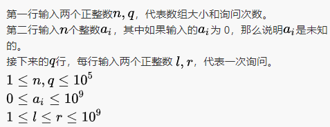

## 1.小美的完美矩阵

> https://blog.csdn.net/m0_60511809/article/details/136634404

## 2.小美的数组询问

小美拿到了一个由正整数组成的数组，但其中有一些元素是未知的（用 0 来表示）。
现在小美想知道，如果那些未知的元素在区间`[l,r]`范围内随机取值的话，数组所有元素之和的最小值和最大值分别是多少？
共有`q`次询问。 

> 输入描述：
>
> 
>
> 输出描述：
>
> ```
> 输出行，每行输出两个正整数，代表所有元素之和的最小值和最大值。
> ```
>
> **示例：**
>
> 输入例子：
>
> ```
> 3 2
> 1 0 3
> 1 2
> 4 4
> ```
>
> 输出例子：
>
> ```
> 5 6
> 8 8
> ```
>
> 例子说明：
>
> ```
> 只有第二个元素是未知的。第一次询问，数组最小的和是 1+1+3=5，最大的和是 1+2+3=6。第二次询问，显然数组的元素和必然为 8。
> ```

**解题思路：**

这道题在输入的时候就可以计算和，然后用`count`记录下未知数的个数，最后两次查询`l,r`，最小肯定是加上l，最大肯定是r。

**最大的问题就是数值越界问题，因为`ai`、`l,r`最大值可以取到10^9，也接近int最大值，所以再`进行计算肯定会越界`，因此使用long来声明数据类型**

```java
Scanner in = new Scanner(System.in);

while (in.hasNextInt()) { // 注意 while 处理多个 case
    int a = in.nextInt();
    int b = in.nextInt();

    long sum = 0;//记录加法的结果
    int count = 0;//记录0的个数
    for(int i = 0;i<a;i++){
        int temp = in.nextInt();
        if(temp!=0){//不为0就加上
            sum += temp;
        }else{
            count++;
        }
    }

    for(int j = 0;j<b;j++){
        long l = in.nextInt();//防止越界，这里替换为nextLong()会超时，怀疑是计算成本提高
        long r = in.nextInt();
        System.out.println((sum+l*count)+" "+(sum+r*count));
    }
}

in.close();
```


## 3.2024-3-30美团

第二道编程

```java
public static void main(String[] args) {
    Scanner in = new Scanner(System.in);
    //考虑交换的次数最少，那肯定前缀少的更合理
    //aabc，收缩成abc,这样前缀最少
    String a = in.nextLine();
    String b = in.nextLine();
    in.close();

    int countA = 1;//记录合并相邻同类项之后数组的长度
    int countB = 1;

    int lastSame = a.length()-1;//记录从最后开始，两者最早相等的下标
    for(int i = a.length()-1;i>=0;i--){
        if(a.charAt(i) == b.charAt(i)){
            lastSame = i;
        }else{
            break;
        }
    }

    StringBuilder sbA = new StringBuilder(a.charAt(lastSame-1)+"");
    StringBuilder sbB = new StringBuilder(b.charAt(lastSame-1)+"");

    for(int i =lastSame-1;i>0;i--){
        if(a.charAt(i) != a.charAt(i-1)){
            // countA++;
            sbA.insert(0, a.charAt(i-1));
        }
        if(b.charAt(i)!=b.charAt(i-1)){
            // countB++;
            sbB.insert(0, b.charAt(i-1));
        }
    }

    int countRes = 0;//记录要进行交换的次数

    StringBuilder sb = new StringBuilder();
    //以收缩后更少的那个为基准进行变换
    if(sbA.length() < sbB.length()){
        for(int i = sbA.length()-1;i>=0;i--){
            sb.append(2+" "+(i+1)+" "+sbA.charAt(i)+"\n");
            countRes++;
        }
    }else{
        for(int i = sbB.length()-1;i>=0;i--){
            sb.append(1+" "+(i+1)+" "+sbB.charAt(i)+"\n");
            countRes++;
        }
    }

    System.out.println(countRes);
    System.out.print(sb.toString());

}
```


## 