# 概述

**计算机网络是什么**

> 计算机网络：是一个将分散的、具有独立功能的计算机系统，通过通信设备与线路连接起来，由功能完善的软件实现资源共享和信息传递的系统。

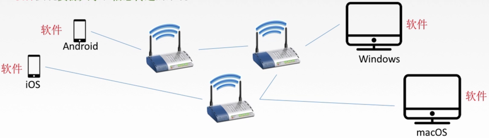

计算机网络是互连的、自治的计算机集合：

- 互连--互联互通，通信链路
- 自治--无主从关系

**计算机网络功能**

- 数据通信
- 资源共享
- 分布式处理
- 提高可靠性
- 负载均衡

**计算机网络的组成**

**(1)组成部分来划分：硬件、软件、协议**

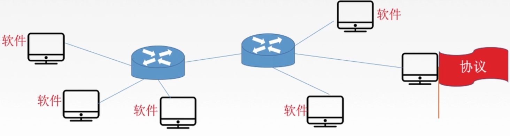

**(2)工作方式来划分：**

- **边缘部分**：用户直接使用
  - C/S方式
  - P2P方式
- **核心部分**： 为边缘部分服务（路由器，交换机等）

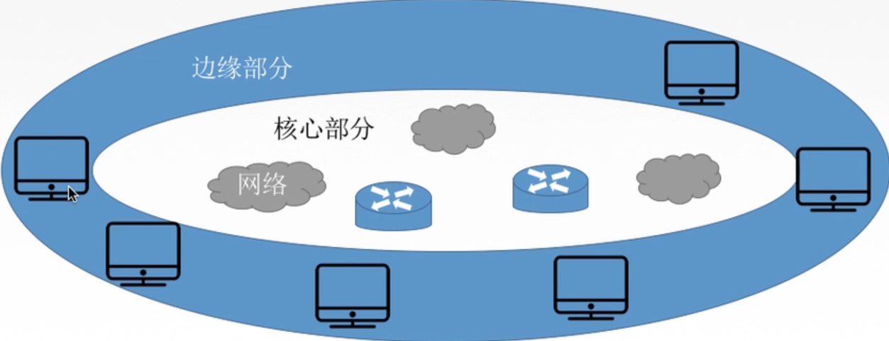

**(3)功能组成划分：**

- 通信子网 ： 实现数据通信
- 资源子网 ： 实现资源共享/数据处理

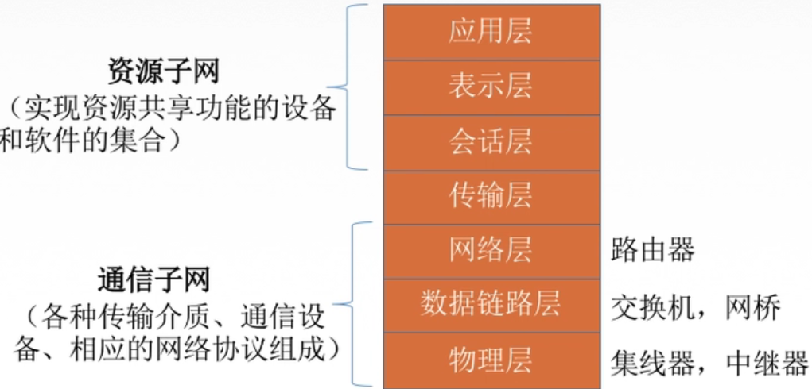

**计算机网络分类**

**(1)按分布范围分：**

- 广域网WAN -- 交换技术
- 城域网MAN
- 局域网LAN -- 广播技术
- 个人区域网PAN

**(2)按使用者分**

- 公用网 -- 三大运营商等等
- 专用网 --- 政府、军队

**(3)按交换技术分**

- 电路交换
- 报文交换
- 分组交换

**(4)按拓扑结构分**

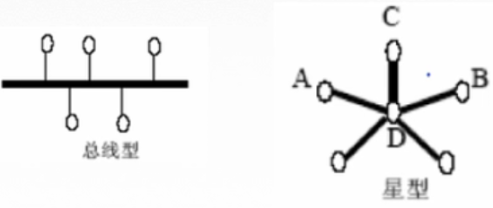

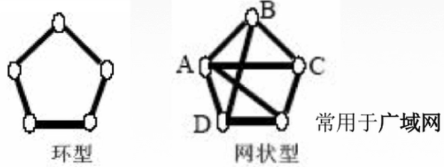

**(5)按传输技术分：**

- 广播式网络--共享公共通信信道
- 点对点网络--使用分组存储转发和路由选择机制

**标准化**

要实现不同厂商的硬、软件之间相互连通，就必须遵从统一的标准

**（1）标准的分类**

- 法定标准 ： 由权威机构制定的正式的、合法的标准（OSI）
- 事实标准 ： 某些公司的产品在竞争中占据了主流，时间一长，这些产品的协议和技术就成了标准（TCP/IP）

**(2)标准化工作相关组织**

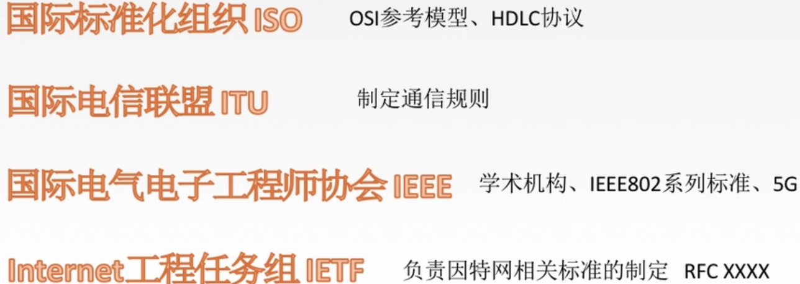


# 计算机网络性能指标

### (1)速率

速率即数据率（数据传输率、比特率），是指连接在计算机网络上的主机在数字信道上传送数据位数的速率。

单位是：b/s , kb/s , Mb/s , Gb/s , Tb/s 


**换算关系:**

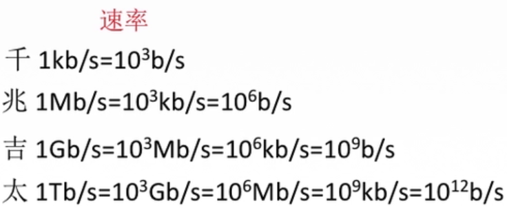

### (2)带宽

计算机网络中，带宽用来表示网络的通信线路传送数据的能力，通常是指单位时间内从网络中的某一点到另一点所能通过的“最高数据率”。单位是“比特每秒”，b/s,kb/s,Mb/s,Gb/s.

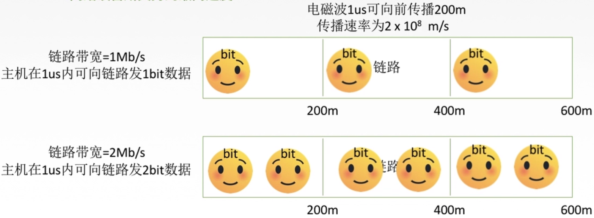

### (3)吞吐量

表示单位时间内通过某个网络（或信道、接口）的数据量。单位b/s,kb/s,Mb/s等

吞吐量受网络的带宽或网络的额定速率的限制

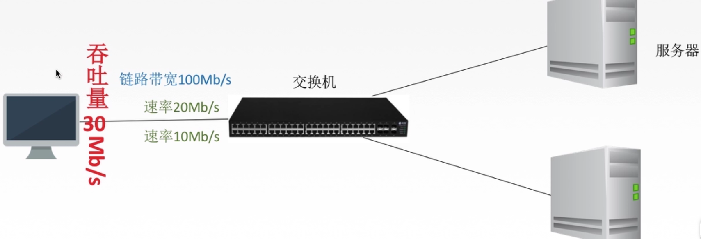

### (4)时延

指数据(报文/分组/比特流)从网络(或链路)的一端传送到另一端所需的时间。也叫延迟或迟延。**单位是s**

时延也可以分为以下几类:

- 传输时延：是指把计算机数据放到信道上所需要的时间
- 传播时延：是指数据通过信道从一段传送到另一端所需要的的时间

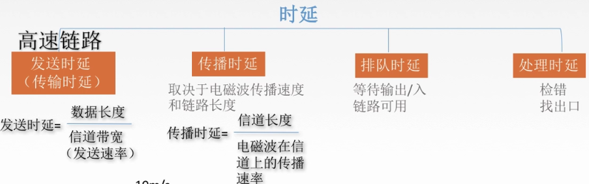

### (5)时延带宽积

**时延带宽积(bit) = 传播时延(s)  x  带宽(b/s)**

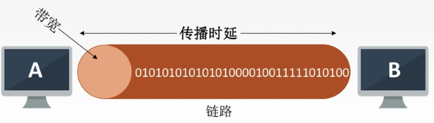


时延带宽积又称为以<font color='red'>比特为单位的链路长度</font>，即“某段链路现在有多少比特。


### (6)往返时间RTT 

从发送方发送数据开始，到发送方收到接收方的确认，总共经历的时延。

可以通过ping 命令查看RTT

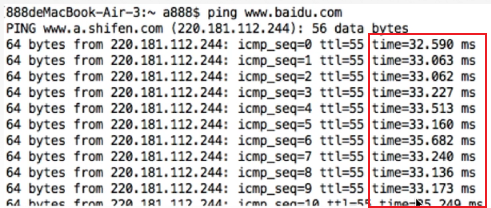

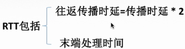

### (7)利用率

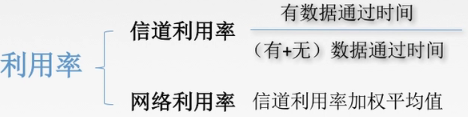

**利用率越高，则时延越长**


# 计算机网络分层结构

**几个名词**

- **实体**：每一层活动的元素称为实体

- **协议**：每一层规则或约定称为协议，协议是水平方向的，只有对等实体才能协议

  > 协议满足三个条件：
  >
  > - 语法：规定传输数据的格式
  > - 语义：规定所要完成的功能
  > - 同步：规定各种操作的顺序

- **接口**：上层使用下层服务的入口

- **服务**：每两层之间提供的东西，上层是使用下层服务，下层为上层提供服务


从上层往下层传输过程中可以表示如下：

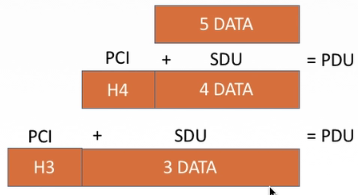

> 其中：SDU服务数据单元：表示传送的数据
>
> ​			PCI协议控制信息：表示控制协议操作的信息
>
> ​			PDU协议数据单元：表示对等层次之间传送的数据单位(也是经过重新封装之后传往下一层的新数据体)

**分层结构**

计算机网络分层结构可以分为两种模型

- 7层OSI参考模型（法定标准）
- 4层TCP/IP参考模型（事实标准）
- 5层参考模型，综合前两者得出

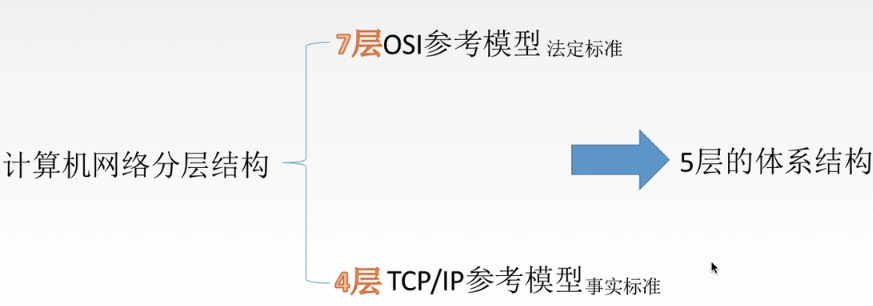


## OSI 7层模型

目的：支持异构网络系统的互联互通

发布：国际标准化组织（ISO）于1984年提出开放系统互连（OSI）参考模型

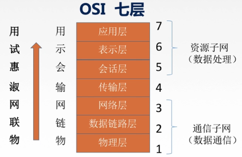

**①OSI参考模型通信过程**

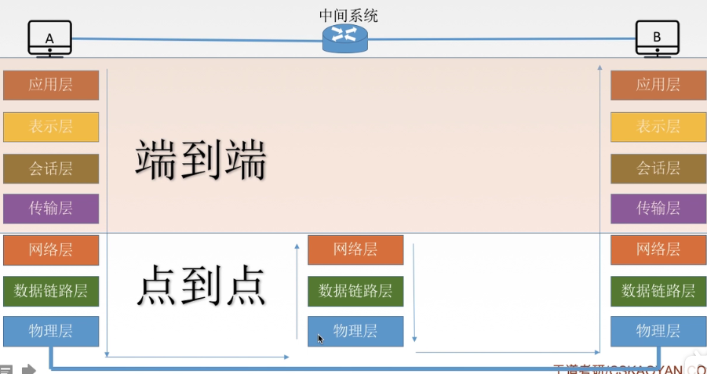

> 通过上图可以看到从电脑A到电脑B传输数据的过程要经历的过程：
>
> 1.首先是A的数据经过层层包装最后通过物理层实体介质进行传输，
>
> 2.然后在**中间系统**拆分数据到网络层面查看数据要发送往的位置，
>
> 3.最后又层层包装通过物理层传输到电脑B。


- 


## TCP/IP模型

**利用 IP 进行通信时所必须用到的协议群的统称**。

具体来说，IP 、 ICMP、TCP 、 UDP、TELNET 、 FTP、 HTTP 等都属于 TCP/IP 协议。TCP/IP 一词泛指这些协议，因此，有时也称 TCP/IP 为`网际协议群`。

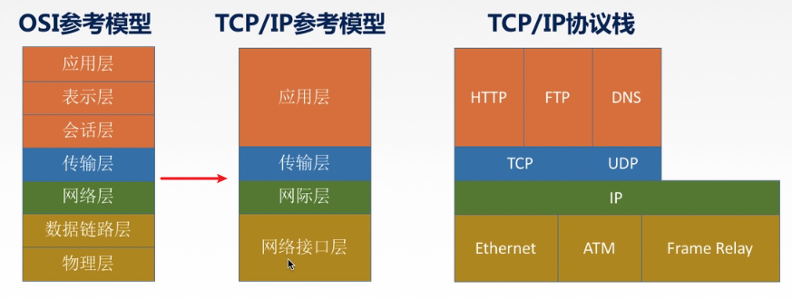


## OSI 5层参考模型

综合了`OSI 7层参考模型`和`TCP/IP参考模型`然后就得出了5层参考模型

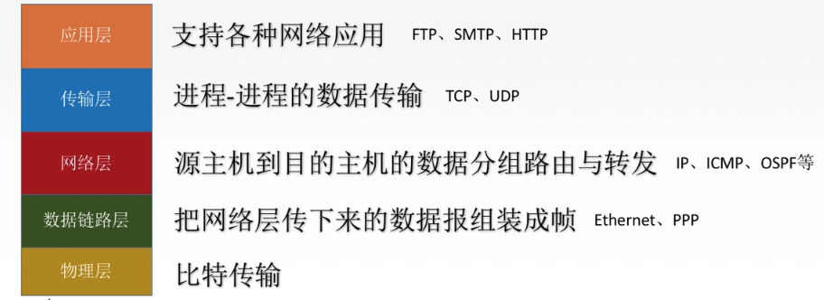


**五层参考模型数据封装与解封装**

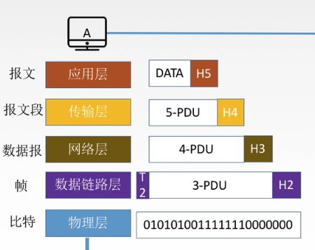


# OSI七层网络模型

> [计算机网络](https://github.com/cosen1024/Java-Interview/blob/main/%E8%AE%A1%E7%AE%97%E6%9C%BA%E7%BD%91%E7%BB%9C/%E8%AE%A1%E7%AE%97%E6%9C%BA%E7%BD%91%E7%BB%9C%E4%B8%8A.md)
>
> [tcp三次握手](https://xiaolincoding.com/network/3_tcp/tcp_interview.html#udp-%E5%92%8C-tcp-%E6%9C%89%E4%BB%80%E4%B9%88%E5%8C%BA%E5%88%AB%E5%91%A2-%E5%88%86%E5%88%AB%E7%9A%84%E5%BA%94%E7%94%A8%E5%9C%BA%E6%99%AF%E6%98%AF)

## 应用层

所有能和用户交互产生网络流量的程序，应用层为操作系统或网络应用程序提供访问网络服务的接口。

​	**典型的应用层服务和协议：**

- 文件传输(FTP)
- 电子邮件(SMTP)
- 万维网(HTTP)

### HTTP

#### 状态码

  

`2xx`类状态码表示服务器成功处理客户端请求：

- 「**200 OK**」是最常见的成功状态码，表示一切正常。如果是非 `HEAD` 请求，服务器返回的响应头都会有 body 数据。
- 「**204 No Content**」也是常见的成功状态码，与 200 OK 基本相同，但响应头没有 body 数据。
- 「**206 Partial Content**」是应用于 HTTP1.1 分块下载或断点续传，表示响应返回的 body 数据并不是资源的全部，而是其中的一部分，也是服务器处理成功的状态。

 `3xx` 类状态码表示客户端请求的资源发生了变动，需要客户端用新的 URL 重新发送请求获取资源，也就是**重定向**。 

- 「**301 Moved Permanently**」表示永久重定向，说明请求的资源已经不存在了，需改用新的 URL 再次访问。

- 「**302 Found**」表示临时重定向，说明请求的资源还在，但暂时需要用另一个 URL 来访问。

  > 301 和 302 都会在响应头里使用字段 `Location`，指明后续要跳转的 URL，浏览器会自动重定向新的 URL。 

- 「**304 Not Modified**」不具有跳转的含义，表示资源未修改，重定向已存在的缓冲文件，也称缓存重定向，也就是告诉客户端可以继续使用[缓存资源](#httpcache)，用于缓存控制。 

 `4xx` 类状态码表示客户端发送的**报文有误**，服务器无法处理，也就是错误码的含义。 

- 「**400 Bad Request**」表示客户端请求的报文有错误，但只是个笼统的错误。
- 「**403 Forbidden**」服务器收到请求，但禁止提供服务，访问资源。
- 「**404 Not Found**」表示请求的资源在服务器上不存在或未找到，所以无法提供给客户端。

`5xx` 类状态码表示客户端请求报文正确，但是**服务器处理时内部发生了错误**，属于服务器端的错误码。

- 「**500 Internal Server Error**」与 400 类型，是个笼统通用的错误码，服务器发生了什么错误，我们并不知道。
- 「**501 Not Implemented**」表示客户端请求的功能还不支持，类似“即将开业，敬请期待”的意思。
- 「**502 Bad Gateway**」通常是服务器作为网关或代理时返回的错误码，表示服务器自身工作正常，访问后端服务器发生了错误。
- 「**503 Service Unavailable**」表示服务器当前很忙，暂时无法响应客户端，类似“网络服务正忙，请稍后重试”的意思。


#### 请求报文和响应报文

##### 请求报文：

1. `请求行（请求方法+URI+版本）`
2. `请求头部`
3. `空行`: 请求头部后面是一个空行，用来分隔请求头部和请求体。 
4. `请求体`

```http
GET/sample.jspHTTP/1.1 --请求行
Accept:image/gif.image/jpeg, --请求头部
Accept-Language:zh-cn
Connection:Keep-Alive
Host:localhost
User-Agent:Mozila/4.0(compatible;MSIE5.01;Window NT5.0)
Accept-Encoding:gzip,deflate

username=jinqiao&password=1234 --请求体
```

> - `Host`： 客户端发送请求时，用来指定服务器的域名(IP)和端口。 如果端口号是默认端口（80）可以省略端口
> - `Connection`： 最常用于客户端要求服务器使用「HTTP 长连接」机制，以便其他请求复用 ，当设置为`Keep-Alive`就表示开启长链接
> - `Accept`： 客户端请求的时候，可以使用 `Accept` 字段声明自己可以接受哪些数据格式。 
> - `Accept-Encoding`： 说明自己可以接受哪些压缩方法 


##### 响应报文

1.`状态行`： HTTP版本、状态码和状态描述 

2.`响应头部`

3.`空行`

4.`响应体 `： 响应体的格式取决于响应头部中的Content-Type字段 

```http
HTTP/1.1 200 OK
Server:Apache Tomcat/5.0.12
Date:Mon,6Oct2003 13:23:42 GMT
Content-Length:112
Content-Type: text/html; charset=UTF-8
Set-Cookie: sessionId=1234567890abcdef; Path=/; HttpOnly
Content-Encoding: gzip

<html>
    <head>
        <title>HTTP响应示例<title>
    </head>
    <body>
        Hello HTTP!
    </body>
</html>
```

> - `Content-Length`： 服务器回应的数据长度
> - `Content-Type`： 用于服务器回应时，告诉客户端，本次数据是什么格式。 
> - `Content-Encoding`： 表示服务器返回的数据使用了什么压缩格式 

#### 请求方法

| 方法    | 作用                                                    |
| ------- | ------------------------------------------------------- |
| GET     | 获取资源                                                |
| POST    | 传输实体主体                                            |
| PUT     | 上传文件                                                |
| DELETE  | 删除文件                                                |
| HEAD    | 和GET方法类似，但只返回报文首部，不返回报文实体主体部分 |
| PATCH   | 对资源进行部分修改                                      |
| OPTIONS | 查询指定的URL支持的方法                                 |
| CONNECT | 要求用隧道协议连接代理                                  |
| TRACE   | 服务器会将通信路径返回给客户端                          |


##### PUT和POST

> 参考——https://blog.csdn.net/qq_36183935/article/details/80570062

`PUT`和`POST`都有更改指定URI的语义。但PUT被定义为[idempotent(幂等)](#idempotent )的方法，POST则不是idempotent的方法:

所以：

- PUT：如果两个请求相同，后一个请求会把第一个请求覆盖掉。（所以PUT用来改资源）
- POST：后一个请求不会把第一个请求覆盖掉。（所以Post用来增资源）

**两者区别可以总结为：**

1. 语义不同：PUT 请求通常用于更新或替换服务器上的资源，而 POST 请求通常用于创建新的资源或提交数据到服务器进行处理。
2. 客户端发送的数据不同：PUT 请求需要客户端发送完整的资源内容，而 POST 请求可以只发送部分资源内容。
3. 响应不同：PUT 请求成功后通常返回 200 OK 状态码，而 POST 请求成功后通常返回 201 Created 状态码，并返回表示新资源的 URI。
4. 幂等性不同：PUT 请求具有幂等性，即执行多次 PUT 请求的结果应该相同，而 POST 请求不具有幂等性。

##### GET和POST

（1）GET参数通过URL/cookie，POST放在Request body中。

（2）GET 请求的参数位置一般是写在 URL 中，**URL 规定只能支持 ASCII**，所以 GET 请求的参数只允许 ASCII 字符 ，因此会在请求之前进行转码；POST不用，因为POST在Request body中，通过 MIME，可以传输非 ASCII 字符。 

（3）GET请求会被浏览器主动cache（ 当用户发出一个GET请求时，浏览器会先检查缓存中是否已经有该请求的响应结果。如果有，则直接使用缓存中的结果，而不再向服务器发送请求 ）；**而POST不会，除非手动设置。** 

（4）GET请求参数会被完整保留在浏览器历史记录里，而POST中的参数不会被保留。 

（5）GET请求在URL中传送的参数是有长度限制的（这是浏览器给出限制，HTTP本身没有长度限制），而POST么有。 

###### 幂等和安全性

- **GET 是幂等的**，因为它是「只读」操作，无论操作多少次，服务器上的数据都是安全的，且每次的结果都是相同的。所以，**可以对 GET 请求的数据做缓存，这个缓存可以做到浏览器本身上（彻底避免浏览器发请求），也可以做到代理上（如nginx），而且在浏览器中 GET 请求可以保存为书签**。
- **POST不是幂等的**

> 至于安全性，网络上众说纷纭，大部分观点认为：`Post参数放到请求体，Get参数放到URL，所以Post更安全`，但实际上两个请求方式本质都是TCP，都是通过明文传输，通过抓包都能得到信息，所以都不是安全的。
>
> 因此要保证安全应该使用HTTPS


#### <a name=httpcache>http缓存</a>

> https://xiaolincoding.com/network/2_http/http_interview.html#http-%E7%BC%93%E5%AD%98%E6%8A%80%E6%9C%AF

**ETag**

ETag（Entity Tag）是HTTP协议中用于缓存控制的一种机制。它是服务器为每个资源分配的一个唯一的标识符，用于标识资源的特定版本。 

当客户端向服务器发送请求时，服务器会在响应中返回资源的ETag标识符。当客户端再次请求同一资源时，它会在请求头中包含一个If-None-Match字段，其值为上一次响应中返回的ETag值。服务器会比较请求头中的If-None-Match字段与当前资源的ETag值，如果两者相同，则表示资源未修改，服务器会返回一个304 Not Modified响应，告知客户端可以使用缓存的版本。如果两者不同，则表示资源已修改，服务器会返回一个新的响应，包括新的ETag值和资源的新内容。 


#### HTTP1.0与HTTP1.1区别

1. 持久连接：HTTP/1.1 支持持久连接（Persistent Connections），也称为长连接。而在 HTTP/1.1 中，默认开启了持久连接，多个请求可以复用同一个 TCP 连接，提高了网站的加载速度。
2. 管道化：HTTP/1.1 支持管道化（Pipelining），允许在同一个 TCP 连接上发送多个请求，而不需要等待前一个请求的响应。这可以进一步提高网站的加载速度。
3. 缓存处理：HTTP/1.1 对缓存的处理有了进一步的优化。在 HTTP/1.0 中，缓存的控制主要依靠头部字段如 Expires 和 Pragma 等，而在 HTTP/1.1 中引入了 Cache-Control 头部字段，提供了更灵活的缓存控制机制。
4. Host 头部字段：HTTP/1.1 要求请求头部中必须包含 Host 字段，用于指定请求的主机名。因为一台主机可能托管多台虚拟主机。
5. 新的状态码：HTTP/1.1 新增了一些状态码，如 409 Conflict、410 Gone 等，用于更精确地表示请求的状态。


#### HTTP1.1与HTTP2.0

  

- 头部压缩

  > HTTP/2 会**压缩头**（Header）,如果你同时发出多个请求，他们的头是一样的或是相似的，那么，协议会帮你**消除重复的部分**。
  >
  > 这就是所谓的 `HPACK` 算法：在客户端和服务器同时维护一张头信息表，所有字段都会存入这个表，生成一个索引号，以后就不发送同样字段了，只发送索引号，这样就**提高速度**了。

- 二进制格式

  > HTTP/2 不再像 HTTP/1.1 里的纯文本形式的报文，而是全面采用了**二进制格式**，头信息和数据体都是二进制，并且统**称为帧（frame）**：**头信息帧（Headers Frame）和数据帧（Data Frame）**。 
  >
  >  收到报文后，无需再将明文的报文转成二进制，而是直接解析二进制报文，这**增加了数据传输的效率**。 

- 多路复用

  > HTTP/2.0 允许在**同一个连接上并行发送多个请求和响应**，避免了 HTTP/1.x 中的队头阻塞问题。这使得网站的加载速度得到了很大的提高。

- 服务器主动推送资源

  > HTTP/2.0 允许服务器在客户端尚未请求的情况下，主动推送资源到客户端。这使得客户端可以更快地获取所需的资源，提高了网站的加载速度。 


#### HTTPS

|              | HTTP                         | HTTPS                                                    |
| ------------ | ---------------------------- | -------------------------------------------------------- |
| 默认端口     | 80                           | 443                                                      |
| 安全性       | 明文传输，无加密，安全性较差 | 在TCP和HTTP间加入了SSL/TLS协议，使报文能够加密传输       |
| 资源消耗     | 较少                         | 由于加密处理，资源消耗更多                               |
| 是否需要证书 | 不需要                       | 需要向CA（证书权威机构）申请数字证书，保证服务器身份可信 |
| 协议         | 运行在TCP协议之上            | 运行在SSL协议之上，SSL运行在TCP协议之上                  |


##### 加密流程

  

1. 客户端请求 HTTPS 网址，连接到 server 的 443 端口 (HTTPS 默认端口，类似于 HTTP 的80端口)。
2. 采用 HTTPS 协议的服务器必须要有一套数字 `CA (Certification Authority)`证书。颁发证书的同时会产生一个`私钥`和`公钥`:
   - 私钥由服务端自己保存，不可泄漏。
   - 公钥则是附带在证书的信息中，可以公开的。
   - 证书本身也附带一个证书电子签名，这个签名用来验证证书的完整性和真实性，可以防止证书被篡改。
3. 服务器响应客户端请求，将证书传递给客户端，证书包含公钥和大量其他信息，比如证书颁发机构信息，公司信息和证书有效期等。
4. 客户端解析证书并对其进行验证。如果证书不是可信机构颁布，或者证书中的域名与实际域名不一致，或者证书已经过期，就会向访问者显示一个警告，由其选择是否还要继续通信。如果证书没有问题，客户端就会从服务器证书中取出服务器的公钥A。然后客户端还会生成一个随机码 KEY，并使用公钥A将其加密。

5. 客户端把加密后的随机码 KEY 发送给服务器，作为后面对称加密的密钥。
6. 服务器在收到随机码 KEY 之后会使用`私钥B`将其解密。经过以上这些步骤，客户端和服务器终于建立了安全连接，通过非对称加密完美解决了对称加密的`密钥泄露`问题，接下来就可以用对称加密愉快地进行通信了。
7. 服务器使用密钥 (随机码 KEY)对数据进行对称加密并发送给客户端，客户端使用相同的密钥 (随机码 KEY)解密数据。
8. 双方使用对称加密愉快地传输所有数据。


#### [TLS/SSL](#TLS)


#### Session与Cookie

> 参考——https://www.cnblogs.com/ityouknow/p/10856177.html

**什么是 Cookie**

HTTP Cookie（也叫 Web Cookie或浏览器 Cookie）是服务器发送到用户浏览器并保存在本地的一小块数据，它会在浏览器下次向同一服务器再发起请求时被携带并发送到服务器上。Cookie 使基于无状态的 HTTP 协议记录稳定的状态信息成为了可能。

**作用**

它用于告知服务端两个请求是否来自同一浏览器，如保持用户的登录状态。

Cookie 主要用于以下三个方面：

- 会话状态管理（如用户登录状态、购物车、游戏分数或其它需要记录的信息）
- 个性化设置（如用户自定义设置、主题等）
- 浏览器行为跟踪（如跟踪分析用户行为等）

**什么是 Session**

Session 代表着服务器和客户端一次会话的过程。**Session 对象存储特定用户会话所需的属性及配置信息**。当用户在应用程序的 Web 页之间跳转时，存储在 Session 对象中的变量将不会丢失，而是在整个用户会话中一直存在下去。当客户端关闭会话，或者 Session 超时失效时会话结束。

------

**Cookie 和 Session 有什么不同？**

- 作用范围不同，Cookie 保存在客户端（浏览器），Session 保存在服务器端。
- 存取方式的不同，Cookie 只能保存 ASCII，Session 可以存任意数据类型，一般情况下可以在 Session 中保持一些常用变量信息，比如说 `UserId` 等。
- 有效期不同，Cookie **可设置**为长时间保持，比如经常使用的默认登录功能；Session 一般失效时间较短，客户端关闭或者 Session 超时都会失效。
- 隐私策略不同，Cookie 存储在客户端，比较容易遭到不法获取，早期有人将用户的登录名和密码存储在 Cookie 中导致信息被窃取；Session 存储在服务端，安全性相对 Cookie 要好一些。
- 存储大小不同， 单个 Cookie 保存的数据不能超过 4K，Session 可存储数据远高于 Cookie。
- **跨域支持**：Cookie支持跨域名访问，即可以在不同的域名之间共享。Session则通常与特定的客户端和服务器端关联，不支持跨域访问。


## 表示层

​	**主要功能：**

- 数据格式转换

  > 例如将二进制格式数据转换为`jpg`图片

- 数据加密解密

- 数据压缩和恢复

​	**主要协议：**

- ASCII
- JPEG


## 会话层

向用户层实体/用户进程**提供建立连接**并在连接上有序地传输数据，**会话层不参与具体的传输**，它提供包括访问验证和会话管理在内的建立和维护应用之间通信的机制。

> 如服务器验证用户登录便是由会话层完成的。

**主要功能**：

- 建立、管理、终止会话
- 使用校验点可以使会话在通信失效时从**校验点/同步点**继续恢复通信，实现数据同步（适用于传输大文件）

**主要协议**

ADSP、ASP


## 传输层

负责向**两台主机进程之间的通信**提供通用的数据传输服务，即端到端的通信。

传输单位是**报文**或**用户数据报**


主要协议是`UDP`和`TCP`，区别如下

|              | UDP                                                          | TCP                                              |
| ------------ | ------------------------------------------------------------ | ------------------------------------------------ |
| 是否连接     | 无连接                                                       | 面向连接                                         |
| 是否可靠     | 不可靠传输，不使用流量控制和拥塞控制                         | 可靠传输，使用流量控制和拥塞控制                 |
| 是否有序     | 无序                                                         | 有序，消息在传输过程中可能会乱序，TCP 会重新排序 |
| 传输速度     | 快                                                           | 慢                                               |
| 连接对象个数 | 支持一对一，一对多，多对一和多对多交互通信                   | 只能是一对一通信                                 |
| 传输方式     | 面向报文                                                     | 面向字节流                                       |
| 首部开销     | 首部开销小，仅8字节                                          | 首部最小20字节，最大60字节                       |
| 适用场景     | 适用于实时应用（IP电话、视频会议、直播等）                   | 适用于要求可靠传输的应用，例如文件传输           |
| 应用场景     | ①总量少通信：DNS、SNMP<br />②视频、音频等多媒体通信<br />③广播通信 | ①FTP文件传输<br />②HTTP/HTTPS                    |


### (1)TCP

TCP的头部格式如下：

#### **三次握手：**

> [tcp三次握手](https://xiaolincoding.com/network/3_tcp/tcp_interview.html#udp-%E5%92%8C-tcp-%E6%9C%89%E4%BB%80%E4%B9%88%E5%8C%BA%E5%88%AB%E5%91%A2-%E5%88%86%E5%88%AB%E7%9A%84%E5%BA%94%E7%94%A8%E5%9C%BA%E6%99%AF%E6%98%AF)

TCP是面向连接的协议，所以每次通信前会三次握手建立连接。

  

- **第一次握手：**

  > 客户端请求建立连接，把`SYN`标志位置为1，选择一个随机数 `seq = client_isn` 作为**初始序列号**，然后向服务端发送该**同步报文**，之后客户端进入`SYN_SENT`状态，等待服务器确认。
  >
  > > **该报文不包含应用层数据**

- **第二次握手**

  > 服务端收到客户端的 `SYN` 报文后，首先服务端也随机初始化自己的序号`seq_num = server_isn`，将此序号填入 TCP 首部的「序号」字段中，其次把 TCP 首部的「确认应答号」字段填入 `ack = client_isn + 1`, 接着把 `SYN` 和 `ACK` 标志位置为 `1`。最后把该**同步确认报文**发给客户端，之后服务端处于 `SYN-RCVD` 状态。
  >
  > > **该报文也不包含应用层数据**

- **第三次握手**

  > 客户端收到服务端报文后，还要向服务端回应最后一个**应答报文**，首先该应答报文 TCP 首部 `ACK=1` ，其次「确认应答号」字段填入 `ack = server_isn + 1` ，最后把报文发送给服务端，之后客户端处于 `ESTABLISHED` 状态。
  >
  > > **这次报文可以携带客户到服务端的数据**


**为什么非要三次握手？**

- **三次握手才可以阻止重复历史连接的初始化（主要原因）**

  > 假设是两次握手，那么客户端给服务端发送`SYN`报文后，服务端接收便建立了连接， 进入`Established`状态，但如果是一个`旧的连接请求`因为网络拥塞原因迟迟到来， 导致服务端建立了一个历史连接，且白白发送了数据，妥妥地浪费了服务端的资源 
  >
  > 

- **三次握手才可以同步双方的初始序列号**

  > TCP 协议的通信双方， 都必须维护一个「序列号」， 序列号是可靠传输的一个关键因素，它的作用：
  >
  > - 接收方可以去除重复的数据；
  > - 接收方可以根据数据包的序列号按序接收；
  > - 可以标识发送出去的数据包中， 哪些是已经被对方收到的（通过 ACK 报文中的序列号知道）；
  >
  >  **而两次握手只保证了一方的初始序列号能被对方成功接收，没办法保证双方的初始序列号都能被确认接收。** 


###### **SYN洪泛攻击**

假设攻击者短时间伪造不同 IP 地址的 `SYN` 报文，服务端每接收到一个 `SYN` 报文，就进入`SYN_RCVD` 状态，但服务端发送出去的 `ACK + SYN` 报文，无法得到未知 IP 主机的 `ACK` 应答，久而久之就会**占满服务端的半连接队列**，使得服务端不能为正常用户服务。 

> SYN flood攻击时一种[DDOS](#ddos)攻击手段

**如何防范**

- 通过防火墙、路由器等过滤网关防护。
- 增大 TCP 半连接队列；
- 开启 tcp_syncookies；
- 减少 SYN+ACK 重传次数


#### 四次挥手

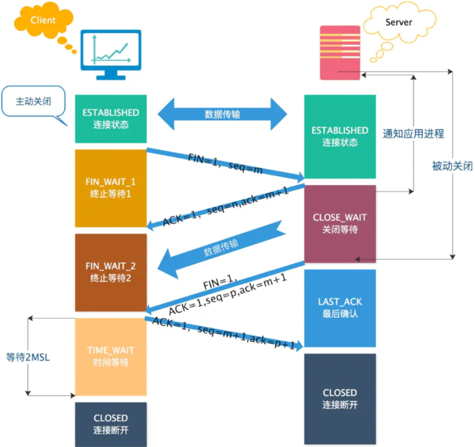

> 第一次挥手：客户端向服务端发送连接释放报文（FIN=1，ACK=1），主动关闭连接，同时等待服务端的确认。
>
> - 序列号 seq = u，即客户端上次发送的报文的最后一个字节的序号 + 1
> - 确认号 ack = k, 即服务端上次发送的报文的最后一个字节的序号 + 1
>
> 第二次挥手：服务端收到连接释放报文后，立即发出**确认报文**（ACK=1），
>
> - 序列号 seq = k，确认号 ack = u + 1。
>
> - 这时 TCP 连接处于半关闭状态，即客户端到服务端的连接已经释放了，但是服务端到客户端的连接还未释放。这表示客户端已经没有数据发送了，但是服务端可能还要给客户端发送数据。
>
> 第三次挥手：服务端向客户端发送连接释放报文（FIN=1，ACK=1），主动关闭连接，同时等待 A 的确认。
>
> - 序列号 seq = w，即服务端上次发送的报文的最后一个字节的序号 + 1。
> - 确认号 ack = u + 1，与第二次挥手相同，因为这段时间客户端没有发送数据
>
> 第四次挥手：客户端收到服务端的连接释放报文后，立即发出**确认报文**（ACK=1）
>
> - 序列号 seq = u + 1，确认号为 ack = w + 1。
>
> 客户端在经过 `2MSL(最大报文段寿命)` 时间后，进入 `CLOSED` 状态，至此客户端也完成连接的关闭。


###### 为什么等待2MSL

 `MSL( Maximum Segment Lifetime)`，**报文最大生存时间**。

 任何报文在网络上存在的最长时间，超过这个时间报文将被丢弃。

为什么要等到2MSL时间，主要两个原因：

> **确保 ACK 报文能够到达服务端，从而使服务端正常关闭连接。**
>
> `TIME_WAIT `等待 2 倍的 MSL，比较合理的解释是： 网络中可能存在来自发送方的数据包，当这些发送方的数据包被接收方处理后又会向对方发送响应，所以**一来一回需要等待 2 倍的时间**。 

> **防止已失效的连接请求报文段出现在之后的连接中**。
>
> TCP 要求在 2MSL 内不使用相同的序列号。客户端在发送完最后一个 ACK 报文段后，再经过时间 2MSL，就可以保证本连接持续的时间内产生的所有报文段都从网络中消失。这样就可以使下一个连接中不会出现这种旧的连接请求报文段。 

#### TCP协议如何保证可靠性：

TCP主要提供了：

检验和、序列号/确认应答、超时重传、拥塞控制和流量控制等方法实现了可靠性传输。 

##### **校验和**


##### **序列号/确认应答**

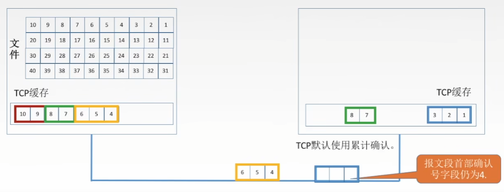

- 发送方按照字节编号，每个报文包含大小不等的字节，因此每个报文编号就为首部字节的序号。
- 每次发送报文之后，接收方将其放入TCP缓存，并回复下一个想要收到的报文序号
- 使用累计确认的方式，例如图中所示，如果先收到7，8报文，仍然只发送确认号为4的确认报文。


##### **超时重传**

> [超时重传](https://xiaolincoding.com/network/3_tcp/tcp_feature.html#%E8%B6%85%E6%97%B6%E9%87%8D%E4%BC%A0)

采用自适应算法，动态改变重传时间RTTs


##### **快速重传**

如果接收方连续发送三次对同一个确认号的ACK，那么就代表丢失，发送方立刻重传该报文段，而无需等到超时重传，也就是**快速重传**

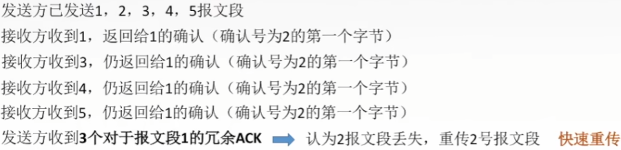


##### **流量控制**

> https://www.cnblogs.com/kubidemanong/p/9987810.html

TCP使用**滑动窗口**来进行流量控制, **接收端告诉发送端自己还有多少缓冲区可以接收数据。于是发送端就可以根据这个接收端的处理能力来发送数据，而不会导致接收端处理不过来。** 

>  **所以，通常窗口的大小是由接收方的窗口大小来决定的。** 

接收方每次收到数据包，可以在发送确定报文的时候，同时告诉发送方自己的缓存区还剩余多少是空闲的。

发送方收到之后，便会调整自己的发送速率，也就是调整自己发送窗口的大小，当发送方收到接收窗口的大小为0时，发送方就会停止发送数据，防止出现大量丢包情况的发生。 

  


**何时恢复发送**

- **接收方**：接收方的接收窗口如果大于0，就会发送报文通知发送方可以继续发送

- **发送方**，发送方收到接受窗口 win = 0 时，这时发送方停止发送报文，并且同时开启一个定时器，每隔一段时间就发个测试报文去询问接收方，打听是否可以继续发送数据了，如果可以，接收方就告诉他此时接受窗口的大小；如果接受窗口大小还是为0，则发送方再次刷新启动定时器。 


##### **拥塞控制**

> https://blog.csdn.net/qq_40459977/article/details/123079343

**为什么拥塞控制：**

> 随着网络中的主机增加其发送速率并使网络变得十分拥挤，此时会经常发生丢包现象，导致网络的传输效率急剧降低。**分组的超时重传通常被作为网络拥塞的标志**。
>
> 如果不对网络拥塞进行控制，整个**网络的吞吐量将随着输入负荷的增大而下降，降低网络的传输效率**

**TCP的4种拥塞控制算法(`慢开始`、`拥塞避免`、`快重传`、`快恢复`)**

> **为了便于讨论做一下假设：**
>
> - 数据是单方向传送的，另一个方向只传输确认
> - 接收方的总是有足够大的缓冲区，因此发送方的发送窗口仅由网络的拥塞程度决定，事实上发送窗口的大小由拥塞窗口和接收方的接收窗口大小共同控制，也即`发送窗口 = min[rwnd, cwnd]`；
> - 以最大报文段MSS的个数作为讨论单位，而不是以字节为单位

①发送方维护一个叫做拥塞窗口`cwnd(congestion window)`的状态变量，其值取决于网络的拥塞状况，**动态变化**

- `拥塞窗户`的维护原则：只要网络没有出现拥塞，`cwnd`就增大一些；但只要网络出现拥塞，`拥塞窗口`就减小一些
- 以分组**发生超时重传**作为发生网络拥塞的依据

②TCP还维护一个`慢开始门限ssthresh`

- 当cwnd < ssthresh时，使用慢开始算法
- 当cwnd > ssthresh时，使用拥塞避免算法
- 当cwnd = ssthresh时，既可以使用慢开始算法，也可以使用拥塞避免算法

③当发生数据正常丢包，但又不是`网络拥塞`时，使用快重传算法和快恢复算法 

- 也就是发送方**连续接收到3次重复确认**时，说明这网络不拥塞，只是正常丢包了 

###### **慢启动（慢开始）**

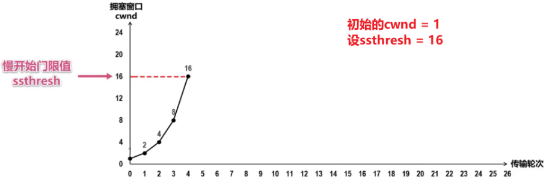

- 通常在一条TCP连接开始时，cwnd被设置为1个MSS（最大报文段），也即cwnd=1
- 该阶段，每当TCP发送方将发送窗口的数据发送完，并顺利接收到所有的确认后，就会将拥塞窗口大小翻倍，也即慢启动阶段，cwnd以指数形式增长，如上图所示；注意这里忽略了接收窗口的影响，上文也提到了。
- 拥塞窗口会一直增长直到到达慢开始门限ssthresh，开始执行拥塞避免算法
  

###### 拥塞避免

  

- 该阶段的拥塞窗口变为线性增长，每次`cwnd+1`，也即每次增加一个MSS
- 随着拥塞窗口的增加，发送速率不断提高，**当TCP遇到分组超时重传时，即认为发生了网络拥塞**
  1. 此时将更新`ssthresh`的值为**当前拥塞窗口**的**一半**，上图中是更新为24的一半即12
  2. 更新`cwnd`的值为1
  3. 然后继续执行`慢启动`—`拥塞避免`，如上图所示
- 如果TCP发送方接收到连续的3个重复确认，则认为是正常的网络包丢失，而不是网络拥塞造成的（这正是快重传算法的功劳）
  1. 重传丢失的分组
  2. 执行`快恢复`算法


###### 快重传

> 有时候并非是拥塞导致报文无法到达接收方，可能是某一报文丢失，这时候网络并没有拥塞， 如果执行又执行慢启动算法那无疑是没有必要的，可能造成网络卡顿。

所谓的快重传算法，就是让发送方尽快重传，而不是等待超时重传计时器超时再重传

> - 要求接收方不要等待自己发送数据时才捎带确认，而是要立即发送确认
> - 即使是失序的报文段，也要立即发送对已收到的报文段的重复确认
> - 发送方一旦收到3个连续的重复确认，就将相应的报文段立即重传，而不是等待该报文的重传计时器超时再重传
>   

###### 快恢复

如果发送方收到了3个重复确认，就执行快恢复算法

- 将`慢开始门限sstresh`和`拥塞窗口cwnd`都设置为当前拥塞窗口的一半，然后执行拥塞避免算法


  


### (2)UDP


## 网络层

主要任务是把**分组**从源端传送到目的端，为分组交换网上的不同主机提供通信服务。

单位是**数据报**

### 网路层设备

路由器

### 协议：

网络层协议主要包括：

1. **互联网协议（Internet Protocol，简称 IP）**：IP 协议是网络层最基础的协议，负责将数据包从源主机传送到目的主机。IP 协议提供了数据包的分片和重组、路由选择、地址转换等功能。
2. **互联网控制报文协议（Internet Control Message Protocol，简称 ICMP）**：ICMP 协议是网络层的诊断协议，用于检测网络通信问题。ICMP 协议可以用于测试网络连通性、检测路由器是否可达、查找网络延迟等。
3. **地址解析协议（Address Resolution Protocol，简称 ARP）**：ARP 协议用于将 IP 地址转换为物理地址，以实现数据包的传送。ARP 协议可以用于查找本地网络中主机的物理地址、更新 ARP 缓存等。
4. **反向地址解析协议（Reverse Address Resolution Protocol，简称 RARP）**：RARP 协议用于将物理地址转换为 IP 地址，以实现无盘工作站的网络配置。RARP 协议已经被动态主机配置协议（DHCP）取代。
5. **网际组管理协议（Internet Group Management Protocol，简称 IGMP）**：IGMP 协议用于管理多播组的成员关系。IGMP 协议可以用于查询多播组中的成员、加入和退出多播组等。
6. **NAT（ Network address translation）**：是一种网络隐蔽技术，它通过建立IP地址映射来隐藏内部的网络


#### NAT

NAT（ Network address translation）是一种网络隐蔽技术，它通过建立IP地址映射来隐藏内部的网络
它的主要功能有：

- 提高内部网络的安全性
- 共享网络地址，减少地址消耗

主要有三种实现方式

- **静态转换**是指将内部网络的私有IP地址转换为公有IP地址，IP地址对是一对一的，是一成不变的，某个私有IP地址只转换为某个公有IP地址。借助于静态转换，可以实现外部网络对内部网络中某些特定设备（如服务器）的访问。
- **动态转换**是指将内部网络的私有IP地址转换为公用IP地址时，IP地址是不确定的，是随机的，所有被授权访问上Internet的私有IP地址可随机转换为任何指定的合法IP地址。也就是说，只要指定哪些内部地址可以进行转换，以及用哪些合法地址作为外部地址时，就可以进行动态转换。动态转换可以使用多个合法外部地址集。当ISP提供的合法IP地址略少于网络内部的计算机数量时。可以采用动态转换的方式。
- **端口多路复用**通过使用端口多路复用，可以达到一个公网地址对应多个私有地址的一对多转换。在这种工作方式下，内部网络的所有主机均可共享一个合法外部IP地 址实现对Internet的访问，来自不同内部主机的流量用不同的随机端口进行标示，从而可以最大限度地节约IP地址资源。同时，又可隐藏网络内部的所有 主机，有效避免来自internet的攻击。因此，目前网络中应用最多的就是端口多路复用方式。


## 数据链路层

两台主机之间的数据传输，总是在一段一段的链路上传送的，这就需要使用专门的链路层的协议。

**传输单位**

> 在两个相邻节点之间传送数据时，**数据链路层将网络层交下来的 IP 数据报组装程帧**，在两个相邻节点间的链路上传送帧。每一帧包括数据和必要的控制信息（如同步信息，地址信息，差错控制等）。

**差错控制**

> **差错检验**
>
> 控制信息还使接收端能够检测到所收到的帧中有无差错。**如果发现差错，数据链路层就简单地丢弃这个出了差错的帧，以避免继续在网络中传送下去白白浪费网络资源。**
>
> 常用的差错检测方法包括奇偶校验、循环冗余校验（CRC）等。
>
> **差错纠正**
>
> 自动重传请求（ARQ）等 

**作用**

> 数据链路层**在不可靠的物理介质上提供可靠的传输。**
>
> 该层的作用包括:物理地址寻址、数据的成帧、流量控制、数据的检错、重发等。**将比特组装成帧和点到点的传递**


### 局域网

LAN(Local Area Network)

是指某一区域内由多台计算机互联成的计算机组，使用广播**信道**

**拓扑结构**

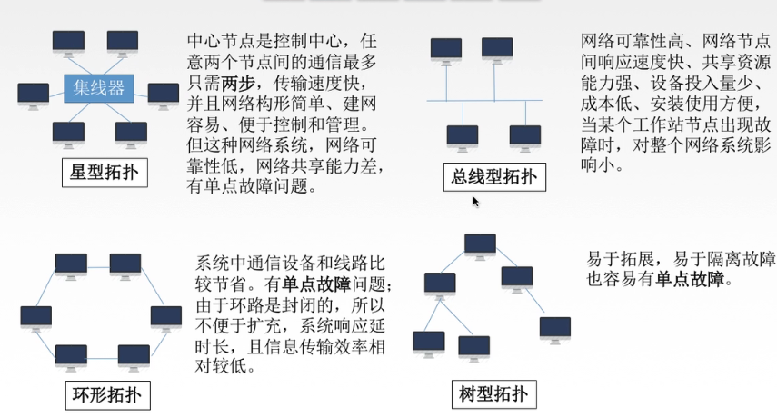


##### IEEE 802标准

是`IEEE 802 LAN/MAN`标准委员会制定的局域网、城域网技术标准。


##### 以太网

以太网是一种广泛使用的局域网（LAN）技术，是当今局域网采用的最通用的通信协议标准，使用**CSMA/CD**协议进行数据传输。 

**结构**

以太网是一种星型拓扑结构的网络 

**以太网提供的服务**

- 无连接：发送方和接收方之间无“握手过程"
- 不可靠：不对发送方的数据帧编号，接收方不向发送方进行确认，差错帧直接丢弃，差错纠正由高层负责 

### 适配器与MAC地址

- 适配器：计算机与外界有局域网的连接是通过**通信适配器**的。上面嵌入有**网卡**，适配器上面有**处理器**和**存储器（ROM）**

- MAC地址

  > **ROM上有计算机硬件的地址MAC地址**
  >
  > 局域网中硬件地址又称为物理地址，**该地址全球唯一**，
  >
  > > 一共48位：前24位代表厂家(IEEE规定)，后24位厂家自己指定，通常6个十六进制数字

### 链路层设备

- 网桥

  > 网桥根据MAC帧的目的地址对帧进行转发和过滤。当网桥收到一个帧时，并不向所有接口转发此帧，而是先检查此帧的目的MAC地址，然后在确定该帧转发到哪一个接口，或者把他过滤。

- 交换机

  > 由于网桥往往只有两个端口，所以交换机就出现了，交换机有十几个端口，可以**独占媒体带宽**


##### 交换机和路由器

**工作区域**

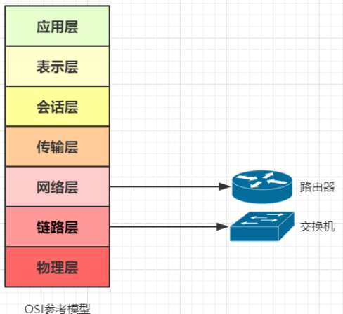


**主要工作**

**路由器：寻址，转发（依靠 IP 地址）**

> 路由器内有一份路由表，里面有它的寻址信息（就像是一张地图），它收到网络层的数据报后，会根据路由表和选路算法将数据报转发到下一站（可能是路由器、交换机、目的主机）

**交换机：过滤，转发（依靠 MAC 地址）**

> 交换机内有一张MAC表，里面存放着和它相连的所有设备的MAC地址，它会根据收到的数据帧的首部信息内的目的MAC地址在自己的表中查找，如果有就转发，如果没有就放弃


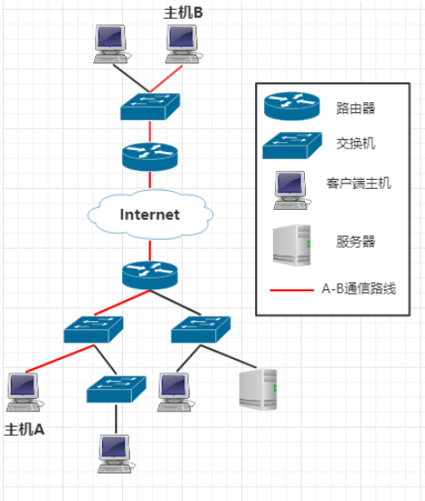


**通过上面的拓扑图可以发现，每一个路由器与其之下连接的设备，其实构成一个局域网，交换机用于局域网内网的数据转发，路由器用于连接局域网内网和外网。**


**`是否可以单独使用`**

1.交换机在局域网内工作，它根据 MAC 地址转发数据，**如果没有了路由器在网络层寻址，那么我们的数据就不能发送到其他网络终端上去了**

2.**路由器内集成了交换机的功能**，主机与路由器相连也可以实现数据转发，但是不足之处是：

- 可扩展的接口不如交换机多
- 交换机通常由硬件加速转发，路由器主要靠软件寻址，速度慢

**工作流程**

你的电脑先在应用层打包一个 HTTP报文，然后在传输层在打包成 TCP报文，然后再根据 DNS 查到的 IP 在网络层打包成 IP数据报，然后在通过链路层打包成以太网数据帧，发送给你的交换机：

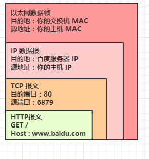

你的交换机收到后，重新包装数据帧，再发送给你的路由器：

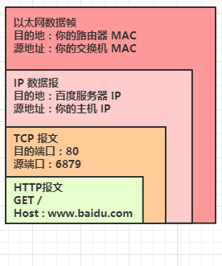

你的路由器利用 NAT(Network Address Translation)，将你的主机IP（局域网IP）转换为外网IP，还会修改端口号，对外完全隐藏你的主机，再根据路由表选择一条合适的路径进行转发：

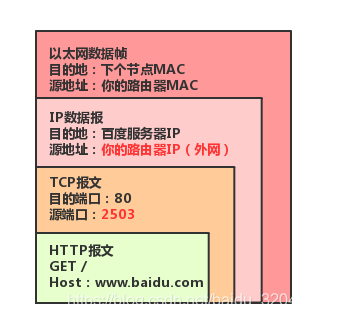

然后接下来，每个节点只改变MAC地址，然后在网络中一路向着目的地发送。


### **冲突域和广播域**

**冲突域**：是指同一时间只能有一台设备发送信息的范围

①通过`集线器`连接形成的冲突域

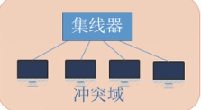

②通过`交换机`形成的冲突域

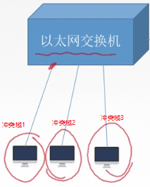


**广播域**：网络中能够接收任一设备发出的广播帧的所以设备的集合。简单地说如果站点发出一个广播信号，所以能够收到这个信号的设备称为一个广播域。


> 下图说明了：
>
> **路由器**连接的每一个端口构成的网络都可以形成广播域和冲突域
>
> 而**交换机**连接的每一个端口都可以构成一个冲突域
>
> **集线器**连接的所有端口的集合构成一个冲突域

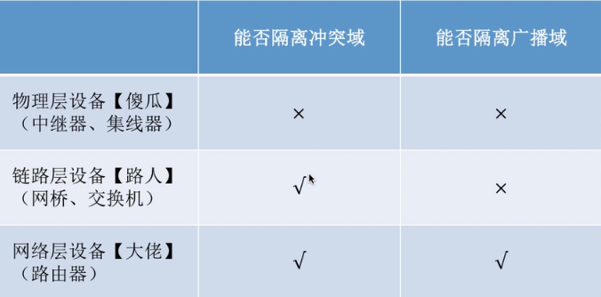


## **物理层**

主要是在物理媒体上实现比特流的透明传输，单位是**比特**。

### 通信方式：

**单工通信：**只有一个方向的通信而没有反方向的交互，仅需要一条信道

**半双工通信：**通信双方都可以发送或接受信息，但任何一方都不能同时发送和接收，需要两条信道

**全双工通信：**通信双方可以同时发送和接受信息，也需要两条信道


### 数据传输方式

**串行传输：**速度慢，费用低，适合远距离

**并行传输：**速度快，费用高，适合近距离

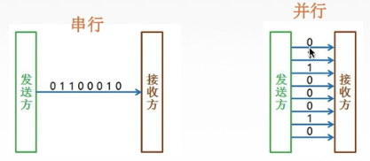

### 设备

- **中继器：**对信号进行再生和还原，对衰减信号进行放大，保持与原数据相同，以增加信号传输距离，延长网络长度
- **集线器（多口中继器）**：再生，放大信号


# 拓展

## <a name=idempotent >幂等</a>

如果一个方法重复执行多次，产生的效果是一样的，那就是idempotent(幂等)的


## <a name=TLS>TLS/SSL</a>

**SSL(Secure Sockets Layer)**和**TSL(Transport Layer Security)**

一种通信协议或一组规则，用于在网络上的两个设备或应用程序之间创建安全连接。

### 相同点

SSL 和 TLS 都是通信协议，用于加密服务器、应用程序、用户和系统之间的数据。这两种协议都会对通过网络连接的双方进行身份验证，以便他们能安全交换数据。 

### 区别

SSL 是一种较老的技术，包含一些安全漏洞。传输层安全性协议（TLS）是 SSL 的升级版本，用于修复现有 SSL 漏洞。TLS 可以更高效地进行身份验证，并继续支持加密的通信通道。 

> - SSL 1.0 – 由于安全问题从未公开发布。
> - SSL 2.0 – 1995年发布。2011年弃用。存在已知的安全问题。
> - SSL 3.0 – 1996年发布。2015年弃用。存在已知的安全问题。
> - TLS 1.0 – 1999年作为SSL 3.0的升级发布。计划在2020年弃用。
> - TLS 1.1 – 2006年发布。计划在2020年弃用。
> - TLS 1.2 – 2008年发布。
> - TLS 1.3 – 2018年发布。

①**安全性**：TLS比SSL更加安全。TLS废弃了SSL中不安全的加密算法和协议流程，增强了对抗攻击的能力。例如，TLS 1.3废弃了基于MD5和SHA-1的哈希算法，**增强了前向安全性，简化了握手过程**等。

②**性能**：TLS比SSL更高效。TLS在协议流程和加密算法方面做了许多优化，减少了延迟，提高了通信效率。例如，TLS 1.3在握手过程中使用了0-RTT（零往返时延）技术，可以在某些情况下减少通信延迟。

③**兼容性**：TLS与SSL不完全兼容。虽然TLS 1.0与SSL 3.0基本兼容，但TLS 1.1、TLS 1.2和TLS 1.3与SSL 3.0不兼容。这意味着如果客户端和服务器之间只支持SSL 3.0，那么它们无法使用TLS协议进行通信。


## <a name=ddos>DDOS</a>

> [ddos攻击](https://info.support.huawei.com/info-finder/encyclopedia/zh/DDoS%E6%94%BB%E5%87%BB.html)

DDoS（Distributed Denial of Service）攻击是一种分布式拒绝服务攻击，它的目的是通过向目标网站或服务发送大量的网络流量或请求，使其超过其处理能力，从而导致网站或服务无法正常工作。 

 可以将DDoS攻击分为：

- 网络层攻击：ICMP flood、ARP Flood、IP分片攻击
- 传输层攻击：SYN flood、ACK flood、UDP flood
- 应用层攻击：DNS flood、Http flood、CC攻击