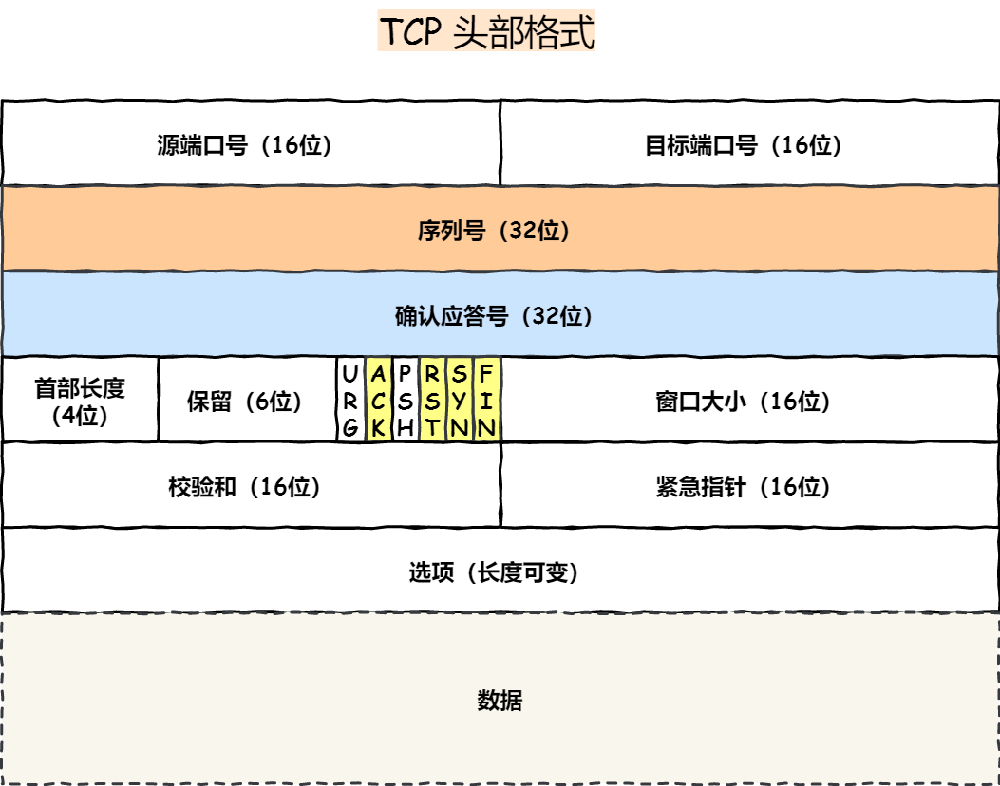
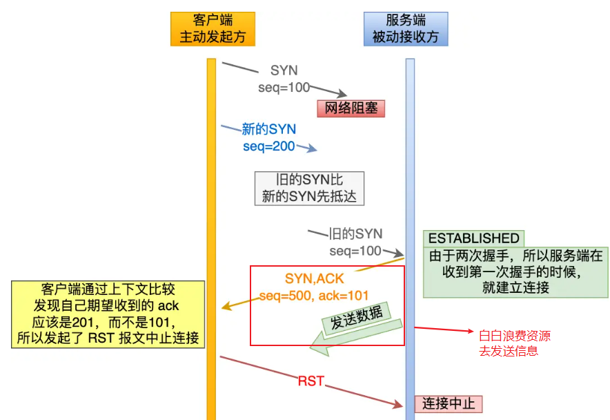

# 概述

**计算机网络是什么**

> 计算机网络：是一个将分散的、具有独立功能的计算机系统，通过通信设备与线路连接起来，由功能完善的软件实现资源共享和信息传递的系统。

计算机网络是互连的、自治的计算机集合：

- 互连--互联互通，通信链路
- 自治--无主从关系

**计算机网络功能**

- 数据通信
- 资源共享
- 分布式处理
- 提高可靠性
- 负载均衡

**计算机网络的组成**

**(1)组成部分来划分：硬件、软件、协议**

**(2)工作方式来划分：**

- **边缘部分**：用户直接使用
  - C/S方式
  - P2P方式
- **核心部分**： 为边缘部分服务（路由器，交换机等）

**(3)功能组成划分：**

- 通信子网 ： 实现数据通信
- 资源子网 ： 实现资源共享/数据处理

**计算机网络分类**

**(1)按分布范围分：**

- 广域网WAN -- 交换技术
- 城域网MAN
- 局域网LAN -- 广播技术
- 个人区域网PAN

**(2)按使用者分**

- 公用网 -- 三大运营商等等
- 专用网 --- 政府、军队

**(3)按交换技术分**

- 电路交换
- 报文交换
- 分组交换

**(4)按拓扑结构分**

**(5)按传输技术分：**

- 广播式网络--共享公共通信信道
- 点对点网络--使用分组存储转发和路由选择机制

**标准化**

要实现不同厂商的硬、软件之间相互连通，就必须遵从统一的标准

**（1）标准的分类**

- 法定标准 ： 由权威机构制定的正式的、合法的标准（OSI）
- 事实标准 ： 某些公司的产品在竞争中占据了主流，时间一长，这些产品的协议和技术就成了标准（TCP/IP）

**(2)标准化工作相关组织**

# 计算机网络性能指标

### (1)速率

速率即数据率（数据传输率、比特率），是指连接在计算机网络上的主机在数字信道上传送数据位数的速率。

单位是：b/s , kb/s , Mb/s , Gb/s , Tb/s 

**换算关系:**

### (2)带宽

计算机网络中，带宽用来表示网络的通信线路传送数据的能力，通常是指单位时间内从网络中的某一点到另一点所能通过的“最高数据率”。单位是“比特每秒”，b/s,kb/s,Mb/s,Gb/s.

### (3)吞吐量

表示单位时间内通过某个网络（或信道、接口）的数据量。单位b/s,kb/s,Mb/s等

吞吐量受网络的带宽或网络的额定速率的限制

### (4)时延

指数据(报文/分组/比特流)从网络(或链路)的一端传送到另一端所需的时间。也叫延迟或迟延。**单位是s**

时延也可以分为以下几类:

- 传输时延：是指把计算机数据放到信道上所需要的时间
- 传播时延：是指数据通过信道从一段传送到另一端所需要的的时间

### (5)时延带宽积

**时延带宽积(bit) = 传播时延(s)  x  带宽(b/s)**

时延带宽积又称为以比特为单位的链路长度，即“某段链路现在有多少比特。

### (6)往返时间RTT 

从发送方发送数据开始，到发送方收到接收方的确认，总共经历的时延。

可以通过ping 命令查看RTT

### (7)利用率

**利用率越高，则时延越长**

# 计算机网络分层结构

**几个名词**

- **实体**：每一层活动的元素称为实体

- **协议**：每一层规则或约定称为协议，协议是水平方向的，只有对等实体才能协议

  > 协议满足三个条件：
  >
  > - 语法：规定传输数据的格式
  > - 语义：规定所要完成的功能
  > - 同步：规定各种操作的顺序

- **接口**：上层使用下层服务的入口

- **服务**：每两层之间提供的东西，上层是使用下层服务，下层为上层提供服务

从上层往下层传输过程中可以表示如下：

> 其中：SDU服务数据单元：表示传送的数据
>
> ​			PCI协议控制信息：表示控制协议操作的信息
>
> ​			PDU协议数据单元：表示对等层次之间传送的数据单位(也是经过重新封装之后传往下一层的新数据体)

**分层结构**

计算机网络分层结构可以分为两种模型

- 7层OSI参考模型（法定标准）
- 4层TCP/IP参考模型（事实标准）
- 5层参考模型，综合前两者得出

### OSI 7层模型

目的：支持异构网络系统的互联互通

发布：国际标准化组织（ISO）于1984年提出开放系统互连（OSI）参考模型

**①OSI参考模型通信过程**

> 通过上图可以看到从电脑A到电脑B传输数据的过程要经历的过程：
>
> 1.首先是A的数据经过层层包装最后通过物理层实体介质进行传输，
>
> 2.然后在**中间系统**拆分数据到网络层面查看数据要发送往的位置，
>
> 3.最后又层层包装通过物理层传输到电脑B。

- 

### TCP/IP模型

**利用 IP 进行通信时所必须用到的协议群的统称**。

具体来说，IP 、 ICMP、TCP 、 UDP、TELNET 、 FTP、 HTTP 等都属于 TCP/IP 协议。TCP/IP 一词泛指这些协议，因此，有时也称 TCP/IP 为`网际协议群`。

### OSI 5层参考模型

综合了`OSI 7层参考模型`和`TCP/IP参考模型`然后就得出了5层参考模型

**五层参考模型数据封装与解封装**

# 补充

> [计算机网络](https://github.com/cosen1024/Java-Interview/blob/main/%E8%AE%A1%E7%AE%97%E6%9C%BA%E7%BD%91%E7%BB%9C/%E8%AE%A1%E7%AE%97%E6%9C%BA%E7%BD%91%E7%BB%9C%E4%B8%8A.md)

## 应用层

所有能和用户交互产生网络流量的程序，应用层为操作系统或网络应用程序提供访问网络服务的接口。

​	**典型的应用层服务和协议：**

- 文件传输(FTP)
- 电子邮件(SMTP)
- 万维网(HTTP)

## 表示层

​	**主要功能：**

- 数据格式转换

  > 例如将二进制格式数据转换为`jpg`图片

- 数据加密解密

- 数据压缩和恢复

​	**主要协议：**

- ASCII
- JPEG

## 会话层

向用户层实体/用户进程**提供建立连接**并在连接上有序地传输数据，**会话层不参与具体的传输**，它提供包括访问验证和会话管理在内的建立和维护应用之间通信的机制。

> 如服务器验证用户登录便是由会话层完成的。

**主要功能**：

- 建立、管理、终止会话
- 使用校验点可以使会话在通信失效时从**校验点/同步点**继续恢复通信，实现数据同步（适用于传输大文件）

**主要协议**

ADSP、ASP

## 传输层

负责向**两台主机进程之间的通信**提供通用的数据传输服务，即端到端的通信。

传输单位是**报文**或**用户数据报**

### **主要协议**

主要协议是`UDP`和`TCP`，区别如下

|              | UDP                                                          | TCP                                              |
| ------------ | ------------------------------------------------------------ | ------------------------------------------------ |
| 是否连接     | 无连接                                                       | 面向连接                                         |
| 是否可靠     | 不可靠传输，不使用流量控制和拥塞控制                         | 可靠传输，使用流量控制和拥塞控制                 |
| 是否有序     | 无序                                                         | 有序，消息在传输过程中可能会乱序，TCP 会重新排序 |
| 传输速度     | 快                                                           | 慢                                               |
| 连接对象个数 | 支持一对一，一对多，多对一和多对多交互通信                   | 只能是一对一通信                                 |
| 传输方式     | 面向报文                                                     | 面向字节流                                       |
| 首部开销     | 首部开销小，仅8字节                                          | 首部最小20字节，最大60字节                       |
| 适用场景     | 适用于实时应用（IP电话、视频会议、直播等）                   | 适用于要求可靠传输的应用，例如文件传输           |
| 应用场景     | ①总量少通信：DNS、SNMP ②视频、音频等多媒体通信 ③广播通信 | ①FTP文件传输 ②HTTP/HTTPS                    |

#### TCP

TCP的头部格式如下：

  

##### **三次握手：**

> [tcp三次握手](https://xiaolincoding.com/network/3_tcp/tcp_interview.html#udp-%E5%92%8C-tcp-%E6%9C%89%E4%BB%80%E4%B9%88%E5%8C%BA%E5%88%AB%E5%91%A2-%E5%88%86%E5%88%AB%E7%9A%84%E5%BA%94%E7%94%A8%E5%9C%BA%E6%99%AF%E6%98%AF)

TCP是面向连接的协议，所以每次通信前会三次握手建立连接。

  

- **第一次握手：**

  > 客户端请求建立连接，把`SYN`标志位置为1，选择一个随机数 `seq = client_isn` 作为**初始序列号**，然后向服务端发送该**同步报文**，之后客户端进入`SYN_SENT`状态，等待服务器确认。
  >
  > > **该报文不包含应用层数据**

- **第二次握手**

  > 服务端收到客户端的 `SYN` 报文后，首先服务端也随机初始化自己的序号`seq_num = server_isn`，将此序号填入 TCP 首部的「序号」字段中，其次把 TCP 首部的「确认应答号」字段填入 `ack = client_isn + 1`, 接着把 `SYN` 和 `ACK` 标志位置为 `1`。最后把该**同步确认报文**发给客户端，之后服务端处于 `SYN-RCVD` 状态。
  >
  > > **该报文也不包含应用层数据**

- **第三次握手**

  > 客户端收到服务端报文后，还要向服务端回应最后一个**应答报文**，首先该应答报文 TCP 首部 `ACK=1` ，其次「确认应答号」字段填入 `ack = server_isn + 1` ，最后把报文发送给服务端，之后客户端处于 `ESTABLISHED` 状态。
  >
  > > **这次报文可以携带客户到服务端的数据**

**为什么非要三次握手？**

- **三次握手才可以阻止重复历史连接的初始化（主要原因）**

  > 假设是两次握手，那么客户端给服务端发送`SYN`报文后，服务端接收便建立了连接， 进入`Established`状态，但如果是一个`旧的连接请求`因为网络拥塞原因迟迟到来， 导致服务端建立了一个历史连接，且白白发送了数据，妥妥地浪费了服务端的资源 
  >
  > 

- **三次握手才可以同步双方的初始序列号**

  > TCP 协议的通信双方， 都必须维护一个「序列号」， 序列号是可靠传输的一个关键因素，它的作用：
  >
  > - 接收方可以去除重复的数据；
  > - 接收方可以根据数据包的序列号按序接收；
  > - 可以标识发送出去的数据包中， 哪些是已经被对方收到的（通过 ACK 报文中的序列号知道）；
  >
  >  **而两次握手只保证了一方的初始序列号能被对方成功接收，没办法保证双方的初始序列号都能被确认接收。** 

###### **SYN洪泛攻击**

假设攻击者短时间伪造不同 IP 地址的 `SYN` 报文，服务端每接收到一个 `SYN` 报文，就进入`SYN_RCVD` 状态，但服务端发送出去的 `ACK + SYN` 报文，无法得到未知 IP 主机的 `ACK` 应答，久而久之就会**占满服务端的半连接队列**，使得服务端不能为正常用户服务。 

**如何防范**

- 通过防火墙、路由器等过滤网关防护。
- 增大 TCP 半连接队列；
- 开启 tcp_syncookies；
- 减少 SYN+ACK 重传次数

##### 四次挥手

> 第一次挥手：客户端向服务端发送连接释放报文（FIN=1，ACK=1），主动关闭连接，同时等待服务端的确认。
>
> - 序列号 seq = u，即客户端上次发送的报文的最后一个字节的序号 + 1
> - 确认号 ack = k, 即服务端上次发送的报文的最后一个字节的序号 + 1
>
> 第二次挥手：服务端收到连接释放报文后，立即发出**确认报文**（ACK=1），
>
> - 序列号 seq = k，确认号 ack = u + 1。
>
> - 这时 TCP 连接处于半关闭状态，即客户端到服务端的连接已经释放了，但是服务端到客户端的连接还未释放。这表示客户端已经没有数据发送了，但是服务端可能还要给客户端发送数据。
>
> 第三次挥手：服务端向客户端发送连接释放报文（FIN=1，ACK=1），主动关闭连接，同时等待 A 的确认。
>
> - 序列号 seq = w，即服务端上次发送的报文的最后一个字节的序号 + 1。
> - 确认号 ack = u + 1，与第二次挥手相同，因为这段时间客户端没有发送数据
>
> 第四次挥手：客户端收到服务端的连接释放报文后，立即发出**确认报文**（ACK=1）
>
> - 序列号 seq = u + 1，确认号为 ack = w + 1。
>
> 客户端在经过 `2MSL(最大报文段寿命)` 时间后，进入 `CLOSED` 状态，至此客户端也完成连接的关闭。

###### 为什么等待2MSL

 `MS( Maximum Segment Lifetime)`，**报文最大生存时间**。

 任何报文在网络上存在的最长时间，超过这个时间报文将被丢弃。

为什么要等到2MSL时间，主要两个原因：

> **确保 ACK 报文能够到达服务端，从而使服务端正常关闭连接。**
>
> `TIME_WAIT `等待 2 倍的 MSL，比较合理的解释是： 网络中可能存在来自发送方的数据包，当这些发送方的数据包被接收方处理后又会向对方发送响应，所以**一来一回需要等待 2 倍的时间**。 

> **防止已失效的连接请求报文段出现在之后的连接中**。
>
> TCP 要求在 2MSL 内不使用相同的序列号。客户端在发送完最后一个 ACK 报文段后，再经过时间 2MSL，就可以保证本连接持续的时间内产生的所有报文段都从网络中消失。这样就可以使下一个连接中不会出现这种旧的连接请求报文段。 

##### TCP协议如何保证可靠性：

TCP主要提供了检验和、序列号/确认应答、超时重传、滑动窗口、拥塞控制和 流量控制等方法实现了可靠性传输。 

#### UDP

## 网络层

主要任务是把**分组**从源端传送到目的端，为分组交换网上的不同主机提供通信服务。

单位是**数据报**

#### 网路层设备

路由器

#### 协议：

##### NAT

NAT（ Network address translation）是一种网络隐蔽技术，它通过建立IP地址映射来隐藏内部的网络
它的主要功能有：

- 提高内部网络的安全性
- 共享网络地址，减少地址消耗

主要有三种实现方式

- **静态转换**是指将内部网络的私有IP地址转换为公有IP地址，IP地址对是一对一的，是一成不变的，某个私有IP地址只转换为某个公有IP地址。借助于静态转换，可以实现外部网络对内部网络中某些特定设备（如服务器）的访问。
- **动态转换**是指将内部网络的私有IP地址转换为公用IP地址时，IP地址是不确定的，是随机的，所有被授权访问上Internet的私有IP地址可随机转换为任何指定的合法IP地址。也就是说，只要指定哪些内部地址可以进行转换，以及用哪些合法地址作为外部地址时，就可以进行动态转换。动态转换可以使用多个合法外部地址集。当ISP提供的合法IP地址略少于网络内部的计算机数量时。可以采用动态转换的方式。
- **端口多路复用**通过使用端口多路复用，可以达到一个公网地址对应多个私有地址的一对多转换。在这种工作方式下，内部网络的所有主机均可共享一个合法外部IP地 址实现对Internet的访问，来自不同内部主机的流量用不同的随机端口进行标示，从而可以最大限度地节约IP地址资源。同时，又可隐藏网络内部的所有 主机，有效避免来自internet的攻击。因此，目前网络中应用最多的就是端口多路复用方式。

## 数据链路层

两台主机之间的数据传输，总是在一段一段的链路上传送的，这就需要使用专门的链路层的协议。

**传输单位**

> 在两个相邻节点之间传送数据时，**数据链路层将网络层交下来的 IP 数据报组装程帧**，在两个相邻节点间的链路上传送帧。每一帧包括数据和必要的控制信息（如同步信息，地址信息，差错控制等）。

**差错控制**

> **差错检验**
>
> 控制信息还使接收端能够检测到所收到的帧中有无差错。**如果发现差错，数据链路层就简单地丢弃这个出了差错的帧，以避免继续在网络中传送下去白白浪费网络资源。**
>
> 常用的差错检测方法包括奇偶校验、循环冗余校验（CRC）等。
>
> **差错纠正**
>
> 自动重传请求（ARQ）等 

**作用**

> 数据链路层**在不可靠的物理介质上提供可靠的传输。**
>
> 该层的作用包括:物理地址寻址、数据的成帧、流量控制、数据的检错、重发等。**将比特组装成帧和点到点的传递**

#### 局域网

LAN(Local Area Network)

是指某一区域内由多台计算机互联成的计算机组，使用广播**信道**

**拓扑结构**

##### IEEE 802标准

是`IEEE 802 LAN/MAN`标准委员会制定的局域网、城域网技术标准。

##### 以太网

以太网是一种广泛使用的局域网（LAN）技术，是当今局域网采用的最通用的通信协议标准，使用**CSMA/CD**协议进行数据传输。 

**结构**

以太网是一种星型拓扑结构的网络 

**以太网提供的服务**

- 无连接：发送方和接收方之间无“握手过程"
- 不可靠：不对发送方的数据帧编号，接收方不向发送方进行确认，差错帧直接丢弃，差错纠正由高层负责 

#### 适配器与MAC地址

- 适配器：计算机与外界有局域网的连接是通过**通信适配器**的。上面嵌入有**网卡**，适配器上面有**处理器**和**存储器（ROM）**

- MAC地址

  > **ROM上有计算机硬件的地址MAC地址**
  >
  > 局域网中硬件地址又称为物理地址，**该地址全球唯一**，
  >
  > > 一共48位：前24位代表厂家(IEEE规定)，后24位厂家自己指定，通常6个十六进制数字

#### 链路层设备

- 网桥

  > 网桥根据MAC帧的目的地址对帧进行转发和过滤。当网桥收到一个帧时，并不向所有接口转发此帧，而是先检查此帧的目的MAC地址，然后在确定该帧转发到哪一个接口，或者把他过滤。

- 交换机

  > 由于网桥往往只有两个端口，所以交换机就出现了，交换机有十几个端口，可以**独占媒体带宽**

##### 交换机和路由器

**工作区域**

**主要工作**

**路由器：寻址，转发（依靠 IP 地址）**

> 路由器内有一份路由表，里面有它的寻址信息（就像是一张地图），它收到网络层的数据报后，会根据路由表和选路算法将数据报转发到下一站（可能是路由器、交换机、目的主机）

**交换机：过滤，转发（依靠 MAC 地址）**

> 交换机内有一张MAC表，里面存放着和它相连的所有设备的MAC地址，它会根据收到的数据帧的首部信息内的目的MAC地址在自己的表中查找，如果有就转发，如果没有就放弃

**通过上面的拓扑图可以发现，每一个路由器与其之下连接的设备，其实构成一个局域网，交换机用于局域网内网的数据转发，路由器用于连接局域网内网和外网。**

**`是否可以单独使用`**

1.交换机在局域网内工作，它根据 MAC 地址转发数据，**如果没有了路由器在网络层寻址，那么我们的数据就不能发送到其他网络终端上去了**

2.**路由器内集成了交换机的功能**，主机与路由器相连也可以实现数据转发，但是不足之处是：

- 可扩展的接口不如交换机多
- 交换机通常由硬件加速转发，路由器主要靠软件寻址，速度慢

**工作流程**

你的电脑先在应用层打包一个 HTTP报文，然后在传输层在打包成 TCP报文，然后再根据 DNS 查到的 IP 在网络层打包成 IP数据报，然后在通过链路层打包成以太网数据帧，发送给你的交换机：

你的交换机收到后，重新包装数据帧，再发送给你的路由器：

你的路由器利用 NAT(Network Address Translation)，将你的主机IP（局域网IP）转换为外网IP，还会修改端口号，对外完全隐藏你的主机，再根据路由表选择一条合适的路径进行转发：

然后接下来，每个节点只改变MAC地址，然后在网络中一路向着目的地发送。

#### **冲突域和广播域**

**冲突域**：是指同一时间只能有一台设备发送信息的范围

①通过`集线器`连接形成的冲突域

②通过`交换机`形成的冲突域

**广播域**：网络中能够接收任一设备发出的广播帧的所以设备的集合。简单地说如果站点发出一个广播信号，所以能够收到这个信号的设备称为一个广播域。

> 下图说明了：
>
> **路由器**连接的每一个端口构成的网络都可以形成广播域和冲突域
>
> 而**交换机**连接的每一个端口都可以构成一个冲突域
>
> **集线器**连接的所有端口的集合构成一个冲突域

## **物理层**

主要是在物理媒体上实现比特流的透明传输，单位是**比特**。

#### 通信方式：

**单工通信：**只有一个方向的通信而没有反方向的交互，仅需要一条信道

**半双工通信：**通信双方都可以发送或接受信息，但任何一方都不能同时发送和接收，需要两条信道

**全双工通信：**通信双方可以同时发送和接受信息，也需要两条信道

#### 数据传输方式

**串行传输：**速度慢，费用低，适合远距离

**并行传输：**速度快，费用高，适合近距离

#### 设备

- **中继器：**对信号进行再生和还原，对衰减信号进行放大，保持与原数据相同，以增加信号传输距离，延长网络长度
- **集线器（多口中继器）**：再生，放大信号

