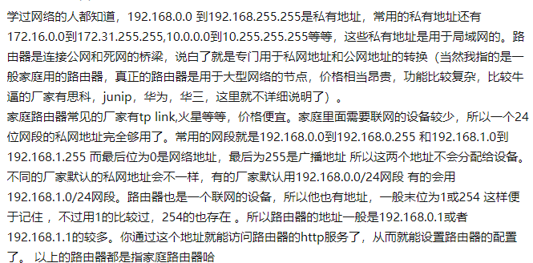

# 计算机网络

## 1.路由器和交换机

### IP地址

在了解路由器和交换机之前先来了解两个概念：公网地址和私网地址

#### 公网地址

公网地址，也就是在公共网络之中存在的地址，这类地址可以直接和外界的公共网络之中的设备直接通信。公网地址，要求全球唯一。

#### 私网地址

私网地址，就是指在一个路由器管理的局域网中，由路由器分配的地址。

### 交换机和路由器

#### 工作区域

#### 主要工作

**路由器：寻址，转发（依靠 IP 地址）**

> 路由器内有一份路由表，里面有它的寻址信息（就像是一张地图），它收到网络层的数据报后，会根据路由表和选路算法将数据报转发到下一站（可能是路由器、交换机、目的主机）

**交换机：过滤，转发（依靠 MAC 地址）**

> 交换机内有一张MAC表，里面存放着和它相连的所有设备的MAC地址，它会根据收到的数据帧的首部信息内的目的MAC地址在自己的表中查找，如果有就转发，如果没有就放弃

**通过上面的拓扑图可以发现，每一个路由器与其之下连接的设备，其实构成一个局域网，交换机用于局域网内网的数据转发，路由器用于连接局域网内网和外网。**

**`是否可以单独使用`**

1.交换机在局域网内工作，它根据 MAC 地址转发数据，**如果没有了路由器在网络层寻址，那么我们的数据就不能发送到其他网络终端上去了**

2.**路由器内集成了交换机的功能**，主机与路由器相连也可以实现数据转发，但是不足之处是：

- 可扩展的接口不如交换机多
- 交换机通常由硬件加速转发，路由器主要靠软件寻址，速度慢

#### 工作流程

你的电脑先在应用层打包一个 HTTP报文，然后在传输层在打包成 TCP报文，然后再根据 DNS 查到的 IP 在网络层打包成 IP数据报，然后在通过链路层打包成以太网数据帧，发送给你的交换机：

你的交换机收到后，重新包装数据帧，再发送给你的路由器：

你的路由器利用 NAT(Network Address Translation)，将你的主机IP（局域网IP）转换为外网IP，还会修改端口号，对外完全隐藏你的主机，再根据路由表选择一条合适的路径进行转发：

然后接下来，每个节点只改变MAC地址，然后在网络中一路向着目的地发送。

#### NAT

NAT是一种网络隐蔽技术，它通过建立IP地址映射来隐藏内部的网络
它的主要功能有：

- 提高内部网络的安全性
- 共享网络地址，减少地址消耗

主要有三种实现方式

- **静态转换**是指将内部网络的私有IP地址转换为公有IP地址，IP地址对是一对一的，是一成不变的，某个私有IP地址只转换为某个公有IP地址。借助于静态转换，可以实现外部网络对内部网络中某些特定设备（如服务器）的访问。
- **动态转换**是指将内部网络的私有IP地址转换为公用IP地址时，IP地址是不确定的，是随机的，所有被授权访问上Internet的私有IP地址可随机转换为任何指定的合法IP地址。也就是说，只要指定哪些内部地址可以进行转换，以及用哪些合法地址作为外部地址时，就可以进行动态转换。动态转换可以使用多个合法外部地址集。当ISP提供的合法IP地址略少于网络内部的计算机数量时。可以采用动态转换的方式。
- **端口多路复用**通过使用端口多路复用，可以达到一个公网地址对应多个私有地址的一对多转换。在这种工作方式下，内部网络的所有主机均可共享一个合法外部IP地 址实现对Internet的访问，来自不同内部主机的流量用不同的随机端口进行标示，从而可以最大限度地节约IP地址资源。同时，又可隐藏网络内部的所有 主机，有效避免来自internet的攻击。因此，目前网络中应用最多的就是端口多路复用方式。

**参考资料：**

> https://baijiahao.baidu.com/s?id=1660864595253600356&wfr=spider&for=pc

> https://blog.csdn.net/baidu_32045201/article/details/78305586
