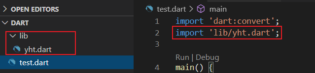
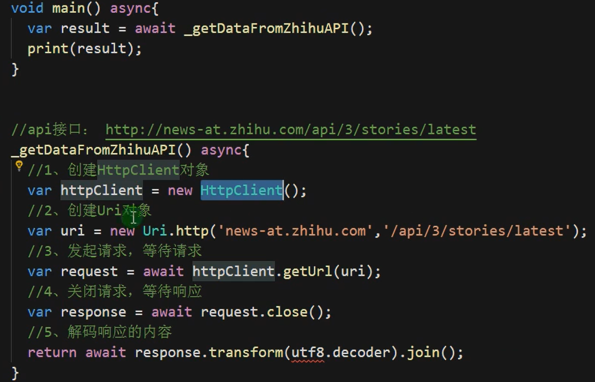
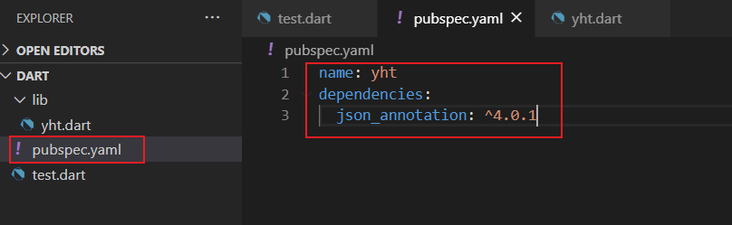
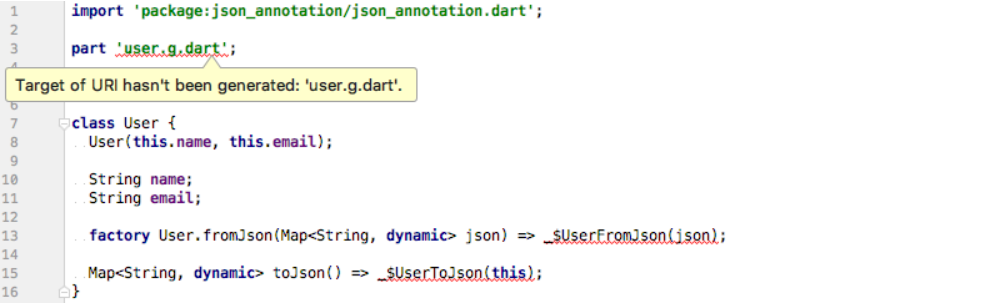
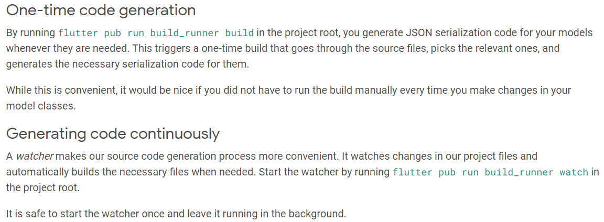
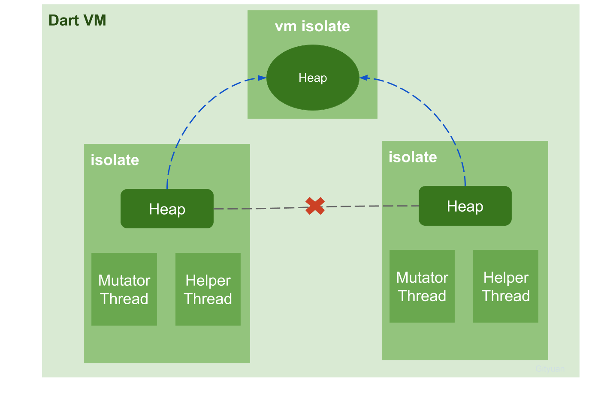

> 参考——`dart中文学习文档`：https://www.dartcn.com/guides/get-started

# 一、基本语法

## 1.main

```dart
main() {
  print("你好 dart");
}

//没有返回值
void main() {
  print("你好 dart");
}
```

## 2.基本数据类型

### 	(1)声明变量

**dart是一个脚本类语言，可以通过var关键字通过类型声明变量，未初始化的变量的初始值为null（包括数字），因此数字、字符串都可以调用各种方法。**

#### 有四种定义变量方式:

- var
- 显示类型定义
- Object
- dynamic

> **var、Object、dynamic三者区别**
>
> - `dynamic`：**所有dart 对象的基础类型**，在大多数情况下，不直接使用它，通过它定义的变量会关闭类型检查，这意味着 `dynamix x= 'hal'; x.foo();`这段静态类型检查不会报错，但是运行时会crash，因为x 并没有foo() 方法，**所以建议大家在编程时不要直接使用dynamic**；
>
> - `var`：弱类型，编译器自动推导是什么类型
>
> - `Object`：是Dart 对象的基类，当你定义：` object o =xxx;`时这个时候系统会认为o是个对象，但是如果尝试调用`o.foo()`时，静态类型检查会运行报错。
>
>   **综上不难看出dynamic 与object 的最大的区别是在静态类型检查上**。

```dart
var str = '你好dart';
String str2 = '你好dart';

//如果对象不限于单一类型（没有明确的类型），请使用Object或dynamic关键字
Object name1 = "小明";
dynamic name2 = "老王";
//类型改变实例，变量类型可以更改
dynamic s = 'hhh';
print(s);
s = 123;
print(s);
```


#### late

 声明一个不可为 null 的变量，该变量在其声明后初始化。 

> 如果一个变量使用late修饰，那么即使在声明时候初始化，那么也会等到使用它的时候在初始化
>
> 这对于一些初始化成本很高的变量很有效

```dart
late String description;

void main() {
  description = 'Feijoada!';
  print(description);
}
```


### 	(2)声明常量

```dart
const PI = 3.13;
final Pi = 3.14;

const Pi = new DateTime.now();//报错
final pi = new DateTime.now();//不报错
```

**区别:**

- `final`在被**使用到的时候才会进行初始化**, 如果只是被定义, 而没有被使用到, 那么这个变量一直没有被初始化 (可以理解为'懒加载'); 

- `const`修饰的变量, 一经定义就会在编译期间对其进行初始化，所以要求在声明时候就要初始化

```dart
//编译器通过
var a = 1;
final f = 3;
const d = 2;
final b = a;
const c = d;

//编译器报错
//报错：Error: Not a constant expression.
const e = a;//必须使用编译时常量
//报错：Error: Not a constant expression.
const g = f;
```

> **从上面代码可以看出，final和const的另一个区别：**
> final 要求变量只能初始化一次，并不要求赋的值一定是编译时常量，可以是常量也可以不是。
> const 要求在声明时初始化，并且赋值必需为编译时常量。

#### 常量和变量混用：

```dart
var varList = const [];     //varList 当前是一个EIL
//即使它曾经具有const值也可以改变
varList = [111, 222, 333];
```

### (3)字符串

可以通过：

- ' .... '
- " ... "
- ''' .... ''' / " " "..... " " "

```dart
三个单引号或者双引号支持换行
String str = ''' sss
sss
sss''';

输出:
 sss
sss
sss
```

#### 单引号或双引号嵌套问题:

```dart
//单引号里面嵌套单引号，必须在前面加反斜杠
String str3 = '双引号里面有单引号it\'s，必须在前面加反斜杠.';
//双引号里面嵌套单引号（正常使用）
String str4 = "双引号里面有单引号it's.";
//单引号里面嵌套双引号（正常使用）
String str5 = '单引号里面有双引号，编程开发初学必备语句"hello world"';
//双引号里面嵌套双引号，必须在前面加反斜杠
String str6 = "双引号里面有双引号，编程开发初学必备语句\"hello world\"";
```

#### **多个字符串相邻中间的空格问题：**

经测试发现，除了单引号嵌套单引号或者双引号嵌套双引号不允许出现空串之外，其余的几种情况都是可以运行的。

示例如下：

```dart
// 这个会报错
//String blankStr1 = 'hello''''world';
// 这两个运行正常
String blankStr2 = 'hello'' ''world'; //结果： hello world
String blankStr3 = 'hello''_''world'; //结果： hello_world
 
// 这个会报错
//String blankStr4 = "hello""""world";
// 这两个运行正常
String blankStr5 = "hello"" ""world"; //结果： hello world
String blankStr6 = "hello""_""world"; //结果： hello_world
 
//单引号里面有双引号，混合使用运行正常
String blankStr7 = 'hello""""world'; //结果： hello""""world
String blankStr8 = 'hello"" ""world'; //结果： hello"" ""world
String blankStr9 = 'hello""_""world'; //结果： hello""_""world
 
//双引号里面有单引号，混合使用运行正常
String blankStr10 = "hello''''world"; //结果： hello''''world
String blankStr11 = "hello'' ''world"; //结果： hello'' ''world
String blankStr12 = "hello''_''world"; //结果： hello''_''world
```

### (4)转义字符和字符串内嵌

在字符串前加字符“r”，或者在\前面再加一个\，可以避免“\”的转义作用

```dart
print(r"换行符：\n"); //这个结果是 ：换行符：\n
print("换行符：\\n"); //这个结果是 ：换行符：\n
print("换行符：\n");  //这个结果是 ：换行符：
```

也可以使用`${...}`方式进行变量赋值

```dart
String str = "ssss''sss";
print('${str}');

//或者
String replaceStr1 = '字符串连接';
print('$replaceStr1');
```

### (5)bool类型

Dart的类型安全意味着**不能使用`if（nonbooleanValue)`或`assert（nonbooleanValue）`**等代码。

```dart
//以下代码报错
int a = 1;
if (a) {
    print('hhhh');
}

//编译通过
bool a = true;
if (a) {
    print("hahah");
}
```


### (6)数据类型转换:

dart中不允许直接将字符串和int类型进行拼接

```dart
var a = "12";
var b = 33;
print(b + a);//报错
```

int -> string

```dart
age.toString()
```

string -> int 

```dart
int.parse('100');
```

String -> double

```dart
var onePointOne = double.parse('1.1');
```

double->String

```dart
String piStr = 3.141592.toStringAsFixed(3); //结果为3.141
```

判断是否为数字:

```dart
int a = 0;
print(a.isNaN);//NaN：not a number
```


### (7)“is"关键字

用于判断是否为实例

```dart
var str = 'sss';
if(str is String){
    print(is String);
}
```

### (8)空指针检查

#### ①可空运算符`?`

如果是可空类型，在他使用之前没被初始化，那么他会被默认初始化为null

> 和kotlin一致

```dart
//dart 声明可空类型
class Student {
  String? name;//静态检查通过，使用 ? 表示可空类型，String? 则是可空类型 String
  int age; //静态检查错误
}
```

#### ②非空断言`!`

有时候我们会遇到以及处理过判断为空，但是编译器无法智能分析是否进行过非空判断，这时候就可以使用非空断言强行告诉编译器这是一个不为空的变量。**但必须保证这个变量不为空，否则报错**

> 和kotlin很像，kotlin是`!!`


#### ③**`?.`**

当对象不为空时正常调用相应的方法，当对象为空时则什么都不做

> 与kotlin一致

> A?.B
> 如果 A 等于 null，那么 A?.B 为 null
> 如果 A 不等于 null，那么 A?.B 等价于 A.B


## 3.运算符

#### 	算数运算符


#### 	条件运算符


#### 赋值运算符

```dart
//??
int b,a;
b??=30;//如果b为空，则把30赋给b
a = a??10;//a为空，则把10赋值给a
```


#### 类型判断运算符

`as`， `is`， 和 `is!` 运算符用于在运行时处理类型检查：

| Operator | Meaning                                    |
| -------- | ------------------------------------------ |
| as       | TypeCast(也被用于[指定库前缀])             |
| is       | True if the object has the specified type  |
| is!      | False if the object has the specified type |

使用 `as` 运算符将对象强制转换为特定类型。 通常，可以认为是 `is` 类型判定后，被判定对象调用函数的一种缩写形式。 请考虑以下代码：

使用 `as` 运算符进行缩写，其相当于 ：先检测其是不是，然后再调用的一种简写。

```dart
if (emp is Person) {
  // Type check
  emp.firstName = 'Bob';
}

//可以通过as简写为下列形式
(emp as Person).firstName = 'Bob';
```

> 如果`emp`不是`persion`，`name`就会抛出`exception`。


#### 级联运算符

级联运算符 (`..`) 可以实现对同一个对像进行一系列的操作。 除了调用函数， 还可以访问同一对象上的字段属性。 这通常可以节省创建临时变量的步骤， 同时编写出更流畅的代码。

```dart
querySelector('#confirm') // 获取对象。
  ..text = 'Confirm' // 调用成员变量。
  ..classes.add('important')
  ..onClick.listen((e) => window.alert('Confirmed!'));
```

第一句调用函数 `querySelector()` ， 返回获取到的对象。 获取的对象依次执行级联运算符后面的代码， **忽略每个操作的返回值**。

以上代码等同于:

```dart
var button = querySelector('#confirm');
button.text = 'Confirm';
button.classes.add('important');
button.onClick.listen((e) => window.alert('Confirmed!'));
```


## 4.List、Set、Map

### 	(1)<a name = list>List</a>

**创建集合：**

```dart
var lis = [1,2,"sss"];//为指定类型，默认为dynamic
```

**指定集合类型：**

```dart
var lis = <String>["sss","aaa"];
```

**以上两种方法可以修改集合长度:**

```dart
var lis = [];
lis.length = 3;
print(lis);

结果:
[null, null, null]


var lis = [3, 4, 5, 6];
lis.length = 3;
print(lis);

结果；
[3, 4, 5]
```

**创建固定长度的集合:**

```dart
var lis = List.filled(2,"");//参数1：长度；参数2：填充的元素
//只能使用下标方式修改集合
lis[0] = "jj";

//指定类型
var lis = List<String>.filled(2,"");
```


#### **List常用方法:**

```dart
var lis = [1,2,3];
//添加元素
lis.add("yht");

//添加多个元素
lis.addAll(['ss','xx']);//参数时iterable，可迭代对象

//判断为空
lis.isEmpty;

//判断不为空
lis.isNotEmpty;

//翻转list
lis.reversed;//得到的结果是元组(3,2,1);
var newList = lis.reversed.toList();//得到的是List[3,2,1]

//查询某个元素索引
lis.indexOf('2');

//删除数据
lis.remove('2');//删除具体值
lis.removeAt(1);//删除指定索引的值

//修改元素
lis.fillRange(1,3,'yyy');//修改下标1-2的元素为yyy,不包含3

//插入元素
lis.insert(index,element)和lis.insertAll(index,[...]);

//转换成字符串
lis.join(',');//以逗号分隔

//字符串转换为数组
var str = 'a-b-c';
var list = str.split('-');
```

#### 遍历

```dart
//for循环

//for in 循环
for(var item in list){
    print(item);
}

//foreach
list.forEach((value){//只能传一个参数
   print("$value"); 
});

//map()返回可迭代对象
var newList = list.map((value){
   return value*2; 
});

List list = ['a', 'b', 'c', 'd'];
var newList = list.map((value) => value + 'a');
print(newList);

输出：
(aa, ba, ca, da)
    
//where
var newList = list.where((value)=>value>5);//进行筛选,返回一个新的元组

//any,只要有满足条件就返回true
bool f = list.any((value)=>value>5);

//every,每一个都满足返回true
bool f = list.every((value)=>value>5);
```


### (2)Set

#### 	创建set

```dart
var s = new Set();
s.add('a');
s.add('b');

//转换为list
var list = s.toList();
```

#### Set常用方法

```dart
var ingredients = Set();
ingredients.addAll(['gold', 'titanium', 'xenon']);

// 创建两个 set 的交集。
var nobleGases = Set.from(['xenon', 'argon']);
var intersection = ingredients.intersection(nobleGases);

//移除元素
ingredients.remove('gold');

//检查一个元素是否在该 set 中。
assert(ingredients.contains('titanium'));

//检查多个元素是否在该 set 中。
assert(ingredients.containsAll(['titanium', 'xenon']));
```


### (3)<a name = map>Map</a>

#### 	创建map

```dart
var person = {
    "name":"张三"，
    "age":20
};

var m  = new Map();
m["name"] = "李四";
```

#### map常用方法

```dart
//获取键
map.keys;//输出map的所以键

//是否为空
map.isEmpty;

//是否不为空
map.isNotEmpty;

//添加键值对
map.addAll({
    "work":['敲代码','送外卖'],
    "height":160
});

//移除键值对
map.remove('sex');

//包含值
map.containsValue('张三');

//如果当且仅当该 key 不存在于 map 中，且要为这个 key 赋值， 可使用putIfAbsent（）方法。 该方法需要一个方法返回这个 value 。
var teamAssignments = {};
teamAssignments.putIfAbsent(
    'Catcher', () => pickToughestKid());
assert(teamAssignments['Catcher'] != null);
```

#### 遍历

```dart
var map = new Map();
  map["a"] = 2;
  map["b"] = 3;
  map.forEach((key, value) {
    print('$key' + '$value');
  });
```

**`map()` 方法，这个方法将所有结果返回到一个对象中。**

```dart
var map = {"kevin":12,"yang":20};

var map2 = map.map((key, value){
    value = value *2;
    return MapEntry(key, value);
});

map.forEach((key, value) {print("$key : $value");});//原map不变：kevin : 12  yang : 20
map2.forEach((key, value) { print("$key : $value");});//kevin : 24 yang : 40
```

> **提示：** `map()` 方法返回的对象是一个 *懒求值（lazily evaluated）*对象： **只有当访问对象里面的元素时，函数才会被调用。**

使用 `map().toList()` 或 `map().toSet()` ， 可以强制在每个项目上立即调用函数。

```dart
var loudTeas =
    teas.map((tea) => tea.toUpperCase()).toList();
```


## 5.Runes

在 Dart 中， **Rune 用来表示字符串中的 `UTF-32` 编码字符**。Unicode 定义了一个全球的书写系统编码， 系统中使用的所有字母，数字和符号都对应唯一的数值编码。 由于 Dart 字符串是一系列 UTF-16 编码单元， 因此要在字符串中表示32位 Unicode 值需要特殊语法支持。

```dart
表示 Unicode 编码的常用方法是， \uXXXX, 这里 XXXX 是一个4位的16进制数。 例如，心形符号 (♥) 是 \u2665。 对于特殊的非 4 个数值的情况， 把编码值放到大括号中即可。 例如，emoji 的笑脸 (�) 是 \u{1f600}。
```

String 类有一些属性可以获得 rune 数据。 属性 `codeUnitAt` 和 `codeUnits` 返回16位编码数据。 属性 `runes` 获取字符串中的 Rune 。

```dart
//下面是示例演示了 Rune 、 16-bit code units 和 32-bit code points 之间的关系。
main() {
  var clapping = '\u{1f44f}';
  print(clapping);
  print(clapping.codeUnits);//返回UTF-16位的编码
  print(clapping.runes.toList());//返回UTF-32位的编码

  Runes input = new Runes(
      '\u2665  \u{1f605}  \u{1f60e}  \u{1f47b}  \u{1f596}  \u{1f44d}');
  print(new String.fromCharCodes(input));
}
```

结果：


## 6.函数

### (1)简单函数

如果函数中只有一句表达式，可以使用简写语法：

```dart
bool isNoble(int atomicNumber) => _nobleGases[atomicNumber] != null;
```

**`=> *expr*` 语法是 `{ return *expr*; }` 的简写。 `=>` 符号 有时也被称为 *箭头* 语法。**

**在箭头 (=>) 和分号 (;) 之间只能使用一个 *表达式* ，不能是 *语句* 。 例如：不能使用 [if 语句]，但是可以是用 [条件表达式].**


### (2)可选参数

函数有两种参数类型: 

- `required `：required 类型参数在参数最前面
- `optional` ： 随后是 optional 类型参数。 命名的可选参数也可以标记为 `@required` 。


#### 命名可选参数

**调用的时候通过参数名可以选择性传入参数**

**定义函数时**：

```dart
void enableFlags(bool bold, {bool? hidden}) {...}//不指定默认值，就必须用?判空

//指定默认值
void enableFlags(bool bold, {bool hidden = true}) {...}
```

**调用函数时**：

```dart
enableFlags(true, hidden: false);//调用时候
```


如果希望命名参数是强制性的，要求调用者提供参数的值，使用 `required` 对其进行注释 。

>  最开始` @required `是注解，现在它已经作为内置修饰符。
>
> 在 Dart 2.12 之前，Dart 使用 `null` 来表示空值。为了避免空指针异常，需要使用 `@required` 关键字来标记必填参数。
>
> 在 Dart 2.12 及更高版本中，Dart 引入了 **非空类型** 来区分空值和非空值。**非空类型参数默认情况下是必填参数**，因此改为使用 `required` 关键字。

```dart
const Scrollbar({Key? key, required Widget child})//强制要求必须传参数child
```

此时 `Scrollbar` 是一个构造函数， 当 `child` 参数缺少时，分析器会提示错误。


#### 位置可选参数

将参数放到 `[]` 中来标记参数是可选的：

```dart
String say(String from, [String msg, String device]) {//device可以不选择传参
    var result = '$from says $msg';
    if (device != null) {
        result = '$result with a $device';
    }
    return result;
}


void main(){
    say('hello');//不提供命名可选参数
    say('hello','msg','device');//如果提供必须按照顺序提供
}
```

#### 下划线参数

下划线通常表示您将不在块内使用该参数，这只是编写代码的好方法，例如：

```dart
method(int useful, int useless) {
  // say I am only going to use 'useful' in this block 
}
```

上面的代码也可以写成：

```dart
method(int useful, int _) {
  // using '_' means I'm not going to use 2nd parameter in the block
}
```


### (3)main函数

任何应用都必须有一个顶级 `main()` 函数，作为应用服务的入口。 `main()` 函数返回值为空，参数为一个可选的 `List<String>` 。

```dart
// 这样运行应用： dart args.dart 1 test
void main(List<String> arguments) {
    print(arguments);
}
```

> ！！！！！**main方法参数可以获取命令行的指令或数据**

### (4)匿名函数

匿名函数和命名函数看起来类似，在括号之间可以定义一些参数或可选参数，参数使用逗号分割。

后面大括号中的代码为函数体：

```dart
([[*Type*] *param1*[, …]]) { *codeBlock*;};

//匿名方法
var niNameMethod=(){
    print('我是一个匿名方法');
};
```


下面例子中定义了一个包含一个无类型参数 `item` 的匿名函数。 list 中的每个元素都会调用这个函数，打印元素位置和值的字符串。

```dart
var list = ['apples', 'bananas', 'oranges'];
list.forEach((item) {
  print('${list.indexOf(item)}: $item');
});
```

### (4)词法闭包

*闭包* 即一个函数对象，即使函数对象的调用在它原始作用域之外， 依然能够访问在它词法作用域内的变量。

函数可以封闭定义到它作用域内的变量。 接下来的示例中， **`makeAdder()` 捕获了变量 `addBy`。 无论在什么时候执行返回函数，函数都会使用捕获的 `addBy` 变量。**

```dart
/// 返回一个函数，返回的函数参数与 [addBy] 相加。
Function makeAdder(num addBy) {
  return (num i) => addBy + i;
}

void main() {
  // 创建一个加 2 的函数。
  var add2 = makeAdder(2);//此时add2 = num=>addby+num

  // 创建一个加 4 的函数。
  var add4 = makeAdder(4);//此时add4 = num=>addby+num

  assert(add2(3) == 5);
  assert(add4(3) == 7);
}
```

### (5)typedef

`typedef` 或函数型的别名，有助于存储器内定义指针的可执行代码。简单地说， `typedef` 可以用作引用函数的指针。

```dart
typedef ManyOperation(int firstNo , int secondNo);//function signature  


Add(int firstNo,int second){
   print("Add result is ${firstNo+second}");
}
Subtract(int firstNo,int second){
   print("Subtract result is ${firstNo-second}");
}
Divide(int firstNo,int second){
   print("Divide result is ${firstNo/second}");
}  
Calculator(int a, int b, ManyOperation oper){//函数指针作为形参
   print("Inside calculator");
   oper(a,b);
}  
void main(){
   ManyOperation oper = Add;
   oper(10,20);
   oper = Subtract;
   oper(30,20);
   oper = Divide;
   oper(50,5);
}
```

## 7.异常

Dart 中的所有异常是**非检查异常**。 因此没有throws，并且也不要求捕获任何异常。

### throw

下面是关于抛出或者 *引发* 异常的示例：

```dart
throw FormatException('Expected at least 1 section');
```

也可以抛出任意的对象：

```dart
throw 'Out of llamas!';
```

因为抛出异常是一个表达式， 所以可以在 => 语句中使用，也可以在其他使用表达式的地方抛出异常：

```dart
void distanceTo(Point other) => throw UnimplementedError();
```

### on/catch

捕获异常可以避免异常继续传递（除非重新抛出`rethrow`异常）。 可以通过捕获异常的机会来处理该异常：

```dart
try {
    breedMoreLlamas();
} on OutOfLlamasException {
    buyMoreLlamas();
}
```

捕获语句中可以同时使用 `on` 和 `catch` ，也可以单独分开使用。 使用 `on` 来指定异常类型， 使用 `catch` 来 捕获异常对象。

```dart
try {
  breedMoreLlamas();
} on OutOfLlamasException {
  // 一个特殊的异常
  buyMoreLlamas();
} on Exception catch (e) {
  // 其他任何异常
  print('Unknown exception: $e');
} catch (e) {
  // 没有指定任何类型类型，处理所有异常
  print('Something really unknown: $e');
}
```

`catch()`可以指定两个参数，一个是引发的异常，另一个是stacktrace

```dart
try {
    // ···
} on Exception catch (e) {
    print('Exception details:\n $e');
} catch (e, s) {
    print('Exception details:\n $e');
    print('Stack trace:\n $s');
}
```


### rethrow

如果仅需要部分处理异常， 那么可以使用关键字 `rethrow` 将异常重新抛出。

```dart
void misbehave() {
  try {
    dynamic foo = true;
    print(foo++); // Runtime error
  } catch (e) {
    print('misbehave() partially handled ${e.runtimeType}.');
    rethrow; // 允许调用者获得异常
  }
}

void main() {
  try {
    misbehave();
  } catch (e) {
    print('main() finished handling ${e.runtimeType}.');
  }
}
```

## 8.类

Dart 是一种基于类和 mixin 继承机制的面向对象的语言。 每个对象都是一个类的实例，所有的类都继承于`Object`，并且只能单继承。

```dart
var p = Point(2, 2);

// 为实例的变量 y 设置值。
p.y = 3;
```

> 使用 `?.` 来代替 `.` ， 可以避免因为左边对象可能为 null ， 导致的异常：
>
> ```dart
> // 如果 p 为 non-null，设置它变量 y 的值为 4。
> p?.y = 4;
> ```

一些类提供了常量构造函数。 使用常量构造函数，在构造函数名之前加 `const` 关键字，来创建编译时常量时：

```dart
var p = const ImmutablePoint(2, 2);
```

构造两个相同的编译时常量会产生一个唯一的， 标准的实例：

```dart
var a = const ImmutablePoint(1, 1);
var b = const ImmutablePoint(1, 1);

assert(identical(a, b)); // 它们是同一个实例。
```

**获取对象的类型**

使用对象的 `runtimeType` 属性， 可以在运行时获取对象的类型， `runtimeType` 属性回返回一个Type对象。

```dart
print('The type of a is ${a.runtimeType}');
```

**实例对象**

所有**实例变量都生成隐式`getter`方法**。 **非 final 的实例变量同样会生成隐式 *setter* 方法**。

```dart
class Point {
  num x;
  num y;
}

void main() {
  var point = Point();
  point.x = 4; // Use the setter method for x.
  assert(point.x == 4); // Use the getter method for x.
  assert(point.y == null); // Values default to null.
}
```

通常模式下，会将构造函数传入的参数的值赋值给对应的实例变量， Dart 自身的语法糖精简了这些代码：

```dart
class Point {
  num x, y;

  // 在构造函数体执行前，
  // 语法糖已经设置了变量 x 和 y。
  Point(this.x, this.y);
}
```


**私有变量**

使用下划线 _ 前缀来声明私有变量。私有变量只能在同一个库中被访问，不能在库外被访问。 


### 构造函数

#### 命名构造函数

使用命名构造函数可为一个类实现多个构造函数， 也可以使用命名构造函数来更清晰的表明函数意图：

```dart
class Point {
  num x, y;

  Point(this.x, this.y);

  // 命名构造函数
  Point.origin() {
    x = 0;
    y = 0;
  }
}
```

#### 调用父类非默认构造函数

如果父类没有默认构造函数，**调用父类的带参构造函数。 在当前构造函数冒号 `:` 之后(初始化列表)，函数体之前，声明调用父类构造函数。**

```dart
class Person {
    String firstName;

    Person.fromJson(Map data) {
        print('in Person');
    }
}

class Employee extends Person {
    //必须调用父类的带参构造函数
    Employee.fromJson(Map data) : super.fromJson(data) {
        print('in Employee');
    }
}
```

#### 初始化列表

除了调用父类构造函数之外， 还可以在构造函数体执行之前初始化实例变量。 各参数的初始化用逗号分隔。

> 尤其是初始化那些final修饰的成员变量时，初始化列表很有用，因为在方法体中，不能给final修饰的成员变量赋值，因为**在执行方法体的时候，final修饰的成员变量已经不能变了**。这个地方很多人犯错。）

```dart
// 在构造函数体执行之前，
// 通过初始列表设置实例变量。
Point.fromJson(Map<String, num> json)
    : x = json['x'],
      y = json['y'] {
  print('In Point.fromJson(): ($x, $y)');
}
```

#### 重定向构造函数

有时构造函数的唯一目的是重定向到同一个类中的另一个构造函数。 重定向构造函数的函数体为空， 构造函数的调用在冒号 (:) 之后。

```dart
class Point {
  num x, y;

  // 类的主构造函数。
  Point(this.x, this.y);

  // 指向主构造函数
  Point.alongXAxis(num x) : this(x, 0);
}
```

#### 常量构造函数

如果该类生成的对象是固定不变的， 那么就可以把这些对象定义为编译时常量。 为此，需要定义一个 `const` 构造函数， 并且声明所有实例变量为 `final`。

```dart
class ImmutablePoint {
  static final ImmutablePoint origin =
      const ImmutablePoint(0, 0);

  final num x, y;

  const ImmutablePoint(this.x, this.y);
}
```

**常量构造函数创建的实例并不总是常量**

#### 工厂构造函数

当执行构造函数并不总是创建这个类的一个新实例时，则使用 `factory` 关键字。 例如，一个工厂构造函数可能会返回一个 cache 中的实例， 或者可能返回一个子类的实例。

以下示例演示了从缓存中返回对象的工厂构造函数：

```dart
class Logger {
  final String name;
  bool mute = false;

  // 从命名的 _ 可以知，
  // _cache 是私有属性。
  static final Map<String, Logger> _cache =
      <String, Logger>{};

  factory Logger(String name) {
    if (_cache.containsKey(name)) {
      return _cache[name];
    } else {
      final logger = Logger._internal(name);
      _cache[name] = logger;
      return logger;
    }
  }

  Logger._internal(this.name);

  void log(String msg) {
    if (!mute) print(msg);
  }
}

//上例的意思是，类中又一个静态缓存_cache保存着一些Logger类实例，创建实例时，给工厂构造函数传递的name，如果在缓存中已经存在，就用缓存中现成的实例，如果没有，就新建一个实例，并且也放到缓存中。

//可以创建名字为UI / SYS / API 等的实例，然后在debug的时候，如果设置名字为UI的Logger实例的mute为true，就不会打印UI相关的log，而不影响其它两个名字的log。
```


### 抽象类

使用 `abstract` 修饰符来定义 *抽象类* — 抽象类不能实例化。 抽象类通常用来定义接口，以及部分实现。 如果希望抽象类能够被实例化，那么可以通过定义一个 [工厂构造函数](https://www.dartcn.com/guides/language/language-tour#工厂构造函数) 来实现。

抽象类通常具有 [抽象方法](https://www.dartcn.com/guides/language/language-tour#abstract-methods)。 下面是一个声明具有抽象方法的抽象类示例：

```dart
// 这个类被定义为抽象类，
// 所以不能被实例化。
abstract class AbstractContainer {
  // 定义构造行数，字段，方法...

  void updateChildren(); // 抽象方法。
}
```

#### 抽象方法

实例方法、getter、setter 方法可以是抽象的， 只定义接口不进行实现，而是留给其他类去实现。

> **抽象方法只存在于抽象类中。**

定义一个抽象函数：

```dart
abstract class Doer {
  // 定义实例变量和方法 ...

  void doSomething(); // 定义一个抽象方法。
}

class EffectiveDoer extends Doer {
  void doSomething() {
    // 提供方法实现，所以这里的方法就不是抽象方法了...
  }
}
```

> 调用抽象方法会导致运行时错误。


### 隐式接口

**每个类都隐式的定义了一个接口**，就是说，所有类都可以被当作接口实现。 

>  **如果要创建一个 A 类，A 要支持 B 类的 API ，但是不需要继承 B 的实现， 那么可以通过 A 实现 B 的接口。**

一个类可以通过 `implements` 关键字来实现一个或者多个接口， 并实现每个接口要求的 API。 例如：

```dart
// person 类。 隐式接口里面包含了 greet() 方法声明。
class Person {
  // 包含在接口里，但只在当前库中可见。
  final _name;

  // 不包含在接口里，因为这是一个构造函数。
  Person(this._name);

  // 包含在接口里。
  String greet(String who) => 'Hello, $who. I am $_name.';
}

// person 接口的实现。
class Impostor implements Person {
  get _name => '';

  String greet(String who) => 'Hi $who. Do you know who I am?';
}

String greetBob(Person person) => person.greet('Bob');

void main() {
  print(greetBob(Person('Kathy')));
  print(greetBob(Impostor()));
}
```

### 继承

使用 `extends` 关键字来创建子类， 使用 `super` 关键字来引用父类：

```dart
class Television {
  void turnOn() {
    _illuminateDisplay();
    _activateIrSensor();
  }
  // ···
}

class SmartTelevision extends Television {
  void turnOn() {
    super.turnOn();
    _bootNetworkInterface();
    _initializeMemory();
    _upgradeApps();
  }
  // ···
}
```

#### 重写类成员

子类可以重写实例方法，getter 和 setter。 可以使用 `@override` 注解指出想要重写的成员：

```dart
class SmartTelevision extends Television {
  @override
  void turnOn() {...}
  // ···
}
```

#### 重写运算符

下标的运算符可以被重写。 例如，想要实现两个向量对象相加，可以重写 `+` 方法。

| `<`  | `+`  | `|`  | `[]`  |
| ---- | ---- | ---- | ----- |
| `>`  | `/`  | `^`  | `[]=` |
| `<=` | `~/` | `&`  | `~`   |
| `>=` | `*`  | `<<` | `==`  |
| `–`  | `%`  | `>>` |       |

下面示例演示一个类重写 `+` 和 `-` 操作符：

```dart
class Vector {
  final int x, y;

  Vector(this.x, this.y);

  Vector operator +(Vector v) => Vector(x + v.x, y + v.y);
  Vector operator -(Vector v) => Vector(x - v.x, y - v.y);

  // 运算符 == 和 hashCode 部分没有列出。 有关详情，请参考下面的注释。
  // ···
}

void main() {
  final v = Vector(2, 3);
  final w = Vector(2, 2);

  assert(v + w == Vector(4, 5));
  assert(v - w == Vector(0, 1));
}
```


#### 重写getter/setter

```dart
class Rectangle {
    double left, top, width, height;

    Rectangle(this.left, this.top, this.width, this.height);

    // Define two calculated properties: right and bottom.
    double get right => left + width;
    set right(double value) => left = value - width;
    double get bottom => top + height;
    set bottom(double value) => top = value - height;
}

void main() {
    var rect = Rectangle(3, 4, 20, 15);
    assert(rect.left == 3);
    rect.right = 12;
    assert(rect.left == -8);
}
```


### 类修饰符

> https://dart.dev/language/class-modifiers


## 9.为类添加功能： MixIn

Mixin 是复用类代码的一种途径， 复用的类可以在不同层级，之间可以不存在继承关系。Mixins（混入功能）相当于多继承，也就是说可以继承多个类，使用with关键字来实现Mixins的功能。**(如果 Mixin 不希望作为常规类被使用，使用关键字 `mixin` 替换 `class`)**。

**定义：**`mixin`是面向对象程序设计语言中的类，提供了方法的实现。其他类可以访问`mixin`类的方法、变量而不必成为其子类。简而言之，`mixins`是普通的类，我们可以从中扩展方法（或变量）而不扩展类。


在上图中，有一个类——`Animal`，它有三个子类——`Mammal`、`Bird`及`Fish`，而这三个类也有其对应的子类。

如果给上述代码创建一些行为，那么使用接口就是非常好的选择，但是可能某两个动物行为具有相同后果，那么各自实现接口中方法难免代码冗余，所以可以使用mixIn

```dart
//行走
mixin Walker{
  void walk(){...}
}
//游泳行为
mixin Swim{
  void swim(){...}
}
//飞翔行为，由于这个是抽象方法，所以必须在要实现，不能调用super.flying()
mixin Flying {
  void flying();
}
//海豚可以游泳
class Dolphin extends Mammal with Swim{
  @override
  void swim() {
    super.swim();
  }
}
//蝙蝠可以飞、行走
class Bat extends Mammal with Flying,Walk{
  @override
  void flying() {...}
  //覆盖Walk类中的walk方法
  @override
  void walk() {
    super.walk();
  }
}
//猫可以行走，这里没有重写Walk中的方法
class Cat extends Mammal with Walk{}
//鸽子可以行走、飞
class Dove extends Bird with Flying,Walk{

  @override
  void flying() {...}
}
//鸭子可以行走、飞及游泳
class Duck extends Bird with Walk,Flying,Swim{
  @override
  void flying() {...}

  @override
  void walk() {...}
}
//鲨鱼可以游泳
class Shark extends Fish with Swim{...}
//飞鱼可以飞及游泳
class FlyingFish extends Fish with Flying,Swim{
  @override
  void flying() {...}
}
```

### mixin之线性化

在上面的示例中，我们发现with关键字后有多个类。那么这里就产生了一个问题——**如果with后的多个类中有相同的方法**，那么当调用该方法时，会调用哪个类里的方法尼？由于距离with关键字越远的类会重写前面类中的相同方法，因此分为以下两种情况

- 如果当前使用类重写了该方法，就会调用当前类中的方法。
- 如果当前使用类没有重写了该方法，则会调用距离with关键字最远类中的方法。

### mixin注意事项

#### (1)

mixin类要么是直接继承Object，要么是直接或间接继承extends关键字后的类。在前面的示例上做一些修改，如下。

```dart
//一个新类
abstract class Binding {
  void initInstances() {
    print("Binding——initInstances");
  }
}
//让GestureBinding类继承自Binding
mixin GestureBinding on Binding {
    @Override
    void initInstances() {
//        super.initInstances();
    }
}
```

这时候我们就会发现代码报错，出现了如下警告。


这个时候需要让GestureBinding继承BindingBase

#### (2)

如果类A实现了接口C，类B继承了接口C，那么类B一定得在类A的后面。

```dart
//接口
abstract class HitTestable {
  void hitTest(String msg);
}

//实现接口HitTestable
mixin GestureBinding on BindingBase implements HitTestable{
......
}

mixin RendererBinding on BindingBase,GestureBinding,HitTestable{
.....
}
```

那么如果想要在`with`后加上类**`GestureBinding`及`RendererBinding`**，则必须`GestureBinding`在`RendererBinding`的前面，否则会报错。


## 10.枚举

使用 `enum` 关键字定义一个枚举类型：

```dart
enum Color { red, green, blue }
```

枚举中的每个值都有一个 `index getter`  方法， 该方法返回值所在枚举类型定义中的位置（从 0 开始）。 例如，第一个枚举值的索引是 0 ， 第二个枚举值的索引是 1。

```dart
assert(Color.red.index == 0);
assert(Color.green.index == 1);
assert(Color.blue.index == 2);
```

使用枚举的 `values` 常量， 获取所有枚举值列表（ list ）。

```dart
List<Color> colors = Color.values;
assert(colors[2] == Color.blue);
```


## 11.范型

### 使用泛型函数

最初，Dart 的泛型只能用于类。 新语法_泛型方法_，允许在方法上使用类型参数：

```dart
T first<T>(List<T> ts) {
  // Do some initial work or error checking, then...
  T tmp = ts[0];
  // Do some additional checking or processing...
  return tmp;
}
```

这里的 `first` (`<T>`) 泛型可以在如下地方使用参数 `T` ：

- 函数的返回值类型 (`T`).
- 参数的类型 (`List<T>`).
- 局部变量的类型 (`T tmp`).

## 12.库

### 库和可见性

`import` 和 `library` 指令可以用来创建一个模块化的，可共享的代码库。 库不仅提供了 API ，而且对代码起到了封装的作用： 以下划线 `_`开头的标识符仅在库内可见。 *每个 Dart 应用程序都是一个库* ，虽然没有使用 `library` 指令。

### 使用库

通过 `import` 指定一个库命名空间中的内容如何在另一个库中使用。 例如，Dart Web应用程序通常使用`dart:html`库，它们可以像这样导入：

```dart
import 'dart:html';
```

`import` 参数只需要一个指向库的 URI。 对于内置库，**URI 拥有自己特殊的`dart:` 方案**。 对于其他的库，使用系统文件路径或者 `package:` 方案 。 `package:` 方案指定由包管理器（如 pub 工具）提供的库。例如：

```dart
import 'package:test/test.dart';
```

#### 指定库前缀

如果导入两个存在冲突标识符的库， 则可以为这两个库，或者其中一个指定前缀。 例如，如果 library1 和 library2 都有一个 Element 类， 那么可以通过下面的方式处理：

```dart
import 'package:lib1/lib1.dart';
import 'package:lib2/lib2.dart' as lib2;

// 使用 lib1 中的 Element。
Element element1 = Element();

// 使用 lib2 中的 Element。
lib2.Element element2 = lib2.Element();
```

#### 导入库的一部分

如果你只使用库的一部分功能，则可以选择需要导入的 内容。例如：

```dart
// Import only foo.
import 'package:lib1/lib1.dart' show foo;

// Import all names EXCEPT foo.
import 'package:lib2/lib2.dart' hide foo;
```

#### 延迟加载库

*Deferred loading* (也称之为 *lazy loading*) 可以让应用在需要的时候再加载库。 下面是一些使用延迟加载库的场景：

- 减少 APP 的启动时间。
- 执行 A/B 测试，例如 尝试各种算法的 不同实现。
- 加载很少使用的功能，例如可选的屏幕和对话框。

要延迟加载一个库，需要先使用 `deferred as` 来导入：

```dart
import 'package:greetings/hello.dart' deferred as hello;
```

当需要使用的时候，使用库标识符调用 `loadLibrary()` 函数来加载库：

```dart
Future greet() async {
  await hello.loadLibrary();//在前面的代码，使用 `await` 关键字暂停代码执行一直到库加载完成。
  hello.printGreeting();
}
```

**在一个库上你可以多次调用 `loadLibrary()` 函数。但是该库只是载入一次。**

##### **使用延迟加载库的时候，请注意一下问题：**

- 延迟加载库的常量在导入的时候是不可用的。 只有当库加载完毕的时候，库中常量才可以使用。
- 在导入文件的时候无法使用延迟库中的类型。 如果你需要使用类型，则考虑把接口类型移动到另外一个库中， 让两个库都分别导入这个接口库。
- Dart 隐含的把 `loadLibrary()` 函数导入到使用 `deferred as *的命名空间*` 中。 `loadLibrary()` 方法返回一个 [Future](https://www.dartcn.com/guides/libraries/library-tour#future)。

### 实现库

有关如何实现库包的建议，请参考 [Create Library Packages](https://www.dartcn.com/guides/libraries/create-library-packages) 这里面包括：

- 如何组织库的源文件。
- 如何使用 `export` 命令。
- 何时使用 `part` 命令。
- 何时使用 `library` 命令。

## 13.并发编程

> https://dart.cn/guides/language/concurrency
>

### 概述：

Dart 库中包含许多返回 Future 或 Stream 对象的函数. 这些函数在设置完耗时任务（例如 I/O 曹组）后， 就立即返回了，不会等待耗任务完成。 使用 `async` 和 `await` 关键字实现异步编程。 可以让你像编写同步代码一样实现异步操作。

**async：标记某个方法为异步方法（耗时方法），在声明方法的时候使用**
**await：等待某个异步方法<执行完毕>。是“等待”，所以要在调用耗时方法的时候使用**


### Future和Stream：

异步编程通常使用回调方法来实现，但是 Dart 提供了其他方案：[Future](https://api.dartlang.org/stable/dart-async/Future-class.html) 和 [Stream](https://api.dartlang.org/stable/dart-async/Stream-class.html) 对象。 Future 类似与 JavaScript 中的 Promise ， 代表在将来某个时刻会返回一个结果。 Stream 类可以用来获取一系列的值，比如，一些列事件。 

通过 import dart:async 来使用。

```dart
import 'dart:async';
```

#### Future：

代码使用 Future 的 `then()` 方法在同一行执行了三个异步函数， 要等待上一个执行完成，再执行下一个任务。

```dart
runUsingFuture() {
    // ...
    findEntryPoint().then((entryPoint) {
        return runExecutable(entryPoint, args);
    }).then(flushThenExit);
}
```

上面代码等价于通过 await 表达式实现等价的代码， 看起来非常像同步代码：

```dart
runUsingAsyncAwait() async {
    // ...
    var entryPoint = await findEntryPoint();
    var exitCode = await runExecutable(entryPoint, args);
    await flushThenExit(exitCode);
}
```

##### 基本用法

**当 future 执行完成后，`then()` 中的代码会被执行。**

`then()` 中的代码会在 future 完成后被执行。 例如， `HttpRequest.getString()` 返回一个 future 对象，因为 HTTP 请求可能需要一段时间。 当 Future 完成并且保证字符串值有效后，使用 `then()` 来执行你需要的代码：

```dart
HttpRequest.getString(url).then((String result) {
  print(result);
});
```

使用 `catchError()` 来处理一些 Future 对象可能抛出的错误或者异常。

```dart
HttpRequest.getString(url).then((String result) {
  print(result);
}).catchError((e) {
  // Handle or ignore the error.
});
```

`then().catchError()` 组合是 `try`-`catch` 的异步版本。

##### 链式异步编程

`then()` 方法返回一个 Future 对象， 这样就提供了一个非常好的方式让多个异步方法按顺序依次执行。 如果用 `then()` 注册的回调返回一个 Future ， 那么 `then()` 返回一个等价的 Future 。 如果回调返回任何其他类型的值， 那么 `then()` 会创建一个以该值完成的新 Future 。

```dart
Future result = costlyQuery(url);
result
    .then((value) => expensiveWork(value))
    .then((_) => lengthyComputation())
    .then((_) => print('Done!'))
    .catchError((exception) {
  /* Handle exception... */
});
```

在上面的示例中，方法按下面顺序执行：

1. `costlyQuery()`
2. `expensiveWork()`
3. `lengthyComputation()`

这是使用 await 编写的等效代码：

```dart
try {
  final value = await costlyQuery(url);
  await expensiveWork(value);
  await lengthyComputation();
  print('Done!');
} catch (e) {
  /* Handle exception... */
}
```

##### 等待多个 Future

有时代码逻辑需要调用多个异步函数， 并等待它们全部完成后再继续执行。 使用 [Future.wait()](https://api.dartlang.org/stable/dart-async/Future/wait.html) 静态方法管理多个 Future 以及等待它们完成：

```dart
Future deleteLotsOfFiles() async =>  ...
Future copyLotsOfFiles() async =>  ...
Future checksumLotsOfOtherFiles() async =>  ...

await Future.wait([
  deleteLotsOfFiles(),
  copyLotsOfFiles(),
  checksumLotsOfOtherFiles(),
]);
print('Done with all the long steps!');
```


#### Stream:

在 Dart API 中 Stream 对象随处可见，Stream 用来表示一些列数据。 例如，HTML 中的按钮点击就是通过 stream 传递的。 同样也可以将文件作为数据流来读取。

##### 监听流数据（stream data）

使用 `await for` 或者使用 `listen()` 方法监听 stream， 来获取每个到达的数据流值：

```dart
// 通过 ID 获取 button 并添加事件处理函数。
querySelector('#submitInfo').onClick.listen((e) {
    // 当 button 被点击时，该代码会执行。
    submitData();
});
```

下面示例中，ID 为 “submitInfo” button 提供的 `onClick` 属性是一个 Stream 对象。

##### 传递流数据（stream data）

常常，在使用流数据前需要改变数据的格式。 使用 `transform()` 方法生成具有不同类型数据的流：

```dart
var lines = inputStream
    .transform(utf8.decoder)
    .transform(LineSplitter());
```

上面例子中使用了两个 transformer 。 第一个使用 utf8.decoder 将整型流转换为字符串流。 接着，使用了 LineSplitter 将字符串流转换为多行字符串流。 这些 transformer 来自 dart:convert 库 （参考[dart:convert section](https://www.dartcn.com/guides/libraries/library-tour#dartconvert---decoding-and-encoding-json-utf-8-and-more)）。

##### 处理错误和完成

处理错误和完成代码方式， **取决于使用的是 异步 for 循环（`await for`）还是 Stream API** 。

如果使用的是异步 for 循环， 那么通过 try-catch 来处理错误。 代码位于异步 for 循环之后， 会在 stream 被关闭后执行。

```dart
Future readFileAwaitFor() async {
  var config = File('config.txt');
  Stream<List<int>> inputStream = config.openRead();

  var lines = inputStream
      .transform(utf8.decoder)
      .transform(LineSplitter());
  try {
    await for (var line in lines) {
      print('Got ${line.length} characters from stream');
    }
    print('file is now closed');
  } catch (e) {
    print(e);
  }
}
```

如果使用的是 Stream API， 那么通过注册 `onError` 监听来处理错误。 代码位于注册的 `onDone` 中， 会在 stream 被关闭后执行。

```dart
var config = File('config.txt');
Stream<List<int>> inputStream = config.openRead();

inputStream
    .transform(utf8.decoder)
    .transform(LineSplitter())
    .listen((String line) {
        print('Got ${line.length} characters from stream');
    }, onDone: () {
        print('file is now closed');
    }, onError: (e) {
        print(e);
    });
```

当然，也可以不使用Future或Stream 的Api，使用asyc和await也同样可以实现。

### 异步处理 Future

可以通过下面两种方式，获得 Future 执行完成的结果：

- 使用 `async` 和 `await`.
- 使用 Future API，具体描述，参考[库概览](https://www.dartcn.com/guides/libraries/library-tour#future).

使用 `async` 和 `await` 关键字的代码是异步的。

**要使用 `await`关键字 ， 代码必须在 *异步函数*（使用 `async` 标记的函数）中：**

```dart
Future checkVersion() async {
  var version = await lookUpVersion();
  // Do something with version
}
```

在一个异步函数中可以多次使用 `await` 。 例如，下面代码中等待了三次函数结果：

```dart
var entrypoint = await findEntrypoint();
var exitCode = await runExecutable(entrypoint, args);
await flushThenExit(exitCode);
```

在 `await *表达式*` 中， `*表达式*` 的值通常是一个 Future 对象； 如果不是，这是表达式的值会被自动包装成一个 Future 对象。 Future 对象指明返回一个对象的承诺（promise）。 `await *表达式*` 执行的结果为这个返回的对象。 await 表达式会阻塞代码的执行，直到需要的对象返回为止。

### 声明异步函数

函数体被 `async` 标示符标记的函数，即是一个_异步函数_。 将 `async` 关键字添加到函数使其返回Future。 例如，考虑下面的同步函数，它返回一个 String ：

```dart
String lookUpVersion() => '1.0.0';
```

例如，将来的实现将非常耗时，将其更改为异步函数，返回值是 Future 。

```dart
Future<String> lookUpVersion() async => '1.0.0';
```

注意，函数体不需要使用Future API。 如有必要， Dart 会创建 Future 对象。

如果函数没有返回有效值， 需要设置其返回类型为 `Future<void>` 。

### 异步处理 Stream

当需要从 Stream 中获取数据值时， 可以通过以下两种方式：

- 使用 `async` 和 一个 *异步循环* （`await for`）。
- 使用 Stream API, 更多详情，参考 [in the library tour](https://www.dartcn.com/guides/libraries/library-tour#stream)。

一下是异步for循环的使用形式：

```dart
await for (varOrType identifier in expression) {
  // Executes each time the stream emits a value.
}
```

上面 `*表达式*` 返回的值必须是 Stream 类型。 执行流程如下：

1. 等待，直到流发出一个值。
2. 执行 for 循环体，将变量设置为该发出的值
3. 重复1和2，直到关闭流。


#### 例子：

接收流事件

```dart
/// 运行
run() {
  // 获取计数
  var stream = countStream(10);
  // 计算和
  var sum = sumStream(stream);
  print(sum);
}

/// 创建流
/// @return async* 返回一个 Iterable
Stream<int> countStream(int num) async* {
  for (int i = 0; i <= num; i++) {
    yield i;
  }
}

/// 计算和
Future<int> sumStream(Stream<int> stream) async {
  var sum = 0;
  await for (var value in stream) {
    sum += value;
  }
  return sum;
}

/// 主函数
main(List<String> arguments) {
  run();
}


//其中，yield 产生一个数据，await 会等待数据产生， async* 返回 Iterable 数据, async 返回一个数据。countStream每产生一个数据，sumStream就会计算一次求和。
```


### 异步底层实现

> https://juejin.cn/post/6844903942795558919
>
> https://blog.csdn.net/u013750244/article/details/107561359


## 14.生成器

### 概述：

当您需要延迟生成( lazily produce )一系列值时， 可以考虑使用_生成器函数_。 Dart 内置支持两种生成器函数：

| 类别       | 关键字 | 返回类型    | 搭档                  |
| :--------- | :----- | :---------- | :-------------------- |
| 多元素同步 | sync*  | Iterable<T> | yield、yield*         |
| 单元素异步 | async  | Future<T>   | await                 |
| 多元素异步 | async* | Stream<T>   | yield、yield* 、await |

### (1)多元素同步函数生成器

####  `sync*` 和 `yield`

`sync*`是一个dart语法`关键字`。`它标注在函数{ 之前，其方法必须返回一个 Iterable<T>对象` ? 的码为`\u{1f47f}`。下面是使用`sync*`生成后10个emoji`迭代(Iterable)对象`的方法

```dart
main() {
  getEmoji(10).forEach(print);
}

Iterable<String> getEmoji(int count) sync* {
  Runes first = Runes('\u{1f47f}');
  for (int i = 0; i < count; i++) {
    print(first.map((e) => e + i));
    yield String.fromCharCodes(first.map((el) => el + i));
  }
}
```


#### `sync*` 和 `yield*`

>  `yield*`又是何许人也? 记住一点`yield*`后面的表达式是一个`Iterable<T>对象` 比如下面`getEmoji`方法是核心，现在想要打印每次的时间，使用`getEmojiWithTime` `yield*`之后的`getEmoji(count).map((e)...`便是一个可迭代对象`Iterable<String>`

```dart
main() {
  getEmojiWithTime(10).forEach(print);
}

Iterable<String> getEmojiWithTime(int count) sync* {
  yield* getEmoji(count).map((e) => '$e -- ${DateTime.now().toIso8601String()}');
}

Iterable<String> getEmoji(int count) sync* {
  Runes first = Runes('\u{1f47f}');
  for (int i = 0; i < count; i++) {
    yield String.fromCharCodes(first.map((e) => e + i));
  }
}
```


### (2)异步处理: `async`和`await`

>  `async`是一个dart语法`关键字`。`它标注在函数{ 之前，其方法必须返回一个 Future<T>对象` 对于耗时操作，通常用`Future<T>`对象异步处理，下面`fetchEmoji方法`模拟2s加载耗时 

```dart
main() {
  print('程序开启--${DateTime.now().toIso8601String()}');
  fetchEmoji(1).then(print);
}

Future<String> fetchEmoji(int count) async{
  Runes first = Runes('\u{1f47f}');
  await Future.delayed(Duration(seconds: 2));//模拟耗时
  print('加载结束--${DateTime.now().toIso8601String()}');
  return String.fromCharCodes(first.map((e) => e + count));
}
```

### (3)多元素异步函数生成器:

#### `async*`和`yield`、`await`

>  `async*`是一个dart语法`关键字`。`它标注在函数{ 之前，其方法必须返回一个 Stream<T>对象` 下面`fetchEmojis`被`async*`标注，所以返回的必然是`Stream`对象 注意`被async*`标注的函数，可以在其内部使用`yield、yield*、await`关键字 

```dart
main() {
  fetchEmojis(10).listen(print);
}

Stream<String> fetchEmojis(int count) async*{
  for (int i = 0; i < count; i++) {
    yield await fetchEmoji(i);
  }
}

Future<String> fetchEmoji(int count) async{
  Runes first = Runes('\u{1f47f}');
  print('加载开始--${DateTime.now().toIso8601String()}');
  await Future.delayed(Duration(seconds: 2));//模拟耗时
  print('加载结束--${DateTime.now().toIso8601String()}');
  return String.fromCharCodes(first.map((e) => e + count));
}
```


#### `async*`和`yield*`、`await`

>  和上面的`yield*`同理，`async*`方法内使用`yield*`,其后对象必须是`Stream<T>`对象 如下`getEmojiWithTime`对`fetchEmojis`流进行map转换，前面需要加`yield*` 

```javascript
main() {
  getEmojiWithTime(10).listen(print);
}

Stream<String> getEmojiWithTime(int count) async* {
  yield* fetchEmojis(count).map((e) => '$e -- ${DateTime.now().toIso8601String()}');
}

Stream<String> fetchEmojis(int count) async*{
  for (int i = 0; i < count; i++) {
    yield await fetchEmoji(i);
  }
}

Future<String> fetchEmoji(int count) async{
  Runes first = Runes('\u{1f47f}');
  await Future.delayed(Duration(seconds: 2));//模拟耗时
  return String.fromCharCodes(first.map((e) => e + count));
}
```

## 15.可调用类

通过实现类的 call() 方法， 能够让类像函数一样被调用。

```dart
class WannabeFunction {
  call(String a, String b, String c) => '$a $b $c!';
}

main() {
  var wf = new WannabeFunction();
  var out = wf("Hi","there,","gang");
  print('$out');
}
```

## 16.元数据

使用元数据可以提供有关代码的其他信息。 元数据注释以字符 `@` 开头， 后跟对编译时常量 (如 `deprecated`) 的引用或对常量构造函数的调用。

对于所有 Dart 代码有两种可用注解：`@deprecated` 和 `@override`。 关于 `@override` 的使用， 参考 [扩展类（继承）](https://www.dartcn.com/guides/language/language-tour#扩展类继承)。 下面是使用 `@deprecated` 注解的示例：

```dart
class Television {
  /// _Deprecated: Use [turnOn] instead._
  @deprecated
  void activate() {
    turnOn();
  }

  /// Turns the TV's power on.
  void turnOn() {...}
}
```

可以自定义元数据注解。 下面的示例定义了一个带有两个参数的 @todo 注解：

```dart
library todo;

class Todo {
  final String who;
  final String what;

  const Todo(this.who, this.what);
}
```

使用 @todo 注解的示例：

```dart
import 'todo.dart';

@Todo('seth', 'make this do something')
void doSomething() {
  print('do something');
}
```

元数据可以在 library、 class、 typedef、 type parameter、 constructor、 factory、 function、 field、 parameter 或者 variable 声明之前使用，也可以在 import 或者 export 指令之前使用。 使用反射可以在运行时获取元数据信息。

# 二、常用库

## 概念：

前面介绍Dart基础知识的时候基本上都是在一个文件里面编写Dart代码的，但实际开发中不可能这么写，模块化很重要，所以这就需要使用到库的概念。

在Dart中，**库的使用时通过import关键字引入的**。

**library指令可以创建一个库，每个Dart文件都是一个库，即使没有使用library指令来指定。**

Dart中的库主要有三种：

**1、我们自定义的库**

```dart
import ‘lib/xxx.dart’;
```



**2、系统内置库**

```dart
import ‘dart:math’;
import ‘dart:io’;
import ‘dart:convert’;
```

**通过IO库进行网络请求**



**3、Pub包管理系统中的库**

> https://pub.dev/packages
> https://pub.flutter-io.cn/packages
> https://pub.dartlang.org/flutter/


1、需要在自己想项目根目录新建一个pubspec.yaml

2、在pubspec.yaml文件 然后配置名称 、描述、依赖等信息



此时保存报错：


要进行版本约束

```dart
environment:
  sdk: '>=2.10.0 <3.0.0'
```


**3、然后运行 pub get 获取包下载到本地**

```dart
vscode会自动运行命令pub get
```


**4、项目中引入库 import ‘package:http/http.dart’ as http; 看文档使用**

## 1.dart:core

### 	正则表达式

RegExp类提供与JavaScript正则表达式相同的功能。 使用正则表达式可以对字符串进行高效搜索和模式匹配。

```dart
// 下面正则表达式用于匹配一个或多个数字。
var numbers = RegExp(r'\d+');

var allCharacters = 'llamas live fifteen to twenty years';
var someDigits = 'llamas live 15 to 20 years';

// contains() 能够使用正则表达式。
assert(!allCharacters.contains(numbers));
assert(someDigits.contains(numbers));

// 替换所有匹配对象为另一个字符串。
var exedOut = someDigits.replaceAll(numbers, 'XX');
assert(exedOut == 'llamas live XX to XX years');
```

你也可以直接使用RegExp类。 Match 类提供对正则表达式匹配对象的访问。

```dart
var numbers = RegExp(r'\d+');
var someDigits = 'llamas live 15 to 20 years';

// 检查正则表达式是否在字符串中匹配到对象。
assert(numbers.hasMatch(someDigits));

// 迭代所有匹配对象
for (var match in numbers.allMatches(someDigits)) {
  print(match.group(0)); // 15, then 20
}
```

### URI

在使用 URI（可能你会称它为 *URLs*） 时，[Uri 类](https://api.dartlang.org/stable/dart-core/Uri-class.html) 提供对字符串的编解码操作。 这些函数用来处理 URI 特有的字符，例如 `＆` 和 `=` 。 Uri 类还可以解析和处理 URI—host，port，scheme等组件。

#### 编码和解码完整合法的URI

使用 `encodeFull()` 和 `decodeFull()` 方法， 对 URI 中除了特殊字符（例如 `/`， `:`， `&`， `#`）以外的字符进行编解码， 这些方法非常适合编解码完整合法的 URI，并保留 URI 中的特殊字符。

```dart
var uri = 'http://example.org/api?foo=some message';

var encoded = Uri.encodeFull(uri);
assert(encoded ==
    'http://example.org/api?foo=some%20message');

var decoded = Uri.decodeFull(encoded);
assert(uri == decoded);
```

注意上面代码只编码了 `some` 和 `message` 之间的空格。

#### 编码和解码 URI 组件

使用 `encodeComponent()` 和 `decodeComponent()` 方法， 对 URI 中具有特殊含义的所有字符串字符，特殊字符包括（但不限于）`/`， `&`， 和 `:`。

```dart
var uri = 'http://example.org/api?foo=some message';

var encoded = Uri.encodeComponent(uri);
assert(encoded ==
    'http%3A%2F%2Fexample.org%2Fapi%3Ffoo%3Dsome%20message');

var decoded = Uri.decodeComponent(encoded);
assert(uri == decoded);
```

注意上面代码编码了所有的字符。例如 `/` 被编码为 `%2F`。

#### 解析 URI

使用 Uri 对象的字段（例如 `path`）， 来获取一个 Uri 对象或者 URI 字符串的一部分。 使用 `parse()` 静态方法，可以使用字符串创建 Uri 对象。

```dart
var uri =
    Uri.parse('http://example.org:8080/foo/bar#frag');

assert(uri.scheme == 'http');
assert(uri.host == 'example.org');
assert(uri.path == '/foo/bar');
assert(uri.fragment == 'frag');
assert(uri.origin == 'http://example.org:8080');
```

有关 URI 组件的更多内容，参考 [Uri API docs](https://api.dartlang.org/stable/dart-core/Uri-class.html) 。

#### 构建 URI

使用 `Uri()` 构造函数，可以将各组件部分构建成 URI 。

```dart
var uri = Uri(
    scheme: 'http',
    host: 'example.org',
    path: '/foo/bar',
    fragment: 'frag');
assert(
    uri.toString() == 'http://example.org/foo/bar#frag');
```

### 日期和时间

DateTime 对象代表某个时刻，时区可以是 UTC 或者 本地时区。

DateTime 对象可以通过若干构造函数创建：

```dart
// 获取当前时刻。
var now = DateTime.now();

// 根据本地时区创建 DateTime 对象。
var y2k = DateTime(2000); // January 1, 2000

// 指定年月日。
y2k = DateTime(2000, 1, 2); // January 2, 2000

// 将日期指定为 UTC 时区。
y2k = DateTime.utc(2000); // 1/1/2000, UTC

// 指定自Unix纪元以来，以毫秒为单位的日期和时间。
y2k = DateTime.fromMillisecondsSinceEpoch(946684800000,isUtc: true);

// 解析ISO 8601日期。
y2k = DateTime.parse('2000-01-01T00:00:00Z');
```

日期中 `millisecondsSinceEpoch` 属性返回自 “Unix纪元（January 1, 1970, UTC）“以来的毫秒数：

```dart
// 1/1/2000, UTC
var y2k = DateTime.utc(2000);
assert(y2k.millisecondsSinceEpoch == 946684800000);

// 1/1/1970, UTC
var unixEpoch = DateTime.utc(1970);
assert(unixEpoch.millisecondsSinceEpoch == 0);
```

使用 Duration 类来计算两个日期的查，也可以对时刻进行前移和后移操作：

```dart
var y2k = DateTime.utc(2000);

// 增加一年。
var y2001 = y2k.add(const Duration(days: 366));
assert(y2001.year == 2001);

// 减少30天。
var december2000 =
    y2001.subtract(const Duration(days: 30));
assert(december2000.year == 2000);
assert(december2000.month == 12);

// 计算两个时刻之间的查，
// 返回 Duration 对象。
var duration = y2001.difference(y2k);
assert(duration.inDays == 366); // y2k was a leap year.
```

### 比较对象

如果实现了`Comparable` 接口， 也就是说可以将该对象与另一个对象进行比较， 通常用于排序。 `compareTo()` 方法在 *小于* 时返回 < 0， 在 *相等* 时返回 0， 在 *大于* 时返回 > 0。

```dart
class Line implements Comparable<Line> {
  final int length;
  const Line(this.length);

  @override
  int compareTo(Line other) => length - other.length;
}

void main() {
  var short = const Line(1);
  var long = const Line(100);
  assert(short.compareTo(long) < 0);
}
```

### Implementing map keys

在 Dart 中每个对象会默认提供一个整数的哈希值， 因此在 map 中可以作为 key 来使用， 重写 `hashCode` 的 getter 方法来生成自定义哈希值。 如果重写 `hashCode` 的 getter 方法，那么可能还需要重写 `==` 运算符。 相等的（通过 `==` ）对象必须拥有相同的哈希值。 哈希值并不要求是唯一的， 但是应该具有良好的分布形态。。

```dart
class Person {
  final String firstName, lastName;

  Person(this.firstName, this.lastName);

  // 重写 hashCode，实现策略源于  Effective Java，
  // 第11章。
  @override
  int get hashCode {
    int result = 17;
    result = 37 * result + firstName.hashCode;
    result = 37 * result + lastName.hashCode;
    return result;
  }

  // 如果重写了 hashCode，通常应该从新实现 == 操作符。
  @override
  bool operator ==(dynamic other) {
    if (other is! Person) return false;
    Person person = other;
    return (person.firstName == firstName &&
        person.lastName == lastName);
  }
}

void main() {
  var p1 = Person('Bob', 'Smith');
  var p2 = Person('Bob', 'Smith');
  var p3 = 'not a person';
  assert(p1.hashCode == p2.hashCode);
  assert(p1 == p2);
  assert(p1 != p3);
}
```

## 2.dart:math - 数学和随机数

dart:math 库（[API reference](https://api.dartlang.org/stable/dart-math/dart-math-library.html)） 提供通用的功能，例如，正弦和余弦， 最大值和最小值，以及数学常数，例如 *pi* 和 *e*。 大多数在 Math 库中的功能是作为顶级函数实现的。

通过 import dart:math 来引入使用该库。 下面的实例中使用 `math` 前缀，来说明顶级函数及常量源于 Math 库。

```dart
import 'dart:math';
```

### 三角函数

Math 库提供基本的三角函数：

```dart
// Cosine
assert(cos(pi) == -1.0);

// Sine
var degrees = 30;
var radians = degrees * (pi / 180);
// radians is now 0.52359.
var sinOf30degrees = sin(radians);
// sin 30° = 0.5
assert((sinOf30degrees - 0.5).abs() < 0.01);
```

**提示：** 这些函数参数单位是弧度，不是角度！

### 最大值和最小值

Math 库提供 `max()` 和 `min()` 方法：

```dart
assert(max(1, 1000) == 1000);
assert(min(1, -1000) == -1000);
```

### 数学常数

在 Math 库中可以找到你需要的数学常熟，例如，*pi*， *e* 等等：

```dart
// See the Math library for additional constants.
print(e); // 2.718281828459045
print(pi); // 3.141592653589793
print(sqrt2); // 1.4142135623730951
```

### 随机数

使用 [Random](https://api.dartlang.org/stable/dart-math/Random-class.html) 类产生随机数。 可以为 Random 构造函数提供一个可选的种子参数。

```dart
var random = Random();
random.nextDouble(); // Between 0.0 and 1.0: [0, 1)
random.nextInt(10); // Between 0 and 9.
```

也可以产生随机布尔值序列：

```dart
var random = Random();
random.nextBool(); // true or false
```

## 3.dart:convert - 编解码JSON，UTF-8等

dart:convert 库 提供 JSON 和 UTF-8 转换器， 以及创建其他转换器。 [JSON] 是一种用于表示结构化对象和集合的简单文本格式。 [UTF-8] 是一种常见的可变宽度编码，可以表示Unicode字符集中的每个字符。

dart:convert 库可以在 web 及 命令行应用中使用。 使用时，通过 import dart:convert 引入。

```dart
import 'dart:convert';
```

### 编解码JSON

①使用 `jsonDecode()` 解码 JSON 编码的字符串为 Dart 对象：

```dart
// 提示：在 JSON 字符串中，必须使用双引号（"）,
// 而不是单引号（'）。
// 下面是 JSON 字符串，非 Dart 字符串。
var jsonString = '''
  [
    {"score": 40},
    {"score": 80}
  ]
''';

var scores = jsonDecode(jsonString);
assert(scores is List);

var firstScore = scores[0];
assert(firstScore is Map);
assert(firstScore['score'] == 40);
```

②使用 `jsonEncode()` 编码 Dart 对象为 JSON 格式的字符串：

```dart
var scores = [
  {'score': 40},
  {'score': 80},
  {'score': 100, 'overtime': true, 'special_guest': null}
];

var jsonText = jsonEncode(scores);
assert(jsonText ==
    '[{"score":40},{"score":80},'
    '{"score":100,"overtime":true,'
    '"special_guest":null}]');
```

只有 int， double， String， bool, null, List, 或者 Map 类型对象可以直接编码成 JSON。 List 和 Map 对象进行递归编码。

不能直接编码的对象有两种方式对其编码。 第一种方式是调用 `encode()` 时赋值第二个参数， 这个参数是一个函数， 该函数返回一个能够直接编码的对象 第二种方式是省略第二个参数，着这种情况下编码器调用对象的 `toJson()` 方法。

③对实例对象解析json

```dart
 class User {
  final String name;
  final String email;

  User(this.name, this.email);

  User.fromJson(Map<String, dynamic> json)
      : name = json['name'],
        email = json['email'];

  Map<String, dynamic> toJson() => {
        'name': name,
        'email': email,
      };
}

main() {
  var scores = '''{
  "name": "John Smith",
  "email": "john@example.com"
}''';

  Map<String, dynamic> decode = jsonDecode(scores);
  var user = User.fromJson(decode);
  print(user.email + user.name);
}
```

还可以使用拓展库

###  json_serializable

​	1.导入依赖

Depend on it

Run this command:

With Dart:

```shell
 $ dart pub add json_annotation
```

With Flutter:

```shell
 $ flutter pub add json_annotation
```

This will add a line like this to your package's pubspec.yaml (and run an implicit `dart pub get`):

```yaml
dependencies:
  json_annotation: ^4.0.1
```

​	2.创建类

```dart
import 'package:json_annotation/json_annotation.dart';

/// This allows the `User` class to access private members in
/// the generated file. The value for this is *.g.dart, where
/// the star denotes the source file name.
part 'user.g.dart';

/// An annotation for the code generator to know that this class needs the
/// JSON serialization logic to be generated.
@JsonSerializable()
class User {
  User(this.name, this.email);

  String name;
  String email;

  /// A necessary factory constructor for creating a new User instance
  /// from a map. Pass the map to the generated `_$UserFromJson()` constructor.
  /// The constructor is named after the source class, in this case, User.
  factory User.fromJson(Map<String, dynamic> json) => _$UserFromJson(json);

  /// `toJson` is the convention for a class to declare support for serialization
  /// to JSON. The implementation simply calls the private, generated
  /// helper method `_$UserToJson`.
  Map<String, dynamic> toJson() => _$UserToJson(this);
}
```

此时会出现问题:



可以通过以下两种方式解决



使用json_serializable

```dart
Map<String, dynamic> userMap = jsonDecode(jsonString);
var user = User.fromJson(userMap);

String json = jsonEncode(user);
```

## 4.dart:io

```dart
import 'dart:io';
```

> API——https://api.dart.dev/stable/2.13.4/dart-io/dart-io-library.html

### (1)File/Directory/Link

#### File

> API--https://api.dart.dev/stable/2.13.4/dart-io/File-class.html

创建一个file对象

```dart
var myFile = File('file.txt');
```

> File的大多数方法都是既有同步又有异步，例如**readAsString** and **readAsStringSync**，推荐使用异步的方法

(1)读取文件

**读取小文件**

```dart
import 'dart:async';
import 'dart:io';

void main() {
  File('file.txt').readAsString().then((String contents) {
    print(contents);
  });
}
```

**读取大文件，当文件数据量比较大时，可以使用Stream读取文件，此外，stream还可以对数据格式进行转换**

```dart
import 'dart:io';
import 'dart:convert';
import 'dart:async';

void main() async {
  final file = File('file.txt');
  Stream<String> lines = file.openRead()
    .transform(utf8.decoder)       // Decode bytes to UTF-8.
    .transform(LineSplitter());    // Convert stream to individual lines.
  try {
    await for (var line in lines) {
      print('$line: ${line.length} characters');
    }
    print('File is now closed.');
  } catch (e) {
    print('Error: $e');
  }
}
```

(2)写入文件

```dart
import 'dart:io';

void main() async {
  final filename = 'file.txt';
  var file = await File(filename).writeAsString('some content');
  // Do something with the file.
}
```

通过Stream写入

```dart
import 'dart:io';

void main() {
  var file = File('file.txt');
  var sink = file.openWrite();
  sink.write('FILE ACCESSED ${DateTime.now()}\n');

  // Close the IOSink to free system resources.
  sink.close();
}
```

#### Directory

> API--https://api.dart.dev/stable/2.13.4/dart-io/Directory-class.html

### (2)FileSystemEntity

File、Directory、Link都是继承自FileSystemEntity

> API--https://api.dart.dev/stable/2.13.4/dart-io/FileSystemEntity-class.html

可以用来判断是否是文件、目录、连接等等

```dart
FileSystemEntity.isDirectory(myPath).then((isDir) {
  if (isDir) {
    print('$myPath is a directory');
  } else {
    print('$myPath is not a directory');
  }
});
```


# 三、补充

## Isolates

大多数计算机中，甚至在移动平台上，都在使用多核CPU。 为了有效利用多核性能，开发者一般使用共享内存数据来保证多线程的正确执行。 然而， 多线程共享数据通常会导致很多潜在的问题，并导致代码运行出错。

Dart 代码都在**隔离区（ isolates ）内运行**，而不是线程。 **每个隔离区都有自己的内存堆**，确保每个隔离区的状态都不会被其他隔离区访问。

Isolate中的代码也是按顺序执行，因为Dart没有共享内存的并发，没有竞争的可能性，故不需要加锁，也没有死锁风险。对于Dart程序的并发则需要依赖多个isolate来实现。 

  

- **isolate heap**是该isolate中，代码分配的所有对象的GC管理的内存存储； 
- **vm isolate**是一个伪isolate，**里面包含不可变对象**，比如null，true，false； 
- isolate堆能引用vm isolate堆中的对象，但vm isolate不能引用isolate堆；isolate彼此之间不能相互引用；
- 每个isolate都有一个**执行dart代码的Mutator thread**，一个**处理虚拟机内部任务(比如GC, JIT等)的helper thread**； 
- isolate彼此之间内存不共享，无法直接访问，只能通过dart特有的[Port端口通信](https://zhuanlan.zhihu.com/p/678573350)。

