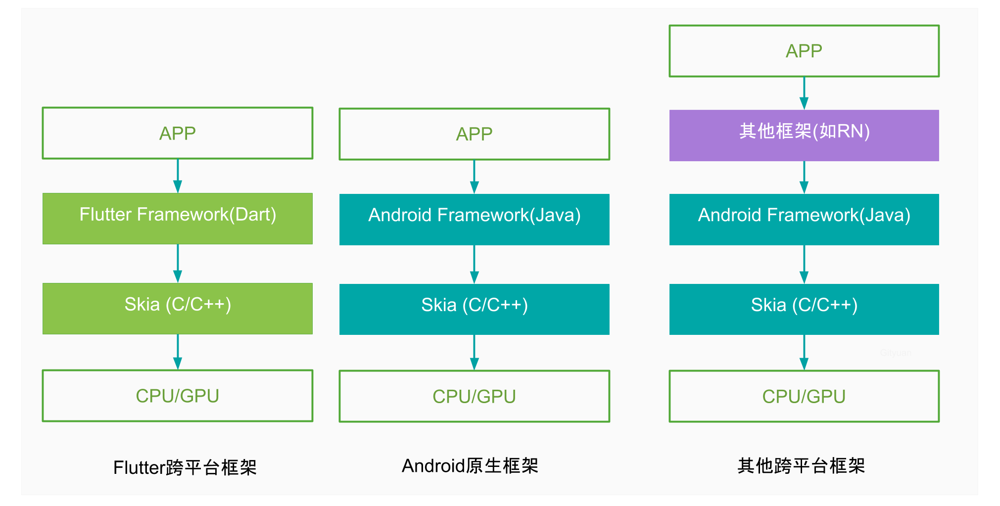

> https://www.finclip.com/news/f/44170.html

## 1.Flutter自定义视图

> [自定义视图](https://juejin.cn/post/6968655659373953061)

Flutter中的自定义视图可以通过`CustomPaint`实现，

**可以分为以下几步：**

- 创建继承`CustomPainter`的类。
- 在类中的`paint`方法绘制想要的内容：在这个方法中会得到画布canvas以及控件的尺寸Size，只需要利用画笔（paint）在画布（canvas）绘制相应的内容即可。
- 在类中的`shouldRepaint`方法返回需要重绘的条件：如果返回true则会在相应的值变化时会触发重绘。
- 如果需要做动画那么还需要在自定义类的构造函数中添加:`super(repaint:xxx)`就能自动的添加监听器。这样当值变化时就能自动的触发重绘。

### (1)CustomPaint

CustomPaint是一个能够自定义视图的类，通过传入CustomPainter作为子Widget实现视图绘制

```dart
const CustomPaint({
    Key? key,
    this.painter,
    this.foregroundPainter,
    this.size = Size.zero,
    this.isComplex = false,
    this.willChange = false,
    Widget? child,
})
```

- `painter`以及`foregroundPainter`都是`CustomPainter`对象，分别表示child的`背景`和`前景 `

### (2)CustomPainter

绘制流程主要是在CustomPainter中进行，继承CustomPainter后绘制图形主要用到三个对象：

- `paint`：画笔，主要是设置绘制图形的样式，颜色、渐变等等
- `canvas`：画布，主要可以设定绘制的图形， 如矩形、圆形、路径等 。还可以进行变换，如裁剪、平移、选择。
- `path`： 可以通过Path对象来**定义各种复杂的图形路径**，然后通过Canvas对象的drawPath方法来绘制该路径。 


**下面来一步步实现：**

#### ①继承CustomPainter

```dart
class ProgressRingPainter extends CustomPainter {
    //画笔
    Paint _paint;
    //进度
    final Animation<double> progress;
    //路径测量
    PathMetric pathMetric;

    ProgressRingPainter(this.progress) : super(repaint: progress) {
        Path  _path = Path();
        _path.addOval(Rect.fromCenter(center: Offset(0, 0), width: 90, height: 90));
        pathMetric = _path.computeMetrics().first;

        _paint = Paint()
            ..color = Colors.black38
            ..strokeWidth = 10
            ..style = PaintingStyle.stroke;
    }

    @override
    void paint(Canvas canvas, Size size) {
        ...
    }

    @override
    bool shouldRepaint(covariant ProgressRingPainter oldDelegate) {
        ...
    }
}
```

> - 构造方法中的` super:(repaint:progress) `，这个repaint需要是一个继承了`Listenable`的对象，以监听实现视图更新

#### ②绘制方法paint

```dart
@override
void paint(Canvas canvas, Size size) {
    canvas.clipRect(Offset.zero & size);
    canvas.translate(size.width / 2, size.height / 2);
    canvas.drawCircle(Offset(0, 0), size.width / 2 - 5, _paint);

    canvas.drawPath(
        pathMetric.extractPath(
            0,
            pathMetric.length * progress.value,
        ),
        Paint()
        ..color = Colors.pinkAccent
        ..strokeWidth = 10
        ..style = PaintingStyle.stroke);
}
```

#### ③触发重绘流程

就是当前进度条的值与之前不一致的时候，进行重绘

```dart
@override
bool shouldRepaint(covariant ProgressRingPainter oldDelegate) {
    return progress.value != oldDelegate.progress.value;
}
```


**自定义加载视图的完整代码**

```dart
class ProgressRingPainter extends CustomPainter {
    //画笔
    Paint _paint;
    //进度
    final Animation<double> progress;
    //路径测量
    PathMetric pathMetric;

    ProgressRingPainter(this.progress) : super(repaint: progress) {
        Path  _path = Path();
        _path.addOval(Rect.fromCenter(center: Offset(0, 0), width: 90, height: 90));
        pathMetric = _path.computeMetrics().first;

        _paint = Paint()
            ..color = Colors.black38
            ..strokeWidth = 10
            ..style = PaintingStyle.stroke;
    }

    @override
    void paint(Canvas canvas, Size size) {
        canvas.clipRect(Offset.zero & size);
        canvas.translate(size.width / 2, size.height / 2);
        canvas.drawCircle(Offset(0, 0), size.width / 2 - 5, _paint);
        canvas.drawPath(
            pathMetric.extractPath(
                0,
                pathMetric.length * progress.value,
            ),
            Paint()
            ..color = Colors.pinkAccent
            ..strokeWidth = 10
            ..style = PaintingStyle.stroke);
    }

    @override
    bool shouldRepaint(covariant ProgressRingPainter oldDelegate) {
        return progress.value != oldDelegate.progress.value;
    }
}
```


#### ④调用自定义视图

进度条文字是不断刷新的，因此可以通过两种方式刷新控件：

- setState重建
- 文字自身刷新，通过 `ValueListenableBuilder `，可以传入一个Listenable变量监听值，还可以传入builder来构建新的视图

**调用的完整代码**

```dart
class ProgressRing extends StatefulWidget {
    @override
    State<StatefulWidget> createState() => _StateProgressRing();
}

class _StateProgressRing extends State<ProgressRing>
    with SingleTickerProviderStateMixin {
    AnimationController controller;

    @override
    void initState() {
        super.initState();
        controller = AnimationController(//一个10s的动画效果
            vsync: this,
            duration: Duration(seconds: 10),
        )..repeat(reverse: true);
    }

    @override
    Widget build(BuildContext context) {
        return Scaffold(
            appBar: AppBar(
                title: Text('CustomPaint'),
            ),
            body: Center(
                child: CustomPaint(
                    size: Size(100, 100),
                    painter: ProgressRingPainter(controller),
                    child: Container(
                        width: 100,
                        height: 100,
                        child: Center(
                            child: ValueListenableBuilder(
                                valueListenable: controller,
                                builder: buildText,
                            ),
                        ),
                    ),
                ),
            ),
        );
    }

    @override
    void dispose() {
        controller.dispose();
        super.dispose();
    }

    Widget buildText(BuildContext context, double value, Widget child) {
        return Text("${(value * 100).toInt()}%");
    }
}
```


## 2.Flutter渲染

### (1)跨平台技术

> [跨平台技术概览](https://zhuanlan.zhihu.com/p/148820818)
>
> [Flutter跨平台](https://www.finclip.com/news/f/44170.html)

目前的一些跨平台方案，从前端渲染的角度来分类的话，大致可以分为以下几种方案。 

**WebView 渲染**

这种方案就很好理解，现在很多项目都会嵌入 H5 的页面。就是用 JavaScript 等前端技术进行开发，在客户端上用 WebView 来进行渲染。微信小程序目前使用的就是这种方案。

- 它的优点很明显，使用成熟的前端技术进行开发，学习成本低，开发效率高，并且支持动态发布代码。

- 但缺点也很明显，在性能体验上，和原生还是存在较大差距的。

**原生控件渲染**

既然 WebView 的性能不够好，于是就有了使用原生控件进行渲染的方案。

这种方案，同样也是**使用 JavaScript 开发，区别是它最终是调用原生控件进行渲染**的。这种方案的代表是 Facebook 的 **React Native**、阿里的**Weex**。

- 由于使用原生控件进行渲染，性能体验也会更接近原生。但也只是更接近，和原生还是有差距的，因为它需要**频繁的进行 JavaScript 和原生之间的通信，这个通信效率是比较低**的。

- 另外，由于需要**适配各个平台的控件，那就有可能出现，系统控件更新了，而框架本身还没有更新**，由此产生了一些问题。换句话说，这种方案是**受到原生控件限制**的。

  > [React Native渲染原理](https://guide.duanhl.com/project/hybrid/native.html#%E6%B8%B2%E6%9F%93%E5%8E%9F%E7%90%86)

**绘图引擎渲染（自渲染）**

在前端，如果完全不使用原生控件，我们可以**通过系统的绘图 API 绘制出一个用户界面**。从这个角度出发，可以在各个平台使用一个统一接口的绘图引擎来进行界面绘制，这个引擎最终调用的是系统的 API 绘制的。这样的话，它的性能可以做到接近原生，并且又不受原生控件的限制，在不同平台上能够做到 UI 统一。 

 **下图主要将三种渲染方式进行介绍**

 

> **绘图引擎 Skia**
>
> Flutter 使用 Skia 作为它的绘图引擎。Skia 已经被 Google 收购，目前很多 Google 旗下的产品都是用 Skia 绘制的，包括 Android。
>
> > Android 内置了 Skia，但 iOS 没有，所以在打 iOS 安装包的时候，会把 Skia 一起打进去。这就导致了，用同一份 Flutter 代码打包之后，iOS 的包要比 Android 的包大一些。

### (2)Flutter如何实现跨平台的

> https://developer.aliyun.com/article/914437
>
> https://cloud.tencent.com/developer/article/1883377

Flutter是彻底的跨平台方案：

- **它自行实现一套UI框架**，在底层通过`Skia`引擎渲染到屏幕。
- 对于UI之外所需要使用的，移动设备自身提供的服务，比如相机、定位、屏幕触摸等，则采用`Platform Channels`跟原生系统通信的方式来实现。


### (3)Flutter引擎架构

> [Flutter如何跨平台](https://developer.aliyun.com/article/914437)
>
> [Flutter引擎架构](https://blog.hacktons.cn/2020/04/24/engine-architecture/)

 

Flutter架构最核心的便是**Framework（框架）**和**Engine（引擎）**：

- **Flutter Framework层**：用Dart编写，封装整个Flutter架构的核心功能，包括Widget、动画、绘制、手势等功能，有Material（Android风格UI）和Cupertino（iOS风格）的UI界面， 可构建Widget控件以及实现UI布局。

- **Flutter Engine层**：用C++编写，用于**高质量移动应用的轻量级运行时环境**，实现了Flutter的核心库，包括`Dart虚拟机`、`动画和图形渲染`、`文字渲染`、`通信通道`、`事件通知`、`插件架构`等：

  ①引擎渲染采用的是2D图形渲染库Skia

  ②虚拟机采用的是面向对象语言Dart VM，并将它们托管到Flutter的嵌入层。

  ③shell实现了platform相关的代码，比如跟屏幕键盘IME和系统应用生命周期事件的交互。不同平台有不同的shell，比如Android和iOS的shell。


### (4)Flutter编译产物

Flutter不用Android/iOS的本地语言技术开发，Dart编写完的代码如何让不同系统可以识别，最终编译后得到的产物是什么 ？

  

 图中的Dart Code包含开发者编写的业务代码，Engine Code是引擎代码 

一份Dart代码，可编译生成双端产物，实现跨平台的能力。经过编译工具处理后可生成双端产物，图中便是release模式的编译产物：

- Android产物是由vm、isolate各自的指令段和数据段以及flutter.jar组成的app.apk
- iOS产物是由App.framework和Flutter.framework组成的Runner.app。 

> 更多参考——https://developer.aliyun.com/article/914437#slide-1

### (5)Flutter引擎启动

 Flutter这台引擎如何发动的，怎么跟Native衔接呢？ 

  

熟悉Android的开发者，应该都了解APP启动过程，会执行`Application`和`Activity的onCreate()`方法，`FlutterApplication`和`FlutterActivity`的`onCreate()`方法正是连接Native和Flutter的枢纽。 

- `FlutterApplication.java`：的onCreate过程主要完成**初始化配置**、**加载引擎libflutter.so**、**注册JNI方法**；
- `FlutterActivity.java`：的onCreate过程，通过FlutterJNI的`AttachJNI()`方法来**初始化引擎Engine**、**Dart虚拟机**、**Isolate**、**taskRunner等对象**。
-  再经过层层处理最终调用main.dart中main()方法，执行`runApp(Widget app)`来处理整个Dart业务代码。 


Flutter引擎启动中会创建有**4个TaskRunner**以及创建**虚拟机** ，下面看看原理：

#### TaskRunner

Flutter引擎启动过程，会创建UI/GPU/IO这3个线程，会为这些线程依次创建MessageLoop对象，启动后处于epoll_wait等待状态。

对于Flutter的消息机制跟Android原生的消息机制有很多相似之处，都有消息(或者任务)、消息队列(或任务队列)以及Looper；**有一点不同的是Android有一个Handler类，用于发送消息以及执行回调方法，相对应Flutter中有着相近功能的便是TaskRunner**。 

  

上图是从源码中提炼而来的任务处理流程。Flutter的任务队列处理机制跟Android的消息队列处理相通，只不过Flutter分为**Task**和**MicroTask**两种类型：

- 引擎和Dart虚拟机的事件以及Future都属于Task
- Dart层执行scheduleMicrotask()所产生的属于Microtask。 

每次Flutter引擎在消费任务时调用FlushTasks()方法，遍历整个延迟任务队列delayed_tasks_，将已到期的任务加入task队列，然后开始处理任务。

​	**Step 1**: 检查task，当task队列不为空，先执行一个task；

​	**Step 2**: 检查microTask，当microTask不为空，则执行microTask；不断循环Step 2 直到microTask队列为空，再回到执行Step 1；

**可简单理解为先处理完所有的Microtask，然后再处理Task**。因为`scheduleMicrotask()`方法的调用自身就处于一个Task，执行完当前的task，也就意味着马上执行该Microtask。

> 这个和Dart线程的任务队列类似——https://blog.csdn.net/u013750244/article/details/107561359

**四个TaskRunner具体工作内容**

**Platform Task Runner：**运行在Android或者iOS的主线程，尽管阻塞该线程并不会影响Flutter渲染管道，平台线程建议不要执行耗时操作；否则可能触发watchdog来结束该应用。比如Android、iOS都是使用平台线程来传递用户输入事件，一旦平台线程被阻塞则会引起手势事件丢失。

**UI Task Runner:** 运行在ui线程，比如1.ui，用于引擎执行root isolate中的所有Dart代码，执行渲染与处理Vsync信号，将widget转换生成Layer Tree。除了渲染之外，还有处理Native Plugins消息、Timers、Microtasks等工作；

**GPU Task Runner：**运行在gpu线程，比如1.gpu，用于将Layer Tree转换为具体GPU指令，执行设备GPU相关的skia调用，转换相应平台的绘制方式，比如OpenGL, vulkan, metal等。每一帧的绘制需要UI Runner和GPU Runner配合完成，任何一个环节延迟都可能导致掉帧；

**IO Task Runner：**运行在io线程，比如1.io，前3个Task Runner都不允许执行耗时操作，该Runner用于将图片从磁盘读取出来，解压转换为GPU可识别的格式后，再上传给GPU线程。为了能访问GPU，IO Runner跟GPU Runner的Context在同一个ShareGroup。比如ui.image通过异步调用让IO Runner来异步加载图片，该线程不能执行其他耗时操作，否则可能会影响图片加载的性能。


#### Dart VM


> 具体源码分析可以参考——https://gityuan.com/2019/06/22/flutter_booting/


## 3.为什么使用Dart

> https://www.cnblogs.com/mengqd/p/12873998.html
>
> [Dart的JIT](https://blog.csdn.net/jukaiit/article/details/104667199)


## 4.Flutter打包

和原生打包有什么区别？