## 一.JNI介绍

- 定义：Java Native Interface(java本地接口)
- 作用：使得java与本地其他类型语言（c、c++）交互，即在java代码里面调用c、c++等语言的代码
- JNI属于java与Android无关

## 二.NDK

- 定义：Native Development Kit（Android的一个工具开发包）

- 作用：

  > NDK的全称是Native Development Kit， 是原生开发套件工具，使你***能够在 Android 应用中使用 C 和 C++ 代码***，并提供众多平台库，你可使用这些平台库管理原生 Activity 和访问物理设备组件，例如传感器和轻触输入。
  >
  > 可通过NDK在Android中使用JNI与本地代码交互；提供了把.so和.apk打包的工具

- NDK属于Android，与Java无直接关系


**为什么要使用NDK：**

- 提高应用的执行效率。将要求高性能的应用逻辑使用C开发，从而提高应用程序的执行效率,特别是像游戏这种计算密集型应用。
- 代码的保护。由于apk的java层代码很容易被反编译，而C/C++库反汇难度较大。
- 可以方便地使用现存的开源库。大部分现存的开源库都是用C/C++代码编写的。
- 便于移植。用C/C++写得库可以方便在其他的嵌入式平台上再次使用。
- 不依赖于Dalvik Java虚拟机的设计

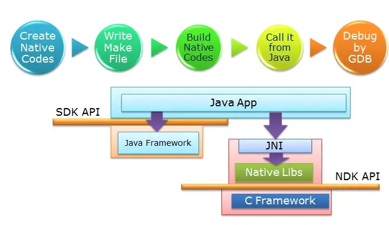

## 三.NDK和JNI关系

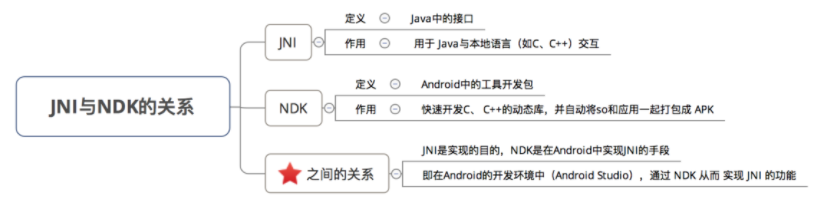

而NDK的作用是“我们自己写本地代码”（C/C++)，自己用JNI封装成Java接口

>  比如我们想做个计算，这不是Java的强项，可以用C/C++来写实现，返回一个运算结果就行了。
>
> NDKr5已经实现了不用写一行Java代码开发程序了，只不过还是用到了虚拟机，细节被封装隐藏起来了而已

NDK其实多了一个把.so和.apk打包的工具，这个是很重要的。

而JNI开发并没有打包，只是把.so文件放到文件系统的特定位置。


## 四、配置

### 1.两种方式

使用Android Sudio创建DNK项目的方式有两种：

- 一种是直接创建C++ project；
- 另一种是在Java 项目中手动配置，虽然更麻烦些，但是更灵活值得学习。

> 官方推荐Cmake工具来开发jni，cmake方式开发jni项目相对更简单易上手。可以将NDK类别为SDK,将Cmake类别为build，将它看作一个编译类工具。
>
> > Cmake——https://blog.csdn.net/jiedichina/article/details/126675963

### 2.Java项目中手动配置

**Android 2.2版本以上已经内部集成NDK，只需要在SDK Manager里面下载NDK和CMake即可**

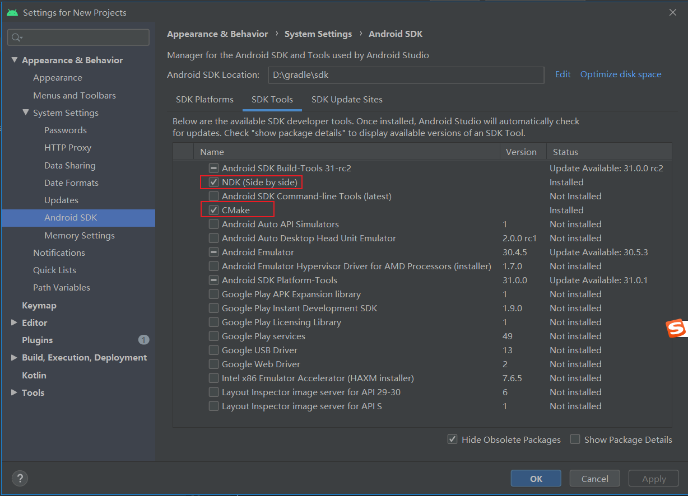

然后新建项目，选择`C++`项目，创建完之后会有一个cpp目录

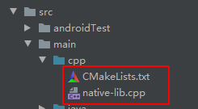

| 文件名         | 作用             | 说明                                                         |
| -------------- | ---------------- | ------------------------------------------------------------ |
| CMakeLists.txt | 构建配置文件     | CMakeLists.txt是用于配置NDK项目的构建系统的文件。它指定了构建所需的源文件、依赖项、编译选项等。在构建过程中，CMake会根据该文件的指示生成对应的构建脚本，用于编译本地代码并生成本地库。 |
| native-lib.cpp | 本地代码实现文件 | native-lib.cpp是包含本地代码实现的文件。它定义了通过Java和本地代码之间进行通信的本地方法。该文件中的函数实现将被编译为本地库，供Java代码调用。 |


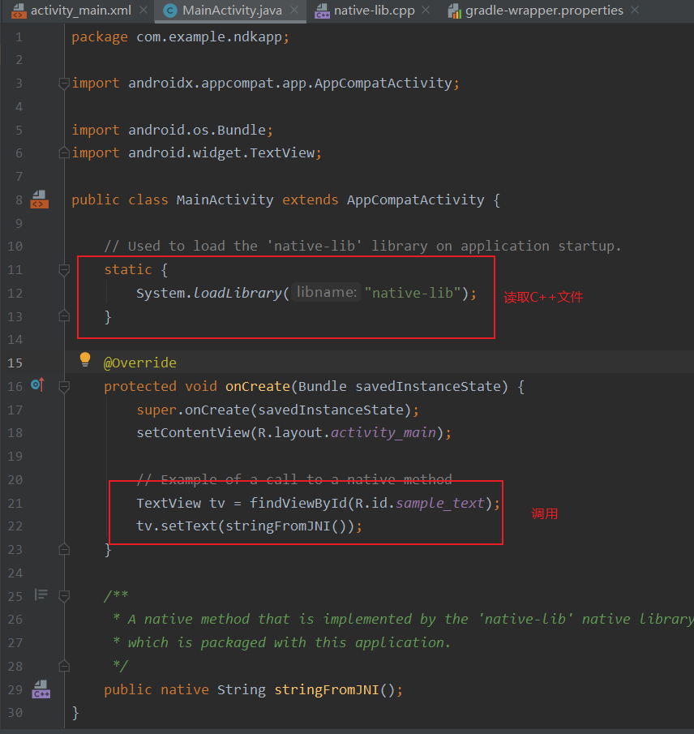

**C++文件**

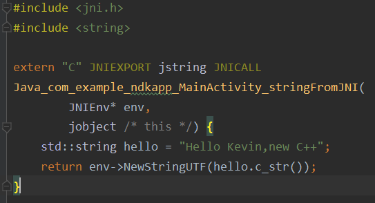

```c++
#include <jni.h>
#include <string>

extern "C" JNIEXPORT jstring JNICALL
Java_com_example_ndkapp_MainActivity_stringFromJNI(
        JNIEnv* env, //1. JNIEnv：代表了VM里面的环境，本地的代码可以通过该参数与Java代码进行操作
        jobject,
        jint i, jstring s) { //2. obj：定义JNI方法的类的一个本地引用（this）
    std::string hello = "Hello Kevin,new C++";
    return env->NewStringUTF(hello.c_str()); //NewStringUTF(JNIEnv *env, const char *bytes)这个方法就是直接new一个编码为utf-8的字符串。
}
```

> 注意:
>
> - 如果本地代码是C++，要使用`extern “C” {}`把本地方法括进去（为了禁止函数重载，而`c`禁止重载）
>
> - JNIEXPORT JSTRING JNICALL 中的JNIEXPORT 和 JNICALL不能省略
>
>   > `JNIEXPORT`标记该方法可以被外部调用
>   >
>   > `Jstring`为返回的类型
>   >
>   > `JNICALL`代表JNI标记，可以省略
>
> - 关于方法名`Java_com_example_ndkapp_MainActivity_stringFromJNI`
>
>   > 1.格式= `Java_包名_类名_Java方法名`
>   > 2.Java首字母必须大写
>   > 3.对于包名，包名里的`.`要改成 `_` , 如果本身带有`_`要改成`1`
>   >  例如：`com.example.ndk_app.MainActivity.stringFromJNI`转换为jni函数名就是`Java_com_example_ndk1app_MainActivity_stringFromJNI`
>
> - `i,s`代表参数

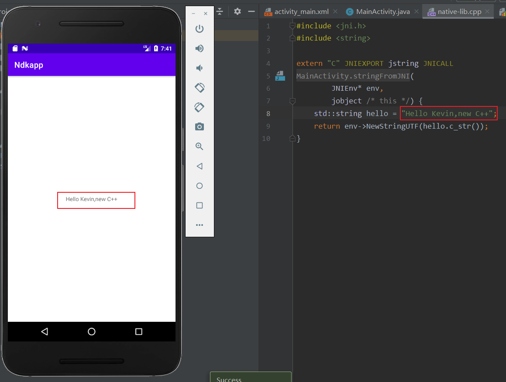

> 参考：
>
> https://www.jianshu.com/p/87ce6f565d37
>
> https://www.jianshu.com/p/c959ead68ae8

## 五、JNI

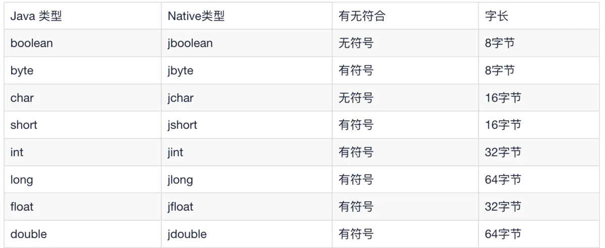

### 1.JNI开发流程

JNI开发流程的步骤：

> - 第1步：在Java中先声明一个native方法
> - 第2步：编译Java源文件javac得到.class文件
> - 第3步：通过javah -jni命令导出JNI的.h头文件
> - 第4步：使用Java需要交互的本地代码，实现在Java中声明的Native方法（如果Java需要与C++交互，那么就用C++实现Java的Native方法。）
> - 第5步：将本地代码编译成动态库(Windows系统下是.dll文件，如果是Linux系统下是.so文件，如果是Mac系统下是.jnilib)
> - 第6步：通过Java命令执行Java程序，最终实现Java调用本地代码。

#### (3)javah得到头文件

 ***\*javah命令主要用于在JNI开发的时，把java代码声明的JNI方法转化成C\C++头文件，以便进行JNI的C\C++端程序的开发。\**** 

> 命令`option`如下：
>
> **`-d 和-o`**：这两个参数用于设置生成的C\C++头文件的指定，该两参数选项不能同时使用，-d是为中的每个有JNI方法的java类都生成一个头文件，并存放在-d指定的目录中，-o则是生成的所有JNI方法的头文件都放在-o指定的文件中。
> **`-jni`**：表示用于生成JNI风格的C\C++头文件，默认该参数就是开启的。
> **`-classpath`**：使用-classpath后JDK将不再使用CLASSPATH中的类搜索路径，如果-classpath和CLASSPATH都没有设置，则JDK使用当前路径(.)作为类搜索路径。*（推荐使用-classpath来定义JDK要搜索的类路径，而不要使用环境变量CLASSPATH的搜索路径，以减少多个项目同时使用CLASSPATH时存在的潜在冲突。例如应用1要使用a1.0.jar中的类G，应用2要使用 a2.0.jar中的类G,a2.0.jar是a1.0.jar的升级包，当a1.0.jar，a2.0.jar都在CLASSPATH中，JDK搜索到第一个包中的类G时就停止搜索，如果应用1应用2的虚拟机都从CLASSPATH中搜索，就会有一个应用得不到正确版本的类G。）*
> **`-verbose`**：该参数，将显示javah命令搜索和装置类文件的详细过程。

例如有如下代码：

```java
public class HelloWorld{

    static {

        System.load("D://jni//h//hello//x64//Debug//hello.dll");//载入dll  Connector.dll

        //D:\jni\h\hello\x64\Debug
    }
    public static void main(String args []){

        HelloWorld helloWord = new HelloWorld();
        helloWord.sayHello("nihao");

    }
    public  native void sayHello(String name);

}
```

切换到**HelloWorld.java所在目录**，执行`javah HelloWorld` 会在当前目录生成一个HelloWorld.h头文件，也就自动生成了头文件，方便我们在`*.cpp`中引用并实现方法


> [**找不到javah命令**](https://blog.csdn.net/nishigesb123/article/details/90024821)
>
> [jdk11_生成头文件](https://blog.csdn.net/chenhao0568/article/details/120924017)

##### jdk-10以上

jdk10开始遗弃了`javah`，因此使用`javac -h`生成java的头文件，**并且java文件中不能引用其他的类，因此想到的一个解决办法是将native类都抽象到一个类里面，这是当前能够想到的最优方法**

```java
public class Test {
    public native String hellofrom();
}
```

```shell
 javac -h -jni .\Test.java  #生成头文件
```

> `-h`：指定生成的目录


> ```cpp
> //生成的头文件内容
> /* DO NOT EDIT THIS FILE - it is machine generated */
> #include <jni.h>
> #include <string>
> 
> /* Header for class com_example_ndktest_Test */
> #ifndef _Included_com_example_ndktest_Test
> #define _Included_com_example_ndktest_Test
> #ifdef __cplusplus
> extern "C" {
> #endif
> /*
>  * Class:     com_example_ndktest_Test
>  * Method:    hellofrom
>  * Signature: ()Ljava/lang/String;
>  */
> JNIEXPORT jstring JNICALL Java_com_example_ndktest_Test_hellofrom(JNIEnv *, jobject);
> 
> #ifdef __cplusplus
> }
> #endif
> #endif
> ```
>

然后`*.cpp`文件引入

```cpp
#include "com_example_ndktest_Test.h"

extern "C"
JNIEXPORT jstring JNICALL
Java_com_example_ndktest_Test_hellofrom(JNIEnv *env, jobject thiz) {
    // TODO: implement hellofrom()

    std::string hello = "JNI 10-29";
    return env->NewStringUTF(hello.c_str());
}
```


> **配置命令，快捷运行**
>
> 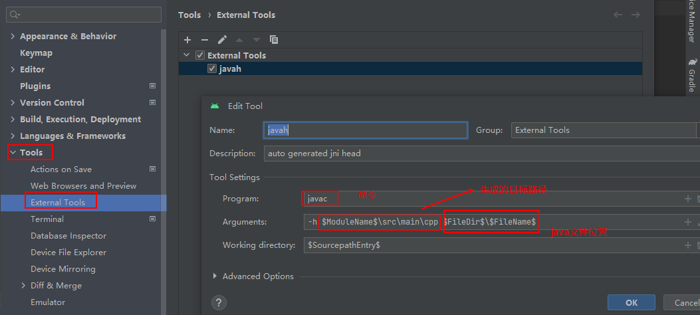
>
> 之后直接`右击`要生成头文件的`java`文件
>
> 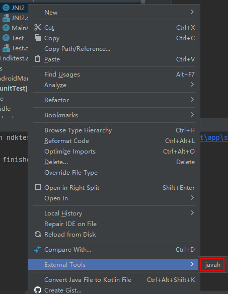
>
> 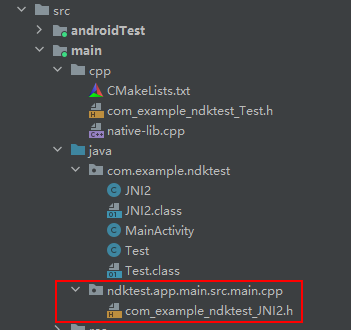
>

### 2.JNI结构

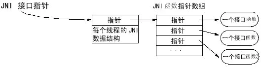

> 这张JNI函数表的组成就像C++的`虚函数`表。虚拟机可以运行多张函数表。
>
> 举例来说：一张调试函数表，另一张是调用函数表。**JNI接口指针仅在当前线程中起作用。这意味着指针不能从一个线程进入另一个线程**。（简单来说就是JNI给每一个接口函数都定义了一个指针指向它，然后通过JNI的线程指针再指向对应的函数指针，实现Native函数的调用）

```c++
jdouble Java_pkg_Cls_f__ILjava_lang_String_2 (JNIEnv *env, jobject obj, jint i, jstring s)
{
     const char *str = (*env)->GetStringUTFChars(env, s, 0); 
     (*env)->ReleaseStringUTFChars(env, s, str); 
     return 10;
}
```

> - `*env`：一个接口指针
>
> - `obj`：在本地方法中声明的对象引用，谁调用这个方法，object指向谁(MainActivity.java)
>
>   > 如果java层方法是静态的，那么就需要修改为`jclass`
>
> - `i和s`：用于传递的参数

#### JNI数据类型和Java类型

obj、i和s的类型可以参考下面的JNI数据类型，JNI有自己的原始数据类型和数据引用类型如下：

(因为Java层和C/C++的数据类型或者对象不能直接相互的引用或者使用，JNI层定义了自己的数据类型，用于衔接Java层和JNI层)

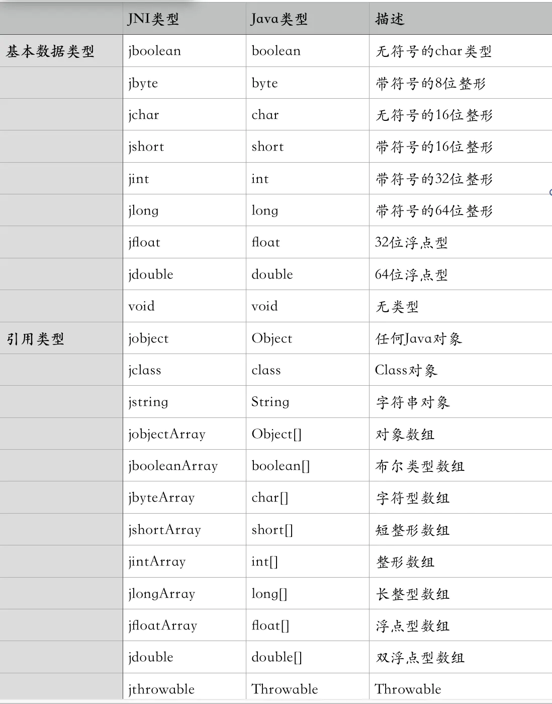


#### JNIEnv

首先说一个概念**JavaVM**:

> 每个JVM虚拟机都在本地环境中有一个`JavaVM结构体`，该结构体在创建Java虚拟机时被返回。**JavaVM是Java虚拟机在JNI层的代表，JNI全局仅仅有一个JavaVM**，JavaVM结构中封装了一些函数指针（或叫函数表结构），JavaVM中封装的这些函数指针主要是对JVM操作接口。

**JNI Env**

> **JNIEnv是当前Java线程的执行环境**，*一个JVM对应一个JavaVM结构，而一个JVM中可能创建多个Java线程，每个线程对应一个JNIEnv结构，它们保存在线程本地存储TLS中*。因此，**不同的线程的JNIEnv是不同**，也不能相互共享使用。JNIEnv结构也是一个函数表，在本地代码中**通过JNIEnv的函数表来操作Java数据或者调用Java方法**。也就是说，只要在本地代码中拿到了JNIEnv结构，就可以在本地代码中调用Java代码。
>
> 

> **作用：**
>
> - 调用Java 函数：JNIEnv代表了Java执行环境，能够使用JNIEnv调用Java中的代码
> - 操作Java代码：Java对象传入JNI层就是jobject对象，需要使用JNIEnv来操作这个Java对象

> **创建与释放：**
>
> （只以C++举例）
>
> - 创建
>
> >  C++中 ——**_JavaVM**：_JavaVM是C++中JavaVM结构体，调用`jint AttachCurrentThread(JNIEnv** p_env, void* thr_args) `方法，能够获取JNIEnv结构体；
>
> - 释放
>
>   > C++ 中释放：调用JavaVM结构体`_JavaVM`中的
>   >
>   > `jint DetachCurrentThread(){ return functions->DetachCurrentThread(this); } `
>   >
>   > 方法，就可以释放 本线程的JNIEnv

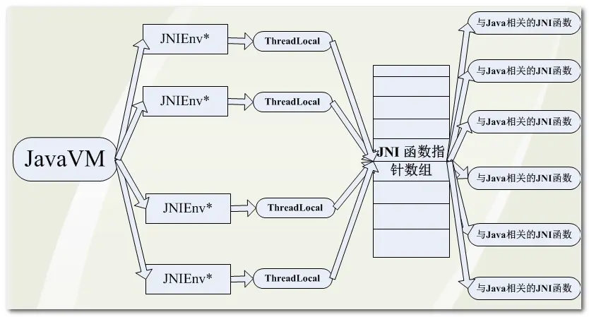


#### JObject


### 3.例子

> 参考——https://www.jianshu.com/p/b4431ac22ec2

#### (1)创建项目：

创建一个Ndk项目有两种，推荐使用Cmake方式

> 确保本地有Cmake
>
> 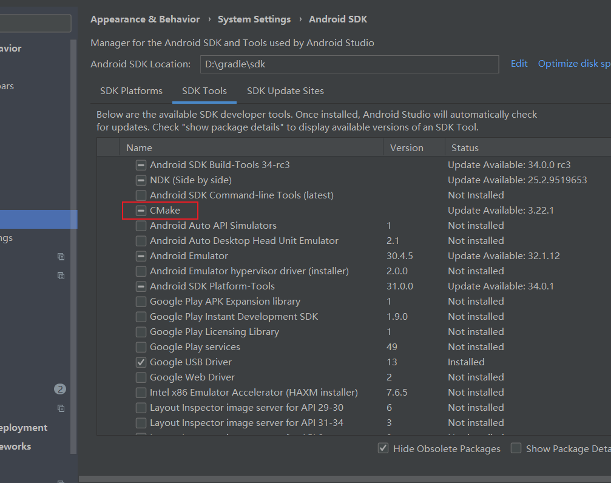

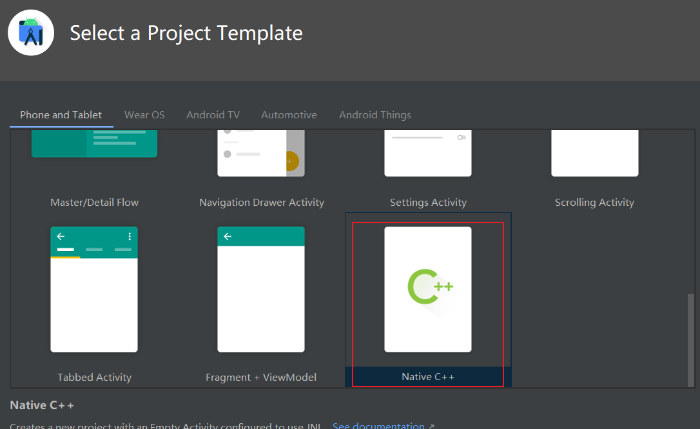

**勾选`Include C++ Support`复选框。**


**目录结构：**

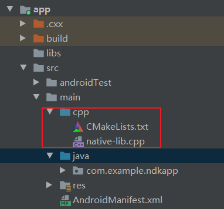

> 在 **cpp** 文件夹中：可以找到属于项目的所有原生源文件等构建库。对于新项目，Android Studio会创建一个示例C++源文件 `native-lib.cpp`，并将其置于应用模块`src/main/cpp/`目录中。这个示例代码提供了一个简单的C++函数`stringFromJNI()`，此函数可以返回字符串**“Hello from C++”**

#### (2) externalNativeBuild

在build.gradle文件里面可以看到多了两项：

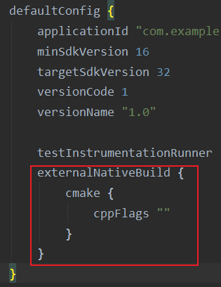


> 有两个地方用到了`externalNativeBuild`，一个是在`defaultConfig`里面，是一个是在`defaultConfig`外面。
>
> > - 在`defaultConfig`外面的`externalNativeBuild`里面的`cmake`指明了`CMakeList.txt`的路径(在本项目下，和是`build.gradle`在同一个目录里面)。
> >
> > - 在`defaultConfig`里面的`externalNativeBuild`里面的`cmake`主要填写的是`CMake`的命令参数。即由arguments中的参数最后转化成一个可执行的CMake的命令，可以在以下地方看到：
> >
> >   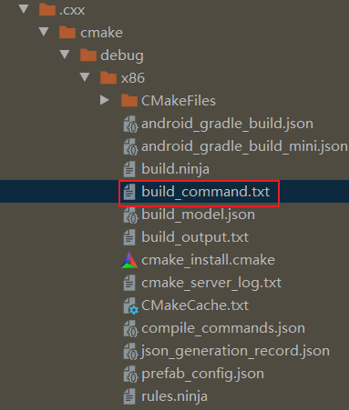

#### (3)CMakeLists.txt

`CMakeLists.txt`这个文件主要定义了哪些文件需要编译，以及和其他库的关系等

```txt
//指定CMake的最小版本
cmake_minimum_required(VERSION 3.10.2)

//项目名字
project("ndkpro2")


//创建一个静态或者动态库，并提供其关联的源文件路径，开发者可以定义多个库，CMake会自动去构建它们。Gradle可以自动将它们打包进APK中。
第一个参数——native-lib：是库的名称，最后生成native-lib.so
第二个参数——SHARED：是库的类别，是动态的还是静态的
第三个参数——src/main/cpp/native-lib.cpp：是库的源文件的路径

add_library( # Sets the name of the library.
             native-lib

             # Sets the library as a shared library.
             SHARED

             # Provides a relative path to your source file(s).
             native-lib.cpp )


//找到一个预编译的库，并作为一个变量保存起来。由于CMake在搜索库路径的时候会包含系统库，并且CMake会检查它自己之前编译的库的名字，所以开发者需要保证开发者自行添加的库的名字的独特性。
第一个参数——log-lib：设置路径变量的名称
第一个参数—— log：指定NDK库的名子，这样CMake就可以找到这个库

find_library( # Sets the name of the path variable.
              log-lib

              # Specifies the name of the NDK library that
              # you want CMake to locate.
              log )


//指定CMake链接到目标库。开发者可以链接多个库，比如开发者可以在此定义库的构建脚本，并且预编译第三方库或者系统库。
第一个参数——native-lib：指定的目标库
第一个参数——${log-lib}：将目标库链接到NDK中的日志库，

target_link_libraries( # Specifies the target library.
                       native-lib

                       # Links the target library to the log library
                       # included in the NDK.
                       ${log-lib} )
```


**Cmake工作流程**

①Gradle 调用外部构建脚本`CMakeLists.txt`

②CMake 按照构建脚本的命令将 C++ 源文件 `native-lib.cpp` 编译到共享的对象库中，并命名为 `libnative-lib.so` ，Gradle 随后会将其打包到APK中

③运行时，应用的`MainActivity` 会使用`System.loadLibrary()`加载原生库。应用就是可以使用库的原生函数`stringFromJNI()`。


### 4.Java 与Native互相调用

#### (1)调用Native

在Java中调用Native代码，要通过**注册Native函数**来实现，分为两种注册方式

##### **静态注册**

> 静态注册就是**根据函数名来遍历Java和JNI函数之间的关联**，而且要求JNI层函数的名字必须遵循特定的格式。具体的实现很简单，首先在Java代码中声明native函数，然后通过`javah`来生成native函数的具体形式，接下来在JNI代码中实现这些函数即可。
>
> ```java
> public class JniDemo1{
>  static {
>      //System.load("D:/xxx/xxx");//绝对路径加载动态链接库文件
>      System.loadLibrary("samplelib_jni");
>  }
> 
>  private native void nativeMethod();
> }
> ```
>
> 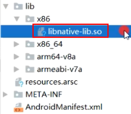
>
> 通过`javah`来产生jni代码，假设你的包名为`com.gebilaolitou.jnidemo`
>
> ```shell
> javah -d ./jni/ -classpath /Users/YOUR_NAME/Library/Android/sdk/platforms/android-21/android.jar:../../build/intermediates/classes/debug/ com.gebilaolitou.jnidemo.JniDemo1
> ```
>
> 通过观察发现命名规范
>
> **`Java前缀+全路径类名+方法名（参数1JNIEnv,参数2jobject,其他参数）`**

##### **动态注册**

> 动态注册，也就是通过`RegisterNatives`方法把C/C++中的方法映射到Java中的native方法，而无需遵循特定的方法命名格式。
>
> **案例：**
>
> 首先是加载so库
>
> ```java
> public class JniDemo1{
>  static {
>      
>      
>      System.loadLibrary("native-lib");//在apk文件里面的lib/libnative-lib.so加载
>  }
> 
>  private native void nativeMethod();
> }
> ```
>
> 
>
> 在JNI中实现
>
> ```cpp
> #include <jni.h>
> #include "Log4Android.h"
> #include <stdio.h>
> #include <stdlib.h>
> 
> using namespace std;
> 
> #ifdef __cplusplus
> extern "C" {
> #endif
> 
> static const char *className = "com/gebilaolitou/jnidemo/JNIDemo2";//注册的Java类名，根据自己名字更改
> 
> static void sayHello(JNIEnv *env, jobject, jlong handle) {
> LOGI("JNI", "native: say hello ###");
> }
> 
> //方法数组：代表了一个native方法的数组，如果你在一个Java类中有一个native方法，这里它的size就是1，如果是两个native方法，它的size就是2
> static JNINativeMethod gJni_Methods_table[] = {
> {"sayHello", "(J)V", (void*)sayHello},
> };
> 
> //首先通过clazz = (env)->FindClass( className);找到声明native方法的类
> //然后通过调用RegisterNatives函数将注册函数的Java类，以及注册函数的数组，以及个数注册在一起，这样就实现了绑定。
> static int jniRegisterNativeMethods(JNIEnv* env, const char* className,
> const JNINativeMethod* gMethods, int numMethods)
> {
> jclass clazz;
> 
> LOGI("JNI","Registering %s natives\n", className);
> clazz = (env)->FindClass( className);
> if (clazz == NULL) {
>   LOGE("JNI","Native registration unable to find class '%s'\n", className);
>   return -1;
> }
> 
> int result = 0;
> if ((env)->RegisterNatives(clazz, gJni_Methods_table, numMethods) < 0) {
>   LOGE("JNI","RegisterNatives failed for '%s'\n", className);
>   result = -1;
> }
> 
> (env)->DeleteLocalRef(clazz);
> return result;
> }
> 
> jint JNI_OnLoad(JavaVM* vm, void* reserved){
> LOGI("JNI", "enter jni_onload");
> 
> JNIEnv* env = NULL;
> jint result = -1;
> 
> //这里调用了GetEnv函数时为了获取JNIEnv结构体指针，其实JNIEnv结构体指向了一个函数表，该函数表指向了对应的JNI函数，我们通过这些JNI函数实现JNI编程。
> if (vm->GetEnv((void**) &env, JNI_VERSION_1_4) != JNI_OK) {
>   return result;
> }
> 
> 	//调用了jniRegisterNativeMethods函数来实现注册
> jniRegisterNativeMethods(env, className, gJni_Methods_table, sizeof(gJni_Methods_table) / sizeof(JNINativeMethod));
> 
> return JNI_VERSION_1_4;
> }
> 
> #ifdef __cplusplus
> }
> #endif
> ```
>
> 
>
> > **JNINativeMethod**
> >
> > 其实就像之前说到的JNIEnv，JNI提供了函数映射表，通过调用函数指针实现调用JNI函数，而这个映射表就是通过**`JNINativeMethod`**实现的
> >
> > ```cpp
> > typedef struct { 
> >  const char* name; //代表的是Java中的函数名
> >  const char* signature; //代表的是Java中的参数和返回值
> >  void* fnPtr; //代表的是的指向C函数的函数指针
> > } JNINativeMethod; 
> > ```
> >
> 


**签名(signature)：**

> 因为Java是支持**函数重载**的（可以定义相同方法名，但是不同参数的方法），然后Java根据其不同的参数，找到其对应的实现的方法。所以JNI如果仅仅是根据函数名，没有办法找到重载的函数的，所以为了解决这个问题，JNI就衍生了一个概念——"签名"，即**将参数类型和返回值类型的组合**。如果拥有一个该函数的签名信息和这个函数的函数名，我们就可以顺序的找到对应的Java层中的函数了。
>
> 例如可以通过javap命令查看java函数对应的签名:
>
> > ```java
>>javap -s -p MainActivity.class
> > 
> >Compiled from "MainActivity.java"
>  > public class com.example.hellojni.MainActivity extends android.app.Activity {
>    > static {};
>    >  Signature: ()V
>    >  
>  >  public com.example.hellojni.MainActivity();
> > Signature: ()V //返回类型为空
>  > 
> >protected void onCreate(android.os.Bundle);
> > Signature: (Landroid/os/Bundle;)V
>>
> > public boolean onCreateOptionsMenu(android.view.Menu);
>>Signature: (Landroid/view/Menu;)Z //参数类型是引用类型，而返回类型是基本类型
> > 
>>public native java.lang.String stringFromJNI(); //native 方法
> > Signature: ()Ljava/lang/String;  //返回类型是引用类型，所以要把类型的包名也加上(必须要有分号)
> > 
> > public native int max(int, int); //native 方法
> > Signature: (II)I    //签名
> > }
> > ```
> >  
> > **可以看到上面的数据类型是大写字母 `V、Z`等等，这是因为JNI制定了签名规则**
> > 
> >  ```
> > 具体格式如下：
> > 
> >  (参数1类型标示；参数2类型标示；参数3类型标示...)返回值类型标示
> > ```
> > 
> >  **引用类型`L`：**
> > 
> > > 当参数为引用类型的时候，参数类型的标示的根式为`"L包名"`，其中包名的.(点)要换成"/"，比如String就是`Ljava/lang/String`，Menu为`Landroid/view/Menu`。
> >  
> > **基本类型**
> > 
> >  | 类型标示 | Java类型 |
> > | -------- | :------: |
> > | Z        | boolean  |
> >| B        |   byte   |
> > | C        |   char   |
> >| S        |  short   |
> > | I        |   int    |
> > | J        |   long   |
> > | F        |  float   |
> > | D        |  double  |
> > | V        |   void   |
> >| L        | 引用类型 |
>   > 
>   >**数组**
> > 
> >| 类型标示           | Java类型 |
> > | ------------------ | :------: |
> >| [签名              |   数组   |
>   > | [i                 |  int[]   |
>   > | [Ljava/lang/Object | String[] |
> 


#### (2)调用Java

**①获取class对象**

> JNIEnv有3个函数可以获取jclass
>
> - `jclass FindClass(const char* clsName)`：通过类的名称(类的全名，这时候包名不是用'"."点号而是用"/"来区分的)来获取jclass。
>
>   ```c++
>   jclass jcl_string=env->FindClass("java/lang/String");
>   ```
>
> - `jclass GetObjectClass(jobject obj)`：通过对象实例来获取jclass，相当于Java中的getClass()函数
>
> - `jclass getSuperClass(jclass obj)`：通过jclass可以获取其父类的jclass对象

**②获取属性、方法**

> JNI在jni.h头文件中定义了jfieldID和jmethodID这两种类型来分别代表Java端的属性和方法。
>
> 在**访问或者设置Java某个属性**的时候，首先就要现在本地代码中取得代表该Java类的属性的`jfieldID`，然后才能在本地代码中进行Java属性的操作，同样，在需要调用Java类的某个方法时，也是需要取得代表该方法的`jmethodID`才能进行Java方法操作。
>
> > 一般是使用JNIEnv来进行操作
> >
> > - `GetFieldID/GetMethodID`：获取某个属性/某个方法
> > - `GetStaticFieldID/GetStaticMethodID`：获取某个静态属性/静态方法
> >
> > ```c++
> > //name代表方法名或者属性名
> > //sig代表签名
> > jfieldID GetFieldID(JNIEnv *env, jclass clazz, const char *name, const char *sig);
> > jmethodID GetMethodID(JNIEnv *env, jclass clazz, const char *name, const char *sig);
> > jfieldID GetStaticFieldID(JNIEnv *env, jclass clazz, const char *name, const char *sig);
> > jmethodID GetStaticMethodID(JNIEnv *env, jclass clazz,const char *name, const char *sig);
> > ```


**③构造一个对象**

JNI创建对象的方法如下

```
jobject NewObject(jclass clazz, jmethodID methodID, ...)
```

一个类可能存在多个构造函数，获取指定构造函数方式

```c++
jmethodID mid = (*env)->GetMethodID(env, cls, "<init>", "()V");
obj = (*env)->NewObject(env, cls, mid);//该构造函数是默认构造函数
```

调用带参数构造函数

```c++
jobject NewObjectA(JNIEnv *env, jclass clazz, jmethodID methodID, jvalue *args);//args代表的是对应构造函数的所有参数的，我们可以将传递给构造函数的所有参数放在jvalues类型的数组args中
```

如果参数不是数组?

```c++
jobject NewObjectV(JNIEnv *env, jclass clazz, jmethodID methodID, va_list args);//构造函数的所有参数放到在va_list类型的参数args中
```


> **样例**
>
> 首先创建一个类，待会JNI要调用该类的方法
>
> ```java
> public class JavaToJNI {
>     private int count;
>     public JavaToJNI(){
>         this.count = 11;
>     }
> 
> 
>     public int getCount() {
>         return count;
>     }
> 
>     public void setCount(int count) {
>         this.count = count;
>     }
> }
> ```
>
> 然后创建一个Activity，该Activity调用了C++方法
>
> ```java
> public class SubActivity extends AppCompatActivity {
> 
>     ReflecJNI reflecJNI = ReflecJNI.getJNIInstance();
>     TextView textView;
>     @Override
>     protected void onCreate(Bundle savedInstanceState) {
>         super.onCreate(savedInstanceState);
>         setContentView(R.layout.activity_sub);
>         textView = findViewById(R.id.sub_textV);
> 
>         textView.setText(String.valueOf(reflecJNI.intFromJNI()));//加载JNI传回来的c++代码
>     }
> }
> ```
>
> ReflecJNI存放JNI实例
>
> ```java
> public class ReflecJNI {
> 
>     static {
>         System.loadLibrary("native-lib");
>     }
> 
>     private  static ReflecJNI reflecJNI;
>     //应该单例模式，一个项目就一个JNI对象
>     public static ReflecJNI getJNIInstance(){
>         if(reflecJNI == null){
>             reflecJNI = new ReflecJNI();
>         }
>         return  reflecJNI;
>     }
> 
>     public native String stringFromJNI();
>     public native int intFromJNI();
> }
> ```
>
> 最后JNI文件
>
> ```c++
> extern "C"
> JNIEXPORT jint JNICALL
> Java_com_example_ndkpro2_JNIReflection_ReflecJNI_intFromJNI(JNIEnv *env, jobject thiz) {
>     // TODO: implement intFromJNI()
>     jclass jclass1 = env->FindClass("com/example/ndkpro2/JavaToJNI");
>     jmethodID mid = env->GetMethodID(jclass1,"<init>", "()V");//找到构造函数methodid
>     int jvalue1;//存放返回值
>     jobject obj1 = env->NewObject(jclass1,mid);//该构造函数是默认构造函数
>     jmethodID  midgetter = env->GetMethodID(jclass1,"getCount", "()I");//找到getter的methodid
>     jvalue1 = env->CallIntMethod(obj1,midgetter);//调用该方法
>     return jvalue1;//返回getter获得的值
> }
> ```
>
> 


### JNI   API

> https://docs.oracle.com/javase/1.5.0/docs/guide/jni/spec/jniTOC.html
>
> 参考——https://www.jianshu.com/p/67081d9b0a9c

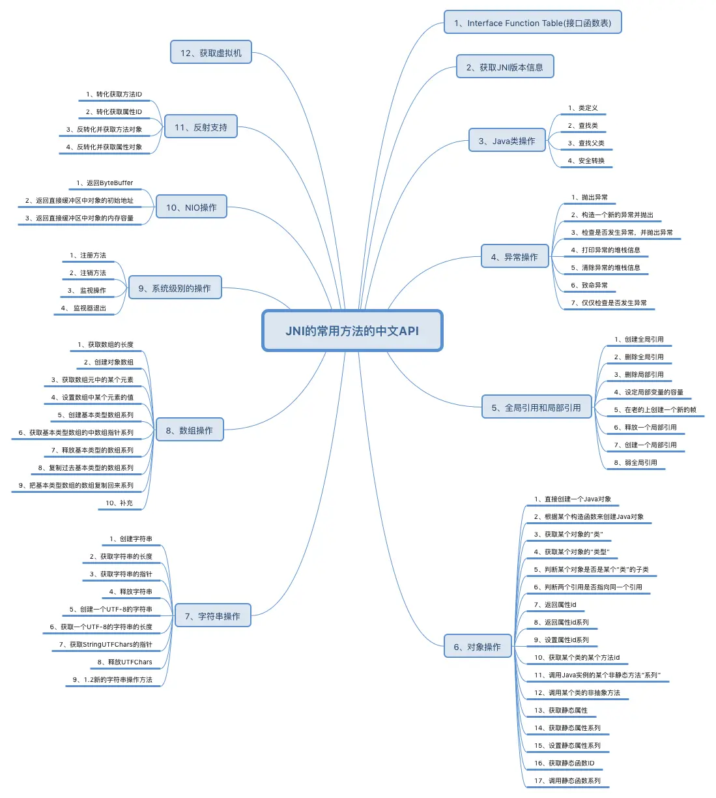


#### `extern`关键字

 extern 关键字用于声明一个函数或变量，但不进行定义。 

- **对函数的调用形成约定：**由于 C++ 和 Java 使用不同的函数调用约定，因此需要使用 extern 关键字来告知编译器，该函数或变量使用 C 语言的函数调用约定。 

  > ```cpp
  > extern "C" JNIEXPORT void JNICALL Java_com_example_myapp_MyNativeClass_nativeMethod(JNIEnv *env, jobject obj) {
  >   // ...
  > } 
  > ```

- **定义全局变量：**

  > ````cpp
  > extern int age;
  > extern void showAge();
  > ````
  >
  > 上述示例中，`age `变量在所有模块中作为一种全局变量只能被定义一次，否则会出现连接错误。 
  >
  > 
  >
  > 创建一个新的cpp文件实现方法
  >
  > ```cpp
  > //
  > // Test.cpp
  > //
  > #include <iostream>
  > #include <android/log.h>
  > #define TAG "10-30JNI"
  > #define LOGD(...) __android_log_print(ANDROID_LOG_DEBUG,TAG,__VA_ARGS__)
  > 
  > int age = 100;
  > 
  > void showAge(){
  >     LOGD("showAge:%d",age);
  > }
  > ```
  >
  > ```cpp
  > //native-lib.cpp
  > extern int age;
  > extern void showAge();
  > extern "C"
  > JNIEXPORT void JNICALL
  > Java_com_example_ndktest_MainActivity_testExtern(JNIEnv *env, jobject thiz) {
  >     // TODO: implement testExtern()
  > 
  >     showAge();
  > }
  > ```
  >
  > **在cmake中添加Test.cpp，这样才能进行编译**
  >
  > 之后调用`native-lib.cpp`的方法，得到：
  >
  > 

#### (1)JNINativeInterface

每个函数都可以通过`JNIEnv`参数访问，JNIEnv类型是指向一个存放所有JNI接口指针的指针，其定义如下：

```c++
typedef const struct JNINativeInterface *JNIEnv;
```

下面为初始化函数表，JNIEnv从其中调用JNI接口函数

```c++
const struct JNINativeInterface ... = {

    NULL,
    NULL,
    NULL,
    NULL,
    GetVersion,

    DefineClass,
    FindClass,

    FromReflectedMethod,
    FromReflectedField,
    ToReflectedMethod,

    GetSuperclass,
    IsAssignableFrom,

    ToReflectedField,

    Throw,
    ThrowNew,
    ExceptionOccurred,
    ExceptionDescribe,
    ExceptionClear,
    FatalError,

    PushLocalFrame,
    PopLocalFrame,

    NewGlobalRef,
    DeleteGlobalRef,
    DeleteLocalRef,
    IsSameObject,
    NewLocalRef,
    EnsureLocalCapacity,

    AllocObject,
    NewObject,
    NewObjectV,
    NewObjectA,

    GetObjectClass,
    IsInstanceOf,

    GetMethodID,

    CallObjectMethod,
    CallObjectMethodV,
    CallObjectMethodA,
    CallBooleanMethod,
    CallBooleanMethodV,
    CallBooleanMethodA,
    CallByteMethod,
    CallByteMethodV,
    CallByteMethodA,
    CallCharMethod,
    CallCharMethodV,
    CallCharMethodA,
    CallShortMethod,
    CallShortMethodV,
    CallShortMethodA,
    CallIntMethod,
    CallIntMethodV,
    CallIntMethodA,
    CallLongMethod,
    CallLongMethodV,
    CallLongMethodA,
    CallFloatMethod,
    CallFloatMethodV,
    CallFloatMethodA,
    CallDoubleMethod,
    CallDoubleMethodV,
    CallDoubleMethodA,
    CallVoidMethod,
    CallVoidMethodV,
    CallVoidMethodA,

    CallNonvirtualObjectMethod,
    CallNonvirtualObjectMethodV,
    CallNonvirtualObjectMethodA,
    CallNonvirtualBooleanMethod,
    CallNonvirtualBooleanMethodV,
    CallNonvirtualBooleanMethodA,
    CallNonvirtualByteMethod,
    CallNonvirtualByteMethodV,
    CallNonvirtualByteMethodA,
    CallNonvirtualCharMethod,
    CallNonvirtualCharMethodV,
    CallNonvirtualCharMethodA,
    CallNonvirtualShortMethod,
    CallNonvirtualShortMethodV,
    CallNonvirtualShortMethodA,
    CallNonvirtualIntMethod,
    CallNonvirtualIntMethodV,
    CallNonvirtualIntMethodA,
    CallNonvirtualLongMethod,
    CallNonvirtualLongMethodV,
    CallNonvirtualLongMethodA,
    CallNonvirtualFloatMethod,
    CallNonvirtualFloatMethodV,
    CallNonvirtualFloatMethodA,
    CallNonvirtualDoubleMethod,
    CallNonvirtualDoubleMethodV,
    CallNonvirtualDoubleMethodA,
    CallNonvirtualVoidMethod,
    CallNonvirtualVoidMethodV,
    CallNonvirtualVoidMethodA,

    GetFieldID,

    GetObjectField,
    GetBooleanField,
    GetByteField,
    GetCharField,
    GetShortField,
    GetIntField,
    GetLongField,
    GetFloatField,
    GetDoubleField,
    SetObjectField,
    SetBooleanField,
    SetByteField,
    SetCharField,
    SetShortField,
    SetIntField,
    SetLongField,
    SetFloatField,
    SetDoubleField,

    GetStaticMethodID,

    CallStaticObjectMethod,
    CallStaticObjectMethodV,
    CallStaticObjectMethodA,
    CallStaticBooleanMethod,
    CallStaticBooleanMethodV,
    CallStaticBooleanMethodA,
    CallStaticByteMethod,
    CallStaticByteMethodV,
    CallStaticByteMethodA,
    CallStaticCharMethod,
    CallStaticCharMethodV,
    CallStaticCharMethodA,
    CallStaticShortMethod,
    CallStaticShortMethodV,
    CallStaticShortMethodA,
    CallStaticIntMethod,
    CallStaticIntMethodV,
    CallStaticIntMethodA,
    CallStaticLongMethod,
    CallStaticLongMethodV,
    CallStaticLongMethodA,
    CallStaticFloatMethod,
    CallStaticFloatMethodV,
    CallStaticFloatMethodA,
    CallStaticDoubleMethod,
    CallStaticDoubleMethodV,
    CallStaticDoubleMethodA,
    CallStaticVoidMethod,
    CallStaticVoidMethodV,
    CallStaticVoidMethodA,

    GetStaticFieldID,

    GetStaticObjectField,
    GetStaticBooleanField,
    GetStaticByteField,
    GetStaticCharField,
    GetStaticShortField,
    GetStaticIntField,
    GetStaticLongField,
    GetStaticFloatField,
    GetStaticDoubleField,

    SetStaticObjectField,
    SetStaticBooleanField,
    SetStaticByteField,
    SetStaticCharField,
    SetStaticShortField,
    SetStaticIntField,
    SetStaticLongField,
    SetStaticFloatField,
    SetStaticDoubleField,

    NewString,

    GetStringLength,
    GetStringChars,
    ReleaseStringChars,

    NewStringUTF,
    GetStringUTFLength,
    GetStringUTFChars,
    ReleaseStringUTFChars,

    GetArrayLength,

    NewObjectArray,
    GetObjectArrayElement,
    SetObjectArrayElement,

    NewBooleanArray,
    NewByteArray,
    NewCharArray,
    NewShortArray,
    NewIntArray,
    NewLongArray,
    NewFloatArray,
    NewDoubleArray,

    GetBooleanArrayElements,
    GetByteArrayElements,
    GetCharArrayElements,
    GetShortArrayElements,
    GetIntArrayElements,
    GetLongArrayElements,
    GetFloatArrayElements,
    GetDoubleArrayElements,

    ReleaseBooleanArrayElements,
    ReleaseByteArrayElements,
    ReleaseCharArrayElements,
    ReleaseShortArrayElements,
    ReleaseIntArrayElements,
    ReleaseLongArrayElements,
    ReleaseFloatArrayElements,
    ReleaseDoubleArrayElements,

    GetBooleanArrayRegion,
    GetByteArrayRegion,
    GetCharArrayRegion,
    GetShortArrayRegion,
    GetIntArrayRegion,
    GetLongArrayRegion,
    GetFloatArrayRegion,
    GetDoubleArrayRegion,
    SetBooleanArrayRegion,
    SetByteArrayRegion,
    SetCharArrayRegion,
    SetShortArrayRegion,
    SetIntArrayRegion,
    SetLongArrayRegion,
    SetFloatArrayRegion,
    SetDoubleArrayRegion,

    RegisterNatives,
    UnregisterNatives,

    MonitorEnter,
    MonitorExit,

    GetJavaVM,

    GetStringRegion,
    GetStringUTFRegion,

    GetPrimitiveArrayCritical,
    ReleasePrimitiveArrayCritical,

    GetStringCritical,
    ReleaseStringCritical,

    NewWeakGlobalRef,
    DeleteWeakGlobalRef,

    ExceptionCheck,

    NewDirectByteBuffer,
    GetDirectBufferAddress,
    GetDirectBufferCapacity,

    GetObjectRefType
  };
```


#### (2)GetVersion

用于获取JNI的版本：

```c++
jint GetVersion(JNIEnv *env);
```

由于在源码中已经定义宏，所以返回结果如下

```c++
#define JNI_VERSION_1_1 0x00010001
#define JNI_VERSION_1_2 0x00010002
#define JNI_VERSION_1_4 0x00010004
#define JNI_VERSION_1_6 0x00010006
```

#### (3)类操作

##### DefineClass

> 定义加载类，主要是从包含数据的buffer中加载类，该buffer包含类调用时未被虚拟机所引用的原始类数据。正常情况返回JAVA对象，错误情况返回NULL并报异常
>
> ```c++
> jclass DefineClass(JNIEnv *env,const char* name,jobject loader,const jbyte *buf, jsize bufLen)
>     
> env：JNI接口指针
> name：所定义的类名或者接口名，该字符串有modefied UTF-8编码
> loader：指派给定义的类加载器
> buf：包含.class文件数据的buffer
> bufLen：buffer长度
> ```


##### FindClass

> 查找类
>
> ```c++
> jclass FindClass(JNIEnv *env,const char *name);
> 
> env：JNI接口指针
> name：一个完全限定的类名，即包含“包名”+“/”+类名。举个例子：如java.lang.String，该参数为java/lang/String；如果类名以[开头，将返回一个数组类。比如数组类的签名为java.lang.Object[]，该参数应该为"[Ljava/lang/Object"
> ```
>
> 如果觉得繁琐甚至是不知道包名，可以使用[GetObjectClass](#get-object-class)


##### GetSuperClass

> 获取该类的父类，
>
> **如果clazz不是Object类**，则此函数将返回表示该clazz的父类的Class对象；
>
> **如果该类是Object**，或者clazz代表接口，则此函数返回NULL。
>
> ```c++
> jclass GetSuperclass(JNIEnv *env,jclass clazz);
> 
> clazz：Java的Class类
> ```


##### IsAssignableFrom

> 判断clazz1对象能否安全转换为clazz2的对象
>
> ```c++
> jboolean IsAssignableFrom(JNIEnv *env,jclass clazz1,jclass clazz2);
> 
> clazz1：Java的Class类，即需要被转化的类
> clazz2：Java的Class类，即需要转化为目标的类
> ```
>
> > 如果满足以下任一条件，则返回JNI_TRUE：
> >
> > - 如果clazz1和clazz2是同一个Java类。
> > - 如果clazz1是clazz2的子类
> > - 如果clazz1是clazz2接口的实现类


#### (4)类对象操作

##### 创建Java对象

**AllocObject**

> **实例化一个Java对象，而不调用构造函数**

> **例如：**
>
> ```cpp
> extern "C"
> JNIEXPORT void JNICALL
> Java_com_example_ndktest_MainActivity_insertObject(JNIEnv *env, jobject thiz) {
>     // TODO: implement insertObject()
> 
>     //通过类名+包名拿到class
>     jclass studenClass = env->FindClass("com/example/ndktest/entity/Student");
>     //通过class拿到类对象
>     jobject studentstr = env->AllocObject(studenClass);
>     
>     env->Delete
> }
> ```
>
> 可以凭此拿到类对象，而无需参数传递。拿到类的对象之后，可以调用类的方法。

**NewObject**

**会实例化并调用构造函数**

> ```cpp
> jobject NewObject(JNIEnv *env,jclass clazz,jmethodID methodID,...);
> jobject NewObjectA(JNIEnv *env,jclass clazz,jmethodID methodID,const jvalue *args);
> jobject NewObjectV(JNIEnv *env,jclass clazz,jmethodID methodID,va_list args);
> 
> NewObject的附加参数：arguments是构造函数的参数
> NewObjectA的附加参数：args是构造函数的参数数组
> NewObjectV的附加参数：args是构造函数的参数list
> ```
>
> > `NewObject`：需要把所有构造函数的入参，放在参数methodID之后。NewObject()接受这些参数并将它们传递给需要被调用的Java的构造函数
> >
> > `NewObjectA`：在methodID后面，放了一个类型为jvalue的参数数组——args，该数组存放着所有需要传递给构造函数的参数。NewObjectA()接收到这个数组中的所有参数，并且按照顺序将它们传递给需要调用的Java方法。
> >
> > `NewObjectV`：在methodID后面，放了一个类型为va_list的args，参数存放着所有需要传递给构造函数的参数。NewObjectv()接收到所有的参数，并且按照顺序将它们传递给需要调用的Java方法。


##### <a name="get-object-class">GetObjectClass</a>

> 获取某个对象的类
>
> ```cpp
> jclass GetObjectClass(JNIEnv *env,object obj);
> ```
>
> **例子：**
>
> 定义一个`Student`类
>
> ```java
> public class Student {
>  //这句代码定义了一个私有的静态字符串变量 TAG，并将其初始化为 Student 类的简单名称。
>  private final static String TAG = Student.class.getSimpleName();
>  public String name;
>  public int age;
> 
>  public String getName() {
>      return name;
>  }
> 
>  public void setName(String name) {
>      this.name = name;
>  }
> 
>  public int getAge() {
>      return age;
>  }
> 
>  public void setAge(int age) {
>      this.age = age;
>  }
> 
>  @Override
>  public String toString() {
>      return "Student{" +
>              "name='" + name + '\'' +
>              ", age=" + age +
>              '}';
>  }
> }
> ```
>
> 在native层获取student并且调用方法
>
> ```cpp
> extern "C"
> JNIEXPORT void JNICALL
> Java_com_example_ndktest_MainActivity_showObjectInfo(JNIEnv *env, jobject thiz, jobject student) {
>     
>     jclass claz = env->GetObjectClass(student);//获取对象
> 
>     jmethodID getName = env->GetMethodID(claz,"getName","()Ljava/lang/String;");//获取方法ID
> 
>     //调用getName
>     jstring name = static_cast<jstring>(env->CallObjectMethod(student, getName));
>     const char * name_value = env->GetStringUTFChars(name,NULL);
>     LOGD("得到的student名字:%s",name_value);
> }
> ```
>

##### GetObjectRefType

> 获取某个对象的类型
>
> ```cpp
> jobjectRefType GetObjectRefType(JNIEnv *env,jobject obj);
> ```
>
> > JNIInvalidRefType=0：代表obj参数不是有效的引用类型
> >
> > JNILocalRefType=1：代表obj参数是局部变量类型
> >
> > JNIGlobalRefType=2：代表obj参数是全局变量类型
> >
> > JNIWeakGlobalRefType=3：代表obj参数是弱全局有效引用

##### IsInstanceOf

> 判断对象是否是某个类的实例
>
> ```cpp
> jboolean IsInstanceOf(JNIEnv *env, jobject obj,jclass clazz); 
> ```

##### IsSampleObject

> 判断两个引用是否指向一个引用
>
> ```cpp
> jboolean IsSampleObject(JNIEnv *env,jobject ref1,jobject ref2);
> ```

##### GetFieldID

> 返回**属性ID**，获取某个类的非静态属性id。通过方法`属性名`以及`属性的签名`(也就是属性的类型)，来确定对应的是哪个属性。通过检索这个属性ID，我们就可以调用`Get <type>Field`和`Set <type>Field`了，就是我们常用的`get`和`set`方法
>
> ```cpp
> jfieldID GetFieldID(JNIEnv *env,jclass clazz,const char *name,const char *sig);
> 
> name：属性名称
> sig：属性签名
> ```

##### GetField

> ```cpp
> NativeType Get<type>Field(JNIEnv *env,jobject obj,jfieldID fielD);//type可以替换成下面的任意类型
> ```
>
> 返回某个类的非静态属性的**值**(getter)，这是一组函数的简称，如下：
>
> ```cpp
> jobject        GetObjectField(JNIEnv *env,jobject obj,jfieldID fielD)   
> jboolean     GetBooleanField(JNIEnv *env,jobject obj,jfieldID fielD)
> jbyte           GetByteField(JNIEnv *env,jobject obj,jfieldID fielD)
> jchar           GetCharField(JNIEnv *env,jobject obj,jfieldID fielD)
> jshort          GetShortField(JNIEnv *env,jobject obj,jfieldID fielD)
> jint              GetIntField(JNIEnv *env,jobject obj,jfieldID fielD)
> jlong           GetLongField(JNIEnv *env,jobject obj,jfieldID fielD)
> jfloat           GetFloatField(JNIEnv *env,jobject obj,jfieldID fielD)
> jdouble       GetDoubleField(JNIEnv *env,jobject obj,jfieldID fielD)
> ```

##### SetField

> ```cpp
> void Set<type>Field(JNIEnv *env,jobject obj,jfieldID fieldID,NativeType value)
> ```
>
> 设置某个对象的非静态属性**值**(setter)，也是一组函数简称，略。

##### GetMethodID

> ```cpp
> jmethodID GetMethodID(JNIEnv *env,jclass clazz,const char*name,const char* sig);
> ```
>
> 用来获取对象方法的id，**`GetMethodID()`会造成还未初始化的类，进行初始化**
>
> ```cpp
> //获得构造函数的id
> jclass jclass1 = env->FindClass("com/example/ndkpro2/JavaToJNI");
> jmethodID mid = env->GetMethodID(jclass1,"<init>", "()V");//找到methodid
> ```

##### CallMethod

> ```cpp
> NativeType Call<type>Method(JNIEnv *env,jobject obj,jmethodID methodID,...);
> NativeType Call<type>MethodA(JNIEnv *env,jobjct obj,jmethodID methodID ,const jvalue *args);
> NativeType  Call<type>MethodV(JNEnv *env,jobject obj,jmethodID methodID,va_list args); 
> ```
>
> > CallMethod：需要把方法的`入参`放在参数`methodID`后面。`CallMethod()`其实把这些参数传递给需要调用的Java方法。
> >
> > CallMethodA：在`methodID`后面，有一个类型为`jvalue`的args数组，该数组存放所有需要传递给构造函数的参数。`CallMethodA()`收到这个数组中的参数，是按照顺序将他们传递给对应的Java方法
> >
> > CallMethodV：在`methodID`后面，有一个类型Wie`va_list`的参数args，它存放着所有需要传递给构造函数的参数。CallMethodV()接收所有的参数，并且按照顺序将它们传递给需要调用的Java方法。

##### GetStaticFieldID

> 获取某个类的某个静态属性ID，如果这个类还没有初始化，直接调用`GetStaticFieldID()`会引起这个类进行初始化。
>
> ```cpp
> jfieldID GetStaticFieldID(JNIEnv *env,jclass clazz,const char* name,const char *sig);
> ```


##### 释放对象/类

使用`DeleteLocalRef`释放`局部`对象或类


#### (5)字符串

##### NewString

> 创建字符串
>
> ```c++
> jstring NewString(JNIEnv *env,const jchar *unicodeChars,jszie len);
> 
> env：JNI接口指针
> unicodeChars：指向Unicode字符串的指针
> len：unicode字符串的长度
> ```

##### GetStringLength

> 获取字符串长度
>
> ```c++
> jsize  GetStringLength(JNIEnv *env,jstring string);
> ```

##### GetStringChar

> 获取字符串的指针
>
> ```cpp
> const jchar* GetStringChar(JNIEnv *env,jstring string , jboolean *isCopy);//isCopy代表是否返回复制之后的指针
> ```
>
> 返回指向字符串的UNICODE字符数组的指针，该指针一直有效直到被`ReleaseStringchars()`函数调用。
>  如果`isCopy`为非空，则在复制完成后将`isCopy`设为`JNI_TRUE`。如果没有复制，则设为`JNI_FALSE`。

##### ReleaseStringChars

> 释放字符串指针
>
> ```cpp
> void ReleaseStringChars(JNIEnv *env,jstring string,const jchar *chars);
> ```

##### NewStringUTF

> 创建一个UTF-8的字符串
>
> ```cpp
> jstring NewStringUTF(JNIEnv *env,const char *bytes);
> ```
>
> > 例如：
> >
> > ```cpp
> > jstring value = env->NewStringUTF("KEVIN");
> > ```
>
> 与之对应的包括获取UTF-8字符串长度、指针、释放
>
> ```cpp
> jsize GetStringUTFLength(JNIEnv *env,jstring string);//获取长度
> const char *GetStringUFTChars(JNIEnv *env, jString string, jboolean *isCopy);//获取指针
> void ReleaseStringUTFChars(JNIEnv *env,jstring string,const char *urf);//释放字符串指针
> ```

##### 截取字符串操作

> **截取一个字符串**
>
> ```cpp
> void GetStringRegion(JNIEnv *env,jstring str,jsize start,jsize len,jchar *buf);
> //在str(Unicode字符)从start位置开始截取len长度放置在buf中。如果越界，则抛出StringIndexOutOfBoundsException。
> ```

> **截取一个字符串并将其转换为UTF-8格式**
>
> ```cpp
> void GetStringUTFRegion(JNIEnv *env,jstring str,jsize start ,jsize len,char *buf);
> ```

> ```cpp
> const jchar * GetStringCritical(JNIEnv *env,jstring string,jboolean *isCopy);
> void ReleaseStringCritical(JNIEnv *env,jstring string,cost jchar * carray);
> ```
>
> 这两个函数有点类似于`GetStringChars()`和`ReleaseStringChars()`功能。如果可能的话虚拟机会返回一个指向字符串元素的指针；否则，则返回一个复制的副本。**为了避免死锁，在GetStringChars()`和`ReleaseStringChars()`之间不要调用任何JNI函数。**

#### (6)数组操作

**GetArrayLength**

> 获取数组长度
>
> ```cpp
> jsize GetArrayLength(JNIEnv *env,jarray array)
> ```
>
> 返回数组的长度，`jsize`是`jint`别名

##### 对象数组

> ##### NewObjectArray
>
> > 对象数组
> >
> > ```cpp
> > jobjectArray NewObjectArray(JNIEnv *env,jsize length,jclass elementClass, jobject initialElement);
> > 
> > length：数组大小
> > elementClass：数组元素类
> > initialElement：数组元素的初始值
> > ```
>


> ##### GetObjectArrayElement
>
> > 获取数组中某个元素
> >
> > ```cpp
> > jobject GetObjectArrayElement(JNIEnv *env,jobjectArray array,jsize index);
> > ```
>
> **例子：**
>
> ```java
> public class MainActivity extends AppCompatActivity {
>     // Used to load the 'ndktest' library on application startup.
>     static {
>         System.loadLibrary("ndktest");
>     }
> 
>     @Override
>     protected void onCreate(Bundle savedInstanceState) {
>         super.onCreate(savedInstanceState);
> 
>        ....
> 
>         String[] strs = {"hello","its","me"};
>         showSomeMessageOnJNI(strs);//传递给jni
>     }
> 
>     /**
>      * A native method that is implemented by the 'ndktest' native library,
>      * which is packaged with this application.
>      */
>     public native void showSomeMessageOnJNI(String[] strs);
> }
> ```
>
> c++层实现
>
> ```cpp
> extern "C"
> JNIEXPORT void JNICALL
> Java_com_example_ndktest_MainActivity_showSomeMessageOnJNI(JNIEnv *env, jobject thiz,
>                                                            jobjectArray strs) {
>     jint size_strs = env->GetArrayLength(strs);
>     for(int i = 0;i<size_strs;i++){
>         jstring jstr = static_cast<jstring>(env->GetObjectArrayElement(strs, i));//获取第i个元素，并且要强制转换类型
>         const char * str = env->GetStringUTFChars(jstr,NULL);
>         LOGD("string数组：%s",str);
> 
>         env->ReleaseStringUTFChars(jstr,str);//释放jstring
>     }
> }
> ```
>
> 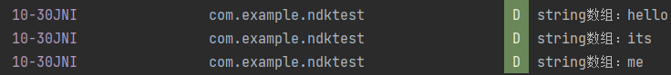


> ##### SetObjectArrayElement
>
> > 设置数组中的元素
> >
> > ```cpp
> > void SetObjectArrayElement(JNIEnv *env,jobjectArray array,jsize index,jobject value);
> > ```

##### 基本类型数组

> ##### 创建基本类型数组
>
> > ```cpp
> > ArrayType New<PrimitiveType>Array(JNIEnv *env,jsize length);
> > 
> > New<PrimitiveType>Array Routines           Array Type
> > NewBooleanArray()                          jbooleanArray
> > NewByteArray()                             jbyteArray
> > NewCharArray()                             jcharArray
> > NewShortArray()                            jshortArray
> > NewIntArray()                              jintArray
> > NewLongArray()                             jlongArray
> > NewFloatArray()                            jfloatArray
> > NewDoubleArray()                           jdoubleArray
> > ```
>


> ##### 获取基本类型数组*指针*
>
> > ```cpp
> > NativeType * Get<PrimitiveType>ArrayElements(JNIEnv *env,ArrayType array,jboolean * isCopy);
> > 
> > Get<PrimitiveType>ArrayElements Routines     Array Type         Native Type
> > GetBooleanArrayElements()                    jbooleanArray      jboolean
> > GetByteArrayElements()                       jbyteArray         jbyte
> > GetCharArrayElements()                       jcharArray         jchar
> > GetShortArrayElements()                      jshortArray        jshort
> > GetIntArrayElements()                        jintArray          jint
> > GetLongArrayElements()                       jlongArray         jlong
> > GetFloatArrayElements()                      jfloatArray        jfloat
> > GetDoubleArrayElements()                     jdoubleArray       jdouble
> > ```
>>
> > **在调用相应的`Release<PrimitiveType>ArrayElements()`函数前将一直有效。**
>
> **例子：**
> 
> 在java代码里分别声明int数组、string数组
> 
> ```java
> public class MainActivity extends AppCompatActivity {
>     // Used to load the 'ndktest' library on application startup.
>     static {
>         System.loadLibrary("ndktest");
>     }
> 
>     @Override
>     protected void onCreate(Bundle savedInstanceState) {
>         super.onCreate(savedInstanceState);
> 
>       ....
> 
>        int[] a = {1,2,3,4};
>         showSomeMessageOnJNI(a);//传递给jni
>     }
> 
>     /**
>      * A native method that is implemented by the 'ndktest' native library,
>      * which is packaged with this application.
>      */
>     public native void showSomeMessageOnJNI(int[] intA);
> }
> ```
> 
>在c++代码的实现
> 
>```cpp
> extern "C"
>JNIEXPORT void JNICALL
> Java_com_example_ndktest_MainActivity_showSomeMessageOnJNI(JNIEnv *env, jobject thiz,
>                                                            jintArray int_a) {
>     //jint* GetIntArrayElements(jintArray array, jboolean* isCopy)
>     int* inta = env->GetIntArrayElements(int_a,NULL);//获取到int数组
> 
>     //jsize GetArrayLength(jarray array)
>     jint size = env->GetArrayLength(int_a);//获取数组长度
> 
>     //遍历数组
>     for(int i = 0;i<size;i++){
>         *(inta+i)+=100;//将数组元素加100
>         LOGD("int数组：%d\t",*inta+i);//打印数组
>     }
>     
>     env->ReleaseIntArrayElements(int_a,inta,0);//释放掉数组指针，并且更新java层数据
> ```
> 
> 可以看到数据改变
>
> 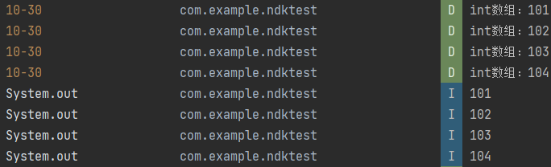


> ##### 释放基本类型数组指针
>
> > ```cpp
> > void Release<PrimitiveType>ArrayElements(JNIEnv *env,ArrayType array,NativeType *elems,jint mode);
> > 
> > //elems参数是使用Get <PrimitiveType> ArrayElements()函数数组返回的指针。
> > //如果有需要的话，该函数复制所有的elems上的变换到原始数组元素上去。mode参数提供了数组buffer应该怎么被释放。如果elems不是被array的一个副本，mode并没有什么影响。
> > 
> > //mode的取值 有如下3种情况：
> > 0：复制内容，刷新java层，并释放elems缓冲区
> > JNI_COMMIT：复制内容，刷新java层，但不释放elems缓冲区
> > JNI_ABORT：只释放缓冲区 
> > ```
> 
> **当env调用该函数会释放内存空间，同时如果数组有更新，那么jni会通知jvm进行更新，最终会影响java层的更新**
>
> ```cpp
>
> ```
> 
> 


> ##### 复制一个指定大小基本类型数组
>
> > ```cpp
> > //start：开始索引
> > //len：需要复制的长度
> > //buf：目标buffer
> > void Get<PrimitiveType>ArrayRegion(JNIEnv *env,ArrayType array,jsize start,jsize len,NativeType *buf);
> > 
> > Get<PrimitiveType>ArrayRegion Routine           Array Type              Native Type
> > GetBooleanArrayRegion()                         jbooleanArray           jboolean
> > GetByteArrayRegion()                            jbyteArray              jbyte
> > GetCharArrayRegion()                            jcharArray              jchar
> > GetShortArrayRegion()                           jshortArray             jhort
> > GetIntArrayRegion()                             jintArray               jint
> > GetLongArrayRegion()                            jlongArray              jlong
>> GetFloatArrayRegion()                           jfloatArray             jloat
> > GetDoubleArrayRegion()                          jdoubleArray            jdouble
>>     
> >   
> > ```
> 
> ##### 将复制的数组复制回源数组
> 
> > ```cpp
> > //buf：源buffer
> > void Set<PrimitiveType> ArrayRegion(JNIEnv *env,ArrayType array,jsize start,jsize len,const NativeType *buf);
> > ```
> 
> ##### 获取数组指针、释放
> 
> > ```cpp
> > void *GetPrimitiveArrayCritical(JNIEnv *env,jarray array,jboolean *isCopy);
> > void ReleasePrimitiveArrayCritical(JNIEnv *env,jarray array,void *carray,jint mode);
>> ```
> >
>> 在两者之间不能够调用其他的JNI函数和阻塞JAVA线程的方法


#### (7)打印日志

使用NDK工具链里面的log库

```cpp
#include<android/log.h>//头文件

#define TAG "Tag"
#define LOGD(...) __android_log_print(ANDROID_LOG_DEBUG,TAG,__VA_ARGS__)


int main(){
    LOGD("HELLO")
}
```


#### 全局引用和局部引用

**局部引用：**

下面代码是定义一个变量，虽然他定义在方法外部，但是它会随着函数弹栈同时而销毁，因此会变成悬空指针，容易引起ANR

```cpp
jclass dogclass//局部引用
extern "C"
JNIEXPORT void JNICALL
Java_com_example_ndktest_MainActivity_showObjectInfo(JNIEnv *env, jobject thiz, jobject student) {
    if(dogclass == NULL){
        ....
    }
    
    ...
}
```


**全局引用**

解决因上面问题而引发的ANR，可以将变量变为全局变量，并且必须手动释放

```cpp
jclass dogclass//局部引用
extern "C"
JNIEXPORT void JNICALL
Java_com_example_ndktest_MainActivity_showObjectInfo(JNIEnv *env, jobject thiz) {
    if(dogclass == NULL){
        jclass globalObj = env->FindClass("com/kevin/Dog");
        dogclass = static_cast<jclass>(env->NewGlobalRef(globalObj));//提升全局引用
    }
    
    ...
}

//手动释放全局引用
extern "C"
JNIEXPORT void JNICALL
Java_com_example_ndktest_MainActivity_releaseGlob(JNIEnv *env, jobject thiz) {
    if(dogclass != NULL){
        env->ReleaseGlobalRef(dogclass);
    }
}
```


#### 异常


## 六、拓展

### Cmake

> 参考——
>
> https://zhuanlan.zhihu.com/p/534439206

#### 1.配置使用Cmake

**下载Cmake**

> https://cmake.org/download/
>
> 官方文档——https://cmake.org/documentation/
>
> 中文文档——https://www.zybuluo.com/khan-lau/note/254724

**下载好之后查看版本**

```
Cmake /V
```


**创建Cpp文件**

```cpp
//first_cmake.cpp 
#include <iostream> 
using namespace std; 
int main(int argc,char *argv[])
{ 
 cout<<"first cmake c++"<<endl; 
 return 0; 
}
```

**配置CmakeList**

```
# CMakeLists.txt 
cmake_minimum_required (VERSION 3.0) 
project (first_cmake) 
add_executable(first_cmake first_cmake.cpp)
```

> - **cmake_minimum_required** 指定最低的cmake版本
> - project 项目名称，后面可以通过变量获取此名称
> - **add_executable**：将名为`first_cmake.cpp `的源文件编译成一个名称为 `first_cmake` 的可执行文件。

**目录结构**

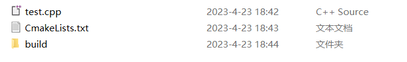

> 源码目录下面创建一个编译目录build，用于生成cmake的临时文件和项目文件，放在独立的目录方便清理和查看。

**Windows平台编译**

CMake=》vs项目=》cl编译

**进入编译目录build，直接运行cmake .. 使用默认生成项目文件，下图生成的是vs2019的64位项目（文件所在的路径和目录层次不能太深，太深会找不到编译器）。**

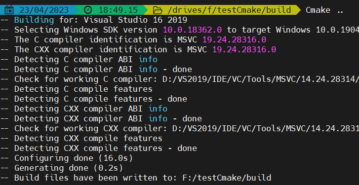

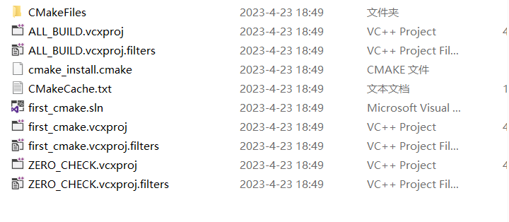

**编译项目**

​	有两种编译方法：

- 第一种直接进入build目录打开vs解决方案进行编译。
- 第二种，控制台进入生成的项目文件路径 build，然后运行 cmake --build . 后面的点表示当前路径。


**运行**

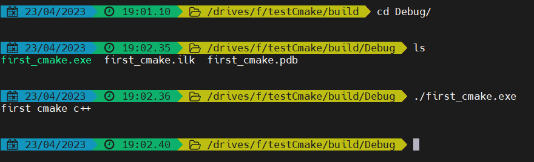4


使用VS2019运行报错

> **/All_BUILD 拒绝访问，**
>
> 解决办法：将项目设置为启动项目即可
>
> 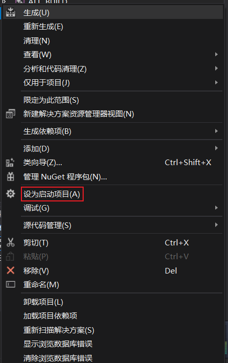


### (1).so文件

.so是基于Linux下的动态链接,其功能和作用类似与windows下.dll文件。

> 代码编译，链接，最后生成可执行文件；这个可执行文件就可看作是一个静态链接，因为代码里所有的函数变量都在这个可执行文件中。但这样会带来一个问题，就是如果项目的工程过大，写了太多的函数，但在程序的实际运行过程中，这些函数不一定都会用到，就会导致内存的大大的浪费，可能你的可执行文件有10M，但是只用了1M，其余部分都没用。于是动态链接库应运而生。不过windows下文件是.dll，而linux下叫.so。

> 参考——
>
> https://blog.csdn.net/m0_37844072/article/details/112857797
>
> https://www.cnblogs.com/liuzhenbo/p/11031052.html


> [cmake指定项目编译生成so文件路径](https://blog.csdn.net/b2259909/article/details/58591898)


#### jniLibs

> [android studio 打包 so](https://juejin.cn/s/android%20studio%20%E6%89%93%E5%8C%85%20so)

jniLibs 是 Android Studio 中用来存放 .so 文件的目录。 

在 Android Studio 中，默认情况下，`jniLibs` 目录位于项目目录下的 `app/src/main/jniLibs`。这个目录下会根据不同的 Android 平台创建子目录，例如 `arm64-v8a`、`armeabi-v7a` 和 `x86_64`。每个子目录下存放的是该平台对应的 .so 文件。 

**可以在`gradle`文件中声明支持的cpu架构，分两个模块:**

- **`cmake`**

  > 如果实在`cmake`模块声明，那么就意味着cmakelists会有条件的引入编译指定的cpu架构的so库
  >
  > ```groovy
  > android {
  >     ...
  >     defaultConfig {
  >         ...
  >         externalNativeBuild {
  >             cmake {
  >                 ...
  >                 // cmake只会导入和编译下面cpu架构的库
  >                 abiFilters "arm64-v8a", "armeabi-v7a", "x86_64"//指定cpu架构
  >                 arguments "-DANDROID_ABIS=$abiFilters"//将对应cpu架构的so文件放到对应目录下
  >             }
  >         }
  >     }
  >     ...
  > }
  > ```
  >
  > 常见的五种安卓cpu机构
  >
  > - arm64-v8a
  > - armeabi-v7a
  > - armeabi
  > - x86
  > - x86_64

- **`ndk`**

  > 如果是在`ndk`模块声明，那么意味着在最终打包apk时候，只打包指定cpu架构的so库
  >
  > ```groovy
  > android {
  > 
  >     defaultConfig {
  >         ndk{
  >             abiFilters "arm64-v8a","x86_64","x86"
  >         }
  >     }
  > }
  > ```
  >
  > 


**修改jniLibs名称**

[Android Settings，SourceSet，自定义Plugin](https://blog.csdn.net/baidu_40389775/article/details/103661713)

```groovy
android {
    sourceSets {
            main {
                //修改 so 文件存放的位置
                jniLibs.srcDirs = ['libs']
            }
        }
}
```

>  使用上面的配置后，gradle 在加载 so 文件时就会从 libs 下进行加载。 