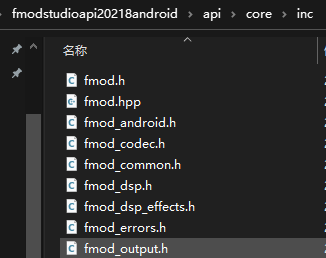
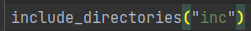
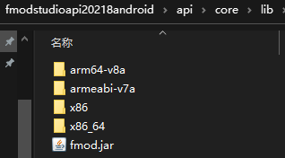
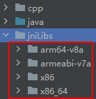
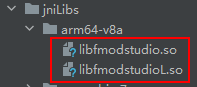
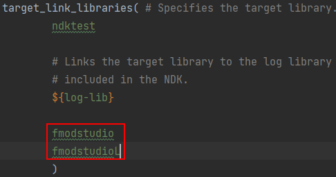
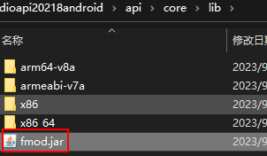
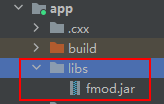

# 集成库

## 一、Fmod

 fmod是一个跨平台的音频引擎，它提供了许多音频处理功能，如播放、混合、录制、流式传输等。 

### 1.配置fmod

首先在[官网](https://www.fmod.com/download#fmodengine)下载`fmod android`的api源码


解压，并将头文件放入ndk项目中




在`Cmake`中配置头文件目录的路径



然后将`.so`文件放入`jniLibs`





配置`cmakelist`，导入`so`文件所在目录

```cmake
# 导入库文件
# CMAKE_SOURCE_DIR == cmakelists.txt的父目录
# cmake_android_arch_abi 获取当前cpu架构，加载对应的库文件
set(CMAKE_CXX_FLAGS "${CMAKE_CXX_FLAGS} -L${CMAKE_SOURCE_DIR}/../jniLibs/${CMAKE_ANDROID_ARCH_ABI}")
```

最后导入具体的库






还有一个`jar`包，也需要放到`libs`目录下





在gradle引入

```groovy
implementation files("libs\\fmod.jar")
```


### 2.利用fmod实现语音变声功能

#### (1)布局文件

```xml
<?xml version="1.0" encoding="utf-8"?>
<LinearLayout xmlns:android="http://schemas.android.com/apk/res/android"
    xmlns:app="http://schemas.android.com/apk/res-auto"
    xmlns:tools="http://schemas.android.com/tools"
    android:layout_width="match_parent"
    android:layout_height="match_parent"
    android:orientation="vertical"
    tools:context=".MainActivity">


    <ImageView
        android:id="@+id/imageView"
        android:layout_width="match_parent"
        android:layout_height="267dp"
        tools:srcCompat="@tools:sample/avatars" />

    <Button
        android:id="@+id/btn_1"
        android:layout_width="match_parent"
        android:layout_height="wrap_content"
        android:onClick="onFix"
        android:text="原声" />

    <Button
        android:id="@+id/btn_2"
        android:layout_width="match_parent"
        android:layout_height="wrap_content"
        android:onClick="onFix"
        android:text="萝莉" />

    <Button
        android:id="@+id/btn_3"
        android:layout_width="match_parent"
        android:layout_height="wrap_content"
        android:onClick="onFix"
        android:text="大叔" />

    <Button
        android:id="@+id/btn_4"
        android:layout_width="match_parent"
        android:layout_height="wrap_content"
        android:onClick="onFix"
        android:text="惊悚" />

    <Button
        android:id="@+id/btn_5"
        android:layout_width="match_parent"
        android:layout_height="wrap_content"
        android:onClick="onFix"
        android:text="古怪" />

    <Button
        android:id="@+id/btn_6"
        android:layout_width="match_parent"
        android:layout_height="wrap_content"
        android:onClick="onFix"
        android:text="空灵" />
</LinearLayout>
```


#### (2)`MainActivity`声明

```java
public class MainActivity extends AppCompatActivity {

    // Used to load the 'ndktest' library on application startup.
    static {
        System.loadLibrary("ndktest");
    }

    private ActivityMainBinding binding;

    private static final int MODE_NORMAL = 0;
    private static final int MODE_LUOLI = 1;

    private static final int MODE_DASHU = 2;
    private static final int MODE_JINGSONG = 3;
    private static final int MODE_GAOGUAI = 4;
    private static final int MODE_KONGLING = 5;


    private final String PATH = "file://assets/pikachu.mp3";//文件路径
    @Override
    protected void onCreate(Bundle savedInstanceState) {
        super.onCreate(savedInstanceState);

        binding = ActivityMainBinding.inflate(getLayoutInflater());
        setContentView(binding.getRoot());

        FMOD.init(this);//初始化fmod

    }


    public void onFix(View view){
        if(view.getId() == R.id.btn_1)
            voiceChangeNative(MODE_NORMAL,PATH);

        else if(view.getId() == R.id.btn_2)
            voiceChangeNative(MODE_LUOLI,PATH);

        else if(view.getId() == R.id.btn_3)
            voiceChangeNative(MODE_DASHU,PATH);

        else if(view.getId() == R.id.btn_4)
            voiceChangeNative(MODE_JINGSONG,PATH);

        else if(view.getId() == R.id.btn_5)
            voiceChangeNative(MODE_GAOGUAI,PATH);

        else if(view.getId() == R.id.btn_6)
            voiceChangeNative(MODE_KONGLING,PATH);

    }

    private native void voiceChangeNative(int modeNormal, String path);


    @Override
    protected void onDestroy() {
        super.onDestroy();
        FMOD.close();//销毁
    }
```


生成头文件

```cpp
/* DO NOT EDIT THIS FILE - it is machine generated */
#include <jni.h>
#include "fmod.hpp"
/* Header for class com_example_ndktest_MainActivity */

#ifndef _Included_com_example_ndktest_MainActivity
#define _Included_com_example_ndktest_MainActivity
#ifdef __cplusplus
extern "C" {
#endif
#undef com_example_ndktest_MainActivity_MODE_NORMAL
#define com_example_ndktest_MainActivity_MODE_NORMAL 0L
#undef com_example_ndktest_MainActivity_MODE_LUOLI
#define com_example_ndktest_MainActivity_MODE_LUOLI 1L
#undef com_example_ndktest_MainActivity_MODE_DASHU
#define com_example_ndktest_MainActivity_MODE_DASHU 2L
#undef com_example_ndktest_MainActivity_MODE_JINGSONG
#define com_example_ndktest_MainActivity_MODE_JINGSONG 3L
#undef com_example_ndktest_MainActivity_MODE_GAOGUAI
#define com_example_ndktest_MainActivity_MODE_GAOGUAI 4L
#undef com_example_ndktest_MainActivity_MODE_KONGLING
#define com_example_ndktest_MainActivity_MODE_KONGLING 5L
/*
 * Class:     com_example_ndktest_MainActivity
 * Method:    voiceChangeNative
 * Signature: (ILjava/lang/String;)V
 */
JNIEXPORT void JNICALL Java_com_example_ndktest_MainActivity_voiceChangeNative
  (JNIEnv *, jobject, jint, jstring);


#ifdef __cplusplus
}
#endif
#endif
```


#### (3)cpp实现

**只实现了播放原始音频**

```cpp
#include "com_example_ndktest_MainActivity.h"
#include <android/log.h>
#include <unistd.h>

#define TAG "10-30JNI"
#define LOGD(...) __android_log_print(ANDROID_LOG_DEBUG,TAG,__VA_ARGS__)

using namespace FMOD;//FMOD的命名空间

extern "C"
JNIEXPORT void JNICALL
Java_com_example_ndktest_MainActivity_voiceChangeNative(JNIEnv *env, jobject thiz,
                                                        jint mode_normal,
                                                        jstring path) {
    // TODO: implement voiceChangeNative()

    char* defaultContent = "播放完毕";

    const char * path_ = env->GetStringUTFChars(path,NULL);

    //音效引擎系统
    System * system = 0;

    //声音
    Sound * sound = 0;

    //通道，音轨
    Channel * channel = 0;

    //创建系统
    System_Create(&system);

    //初始化系统：param1：最大音轨数；param2：初始化标记；
    system->init(32,FMOD_INIT_NORMAL,0);

    //创建声音，param1：路径；param2：声音初始化标记；param3：额外数据；param4：声音指针
    system->createSound(path_,FMOD_DEFAULT,0,&sound);

    //播放声音，包含音轨、声音
    //param1:声音；param2：分组音轨；param3：控制；param4：通道
    system->playSound(sound,0, false,&channel);

    //判断播放完条件
    bool isPlayed = true;
    while(isPlayed){
        channel->isPlaying(&isPlayed);//当播放完会自动修改isPlayed为false
        usleep(1000*1000);//没播放完，一直休眠
    }

    //内存回收
    sound->release();
    system->close();
    system->release();
    env->ReleaseStringUTFChars(path,path_);
}
```


**实现添加特效**

```cpp

#include "com_example_ndktest_MainActivity.h"
#include <android/log.h>
#include <unistd.h>

#define TAG "10-30JNI"
#define LOGD(...) __android_log_print(ANDROID_LOG_DEBUG,TAG,__VA_ARGS__)

using namespace FMOD;//FMOD的命名空间

extern "C"
JNIEXPORT void JNICALL
Java_com_example_ndktest_MainActivity_voiceChangeNative(JNIEnv *env, jobject thiz,
                                                        jint mode,
                                                        jstring path) {
    // TODO: implement voiceChangeNative()

    char* defaultContent = "播放完毕";

    const char * path_ = env->GetStringUTFChars(path,NULL);


    //音效引擎系统
    System * system = 0;

    //声音
    Sound * sound = 0;

    //通道，音轨
    Channel * channel = 0;

    //DSP:digital signal process
    DSP * dsp = 0;

    //创建系统
    System_Create(&system);

    //初始化系统：param1：最大音轨数；param2：初始化标记；
    system->init(32,FMOD_INIT_NORMAL,0);

    //创建声音，param1：路径；param2：声音初始化标记；param3：额外数据；param4：声音指针
    system->createSound(path_,FMOD_DEFAULT,0,&sound);

    //播放声音，包含音轨、声音
    //param1:声音；param2：分组音轨；param3：控制；param4：通道
    system->playSound(sound,0, false,&channel);

    //添加特效
    switch (mode) {
        case com_example_ndktest_MainActivity_MODE_NORMAL://原生
            defaultContent = "原生播放完毕";
            break;
        case com_example_ndktest_MainActivity_MODE_LUOLI:
            defaultContent = "萝莉音播放完毕";
            //创建dsp类型的pitch音调条件
            system->createDSPByType(FMOD_DSP_TYPE_PITCHSHIFT,&dsp);
            //设置pitch音调调节2.0
            dsp->setParameterFloat(FMOD_DSP_PITCHSHIFT_PITCH,2.0F);
            //添加音效进去 音轨
            channel->addDSP(0,dsp);
            break;

        case com_example_ndktest_MainActivity_MODE_DASHU:
            defaultContent = "大叔音播放完毕";
            //创建dsp类型的pitch音调条件
            system->createDSPByType(FMOD_DSP_TYPE_PITCHSHIFT,&dsp);
            //设置pitch音调调节2.0
            dsp->setParameterFloat(FMOD_DSP_PITCHSHIFT_PITCH,0.7F);
            //添加音效进去 音轨
            channel->addDSP(0,dsp);
            break;

        case com_example_ndktest_MainActivity_MODE_GAOGUAI:
            defaultContent = "搞怪播放完毕";

            //加快频率
            float frequency;
            channel->getFrequency(&frequency);
            channel->setFrequency(frequency*1.5f);
            break;

        case com_example_ndktest_MainActivity_MODE_KONGLING:
            defaultContent="空灵";

            //回音 echo
            system->createDSPByType(FMOD_DSP_TYPE_ECHO,&dsp);
            dsp->setParameterFloat(FMOD_DSP_ECHO_DELAY,20);
            dsp->setParameterFloat(FMOD_DSP_ECHO_FEEDBACK,10);
            channel->addDSP(0,dsp);
            break;
    }


    //判断播放完条件
    bool isPlayed = true;
    while(isPlayed){
        channel->isPlaying(&isPlayed);//当播放完会自动修改isPlayed为false
        usleep(1000*1000);//没播放完，一直休眠
    }

    //内存回收
    sound->release();
    dsp->release();
    system->close();
    system->release();
    env->ReleaseStringUTFChars(path,path_);
}
```

