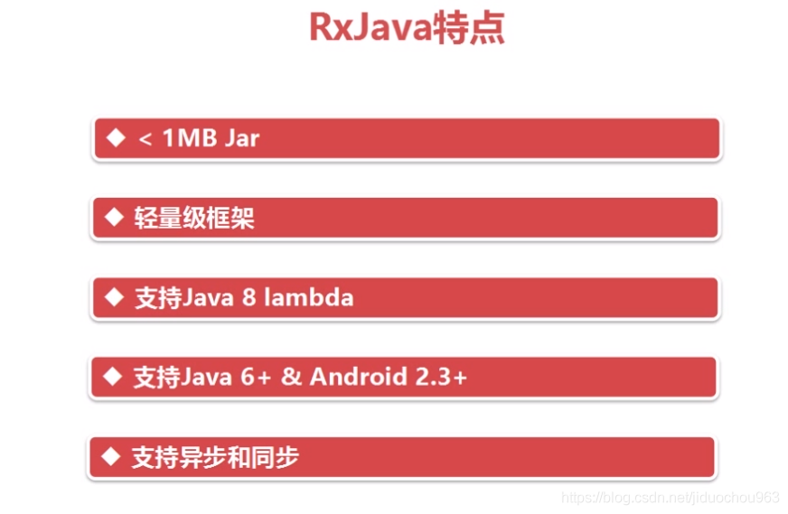
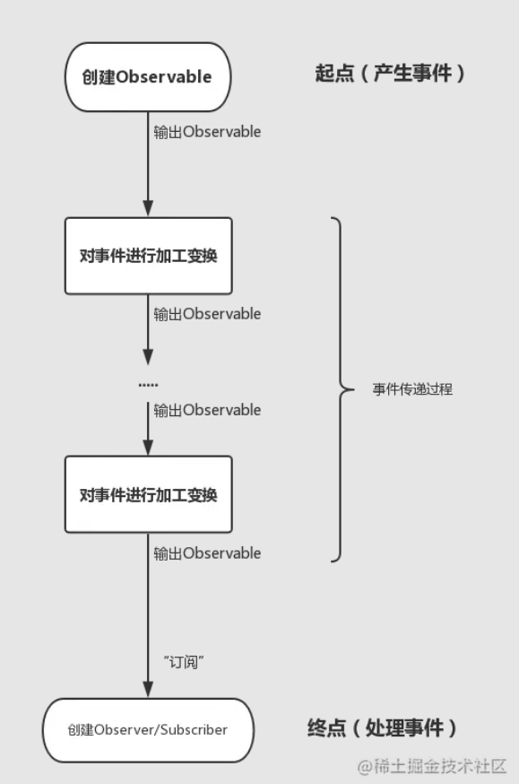

# RxJava

> 参考：
>
> [RxJava学习路径](https://blog.csdn.net/carson_ho/article/details/120326253)
>
> https://juejin.cn/post/6844903447280484360
>
> [RxJava——基础](https://blog.csdn.net/asdasdasd123123123/article/details/118052716?spm=1001.2101.3001.6650.1&utm_medium=distribute.pc_relevant.none-task-blog-2%7Edefault%7EBlogCommendFromBaidu%7ERate-1-118052716-blog-41833541.235%5Ev38%5Epc_relevant_sort_base3&depth_1-utm_source=distribute.pc_relevant.none-task-blog-2%7Edefault%7EBlogCommendFromBaidu%7ERate-1-118052716-blog-41833541.235%5Ev38%5Epc_relevant_sort_base3&utm_relevant_index=2)
>
> 官方文档--https://mcxiaoke.gitbooks.io/rxdocs/content/


## 1.什么是RxJava

Rx(Reactive Extensions)是一个函数库， `RxJava` 是一个 **基于事件流、实现异步操作**的库 。


**特点：**

 


**实现类似`AsyncTask`、`Handler`的作用**

## 2.RXJava原理

> 参考-[RxJava_特点](https://blog.csdn.net/carson_ho/article/details/78179340)

### (1)Rxjava的两个特点

#### 异步

（参考下面）

#### 观察者模式

什么是观察者模式：

一个例子：

> 在这个事件中，**台灯作为观察者，开关作为被观察者，电线作为连接观察者和被观察者的中介**
>
> **台灯透过电线来观察开关的状态来并做出相应的处理**
>
> 
>
> - 开关（被观察者）作为事件的**产生方**（生产“开”和“关”这两个事件），是**主动**的，是整个开灯事理流程的**起点**。
> - 台灯（观察者）作为事件的**处理方**（处理“灯亮”和“灯灭”这两个事件），是**被动**的，是整个开灯事件流程的**终点**。
> - 在起点和终点之间，即事件传递的过程中是可以被**加工，过滤，转换，合并等等方式**处理的（上图没有体现，后面对会讲到）。


### (2)RxJava的原理介绍

`Rxjava`原理 基于 **一种扩展的观察者模式**

| 角色                   | 作用                         |
| ---------------------- | ---------------------------- |
| 被观察者（Observable） | 产生事件                     |
| 观察者（Observer）     | 接收事件，并给出响应动作     |
| 订阅（Subscribe）      | 连接 被观察者 & 观察者       |
| 事件（Event）          | 被观察者 & 观察者 沟通的载体 |


 <u>即`RxJava`原理可总结为：被观察者 `（Observable）` 通过 订阅`（Subscribe）` **按顺序发送事件** 给观察者 `（Observer）`， 观察者`（Observer）` **按顺序接收事件** & 作出对应的响应动作。</u> 


## 3.RxJava使用

```groovy
//RxJava的依赖包
compile 'io.reactivex.rxjava2:rxjava:2.0.1'
//RxAndroid的依赖包
compile 'io.reactivex.rxjava2:rxandroid:2.0.1'
```


RxJava也是基于观察者模式来组建自己的程序逻辑的，就是构建：

- **被观察者（Observable）**
- **观察者（Observer/Subscriber）**，
- 建立二者的订阅关系（就像那根电线，连接起台灯和开关）实现**观察**，在事件传递过程中还可以**对事件做各种处理**。

> Tips: Observer是观察者的接口， Subscriber是实现这个接口的抽象类,因此两个类都可以被当做观察者，由于Subscriber在Observe的基础上做了一些拓展，加入了新的方法，一般会更加倾向于使用Subscriber。


### 创建被观察者

- **正常模式：**

  > ```java
  > Observable switcher=Observable.create(new Observable.OnSubscribe<String>(){
  >       @Override
  >          public void call(Subscriber<? super String> subscriber) {
  >              subscriber.onNext("On");
  >              subscriber.onNext("Off");
  >              subscriber.onNext("On");
  >              subscriber.onNext("On");
  >              subscriber.onCompleted();
  >          }
  >      });
  > ```
  >
  > 这是最正宗的写法，创建了一个开关类，产生了五个事件，分别是：开，关，开，开，结束。

- **偷懒模式**:

  > ```java
  > Observable switcher=Observable.just("On","Off","On","On");
  > ```
  >
  > or
  >
  > ```java
  > String [] kk={"On","Off","On","On"};
  > Observable switcher=Observable.from(kk);
  > ```
  >
  > 偷懒模式是一种简便的写法，实际上也都是**被观察者**把那些信息"On","Off","On","On"，包装成onNext（"On"）这样的事件依次发给**观察者**，当然，它自己补上了onComplete()事件。


### 创建观察者

- **正常模式**

  >  **方法一： 采用Observer 接口 **
  >
  >  ```java
  >  // 1. 创建观察者 （Observer ）对象
  >  Observer<Integer> observer = new Observer<Integer>() {
  >  
  >      // 观察者接收事件前，默认最先调用复写 onSubscribe（）
  >      @Override
  >      public void onSubscribe(Disposable d) {
  >          Log.d(TAG, "开始采用subscribe连接");
  >      }
  >  
  >      // 当被观察者生产Next事件 & 观察者接收到时，会调用该复写方法 进行响应
  >      @Override
  >      public void onNext(Integer value) {
  >          Log.d(TAG, "对Next事件作出响应" + value);
  >      }
  >  
  >      // 当被观察者生产Error事件& 观察者接收到时，会调用该复写方法 进行响应
  >      @Override
  >      public void onError(Throwable e) {
  >          Log.d(TAG, "对Error事件作出响应");
  >      }
  >  
  >      // 当被观察者生产Complete事件& 观察者接收到时，会调用该复写方法 进行响应
  >      @Override
  >      public void onComplete() {
  >          Log.d(TAG, "对Complete事件作出响应");
  >      }
  >  };
  >  ```
  >
  >  **（推荐）方式二： 采用Subscriber 抽象类 **
  >
  >   RxJava 内置的一个实现了 Observer 的抽象类，对 Observer 接口进行了扩展 
  >
  >  ```java
  >  Subscriber light=new Subscriber<String>() {
  >      // 观察者接收事件前，默认最先调用复写 onSubscribe（）
  >      @Override
  >      public void onSubscribe(Subscription s) {
  >          Log.d(TAG, "开始采用subscribe连接");
  >      }
  >  
  >      @Override
  >      public void onCompleted() {
  >          //被观察者的onCompleted()事件会走到这里;
  >          Log.d("DDDDDD","结束观察...\n");
  >      }
  >  
  >      @Override
  >      public void onError(Throwable e) {
  >          //出现错误会调用这个方法
  >      }
  >      @Override
  >      public void onNext(String s) {
  >          //处理传过来的onNext事件
  >          Log.d("DDDDD","handle this---"+s)
  >      }
  >  ```
  >
  >  > **两者区别**
  >  >
  >  > Subscriber抽象类对 Observer 接口进行了扩展，新增了两个方法：
  >  >        1. `onStart()`：在还未响应事件前调用，用于做一些初始化工作
  >  >        2. `unsubscribe()`：用于取消订阅。在该方法被调用后，观察者将不再接收 & 响应事件，调用该方法前，先使用 isUnsubscribed() 判断状态，确定被观察者Observable是否还持有观察者Subscriber的引用，如果引用不能及时释放，就会出现内存泄露
  >  >

- **偷懒模式**

  > ```java
  > Action1 light=new Action1<String>() {
  >      @Override
  >      public void call(String s) {
  >            Log.d("DDDDD","handle this---"+s)
  >      }
  > }
  > ```
  >
  > > 之所以说它是非正式写法，是因为Action1是一个单纯的人畜无害的接口，和Observer没有啥关系，只不过它可以当做观察者来使，专门处理onNext 事件，这是一种为了简便偷懒的写法。当然还有Action0，Action2,Action3...,0,1,2,3分别表示call()这个方法能接受几个参数。


### 订阅

将**观察者**和**被观察者**联系起来

```java
observable.subscribe(observer);//被观察者“订阅”观察者
```

> 为什么是被观察者订阅观察者？
>
> > 是为了保证**流式API调用风格**
> >
> > ```java
> > //这就是RxJava的流式API调用
> > Observable.just("On","Off","On","On")
> >  //在传递过程中对事件进行过滤操作
> >  .filter(new Func1<String, Boolean>() {
> >      @Override
> >      public Boolean call(String s) {
> >          return s！=null;
> >      }
> >  })
> >  .subscribe(subscriber);
> > ```
> >
> > 由于被观察者产生事件，是事件的起点，那么开头就是用Observable这个主体调用来创建被观察者，产生事件，为了保证流式API调用规则，就直接让Observable作为唯一的调用主体，一路调用下去。
> >
> > > 一句话，**背后的真实的逻辑依然是台灯订阅了开关，但是在表面上，我们让开关“假装”订阅了台灯，以便于保持流式API调用风格不变。**

### 链式调用更简洁：



结合流程图完整代码

```java
//创建被观察者，是事件传递的起点
Observable.just("On","Off","On","On")
    //这就是在传递过程中对事件进行过滤操作
    .filter(new Func1<String, Boolean>() {
        @Override
        public Boolean call(String s) {
            return s！=null;
        }
    })
    //实现订阅
    .subscribe(
    //创建观察者，作为事件传递的终点处理事件    
    new Subscriber<String>() {
        @Override
        public void onCompleted() {
            Log.d("DDDDDD","结束观察...\n");
        }

        @Override
        public void onError(Throwable e) {
            //出现错误会调用这个方法
        }
        @Override
        public void onNext(String s) {
            //处理事件
            Log.d("DDDDD","handle this---"+s)
        }
        );
```

> **Tips: 当调用订阅操作（即调用Observable.subscribe()方法）的时候，被观察者才真正开始发出事件。**


#### 使用consumer代替observer

实现更简便的观察者模式

```java
Observable.just("hello").subscribe(new Consumer<String>() {
    // 每次接收到Observable的事件都会调用Consumer.accept（）
    @Override
    public void accept(String s) throws Exception {
        System.out.println(s);
    }
});
```


### 切断连接

**可采用 Disposable.dispose() 切断观察者 与 被观察者 之间的连接即观察者 无法继续 接收 被观察者的事件，但被观察者还是可以继续发送事件**

```c++

// 主要在观察者 Observer中 实现
Observer<Integer> observer = new Observer<Integer>() {
    // 1. 定义Disposable类变量
    private Disposable mDisposable;

    @Override
        public void onSubscribe(Disposable d) {
        Log.d(TAG, "开始采用subscribe连接");
        // 2. 对Disposable类变量赋值
        mDisposable = d;
    }

    @Override
        public void onNext(Integer value) {
        Log.d(TAG, "对Next事件"+ value +"作出响应"  );
        if (value == 2) {
            // 设置在接收到第二个事件后切断观察者和被观察者的连接
            mDisposable.dispose();
            Log.d(TAG, "已经切断了连接：" + mDisposable.isDisposed());
        }
    }

    @Override
        public void onError(Throwable e) {
        Log.d(TAG, "对Error事件作出响应");
    }

    @Override
        public void onComplete() {
        Log.d(TAG, "对Complete事件作出响应");
    }
};
```


## 4.RxJava的操作符

### Map操作符

> 比如被观察者产生的事件中只有图片文件路径；,但是在观察者这里只想要bitmap,那么就需要**类型变换**。
>
> ```java
> Observable.just(getFilePath())
>  //使用map操作来完成类型转换,
>  //使用map操作时，new Func1() 就对应了类型的转变的方向，String是原类型，Bitmap是转换后的类型。在call()方法中，输入的是原类型，返回转换后的类型
>  .map(new Func1<String, Bitmap>() {
>      @Override
>      public Bitmap call(String s) {
>          //显然自定义的createBitmapFromPath(s)方法，是一个极其耗时的操作
>          return createBitmapFromPath(s);
>      }
>  })
>  .subscribe(
>  //创建观察者，作为事件传递的终点处理事件    
>  new Subscriber<Bitmap>() {
>      @Override
>      public void onCompleted() {
>          Log.d("DDDDDD","结束观察...\n");
>      }
> 
>      @Override
>      public void onError(Throwable e) {
>          //出现错误会调用这个方法
>      }
>      @Override
>      public void onNext(Bitmap s) {
>          //处理事件
>          showBitmap(s)
>      }
>      );
> ```


#### 切换线程

上面代码中可以看到，创建bitmap是一个非常耗时的操作，那么就应该在子线程中执行，主线程(UI线程)做的仅仅是展示，在RXJava中，切换线程是非常方便的

> ```java
> Observable.just(getFilePath())
>  //指定了被观察者执行的线程环境
>  .subscribeOn(Schedulers.newThread())
>  //将接下来执行的线程环境指定为io线程
>  .observeOn(Schedulers.io())
>  //使用map操作来完成类型转换
>  .map(new Func1<String, Bitmap>() {
>      @Override
>      public Bitmap call(String s) {
>          //显然自定义的createBitmapFromPath(s)方法，是一个极其耗时的操作
>          return createBitmapFromPath(s);
>      }
>  })
>  //将后面执行的线程环境切换为主线程
>  .observeOn(AndroidSchedulers.mainThread())
>  .subscribe(
>  //创建观察者，作为事件传递的终点处理事件    
>  new Subscriber<Bitmap>() {
>      @Override
>      public void onCompleted() {
>          Log.d("DDDDDD","结束观察...\n");
>      }
> 
>      @Override
>      public void onError(Throwable e) {
>          //出现错误会调用这个方法
>      }
>      @Override
>      public void onNext(Bitmap s) {
>          //处理事件
>          showBitmap(s)
>      }
>      );
> ```
>
> > 由上面的代码可以看到，使用操作符将事件处理逐步分解，通过线程调度为每一步设置不同的线程环境，完全解决了你线程切换的烦恼。可以说线程调度+操作符，才真正展现了RxJava无与伦比的魅力。


#### flatmap操作符

flatmap的作用是：将每个Observable产生的事件里的信息再包装成新的Observable传递出来，

> 先提出一个需求，查找一个学校每个班级的每个学生，并打印出来:
>
> ```java
> //创建被观察者，获取所有班级
> Observable.from(getSchoolClasses())
>  .flatMap(new Func1<SingleClass, Observable<Student>>() {
>      @Override
>      public Observable<Student> call(SingleClass singleClass) {
>          //将每个班级的所有学生作为一列表包装成一列Observable<Student>，将学生一个一个传递出去
>          return Observable.from(singleClass.getStudents());
>      }
>  })
>  .subscribe(
>  //创建观察者，作为事件传递的终点处理事件    
>  new Subscriber<Student>() {
>      @Override
>      public void onCompleted() {
>          Log.d("DDDDDD","结束观察...\n");
>      }
> 
>      @Override
>      public void onError(Throwable e) {
>          //出现错误会调用这个方法
>      }
>      @Override
>      public void onNext(Student student) {
>          //接受到每个学生类
>          Log.d("DDDDDD",student.getName())
>      }
>      );
> ```
>
> > 就是因为FlatMap可以再次包装新的Observable,而每个Observable都可以使用from(T[])方法来创建自己，这个方法接受一个列表，然后将列表中的数据包装成一系列事件。


## 5.RxJava的异步

如Map操作中切换线程所述，RxJava的线程环境有：

| 调度器类型                     | 效果                                                         |
| ------------------------------ | ------------------------------------------------------------ |
| Schedulers.computation()       | 用于计算任务，如事件循环或回调处理，不要用于IO操作；默认线程数等于处理器数量 |
| Schedulers.from(executor)      | 使用指定的Excutor作为调度器                                  |
| Schedulers.immediate()         | 在当前线程立即开始执行任务                                   |
| Schedulers.io()                | 用于IO密集型任务，如异步阻塞IO操作，这个调度器的线程池会根据需要增长，对于普通的计算任务，请使用Schedulers.computation();Schedulers.io()默认是一个CachedThreadScheduler，很像一个有线程缓存的新线程调度器 |
| Schedulers.newThread()         | 为每个任务创建一个新线程                                     |
| Schedulers.trampoline()        | 当其他排队的任务完成后，在当前线程排队开始执行               |
| AndroidSchedulers.mainThread() | 切换到主线程                                                 |


### 关于subscribeOn()和observeOn()

> - subscribeOn（）它指示Observable在一个指定的调度器上**创建**（只作用于被观察者创建阶段）。只能指定一次，如果指定多次则以第一次为准
> - observeOn（）指定在事件传递（加工变换）和最终被处理（观察者）的发生在哪一个调度器。可指定多次，每次指定完都在下一步生效。

