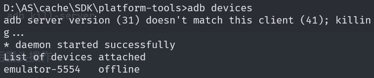
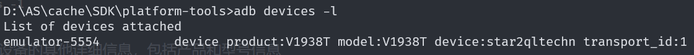
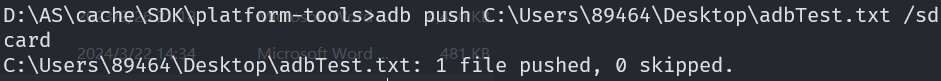
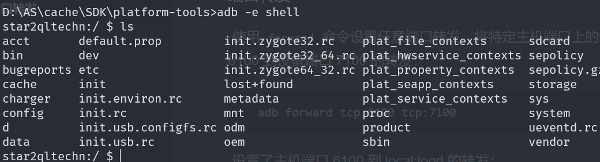
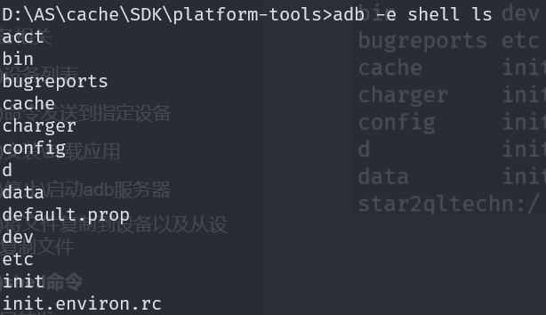

## 一、简介

Android 调试桥 (`adb`) 是一种功能多样的命令行工具，可让用户与设备进行通信。`adb` 命令可用于执行各种设备操作，例如安装和调试应用。`adb` 提供对 Unix shell（可用来在设备上运行各种命令）的访问权限。 

包括以下三个组件：

- **客户端**：用于发送命令。客户端在开发机器上运行。您可以通过发出 `adb` 命令从命令行终端调用客户端。
- **守护程序 (adbd)**：用于在设备上运行命令。守护程序在每个设备上作为后台进程运行。
- **服务器**：用于管理客户端与守护程序之间的通信。服务器在开发机器上作为后台进程运行。


**工作流程：**

1. **启动ADB服务器**：当开发者第一次运行ADB命令时，ADB服务器会在后台启动。
2. **建立连接**：ADB服务器会扫描并连接到所有可用的Android设备（通过USB或TCP/IP）。
3. **发送命令**：开发者通过ADB客户端发送命令。
4. **转发命令**：ADB服务器将命令转发给相应的设备上的ADB守护进程。
5. **执行命令**：ADB守护进程在设备上执行命令，并将结果返回给ADB服务器。
6. **返回结果**：ADB服务器将结果返回给ADB客户端，并显示给开发者。


## 二、adb安装

> https://blog.51cto.com/u_16213328/9005525
>
>  https://blog.csdn.net/qq_34897442/article/details/51812860 

AS自带adb，如果配置了环境变量，可以直接使用

```shell
which adb #找到安装目录
```


**默认AS安装的adb位置是在：**

> D:\Android\adt-bundle-windows-x86-20130514\sdk\platform-tools


## 三、指令

> [adb常用指令](https://juejin.cn/post/7383268946818777103)
>
> [官方文档](https://developer.android.com/tools/adb?hl=zh-cn)

**如果要在USB连接的设备上使用adb，必须让设备处于开发者模式**


### 1.通过WIFI连接设备(命令行的方式)

AS中可以通过WIFI无线连接调试设备。但如果不想启用AS，可以用命令行

#### paring code

**可以通过paring code的方式**

按以下步骤操作：

- 在设备上启用开发者选项。

- 在设备上启用**无线调试**。

- 前往 `android_sdk/platform-tools`。

- 选择 **Pair device with pairing code**。记下设备上显示的 IP 地址、端口号和配对码。

  > 要是打开配对码后的端口号

- 在终端上，运行 `adb pair ipaddr:port`。请使用上述 IP 地址和端口号。

- 收到提示时，输入配对码


#### connect

对于Android 10及以下设备，可能没有无线调试选项，那**可以先USB连接后，在无线调试**。步骤如下

- 将 Android 设备和 `adb` 主机连接到同一 Wi-Fi 网络。

- 使用 USB 线将设备连接到主机。

-  设置目标设备以监听端口 5555 上的 TCP/IP 连接： 

  ```shell
  adb tcpip 5555
  ```

- 拔掉连接目标设备的 USB 线。

-  找到 Android 设备的 IP 地址 

-  通过 IP 地址连接到设备： 

  ```shell
  adb connect device_ip_address:5555
  ```

-  确认主机已连接到目标设备： 

  ```shell
  $ adb devices
  List of devices attached
  device_ip_address:5555 device
  ```

- 如果与设备的 `adb` 连接断开：

  - 确保主机仍与 Android 设备连接到同一 Wi-Fi 网络。

  - 通过再次执行 `adb connect` 步骤重新连接。

  -  如果这样无法解决问题，重置 `adb` 主机： 

    ```shell
    adb kill-server
    ```

  - 然后重头操作


### 2.设备相关

#### (1)设备列表

**`adb devices`**

它会列出所有可连接的 Android 设备和模拟器，并显示唯一的设备标识符和设备状态。 



adb相应输出每个设备的状态信息：

- **序列号**：`adb` 会创建一个字符串，用于通过端口号唯一标识设备。下面是一个序列号示例：`emulator-5554`
- **状态**：设备的连接状态可以是以下几项之一：
  - `offline`：设备未连接到 `adb` 或没有响应。
  - `device`：设备已连接到 `adb` 服务器。请注意，此状态并不表示 Android 系统已完全启动并可正常运行，因为在设备连接到 `adb` 时系统仍在启动。系统完成启动后，设备通常处于此运行状态。
  - `no device`：未连接任何设备。


| 选项 | 解释                                           |
| ---- | ---------------------------------------------- |
| `-l` | 列出连接设备的其他详细信息，包括产品和型号信息 |

>**注意：**
>
>上面模拟器显示offline是因为我们使用`adb services`前没有启动`adb server`，所以最好是在之前**使用`adb start-server`启动`adb`服务器**


#### (2)命令发送到指定设备

如果同时有多个设备在运行，那需要选择具体的设备执行`adb`命令

步骤操作：

1. 使用 `devices` 命令获取目标设备的序列号。
2. 获得序列号后，结合使用`-s`选项与`adb` 命令来指定序列号。
   - 如果要发出很多 `adb` 命令，可以将 `$ANDROID_SERIAL` 环境变量设为包含序列号。
   - 如果同时使用 `-s` 和 `$ANDROID_SERIAL`，`-s` 会替换 `$ANDROID_SERIAL`。

**例如：**

先获取设备列表，然后指定设备序列号，安装应用

```shell
$ adb devices
List of devices attached
emulator-5554 device
emulator-5555 device
0.0.0.0:6520  device

# To install on emulator-5555
$ adb -s emulator-5555 install helloWorld.apk
# To install on 0.0.0.0:6520
$ adb -s 0.0.0.0:6520 install helloWorld.apk
```


| 选项 | 解释                                                         |
| ---- | ------------------------------------------------------------ |
| `-e` | 如果有多个可用设备，但只有一个是模拟器，使用 `-e` 选项将命令发送至该模拟器。 |
| `-d` | 如果有多个设备，但只连接了一个硬件设备，请使用 `-d` 选项将命令发送至该硬件设备。 |


#### (3)安装\卸载应用

**安装**

```shell
adb install path_to_apk
```


| 选项 | 解释                                                         |
| ---- | ------------------------------------------------------------ |
| `-r` | 如果设备上已经安装过该软件，在设备上安装或替换应用程序，并保留其数据。 |
| `-g` | 如果应用要求运行时权限，命令会自动授予所有权限               |


**卸载**

```shell
adb uninstall package_name
```


#### (4)停止\启动adb服务器

**`adb kill-server`** 和 **`adb start-service`** 




#### (5)将文件复制到设备以及从设备复制文件

 从设备中复制某个文件或目录（及其子目录），请使用以下命令： 

```shell
adb pull remote local
```

 将某个文件或目录（及其子目录）复制到设备，请使用以下命令： 

```shell
adb push local remote
```


**例如：**

```shell
adb push adbTest.txt /sdcard
```




#### (6)shell命令

设备上启动交互式shell：

```shell
adb [-d | -e | -s serial_number] shell
```




**直接向设备发出shell命令**

需要指定具体的模拟器

```shell
adb [-d |-e | -s serial_number] shell shell_command
```




**退出`ctrl+D`、`exit`**


#### (7)打印日志

> https://juejin.cn/post/7123094472136589326

可以使用adb打印模拟器应用的日志

```shell
//格式1：打印默认日志数据 
adb logcat 
//格式2：需要打印日志详细时间的简单数据 
adb logcat -v time 
//格式3：需要打印级别为Error的信息 
adb logcat *:E 
//格式4：需要打印时间和级别是Error的信息 
adb logcat -v time *:E 
//格式5：将日志保存到电脑固定的位置，
adb logcat -v time >  D:\log.txt
```


格式

```shell
adb logcat [<option>] ... [<filter-spec>] ... 
adb logcat [选项...] [过滤项...],
```


##### 按级别过滤日志

```shell
adb logcat <tag>[:priority]
```

> **Android 的日志分为如下几个优先级（priority）：**
> V —— Verbose（最低，输出得最多）
> D —— Debug
> I —— Info
> W —— Warning 
> E —— Error 
> F —— Fatal 
> S —— Silent（最高，啥也不输出）

**例如**

**单个tag**

```shell
adb logcat *:W
#`*`可以是某个tag，如果没有指明，就表示所有。
#会将 Warning、Error、Fatal 和 Silent 日志输出。
```


**多个tag**

```shell
adb logcat ActivityManager:I MyApp:D *:S
```


##### 两个常用选项

**-v**

 -v是设置日志的输出格式的
日志支持按以下几种格式 ： 

- **brief**：`<priority>/<tag>(<pid>): <message>`


**-c**

这个命令是清楚之前的所有日志

 **一般在看日志前都会执行这个命令，目的是好看日志，不然前面的日志应该会超级多，不好看问题。** 


##### 保存日志

保存到本地

```shell
adb logcat -v time > D:\log.txt
```


#### (8)端口转发

 使用 `forward` 命令设置任意端口转发，将特定主机端口上的请求转发到设备上的其他端口。以下示例设置了主机端口 6100 到设备端口 7100 的转发： 

```shell
adb forward tcp:6100 tcp:7100
```

 设置了主机端口 6100 到 local:logd 的转发： 

```shell
adb forward tcp:6100 local:logd
```

> 尝试确定发送到设备上指定端口的内容，上述做法可能会非常有用。系统会将收到的所有数据写入系统日志记录守护程序，并显示在设备日志中。 


#### (9) 获取和显示系统服务的状态信息 

`dumpsys` 是 Android 系统中的一个命令行工具，用于获取和显示系统服务的状态信息。它可以帮助开发者和测试人员调试和分析 Android 设备的各种系统服务。 

```shell
adb shell dumpsys <service>
```


**例如**

```shell
#查看窗口管理器状态：
adb shell dumpsys window

#查看电池状态：
adb shell dumpsys battery

#查看内存使用情况：
adb shell dumpsys meminfo

#查看活动管理器状态：
adb shell dumpsys activity

#查看 Wi-Fi 状态：
adb shell dumpsys wifi
```


### 3.am 命令

`am`是 Activity Manager 的缩写，它是 Android 系统的核心组件之一，负责管理以下操作：

- 启动 Activity（应用界面）
- 启动/停止 Service（后台服务）
- 发送 Broadcast（广播）
- 强制停止应用
- 杀死后台进程
- 其他与应用生命周期相关的操作。

| **功能**         | **ADB 命令示例**                                  | **说明**                                 |
| ---------------- | ------------------------------------------------- | ---------------------------------------- |
| 启动 Activity    | `adb shell am start -n 包名/类名`                 | 启动指定应用的某个界面（Activity）。     |
| 启动 Service     | `adb shell am startservice -n 包名/服务类名`      | 启动指定应用的后台服务。                 |
| 发送广播         | `adb shell am broadcast -a 广播动作 -n 包名/类名` | 发送自定义或系统广播。                   |
| 强制停止应用     | `adb shell am force-stop 包名`                    | 强制关闭应用的所有进程和组件。           |
| 杀死后台进程     | `adb shell am kill 包名`                          | 杀死应用的后台进程（安全模式下）。       |
| 杀死所有后台进程 | `adb shell am kill-all`                           | 杀死所有非前台进程。                     |
| 修改屏幕分辨率   | `adb shell wm size 宽x高`                         | 通过 `am` 调用 `wm` 命令调整屏幕分辨率。 |

 **发送一个自定义广播**

广播action为`com.example.myapp.ACTION_BOOT_TEST`，发送给`com.yht.auto_boot/.myreceiver.MyReceiver2`

```shell
adb shell am broadcast -a com.example.myapp.ACTION_BOOT_TEST -n com.yht.auto_boot/.myreceiver.MyReceiver2
```


直接从 `adb` 发出 activity 管理器命令，无需进入远程 shell。例如： 

```shell
adb shell am start -a android.intent.action.VIEW
```

> 更多am命令，参考——https://developer.android.com/tools/adb?hl=zh-cn#copyfiles