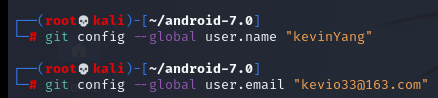
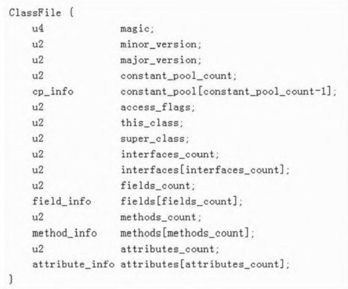

# 一、简介

## 1.工具安装

### (1)android 7.0

**(1)root目录下载repo工具**

```bash
mkdir ~/bin
PATH=~/bin:$PATH #将/bin目录下的文件都添加到系统环境变量，以便全局调用
curl https://storage.googleapis.com/git-repo-downloads/repo > ~/bin/repo#下载repo脚本，保存到~/bin目录下
chmod a+x ~/bin/repo
```


**(2)下载android 7.0源码**

首先配置git用户名和邮箱信息




```bash
export REPO_URL='https://mirrors.tuna.tsinghua.edu.cn/git/git-repo' #更换repo下载源
```

```bash
cd android-7.0
#下载nougat-release分支的代码
repo init -u https://aosp.tuna.tsinghua.edu.cn/platform/manifest -b android-7.0.0_r33
#同步代码
repo sync
```


### (2)source insight

> 参考
>
> [linux 安装 source insight](https://blog.csdn.net/buptgshengod/article/details/17999297#:~:text=1.%20sudo%20apt-get%20install%20wine%20%EF%BC%88%E5%AE%89%E8%A3%85wine%EF%BC%8C%E7%94%A8wine%E6%9D%A5%E5%AE%89%E8%A3%85source%20insight%EF%BC%89,2.%E4%B8%8B%E8%BD%BDsourceinsight%E7%9A%84exe%E6%96%87%E4%BB%B6%2Csourceinsight%E6%8B%B7%E8%B4%9D%E5%88%B0Linux%E4%B8%AD%20%EF%BC%88%20exe%E4%B8%8B%E8%BD%BD%E5%9C%B0%E5%9D%80%20%EF%BC%89%203.%E8%BF%9B%E5%85%A5Linux%E4%B8%ADInsightSetup.exe%E6%89%80%E5%9C%A8%E7%9B%AE%E5%BD%95%EF%BC%8C%E4%BD%BF%E7%94%A8wine%E5%AE%89%E8%A3%85source%20insight%EF%BC%9A%20%24wineInsightSetup.exe%EF%BC%88%E7%BA%A2%E8%89%B2%E5%9C%B0%E6%96%B9%E8%AF%B7%E6%94%B9%E6%88%90%E8%87%AA%E5%B7%B1%E7%9A%84exe%E6%96%87%E4%BB%B6%E5%90%8D%EF%BC%89)
>
> [ubuntu source-insight](https://blog.csdn.net/qq_34160841/article/details/105886908)
>
> [windows 安装source insight](https://www.cnblogs.com/Gziyu/p/15211269.html)

 source insight是一款源码查看工具 


# 二、Class文件

Class文件是Java源代码文件经Java编译器编译后得 到的Java字节码文件。对比Linux、Windows上的可执行 文件而言，Class文件可以看作是Java虚拟机的可执行文 件。 

## 1.Class文件格式总览

class文件格式全貌



> -  Class文件前8个字节依次是`magic（4 个字节长，取值必须是0xCAFEBABE）`、`minor_version（2个字节长，表示该class文件版本的小版本信息）`和`major_verion（2个字节长，表示该class文件版本的大版本信息）`
> - `constant_pool_count`表示常量池数组中元素的个数
> - `constant_pool`是一个存储`cp_info`信息（cp,constant pool）的数组。每一个Class 文件都包含一个常量池。常量池在代码中对应为一个数组，其元素的类型就是cp_info。(注意，cp数组的索引从1开始)   
> - `access_flags`：标明该类的访问权限，比如 public、private之类的信息。 
> -  `this_class`和`super_class`：存储的是指向常量池数组元素的索引。通过这两个索引和常量池对应元素的 内容，可以知道本类和父类的类名（只是类名,不包含包名） 
> -  `interfaces_count`和`interfaces`：这两个成员表示该 类实现了多少个接口以及接口类的类名。和this_class一 样，这两个成员也只是常量池数组里的索引号。真正的信息需要通过解析常量池的内容才能得到。 
> -  `fields_count`和`fields`：该类包含了成员变量的数量和信息。成员变量信息由`field_info`结构体表示。 
> -  `methods_count`和`methods`：同上
> -  `attributes_count`和`attributes`：该类包含的属性信息，由attributes_info结构体表示。（属性包含哪些信息呢？比如：调试信息就记录了某句代码对应源文件哪一行、函数对应的Java字节码也属于属性信息的一种。源文件中的注解也属于属性 ）
>
> > u4：表示这个域长度为4个字节，内容 为无符号整数 
> >
> > u2：表示这个域长度为2个字节，内容为无符号整 数 

