> 参考——
>
> [环境搭建](https://www.cnblogs.com/EthanS/p/18211302)
>
> [配置过程](https://www.bilibili.com/video/BV14g4y1x7Eo/?spm_id_from=333.1387.collection.video_card.click&vd_source=393163f970d7c1ef4544ef8af35b3690)

## 1.开发环境搭建

- 虚拟机——[VMWare](https://www.cnblogs.com/EthanS/p/18211302)

- 镜像——[Ubuntu 20.04.6 LTS (Focal Fossa)](https://releases.ubuntu.com/focal/)

> 环境搭配参考上面[配置过程](https://www.bilibili.com/video/BV14g4y1x7Eo/?spm_id_from=333.1387.collection.video_card.click&vd_source=393163f970d7c1ef4544ef8af35b3690)和[图文](https://github.com/yuandaimaahao/AndroidFrameworkTutorial/blob/main/2.AOSP%E4%B8%8A%E6%89%8B%E6%8C%87%E5%8D%97/001.AOSP%20%E6%9E%81%E9%80%9F%E4%B8%8A%E6%89%8B.md)

- 下载linux需要的软件包：

```shell
sudo apt-get install git-core gnupg flex bison build-essential zip curl zlib1g-dev gcc-multilib g++-multilib libc6-dev-i386 libncurses5 lib32ncurses5-dev x11proto-core-dev libx11-dev lib32z1-dev libgl1-mesa-dev libxml2-utils xsltproc unzip fontconfig python
```

## 2.下载，编译源码

### 下载repo工具

```shell
mkdir ~/bin
curl https://mirrors.tuna.tsinghua.edu.cn/git/git-repo -o ~/bin/repo
chmod +x ~/bin/repo
```

> **注意：**
>
> repo 的运行过程中会尝试访问官方的 git 源更新自己，如果想使用 tuna 的镜像源进行更新，可以**将如下内容复制到 ~/.bashrc 或者 ~/.zshrc 里**。 
>
> ```shell
> export REPO_URL='https://mirrors.tuna.tsinghua.edu.cn/git/git-repo'
> PATH=~/bin:$PATH
> ```
>
> 然后source执行，使更改的全局变量生效
>
> ```shell
> source ~/.bashrc
> #如果使用的是 zsh
> #source ~/.zshrc
> ```

### 初始化仓库并同步远程代码

```shell
git config --global user.email "you@example.com"
git config --global user.name "Your Name"
mkdir aosp 
cd asop
#初始化仓库,-b 指示分支，这里使用 android10
repo init -u https://mirrors.tuna.tsinghua.edu.cn/git/AOSP/platform/manifest -b android-10.0.0_r41
#同步远程代码
repo sync
```

> 这一步花费的时间相当长，2个小时左右

结束之后的目录：
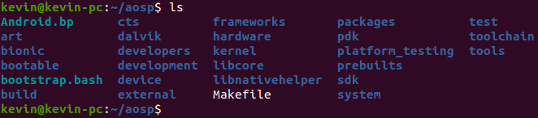

### 编译源码

```shell
#命令一
source build/envsetup.sh 

#命令二
lunch  
26. aosp_x86_64-eng #选择x86

#或者直接选择指定的编译版本
lunch aosp_x86_64-eng
```

- 命令一：加载 AOSP 编译环境：该脚本定义了编译 Android 所需的函数、环境变量和别名（如 mm、mma 等快捷命令）。
- 命令二：选择目标编译配置：指定编译的 Android 版本、CPU 架构和构建类型。eng表示构建类型为 **Engineer (eng)**，包含调试工具和 root 权限。 


然后使用`make`来编译

```shell
m #自动根据cpu情况选择线程数

make -j16 #指定16线程
```

> 第一次差不多2个半小时，编译的结果在`out/target/product`下

然后使用emulator命令起模拟器和Android系统：

```shell
emulator -verbose -cores 4 -show-kernel
#也可以不带参数运行模拟器可以直接emulator命令
```

> | 参数           | 说明                                                         |
> | -------------- | ------------------------------------------------------------ |
> | `emulator`     | 启动 Android 模拟器（假设你已经安装了 AVD，Android Virtual Device） |
> | `-verbose`     | 以详细模式输出日志，可以看到模拟器启动过程中的调试信息，便于排查问题（模拟器本身运行问题） |
> | `-cores 4`     | 指定模拟器使用的 CPU 核心数为 4 个（模拟多核设备）           |
> | `-show-kernel` | 显示内核输出信息（通常用于调试内核启动过程）                 |

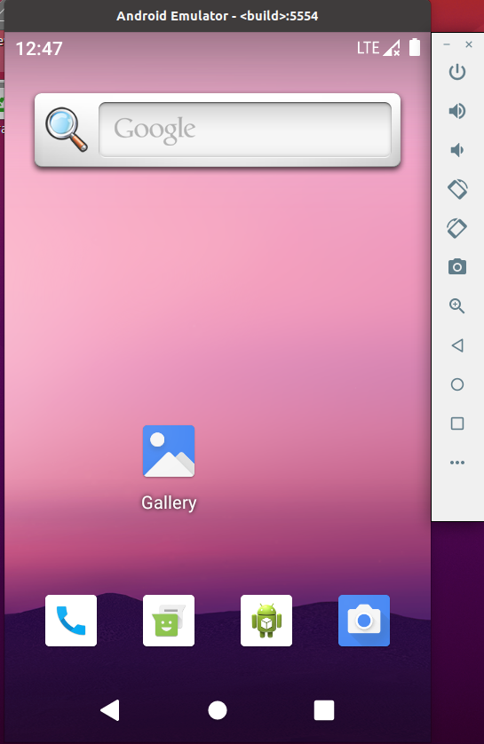

> 如果要持续输出日志：
>
> ```shell
> emulator -logcat '*:e' #输出error的日志
> ```
>
> **如果模拟器以及启动，可以在另一个终端打日志**
>
> ```shell
> adb logcat *:E
> 
> adb logcat -s '*:E' -v color
> ```
>
> 

### 初次修改源码

**首次简单的修改源码，去掉谷歌搜索框**

> 通过vscode远程连接，连接过程参考vscode笔记

修改 `packages/apps/Launcher3/res/layout/search_container_workspace.xml`，将以下内容注释掉： 

```xml
<fragment
          android:name="com.android.launcher3.qsb.QsbContainerView$QsbFragment"
          android:layout_width="match_parent"
          android:tag="qsb_view"
          android:layout_height="match_parent"/>
```

修改文件： `packages/apps/Launcher3/src/com/android/launcher3/Workspace.java` 将以下内容注释掉 

```shell
CellLayout.LayoutParams lp = new CellLayout.LayoutParams(0, 0, firstPage.getCountX(), 1);
lp.canReorder = false;
if (!firstPage.addViewToCellLayout(qsb, 0, R.id.search_container_workspace, lp, true)) {
     Log.e(TAG, "Failed to add to item at (0, 0) to CellLayout");
 }
```

再重新编译运行


## 3.常用开发工具

- Tabby：ssh客户端工具
- Vim
- samba服务器搭建： 一款数据共享的软件，可用于 Ubuntu 与 Windows 之间共享源代码 
- AIDEGen+AndroidStudio

### AIDEGen+AS

首先进入源码目录，编译sdk

```shell
source build/envsetup.sh
lunch sdk-eng
# or
#lunch sdk-userdebug
# or
#lunch sdk-user
make sdk
```

> **！！！！！！这个编译sdk一直不成功，不知道是内存不足原因还是什么，直接放弃**

## 4.Product

在 App 的开发中，要去打渠道包，根据不同应用市场的要求打包出不同的 apk 包。

同样的道理，Android 的系统源码，经过简单的配置，可以打包出不同的系统镜像，用于不同的产品。 配置文件成为product，例如前面编译的时候的：`aosp_x86_64-eng`就属于一个product。

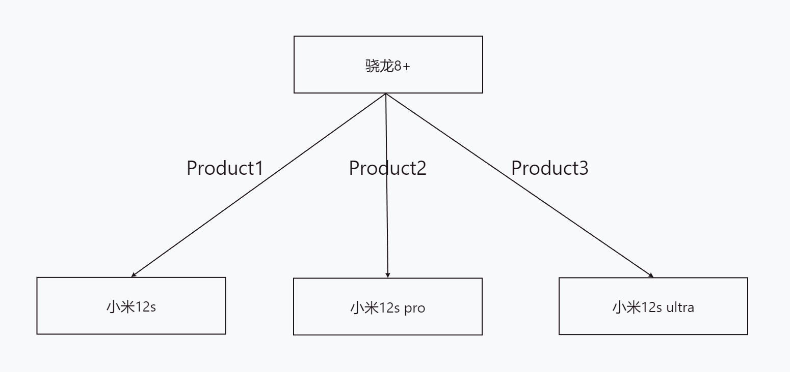 


### *aosp预制product

通过`lunch`命令，可以查看aosp预制的product列表

```shell
lunch

You're building on Linux

Lunch menu... pick a combo:
     1. aosp_arm-eng
     2. aosp_arm64-eng
...
     25. aosp_x86-eng
     26. aosp_x86_64-eng
...

Which would you like? [aosp_arm-eng]
```


#### **product文件主要存在两个目录下面：**

- `build/target`：存放模拟器相关的product文件
- `device`：存放芯片以及方案厂商提供的product配置文件

查看`build/target`目录下的结构：

- board：主要是**硬件相关**配置
- product：主要是产品相关配置

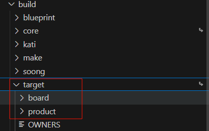

> 也可以通过tree命令查看目录结构
>
> ```shell
> tree ./build/target -L 2
> ```


**选择aosp_x86_64-eng，主要关注下面文件：**

- `/board/generic_x86_64/BoardConfig.mk` ： 用于硬件相关配置，包括硬件芯片架构配置、分区大小等等
- `/product/AndroidProducts.mk` 、`/product/aosp_x86_64.mk`：用于配置 Product


**`/board/generic_x86_64/BoardConfig.mk`**内容：

```makefile
# x86_64 emulator specific definitions
TARGET_CPU_ABI := x86_64
TARGET_ARCH := x86_64
TARGET_ARCH_VARIANT := x86_64

TARGET_2ND_CPU_ABI := x86
TARGET_2ND_ARCH := x86
TARGET_2ND_ARCH_VARIANT := x86_64

TARGET_PRELINK_MODULE := false
include build/make/target/board/BoardConfigGsiCommon.mk #通用系统映像的配置
include build/make/target/board/BoardConfigEmuCommon.mk #模拟器的配置

BOARD_USERDATAIMAGE_PARTITION_SIZE := 576716800

BOARD_SEPOLICY_DIRS += device/generic/goldfish/sepolicy/x86

# Wifi.
BOARD_WLAN_DEVICE           := emulator
BOARD_HOSTAPD_DRIVER        := NL80211
BOARD_WPA_SUPPLICANT_DRIVER := NL80211
BOARD_HOSTAPD_PRIVATE_LIB   := lib_driver_cmd_simulated
BOARD_WPA_SUPPLICANT_PRIVATE_LIB := lib_driver_cmd_simulated
WPA_SUPPLICANT_VERSION      := VER_0_8_X
WIFI_DRIVER_FW_PATH_PARAM   := "/dev/null"
WIFI_DRIVER_FW_PATH_STA     := "/dev/null"
WIFI_DRIVER_FW_PATH_AP      := "/dev/null"
```


**`/product/AndroidProducts.mk`**

主要是定义了lunch所选择编译目标的判断逻辑

```makefile
ifneq ($(TARGET_BUILD_APPS),)
PRODUCT_MAKEFILES := \
    $(LOCAL_DIR)/aosp_arm64.mk \
    $(LOCAL_DIR)/aosp_arm.mk \
    $(LOCAL_DIR)/aosp_x86_64.mk \
    $(LOCAL_DIR)/aosp_x86.mk \
    $(LOCAL_DIR)/full.mk \
    $(LOCAL_DIR)/full_x86.mk \

else
PRODUCT_MAKEFILES := \
    $(LOCAL_DIR)/aosp_arm64_ab.mk \
    $(LOCAL_DIR)/aosp_arm64.mk \
    $(LOCAL_DIR)/aosp_arm_ab.mk \
    $(LOCAL_DIR)/aosp_arm.mk \
    $(LOCAL_DIR)/aosp_x86_64_ab.mk \
    $(LOCAL_DIR)/aosp_x86_64.mk \
    $(LOCAL_DIR)/aosp_x86_ab.mk \
    $(LOCAL_DIR)/aosp_x86_arm.mk \
    $(LOCAL_DIR)/aosp_x86.mk \
    $(LOCAL_DIR)/full.mk \
    $(LOCAL_DIR)/full_x86.mk \
    $(LOCAL_DIR)/generic.mk \
    $(LOCAL_DIR)/generic_x86.mk \
    $(LOCAL_DIR)/gsi_arm64.mk \
    $(LOCAL_DIR)/mainline_arm64.mk \
    $(LOCAL_DIR)/mainline_system_arm64.mk \
    $(LOCAL_DIR)/sdk_arm64.mk \
    $(LOCAL_DIR)/sdk.mk \
    $(LOCAL_DIR)/sdk_phone_arm64.mk \
    $(LOCAL_DIR)/sdk_phone_armv7.mk \
    $(LOCAL_DIR)/sdk_phone_x86_64.mk \
    $(LOCAL_DIR)/sdk_phone_x86.mk \
    $(LOCAL_DIR)/sdk_x86_64.mk \
    $(LOCAL_DIR)/sdk_x86.mk \

endif

COMMON_LUNCH_CHOICES := \
    aosp_arm64-eng \ 
    aosp_arm-eng \
    aosp_x86_64-eng \
    aosp_x86-eng \
```

COMMON_LUNCH_CHOICES 用于添加 lunch 时的选项，选项的名字由两部分过程 `产品名 + 构建模式`：

- 产品名就是 PRODUCT_MAKEFILES 中引入的产品配置文件名去掉 `.mk` 后缀，例如 aosp_x86_64

- **构建模式**有三种：用户模式 user、用户调试模式 userdebug 和工程模式 eng

  > | 特性                               | `eng`                      | `userdebug`                  | `user`           |
  > | ---------------------------------- | -------------------------- | ---------------------------- | ---------------- |
  > | 编译内容                           | 包含全部开发工具、测试接口 | 接近 user，额外加 debug 特性 | 精简、关闭 debug |
  > | ADB 默认开启                       | ✅（无需授权）              | ✅（需授权）                  | ✅（需授权）      |
  > | Root 权限支持                      | ✅                          | ✅                            | ❌                |
  > | 调试命令（如 `adb root`）          | ✅ 无限制                   | ✅ 有限制                     | ❌ 禁止使用       |
  > | 默认编译选项（如 `ro.debuggable`） | `1`                        | `1`                          | `0`              |
  > | 是否允许修改系统属性               | ✅                          | ✅                            | ❌                |
  > | 是否适合日常用户使用               | ❌ 仅开发者使用             | ❌ 部分适合测试               | ✅ 推荐发布版本   |
  > | 默认打开的 SELinux 模式            | `permissive`               | `enforcing`                  | `enforcing`      |

> **上面是.mk文件的代码，涉及GNU make的语法，这里不具体说明了**

### *自制Product

**假设公司名叫Kevin，准备开发一款手机名叫Rice16**

首先在`device`目录下添加如下目录和文件：

```shell
Kevin/
└── Rice16
    ├── AndroidProducts.mk
    ├── BoardConfig.mk
    └── Rice16.mk
```

- `BoardConfig.mk`配置直接拷贝build/target/board/generic_x86_64中`BoardConfig.mk`内容即可

- `Rice16.mk`拷贝` build/target/product/aosp_x86_64.mk `

  > 需要注释掉其中的if判断、修改最后四行配置的名称
  >
  > ```makefile
  > 
  > PRODUCT_USE_DYNAMIC_PARTITIONS := true
  > 
  > # GSI for system/product
  > $(call inherit-product, $(SRC_TARGET_DIR)/product/core_64_bit.mk)
  > $(call inherit-product, $(SRC_TARGET_DIR)/product/gsi_common.mk)
  > 
  > # Emulator for vendor
  > $(call inherit-product-if-exists, device/generic/goldfish/x86_64-vendor.mk)
  > $(call inherit-product, $(SRC_TARGET_DIR)/product/emulator_vendor.mk)
  > $(call inherit-product, $(SRC_TARGET_DIR)/board/generic_x86_64/device.mk)
  > 
  > # Enable mainline checking for excat this product name
  > # ifeq (aosp_x86_64,$(TARGET_PRODUCT))
  > PRODUCT_ENFORCE_ARTIFACT_PATH_REQUIREMENTS := relaxed
  > # endif
  > 
  > PRODUCT_ARTIFACT_PATH_REQUIREMENT_WHITELIST += \
  >     root/init.zygote32_64.rc \
  >     root/init.zygote64_32.rc \
  > 
  > # Copy different zygote settings for vendor.img to select by setting property
  > # ro.zygote=zygote64_32 or ro.zygote=zygote32_64:
  > #   1. 64-bit primary, 32-bit secondary OR
  > #   2. 32-bit primary, 64-bit secondary
  > # init.zygote64_32.rc is in the core_64_bit.mk below
  > PRODUCT_COPY_FILES += \
  >     system/core/rootdir/init.zygote32_64.rc:root/init.zygote32_64.rc
  > 
  > PRODUCT_NAME := Rice16
  > PRODUCT_DEVICE := Rice16
  > PRODUCT_BRAND := Rice16
  > PRODUCT_MODEL := AOSP on x86_64 Rice16
  > ```

- ` AndroidProducts.mk `内容：

  ```makefile
  PRODUCT_MAKEFILES :=\
  	$(LOCAL_DIR)/Rice16.mk
  
  COMMON_LUNCH_CHOICES :=\
  	Rice16-eng \
  	Rice16-userdebug \
  	Rice16-user
  ```

然后进行验证：

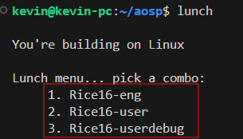

## 5.添加可执行程序

### 前言：ARM+Android行业开发流程

从aosp源码开始，基于ARM的底层代码涉及封装流程可以简单归纳如下：

1. Google 开发迭代 AOSP + Kernel
2. 芯片厂商， （如 Qualcomm、MTK、Rockchip） 针对自己的芯片特点，移植 AOSP 和 Kernel，使其可以在自己的芯片上跑起来。
3. 方案厂商（很多芯片厂商也扮演了方案厂商的角色）ODM，设计电路板，给芯片添加外设，在芯片厂商源码基础上开发外设相关的驱动和 HAL，改进性能和稳定性。
4. 产品厂商，主要是系统软件开发，UI 定制以及硬件上的定制(添加自己的外设)，改进性能和稳定性.

> 对于上面提到的ODM和OEM，GPT给出的解释是：
>
> **ODM（设计与制造）**
>
> - 承接品牌商（或 ODM 自己也会有白牌业务）的需求，负责整块板卡、SoC 方案的原始设计与初步验证。
> - 通常与芯片厂商（Qualcomm、MediaTek、Unisoc 等）和模具厂紧密合作。
> - 完成硬件原型后，把设计资料（Gerber、BOM、驱动源码、设备树）交给 OEM。
>
> **OEM（品牌与整机）**
>
> - 以自己的品牌面向市场，采购 ODM（或自己内部）设计出的硬件，做外观、包装、品牌定制。
> - 负责系统整合：将 AOSP、第三方库和应用、品牌定制 UI/服务打包成最终固件。
> - 做认证、量产测试、物流和售后。
>
>  **ODM 聚焦硬件设计，OEM 聚焦整机品牌和系统定制。** 


### *Android分区

常用的四个分区（此分区是指在**编译之后根据源码组织结构、构建配置规则而生成的镜像文件**，并不是源码里直接存在的“分区目录” ）：

- System 分区：

  Google 开发的通用 Android 系统组件编译后会被存放到 System 分区，原则上不同厂商、不同型号的设备都通用。 

- Vender 分区：

   **芯片厂商**和**方案厂商**针对硬件相关的平台通用的可执行程序、库、系统服务和 app 等一般放到 Vender 分区。（部分内核驱动程序是放在 boot 分区的 kernel 部分） 

- Odm 分区：

    存放不同产品板型适配的`硬件`差异化组件 （例如谷歌开发的产品A用的京东方屏，产品B用的三星屏）。公用部分放到vender

- Product 分区：

   存放不同产品线、品牌、地区的定制`软件`内容（如 Launcher、UI 风格、预装应用、品牌服务等；例如：产品A带广告，产品B不带广告）；公用的部分放在System分区


### *添加可执行c/c++程序

#### 源码添加

首先在之前的`device/Kevin/Rice16`目录下创建如下结构：

```shell
hello
├── Android.bp
└── hello.cpp
```

```cpp
#include <cstdio>

int main()
{
    printf("Hello Android\n");
    return 0;
}
```

```json
//Android.bp
cc_binary{ //模块类型为可执行文件
    name:"hello", //模块名hello
    srcs:["hello.cpp"], //源文件列表
    cflags:["-Werror"] //添加编译选项
}
```


**<a name=singlemodel>①只进行单模块编译</a>**，仅编译hello目录

模拟器一定要以`-writable-system`启动，因为后面涉及到system分区覆盖重写

```shell
emulator -writable-system -selinux permissive -no-snapshot 
```

> | 选项                    | 启动时     | 退出时     | 适用场景               |
> | :---------------------- | :--------- | :--------- | :--------------------- |
> | **`-no-snapshot`**      | 不加载快照 | 不保存快照 | 系统开发，修改系统分区 |
> | **`-no-snapshot-load`** | 不加载快照 | 保存快照   | 创建新快照             |
> | **`-no-snapshot-save`** | 加载快照   | 不保存快照 | 临时测试，不保留更改   |
> | (默认)                  | 加载快照   | 保存快照   | 普通应用开发           |

然后编译对应的模块

```shell
source build/envsetup.sh
lunch #然后选择我们的Rice16-eng

#在进入到hello目录
cd device/Kevin/Rice16/hello/
mm #单模块编译
```

之后重新挂载，重新写入system分区

```shell
adb root
adb remount
adb sync      # 将新的 system/framework/... 推送到模拟器
adb reboot    # 重启模拟器让系统加载新的类文件
```


**②进行整编**

在`Rice16.mk`中，添加：

```makefile
PRODUCT_PACKAGES += hello
```

再次编译系统

```shell
source build/envsetup.sh
lunch Rice14-eng
make -j16
```

**会发现编译失败，这是因为：**

> **默认情况下，我们的模块会被安装到 System 分区，编译系统限制了我们在 System 分区添加东西，理论上来说， System 分区应该只能由 Google 来添加和修改内容。** 

因此解决思路有两个，**要么想办法继续安装到System分区，要么装到product分区。**

- **装到System分区，可以观察google是怎么做的，然后效仿即可：**

> - 找个原生系统中预制的 app，看下它的 Android.mk 或者 Android.bp
>- build/target 中搜一下这个 app 是怎么添加的
> 
> app一般定义在`packages/apps`目录中，就以Messaging为例，看它的Android.mk。
>
> 没什么特殊的，就是它的模块名叫messaging，那么打包出来就应该是`messaging.apk`
>
> ```makefile
>LOCAL_PACKAGE_NAME := messaging
> ```
> 
> 接着在`build/target`目录下搜索
>
> ```shell
>kevin@kevin-pc:~/aosp$ grep -r "messaging.apk" build/target
> build/target/product/gsi_common.mk:    system/app/messaging/messaging.apk \
> ```
> 
> 查看`gsi_common.mk`，可以找到原因，是因为设置了白名单
>
> ```makefile
>PRODUCT_ARTIFACT_PATH_REQUIREMENT_WHITELIST += \
>  system/app/messaging/messaging.apk \
>  system/app/WAPPushManager/WAPPushManager.apk \
>     system/bin/healthd \
>     system/etc/init/healthd.rc \
>     system/etc/seccomp_policy/crash_dump.%.policy \
>     system/etc/seccomp_policy/mediacodec.policy \
>     system/etc/vintf/manifest/manifest_healthd.xml \
>     system/lib/libframesequence.so \
>     system/lib/libgiftranscode.so \
>     system/lib64/libframesequence.so \
>     system/lib64/libgiftranscode.so \
>    ```
>    
> 因此效仿做法，写到`Kevin/Rice16/Rice16.mk`中
>
> ```makefile
>PRODUCT_ARTIFACT_PATH_REQUIREMENT_WHITELIST += \
>  system/bin/hello \
> ```
>    
> 这次可以编译成功

- **装到product分区，比较推荐的方式**

> 在其 Android.bp 中添加 product_specific: true 即可： 
>
>  ```shell
>cc_binary{
>  name:"hello",
>  srcs:["hello.cpp"],
>     cflags:["-Werror"],
>     product_specific: true
>    }
>    ```

**这里给出一个安装位置配置的总结：**

- System 分区
  - Android.mk 默认就是输出到 system 分区，不用指定
  - Android.bp 默认就是输出到 system 分区，不用指定
- Vendor
  - Android.mk ——LOCAL_VENDOR_MODULE := true
  - Android.bp ——vendor: true
- Odm 分区
  - Android.mk ——LOCAL_ODM_MODULE := true
  - Android.bp ——device_specific: true
- product 分区
  - Android.mk ——LOCAL_PRODUCT_MODULE := true
  - Android.bp ——product_specific: true


**验证是否可执行**

加载编译环境，然后运行模拟器

```shell
source build/envsetup.sh
lunch Rice16-eng
emulator
```

再新开一个窗口，进入`adb shell`，可以看到在product的bin目录下会有hello

```shell
ls product/bin/
hello
```

运行hello文件

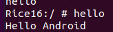

#### 可执行文件添加

如果只有可执行文件，而没有源码，那应该如何添加呢：

 BusyBox 是打包为单个二进制文件的核心 Unix 实用程序的集合。常用于嵌入式设备。 

以添加BusyBox为例子：

```shell
wget https://busybox.net/downloads/binaries/1.30.0-i686/busybox
```

然后添加到aosp中，在`Rice16/`目录下

```shell
prebuilt/
└── busybox
    ├── Android.bp
    └── busybox
```

Android.bp的内容

```json
cc_prebuilt_binary {
    name: "busybox",
    srcs: ["busybox"],
    product_specific: true,
}
```

并且在 `device/Kevin/Rice16/Rice16.mk` 中添加该模块 

```shell
PRODUCT_PACKAGES += hello\
	busybox
```

然后编译代码，启动模拟器，并在adb shell中执行busybox

```shell
adb shell
busybox
```


### *添加可执行Java程序

#### 源码添加

其实基本步骤和前面类似

创建一个`hellojava`目录，并且bp和java代码

```
device/Kevin/Rice16/hellojava/
├── Android.bp
└── com
    └── kevin
        └── main
            └── Hello.java
```

bp的内容

```json
java_library{
    name:"Hello",
    installable: true,
    product_specific: true,
    srcs:["**/*.java"],
}
```

> 如果不指定 installable: true, 则编译出来的 jar 包里面是 .class 文件。这种包是没法安装到系统上的，只能给其他 java 模块作为 static_libs 依赖。 因为Android虚拟机只加载.dex文件

java文件内容

```java
package com.kevin.main;

public class Hello
{
	public static void main(String[] args) 
	{
		System.out.println("Hello Java");
	}
}
```

并且在`Rice16.mk`中添加

```makefile
PRODUCT_PACKAGES += hello\
    Hello
```

之后重新编译并且启动虚拟机，然后可以看到`product/framework`目录下有打包好的jar文件

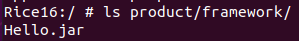

运行：

```shell
# 配置 classpath
export CLASSPATH=/product/framework/Hello.jar 
app_process /product/framework/ com.kevin.main.Hello
```

> | 部分                   | 含义                                                         |
> | ---------------------- | ------------------------------------------------------------ |
> | `app_process`          | Android 的一个工具，用于从 shell 启动 Java 程序，并运行在 Android 的进程环境中（不是标准 JVM，而是 ART/Dalvik） |
> | `/product/framework/`  | 设置为 Java 类执行时的起始目录（影响 `HelloJava` 的类查找）  |
> | `com.kevin.main.Hello` | 要运行的 Java 主类（必须含有 `public static void main(String[] args)` 方法） |

#### 可执行jar包添加

 在 `device/kevin/Rice16/` 目录下创建以下的目录和文件： 

```
hellojavajar
├── Android.bp
└── Hello.jar
```

> Hello.jar是从 out/target/product/Rice16/system/product/framework/Hello.jar拷贝过来的

android.bp内容

```json
java_import { //这里有变化
    name: "hellojavajar",
    installable: true,
    jars: ["Hello.jar"],
    product_specific: true,   
}
```

为了避免冲突，把 hellojava 文件夹删除。在 `device/Jelly/Rice14/Rice14.mk` 中删除已添加的 hellojava 模块。并重新添加 javahellojar 模块 

```makefile
PRODUCT_PACKAGES += \
    hellojavajar
```

然后重新编译，启动模拟器，再执行程序

```shell
# 配置 classpath
export CLASSPATH=/product/framework/Hello.jar 
app_process /product/framework/ com.kevin.main.Hello
```


## 6.添加配置文件与删除已有模块

### 添加配置文件

`PRODUCT_COPY_FILES` 是一个**预定义的构建系统变量**，用于指定在构建过程中需要复制的文件列表，用来复制构成中需要的配置。在前面提到的`Rice16.mk`等`mk`文件中

```makefile
PRODUCT_COPY_FILES += system/core/rootdir/init.zygote64_32.rc:system/etc/init/hw/init.zygote64_32.rc
```

> 这一行表示将源码中的 `system/core/rootdir/init.zygote64_32.rc` 拷贝到 Android 文件系统的 system/etc/init/hw/init.zygote64_32.rc 文件中。
>
> init.zygote64_32.rc 是 init 程序使用的一个配置文件

**`PRODUCT_COPY_FILES`是预定义的变量，不可以轻易改名，可以通过自定义变量然后追加的方式**

```makefile
MY_FILES := \
    system/core/rootdir/init.zygote64_32.rc:system/etc/init/hw/init.zygote64_32.rc \
    vendor/foo/bar:system/etc/bar

PRODUCT_COPY_FILES += $(MY_FILES)
```


### 删除已有模块

以删除通信录(Contacts)为例。删掉其中的Contacts

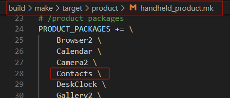

然后重新编译运行

> 没成功过，修改了重新编译报错，不知道为什么


## 7.添加系统APP

在AS新建一个项目，包名:`com.yuandaima.firstsystemapp`

然后在aosp源代码目录下创建同样的目录，如下：

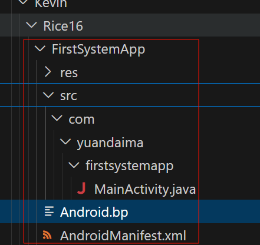

接着把创建好的AS项目对应目录下文件拷贝到aosp源码中

修改manifest文件

```xml
<?xml version="1.0" encoding="utf-8"?>
<manifest xmlns:android="http://schemas.android.com/apk/res/android"
    package="com.yuandaima.firstsystemapp">

    <application
        android:allowBackup="true"
        android:fullBackupContent="@xml/backup_rules"
        android:icon="@mipmap/ic_launcher"
        android:label="@string/app_name"
        android:roundIcon="@mipmap/ic_launcher_round"
        android:supportsRtl="true"
        android:theme="@style/MySystemApp">
        <activity
            android:name=".MainActivity"
            android:exported="true">
            <intent-filter>
                <action android:name="android.intent.action.MAIN" />

                <category android:name="android.intent.category.LAUNCHER" />
            </intent-filter>
            <meta-data
                android:name="android.app.lib_name"
                android:value="" />
        </activity>
    </application>

</manifest>
```

修改`Android.bp`文件

```
android_app {
    name: "FirstSystemApp",

    srcs: ["src/**/*.java"],

    resource_dirs: ["res"],

    manifest: "AndroidManifest.xml",

    platform_apis: true,
    
    sdk_version: "",

    certificate: "platform",

    product_specific: true,

    //依赖
    static_libs: ["androidx.appcompat_appcompat",
                 "com.google.android.material_material",
                 "androidx-constraintlayout_constraintlayout"],
}
```

最后在Rice16.mk文件中添加product

```makefile
PRODUCT_PACKAGES += \
    FirstSystemApp
```

重新编译然后运行

> 这里我之前编译了很多次，都失败，报错都是没有使用theme，加上也说没找到。
>
> 之后不知道怎的又可以了，虽然编译成功但是app打不开，报错。最后删除了编译的目录重新编译才可以，真是一波三折啊。


### 系统APP和普通APP区别

- 系统APP可以使用更多API

- 系统APP签名更复杂灵活

- 系统APP能够使用更多权限

- 系统APP能更轻松实现进程保活

  > 添加参数即可
  >
  > ```xml
  > <application
  >     android:persistent="true">
  > ```


### *系统APP如何添加依赖

在Android.bp中可以看到下面配置项目，这个就是添加的依赖

```
 //依赖
    static_libs: ["androidx.appcompat_appcompat",
                 "com.google.android.material_material",
                 "androidx-constraintlayout_constraintlayout"],
```

试图搜索一下这些依赖的位置，发现常用的AndroidX库在` prebuilts/sdk/current/androidx `下面

```shell
find . -name "Android.bp" | xargs grep "androidx.appcompat_appcompat"
```


```
android_library {
    name: "androidx.recyclerview_recyclerview",
    sdk_version: "31",
    apex_available: [
        "//apex_available:platform",
        "//apex_available:anyapex",
    ],
    min_sdk_version: "14",
    manifest: "manifests/androidx.recyclerview_recyclerview/AndroidManifest.xml",
    static_libs: [
        "androidx.recyclerview_recyclerview-nodeps",
        "androidx.annotation_annotation",
        "androidx.collection_collection",
        "androidx.core_core",
        "androidx.customview_customview",
    ],
    java_version: "1.7",
}
```

 引入的是一个 `android_library`，名字叫 `androidx.recyclerview_recyclerview`。maifest 文件在 `manifests/androidx.recyclerview_recyclerview/` 目录下，进入这个目录只有一个 `AndroidManifest.xml` 文件，并没有源码，再往下看Android.bp的依赖

```
android_library_import {
    name: "androidx.recyclerview_recyclerview-nodeps",
    aars: ["m2repository/androidx/recyclerview/recyclerview/1.1.0-alpha07/recyclerview-1.1.0-alpha07.aar"],
    sdk_version: "current",
    min_sdk_version: "14",
    static_libs: [
        "androidx.annotation_annotation",
        "androidx.collection_collection",
        "androidx.core_core",
        "androidx.customview_customview",
    ],
}
```

可以看大aar库的位置，继续查找发现 `prebuilts/tools/common/m2` 目录下引入了大量的三方库 

**因此总结来说：**

当系统 App 需要引入一个库的时候，通常会在 `prebuilds` 目录下查找：

- androidx 相关库引入，先在 `prebuilts/sdk/current/androidx `下寻找配置好的 bp 文件
- 其他库引入，先在 `prebuilts/tools/common/m2 `下寻找寻找配置好的 bp 文件


### *系统APP添加不存在的依赖

#### Android库源码引入

在Rice16目录下创建一个库，结构如下

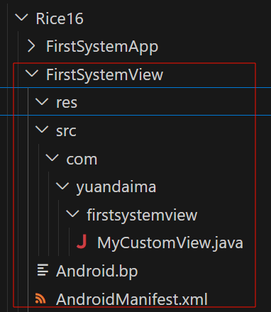

```java
public class MyCustomView extends View {
    public MyCustomView(Context context) {
        super(context);
    }

    public MyCustomView(Context context, @Nullable AttributeSet attrs) {
        super(context, attrs);
    }

    public MyCustomView(Context context, @Nullable AttributeSet attrs, int defStyleAttr) {
        super(context, attrs, defStyleAttr);
    }

    public MyCustomView(Context context, @Nullable AttributeSet attrs, int defStyleAttr, int defStyleRes) {
        super(context, attrs, defStyleAttr, defStyleRes);
    }


    @Override
    protected void onDraw(Canvas canvas) {
        float pointerX = 200f;
        float pointerY = 200f;
        float pointerSize = 50f; // 半径为 50 像素

        Paint mTextPaint = new Paint();
        mTextPaint.setColor(Color.BLUE);       // 设置颜色
        mTextPaint.setStyle(Paint.Style.FILL); // 填充圆形（或 STROKE 描边）
        mTextPaint.setAntiAlias(true);         // 抗锯齿，边缘更平滑

        canvas.drawCircle(pointerX, pointerY, pointerSize, mTextPaint);
    }
}
```

`Android.bp`内容

```json
android_library  {
    name: "FirstSystemView",
    srcs: ["src/**/*.java"],
    resource_dirs: ["res"],
    manifest: "AndroidManifest.xml",
    sdk_version: "current",
    product_specific: true,
    //依赖
    static_libs: ["androidx.appcompat_appcompat",],
    java_version: "1.7",
    installable: true,
}
```

`AndroidManifest.xml`

```xml
<?xml version="1.0" encoding="utf-8"?>
<manifest xmlns:android="http://schemas.android.com/apk/res/android"
 package="com.yuandaima.firstsystemview">

</manifest>
```


**然后在之前的FirstSystemApp中引入这个自定义库**

```xml
<com.yuandaima.firstsystemview.MyCustomView
        android:layout_width="200dp"
        android:layout_height="200dp"
    />
```

```java
//依赖
static_libs: ["androidx.appcompat_appcompat",
              "com.google.android.material_material",
              "androidx-constraintlayout_constraintlayout",
              "FirstSystemView"],
```

之后重新编译即可：

> 单独编译两个模块，然后重新挂载即可，单模块编译[参考](#singlemodel)

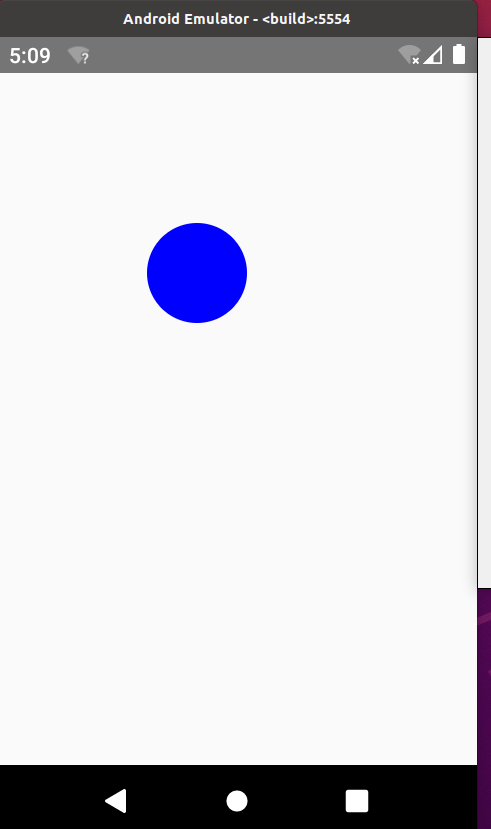


#### Android库以aar引入

更多的时候 Android 库是以 aar 包的形式引入。

假设 FirstSystemApp 需要引入 lottie 这个动画库。

首先[这里](https://repo1.maven.org/maven2/com/airbnb/android/lottie/5.2.0/)下载好 lottie 库的 aar 打包文件。

在 `device/Jelly/Rice14` 目录下创建如下的目录结构：

```
liblottie/
├── Android.bp
└── lottie-5.2.0.aar
```

 其中 `Android.bp`的内容如下： 

```json
android_library_import {
    name: "lib-lottie",
    aars: ["lottie-5.2.0.aar"],
    sdk_version: "current",
}
```

 然后在FirstSystemApp中的 Android.bp 引入这个库： 

```json
static_libs: ["androidx.appcompat_appcompat",
              "com.google.android.material_material",
              "androidx-constraintlayout_constraintlayout",
              "FirstSystemView",
              "lib-lottie"],
```


#### 引入JNI项目

创建项目`FirstJni`，目录结构如下：

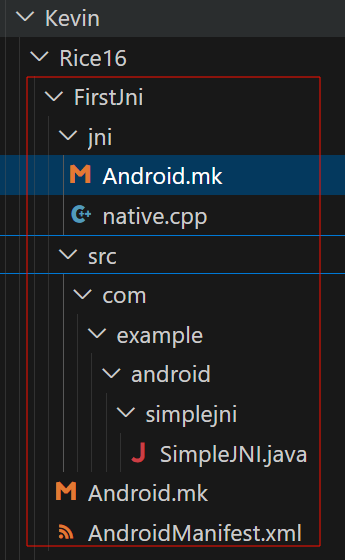

`jni/Android.mk`中的内容

```makefile
LOCAL_PATH:= $(call my-dir)
include $(CLEAR_VARS)

LOCAL_MODULE_TAGS := optional

# This is the target being built.
LOCAL_MODULE:= myjnilib


# All of the source files that we will compile.
LOCAL_SRC_FILES:= \
    native.cpp

# All of the shared libraries we link against.
LOCAL_LDLIBS := -llog

# No static libraries.
LOCAL_STATIC_LIBRARIES :=

LOCAL_CFLAGS := -Wall -Werror

LOCAL_NDK_STL_VARIANT := none

LOCAL_SDK_VERSION := current

LOCAL_PRODUCT_MODULE := true

include $(BUILD_SHARED_LIBRARY)
```


`native-cpp`中内容

```cpp
#define LOG_TAG "simplejni native.cpp"
#include <android/log.h>

#include <stdio.h>

#include "jni.h"

#define ALOGV(...) __android_log_print(ANDROID_LOG_VERBOSE, LOG_TAG, __VA_ARGS__)
#define ALOGD(...) __android_log_print(ANDROID_LOG_DEBUG, LOG_TAG, __VA_ARGS__)
#define ALOGI(...) __android_log_print(ANDROID_LOG_INFO, LOG_TAG, __VA_ARGS__)
#define ALOGW(...) __android_log_print(ANDROID_LOG_WARN, LOG_TAG, __VA_ARGS__)
#define ALOGE(...) __android_log_print(ANDROID_LOG_ERROR, LOG_TAG, __VA_ARGS__)

static jint
add(JNIEnv* /*env*/, jobject /*thiz*/, jint a, jint b) {
    int result = a + b;
    ALOGI("%d + %d = %d", a, b, result);
    return result;
}

static const char *classPathName = "com/example/android/simplejni/Native";

static JNINativeMethod methods[] = {
    {"add", "(II)I", (void*)add },
};

/*
 * Register several native methods for one class.
 */
static int registerNativeMethods(JNIEnv* env, const char* className,
                                 JNINativeMethod* gMethods, int numMethods)
{
    jclass clazz;

    clazz = env->FindClass(className);
    if (clazz == NULL) {
        ALOGE("Native registration unable to find class '%s'", className);
        return JNI_FALSE;
    }
    if (env->RegisterNatives(clazz, gMethods, numMethods) < 0) {
        ALOGE("RegisterNatives failed for '%s'", className);
        return JNI_FALSE;
    }

    return JNI_TRUE;
}

/*
 * Register native methods for all classes we know about.
 *
 * returns JNI_TRUE on success.
 */
static int registerNatives(JNIEnv* env)
{
    if (!registerNativeMethods(env, classPathName,
                               methods, sizeof(methods) / sizeof(methods[0]))) {
        return JNI_FALSE;
    }

    return JNI_TRUE;
}


// ----------------------------------------------------------------------------

/*
 * This is called by the VM when the shared library is first loaded.
 */

typedef union {
    JNIEnv* env;
    void* venv;
} UnionJNIEnvToVoid;

jint JNI_OnLoad(JavaVM* vm, void* /*reserved*/)
{
    UnionJNIEnvToVoid uenv;
    uenv.venv = NULL;
    jint result = -1;
    JNIEnv* env = NULL;

    ALOGI("JNI_OnLoad");

    if (vm->GetEnv(&uenv.venv, JNI_VERSION_1_4) != JNI_OK) {
        ALOGE("ERROR: GetEnv failed");
        goto bail;
    }
    env = uenv.env;

    if (registerNatives(env) != JNI_TRUE) {
        ALOGE("ERROR: registerNatives failed");
        goto bail;
    }

    result = JNI_VERSION_1_4;

    bail:
    return result;
}
```


`SimpleJni.java`内容

```java
package com.example.android.simplejni;

import android.app.Activity;
import android.os.Bundle;
import android.widget.TextView;

public class SimpleJNI extends Activity {
    /** Called when the activity is first created. */
    @Override
    public void onCreate(Bundle savedInstanceState) {
        super.onCreate(savedInstanceState);
        TextView tv = new TextView(this);
        int sum = Native.add(2, 3);
        tv.setText("2 + 3 = " + Integer.toString(sum));
        setContentView(tv);
    }
}

class Native {
    static {
    	// The runtime will add "lib" on the front and ".o" on the end of
    	// the name supplied to loadLibrary.
        System.loadLibrary("myjnilib");
    }

    static native int add(int a, int b);
}
```


`FirstJni/Android.mk`文件

```makefile
TOP_LOCAL_PATH:= $(call my-dir)

# Build activity

LOCAL_PATH:= $(TOP_LOCAL_PATH)
include $(CLEAR_VARS)

LOCAL_MODULE_TAGS := optional

LOCAL_SRC_FILES := $(call all-subdir-java-files)

LOCAL_PACKAGE_NAME := FirstJni

LOCAL_JNI_SHARED_LIBRARIES := myjnilib

LOCAL_PROGUARD_ENABLED := disabled

LOCAL_SDK_VERSION := current

LOCAL_DEX_PREOPT := false

LOCAL_PRODUCT_MODULE := true

include $(BUILD_PACKAGE)

# ============================================================

# Also build all of the sub-targets under this one: the shared library.
include $(call all-makefiles-under,$(LOCAL_PATH))
```


`AndroidManifest.xml`文件中内容

```xml
<manifest xmlns:android="http://schemas.android.com/apk/res/android"
      package="com.example.android.simplejni">
    <application android:label="Simple JNI">
        <activity android:name="SimpleJNI">
            <intent-filter>
                <action android:name="android.intent.action.MAIN" />
                <category android:name="android.intent.category.LAUNCHER" />
            </intent-filter>
        </activity>
    </application>
</manifest> 
```


同时要在`Rice16.mk`文件中添加产品包：

```makefile
PRODUCT_PACKAGES += \
    FirstSystemApp \
    FirstJni \
```


最后重新编译运行

> 这里第一次编译运行报错，报错原因是找不到`libmyjnilib.so`，去到`/system/product/app/FirstJni/lib/x86_64`下面发现so文件名字叫`myjnilib.so`
>
> 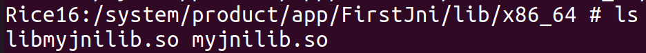
>
> 难道按照规则不是应该自动加上`lib`前缀吗？询问DS之后，改名字为`libmyjnilib.so`
>
> ```shell
> find out/ -name "myjnilib.so" -exec rename 's/myjnilib\.so$/libmyjnilib.so/' {} \;
> ```
>
> 

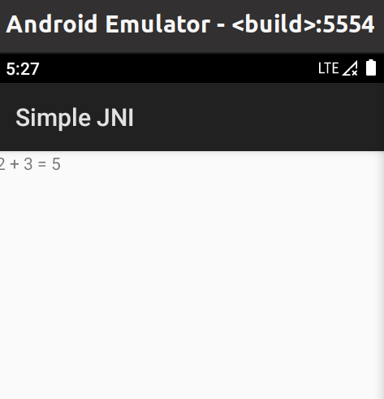


## 补充

### `Android.mk`和`Android.bp`

`Android.mk` 和 `Android.bp` 是 Android 构建系统的两种配置语言

本质上都是**描述模块如何被构建的脚本文件**，但背后代表了两个不同的构建系统。 

| 对比项     | `Android.mk`                     | `Android.bp`                              |
| ---------- | -------------------------------- | ----------------------------------------- |
| 构建系统   | **Make**（旧系统）               | **Soong**（新系统，自 Android 8 起引入）  |
| 语言       | 类似 GNU Makefile 脚本（命令式） | JSON 风格声明式语法                       |
| 语法复杂度 | 高（容易写错，调试麻烦）         | 简洁（模块属性配置清晰）                  |
| 构建入口   | `build/core/Makefile`            | `build/soong` 目录下由 `soong_build` 驱动 |
| 是否推荐   | ❌ 已逐步淘汰                     | ✅ 官方推荐使用                            |
| 转换工具   | 有 `androidmk` 工具可从 mk 转 bp | 没有反向转换工具                          |


**互相转换**

```shell
androidmk Android.mk > Android.bp
```

二者还都可以通过工具转换为ninja支持的配置文件

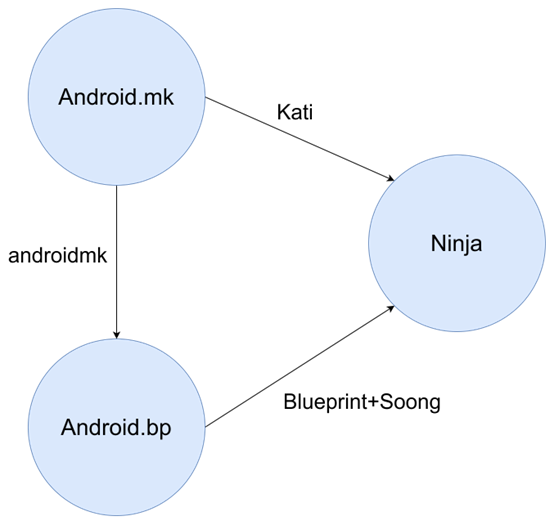


**构建流程图**

```
你写的 Android.bp
        │
        ▼
[Soong 构建系统]
        │   ← soong_build
        ▼
生成 build.ninja 构建脚本（超大一个）
        │
        ▼
[Ninja 执行器]
        │
        ▼
并发编译所有模块、产物输出到 out/
```

