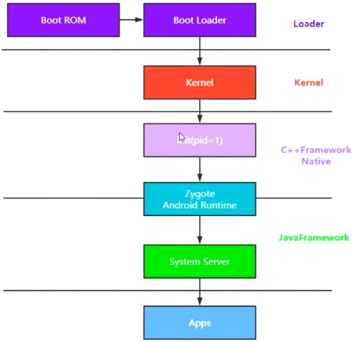
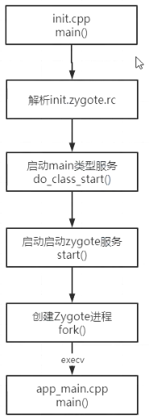
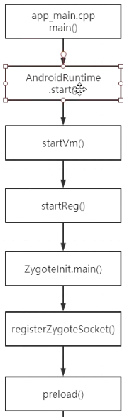
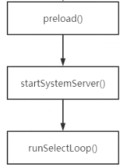
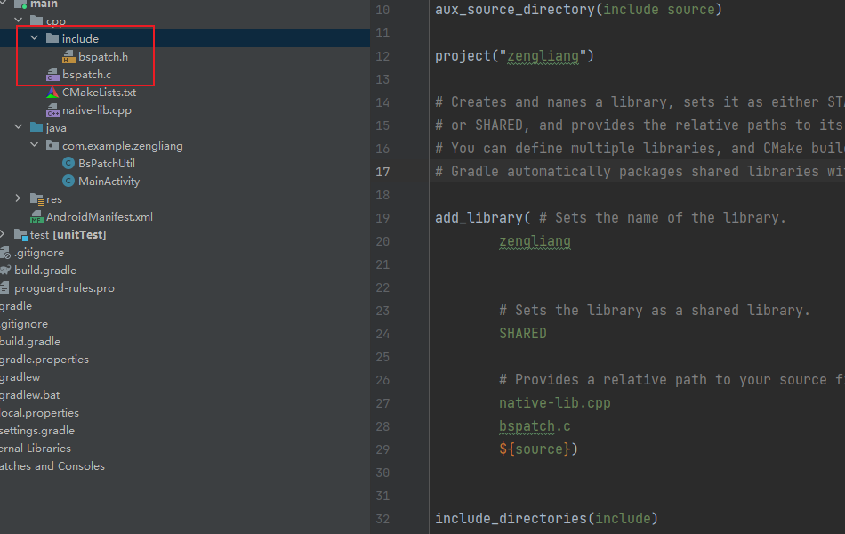
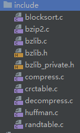
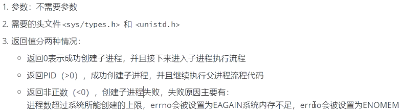

# 一、系统进程启动流程分析

> [gityuan](https://gityuan.com/)

Android平台架构组件如下：

  

> **①Linux内核**
>
> Android 平台的基础是 Linux 内核。例如，`Android Runtime (ART)`依靠 Linux 内核来执行底层功能，例如线程和低层内存管理。使用 Linux 内核可让 Android 利用主要安全功能，并且允许设备制造商为著名的内核开发硬件驱动程序。
>
> **②硬件抽象层 (HAL)** 
>
> `硬件抽象层 (HAL)`提供标准界面，向更高级别的`Java API 框架`显示设备硬件功能。HAL 包含多个库模块，其中每个模块都为特定类型的硬件组件实现一个界面，例如[相机]或[蓝牙]模块。当框架 API 要求访问设备硬件时，Android 系统将为该硬件组件加载库模块。
>
> **③Android Runtime** 
> 对于运行 Android 5.0（API 级别 21）或更高版本的设备，每个应用都在其自己的进程中运行，并且有其自己的 Android Runtime (ART) 实例。ART 编写为通过执行 DEX 文件在低内存设备上运行多个虚拟机，DEX 文件是一种专为 Android 设计的字节码格式，经过优化，使用的内存很少。编译工具链（例如 Jack）将 Java 源代码编译为 DEX 字节码，使其可在 Android 平台上运行。
>
> >  **ART 的部分主要功能包括：**
> >
> > - 预先 (AOT) 和即时 (JIT) 编译
> >
> > - 优化的垃圾回收 (GC)
> >
> > - 在 Android 9（API 级别 28）及更高版本的系统中，支持将应用软件包中的 Dalvik Executable 格式 (DEX) 文件转换为更紧凑的机器代码。
> >
> > - 更好的调试支持，包括专用采样分析器、详细的诊断异常和崩溃报告，并且能够设置观察点以监控特定字段
> >
> >   在 Android 版本 5.0（API 级别 21）之前，Dalvik 是 Android Runtime。如果您的应用在 ART 上运行效果很好，那么它应该也可在 Dalvik 上运行，但反过来不一定。
> >
> >   Android 还包含一套核心运行时库，可提供 Java API 框架所使用的 Java 编程语言中的大部分功能，包括一些 Java 8 语言功能。
>
> > **Dalvik和ART的区别：**
> > `DALVIK `和 `ART` 都是 Android 系统使用的虚拟机，用于运行 Java 应用程序。两者的主要区别在于字节码的编译方式：
> >
> > - **Dalvik 使用 Just-In-Time (JIT，即时) 编译**，即在应用程序运行时，将字节码编译为机器码。这意味着应用程序的第一次运行会比较慢，但之后的运行会比较快。
> > - **ART 使用 Ahead-Of-Time (AOT，预先) 编译**，即在应用程序安装时，将字节码编译为机器码。这意味着应用程序的第一次运行会比较快，但应用程序的大小会更大。
> >
> > **除了字节码编译方式的区别外，两者还有以下一些区别：**
> >
> > - Dalvik 使用 Dex 文件格式，而 ART 使用 Odex 文件格式。
> > - Dalvik 使用 Dalvik 虚拟机堆，而 ART 使用 ART 虚拟机堆。
> > - Dalvik 使用 Dalvik 垃圾回收器，而 ART 使用 ART 垃圾回收器。
> >
> > 总体而言，ART 比 Dalvik 具有更好的性能和安全性，但应用程序的大小会更大。
> >
> > ```
> > 从 Android 5.0 (Lollipop) 开始，ART 成为了 Android 系统的默认虚拟机。
> > ```
>
> **④原生C/C++库**
>
> 许多核心 Android 系统组件和服务（例如 ART 和 HAL）构建自原生代码，需要以 C 和 C++ 编写的原生库。Android 平台提供 Java 框架 API 以向应用显示其中部分原生库的功能。例如，您可以通过 Android 框架的 Java OpenGL API 访问 OpenGL ES，以支持在应用中绘制和操作 2D 和 3D 图形。
>
> 如果开发的是需要 C 或 C++ 代码的应用，可以使用 Android NDK 直接从原生代码访问某些原生平台库。
>
> **⑤Java API 框架 **
>
> 您可通过以 Java 语言编写的 API 使用 Android OS 的整个功能集。这些 API 形成创建 Android 应用所需的构建块，它们可简化核心模块化系统组件和服务的重复使用，包括以下组件和服务：
>
> - 丰富、可扩展的视图系统，可用以构建应用的 UI，包括列表、网格、文本框、按钮甚至可嵌入的网络浏览器
>
> - 资源管理器，用于访问非代码资源，例如本地化的字符串、图形和布局文件
>
> - 通知管理器，可让所有应用在状态栏中显示自定义提醒
>
> - Activity 管理器，用于管理应用的生命周期，提供常见的导航返回栈
>
> - 内容提供程序，可让应用访问其他应用（例如“联系人”应用）中的数据或者共享其自己的数据
>
> 开发者可以完全访问 Android 系统应用使用的框架 API。
>
> **⑥系统应用**
>
> Android 随附一套用于电子邮件、短信、日历、互联网浏览和联系人等的核心应用。平台随附的应用与用户可以选择安装的应用一样，没有特殊状态。因此第三方应用可成为用户的默认网络浏览器、短信 Messenger 甚至默认键盘（有一些例外，例如系统的“设置”应用）。
>
> 系统应用可用作用户的应用，以及提供开发者可从其自己的应用访问的主要功能。例如，如果您的应用要发短信，您无需自己构建该功能，可以改为调用已安装的短信应用向您指定的接收者发送消息。

## 1.Android系统启动流程

android系统启动的大概流程：



> **①启动电源以及系统启动**
>
> 当电源按下，引导芯片代码开始从预定义的地方（固化在ROM）开始执行。加载引
> 行。加载引导程序到RAM，然后执行
>
> **②引导程序**
>
> 引导程序是在Android操作系统开始运行前的一个小程序。引导程序是运行的第一个程序，因此它是针对特定的主板与芯片的。设备制造商要么使用很受欢迎的引导程序比如redboot、uboot、qi bootloader或者开发自己的引导程序，它不是Android操作系统的一部分。引导程序是OEM厂商或者运营商加锁和限制的地方。
> 引导程序分两个阶段执行：
>
> - 第一个阶段，检测外部的RAM以及加载对第二阶段有用的程序；
>
> - 第二阶段，引导程序设置网络、内存等等。这些对于运行内核是必要的，为了达到特殊的目标，引导程序可以根据配置参数或者输入数据设置内核。
>
> Android引导程序可以在`\bootable\bootloader\legacy\usbloader`找到。传统的加载器包含两个文件:
>
> - `init.s`初始化堆栈，清零BBS段，调用main.c的_main()函数；
> - `main.c`初始化硬件（闹钟、主板、键盘、控制台），创建linux标签
>
> **③内核**
>
> Android内核与桌面linux内核启动的方式差不多。内核启动时，设置缓存、被保护存储器、计划列表，加载驱动。当内核完成系统设置，它首先在系统文件中寻找"init"文件，然后启动root进程或者系统的第一个进程。
>
> 此外，还启动了Kernel的`swapper`进程（pid = 0）和`kthreadd`进程（pid = 2）。下面分别介绍下它们：
>
> - swapper进程：又称为idle进程，系统初始化过程Kernel由无到有开创的第一个进程, 用于初始化进程管理、内存管理，加载Binder Driver、Display、Camera Driver等相关工作。
> - kthreadd进程：Linux系统的内核进程，是所有内核进程的鼻祖，会创建内核工作线程kworkder，软中断线程ksoftirqd，thermal等内核守护进程。
>
> 当内核完成系统设置时，它首先在系统文件中寻找init.rc文件，并启动init进程。
>
> **④init进程**：
>
> init进程是Linux系统中用户空间的第一个进程，进程号固定为`1`。Kernel启动后，在用户空间启动init进程，并调用init中的main()方法执行init进程的职责。
>
>  init进程主要用来初始化和启动属性服务（AMS,WMS等80多个服务），并且启动Zygote进程。
>
> **⑤启动Lancher APP**

## 2.init进程分析

> [init进程启动](https://jsonchao.github.io/2019/02/18/Android%E7%B3%BB%E7%BB%9F%E5%90%AF%E5%8A%A8%E6%B5%81%E7%A8%8B%E4%B9%8Binit%E8%BF%9B%E7%A8%8B%E5%90%AF%E5%8A%A8/)
>
> [Android 系统启动流程——init进程](https://juejin.cn/post/6925678042048118797)

### (1)init进程是什么？

Linux系统的用户进程，是所有用户进程的鼻祖，进程号为1，它有许多重要的职责，比如创建[Zygote](#Zygote)孵化器和`属性服务`等。并且它是由多个源文件组成的，对应源码目录system/core/init中。

  

### (2)init启动流程分析

> ```C++
> int main(int argc, char** argv) {
> 
>     ...
>     // 如果是初始化第一阶段，则需要执行下面的步骤1
>     if (is_first_stage) {
>         ...
> 
>         // 清理umask
>         umask(0);
> 
>         ...
> 
>         // 1、创建和挂载启动所需的文件目录
>         mount("tmpfs", "/dev", "tmpfs", MS_NOSUID, "mode=0755");
>         mkdir("/dev/pts", 0755);
>         mkdir("/dev/socket", 0755);
>         mount("devpts", "/dev/pts", "devpts", 0, NULL);
>         #define MAKE_STR(x) __STRING(x)
>         mount("proc", "/proc", "proc", 0, "hidepid=2,gid=" MAKE_STR(AID_READPROC));
>         ...
> 
>         // 初识化Kernel的Log，获取外界的Kernel日志
>         InitKernelLogging(argv);
> 
>         ...
>     }
> 
>     // 初识化Kernel的Log，获取外界的Kernel日志
>     InitKernelLogging(argv);
> 
>     ...
> 
>     // 2、初始化属性服务等相关资源
>     property_init();
> 
>     ...
> 
>     // 创建epoll句柄
>     epoll_fd = epoll_createl(EPOLL_CLOEXEC);
>     ...
> 
>     // 3、设置子信号处理函数
>     sigchld_handler_init();
> 
>     // 导入默认的环境变量
>     property_load_boot_defaults();
> 
>     // 4、启动属性服务
>     start_property_service();
>     set_usb_controller();
> 
>     ...
> 
>     // 加载引导脚本
>     LoadBootScripts(am, sm);
> 
>     ...   
>     while (true) {
> 
>         ...
> 
>         if (!(waiting_for_prop || Service::is_exec_service_running())) {
>             // 内部会偏离执行每个action中携带的command对应的执行函数
>             am.ExecuteOneCommand();
> 
>         }
>         if (!(waiting_for_prop || Service::is_exec_service_running())) {
>             if (!shutting_down) {
>                 // 重启死去的子进程
>                 auto next_process_restart_time = RestartProcesses();
> 
>                 ...
>             }
> 
>             // If there's more work to do, wake up again immediately.
>             if (am.HasMoreCommands()) epoll_timeout_ms = 0;
>         }
>         epoll_event ev;
>         int nr = TEMP_FAILURE_RETRY(epoll_wait(epoll_fd, &ev, 1, epoll_timeout_ms));
>         if (nr == -1) {
>             PLOG(ERROR) << "epoll_wait failed";
>         } else if (nr == 1) {
>             ((void (*)()) ev.data.ptr)();
>         }
>     }
> 
>     return 0;
> }
> 
> static void LoadBootScripts(ActionManager&action_manager, ServiceList& service_list) {
>     Parser parser = CreateParser(action_manager, service_list);
> 
>     std::string bootscript = GetProperty("ro.boot.init_rc", "");
>     // bootscript默认是空的
>     if (bootscript.empty()) {
>         // 5、解析init.rc配置文件
>         parser.ParseConfig("/init.rc");
>         if (!parser.ParseConfig("/system/etc/init")) {
>             late_import_paths.emplace_back("/system/etc/init");
>         }
>         if (!parser.ParseConfig("/product/etc/init")) {
>             late_import_paths.emplace_back("/product/etc/init");
>         }
>         if (!parser.ParseConfig("/odm/etc/init")) {
>             late_import_paths.emplace_back("/odm/etc/init");
>         }
>         if (!parser.ParseConfig("/vendor/etc/init")) {
>             late_import_paths.emplace_back("/vendor/etc/init");
>         }
>     } else {
>         parser.ParseConfig(bootscript);
>     }
> }
> ```

**init主要做的工作：**

**1）.创建和挂载启动所需要的文件目录**

 其中挂载了tmpsf、devpts、proc、sysfs和selinuxfs共5种文件系统（它们均是系统运行时目录）： 

**2）.初始化属性服务**

```cpp
property_init();
```

> **什么是属性服务：**
>
> 类似于Windows的注册表管理，注册表内容采用键值对形式记录用户、软件等信息，如果系统或软件重启就能根据注册表中记录进行初始化工作。**而Android提供了类似的机制，即属性服务**

**3）.设置子进程信号处理函数，如果子进程（zygote进程）异常退出，init进程会调用该函数中设定的信号处理函数来进行处理**

```
sigchld_handler_init();
```

> **作用：**
>
> 防止init进程的子进程成为[僵尸进程](#僵尸进程)，为了防止僵尸进程的出现，系统会在子进程**暂停**和**终止**的时候发出`SIGCHLD`信号，该函数就是用来接收`SIGCHLD`信号的（它仅处理进程终止的SIGCHLD信号）。
>
> **如果Zygote进程终止**  sigchld_handler_init()函数内部会找到Zygote进程并移除所有的Zygote进程的信息，并重启Zygote服务的启动脚本（如init.zygote64.rc）中带有`onrestart`选项的服务。 

**4）.启动属性服务(其中会启动servicemanager(binder服务大管家)、bootanim(开机动画)等重要服务)**

```
start_property_service();
```


**5）.解析init.rc配置文件并启动zygote进程**

**解析init.rc配置文件**

```cpp
parser.ParseConfig("/system/etc/init/hw/init.rc");
```

> ##### init.rc是什么？
>
> 它是由Android初始化语言编写的一个非常重要的配置脚本文件。Android初始化语言主要包含5种类型的语句：
>
> - Action（常用）（action中包含了一系列Command）
>
>   > 通过触发器trigger，即以on开头的语句来决定执行相应的service的时机：
>   >
>   > - on early-init:在初始化早期阶段触发
>   > - on init：初始化阶段触发
>   > - on late-init：初始化晚期阶段触发
>   > - on boot/charger：系统启动/充电等情况触发
>   > - on property：`<key> = <value>`当属性值满足条件时触发
>
> - Service（常用）（由init进程启动的服务）
>
> - Command（init语言中的命令）
>
> - Option（对服务进行配置的选项）
>
> - Import（引入其他配置文件）
>
> ```shell
> #Action的格式
> on <trigger> [&& <trigger>]*     //设置触发器  
>     <command>  
>     <command>      //动作触发之后要执行的命令
>     ...
> ```
>
>  ```shell
> #Service的格式
> service <name> <pathname> [ <argument> ]*   #<service的名字><执行程序路径><传递参数>  
>     <option>       #option是service的参数配置，影响什么时候、如何启动services  
>     group <groupname> [<groupname>] #启动service前将group改为第一个groupname，默认值为root，第二个groupname可以不设置，用于追加组(setgroups)
>     priority <priority> #设置进程优先级，在-20~19间，默认是0
>     socket <name> <type> <perm> [<user> [<group> [<seclable>]]] #创建一个unix域的socket，名字叫/dev/socket/{name},并将fd返回给Service。type只能是“dgram”，“stram”，“seqpacket”的一种
>     ...
>  ```
>
> 注意：Android8.0对init.rc文件进行了拆分，每个服务对应一个rc文件。 

**解析init.zygote.64/32.rc**

启动zygote的配置脚本文件

```shell
service zygote/system/bin/app_process64 -Xzygote /system/bin --zygote --start-system-server 
	class main
	priority -20
    user root
    group root readproc reserved_disk
    socket zygote stream 660 root system
    onrestart write/sys/android_power/request_state wake
    onrestart write/sys/power/state on
    onrestart restart audioserver
    onrestart restart cameraserver
    onrestart restart media
    onrestart restart netd
    onrestart restart wificond
    writepid /dev/cpuset/foreground/tasks
```


**init.rc中的Action、Service语句都有相应的XXXParser类来解析，即ActionParser、ServiceParser。**

```cpp
Parser CreateParser(ActionManager& action_manager, ServiceList& service_list) {//添加parser
    Parser parser;

    parser.AddSectionParser("service", std::make_unique<ServiceParser>(
        &service_list, GetSubcontext(), std::nullopt));
    parser.AddSectionParser("on", std::make_unique<ActionParser>(&action_manager, GetSubcontext()));
    parser.AddSectionParser("import", std::make_unique<ImportParser>(&parser));

    return parser;
}
```

service解析完之后，最终将service对象加入到vector类型的serviceList中


### 总结








# 二、Dex和增量更新


## 1.增量更新

对软件进行更新时候，只更新需要该表的地方，而不需要更新或已经更新过的地方则不会重复更新，通常通过[bsdiff](#bsdiff)

### windows端

下载[bsdiff](https://github.com/mendsley/bsdiff)的源码包，运行

```shell
bsdiff old.apk new.apk patch #最终会生成patch文件，里面记录了两个apk之间的差异
```

```shell
bspatch old.apk new2.apk patch #通过该命令将更新的patch与原apk结合就得到新的apk
```


### Android端实战

> [热修复](https://cloud.tencent.com/developer/article/1036764?from=15425)
>
> [Android 增量更新](https://blog.csdn.net/kunyus/article/details/88594420)

这里使用的是github上对bsdiff和bspatch封装了的[增量更新库](https://github.com/cundong/SmartAppUpdates)

然后配置cmake，引入`bspatch.c`和相关头文件



> 这里的`bspatch.c`里面使用最开始的源码，并且头文件引入了bzip的依赖，需要下载[bzip](https://github.com/libarchive/bzip2)源码
>
> ```cpp
> #include <bzlib.h>
> #include <stdlib.h>
> #include <stdint.h>
> #include <stdio.h>
> #include <string.h>
> #include <err.h>
> #include <sys/types.h>
> #include <sys/stat.h>
> #include <unistd.h>
> #include <fcntl.h>
> 
> static int bz2_read(const struct bspatch_stream* stream, void* buffer, int length)
> {
>     int n;
>     int bz2err;
>     BZFILE* bz2;
> 
>     bz2 = (BZFILE*)stream->opaque;
>     n = BZ2_bzRead(&bz2err, bz2, buffer, length);
>     if (n != length)
>         return -1;
> 
>     return 0;
> }
> 
> int main(int argc,char * argv[])
> {
>     FILE * f;
>     int fd;
>     int bz2err;
>     uint8_t header[24];
>     uint8_t *old, *new;
>     int64_t oldsize, newsize;
>     BZFILE* bz2;
>     struct bspatch_stream stream;
>     struct stat sb;
> 
>     if(argc!=4) errx(1,"usage: %s oldfile newfile patchfile\n",argv[0]);
> 
>     /* Open patch file */
>     if ((f = fopen(argv[3], "r")) == NULL)
>         err(1, "fopen(%s)", argv[3]);
> 
>     /* Read header */
>     if (fread(header, 1, 24, f) != 24) {
>         if (feof(f))
>             errx(1, "Corrupt patch\n");
>         err(1, "fread(%s)", argv[3]);
>     }
> 
>     /* Check for appropriate magic */
>     if (memcmp(header, "ENDSLEY/BSDIFF43", 16) != 0)
>         errx(1, "Corrupt patch\n");
> 
>     /* Read lengths from header */
>     newsize=offtin(header+16);
>     if(newsize<0)
>         errx(1,"Corrupt patch\n");
> 
>     /* Close patch file and re-open it via libbzip2 at the right places */
>     if(((fd=open(argv[1],O_RDONLY,0))<0) ||
>        ((oldsize=lseek(fd,0,SEEK_END))==-1) ||
>        ((old=malloc(oldsize+1))==NULL) ||
>        (lseek(fd,0,SEEK_SET)!=0) ||
>        (read(fd,old,oldsize)!=oldsize) ||
>        (fstat(fd, &sb)) ||
>        (close(fd)==-1)) err(1,"%s",argv[1]);
>     if((new=malloc(newsize+1))==NULL) err(1,NULL);
> 
>     if (NULL == (bz2 = BZ2_bzReadOpen(&bz2err, f, 0, 0, NULL, 0)))
>         errx(1, "BZ2_bzReadOpen, bz2err=%d", bz2err);
> 
>     stream.read = bz2_read;
>     stream.opaque = bz2;
>     if (bspatch(old, oldsize, new, newsize, &stream))
>         errx(1, "bspatch");
> 
>     /* Clean up the bzip2 reads */
>     BZ2_bzReadClose(&bz2err, bz2);
>     fclose(f);
> 
>     /* Write the new file */
>     if(((fd=open(argv[2],O_CREAT|O_TRUNC|O_WRONLY,sb.st_mode))<0) ||
>        (write(fd,new,newsize)!=newsize) || (close(fd)==-1))
>         err(1,"%s",argv[2]);
> 
>     free(new);
>     free(old);
> 
>     return 0;
> }
> ```
>
> 
>
> 并且将`main`方法改名，方便调用


## 2.Dex

参考文档——Android文件


# 三、AMS

> [AMS启动流程](https://juejin.cn/post/6877054356856766478)

**AMS （ActivityManagerService ）**，是 Android 系统中的一个核心服务，负责管理应用程序的生命周期、任务栈和应用程序之间的交互。 AMS 在 Android 中起到以下几个重要作用： 


# 其他

## 1.<a name="僵尸进程">僵尸进程</a>

在`UNIX/Linux`中，父进程使用[fork](#fork)创建子进程，子进程终止后，如果父进程不知道子进程已经终止的话，这时子进程虽然已经退出，但是在`系统进程表`中还为它保留了一些信息（如进程号、运行时间、退出状态等），这个子进程就是所谓的僵尸进程。

**其中系统进程表是一项有限的资源，如果它被僵尸进程耗尽的话，系统可能会无法创建新的进程。** 


## 2.<a name = fork>fork</a>

```c
pid_t fork(void)
```

父进程创建子进程调用fork函数




## 3.<a name = Zygote>Zygote</a>

在Android系统中，zygote是一个特殊的进程，它是所有应用进程的父进程。zygote进程是由init进程创建的，init进程是Linux内核启动的第一个用户进程。 

**zygote进程主要负责以下工作：**

- 创建Dalvik虚拟机实例。
- 加载系统类库和资源文件。
- 孵化新的应用进程。

**zygote进程的使用可以有效地提高Android系统的启动速度和性能** 

当用户启动一个应用程序时，Android系统会调用zygote进程的fork方法，创建一个新的应用进程。新的应用进程会继承zygote进程的Dalvik虚拟机实例、系统类库和资源文件。这样，新的应用进程就可以直接运行Java应用程序，而不需要重新加载Dalvik虚拟机和系统类库。 


## 4.<a name=magicnumber>魔数</a>

在计算机科学中，"魔数"（Magic Number）通常是指一种特殊的标识，用于识别文件格式、数据结构或协议。这个数值通常是一个固定的整数或字符串，出现在文件的特定位置，用来表示文件的类型或属性。

**魔数在计算机领域中有多种应用，其中一些主要用途包括：**

1. **文件类型识别：** 魔数常常用于文件格式的识别。许多文件格式规范要求在文件的开头或特定位置包含特定的字节序列，以表明文件的类型。通过检查这个魔数，程序可以迅速确定文件的类型，从而采取适当的处理方式。
2. **数据结构验证：** 在数据结构中，魔数可以用来验证数据的完整性和正确性。在通信协议中，魔数可以帮助接收方确认传输的数据是否符合预期的格式。
3. **程序文件：** 在可执行文件中，魔数常常用于标识文件的类型和位数（例如，32位或64位可执行文件）。
4. **安全性：** 有时，魔数也用于提高安全性，例如在加密算法中，魔数可以用作特定算法的标识，以便正确解密数据。
5. **网络协议：** 在网络通信中，协议的数据包通常以特定的魔数开始，以帮助识别和解析不同的协议。

魔数通常是固定的、预定义的数值，因此在设计中应当谨慎选择以避免冲突。魔数的选择通常由相关标准或协议规定，以确保不同的软件或系统能够正确地解释和处理数据。


## 5.<a name=bsdiff>bsdiff</a>

`bsdiff` 是一种用于生成和应用`二进制补丁（binary patches）`的工具。这个工具主要用于实现**增量更新**，即通过应用小的补丁文件来将一个版本的文件转换成另一个版本，而不需要重新下载整个文件。这对于大型软件或文件的分发和更新可以节省带宽和下载时间。

具体来说，`bsdiff` 工具通常与 `bspatch` 工具一起使用。这两者的功能如下：

1. **bsdiff：** 该工具用于生成两个不同版本文件之间的差异，也称为补丁文件。这个补丁文件包含了从旧版本到新版本的修改的二进制数据。
2. **bspatch：** 该工具用于将旧版本文件和生成的补丁文件结合，生成新版本的文件。通过这个过程，用户可以升级他们的文件，而不需要下载整个新版本的文件，只需下载相对较小的补丁文件。

`bsdiff` 和 `bspatch` 的主要优点是能够高效地处理大文件，因为它们只关注文件的实际修改，而不是整个文件的替换。这对于分发大型软件、游戏或其他大型文件的更新非常有用。