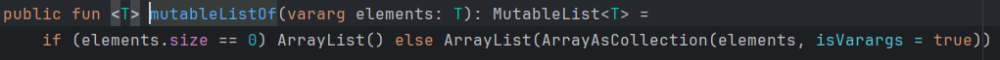

> [官方文档](https://kotlinlang.org/docs/getting-started.html)
>
> [中文文档](https://book.kotlincn.net/text/basic-syntax.html)

# 一、基础语法

## 1.赋值

### 1.1自动推导

Kotlin中定义一个变量，只允许在变量前声明两种关键字：val和var。

- `val`（value的简写）：用来声明一个不可变的变量，这种变量在初始赋值之后就再也不能重新赋值，对应Java中的final变量。
- `var`（variable的简写）用来声明一个可变的变量，这种变量在初始赋值之后仍然可以再被重新赋值，对应Java中的非final变量。

### 1.2 显式推导

```kotlin
var a : Int = 10
```


## 2.数据类型

Kotlin中数据类型全部是`对象数据类型`

| Java    | Kotlin  |
| ------- | ------- |
| int     | Int     |
| long    | Long    |
| short   | Short   |
| float   | Float   |
| double  | Double  |
| boolean | Boolean |
| char    | Char    |
| byte    | Byte    |
| void    | Unit    |

```kotlin
fun main() {
    var a: Int = 10
    a = a * 10
    println("a = " + a)
}
```


### 2.1Number

Number类是一个抽象类，Int、Float、Long、Double都是子类


### 2.2类型匹配

通过`is`进行类型匹配


#### 类型转换

**“不安全的”转换操作符**

 如果转换是不可能的，转换操作符会抛出一个异常。使用`as`来转换

```kotlin
val x: String = y as String
```

> 如果y为null，那上面代码要抛异常


**“安全的”转换操作符**

 可以使用*安全*转换操作符 `as?`，它可以在失败时返回 `null` 

```kotlin
val x: String? = y as? String
```

> 上面代码加了两个可空符号`?`
>
> - 第一个是因为String默认不可为空，这里加上是允许其为空
> - 第二个是因为可能为空，如果为空就返回null

### 2.3序列

#### 升序

**双端闭区间**

```kotlin
val a  = 0..10 //创建一个[0,10]的序列
```

**单端闭区间**

```kotlin
val range = 0 until 10 //创建一个[0,10)的区间
```


#### 降序

```kotlin
 val a = 10 downTo 1//创建一个[10,1]的降序区间
```


### 2.4集合

#### 2.4.1 list和set

初始化集合方法

```kotlin
//传统方法
val list = ArrayList<String>()
list.add("Apple")
list.add("Banana")
list.add("Orange")
list.add("Pear")
list.add("Grape")
```

**使用listOf创建不可变集合**

```kotlin
val list = listOf("Apple", "Banana", "Orange", "Pear", "Grape")
```

**mutableListOf创建可变集合**

```kotlin
fun main() {
    val list = mutableListOf("Apple", "Banana", "Orange", "Pear", "Grape")
    list.add("Watermelon")
    for (fruit in list) {
        println(fruit)
    }
}
```

> 关于这个`mutableListOf`和`ArrayList`：
>
> 查看源码发现，内部其实是通过ArrayList创建的
>
> 


**set同理**


#### 2.4.2 map

可以使用类似java的初始化方式

```kotlin
val map = HashMap<String, Int>()
map.put("Apple", 1)
map.put("Banana", 2)
map.put("Orange", 3)
map.put("Pear", 4)
map.put("Grape", 5)
```


**kotlin不推荐get和put方法进行读写，应该类似python的方式访问map**

```kotlin
map["Apple"] = 1//存数据
val apple = map["Apple"]//读
```


同list，map也有`mapOf`和`mutableMapOf`来创建Map

```kotlin
val map = mapOf("Apple" to 1, "Banana" to 2, "Orange" to 3, "Pear" to 4, "Grape" to 5)
//这里的to是一个infix函数，进行键值对关联
```

遍历

```kotlin
for ((fruit, number) in map) {
    println("fruit is " + fruit + ", number is " + number)
}
```


### 2.5 Unit/Nothing/Any

> https://www.jianshu.com/p/223e95ac41ef

#### **Unit**

 由于在Kotlin中，一切方法/函数都是表达式，表达式是总是有值的，所以每一个方法都必有一个返回值。如果没有用 `return` 明确的指定，那么一般来说就会自动帮我们加上 `Unit`: 

```kotlin
fun returnUnit():Unit{
    return Unit
}
```


#### Nothing


#### Any

**Any其实就跟Java里的`Object`是一样的**，也就是说在Kotlin中Any取代了Java中的Object，成为了Kotlin中所有类的父类。**不过这个说法还不是很严谨**，因为`Any`是不可为空的，而Kotlin中还有一个 `Any?`，是指可空的 `Any` 。显而易见， `Any?` 是 `Any` 的父类，那么严格来说， `Any?` 是所有类的父类， `Any` 只是所有不可为空的类（也就是没有?）的父类。


## 3.函数

`fun`是定义函数的关键字，无论什么函数都必须声明`fun`

```kotlin
fun methodName(param1: Int, param2: Int): Int {
    return 0
}
```


**语法糖**

当函数只有一行代码，可以不必编写函数体，直接将代码赋值给函数

```kotlin
fun largerNumber(num1: Int, num2: Int) = max(num1, num2) //这里连函数返回值也省略，让虚拟机自动推导
```


### 3.1内置函数

**3.1.1 max()**


### 3.2标准库函数

**3.2.1 repeat**

 用于执行**指定次数的循环操作** 

```kotlin
repeat(times: Int, action: (Int) -> Unit)
```

例如：

```kotlin
repeat(5) { index ->
    println(index + 1)
}
```


### 3.4**lambda**

#### （1）maxBy

**简化lambda形式：**

查找长度最长的单词

```kotlin
val list = listOf("Apple", "Banana", "Orange", "Pear", "Grape", "Watermelon")
val maxLengthFruit = list.maxBy({ fruit: String -> fruit.length })
```

当Lambda参数是函数的最后一个参数时，可以将Lambda表达式移到函数括号的外面

```kotlin
val maxLengthFruit = list.maxBy() { fruit: String -> fruit.length }
```

如果Lambda参数是函数的唯一一个参数的话，还可以将函数的括号省略

```kotlin
val maxLengthFruit = list.maxBy { fruit: String -> fruit.length }
```

当**Lambda表达式的参数列表中只有一个参数**时，也不必声明参数名，而是可以使用`it`关键字来代替

```kotlin
val maxLengthFruit = list.maxBy { it.length }
```


#### （2）map函数

```kotlin
val list = listOf("Apple", "Banana", "Orange", "Pear", "Grape", "Watermelon")
val newList = list.map { it.toUpperCase() }
for (fruit in newList) {
    println(fruit)
}
```


#### （3）筛选元素

**filter**

```kotlin
val list = listOf("Apple", "Banana", "Orange", "Pear", "Grape", "Watermelon")
val newList = list.filter { it.length <= 5 }
				.map { it.toUpperCase() }
```


**any和all**

any函数用于判断集合中是否至少存在一个元素满足指定条件，all函数用于判断集合中是否所有元素都满足指定条 件

```kotlin
val list = listOf("Apple", "Banana", "Orange", "Pear", "Grape", "Watermelon")
val anyResult = list.any { it.length <= 5 }
val allResult = list.all { it.length <= 5 }
println("anyResult is " + anyResult + ", allResult is " + allResult)
```


#### （4）调用java函数式api

当kotlin调用一个方法，且该方法接收一个Java`单抽象方法接口（即只有一个方法的接口）`作为参数，就可以使用**函数式API**

```kotlin
//例如创建runnable接口匿名类实例，kotlin如下
Thread(object : Runnable {
    override fun run() {
        println("Thread is running")
    }
}).start()

//因为满足单抽象方法接口，可以使用函数式api
Thread(Runnable {
    println("Thread is running")
}).start()
```


### 3.5匿名类

**创建匿名类实例的时候不再使用new，而是改用了`object`关键字**

```kotlin
Thread(object : Runnable {
    override fun run() {
        println("Thread is running")
    }
}).start()
```


### 3.6 inline


## 4.条件判断

### if

kotlin中的`if`可以有返回值，**返回值就是if语句条件的最后一句话**

```kotlin
fun largerNumber(num1: Int, num2: Int): Int {
    val value = if (num1 > num2) {
        num1
    } else {
        num2
    }
    return value
}
```


### when

替代`switch`，且比switch更强大

```
匹配值 -> { 执行逻辑 }
```

例如要查询分数

```kotlin
//有参写法
fun getScore(name: String) = when (name) {
    "Tom" -> 86
    "Jim" -> 77
    "Jack" -> 95
    "Lily" -> 100
    else -> 0
}

//无参写法
fun getScore(name: String) = when  {
    name =="Tom" -> 86
    name =="Jim" -> 77
    name =="Jack" -> 95
    name =="Lily" -> 100
    else -> 0
}
```

还可以使用when实现类型判断

```kotlin
val a = 10.1 
fun checkNumber(a:Number) = when (a) {
    is Int -> println("number is Int")
    is Double -> println("number is Double")
    else -> println("number not support")
}
checkNumber(a)
```


## 5.循环

### 5.1 while

和java一致

### 5.2 for-in

kotlin舍弃了`for-i`循环，而是主要使用`for-in`

```kotlin
for(i in 0..10){//0..10创建序列[0,10]
    print(i)
}
```

使用step设置步长

```kotlin
fun main() {
    for (i in 0 until 10 step 2) {
        println(i)
    }
}
```


## 6.面向对象

> [kotlin中的构造函数](https://juejin.cn/post/6844903872016678919)

### 6.1构造函数

#### 主构造体函数

可以在类名后面直接指定主构造函数(默认构造函数)

```kotlin
class Student constructor(val sno: String, val grade: Int)  {
}
```

 如果主构造函数没有任何注解或者可见性修饰符，可以省略这个 `constructor` 关键字 

```kotlin
class Student(val sno: String, val grade: Int)  {
}
```

> **有注解导致不能省略的情况**
>
> ```kotlin
> class Customer public @Inject constructor(name: String) { /*……*/ }
> ```
>
> 

如果主构造函数有函数体，可以放在init里面

```kotlin
class Student(val sno: String, val grade: Int) {
    init {
        println("sno is " + sno)
        println("grade is " + grade)
    }
}
```


#### 次构造体函数

次构造函数是通过`constructor`关键字来定义的。

- **当一个类既有主构造函数又有次构造函数时，所有的次构造函数都必须调用主构造函数（包括间接调用）**

- **并且次构造函数参数不允许有`val`或`var`，必须声明参数类型**

```kotlin
class Student(val sno: String, val grade: Int, name: String, age: Int) :
Person(name, age) {
    constructor(name: String, age: Int) : this("", 0, name, age) {//次构造体函数调用主构造体函数函数
    }
    constructor() : this("", 0) {//调用上一个次构造函数，间接调用主构造体函数
    }
}
```

即使次构造函数没有委托主构造函数，但依然会执行init代码块

```kotlin
class Constructors {
    init {
        println("Init block")
    }

    constructor(i: Int) {
        println("Constructor $i")
    }
}
//sampleEnd

fun main() {
    Constructors(1)
}

//输出
Init block
Constructor 2
```

**关于主和次之间的关系**

我觉得就和java中的重载类似，`主`就是默认最终执行的的，`次`就是根据参数重载的，但是都必须要调用`主`


> 在 JVM 上，**如果主构造函数的所有的参数都有默认值，编译器会生成一个额外的无参构造函数**，它将使用默认值。这使得 Kotlin 更易于使用像 Jackson 或者 JPA 这样的通过无参构造函数创建类的实例的库。 


#### 私有构造函数

不想有外部可以访问的构造函数

```kotlin
class DontCreateMe private constructor() { /*……*/ }
```


### 6.2继承

**与java类似，类只支持单继承类**

**kotlin中类默认无法被继承(抽象类除外)**，因此需要加上关键字`open`才可以使得非抽象类能被继承

且所有类默认继承自`Any`

```kotlin
open class Person {//默认继承自Any
    ...
}
```

**继承的时候也要显示说明调用父亲的主题构造函数**

```kotlin
class Student(val sno: String, val grade: Int) : Person() {
}
```

如果父类主体构造函数有参数

```kotlin
class Student(val sno: String, val grade: Int, name: String, age: Int) : Person(name, age) {//这里参数不能声明为val/var，否则作为子类属性,会和父类重名
    ...
}
```

如果没有主构造函数，那么次构造函数需要通过`super`调用父类的构造函数

```kotlin
class Student : Person {
    constructor(name: String, age: Int) : super(name, age) {
    }
}
```


#### 方法覆盖

- `Circle.draw()` 函数上必须加上 `override` 修饰符。如果没写，编译器会报错。 
- **如果函数没有标注 `open` 如 `Shape.fill()`，那么子类中不允许定义相同签名的函数**， 无论加不加 `override`。 

```kotlin
open class Shape {
    open fun draw() { /*……*/ }//如果子类要覆盖父类方法必须加open
    fun fill() { /*……*/ }
}

class Circle() : Shape() {
    override fun draw() { /*……*/ }//子类重写必须加override
}
```


**禁止子类覆盖**

如果不想让子类覆盖，加上`final`关键字

```kotlin
open class Rectangle() : Shape() {
    final override fun draw() { /*……*/ }
}
```


#### 属性覆盖

同样如此

```kotlin
open class Shape {
    open val vertexCount: Int = 0
}

class Rectangle : Shape() {
    override val vertexCount = 4
}
```


### 6.3抽象类

抽象类通过加上`abstract`来辩别，并且不用声明`open`关键字

```kotlin
abstract class Polygon {
    abstract fun draw()
}

class Rectangle : Polygon() {
    override fun draw() {
        // draw the rectangle
    }
}
```


### 6.4接口

**与java类似，类支持多继承接口**

```kotlin
interface Study {
    fun readBooks()
    fun doHomework()
}
```

和java(1.8)一样，接口中的方法可以有默认实现

```kotlin
interface Study {
    fun readBooks()
    fun doHomework() {//默认实现
        println("do homework default implementation.")
    }
}
```


#### SAM

 只有一个抽象方法的接口称为*函数式接口*或 *单一抽象方法（SAM）*接口。函数式接口可以有多个非抽象成员，但只能有一个抽象成员。 

**可以用 `fun` 修饰符在 Kotlin 中声明一个函数式接口** 

```kotlin
fun interface IntPredicate {
   fun accept(i: Int): Boolean
}
```

对于函数式接口，可以通过lambda表达式实现SAM转换，从而使代码更简洁、更有可读性。 如下：

```kotlin
// 通过 lambda 表达式创建一个实例
val isEven = IntPredicate { it % 2 == 0 }

print(isEven.accept(10))
```

> **如果不使用SAM转换**
>
> ```kotlin
> // 创建一个类的实例
> val isEven = object : IntPredicate {
>        override fun accept(i: Int): Boolean {
>            return i % 2 == 0
>        }
> }
> ```
>
> 


### 6.5数据类

**在kotlin中，直接在类前声明`data`关键字**， 编译器自动**从主构造函数中**声明的所有属性导出以下成员： 

- `.equals()`/`.hashCode()` 对。
- `.toString()` 格式是 `"User(name=John, age=42)"`。
- [`.componentN()` 函数](https://book.kotlincn.net/text/destructuring-declarations.html) 按声明顺序对应于所有属性。
- `.copy()` 函数（见下文）

```kotlin
data class Cellphone(val brand: String, val price: Double)
```


#### 要求

数据类必须满足以下要求：

- 主构造函数必须至少有一个参数。
- 主构造函数的所有参数必须标记为 `val` 或 `var`。
- 数据类不能是抽象、开放、密封或者内部的。


### 6.6单例类

不像java中创建单例模式那么繁琐，kotlin提供了`object`关键字可以创建单例类

```kotlin
//object关键字替换掉class
object Singleton {
    fun singletonTest() {
        println("singletonTest is called.")
    }
}
```

调用单例

```kotlin
Singleton.singletonTest()
```


### 6.7内部类


### 6.8密封类

**密封类可以看作是多实例的枚举（枚举中所有的属性都是同一个枚举实例）**

密封类用于表示受限类层次结构，当一个值可以具有**有限集合**中的一种类型，但不能具有任何其他类型时。

密封类具有数量有限的直接子类，**所有子类都定义在与密封类本身相同的文件中** 

> **密封类是抽象的，不能直接实例化，只能实例化密封类的子类**

```kotlin
//密封类及其子类
//子类也可以写在外边，但写在里面更清晰
sealed class RequestResult{
    data class Success(val response: String) : RequestResult()
    data class Failor(val error: Int) : RequestResult()
    data class Loading(val progressBar: Double) : RequestResult()
}
```

> 用来判断请求之后的状态

**作用**

密封类的一个常见用途是在 `when` 表达式中进行模式匹配。由于编译器知道所有可能的子类，因此可以确保所有情况都被处理。 

```kotlin
val request:RequestResult = RequestResult.Success("请求成功")
val showResult = when (request) {//可以不再加else
    is RequestResult.Success -> "请求成功"
    is RequestResult.Failor -> "请求失败"
    is RequestResult.Loading -> "请求中"
}

println(showResult)
```


### 6.9委托

####  类委托

委托是实现继承的一个很好的替代方式 

例如： `Derived` 类可以通过将其所有公有成员都委托给指定对象来实现一个接口 `Base`： 

```kotlin
interface Base {
    fun print()
}

class BaseImpl(val x: Int) : Base {
    override fun print() { print(x) }
}

//b 将会在 Derived 中内部存储， 并且编译器将生成转发给 b 的所有 Base 的方法。
class Derived(b: Base) : Base by b

fun main() {
    val b = BaseImpl(10)
    Derived(b).print()
}
```


#### 属性委托

`kotlin`还允许将属性的实现委托给其他对象。这种机制可以简化代码，提高代码的可读性和可维护性。属性委托可以用于各种场景，如延迟初始化、观察属性变化、将属性存储在映射中等。 

```kotlin
class Example {
    var p: String by Delegate()
}
```

>  在 `by` 后面的表达式是该 *委托*， 因为属性对应的 `get()`（与 `set()`）会被委托给它的 `getValue()` 与 `setValue()` 方法。 属性的委托不必实现接口，但是需要提供一个 `getValue()` 函数（对于 `var` 属性还有 `setValue()`）。 

**例如：**

```kotlin
class Delegate {
    operator fun getValue(thisRef: Any?, property: KProperty<*>): String {
        return "$thisRef, thank you for delegating '${property.name}' to me!"
    }

    operator fun setValue(thisRef: Any?, property: KProperty<*>, value: String) {
        println("$value has been assigned to '${property.name}' in $thisRef.")
    }
}
```

```kotlin
val e = Example()
println(e.p)

//输出
Example@33a17727, thank you for delegating 'p' to me!


e.p = "NEW"

//输出
NEW has been assigned to 'p' in Example@33a17727.
```


**kotlin标准库提供了一些常见的属性委托，例如`lazy`、`observable`、`vetoable`、`map`**

①`lazy()`是接受一个`lambda` 并返回一个 `Lazy ` 实例的函数，返回的实例可以作为实现延迟属性的委托。 

**只有第一次调用 `get()` 时，会执行已传递给 `lazy()` 的 lambda 表达式并记录结果。** 

```kotlin
val lazyValue: String by lazy {
    println("computed!")
    "Hello"
}

fun main() {
    println(lazyValue)
    println(lazyValue)
}

//输出
computed!
Hello
Hello
```

> lazy委托有三种模式：
>
> - **`LazyThreadSafetyMode.SYNCHRONIZED`**：这是默认模式，是线程安全的。它使用 `synchronized` 关键字来确保多线程环境下的安全性。
>
> - **`LazyThreadSafetyMode.PUBLICATION`**：这种模式也是线程安全的，但它不使用锁。它**通过 `volatile` 关键字来确保可见性，但可能会导致多个线程同时初始化属性**。
>
> - **`LazyThreadSafetyMode.NONE`**：这种模式不是线程安全的。它不使用任何同步机制，适用于单线程环境或不需要线程安全的场景。
>
> ```kotlin
> val lazyValue: String by lazy(LazyThreadSafetyMode.PUBLICATION) {
>     println("Computed!")
>     "Hello"
> }
> 
> fun main() {
>     println(lazyValue) // 输出: Computed! Hello
>     println(lazyValue) // 输出: Hello
> }
> 
> ```


②`observable`委托

 `observable` 委托用于观察属性的变化。每当属性的值发生变化时，会调用指定的回调函数。 

```kotlin
class User {
    var name: String by Delegates.observable("<no name>") {
        prop, old, new ->
        println("$old -> $new")
    }
}

fun main() {
    val user = User()
    user.name = "first"// 输出: <no name> -> first
    user.name = "second"// 输出: first -> second
}
```


③`vetoable`委托

 `vetoable` 委托类似于 `observable`，但它允许在属性值发生变化时进行拦截和拒绝。 

```kotlin
class User {
    var name: String by Delegates.vetoable("<no name>") {
        prop, old, new ->
        new.startsWith("a")
    }
}

fun main() {
    val user = User()
    user.name = "alice"  // 成功
    user.name = "bob"    // 失败，属性值不变
    println(user.name)   // 输出: alice
}
```


### 内联类


内联类（Inline Class）是一种特殊的类，用于在不引入额外运行时开销的情况下封装基本类型。**内联类的主要目的是提供类型安全和可读性，同时避免对象分配和引用的开销**。 

> **Kotlin 的内联类（Inline Class）是一种特殊的类，旨在减少包装类带来的性能开销。内联类在编译时会被“内联”，即在编译后的字节码中，内联类的实例会被替换为其包含的基本数据类型。这样可以避免装箱和拆箱操作，从而提高性能。**

声明内联类，在类名称前使用`value`修饰符

```kotlin
@JvmInline //如果是jvm，那么需要声明该注释
value class Password(private val s: String)
```

**特点：**

- **内敛类的主构造函数只允许有一个参数**，在运行时候，将使用这个唯一属性来表示内联类的实例

```kotlin
// 不存在 'Password' 类的真实实例对象
// 在运行时，'securePassword' 仅仅包含 'String'
val securePassword = Password("Don't try this in production")
```

- 内联类也类似普通类，可以有`init块`、`副构造函数`、`其他成员属性`

- 内敛类不能有`lateinit/delegate`属性

- 内联类允许继承接口，**但内联类不能继承类和被继承**

  ```kotlin
  interface Printable {
      fun prettyPrint(): String
  }
  
  @JvmInline
  value class Name(val s: String) : Printable {
      override fun prettyPrint(): String = "Let's $s!"
  }
  
  fun main() {
      val name = Name("Kotlin")
      println(name.prettyPrint()) // 仍然会作为一个静态方法被调用
  }
  ```

  

### 枚举类

声明简单的枚举类

```kotlin
enum class Direction {
    NORTH, SOUTH, WEST, EAST
}
```


带参构造函数枚举

```kotlin
enum class Color(val colorName: String) {
    RED("红"), GREEN("绿"), ORANGE("橙")
}
```


带抽象方法的枚举

```kotlin
enum class Color(val colorName: String) {
    RED("红") {
        override fun signal() {
            println("我是红红")
        }
    },
    GREEN("绿") {
        override fun signal() {

            println("我是绿绿")
        }
    },
    ORANGE("橙") {
        override fun signal() {
            println("我是橙橙")

        }
    };
    abstract fun signal()
}
```


### getter \setter

kotlin默认会帮属性实现getter、setter方法。

如果想自己定义，参考如下：

```kotlin
class Person(private val _name: String, private var _age: Int) {
    val name: String
    	get() = _name

    var age: Int
    	get() = _age
        set(value) {//setter必须变量是var
            if (value >= 0) {
                _age = value
            }
        }
}

fun main() {
    val person = Person("Alice", 30)
    println(person.name) // 输出 Alice
    println(person.age) // 输出 30

    person.age = 31
    println(person.age) // 输出 31

    person.age = -1 // 不会更新 age，因为值小于 0
    println(person.age) // 输出 31
}
```


## 7.空指针检查

### 7.1可空类型系统

kotlin的变量默认不为空，因此在编译时就会判断变量是否为空并报错

```kotlin
fun main(args: Array<String>) {
    n(null)//报错：error: null can not be a value of a non-null type Int
}
private fun n( a:Int){
    print("我是n")
}
```


为了应对开发中的特殊情况，可以在变量名后面加上问号，表示该变量可空

```kotlin
private fun n( a:Int?){
    print("我是n")
}
```


### 7.2判空的辅助工具

#### **`?.`**

当对象不为空时正常调用相应的方法，当对象为空时则什么都不做。比如以下的判空处理代码：

```kotlin
//例如下面判空之后调用something方法可以简化为
if (a != null) {
    a.doSomething()
}

//使用判空辅助工具
a?.doSomething()
```


#### **`?:`**

若**左边表达式**不为空取左边表达式，否则取右边表达式

```kotlin
val c = if (a ! = null) {
    a
} else {
    b
}
```

```kotlin
//简化为
val c = a ?: b
```


**结合使用**

```kotlin
fun getTextLength(text: String?): Int {
    if (text != null) {
        return text.length
    }
    return 0
}
```

通过`?.`和`?:`简化

```kotlin
fun getTextLength(text: String?): Int {
    return text?.length ?: 0
}
```


#### `!!`

让一个可能为null的对象强行通过编译，如果运行时候null为空，会抛出异常

```kotlin
val name: String? = null
val upperCaseName = name!!.toUpperCase() // 不会编译错误，但可能会抛出 NullPointerException 异常
```


#### let

let是一个标准函数，提供了函数式API的接口，并将原始调用对象作为参数传递到lambda表达式中

```kotlin
obj.let { obj2 ->//这里的obj2和obj是一个对象，只是为了区分
 // 编写具体的业务逻辑
}
```


因此结合`?.`简化判空条件可以写为

```kotlin
fun doStudy(study: Study?) {
    study?.let { stu ->
                stu.readBooks()
                stu.doHomework()
    }
}
```


**并且最重要的一点，let可以处理全局变量的判空，而if语句不可以**

```kotlin
var stu:Study = Study()
private fun n(){
    if(stu != null){//报错
        stu.showName()
    }
}
```

**改用使用let判断则没有问题**

```kotlin
var stu:Study = Study()

private fun n(){
    stu?.let{ob->ob.showName()}
}
```


## 8.协程 Coroutines 

> [协程](https://juejin.cn/post/6908271959381901325)

- 协程是一种轻量级的线程，**全部都在用户态**，因此系统消耗资源非常低，非常高效。**协程是运行于线程上的**，一个线程可以运行多个（几千上万个）协程。

- **Java的线程是内核线程**，需要依靠操作系统的调度才能实现不同线程之间的切换；而协程可以仅在编程语言的层面就能实现不同协程间的切换，从而大大提升并发编程效率。
- **线程进行数据共享的方式是`共享内存`,而协程是`通信`,这就避免了线程安全的问题,避免了锁竞争** 

> 协程在底层实现中通常利用**非阻塞的方式**进行异步操作。当一个协程被挂起时，底层的协程引擎（例如异步库或运行时）可以切换到执行其他协程，而不需要创建额外的线程或进程。这种轻量级的切换机制使得协程在高并发、I/O密集型和异步编程场景中具有出色的性能。
> **协程的切换通常比线程切换更快，因为不需要涉及操作系统的线程上下文切换。**
>
> >  Kotlin中的协程并不是通过事件循环来处理的，而是通过[协程调度器（Coroutine Dispatcher）](https://cloud.tencent.com/developer/article/2253994)来管理协程的执行。 

协程允许在**单线程模式**下模拟多线程编程的效果，**代码执行时的挂起与恢复完全是由编程语言来控制的**，和操作系统无关

> 使用协程需要单独引入依赖
>
> ```groovy
> dependencies {
>        implementation 'org.jetbrains.kotlinx:kotlinx-coroutines-core:1.5.2'
>        implementation 'org.jetbrains.kotlinx:kotlinx-coroutines-android:1.5.2'
> }
> ```
>

### 1创建协程

#### **CoroutineScope**

 CoroutineScope 即 **协程作用域**，用于对协程进行追踪。如果我们启动了多个协程但是没有一个可以对其进行统一管理的途径的话，就会导致我们的代码臃肿杂乱，甚至发生**内存泄露**或者**任务泄露**。 

CoroutineScope 大体上可以分为三种：

- GlobalScope。即全局协程作用域，在这个范围内启动的协程可以一直运行直到应用停止运行。GlobalScope 本身不会阻塞当前线程，且启动的协程相当于守护线程，不会阻止 JVM 结束运行
- runBlocking。一个顶层函数，和 GlobalScope 不一样，它会阻塞当前线程直到其内部所有相同作用域的协程执行结束
- 自定义 CoroutineScope。可用于实现主动控制协程的生命周期范围，对于 Android 开发来说最大意义之一就是可以在 Activity、Fragment、ViewModel 等具有生命周期的对象中按需取消所有协程任务，从而确保生命周期安全，避免内存泄露


##### **(1)`GlobelScope.launch`**

**开启一个`顶级协程`（协程也有层级关系，协程还可以创建子协程）**，这种协程的生命周期只受整个应用程序的生命周期的限制，因此会随着应用结束而结束

```kotlin
GlobalScope.launch {
    println("codes run in coroutine scope")
}
```

> ```kotlin
> fun main() {
>     log("start")
>     GlobalScope.launch {
>         launch {
>             delay(400)
>             log("launch A")
>         }
>         launch {
>             delay(300)
>             log("launch B")
>         }
>         log("GlobalScope")
>     }
>     log("end")
>     Thread.sleep(500)
> }
> 
> //结果
> start
> end
> GlobalScope
> launch B
> launch A
> ```
>
> 如果主线程不休眠，那么协程里面内容来不及执行程序就结束了，也就不会输出结果


##### **(2)`runBlocking`**

开启一个协程作用域，**会保证协程作用域内的所有子协程和代码执行完之前一直阻塞当前线程**

> 只建议测试时候使用，正式环境会引起某些问题

```kotlin
fun main() {
    log("start")
    runBlocking {
        launch {
            repeat(3) {
                delay(100)
                log("launchA - $it")
            }
        }
        launch {
            repeat(3) {
                delay(100)
                log("launchB - $it")
            }
        }
        GlobalScope.launch {//不会等待该作用域下协程运行完成
            repeat(3) {
                delay(120)
                log("GlobalScope - $it")
            }
        }
    }
    log("end")
}

//输出结果
[main] start
[main] launchA - 0
[main] launchB - 0
[DefaultDispatcher-worker-1] GlobalScope - 0
[main] launchA - 1
[main] launchB - 1
[DefaultDispatcher-worker-1] GlobalScope - 1
[main] launchA - 2
[main] launchB - 2
[main] end
```

> - `runBlocking`内部启动的协程是非阻塞式，但`runBlocking`阻塞其所在线程。
> - 并且`runBlocking`只会等待相同作用域的协程完成才会退出，而不会等待`GlobalScope`等其他作用域启动的协程

##### **(3)`coroutineScope`**

**开启一个协程作用域，只会阻塞当前协程，既不影响其他协程，也不影响任何线程。因此不会造成性能问题，推荐使用！！**

> `runBlocking` 和 `coroutineScope` 看起来很像，因为它们都需要等待其内部所有相同作用域的协程结束后才会结束自己。两者的主要区别在于：
>
> `runBlocking` 方法会阻塞当前线程，而 `coroutineScope`不会，而是会挂起并释放底层线程以供其它协程使用。基于这个差别，`runBlocking` 是一个普通函数，而 `coroutineScope` 是一个挂起函数，**所以可以用来给挂起函数提供一个协程作用域**
>
> ```kotlin
> suspend fun printDot() = coroutineScope {
>     launch {
>         println(".")
>         delay(1000)
>     }
> }
> ```

```kotlin
fun main() = runBlocking {
    launch {
        delay(100)
        log("Task from runBlocking")
    }
    coroutineScope {
        launch {
            delay(500)
            log("Task from nested launch")
        }
        delay(50)
        log("Task from coroutine scope")
    }
    log("Coroutine scope is over")
}

//结果
[main] Task from coroutine scope
[main] Task from runBlocking
[main] Task from nested launch
[main] Coroutine scope is over
```

> [coroutineScope和runBlocking区别与联系](https://blog.csdn.net/sziitjin/article/details/129729249)
>
> [coroutineScope和runBlocking](https://www.jianshu.com/p/51a4ecc1902a)

##### **(4)`supervisorScope`**

`supervisorScope` 函数用于创建一个使用了 `SupervisorJob` 的 `coroutineScope`，该作用域的特点就是抛出的异常不会连锁取消同级协程和父协程 

```kotlin
fun main() = runBlocking {
    launch {
        delay(100)
        log("Task from runBlocking")
    }
    supervisorScope {
        launch {
            delay(500)
            log("Task throw Exception")
            throw Exception("failed")
        }
        launch {
            delay(600)
            log("Task from nested launch")
        }
    }
    log("Coroutine scope is over")
}

//结果
[main] Task from runBlocking
[main] Task throw Exception
[main] Task from nested launch
[main] Coroutine scope is over
```


##### **(5)自定义croutineScope**

为了避免在Activity中开启多个协程导致的内存泄漏，创建与Activity生命周期相关的协程作用域来管理协程的生命周期

CoroutineScope 的实例可以通过 `CoroutineScope()` 或 `MainScope()` 的工厂函数来构建。前者创建通用作用域，后者创建 UI 应用程序的作用域并使用 `Dispatchers.Main` 作为默认的调度器 

```kotlin
class Activity {
    private val mainScope = MainScope()//创建MainScope对象

    fun onCreate() {
        mainScope.launch {
            repeat(5) {
                delay(1000L * it)
            }
        }
    }

    fun onDestroy() {
        mainScope.cancel()
    }
}
```

或者，可以通过委托模式来让 Activity 实现 `CoroutineScope `接口，从而可以在 Activity 内直接启动协程而不必显示地指定它们的上下文，并且在 `onDestroy()`中自动取消所有协程 ，如下代码所示，当调用`onDestroy`函数之后，协程被取消

```kotlin
//实现接口，并且使用Dispatchers.Default调度器
class Activity : CoroutineScope by CoroutineScope(Dispatchers.Default) {

    fun onCreate() {
        launch {
            repeat(5) {
                delay(200L * it)
                log(it)
            }
        }
        log("Activity Created")
    }

    fun onDestroy() {
        cancel()
        log("Activity Destroyed")
    }

}

fun main() = runBlocking {
    val activity = Activity()
    activity.onCreate()
    delay(1000)
    activity.onDestroy()
    delay(1000)
}


//输出结果
Activity Created
0
1
2
Activity Destroyed
```

>  **已取消的作用域无法再创建协程**。因此，仅当控制其生命周期的类被销毁时，才应调用 `scope.cancel()`。 


#### coroutineBuilder

##### (1)launch

 用于在不阻塞当前线程的情况下启动一个协程，并返回对该协程任务的引用，即 Job 对象 

```kotlin
public fun CoroutineScope.launch(
    context: CoroutineContext = EmptyCoroutineContext,//指定协程上下文
    start: CoroutineStart = CoroutineStart.DEFAULT,//用于指定协程的启动方式，默认值为 CoroutineStart.DEFAULT，即协程会在声明的同时就立即进入等待调度的状态，即可以立即执行的状态。可以通过将其设置为CoroutineStart.LAZY来实现延迟启动，即懒加载
    block: suspend CoroutineScope.() -> Unit//用于传递协程的执行体，即希望交由协程执行的任务
): Job
```


##### (2)job

 Job 是协程的句柄。使用 `launch` 或 `async` 创建的每个协程都会返回一个 Job 实例，该实例唯一标识协程并管理其生命周期。**Job 是一个接口类型**，列举 Job 几个比较有用的属性和函数 

```kotlin
//当 Job 处于活动状态时为 true
//如果 Job 未被取消或没有失败，则均处于 active 状态
public val isActive: Boolean

//当 Job 正常结束或者由于异常结束，均返回 true
public val isCompleted: Boolean

//当 Job 被主动取消或者由于异常结束，均返回 true
public val isCancelled: Boolean

//启动 Job
//如果此调用的确启动了 Job，则返回 true
//如果 Job 调用前就已处于 started 或者是 completed 状态，则返回 false 
public fun start(): Boolean

//用于取消 Job，可同时通过传入 Exception 来标明取消原因
public fun cancel(cause: CancellationException? = null)

//阻塞等待直到此 Job 结束运行
public suspend fun join()

//当 Job 结束运行时（不管由于什么原因）回调此方法，可用于接收可能存在的运行异常
public fun invokeOnCompletion(handler: CompletionHandler): DisposableHandle
```

**示例**

```kotlin
fun main() {
    //将协程设置为延迟启动
    val job = GlobalScope.launch(start = CoroutineStart.LAZY) {
        for (i in 0..100) {
            //每循环一次均延迟一百毫秒
            delay(100)
        }
    }
    job.invokeOnCompletion {
        log("invokeOnCompletion：$it")
    }
    log("1. job.isActive：${job.isActive}")
    log("1. job.isCancelled：${job.isCancelled}")
    log("1. job.isCompleted：${job.isCompleted}")

    job.start()

    log("2. job.isActive：${job.isActive}")
    log("2. job.isCancelled：${job.isCancelled}")
    log("2. job.isCompleted：${job.isCompleted}")

    //休眠四百毫秒后再主动取消协程
    Thread.sleep(400)
    job.cancel(CancellationException("test"))

    //休眠四百毫秒防止JVM过快停止导致 invokeOnCompletion 来不及回调
    Thread.sleep(400)

    log("3. job.isActive：${job.isActive}")
    log("3. job.isCancelled：${job.isCancelled}")
    log("3. job.isCompleted：${job.isCompleted}")
}
```


##### (3)async

看下 `async` 函数的方法签名。`async` 也是一个作用于 CoroutineScope 的扩展函数，和 `launch` 的区别主要就在于：**`async` 可以返回协程的执行结果，而 `launch` 不行** 

```kotlin
public fun <T> CoroutineScope.async(
    context: CoroutineContext = EmptyCoroutineContext,
    start: CoroutineStart = CoroutineStart.DEFAULT,
    block: suspend CoroutineScope.() -> T
): Deferred<T>
```

 通过`await()`方法可以拿到 async 协程的执行结果 


### 2阻塞协程

**delay()**

`delay()`函数是一个**非阻塞式**的挂起函数，它**只会挂起当前`协程`**，并不会影响其他协程的运行，**delay函数只能在协程作用域或其他挂起函数中调用**

> 而Thread.sleep()方法会**阻塞当前的`线程`**，这样运行在该线程下的所有协程都会被阻塞

```kotlin
GlobalScope.launch {
    println("codes run in coroutine scope")
    delay(1500)//阻塞协程1.5s
    println("codes run in coroutine scope finished")
}
Thread.sleep(1000)//阻塞线程1s，会阻塞该线程下所有协程
```


### 3.suspend 

> [suspend原理](https://blog.csdn.net/future234/article/details/122248766)

Kotlin提供了一个`suspend`关键字，使用它可以将**任意函数声明成挂起函数**，而**挂起函数之间都是可以互相调用的（ suspend 函数只能由其它 suspend 函数调用，或者是由协程来调用 ）**，如下所示： 

```kotlin
suspend fun printDot() {//挂起函数
    println(".")
    delay(1000)//函数声明为suspend之后就可以在内部调用delay
}
```


**但是仍然存在问题：函数不具备协程作用域**，因此需要通过`coroutineScope`函数来解决。coroutineScope函数也是一个挂起函数。它的特点是会继承外部的协程的作用域并创建一个子协程，借助这个特性，就可以给任意挂起函数提供协程作用域了

```kotlin
suspend fun printDot() = coroutineScope {
    launch {
        println(".")
        delay(1000)
    }
}
```


### 4.取消协程

> https://juejin.cn/post/7158008928930906148

`cancel`函数调用后会马上返回而不是等待协程结束，所以需要借助`join`函数等待协程结束

-  `job.cancel()`就用于取消协程

- `job.join()`用于阻塞等待协程运行结束。 

- ` cancelAndJoin() `结合了两者情况

```kotlin
fun main() = runBlocking {
    val job = launch {
        repeat(1000) { i ->
            log("job: I'm sleeping $i ...")
            delay(500L)
        }
    }
    delay(1300L)
    log("main: I'm tired of waiting!")
    job.cancel()
    job.join()
    log("main: Now I can quit.")
}
//结果：
[main] job: I'm sleeping 0 ...
[main] job: I'm sleeping 1 ...
[main] job: I'm sleeping 2 ...
[main] main: I'm tired of waiting!
[main] main: Now I can quit.
```

#### 协程无法取消

**协程库中的所有挂起函数都是可取消的**，**它们在运行前检查协程是否被取消了**，并在取消时抛出 CancellationException 从而结束整个任务。

 如果协程在运行过程中**没有挂起点，则不能取消协程** 。

> 下列代码没有手动判断协程被取消，所以即使主动取消了，协程也只会在完成既定循环后才结束运行，因为协程没有在每次循环前先进行检查，导致任务不受取消操作的影响 
>
> ```kotlin
> fun main() = runBlocking {
>     val startTime = System.currentTimeMillis()
>     val job = launch(Dispatchers.Default) {
>         var nextPrintTime = startTime
>         var i = 0
>         while (i < 5) {
>             if (System.currentTimeMillis() >= nextPrintTime) {
>                 log("job: I'm sleeping ${i++} ...")
>                 nextPrintTime += 500L
>             }
>         }
>     }
>     delay(1300L)
>     log("main: I'm tired of waiting!")
>     job.cancelAndJoin()
>     log("main: Now I can quit.")
> }
> 
> //输出
> [DefaultDispatcher-worker-1] job: I'm sleeping 0 ...
> [DefaultDispatcher-worker-1] job: I'm sleeping 1 ...
> [DefaultDispatcher-worker-1] job: I'm sleeping 2 ...
> [main] main: I'm tired of waiting!
> [DefaultDispatcher-worker-1] job: I'm sleeping 3 ...
> [DefaultDispatcher-worker-1] job: I'm sleeping 4 ...
> [main] main: Now I can quit.
> ```
>
> 通过`isActive`判断协程是否活跃
>
> ```kotlin
> fun main() = runBlocking {
>     val startTime = System.currentTimeMillis()
>     val job = launch(Dispatchers.Default) {//这里如果去掉Dispatchers.Default，就取消不了
>         var nextPrintTime = startTime
>         var i = 0
>         while (i < 5) {
>             if (isActive) {
>                 if (System.currentTimeMillis() >= nextPrintTime) {
>                     log("job: I'm sleeping ${i++} ...")
>                     nextPrintTime += 500L
>                 }
>             } else {
>                 return@launch
>             }
>         }
>     }
>     delay(1300L)
>     log("main: I'm tired of waiting!")
>     job.cancelAndJoin()
>     log("main: Now I can quit.")
> }
> ```


#### NonCancellable

在极少数情况下我们需要在取消的协程中再调用挂起函数，此时可以使用 `withContext` 函数和 `NonCancellable`上下文将相应的代码包装在 `withContext(NonCancellable) {...}` 代码块中，NonCancellable 就用于创建一个无法取消的协程作用域

```kotlin
val job = launch {
    try {
        repeat(1000) { i ->
            println("job: I'm sleeping $i ...")
            delay(500L)
        }
    } finally {
        withContext(NonCancellable) {
            println("job: I'm running finally")
            delay(1000L)
            println("job: And I've just delayed for 1 sec because I'm non-cancellable")
        }
    }
}
delay(1300L) // delay a bit
println("main: I'm tired of waiting!")
job.cancelAndJoin() // cancels the job and waits for its completion
println("main: Now I can quit.")
```


### withTimeout

`withTimeout` 函数用于指定协程的运行超时时间，如果超时则会抛出 TimeoutCancellationException，从而令协程结束运行 

```kotlin
fun main() = runBlocking {
    log("start")
    val result = withTimeout(300) {
        repeat(5) {
            delay(100)
        }
        200
    }
    log(result)
    log("end")
}

//结果
[main] start
Exception in thread "main" kotlinx.coroutines.TimeoutCancellationException: Timed out waiting for 300 ms
	at kotlinx.coroutines.TimeoutKt.TimeoutCancellationException(Timeout.kt:186)
	at kotlinx.coroutines.TimeoutCoroutine.run(Timeout.kt:156)
	at kotlinx.coroutines.EventLoopImplBase$DelayedRunnableTask.run(EventLoop.common.kt:497)
	at kotlinx.coroutines.EventLoopImplBase.processNextEvent(EventLoop.common.kt:274)
	at kotlinx.coroutines.DefaultExecutor.run(DefaultExecutor.kt:69)
	at java.lang.Thread.run(Thread.java:748)

```

> - `CancellationException`报错不会造成app crush
>
> - `withTimeout`方法抛出的 TimeoutCancellationException 是 CancellationException 的子类，该异常会造成程序崩溃
>
>  如果不希望因为异常导致协程结束，可以改用`withTimeoutOrNull`方法，如果超时就会返回 null 

### 5.CoroutineContext

 CoroutineContext 是 Kotlin 协程中一个重要的概念，它代表了一组协程执行相关的属性。CoroutineContext 包含以下几个重要的元素： 

- **Job:** 代表协程的生命周期，可以用来控制协程的启动、取消和销毁。
- **Dispatcher:** 指定协程运行的线程或线程池。
- **CoroutineName:** 为协程命名，方便调试和跟踪。
- **CoroutineExceptionHandler:** 处理协程执行过程中发生的异常。


#### 协程调度器

> https://juejin.cn/post/7244409860833394725

`CoroutineDispatcher`（协程调度器）用于指定执行协程的目标载体，即**运行于哪个线程**。CoroutineDispatcher 可以将协程的执行操作限制在特定线程上，也可以将其分派到线程池中，或者让它无限制地运行。 

 **Kotlin 协程库提供了四个 Dispatcher 用于指定在哪一类线程中执行协程**： 

- `Dispatchers.Default`。默认调度器，适合用于执行占用大量 CPU 资源的任务。例如：对列表排序和解析 JSON

- `Dispatchers.IO`。适合用于执行磁盘或网络 I/O 的任务。例如：使用 Room 组件、读写磁盘文件，执行网络请求

- `Dispatchers.Unconfined`。对执行协程的线程不做限制，可以直接在当前调度器所在线程上执行

- `Dispatchers.Main`。使用此调度程序可用于在 Android 主线程上运行协程，只能用于与界面交互和执行快速工作，例如：更新 UI、调用 `LiveData.setValue`

> **注意：**
>
> ①`launch` 在不执行 Dispatchers 的情况下使用时，它从外部的协程作用域继承上下文和调度器，即和 runBlocking 保持一致，均在 main 线程执行
>
> ②IO 和 Default 均依靠后台线程池来执行，`GlobalScope` 启动协程时默认使用的调度器是 `Dispatchers.Default`，因此也是在后台线程池中执行
>
> ③`Unconfined `则不限定具体的线程类型，当前调度器在哪个线程，就在该线程上进行执行
>
> ④`newSingleThreadContext` 用于为协程专门创建一个新的线程，专用线程是一种成本非常昂贵的资源，在实际开发时必须当不再需要时释放掉线程资源，或者存储在顶级变量中以便在整个应用程序中进行复用


#### withContext

 **withContext** 是 Kotlin 协程库中的一个 **挂起函数**，用于 **切换协程的上下文**。 可以通过该函数代替复杂的回调

```kotlin
suspend fun fetchDocs() {                      // Dispatchers.Main
    val result = get("developer.android.com")  // Dispatchers.Main
    show(result)                               // Dispatchers.Main
}

suspend fun get(url: String) =                 // Dispatchers.Main
    withContext(Dispatchers.IO) {              // Dispatchers.IO (main-safety block)
        /* perform network IO here */          // Dispatchers.IO (main-safety block)
    }                                          // Dispatchers.Main
}
```


#### CoroutineName

 CoroutineName 用于为协程指定一个名字，方便调试和定位问题 

```kotlin
fun main() = runBlocking<Unit>(CoroutineName("RunBlocking")) {
    log("start")
    launch(CoroutineName("MainCoroutine")) {
        launch(CoroutineName("Coroutine#A")) {
            delay(400)
            log("launch A")
        }
        launch(CoroutineName("Coroutine#B")) {
            delay(300)
            log("launch B")
        }
    }
}
```


#### 组合上下文元素

当需要为协程上下文定义多个元素时候，可以通过`+`

```kotlin
fun main() = runBlocking<Unit> {
    launch(Dispatchers.Default + CoroutineName("test")) {//指定调度器和协程名称
        log("Hello World")
    }
}
```


### 6.返回值

 `return@launch` 语句用于 **从当前协程中返回**，并 **将返回值传递给启动它的 `launch` 函数**。 

```kotlin
suspend fun main() {
    val job = launch {
        val result = getData()
        return@launch result
    }

    val result = job.await()
    println(result)
}

suspend fun getData(): String {
    // ...
}
```


## 9.异常

> https://kotlinlang.org/docs/exceptions.html#checked-exceptions


## 可见性修饰符

Kotlin中有4种修饰符，分别是`public`、`private`、`protected`和 `internal`

- `public`：默认修饰符，表示对所有类都可见
- `private`：只对类内部可见
- `protected`：对当前类和子类可见
- `internal`：（摒弃了default）对同一模块中的类可见


# 新特性

### 字符串内嵌

避免使用`+`进行字符串的拼接

```kotlin
class Obj(var name:String){
    
}

fun main(){
    var obj = Obj("kevin")
    var str = "hello, ${obj.name}. nice to meet you!"//可以直接得到obj.name
}
```


**在某些情况非常简便**

```kotlin
val brand = "Samsung"
val price = 1299.99
println("Cellphone(brand=$brand, price=$price)")
```


### 默认参数

```kotlin
fun printParams(num: Int, str: String = "hello") {
    println("num is $num , str is $str")
}
```


如果默认参数是第一个的情况，该如何避免第二个参数传递给第一个参数

```kotlin
fun printParams(num: Int = 100, str: String) {
    println("num is $num , str is $str")
}
fun main() {
    printParams(str = "world")//通过键值对的形式传递参数，这样避免传递给第一个参数，造成类型不匹配
}
```


### object关键字

> [object关键字的使用场景](https://blog.csdn.net/xlh1191860939/article/details/79460601)

object主要有以下三种使用场景：

- **对象声明**（Object Declaration）
- **伴生对象**（Companion Object）
- **对象表达式**（Object Expression）

#### (1)对象声明

语法含义：将类的声明和定义该类的单例对象结合在一起（即**通过object就实现了单例模式**） 

```kotlin
object RepositoryManager{
    fun method(){
        println("I'm in object declaration")
    }
}
```

> **注意点：**
>
> - 尽管和普通类的声明一样，可以包含属性、方法、初始化代码块以及可以继承其他类或者实现某个接口，但是它**不能包含构造器（包括主构造器以及次级构造器）**
> - 它也可以定义在一个类的内部：
>
> ```kotlin
> class ObjectOuter {
>        object Inner{
>            fun method(){
>                println("I'm in inner class")
>            }
>        }
> }
> fun main(args: Array<String>) {
>        ObjectOuter.Inner.method()
> }
> ```


#### (2)伴生对象（Companion object）

在Kotlin中是**没有static关键字**的，也就是意味着没有了`静态方法`和`静态成员`。那么在kotlin中如果要想表示这种概念，取而代之的是`包级别函数（package-level function）`和这里提到的`伴生对象`。

```kotlin
class A{
    companion object 伴生对象名(可以省略){
        //define method and field here
    }
}

//对于静态内部类可以放外面
class Father{
    companion object{
        class A{
        }
    }
}

```

> **示例**
>
> ```kotlin
> class ObjectTest {
>        companion object MyObjec{
>            val a = 20
>            fun method() {
>                println("I'm in companion object")
>            }
>        }
> }
> ```
>
> **调用**
>
> ```kotlin
> fun main(args: Array<String>) {
>        //方式一
>        ObjectTest.MyObject.method()
>        println(ObjectTest.MyObject.a)
> 
>        //方式二（推荐方式）
>        ObjectTest.method()
>        println(ObjectTest.a)
> }
> ```
>
> > 在定义（**定义时如果省略了伴生对象名，那么编译器会为其提供默认的名字Companion**）和调用时伴生对象名是可以省略的。 
> >
> > **也因为如此，所以一个类只允许有一个伴生对象**

#### (3) **对象表达式（Object Expression）** 

在Java中，有匿名内部类

```java
interface Contents {
    void absMethod();
}
public class Hello {

    public Contents contents() {
        return new Contents() {

            @Override
            public void absMethod() {
                System.out.println("method invoked...");
            }
        };
    }

    public static void main(String[] args) {

        Hello hello = new Hello();
        hello.contents().absMethod();    //打印method invoked...
    }
}
```

但是如果在匿名内部类中新添加了一些属性和方法，那么在外界是无法调用的，并且一个匿名内部类最多只可以实现一个接口或类

```java
return new Contents() {
    private int i = 1;

    public int value() {
        return i;
    }

    @Override
    public void absMethod() {
        System.out.println("method invoked...");
    }
};

public static void main(String[] args) {

    Hello hello = new Hello();

    hello.contents().value();  //Cannot resolve method 'value()'
}
```


**而在Kotlin中，则可以访问匿名内部类的属性**

 a.实现一个接口或类 

```kotlin
interface AA {
    fun a()
}

fun main(args: Array<String>) {

    val aa = object : AA {
        override fun a() {
            println("a invoked")
        }
    }

    aa.a()
}
```

b.不实现任何类，并且在匿名内部类中添加方法

```kotlin
fun main(args: Array<String>) {

    val obj = object  {
        fun a() {
            println("a invoked")
        }
    }
    obj.a()  //打印：a invoked
}
```

c.实现多个接口和类

```kotlin
fun main(args: Array<String>) {
    val cc = object : AA, BB() {
        override fun a() {
        }
        override fun b() {
        }
    }
    cc.a()
    cc.b()
}
```


**注意：匿名对象只有定义成`局部变量`或`private变量`时候才有意义，否则编译不通过**

```kotlin
class MyTest {

    private val foo = object {//private变量
        fun method() {
            println("private")
        }
    }

    val foo2 = object {//全局变量
        fun method() {
            println("public")
        }
    }

    fun m() = object {//public函数
        fun method(){
            println("method")
        }
    }

    fun invoke(){

        val local = object {//局部变量
            fun method(){
                println("local")
            }
        }

        local.method()  //编译通过
        foo.method()    //编译通过
        foo2.method()   //编译通不过
        m().method()    //编译通不过
    }
}

```


#### 三者初始化时机

a. `object declaration`：当第一次访问它时才初始化，是一种懒初始化

b. `Companion object`：当它对应的类被加载后，它才初始化，类似Java中的静态代码块

c. `object expression`：一旦它被执行，立马初始化


### 类拓展

Kotlin 能够对一个类或接口扩展新功能而无需继承该类或者使用像*装饰者*这样的设计模式。 这通过叫做*扩展*的特殊声明完成。 


#### 拓展方法

例如，**要对MutableList拓展一个swap方法**

```kotlin
fun <T> MutableList<T>.swap(index1: Int, index2: Int) {
    val temp = this[index1]
    this[index1] = this[index2]
    this[index2] = temp
}


fun main(){
    var list = mutableListOf("hello","it's me")//调用
    list.swap(0,1)
}
```


##### 静态解析

类拓展是静态解析的，也就是**编译时候就已经根据接收者类型确定好要调用哪一个拓展方法**。比如下面例子

```kotlin
fun main() {
    open class Shape
    class Rectangle: Shape()

    fun Shape.getName() = "Shape"
    fun Rectangle.getName() = "Rectangle"

    fun printClassName(s: Shape) {
        println(s.getName())
    }

    printClassName(Rectangle())
}

//输出
Shape
```

上面最后会输出Shape， 因为调用的扩展函数只取决于参数 `s` 的声明类型，该类型是 `Shape` 类 


##### 成员函数和拓展函数

如果一个类定义有一个成员函数与一个扩展函数，而这两个函数又有相同的接收者类型、 相同的名字，并且都适用给定的参数，这种情况*总是取成员函数*。 

```kotlin
fun main() {
    class Example {
        fun printFunctionType() { println("Class method") }
    }

    fun Example.printFunctionType() { println("Extension function") }

    Example().printFunctionType()
}

//输出
"Class Method"
```


#### 拓展属性

```kotlin
class MyClass(val value: Int)

val MyClass.doubleValue: Int
    get() = this.value * 2

fun main() {
    val obj = MyClass(10)
    println(obj.doubleValue) // 输出 20
}

```

> **扩展属性不能存储状态**：扩展属性不能有自己的字段来存储状态，它们只能通过 getter 和 setter 方法来计算或修改原类的属性。
>
> ```kotlin
> val House.number = 1 // 错误：扩展属性不能有初始化器
> ```


#### 作用域

一般拓展作用域的在包级别，同一包下都可以调用

````kotlin
package com.example.kotlintest

fun <T> MutableList<T>.swap(index1: Int, index2: Int) {
    val temp = this[index1]
    this[index1] = this[index2]
    this[index2] = temp
}
````

如果是不同包下，import就好

```kotlin
package org.example.usage

import org.example.declarations.getLongestString

fun main() {
    val list = listOf("red", "green", "blue")
    list.getLongestString()
}
```


#### 类内部拓展

可以在一个类内部为另一个类声明扩展。在这样的扩展内部，有多个*隐式接收者*—— 其中的对象成员可以无需通过限定符访问。 

```kotlin
class Host(val hostname: String) {
    fun printHostname() { print(hostname) }
}

class Connection(val host: Host, val port: Int) {
    fun printPort() { print(port) }

    fun Host.printConnectionString() {
         printHostname()   // 调用 Host.printHostname()
        print(":")
         printPort()   // 调用 Connection.printPort()
    }

    fun connect() {
         /*……*/
         host.printConnectionString()   // 调用扩展函数
    }
}

fun main() {
    Connection(Host("kotl.in"), 443).connect()
    //Host("kotl.in").printConnectionString()  // 错误，该扩展函数在 Connection 外不可用
}
```

 对于分发接收者与扩展接收者的成员名字冲突的情况，扩展接收者优先。要引用分发接收者的成员你可以使用 限定的 `this` 语法。 

```kotlin
class Connection {
    fun Host.getConnectionString() {
        toString()         // 调用 Host.toString()
        this@Connection.toString()  // 调用 Connection.toString()
    }
}
```


### 限定this

 如果 `this` 没有限定符，它指的是最内层的包含它的作用域。要引用其他作用域中的 `this`，请使用 *标签限定符*： 

要访问来自外部作用域的 `this`（一个类或者扩展函数， 或者带标签的带有接收者的函数字面值）使用`this@label`， 其中 `@label` 是一个代指 `this` 来源的标签： 

```kotlin
class A { // 隐式标签 @A
    inner class B { // 隐式标签 @B
        fun Int.foo() { // 隐式标签 @foo
            val a = this@A // A 的 this
            val b = this@B // B 的 this

            val c = this // foo() 的接收者，一个 Int
            val c1 = this@foo // foo() 的接收者，一个 Int

            val funLit = lambda@ fun String.() {
                val d = this // funLit 的接收者，一个 String
            }

            val funLit2 = { s: String ->
                // foo() 的接收者，因为它包含的 lambda 表达式
                // 没有任何接收者
                val d1 = this
            }
        }
    }
}
```

