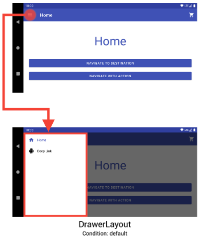
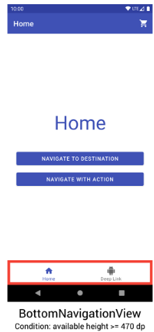
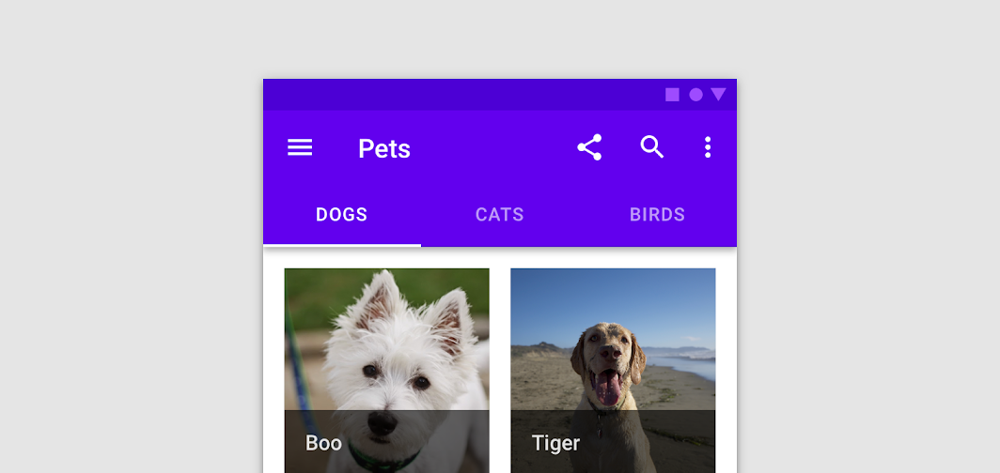
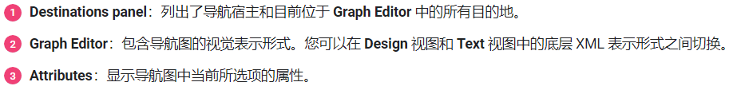
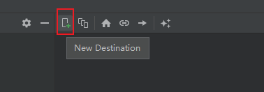
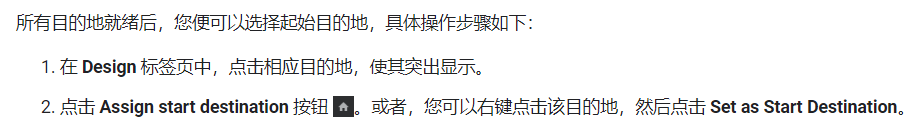
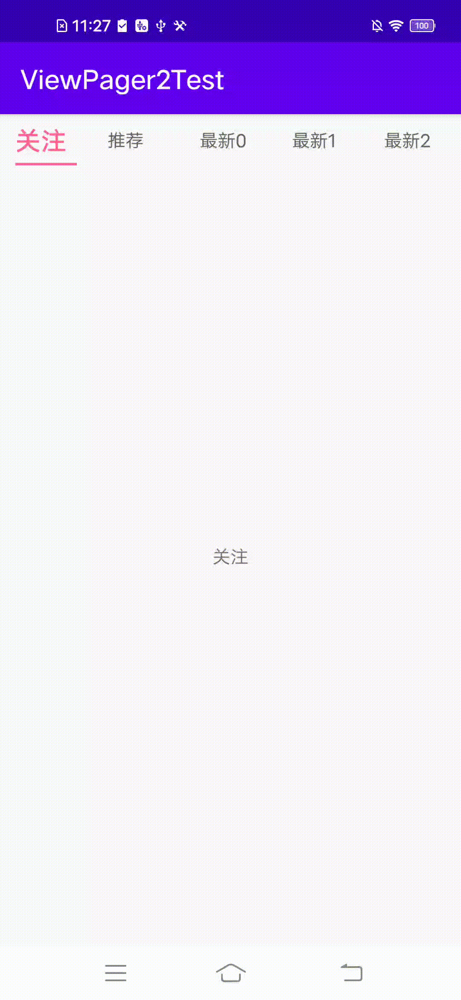

# 导航

## 一、概览

### 1.常用导航View

#### `NavigationView`

> 导航菜单栏，始终在屏幕上
>
> 

#### `DrawerLayout`

> 可以收放的导航菜单栏，可以更改方向
>
> 

#### `BottomNavigationView`

> 底部导航栏，比较常见
>
> 

#### TabBar

> 顶部导航栏，放在`ToolBar`上
>
> 
>
> > ToolBar-https://blog.csdn.net/Mr_Tony/article/details/121877502

#### ActionBar

> https://blog.csdn.net/guolin_blog/article/details/18234477

## 二、Navigation

主要是处理Fragment导航的组件

导航是指支持用户导航、进入和退出应用中不同内容片段的交互。

导航组件由以下三个关键部分组成：

- **导航图**：在一个集中位置包含所有导航相关信息的 XML 资源。这包括应用内所有单个内容区域（称为*目标*）以及用户可以通过应用获取的可能路径。
- **`NavHost`**：显示导航图中目标的空白容器。导航组件包含一个默认 `NavHost` 实现 ([`NavHostFragment`])，可显示 Fragment 目标。
- **`NavController`**：在 `NavHost` 中管理应用导航的对象。当用户在整个应用中移动时，`NavController` 会安排 `NavHost` 中目标内容的交换。

### 1.简单使用

```groovy
dependencies {
  def nav_version = "2.5.3"

  // Java language implementation
  implementation "androidx.navigation:navigation-fragment:$nav_version"
  implementation "androidx.navigation:navigation-ui:$nav_version"

  // Kotlin
  implementation "androidx.navigation:navigation-fragment-ktx:$nav_version"
  implementation "androidx.navigation:navigation-ui-ktx:$nav_version"

  // Feature module Support
  implementation "androidx.navigation:navigation-dynamic-features-fragment:$nav_version"

  // Testing Navigation
  androidTestImplementation "androidx.navigation:navigation-testing:$nav_version"

  // Jetpack Compose Integration
  implementation "androidx.navigation:navigation-compose:$nav_version"
}
```


#### 创建导航图

导航发生在应用中的各个目的地（即您的应用中用户可以导航到的任意位置）之间。这些目的地是通过操作连接的。

导航图是一种资源文件，其中包含您的所有目的地和操作。该图表会显示应用的所有导航路径。

下图直观显示了一个示例应用的导航图，该应用包含 6 个目的地（通过 5 个操作连接）。


**像项目中添加导航图的具体操作是：**

1. 在“Project”窗口中，右键点击 `res` 目录，然后依次选择 **New > Android Resource File**。此时系统会显示 **New Resource File** 对话框。
2. 在 **File name** 字段中输入名称，例如“nav_graph”。
3. 从 **Resource type** 下拉列表中选择 **Navigation**，然后点击 **OK**。

> 如果为添加导航依赖，系统会自动提示添加依赖


#### Navigator Editor

添加图表后，Android Studio 会在 Navigation Editor 中打开该图表。在 Navigation Editor 中，您可以直观地修改导航图，或直接修改底层 XML。





对应的`Text`视图如下

```xml
<navigation xmlns:android="http://schemas.android.com/apk/res/android"
            xmlns:app="http://schemas.android.com/apk/res-auto"
            xmlns:tools="http://schemas.android.com/tools"
            android:id="@+id/nav_graph"
            app:startDestination="@id/mainActivity">

    <activity
              android:id="@+id/mainActivity"
              android:name="com.example.myapplication.MainActivity"
              android:label="activity_main"
              tools:layout="@layout/activity_main" >
        <action
                android:id="@+id/action_mainActivity_to_subActivity1"
                app:destination="@id/subActivity1" />
    </activity>
    <activity
              android:id="@+id/subActivity1"
              android:name="com.example.myapplication.SubActivity1"
              android:label="activity_sub1"
              tools:layout="@layout/activity_sub1" />
</navigation>
```

> `<navigation>` 元素是导航图的根元素。当向图表添加目的地和连接操作时，可以看到相应的 `<destination>` 和 `<action>` 元素在此处显示为子元素。如果有嵌套图表，它们将显示为子 `<navigation>` 元素。


####  Activity 添加 NavHost

导航宿主是一个空容器，用户在应用中导航时，目的地会在该容器中交换进出。

**导航宿主必须派生于 `NavHost`**。Navigation 组件的默认 `NavHost` 实现 (`NavHostFragment`) 负责处理 fragment 目的地的交换。


##### 添加 NavHostFragment

下面部分代码是在MainActivity中添加 NavHostFragment的实例

```xml
<?xml version="1.0" encoding="utf-8"?>
<androidx.constraintlayout.widget.ConstraintLayout
    xmlns:android="http://schemas.android.com/apk/res/android"
    xmlns:app="http://schemas.android.com/apk/res-auto"
    xmlns:tools="http://schemas.android.com/tools"
    android:layout_width="match_parent"
    android:layout_height="match_parent"
    tools:context=".MainActivity">

    <androidx.appcompat.widget.Toolbar
        .../>

    <androidx.fragment.app.FragmentContainerView
        android:id="@+id/nav_host_fragment"
        android:name="androidx.navigation.fragment.NavHostFragment"
        android:layout_width="0dp"
        android:layout_height="0dp"
        app:layout_constraintLeft_toLeftOf="parent"
        app:layout_constraintRight_toRightOf="parent"
        app:layout_constraintTop_toTopOf="parent"
        app:layout_constraintBottom_toBottomOf="parent"

        app:defaultNavHost="true"
        app:navGraph="@navigation/nav_graph" />

    <com.google.android.material.bottomnavigation.BottomNavigationView
        .../>

</androidx.constraintlayout.widget.ConstraintLayout>
```

> - `android:name` 属性包含 `NavHost` 实现的类名称。
> - `app:navGraph` 属性将 `NavHostFragment` 与导航图相关联。导航图会在此 `NavHostFragment` 中指定用户可以导航到的所有目的地。
> - `app:defaultNavHost="true"` 属性确保您的 `NavHostFragment` 会拦截系统返回按钮。请注意，只能有一个默认 `NavHost`。如果同一布局（例如，双窗格布局）中有多个宿主，请务必仅指定一个默认 `NavHost`。


#### 向导航图添加目的地

可以从现有的 Fragment 或 Activity 创建目的地。或者还可以使用 Navigation Editor 创建新目的地，或创建占位符以便稍后替换为 fragment 或 activity。



#### 指定起始目的地

起始目的地是打开应用之后第一个启动的页面，通过使用房子图标表示起始目的地



#### 连接目的地

通过set Action连接目的地


#### 导航到目的地

导航到目的地是使用 `NavController`完成的，它是一个在 `NavHost` 中管理应用导航的对象。每个 `NavHost` 均有自己的相应 `NavController`。您可以使用以下方法之一检索 `NavController`：

> **Java**：
>
> - `NavHostFragment.findNavController(Fragment)`
> - `Navigation.findNavController(Activity, @IdRes int viewId)`
> - `Navigation.findNavController(View)`


## 三、ViewPager2

使用 ViewPager 2创建包含标签页的滑动视图，水平分页模式,内部使用`RecyclerView`实现，可以把`VP2`理解为每个`ItemView`都充满全屏的`RecyclerView`

**可以实现下面效果**

| 功能                     | 示例                                                         |
| ------------------------ | ------------------------------------------------------------ |
| **基本使用**             |  |
| **仿淘宝搜索栏上下轮播** |  |

添加ViewPager2到布局文件

```xml
<androidx.viewpager2.widget.ViewPager2
    xmlns:android="http://schemas.android.com/apk/res/android"
    android:id="@+id/pager"
    android:layout_width="match_parent"
    android:layout_height="match_parent" />
```

### Activity中添加ViewPager2：

```java
public class MainActivity extends AppCompatActivity {

    private ViewPager2 mViewPager;

    @Override
    protected void onCreate(Bundle savedInstanceState) {
        super.onCreate(savedInstanceState);
        setContentView(R.layout.activity_main);

        mViewPager = findViewById(R.id.viewpager);

        List<String> dataList = new ArrayList<>();
        dataList.add("你");
        dataList.add("好");
        dataList.add("啊");
        dataList.add("你");
        dataList.add("是");
        dataList.add("谁");
        dataList.add("啊");
        mViewPager.setAdapter(new ViewPagerAdapter(dataList));
    }
}
```

> `ViewPagerAdapter`需要自定义创建适配器类

### 插入ViewPager中的子视图，：

```xml
<?xml version="1.0" encoding="utf-8"?>
<LinearLayout xmlns:android="http://schemas.android.com/apk/res/android"
    android:id="@+id/itme_container"
    android:layout_width="match_parent"
    android:layout_height="match_parent"
    android:gravity="center_vertical"
    android:orientation="vertical">

    <TextView
        android:id="@+id/item_tv"
        android:layout_width="wrap_content"
        android:layout_height="wrap_content"
        android:layout_gravity="center"
        android:textSize="30sp" />
</LinearLayout>
```

### ViewPagerAdapter

因为ViewPager2底层使用的RecyclerView实现，因此继承RecyclerView的adapter

```java
public class ViewPagerAdapter extends RecyclerView.Adapter<ViewPagerAdapter.ViewPagerHolder> {

    private List<String> mDataList;
    private List<Integer> mItemColorList;

    public ViewPagerAdapter(List<String> data){
        mDataList = data;

        mItemColorList = new ArrayList<>();
        mItemColorList.add(Color.parseColor("#feeeed"));
        mItemColorList.add(Color.parseColor("#fedcbd"));
        mItemColorList.add(Color.parseColor("#817936"));
        mItemColorList.add(Color.parseColor("#b2d235"));
        mItemColorList.add(Color.parseColor("#64492b"));
        mItemColorList.add(Color.parseColor("#817936"));
        mItemColorList.add(Color.parseColor("#fffffb"));
    }

    @NonNull
    @Override
    public ViewPagerAdapter.ViewPagerHolder onCreateViewHolder(@NonNull ViewGroup parent, int viewType) {
        return new ViewPagerHolder(LayoutInflater.from(parent.getContext()).inflate(R.layout.item_pager, parent, false));
    }

    @Override
    public void onBindViewHolder(@NonNull ViewPagerHolder holder, int position) {
        holder.mItemTv.setText(mDataList.get(position));
        holder.mItemContainer.setBackgroundColor(mItemColorList.get(position));
    }


    @Override
    public int getItemCount() {
        return mDataList.size();
    }


    class ViewPagerHolder extends RecyclerView.ViewHolder{
        LinearLayout mItemContainer;
        TextView mItemTv;

        public ViewPagerHolder(@NonNull View itemView) {
            super(itemView);

            mItemContainer = itemView.findViewById(R.id.itme_container);
            mItemTv = itemView.findViewById(R.id.item_tv);
        }
    }
}
```


### 使用 TabLayout添加标签页

> 参考——https://blog.csdn.net/u013773608/article/details/127997374

`TabLayout`提供了一种横向显示标签页的方式。


如果需要在ViewPager中包含TabLayout，需要将ViewPager上方添加TabLayout元素

```xml
<LinearLayout xmlns:android="http://schemas.android.com/apk/res/android"
    android:layout_width="match_parent"
    android:layout_height="match_parent"
    android:orientation="vertical">

    <com.google.android.material.tabs.TabLayout
        android:id="@+id/tab_layout"
        android:layout_width="match_parent"
        android:layout_height="40dp"
        app:tabGravity="center"
        app:tabIndicatorColor="#ff678f"
        app:tabIndicatorFullWidth="false"
        app:tabIndicatorHeight="2dp"
        app:tabMode="scrollable"
        app:tabSelectedTextColor="#ff678f"
        app:tabTextColor="#333333"
        app:tabUnboundedRipple="true" />
 
    <!-- ViewPager2内置了RecyclerView
         所以需要通过orientation来设置页面切换方向-->
    <androidx.viewpager2.widget.ViewPager2
        android:id="@+id/view_pager"
        android:layout_width="match_parent"
        android:layout_height="0dp"
        android:layout_weight="1"
        android:orientation="horizontal" />
</LinearLayout>
```

> - `tabIndicatorColor ` 指示器颜色
> - `tabIndicatorHeight` 指示器高度
> - `tabIndicatorFullWidth`  设置为false 则指示器跟文本宽度一致
> - `tabUnboundedRipple` 设置为true点击时会有一个水波纹效果
> - `tabGravity` 可设置center或fill；center指的是居中显示，fill指的是沾满全屏。
> - `tabMode` 可设置fixed和 scrollable；fixed：指的是固定tab；scrollable指的是tab可滑动。
> - `tabTextColor tab`文字颜色
> - `tabSelectedTextColor` 选中时的tab颜色
>

**MainActivity 中绑定TabLayout和Viewpager**

```java
public class MainActivity extends AppCompatActivity {
 
    private TabLayout tabLayout;
    private ViewPager2 viewPager2;
 
    private int activeColor = Color.parseColor("#ff678f");
    private int normalColor = Color.parseColor("#666666");
 
    private int activeSize = 20;
    private int normalSize = 14;
 
    private ArrayList<Fragment> fragments;
    private TabLayoutMediator mediator;
 
    @Override
    protected void onCreate(Bundle savedInstanceState) {
        super.onCreate(savedInstanceState);
        setContentView(R.layout.activity_main);
 
        tabLayout = findViewById(R.id.tab_layout);
        viewPager2 = findViewById(R.id.view_pager);
 
        final String[] tabs = new String[]{"关注", "推荐", "最新0", "最新1", "最新2", "最新3", "最新4", "最新5", "最新6"};
 
        //禁用预加载
        viewPager2.setOffscreenPageLimit(ViewPager2.OFFSCREEN_PAGE_LIMIT_DEFAULT);
        //Adapter
        viewPager2.setAdapter(new FragmentStateAdapter(getSupportFragmentManager(), getLifecycle()) {
            @NonNull
            @Override
            public Fragment createFragment(int position) {
                //FragmentStateAdapter内部自己会管理已实例化的fragment对象。
                // 所以不需要考虑复用的问题
                return TestFragment.newInstance(tabs[position]);
            }
 
            @Override
            public int getItemCount() {
                return tabs.length;
            }
        });
        //viewPager 页面切换监听监听
        viewPager2.registerOnPageChangeCallback(changeCallback);
 
        mediator = new TabLayoutMediator(tabLayout, viewPager2, new TabLayoutMediator.TabConfigurationStrategy() {
            @Override
            public void onConfigureTab(@NonNull TabLayout.Tab tab, int position) {
                //这里可以自定义TabView
                TextView tabView = new TextView(MainActivity.this);
 
                int[][] states = new int[2][];
                states[0] = new int[]{android.R.attr.state_selected};
                states[1] = new int[]{};
 
                int[] colors = new int[]{activeColor, normalColor};
                ColorStateList colorStateList = new ColorStateList(states, colors);
                tabView.setText(tabs[position]);
                tabView.setTextSize(normalSize);
                tabView.setTextColor(colorStateList);
 
                tab.setCustomView(tabView);
            }
        });
        //要执行这一句才是真正将两者(ViewPager和TabLayout)绑定起来
        mediator.attach();
    }
 
    //滑动变化页面时候回调
    private ViewPager2.OnPageChangeCallback changeCallback = new ViewPager2.OnPageChangeCallback() {
        @Override
        public void onPageSelected(int position) {
            //可以来设置选中时tab的大小
            int tabCount = tabLayout.getTabCount();
            for (int i = 0; i < tabCount; i++) {
                TabLayout.Tab tab = tabLayout.getTabAt(i);
                TextView tabView = (TextView) tab.getCustomView();
                if (tab.getPosition() == position) {
                    tabView.setTextSize(activeSize);
                    tabView.setTypeface(Typeface.DEFAULT_BOLD);
                } else {
                    tabView.setTextSize(normalSize);
                    tabView.setTypeface(Typeface.DEFAULT);
                }
            }
        }
    };
 
    @Override
    protected void onDestroy() {
        mediator.detach();
        viewPager2.unregisterOnPageChangeCallback(changeCallback);
        super.onDestroy();
    }
}
```

**对应tab页面的实现效果在Fragment中进行实现。**

```java
public class TestFragment extends Fragment {
 
    private View rootView;
 
    public static TestFragment newInstance(String text) {
 
        Bundle args = new Bundle();
        args.putString("text", text);
        TestFragment fragment = new TestFragment();
        fragment.setArguments(args);
        return fragment;
    }
 
    @Nullable
    @Override
    public View onCreateView(@NonNull LayoutInflater inflater, @Nullable ViewGroup container, @Nullable Bundle savedInstanceState) {
        rootView = inflater.inflate(R.layout.fragment_test, container, false);
        return rootView;
    }
 
    @Override
    public void onActivityCreated(@Nullable Bundle savedInstanceState) {
        super.onActivityCreated(savedInstanceState);
        TextView textView = rootView.findViewById(R.id.text_view);
        String text = getArguments() != null ? getArguments().getString("text") : null;
        textView.setText(text);
    }
}
```




### 在Fragment中运用两者

```java
public class CollectionDemoFragment extends Fragment {
    // When requested, this adapter returns a DemoObjectFragment,
    // representing an object in the collection.
    DemoCollectionAdapter demoCollectionAdapter;
    ViewPager2 viewPager;

    @Nullable
    @Override
    public View onCreateView(@NonNull LayoutInflater inflater, @Nullable ViewGroup container,
            @Nullable Bundle savedInstanceState) {
        return inflater.inflate(R.layout.collection_demo, container, false);
    }

    @Override
    public void onViewCreated(@NonNull View view, @Nullable Bundle savedInstanceState) {
        demoCollectionAdapter = new DemoCollectionAdapter(this);
        viewPager = view.findViewById(R.id.pager);
        viewPager.setAdapter(demoCollectionAdapter);
        TabLayout tabLayout = view.findViewById(R.id.tab_layout);
        new TabLayoutMediator(tabLayout, viewPager,
                (tab, position) -> tab.setText("OBJECT " + (position + 1))
        ).attach();
    }
}

public class DemoCollectionAdapter extends FragmentStateAdapter {
    public DemoCollectionAdapter(Fragment fragment) {
        super(fragment);
    }

    @NonNull
    @Override
    public Fragment createFragment(int position) {
        // Return a NEW fragment instance in createFragment(int)
        Fragment fragment = new DemoObjectFragment();
        Bundle args = new Bundle();
        // Our object is just an integer :-P
        args.putInt(DemoObjectFragment.ARG_OBJECT, position + 1);
        fragment.setArguments(args);
        return fragment;
    }

    @Override
    public int getItemCount() {
        return 100;
    }
}

// 每一个ViewPager页面
public class DemoObjectFragment extends Fragment {
    public static final String ARG_OBJECT = "object";

    @Nullable
    @Override
    public View onCreateView(@NonNull LayoutInflater inflater, @Nullable ViewGroup container,
            @Nullable Bundle savedInstanceState) {
        return inflater.inflate(R.layout.fragment_collection_object, container, false);
    }

    @Override
    public void onViewCreated(@NonNull View view, @Nullable Bundle savedInstanceState) {
        Bundle args = getArguments();
        ((TextView) view.findViewById(android.R.id.text1))
                .setText(Integer.toString(args.getInt(ARG_OBJECT)));
    }
}
```


