## 一、原生控件

### 1.TextView


1.通过button是实现简单的跳转，然后显示带有TextView的界面

新建一个EmptyActivity

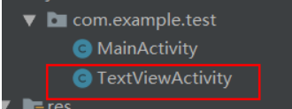

然后修改主界面

```xml
<?xml version="1.0" encoding="utf-8"?>
<LinearLayout
    xmlns:android="http://schemas.android.com/apk/res/android"
    xmlns:tools="http://schemas.android.com/tools"
    xmlns:app="http://schemas.android.com/apk/res-auto"
    android:layout_width="match_parent"
    android:layout_height="match_parent"
    tools:context=".MainActivity">

    <Button
        android:layout_width="match_parent"
        android:layout_height="50dp"
        android:id="@+id/btn_1"
        android:text="登陆"
        android:textSize="20sp"/>
</LinearLayout>
```


添加点击事件

```java
public class MainActivity extends AppCompatActivity {

    private Button mbtn;//声明button对象
    @Override
    protected void onCreate(Bundle savedInstanceState) {
        super.onCreate(savedInstanceState);
        setContentView(R.layout.activity_main);
        mbtn = findViewById(R.id.btn_1);//通过id找到要绑定点击事件的按钮
        mbtn.setOnClickListener(new View.OnClickListener() {//点击事件函数
            @Override
            public void onClick(View view) {
                Intent intent = new Intent(MainActivity.this,TextViewActivity.class);//声明跳转界面
                startActivity(intent);//执行intent
            }
        });
    }
}
```


TextView相关属性

```xml
 <!--省略文字多余部分，以点代替-->
<TextView
        android:layout_width="100dp"
        android:layout_height="100dp"
        android:id="@+id/tv_2"
        android:text="@string/tv_1"
        android:textSize="30sp"
        android:paddingLeft="20dp"
        android:paddingTop="10dp"
        android:maxLines="1"
        android:ellipsize="end" #作用是当文字长度超过textview宽度时的显示方式:
        />
```

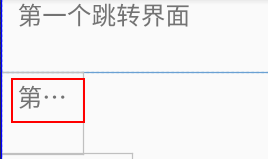


```xml
<TextView
        android:id="@+id/tv_3"
        android:layout_width="wrap_content"
        android:layout_height="wrap_content"
        android:drawableRight="@drawable/weather" #在该文本框右边添加图片，来自drawable目录
        android:paddingLeft="20dp"
        android:paddingTop="10dp"
        android:text="杨海涛"
        android:textSize="30sp" />
```


```java
        /*设置中划线效果*/
        mtv = findViewById(R.id.tv_4);
        mtv.getPaint().setFlags(Paint.STRIKE_THRU_TEXT_FLAG);//中划线
        //mtv.getPaint().setAntiAlias(true);//去除锯齿
        /*设置下划线效果*/
        mtv2 = findViewById(R.id.tv_5);
        mtv2.getPaint().setFlags(Paint.UNDERLINE_TEXT_FLAG);//下划线
```

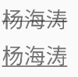

```xml
 <!--设置跑马灯效果-->
<TextView
        android:id="@+id/tv_6"
        android:layout_width="wrap_content"
        android:layout_height="wrap_content"
        android:drawablePadding="2dp"
        android:paddingLeft="20dp"
        android:paddingTop="10dp"
        android:text="万可爱万可爱万可爱万可爱万可爱"
        android:textSize="30sp"
        android:singleLine="true"  #等效于（android:lines="1"  android:ellipsize="end"）
        android:ellipsize="marquee"  #以横向滚动方式显示(需获得当前焦点时)
        android:marqueeRepeatLimit="marquee_forever" #循环次数
        android:focusable="true"  #获取焦点
        android:focusableInTouchMode="true" #获取焦点
  />
```

由于在实际的开发中，页面的布局往往比较复杂，如果显示两个跑马灯的文字，这种方法只能实现第一个，第二个不会出现效果。采用如下方法：

创建一个类继承TextView

```java
package com.yht.musicaudio;

import android.annotation.SuppressLint;
import android.content.Context;
import android.util.AttributeSet;
import android.widget.TextView;

@SuppressLint("AppCompatCustomView")
public class Marquee_Text extends TextView {
    public Marquee_Text(Context context) {
        super(context);
    }

    public Marquee_Text(Context context, AttributeSet attrs) {
        super(context, attrs);
    }

    public Marquee_Text(Context context, AttributeSet attrs, int defStyleAttr) {
        super(context, attrs, defStyleAttr);
    }

    @Override
    public boolean isFocused() {
        return true;
    }
}

```


然后就可以自己调用自己写的textview

```xml
 <com.yht.musicaudio.Marquee_Text
            android:id="@+id/song_name"
            android:layout_width="100dp"
            android:layout_height="wrap_content"
            android:layout_alignParentRight="true"
            android:layout_alignParentBottom="true"
            android:layout_marginTop="12dp"
            android:layout_marginRight="30dp"
            android:layout_marginBottom="31dp"
            android:text=""
            android:textSize="20sp"
            android:singleLine="true"
            android:ellipsize="marquee"
            android:marqueeRepeatLimit="marquee_forever"
            android:focusable="true"
            android:focusableInTouchMode="true" />

        <com.yht.musicaudio.Marquee_Text
            android:id="@+id/singer_name"
            android:layout_width="wrap_content"
            android:layout_height="wrap_content"
            android:layout_alignParentRight="true"

            android:layout_marginRight="50dp"
            android:layout_marginTop="40dp"
            android:layout_alignLeft="@+id/song_name"
            android:layout_marginLeft="1dp"
            android:text=""
            android:singleLine="true"
            android:ellipsize="marquee"
            android:marqueeRepeatLimit="marquee_forever"
            android:focusable="true"
            android:focusableInTouchMode="true"/>
```

### 2.Button

Android中所有的控件都具有这两个属性，可选值有3种：**match_parent、fill_parent、wrap_content.**

其中match_parent和fill_parent的意义相同，但官方更推荐match_parent.

==match_parent表示让当前控件的大小和父布局的大小一样，也就是由父布局来决定当前控件的大小==

==wrap_content表示让当前的控件大小能够刚好包含里面的内容，也就是由控件内容决定当前控件的大小==

```xml
<Button
        android:layout_width="match_parent"
        android:layout_height="wrap_content"
        android:layout_marginTop="10dp"
        android:text="EditText"
        android:textAllCaps="false" #默认组件的text为全部大写，false取消默认
        android:textSize="20sp"/>
```

**1.改变button颜色，边框**

在drawable里面创建drawable resource file

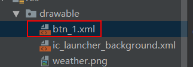


```xml
<?xml version="1.0" encoding="utf-8"?>
<shape xmlns:android="http://schemas.android.com/apk/res/android"    android:shape="rectangle">     
     <solid   android:color="#ff0000"></solid> <!--设置颜色-->   
     <corners android:radius="10dp"></corners> <!--设置边框幅度-->
</shape>
```

```xml
android:background="@drawable/btn_1"  //设计文件调用
```


**2.边框：**

```xml
<?xml version="1.0" encoding="utf-8"?>
<shape xmlns:android="http://schemas.android.com/apk/res/android"
    android:shape="rectangle">

    <stroke android:width="1dp"
            android:color="#00ff00"/> <!--设计边框样式-->
    <solid android:color="#ffffff"/><!--注意！！一定要填充，否则按钮显示不出来-->
</shape>
```

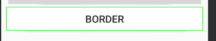

**3.按压效果**

```xml
<?xml version="1.0" encoding="utf-8"?>
<selector xmlns:android="http://schemas.android.com/apk/res/android">
    <item android:state_pressed="false"><!--按压前样式-->
        <shape>
            <solid android:color="#ff0000"/>
        </shape>
    </item>
    <item android:state_pressed="true"><!--按压时候样式-->
        <shape>
            <solid android:color="#ffffff"/>
        </shape>
    </item>
</selector>
```

**4.设置按钮点击事件（两种办法）**

```java
  //①在Activity里面书写方法，且必须带参数View
    public void showToast(View view){
        /**
         * Toast.LENGTH_SHORT是提示显示的时长
         * 最后必须调用show()方法，否则不会弹出
         */
        Toast.makeText(this,"欢迎您",Toast.LENGTH_SHORT).show();
    }
```

```properties
android:onClick="showToast" #调用
```


或者：

```java
/*或者在OnClick方法里面*/
 mbtn = findViewById(R.id.btn_1);
        mbtn.setOnClickListener(new View.OnClickListener() {//点击事件
            @Override
            public void onClick(View view) {
              Toast.makeText(this,"欢迎您",Toast.LENGTH_SHORT).show();
            }
        });
```


### 3.ImageView

```xml
 
<ImageView
        android:layout_width="300dp"
        android:layout_height="200dp"
        android:background="#00ff00"
        android:src="@drawable/ultraman"  #图片名称一定要有字母
        android:scaleType="centerCrop"/>  
         <!--scaleType的三个属性：1.fitXY：撑满控件，宽高比会被拉伸；
                                 2.fitCenter/center：保持宽高比缩放，直至能够完全显示
                                 3.centerCrop：保持宽高比缩放，直至完全覆盖控件，裁剪显                                                    示-->
  
```

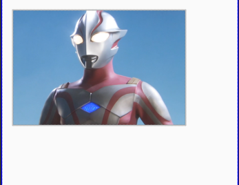

**使用imgView加载网络图片**

1.使用第三方库，去git上面找到glide库插件

```groovy
/*在项目gradle里面引入依赖*/
repositories {
  google()
  jcenter()
}

dependencies {
  implementation 'com.github.bumptech.glide:glide:4.11.0'
  annotationProcessor 'com.github.bumptech.glide:compiler:4.11.0'
}
```

用法

```java
// For a simple view:
@Override public void onCreate(Bundle savedInstanceState) {
  ...
  ImageView imageView = (ImageView) findViewById(R.id.my_image_view);

  Glide.with(this).load("http://goo.gl/gEgYUd").into(imageView);
}
```

由于是要进行网络请求，所以要到manifest.xml中开启网络权限

```xml
 <!--声明开启网络权限-->
    <uses-permission android:name="android.permission.INTERNET"/>
```


### 4.RadioButton

```java
/*由于每一个按钮点击跳转事件都重复写太过繁琐，以下为更新*/
public class MainActivity extends AppCompatActivity {

    private Button mbtn;//声明对象
    private Button mbtnEditText;//edittext
    private Button radiobtn;//radiobutton
    @Override
    protected void onCreate(Bundle savedInstanceState) {
        super.onCreate(savedInstanceState);
        setContentView(R.layout.activity_main);
        mbtn = findViewById(R.id.btn_1);//找到控件
        mbtnEditText = findViewById(R.id.edittext);
        radiobtn = findViewById(R.id.radiobt);
        setClicklistener();//调用方法
      
        /*之气方法，如果按钮组件过多，每次重写会很麻烦*/
        /*  radiobtn.setOnClickListener(new View.OnClickListener() {
            @Override
            public void onClick(View view) {
                Intent intent = new Intent(MainActivity.this,RadioActivity.class);
                startActivity(intent);
            }
        });*/
        
        }
		//通过该方法进行点击事件调用
        public void setClicklistener(){
            OnClick onClick = new OnClick();
            mbtn.setOnClickListener(onClick);
            mbtnEditText.setOnClickListener(onClick);
            radiobtn.setOnClickListener(onClick);
        }
    private class OnClick implements View.OnClickListener{//内部类实现接口View.OnClickListener
        @Override
        public void onClick(View view) {
            Intent intent = null;
            switch (view.getId()){//通过switch语句进行选择跳转
                case R.id.btn_1:
                    intent = new Intent(MainActivity.this,TextViewActivity.class);//实现界面跳转
                    break;
                case R.id.edittext:
                    intent = new Intent(MainActivity.this,EditTextActivity.class);
                    break;
                case R.id.radiobt:
                    intent = new Intent(MainActivity.this,RadioActivity.class);
                    break;
            }
            startActivity(intent);
        }
    }
}
```

#### **!! gravity属性 !!**

**补上一个需要记忆的点:**

**android:layout_gravity面向的是整个控件对于父控件的位置**

**android:gravity面向的是控件中内容对于这个控件的位置。** 


RadioButton控件的布局文件

```xml
<!--当多个rb时，要设置只能选一个就要放进radiogroup里面-->
<RadioGroup
        android:id="@+id/rg"
        android:layout_width="wrap_content"
        android:layout_height="wrap_content"
        android:orientation="vertical"> #排列方式
        <RadioButton
            android:id="@+id/rb_1"
            android:layout_width="50dp"
            android:layout_height="30dp"
            android:text="男"
            android:textSize="20sp"
            android:checked="true"   #默认选中该按钮
            />
        <RadioButton
            android:id="@+id/rb_2"
            android:layout_width="50dp"
            android:layout_height="30dp"
            android:text="女"
            android:textSize="20sp"
            />
 </RadioGroup>
```

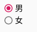

为该组radiobutton添加选中监听事件

```java
private RadioGroup radioGroup;
    @Override
    protected void onCreate(Bundle savedInstanceState) {
        super.onCreate(savedInstanceState);
        setContentView(R.layout.activity_radio);

        radioGroup = findViewById(R.id.rg);
        radioGroup.setOnCheckedChangeListener(new RadioGroup.OnCheckedChangeListener() {//设置该组的选中事件
            @Override
            public void onCheckedChanged(RadioGroup radioGroup, int i) {
                RadioButton radioButton = radioGroup.findViewById(i);//通过id查找选中的radiobutton
                /**
                 * makeText()，是Toast的一个方法，用来显示信息，分别有三个参数。
                 * 第一个参数：this，是上下文参数，指当前页面显示
                 * 第二个参数：“string string string ”是你想要显示的内容，
                 * 第三个参数：Toast.LENGTH_LONG，是你指你提示消息，显示的时间，这个是稍微长点儿，对应的另一个是ToastLENGTH_SHORT，这个时间短点儿，大概2秒钟。
                 * show()，表示显示这个Toast消息提醒，当程序运行到这里的时候，就会显示出来，如果不调用show()方法，这个Toast对象存在，但是并不会显示，所以一定不要忘记。
                 */
                Toast.makeText(RadioActivity.this,radioButton.getText(),Toast.LENGTH_SHORT).show();//将选中按钮的text显示出来
            }
        });

    }
```

### 5.CheckBox

```xml
    <TextView
        android:layout_width="wrap_content"
        android:layout_height="wrap_content"
        android:text="你会什么编程技术"
        android:textSize="25sp" />
    <CheckBox
        android:layout_width="wrap_content"
        android:layout_height="wrap_content"
        android:text="Java"
        android:textSize="20sp"
        android:id="@+id/cb1"
        />
    <CheckBox
        android:layout_width="wrap_content"
        android:layout_height="wrap_content"
        android:text="C++"
        android:textSize="20sp"
        android:id="@+id/cb2"
        />
    <CheckBox
        android:layout_width="wrap_content"
        android:layout_height="wrap_content"
        android:text="C#"
        android:textSize="20sp"
        android:id="@+id/cb3"
        />
    <CheckBox
        android:layout_width="wrap_content"
        android:layout_height="wrap_content"
        android:text="None"
        android:textSize="20sp"
        android:id="@+id/cb4"
        />
```


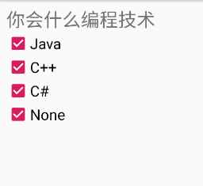

自定义按钮样式

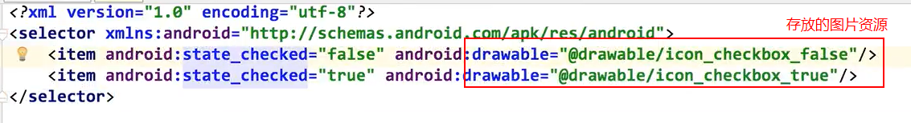

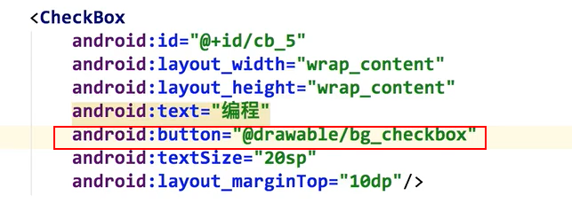

编写他的点击事件

```java
    private CheckBox checkBox1;
    private CheckBox checkBox2;
    @Override
    protected void onCreate(Bundle savedInstanceState) {
        super.onCreate(savedInstanceState);
        setContentView(R.layout.activity_check_box);

        checkBox1 = findViewById(R.id.cb1);
        checkBox2 = findViewById(R.id.cb2);
        checkBox1.setOnCheckedChangeListener(new CompoundButton.OnCheckedChangeListener() {
            @Override
            public void onCheckedChanged(CompoundButton compoundButton, boolean b) {
                Toast.makeText(CheckBoxActivity.this,b?"选中java":"未选中java",Toast.LENGTH_SHORT).show();
            }
        });

        checkBox2.setOnCheckedChangeListener(new CompoundButton.OnCheckedChangeListener() {
            @Override
            public void onCheckedChanged(CompoundButton compoundButton, boolean b) {
                Toast.makeText(CheckBoxActivity.this,b?"选中C++":"未选中C++",Toast.LENGTH_SHORT).show();
            }
        });
    }
```

### 6.EditText

新建跳转EditText按钮

```xml
 <Button
        android:layout_width="match_parent"
        android:layout_height="50dp"
        android:layout_marginTop="10dp"
        android:text="EditText"
        android:textAllCaps="false" #默认组件的text为全部大写，false取消默认
        android:textSize="20sp"/>
```


```xml
 <EditText
        android:id="@+id/ed1"
        android:layout_width="match_parent"
        android:layout_height="50dp"
        android:hint="Username"  
    />
  <EditText
        android:id="@+id/ed2"
        android:layout_width="match_parent"
        android:layout_height="50dp"
        android:hint="Password"   #类似于html的placeholder，输入提示
        android:inputType="textPassword"  #出现暗文，可以更改输入类型，例如数字
        android:layout_below="@+id/ed1"
     />
```

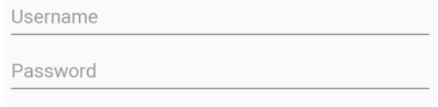

#### 设置EditText的监听事件

```java
        private EditText editText;
        editText = findViewById(R.id.ed1);
        editText.addTextChangedListener(new TextWatcher() {
            @Override
            public void beforeTextChanged(CharSequence charSequence, int i, int i1, int i2) {

            }

            @Override
            public void onTextChanged(CharSequence charSequence, int i, int i1, int i2) {
                Log.d("监听edittext",charSequence.toString());//输入实时监听
            }

            @Override
            public void afterTextChanged(Editable editable) {

            }
        });
```

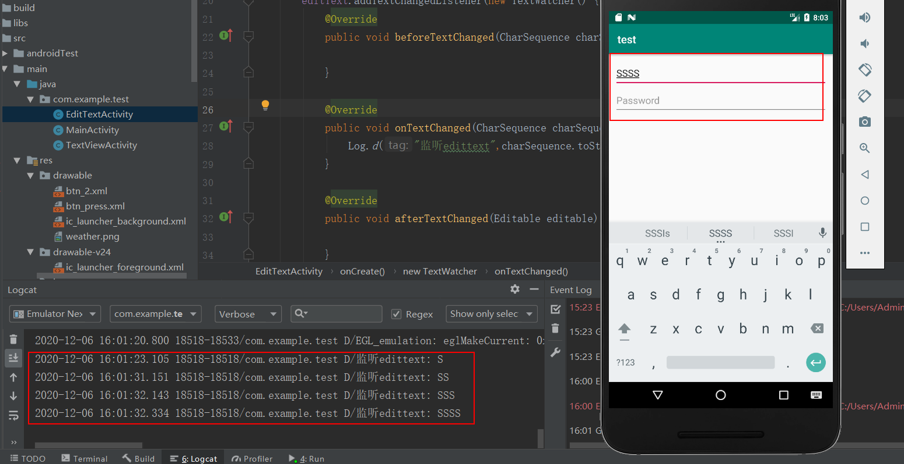

### 7.ScrollView

注意：scrollview里面只能有一个直接子元素，所以可以创建一个linearlayout，然后再linear里面创建控件

```xml
<?xml version="1.0" encoding="utf-8"?>
<!--整个页面布局设置为ScrollView，垂直的-->
<ScrollView
    xmlns:android="http://schemas.android.com/apk/res/android"
    xmlns:tools="http://schemas.android.com/tools"
    xmlns:app="http://schemas.android.com/apk/res-auto"
    android:layout_width="match_parent"
    android:layout_height="match_parent"
    tools:context=".MainActivity"
    android:padding="10dp">

    <LinearLayout
        android:layout_width="match_parent"
        android:layout_height="match_parent"
        android:orientation="vertical"
        >
        <Button
            android:layout_width="match_parent"
            android:layout_height="50dp"
            android:id="@+id/btn_1"
            android:text="登陆"
            android:textSize="20sp" />

        <Button
            android:layout_width="match_parent"
            android:layout_height="50dp"
            android:text="EditText"
            android:textAllCaps="false"
            android:textSize="20sp"
            android:id="@+id/edittext"/>

        <Button
            android:layout_width="match_parent"
            android:layout_height="wrap_content"
            android:text="Border"
            android:textSize="20sp"
            android:background="@drawable/btn_press"
            android:onClick="showToast"/>

        <Button
            android:layout_width="match_parent"
            android:layout_height="50dp"
            android:text="RadioButton"
            android:textAllCaps="false"
            android:textSize="20sp"
            android:id="@+id/radiobt"/>
        <Button
            android:layout_width="match_parent"
            android:layout_height="50dp"
            android:text="CheckBox"
            android:textAllCaps="false"
            android:textSize="20sp"
            android:id="@+id/cb"/>
        <Button
            android:layout_width="match_parent"
            android:layout_height="50dp"
            android:text="ImgView"
            android:textAllCaps="false"
            android:textSize="20sp"
            android:id="@+id/im_view"/>
        <Spinner
            android:id="@+id/planets_array"
            android:layout_width="fill_parent"
            android:layout_height="wrap_content" />
        <!--在里面设置一个水平的ScrollView-->
        <HorizontalScrollView
            android:layout_width="match_parent"
            android:layout_height="wrap_content">
            <LinearLayout
                android:layout_width="wrap_content"
                android:layout_height="wrap_content"
                android:orientation="horizontal">
                <Button
                    android:layout_width="match_parent"
                    android:layout_height="50dp"
                    android:text="CheckBox"
                    android:textAllCaps="false"
                    android:textSize="20sp"
                    android:id="@+id/btn1"/>
                <Button
                    android:layout_width="match_parent"
                    android:layout_height="50dp"
                    android:text="ImgView"
                    android:textAllCaps="false"
                    android:textSize="20sp"
                    android:id="@+id/btn2"/>
                <Button
                    android:layout_width="match_parent"
                    android:layout_height="50dp"
                    android:text="ImgView"
                    android:textAllCaps="false"
                    android:textSize="20sp"
                    android:id="@+id/btn3"/>
                <Button
                    android:layout_width="match_parent"
                    android:layout_height="50dp"
                    android:text="ImgView"
                    android:textAllCaps="false"
                    android:textSize="20sp"
                    android:id="@+id/btn4"/>
                <Button
                    android:layout_width="match_parent"
                    android:layout_height="50dp"
                    android:text="ImgView"
                    android:textAllCaps="false"
                    android:textSize="20sp"
                    android:id="@+id/btn5"/>
            </LinearLayout>
        </HorizontalScrollView>
    </LinearLayout>

</ScrollView>
```

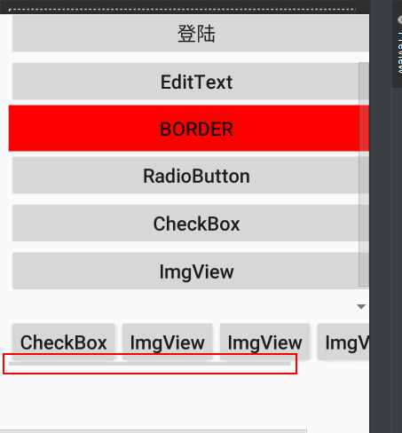

### 8.Spinner

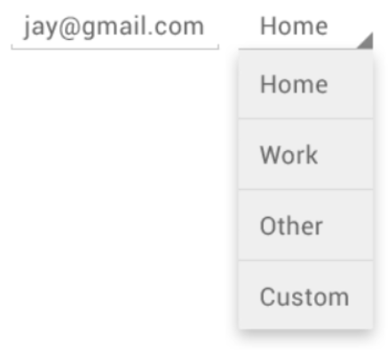


```xml
<Spinner
    android:id="@+id/planets_spinner"
    android:layout_width="fill_parent"
    android:layout_height="wrap_content" />
```


 微调框选项不限来源，但您必须通过 `SpinnerAdapter` 提供这些选项，例如：若通过数组获取选项，则提供方式应为 `ArrayAdapter`；若通过数据库查询获取选项，则提供方式应为 `CursorAdapter`。 

```xml
<!--例如，如果预先确定了微调框的可用选项，则可通过字符串资源文件中定义的字符串数组来提供这些选项：-->
<!--必须建在values下面，且必须以resources为根部-->
<?xml version="1.0" encoding="utf-8"?>
<resources>
    <string-array name="planets_array">
        <item>Mercury</item>
        <item>Venus</item>
        <item>Earth</item>
        <item>Mars</item>
        <item>Jupiter</item>
        <item>Saturn</item>
        <item>Uranus</item>
        <item>Neptune</item>
    </string-array>
</resources>
```

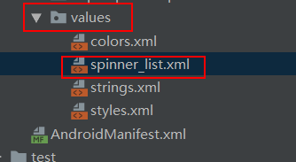

 对于如上所示数组，您可以在 `Activity` 或 `Fragment` 中使用以下代码，从而使用 `ArrayAdapter` 实例为微调框提供该数组： 

```java
Spinner spinner = (Spinner) findViewById(R.id.spinner);

/*借助 createFromResource() 方法，您可以从字符串数组创建 ArrayAdapter。此方法的第三个参数是布局资源，该参数定义了所选选项在微调框控件中的显示方式。simple_spinner_item 布局是平台提供的默认布局，除非您想为微调框外观定义自己的布局，否则应使用此布局。*/
ArrayAdapter<CharSequence> adapter = ArrayAdapter.createFromResource(this,
        R.array.planets_array, android.R.layout.simple_spinner_item);//array会爆红，但是运行结果没有错

/*调用 setDropDownViewResource(int)，从而指定适配器用于显示微调框选择列表的布局（simple_spinner_dropdown_item 是平台定义的另一种标准布局）。*/

adapter.setDropDownViewResource(android.R.layout.simple_spinner_dropdown_item);

/*setAdapter() 将适配器应用到 Spinner*/
spinner.setAdapter(adapter);
```

### 9.WebView

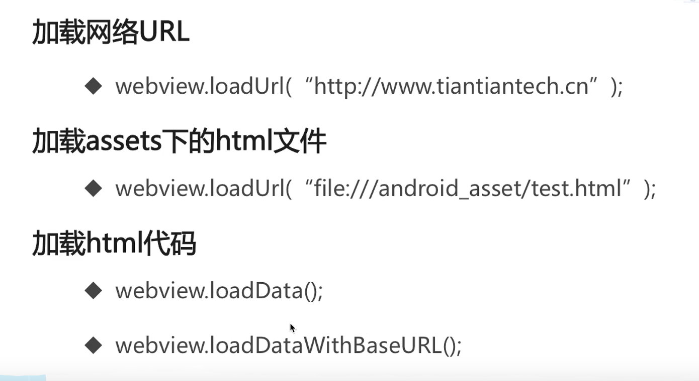


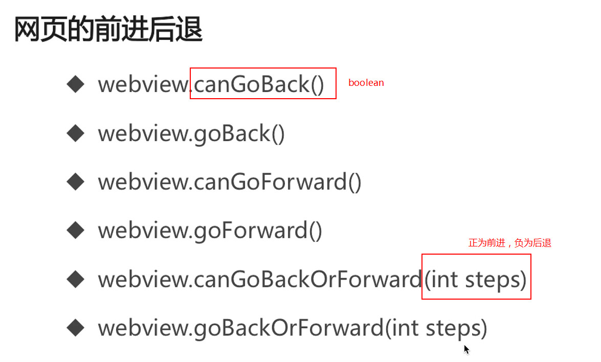

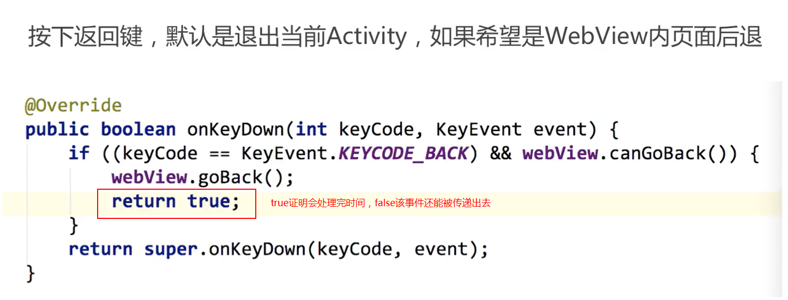


1.访问本地Assets目录下资源

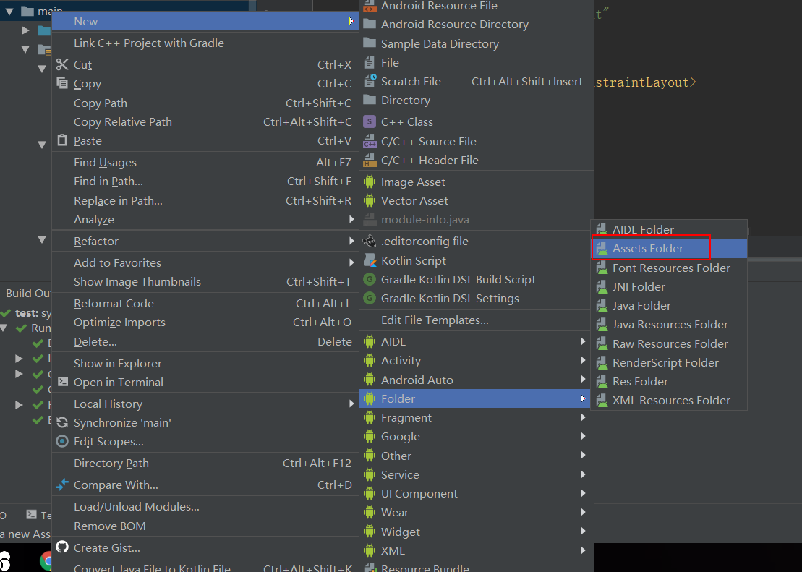

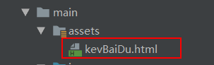


创建WebView

```xml
<WebView
        android:layout_width="match_parent"
        android:layout_height="match_parent"
        android:id="@+id/wv1"></WebView>
```

activity

```java
public class WebViewActivity extends AppCompatActivity {

    private WebView webView;
    @Override
    protected void onCreate(Bundle savedInstanceState) {
        super.onCreate(savedInstanceState);
        setContentView(R.layout.activity_web_view);
        webView = findViewById(R.id.wv1);
        webView.loadUrl("file:///android_asset/kevBaiDu.html");//加载本地assets内容

    }
}
```


加载网络网页

```java
public class WebViewActivity extends AppCompatActivity {

    private WebView webView;
    @Override
    protected void onCreate(Bundle savedInstanceState) {
        super.onCreate(savedInstanceState);
        setContentView(R.layout.activity_web_view);
        webView = findViewById(R.id.wv1);

        //加载本地网页
        //webView.loadUrl("file:///android_asset/kevBaiDu.html");
        //加载网络资源
        webView.getSettings().setJavaScriptEnabled(true);//添加js支持，否则加载不出来
        webView.setWebViewClient(new MyWebViewClient());//添加webview client,网页跳转在本应用进行
        webView.loadUrl("https://m.baidu.com");//m代表mobile,与web端不同
    }

    class MyWebViewClient extends WebViewClient{

        //当网页跳转时就在本应用上加载,不会让你去其他应用加载
        @RequiresApi(api = Build.VERSION_CODES.LOLLIPOP)
        @Override
        public boolean shouldOverrideUrlLoading(WebView view, WebResourceRequest request) {
           view.loadUrl(request.getUrl().toString());
            return true;
        }

        //网页开始加载显示log
        @Override
        public void onPageStarted(WebView view, String url, Bitmap favicon) {
            super.onPageStarted(view, url, favicon);
            Log.d("webView","started");
        }

        //网页加载结束显示
        @Override
        public void onPageFinished(WebView view, String url) {
            super.onPageFinished(view, url);
            Log.d("weview","ended");
        }
    }

    //是否能够回退，如果可以返回上一级，而不是直接结束activity
    @Override
    public boolean onKeyDown(int keyCode, KeyEvent event) {
        if (keyCode == KeyEvent.KEYCODE_BACK && webView.canGoBack()){
            webView.goBack();
            return true;
        }
        return super.onKeyDown(keyCode, event);
    }
}

```


要实现一些其他功能

```java
 //WebChromeClient可以提供一些与网页相关的方法
    class MyWebChromeClient extends WebChromeClient{
        @Override
        //实现网页加载进度条展示
        public void onProgressChanged(WebView view, int newProgress) {
            super.onProgressChanged(view, newProgress);
        }

        @Override
        //加载网页标题
        public void onReceivedTitle(WebView view, String title) {
            super.onReceivedTitle(view, title);
            setTitle(title);
        }
    }

//调用
 webView.setWebChromeClient(new MyWebChromeClient());//添加WebChromeClient
```


activity完整代码

```java
public class WebViewActivity extends AppCompatActivity {

    private WebView webView;
    @Override
    protected void onCreate(Bundle savedInstanceState) {
        super.onCreate(savedInstanceState);
        setContentView(R.layout.activity_web_view);
        webView = findViewById(R.id.wv1);

        //加载本地网页

        /*webView.getSettings().setDomStorageEnabled(true);
        webView.getSettings().setUseWideViewPort(true);//适应分辨率
        webView.getSettings().setLoadWithOverviewMode(true);
        webView.loadUrl("file:///android_asset/login.html");*/
        //加载网络资源
        webView.getSettings().setJavaScriptEnabled(true);//添加js支持，否则加载不出来
        webView.setWebViewClient(new MyWebViewClient());//添加webview client
        webView.setWebChromeClient(new MyWebChromeClient());//添加WebChromeClient
        webView.loadUrl("https://m.baidu.com");//m代表mobile,与web端不同*/
    }

    class MyWebViewClient extends WebViewClient{

        //当网页跳转时就在本应用上加载,不会让你去其他应用加载
        @RequiresApi(api = Build.VERSION_CODES.LOLLIPOP)
        @Override
        public boolean shouldOverrideUrlLoading(WebView view, WebResourceRequest request) {
           view.loadUrl(request.getUrl().toString());
            return true;
        }

        //网页开始加载显示log
        @Override
        public void onPageStarted(WebView view, String url, Bitmap favicon) {
            super.onPageStarted(view, url, favicon);
            Log.d("webView","started");
        }

        //网页加载结束显示
        @Override
        public void onPageFinished(WebView view, String url) {
            super.onPageFinished(view, url);
            Log.d("weview","ended");
        }
    }
    //WebChromeClient可以提供一些与网页相关的方法
    class MyWebChromeClient extends WebChromeClient{
        @Override
        //实现网页加载进度条展示
        public void onProgressChanged(WebView view, int newProgress) {
            super.onProgressChanged(view, newProgress);
        }

        @Override
        //加载网页标题
        public void onReceivedTitle(WebView view, String title) {
            super.onReceivedTitle(view, title);
            setTitle(title);
        }
    }

    //是否能够回退，如果可以返回上一级
    @Override
    public boolean onKeyDown(int keyCode, KeyEvent event) {
        if (keyCode == KeyEvent.KEYCODE_BACK && webView.canGoBack()){
            webView.goBack();
            return true;
        }
        return super.onKeyDown(keyCode, event);
    }
}
```


在java代码中还可以实现js代码

```java
webView.loadUrl("javascript:alert('hello')");
//或者
webView.evaluateJavascript("javascript:alert('hello')");
```


### 10.Toast

消息提示快

**想要Toast显示，必须调用`show`方法**

创建一个默认样式的Toast

> ```java
> //默认样式
> Toast.makeText(getApplicationContext(),"Toast",Toast.LENGTH_LONG).show();//getApplicationContext()就是指当前Activity
> 
> //更改显示位置
> Toast toastcenter = Toast.makeText(getApplicationContext(),"toast",Toast.LENGTH_LONG);
> toastcenter.setGravity(Gravity.CENTER,0,0);//让它居中
> toastcenter.show();
> ```

创建一个填充自定义样式的Toast

> ```java
> //更改显示样式，例如加上图片和文字
> Toast toastCustom = new Toast(ToastActivity.this);//创建toast对象
> LayoutInflater layoutInflater = LayoutInflater.from(ToastActivity.this);//声明布局对象
> View view1 = layoutInflater.inflate(R.layout.layout_toast,null);//添加布局，返回view类型
> 
> ImageView imageView = view1.findViewById(R.id.iv_toast);
> imageView.setImageResource(R.drawable.weather);//为imgview添加图片
> TextView textView = view1.findViewById(R.id.tv_toast);
> textView.setText("您好");//为textview添加文本
> 
> toastCustom.setView(view1);//将view添加进toast
> toastCustom.setDuration(Toast.LENGTH_SHORT);//设置显示长度
> toastCustom.show();
> ```
>
> ```xml
> <!--自定义布局文件layout_toast.xml-->
> <?xml version="1.0" encoding="utf-8"?>
> <LinearLayout xmlns:android="http://schemas.android.com/apk/res/android"
>  android:orientation="vertical"
>  android:layout_width="wrap_content"
>  android:layout_height="wrap_content"
>  android:background="#99000000"  
>  android:gravity="center">
>  <!--由于根布局linearlayout的长宽会失效，所以再设置一个layout-->
>  <LinearLayout
>      android:layout_width="200dp"
>      android:layout_height="200dp"
>      android:gravity="center"
>      android:orientation="vertical">
>      <ImageView
>          android:layout_width="100dp"
>          android:layout_height="100dp"
>          android:id="@+id/iv_toast"
>          android:scaleType="centerCrop"/>
> 
>      <TextView
>          android:id="@+id/tv_toast"
>          android:layout_width="wrap_content"
>          android:layout_height="wrap_content"
>          android:layout_marginTop="20dp"
>          android:textColor="#ffffff"
>          android:textSize="18sp" />
>  </LinearLayout>
> 
> </LinearLayout>
> ```
>
> 效果图
>
> 


#### 封装

由于`toast`也属于对象，所以如果连续按压会导致每一个toast等待前面一个toast结束之后才会显示，为此，书写一个工具类进行封装优化

```java
public class ToastUtil {
    public static Toast toast;
    public static void showMsg(Context context,String msg){//传过来context和text内容
        if(toast == null){
            toast = Toast.makeText(context,msg,Toast.LENGTH_LONG);//如果没有被调用，则初始化toast
        }else{
            toast.setText(msg);//否则只给他添加text
        }
        toast.show();
    }
}
```

```java
//调用
ToastUtil.showMsg(getApplicationContext(),"toastutil");
```


### 11.Popup window

创建PopupActivity

创建一个按钮

```xml
 <Button
        android:layout_width="wrap_content"
        android:layout_height="wrap_content"
        android:text="PopUp"
        android:layout_marginTop="30dp"
        android:id="@+id/Pop_up"/>
```

然后创建一个布局文件，设置下拉的内容


```xml
<?xml version="1.0" encoding="utf-8"?>
<LinearLayout xmlns:android="http://schemas.android.com/apk/res/android"
    android:orientation="vertical"
    android:layout_width="match_parent"
    android:layout_height="match_parent"
    android:gravity="center_horizontal">

    <TextView
        android:layout_width="wrap_content"
        android:layout_height="wrap_content"
        android:text="数学"
        android:textSize="30sp"
        android:id="@+id/tx_1"/>
    <View
        android:layout_width="match_parent"
        android:layout_height="1dp"
        android:background="#000000"/>
    <TextView
        android:layout_width="wrap_content"
        android:layout_height="wrap_content"
        android:text="语文"
        android:textSize="30sp"

        android:layout_marginTop="10dp"/>
    <View
        android:layout_width="match_parent"
        android:layout_height="1dp"
        android:background="#000000"/>
    <TextView
        android:layout_width="wrap_content"
        android:layout_height="wrap_content"
        android:text="英语"
        android:textSize="30sp"

        android:layout_marginTop="10dp"/>
    <View
        android:layout_width="match_parent"
        android:layout_height="1dp"
        android:background="#000000"/>

</LinearLayout>
```


PopupActivity里面代码

```java
public class PopupActivity extends AppCompatActivity {

    private Button button;
    private PopupWindow popupWindow;
    @Override
    protected void onCreate(Bundle savedInstanceState) {
        super.onCreate(savedInstanceState);
        setContentView(R.layout.activity_popup);
        button = findViewById(R.id.Pop_up);
        button.setOnClickListener(new View.OnClickListener() {
            @Override
            public void onClick(View view) {

                View view1 = getLayoutInflater().inflate(R.layout.popup_list,null);//找到视图
                TextView textView = view1.findViewById(R.id.tx_1);//找到textview
                textView.setOnClickListener(new View.OnClickListener() {
                    @Override
                    public void onClick(View view) {
                        popupWindow.dismiss();//popup消失
                        ToastUtil.showMsg(PopupActivity.this,textView.getText().toString());
                    }
                });
                popupWindow = new PopupWindow(view1,button.getWidth(), ViewGroup.LayoutParams.WRAP_CONTENT);//声明对象，添加布局，宽度为button宽度
                popupWindow.setOutsideTouchable(true);//点击外部区域会消失，与Cancleable相反
                popupWindow.setFocusable(true);//每次点击按钮都不会弹出来，而是点一次关掉，下一次打开交替的动作
                popupWindow.showAsDropDown(button);//设置展示的位置

            }
        });
    }
}
```

### 12.Dialog

**1.默认样式的dialog**

```java
AlertDialog.Builder builder = new AlertDialog.Builder(AlertdialogActivity.this);
builder.setTitle("请回答");//设置标题
builder.setMessage("你觉得杨海涛帅吗");//设置内容
builder.setIcon(R.drawable.weather);//设置图标

//alertdialog提供三种类型按键，这是positive类型的
builder.setPositiveButton("帅", new DialogInterface.OnClickListener() {
    @Override
    public void onClick(DialogInterface dialogInterface, int i) {
        ToastUtil.showMsg(AlertdialogActivity.this,"真诚实");//点击事件为显示toast
    }
});
///neutral类型
builder.setNeutralButton("一般般", new DialogInterface.OnClickListener() {
    @Override
    public void onClick(DialogInterface dialogInterface, int i) {
        ToastUtil.showMsg(getApplicationContext(),"滚");
    }
});
//negative类型
builder.setNegativeButton("不好看", new DialogInterface.OnClickListener() {
    @Override
    public void onClick(DialogInterface dialogInterface, int i) {
        ToastUtil.showMsg(getApplicationContext(),"闭上臭嘴");
    }
});
//最重要的要调用show方法
builder.show();
```

效果:


**2.设置item**

```javascript
final String[] arry = new String[]{"男","女"};
builder.setTitle("性别");
builder.setItems(arry, new DialogInterface.OnClickListener() {
                 @Override
                 public void onClick(DialogInterface dialogInterface, int i) {
    ToastUtil.showMsg(getApplicationContext(),arry[i]);
}
});
//最重要的要调用show方法
builder.show();
```

效果：


**3.实现类似radiobutton功能**

```java
final String[] arry2 = new String[]{"男","女"};
builder.setTitle("性别").setSingleChoiceItems(arry2, 0, new DialogInterface.OnClickListener() {
    @Override
    public void onClick(DialogInterface dialogInterface, int i) {
        ToastUtil.showMsg(getApplicationContext(),arry2[i]);
        dialogInterface.dismiss();//点击item以后对话框消失
    }
});
builer.setCancelable(false);//点击空白处对话框不会消失
builder.show();
```

效果:

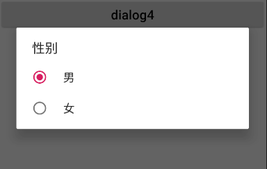

**4.实现checkbox功能**

```java
final String[] arry3 = new String[]{"数学","语文","英语"};
boolean[] isSelect = new boolean[]{false,false,false};

builder.setTitle("选择科目");
builder.setMultiChoiceItems(arry3, isSelect, new DialogInterface.OnMultiChoiceClickListener() {
    @Override
    public void onClick(DialogInterface dialogInterface, int i, boolean b) {
        ToastUtil.showMsg(getApplicationContext(),arry3[i]);
    }
});
builder.setPositiveButton("确定", new DialogInterface.OnClickListener() {
    @Override
    public void onClick(DialogInterface dialogInterface, int i) {

    }
});
builder.setNegativeButton("取消", new DialogInterface.OnClickListener() {
    @Override
    public void onClick(DialogInterface dialogInterface, int i) {
    }
});
builder.show();
```

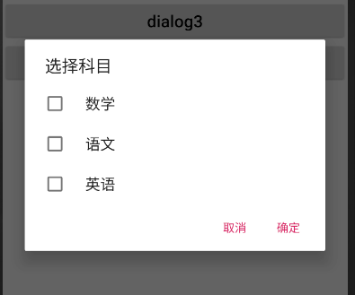

**5.完成登录界面**

新建自定义布局文件

```xml
<?xml version="1.0" encoding="utf-8"?>
<LinearLayout xmlns:android="http://schemas.android.com/apk/res/android"
    android:orientation="vertical"
    android:layout_width="match_parent"
    android:layout_height="match_parent"
    android:padding="10dp">

    <EditText
        android:id="@+id/ed_dialog1"
        android:layout_width="match_parent"
        android:layout_height="50dp"
        android:hint="Username" />
    <EditText
        android:id="@+id/ed_dialog2"
        android:layout_width="match_parent"
        android:layout_height="50dp"
        android:hint="Password"
        android:inputType="textPassword"
        android:layout_below="@+id/ed1"/>
    <Button
        android:layout_width="match_parent"
        android:layout_height="wrap_content"
        android:text="login"
        android:textSize="20sp"
        android:id="@+id/dialog_login"/>
</LinearLayout>
```


```java
//找到布局，返回类型为view
View view1 = LayoutInflater.from(getApplicationContext()).inflate(R.layout.login_dialog,null);
builder.setTitle("登录界面").setView(view1);//将布局放进dialog
Button button = view1.findViewById(R.id.dialog_login);
button.setOnClickListener(new View.OnClickListener() {
    @Override
    public void onClick(View view) {

    }
});
builder.show();
```

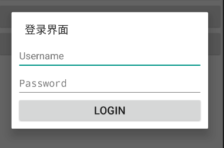

### 13.ProgressBar


安卓自定义的progressbar样式很多：

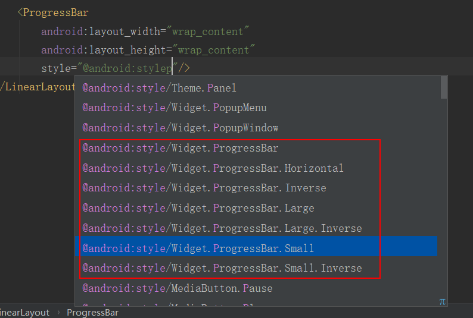

自定义样式

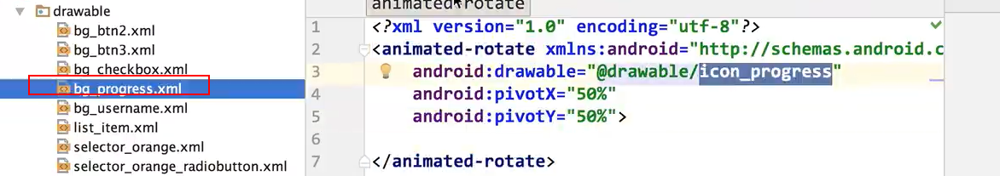


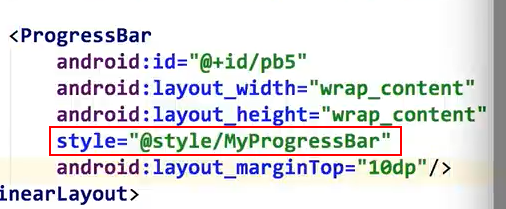

#### 进度条

```xml
<ProgressBar
        android:layout_width="match_parent"
        android:layout_height="wrap_content"
        android:id="@+id/pb4"
        style="@android:style/Widget.Material.ProgressBar.Horizontal"
        android:max="100"  //进度条长度
        android:progress="10"  //当前进度
        android:secondaryProgress="30"  //二级进度
        tools:ignore="NewApi" />
```


实现进度条加载功能

```java
public class ProgressBarActivity extends AppCompatActivity {

    private Button button;
    private ProgressBar progressBar;
    @Override
    protected void onCreate(Bundle savedInstanceState) {
        super.onCreate(savedInstanceState);
        setContentView(R.layout.activity_progress_bar);

        progressBar = findViewById(R.id.pb3);
        button = findViewById(R.id.pb_btn);//按钮点击开始加载
        button.setOnClickListener(new View.OnClickListener() {
            @Override
            public void onClick(View view) {
                handler.sendEmptyMessage(0);//像handler发送消息
            }
        });
    }

    Handler handler = new Handler(){
        @Override
        public void handleMessage(@NonNull Message msg) {
            super.handleMessage(msg);
            if(progressBar.getProgress()<100){
                handler.postDelayed(runnable,500);//进行处理，如果进度小于100，则0.5s延迟后发送给runnable

            }else {
                ToastUtil.showMsg(ProgressBarActivity.this,"加载成功");
            }
        }
    };

    Runnable runnable = new Runnable() {
        @Override
        public void run() {
            progressBar.setProgress(progressBar.getProgress()+5);//加载进度条
            handler.sendEmptyMessage(0);//继续发送消息给handler
        }
    };
}
```


#### progressdialog

```java
button2.setOnClickListener(new View.OnClickListener() {
            @Override
            public void onClick(View view) {
                ProgressDialog progressDialog = new ProgressDialog(ProgressBarActivity.this);
                progressDialog.setTitle("Tips");
                progressDialog.setMessage("加载中");
                
                //点击其他地方不得取消，若实际中加载完成可调用progressDialog.dismiss();
                progressDialog.setCancelable(false);
                progressDialog.show();
            }
        });
```

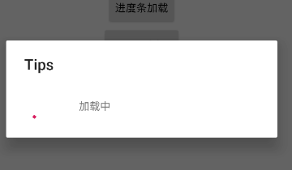

#### 自定义进度条

```java
button3.setOnClickListener(new View.OnClickListener() {
    @Override
    public void onClick(View view) {
        final ProgressDialog progressDialog = new ProgressDialog(ProgressBarActivity.this);
        progressDialog.setProgressStyle(ProgressDialog.STYLE_HORIZONTAL);
        progressDialog.setTitle("tips");
        progressDialog.setMessage("加载中");
        progressDialog.setButton(DialogInterface.BUTTON_POSITIVE, "取消", new DialogInterface.OnClickListener() {
            @Override
            public void onClick(DialogInterface dialogInterface, int i) {
                progressDialog.dismiss();
            }
        });
        progressDialog.show();
        progressDialog.setProgress(10);
    }
});
```

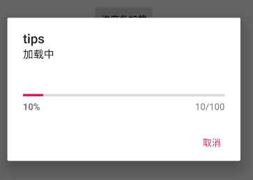

### 14.viewpager

> [Android之viewpager](https://cloud.tencent.com/developer/article/2108418)

