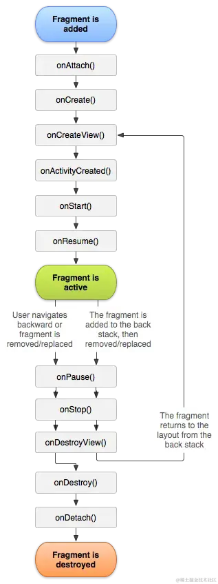

## Fragment


### 1.概述

>  **Fragment表示应用界面中可重复使用的一部分**。Fragment可以定义和管理自己的布局，具有自己的生命周期，并且可以处理自己的输入事件。
>
>  **Fragment 不能独立存在，而是必须由 Activity 或另一个 Fragment 托管**。
>
>  Fragment 的视图层次结构会成为宿主的视图层次结构的一部分，或附加到宿主的视图层次结构。

### 2.模块化

> Fragment 允许您将界面划分为离散的区块，从而将模块化和可重用性引入 Activity 的界面。Activity 是围绕应用的界面放置全局元素（如抽屉式导航栏）的理想位置。相反，Fragment 更适合定义和管理单个屏幕或部分屏幕的界面。


### 3.创建Fragment

> 要将 AndroidX Fragment 库包含到您的项目中，请在您的应用程序`build.gradle`文件中添加以下依赖项：

```groovy
dependencies {
    def fragment_version = "1.3.5"

    // Java language implementation
    implementation "androidx.fragment:fragment:$fragment_version"
}
```


#### Fragment类

要创建定义自己布局的最小片段，请将片段的布局资源提供给基本构造函数，如以下示例所示：

```java
class ExampleFragment extends Fragment {
    public ExampleFragment() {
        super(R.layout.example_fragment);
    }
    
    //添加Fragment的布局
     @Override
    public View onCreateView(LayoutInflater inflater, ViewGroup container,
                             Bundle savedInstanceState) {
        View view = inflater.inflate(R.layout.left_fragment, container,false);
        return view;
    }
}
```

> **专业Fragment基类**
>
> **DialogFragment**
>
> > 显示浮动对话框。使用此类创建对话框是在[`Activity`](https://developer.android.google.cn/reference/android/app/Activity)类中使用对话框辅助方法的一个很好的替代方法 ，因为片段会自动处理`Dialog`,详情参考--https://developer.android.google.cn/guide/fragments/dialogs


#### 两种创建方式

fragment创建主要两种方式：

- 文件静态添加
- 代码动态添加

##### (1)通过XML布局静态创建 

 静态创建Fragment是指在Activity的XML布局文件中直接定义Fragment，并使用``标签将其添加到布局中。 

```xml
<!-- res/layout/example_activity.xml -->
<androidx.fragment.app.FragmentContainerView
    xmlns:android="http://schemas.android.com/apk/res/android"
    android:id="@+id/fragment_container_view"
    android:layout_width="match_parent"
    android:layout_height="match_parent"
    android:name="com.example.ExampleFragment" />
```

> 该`android:name`属性指定`Fragment`要实例化的类名。

###### 传递参数

```java
MyFragment myFragment = (MyFragment) getSupportFragmentManager().findFragmentByTag("my_fragment_tag");
Bundle bundle = new Bundle();
bundle.putString("key", "value");
myFragment.setArguments(bundle);
```


##### (2)通过代码的动态添加

在 Activity 中借助管理器类 `FragmentManager` 和事务类`FragmentTransaction`提供的`replace()`或者`add()`方法替换 Activity 的 Layout 中的相应容器布局

```java
MyFragment myFragment = new MyFragment();
FragmentManager fragmentManager = getSupportFragmentManager();
FragmentTransaction fragmentTransaction = fragmentManager.beginTransaction();

//之后通过transaction执行对于的操作
// 或者添加Fragment
fragmentTransaction.add(R.id.fragment_container, myFragment);

// 或者删除Fragment
fragmentTransaction.remove(myFragment);

// 或者替换Fragment
fragmentTransaction.replace(R.id.fragment_container, myFragment);

//提交transaction
fragmentTransaction.commit();
```


###### 传递参数

```java
Bundle bundle = new Bundle();
bundle.putInt("some_int", 0);//放参数

getSupportFragmentManager().beginTransaction()
    .setReorderingAllowed(true)
    .add(R.id.fragment_container_view, ExampleFragment.class, bundle)
    .commit();
```

**通过requireArguments()获取**

```java
class ExampleFragment extends Fragment {
    public ExampleFragment() {
        super(R.layout.example_fragment);
    }

    @Override
    public void onViewCreated(@NonNull View view, Bundle savedInstanceState) {
        int someInt = requireArguments().getInt("some_int");//获取参数
        ...
    }
}
```

### 4.FragmentManager

#### (1)概述

FragmentManager类**负责管理 Fragment、Fragment BackStack**。在运行时，`FragmentManager` 可以执行添加或移除 Fragment 等返回堆栈操作来响应用户互动，每一组操作为一个`FragmentTransaction`

#### (2)获取FM

**在 Activity 中访问**

每个 FragmentActivity及其子类（如AppCompatActivity）都可以通过

```java
getSupportFragmentManager()
```


**在 Fragment 中访问**

Fragment 也能够托管一个或多个子 Fragment。

 ```java
getChildFragmentManager()//获取对管理 Fragment 子级的 `FragmentManager` 的引用。
 ```

如果要获取宿主的

```java
getParentFragmentManager()
```


#### (3)查找Fragment

##### ①通过ID

可以使用 `findFragmentById()`获取 Fragment 的引用。

```java
FragmentManager fragmentManager = getSupportFragmentManager();
fragmentManager.beginTransaction()
    .replace(R.id.fragment_container, ExampleFragment.class, null)
    .setReorderingAllowed(true)
    .addToBackStack(null)
    .commit();

...

ExampleFragment fragment =
        (ExampleFragment) fragmentManager.findFragmentById(R.id.fragment_container);
```

##### ②为 Fragment 分配一个唯一的标记

使用`findFragmentByTag()`获取引用。添加tag的方式可以是：

- 在布局中定义的 Fragment 上使用 `android:tag` 
- 在 `FragmentTransaction` 中的 `add()` 或 `replace()` 操作期间分配标记。

```java
FragmentManager fragmentManager = getSupportFragmentManager();
fragmentManager.beginTransaction()
    .replace(R.id.fragment_container, ExampleFragment.class, null, "tag")//添加tag
    .setReorderingAllowed(true)
    .addToBackStack(null)
    .commit();

...

ExampleFragment fragment = (ExampleFragment) fragmentManager.findFragmentByTag("tag");
```

#### (4)支持多个返回堆栈

在某些情况下，应用可能需要支持多个返回堆栈。**一个常见示例是：应用使用底部导航栏，每个tab对应一个fragment，需要有单独的一个BackStack**。

`FragmentManager` 可通过 `saveBackStack()` 和 `restoreBackStack()` 方法支持多个返回堆栈。这两种方法可以通过保存一个返回堆栈并恢复另一个返回堆栈来在返回堆栈之间进行交换。

> `saveBackStack()` 的工作方式类似于使用可选 `name` 参数调用 `popBackStack()`：弹出指定事务以及堆栈上在此之后的所有事务。不同之处在于 `saveBackStack()` [会保存弹出事务中所有 fragment 的状态](https://developer.android.google.cn/guide/fragments/saving-state)。

例如，假设使用 `addToBackStack()` 提交 `FragmentTransaction`，从而将 fragment 添加到返回堆栈：

```java
supportFragmentManager.beginTransaction()
    .replace(R.id.fragment_container, ExampleFragment.class, null)
    // setReorderingAllowed(true) and the optional string argument for
    .setReorderingAllowed(true)
    // addToBackStack() are both required if you want to use saveBackStack().
    .addToBackStack("replacement")
    .commit();
```


### 5.FragmentTransaction

Fragment 的事务（Fragment Transaction）对 Fragment 执行的一系列操作，包括添加、删除、替换和显示/隐藏等操作。

一个简单的事务，并且提交

```java
FragmentManager fragmentManager = ...
FragmentTransaction fragmentTransaction = fragmentManager.beginTransaction();

// Add operations here

fragmentTransaction.commit();//提交
```

**常用方法**

- **add()** ：添加 Fragment 到 Activity 界面中；
- **setReorderingAllowed** ： 启用 Fragment 事务的重排序功能 
- **remove()**：移除 Activity 中的指定 Fragment；
- **replace()** ：通过内部调用 remove() 和 add() 完成 Fragment 的修改；
- **hide() 和 show()**：隐藏和显示 Activity 中的 Fragment；
- **addToBackStack()**：添加当前事务到回退栈中，即当按下返回键时，界面回归到当前事物状态；
- **commit()**：提交事务，所有通过上述方法对 Fragment 的改动都必须通过调用 commit() 方法完成提交；
- **detach()**，将一个fragment视图删除，但是**不摧毁fragment(与remove最大区别)**，就如stopped状态一样，fragmentmanager保存此fragment状态
- **attach()**，将一个已经分离的fragment重新attach，并且创建UI视图

#### (1) setReorderingAllowed 

用于启用 Fragment 事务的重排序功能。这个方法允许在事务提交后，系统可以重新排序和优化 Fragment 的添加、移除和替换操作，以提高性能和减少不必要的视图层次结构变化。 

在某些情况下，Fragment 事务可能会涉及多个操作（如添加、移除、替换等）。如果这些操作可以重新排序，系统可以优化这些操作的执行顺序，从而提高性能。例如，如果你在一个事务中先添加一个 Fragment，然后再替换它，系统可以将这两个操作合并为一个操作，从而减少视图层次结构的变化。

```java
public class MainActivity extends AppCompatActivity {
    @Override
    protected void onCreate(Bundle savedInstanceState) {
        super.onCreate(savedInstanceState);
        setContentView(R.layout.activity_main);

        // 初始化按钮
        Button button = findViewById(R.id.button);
        button.setOnClickListener(new View.OnClickListener() {
            @Override
            public void onClick(View v) {
                FragmentTransaction transaction = getSupportFragmentManager().beginTransaction();
                transaction.setReorderingAllowed(true); // 启用重排序功能
                transaction.replace(R.id.fragment_container, new MyFragment());
                transaction.addToBackStack(null); // 将该操作添加到返回栈中
                transaction.commit();
            }
        });
    }
}
```


#### (2)commit

**提交事务是异步**的，会在UI主线程执行，如果需要立即执行，可以调用**commitNow();**

> **但是`commitNow()`方法与`addToBackStack`方法并不兼容**，这时候可以使用`executePendingTransactions()`来执行已经commit但还未执行的事务。
>
> **对于大多数项目，commit已经足够。**


#### (3)执行顺序

当配合动画时，执行顺序尤为重要

```java
getSupportFragmentManager().beginTransaction()
        .setCustomAnimations(enter1, exit1, popEnter1, popExit1)
        .add(R.id.container, ExampleFragment.class, null) // gets the first animations
        .setCustomAnimations(enter2, exit2, popEnter2, popExit2)
        .add(R.id.container, ExampleFragment.class, null) // gets the second animations
        .commit()
```


### 6.动画

动画可以使用两种框架来实现：

- Animation/Animator
- Transition Framework

**注意：涉及一种以上动画类型强烈建议使用TransitionFramework**

#### (1)使用animation

例子：

点击一个fragment，另一个fragment从右侧划出，定义为 [补间动画资源](https://developer.android.google.cn/guide/topics/resources/animation-resource#Tween)

**文件位置：**

> res/anim/*filename*.xml


```xml
<!-- res/anim/fade_out.xml -->
<?xml version="1.0" encoding="utf-8"?>
<alpha xmlns:android="http://schemas.android.com/apk/res/android"
    android:duration="@android:integer/config_shortAnimTime"
    android:interpolator="@android:anim/decelerate_interpolator"
    android:fromAlpha="1"
    android:toAlpha="0" />
```

```xml
<!-- res/anim/slide_in.xml -->
<?xml version="1.0" encoding="utf-8"?>
<translate xmlns:android="http://schemas.android.com/apk/res/android"
    android:duration="@android:integer/config_shortAnimTime"
    android:interpolator="@android:anim/decelerate_interpolator"
    android:fromXDelta="100%"  
    android:toXDelta="0%" />
```

在返回上一个fragment时，为返回堆栈设置动画，称为popEnter和popOut


```xml
<!-- res/anim/slide_out.xml -->
<translate xmlns:android="http://schemas.android.com/apk/res/android"
    android:duration="@android:integer/config_shortAnimTime"
    android:interpolator="@android:anim/decelerate_interpolator"
    android:fromXDelta="0%"
    android:toXDelta="100%" />
```

```xml
<!-- res/anim/fade_in.xml -->
<alpha xmlns:android="http://schemas.android.com/apk/res/android"
    android:duration="@android:integer/config_shortAnimTime"
    android:interpolator="@android:anim/decelerate_interpolator"
    android:fromAlpha="0"
    android:toAlpha="1" />
```

然后通过 FragmentTransaction.setCustomAnimations()调用

```java
Fragment fragment = new FragmentB();
getSupportFragmentManager().beginTransaction()
    .setCustomAnimations(
        R.anim.slide_in,  // enter
        R.anim.fade_out,  // exit
        R.anim.fade_in,   // popEnter
        R.anim.slide_out  // popExit
    )
    .replace(R.id.fragment_container, fragment)//即将进入的fragment
    .addToBackStack(null)
    .commit();
```

#### (2)使用transition

transition是一款很不错的动画框架。

例子：

我们想要实现和以上相同的效果

```java
<!-- res/transition/fade.xml -->
<fade xmlns:android="http://schemas.android.com/apk/res/android"
    android:duration="@android:integer/config_shortAnimTime"/>
```

```xml
<!-- res/transition/slide_right.xml -->
<slide xmlns:android="http://schemas.android.com/apk/res/android"
    android:duration="@android:integer/config_shortAnimTime"
    android:slideEdge="right" />
```

定义好了资源文件之后，通过setEnterTransition()和setExitTransitiond()调用

```java
public class FragmentA extends Fragment {
    @Override
    public View onCreate(Bundle savedInstanceState) {
        super.onCreate(savedInstanceState);
        TransitionInflater inflater = TransitionInflater.from(requireContext());
        setExitTransition(inflater.inflateTransition(R.transition.fade));
    }
}

public class FragmentB extends Fragment {
    @Override
    public View onCreate(Bundle savedInstanceState) {
        super.onCreate(savedInstanceState);
        TransitionInflater inflater = TransitionInflater.from(requireContext());
        setEnterTransition(inflater.inflateTransition(R.transition.slide_right));
    }
}
```

### 7.生命周期

**fragment的生命周期：**

  

> - onAttach() ：当Fragment与Activity发生**关联**时调用。
>
> - onCreate()：创建Fragment时被回调。
>
> - onCreateView()：每次创建、绘制该Fragment的View组件时回调该方法，Fragment将会显示该方法返回的View 组件。
>
> - onActivityCreated()： 当与Fragment关联的Activity的onCreate()方法执行完毕时调用，可以在该方法中进行与Activity交互的操作。 
>
> - onStart()： 当Fragment可见时调用，可以在该方法中开始执行一些异步操作或者注册监听器。 
>
> - onResume()： 当Fragment获取焦点并可与用户交互时调用，可以在该方法中开始更新UI或者注册广播接收器。 
>
> - onPause()：暂停 Fragment 时被回调，失去焦点时回调。
>
> - onStop()：停止 Fragment 时被回调，Fragment不可见时回调。
>
> - onDestroyView()：销毁与Fragment有关的视图，但未与Activity解除绑定。
>
> - onDestroy()：销毁 Fragment 时被回调。
>
> - onDetach()： 与onAttach相对应，当Fragment与Activity关联被取消时调用。 

**不同时机，生命函数的调用**

> 1）创建Fragment
>
> onAttach() —> onCreate() —> onCreateView() —> onActivityCreated() —> onStart() —> onResume()
>
> 2）按下Home键回到桌面 / 锁屏
>
> onPause() —> onStop()
>
> 3）从桌面回到Fragment / 解锁
>
> onStart() —> onResume()
>
> 4）切换到其他Fragment
>
> onPause() —> onStop() —> onDestroyView()
>
> 5）切换回本身的Fragment
>
> onCreateView() —> onActivityCreated() —> onStart() —> onResume()
>
> 6） 按下Back键退出
>
> onPause() —> onStop() —> onDestroyView() —> onDestroy() —> onDetach()


> Activity的生命周期以及回调(包含Fragment的回调和view的回调)
>
>   


#### onAttach和onDetach

- `onAttach`回调在被添加至FragmentManager后被调用，此时FragmentManager已经开始管理Fragment，这时候可以通过`findFragmentById()`获取该fragment
- `onDetach`方法在fragment被remove之后调用，这时候不能通过findFragmentById()获取该fragment

### 8.保存Fragment相关状态

下表列出了会导致 Fragment 丢失状态的操作，以及各种类型的状态是否会在发生这些更改后持续存在。表中提及的状态类型如下：

- 变量：Fragment 中的局部变量。
- 视图状态：Fragment 中**一个或多个视图所拥有**的任何数据。
- SavedState：此 Fragment 实例固有的数据，这些数据应保存在 `onSaveInstanceState()` 中。
- NonConfig：从外部来源（如服务器或本地代码库）提取的数据，或提交后发送到服务器的用户创建的数据。

通常，将变量视为与 SavedState 相同，但下表对这两者进行了区分，以说明各种操作对每种状态类型所产生的影响。


#### (1)SavedState数据保存方式

```java
@Override
public void onSaveInstanceState(@NonNull Bundle outState) {
    super.onSaveInstanceState(outState);
    outState.putBoolean(IS_EDITING_KEY, isEditing);
    outState.putString(RANDOM_GOOD_DEED_KEY, randomGoodDeed);
}
```

如需恢复 `onCreate(Bundle)` 中的状态，请从捆绑包中检索存储的值：

```java
@Override
public void onCreate(@Nullable Bundle savedInstanceState) {
    super.onCreate(savedInstanceState);
    if (savedInstanceState != null) {
        isEditing = savedInstanceState.getBoolean(IS_EDITING_KEY, false);
        randomGoodDeed = savedInstanceState.getString(RANDOM_GOOD_DEED_KEY);
    } else {
        randomGoodDeed = viewModel.generateRandomGoodDeed();
    }
}
```

#### (2)ViewModel

应将 NonConfig 数据放置在 Fragment 之外，如在 [`ViewModel`](https://developer.android.google.cn/reference/androidx/lifecycle/ViewModel) 中。在前面的示例中，`seed`（NonConfig 状态）是在 `ViewModel` 中生成的。维护其状态的逻辑由 `ViewModel` 拥有。

```java
public class RandomGoodDeedViewModel extends ViewModel {
    private Long seed = ... // Generate the seed

    private String generateRandomGoodDeed() {
        String goodDeed = ... // Generate a random good deed using the seed
        return goodDeed;
    }
}
```

#### (3)其他

当出现如下情况时：

根据上面的生命周期图你将会看到Fragment从后退栈中返回时，会回调 onDestroyview 方法和 onCreateview 方法。不管怎样，显然在这种情况 onSaveInstanceState 方法没有被调用。结果就是 UI 里的所有都没有了，然后默认按照 Layout XML 文件中定义的来重新创建。

这种方法我们可以使用Argument, 它会随着 Fragment 一直保存着。

```java
Bundle savedState;
@Override
public void onActivityCreated(Bundle savedInstanceState) {
   super.onActivityCreated(savedInstanceState);
   // Restore State Here
   if (!restoreStateFromArguments()) {
      // First Time running, Initialize something here
   }
}
@Override
public void onSaveInstanceState(Bundle outState) {
   super.onSaveInstanceState(outState);
   // Save State Here
   saveStateToArguments();
}
@Override
public void onDestroyView() {
   super.onDestroyView();
   // Save State Here
   saveStateToArguments();
}
private void saveStateToArguments() {
   savedState = saveState();
   if (savedState != null) {
      Bundle b = getArguments();
      b.putBundle(“internalSavedViewState8954201239547”, savedState);
   }
}
private boolean restoreStateFromArguments() {
   Bundle b = getArguments();
   savedState = b.getBundle(“internalSavedViewState8954201239547”);
   if (savedState != null) {
      restoreState();
      return true;
   }
   return false;
}
/////////////////////////////////
// Restore Instance State Here
/////////////////////////////////
private void restoreState() {
   if (savedState != null) {
      // For Example
      //tv1.setText(savedState.getString(“text”));
   }
}
//////////////////////////////
// Save Instance State Here
//////////////////////////////
private Bundle saveState() {
   Bundle state = new Bundle();
   // For Example
   //state.putString(“text”, tv1.getText().toString());
   return state;
}
```

> 详情参考--https://www.jianshu.com/p/75dc2f51cd63

### 9.Fragment通信

> 参见--https://developer.android.google.cn/guide/fragments/communicate
>
> [Fragment的四种跳转](https://www.jianshu.com/p/ab1cb7ddf91f)
>
> [Fragment通信方式](https://juejin.cn/post/6977241599344377863#heading-13)

#### (1)基于Activity或父亲Fragment通信

- **从同一个Activiy的一个Fragment跳转到另外一个Fragment**

  > ```java
  > getActivity().getSupportFragmentManager() 
  >        .beginTransaction()
  >        .replace(R.id.xx, new XxxFragment(), null) 
  >        .addToBackStack(null)
  >        .commit();
  > ```

- **从一个Activity的Fragment跳转到另外一个Activity**

  > ```java
  > Intent intent = new Intent(getActivity(),OtherActivity.class); 
  > startActivity(intent);
  > ```

- **从一个Activity跳转到另外一个Activity的Fragment上**

  > ```java
  > //Activity1
  > Intent intent = new Intent(OtherActivity.this, MainActivity.class);
  > intent.putExtra("id",1);
  > startActivity(intent);
  > 
  > //Activity2
  > int id = getIntent().getIntExtra("id", 0);
  > if (id == 1) {      
  >     getSupportFragmentManager()
  >         .beginTransaction()
  >         .replace(R.id.fragment_container,new YourFragment())
  >         .addToBackStack(null)
  >         .commit(); 
  > }
  > ```

- **从一个Activity的Fragment跳转到另外一个Activity的Fragment上**

  > ```java
  > Intent intent = new Intent(getActivity(), MainActivity.class);
  > ```
  >


#### (2)使用viewmodel通信

**和宿主activity通信**

```java
public class ItemViewModel extends ViewModel {
    private final MutableLiveData<Item> selectedItem = new MutableLiveData<Item>();
    public void selectItem(Item item) {
        selectedItem.setValue(item);
    }
    public LiveData<Item> getSelectedItem() {
        return selectedItem;
    }
}
```

```java
public class MainActivity extends AppCompatActivity {
    private ItemViewModel viewModel;

    @Override
    public void onCreate(Bundle savedInstanceState) {
        super.onCreate(savedInstanceState);
        viewModel = new ViewModelProvider(this).get(ItemViewModel.class);
        viewModel.getSelectedItem().observe(this, item -> {
            // Perform an action with the latest item data.
        });
    }
}

public class ListFragment extends Fragment {
    private ItemViewModel viewModel;

    @Override
    public void onViewCreated(@NonNull View view, Bundle savedInstanceState) {
        super.onViewCreated(view, savedInstanceState);
        viewModel = new ViewModelProvider(requireActivity()).get(ItemViewModel.class);
        ...
        items.setOnClickListener(item -> {
            // Set a new item.
            viewModel.select(item);
        });
    }
}
```


**fragment之间通信**

这两个 fragment 可以使用其 activity 范围共享 `ViewModel` 来处理这种通信。通过以这种方式共享 `ViewModel`，fragment 不需要相互了解，activity 也不需要执行任何操作来促进通信。 

```java
public class ListViewModel extends ViewModel {
    private final MutableLiveData<Set<Filter>> filters = new MutableLiveData<>();

    private final LiveData<List<Item>> originalList = ...;
    private final LiveData<List<Item>> filteredList = ...;

    public LiveData<List<Item>> getFilteredList() {
        return filteredList;
    }

    public LiveData<Set<Filter>> getFilters() {
        return filters;
    }

    public void addFilter(Filter filter) { ... }

    public void removeFilter(Filter filter) { ... }
}

public class ListFragment extends Fragment {
    private ListViewModel viewModel;

    @Override
    public void onViewCreated(@NonNull View view, Bundle savedInstanceState) {
        super.onViewCreated(view, savedInstanceState);
        viewModel = new ViewModelProvider(requireActivity()).get(ListViewModel.class);
        viewModel.getFilteredList().observe(getViewLifecycleOwner(), list -> {
            // Update the list UI.
        });
    }
}

public class FilterFragment extends Fragment {
    private ListViewModel viewModel;

    @Override
    public void onViewCreated(@NonNull View view, Bundle savedInstanceState) {
        viewModel = new ViewModelProvider(requireActivity()).get(ListViewModel.class);
        viewModel.getFilters().observe(getViewLifecycleOwner(), set -> {
            // Update the selected filters UI.
        });
    }

    public void onFilterSelected(Filter filter) {
        viewModel.addFilter(filter);
    }

    public void onFilterDeselected(Filter filter) {
        viewModel.removeFilter(filter);
    }
}
```


#### (3)使用Result API

> https://juejin.cn/post/7024068278683172900

在 fragment 版本 1.3.0 及更高版本中，每个 [`FragmentManager`]都实现了 [`FragmentResultOwner`]。这意味着，`FragmentManager` 可以充当 fragment 结果的集中存储区。此更改通过设置 fragment 结果并监听这些结果，而不要求组件直接相互引用，让这些组件能够相互通信。 

> 这个的难点主要是获取的fragmentManager要正确

**发送数据**

如果 FragmentB 发送数据给 FragmentA，需要在 FragmentA 中注册 listener，通过 parent FragmentManager 发送数据 

**接收数据**

如果想在 Fragment 中接受数据，可以在 FragmentManager 中注册一个 FragmentResultListener，参数 requestKey 可以过滤掉 FragmentManager 发送的数据 


**和LifeCycle绑定**

可以通过简化后的时序图来分析lifecycle状态和fragment设置监听的顺序: 

- 如果监听 Fragment 的生命周期，您可以在接收到新数据时安全地更新 UI，因为 view 的创建(onViewCreated() 方法在 onStart() 之前被调用)。

  >   

- 当生命周期处于 LifecycleOwner STARTED 的状态之前，如果有多个数据传递，只会接收到最新的值:

  >   

- 当生命周期处于 LifecycleOwner DESTROYED 时，它将自动移除 listener，如果想手动移除 listener，需要调用 FragmentManager.setFragmentResultListener() 方法，传递空的 FragmentResultListener

  >   

**fragments之间传递结果**

fragA设置监听器，监听名为requestKey的返回结果

```java
@Override
public void onCreate(@Nullable Bundle savedInstanceState) {
    super.onCreate(savedInstanceState);
    getParentFragmentManager().setFragmentResultListener("requestKey", this, new FragmentResultListener() {
        @Override
        public void onFragmentResult(@NonNull String requestKey, @NonNull Bundle bundle) {
            // We use a String here, but any type that can be put in a Bundle is supported.
            String result = bundle.getString("bundleKey");
            // Do something with the result.
        }
    });
}
```

fragB负责发送消息

```java
button.setOnClickListener(new View.OnClickListener() {
    @Override
    public void onClick(View v) {
        Bundle result = new Bundle();
        result.putString("bundleKey", "result");
        getParentFragmentManager().setFragmentResult("requestKey", result);
    }
});
```


**在父frag与子之间传递结果**

 将结果从子 fragment 传递给父 fragment，请在调用 `setFragmentResultListener()` 时使用父 fragment 中的 `getChildFragmentManager()` 而不是 `getParentFragmentManager()`。 

  

```java
@Override
public void onCreate(@Nullable Bundle savedInstanceState) {
    super.onCreate(savedInstanceState);
    // Set the listener on the child fragmentManager.
    getChildFragmentManager()
        .setFragmentResultListener("requestKey", this, new FragmentResultListener() {
            @Override
            public void onFragmentResult(@NonNull String requestKey, @NonNull Bundle bundle) {
                String result = bundle.getString("bundleKey");
                // Do something with the result.
            }
        });
}
```

子frag需要在其fragmentmanager设置结果

```java
button.setOnClickListener(new View.OnClickListener() {
    @Override
    public void onClick(View v) {
        Bundle result = new Bundle();
        result.putString("bundleKey", "result");
        // The child fragment needs to still set the result on its parent fragment manager.
        getParentFragmentManager().setFragmentResult("requestKey", result);
    }
});
```


**宿主Activity接收子fragment结果**

```java
class MainActivity extends AppCompatActivity {
    @Override
    public void onCreate(@Nullable Bundle savedInstanceState) {
        super.onCreate(savedInstanceState);
        getSupportFragmentManager().setFragmentResultListener("requestKey", this, new FragmentResultListener() {
            @Override
            public void onFragmentResult(@NonNull String requestKey, @NonNull Bundle bundle) {
                // We use a String here, but any type that can be put in a Bundle is supported.
                String result = bundle.getString("bundleKey");
                // Do something with the result.
            }
        });
    }
}
```


##### 源码分析

将监听器和fragment的lifecycle进行绑定，这样将带来以下优点:

- 在 Fragment 之间传递数据，不会持有对方的引用
- 当生命周期处于 ON_START 时开始处理数据，避免当 Fragment 处于不可预知状态的时，可能发生未知的问题
- 当生命周期处于 ON_DESTROY 时，移除监听

 fragment和它的lifecycle是如何进行数据监听的绑定和解绑的呢: 

```java
@Override
public final void setFragmentResultListener(@NonNull final String requestKey,
                                            @NonNull final LifecycleOwner lifecycleOwner,
                                            @NonNull final FragmentResultListener listener) {
    final Lifecycle lifecycle = lifecycleOwner.getLifecycle();
    //destroyed则直接返回
    if (lifecycle.getCurrentState() == Lifecycle.State.DESTROYED) {
        return;
    }

    LifecycleEventObserver observer = new LifecycleEventObserver() {
        @Override
        public void onStateChanged(@NonNull LifecycleOwner source,
                                   @NonNull Lifecycle.Event event) {
            //在start的时候进行方法调用
            if (event == Lifecycle.Event.ON_START) {
                // 一旦出于start状态，检查任何存储结果
                Bundle storedResult = mResults.get(requestKey);
                if (storedResult != null) {
                    // 如果查询的结果不为空，则触发回调
                    listener.onFragmentResult(requestKey, storedResult);
                    // 清除结果
                    clearFragmentResult(requestKey);
                }
            }

            //destroy则移除监听
            if (event == Lifecycle.Event.ON_DESTROY) {
                lifecycle.removeObserver(this);
                mResultListeners.remove(requestKey);
            }
        }
    };
```

> 上面代码做了:
>
> - 获取 Lifecycle 去监听 Fragment 的生命周期的变化
> - 当生命周期处于 ON_START 时开始处理数据，避免当 Fragment 处于不可预知状态的时，可能发生未知的问题
> - 当生命周期处于 ON_DESTROY 时，移除监听
> - 当生命周期处于 DESTROYED 则直接返回不作处理

 再看下如何发送数据的: 

```java
@Override
public final void setFragmentResult(@NonNull String requestKey, @NonNull Bundle result) {
    // 检查是否有监听器去监听requestkey结果
    FragmentManager.LifecycleAwareResultListener resultListener = mResultListeners.get(requestKey);
    // 如果生命周期started，则触发回调
    if (resultListener != null && resultListener.isAtLeast(Lifecycle.State.STARTED)) {
        resultListener.onFragmentResult(requestKey, result);
    } else {
        //否则 保存当前传输数据result
        mResults.put(requestKey, result);
    }
}
```

> - 获取 requestKey 注册的 listener
> - 当生命周期处于 STARTED 状态时，开始发送数据
> - 否则保存当前传输的数据

## Navigation