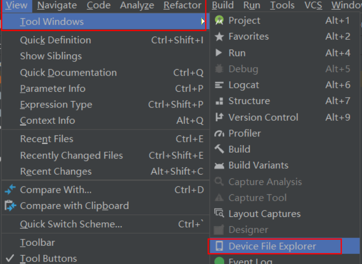
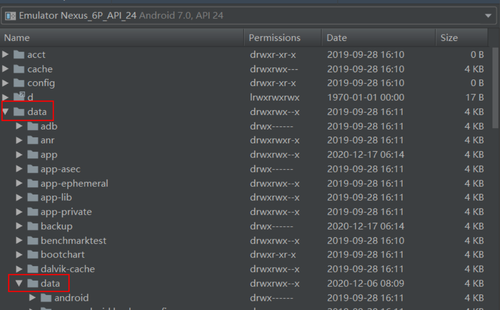
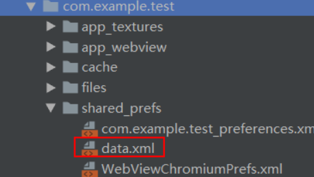

# 存储方式

## 一、SharedPreferences

想要使用SharedPreferences 来存储数据，首先主要获取到SharedPreferences 对象。


新建sharedpreference.Activity

添加布局文件

```xml
<?xml version="1.0" encoding="utf-8"?>
<LinearLayout xmlns:android="http://schemas.android.com/apk/res/android"
    xmlns:app="http://schemas.android.com/apk/res-auto"
    xmlns:tools="http://schemas.android.com/tools"
    android:layout_width="match_parent"
    android:layout_height="match_parent"
    tools:context=".DataStorage.SharedPreferencesActivity"
    android:orientation="vertical"
    android:padding="15dp">

    <EditText
        android:layout_width="match_parent"
        android:layout_height="wrap_content"
        android:id="@+id/pre_ed"
        android:hint="输入"/>
    <Button
        android:layout_width="match_parent"
        android:layout_height="wrap_content"
        android:text="保存"
        android:id="@+id/pre_bt"/>
    <Button
        android:layout_width="match_parent"
        android:layout_height="wrap_content"
        android:id="@+id/pre_show"
        android:text="显示"/>
    <TextView
        android:layout_width="match_parent"
        android:layout_height="wrap_content"
        android:id="@+id/pre_tv"
        />
</LinearLayout>
```


Activity逻辑书写

```java
public class SharedPreferencesActivity extends AppCompatActivity {

    private EditText editText;
    private Button button,button2;
    private TextView textView;
    private SharedPreferences sharedPreferences;//读操作
    private SharedPreferences.Editor editor;//写操作
    @Override
    protected void onCreate(Bundle savedInstanceState) {
        super.onCreate(savedInstanceState);
        .....

        sharedPreferences = getSharedPreferences("data",MODE_PRIVATE);//两个参数，文件名和模式，priva模式：其他应用无法读取这个应用数据
        editor = sharedPreferences.edit();

        button.setOnClickListener(new View.OnClickListener() {
            @Override
            public void onClick(View view) {
                editor.putString("name",editText.getText().toString());//写数据
                editor.apply();//异步存入，commit()同步存入
                ToastUtil.showMsg(this,"保存成功");
            }
        });

        button2.setOnClickListener(new View.OnClickListener() {
            @Override
            public void onClick(View view) {
                String name = sharedPreferences.getString("name","");//读数据
                textView.setText(name);
            }
        });
    }
}
```


数据文件存放目录






找到项目名:




参考:https://blog.csdn.net/qew2017/article/details/99982109


### 迁移至DataStore

>  **为什么要迁移**
>
> SharedPreference可能阻塞UI线程，导致ANR异常 
>
> **DataStore优势**
>
> DataStore 是一个更加现代化和健壮的数据存储解决方案，可以异步地存储复杂的数据，支持协程和 Flow，并提供类型安全的 API。 
>
> **两者比较**
>
> 

DataStore 提供两种不同的实现：`Preferences DataStore` 和 `Proto DataStore`。 

> - **Preferences DataStore** 使用键存储和访问数据。此实现不需要预定义的架构，也不确保类型安全。
>
>   > ```groovy
>   >     // Preferences DataStore (SharedPreferences like APIs)
>   >     dependencies {
>   >         implementation "androidx.datastore:datastore-preferences:1.0.0"
>   > 
>   >         // optional - RxJava2 support
>   >         implementation "androidx.datastore:datastore-preferences-rxjava2:1.0.0"
>   > 
>   >         // optional - RxJava3 support
>   >         implementation "androidx.datastore:datastore-preferences-rxjava3:1.0.0"
>   >     }
>   > 
>   >     // Alternatively - use the following artifact without an Android dependency.
>   >     dependencies {
>   >         implementation "androidx.datastore:datastore-preferences-core:1.0.0"
>   >     }
>   >     
>   > ```
>   >
>   > 
>
> - **Proto DataStore** 将数据作为自定义数据类型的实例进行存储。此实现要求您使用[**协议缓冲区**]来定义架构，但可以确保类型安全。
>
>   > ```groovy
>   >     // Typed DataStore (Typed API surface, such as Proto)
>   >     dependencies {
>   >         implementation "androidx.datastore:datastore:1.0.0"
>   > 
>   >         // optional - RxJava2 support
>   >         implementation "androidx.datastore:datastore-rxjava2:1.0.0"
>   > 
>   >         // optional - RxJava3 support
>   >         implementation "androidx.datastore:datastore-rxjava3:1.0.0"
>   >     }
>   > 
>   >     // Alternatively - use the following artifact without an Android dependency.
>   >     dependencies {
>   >         implementation "androidx.datastore:datastore-core:1.0.0"
>   >     }
>   >     
>   > ```
>   >
>   > 

#### Preferences DataStore存储键值对

> **创建Pre DataStore**
>
> ```java
> RxDataStore<Preferences> dataStore =
>   new RxPreferenceDataStoreBuilder(context, /*name=*/ "settings").build();//name参数制定dataStore名称
> ```
>
> **读取内容**
>
> ```java
> Preferences.Key<Integer> EXAMPLE_COUNTER = PreferencesKeys.int("example_counter");//定义键值
> 
> Flowable<Integer> exampleCounterFlow =
>   dataStore.data().map(prefs -> prefs.get(EXAMPLE_COUNTER));//通过键值取值
> ```
>
> **写入内容**
>
> `edit()`函数，以事务方式更新DataStore数据，其`transform`参数可以放入代码块，进行值更新
>
> ```java
> Single<Preferences> updateResult =  dataStore.updateDataAsync(prefsIn -> {
>   MutablePreferences mutablePreferences = prefsIn.toMutablePreferences();
>   Integer currentInt = prefsIn.get(INTEGER_KEY);
>   mutablePreferences.set(INTEGER_KEY, currentInt != null ? currentInt + 1 : 1);
>   return Single.just(mutablePreferences);
> });
> // The update is completed once updateResult is completed.
> ```

#### Proto DataStore存储类型化对象

> **定义架构**
>
> Proto DataStore 要求在 `app/src/main/proto/` 目录的 proto 文件中保存预定义的架构。此架构用于定义您在 Proto DataStore 中保存的对象的类型。 
>
> ```
> syntax = "proto3";
> 
> option java_package = "com.example.application";
> option java_multiple_files = true;
> 
> message Settings {
>   int32 example_counter = 1;
> }
> ```
>
> > 存储对象的类在编译时由 proto 文件中定义的 `message` 生成。请务必重新构建您的项目。 

> **创建Proto DataStore**
>
> 涉及两个步骤：
>
> 1. 定义一个实现 `Serializer` 的类，其中 `T` 是 proto 文件中定义的类型。此序列化器类会告知 DataStore 如何读取和写入您的数据类型。请务必为该序列化器添加默认值，以便在尚未创建任何文件时使用。
> 2. 使用由 `dataStore` 创建的属性委托来创建 `DataStore` 的实例，其中 `T` 是在 proto 文件中定义的类型。filename` 参数会告知 DataStore 使用哪个文件存储数据，而 `serializer 参数会告知 DataStore 第 1 步中定义的序列化器类的名称。
>
> ```java
> private static class SettingsSerializer implements Serializer<Settings> {
>     @Override
>     public Settings getDefaultValue() {
>         Settings.getDefaultInstance();
>     }
> 
>     @Override
>     public Settings readFrom(@NotNull InputStream input) {
>         try {
>             return Settings.parseFrom(input);
>         } catch (exception: InvalidProtocolBufferException) {
>             throw CorruptionException(“Cannot read proto.”, exception);
>         }
>     }
> 
>     @Override
>     public void writeTo(Settings t, @NotNull OutputStream output) {
>         t.writeTo(output);
>     }
> }
> 
> RxDataStore<Byte> dataStore =
>     new RxDataStoreBuilder<Byte>(context, /* fileName= */ "settings.pb", new SettingsSerializer()).build();
> ```
>
> **读取内容**
>
> ```java
> Flowable<Integer> exampleCounterFlow =
>        dataStore.data().map(settings -> settings.getExampleCounter());
> ```
>
> **写入内容**
>
> ```java
> Single<Settings> updateResult =
>     dataStore.updateDataAsync(currentSettings ->
>                               Single.just(
>                                   currentSettings.toBuilder()
>                                   .setExampleCounter(currentSettings.getExampleCounter() + 1)
>                                   .build()));
> ```
>
> 


## 二、SQLite

> [sqlLite使用](https://blog.csdn.net/huweiliyi/article/details/105461725)

### 	(1)概述：

Android提供了一个SQLiteOpenHelper 帮助类，借助这个类可以非常简单的将数据库进行创建好升级。

### 	(2)实例方法:

SQLiteOpenHelper 中有两个非常重要的实例方法：

- getReadableDatabase() 	

- getWritableDatabase() 。

  

  这两个方法可以创建或者打开一个现有的数据库（如果数据库存在则直接打开，否则创建一个新的数据库），并返回一个可对数据库进行读写操作的对象。

例子:

```java
public class MainActivity extends Activity {
	public static final String PATH_ONE = "KogBill";
	public static final String PATH_NAME = "KogBill.db";
	private SQLiteDatabase db;    //声明SQLiteDatabase ，该对象可以操作数据库

	String path = Environment.getExternalStorageDirectory().getAbsolutePath();
	String path1 = path + File.separator + PATH_ONE;   //需要创建的路径
	String path2 = path + File.separator + PATH_ONE + File.separator + PATH_NAME;//需要创建的文件

	@Override
	protected void onCreate(Bundle savedInstanceState){
		super.onCreate(savedInstanceState);
		setContentView(R.layout.activity_main);
		File f = new File(path1);
		if( !f.exists()){  //创建数据库文件路径
			f.mkdirs();
		}	
		//实例化MySQLiteHelper ，创建指定目录下数据库文件，并创建表
		MySQLiteHelper mSQL = new MySQLiteHelper(MainActivity.this, path2);
		db = mSQL.getWritableDatabase();
	}

	class MySQLiteHelper extends SQLiteOpenHelper{
			private static final int DATABASE_VERSION = 1;//数据库版本号
			private static final String CREATE_TABLE = "create table kog_bill ("
		            + "_id integer primary key autoincrement,"
		            + "date text, "
		            + "breakfast text, "
		            + "lunch text,"
		            + "dinner text,"
		            + "happy text,"
		            + "other text,"
		            + "spare text)";
			
			//方便创建实例，简化构造方法，方法内调用4参数构造方法
			//参数 name 可以是 数据库名称，也可以数据库文件路径（即可以指定数据库文件路径）
			public MySQLiteHelper(Context context, String name) {
				this(context, name, null, DATABASE_VERSION);
			}
			//必须要实现的方法
			public MySQLiteHelper(Context context, String name, CursorFactory factory, int version) {
				super(context, name, factory, version);
			}
	
			@Override
			public void onCreate(SQLiteDatabase db) {
				// 第一次创建数据库时 才会调用
				Log.e("mylog", "创建数据库表");
				db.execSQL(CREATE_TABLE);
			}
	
			@Override
			public void onUpgrade(SQLiteDatabase db, int oldVersion, int newVersion) {
			}
			
		}
}
```

如果想重新建表，则需要在onUpgrade方法中进行语句书写:

```java
class MySQLiteHelper extends SQLiteOpenHelper{
	.....
	@Override
	public void onUpgrade(SQLiteDatabase db, int oldVersion, int newVersion){
		db.execSQL("drop table if exists book");  //如果已经存在就删除，防止重复创建
		onCreate(db);  // 再次执行onCreate 方法
	}
}
```

但是onUpgrade方法默认是不执行的，如何让onUpgrade方法执行，需要用到MySQLiteHelper 构造参数中的版本号：

```
private static final int DATABASE_VERSION = 1;//  将版本号 由 1 改为2 
```


### 迁移至Room

## 三、ContentProvider

> 参考四大组件笔记

## 四、Room

> 具体参考`JetPack`笔记

## 五、应用专属存储空间

> https://blog.51cto.com/u_16213394/7063732

### 文件权限

在清单文件声明读文件权限

```xml
<!--访问外部存储读文件权限-->
<uses-permission android:name="android.permission.READ_EXTERNAL_STORAGE"/>
<!--访问外部存储写权限-->
<uses-permission android:name="android.permission.WRITE_EXTERNAL_STORAGE"/>
<!--申请挂载和卸载文件系统的权限。具有该权限的应用程序可以挂载和卸载外部存储设备，如SD卡-->
<uses-permission android:name="android.permission.MOUNT_UNMOUNT_FILESYSTEMS"/>
```

运行时动态申请权限

> ```java
> // 检查是否已经拥有读取文件的权限
> if (ContextCompat.checkSelfPermission(this, Manifest.permission.READ_EXTERNAL_STORAGE)
>     != PackageManager.PERMISSION_GRANTED) {
>     // 如果没有权限，则向用户申请权限
>     ActivityCompat.requestPermissions(this,
>             new String[]{Manifest.permission.READ_EXTERNAL_STORAGE},
>             REQUEST_CODE_READ_FILE);
> } else {
>     // 如果已经有权限，则进行文件读取操作
>     readFile();
> }
> ```
>
> 下面是像用户申请权限的返回结果
>
> ```JAVA
> @Override
> public void onRequestPermissionsResult(int requestCode, @NonNull String[] permissions, @NonNull int[] grantResults) {
>     if (requestCode == REQUEST_CODE_READ_FILE) {
>         if (grantResults.length > 0 && grantResults[0] == PackageManager.PERMISSION_GRANTED) {
>             // 用户授权成功，进行文件读取操作
>             readFile();
>         } else {
>             // 用户拒绝授权，可以给出相应的提示或处理
>             Toast.makeText(this, "读取文件权限被拒绝", Toast.LENGTH_SHORT).show();
>         }
>     }
> }
> ```


### 2.访问内部存储

> 这些目录的空间通常比较小。在将应用专属文件写入内部存储空间之前，应查询设备上的可用空间。
>
> **内部存储是被保护起来的，每个应用有自己的内部存储，其他应用正常情况下无法访问**
>
> 当应用被删除之后，就会删除该应用的内部存储目录

#### (1)访问持久性文件

位置：`/data/user/0/{应用包名}/files`

```java
context.getFilesDir() 
```

**访问和存储文件**

```java
File file = new File(context.getFilesDir(), filename);
```

**查看文件列表**

```java
//调用 fileList() 获取包含 filesDir 目录中所有文件名称的数组
Array<String> files = context.fileList();
```


#### (2)访问缓存文件

位置：`/data/user/0/{应用包名}/cache`

```java
context.getCacheDir()
```

**创建缓存文件**

如果需要暂时存储敏感数据，可以指定缓存目录保存数据

```java
File.createTempFile(filename, null, context.getCacheDir());
```

> 在创建缓存文件之前，需调用：`getCacheQuotaBytes()`以确定应用当前可用的缓存空间大小。
>
> **注意**：当设备的内部存储空间不足时，Android 可能会删除这些缓存文件以回收空间。因此，请在读取前检查缓存文件是否存在。

**访问缓存目录数据**

```java
File cacheFile = new File(context.getCacheDir(), filename);
```

**删除缓存文件**

- 对代表该文件的 `File` 对象使用 [`delete()`] 方法：

  ```java
  cacheFile.delete();
  ```

- 应用上下文的 [`deleteFile()`]方法，并传入文件名：

  ```java
  context.deleteFile(cacheFileName);
  ```


### 3.访问外部存储

> 外部存储：指的是设备外部扩展存储空间，例如TF卡、SD卡等。外部存储空间一般较大，但是访问速度较慢。外部存储空间可以用来存储用户的音乐、视频、图片等文件，也可以用来存储应用程序的数据。外部存储空间是公共的，所有应用程序都可以访问。但是，从安卓4.4版本开始，为了保护用户的隐私，对外部存储空间的访问做了一些限制，应用程序需要获取用户的授权才能访问外部存储空间。 
>
> 外部存储也分为`私有外部存储`和`共有外部存储`

#### 私有外部存储

位置：`/storage/emulated/0/Android/data/{应用包名}/files/Download`

```java
getExternalFilesDir(Environment.DIRECTORY_DOWNLOADS).toString();//需要有一个参数，指定访问该目录下的目录类型
```

##### (1)选择物理存储位置

有时，分配内部存储分区作为外部存储空间的设备也会提供 SD 卡插槽。这意味着设备具有多个可能包含外部存储空间的物理卷，因此需要选择用于应用专属存储空间的物理卷。

```java
//返回数组中的第一个元素被视为主外部存储卷。除非该卷已满或不可用，否则请使用该卷。
File[] externalStorageVolumes =
        ContextCompat.getExternalFilesDirs(getApplicationContext(), null);
File primaryExternalStorage = externalStorageVolumes[0];
```

##### (2)访问持久性文件

如需从外部存储设备访问应用专用文件，调用 `getExternalFilesDir()`。

```java
File appSpecificExternalDir = new File(context.getExternalFilesDir(null), filename);
```

> **注意**：在 Android 11（API 级别 30）及更高版本中，应用无法在外部存储设备上创建自己的应用专用目录。
>
> 也就是说从安卓11开始，这个方法返回的目录被限制在应用程序的沙盒中，无法再访问外部存储设备上的其他目录。这意味着，如果想在外部存储设备上创建文件或目录，就需要使用新的方法。 
>
> **新的方法是使用`MediaStore API`将媒体文件插入到媒体存储中。**

##### (3)缓存文件

**创建缓存文件**

```java
File externalCacheFile = new File(context.getExternalCacheDir(), filename);
```

**移除缓存文件**

```java
externalCacheFile.delete();
```


#### 公有外部存储

位置：`/storage/emulated/0`

```java
Environment.getExternalStorageDirectory();
```

##### (1)验证存储空间可用性

由于外部存储空间位于用户可能能够移除的物理卷上，因此在尝试从外部存储空间读取应用专属数据或将应用专属数据写入外部存储空间之前，请验证该卷是否可访问。

> 可以通过调用 **`Environment.getExternalStorageState()`**查询该卷的状态。
>
> - 如果返回的状态为 [**`MEDIA_MOUNTED`**]，那么就可以在外部存储空间中***读取和写入***应用专属文件。
> - 如果返回的状态为 [**`MEDIA_MOUNTED_READ_ONLY`**]，**只能读**这些文件。

```java
// Checks if a volume containing external storage is available
// for read and write.
private boolean isExternalStorageWritable() {
    return Environment.getExternalStorageState().equals(Environment.MEDIA_MOUNTED);
}

// Checks if a volume containing external storage is available to at least read.
private boolean isExternalStorageReadable() {
     return Environment.getExternalStorageState().equals(Environment.MEDIA_MOUNTED) ||
            Environment.getExternalStorageState().equals(Environment.MEDIA_MOUNTED_READ_ONLY);
}
```

> 在没有可移除外部存储空间的设备上，请使用以下命令启用虚拟卷，以测试外部存储空间可用性逻辑：
>
> ```shell
> adb shell sm set-virtual-disk true
> ```


##### (2)媒体内容

如果应用支持使用仅在您的应用内对用户有价值的媒体文件，最好将这些文件存储在外部存储空间中的应用专属目录中，如以下代码段所示：

```java
@Nullable
File getAppSpecificAlbumStorageDir(Context context, String albumName) {
    // Get the pictures directory that's inside the app-specific directory on
    // external storage.
    File file = new File(context.getExternalFilesDir(Environment.DIRECTORY_PICTURES), albumName);
    if (file == null || !file.mkdirs()) {
        Log.e(LOG_TAG, "Directory not created");
    }
    return file;
}
```

>  `DIRECTORY_PICTURES`是 API 常量提供的目录名称。这些目录名称可确保系统正确处理文件。如果没有适合您文件的[预定义子目录名称](https://developer.android.google.cn/reference/android/os/Environment?hl=zh-cn#fields)，可以改为将 `null` 传递到 `getExternalFilesDir()`。这将返回外部存储空间中的应用专属根目录。


### 4.查询可用空间

如果您事先知道要存储的数据量，您可以通过调用 [`getAllocatableBytes()`]查出设备可以为应用提供多少空间。`getAllocatableBytes()` 的返回值可能大于设备上的当前可用空间量。这是因为系统已识别出可以从其他应用的缓存目录中移除的文件。

如果有足够的空间保存您的应用数据，请调用 [`allocateBytes()`]。否则，您的应用可以请求用户从设备[移除一些文件]或从设备[移除所有缓存文件]。

```java
// App needs 10 MB within internal storage.
private static final long NUM_BYTES_NEEDED_FOR_MY_APP = 1024 * 1024 * 10L;

StorageManager storageManager = getApplicationContext().getSystemService(StorageManager.class);
UUID appSpecificInternalDirUuid = storageManager.getUuidForPath(getFilesDir());//获取存储的路径，并且转换为UUID
long availableBytes = storageManager.getAllocatableBytes(appSpecificInternalDirUuid);//获取可用空间大小
if (availableBytes >= NUM_BYTES_NEEDED_FOR_MY_APP) {
    storageManager.allocateBytes(appSpecificInternalDirUuid, NUM_BYTES_NEEDED_FOR_MY_APP);//
} else {
    // To request that the user remove all app cache files instead, set
    // "action" to ACTION_CLEAR_APP_CACHE.
    Intent storageIntent = new Intent();
    storageIntent.setAction(ACTION_MANAGE_STORAGE);
}
```

> 如需请求用户在设备上选择文件进行移除，请调用包含 [`ACTION_MANAGE_STORAGE`] 操作的 intent。此 intent 会向用户显示提示。如果需要，此提示可以显示设备上的可用空间量。如需显示此人性化信息，请使用以下计算结果：


## 六、访问资源文件

> 参考——https://blog.csdn.net/qq_24382363/article/details/86480943

Android 资源文件大致可以分为两种：

- **res/raw**

  > res/raw 目录下存放可编译的资源文件
  > 这种资源文件系统会在 R.Java 里面自动生成该资源文件的 ID，所以可以通过资源ID映射访问资源文件

- **assets**

  > assets目录下存放原生资源文件，可以存放一些图片，html，js, css等文件。
  > 因为**系统在编译的时候不会编译 assets 下的资源文件**，所以不能通过 `R.XXX.ID `的方式访问它们。那我么能不能通过该资源的绝对路径去访问它们呢？因为apk安装之后会放在`/data/app/**.apk`目录下，以apk形式存在，`asset/res/raw`被绑定在apk里，并不会解压到`/data/data/YourApp`目录下去，所以**无法直接获取到 assets 的绝对路径**，因为它们根本就没有。
  >

### 1.assets

**assets 文件里的文件都是保持原始的文件格式，需要使用 AssetManager 以字节流的形式读取文件。**

> 通常步骤是：
>
> - 获取到AssetManager
> - 然后AssetManager的open方法打开资源文件
> - 再通过输入流读取内容

  ```java
AssetManager assetManager = getAssets();
InputStream inputStream = null;
try {
    inputStream = assetManager.open("filename.txt");
    // 读取文件内容
    int size = inputStream.available();
    byte[] buffer = new byte[size];
    inputStream.read(buffer);
    inputStream.close();
    String text = new String(buffer);
    // 处理文件内容
} catch (IOException e) {
    e.printStackTrace();
}
  ```


### 2.res/raw

```java
Resources resources = getResources();
InputStream inputStream = null;
try {
    inputStream = resources.openRawResource(R.raw.filename);//通过传入资源ID获取资源
    // 读取文件内容
    int size = inputStream.available();
    byte[] buffer = new byte[size];
    inputStream.read(buffer);
    inputStream.close();
    String text = new String(buffer);
    // 处理文件内容
} catch (IOException e) {
    e.printStackTrace();
}
```

> 如果是其他资源， 例如res/values、res/layout、res/drawable等目录下的资源，可以使用相应的资源ID来获取。 

### 区别

**相同点：**

- 两者目录下的文件在打包后会原封不动的保存在apk中，不会被变成二进制。
- 两者都只能读不能写

**不同点：**

- res/raw 中的文件会被映射到 R.Java 文件中，访问的时候直接使用资源 ID 即 R.XXX.ID；assets 文件夹下的文件不会被映射到 R.Java 中，访问的时候需要 AssetManager 类。
- res/raw 不可以有目录结构；而 assets 则可以有目录结构，也就是 assets 目录下可以再建立文件夹。
-  在 AssertManager 中不能处理单个超过1MB的文件，不然会报异常，raw 没这个限制，可以放个4MB的Mp3文件没问题。 
-  assets 文件夹是存放不进行编译加工的原生文件，即该文件夹里面的文件不会像 xml， java 文件被预编译，可以存放一些图片，html，js, css 等文件。 


### 3.bitmap

 Bitmap 是 Android 中用于处理位图图像的一种数据类型，它可以用来显示和操作图像。Bitmap 本身不是编解码图像的工具，而是一种用于存储图像数据的内存格式。 

 可以使用 BitmapFactory 类将图像文件解码为 Bitmap 对象，也可以使用 Canvas 类在 Bitmap 上绘制图形和文本。 

```java
Resources resources = getResources();
Bitmap bitmap = BitmapFactory.decodeResource(resources,id);

//将图像转换为bitmap对象，然后写入到外部存储
String path = getExternalFilesDir(Environment.DIRECTORY_DOWNLOADS)+"/forest.jpg";
FileOutputStream outputStream = null;

outputStream = new FileOutputStream(path);
bitmap.compress(Bitmap.CompressFormat.JPEG,100,outputStream);//将bitmap流写入到外部私有存储区
if (outputStream!=null){
    outputStream.flush();//刷新
}
```


## LitePal存储

> [LitePal数据库](https://blog.csdn.net/gpf1320253667/article/details/82819795)

## Realm

> [Realm介绍](https://juejin.cn/post/6844903908171579405)
>
> [Realm使用详解](https://www.cnblogs.com/endv/p/12229594.html)


## LevelDB

用的少


# 存储策略

## 一、移动设备存储空间

|                | 内容类型                                 | 访问方法                                                     | 所需权限                                                     | 其他应用是否可以访问？                          | 卸载应用时是否移除文件？ |
| :------------- | :--------------------------------------- | :----------------------------------------------------------- | :----------------------------------------------------------- | :---------------------------------------------- | ------------------------ |
| 应用专属文件   | 仅供您的应用使用的文件                   | ①从内部存储空间访问：可以使用 `getFilesDir()` 或 `getCacheDir()` 方法  ②从外部存储空间访问，可以使用 `getExternalFilesDir()` 或 `getExternalCacheDir()` 方法 | 从内部存储空间访问不需要任何权限 ，如果应用在搭载 Android 4.4（API 级别 19）或更高版本的设备上运行，从外部存储空间访问不需要任何权限 | 否                                              | 是                       |
| 媒体           | 可共享的媒体文件（图片、音频文件、视频） | `MediaStore` API                                             | 在 Android 11（API 级别 30）或更高版本中，访问其他应用的文件需要 `READ_EXTERNAL_STORAGE`  在 Android 10（API 级别 29）中，访问其他应用的文件需要 `READ_EXTERNAL_STORAGE` 或 `WRITE_EXTERNAL_STORAGE`  在 Android 9（API 级别 28）或更低版本中，访问**所有**文件均需要相关权限 | 是，但其他应用需要 `READ_EXTERNAL_STORAGE` 权限 | 否                       |
| 文档和其他文件 | 其他类型的可共享内容，包括已下载的文件   | 存储访问框架                                                 | 无                                                           | 是，可以通过系统文件选择器访问                  | 否                       |
| 应用偏好设置   | 键值对                                   | Jetpack Preferences库                                        | 无                                                           | 否                                              | 是                       |
| 数据库         | 结构化数据                               | Room 持久性库                                                | 无                                                           | 否                                              | 是                       |


### 1.内部存储

**随应用卸载被删除**

**内部存储：不需要任何权限**

> `/data/data/< applicationId,就是包名 >/shared_prefs`
> `/data/data/< applicationId >/databases`
> `/data/data/< applicationId >/files —— 通过context.getFilesDir() 获取该目录`
> `/data/data/< applicationId >/cache —— 通过context.getCacheDir() 获取该目录`
> Android SDK提供了几个常见的内部存储文件的权限

Context.MODE_PRIVATE ：私有方式存储，其他应用无法访问，覆盖旧的同名文件
Context.MODE_APPEND：私有方式存储，若有旧的同名文件，则在该文件上追加数据


### 2.外部存储

1. 外部存储：

   > - 公有目录：存放一些下载的视频文件等，比如还有movies，fictures，music等公有的一些文件目录
   > - 私有目录：随应用卸载被删除

**公有目录：**

`Environment.getExternalStoragePublicDirectory(int type)`：

>  这里的type类型不能为空：可以是DIRECTORY_MUSIC，DIRECTORY_MOVIES等 通过这个方法获取公有目录下相对应的文件
> Environment.getExternalStorageDirectory()也可以获取。


注：Environment是操作SD卡的工具类

```java
//publicDirectory路径为：/storage/emulated/0/Movies
String publicDirectory = Environment.getExternalStoragePublicDirectory(Environment.DIRECTORY_MOVIES).getAbsolutePath();
//sdPath路径为： /storage/emulated/0
String sdPath = Environment.getExternalStorageDirectory().getAbsolutePath();
```

**私有目录**

> /mnt/sdcard/Android/data/data/< applicationId >/cache 通过getExternalCacheDir().getAbsolutePath()得到的路径为：
> /storage/emulated/0/Android/data/包名/cache等价于上面的路径。
> /mnt/sdcard/Android/data/data/< applicationId >/files 通过getExternalFilesDir().getAbsolutePath()方法可以获取到路径为：
> /storage/emulated/0/Android/data/包名/files等价于上面的路径。

> 参考——https://blog.csdn.net/lu202032/article/details/119580314


## 二、存储用例的最佳做法

为了让用户更好地控制自己的文件并减少混乱，Android 10 针对应用推出了一种新的存储范例，称为[分区存储]

> 参考——https://developer.android.google.cn/training/data-storage/use-cases?hl=zh-cn

### 1.处理媒体文件


### 2.处理非媒体文件


