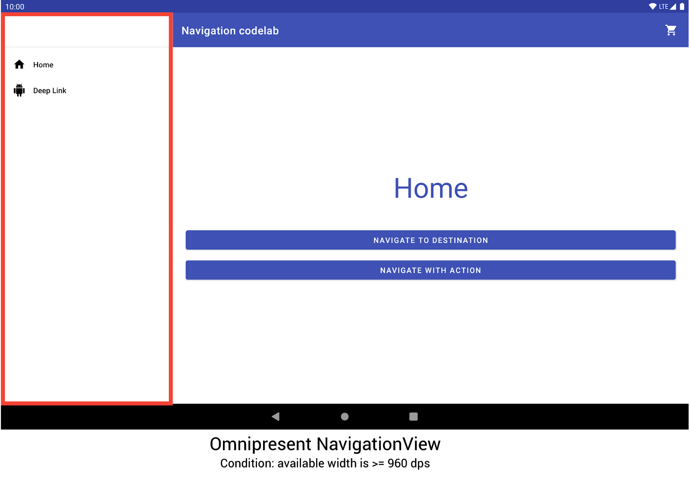
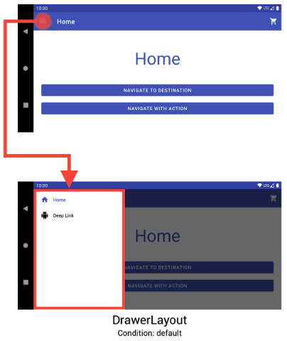
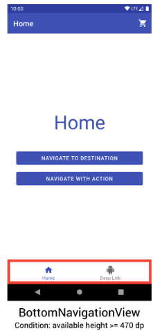
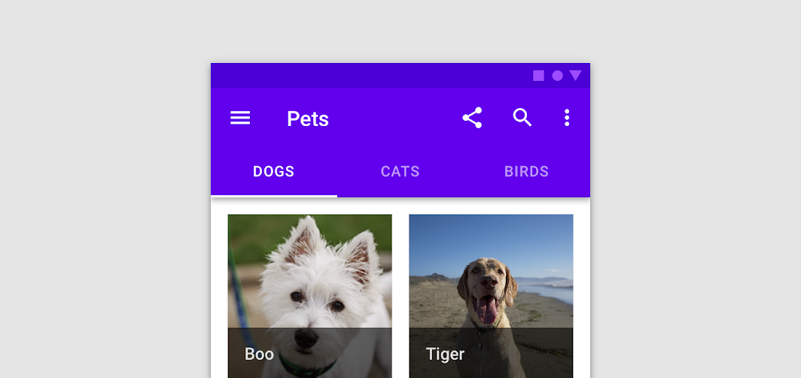
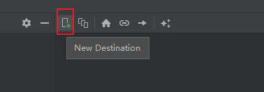
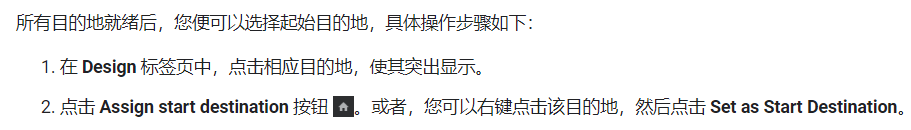
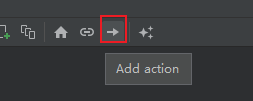

# 导航

## 一、概览

### 1.常用导航View

#### `NavigationView`

> 导航菜单栏，始终在屏幕上
>
> 

#### `DrawerLayout`

> 可以收放的导航菜单栏，可以更改方向
>
> 

#### `BottomNavigationView`

> 底部导航栏，比较常见
>
> 

#### TabBar

> 顶部导航栏，放在`ToolBar`上
>
> 
>
> > ToolBar-https://blog.csdn.net/Mr_Tony/article/details/121877502

#### ActionBar

> https://blog.csdn.net/guolin_blog/article/details/18234477

## 二、Navigation

主要是处理Fragment导航的组件

导航是指支持用户导航、进入和退出应用中不同内容片段的交互。

导航组件由以下三个关键部分组成：

- **导航图**：在一个集中位置包含所有导航相关信息的 XML 资源。这包括应用内所有单个内容区域（称为*目标*）以及用户可以通过应用获取的可能路径。
- **`NavHost`**：显示导航图中目标的空白容器。导航组件包含一个默认 `NavHost` 实现 ([`NavHostFragment`])，可显示 Fragment 目标。
- **`NavController`**：在 `NavHost` 中管理应用导航的对象。当用户在整个应用中移动时，`NavController` 会安排 `NavHost` 中目标内容的交换。

### 1.简单使用

```groovy
dependencies {
  def nav_version = "2.5.3"

  // Java language implementation
  implementation "androidx.navigation:navigation-fragment:$nav_version"
  implementation "androidx.navigation:navigation-ui:$nav_version"

  // Kotlin
  implementation "androidx.navigation:navigation-fragment-ktx:$nav_version"
  implementation "androidx.navigation:navigation-ui-ktx:$nav_version"

  // Feature module Support
  implementation "androidx.navigation:navigation-dynamic-features-fragment:$nav_version"

  // Testing Navigation
  androidTestImplementation "androidx.navigation:navigation-testing:$nav_version"

  // Jetpack Compose Integration
  implementation "androidx.navigation:navigation-compose:$nav_version"
}
```


#### 创建导航图

导航发生在应用中的各个目的地（即您的应用中用户可以导航到的任意位置）之间。这些目的地是通过操作连接的。

导航图是一种资源文件，其中包含您的所有目的地和操作。该图表会显示应用的所有导航路径。

下图直观显示了一个示例应用的导航图，该应用包含 6 个目的地（通过 5 个操作连接）。


**像项目中添加导航图的具体操作是：**

1. 在“Project”窗口中，右键点击 `res` 目录，然后依次选择 **New > Android Resource File**。此时系统会显示 **New Resource File** 对话框。
2. 在 **File name** 字段中输入名称，例如“nav_graph”。
3. 从 **Resource type** 下拉列表中选择 **Navigation**，然后点击 **OK**。

> 如果为添加导航依赖，系统会自动提示添加依赖


#### Navigator Editor

添加图表后，Android Studio 会在 Navigation Editor 中打开该图表。在 Navigation Editor 中，您可以直观地修改导航图，或直接修改底层 XML。


对应的`Text`视图如下

```xml
<navigation xmlns:android="http://schemas.android.com/apk/res/android"
            xmlns:app="http://schemas.android.com/apk/res-auto"
            xmlns:tools="http://schemas.android.com/tools"
            android:id="@+id/nav_graph"
            app:startDestination="@id/mainActivity">

    <activity
              android:id="@+id/mainActivity"
              android:name="com.example.myapplication.MainActivity"
              android:label="activity_main"
              tools:layout="@layout/activity_main" >
        <action
                android:id="@+id/action_mainActivity_to_subActivity1"
                app:destination="@id/subActivity1" />
    </activity>
    <activity
              android:id="@+id/subActivity1"
              android:name="com.example.myapplication.SubActivity1"
              android:label="activity_sub1"
              tools:layout="@layout/activity_sub1" />
</navigation>
```

> `<navigation>` 元素是导航图的根元素。当向图表添加目的地和连接操作时，可以看到相应的 `<destination>` 和 `<action>` 元素在此处显示为子元素。如果有嵌套图表，它们将显示为子 `<navigation>` 元素。


####  Activity 添加 NavHost

导航宿主是一个空容器，用户在应用中导航时，目的地会在该容器中交换进出。

**导航宿主必须派生于 `NavHost`**。Navigation 组件的默认 `NavHost` 实现 (`NavHostFragment`) 负责处理 fragment 目的地的交换。


##### 添加 NavHostFragment

下面部分代码是在MainActivity中添加 NavHostFragment的实例

```xml
<?xml version="1.0" encoding="utf-8"?>
<androidx.constraintlayout.widget.ConstraintLayout
    xmlns:android="http://schemas.android.com/apk/res/android"
    xmlns:app="http://schemas.android.com/apk/res-auto"
    xmlns:tools="http://schemas.android.com/tools"
    android:layout_width="match_parent"
    android:layout_height="match_parent"
    tools:context=".MainActivity">

    <androidx.appcompat.widget.Toolbar
        .../>

    <androidx.fragment.app.FragmentContainerView
        android:id="@+id/nav_host_fragment"
        android:name="androidx.navigation.fragment.NavHostFragment"
        android:layout_width="0dp"
        android:layout_height="0dp"
        app:layout_constraintLeft_toLeftOf="parent"
        app:layout_constraintRight_toRightOf="parent"
        app:layout_constraintTop_toTopOf="parent"
        app:layout_constraintBottom_toBottomOf="parent"

        app:defaultNavHost="true"
        app:navGraph="@navigation/nav_graph" />

    <com.google.android.material.bottomnavigation.BottomNavigationView
        .../>

</androidx.constraintlayout.widget.ConstraintLayout>
```

> - `android:name` 属性包含 `NavHost` 实现的类名称。
> - `app:navGraph` 属性将 `NavHostFragment` 与导航图相关联。导航图会在此 `NavHostFragment` 中指定用户可以导航到的所有目的地。
> - `app:defaultNavHost="true"` 属性确保您的 `NavHostFragment` 会拦截系统返回按钮。请注意，只能有一个默认 `NavHost`。如果同一布局（例如，双窗格布局）中有多个宿主，请务必仅指定一个默认 `NavHost`。


#### 向导航图添加目的地

可以从现有的 Fragment 或 Activity 创建目的地。或者还可以使用 Navigation Editor 创建新目的地，或创建占位符以便稍后替换为 fragment 或 activity。



#### 指定起始目的地

起始目的地是打开应用之后第一个启动的页面，通过使用房子图标表示起始目的地



#### 连接目的地

通过set Action连接目的地



#### 导航到目的地

导航到目的地是使用 `NavController`完成的，它是一个在 `NavHost` 中管理应用导航的对象。每个 `NavHost` 均有自己的相应 `NavController`。您可以使用以下方法之一检索 `NavController`：

> **Java**：
>
> - `NavHostFragment.findNavController(Fragment)`
> - `Navigation.findNavController(Activity, @IdRes int viewId)`
> - `Navigation.findNavController(View)`


