# Android学习文档--2


## 布局

### 概述

布局定义了应用中界面的结构，布局的所有元素都使用`View`和`ViewGroup`对象层次结构进行构建:

> **View**--通常用于绘制用户可看到并与之交互的内容。View对象称为`“微件”`，例如Button或TextView等。
>
> **ViewGroup**--则是不可见的容器，用于定义View和其他ViewGroup对象的布局结构，ViewGroup对象通常称为“布局”，例如LinearLayout，ConstraintLayout


> **可以通过两种方式声明界面元素:**
>
> - XML文件中
> - 运行时实例化布局元素

> **Android中常用的5大布局方式有以下几种：**
>
> - 线性布局（LinearLayout）：按照垂直或者水平方向布局的组件。
> - 帧布局（FrameLayout）：组件从屏幕左上方布局组件。
> - 表格布局（TableLayout）：按照行列方式布局组件。
> - 相对布局（RelativeLayout）：相对其它组件的布局方式。
> - 绝对布局（AbsoluteLayout）：按照绝对坐标来布局组件。


activity文件加载绑定XML中的布局

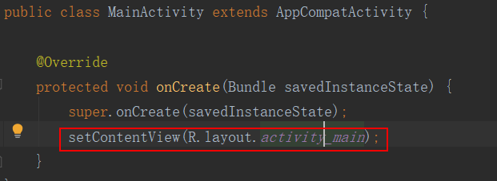


values目录下存放的是一些属性变量，可以在布局时候引用

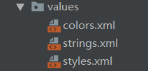

例如：应用String.xml文件里面name=tv_1的值作为text内容

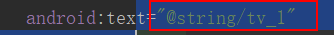

#### **①ID属性：**

尽量为每一个View对象声明创建一个id，因为在后续会通过搜索结构树来查找该组件。声明ID的格式有两种：

- > ```xml
  > android:id="@+id/my_button"
  > 字符串开头处的 @ 符号指示 XML 解析器应解析并展开 ID 字符串的其余部分，并将其标识为 ID 资源。加号 (+) 表示这是一个新的资源名称，必须创建该名称并将其添加到项目的资源（在 R.java 文件中）内.
  > ```

- > ```xml
  > android:id="@android:id/empty"
  > Android 框架还提供许多其他 ID 资源。引用 Android 资源 ID 时，不需要加号，但必须添加 android 软件包命名空间。添加 android 软件包命名空间后，我们现在将从 android.R 资源类而非本地资源类引用 ID。
  > ```

#### ②viewbinding

在Android Studio3.6及更高版本中**通过使用viewbinding来替代`findViewById`**。

**启用绑定**

要在某个模块中启用视图绑定，将viewBinding元素添加到gradle中：

```groovy
android {
        ...
        viewBinding {
            enabled = true
        }
    }
```

> `gradle 8.2`更换了写法
>
> ```groovy
> buildFeatures {
>        viewBinding true
> }
> ```

如果您希望在生成绑定类时**忽略某个布局文件**，请将 `tools:viewBindingIgnore="true"` 属性添加到相应布局文件的根视图中：

```xml
<LinearLayout
    ...
    tools:viewBindingIgnore="true" >
    ...
</LinearLayout>
```


**绑定过程：**

为某个模块**`启用视图绑定功能后`**，系统会为该模块中包含的**`每个 XML 布局文件生成一个绑定类`**。每个绑定类均包含对根视图以及**`具有 ID`** 的所有视图的**引用**。系统会通过以下方式生成绑定类的名称：将 XML 文件的名称转换为驼峰式大小写，并在末尾添加“Binding”一词。

例如某个布局文件`result_profile.xml`:

```xml
<LinearLayout ... >
    <TextView android:id="@+id/name" />
    <ImageView android:cropToPadding="true" />
    <Button android:id="@+id/button"
            android:background="@drawable/rounded_button" />
</LinearLayout>
```

> - 所生成的绑定类的名称就为 **`ResultProfileBinding`**。此类具有两个字段：一个是名为 `name` 的 `TextView`，另一个是名为 `button` 的 `Button`。该布局中的 `ImageView` 没有 ID，因此绑定类中不存在对它的引用。
> - 每个绑定类还包含一个 `getRoot()` 方法，用于为相应布局文件的根视图提供直接引用。在此示例中，`ResultProfileBinding` 类中的 `getRoot()` 方法会返回 `LinearLayout` 根视图。

##### Activity使用视图绑定

> 在 Activity 的 `onCreate()` 方法中执行以下步骤：
>
> 1. 调用生成的绑定类中包含的静态 `inflate()` 方法。此操作会创建该绑定类的实例以供 Activity 使用。
>
> 2. 通过调用 `getRoot()` 方法获取对根视图的引用。
>
> 3. 将根视图传递到 `setContentView()`，使其成为屏幕上的活动视图。
>
>    ```java
>     private ResultProfileBinding binding;//绑定类的名称
>    
>        @Override
>        protected void onCreate(Bundle savedInstanceState) {
>            super.onCreate(savedInstanceState);
>            binding = ResultProfileBinding.inflate(getLayoutInflater());
>            View view = binding.getRoot();
>            setContentView(view);
>        }
>    ```
>
>    然后可以使用该绑定类实例来引用任何视图：
>
>    ```java
>    binding.getName().setText(viewModel.getName());
>    binding.button.setOnClickListener(new View.OnClickListener() {
>        viewModel.userClicked()
>    });
>    ```

##### Fragment使用View绑定

```java
private ResultProfileBinding binding;

    @Override
    public View onCreateView (LayoutInflater inflater,
                              ViewGroup container,
                              Bundle savedInstanceState) {
        binding = ResultProfileBinding.inflate(inflater, container, false);
        View view = binding.getRoot();
        return view;
    }

    @Override
    public void onDestroyView() {
        super.onDestroyView();
        binding = null;
    }
```

##### 与findViewById区别：

- **Null 安全**：由于视图绑定会创建对视图的直接引用，因此不存在因视图 ID 无效而引发 Null 指针异常的风险。此外，如果视图仅出现在布局的某些配置中，则绑定类中包含其引用的字段会使用 `@Nullable` 标记。
- **类型安全**：每个绑定类中的字段均具有与它们在 XML 文件中引用的视图相匹配的类型。这意味着不存在发生类转换异常的风险。


#### ③databinding

> [databinding详解](https://juejin.cn/post/6844904085800353805)

`DataBinding`是一种更为高级的视图绑定框架，允许你在布局文件中直接绑定数据。于Android Studio 1.3引入，相较于`ViewBinding`：

- 支持双向数据绑定，即当数据变化时，视图也会相应地更新，反之亦然。 
- 具有更强大的表达式语言，支持一些逻辑和运算符。

**使用**

```groovy
android {
    ...
        dataBinding {
            enabled = true
        }
}
```


`DataBinding`使用布局文件中的数据绑定表达式将数据直接与视图绑定。 

```xml
<!--示例代码-->
<!--布局文件 activity_main.xml-->
<!--要以layout开头-->
<layout xmlns:android="http://schemas.android.com/apk/res/android"
    xmlns:app="http://schemas.android.com/apk/res-auto"
    xmlns:tools="http://schemas.android.com/tools">

    <data>
        <variable
            name="user"
            type="com.example.User" />
    </data>

    <LinearLayout>
    	<TextView
            android:id="@+id/myTextView"
            android:layout_width="wrap_content"
            android:layout_height="wrap_content"
            android:text="@{user.name}" />
        <EditText
            android:id="@+id/password"
            android:layout_width="wrap_content"
            android:layout_height="wrap_content"
            android:inputType="textPassword"
            android:text="@={user.password}"
            app:layout_constraintBottom_toTopOf="@+id/login"
            app:layout_constraintEnd_toEndOf="parent"
            app:layout_constraintStart_toStartOf="parent"
            app:layout_constraintTop_toBottomOf="@+id/userName" />
        <Button
            android:id="@+id/login"
            android:layout_width="wrap_content"
            android:layout_height="wrap_content"
            android:onClick="@{() -> user.login()}"
            android:text="Login"
            app:layout_constraintEnd_toEndOf="parent"
            app:layout_constraintStart_toStartOf="parent"
            app:layout_constraintTop_toBottomOf="@+id/password" />
    </LinearLayout>
    
    
</layout>
```

> 如果**@后面不加等号，那就只是单向绑定**，只能由 ViewModel 将数据变化通知到界面。
>
> **@加了等号，才是双向绑定**，即界面上的数据改变才能传递给到 ViewModel。 
>
> Button的`android:onClick`属性值，设置为了**@{() -> user.login()}**，这就是将该按钮的点击事件绑定到User的`login()`方法  

```java
// 在 Activity 中使用 DataBinding
ActivityMainBinding binding = DataBindingUtil.setContentView(this, R.layout.activity_main);
User user = new User("John Doe");
binding.setUser(user);
```


#### **布局位置**

可以通过调用 `getLeft()` 方法和 `getTop()` 方法来检索视图的位置。例如：***如果 `getLeft()` 返回 20，则表示视图位于其直接父项左边缘向右 20 个像素处。***，此外系统还提供了getRight()和getBottom来计算右/下边缘坐标，例如：***调用 `getRight()` 类似于进行以下计算：`getLeft() + getWidth()`。也就是该View最右边距离父视图最左边的距离，而不是视图右边距离父视图右边的距离***


#### **尺寸、内边距和外边距**

View尺寸拥有两对宽度和高度值：

- `getMeasuredWidth()`和`getMeasuredHeight()`来获得定义视图希望在其父项内具有的大小
- `getWidth`和`getHeight`来获得视图在屏幕上的实际尺寸。这些值可以（但不必）与测量宽度和测量高度不同。

**设置、获取内边距**

- `setPadding(int,int,int,int);`设置内边距
- `getPadding(Left/Right/Top/Bottom)`来获取内边距

### 1.LinearLayout

安卓中，一般距离单位使用**dp**（为了自适应），文字大小使用**sp**

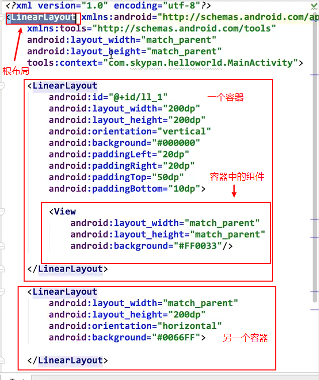

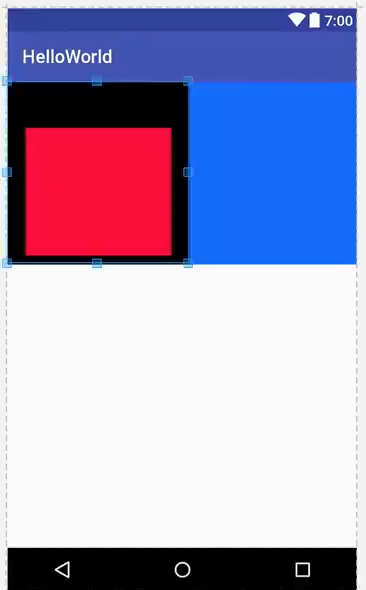

**！！！！layout_width 和 width区别**

- layout_width：是相对于父容器的
- width：是相对于自身的


**常用线性布局的信息**

```xml
<LinearLayout
              android:layout_width="match_parent"
              android:layout_height="match_parent"
              android:orientation="vertical"  #排列方式，线性布局特有
              >
    <View
          android:layout_width="match_parent" #宽度
          android:layout_height="200dp"  #高度
          android:background="#0000FF"  
          android:layout_margin="30dp"  
          android:layout_gravity="center"  #设置显示方式，center为在容器正中央
          android:layout_weight="1" #权重，对两个元素的占比进行等比切分（在父容器减去两个容器占比和剩下                                        的部分进行平分）
          />
</LinearLayout>
```

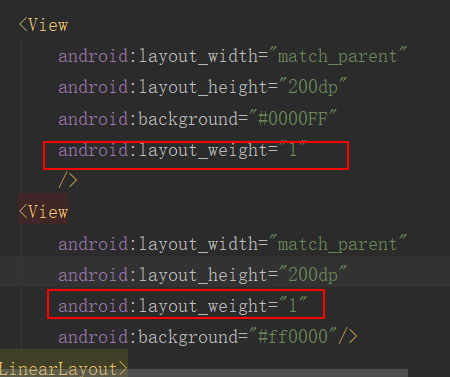

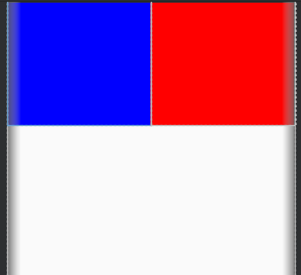

> 1、 `android :orientation="vertical"`表示该布局下的元素垂直排列；
> 2、`android:layout_gravity="center_horizontal"`表示该布局在父布局里水平居中，此时其父布局必须拥有`android:orientation="vertical"`属性；
>
> 3、`android:layout_gravity="center_vertical"`表示该布局在父布局里垂直居中，此时其父布局必须应设置成 `android:orientation="horizontal"`属性（默认为该属性），且其父布局的高度应设置为 android:layout_height="fill_parent"属性；
>
> 4、`android:gravity="center_horizontal"`表示该布局下的统一水平线的元素在垂直方向居中（**对于图片和文字水平线上面对齐很有帮助**）；
>
> **5、内部元素居中：在LinearLayout中写属性` android:gravity=”center”  `即可**

### 2.RelativeLayout

> 参考——https://blog.csdn.net/csdnbian/article/details/108818528

> **常用属性**
>
> - **相对于父控件**：
>
>      `android:layout_alignParentTop `     控件的顶部与父控件的顶部对齐;
>
>      `android:layout_alignParentBottom`  控件的底部与父控件的底部对齐;
>
>      `android:layout_alignParentLeft`      控件的左部与父控件的左部对齐;
>
>      `android:layout_alignParentRight  `   控件的右部与父控件的右部对齐;
>
> - **相对给定Id控件**
>
>      `android:layout_above` 控件的底部置于给定ID的控件之上;
>
>      `android:layout_below `    控件的顶部置于给定ID的控件之下;
>
>      `android:layout_toLeftOf `   控件的右边缘与给定ID的控件左边缘对齐;
>
>      `android:layout_toRightOf` 控件的左边缘与给定ID的控件右边缘对齐;
>
>      `android:layout_alignBaseline`  控件的baseline与给定ID的baseline对齐;
>
>      `android:layout_alignTop `       控件的顶部边缘与给定ID的顶部边缘对齐;
>
>      `android:layout_alignBottom  ` 控件的底部边缘与给定ID的底部边缘对齐;
>
>      `android:layout_alignLeft   `    控件的左边缘与给定ID的左边缘对齐;
>
>      `android:layout_alignRight  `    控件的右边缘与给定ID的右边缘对齐;
>
> - **居中**：
>
>      `android:layout_centerHorizontal `水平居中;
>      
>      `android:layout_centerVertical `   垂直居中;
>      
>      `android:layout_centerInParent  `父控件的中央;
>

相对其他元素进行布局

```xml
<RelativeLayout
    xmlns:android="http://schemas.android.com/apk/res/android"
    xmlns:tools="http://schemas.android.com/tools"
    xmlns:app="http://schemas.android.com/apk/res-auto"
    android:layout_width="match_parent"
    android:layout_height="match_parent"
    tools:context=".MainActivity">

    <View
        android:layout_width="100dp"
        android:layout_height="100dp"
        android:id="@+id/view_1"  
        android:background="#000000"/>

    <View
        android:layout_width="100dp"
        android:layout_height="100dp"
        android:background="#ff0000"
        android:id="@+id/view_2"  
        android:layout_below="@id/view_1"  
        android:layout_toLeftOf="@id/view_1"/>  <!--相对于view1左边布局，view2的右边缘与view1的左边缘对齐-->
     

</RelativeLayout>
```


### 3.ConstraintLayout

ConstraintLayout与RelativeLayout相似，都是根据同级视图与布局之间的关系进行布局，但灵活性要高于RelativeLayout

**约束条件**

使用ConstraintLayout，**必须要为该视图添加至少一个水平约束条件和一个垂直约束条件**。例如下面这个例子

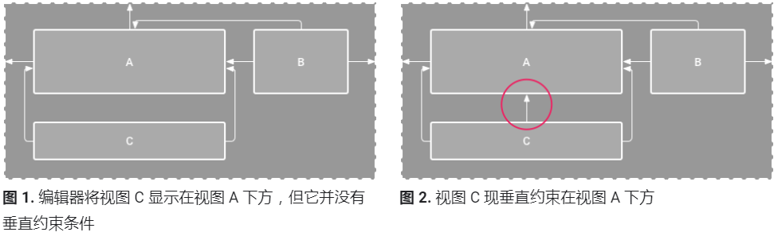

> **图1的C没有垂直方向上的约束，所以在绘制布局时会显示在顶部**


**添加依赖**

```groovy
dependencies {
    implementation 'androidx.constraintlayout:constraintlayout:2.0.4'
    // To use constraintlayout in compose
    implementation "androidx.constraintlayout:constraintlayout-compose:1.0.0-beta02"
}
```

**constraintLayout常用属性:**


> 上面比较有意思的是：
>
> **`layout_constraintBaseline_toBaselineOf`** ***用于文本对齐***
>
> **Baseline**指的是文本基线，举个例子：
>
> 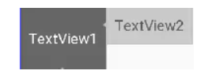
>
> 如图所示，两个TextView的高度不一致，但是又希望他们**文本对齐**，这个时候就可以使用该属性，代码如下：
>
> ```xml
>  <TextView
>         android:id="@+id/TextView1"
>         .../>
> 
>     <TextView
>         android:id="@+id/TextView2"
>         ...
>         app:layout_constraintLeft_toRightOf="@+id/TextView1" 
>         app:layout_constraintBaseline_toBaselineOf="@+id/TextView1"/>
> ```
>
> 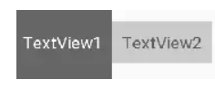


使用ConstraintLayout**必须要约定每一个view的位置**，下面就是一个最简单的例子

```xml
<androidx.constraintlayout.widget.ConstraintLayout xmlns:android="http://schemas.android.com/apk/res/android"
    xmlns:app="http://schemas.android.com/apk/res-auto"
    xmlns:tools="http://schemas.android.com/tools"
    android:layout_width="match_parent"
    android:layout_height="match_parent"
    tools:context=".ConstriantLayoutDemo">


    <Button
        android:id="@+id/cons_btn1"
        android:layout_width="wrap_content"
        android:layout_height="wrap_content"
        android:text="btn1"
        app:layout_constraintStart_toStartOf="parent"
        app:layout_constraintTop_toTopOf="parent" />

    <Button
        android:id="@+id/cons_btn2"
        android:layout_width="wrap_content"
        android:layout_height="wrap_content"
        android:text="btn2"
        app:layout_constraintStart_toStartOf="parent"
        app:layout_constraintTop_toBottomOf="@+id/cons_btn1" />

</androidx.constraintlayout.widget.ConstraintLayout>
```


**全部约束属性设置为parent，会达到居中的效果**

```xml
<android.support.constraint.ConstraintLayout xmlns:android="http://schemas.android.com/apk/res/android"
    xmlns:app="http://schemas.android.com/apk/res-auto"
    android:layout_width="match_parent"
    android:layout_height="match_parent">

    <ImageView
        android:id="@+id/iv_beauty"
        app:layout_constraintBottom_toBottomOf="parent"
        app:layout_constraintTop_toTopOf="parent"
        app:layout_constraintLeft_toLeftOf="parent"
        app:layout_constraintRight_toRightOf="parent"
        android:src="@drawable/beauty"
        android:layout_width="200dp"
        android:layout_height="200dp" />

</android.support.constraint.ConstraintLayout>
```


#### **bias(偏移量)**

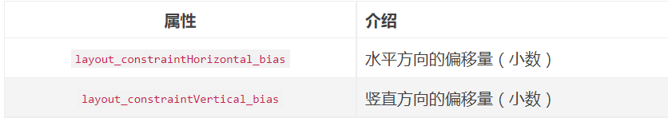

如果我想`ImageView`相对于父布局左边间隔`1/10`个父布局长度，相对于父布局上边间隔`2/10`个父布局高度，我们该怎实现呢？看代码：

```xml
<ImageView
        android:id="@+id/iv_beauty"
        app:layout_constraintHorizontal_bias="0.1"//左偏移
        app:layout_constraintVertical_bias="0.2"//下偏移
        app:layout_constraintTop_toTopOf="parent"
        app:layout_constraintLeft_toLeftOf="parent"
        app:layout_constraintBottom_toBottomOf="parent"
        app:layout_constraintRight_toRightOf="parent"
        ... />
```

> 这里需要注意的是：
>
> - 想要设置偏移，必须先将控件设置父布局居中。
> - 偏移的长度，如横向的偏移，是父布局宽度减去`ImageView`宽度的剩下的10%


#### **Circular positioning**

**圆形定位**：以一个控件为圆心设置角度和半径定位

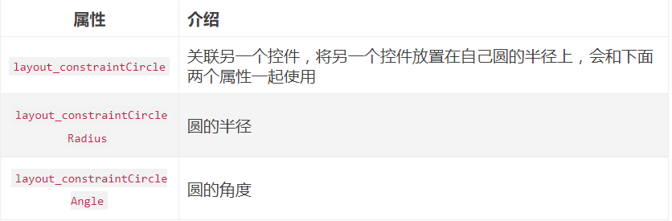

圆形定位，就是以目标控件为圆心，通过设置角度和半径确定我们当前控件的位置，如官方图：

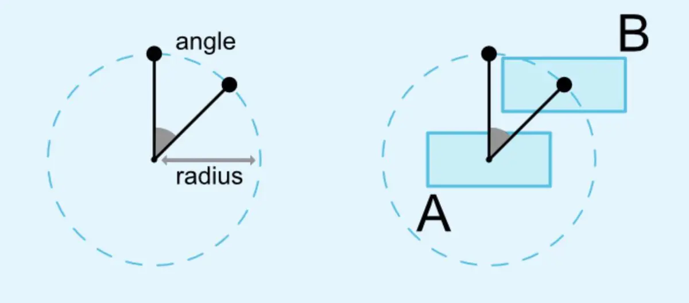

```xml
<ImageView
        android:id="@+id/iv_biu"
        ...../>

    <ImageView
        android:id="@+id/iv_girl"
        ....
        app:layout_constraintCircle="@+id/iv_biu"
        app:layout_constraintCircleRadius="120dp"
        app:layout_constraintCircleAngle="35"
        .../>
```

该属性可以设置一些动画


#### **Percent dimension**

**百分比布局**

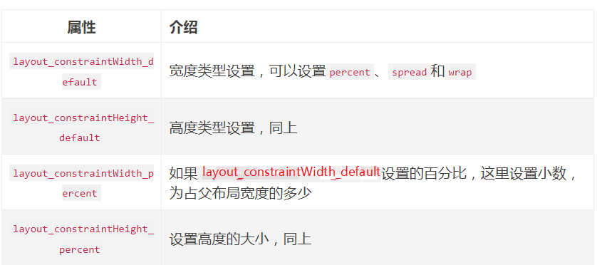

如果我们想将`ImageView`的宽度设置为父布局宽度的70%，这个时候我们就可以考虑使用百分比属性了，代码如下：

```xml
 <ImageView
        android:id="@+id/iv_beauty"
        ....
        app:layout_constraintWidth_default="percent"//先设置为百分比
        app:layout_constraintWidth_percent="0.7"//在设置百分比参数
        .... />
```


#### **Ration比例**

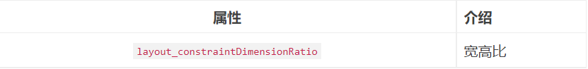

将控件比如`ImageView`设置长:宽=2:1

```xml
 <ImageView
        android:id="@+id/iv_beauty"
        android:layout_width="200dp"
        android:layout_height="0dp"
        app:layout_constraintDimensionRatio="2:1"//宽高比
       ..../>
```

> 如果需要按照比例设置控件，这里需要先将`layout_width`或者`layout_height`一方设置为`0dp`，另一个设置为正常比例，接着给`layout_constraintDimensionRatio`设置比例


#### **Chain Style(约束链类型)**


约束链声明了在某一个方向上的布局方式(和Flutter中Row组件的MainAxisAlignment属性类似)

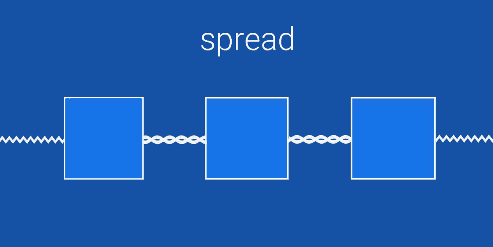

> - `spread`：视图均匀分布。
> - `spread_inside`：除了约束链的头部和尾部贴在两边的约束上，其余均匀分布。
> - `packed`：将视图打包在一起，默认居中。

```xml
<android.support.constraint.ConstraintLayout xmlns:android="http://schemas.android.com/apk/res/android"
    xmlns:app="http://schemas.android.com/apk/res-auto"
    android:layout_width="match_parent"
    android:layout_height="match_parent">

    <!-- 在第一个控件设置chain_style，第一个和最后一个ImageView也要设置
    好约束，上下控件也要互为约束 -->
    <ImageView
        android:id="@+id/iv_beauty"
        android:layout_width="200dp"
        android:layout_height="100dp"
        android:scaleType="centerCrop"
        android:src="@drawable/beauty"
        app:layout_constraintBottom_toTopOf="@+id/iv_girl"
        app:layout_constraintLeft_toLeftOf="parent"
        app:layout_constraintRight_toRightOf="parent"
        app:layout_constraintTop_toTopOf="parent"
        app:layout_constraintVertical_chainStyle="spread" />

    <ImageView
        android:id="@+id/iv_girl"
        android:layout_width="200dp"
        android:layout_height="100dp"
        android:scaleType="centerCrop"
        android:src="@drawable/girl"
        app:layout_constraintBottom_toTopOf="@+id/iv_biu"
        app:layout_constraintLeft_toLeftOf="parent"
        app:layout_constraintRight_toRightOf="parent"
        app:layout_constraintTop_toBottomOf="@+id/iv_beauty" />

    <ImageView
        android:id="@+id/iv_biu"
        android:layout_width="200dp"
        android:layout_height="100dp"
        android:scaleType="centerCrop"
        android:src="@drawable/biu"
        app:layout_constraintBottom_toBottomOf="parent"
        app:layout_constraintLeft_toLeftOf="parent"
        app:layout_constraintRight_toRightOf="parent"
        app:layout_constraintTop_toBottomOf="@+id/iv_girl" />


</android.support.constraint.ConstraintLayout>
```


#### **Barrier**

可以在多个view之间建立屏障，这样当一边移动时，屏障另一边也会相对移动：

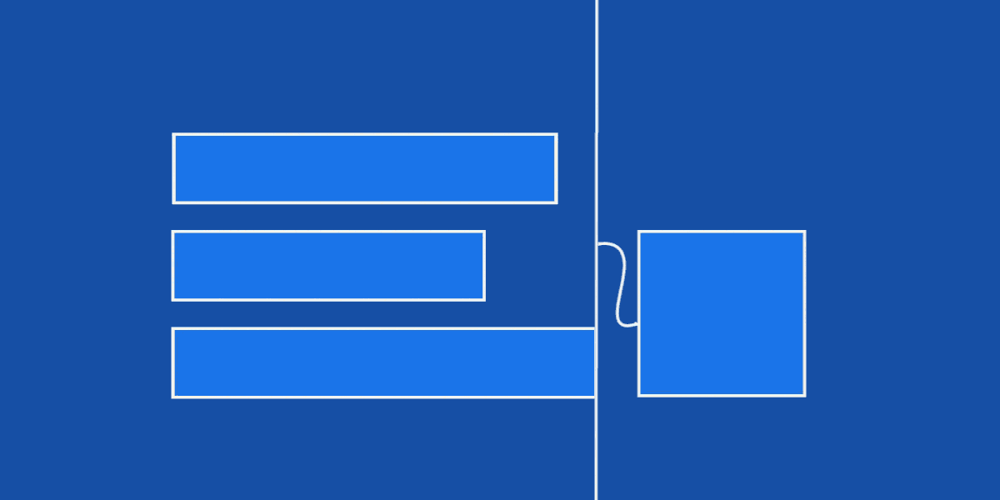

```xml
<TextView
          android:id="@+id/TextView1"
          .... />

<TextView
          android:id="@+id/TextView2"
          .... />

<!--在TextView1,TextView2右边-->
<android.support.constraint.Barrier
                                    android:id="@+id/barrier"
                                    android:layout_width="wrap_content"
                                    android:layout_height="wrap_content"
                                    app:barrierDirection="right"
                                    app:constraint_referenced_ids="TextView1,TextView2" />

<TextView
          android:id="@+id/TextView3"
          .....
          app:layout_constraintLeft_toRightOf="@+id/barrier" />
```

> `app:barrierDirection`为屏障所在的位置，可设置的值有：bottom、end、left、right、start、top
> `app:constraint_referenced_ids`为屏障引用的控件，可设置多个(用“,”隔开)


#### **Group**

现在有3个并排的TextView，用Group把TextView1和TextView3归为一组，再设置这组控件的可见性，如下所示：

```xml
<android.support.constraint.Group
        android:id="@+id/group"
        android:layout_width="wrap_content"
        android:layout_height="wrap_content"
        android:visibility="invisible"
        app:constraint_referenced_ids="TextView1,TextView3" />
```

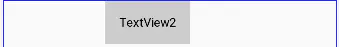


> 参考--
>
> https://www.jianshu.com/p/958887ed4f5f
>
> https://www.jianshu.com/p/17ec9bd6ca8a


### 4.MotionLayout

MotionLayout是ConstraintLayout子类，可以帮助管理应用中的运动和view动画，且MotionLayout还能够为任何布局属性添加动画效果。

> *`MotionLayout` 仅适用于其直接子级，不支持嵌套布局结构或 Activity 转换。*

```xml
<!--替换掉标签-->
<!-- before: ConstraintLayout -->
<androidx.constraintlayout.widget.ConstraintLayout .../>
<!-- after: MotionLayout -->
<androidx.constraintlayout.motion.widget.MotionLayout .../>
```


下面是一个完整实例用于实现动图功能：


```xml
<androidx.constraintlayout.motion.widget.MotionLayout
        xmlns:android="http://schemas.android.com/apk/res/android"
        xmlns:app="http://schemas.android.com/apk/res-auto"
        xmlns:tools="http://schemas.android.com/tools"
        android:id="@+id/motionLayout"
        android:layout_width="match_parent"
        android:layout_height="match_parent"
        app:layoutDescription="@xml/scene_01"//运动信息
        tools:showPaths="true">

        <View
            android:id="@+id/button"
            android:layout_width="64dp"
            android:layout_height="64dp"
            android:background="@color/colorAccent"
            android:text="Button" />

    </androidx.constraintlayout.motion.widget.MotionLayout>
```

> **创建 MotionScene**：在之前的 `MotionLayout` 示例中，`app:layoutDescription` 属性引用一个 MotionScene。**MotionScene 是一个 XML 资源文件，其中包含相应布局的所有运动描述**。为了将布局信息与运动描述分开，每个 `MotionLayout` 都引用一个单独的 MotionScene。*请注意，MotionScene 中的定义优先于 `MotionLayout` 中的任何类似定义。*

```xml
 <?xml version="1.0" encoding="utf-8"?>
    <MotionScene xmlns:android="http://schemas.android.com/apk/res/android"
        xmlns:motion="http://schemas.android.com/apk/res-auto">

        <Transition
            motion:constraintSetStart="@+id/start"
            motion:constraintSetEnd="@+id/end"
            motion:duration="1000">
            <OnSwipe
                motion:touchAnchorId="@+id/button"
                motion:touchAnchorSide="right"
                motion:dragDirection="dragRight" />
        </Transition>

        <ConstraintSet android:id="@+id/start">
            <Constraint
                android:id="@+id/button"
                android:layout_width="64dp"
                android:layout_height="64dp"
                android:layout_marginStart="8dp"
                motion:layout_constraintBottom_toBottomOf="parent"
                motion:layout_constraintStart_toStartOf="parent"
                motion:layout_constraintTop_toTopOf="parent" />
        </ConstraintSet>

        <ConstraintSet android:id="@+id/end">
            <Constraint
                android:id="@+id/button"
                android:layout_width="64dp"
                android:layout_height="64dp"
                android:layout_marginEnd="8dp"
                motion:layout_constraintBottom_toBottomOf="parent"
                motion:layout_constraintEnd_toEndOf="parent"
                motion:layout_constraintTop_toTopOf="parent" />
        </ConstraintSet>

    </MotionScene>
```

> - `<Transition>` 包含运动的基本定义。
>
>   - `motion:constraintSetStart` 和 `motion:constraintSetEnd` 指的是运动的端点。这些端点在 MotionScene 后面的 `<ConstraintSet>` 元素中定义。
>   - `motion:duration` 指定完成运动所需的毫秒数。
>
> - `<OnSwipe>` 可让您通过轻触控制运动。
>
>   - `motion:touchAnchorId` 指的是您可以滑动并拖动的视图。
>   - `motion:touchAnchorSide` 表示我们从右侧拖动视图。
>   - `motion:dragDirection` 表示拖动的进度方向。例如，`motion:dragDirection="dragRight"` 表示当您向右拖动时，进度会增加。
>
> - `<ConstraintSet>` 是定义描述您的运动的各种限制条件的位置。在此示例中，我们为运动的每个端点定义一个 `ConstraintSet`。这些端点垂直居中（通过 `app:layout_constraintTop_toTopOf="parent"` 和 `app:layout_constraintBottom_toBottomOf="parent"`）。在水平方向上，端点位于屏幕最左侧和最右侧。
>
> - 在 `<Constraint>` 中，您可以使用 `<CustomAttribute>` 元素为不仅仅与位置相关的属性或 `View` 属性指定转换。
>
>   ```xml
>    <Constraint
>           android:id="@+id/button" ...>
>           <CustomAttribute
>               motion:attributeName="backgroundColor"
>               motion:customColorValue="#D81B60"/>
>       </Constraint>
>   ```

> 更多示例参考文档--https://developer.android.google.cn/training/constraint-layout/motionlayout/examples


### 5.GridLayout

> 参考——https://blog.csdn.net/qq_62972842/article/details/127747795

**(1)特点**

> - GridLayout布局使用虚细线将布局划分为行、列和单元格，也支持一个控件在行、列上都有交错排列。
> - 可以自己设置布局中组件的排列方式
> - 可以自定义网格布局有多少行、多少列
> - 可以直接设置组件位于某行某列
> - 可以设置组件横跨几行或者几列
>
> **布局属性**
>
> | 属性          | 含义     |
> | ------------- | -------- |
> | rowCount      | 行数     |
> | columnCount   | 列数     |
> | layout_width  | 布局宽度 |
> | layout_height | 布局高度 |
>
> **针对子布局属性**
>
> | 属性              | 含义                       |
> | ----------------- | -------------------------- |
> | layout_row        | 子控件在表格中的行数       |
> | layout_column     | 子控件在表格中的列数       |
> | layout_rowSpan    | 跨行数，需要子元素指定高度 |
> | layout_columnSpan | 跨列数，需要子元素指定宽度 |

```xml
<GridLayout
            android:layout_width="match_parent"
            android:layout_height="wrap_content"
            android:layout_marginTop="10dp"
            android:columnCount="5"
            android:rowCount="6">
    <Button></Button>
    <Button></Button>
</GridLayout>
```

> **实例二：**
>
> ```xml
> <?xml version="1.0" encoding="utf-8"?>
> <LinearLayout xmlns:android="http://schemas.android.com/apk/res/android"
>     xmlns:tools="http://schemas.android.com/tools"
>     android:layout_width="match_parent"
>     android:layout_height="match_parent"
>     android:background="@drawable/background"
>     android:gravity="center_horizontal"
>     android:orientation="vertical"
>     android:padding="15dp"
>     tools:context=".MainActivity">
> 
>     <TextView
>         android:layout_width="match_parent"
>         android:layout_height="wrap_content"
>         android:layout_marginTop="30dp"
>         android:background="@drawable/custom_border"
>         android:gravity="right"
>         android:text="0123456789"
>         android:textColor="#0000ff"
>         android:textSize="20sp"/>
> 
>     <GridLayout
>         android:layout_width="wrap_content"
>         android:layout_height="wrap_content"
>         android:layout_marginTop="10dp"
>         android:columnCount="5"
>         android:rowCount="6">
> 
>         <Button
>             android:layout_width="68dp"
>             android:layout_height="wrap_content"
>             android:layout_row="0"
>             android:layout_column="0"
>             android:layout_marginRight="5dp"
>             android:text="MC"
>             android:textSize="15dp"/>
> 
>         <Button
>             android:layout_width="68dp"
>             android:layout_height="wrap_content"
>             android:layout_row="0"
>             android:layout_column="1"
>             android:layout_marginRight="5dp"
>             android:text="MR"
>             android:textSize="15sp"/>
> 
>         <Button
>             android:layout_width="68dp"
>             android:layout_height="wrap_content"
>             android:layout_row="0"
>             android:layout_column="2"
>             android:layout_marginRight="5dp"
>             android:text="MS"
>             android:textSize="15sp"/>
> 
>         <Button
>             android:layout_width="68dp"
>             android:layout_height="wrap_content"
>             android:layout_row="0"
>             android:layout_column="3"
>             android:layout_marginRight="5dp"
>             android:text="M+"
>             android:textSize="15sp"/>
> 
>         <Button
>             android:layout_width="68dp"
>             android:layout_height="wrap_content"
>             android:layout_row="0"
>             android:layout_column="4"
>             android:layout_marginRight="5dp"
>             android:text="M-"
>             android:textSize="15sp"/>
> 
>         <!--   第二排    -->
>         <Button
>             android:layout_width="68dp"
>             android:layout_height="wrap_content"
>             android:layout_row="1"
>             android:layout_column="0"
>             android:layout_marginRight="5dp"
>             android:text="←"
>             android:textSize="15dp"/>
> 
>         <Button
>             android:layout_width="68dp"
>             android:layout_height="wrap_content"
>             android:layout_row="1"
>             android:layout_column="1"
>             android:layout_marginRight="5dp"
>             android:text="CE"
>             android:textSize="15sp"/>
> 
>         <Button
>             android:layout_width="68dp"
>             android:layout_height="wrap_content"
>             android:layout_row="1"
>             android:layout_column="2"
>             android:layout_marginRight="5dp"
>             android:text="C"
>             android:textSize="15sp"/>
> 
>         <Button
>             android:layout_width="68dp"
>             android:layout_height="wrap_content"
>             android:layout_row="1"
>             android:layout_column="3"
>             android:layout_marginRight="5dp"
>             android:text="±"
>             android:textSize="15sp"/>
> 
>         <Button
>             android:layout_width="68dp"
>             android:layout_height="wrap_content"
>             android:layout_row="1"
>             android:layout_column="4"
>             android:layout_marginRight="5dp"
>             android:text="√"
>             android:textSize="15sp"/>
> 
>         <!--        第三行        -->
>         <Button
>             android:layout_width="68dp"
>             android:layout_height="wrap_content"
>             android:layout_row="2"
>             android:layout_column="0"
>             android:layout_marginRight="5dp"
>             android:text="7"
>             android:textSize="15dp"/>
> 
>         <Button
>             android:layout_width="68dp"
>             android:layout_height="wrap_content"
>             android:layout_row="2"
>             android:layout_column="1"
>             android:layout_marginRight="5dp"
>             android:text="8"
>             android:textSize="15sp"/>
> 
>         <Button
>             android:layout_width="68dp"
>             android:layout_height="wrap_content"
>             android:layout_row="2"
>             android:layout_column="2"
>             android:layout_marginRight="5dp"
>             android:text="9"
>             android:textSize="15sp"/>
> 
>         <Button
>             android:layout_width="68dp"
>             android:layout_height="wrap_content"
>             android:layout_row="2"
>             android:layout_column="3"
>             android:layout_marginRight="5dp"
>             android:text="/"
>             android:textSize="15sp"/>
> 
>         <Button
>             android:layout_width="68dp"
>             android:layout_height="wrap_content"
>             android:layout_row="2"
>             android:layout_column="4"
>             android:layout_marginRight="5dp"
>             android:text="%"
>             android:textSize="15sp"/>
> 
>         <!--    第四行    -->
>         <Button
>             android:layout_width="68dp"
>             android:layout_height="wrap_content"
>             android:layout_row="3"
>             android:layout_column="0"
>             android:layout_marginRight="5dp"
>             android:text="4"
>             android:textSize="15dp"/>
> 
>         <Button
>             android:layout_width="68dp"
>             android:layout_height="wrap_content"
>             android:layout_row="3"
>             android:layout_column="1"
>             android:layout_marginRight="5dp"
>             android:text="5"
>             android:textSize="15sp"/>
> 
>         <Button
>             android:layout_width="68dp"
>             android:layout_height="wrap_content"
>             android:layout_row="3"
>             android:layout_column="2"
>             android:layout_marginRight="5dp"
>             android:text="6"
>             android:textSize="15sp"/>
> 
>         <Button
>             android:layout_width="68dp"
>             android:layout_height="wrap_content"
>             android:layout_row="3"
>             android:layout_column="3"
>             android:layout_marginRight="5dp"
>             android:text="*"
>             android:textSize="15sp"/>
> 
>         <Button
>             android:layout_width="68dp"
>             android:layout_height="wrap_content"
>             android:layout_row="3"
>             android:layout_column="4"
>             android:layout_marginRight="5dp"
>             android:text="1/X"
>             android:textSize="15sp"/>
> 
>         <!--        第五行         -->
>         <Button
>             android:layout_width="68dp"
>             android:layout_height="wrap_content"
>             android:layout_row="4"
>             android:layout_column="0"
>             android:layout_marginRight="5dp"
>             android:text="1"
>             android:textSize="15dp"/>
> 
>         <Button
>             android:layout_width="68dp"
>             android:layout_height="wrap_content"
>             android:layout_row="4"
>             android:layout_column="1"
>             android:layout_marginRight="5dp"
>             android:text="2"
>             android:textSize="15sp"/>
> 
>         <Button
>             android:layout_width="68dp"
>             android:layout_height="wrap_content"
>             android:layout_row="4"
>             android:layout_column="2"
>             android:layout_marginRight="5dp"
>             android:text="3"
>             android:textSize="15sp"/>
> 
>         <Button
>             android:layout_width="68dp"
>             android:layout_height="wrap_content"
>             android:layout_row="4"
>             android:layout_column="3"
>             android:layout_marginRight="5dp"
>             android:text="-"
>             android:textSize="15sp"/>
> 
>         <Button
>             android:layout_width="68dp"
>             android:layout_height="97dp"
>             android:layout_row="4"
>             android:layout_rowSpan="2"
>             android:layout_column="4"
>             android:layout_marginRight="5dp"
>             android:text="="
>             android:textSize="15sp"/>
> 
> <!--         第六行           -->
>         <Button
>             android:layout_width="140dp"
>             android:layout_height="wrap_content"
>             android:layout_row="5"
>             android:layout_column="0"
>             android:layout_columnSpan="2"
>             android:layout_marginRight="5dp"
>             android:text="0"
>             android:textSize="15sp"/>
> 
>         <Button
>             android:layout_width="68dp"
>             android:layout_height="wrap_content"
>             android:layout_row="5"
>             android:layout_column="2"
>             android:layout_marginRight="5dp"
>             android:text="."
>             android:textSize="15sp"/>
> 
>         <Button
>             android:layout_width="68dp"
>             android:layout_height="wrap_content"
>             android:layout_row="5"
>             android:layout_column="3"
>             android:layout_marginRight="5dp"
>             android:text="+"
>             android:textSize="15sp"/>
>     </GridLayout>
> </LinearLayout>
> 
> ```
>
>  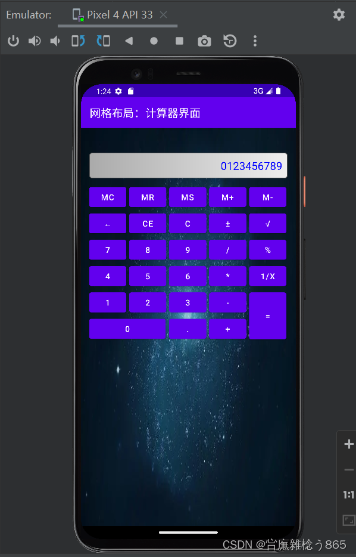 


### 6.FrameLayout

> https://blog.csdn.net/weixin_63975980/article/details/127785152

帧布局是一种层叠式布局，后添加的元素会覆盖在先添加的元素上面（默认添加元素都会在左上角）。在例如地图上构建POI等有帮助

**常用属性：**

>  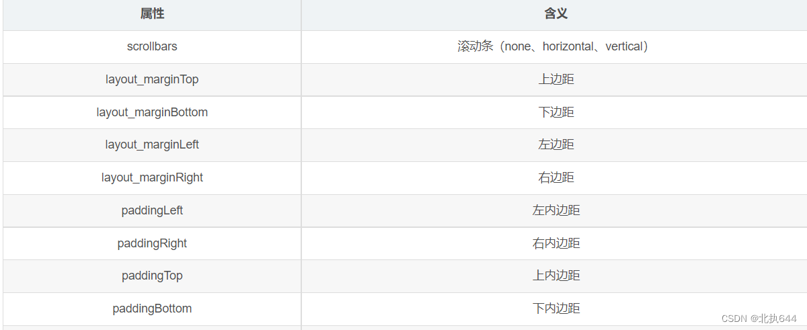

 

### 7.TableLayout

> https://blog.csdn.net/qq_62277763/article/details/128560369

 TableLayout**继承**自`LinearLayout`, 因此它**完全支持**LinearLayout所支持的属性，此外，它还有其他的常用属性。 

在TableLayout中，每一行通过`TableRow`来包裹

> **属性**
>
> 列号都是从0开始算的, 可以设置多个,用逗号隔开比如"0,2", 所有列都生效,则用"*"号即可
>
> | ***\*属性名称\****                | ***\*对应方法\****功能描述               | 描述                                                         |
> | --------------------------------- | ---------------------------------------- | ------------------------------------------------------------ |
> | ***\*android:collapseColumns\**** | ***\*setColumnCollapsed(int,bolean)\**** | ***\*设置指定列号的列为是否隐藏\****                         |
> | ***\*android:shrinkColumns\****   | ***\*setShrinkAllColumns(boolean)\****   | ***\*设置指定的列号列为宽度是否可进行收缩\****               |
> | ***\*android:stretchColumns\****  | ***\*setStretchAllColumns(boolean)\****  | ***\*设置指定列号的列为宽度是否可进行拉伸，尽量把指定的列填充空白部分\**** |
>
> > - layout_column指定
> > - layout_span，合并列

> **案例**
>
> ```xml
> <LinearLayout xmlns:android="http://schemas.android.com/apk/res/android"
>               xmlns:app="http://schemas.android.com/apk/res-auto"
>               xmlns:tools="http://schemas.android.com/tools"
>               android:layout_width="match_parent"
>               android:layout_height="match_parent"
>               tools:context=".MainActivity"
>               android:orientation="vertical"
>               >
> 
>     <TableLayout
>                  android:layout_width="wrap_content"
>                  android:layout_height="wrap_content"
>                  >
>         <TableRow
>                   >
>             <Button
>                     android:text="sss"
>                     android:layout_column="1"
>                     >
>             </Button>
> 
>             <Button
>                     android:text="2"
>                     >
>             </Button>
>         </TableRow>
> 
>         <TableRow>
>             <Button>
>             </Button>
> 
>             <Button>
>             </Button>
>         </TableRow>
>     </TableLayout>
> 
> </LinearLayout>
> ```
>
> 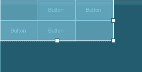

### 8.AbsoluteLayout

> 参考——https://blog.csdn.net/qq_62277763/article/details/128671793

绝对布局缺乏灵活性，在没有绝对定位的情况下相比其他类型的布局更难维护，**不建议使用**。（AS已经弃用）

> | 属性                  | 作用            |
> | :-------------------- | :-------------- |
> | android:layout_width  | 组件宽度        |
> | android:layout_height | 组件高度        |
> | android:layout_x      | 设置组件的X坐标 |
> | android:layout_y      | 设置组件的Y坐标 |


### 9.CardView

> [cardview](https://juejin.cn/post/7002526755835609102)

**卡片式布局**，比较常用

```groovy
dependencies {
    implementation "androidx.cardview:cardview:1.0.0"
}
```

常用属性：

`app:cardCornerRadius` 设置CardView圆角 
 `app:cardElevation` 设置CardView阴影 
 `app:cardMaxElevation`设置CardView最大阴影 
 `app:cardBackgroundColor` 设置CardView背景色 `app:cardUseCompatPadding` 设置内边距，V21+的版本和之前的版本仍旧具有一样的计算方式 
 `app:cardPreventCornerOverlap` 在V20和之前的版本中添加内边距，这个属性为了防止内容和边角的重叠 
 `app:contentPadding` 设置卡片内容到四周的边距 
 `app:contentPaddingLeft` 设置卡片内容到左边的边距 
 `app:contentPaddingRight` 设置卡片内容到右边的边距 
 `app:contentPaddingTop` 设置卡片内容到顶部的边距 
 `app:contentPaddingBottom` 设置卡片内容到底部的边距 
 `android:minWidth` 设置卡片的最小宽度 
 `android:minHeight` 设置卡片的最小高度


### 10.DrawerLayout

实现了侧滑菜单的效果布局，

> **使用**
>
> DrawerLayout 是一个布局文件管理器，在这个布局当中允许放入 2 个组件或者是布局:
>
> - 第 1 个用于显示在主屏幕当中
>
> - 第 2 个用于显示滑动菜单中的内容
>
>   在设置滑动菜单实现的内容时在该组件或布局中需要添加 `android:layout_gravity="start"`属性将需要显示的内容放在布局的左侧。
>
> ```xml
> <androidx.drawerlayout.widget.DrawerLayout
>     xmlns:android="http://schemas.android.com/apk/res/android"
>     android:id="@+id/drawerLayout"
>     android:layout_width="match_parent"
>     android:layout_height="match_parent">
>     
>     <!-- 界面主要内容布局区 -->
>     <FrameLayout
>         android:layout_width="match_parent"
>         android:layout_height="match_parent">
>     </FrameLayout>
>     
>     <!-- 左侧弹出的内容 -->
>     <LinearLayout
>         android:layout_width="match_parent"
>         android:layout_height="match_parent"
>         android:layout_gravity="start"
>         android:orientation="vertical">
>     </LinearLayout>
>     
> </androidx.drawerlayout.widget.DrawerLayout>
> ```
>
> 
>
> **设置监听器：**
>
>  可以使用 `setDrawerListener() `方法为该布局设置监听器，根据监听器中的 4 个方法实现滑动菜单在不同的状态下来完成各种任务。 
>
> ```java
> //获取DrawerLayout布局
> DrawerLayout drawerLayout = (DrawerLayout) findViewById(R.id.drawerLayout);
> drawerLayout.setDrawerListener(new DrawerLayout.DrawerListener() {
>     //当抽屉的位置发生变化时调用
>     @Override
>     public void onDrawerSlide(View drawerView, float slideOffset) {
>     }
> 
>     //当抽屉已经处于完全打开的状态时调用
>     @Override
>     public void onDrawerOpened(View drawerView) {
>     }
> 
>     //当抽屉已经完全关闭状态时调用
>     @Override
>     public void onDrawerClosed(View drawerView) {
>     }
> 
>     //抽屉滑动状态改变时调用
>     //状态值STATE_IDLE：闲置、STATE_DRAGGING：拖拽、STATE_SETTLING：固定的
>     @Override
>     public void onDrawerStateChanged(int newState) {
>     }
> 
> });
> ```
>
> 

### 11.CoordinatorLayout 

### 12.AppBarLayout 


### 13.TabLayout

> **参考：**
>
>  [Android原生TabLayout使用全解析](https://blog.csdn.net/yechaoa/article/details/122270969) 

### 14.viewStub


## 改善布局性能

布局的是Android应用中直接影响用户体验的关键部分，如果布局不当会导致占用大量内存，应用界面异常缓慢。

### 优化布局层次结构

在一些进行布局的例子中，会出现一些布局麻烦问题：

> **避免嵌套Layout**
>
> 使用**嵌套的 `LinearLayout`** 实例会导致视图层次结构过深。此外，嵌套多个使用 `layout_weight` 参数的 `LinearLayout` 实例成本非常高，因为每个子级都需要测量两次。如果要反复膨胀布局（例如，在 `ListView` 或 `GridView` 中使用时），要特别注意这方面。


**可以使用布局检查器和布局验证工具调试布局**

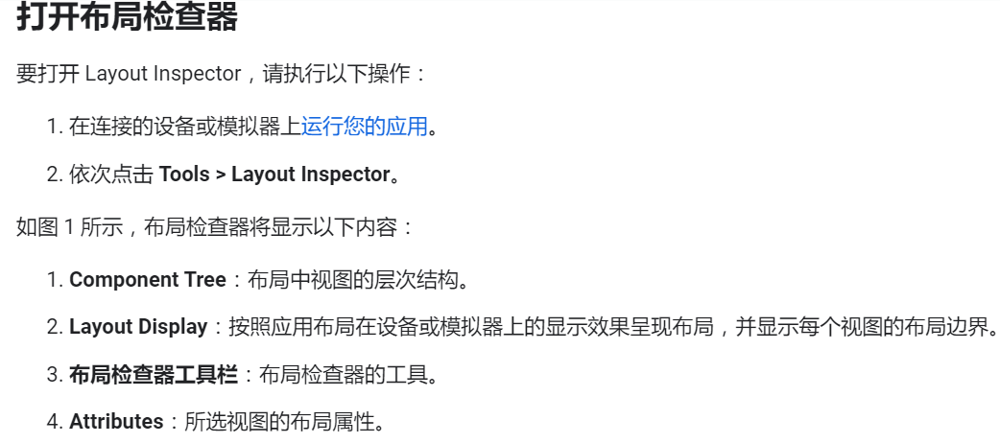

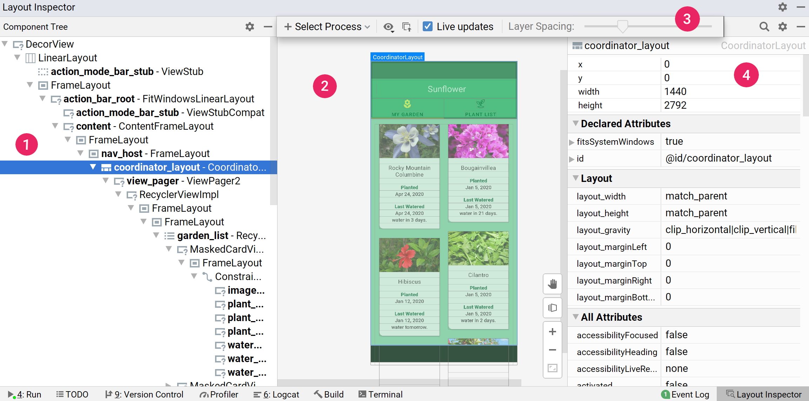

> 用法同Flutter类型，还可以保存快照

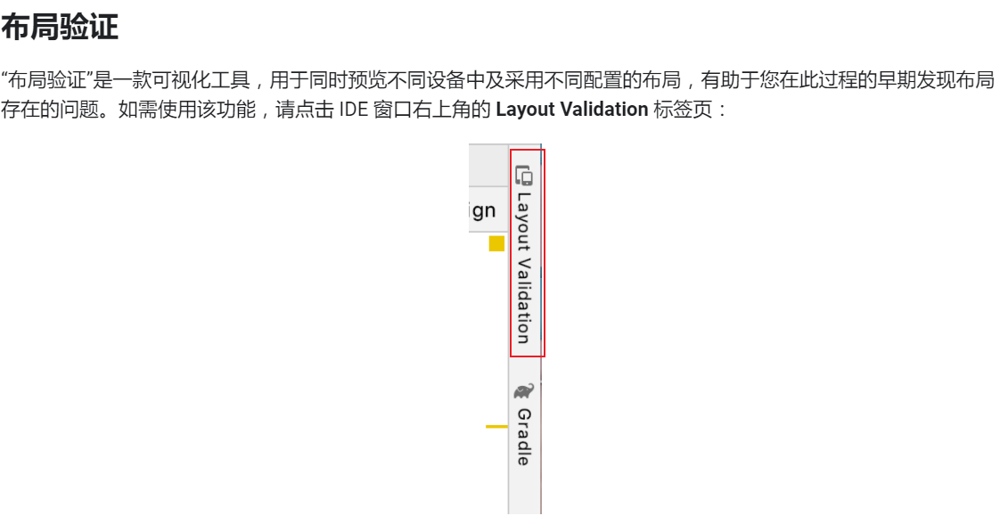

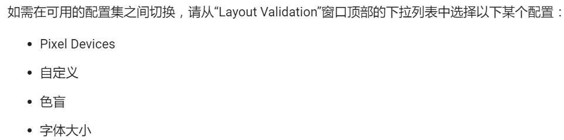

> 详情参考--
>
> https://developer.android.google.cn/studio/debug/layout-inspector

### 使用Lint进行代码检查

> 参考--
>
> https://blog.csdn.net/zhangwenshuan/article/details/97525140


### 避免重复布局

可以使用 **`<include/>`** 和 **`<merge/>`** 标记在当前布局中嵌入其他布局。

>  例如，“是/否”按钮面板，或包含说明文本的自定义进度条。这也意味着您可以单独提取、管理多个布局中的任何常见应用元素，然后将其添加到各个布局中。

**demo：定义一个可重复使用的标题栏：**

创建一个新的 XML 文件并定义该布局

```xml
 <FrameLayout xmlns:android="http://schemas.android.com/apk/res/android"
        xmlns:tools="http://schemas.android.com/tools"
        android:layout_width="match_parent"
        android:layout_height="wrap_content"
        android:background="@color/titlebar_bg"
        tools:showIn="@layout/activity_main" >

        <ImageView android:layout_width="wrap_content"
                   android:layout_height="wrap_content"
                   android:src="@drawable/gafricalogo" />
    </FrameLayout>
```

> 上述 XML 中的 [`tools:showIn`](https://developer.android.google.cn/studio/write/tool-attributes#toolsshowin) 属性，在编译过程中会被移除，**它指定了包含此文件的布局**，以便您可以按它嵌入到父级布局中时的**显示效果来预览**（和修改）此文件。


在要添加可重复使用的组件的布局中，添加`<include/>`标签，

例如下面的布局包含上述标题栏

```xml
 <LinearLayout xmlns:android="http://schemas.android.com/apk/res/android"
        android:orientation="vertical"
        android:layout_width="match_parent"
        android:layout_height="match_parent"
        android:background="@color/app_bg"
        android:gravity="center_horizontal">

        <include layout="@layout/titlebar"/><!--引入布局，避免嵌套-->

        <TextView android:layout_width="match_parent"
                  android:layout_height="wrap_content"
                  android:text="@string/hello"
                  android:padding="10dp" />

        ...

    </LinearLayout>
```

**在include标签里还可以添加布局参数(任何 `android:layout_` 属性)来替代原view中的参数；如果要使用 `<include>` 标记来替换原始布局文件中的属性,必须同时替换 `android:layout_height` 和 `android:layout_width` 才能让其他布局属性生效。**

```xml
 <include android:id="@+id/news_title"
             android:layout_width="match_parent"
             android:layout_height="match_parent"
             layout="@layout/title"/>
```


**使用`<merge>`标记**

在一个布局中添加另一个布局时，`<merge />` 标记有助于消除视图层次结构中的冗余视图组。**也就是说，一个布局要嵌套另一个布局时候，嵌套进去的那个布局可以使用`merge`标签消除冗余ViewGroup**

> 例如，当我要在一个LinearLayout布局里面重复使用组件A，但是组件A的根布局也是LinearLayout，当我重复使用的时候会造成两个视图冗余，也就是说**嵌套的 `LinearLayout` 除了会降低界面的性能之外，没有任何实际用处**。
>
> 为了避免这类情况，可以使用`<merge>` 元素作为可重复使用的布局的根视图
>
> ```xml
> <merge xmlns:android="http://schemas.android.com/apk/res/android">
> 
>      <Button
>          android:layout_width="fill_parent"
>          android:layout_height="wrap_content"
>          android:text="@string/add"/>
> 
>      <Button
>          android:layout_width="fill_parent"
>          android:layout_height="wrap_content"
>          android:text="@string/delete"/>
> 
>  </merge>
> ```
>
> 现在，当您将此布局添加到其他布局中（使用 `<include/>` 标记）时，系统会忽略 `<merge>` 元素并直接在布局中放置两个按钮，以代替 `<include/>` 标记。


### 视图加载延迟

当应用**将来**可能需要加载复杂试图，则可以使用**延迟加载**资源这项重要的方法。可以通过为复杂且很少使用的视图定义*ViewStub*来实现此方法。

> `ViewStub` 是一种没有任何维度的轻量型视图，它不会绘制任何内容或参与布局。因此，扩充和离开视图层次结构的成本比较低。每个 `ViewStub` 只需包含 `android:layout` 属性即可指定要扩充的布局。


*定义ViewStub*

以下 `ViewStub` 适用于半透明进度条叠加层，只有当新的项导入应用中时，它才会显示。

```xml
 <ViewStub
        android:id="@+id/stub_import"
        android:inflatedId="@+id/panel_import"
        android:layout="@layout/progress_overlay"
        android:layout_width="fill_parent"
        android:layout_height="wrap_content"
        android:layout_gravity="bottom" />
```

*加载ViewStub*

如果要加载 `ViewStub` 指定的布局，可通过调用 `setVisibility(View.VISIBLE)` 将其设置为可见，或调用 `inflate()`。

```java
findViewById(R.id.stub_import).setVisibility(View.VISIBLE);
// or
View importPanel = ((ViewStub) findViewById(R.id.stub_import)).inflate();
```

> `inflate()` 方法会在完成后返回扩充的 `View`。因此，如果您需要与布局互动，则无需调用 `findViewById()`。

该布局可见/扩充之后，`ViewStub` 元素将不再是视图层次结构的一部分。它会被替换为经过扩充的布局，该**布局的根视图的 ID 便是由 ViewStub 的 `android:inflatedId` 属性指定的那个 ID**。（为 `ViewStub` 指定的 ID `android:id` 仅在 `ViewStub` 布局可见/扩充之前有效。）


## <font color='red'>View绘制流程</font>

> [探索view绘制流程](https://juejin.cn/post/6904192359253147661)
>
> [setContentView讲解](https://juejin.cn/post/6844903511390420999)
>
> https://zhuanlan.zhihu.com/p/539384119
>
> [理解DecorView](https://www.jianshu.com/p/ee7e3b08c23c)
>
> [view树形结构，如何获取没有ID的根视图](https://juejin.cn/post/6844904180138639373)

### View结构

#### View的树形结构

 View 的测量、绘制和事件分发都是**从树的根部**逐级遍历分发下去的，下面就是树形结构图：

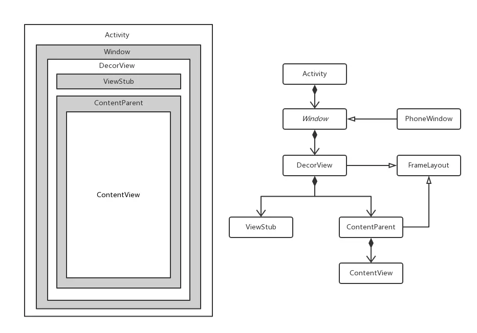 

- Activity就是最顶层，负责管理window
- **Window**：window是Activity里的一个实例，是接口，其**唯一的实现类就是`PhoneWindow`**，**一个Activity中至少存在一个Window与之绑定（如果弹出Dialog，也会持有一个phonewindow）**，Window负责处理一些用户事件和系统事件。Window本身无法显示View，因此**可以理解为显示界面的显示屏**。
- **DecorView**：Activity中真正显示内容的是View，而Window中的根视图就是`DecorView`。**DecorView是一个FrameLayout**，**Activity布局文件就是添加到了这个DecorView中** 


 

#### DecorView

```java
public class DecorView extends FrameLayout implements RootViewSurfaceTaker, WindowCallbacks
```


DecorView的结构

 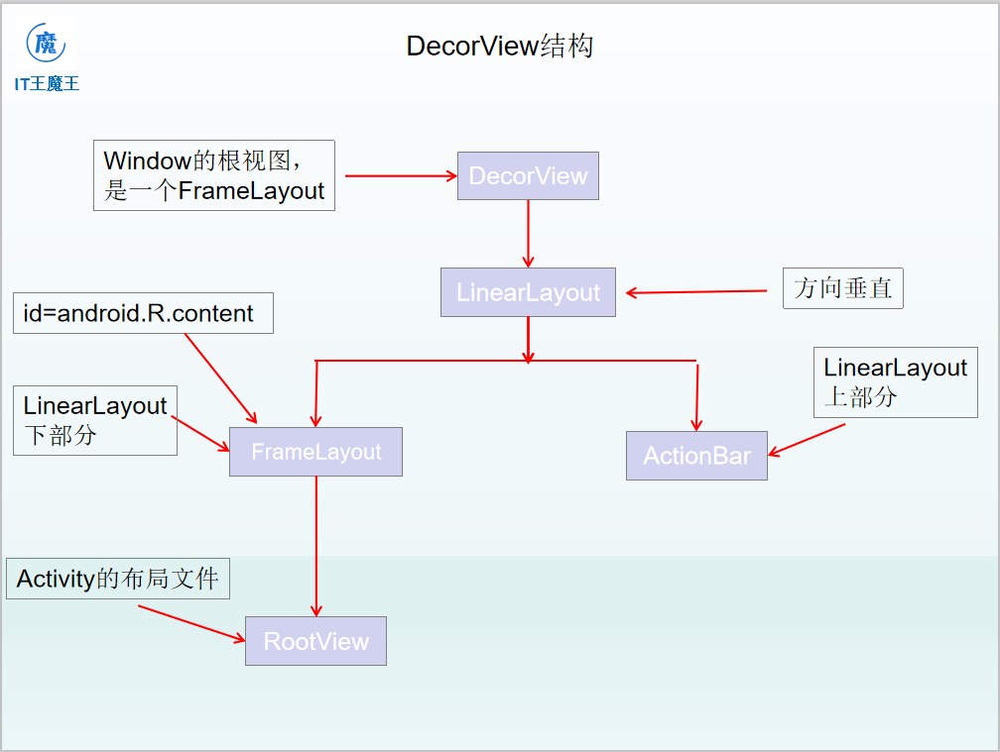 

- DecorView自身是一个FrameLayout

- FrameLayout里又是一个LinearLayout，分上下部分，上部分是ActionBar，**下部分是FrameLayout，这个FrameLayout带有ID：android.R.content**

  > ```java
  > //获取根布局方式
  > View view = getWindow().getDecorView().findViewById(android.R.id.content);
  > ```

- Activity的布局文件就加载进content里面（这也是为什么加载视图的方法叫`setContentView`）


#### ViewRootImpl

`ViewRootImpl` 是连接 `WindowManager` 和 `DecorView` 的纽带，**测量、放置和绘制**三大流程都是通过 ViewRootImpl 实现的。 


### View加载与绘制

#### 继承自Activity的视图层级

下面从`onCreate`的`setContentView`开始，理一遍绘制流程（继承自Activity）

(1)调用`setContentView`，进入到`Activity.java`中

```java
//Activity.java
/**
     * Set the activity content from a layout resource.  The resource will be
     * inflated, adding all top-level views to the activity.
     * 调用这个方法会将资源文件中的xml布局文件，加载到Activity的顶级View中去。
     */
public void setContentView(@LayoutRes int layoutResID) {
    getWindow().setContentView(layoutResID);
    initWindowDecorActionBar();
}
```

> 可以看到首先`getWindow()`方法获取了一个window对象，前面已经说过，window的实现类只有`PhoneWindow`，因此这里调用的是`PhoneWindow`的`setContentView`方法

(2) 跳转到`PhoneWindow`的`setContentView`方法： 

```java
//PhoneWindow.java

public void setContentView(int layoutResID) {
    // Note: FEATURE_CONTENT_TRANSITIONS may be set in the process of installing the window
    // decor, when theme attributes and the like are crystalized. Do not check the feature
    // before this happens.
    if (mContentParent == null) {
        installDecor();
    } else if (!hasFeature(FEATURE_CONTENT_TRANSITIONS)) {//没有过渡动画
        mContentParent.removeAllViews();
    }

    if (hasFeature(FEATURE_CONTENT_TRANSITIONS)) {//有过渡动画
        final Scene newScene = Scene.getSceneForLayout(mContentParent, layoutResID,
                                                       getContext());
        transitionTo(newScene);
    } else {
        mLayoutInflater.inflate(layoutResID, mContentParent);//将xml文件加载到mContentParent
    }
    mContentParent.requestApplyInsets();
    final Callback cb = getCallback();
    if (cb != null && !isDestroyed()) {
        cb.onContentChanged();
    }
    mContentParentExplicitlySet = true;
}
```

> 这个方法里面出现了`mContentParent`，如果存在调用`transitionTo`方法，如果不存在则加载布局文件到`mContentParent`中。（其实`transitionTo`方法最终也会调用`LayoutInflater.inflate`）
>
> 查看`mContentParent`定义：**这是放置窗口内容的视图。它要么是 mDecor 本身，要么是 mDecor 的子项，内容所在的位置。**

(3)可以看到如果`mContentParent`为空， 那么`installDecor()`方法一定是初始化`mContentParent`的方法 

```java
//PhoneWindow.java
private void installDecor() {
    mForceDecorInstall = false;
    //初始化decor
    if (mDecor == null) {
        mDecor = generateDecor(-1);//初始化decorview
        mDecor.setDescendantFocusability(ViewGroup.FOCUS_AFTER_DESCENDANTS);
        mDecor.setIsRootNamespace(true);
        if (!mInvalidatePanelMenuPosted && mInvalidatePanelMenuFeatures != 0) {
            mDecor.postOnAnimation(mInvalidatePanelMenuRunnable);
        }
    } else {
        mDecor.setWindow(this);
    }
    //初始化mContentParent
    if (mContentParent == null) {
        mContentParent = generateLayout(mDecor);

        ...
    }
}
```

跳转到`generateDecor`

```java
//PhoneWindow.java
protected DecorView generateDecor(int featureId) {
    // System process doesn't have application context and in that case we need to directly use
    // the context we have. Otherwise we want the application context, so we don't cling to the
    // activity.
    Context context;
    if (mUseDecorContext) {
        Context applicationContext = getContext().getApplicationContext();
        if (applicationContext == null) {
            context = getContext();
        } else {
            context = new DecorContext(applicationContext, this);
            if (mTheme != -1) {
                context.setTheme(mTheme);
            }
        }
    } else {
        context = getContext();
    }
    return new DecorView(context, featureId, this, getAttributes());
}
```

> 这段代码主要是创建初始化DecorView，并且选择合适的上下文，最后返回一个`DecorView`对象，第三个参数则是`PhoneWindow`本身

> 因此可以得出Window和DecorView之间的关系：
>
> **从`Window`里面获取属性来初始化`DecorView`的属性，或者根据`Window`的属性来设置`DecorView`的属性。**  顶级窗口Window（PhoneWindow）包含的状态属性，会在顶级View（DecorView）体现出来，比如窗口大小，背景等属性。（当然下面的代码也会体现出这点） 

初始化`Decor`之后，开始初始化`mContentParent`

```java
//PhoneWindow.java

protected ViewGroup generateLayout(DecorView decor) {
    // Apply data from current theme.

    TypedArray a = getWindowStyle();//获取window的属性然后返回。

    if (false) {
        System.out.println("From style:");
        String s = "Attrs:";
        for (int i = 0; i < R.styleable.Window.length; i++) {
            s = s + " " + Integer.toHexString(R.styleable.Window[i]) + "="
                + a.getString(i);
        }
        System.out.println(s);
    }
    //是不是浮动的Window ，例如Dialog等
    mIsFloating = a.getBoolean(R.styleable.Window_windowIsFloating, false);
    ...

    //是否设置notitle的style
    if (a.getBoolean(R.styleable.Window_windowNoTitle, false)) {
        requestFeature(FEATURE_NO_TITLE);
    } else if (a.getBoolean(R.styleable.Window_windowActionBar, false)) {//是否设置了ActionBar
        // Don't allow an action bar if there is no title.
        requestFeature(FEATURE_ACTION_BAR);
    }
}
```

> 上述代码可以看出，通过`getWindowStyle`获取到window属性，返回给`TypeArray`，然后从`TypeArray`判断

获取完属性之后，根据feature的值遍历属性，然后将布局文件id赋值给`layoutResource`。之后将`layoutResource`加载到`DecorView`中去。 

```java
//PhoneWindow.java
//generateLayout()

int layoutResource;
// 拿到设置属性，然后去加载不同的XML。
int features = getLocalFeatures();
// System.out.println("Features: 0x" + Integer.toHexString(features));
if ((features & (1 << FEATURE_SWIPE_TO_DISMISS)) != 0) {
    layoutResource = R.layout.screen_swipe_dismiss;
    setCloseOnSwipeEnabled(true);
} else if (){
    // 省略若干代码... ...
} else {
    // Embedded, so no decoration is needed.
    layoutResource = R.layout.screen_simple;
    // System.out.println("Simple!");
}
// 将加载的布局文件加载到DecorView中去 
mDecor.onResourcesLoaded(mLayoutInflater, layoutResource);

```


进入到`onResourcesLoaded`方法

```java
//DecorView.java
void onResourcesLoaded(LayoutInflater inflater, int layoutResource) {
    if (mBackdropFrameRenderer != null) {
        loadBackgroundDrawablesIfNeeded();
        mBackdropFrameRenderer.onResourcesLoaded(
            this, mResizingBackgroundDrawable, mCaptionBackgroundDrawable,
            mUserCaptionBackgroundDrawable, getCurrentColor(mStatusColorViewState),
            getCurrentColor(mNavigationColorViewState));
    }

    mDecorCaptionView = createDecorCaptionView(inflater);
    final View root = inflater.inflate(layoutResource, null);//加载视图
    if (mDecorCaptionView != null) {
        if (mDecorCaptionView.getParent() == null) {
            addView(mDecorCaptionView,
                    new ViewGroup.LayoutParams(MATCH_PARENT, MATCH_PARENT));
        }
        mDecorCaptionView.addView(root,
                                  new ViewGroup.MarginLayoutParams(MATCH_PARENT, MATCH_PARENT));
    } else {

        // Put it below the color views.
        addView(root, 0, new ViewGroup.LayoutParams(MATCH_PARENT, MATCH_PARENT));
    }
    mContentRoot = (ViewGroup) root;
    initializeElevation();
}
```

这个加载的`layoutResource`为`screen_simple.xml`，是decorView默认加载的布局

```xml
<LinearLayout xmlns:android="http://schemas.android.com/apk/res/android"
    android:layout_width="match_parent"
    android:layout_height="match_parent"
    android:fitsSystemWindows="true"
    android:orientation="vertical">
    <ViewStub android:id="@+id/action_mode_bar_stub"
              android:inflatedId="@+id/action_mode_bar"
              android:layout="@layout/action_mode_bar"
              android:layout_width="match_parent"
              android:layout_height="wrap_content"
              android:theme="?attr/actionBarTheme" />
    <FrameLayout
         android:id="@android:id/content"
         android:layout_width="match_parent"
         android:layout_height="match_parent"
         android:foregroundInsidePadding="false"
         android:foregroundGravity="fill_horizontal|top"
         android:foreground="?android:attr/windowContentOverlay" />
</LinearLayout>
```

> 该文件在：
>
> 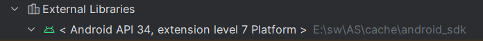
>
> 下的layout目录下

decorview内加载的是一个LinearLayout，可以看到里面出现了`android.id.content`，这就是前面提到的rootView，也就是根布局，


之后在`generateLayout`中，将这个`content`赋值给`mContentParent`

```java
// 找到刚刚的Content
ViewGroup contentParent = (ViewGroup)findViewById(ID_ANDROID_CONTENT);
if (contentParent == null) {
    throw new RuntimeException("Window couldn't find content container view");
}
// ... ... 省略若干代码
// 最后返回这个contentParent
return contentParent;
```


**`installDecor()`里面包含了大量的逻辑。**

- 开始初始化了`DecorView`。
- 然后初始化`mContentParent`。
- 在初始化`mContentParent`时，又看到：
- 获取window的属性并赋值给`PhoneWindow`的逻辑。
- 看到了根据window的属性加载了不同的布局，并加载到给`DecorView`的逻辑。
- 最后通过findViewById的方法获取到了`mContentParent`并且返回。


(4)然后初始化并且加载好`mContentParent`之后，将布局文件加载到里面

```java
//PhoneWindow.java
mLayoutInflater.inflate(layoutResID, mContentParent);//将xml文件加载到mContentParent
```


#### 继承自AppCompatActivity的视图层级

(1)可以看到`setContentView`有变化

```java
public void setContentView(@LayoutRes int layoutResID) {
    initViewTreeOwners();
    getDelegate().setContentView(layoutResID);
}
```

(2)跳到`getDelegate`方法里

```java
public AppCompatDelegate getDelegate() {
    if (mDelegate == null) {
        mDelegate = AppCompatDelegate.create(this, this);
    }
    return mDelegate;
}
```

> 用来初始化`AppCompatDelegate`
>
> `AppCompatDelegate`解释是： **这个类表示一个代理，您可以使用它来扩展AppCompat的支持** 


#### View绘制流程

在整个 activity 的生命周期中，setContentView 是在 onCreate 中调用的，它实现了对资源文件的解析，完成了 xml 文件到 View 的转化。 

 

**View真正开始绘制是在onResume之后;**

`ActivityThread`通过调用`activity`中 `windowmanager`的`addView `方法，将 `decorView `传入到 `ViewRootImpl `的 `setView `方法中，通过 `setView `来完成 `View `的绘制。 

```java
//ActivityThread.java
public void handleResumeActivity(ActivityClientRecord r, boolean finalStateRequest,
            boolean isForward, boolean shouldSendCompatFakeFocus, String reason) {
        
        unscheduleGcIdler();
        mSomeActivitiesChanged = true;

        
        if (!performResumeActivity(r, finalStateRequest, reason)) {
            return;
        }
        if (mActivitiesToBeDestroyed.containsKey(r.token)) {
            
            return;
        }

        final Activity a = r.activity;

        if (localLOGV) {
            Slog.v(TAG, "Resume " + r + " started activity: " + a.mStartedActivity
                    + ", hideForNow: " + r.hideForNow + ", finished: " + a.mFinished);
        }

        final int forwardBit = isForward
                ? WindowManager.LayoutParams.SOFT_INPUT_IS_FORWARD_NAVIGATION : 0;

        
        boolean willBeVisible = !a.mStartedActivity;
        if (!willBeVisible) {
            willBeVisible = ActivityClient.getInstance().willActivityBeVisible(
                    a.getActivityToken());
        }
        if (r.window == null && !a.mFinished && willBeVisible) {
            r.window = r.activity.getWindow();
            View decor = r.window.getDecorView();
            decor.setVisibility(View.INVISIBLE);
            ViewManager wm = a.getWindowManager();//获取windowmanager
            WindowManager.LayoutParams l = r.window.getAttributes();
            a.mDecor = decor;
            ....
            if (a.mVisibleFromClient) {
                if (!a.mWindowAdded) {
                    a.mWindowAdded = true;
                    wm.addView(decor, l);//调用windowmanager的add.View方法
                }
            }
        }
}
```


`WindowManager`的实现类是`WindowManagerImpl`，因此直接跳到`WindowManagerImpl`的addView

```java
public void addView(@NonNull View view, @NonNull ViewGroup.LayoutParams params) {
    applyTokens(params);
    mGlobal.addView(view, params, mContext.getDisplayNoVerify(), mParentWindow,
                    mContext.getUserId());
}
```

可以看到里面又调用了`mGloble.addView`这个`mGlobe`就是一个`WindowManagerGlobal`

```java
public void addView(View view, ViewGroup.LayoutParams params,
                    Display display, Window parentWindow, int userId) {
    if (view == null) {
        throw new IllegalArgumentException("view must not be null");
    }
    if (display == null) {
        throw new IllegalArgumentException("display must not be null");
    }
    if (!(params instanceof WindowManager.LayoutParams)) {
        throw new IllegalArgumentException("Params must be WindowManager.LayoutParams");
    }

    final WindowManager.LayoutParams wparams = (WindowManager.LayoutParams) params;
    if (parentWindow != null) {
        parentWindow.adjustLayoutParamsForSubWindow(wparams);
    } else {
        // If there's no parent, then hardware acceleration for this view is
        // set from the application's hardware acceleration setting.
        final Context context = view.getContext();
        if (context != null
            && (context.getApplicationInfo().flags
                & ApplicationInfo.FLAG_HARDWARE_ACCELERATED) != 0) {
            wparams.flags |= WindowManager.LayoutParams.FLAG_HARDWARE_ACCELERATED;
        }
    }

    ViewRootImpl root;
    View panelParentView = null;

    ...


        // If this is a panel window, then find the window it is being
        // attached to for future reference.
        if (wparams.type >= WindowManager.LayoutParams.FIRST_SUB_WINDOW &&
            wparams.type <= WindowManager.LayoutParams.LAST_SUB_WINDOW) {
            final int count = mViews.size();
            for (int i = 0; i < count; i++) {
                if (mRoots.get(i).mWindow.asBinder() == wparams.token) {
                    panelParentView = mViews.get(i);
                }
            }
        }

    IWindowSession windowlessSession = null;
    // If there is a parent set, but we can't find it, it may be coming
    // from a SurfaceControlViewHost hierarchy.
    if (wparams.token != null && panelParentView == null) {
        for (int i = 0; i < mWindowlessRoots.size(); i++) {
            ViewRootImpl maybeParent = mWindowlessRoots.get(i);
            if (maybeParent.getWindowToken() == wparams.token) {
                windowlessSession = maybeParent.getWindowSession();
                break;
            }
        }
    }

    if (windowlessSession == null) {
        root = new ViewRootImpl(view.getContext(), display);
    } else {
        root = new ViewRootImpl(view.getContext(), display,
                                windowlessSession, new WindowlessWindowLayout());
    }

    view.setLayoutParams(wparams);

    mViews.add(view);
    mRoots.add(root);
    mParams.add(wparams);

    // do this last because it fires off messages to start doing things
    try {
        root.setView(view, wparams, panelParentView, userId);
    } catch (RuntimeException e) {
        final int viewIndex = (index >= 0) ? index : (mViews.size() - 1);
        // BadTokenException or InvalidDisplayException, clean up.
        if (viewIndex >= 0) {
            removeViewLocked(viewIndex, true);
        }
        throw e;
    }
}
}
```

上面的代码可以看到，初始化了`ViewRootImpl`，并调用了`setView`

```java
public void setView(View view, WindowManager.LayoutParams attrs, View panelParentView,
            int userId) {
    
    ...
        
    requestLayout();
    
    ...
}
```

`setView`里面的内容非常多，但是有一个`requestLayout`方法

```java
public void requestLayout() {
    if (!mHandlingLayoutInLayoutRequest) {
        checkThread();
        mLayoutRequested = true;
        scheduleTraversals();
    }
}
```

> 这个方法做了两件事：
>
> - 检查绘制的线程是不是创建 View 的线程 
> - 调用scheduleTraversals

```java
void scheduleTraversals() {
    if (!mTraversalScheduled) {
        mTraversalScheduled = true;
        //获取内存屏障
        mTraversalBarrier = mHandler.getLooper().getQueue().postSyncBarrier();
        //执行绘制任务
        mChoreographer.postCallback(
            Choreographer.CALLBACK_TRAVERSAL, mTraversalRunnable, null);
        notifyRendererOfFramePending();
        pokeDrawLockIfNeeded();
    }
}
```

通过内存屏障保证绘制View的任务最优先，并且通过一个定时任务执行绘制回调

```java
final class TraversalRunnable implements Runnable {
    @Override
    public void run() {
        doTraversal();
    }
}
```

可以看到调用了`doTraversal`

```java
void doTraversal() {
    if (mTraversalScheduled) {
        mTraversalScheduled = false;
        mHandler.getLooper().getQueue().removeSyncBarrier(mTraversalBarrier);

        if (mProfile) {
            Debug.startMethodTracing("ViewAncestor");
        }

        performTraversals();

        if (mProfile) {
            Debug.stopMethodTracing();
            mProfile = false;
        }
    }
}
```

又接着调用`performTraversals`，这个方法非常长，但是主要是调用三个方法进行绘制

**针对 performTraversals 的大致流程，可用下图表示：**

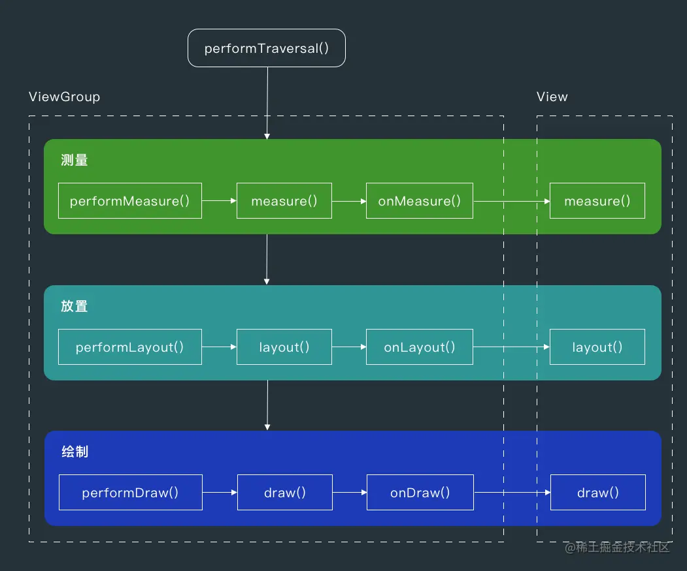

> View 绘制主要的三个方法就是 `onMeasure()`、 `onLayout()`、`onDraw()`，这三个方法要解决的问题就是`画多大`、`在哪画`、`画什么`。
>
> ViewRootImpl 的 performTraversal() 方法会依次调用 `performMeasure()`、`performLayout()` 和 `performDraw()` 三个方法，这三个方法分别完成 DecorView 的测量、放置和绘制三大流程。
>
> performMeasure() 方法会调用 DecorView 的 measure() 方法，在 measure() 方法中又会调用自己的 onMeasure() 方法。
>
> DecorView 的 onMeasure() 方法会调用父类 FrameLayout 的 onMeasure() 方法，在 FrameLayout 的 onMeasure() 方法中，会调用子元素的 onMeasure() 方法测量子元素的宽高，接着子元素会重复父容器的 measure 过程，如此反复完成整个 View 树的遍历。
>
> 而 performLayout() 和 performDraw() 的执行流程与 performMeasure() 是类似的。


**通过`performTraversals` 对viewTree逐步绘制，就如下图所示：**

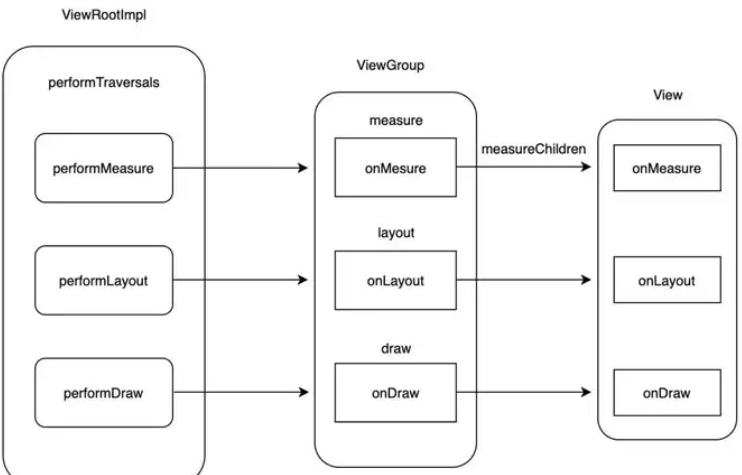


**总结：view的绘制流程可总结为**

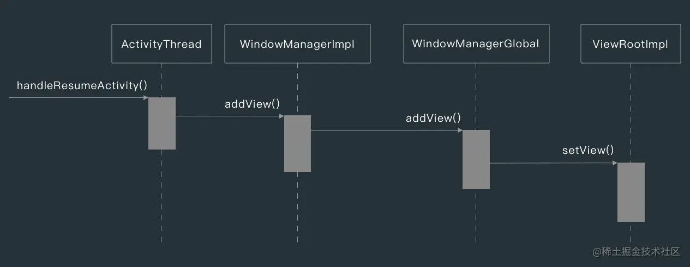

①在 `ActivityThread` 的 handleResumeActivity() 方法中，会调用 WindowManager 的 `addView()` 方法，而具体添加 DecorView 的操作是在 `WindowManagerGlobal` 中。

②在 WindowManagerGlobal 的 `addView()` 方法中，会把 DecorView 添加到 Window 中，同时会创建 ViewRootImpl ，并调用 ViewRootImpl 的 setView() 方法 把 ViewRootImpl 和 DecorView 关联起来。

③View 的绘制流程是从 ViewRootImpl 的 `performTraversals()` 方法开始的，它经过`测量（measure）、放置（layout）和绘制（draw）`三个过程才能把一个 View 绘制出来，measure() 方法用于测量 View 的宽高，layout() 用于确定 View 在父容器中的放置位置，draw() 负责做具体的绘制操作。


`measure()`、`layout()`、`draw()`三个函数

| 函数      | 作用                         | 相关方法                                     |
| --------- | ---------------------------- | -------------------------------------------- |
| measure() | 测量View的宽高               | measure(),setMeasuredDimension(),onMeasure() |
| layout()  | 计算当前View以及子View的位置 | layout(),onLayout(),setFrame()               |
| draw()    | 视图的绘制工作               | draw(),onDraw()                              |

**坐标系：**

在Android坐标系中，以屏幕左上角作为原点，这个原点向右是X轴的正轴，向下是Y轴正轴。如下所示：

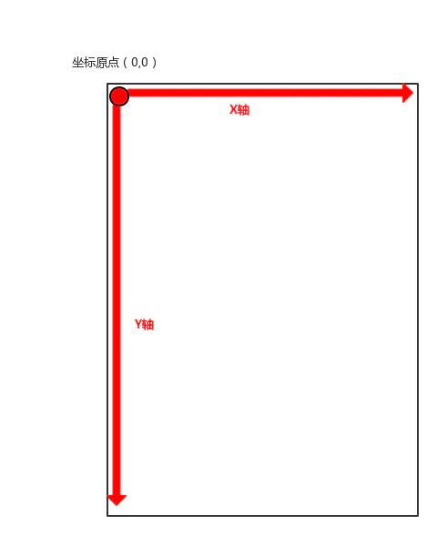

除了Android坐标系，还存在View坐标系，View坐标系内部关系如图所示。


**获取View自身高度**

由上图可算出View的高度：

- width = getRight() - getLeft();
- height = getBottom() - getTop();


##### **Measure**

**①MeasureSpec**

`MeasureSpec`是View的内部类，它封装了一个View的尺寸，在`onMeasure()`当中会根据这个`MeasureSpec`的值来确定View的宽高。

`MeasureSpec`的值保存在一个int值当中。一个int值有32位，前**两位表示`模式mode`**，**后30位表示`大小size`**。即`MeasureSpec` = `mode` + `size`。对于View来说，`MeasureSpec`的mode和size有如下含义：

| 模式        | 意义                                                         | 对应         |
| ----------- | ------------------------------------------------------------ | ------------ |
| EXACTLY     | 精准模式，View需要一个精确值，这个值即为MeasureSpec当中的Size | match_parent |
| AT_MOST     | 最大模式，View的尺寸有一个最大值，View不可以超过MeasureSpec当中的Size值 | wrap_content |
| UNSPECIFIED | 无限制，View对尺寸没有任何限制，View设置为多大就应当为多大   | 系统内部使用 |

```java
// 获取测量模式（Mode）
int specMode = MeasureSpec.getMode(measureSpec);

// 获取测量大小（Size）
int specSize = MeasureSpec.getSize(measureSpec);

// 通过Mode 和 Size 生成新的SpecMode
int measureSpec=MeasureSpec.makeMeasureSpec(size, mode);
```


**②onMeasure()**

能够进行view的宽高测量：

源码如下：

```java
protected void onMeasure(int widthMeasureSpec, int heightMeasureSpec) {

    setMeasuredDimension(getDefaultSize(getSuggestedMinimumWidth(), widthMeasureSpec),
                         getDefaultSize(getSuggestedMinimumHeight(), heightMeasureSpec));
}

//setMeasuredDimension(int measuredWidth, int measuredHeight) ：该方法用来设置View的宽高，在我们自定义View时也会经常用到。
//getDefaultSize(int size, int measureSpec)：该方法用来获取View默认的宽高，结合源码来看。
//getSuggestedMinimumWidth():当View没有设置背景时，默认大小就是mMinWidth，这个值对应Android:minWidth属性，如果没有设置时默认为0.如果有设置背景，则默认大小为mMinWidth和mBackground.getMinimumWidth()当中的较大值。
```


##### **Layout**

layout过程，对于`View`来说用来计算`View`的位置参数,对于`ViewGroup`来说，除了要测量自身位置，还需要测量子`View`的位置。

```java
/**
*  这里的四个参数l、t、r、b分别代表View的左、上、右、下四个边界相对于其父View的距离。
*
*/
public void layout(int l, int t, int r, int b) {
        if ((mPrivateFlags3 & PFLAG3_MEASURE_NEEDED_BEFORE_LAYOUT) != 0) {
            onMeasure(mOldWidthMeasureSpec, mOldHeightMeasureSpec);
            mPrivateFlags3 &= ~PFLAG3_MEASURE_NEEDED_BEFORE_LAYOUT;
        }

        int oldL = mLeft;
        int oldT = mTop;
        int oldB = mBottom;
        int oldR = mRight;

        //这里通过setFrame或setOpticalFrame方法确定View在父容器当中的位置。
        boolean changed = isLayoutModeOptical(mParent) ?
                setOpticalFrame(l, t, r, b) : setFrame(l, t, r, b);

        //调用onLayout方法。onLayout方法是一个空实现，不同的布局会有不同的实现。
        if (changed || (mPrivateFlags & PFLAG_LAYOUT_REQUIRED) == PFLAG_LAYOUT_REQUIRED) {
            onLayout(changed, l, t, r, b);

        }

    }
```

> 从源码我们知道，在`layout()`方法中已经通过`setOpticalFrame(l, t, r, b)`或 `setFrame(l, t, r, b)`方法对View自身的位置进行了设置，所以`onLayout(changed, l, t, r, b)`方法主要是`ViewGroup`对子View的位置进行计算。


##### **Draw**

draw流程就是View绘制到屏幕上的过程，流程入口在draw方法中；

```java
 public void draw(Canvas canvas) {

        int saveCount;
        // 1. 如果需要，绘制背景
        if (!dirtyOpaque) {
            drawBackground(canvas);
        }

        // 2. 如过有必要，保存当前canvas。
        final int viewFlags = mViewFlags;
      
        if (!verticalEdges && !horizontalEdges) {
            // 3. 绘制View的内容。
            if (!dirtyOpaque) onDraw(canvas);

            // 4. 绘制子View。
            dispatchDraw(canvas);

            drawAutofilledHighlight(canvas);

            // 5.绘制边缘、阴影等
            if (mOverlay != null && !mOverlay.isEmpty()) {
                mOverlay.getOverlayView().dispatchDraw(canvas);
            }

            // 6. 绘制装饰，如滚动条等等。
            onDrawForeground(canvas);

            // we're done...
            return;
        }
    }
    
    /**
    *  1.绘制View背景
    */
    private void drawBackground(Canvas canvas) {
        //获取背景
        final Drawable background = mBackground;
        if (background == null) {
            return;
        }

        setBackgroundBounds();

        //获取便宜值scrollX和scrollY，如果scrollX和scrollY都不等于0，则会在平移后的canvas上面绘制背景。
        final int scrollX = mScrollX;
        final int scrollY = mScrollY;
        if ((scrollX | scrollY) == 0) {
            background.draw(canvas);
        } else {
            canvas.translate(scrollX, scrollY);
            background.draw(canvas);
            canvas.translate(-scrollX, -scrollY);
        }
    }
    
    /**
    * 3.绘制View的内容,该方法是一个空的实现，在各个业务当中自行处理。
    */
    protected void onDraw(Canvas canvas) {
    }
    
    /**
    * 4. 绘制子View。该方法在View当中是一个空的实现，在各个业务当中自行处理。
    *  在ViewGroup当中对dispatchDraw方法做了实现，主要是遍历子View，并调用子类的draw方法，一般我们不需要自己重写该方法。
    */
    protected void dispatchDraw(Canvas canvas) {

    }
```


## 创建自定义View

**构建步骤**

- 创建类继承现有View或其子类
- 替换父类中的某些方法。要替换的父类方法以“`on`”开头，例如`onDraw()`、`onMeasure()` 和 `onKeyDown()`。这类似于您为生命周期和其他功能钩子替换的 `Activity` 或 `ListActivity` 中的 `on...` 事件。
- 使用您的新拓展类。


> **onDraw()**：`onDraw()` 方法为您提供了一个 `Canvas`，您可以在其上实现所需的任何东西：2D 图形、其他标准或自定义组件、样式文本或您可以想到的其他任何东西。(**注意**：这不适用于实现 3D 图形。如果您想要使用 3D 图形，则必须扩展 `SurfaceView`（而不是 View），并从单独的线程绘制。如需了解详情，请参阅 GLSurfaceViewActivity 示例。)


下面汇总了框架针对视图调用的一些其他标准方法：

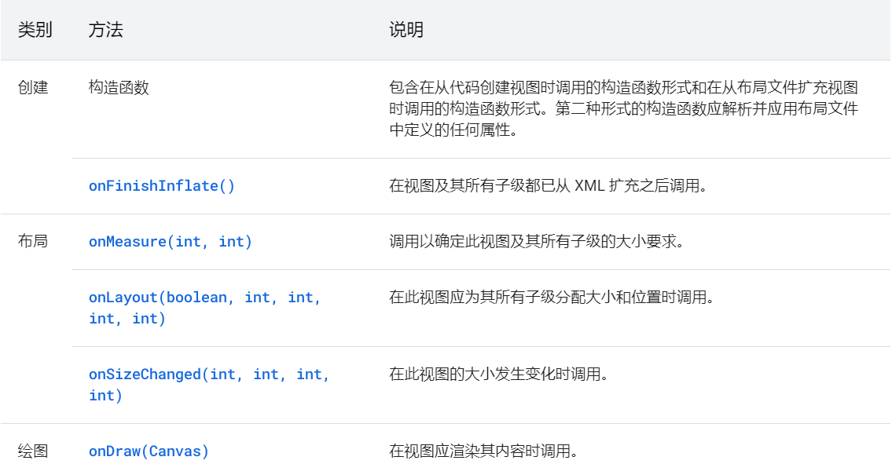

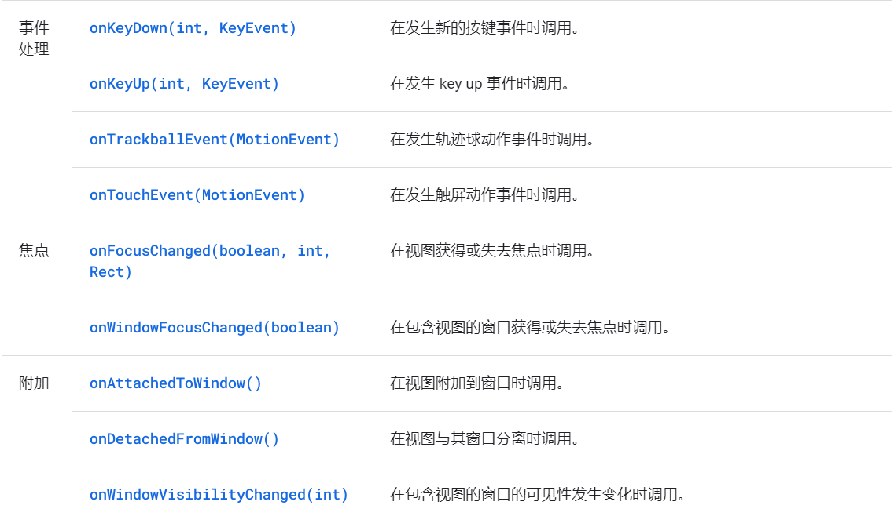


**使用自定义组件：**

```xml
<view xmlns:android="http://schemas.android.com/apk/res/android"
    class="com.example.android.notepad.NoteEditor$LinedEditText"//声明自定义组件的类
    android:id="@+id/note"
    android:layout_width="match_parent"
    android:layout_height="match_parent"
    android:background="@android:color/transparent"
    android:padding="5dp"
    android:scrollbars="vertical"
    android:fadingEdge="vertical"
    android:gravity="top"
    android:textSize="22sp"
    android:capitalize="sentences"
/>
```

> 请注意，我们定义的**内部类**是使用 `NoteEditor$LinedEditText` 标记引用的，这是以 Java 编程语言引用内部类的标准方式。
>
> 如果您的自定义 View 组件未定义为内部类，则您可以选择使用 XML 元素名称声明 View 组件，并排除 `class` 属性。例如：

```xml
<com.example.android.notepad.LinedEditText
  id="@+id/note"
  ... />
```


**子类化视图：**

为了使 Android Studio 能够与您的视图交互，您必须*至少提供一个以 `Context` 和 `AttributeSet` 对象为参数的构造函数*。此构造函数允许布局编辑器创建和编辑视图的实例。

```java
 public class CustomTextView extends View {
     /**
     * 在java代码里new的时候会用到
     * @param context
     */
    public CustomTextView(Context context) {
        super(context);
    }

     /**
     * 在xml布局文件中使用时自动调用
     * @param context
     */
    public CustomTextView(Context context, @Nullable AttributeSet attrs) {
        super(context, attrs);
    }

     /**
     * 不会自动调用，如果有默认style时，在第二个构造函数中调用
     * @param context
     * @param attrs
     * @param defStyleAttr
     */
    public CustomTextView(Context context, @Nullable AttributeSet attrs, int defStyleAttr) {
        super(context, attrs, defStyleAttr);
    }

     /**
     * 只有在API版本>21时才会用到
     * 不会自动调用，如果有默认style时，在第二个构造函数中调用
     * @param context
     * @param attrs
     * @param defStyleAttr
     * @param defStyleRes
     */
    @RequiresApi(api = Build.VERSION_CODES.LOLLIPOP)
    public CustomTextView(Context context, @Nullable AttributeSet attrs, int defStyleAttr, int defStyleRes) {
        super(context, attrs, defStyleAttr, defStyleRes);
    }
}
```


**自定义属性值**

如需定义自定义属性，请向项目添加 `<declare-styleable> `资源。这些资源通常放在 `res/values/attrs.xml` 文件中。以下是 `attrs.xml` 文件的示例：

```xml
<resources>
       <declare-styleable name="PieChart">
           <attr name="showText" format="boolean" />
           <attr name="labelPosition" format="enum">
               <enum name="left" value="0"/>
               <enum name="right" value="1"/>
           </attr>
       </declare-styleable>
    </resources>
<!--此代码声明了两个自定义属性（即 showText 和 labelPosition），它们属于一个名为 PieChart 的可设样式实体。按照惯例，这个可设样式实体的名称与定义自定义视图的类的名称相同。-->
```

> 定义了自定义属性后，便可像内置属性一样在布局 XML 文件中使用它们。唯一的区别是自定义属性属于另一个命名空间。它们不属于 `http://schemas.android.com/apk/res/android` 命名空间，而是属于 `http://schemas.android.com/apk/res/[your package name]`。例如，下面展示了如何使用为 `PieChart` 定义的属性：

```xml
 <?xml version="1.0" encoding="utf-8"?>
    <LinearLayout xmlns:android="http://schemas.android.com/apk/res/android"
       xmlns:custom="http://schemas.android.com/apk/res/com.example.customviews">
     <com.example.customviews.charting.PieChart
         custom:showText="true"
         custom:labelPosition="left" />
    </LinearLayout>
```


**常用属性值format：**

- reference:某一资源ID

  ```xml
  <declare-styleable name = "名称">
       <attr name = "background" format = "reference" />
  </declare-styleable>
  ```

  ```xml
  <ImageView android:background = "@drawable/图片ID"/>
  ```

- color：颜色值

  ```xml
  <attr name = "textColor" format = "color" />
  ```

  ```xml
  <TextView android:textColor = "#00FF00" />
  ```

- boolean

  ```xml
  <attr name = "focusable" format = "boolean" />
  ```

  ```xml
  <Button android:focusable = "true"/>
  ```

- dimension

  ```xml
  <attr name = "layout_width" format = "dimension" />
  ```

  ```xml
  <Button android:layout_width = "42dip"/>
  ```

- fraction:百分数

  ```xml
  <attr name = "pivotX" format = "fraction" />
  ```

  ```xml
  <rotate android:pivotX = "200%"/>
  ```

- enum:枚举

  ```xml
  <attr name="orientation">
          <enum name="horizontal" value="0" />
          <enum name="vertical" value="1" />
      </attr>
  ```

  ```xml
  <LinearLayout  
      android:orientation = "vertical">
  </LinearLayout>
  ```

- flag：位运算

  ```xml
  <declare-styleable name="名称">
      <attr name="gravity">
              <flag name="top" value="0x01" />
              <flag name="bottom" value="0x02" />
              <flag name="left" value="0x04" />
              <flag name="right" value="0x08" />
              <flag name="center_vertical" value="0x16" />
              ...
      </attr>
  </declare-styleable>
  ```

  ```xml
  <TextView android:gravity="bottom|left"/>
  ```

  `位运算类型的属性在使用的过程中可以使用多个值`

- 混合类型：属性定义时可以指定多种类型值

  ```xml
  <declare-styleable name = "名称">
       <attr name = "background" format = "reference|color" />
  </declare-styleable>
  ```

  ```xml
  <ImageView
  android:background = "@drawable/图片ID" />
  或者：
  <ImageView
  android:background = "#00FF00" />
  ```

**应用自定义属性：**

通过 XML 布局创建视图时，XML 标记中的所有属性都会从资源包读取，并作为 `AttributeSet` 传递到视图的构造函数中。将 `AttributeSet` 传递给 `obtainStyledAttributes()`。此方法会传回一个 `TypedArray` 数组，其中包含已解除引用并设置了样式的值。

```java
public PieChart(Context context, AttributeSet attrs) {
       super(context, attrs);
       TypedArray a = context.getTheme().obtainStyledAttributes(
            attrs,
            R.styleable.PieChart,
            0, 0);//获取属性返回一个TypeArray

       try {
           mShowText = a.getBoolean(R.styleable.PieChart_showText, false);
           textPos = a.getInteger(R.styleable.PieChart_labelPosition, 0);
       } finally {
           a.recycle();//TypedArray 对象是共享资源，必须在使用后回收。
       }
    }
```


**添加属性和事件**

属性是控制视图行为和外观的强大方式，但只能在视图初始化时读取。如需提供动态行为，请为每个自定义属性公开一个 getter 与 setter 属性对。以下代码段展示了 `PieChart` 如何公开名为 `showText` 的属性：

```java
public boolean isShowText() {
    return mShowText;
}

public void setShowText(boolean showText) {
    mShowText = showText;
    //调用两个函数通知系统进行视图重绘
    invalidate();
    requestLayout();
}
//setShowText 会调用 invalidate() 和 requestLayout()。这些调用对于确保视图可靠运行至关重要。您必须在视图属性发生任何可能改变其外观的更改后使该视图失效，以便系统知道需要重新绘制该视图。同样，如果属性更改可能会影响视图的大小或形状，则需要请求新的布局。
```


#### 自定义组合控件：

自定义组合控件就是将多个控件组合成为一个新的控件，主要解决多次重复使用同一类型的布局。我们通过一个自定义HeaderView实例来了解自定义组合控件的用法。

①编写布局文件：

```xml
<RelativeLayout xmlns:android="http://schemas.android.com/apk/res/android"
    android:layout_width="match_parent"
    android:id="@+id/header_root_layout"
    android:layout_height="45dp"
    android:background="#827192">

    <ImageView
        android:id="@+id/header_left_img"
        android:layout_width="45dp"
        android:layout_height="45dp"
        android:layout_alignParentLeft="true"
        android:paddingLeft="12dp"
        android:paddingRight="12dp"
        android:src="@drawable/back"
        android:scaleType="fitCenter"/>

    <TextView
        android:id="@+id/header_center_text"
        android:layout_width="wrap_content"
        android:layout_height="wrap_content"
        android:layout_centerInParent="true"
        android:lines="1"
        android:maxLines="11"
        android:ellipsize="end"
        android:text="title"
        android:textStyle="bold"
        android:textColor="#ffffff"/>
    
    <ImageView
        android:id="@+id/header_right_img"
        android:layout_width="45dp"
        android:layout_height="45dp"
        android:layout_alignParentRight="true"
        android:src="@drawable/add"
        android:scaleType="fitCenter"
        android:paddingRight="12dp"
        android:paddingLeft="12dp"/>

</RelativeLayout>
```

②实现构造方法

```java
//因为我们的布局采用RelativeLayout，所以这里继承RelativeLayout。
//关于各个构造方法的介绍可以参考前面的内容
public class YFHeaderView extends RelativeLayout {

    public YFHeaderView(Context context) {
        super(context);
    }

    public YFHeaderView(Context context, AttributeSet attrs) {
        super(context, attrs);
    }

    public YFHeaderView(Context context, AttributeSet attrs, int defStyleAttr) {
        super(context, attrs, defStyleAttr);
    }

}
```

③初始化UI

```java
 //初始化UI，可根据业务需求设置默认值。
    private void initView(Context context) {
        LayoutInflater.from(context).inflate(R.layout.view_header, this, true);
        img_left = (ImageView) findViewById(R.id.header_left_img);
        img_right = (ImageView) findViewById(R.id.header_right_img);
        text_center = (TextView) findViewById(R.id.header_center_text);
        layout_root = (RelativeLayout) findViewById(R.id.header_root_layout);
        layout_root.setBackgroundColor(Color.BLACK);
        text_center.setTextColor(Color.WHITE);

    }
```

④提供对外方法

```java
//设置标题文字的方法
    private void setTitle(String title) {
        if (!TextUtils.isEmpty(title)) {
            text_center.setText(title);
        }
    }
    //对左边按钮设置事件的方法
    private void setLeftListener(OnClickListener onClickListener) {
        img_left.setOnClickListener(onClickListener);
    }

    //对右边按钮设置事件的方法
    private void setRightListener(OnClickListener onClickListener) {
        img_right.setOnClickListener(onClickListener);
    }
```

⑤布局中引用控件

```xml
<LinearLayout xmlns:android="http://schemas.android.com/apk/res/android"
    xmlns:app="http://schemas.android.com/apk/res-auto"
    android:orientation="vertical"
    android:layout_width="match_parent"
    android:layout_height="match_parent">

    <com.example.yf.view.YFHeaderView
        android:layout_width="match_parent"
        android:layout_height="45dp">

    </com.example.yf.view.YFHeaderView>

</LinearLayout>
```

完整代码：

```java
public class YFHeaderView extends RelativeLayout {
    
    ImageView img_left,img_right;
    TextView text_center;
    RelativeLayout layout_root;

    public YFHeaderView(Context context) {
        super(context);
    }

    public YFHeaderView(Context context, AttributeSet attrs) {
        super(context, attrs);
    }

    public YFHeaderView(Context context, AttributeSet attrs, int defStyleAttr) {
        super(context, attrs, defStyleAttr);
    }

    //初始化UI，可根据业务需求设置默认值。
    private void initView(Context context) {
        LayoutInflater.from(context).inflate(R.layout.composite_custom_layout, this, true);
        img_left = (ImageView) findViewById(R.id.header_left_img);
        img_right = (ImageView) findViewById(R.id.header_right_img);
        text_center = (TextView) findViewById(R.id.header_center_text);
        layout_root = (RelativeLayout) findViewById(R.id.header_root_layout);
        layout_root.setBackgroundColor(Color.BLACK);
        text_center.setTextColor(Color.WHITE);

    }

    //设置标题文字的方法
    private void setTitle(String title) {
        if (!TextUtils.isEmpty(title)) {
            text_center.setText(title);
        }
    }
    //对左边按钮设置事件的方法
    private void setLeftListener(OnClickListener onClickListener) {
        img_left.setOnClickListener(onClickListener);
    }

    //对右边按钮设置事件的方法
    private void setRightListener(OnClickListener onClickListener) {
        img_right.setOnClickListener(onClickListener);
    }
}
```

#### 继承控件系统

业务需求：为文字设置背景，并在布局中间添加一条横线。

因为这种实现方式会复用系统的逻辑，大多数情况下我们希望复用系统的`onMeaseur`和`onLayout`流程，所以我们只需要重写`onDraw`方法 。实现非常简单，话不多说，直接上代码。

```java
public class LineTextView extends TextView {

    //定义画笔，用来绘制中心曲线
    private Paint mPaint;
    
    /**
     * 创建构造方法
     * @param context
     */
    public LineTextView(Context context) {
        super(context);
        init();
    }

    public LineTextView(Context context, @Nullable AttributeSet attrs) {
        super(context, attrs);
        init();
    }

    public LineTextView(Context context, @Nullable AttributeSet attrs, int defStyleAttr) {
        super(context, attrs, defStyleAttr);
        init();
    }

    private void init() {
        mPaint = new Paint();
        mPaint.setColor(Color.BLACK);
    }

    //重写draw方法，绘制我们需要的中间线以及背景
    @Override
    protected void onDraw(Canvas canvas) {
        super.onDraw(canvas);
        int width = getWidth();
        int height = getHeight();
        mPaint.setColor(Color.BLUE);
        //绘制方形背景
        RectF rectF = new RectF(0,0,width,height);
        canvas.drawRect(rectF,mPaint);
        mPaint.setColor(Color.BLACK);
        //绘制中心曲线，起点坐标（0,height/2），终点坐标（width,height/2）
        canvas.drawLine(0,height/2,width,height/2,mPaint);
    }
}
```


#### 直接继承view

直接继承View会比上一种实现方复杂一些，这种方法的使用情景下，完全不需要复用系统控件的逻辑，除了要重写`onDraw`外还需要对`onMeasure`方法进行重写。

通过自定义view绘制一个正方形

```java
ublic class RectView extends View{
    //定义画笔
    private Paint mPaint = new Paint();

    /**
     * 实现构造方法
     * @param context
     */
    public RectView(Context context) {
        super(context);
        init();
    }

    public RectView(Context context, @Nullable AttributeSet attrs) {
        super(context, attrs);
        init();
    }

    public RectView(Context context, @Nullable AttributeSet attrs, int defStyleAttr) {
        super(context, attrs, defStyleAttr);
        init();
    }

    private void init() {
        mPaint.setColor(Color.BLUE);

    }

}
```

重写draw方法，绘制正方形，注意对padding属性进行设置

```java
/**
     * 重写draw方法
     * @param canvas
     */
    @Override
    protected void onDraw(Canvas canvas) {
        super.onDraw(canvas);
        //获取各个编剧的padding值
        int paddingLeft = getPaddingLeft();
        int paddingRight = getPaddingRight();
        int paddingTop = getPaddingTop();
        int paddingBottom = getPaddingBottom();
        //获取绘制的View的宽度
        int width = getWidth()-paddingLeft-paddingRight;
        //获取绘制的View的高度
        int height = getHeight()-paddingTop-paddingBottom;
        //绘制View，左上角坐标（0+paddingLeft,0+paddingTop），右下角坐标（width+paddingLeft,height+paddingTop）
        canvas.drawRect(0+paddingLeft,0+paddingTop,width+paddingLeft,height+paddingTop,mPaint);
    }
```

之前讲到过measure源码处理过程：

```java
    public static int getDefaultSize(int size, int measureSpec) {
        int result = size;
        int specMode = MeasureSpec.getMode(measureSpec);
        int specSize = MeasureSpec.getSize(measureSpec);

        switch (specMode) {
        case MeasureSpec.UNSPECIFIED:
            result = size;
            break;
        case MeasureSpec.AT_MOST:
        case MeasureSpec.EXACTLY:
            result = specSize;
            break;
        }
        return result;
    }
```

在View的源码当中并没有对`AT_MOST`和`EXACTLY`两个模式做出区分，也就是说View在`wrap_content`和`match_parent`两个模式下是完全相同的，都会是`match_parent`，显然这与我们平时用的View不同，所以我们要重写`onMeasure`方法。

**重写onMeasure方法：**

```java
    /**
     * 重写onMeasure方法
     *
     * @param widthMeasureSpec
     * @param heightMeasureSpec
     */
    @Override
    protected void onMeasure(int widthMeasureSpec, int heightMeasureSpec) {
        super.onMeasure(widthMeasureSpec, heightMeasureSpec);
        int widthSize = MeasureSpec.getSize(widthMeasureSpec);
        int widthMode = MeasureSpec.getMode(widthMeasureSpec);
        int heightSize = MeasureSpec.getSize(heightMeasureSpec);
        int heightMode = MeasureSpec.getMode(heightMeasureSpec);

        //处理wrap_contentde情况
        if (widthMode == MeasureSpec.AT_MOST && heightMode == MeasureSpec.AT_MOST) {
            setMeasuredDimension(300, 300);
        } else if (widthMode == MeasureSpec.AT_MOST) {
            setMeasuredDimension(300, heightSize);
        } else if (heightMode == MeasureSpec.AT_MOST) {
            setMeasuredDimension(widthSize, 300);
        }
    }
```

```java
//完整代码
public class RectView extends View {
    //定义画笔
    private Paint mPaint = new Paint();

    /**
     * 实现构造方法
     *
     * @param context
     */
    public RectView(Context context) {
        super(context);
        init();
    }

    public RectView(Context context, @Nullable AttributeSet attrs) {
        super(context, attrs);
        init();
    }

    public RectView(Context context, @Nullable AttributeSet attrs, int defStyleAttr) {
        super(context, attrs, defStyleAttr);
        init();
    }

    private void init() {
        mPaint.setColor(Color.BLUE);

    }

    /**
     * 重写onMeasure方法
     *
     * @param widthMeasureSpec
     * @param heightMeasureSpec
     */
    @Override
    protected void onMeasure(int widthMeasureSpec, int heightMeasureSpec) {
        super.onMeasure(widthMeasureSpec, heightMeasureSpec);
        int widthSize = MeasureSpec.getSize(widthMeasureSpec);
        int widthMode = MeasureSpec.getMode(widthMeasureSpec);
        int heightSize = MeasureSpec.getSize(heightMeasureSpec);
        int heightMode = MeasureSpec.getMode(heightMeasureSpec);

        if (widthMode == MeasureSpec.AT_MOST && heightMode == MeasureSpec.AT_MOST) {
            setMeasuredDimension(300, 300);
        } else if (widthMode == MeasureSpec.AT_MOST) {
            setMeasuredDimension(300, heightSize);
        } else if (heightMode == MeasureSpec.AT_MOST) {
            setMeasuredDimension(widthSize, 300);
        }
    }

    /**
     * 重写draw方法
     *
     * @param canvas
     */
    @Override
    protected void onDraw(Canvas canvas) {
        super.onDraw(canvas);
        //获取各个编剧的padding值
        int paddingLeft = getPaddingLeft();
        int paddingRight = getPaddingRight();
        int paddingTop = getPaddingTop();
        int paddingBottom = getPaddingBottom();
        //获取绘制的View的宽度
        int width = getWidth() - paddingLeft - paddingRight;
        //获取绘制的View的高度
        int height = getHeight() - paddingTop - paddingBottom;
        //绘制View，左上角坐标（0+paddingLeft,0+paddingTop），右下角坐标（width+paddingLeft,height+paddingTop）
        canvas.drawRect(0 + paddingLeft, 0 + paddingTop, width + paddingLeft, height + paddingTop, mPaint);
    }
}
```

直接继承View时需要注意的几点：

> 1、在onDraw当中对padding属性进行处理。
> 2、在onMeasure过程中对wrap_content属性进行处理。
> 3、至少要有一个构造方法。


#### 继承ViewGroup

自定义ViewGroup的过程相对复杂一些，因为除了要对自身的大小和位置进行测量之外，还需要对子View的测量参数负责。

> 参考--
>
> https://www.jianshu.com/p/705a6cb6bfee


#### 实现自定义绘图

绘制自定义视图最重要的一步是替换 `onDraw()` 方法。`onDraw()` 的参数是一个 `Canvas` 对象，视图可以使用该对象绘制其自身。`Canvas` 类定义了绘制文本、线条、位图和许多其他图形基元的方法。您可以在 `onDraw()` 中使用这些方法创建自定义界面。

**创建绘制对象：**

`android.graphics` 框架将绘制分为两个方面：

- 需要绘制什么，由 `Canvas` 处理

- 如何绘制，由 `Paint` 处理。

  简而言之，`Canvas` 定义您可以在屏幕上绘制的形状，`Paint` 则定义您绘制的每个形状的颜色、样式和字体等。


`PieChart` 示例在名为 `init` 的方法中执行此操作，该方法是从 Java 的构造函数调用的，

```java
private void init() {
       textPaint = new Paint(Paint.ANTI_ALIAS_FLAG);
       textPaint.setColor(textColor);
       if (textHeight == 0) {
           textHeight = textPaint.getTextSize();
       } else {
           textPaint.setTextSize(textHeight);
       }

       piePaint = new Paint(Paint.ANTI_ALIAS_FLAG);
       piePaint.setStyle(Paint.Style.FILL);
       piePaint.setTextSize(textHeight);

       shadowPaint = new Paint(0);
       shadowPaint.setColor(0xff101010);
       shadowPaint.setMaskFilter(new BlurMaskFilter(8, BlurMaskFilter.Blur.NORMAL));
```

> 提前创建对象是一项重要的优化措施。视图会非常频繁地重新绘制，并且许多绘制对象的初始化都需要占用很多资源。在 `onDraw()` 方法内创建绘制对象会显著降低性能并使界面显得卡顿。


**处理布局事件：**

为了正确绘制自定义视图，需要获取到视图大小。View提供了多种测量处理方式，大部分方法都不需要重写，如果您的视图不需要对其大小进行特殊控制，您只需替换一个方法，即 `onSizeChanged()`。

> 系统会在首次为您的视图分配大小时调用 `onSizeChanged()`，如果视图大小由于任何原因而改变，系统会再次调用该方法。
>
> 为视图指定大小时，布局管理器会假定其大小包含视图的所有内边距。您必须在计算视图大小时处理内边距值。以下是`PieChart.onSizeChanged()`的代码段，其中说明了如何执行此操作：
>
> ```java
> // 计算padding
>  float xpad = (float)(getPaddingLeft() + getPaddingRight());
>  float ypad = (float)(getPaddingTop() + getPaddingBottom());
> 
>  // 计算label宽度
>  if (showText) xpad += textWidth;
> 
> 	//总的大小减去已经使用的宽度
>  float ww = (float)w - xpad;
>  float hh = (float)h - ypad;
> 
>  // 计算出我们能够绘制最大的pie的直接
>  float diameter = Math.min(ww, hh);
> ```
>
> 

如果需要更精细地控制视图的布局参数，请实现 `onMeasure()`。

以下是 `onMeasure()` 的一个实现示例。在此实现中，`PieChart` 尝试使其面积足够大，以使饼图大小与其标签一致：

> 此方法的参数是 `View.MeasureSpec` 值，用于告诉您视图的父视图希望您的视图有多大，以及该大小是硬性最大值还是只是建议值。

```java
 @Override
    protected void onMeasure(int widthMeasureSpec, int heightMeasureSpec) {
       // Try for a width based on our minimum
       int minw = getPaddingLeft() + getPaddingRight() + getSuggestedMinimumWidth();
       int w = resolveSizeAndState(minw, widthMeasureSpec, 1);

       // Whatever the width ends up being, ask for a height that would let the pie
       // get as big as it can
       int minh = MeasureSpec.getSize(w) - (int)mTextWidth + getPaddingBottom() + getPaddingTop();
       int h = resolveSizeAndState(MeasureSpec.getSize(w) - (int)mTextWidth, heightMeasureSpec, 0);

       setMeasuredDimension(w, h);
    }


/*
-计算时会考虑视图的内边距。如前文所述，这由视图负责计算。
-辅助方法 resolveSizeAndState() 用于创建最终的宽度和高度值。该辅助程序通过将视图所需大小与传递到 onMeasure() 的规格进行比较，返回合适的 View.MeasureSpec 值。
-onMeasure() 没有返回值。而是由方法通过调用 setMeasuredDimension() 传达其结果。必须调用此方法。如果省略此调用，View 类将抛出运行时异常。*/
```


**绘制：**

通过实现*onDraw()*方法进行view绘制，大多数视图共享一些常见的操作：

- 使用 `drawText()` 绘制文本。通过调用 `setTypeface()` 指定字体，并通过调用 `setColor()` 指定文本颜色。
- 使用 `drawRect()`、`drawOval()` 和 `drawArc()` 绘制基元形状。通过调用`setStyle()`更改形状的填充和/或轮廓。
- 使用 `Path` 类绘制更复杂的形状。通过将线条和曲线添加到 `Path` 对象以定义形状，然后使用 `drawPath()` 绘制形状。与基元形状一样，路径可以只描绘轮廓或只进行填充，也可以两者兼具，具体取决于 `setStyle()`。
- 通过创建 `LinearGradient` 对象定义渐变填充。调用 `setShader()` 可在填充的形状上使用 `LinearGradient`。
- 使用 `drawBitmap()` 绘制位图。


例如，以下代码绘制了 `PieChart`。它组合使用了文本、线条和形状。

```java
protected void onDraw(Canvas canvas) {
       super.onDraw(canvas);

       // Draw the shadow
       canvas.drawOval(
               shadowBounds,
               shadowPaint
       );

       // Draw the label text
       canvas.drawText(data.get(currentItem).mLabel, textX, textY, textPaint);

       // Draw the pie slices
       for (int i = 0; i < data.size(); ++i) {
           Item it = data.get(i);
           piePaint.setShader(it.shader);
           canvas.drawArc(bounds,
                   360 - it.endAngle,
                   it.endAngle - it.startAngle,
                   true, piePaint);
       }

       // Draw the pointer
       canvas.drawLine(textX, pointerY, pointerX, pointerY, textPaint);
       canvas.drawCircle(pointerX, pointerY, pointerSize, mTextPaint);
    }
```


#### 视图交互

**处理输入手势**

```java
 @Override
public boolean onTouchEvent(MotionEvent event) {
    return super.onTouchEvent(event);
}
```

轻触事件本身并不特别实用。现代触控界面根据手势定义互动，例如点按、拉、推、快滑和缩放。为了将原始轻触事件转换成手势，Android 提供了 `GestureDetector`。

- 如果只是处理几个手势，只需要继承GestureDetector.SimpleOnGestureListener

  ```java
  /*例如，此代码会创建一个扩展 GestureDetector.SimpleOnGestureListener 并替换 onDown(MotionEvent) 的类。*/
  class MyListener extends GestureDetector.SimpleOnGestureListener {
         @Override
         public boolean onDown(MotionEvent e) {
             return true;
         }
      }
      detector = new GestureDetector(PieChart.this.getContext(), new MyListener());//创建GestureDetector实例，传入继承的监听类
  ```

  **无论是否使用该监听，都应该实现onDown方法并且返回true，因为因为所有手势都以 `onDown()` 消息开头，如果返回false，证明禁用该手势。**

  实现 `GestureDetector.OnGestureListener` 并创建 `GestureDetector` 的实例后，您可以使用 `GestureDetector` 解读在 `onTouchEvent()` 中收到的轻触事件。

  ```java
  @Override
      public boolean onTouchEvent(MotionEvent event) {
         boolean result = detector.onTouchEvent(event);//通过手势处理触摸事件
         if (!result) {
             if (event.getAction() == MotionEvent.ACTION_UP) {
                 stopScrolling();
                 result = true;
             }
         }
         return result;
      }
  /*如果您向 onTouchEvent() 传递轻触事件，而该事件无法被识别为手势的一部分，它将返回 false。然后，您可以运行自定义手势检测代码。*/
  ```


**创建符合物理原理的运动**

列入ListView的滑动手势，成为快滑，可以通过Scroller类来处理，通过重写onFling()方法，然后调用scroller的fling()方法，传入初始速度以及快滑的最小和最大 x、y 值。对于速度值，您可以使用 `GestureDetector` 为您计算的值。

```java
@Override
    public boolean onFling(MotionEvent e1, MotionEvent e2, float velocityX, float velocityY) {
       scroller.fling(currentX, currentY, velocityX / SCALE, velocityY / SCALE, minX, minY, maxX, maxY);//滑动速度往往用x和y速度除以4到8之间的系数
       postInvalidate();
        return true;
    }
```


在调用了fling()设置滑动手势之后，需要定期调用`Scroller.computeScrollOffset()`已更新Scroller，Scroller.computeScrollOffset()可以计算当时的x和y位置，通过调用getCurrX()和getCurrY()可以检索这些值。

> **更新Scroller状态之后，系统不会自动将这些位置应用到视图中，所以要及时获取到新的位置的状态，然后进行更新。使滚动画面流畅。可以通过下面两种方式：**
>
> - 调用 `fling()` 后再调用 `postInvalidate()`，以强制重新绘制。此方法要求您在 `onDraw()` 中计算滚动偏移，并在每次滚动偏移更改时调用 `postInvalidate()`。
> - 设置 `ValueAnimator` 为快滑过程添加动画，并通过调用 `addUpdateListener()` 添加监听器以处理动画更新。
>
> 下面对第二种方式使用第二种方式：
>
> ```java
> scroller = new Scroller(getContext(), null, true);
>     scrollAnimator = ValueAnimator.ofFloat(0,1);
>     scrollAnimator.addUpdateListener(new ValueAnimator.AnimatorUpdateListener() {
>         @Override
>         public void onAnimationUpdate(ValueAnimator valueAnimator) {
>             if (!scroller.isFinished()) {
>                 scroller.computeScrollOffset();
>                 setPieRotation(scroller.getCurrY());
>             } else {
>                 scrollAnimator.cancel();
>                 onScrollFinished();
>             }
>         }
>     });
> ```
>
> 

**当自定义视图进行动画转换的时候，不要在原属性上直接修改，而是通过动画的方式--ValueAnimator**


> 详情参考--
>
> https://developer.android.google.cn/guide/topics/ui/custom-components
>
> https://www.jianshu.com/p/705a6cb6bfee


### 代码动态布局

> 参考——https://blog.csdn.net/Sky_Cat/article/details/125557189
>
> https://www.jianshu.com/p/bd645a85ec2d


## 二、其他

### 1.LayoutInflater

 LayoutInflater 是 Android 中用于将布局文件转换为 View 对象的工具。它是 Android 框架中的一个重要组件，用于构建用户界面。 

LayoutInflater 提供了以下方法来将布局文件转换为 View 对象：

```java
inflate(int resource, ViewGroup root, boolean attachToRoot)//将布局文件填充到指定的 ViewGroup 中，并指定是否将 View 对象附加到 ViewGroup。第一个参数是布局文件的资源 ID。第二个参数是将布局文件填充到的 ViewGroup。第三个参数指定是否将 View 对象附加到 ViewGroup。
```

> **示例**
>
> ```java
> public class MainActivity extends AppCompatActivity {
> 
>     @Override
>     protected void onCreate(Bundle savedInstanceState) {
>         super.onCreate(savedInstanceState);
> 
>         // 创建 LinearLayout
>         LinearLayout layout = new LinearLayout(this);
>         layout.setOrientation(LinearLayout.VERTICAL);
> 
>         // 将布局文件填充到 LinearLayout
>         layout.addView(LayoutInflater.from(this).inflate(R.layout.activity_main, layout, false));
> 
>         setContentView(layout);
>     }
> }
> ```


**如何获取LayoutInflater**

①从Activity、Fragment、View中获取

```java
LayoutInflater inflater = getLayoutInflater();
```

②从Context中获取

```java
LayoutInflater inflater = (LayoutInflater)getContext().getSystemService(Context.LAYOUT_INFLATER_SERVICE);
```

