# 一、原生控件

## 1.TextView


1.通过button是实现简单的跳转，然后显示带有TextView的界面

新建一个EmptyActivity

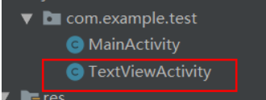

然后修改主界面

```xml
<?xml version="1.0" encoding="utf-8"?>
<LinearLayout
    xmlns:android="http://schemas.android.com/apk/res/android"
    xmlns:tools="http://schemas.android.com/tools"
    xmlns:app="http://schemas.android.com/apk/res-auto"
    android:layout_width="match_parent"
    android:layout_height="match_parent"
    tools:context=".MainActivity">

    <Button
        android:layout_width="match_parent"
        android:layout_height="50dp"
        android:id="@+id/btn_1"
        android:text="登陆"
        android:textSize="20sp"/>
</LinearLayout>
```


添加点击事件

```java
public class MainActivity extends AppCompatActivity {

    private Button mbtn;//声明button对象
    @Override
    protected void onCreate(Bundle savedInstanceState) {
        super.onCreate(savedInstanceState);
        setContentView(R.layout.activity_main);
        mbtn = findViewById(R.id.btn_1);//通过id找到要绑定点击事件的按钮
        mbtn.setOnClickListener(new View.OnClickListener() {//点击事件函数
            @Override
            public void onClick(View view) {
                Intent intent = new Intent(MainActivity.this,TextViewActivity.class);//声明跳转界面
                startActivity(intent);//执行intent
            }
        });
    }
}
```


TextView相关属性

```xml
 <!--省略文字多余部分，以点代替-->
<TextView
        android:layout_width="100dp"
        android:layout_height="100dp"
        android:id="@+id/tv_2"
        android:text="@string/tv_1"
        android:textSize="30sp"
        android:paddingLeft="20dp"
        android:paddingTop="10dp"
        android:maxLines="1"
        android:ellipsize="end" #作用是当文字长度超过textview宽度时的显示方式:
        />
```

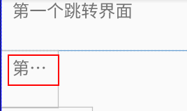


```xml
<TextView
        android:id="@+id/tv_3"
        android:layout_width="wrap_content"
        android:layout_height="wrap_content"
        android:drawableRight="@drawable/weather" #在该文本框右边添加图片，来自drawable目录
        android:paddingLeft="20dp"
        android:paddingTop="10dp"
        android:text="杨海涛"
        android:textSize="30sp" />
```


```java
        /*设置中划线效果*/
        mtv = findViewById(R.id.tv_4);
        mtv.getPaint().setFlags(Paint.STRIKE_THRU_TEXT_FLAG);//中划线
        //mtv.getPaint().setAntiAlias(true);//去除锯齿
        /*设置下划线效果*/
        mtv2 = findViewById(R.id.tv_5);
        mtv2.getPaint().setFlags(Paint.UNDERLINE_TEXT_FLAG);//下划线
```

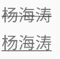

```xml
 <!--设置跑马灯效果-->
<TextView
        android:id="@+id/tv_6"
        android:layout_width="wrap_content"
        android:layout_height="wrap_content"
        android:drawablePadding="2dp"
        android:paddingLeft="20dp"
        android:paddingTop="10dp"
        android:text="万可爱万可爱万可爱万可爱万可爱"
        android:textSize="30sp"
        android:singleLine="true"  #等效于（android:lines="1"  android:ellipsize="end"）
        android:ellipsize="marquee"  #以横向滚动方式显示(需获得当前焦点时)
        android:marqueeRepeatLimit="marquee_forever" #循环次数
        android:focusable="true"  #获取焦点
        android:focusableInTouchMode="true" #获取焦点
  />
```

由于在实际的开发中，页面的布局往往比较复杂，如果显示两个跑马灯的文字，这种方法只能实现第一个，第二个不会出现效果。采用如下方法：

创建一个类继承TextView

```java
package com.yht.musicaudio;

import android.annotation.SuppressLint;
import android.content.Context;
import android.util.AttributeSet;
import android.widget.TextView;

@SuppressLint("AppCompatCustomView")
public class Marquee_Text extends TextView {
    public Marquee_Text(Context context) {
        super(context);
    }

    public Marquee_Text(Context context, AttributeSet attrs) {
        super(context, attrs);
    }

    public Marquee_Text(Context context, AttributeSet attrs, int defStyleAttr) {
        super(context, attrs, defStyleAttr);
    }

    @Override
    public boolean isFocused() {
        return true;
    }
}

```


然后就可以自己调用自己写的textview

```xml
 <com.yht.musicaudio.Marquee_Text
            android:id="@+id/song_name"
            android:layout_width="100dp"
            android:layout_height="wrap_content"
            android:layout_alignParentRight="true"
            android:layout_alignParentBottom="true"
            android:layout_marginTop="12dp"
            android:layout_marginRight="30dp"
            android:layout_marginBottom="31dp"
            android:text=""
            android:textSize="20sp"
            android:singleLine="true"
            android:ellipsize="marquee"
            android:marqueeRepeatLimit="marquee_forever"
            android:focusable="true"
            android:focusableInTouchMode="true" />

        <com.yht.musicaudio.Marquee_Text
            android:id="@+id/singer_name"
            android:layout_width="wrap_content"
            android:layout_height="wrap_content"
            android:layout_alignParentRight="true"

            android:layout_marginRight="50dp"
            android:layout_marginTop="40dp"
            android:layout_alignLeft="@+id/song_name"
            android:layout_marginLeft="1dp"
            android:text=""
            android:singleLine="true"
            android:ellipsize="marquee"
            android:marqueeRepeatLimit="marquee_forever"
            android:focusable="true"
            android:focusableInTouchMode="true"/>
```

## 2.Button

Android中所有的控件都具有这两个属性，可选值有3种：**match_parent、fill_parent、wrap_content.**

其中match_parent和fill_parent的意义相同，但官方更推荐match_parent.

==match_parent表示让当前控件的大小和父布局的大小一样，也就是由父布局来决定当前控件的大小==

==wrap_content表示让当前的控件大小能够刚好包含里面的内容，也就是由控件内容决定当前控件的大小==

```xml
<Button
        android:layout_width="match_parent"
        android:layout_height="wrap_content"
        android:layout_marginTop="10dp"
        android:text="EditText"
        android:textAllCaps="false" #默认组件的text为全部大写，false取消默认
        android:textSize="20sp"/>
```

**1.改变button颜色，边框**

在drawable里面创建drawable resource file

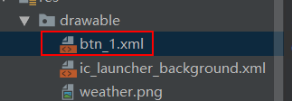


```xml
<?xml version="1.0" encoding="utf-8"?>
<shape xmlns:android="http://schemas.android.com/apk/res/android"    android:shape="rectangle">     
     <solid   android:color="#ff0000"></solid> <!--设置颜色-->   
     <corners android:radius="10dp"></corners> <!--设置边框幅度-->
</shape>
```

```xml
android:background="@drawable/btn_1"  //设计文件调用
```


**2.边框：**

```xml
<?xml version="1.0" encoding="utf-8"?>
<shape xmlns:android="http://schemas.android.com/apk/res/android"
    android:shape="rectangle">

    <stroke android:width="1dp"
            android:color="#00ff00"/> <!--设计边框样式-->
    <solid android:color="#ffffff"/><!--注意！！一定要填充，否则按钮显示不出来-->
</shape>
```

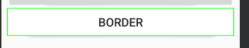

**3.按压效果**

```xml
<?xml version="1.0" encoding="utf-8"?>
<selector xmlns:android="http://schemas.android.com/apk/res/android">
    <item android:state_pressed="false"><!--按压前样式-->
        <shape>
            <solid android:color="#ff0000"/>
        </shape>
    </item>
    <item android:state_pressed="true"><!--按压时候样式-->
        <shape>
            <solid android:color="#ffffff"/>
        </shape>
    </item>
</selector>
```

**4.设置按钮点击事件（两种办法）**

```java
  //①在Activity里面书写方法，且必须带参数View
    public void showToast(View view){
        /**
         * Toast.LENGTH_SHORT是提示显示的时长
         * 最后必须调用show()方法，否则不会弹出
         */
        Toast.makeText(this,"欢迎您",Toast.LENGTH_SHORT).show();
    }
```

```properties
android:onClick="showToast" #调用
```


或者：

```java
/*或者在OnClick方法里面*/
 mbtn = findViewById(R.id.btn_1);
        mbtn.setOnClickListener(new View.OnClickListener() {//点击事件
            @Override
            public void onClick(View view) {
              Toast.makeText(this,"欢迎您",Toast.LENGTH_SHORT).show();
            }
        });
```


## 3.ImageView

```xml
 
<ImageView
        android:layout_width="300dp"
        android:layout_height="200dp"
        android:background="#00ff00"
        android:src="@drawable/ultraman"  #图片名称一定要有字母
        android:scaleType="centerCrop"/>  
         <!--scaleType的三个属性：1.fitXY：控件被撑满，宽高比会被拉伸；
                                 2.fitCenter/center：保持宽高比缩放，直至能够完全显示
                                 3.centerCrop：保持宽高比缩放，直至完全覆盖控件，裁剪显                                                    示-->
  
```


**使用imgView加载网络图片**

1.使用第三方库，去git上面找到glide库插件

```groovy
/*在项目gradle里面引入依赖*/
repositories {
  google()
  jcenter()
}

dependencies {
  implementation 'com.github.bumptech.glide:glide:4.11.0'
  annotationProcessor 'com.github.bumptech.glide:compiler:4.11.0'
}
```

用法

```java
// For a simple view:
@Override public void onCreate(Bundle savedInstanceState) {
  ...
  ImageView imageView = (ImageView) findViewById(R.id.my_image_view);

  Glide.with(this).load("http://goo.gl/gEgYUd").into(imageView);
}
```

由于是要进行网络请求，所以要到manifest.xml中开启网络权限

```xml
 <!--声明开启网络权限-->
    <uses-permission android:name="android.permission.INTERNET"/>
```

### 圆形图片

自定义imageView可以实现

> https://www.jb51.net/article/215866.htm
>
> https://www.cnblogs.com/tangs/articles/5917954.html

```java

```


## 4.RadioButton

```java
/*由于每一个按钮点击跳转事件都重复写太过繁琐，以下为更新*/
public class MainActivity extends AppCompatActivity {

    private Button mbtn;//声明对象
    private Button mbtnEditText;//edittext
    private Button radiobtn;//radiobutton
    @Override
    protected void onCreate(Bundle savedInstanceState) {
        super.onCreate(savedInstanceState);
        setContentView(R.layout.activity_main);
        mbtn = findViewById(R.id.btn_1);//找到控件
        mbtnEditText = findViewById(R.id.edittext);
        radiobtn = findViewById(R.id.radiobt);
        setClicklistener();//调用方法
      
        /*之气方法，如果按钮组件过多，每次重写会很麻烦*/
        /*  radiobtn.setOnClickListener(new View.OnClickListener() {
            @Override
            public void onClick(View view) {
                Intent intent = new Intent(MainActivity.this,RadioActivity.class);
                startActivity(intent);
            }
        });*/
        
        }
		//通过该方法进行点击事件调用
        public void setClicklistener(){
            OnClick onClick = new OnClick();
            mbtn.setOnClickListener(onClick);
            mbtnEditText.setOnClickListener(onClick);
            radiobtn.setOnClickListener(onClick);
        }
    private class OnClick implements View.OnClickListener{//内部类实现接口View.OnClickListener
        @Override
        public void onClick(View view) {
            Intent intent = null;
            switch (view.getId()){//通过switch语句进行选择跳转
                case R.id.btn_1:
                    intent = new Intent(MainActivity.this,TextViewActivity.class);//实现界面跳转
                    break;
                case R.id.edittext:
                    intent = new Intent(MainActivity.this,EditTextActivity.class);
                    break;
                case R.id.radiobt:
                    intent = new Intent(MainActivity.this,RadioActivity.class);
                    break;
            }
            startActivity(intent);
        }
    }
}
```

### **!! gravity属性 !!**

**补上一个需要记忆的点:**

**android:layout_gravity面向的是整个控件对于父控件的位置**

**android:gravity面向的是控件中内容对于这个控件的位置。** 


RadioButton控件的布局文件

```xml
<!--当多个rb时，要设置只能选一个就要放进radiogroup里面-->
<RadioGroup
        android:id="@+id/rg"
        android:layout_width="wrap_content"
        android:layout_height="wrap_content"
        android:orientation="vertical"> #排列方式
        <RadioButton
            android:id="@+id/rb_1"
            android:layout_width="50dp"
            android:layout_height="30dp"
            android:text="男"
            android:textSize="20sp"
            android:checked="true"   #默认选中该按钮
            />
        <RadioButton
            android:id="@+id/rb_2"
            android:layout_width="50dp"
            android:layout_height="30dp"
            android:text="女"
            android:textSize="20sp"
            />
 </RadioGroup>
```

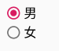

为该组radiobutton添加选中监听事件

```java
private RadioGroup radioGroup;
    @Override
    protected void onCreate(Bundle savedInstanceState) {
        super.onCreate(savedInstanceState);
        setContentView(R.layout.activity_radio);

        radioGroup = findViewById(R.id.rg);
        radioGroup.setOnCheckedChangeListener(new RadioGroup.OnCheckedChangeListener() {//设置该组的选中事件
            @Override
            public void onCheckedChanged(RadioGroup radioGroup, int i) {
                RadioButton radioButton = radioGroup.findViewById(i);//通过id查找选中的radiobutton
                /**
                 * makeText()，是Toast的一个方法，用来显示信息，分别有三个参数。
                 * 第一个参数：this，是上下文参数，指当前页面显示
                 * 第二个参数：“string string string ”是你想要显示的内容，
                 * 第三个参数：Toast.LENGTH_LONG，是你指你提示消息，显示的时间，这个是稍微长点儿，对应的另一个是ToastLENGTH_SHORT，这个时间短点儿，大概2秒钟。
                 * show()，表示显示这个Toast消息提醒，当程序运行到这里的时候，就会显示出来，如果不调用show()方法，这个Toast对象存在，但是并不会显示，所以一定不要忘记。
                 */
                Toast.makeText(RadioActivity.this,radioButton.getText(),Toast.LENGTH_SHORT).show();//将选中按钮的text显示出来
            }
        });

    }
```

## 5.CheckBox

```xml
    <TextView
        android:layout_width="wrap_content"
        android:layout_height="wrap_content"
        android:text="你会什么编程技术"
        android:textSize="25sp" />
    <CheckBox
        android:layout_width="wrap_content"
        android:layout_height="wrap_content"
        android:text="Java"
        android:textSize="20sp"
        android:id="@+id/cb1"
        />
    <CheckBox
        android:layout_width="wrap_content"
        android:layout_height="wrap_content"
        android:text="C++"
        android:textSize="20sp"
        android:id="@+id/cb2"
        />
    <CheckBox
        android:layout_width="wrap_content"
        android:layout_height="wrap_content"
        android:text="C#"
        android:textSize="20sp"
        android:id="@+id/cb3"
        />
    <CheckBox
        android:layout_width="wrap_content"
        android:layout_height="wrap_content"
        android:text="None"
        android:textSize="20sp"
        android:id="@+id/cb4"
        />
```


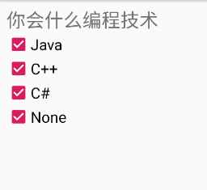

自定义按钮样式

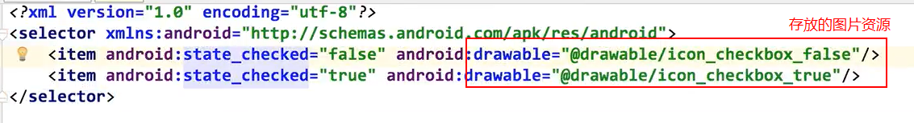

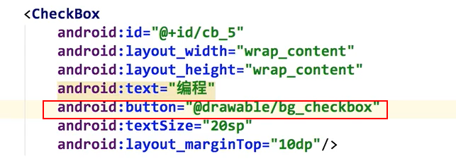

编写他的点击事件

```java
    private CheckBox checkBox1;
    private CheckBox checkBox2;
    @Override
    protected void onCreate(Bundle savedInstanceState) {
        super.onCreate(savedInstanceState);
        setContentView(R.layout.activity_check_box);

        checkBox1 = findViewById(R.id.cb1);
        checkBox2 = findViewById(R.id.cb2);
        checkBox1.setOnCheckedChangeListener(new CompoundButton.OnCheckedChangeListener() {
            @Override
            public void onCheckedChanged(CompoundButton compoundButton, boolean b) {
                Toast.makeText(CheckBoxActivity.this,b?"选中java":"未选中java",Toast.LENGTH_SHORT).show();
            }
        });

        checkBox2.setOnCheckedChangeListener(new CompoundButton.OnCheckedChangeListener() {
            @Override
            public void onCheckedChanged(CompoundButton compoundButton, boolean b) {
                Toast.makeText(CheckBoxActivity.this,b?"选中C++":"未选中C++",Toast.LENGTH_SHORT).show();
            }
        });
    }
```

## 6.EditText

> [editText](https://blog.51cto.com/u_16213568/8608169)

> **常用属性：**
>
> android:hint：Text为空时显示的文字提示信息，可通过textColorHint设置提示信息的颜色。
>
> android:singleLine：设置单行输入，一旦设置为true，则文字不会自动换行。
>
> android:gray="top" ：多行中指针在第一行第一位置et.setSelection(et.length());：调整光标到最后一行
>
> android:autoText ：自动拼写帮助。这里单独设置是没有效果的，可能需要其他输入法辅助才行
>
> android:capitalize ：设置英文字母大写类型。设置如下值：sentences仅第一个字母大写；words每一个单词首字母大小，用空格区分单词；characters每一个英文字母都大写。
>
> android:digits ：设置允许输入哪些字符。如“1234567890.+-*/%\n()”
>
> android:singleLine ：是否单行或者多行，回车是离开文本框还是文本框增加新行android:numeric ：如果被设置，该TextView接收数字输入。有如下值设置：integer正整数、signed带符号整数、decimal带小数点浮点数。
>
> android:inputType:设置文本的类型
>
> android:password ：密码，以小点”.”显示文本
>
> android:phoneNumber ：设置为电话号码的输入方式。
>
> android:editable ：设置是否可编辑。仍然可以获取光标，但是无法输入。
>
> android:autoLink=”all” ：设置文本超链接样式当点击网址时，跳向该网址
>
> android:textColor = "#ff8c00"：字体颜色
>
> android:textStyle="bold"：字体，bold, italic, bolditalic
>
> android:textAlign="center"：EditText没有这个属性，但TextView有
>
> android:textColorHighlight="#cccccc"：被选中文字的底色，默认为蓝色
>
> android:textColorHint="#ffff00"：设置提示信息文字的颜色，默认为灰色
>
> android:textScaleX="1.5"：控制字与字之间的间距
>
> android:typeface="monospace"：字型，normal, sans, serif, monospace
>
> android:background="@null"：空间背景，这里没有，指透明

新建跳转EditText按钮

```xml
 <Button
        android:layout_width="match_parent"
        android:layout_height="50dp"
        android:layout_marginTop="10dp"
        android:text="EditText"
        android:textAllCaps="false" #默认组件的text为全部大写，false取消默认
        android:textSize="20sp"/>
```


```xml
 <EditText
        android:id="@+id/ed1"
        android:layout_width="match_parent"
        android:layout_height="50dp"
        android:hint="Username"  
    />
  <EditText
        android:id="@+id/ed2"
        android:layout_width="match_parent"
        android:layout_height="50dp"
        android:hint="Password"   #类似于html的placeholder，输入提示
        android:inputType="textPassword"  #出现暗文，可以更改输入类型，例如数字
        android:layout_below="@+id/ed1"
     />
```

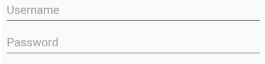

### 设置EditText的监听事件

```java
        private EditText editText;
        editText = findViewById(R.id.ed1);
        editText.addTextChangedListener(new TextWatcher() {
            @Override
            public void beforeTextChanged(CharSequence charSequence, int i, int i1, int i2) {

            }

            @Override
            public void onTextChanged(CharSequence charSequence, int i, int i1, int i2) {
                Log.d("监听edittext",charSequence.toString());//输入实时监听
            }

            @Override
            public void afterTextChanged(Editable editable) {

            }
        });
```

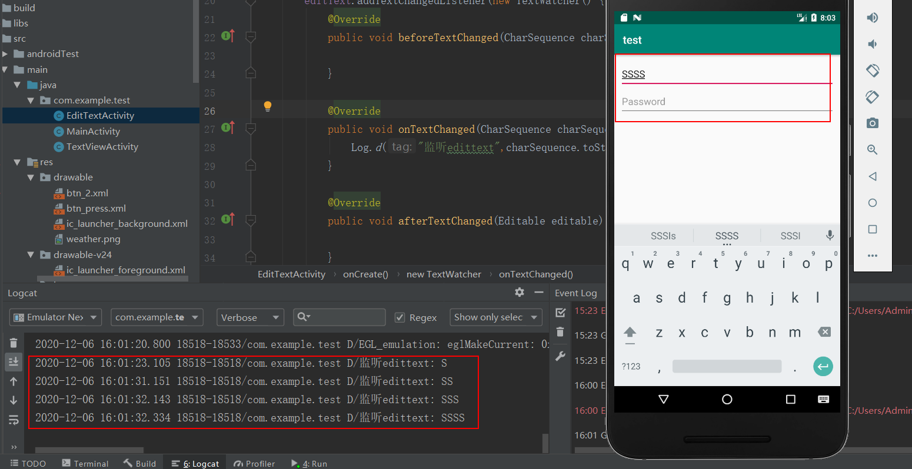


> **高版本android edittext没有了下划线，所以需要自定义：**
>
> - **在theme.xml中定义样式**
>
> ```xml
> <style name="MyEditText" parent="Theme.AppCompat.Light">
>     <item name="colorControlNormal">@android:color/darker_gray</item>
>     <item name="colorControlActivated">@android:color/holo_orange_dark</item>
> </style>
> ```
>
> 然后在 `EditText`中，加上`android:theme="@style/MyEditText"` 属性 
>
> - **在drawable中定义样式**
>
>   


## 7.ScrollView

注意：scrollview里面只能有一个直接子元素，所以可以创建一个linearlayout，然后再linear里面创建控件

```xml
<?xml version="1.0" encoding="utf-8"?>
<!--整个页面布局设置为ScrollView，垂直的-->
<ScrollView
    xmlns:android="http://schemas.android.com/apk/res/android"
    xmlns:tools="http://schemas.android.com/tools"
    xmlns:app="http://schemas.android.com/apk/res-auto"
    android:layout_width="match_parent"
    android:layout_height="match_parent"
    tools:context=".MainActivity"
    android:padding="10dp">

    <LinearLayout
        android:layout_width="match_parent"
        android:layout_height="match_parent"
        android:orientation="vertical"
        >
        <Button
            android:layout_width="match_parent"
            android:layout_height="50dp"
            android:id="@+id/btn_1"
            android:text="登陆"
            android:textSize="20sp" />

        <Button
            android:layout_width="match_parent"
            android:layout_height="50dp"
            android:text="EditText"
            android:textAllCaps="false"
            android:textSize="20sp"
            android:id="@+id/edittext"/>

        <Button
            android:layout_width="match_parent"
            android:layout_height="wrap_content"
            android:text="Border"
            android:textSize="20sp"
            android:background="@drawable/btn_press"
            android:onClick="showToast"/>

        <Button
            android:layout_width="match_parent"
            android:layout_height="50dp"
            android:text="RadioButton"
            android:textAllCaps="false"
            android:textSize="20sp"
            android:id="@+id/radiobt"/>
        <Button
            android:layout_width="match_parent"
            android:layout_height="50dp"
            android:text="CheckBox"
            android:textAllCaps="false"
            android:textSize="20sp"
            android:id="@+id/cb"/>
        <Button
            android:layout_width="match_parent"
            android:layout_height="50dp"
            android:text="ImgView"
            android:textAllCaps="false"
            android:textSize="20sp"
            android:id="@+id/im_view"/>
        <Spinner
            android:id="@+id/planets_array"
            android:layout_width="fill_parent"
            android:layout_height="wrap_content" />
        <!--在里面设置一个水平的ScrollView-->
        <HorizontalScrollView
            android:layout_width="match_parent"
            android:layout_height="wrap_content">
            <LinearLayout
                android:layout_width="wrap_content"
                android:layout_height="wrap_content"
                android:orientation="horizontal">
                <Button
                    android:layout_width="match_parent"
                    android:layout_height="50dp"
                    android:text="CheckBox"
                    android:textAllCaps="false"
                    android:textSize="20sp"
                    android:id="@+id/btn1"/>
                <Button
                    android:layout_width="match_parent"
                    android:layout_height="50dp"
                    android:text="ImgView"
                    android:textAllCaps="false"
                    android:textSize="20sp"
                    android:id="@+id/btn2"/>
                <Button
                    android:layout_width="match_parent"
                    android:layout_height="50dp"
                    android:text="ImgView"
                    android:textAllCaps="false"
                    android:textSize="20sp"
                    android:id="@+id/btn3"/>
                <Button
                    android:layout_width="match_parent"
                    android:layout_height="50dp"
                    android:text="ImgView"
                    android:textAllCaps="false"
                    android:textSize="20sp"
                    android:id="@+id/btn4"/>
                <Button
                    android:layout_width="match_parent"
                    android:layout_height="50dp"
                    android:text="ImgView"
                    android:textAllCaps="false"
                    android:textSize="20sp"
                    android:id="@+id/btn5"/>
            </LinearLayout>
        </HorizontalScrollView>
    </LinearLayout>

</ScrollView>
```

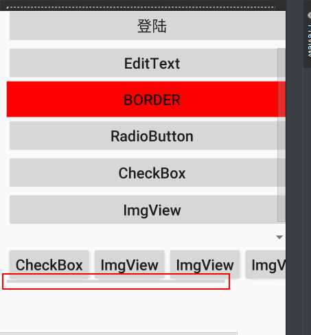

## 8.Spinner

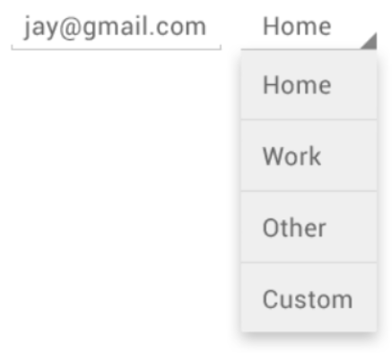


```xml
<Spinner
    android:id="@+id/planets_spinner"
    android:layout_width="fill_parent"
    android:layout_height="wrap_content" />
```


 微调框选项不限来源，但您必须通过 `SpinnerAdapter` 提供这些选项，例如：若通过数组获取选项，则提供方式应为 `ArrayAdapter`；若通过数据库查询获取选项，则提供方式应为 `CursorAdapter`。 

```xml
<!--例如，如果预先确定了微调框的可用选项，则可通过字符串资源文件中定义的字符串数组来提供这些选项：-->
<!--必须建在values下面，且必须以resources为根部-->
<?xml version="1.0" encoding="utf-8"?>
<resources>
    <string-array name="planets_array">
        <item>Mercury</item>
        <item>Venus</item>
        <item>Earth</item>
        <item>Mars</item>
        <item>Jupiter</item>
        <item>Saturn</item>
        <item>Uranus</item>
        <item>Neptune</item>
    </string-array>
</resources>
```

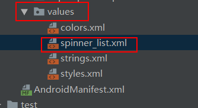

 对于如上所示数组，您可以在 `Activity` 或 `Fragment` 中使用以下代码，从而使用 `ArrayAdapter` 实例为微调框提供该数组： 

```java
Spinner spinner = (Spinner) findViewById(R.id.spinner);

/*借助 createFromResource() 方法，您可以从字符串数组创建 ArrayAdapter。此方法的第三个参数是布局资源，该参数定义了所选选项在微调框控件中的显示方式。simple_spinner_item 布局是平台提供的默认布局，除非您想为微调框外观定义自己的布局，否则应使用此布局。*/
ArrayAdapter<CharSequence> adapter = ArrayAdapter.createFromResource(this,
        R.array.planets_array, android.R.layout.simple_spinner_item);//array会爆红，但是运行结果没有错

/*调用 setDropDownViewResource(int)，从而指定适配器用于显示微调框选择列表的布局（simple_spinner_dropdown_item 是平台定义的另一种标准布局）。*/

adapter.setDropDownViewResource(android.R.layout.simple_spinner_dropdown_item);

/*setAdapter() 将适配器应用到 Spinner*/
spinner.setAdapter(adapter);
```

## 9.WebView

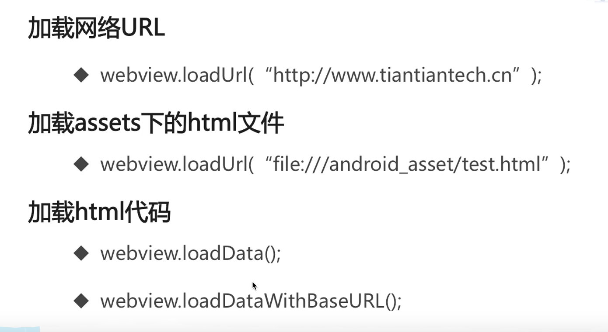


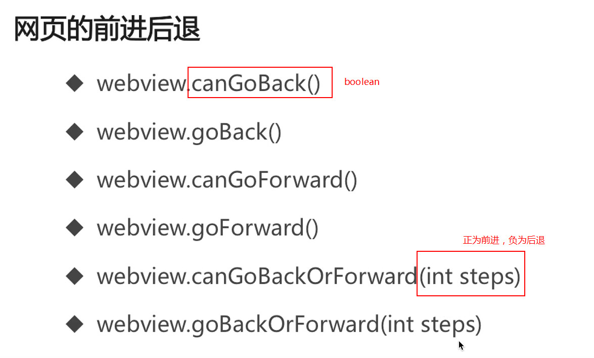

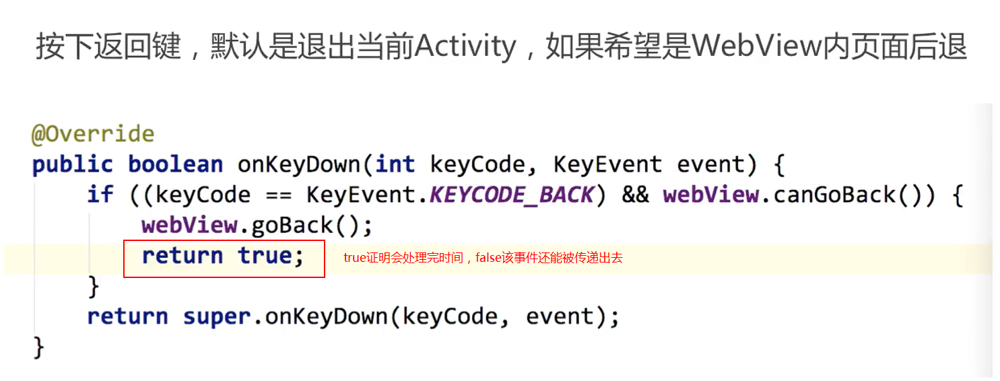


1.访问本地Assets目录下资源

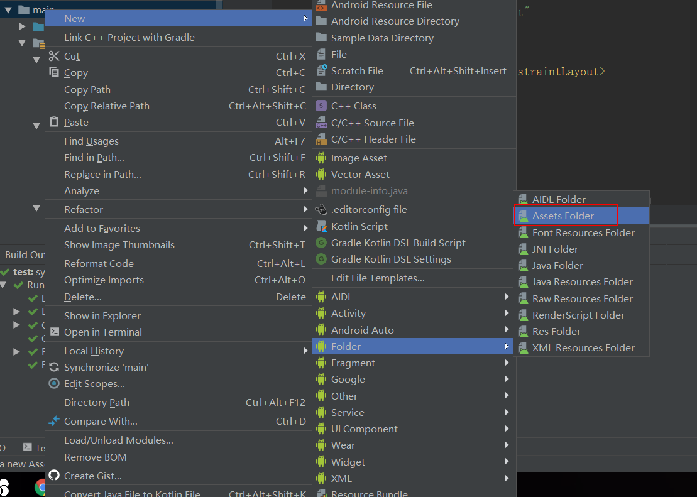

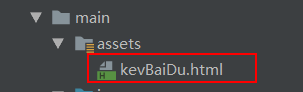


创建WebView

```xml
<WebView
        android:layout_width="match_parent"
        android:layout_height="match_parent"
        android:id="@+id/wv1"></WebView>
```

activity

```java
public class WebViewActivity extends AppCompatActivity {

    private WebView webView;
    @Override
    protected void onCreate(Bundle savedInstanceState) {
        super.onCreate(savedInstanceState);
        setContentView(R.layout.activity_web_view);
        webView = findViewById(R.id.wv1);
        webView.loadUrl("file:///android_asset/kevBaiDu.html");//加载本地assets内容

    }
}
```


加载网络网页

```java
public class WebViewActivity extends AppCompatActivity {

    private WebView webView;
    @Override
    protected void onCreate(Bundle savedInstanceState) {
        super.onCreate(savedInstanceState);
        setContentView(R.layout.activity_web_view);
        webView = findViewById(R.id.wv1);

        //加载本地网页
        //webView.loadUrl("file:///android_asset/kevBaiDu.html");
        //加载网络资源
        webView.getSettings().setJavaScriptEnabled(true);//添加js支持，否则加载不出来
        webView.setWebViewClient(new MyWebViewClient());//添加webview client,网页跳转在本应用进行
        webView.loadUrl("https://m.baidu.com");//m代表mobile,与web端不同
    }

    class MyWebViewClient extends WebViewClient{

        //当网页跳转时就在本应用上加载,不会让你去其他应用加载
        @RequiresApi(api = Build.VERSION_CODES.LOLLIPOP)
        @Override
        public boolean shouldOverrideUrlLoading(WebView view, WebResourceRequest request) {
           view.loadUrl(request.getUrl().toString());
            return true;
        }

        //网页开始加载显示log
        @Override
        public void onPageStarted(WebView view, String url, Bitmap favicon) {
            super.onPageStarted(view, url, favicon);
            Log.d("webView","started");
        }

        //网页加载结束显示
        @Override
        public void onPageFinished(WebView view, String url) {
            super.onPageFinished(view, url);
            Log.d("weview","ended");
        }
    }

    //是否能够回退，如果可以返回上一级，而不是直接结束activity
    @Override
    public boolean onKeyDown(int keyCode, KeyEvent event) {
        if (keyCode == KeyEvent.KEYCODE_BACK && webView.canGoBack()){
            webView.goBack();
            return true;
        }
        return super.onKeyDown(keyCode, event);
    }
}

```


要实现一些其他功能

```java
 //WebChromeClient可以提供一些与网页相关的方法
    class MyWebChromeClient extends WebChromeClient{
        @Override
        //实现网页加载进度条展示
        public void onProgressChanged(WebView view, int newProgress) {
            super.onProgressChanged(view, newProgress);
        }

        @Override
        //加载网页标题
        public void onReceivedTitle(WebView view, String title) {
            super.onReceivedTitle(view, title);
            setTitle(title);
        }
    }

//调用
 webView.setWebChromeClient(new MyWebChromeClient());//添加WebChromeClient
```


activity完整代码

```java
public class WebViewActivity extends AppCompatActivity {

    private WebView webView;
    @Override
    protected void onCreate(Bundle savedInstanceState) {
        super.onCreate(savedInstanceState);
        setContentView(R.layout.activity_web_view);
        webView = findViewById(R.id.wv1);

        //加载本地网页

        /*webView.getSettings().setDomStorageEnabled(true);
        webView.getSettings().setUseWideViewPort(true);//适应分辨率
        webView.getSettings().setLoadWithOverviewMode(true);
        webView.loadUrl("file:///android_asset/login.html");*/
        //加载网络资源
        webView.getSettings().setJavaScriptEnabled(true);//添加js支持，否则加载不出来
        webView.setWebViewClient(new MyWebViewClient());//添加webview client
        webView.setWebChromeClient(new MyWebChromeClient());//添加WebChromeClient
        webView.loadUrl("https://m.baidu.com");//m代表mobile,与web端不同*/
    }

    class MyWebViewClient extends WebViewClient{

        //当网页跳转时就在本应用上加载,不会让你去其他应用加载
        @RequiresApi(api = Build.VERSION_CODES.LOLLIPOP)
        @Override
        public boolean shouldOverrideUrlLoading(WebView view, WebResourceRequest request) {
           view.loadUrl(request.getUrl().toString());
            return true;
        }

        //网页开始加载显示log
        @Override
        public void onPageStarted(WebView view, String url, Bitmap favicon) {
            super.onPageStarted(view, url, favicon);
            Log.d("webView","started");
        }

        //网页加载结束显示
        @Override
        public void onPageFinished(WebView view, String url) {
            super.onPageFinished(view, url);
            Log.d("weview","ended");
        }
    }
    //WebChromeClient可以提供一些与网页相关的方法
    class MyWebChromeClient extends WebChromeClient{
        @Override
        //实现网页加载进度条展示
        public void onProgressChanged(WebView view, int newProgress) {
            super.onProgressChanged(view, newProgress);
        }

        @Override
        //加载网页标题
        public void onReceivedTitle(WebView view, String title) {
            super.onReceivedTitle(view, title);
            setTitle(title);
        }
    }

    //是否能够回退，如果可以返回上一级
    @Override
    public boolean onKeyDown(int keyCode, KeyEvent event) {
        if (keyCode == KeyEvent.KEYCODE_BACK && webView.canGoBack()){
            webView.goBack();
            return true;
        }
        return super.onKeyDown(keyCode, event);
    }
}
```


在java代码中还可以实现js代码

```java
webView.loadUrl("javascript:alert('hello')");
//或者
webView.evaluateJavascript("javascript:alert('hello')");
```


## 10.Toast

消息提示快

**想要Toast显示，必须调用`show`方法**

创建一个默认样式的Toast

> ```java
> //默认样式
> Toast.makeText(getApplicationContext(),"Toast",Toast.LENGTH_LONG).show();//getApplicationContext()就是指当前Activity
> 
> //更改显示位置
> Toast toastcenter = Toast.makeText(getApplicationContext(),"toast",Toast.LENGTH_LONG);
> toastcenter.setGravity(Gravity.CENTER,0,0);//让它居中
> toastcenter.show();
> ```

创建一个填充自定义样式的Toast

> ```java
> //更改显示样式，例如加上图片和文字
> Toast toastCustom = new Toast(ToastActivity.this);//创建toast对象
> LayoutInflater layoutInflater = LayoutInflater.from(ToastActivity.this);//声明布局对象
> View view1 = layoutInflater.inflate(R.layout.layout_toast,null);//添加布局，返回view类型
> 
> ImageView imageView = view1.findViewById(R.id.iv_toast);
> imageView.setImageResource(R.drawable.weather);//为imgview添加图片
> TextView textView = view1.findViewById(R.id.tv_toast);
> textView.setText("您好");//为textview添加文本
> 
> toastCustom.setView(view1);//将view添加进toast
> toastCustom.setDuration(Toast.LENGTH_SHORT);//设置显示长度
> toastCustom.show();
> ```
>
> ```xml
> <!--自定义布局文件layout_toast.xml-->
> <?xml version="1.0" encoding="utf-8"?>
> <LinearLayout xmlns:android="http://schemas.android.com/apk/res/android"
>  android:orientation="vertical"
>  android:layout_width="wrap_content"
>  android:layout_height="wrap_content"
>  android:background="#99000000"  
>  android:gravity="center">
>  <!--由于根布局linearlayout的长宽会失效，所以再设置一个layout-->
>  <LinearLayout
>      android:layout_width="200dp"
>      android:layout_height="200dp"
>      android:gravity="center"
>      android:orientation="vertical">
>      <ImageView
>          android:layout_width="100dp"
>          android:layout_height="100dp"
>          android:id="@+id/iv_toast"
>          android:scaleType="centerCrop"/>
> 
>      <TextView
>          android:id="@+id/tv_toast"
>          android:layout_width="wrap_content"
>          android:layout_height="wrap_content"
>          android:layout_marginTop="20dp"
>          android:textColor="#ffffff"
>          android:textSize="18sp" />
>  </LinearLayout>
> 
> </LinearLayout>
> ```
>
> 效果图
>
> 


### 封装

由于`toast`也属于对象，所以如果连续按压会导致每一个toast等待前面一个toast结束之后才会显示，为此，书写一个工具类进行封装优化

```java
public class ToastUtil {
    public static Toast toast;
    public static void showMsg(Context context,String msg){//传过来context和text内容
        if(toast == null){
            toast = Toast.makeText(context,msg,Toast.LENGTH_LONG);//如果没有被调用，则初始化toast
        }else{
            toast.setText(msg);//否则只给他添加text
        }
        toast.show();
    }
}
```

```java
//调用
ToastUtil.showMsg(getApplicationContext(),"toastutil");
```


## 11.Popup window

创建PopupActivity

创建一个按钮

```xml
 <Button
        android:layout_width="wrap_content"
        android:layout_height="wrap_content"
        android:text="PopUp"
        android:layout_marginTop="30dp"
        android:id="@+id/Pop_up"/>
```

然后创建一个布局文件，设置下拉的内容


```xml
<?xml version="1.0" encoding="utf-8"?>
<LinearLayout xmlns:android="http://schemas.android.com/apk/res/android"
    android:orientation="vertical"
    android:layout_width="match_parent"
    android:layout_height="match_parent"
    android:gravity="center_horizontal">

    <TextView
        android:layout_width="wrap_content"
        android:layout_height="wrap_content"
        android:text="数学"
        android:textSize="30sp"
        android:id="@+id/tx_1"/>
    <View
        android:layout_width="match_parent"
        android:layout_height="1dp"
        android:background="#000000"/>
    <TextView
        android:layout_width="wrap_content"
        android:layout_height="wrap_content"
        android:text="语文"
        android:textSize="30sp"

        android:layout_marginTop="10dp"/>
    <View
        android:layout_width="match_parent"
        android:layout_height="1dp"
        android:background="#000000"/>
    <TextView
        android:layout_width="wrap_content"
        android:layout_height="wrap_content"
        android:text="英语"
        android:textSize="30sp"

        android:layout_marginTop="10dp"/>
    <View
        android:layout_width="match_parent"
        android:layout_height="1dp"
        android:background="#000000"/>

</LinearLayout>
```

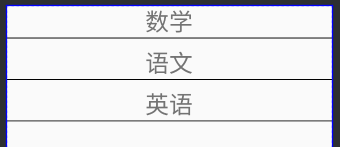

PopupActivity里面代码

```java
public class PopupActivity extends AppCompatActivity {

    private Button button;
    private PopupWindow popupWindow;
    @Override
    protected void onCreate(Bundle savedInstanceState) {
        super.onCreate(savedInstanceState);
        setContentView(R.layout.activity_popup);
        button = findViewById(R.id.Pop_up);
        button.setOnClickListener(new View.OnClickListener() {
            @Override
            public void onClick(View view) {

                View view1 = getLayoutInflater().inflate(R.layout.popup_list,null);//找到视图
                TextView textView = view1.findViewById(R.id.tx_1);//找到textview
                textView.setOnClickListener(new View.OnClickListener() {
                    @Override
                    public void onClick(View view) {
                        popupWindow.dismiss();//popup消失
                        ToastUtil.showMsg(PopupActivity.this,textView.getText().toString());
                    }
                });
                popupWindow = new PopupWindow(view1,button.getWidth(), ViewGroup.LayoutParams.WRAP_CONTENT);//声明对象，添加布局，宽度为button宽度
                popupWindow.setOutsideTouchable(true);//点击外部区域会消失，与Cancleable相反
                popupWindow.setFocusable(true);//每次点击按钮都不会弹出来，而是点一次关掉，下一次打开交替的动作
                popupWindow.showAsDropDown(button);//设置展示的位置

            }
        });
    }
}
```

## 12.Dialog

**1.默认样式的dialog**

```java
AlertDialog.Builder builder = new AlertDialog.Builder(AlertdialogActivity.this);
builder.setTitle("请回答");//设置标题
builder.setMessage("你觉得杨海涛帅吗");//设置内容
builder.setIcon(R.drawable.weather);//设置图标

//alertdialog提供三种类型按键，这是positive类型的
builder.setPositiveButton("帅", new DialogInterface.OnClickListener() {
    @Override
    public void onClick(DialogInterface dialogInterface, int i) {
        ToastUtil.showMsg(AlertdialogActivity.this,"真诚实");//点击事件为显示toast
    }
});
///neutral类型
builder.setNeutralButton("一般般", new DialogInterface.OnClickListener() {
    @Override
    public void onClick(DialogInterface dialogInterface, int i) {
        ToastUtil.showMsg(getApplicationContext(),"滚");
    }
});
//negative类型
builder.setNegativeButton("不好看", new DialogInterface.OnClickListener() {
    @Override
    public void onClick(DialogInterface dialogInterface, int i) {
        ToastUtil.showMsg(getApplicationContext(),"闭上臭嘴");
    }
});
//最重要的要调用show方法
builder.show();
```

效果:


**2.设置item**

```javascript
final String[] arry = new String[]{"男","女"};
builder.setTitle("性别");
builder.setItems(arry, new DialogInterface.OnClickListener() {
                 @Override
                 public void onClick(DialogInterface dialogInterface, int i) {
    ToastUtil.showMsg(getApplicationContext(),arry[i]);
}
});
//最重要的要调用show方法
builder.show();
```

效果：


**3.实现类似radiobutton功能**

```java
final String[] arry2 = new String[]{"男","女"};
builder.setTitle("性别").setSingleChoiceItems(arry2, 0, new DialogInterface.OnClickListener() {
    @Override
    public void onClick(DialogInterface dialogInterface, int i) {
        ToastUtil.showMsg(getApplicationContext(),arry2[i]);
        dialogInterface.dismiss();//点击item以后对话框消失
    }
});
builer.setCancelable(false);//点击空白处对话框不会消失
builder.show();
```

效果:

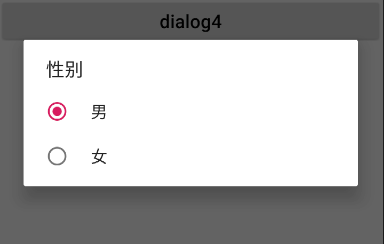

**4.实现checkbox功能**

```java
final String[] arry3 = new String[]{"数学","语文","英语"};
boolean[] isSelect = new boolean[]{false,false,false};

builder.setTitle("选择科目");
builder.setMultiChoiceItems(arry3, isSelect, new DialogInterface.OnMultiChoiceClickListener() {
    @Override
    public void onClick(DialogInterface dialogInterface, int i, boolean b) {
        ToastUtil.showMsg(getApplicationContext(),arry3[i]);
    }
});
builder.setPositiveButton("确定", new DialogInterface.OnClickListener() {
    @Override
    public void onClick(DialogInterface dialogInterface, int i) {

    }
});
builder.setNegativeButton("取消", new DialogInterface.OnClickListener() {
    @Override
    public void onClick(DialogInterface dialogInterface, int i) {
    }
});
builder.show();
```

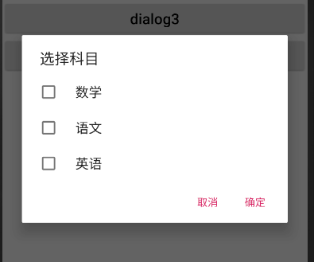

**5.完成登录界面**

新建自定义布局文件

```xml
<?xml version="1.0" encoding="utf-8"?>
<LinearLayout xmlns:android="http://schemas.android.com/apk/res/android"
    android:orientation="vertical"
    android:layout_width="match_parent"
    android:layout_height="match_parent"
    android:padding="10dp">

    <EditText
        android:id="@+id/ed_dialog1"
        android:layout_width="match_parent"
        android:layout_height="50dp"
        android:hint="Username" />
    <EditText
        android:id="@+id/ed_dialog2"
        android:layout_width="match_parent"
        android:layout_height="50dp"
        android:hint="Password"
        android:inputType="textPassword"
        android:layout_below="@+id/ed1"/>
    <Button
        android:layout_width="match_parent"
        android:layout_height="wrap_content"
        android:text="login"
        android:textSize="20sp"
        android:id="@+id/dialog_login"/>
</LinearLayout>
```


```java
//找到布局，返回类型为view
View view1 = LayoutInflater.from(getApplicationContext()).inflate(R.layout.login_dialog,null);
builder.setTitle("登录界面").setView(view1);//将布局放进dialog
Button button = view1.findViewById(R.id.dialog_login);
button.setOnClickListener(new View.OnClickListener() {
    @Override
    public void onClick(View view) {

    }
});
builder.show();
```

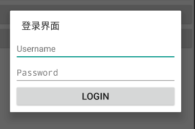

### Application不能作为dialog的context

> https://mp.weixin.qq.com/s/Z2tjzWkZQfkBXoapNx_f-Q


## 13.ProgressBar


安卓自定义的progressbar样式很多：

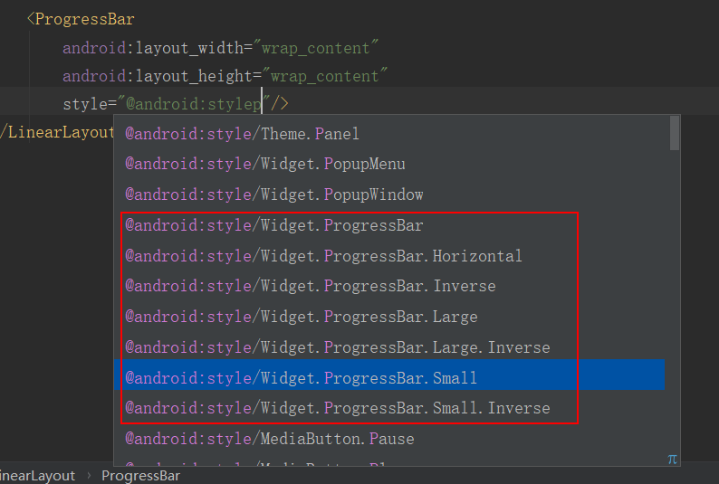

自定义样式

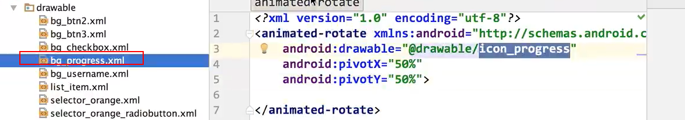


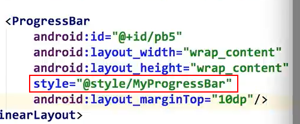

### 进度条

```xml
<ProgressBar
        android:layout_width="match_parent"
        android:layout_height="wrap_content"
        android:id="@+id/pb4"
        style="@android:style/Widget.Material.ProgressBar.Horizontal"
        android:max="100"  //进度条长度
        android:progress="10"  //当前进度
        android:secondaryProgress="30"  //二级进度
        tools:ignore="NewApi" />
```


实现进度条加载功能

```java
public class ProgressBarActivity extends AppCompatActivity {

    private Button button;
    private ProgressBar progressBar;
    @Override
    protected void onCreate(Bundle savedInstanceState) {
        super.onCreate(savedInstanceState);
        setContentView(R.layout.activity_progress_bar);

        progressBar = findViewById(R.id.pb3);
        button = findViewById(R.id.pb_btn);//按钮点击开始加载
        button.setOnClickListener(new View.OnClickListener() {
            @Override
            public void onClick(View view) {
                handler.sendEmptyMessage(0);//像handler发送消息
            }
        });
    }

    Handler handler = new Handler(){
        @Override
        public void handleMessage(@NonNull Message msg) {
            super.handleMessage(msg);
            if(progressBar.getProgress()<100){
                handler.postDelayed(runnable,500);//进行处理，如果进度小于100，则0.5s延迟后发送给runnable

            }else {
                ToastUtil.showMsg(ProgressBarActivity.this,"加载成功");
            }
        }
    };

    Runnable runnable = new Runnable() {
        @Override
        public void run() {
            progressBar.setProgress(progressBar.getProgress()+5);//加载进度条
            handler.sendEmptyMessage(0);//继续发送消息给handler
        }
    };
}
```


### progressdialog

```java
button2.setOnClickListener(new View.OnClickListener() {
            @Override
            public void onClick(View view) {
                ProgressDialog progressDialog = new ProgressDialog(ProgressBarActivity.this);
                progressDialog.setTitle("Tips");
                progressDialog.setMessage("加载中");
                
                //点击其他地方不得取消，若实际中加载完成可调用progressDialog.dismiss();
                progressDialog.setCancelable(false);
                progressDialog.show();
            }
        });
```

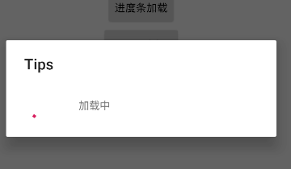

### 自定义进度条

```java
button3.setOnClickListener(new View.OnClickListener() {
    @Override
    public void onClick(View view) {
        final ProgressDialog progressDialog = new ProgressDialog(ProgressBarActivity.this);
        progressDialog.setProgressStyle(ProgressDialog.STYLE_HORIZONTAL);
        progressDialog.setTitle("tips");
        progressDialog.setMessage("加载中");
        progressDialog.setButton(DialogInterface.BUTTON_POSITIVE, "取消", new DialogInterface.OnClickListener() {
            @Override
            public void onClick(DialogInterface dialogInterface, int i) {
                progressDialog.dismiss();
            }
        });
        progressDialog.show();
        progressDialog.setProgress(10);
    }
});
```

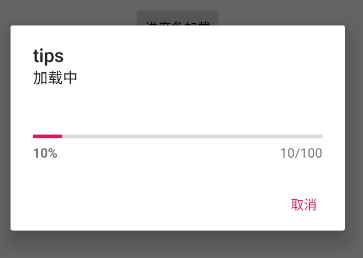

## 14.Viewpager

> [Android之viewpager](https://cloud.tencent.com/developer/article/2108418)

### (1)viewpager1

#### 介绍使用

> [viewpager详解](https://juejin.cn/post/6844903544093409293)

viewpager是实现轮播图、引导页、图片画廊的常用工具，允许滑动屏幕，并且每个页面是不同的fragment

#### **常用的方法：**

> `setAdapter(PagerAdapter adapter)` 设置适配器
>
> **`setOffscreenPageLimit(int limit)` 设置缓存的页面个数,默认是 1**
>
> `setCurrentItem(int item)` 跳转到特定的页面
>
> `setOnPageChangeListener(..)` 设置页面滑动时的监听器（现在API中建议使用 `addOnPageChangeListener(..)`）
>
> `setPageTransformer(..PageTransformer)` 设置页面切换时的动画效果
>
> `setPageMargin(int marginPixels)` 设置不同页面之间的间隔
>
> `setPageMarginDrawable(..)` 设置不同页面间隔之间的装饰图也就是 divide ，要想显示设置的图片，需要同时设置 `setPageMargin()


#### **PagerAdapter**

ViewPager有两个适配器（`FragmentStatePagerAdapter`和`FragmentPagerAdapter`），均继承自PagerAdapter。如果要实现子类，需要继承并实现方法

> **两者区别：**
>
> - **FragmentStatePagerAdapter不可以缓存**： 会销毁不再需要的 fragment，当前事务提交以后，会彻底的将 fragmeng 从当前 Activity 的FragmentManager 中移除。
>
>   **state 表明**，销毁时，会将其 `onSaveInstanceState(Bundle outState)` 中的 bundle 信息保存下来，当用户切换回来，可以通过该 bundle 恢复生成新的 fragment，也就是说，你可以在 `onSaveInstanceState(Bundle outState)` 方法中保存一些数据，在 onCreate 中进行恢复创建。
>
> - **FragmentPagerAdapter可以缓存** ： 对于不再需要的 fragment，选择调用 onDetach() 方法，仅销毁视图，并不会销毁 fragment 实例。
>
> > 使用 FragmentStatePagerAdapter 更省内存，但是销毁后新建也是需要时间的。
> >
> > 一般情况下，如果你是制作主页面，就 3、4 个 Tab，那么可以选择使用 FragmentPagerAdapter，如果是用 ViewPager 展示数量特别多的条目时，那么建议使用 FragmentStatePagerAdapter。

- `getCount();` 是获取当前窗体界面数，也就是数据的个数。

- `isViewFromObject(View view, Object object);` 这个方法用于判断是否由对象生成界面，官方建议直接返回 `return view == object;`。

- `instantiateItem(View container, int position);` 要显示的页面或需要缓存的页面，会调用这个方法进行布局的初始化。

- `destroyItem(ViewGroup container, int position, Object object);` 如果页面不是当前显示的页面也不是要缓存的页面，会调用这个方法，将页面销毁。
- `public Fragment getItem(int position)` 返回的是对应的 Fragment 实例，一般我们在使用时，会通过构造传入一个要显示的 Fragment 的集合，我们只要在这里把对应的 Fragment 返回就行了。

两个adapter都将每个页面表示为一个Fragment，并且每个Fragment都保存到[FragmentManager](#fragmentmanager)中


#### 结合TabLayout+Fragment

- 初始化 TabLayout 和 ViewPager 后只要通过调用 TabLayout 的 `tabLayout.setupWithViewPager(viewPager)` 方法就将两者绑定在一起了。
- 重写 PagerAdapter 的 `public CharSequence getPageTitle(int position)` 方法，而 TabLayout 也正是通过 `setupWithViewPager()` 方法底部会调用 PagerAdapter 中的`getPageTitle()` 方法来实现联动的。


#### 懒加载

viewpager1默认没有实现懒加载，需要自定义

> [懒加载](#lazyload)

### (2)viewpager2

> https://blog.csdn.net/YoungOne2333/article/details/130140166

#### **适配器**

ViewPager2的适配器可以使用**`FragmentStateAdapter`或`RecyclerView.Adapter`** 

```java
public class MyPagerAdapter extends FragmentStateAdapter{

    private List<Fragment> fragmentList;

    public MyPagerAdapter(@NonNull FragmentManager fragmentManager, @NonNull Lifecycle lifecycle, List<Fragment> list) {
        super(fragmentManager, lifecycle);
        fragmentList = list;
    }

    @NonNull
    @Override
    public Fragment createFragment(int position) {
        return fragmentList.get(position);
    }

    @Override
    public int getItemCount() {
        return fragmentList.size();
    }
}
```


#### **绑定Tablayout**

```java
new TabLayoutMediator(tabLayout, viewPager, (tab, position) -> {
    tab.setText("tab"+position);//设置tab的名字
}).attach();
```


### (3)viewpager1和viewpager2

> https://blog.csdn.net/qq_40840459/article/details/132402056
>
> https://www.jianshu.com/p/924046eae137

- **实现方式**
  ViewPager2的内部实现是`RecyclerView`，而ViewPager是通过继承自`ViewGroup`实现的。因此，ViewPager2的性能更高。

- **滑动方向**
  ①ViewPager2支持横向和竖向滑动，而ViewPager只能横向滑动。

  ②Adapter：`ViewPager2`只有一个适配器：`FragmentStateAdapter`(继承自RecyclerView.Adapter)。

  ​					`ViewPager`有两个适配器：`FragmentStatePagerAdapter`和`FragmentPagerAdapter`，均继承自`PagerAdapter`。FragmentStatePagerAdapter不可以缓存，而FragmentPagerAdapter可以缓存。
  
- **懒加载**
  ViewPager2内部实现了懒加载，默认不进行预加载，通过Lifecycle对Fragment的生命周期进行管理。而ViewPager需要自己实现懒加载。

  > 通过打印日志发现，viewpager2只有在滑动到某个fragment时候才会调用onCreate和onresume等方法

- **功能支持**
  ViewPager2提供了一些新的功能，如从`右到左（RTL）的布局`支持和`停用用户输入（setUserInputEnabled、isUserInputEnabled）`的功能。


### (4)问题

#### **滑动问题**

**取消滑动动画**，通常在点击tablayout的tab时候，实现无动画滑动到对应页面

```java
public class MyViewPager extends ViewPager {
    public MyViewPager(@NonNull Context context) {
        super(context);
    }

    public MyViewPager(@NonNull Context context, @Nullable AttributeSet attrs) {
        super(context, attrs);
    }

    @Override
    public void setCurrentItem(int item) {
        super.setCurrentItem(item,false);//禁止滑动动画
    }
}
```


#### **页面缓存、预加载、懒加载**

##### **预加载**

为了让用户在切换过程中不卡顿，安卓官方默认创建当前item时，会创建第二个item，确保用户滑动时第二个item已经被创建，保持viewpager的平滑移动的效果。所以实现了预加载。 

**ViewPager 在默认情况下会预加载左右两侧的页面，也就是viewPager.setOffscreenPageLimit(1)默认值为1**

> `viewPager.setOffscreenPageLimit(int size)`方法用于设置ViewPager在闲置状态下**保留在当前页面两侧的页面数**。例如设置为2的话，会在左右两侧各缓存2个页面。
>
> 该方法有以下作用：
>
> - **提高页面切换的流畅度。**当用户快速滑动页面时，ViewPager可以提前加载相邻页面，从而避免页面切换时出现卡顿现象。
>
> - **减少内存消耗**。当页面数量较多时，ViewPager可以销毁超出限制的页面，从而减少内存占用。

 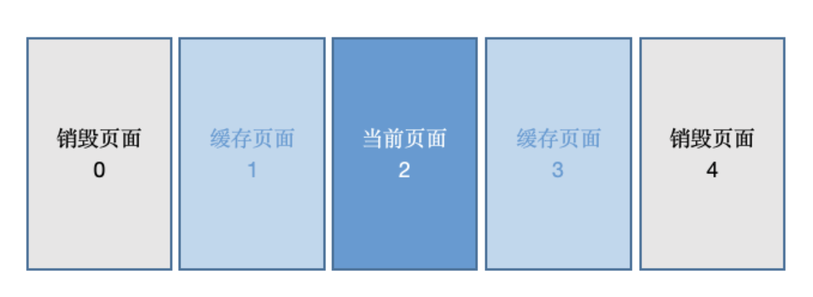 


##### <a name=lazyload>懒加载</a>

> https://blog.csdn.net/yxf0448/article/details/110001314
>
> https://juejin.cn/post/6844903895790157838#heading-6

如果预加载多个页面的时，由于预加载的原因，多个页面同时会对网络进行请求，造成流量浪费，卡顿等问题，**懒加载解决的问题就是让页面上一些信息进行延迟加载，不至于同时进行太多并发的请求等** 

> **viewpager1需要自定义实现懒加载，而viewpager2默认是实现了懒加载**

###### **两种实现方式**

**①利用fragment的`setUserVisibleHint`**

- Fragment中有一个`setUserVisibleHint(boolean isVisibleToUser)`方法，这个方法就是告诉用户，UI对用户是否可见，可以做懒加载初始化操作。 
- 因为预加载已经将fragment的生命周期执行完毕，因此可以使用一个占位视图 ViewStub，当真正跳转到该页时，执行ViewStub.inflate()方法，加载真正的数据视图和请求数据。 
- 当某一页超出可视范围和预加载范围，那么它将会被销毁，FragmentStatePagerAdapter销毁整个Fragment, 我们可以自己保存该Fragment,或使用FragmentPagerAdapter让FragmentTransition来保留Fragment的引用。虽然这样，但是它的周期方法已经走完，那么我们只能手动的保存Fragment根View的引用，当再次重新进入新的声明周期方法时，返回原来的View

**实现要点：**

- 因为 `setUserVisibleHint()`，会在`onCreateView()`之前执行，当fragment 从可见到不见，或者从不可见切换到可见，都会调用此方法，所以可以用它来判断是否可以加载数据

- 需要在`onActivityCreated()`及`setUserVisibleHint()`方法中都调了一次`lazyLoad()`方法。如果仅仅在`setUserVisibleHint()`调用`lazyLoad()`，当默认首页首先加载时会导致viewPager的首页第一次展示时没有数据显示，切换一下才会有数据。因为首页fragment的`setUserVisible()`在`onActivityCreated()`之前调用，此时isPrepared为false 导致首页fragment 没能调用onLazyLoad()方法加载数据。

```java
/**
 * <pre>
 *     @author yangchong
 *     blog  : https://github.com/yangchong211
 *     time  : 2017/7/22
 *     desc  : 懒加载
 *     revise: 懒加载时机：onCreateView()方法执行完毕 + setUserVisibleHint()方法返回true
 * </pre>
 */
public abstract class BaseLazyFragment extends BaseFragment {

    /*
     * 预加载页面回调的生命周期流程：
     * setUserVisibleHint() -->onAttach() --> onCreate()-->onCreateView()-->
     *              onActivityCreate() --> onStart() --> onResume()
     */

    /**
     * 是否懒加载过
     */
    protected boolean isLazyLoaded = false;
    /**
     * Fragment的View加载完毕的标记
     */
    private boolean isPrepared = false;

    /**
     * 第一步,改变isPrepared标记
     * 当onViewCreated()方法执行时,表明View已经加载完毕,此时改变isPrepared标记为true,并调用lazyLoad()方法
     */
    @Override
    public void onActivityCreated(@Nullable Bundle savedInstanceState) {
        super.onActivityCreated(savedInstanceState);
        isPrepared = true;
        //只有Fragment onCreateView好了
        //另外这里调用一次lazyLoad(）
        lazyLoad();
    }


    /**
     * 第二步
     * 此方法会在onActivityCreated之前执行
     * 当viewPager中fragment改变可见状态时也会调用
     * 当fragment 从可见到不见，或者从不可见切换到可见，都会调用此方法
     * true表示当前页面可见，false表示不可见
     */
    @Override
    public void setUserVisibleHint(boolean isVisibleToUser) {
        super.setUserVisibleHint(isVisibleToUser);
        LogUtil.d("setUserVisibleHint---"+isVisibleToUser);
        //只有当fragment可见时，才进行加载数据
        if (isVisibleToUser){
            lazyLoad();
        }
    }

    /**
     * 调用懒加载
     * 第三步:在lazyLoad()方法中进行双重标记判断,通过后即可进行数据加载
     */
    private void lazyLoad() {
        if (getUserVisibleHint() && isPrepared && !isLazyLoaded) {
            showFirstLoading();
            onLazyLoad();
            isLazyLoaded = true;
        } else {
            //当视图已经对用户不可见并且已经开始加载数据，在切换到其他页面时停止加载数据，可以覆写stopLoad
            if (isLazyLoaded) {
                stopLoad();
            }
        }
    }

    /**
     * 视图销毁的时候讲Fragment是否初始化的状态变为false
     */
    @Override
    public void onDestroyView() {
        super.onDestroyView();
        isLazyLoaded = false;
        isPrepared = false;
    }

    /**
     * 第一次可见时，操作该方法，可以用于showLoading操作，注意这个是全局加载loading
     */
    protected void showFirstLoading() {
        LogUtil.i("第一次可见时show全局loading");
    }

    /**
     * 停止加载
     * 当视图已经对用户不可见并且加载过数据，但是没有加载完，而只是加载loading。
     * 如果需要在切换到其他页面时停止加载数据，可以覆写此方法。
     * 存在问题，如何停止加载网络
     */
    protected void stopLoad(){

    }

    /**
     * 第四步:定义抽象方法onLazyLoad(),具体加载数据的工作,交给子类去完成
     */
    @UiThread
    protected abstract void onLazyLoad();
}
```


**②AndroidX利用Lifecycle**

给 `FragmentStatePagerAdapter` 添加了一个 `@Behavior int behavior` 的参数，调用的时候使用

其本质就是内部帮你处理和切换MaxLifecycle：

> mCurTransaction.setMaxLifecycle(fragment, Lifecycle.State.STARTED); 走到started生命周期
> mCurTransaction.setMaxLifecycle(fragment, Lifecycle.State.RESUMED)；走到resumed生命周期

```kotlin
mBinding.viewPager.bindFragment(
    supportFragmentManager,
    listOf(LazyLoad1Fragment.obtainFragment(), LazyLoad2Fragment.obtainFragment(), LazyLoad3Fragment.obtainFragment()),
    listOf("Demo1", "Demo2", "Demo3"),
    behavior = 1 //添加behavior参数
)
```

之后再fragment的`onResume`回调加载数据即可，不用单独实现懒加载fragment

```kotlin
class LazyLoad3Fragment : BaseVDBLoadingFragment<EmptyViewModel, FragmentDemo2Binding>() {

    var isLoaded = false

    companion object {
        fun obtainFragment(): LazyLoad3Fragment {
            return LazyLoad3Fragment()
        }
    }
    override fun startObserve() {
    }

    override fun init() {
        YYLogUtils.w("LazyLoad3Fragment - init")
    }

    private fun initData() {
        YYLogUtils.w("LazyLoad3Fragment - initData")
        //模拟的Loading的情况
        showStateLoading()

        CommUtils.getHandler().postDelayed({

            showStateSuccess()

        }, 2500)

        isLoaded = true
    }

    override fun onResume() {
        super.onResume()
        YYLogUtils.w("LazyLoad3Fragment - onResume")
        if (!isLoaded) initData()//加载数据
    }
}
```


## 15.Adapter View

### 	(1)ListView

> [ListView](https://www.cnblogs.com/lyw-hunnu/p/12687201.html)

#### Adapter

ListView的setAdapter方法可以传入一个ListAdapter对象，实现了ListAdapter的类包括

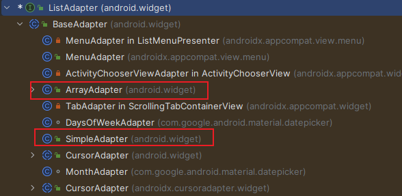

##### ArrayAdapter

数据类型只能是简单的字符串。

##### SimpleAdapter


#### ListView子项的缓存机制

ListView的缓存有两级，ListView里面有一个内部类 RecycleBin，RecycleBin有两个对象Active View和Scrap View来管理缓存，Active View是第一级，Scrap View是第二级。

- **Active View**：是缓存在屏幕内的ItemView，当列表数据发生变化时，屏幕内的item可以直接拿来复用，无须进行数据绑定。

- **Scrap view**：缓存划出屏幕外的ItemView，这里所有的缓存的数据都是"脏的"，也就是数据需要重新绑定，因此屏幕外的所有数据在进入屏幕的时候都要走一遍`getView()`方法。
 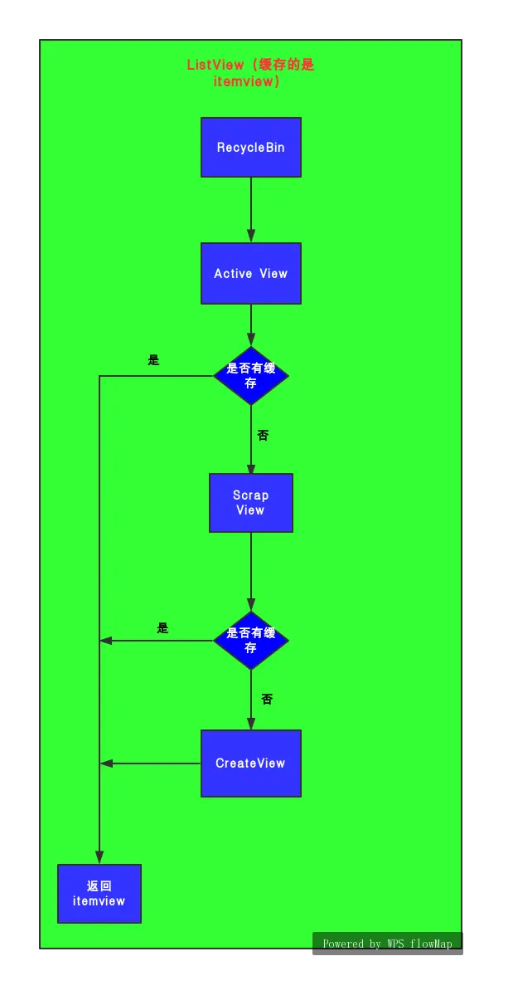
> 当Active View和Scrap View中都没有缓存的时候就会create view。

##### 复用

如果屏幕只能显示5个Item，那么ListView会创建`5+1`个Item视图；当第1个item完全离开屏幕后才会回收至缓存从而复用，用于显示第7个Item

 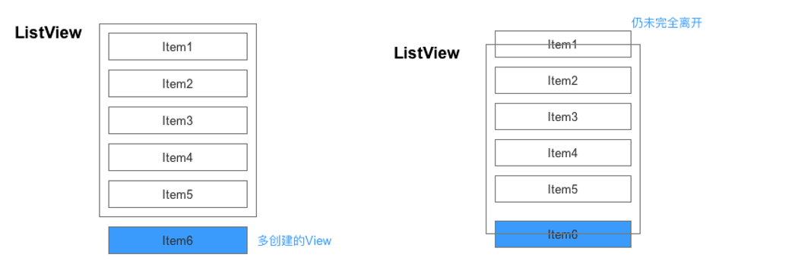 

 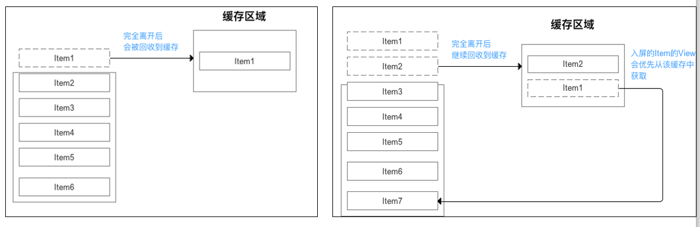 


### 	(2)RecyclerView

功能：灵活实现大数据集展示，能够显示列表、网格、瀑布流等形式，且不同的ViewHolder能够实现item多元化的功能。

> 详情参考文章--
>
> https://blog.csdn.net/KEVINYAHNG/article/details/119722494
>
> 官方文档--
>
> https://developer.android.google.cn/guide/topics/ui/layout/recyclerview

#### 1）实现

添加recyclerView组件

```xml
<androidx.recyclerview.widget.RecyclerView
       android:layout_width="match_parent"
       android:layout_height="wrap_content"
       android:id="@+id/rv1">
</androidx.recyclerview.widget.RecyclerView>
```

```java
private RecyclerView recyclerView;
@Override
protected void onCreate(Bundle savedInstanceState) {
    super.onCreate(savedInstanceState);
    setContentView(R.layout.activity_recyview);
    recyclerView = findViewById(R.id.rv1);
    LinearLayoutManager lm = new LinearLayoutManager(recyviewActivity.this)//添加布局管理器
    lm.setOrientation(LinearLayoutManager.VERTICAL);//设置布局方向
    
    recyclerView.setLayoutManager(lm);//声明布局管理器，默认垂直
}
```

创建Adapter

> 关于adapter：①https://www.jianshu.com/p/ba6db19b9353

**（recyclerview是用于展示大量数据的，但数据无法直接传给recyclerview用的，adapter适配器就是为此而存在的）** 

新建每个item的布局文件：

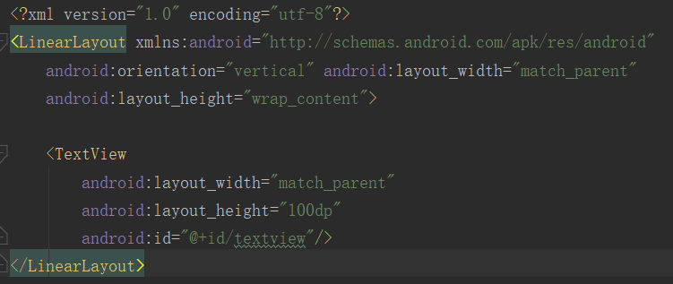

```java
//自定义adapter
public class LinearAdapter extends RecyclerView.Adapter<LinearAdapter.LinearViewHolder> {

    private Context context;//父activity的context
    private List<Item> itemList;//数据
    public LinearAdapter(Context context,List<Item> itemList){
        this.context = context;
        this.itemList = itemList;
    }
    @NonNull
    @Override
    //用于加载 RecyclerView 子项的布局，然后返回一个 ViewHolder 对象，ViewHolder 是一个静态内部类，继承自 RecyclerView.ViewHolder 类。
    public LinearAdapter.LinearViewHolder onCreateViewHolder(@NonNull ViewGroup parent, int viewType) {
        return new LinearViewHolder(LayoutInflater.from(context).inflate(R.layout.linear_item,parent,false));//加载试图传给viewholder
    }

    @Override
    //为子项绑定数据。调用这两个方法后，子项就既有了布局又有了数据。
    public void onBindViewHolder(@NonNull LinearAdapter.LinearViewHolder holder, int position) {
        holder.textView.setText(itemList.get(position));//每个item是一个textview，为textview添加数据
    }

    @Override
    //用于获取 RecyclerView 一共有多少子项.
    public int getItemCount() {
        return itemList.size();
    }

    class LinearViewHolder extends RecyclerView.ViewHolder {

        private TextView textView;
        public LinearViewHolder(@NonNull View itemView) {
            super(itemView);
            textView = itemView.findViewById(R.id.textview);
        }
    }
}
```


在activity中绑定adapter

```java
private RecyclerView recyclerView;
@Override
protected void onCreate(Bundle savedInstanceState) {
    super.onCreate(savedInstanceState);
    setContentView(R.layout.activity_recyview);
    recyclerView = findViewById(R.id.rv1);
    recyclerView.setLayoutManager(new LinearLayoutManager(recyviewActivity.this));
    
    recyclerView.setAdapter(new LinearAdapter(recyviewActivity.this));//绑定adapter
}
```

运行结果图：

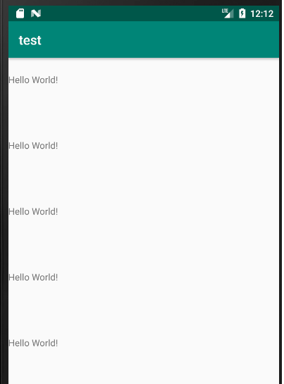

还可以加分割线以及点击事件：

#### 2）加载多个ViewHolder

> github上有一个封装了RecyclerView的库，封装了更多的功能
>
> 


有可能RycylerView的item可能会加载不同的视图，因此不同视图要创建不同的viewholder用来加载不同的视图。

首先建立多个item的布局

```xml
<?xml version="1.0" encoding="utf-8"?>
<LinearLayout xmlns:android="http://schemas.android.com/apk/res/android"
    android:orientation="vertical"
    android:layout_width="match_parent"
    android:layout_height="wrap_content"
    android:paddingLeft="1dp"
    android:paddingRight="1dp">

    <TextView
        android:layout_width="match_parent"
        android:layout_height="wrap_content"
        android:id="@+id/textview"
        android:background="#fff"
        android:gravity="center"
        android:text="梦比优斯"
        android:textSize="30dp"/>

    <ImageView
        android:layout_width="wrap_content"
        android:layout_height="328dp"
        android:src="@drawable/ultraman"
        android:scaleType="centerCrop"
        android:id="@+id/img_view3"/>
</LinearLayout>
```


```xml
<?xml version="1.0" encoding="utf-8"?>
<LinearLayout xmlns:android="http://schemas.android.com/apk/res/android"
    android:orientation="vertical"
    android:layout_width="match_parent"
    android:layout_height="wrap_content"
    android:paddingLeft="1dp"
    android:paddingRight="1dp">

    <TextView
        android:layout_width="match_parent"
        android:layout_height="100dp"
        android:id="@+id/textview"
        android:background="#fff"
        android:gravity="center"/>
</LinearLayout>
```


3.更新adapter

```java
//由于创建多个viewHolder，所以adapter里面都使用RecyclerView自带的ViewHolder
public class LinearAdapter extends RecyclerView.Adapter<RecyclerView.ViewHolder > {

    /**/
    private Context context;
    public LinearAdapter(Context context){
        this.context = context;
    }
    @NonNull
    @Override
    public RecyclerView.ViewHolder  onCreateViewHolder(@NonNull ViewGroup parent, int viewType) {
        if(viewType == 1){//根据viewType确定加载哪一个viewholder
            return new LinearViewHolder(LayoutInflater.from(context).inflate(R.layout.linear_item,parent,false));//
        }else {
            return new LinearViewHolder2(LayoutInflater.from(context).inflate(R.layout.linear_item_2,parent,false));
        }

    }

    @Override
    public void onBindViewHolder(@NonNull RecyclerView.ViewHolder  holder, int position) {
        if(getItemViewType(position) == 1){//奇数数据，加载viewtype为1的viewholder
            ((LinearViewHolder)holder).textView.setText("Hello World!");
        }else{//偶数数据，加载viewtype为2的viewholder
            ((LinearViewHolder)holder).textView.setText("梦比优斯");
            ((LinearViewHolder)holder).imageView.setImageURI("图片地址");
        }

    }

    //重写此方法，通过position获得他的viewtype
    //在调用onCreateViewHolder之前会调用该回调，获取viewtype
    @Override
    public int getItemViewType(int position) {
        if (position % 2 != 0) {
            return 1;
        }else {
            return 0;
        }
    }

    @Override
    public int getItemCount() {
        return 30;
    }

    class LinearViewHolder extends RecyclerView.ViewHolder {

        private TextView textView;
        public LinearViewHolder(@NonNull View itemView) {
            super(itemView);
            textView = itemView.findViewById(R.id.textview);
        }
    }
    class LinearViewHolder2 extends RecyclerView.ViewHolder {

        private TextView textView;
        private ImageView imageView;
        public LinearViewHolder2(@NonNull View itemView) {
            super(itemView);
            textView = itemView.findViewById(R.id.textview);//找到文字
            imageView = itemView.findViewById(R.id.img_view3);//找到图片
        }
    }
}

```

结果图：


#### 3）瀑布流形式展示

创建RecyclerView

```xml
 <androidx.recyclerview.widget.RecyclerView
        android:layout_width="match_parent"
        android:layout_height="wrap_content"
        android:id="@+id/rv_pu">
 </androidx.recyclerview.widget.RecyclerView>
```

创建recyclerview的子控件

```xml
<?xml version="1.0" encoding="utf-8"?>
<LinearLayout xmlns:android="http://schemas.android.com/apk/res/android"
    android:orientation="vertical"
    android:layout_width="match_parent"
    android:layout_height="wrap_content"
    android:paddingLeft="1dp"
    android:paddingRight="1dp">

    <ImageView
        android:layout_width="wrap_content"
        android:layout_height="wrap_content"
        android:id="@+id/iv"
        android:scaleType="centerCrop"/>
</LinearLayout>
```

activity

```java
public class RVpubuActivity extends AppCompatActivity {

    private RecyclerView recyclerView;
    @Override
    protected void onCreate(Bundle savedInstanceState) {
        super.onCreate(savedInstanceState);
        setContentView(R.layout.activity_rvpubu);
        recyclerView = findViewById(R.id.rv_pu);
        recyclerView.setLayoutManager(new StaggeredGridLayoutManager(3,StaggeredGridLayoutManager.VERTICAL));//有多少列，排列方式
        recyclerView.addItemDecoration(new MyDecoration());
        recyclerView.setAdapter(new StaggerAdapter(RVpubuActivity.this));

    }
    //改变item之间的间距
    class MyDecoration extends RecyclerView.ItemDecoration{
        @Override
        public void getItemOffsets(@NonNull Rect outRect, @NonNull View view, @NonNull RecyclerView parent, @NonNull RecyclerView.State state) {
            super.getItemOffsets(outRect, view, parent, state);
            int gap = getResources().getDimensionPixelSize(R.dimen.dividerHeight2);//获取间距
            outRect.set(gap,gap,gap,gap);
        }
    }
}
```

adapter

```java
package com.example.test.RecyclerView;

import android.content.Context;
import android.view.LayoutInflater;
import android.view.View;
import android.view.ViewGroup;
import android.widget.ImageView;
import android.widget.TextView;

import androidx.annotation.NonNull;
import androidx.recyclerview.widget.RecyclerView;

import com.example.test.R;

public class StaggerAdapter extends RecyclerView.Adapter<StaggerAdapter.LinearViewHolder>{
    /**/
    private Context context;
    public StaggerAdapter(Context context){
        this.context = context;
    }
    @NonNull
    @Override
    public StaggerAdapter.LinearViewHolder onCreateViewHolder(@NonNull ViewGroup parent, int viewType) {
        return new StaggerAdapter.LinearViewHolder(LayoutInflater.from(context).inflate(R.layout.stagger_rv_item,parent,false));//
    }

    @Override
    public void onBindViewHolder(@NonNull StaggerAdapter.LinearViewHolder holder, int position) {
       if(position %2 != 0) {
            holder.imageView.setImageResource(R.drawable.ultraman);//为图片添加路径
        }else {
            holder.imageView.setImageResource(R.drawable.jack);
        }
    }

    @Override
    public int getItemCount() {
        return 30;//子项目个数
    }

    class LinearViewHolder extends RecyclerView.ViewHolder {

        private ImageView imageView;
        public LinearViewHolder(@NonNull View itemView) {
            super(itemView);
            imageView = itemView.findViewById(R.id.iv);//找到对应的控件
        }
    }
}
```

效果:


#### 4）水平布局和网格布局

##### 实现水平视图

创建recyclerView

```xml
<androidx.recyclerview.widget.RecyclerView
        android:layout_width="wrap_content"
        android:layout_height="wrap_content"
        android:id="@+id/rv_hor"
        >
</androidx.recyclerview.widget.RecyclerView>
```

**设置分隔线**

在values下创建配置文件

```xml
<?xml version="1.0" encoding="utf-8"?>
<resources>
    <dimen name="dividerHeight">1dp</dimen>
</resources>
```

activity完整代码:

```java
public class HorRVActivity extends AppCompatActivity {

    private RecyclerView recyclerView;
    @Override
    protected void onCreate(Bundle savedInstanceState) {
        super.onCreate(savedInstanceState);
        setContentView(R.layout.activity_hor_rv);

        recyclerView = findViewById(R.id.rv_hor);
        LinearLayoutManager linearLayoutManager = new LinearLayoutManager(HorRVActivity.this);
        linearLayoutManager.setOrientation(RecyclerView.HORIZONTAL);//设置方向为水平
        recyclerView.setLayoutManager(linearLayoutManager);
        recyclerView.addItemDecoration(new MyDecoration());
        recyclerView.setAdapter(new LinearAdapter(HorRVActivity.this));
    }

    class MyDecoration extends RecyclerView.ItemDecoration{
        @Override
        public void getItemOffsets(@NonNull Rect outRect, @NonNull View view, @NonNull RecyclerView parent, @NonNull RecyclerView.State state) {
            super.getItemOffsets(outRect, view, parent, state);
            outRect.set(0,0,getResources().getDimensionPixelOffset(R.dimen.dividerHeight),0);
            //if(parent.getChildAdapterPosition(view)!=0){
               //outRect.right = 20;
            //}
        }
    }
}
```

结果图

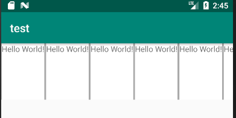

##### 实现网格视图

布局管理器设置为网格布局

```java
public class GridRVActivity extends AppCompatActivity {

    private RecyclerView recyclerView;
    @Override
    protected void onCreate(Bundle savedInstanceState) {
        super.onCreate(savedInstanceState);
        setContentView(R.layout.activity_grid_rv);
        recyclerView = findViewById(R.id.rv_grid);
        recyclerView.setLayoutManager(new GridLayoutManager(GridRVActivity.this,3));//一行展示三个
        recyclerView.setAdapter(new LinearAdapter(GridRVActivity.this));
    }
}
```

效果：


#### 5）复用

##### 	复用


**上图比较清晰的画出了viewholder复用过程**

图中两条线就是屏幕的上下边缘，屏幕能加载显示的内容就是item1~item7。

当控制屏幕向下滚动时，屏幕上的变化是：

- item1离开了屏幕，紧接着item8进入了屏幕。
- 当item1离开屏幕时，它会进入Recycler(反复循环器)构件，然后被放到缓存区，然后复用为item8。


##### viewholder中view错乱

**图片错乱：**

由于复用的原因，时常会导致item中view错乱（前面提到的脏数据，需要重新绑定），例如以下代码：

```java 
public class MyRecyclerAdapter extends RecyclerView.Adapter<MyRecyclerAdapter.MyViewHolder> {
    private static final String TAG = "MyRecyclerAdapter";

    private List<String> mData;
    private Context mContext;
    private LayoutInflater inflater;

    public MyRecyclerAdapter(Context context, List<String> data) {
        this.mContext = context;
        this.mData = data;
        inflater = LayoutInflater.from(mContext);
    }

    @Override
    public int getItemCount() {
        return mData.size();
    }

    @Override
    public void onViewRecycled(MyViewHolder holder) {
        super.onViewRecycled(holder);
        Log.d(TAG, "onViewRecycled: "+holder.imageView.getTag().toString()+", position: "+holder.getAdapterPosition());
    }

    @Override
    public void onBindViewHolder(final MyViewHolder holder, final int position) {
        Log.d(TAG, "onBindViewHolder: 验证是否重用了");
        Log.d(TAG, "onBindViewHolder: 重用了"+holder.imageView.getTag());
        Log.d(TAG, "onBindViewHolder: 放到了"+mData.get(position));
        holder.imageView.setTag(mData.get(position));
        //异步加载一张网络图片
        new AsyncTask<Void, Void, Bitmap>() {
            @Override
            protected Bitmap doInBackground(Void... params) {
                try {
                    URL url = new URL(mData.get(position));
                    Bitmap bitmap = BitmapFactory.decodeStream(url.openStream());
                    return bitmap;
                } catch (MalformedURLException e) {
                    e.printStackTrace();
                } catch (IOException e) {
                    e.printStackTrace();
                }
                return null;
            }

            @Override
            protected void onPostExecute(Bitmap bitmap) {
                super.onPostExecute(bitmap);
                holder.imageView.setImageBitmap(bitmap);
            }
        }.execute();
    }

    @Override
    public MyViewHolder onCreateViewHolder(ViewGroup parent, int viewType) {
        Log.d(TAG, "onCreateViewHolder");
        View view = inflater.inflate(R.layout.item_layout, parent, false);
        return new MyViewHolder(view);
    }

    static class MyViewHolder extends RecyclerView.ViewHolder {

        ImageView imageView;

        public MyViewHolder(View view) {
            super(view);
            imageView = (ImageView) view.findViewById(R.id.id_img);
        }

    }
}
```

> **onViewRecycled**
>
> 当一个 ViewHolder 不再与特定的数据关联或者不再显示在屏幕上时，RecyclerView 会将其放入缓存池中，以备后续重新使用。在 ViewHolder 被放入缓存池之前，RecyclerView 会调用 `onViewRecycled` 方法来通知这个 ViewHolder 即将被回收。
>
> 在这个方法中，可以执行一些清理工作，比如停止动画、取消网络请求或释放其他资源等。 

**场景A：**

1.第一次运行，RecyclerView载入，不做任何触摸操作
2.Adapter经过onCreateViewHolder()创建了上面能看到的8个ViewHolder对象，并且在onBind时启动了8条线程加载图片
3.8张图片全部加载完毕，并且显示到对应的ImageView上
4.控制屏幕向下滚动，第1、第2个item离开屏幕可视区域，第9、第10个item进入屏幕可视区域
5.第1、第2个item被回收，重用到第9、第10个item。第9、第10个item显示的图片是第1和第2个item的图片！！！
6.开启了两条线程，加载第9、第10张图片。等待几秒，第9、第10个item显示的图片突然变成了正确的图片！

**以上过程是场景A，如果当前网络速度很快，第6个步骤的加载速度在1秒甚至0.5秒内，就会造成人眼看到的图片闪烁问题出现，第9、第10个item的图片闪了一下变成了正确的图片。**

-------------------------------------------------------------------------------------------------------

**场景B:**

1.第一次运行，RecyclerView载入
2.Adapter经过onCreateViewHolder()创建了上面的8个ViewHolder对象，并且在onBind时启动了8条线程加载图片
3.7张图片加载完毕，还有1张未加载完(已知图片一加载速度异常慢)
4.控制屏幕向下滚动，第1、第2个item离开屏幕可视区域，第9、第10个item进入屏幕可视区域
5.第1、第2个item被回收，重用到第9、第10个item。闪烁问题不再重复说，第9、第10张图片加载完毕(看上去一切正常)
6.等待几秒，第一张图片终于加载完成，第9个item突然从正确的图片九变成不正确的图片一 ！！！

以上过程是场景B，问题出现在加载第一张图片的线程T，持有了item1的ImageView对象引用，而这张图片加载速度非常慢，直到item1已经被重用到item9后，过了一段时间，线程T才把图片一加载出来，并设置到item1的ImageView上，然而线程T并不知道item1已经不存在且变成了item9，于是，图片发生错乱了。

---------------------------------------------------------------------------------------------------------

**场景C：**

1.第一次运行，RecyclerView载入
2.Adapter经过onCreateViewHolder()创建了上面我们能看到的8个ViewHolder对象，并且在onBind时启动了8条线程加载图片
3.忽略图片加载情况，直接向下滚动，再向上滚动，再向下滚动，来回操作
4.由于离开了屏幕的item是随机被回收并重用的，所以向下滚动时我们假设item1、item3被回收重用到item9、item10，item2、item4被回收重用到item11、item12
5.向上滚动时，item9、item12被回收重用到item1、item2，item10、item11被回收重用到item3、item4
6.多次上下滚动后，停下，最后发现某一个item的图片在不停变化，最后还不一定是正确的图片

以上过程是场景C，问题出现在**ViewHolder的回收重用顺序是随机**的，**回收时会从离开屏幕范围的item中随机回收，并分配给新的item**，来回操作数次，就会造成有多条加载不同图片的线程，持有同一个item的ImageView对象，造成最后在同一个item上图片变来变去，错乱更加严重。

---------------------------------------------------------------------------------------------------------


**解决办法：**

解决方法其实有很多种，这里列出两种情况:

- 当item**被移出屏幕可视范围，应该停止动画、取消网络请求或释放其他资源**，可以在`onViewRecycled`中取消图片的加载。
- 每一个经过屏幕可视区域的item，加载的图片都要放进缓存中，即使item离开了可视区域，也要加载完毕并放入缓存中，方便下次浏览时能快速加载。因此可以每次onBind时对ImageView设置Tag标记，如果Tag标记已经被更改，旧线程加载好的图片不再设置到ImageView中。

> **当然以上两种情况都别忘了先设置图片占位符，防止回收item的图片直接显示到新item中。**

```java
//解决代码1
public class MyRecyclerAdapter extends RecyclerView.Adapter<MyRecyclerAdapter.MyViewHolder> {
    private static final String TAG = "MyRecyclerAdapter";

    private List<String> mData;
    private Context mContext;
    private LayoutInflater inflater;

    public MyRecyclerAdapter(Context context, List<String> data) {
        this.mContext = context;
        this.mData = data;
        inflater = LayoutInflater.from(mContext);
    }

    @Override
    public int getItemCount() {
        return mData.size();
    }

    @Override
    public void onViewRecycled(MyViewHolder holder) {
        super.onViewRecycled(holder);
        AsyncTask asyncTask = (AsyncTask) holder.imageView.getTag(1);//获取tag的async对象
        asyncTask.cancel(true);//如果进入缓存池，取消一切网络请求
    }

    @Override
    public void onBindViewHolder(final MyViewHolder holder, final int position) {
        //先设置图片占位符
        holder.imageView.setImageDrawable(mContext.getDrawable(R.mipmap.ic_launcher));
        AsyncTask asyncTask = new AsyncTask<Void, Void, Bitmap>() {
            @Override
            protected Bitmap doInBackground(Void... params) {
                try {
                    URL url = new URL(mData.get(position));
                    Bitmap bitmap = BitmapFactory.decodeStream(url.openStream());
                    return bitmap;
                } catch (MalformedURLException e) {
                    e.printStackTrace();
                } catch (IOException e) {
                    e.printStackTrace();
                }
                return null;
            }

            @Override
            protected void onPostExecute(Bitmap bitmap) {
                super.onPostExecute(bitmap);
                holder.imageView.setImageBitmap(bitmap);
            }
        };
        holder.imageView.setTag(1,asyncTask);//设置tag
        asyncTask.execute();
    }

    @Override
    public MyViewHolder onCreateViewHolder(ViewGroup parent, int viewType) {
        View view = inflater.inflate(R.layout.item_layout, parent, false);
        return new MyViewHolder(view);
    }

    static class MyViewHolder extends RecyclerView.ViewHolder {

        ImageView imageView;

        public MyViewHolder(View view) {
            super(view);
            imageView = (ImageView) view.findViewById(R.id.id_img);
        }

    }
}
```

```java
//解决办法2
public class MyRecyclerAdapter extends RecyclerView.Adapter<MyRecyclerAdapter.MyViewHolder> {
    private static final String TAG = "MyRecyclerAdapter";

    private List<String> mData;
    private Context mContext;
    private LayoutInflater inflater;

    public MyRecyclerAdapter(Context context, List<String> data) {
        this.mContext = context;
        this.mData = data;
        inflater = LayoutInflater.from(mContext);
    }

    @Override
    public int getItemCount() {
        return mData.size();
    }

    @Override
    public void onViewRecycled(MyViewHolder holder) {
        super.onViewRecycled(holder);
    }

    @Override
    public void onBindViewHolder(final MyViewHolder holder, final int position) {
        //先设置图片占位符
        holder.imageView.setImageDrawable(mContext.getDrawable(R.mipmap.ic_launcher));
        final String url = mData.get(position);
        //为imageView设置Tag,内容是该imageView等待加载的图片url
        holder.imageView.setTag(url);
        AsyncTask asyncTask = new AsyncTask<Void, Void, Bitmap>() {
            @Override
            protected Bitmap doInBackground(Void... params) {
                try {
                    URL url = new URL(mData.get(position));
                    Bitmap bitmap = BitmapFactory.decodeStream(url.openStream());
                    return bitmap;
                } catch (MalformedURLException e) {
                    e.printStackTrace();
                } catch (IOException e) {
                    e.printStackTrace();
                }
                return null;
            }

            @Override
            protected void onPostExecute(Bitmap bitmap) {
                super.onPostExecute(bitmap);
                //加载完毕后判断该imageView等待的图片url是不是加载完毕的这张
                //如果是则为imageView设置图片,否则说明imageView已经被重用到其他item
                if(url.equals(holder.imageView.getTag())) {
                    holder.imageView.setImageBitmap(bitmap);
                }
            }
        }.execute();
    }

    @Override
    public MyViewHolder onCreateViewHolder(ViewGroup parent, int viewType) {
        View view = inflater.inflate(R.layout.item_layout, parent, false);
        return new MyViewHolder(view);
    }

    static class MyViewHolder extends RecyclerView.ViewHolder {

        ImageView imageView;

        public MyViewHolder(View view) {
            super(view);
            imageView = (ImageView) view.findViewById(R.id.id_img);
        }
    }
}
```


**使用glide加载图片导致错乱问题：**

​	原因及应用场景与上面类似，不再分析

​	**解决办法：**

​	**（1）设置占位图：**

​	有两种方式:

​		1）直接在请求中添加placeholder():

```java
Glide.with(this)
        .load(picUrl)
        .placeholder(R.drawable.ic_loading)
        .into(holder.ivThumb)
```

​		2)添加监听，在回调方法中设置

```java
Glide.with(mContext)
     .load(picUrl)
     .error(R.drawable.ic_loading)
     .into(new SimpleTarget<GlideDrawable>() {
         @Override
         public void onResourceReady(GlideDrawable glideDrawable, GlideAnimation<? super  GlideDrawable> glideAnimation) {
             //设置加载的图片
             holder.ivThumb.setImageDrawable(glideDrawable);
         }

         @Override
         public void onStart() {
             super.onStart();
             //设置占位图
             holder.ivThumb.setImageResource(R.drawable.ic_loading);
         }
     });
```

​	**(2)设置TAG**

使用setTag（）方式。但是，Glide图片加载也是使用这个方法，所以需要使用setTag（key，value）方式进行设置，这种方式是不错的一种解决方式，注意取值的时候应该是getTag（key）这个方法，当异步请求回来的时候对比下tag是否一样，再判断是否显示图片,我使用的是position设置tag.（有缓存机制，下次加载更快）

**时间及事件梳理**

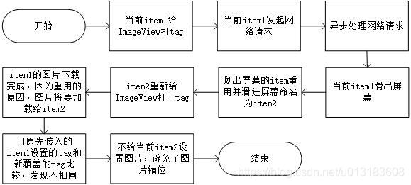

```java
@Override
public void onBindViewHolder(final VideoViewHolder holder, final int position) {
    holder.thumbView.setTag(R.id.tag_dynamic_list_thumb, position);
    Glide.with(mContext)
        .load(picUrl)
        .error(R.drawable.video_thumb_loading)
        .into(new SimpleTarget<GlideDrawable>() {
            @Override
            public void onResourceReady(GlideDrawable glideDrawable, GlideAnimation<? super GlideDrawable> glideAnimation) {
                if (position != (Integer) holder.thumbView.getTag(R.id.tag_dynamic_list_thumb))
                    return;
                holder.thumbView.setImageDrawable(glideDrawable);
            }

            @Override
            public void onStart() {
                super.onStart();
                //开始设置占位图片，防止加载之前item图片加载好展示
                holder.thumbView.setImageResource(R.drawable.ic_loading);
            }
        });
}
```

**(3)在onViewRecycled方法中重置item的ImageView并取消网络请求（推荐使用）**

   **在onBindViewHolder中发起加载请求，然后在view被回收时取消网络请求**

```java
@Override
public void onBindViewHolder(VideoViewHolder holder, int position) {
    String istrurl = mImgList.get(position).getImageUrl();
    if (null == holder || null == istrurl || istrurl.equals("")) {
        return;
    }
    //加载图片
    Glide.with(mContext)
            .load(picUrl)
            .placeholder(R.drawable.ic_loading)
            .into(holder.thumbView);
}

@Override
public void onViewRecycled(VideoViewHolder holder) {
    if (holder != null) {
        //取消网络请求
        Glide.clear(holder.thumbView);
        holder.thumbView.setImageResource(R.drawable.ic_loading);
    }
    super.onViewRecycled(holder);
}
```

**edittext复用导致的混乱:**

```java
private SparseArray<String> mTextCache = new SparseArray<>();
@Override
    public void onBindViewHolder(@NonNull QuesAdapter.QuesViewHolder holder, int position) {
        Ques que = quesList.get(position);
        holder.textView1.setText(String.valueOf(que.getNum1()));
        holder.textView2.setText(que.getLabel());
        holder.textView3.setText(String.valueOf(que.getNum2()));
        Log.d("position",String.valueOf(position));

	    //缓存里面有则取出来，没有则返回默认值“”
        holder.editText.setText(mTextCache.get(holder.getAdapterPosition(),""));
        //判断是否有textwatcher，有的话就不绑定
        if(holder.editText.getTag(R.id.tag_edittext) instanceof TextSwitcher){
            return;
        }
        TextSwitcher textSwitcher = new TextSwitcher(holder);
        holder.editText.addTextChangedListener(textSwitcher);
        holder.editText.setTag(position);

        //设置tag为
        holder.editText.setTag(R.id.tag_edittext,textSwitcher);
        
    }
//自定义EditText的监听类
    class TextSwitcher implements TextWatcher {


        private QuesViewHolder quesViewHolder;
        public TextSwitcher(QuesViewHolder quesViewHolder){
            this.quesViewHolder = quesViewHolder;
        }
        @Override
        public void beforeTextChanged(CharSequence s, int start, int count, int after) {

        }

        @Override
        public void onTextChanged(CharSequence s, int start, int before, int count) {

        }

        @Override
        public void afterTextChanged(Editable s) {

            //如果填入数据与缓存数据一致则返回
            if(TextUtils.equals(mTextCache.get(quesViewHolder.getAdapterPosition()),s.toString())){
                return;
            }
            //对数据进行缓存
            mTextCache.put(quesViewHolder.getAdapterPosition(),s.toString());
            //回调接口进行数据保存，MainActivity进行具体操作
            SaveETListener listener = (SaveETListener) context;
            if(s!=null){
                listener.SaveEdit(Integer.parseInt(quesViewHolder.editText.getTag().toString()),s.toString());
            }
        }
    }
```


**重写下面方法并且改变返回值能够解决复用,原理不清楚**

```java
//解决recyclerview 的复用问题
    @Override
    public int getItemViewType(int position) {
        return position;
    }
```


#### 6）recyclerview缓存

> [RecyclerView四级缓存](https://mp.weixin.qq.com/s/ymdkjE8AFiYhiyj7Av2aVg)
>
> https://blog.csdn.net/m0_51276753/article/details/125667231
>
> https://segmentfault.com/a/1190000040421118

recyclerview用于四级缓存

##### 	四级缓存：

| 层级 | 缓存变量                      | 缓存名     | 用途                                                   |
| ---- | ----------------------------- | ---------- | ------------------------------------------------------ |
| 1    | mChangeScrap与 mAttachedScrap | 可见缓存   | 用于布局过程中屏幕可见表项的回收和复用                 |
| 2    | mCachedViews                  | 缓存列表   | 用于移出屏幕表项的回收和复用，**不会清空数据**         |
| 3    | mViewCacheExtension           | 自定义缓存 | 自定义一个缓存，我们一般用不到                         |
| 4    | RecycledViewPool              | 缓存池     | 用于移出屏幕表项的回收和复用，会将ViewHolder的数据重置 |

###### ①一级缓存

Scrap是RV中最轻量的缓存，包括`mChangeScrap`和`mAttachedScrap `，作为临时缓存的存在。

> **缓存时机**
>
> 通过notifyItemRemoved()，notifyItemChanged()通知item发生变化的时候 

- `mChangeScrap`：缓存发生变化的viewholder
- `mAttachedScrap`：缓存没有发生变化的viewholder

```java
void scrapView(View view) {
    final ViewHolder holder = getChildViewHolderInt(view);
    if (holder.hasAnyOfTheFlags(ViewHolder.FLAG_REMOVED | ViewHolder.FLAG_INVALID)
        || !holder.isUpdated() || canReuseUpdatedViewHolder(holder)) {
        if (holder.isInvalid() && !holder.isRemoved() && !mAdapter.hasStableIds()) {
            throw new IllegalArgumentException("Called scrap view with an invalid view."
                                               + " Invalid views cannot be reused from scrap, they should rebound from"
                                               + " recycler pool." + exceptionLabel());
        }
        holder.setScrapContainer(this, false);
        mAttachedScrap.add(holder);
    } else {
        if (mChangedScrap == null) {
            mChangedScrap = new ArrayList<ViewHolder>();
        }
        holder.setScrapContainer(this, true);
        mChangedScrap.add(holder);
    }
}

```

> - 当调用` LayoutManager` 类的 `onLayoutChildren() `方法对views进行布局，这时会将RecyclerView上的items全部暂存到一个 ArrayList 集合，这里的数据是没有做修改的，所以不用重新绑定 Adapter。
> - 而如果其他情况比如调用了 `notifyItemChanged()` 和 `notifyItemRangeChanged() `来通知**数据发生了更新**、**位置发生改变**，那么该ViewHolder会被缓存到`mChangedScrap`中，因此存储的是发生了变化的ViewHolder，所以要重新走Adapter的绑定方法

 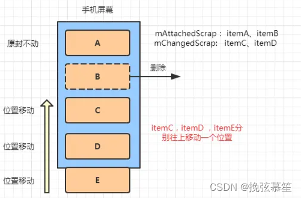 

> itemA，itemB前后参数没有变化（itemB被标记，将会被删除），存入mAttachedScrap
>
> itemC，itemD位置变化，所以存进mChangedScrap。


###### ②二级缓存

`CacheView`用于RecyclerView列表位置产生变动时，通常称为**离屏缓存**，对刚刚移出屏幕的view进行回收。**它的默认容量是2（可以修改）**。 

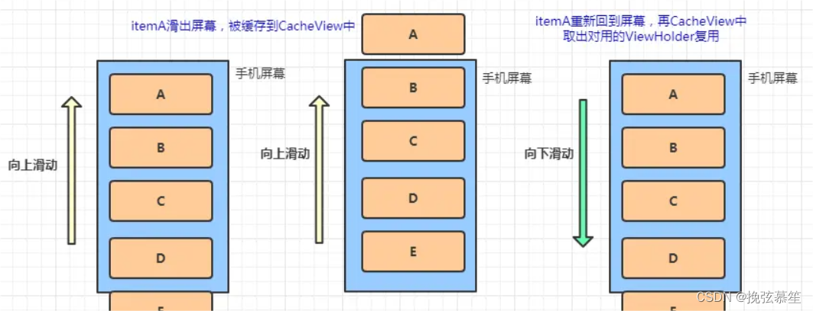 

>  **mAttachedScrap和mCachedViews都是需要进行索引判断，也就是说从这两个缓存中取出的ViewHolder只能复用到指定的位置。mCachedViews只能缓存屏幕外它容量大小的ViewHolder，超出容量的部分会被移除，丢到第四级缓存：缓存池中** 

###### ③三级缓存

三级缓存ViewCacheExtension是用户自定义的缓存 ,

```java
if (holder == null && mViewCacheExtension != null) {
	// We are NOT sending the offsetPosition because LayoutManager does not know it.
	final View view = mViewCacheExtension.getViewForPositionAndType(this, position, type);
	......
}
```

> 如果自定义了一个缓存并且前面的一二级缓存没有找到ViewHolder，系统就会从自定义的这个缓存里去找ViewHolder。 


###### ④四级缓存

`RecyclerView Pool`

从缓存池里取出来的ViewHolder将其重置，**复用的时候再重新绑定数据**。

> 一二级缓存无需再绑定数据，直接拿来复用，因为他们的位置和数据都没有变化。当有相同类型的表项插入列表时，不用重新创建 ViewHolder 实例（执行 onCreateViewHolder()），从缓存池中获取即可。
> 


##### RecyclerView缓存过程：

- 在滑动过程中，会将先滑动的itemView保存到CacheView中，**CacheView大小默认是2**，如果超过了最大容量，则按FIFO,将队列头部的itemView出队，保存至缓存池RecyclerViewPool中，**缓存池是按itemView的类型itemType来保存的，每种itemType默认缓存个数是5**，超过了，则直接由GC回收。

- 可以看到CacheView缓存中蓝色的块一直最最近两个，而RecycledViewPool中，保存最大是5,超过5了后ViewHolder都被回收。

##### recyclerview找缓存过程：

- RecyclerView在找到可用ViewHodler的顺序是：
  - 如果在缓存CacheViews中找到，则直接复用；
  - 如果在缓存池RecycerViewPool找到，则需要bindView；
  - 如果没有找到可用的ViewHolder，则需要create新建一个ViewHolder，并bindView绑定view。

##### 调用notifyDataSetChanged过程:

如果调用notifyDataSetChanged，**每个itemView没有稳定的id的话**，RecyclerView不知道接下来会发生什么，也不知道哪些改变，它假设所有都改变了，会将每一个ViewHolder设置成无效并且放到缓存池Pool中，如果我们仅是把屏幕上的第四条itemView移到第六条的位置，屏幕上所有itemView都会重新layout一遍，这样只能从缓存池RecycledViewPool池中取缓存的ViewHolder，如果不够时，需要重新create ViewHolder.具体实现如下：

**如果设置了Stable Ids**，即每一个itemView都有一个唯一的id来标识，通过getItemId()来获取这个唯一标识id，当然我们不能用position来标识，因为itemView会复用，位置会乱序。当调用notifyDataSetChanged()方法时，ViewHolder会进入上面的一级缓存mAttachedScrap中，而不是进入缓存池pool中，这样的好处：1）不会存在缓存池pool满的问题，不需要重新createViewHolder; 2) 不需要重新bindView了。
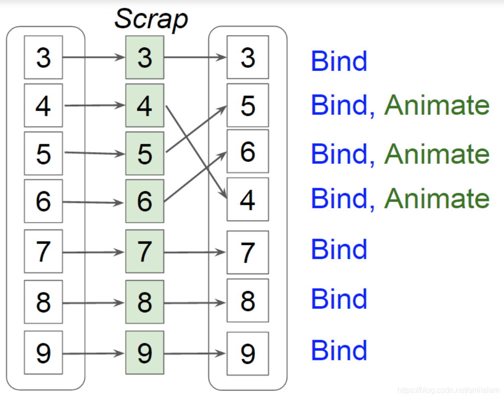

**设置Stable ids方法:**

```java
mRecyclerViewAdapter.setHasStableIds(true);  
```

**要注意**，使用上述代码的话，Adapter中的getItemId要重写成如下，如果仍用super.getItemId(position)，数据刷新会出错。

```java
 @Override
    public long getItemId(int position) {
        return position;
    }
```

##### recyclerview性能优化:

​	(1)recyclerView.setHasFixedSize(true);

当Item的高度如是固定的，设置这个属性为true可以提高性能，尤其是当RecyclerView有条目插入、删除时性能提升更明显。RecyclerView在条目数量改变，会重新测量、布局各个item，如果设置了setHasFixedSize(true)，由于item的宽高都是固定的，adapter的内容改变时，RecyclerView不会整个布局都重绘。具体可用以下伪代码表示：

```java
void onItemsInsertedOrRemoved() {
   if (hasFixedSize) layoutChildren();
   else requestLayout();
}
```

​	

​	(2)使用getExtraLayoutSpace为LayoutManager设置更多的预留空间

在RecyclerView的元素比较高，**一屏只能显示一个元素的时候，第一次滑动到第二个元素会卡顿**。  

RecyclerView (以及其他基于adapter的view，比如ListView、GridView等)使用了缓存机制重用子 view（即系统只将屏幕可见范围之内的元素保存在内存中，在滚动的时候不断的重用这些内存中已经存在的view，而不是新建view）。

这个机制会导致一个问题，启动应用之后，在屏幕可见范围内，如果只有一张卡片可见，当滚动的时 候，RecyclerView找不到可以重用的view了，它将创建一个新的，因此在滑动到第二个feed的时候就会有一定的延时，但是第二个feed之 后的滚动是流畅的，因为这个时候RecyclerView已经有能重用的view了。

如何解决这个问题呢，其实只需重写getExtraLayoutSpace()方法。根据官方文档的描述 getExtraLayoutSpace将返回LayoutManager应该预留的额外空间（显示范围之外，应该额外缓存的空间）。

```java
LinearLayoutManager linearLayoutManager = new LinearLayoutManager(this) {
    @Override
    protected int getExtraLayoutSpace(RecyclerView.State state) {
        return 300;
    }
};
```

​	**(3)RecyclerView数据预取**

android sdk>=21时，支持渲染（Render）线程，RecyclerView数据显示分两个阶段：

1）在UI线程，处理输入事件、动画、布局、记录绘图操作，每一个条目在进入屏幕显示前都会被创建和绑定view；

2）渲染（Render）线程把指令送往GPU。

数据预取的思想就是：将闲置的UI线程利用起来，提前加载计算下一帧的Frame Buffer

在新的条目进入视野前，会花大量时间来创建和绑定view，而在前一帧却可能很快完成了这些操作，导致前一帧的UI线程有一大片空闲时间。RecyclerView开发工程师将创建和绑定移到前一帧，使UI线程与渲染线程同时工作，在一个条目即将进入视野时预取数据。具体如下图，在前一帧的红色虚线圈中，UI线程有一定的空闲时间，可以把第二帧Create B的工作移到前一帧的空闲时间来完成。
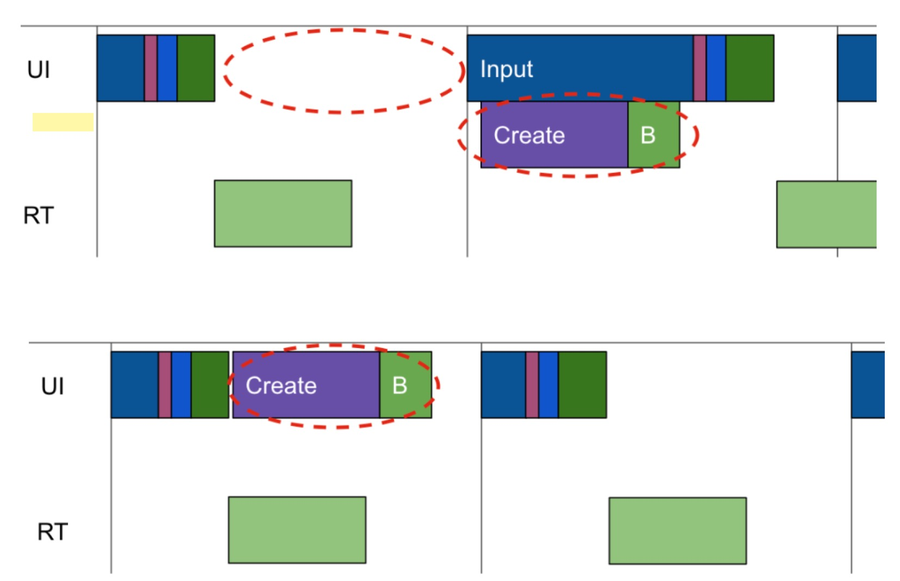

具体实现方式是：在 RecyclerView 开始一个滚动时new Runnable对象，根据 layout manager 和滚动的方向预取即将进入视野的条目，可以同时取出一个或多个条目，例如在使用 GridLayoutManager 时新的一行马上要出现的时候。在 25.1 版本中，预取操作被分为单独的创建/绑定操作，比对整组条目操作更容易被纳入 UI 线程的空隙中。具体实现原理可参考
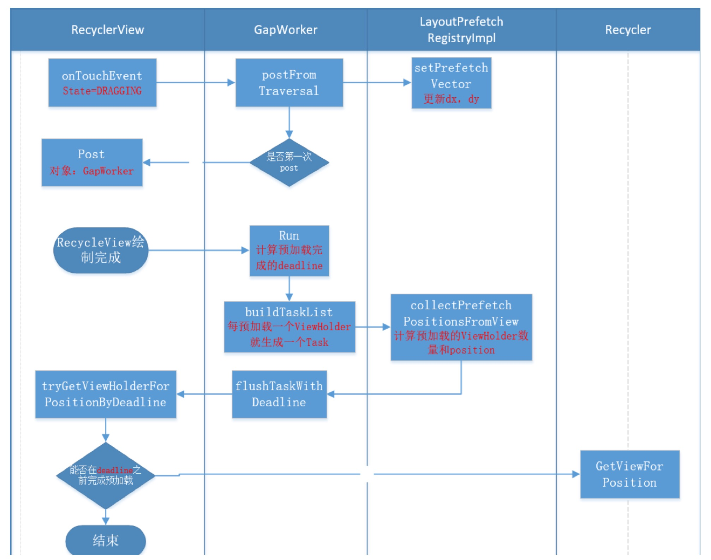

如果使用 RecyclerView 提供的LayoutManager，自动使用了这种优化操作。如果使用嵌套 RecyclerView 或者自己实现Layout Manager，则需要在代码中设置。

1）**对于嵌套 RecyclerView**，要获取最佳的性能，在内部的 LayoutManager 中调用 LinearLayoutManager.setInitialItemPrefetchCount()方法（25.1版本起可用）。

```java
例如：如果竖直方向的list至少展示三个条目，调用 setInitialItemPrefetchCount(4)。
```

2）如果自己实现了LayoutManager，需要重写 LayoutManager.collectAdjacentPrefetchPositions()方法。该方法在数据预取开启时被 RecyclerView 调用（LayoutManager 的默认实现什么都不做）。在嵌套的内层 RecyclerView 中，如果想让LayoutManager 预取数据，同样应当实现 LayoutManager.collectInitialPrefetchPositions()。

​	**(4)避免创建过多对象**

onCreateViewHolder 和 onBindViewHolder 对时间都比较敏感，尽量避免繁琐的操作和循环创建对象。例如创建 OnClickListener，可以全局创建一个。同时onBindViewHolder调用次数会多于onCreateViewHolder的次数，如从RecyclerViewPool缓存池中取到的View都需要重新bindView，所以我们可以把监听放到CreateView中进行。

```java
//优化前
@Override
public void onBindViewHolder(ViewHolder holder, int position) {
    holder.setOnClickListener(new View.OnClickListener() {
       @Override
       public void onClick(View v) {
         //do something
       }
    });
}
```

优化后

```java
//优化后
private class XXXHolder extends RecyclerView.ViewHolder {
        private EditText mEt;
        EditHolder(View itemView) {
            super(itemView);
            mEt = (EditText) itemView;
            mEt.setOnClickListener(mOnClickListener);
        }
    }
    private View.OnClickListener mOnClickListener = new View.OnClickListener() {
        @Override
        public void onClick(View v) {
            //do something
        }
    }
```

#### 7）RecyclerView删除和添加

###### 	添加数据

```java
// 添加数据
public void addData( int position) {
    //   在list中添加数据，并通知条目加入一条
    list.add(position, "我是商品" + position);
    //告知adapter有新的数据插入进list，需要刷新
    notifyItemInserted(position);
}
```


###### 	删除数据

```java
// 删除数据
public void removeData( int position) {
    list.remove(position);
    //删除动画
    notifyItemRemoved(position);
    notifyDataSetChanged();
}
```


#### 8）SparseArray

###### 	概述：

SparseArray存储的是键值对，以int作为key，Object作为value。Sparse有稀疏、缺少的意思。SparseArray应用场景是相对稀少的数据，一般是几百以内。

###### 	数据结构：

采用两个一维数组，一个是存储key(int类型),一个是存value object。

```java
private int[] mKeys; // 存储key
private Object[] mValues; // 存储value对象
private int mSize; // 记录存储键值对的数量
```

SparseArray在默认构造函数中指定其默认容量大小。默认为10

初始化后`mSize = 0`，实例化mKeys和mValues。

###### 	扩容：

SparseArray并不像HashMap一样定义有最大容量是多少，最大可以达到Integer.MAX_VALUE，可能会报oom。每次扩容时如果当前容量小于5则扩容是8，否则扩容为原容量的2倍。

```java
public static int growSize(int currentSize) {
	return currentSize <= 4 ? 8 : currentSize * 2;
}
```

###### 	与hashmap比较

针对上面与HashMap的比较，采用SparseArray还是HashMap，建议根据如下需求选取：

- 如果对内存要求比较高，而对查询效率没什么大的要求，可以是使用SparseArray
- 数量在百级别的SparseArray比HashMap有更好的优势
- 要求key是int类型的，因为HashMap会对int自定装箱变成Integer类型
- 要求key是有序的且是升序


### ListView与RecyclerView比较

> https://blog.csdn.net/augfun/article/details/114456710
>
> https://www.jianshu.com/p/3e9aa4bdaefd

#### 布局效果

- ListView 的布局比较单一，只有一个纵向效果；
- RecyclerView 的布局效果丰富， 可以在 LayoutMananger 中设置：线性布局（纵向，横向），表格布局，瀑布流布局。在RecyclerView 中，如果存在的 LayoutManager 不能满足需求，可以自定义 LayoutManager

####  Item 点击事件

- RecyclerView不支持 item 点击事件，只能用回调接口来设置点击事件
- ListView的 item 点击事件直接是setOnItemClickListener

#### 局部刷新

- 在ListView中通常刷新数据是用`notifyDataSetChanged()`，但是这种刷新数据是全局刷新的（每个item的数据都会重新加载一遍），这样一来就会非常消耗资源；

  > 如果要在ListView实现局部刷新，依然是可以实现的，当一个item数据刷新时，可以在Adapter中，实现一个notifyItemChanged()方法，在方法里面通过这个 item 的 position，刷新这个item的数据

- RecyclerView中可以实现局部刷新，例如：`notifyItemChanged()`；
  

#### 动画效果

- 在RecyclerView中，已经封装好API来实现自己的动画效果；并且如果我们需要实现自己的动画效果，我们可以通过相应的接口实现自定义的动画效果（RecyclerView.ItemAnimator类），然后调用RecyclerView.setItemAnimator() (默认的有SimpleItemAnimator与DefaultItemAnimator）；
- 但是ListView并没有实现动画效果，但我们可以在Adapter自己实现item的动画效果；

#### 缓存区别

**层级不同**

- ListView有两级缓存，在屏幕与非屏幕内。mActivityViews + mScrapViews
- RecyclerView比ListView多两级缓存：支持开发者自定义缓存处理逻辑，RecyclerViewPool(缓存池)。并且支持多个离屏ItemView缓存（缓存屏幕外2个 itemView）。 mAttachedScrap + mCacheViews + mViewCacheExtension + mRecyclerPool

**缓存内容不同**

- ListView缓存ItemView。
- RecyclerView缓存RecyclerView.ViewHolder

**RV优势**

a.mCacheViews的使用，可以做到屏幕外的列表项ItemView进入屏幕内时也无须bindView快速重用；
b.mRecyclerPool可以供多个RecyclerView共同使用，在特定场景下，如viewpaper+多个列表页下有优势.

# 二、拓展

## 1.<a name=fragmentmanager>FragmentManager</a>

FragmentManager是Android中的一个类，用于管理Activity中的Fragment。Fragment是一个可重用的组件，它可以独立于Activity存在，并且可以被添加、删除、替换和隐藏。

它可以将Fragment添加到Activity的界面中，并且可以在Activity的生命周期中管理Fragment的状态。

FragmentManager有两个版本：

- 一个是支持Fragment回退栈的版本：回退栈允许用户通过按下后退按钮来回退到之前的Fragment状态。
- 另一个是不支持回退栈的版本。

