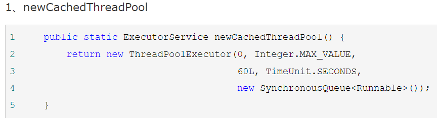

# 异步框架

## 一、AsyncTask

### 1.前言:

在Android开发中经常会通过线程去执行耗时的任务，并且在任务执行完之后通常会用到Handler来更新UI。虽然实现简单，但是有多个任务同时执行时则会显得代码很臃肿。Android提供了AsyncTask，它使得异步任务实现起来更加简单，代码更简洁。

### 2.介绍:

AsyncTask是一个抽象的泛型类，它有3个泛型参数，分别为Params、Progress和Result。

- Params：参数类型，

- Progress：后台任务执行进度的类型，

- Result：返回结果的类型。

  如果不需要某个参数，可以将其设置为Void类型。
  AsyncTask如下：

```java
public abstract class AsyncTask<Params, Progress, Result> {
}
```

### 3.核心方法:

```java
onPreExecute()//在主线程中执行。一般在任务执行前做准备工作。

doInBackground（Params…params）//在线程池中执行。在 onPreExecute方法执行后运行，用来执行耗时操作。在执行过程中可以调用publishProgress（Progress…values）方法来更新进度信息。

onProgressUpdate（Progress…values）//在主线程中执行。当调用publishProgress（Progress…values）方法时，此方法会将进度更新到UI组件上。

onPostExecute（Result result）//在主线程中执行。当后台任务执行完成后，会被执行。doInBackground方法得到的结果就是返回的result的值。

```

AsyncTask的底层其实是对Thread、Handler、Message的封装，智能的应用了Handler（子线程将运行结果返回到handler队列中，主线程定时扫描该队列，取出要用的值）；

### 4.应用:

我们一般可以新建一个类`Task`继承于AsyncTask类，通过覆写其方法实现主线程和子线程的数据交互：
新建一个任务继承AsyncTask需要传入三个参数，即：<Params, Progress, Result>

- 启动异步方法：`new ××Task().excute(?); `处用来向  `××Task（）`方法传值,即上面的Params（一般用map<>,或String）；注意：每new一个对象只能进行一次调用`excute()`操作

  

  常用的覆写方法有：

  **onPreExcute():**此方法在开启异步方法后，第一个执行，属于对主线程的操作；应用：比如让某个控件隐藏等操作放进这个方法里；

  **doInBackground():**此方法执行后，异步方法会自动开启一个线程（为什么不说new一个线程，这涉及到其底层的工作原理，后面会有阐述），执行该方法内部的逻辑，这个方法属于子线程的操作，要跟其他方法有所区分；此方法会接收第一个参数Params，进行处理，并返回第三个参数Result，并可以在过程中进行第二个参数progress的赋值，通过**publishProgress（）**方法将数值传递给下一个方法`onProgressUpdate（）`；

  **onProgressUpdate()**;此方法通过setProgress()处理从上面方法接收过来的数据，**对UI线程的进度条控件进行管理**；

  **onPostExecute()**:此方法可以接受doInBackground返回的Result，**并对UI线程的某个控件进行管理**；


一个下载图片的例子:

```java
public class MyAsyncTask extends AsyncTask<String, Integer, Bitmap>{
    private ProgressBar mPreogressBar;//进度条
    private ImageView mImageView;//图片显示控件

    public MyAsyncTask(ProgressBar pb,ImageView iv){
        mPreogressBar = pb;
        mImageView = iv;
    }

    @Override
    protected void onPreExecute() {
        super.onPreExecute();
        mPreogressBar.setVisibility(View.VISIBLE);
    }

    @Override
    protected Bitmap doInBackground(String... params) {
        String urlParams = params[0];//拿到execute()传过来的图片url
        Bitmap bitmap = null;
        URLConnection conn = null;
        InputStream is = null;
        try {
            URL url = new URL(urlParams);
            conn = url.openConnection();
            is = conn.getInputStream();

            //这里只是为了演示更新进度的功能，实际的进度值需要在从输入流中读取时逐步获取
            for(int i = 0; i < 100; i++){
                publishProgress(i);
                Thread.sleep(50);//为了看清效果，睡眠一段时间
            }
            //将获取到的输入流转成Bitmap
            BufferedInputStream bis = new BufferedInputStream(is);
            bitmap = BitmapFactory.decodeStream(bis);

            is.close();
            bis.close();
        } catch (IOException e) {
            e.printStackTrace();
        } catch (InterruptedException e) {
            e.printStackTrace();
        }
        return bitmap;
    }

    //更新进度条
    @Override
    protected void onProgressUpdate(Integer... values) {
        super.onProgressUpdate(values);
        mPreogressBar.setProgress(values[0]);
    }

    //线程执行完毕，进行主线程UI更新
    @Override
    protected void onPostExecute(Bitmap bitmap) {
        super.onPostExecute(bitmap);
        mPreogressBar.setVisibility(View.GONE);
        mImageView.setImageBitmap(bitmap);
    }
}
```

上面`doInBackground()`中获取进度值时，我们只是为了做一个进度值更新调用的演示，实际项目文件下载中，我们可能会对拿到的输入流进行处理，比如读取输入流将文件保存到本地，在读取输入流的时候，我们就可以获取到已经读取的输入流大小作为进度值了，如下：             

```java
//实际项目中如何获取文件大小作为进度值及更新进度值
int totalSize = conn.getContentLength();//获取文件总大小
int size = 0;//保存当前下载文件的大小，作为进度值
int count = 0;
byte[] buffer = new byte[1024];
while((count = is.read(buffer)) != -1){
    size += count;//获取已下载的文件大小
    //调用publishProgress更新进度，它内部会回调onProgressUpdate()方法
    publishProgress(size,totalSize);
    Thread.sleep(100);//为了看清效果，睡眠一段时间
}
```


**MainActivity**

```java
public class MainActivity extends AppCompatActivity {
    private ImageView mImageView;
    private ProgressBar mProgressBar;
    private static String url = "http://c.hiphotos.baidu.com/baike/s%3D220/sign=86442af5a6c27d1ea1263cc62bd4adaf/42a98226cffc1e17d8f914604890f603738de919.jpg";
    private MyAsyncTask asyncTask;

    @Override
    protected void onCreate(Bundle savedInstanceState) {
        super.onCreate(savedInstanceState);
        setContentView(R.layout.image);

        mImageView = (ImageView) findViewById(R.id.id_image);
        mProgressBar = (ProgressBar) findViewById(R.id.pb);

        asyncTask = new MyAsyncTask(mProgressBar, mImageView);
        asyncTask.execute(url);
	}
}
```

**每一个new出的AsyncTask只能执行一次execute()，如果同一个AsyncTask多次执行execute()执行将会报错。**

### 5.取消一个AsyncTask

先修改MainActivity,此时我们在onPause中进行任务取消（业务不同，取消地方不同）

```java
@Override
protected void onPause() {
    super.onPause();
    if(asyncTask != null && asyncTask.getStatus() == AsyncTask.Status.RUNNING){
        //cancel只是将对应的任务标记为取消状态
        asyncTask.cancel(true);
    }
}
```

修改AsyncTask,在这里确认任务是否被取消

```java
@Override
protected Bitmap doInBackground(String... params) {
    String urlParams = params[0];//拿到execute()传过来的图片url
    Bitmap bitmap = null;
    URLConnection conn = null;
    InputStream is = null;
    try {
        URL url = new URL(urlParams);
        conn = url.openConnection();
        is = conn.getInputStream();

        for(int i = 0; i < 100; i++){
            if(isCancelled()){//通过isCancelled()判断任务任务是否被取消
                break;
            }
            publishProgress(i);
            Thread.sleep(50);//为了看清效果，睡眠一段时间
        }
        BufferedInputStream bis = new BufferedInputStream(is);
        bitmap = BitmapFactory.decodeStream(bis);

        is.close();
        bis.close();
    } catch (IOException e) {
        e.printStackTrace();
    } catch (InterruptedException e) {
        e.printStackTrace();
    }
    return bitmap;
}

@Override
protected void onProgressUpdate(Integer... values) {
    super.onProgressUpdate(values);
    if(isCancelled()){//通过isCancelled()判断任务任务是否被取消
        return;
    }
    mPreogressBar.setProgress(values[0]);
}
```


### 6.方法参数(String ...str)

类型后面三个点(String...)，是从Java 5开始，Java语言对方法参数支持一种新写法，叫**可变长度参数列表**，其语法就是类型后跟...，表示此处接受的参数为0到多个String类型的对象，或者是一个String[]。 

> 例如我们有一个方法叫做test(String...strings)，那么你还可以写方法test()，但你不能写test(String[] strings)，这样会出编译错误，系统提示出现重复的方法。 
>
> 在使用的时候，对于test(String...strings)，你可以直接用test()去调用，标示没有参数，也可以用去test("aaa")，也可以用test(new String[]{"aaa","bbb"})。 
>
> 另外如果既有test(String...strings)函数，又有test()函数，我们在调用test()时，会优先使用test()函数。只有当没有test()函数时，我们调用test()，程序才会走test(String...strings)。


# Android常用网络请求框架

## 一.概述：

安卓中网络请求方式：

- HttpUrlConnection:最基础，原生的网络请求方式。get(请求数据下载到SD卡中：图片、视频、音频等等)、post
- HttpClient:已经过时的，安卓SDK26以后该类已经被谷歌删掉了
- Xutils:第三方框架，功能比较全(数据库，图片，网络。。。。)，发明这个东西的人想象很丰满，现实很难维护。
- **OkHttp**:第三方框架(重点，老app使用)这是一个开源项目,是安卓端最火热的轻量级框架,由移动支付Square公司贡献(该公司还贡献了Picasso和LeakCanary) 。
- Volley：第三方框架(重点，老app使用)
- **Retrofit**

安卓网络请求前需要添加网络权限:

```xml
<uses-permission android:name="android.permission.INTERNET"/>
```


## 	原生网络请求:

​	get请求

```java
private void get() {
	new Thread(new Runnable() {
	@Override
	public void run() {
		StringBuffer stringBuffer=new StringBuffer();
		try {
			URL url = new URL(get_url);
			HttpURLConnection urlConnection = (HttpURLConnection) url.openConnection();
			urlConnection.setConnectTimeout(5*1000);//链接超时
			urlConnection.setReadTimeout(5*1000);//返回数据超时
			//getResponseCode (1.200请求成功 2.404请求失败)
			if(urlConnection.getResponseCode()==200){
				//获得读取流写入
				InputStream inputStream = urlConnection.getInputStream();
				byte[] bytes=new byte[1024];
				int len=0;
				while ((len=inputStream.read(bytes))!=-1){
					stringBuffer.append(new String(bytes,0,len));
				}
				}
				} catch (MalformedURLException e) {
			e.printStackTrace();
			} catch (IOException e) {
			e.printStackTrace();
			}
		}
	}).start();
}
```

post请求

```java
private void post() {
	new Thread(new Runnable() {
	@Override
	public void run() {
		StringBuffer stringBuffer=new StringBuffer();
		try {
			URL url = new URL(post_url);
			HttpURLConnection urlConnection = (HttpURLConnection) url.openConnection();
			urlConnection.setConnectTimeout(5*1000);
			urlConnection.setReadTimeout(5*1000);
			//设置请求方式，默认是get
			urlConnection.setRequestMethod("POST");//大写的POST
			//设置允许输出
			urlConnection.setDoOutput(true);//允许向服务器提交数据、
             urlConnection.setDoInput(true);
			//获得输出流写数据 "&page=1"
			urlConnection.getOutputStream().write("?stage_id=1&limit=10&page=1".getBytes());//请求参数放到请求体
				if(urlConnection.getResponseCode()==200){
					InputStream inputStream = urlConnection.getInputStream();
					byte[] bytes=new byte[1024];
					int len=0;
					while ((len=inputStream.read(bytes))!=-1){
						stringBuffer.append(new String(bytes,0,len));
					}
				}
				} catch (MalformedURLException e) {
				e.printStackTrace();
				} catch (IOException e) {
				e.printStackTrace();
			}
		}
	}).start();
}
```

```java
public class HttpURLConnectionHelper {

    public static String sendRequest(String urlParam,String requestType) {

        HttpURLConnection con = null;  

        BufferedReader buffer = null; 
        StringBuffer resultBuffer = null;  

        try {
            URL url = new URL(urlParam); 
            //得到连接对象
            con = (HttpURLConnection) url.openConnection(); 
            //设置请求类型
            con.setRequestMethod(requestType);  
            //设置请求需要返回的数据类型和字符集类型
            con.setRequestProperty("Content-Type", "application/json;charset=GBK");  
            //允许写出
            con.setDoOutput(true);
            //允许读入
            con.setDoInput(true);
            //不使用缓存
            con.setUseCaches(false);
            //得到响应码
            int responseCode = con.getResponseCode();

            if(responseCode == HttpURLConnection.HTTP_OK){
                //得到响应流
                InputStream inputStream = con.getInputStream();
                //将响应流转换成字符串
                resultBuffer = new StringBuffer();
                String line;
                buffer = new BufferedReader(new InputStreamReader(inputStream, "GBK"));
                while ((line = buffer.readLine()) != null) {
                    resultBuffer.append(line);
                }
                return resultBuffer.toString();
            }

        }catch(Exception e) {
            e.printStackTrace();
        }
        return "";
    }
    public static void main(String[] args) {

        String url ="http://int.dpool.sina.com.cn/iplookup/iplookup.php?ip=120.79.75.96";
        System.out.println(sendRequest(url,"POST"));
    }
}
```


## 	xutils

```groovy
//需要导入依赖：
implementation ‘org.xutils:xutils:3.5.1’
```


## OkHttp

```groovy
//需要导入依赖：
implementation 'com.squareup.okhttp3:okhttp:3.12.1'
```

### 优点:

OkHttp是一个默认有效的HTTP客户端：

- HTTP/2支持允许对同一主机的所有请求共享套接字。

- 连接池减少了请求延迟（如果HTTP/2不可用）。

- transparent GZIP 压缩了下载大小。

- Response缓存可以完全避免网络的重复请求。

- 当网络故障时，OkHttp会自动重试：它将从常见的连接问题中静默地恢复。如果您的服务有多个IP地址，如果第一次连接失败，OkHttp将尝试备用地址；这对于IPv4 + IPv6以及在冗余数据中心中托管的服务是必需的。
- OkHttp还支持现代TLS功能（TLS 1.3，ALPN，certificate pinning）。

**get请求**

```java
public class GetExample {
    OkHttpClient client = new OkHttpClient();

    String run(String url) throws IOException {
        Request request = new Request.Builder()
            .url(url)
            .build();

        try (Response response = client.newCall(request).execute()) {
            return response.body().string();
        }
    }

    public static void main(String[] args) throws IOException {
        GetExample example = new GetExample();
        String response = example.run("https://raw.github.com/square/okhttp/master/README.md");
        System.out.println(response);
    }
}
```

> 1. 创建`OkHttpClient`对象
> 2. 构造请求`Request`
> 3. 调用`OkHttpClient`发送`Request`
> 4. 解析请求结果

```java
//进行post请求
OkHttpClient okHttpClient = new OkHttpClient();
FormBody formBody = new FormBody.Builder()//封装请求数据
    .add("username",username_ed.getText().toString())
    .add("password",password_ed.getText().toString())
    .build();
Request request = new Request.Builder()
    .url(urlLogin)//请求地址
    .post(formBody)//请求数据
    .build();

//进行请求并且得到回复
Call call = okHttpClient.newCall(request);
Response response = call.execute();

//获取返回的数据,并转化成字符串
responseData = response.body().string();
```

异步请求方式，通过调用okHttp回调函数判断成功还是失败

```java
client.newCall(request).enqueue(new Callback() {
    @Override
    public void onFailure(Call call, IOException e) {
        /*code*/
    }
    @Override
    public void onResponse(Call call, Response response) throws IOException {
        /*code*/
    }
}
                                });
```


### 源码分析

> https://blog.yorek.xyz/android/3rd-library/okhttp/

#### (1)OkHttpClient以及Request的构造器

 先看看`OkHttpClient`的构造器：  

构造器实现很简单，在默认构造器中传入了一个`OkHttpClient.Builder`建造者对象，然后将其中的参数复制给自己。 

```java
public OkHttpClient() {
  this(new Builder());//传入一个Builder对象
}

OkHttpClient(Builder builder) {//将builder的参数赋值给自己
  this.dispatcher = builder.dispatcher;
  this.proxy = builder.proxy;
  this.protocols = builder.protocols;
  this.connectionSpecs = builder.connectionSpecs;
  this.interceptors = Util.immutableList(builder.interceptors);
  this.networkInterceptors = Util.immutableList(builder.networkInterceptors);
  this.eventListenerFactory = builder.eventListenerFactory;
  this.proxySelector = builder.proxySelector;
  this.cookieJar = builder.cookieJar;
  this.cache = builder.cache;
  this.internalCache = builder.internalCache;
  this.socketFactory = builder.socketFactory;

  boolean isTLS = false;
  for (ConnectionSpec spec : connectionSpecs) {
    isTLS = isTLS || spec.isTls();
  }

  if (builder.sslSocketFactory != null || !isTLS) {
    this.sslSocketFactory = builder.sslSocketFactory;
    this.certificateChainCleaner = builder.certificateChainCleaner;
  } else {
    X509TrustManager trustManager = systemDefaultTrustManager();
    this.sslSocketFactory = systemDefaultSslSocketFactory(trustManager);
    this.certificateChainCleaner = CertificateChainCleaner.get(trustManager);
  }

  this.hostnameVerifier = builder.hostnameVerifier;
  this.certificatePinner = builder.certificatePinner.withCertificateChainCleaner(
      certificateChainCleaner);
  this.proxyAuthenticator = builder.proxyAuthenticator;
  this.authenticator = builder.authenticator;
  this.connectionPool = builder.connectionPool;
  this.dns = builder.dns;
  this.followSslRedirects = builder.followSslRedirects;
  this.followRedirects = builder.followRedirects;
  this.retryOnConnectionFailure = builder.retryOnConnectionFailure;
  this.connectTimeout = builder.connectTimeout;
  this.readTimeout = builder.readTimeout;
  this.writeTimeout = builder.writeTimeout;
  this.pingInterval = builder.pingInterval;
}
```

 在`OkHttpClient.Builder`的构造器中有很多默认的值，如下注释： 

```java
public Builder() {
  dispatcher = new Dispatcher();    // 分发器，另有一个带线程池参数的构造器
  protocols = DEFAULT_PROTOCOLS;    // 支持的协议，默认为HTTP_2、HTTP_1_1
  connectionSpecs = DEFAULT_CONNECTION_SPECS;  // 传输层版本、连接协议
  // 事件监听器，3.8版本set方法还是package级别的，暂时不能设置
  eventListenerFactory = EventListener.factory(EventListener.NONE);
  proxySelector = ProxySelector.getDefault();   // 代理选择器
  cookieJar = CookieJar.NO_COOKIES;             // 读写Cookie的容器
  socketFactory = SocketFactory.getDefault();   // Socket工厂
  hostnameVerifier = OkHostnameVerifier.INSTANCE;// 主机名验证器
  certificatePinner = CertificatePinner.DEFAULT;
  proxyAuthenticator = Authenticator.NONE;      // 代理认证器
  authenticator = Authenticator.NONE;           // 本地认证器
  connectionPool = new ConnectionPool();        // 连接池
  dns = Dns.SYSTEM;                             // 域名
  followSslRedirects = true;                    // SSL重定向
  followRedirects = true;                       // 普通重定向
  retryOnConnectionFailure = true;              // 连接失败重试
  connectTimeout = 10_000;                      // 连接超时时间
  readTimeout = 10_000;                         // 读超时时间
  writeTimeout = 10_000;                        // 写超时时间
  pingInterval = 0;
}
```

**Request的构造方法**

```java
final HttpUrl url;                // 请求的url
final String method;              // 请求方式
final Headers headers;            // 请求头
final @Nullable RequestBody body; // 请求体
final Object tag;                 // 请求的tag
```

```java
public final class Request {
    final HttpUrl url;
    final String method;
    final Headers headers;
    final @Nullable RequestBody body;
    final Map<Class<?>, Object> tags;

    private volatile @Nullable CacheControl cacheControl; // Lazily initialized.

    Request(Builder builder) {
        this.url = builder.url;
        this.method = builder.method;
        this.headers = builder.headers.build();
        this.body = builder.body;
        this.tags = Util.immutableMap(builder.tags);
    }

    public static class Builder {
        @Nullable HttpUrl url;
        String method;
        Headers.Builder headers;
        @Nullable RequestBody body;

        /** A mutable map of tags, or an immutable empty map if we don't have any. */
        Map<Class<?>, Object> tags = Collections.emptyMap();

        public Builder() {
            this.method = "GET";
            this.headers = new Headers.Builder();
        }

        Builder(Request request) {
            this.url = request.url;
            this.method = request.method;
            this.body = request.body;
            this.tags = request.tags.isEmpty()
                ? Collections.<Class<?>, Object>emptyMap()
                : new LinkedHashMap<>(request.tags);
            this.headers = request.headers.newBuilder();
        }

        public Request build() {
            if (url == null) throw new IllegalStateException("url == null");
            return new Request(this);
        }
    }
}
```


#### (2)Call & RealCall

接着看`client.newCall(request).execute()`这一行代码。
首先是`OkHttpCient.newCall(Request)`方法：

```java
/**
  * Prepares the {@code request} to be executed at some point in the future.
  */
@Override public Call newCall(Request request) {
  return new RealCall(this, request, false /* for web socket */);
}
```

 这里创建了一个`RealCall`对象，而`RealCall`实现了`Call`接口。`Call`接口声明如下： 

```java
public interface Call extends Cloneable {
  /** 获得原始请求 */
  Request request();

  /** 同步执行请求 */
  Response execute() throws IOException;

  /** 异步执行请求 */
  void enqueue(Callback responseCallback);

  /** 尽可能取消请求。已经完成了的请求不能被取消 */
  void cancel();

  /**
   * 调用了execute()或者enqueue(Callback)后都是true
   */
  boolean isExecuted();

  boolean isCanceled();

  /** 创建一个新的、完全一样的Call对象，即使原对象状态为enqueued或者executed */
  Call clone();

  interface Factory {
    Call newCall(Request request);
  }
}
```

 回到`RealCall`，看看其的构造器以及成员变量： 

```java
final OkHttpClient client;
final RetryAndFollowUpInterceptor retryAndFollowUpInterceptor;
final EventListener eventListener;

/** The application's original request unadulterated by redirects or auth headers. */
final Request originalRequest;
final boolean forWebSocket;

// Guarded by this.
private boolean executed;

RealCall(OkHttpClient client, Request originalRequest, boolean forWebSocket) {
  // 事件监听器，默认为null，目前3.8版本也无法设置
  final EventListener.Factory eventListenerFactory = client.eventListenerFactory();

  this.client = client;
  this.originalRequest = originalRequest;
  this.forWebSocket = forWebSocket;
  // 创建一个重试、重定向拦截器
  this.retryAndFollowUpInterceptor = new RetryAndFollowUpInterceptor(client, forWebSocket);

  // TODO(jwilson): this is unsafe publication and not threadsafe.
  this.eventListener = eventListenerFactory.create(this);
}
```


#### (3)RealCall.execute

 接着看看重点`RealCall.execute`方法： 

```java
@Override 
public Response execute() throws IOException {
    synchronized (this) {
        if (executed) throw new IllegalStateException("Already Executed");
        //一旦Call.execute方法被执行，那么其executed就会被设置为true，如果多次调用就会报错。
        executed = true;
    }
    captureCallStackTrace();
    try {
        //将call加入到Dispatcher.runningSyncCalls队列中
        client.dispatcher().executed(this);
        //调用getResponseWithInterceptorChain进行网络请求并获取Response，该方法是OkHttp中的最重要的点
        Response result = getResponseWithInterceptorChain();
        if (result == null) throw new IOException("Canceled");
        return result;
    } finally {
        //Call执行完毕后将其从Dispatcher.runningSyncCalls队列中移除
        client.dispatcher().finished(this);
    }
}
```

> ```java
> synchronized void executed(RealCall call) {
>     runningSyncCalls.add(call);
> }
> ```
>
> ```java
> void finished(RealCall call) {
>     finished(runningSyncCalls, call, false);
> }
> 
> private <T> void finished(Deque<T> calls, T call, boolean promoteCalls) {
>     int runningCallsCount;
>     Runnable idleCallback;
>     synchronized (this) {
>         if (!calls.remove(call)) throw new AssertionError("Call wasn't in-flight!");
>         if (promoteCalls) promoteCalls();
>         runningCallsCount = runningCallsCount();
>         idleCallback = this.idleCallback;
>     }
> 
>     if (runningCallsCount == 0 && idleCallback != null) {
>         idleCallback.run();
>     }
> }
> ```


#### (4)RealCall.enqueue

 同`execute`方法类似，一旦`Call.enqueue`方法被执行，那么其`executed`就会被设置为`true`，如果多次调用就会报错。
然后调用`client.dispatcher().enqueue(new AsyncCall(responseCallback));`方法开始了异步调用。 

```java
@Override public void enqueue(Callback responseCallback) {
    synchronized (this) {
        if (executed) throw new IllegalStateException("Already Executed");
        executed = true;
    }
    captureCallStackTrace();
    //异步调用
    client.dispatcher().enqueue(new AsyncCall(responseCallback));
}
```

 先看一下`AsyncCall`的相关代码 

```java
final class AsyncCall extends NamedRunnable {
    private final Callback responseCallback;

    AsyncCall(Callback responseCallback) {
        super("OkHttp %s", redactedUrl());
        this.responseCallback = responseCallback;
    }
    ...
        @Override protected void execute() {
        ...
    }
}
```

 `AsyncCall`的父类`NamedRunnable`是一个有`name`属性的`Runnable`抽象类，在执行代码前，会将当前线程名设置为`name`，执行完毕后恢复。 

```java
/**
 * Runnable implementation which always sets its thread name.
 */
public abstract class NamedRunnable implements Runnable {
    protected final String name;

    public NamedRunnable(String format, Object... args) {
        this.name = Util.format(format, args);
    }

    @Override public final void run() {
        String oldName = Thread.currentThread().getName();
        Thread.currentThread().setName(name);
        try {
            execute();
        } finally {
            Thread.currentThread().setName(oldName);
        }
    }

    protected abstract void execute();
}
```

 了解了`AsyncCall`的大致结构，我们返回`Dispatcher.enqueue`方法： 

​	 `maxRequests`和`maxRequestsPerHost`都有默认值，且有setter方法可以设置具体值，两者的setter方法最后会执行`promoteCalls`方法尝试执行异步任务。 

​	 在`enqueue`方法中，首先会检查「正在运行的异步请求数」以及「call对应的host上的异步请求数」是否达到了阈值。如果还没有达到阈值，那么加入到`runningAsyncCalls`队列中，同时开始执行请求；否则加入到`readyAsyncCalls`队列中进行等待。 

```java
private int maxRequests = 64;
private int maxRequestsPerHost = 5;

synchronized void enqueue(AsyncCall call) {
    if (runningAsyncCalls.size() < maxRequests && runningCallsForHost(call) < maxRequestsPerHost) {
        runningAsyncCalls.add(call);
        executorService().execute(call);
    } else {
        readyAsyncCalls.add(call);
    }
}
```

 这里出现了一个`executorService()`，这是一个单例实现的线程池，该线程池也可以在`Dispatcher`的构造器中注入。 

​	这里我们可以看出来，这是一个典型的`CachedThreadPool`:

- 这是一个线程数量不定的线程池，他只有非核心线程，并且其最大线程数为`Integer.MAX_VALUE`。线程池中的空闲线程都有超时机制，这个超时时常为60s，超过这个时间的闲置线程就会被回收。`SynchronousQueue`可以简单的理解为一个无法存储元素的队列，因此这将导致任何任务都会立刻执行。
- 从其特性来看，这类线程池适合执行大量耗时较少的任务。当整个线程池处理闲置状态时，线程池中的线程都会因为超时而被停止，这个时候`CachedThreadPool`之中实际上是没有线程的，它几乎不占用任何系统资源。 

```java
/** Executes calls. Created lazily. */
private @Nullable ExecutorService executorService;

public Dispatcher(ExecutorService executorService) {
    this.executorService = executorService;
}

public synchronized ExecutorService executorService() {
    if (executorService == null) {
        //可以看到，是一个cachedThreadPool
        executorService = new ThreadPoolExecutor(0, Integer.MAX_VALUE, 60, TimeUnit.SECONDS,
                                                 new SynchronousQueue<Runnable>(), Util.threadFactory("OkHttp Dispatcher", false));
    }
    return executorService;
}
```

> 

 提交到线程池后，`AsyncCall.run`方法就会被调用，又因为`AsyncCall`继承了`NamedRunnable`，所以最后执行的是`AsyncCall.execute`方法： 

```java
@Override 
protected void execute() {
    boolean signalledCallback = false;
    try {
        //调用getResponseWithInterceptorChain进行网络请求并获取Response
        Response response = getResponseWithInterceptorChain();
        //然后根据请求是否被取消，调用对应的回调方法
        if (retryAndFollowUpInterceptor.isCanceled()) {
            signalledCallback = true;
            responseCallback.onFailure(RealCall.this, new IOException("Canceled"));
        } else {
            signalledCallback = true;
            responseCallback.onResponse(RealCall.this, response);
        }
    } catch (IOException e) {
        if (signalledCallback) {
            Platform.get().log(INFO, "Callback failure for " + toLoggableString(), e);
        } else {
            responseCallback.onFailure(RealCall.this, e);
        }
    } finally {
        //最后调用client.dispatcher().finished(this)方法在runningAsyncCalls方法中移除call
        client.dispatcher().finished(this);
    }
}
```


## 	volley

```groovy
//需要导入依赖：
implementation ‘eu.the4thfloor.volley:com.android.volley:2015.05.28’
```


## 	Retrofit

**概述：**retrofit也是一种网络框架,他**底层封装的是OkHttp**,也可以理解是OkHttp的加强版，其实底层的网络请求是OkHttp完成的，那么，为什么还要封装Retrofit呢，Retrofit仅负责网络请求接口的封装。它的一个特点是**包含了特别多注解**，方便简化你的代码量。并且还支持很多的开源库(著名例子：Retrofit +RxJava)。

优势：

首先，Retrofit使用注解方式，大大简化了我们的URL拼写形式，而且注解含义一目了然，简单易懂；

其次，Retrofit使用简单，结构层次分明，每一步都能清晰的表达出之所以要使用的寓意；

再者，Retrofit支持同步和异步执行，使得请求变得异常简单，只要调用`enqueue/execute`即可完成；

最后，Retrofit更大自由度的支持我们自定义的业务逻辑，如自定义Converters。

```groovy
 // Retrofit库
 compile 'com.squareup.retrofit2:retrofit:2.0.2'
 compile 'com.squareup.retrofit2:converter-gson:2.0.2'
```

**获取Retrofit实例**

```java
Retrofit retrofit = new Retrofit.Builder()
    .baseUrl("http://plus31.366ec.net/")
    //.addCallAdapterFactory(RxJavaCallAdapterFactory.create())  
    .addConverterFactory(GsonConverterFactory.create())//addConverterFactory该方法是传入一个转换器工厂，它主要是对数据转化用的，请网络请求获取的数据，将会在这里被转化成我们所需要的数据类型，比如通过Gson将json数据转化成对象类型。
    .build();
```

**addConverterFactory():**Retrofit支持多种数据解析方式，在使用时注意需要在Gradle添加依赖：

| 数据解析器 | Gradle依赖                                       |
| ---------- | ------------------------------------------------ |
| Gson       | com.squareup.retrofit2:converter-gson:2.0.2      |
| Jackson    | com.squareup.retrofit2:converter-jackson:2.0.2   |
| Simple XML | com.squareup.retrofit2:converter-simplexml:2.0.2 |
| Protobuf   | com.squareup.retrofit2:converter-protobuf:2.0.2  |
| Moshi      | com.squareup.retrofit2:converter-moshi:2.0.2     |
| Wire       | com.squareup.retrofit2:converter-wire:2.0.2      |
| Scalars    | com.squareup.retrofit2:converter-scalars:2.0.2   |

**addCallAdapterFactory():**很多项目都是结合着RXJava来使用这个Retrofit的，那么这个接口返回就会被定义为(伪代码)：

```java
//原生
Call<News> news = mApi.getNews("1", "10");
//混合RxJava
Observable<News> news = mApi.getNews("1","10").subscribeOn(...).observeOn(...);
//它返回的是一个Observable类型(观察者模式)。从上面可以看到，Retrofit接口的返回值可以分为两部分，第一部分是返回值类型：Call或者Observable，另一部分是泛型：News
//addCallAdapterFactory()影响的就是第一部分：Call或者Observable。Call类型是Retrofit默认支持的(Retrofit内部有一个DefaultCallAdapterFactory)，所以你如果不用RXJava + Retrofit结合使用，那就自动忽略掉这个方法，而如果你想要支持RXJava(就是想把返回值定义为Observable对象)，就需要我们自己用addCallAdapterFactory()添加:

```

同理，Retrofit不光支持多种数据解析器，也支持多种**网络请求适配器**：Guava、Java8、RXJava ，使用时也需要在Gradle添加依赖：

| **网络请求适配器** | **Gradle依赖**                              |
| ------------------ | ------------------------------------------- |
| Guava              | com.squareup.retrofit2:adapter-guava:2.0.2  |
| Java8              | com.squareup.retrofit2:adapter-java8:2.0.2  |
| RXJava             | com.squareup.retrofit2:adapter-rxjava:2.0.2 |

**需要注意的是`baseUrl`添加的是地址的主域名。不是完全地址**

### 	GET

**申明接口，用于存放请求方法**

```java
public interface RestService {
    @GET("/Route.axd?method=vast.Store.manager.list")
    //如果是获取自定义实体类例如Student类，使用Call<Student>
    Call<ResponseBody> getManagerData(@Query("StoreId") int id);
}
```

`@GET` 包含的是请求地址，是主域名之后的地址。举个例子，请求的

全地址：`http://plus31.366ec.net/Route.axd?method=vast.Store.manager.list`，

主(根)域名为：`http://plus31.366ec.net/`

**创建RestClient类，调用Retrofit**

```java
public class RestClient {
 
    private Retrofit mRetrofit;
    private static final String BASE_URL = "http://plus31.366ec.net/";
    private RestService mService;
 
    //构造方法
    public RestClient() {
        //获取Retrofit对象
        mRetrofit = new Retrofit.Builder()
                .baseUrl(BASE_URL)
                .addConverterFactory(GsonConverterFactory.create())
                .build();
        //然后通过动态代理获取到所定义的接口
        mService = mRetrofit.create(RestService.class);
        //通过调用接口里面的方法获取到Call类型返回值
        Call<ResponseBody> res = mService.getManagerData();
        //进行网络请求
        res.enqueue(new  Call<ResponseBody>(){
            @Override
            public void onResponse(Call<ResponseBody> call, Response<List<Repo>> response){

            }
            @Override
            public void onFailure(Call<ResponseBody> call, Throwable t){

            }
        });
    }
}
```

**这里必须要说的是请求URL的拼接：在构建Retrofit对象时调用baseUrl所传入一个String类型的地址，这个地址在调用mService.getManagerData()时会把@GET(“users/octocat/repos”)的URL拼接在尾部。**


**①动态修改url:@Path**

```java
public interface GitHubService {
  @GET("users/{user}/repos")
  Call<List<Repo>> listRepos(@Path("user") String user);
```

这里在Get注解中包含{user}，它所对应的是@Path注解中的“user”，它所标示的正是String user，而我们再使用Retrofit对象动态代理的获取到GitHubService，当调用listRepos时，我们就必须传入一个String类型的User

**②动态指定条件获取信息：@Query**

```java
@GET("group/{id}/users")
Call<List<User>> groupList(@Path("id") int groupId, @Query("sort") String sort);
```

我们只需要使用@Query注解即可完成我们的需求，在@Query(“sort”)中，sort就好比是URL请求地址中的键，而它所对应的String sort中的sort则是它的值。

**③动态指定条件组获取信息：@QueryMap**

```java
@GET("group/{id}/users")
Call<List<User>> groupList(@Path("id") int groupId, @QueryMap Map<String, String> options);
```

使用@QueryMap注解可以分别地从Map集合中获取到元素，然后进行逐个的拼接在一起。


### POST

**①携带数据类型为对象时：@Body**

```java
@POST("users/new")
Call<User> createUser(@Body User user);
```

**②携带数据类型为表单键值对时：@Field**

```java
@FormUrlEncoded
@POST("user/edit")
Call<User> updateUser(@Field("first_name") String first,@Field("last_name") String last);
```

当我们要携带的请求数据为表单时，通常会以键值对的方式呈现，那么Retrofit也为我们考虑了这种情况，它首先用到@FormUrlEncoded注解来标明这是一个表单请求，然后在我们的请求方法中使用@Field注解来标示所对应的String类型数据的键，从而组成一组键值对进行传递。

**③单文件上传时：@Part**

```java
@Multipart
@PUT("user/photo")
Call<User> updateUser(@Part("photo") RequestBody photo, @Part("description") RequestBody description);
```

此时在上传文件时，我们需要用@Multipart注解注明，它表示允许多个@Part，@Part则对应的一个RequestBody 对象，RequestBody 则是一个多类型的，当然也是包括文件的。下面看看使用

```java
File file = new File(Environment.getExternalStorageDirectory(), "ic_launcher.png");
RequestBody photoRequestBody = RequestBody.create(MediaType.parse("image/png"), file);
RequestBody descriptionRequestBody = RequestBody.create(null, "this is photo.");

Call<User> call = service.updateUser(photoRequestBody, descriptionRequestBody);
```

**④多文件上传：@PartMap**

```java
@Multipart
@PUT("user/photo")
Call<User> updateUser(@PartMap Map<String, RequestBody> photos, @Part("description") RequestBody description);
```

**⑤下载文件:**

```java
//PDF文件Retrofit下载
@Streaming
@GET
Call<ResponseBody> retrofitDownloadFile(@Url String fileUrl);
```

**上面的代码有几个注意的点：**
①@Streaming 是注解大文件的，小文件可以忽略不加注释，但是大文件一定需要注释，不然会出现OOM。
②fileUrl就是PDF的下载地址，通过参数形式传进来

**实现一个下载管理工具**
它的作用有很多：写入文件、判断文件类型、计算文件大小…当然最主要的还是用来把下载下来的文件写入本地:

```java
public class DownLoadManager {
//Log标记
private static final String TAG = "eeeee";
//APK文件类型
private static String APK_CONTENTTYPE = "application/vnd.android.package-archive";
//PNG文件类型
private static String PNG_CONTENTTYPE = "image/png";
//JPG文件类型
private static String JPG_CONTENTTYPE = "image/jpg";
//文件后缀名
private static String fileSuffix="";

/**
 * 写入文件到本地
 * @param file
 * @param body
 * @return
 */
public static boolean  writeResponseBodyToDisk(File file, ResponseBody body) {

    Log.d(TAG, "contentType:>>>>" + body.contentType().toString());
    //下载文件类型判断，并对fileSuffix赋值
    String type = body.contentType().toString();

    if (type.equals(APK_CONTENTTYPE)) {
        fileSuffix = ".apk";
    } else if (type.equals(PNG_CONTENTTYPE)) {
        fileSuffix = ".png";
    }

    // 其他类型同上 需要的判断自己加入.....
    
    //下面就是一顿写入，文件写入的位置是通过参数file来传递的
    InputStream is = null;
    byte[] buf = new byte[2048];
    int len = 0;
    FileOutputStream fos = null;

    try {
        is = body.byteStream();
        long total = body.contentLength();

        fos = new FileOutputStream(file);
        long sum = 0;
        while ((len = is.read(buf)) != -1) {
            fos.write(buf, 0, len);
            sum += len;
            int progress = (int) (sum * 1.0f / total * 100);
        }
        fos.flush();
        return true;
    } catch (Exception e) {
        e.printStackTrace();
        return false;
    } finally {
        try {
            if (is != null)
                is.close();
        } catch (IOException e) {
        }
        try {
            if (fos != null)
                fos.close();
        } catch (IOException e) {
        }
    }
}
}
```


### Header

Http请求中，为了防止攻击或是过滤掉不安全的访问或是为添加特殊加密的访问等等以减轻服务器的压力和保证请求的安全，通常都会在消息头中携带一些特殊的消息头处理。Retrofit也为我们提供了该请求方式：

```java
@Headers("Cache-Control: max-age=640000")
@GET("widget/list")
Call<List<Widget>> widgetList();
-----------------------------------------------------------
@Headers({
    "Accept: application/vnd.github.v3.full+json",
    "User-Agent: Retrofit-Sample-App"
})
@GET("users/{username}")
Call<User> getUser(@Path("username") String username);
```

以上两种是静态的为Http请求添加消息头，只需要使用@Headers注解，以键值对的方式存放即可，如果需要添加多个消息头，则使用{}包含起来，如上所示。但要注意，即使有相同名字得消息头也不会被覆盖，而是共同的存放在消息头中。

当然有静态添加那相对的也就有动态的添加消息头了，方法如下：

```java
@GET("user")
Call<User> getUser(@Header("Authorization") String authorization)
```


**重要方法:**

`call.cancel()`:它可以终止正在进行的请求，程序只要一旦调用到它，不管请求是否在终止都会被停止掉。

`call.clone()`:当想要多次请求一个接口的时候，直接用 clone 的方法来生产一个新的，否则将会报错，因为当得到一个call实例，我们调用它的 execute 方法，但是这个方法只能调用一次。多次调用则发生异常。


