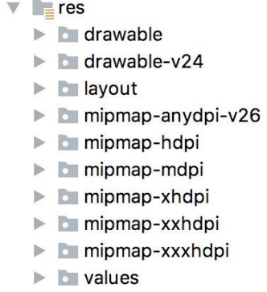
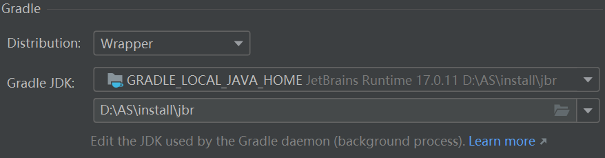
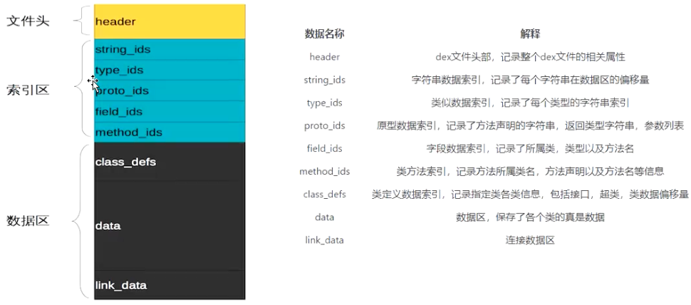

#  一.项目结构

## 3.1 manifest.xml文件：

 AndroidManifest.xml 是 Android 应用程序中的一个重要文件，它包含了应用程序的元数据信息和配置。该文件在应用程序的根目录下，主要用途如下： 

 **应用声明：** 在 AndroidManifest.xml 文件中，您需要声明应用程序中的所有组件，例如活动（Activity）、服务（Service）、接收器（BroadcastReceiver）和内容提供者（ContentProvider）。这些声明告诉系统应用程序包含哪些组件以及如何与它们进行交互。 

```xml
<application>
    <activity android:name=".MainActivity">
        <!-- 活动的声明 -->
        <intent-filter>
            <action android:name="android.intent.action.MAIN" />
            <category android:name="android.intent.category.LAUNCHER" />
        </intent-filter>
    </activity>
    <!-- 其他组件的声明 -->
</application>
```

 **权限声明：** AndroidManifest.xml 文件用于声明应用程序需要的系统权限。这些权限声明告诉用户应用程序需要访问某些敏感数据或执行某些敏感操作。用户在安装应用程序时会看到这些权限，并决定是否同意授予。 

```xml
<uses-permission android:name="android.permission.INTERNET" />
```

 **应用程序信息：** 在 AndroidManifest.xml 中，您可以指定应用程序的名称、图标、版本号等信息。 

```xml
<application
    android:label="@string/app_name"
    android:icon="@mipmap/ic_launcher"
    android:theme="@style/AppTheme">
    <!-- 其他应用程序信息 -->
</application>
```

 **应用程序配置：** AndroidManifest.xml 还用于配置应用程序的行为，例如启动模式、清单合并规则等。 

```xml
<activity
    android:name=".MainActivity"
    android:launchMode="singleTop">
    <!-- 其他活动配置 -->
</activity>
```


## **3.2 res**目录下的结构 



### 3.2.1 drawable和mipmap

> [手机屏幕适配和mipmap详解](https://blog.csdn.net/lantiankongmo/article/details/50549128 )

- 所有以“drawable”开头的目录都是用来放图片的
- 所有以“mipmap”开头的目录都是用来放应用图标的
- 所有以“values”开头的目录都是用来放字符串、样式、颜色等配置的，
- 所有以“layout”开头的目录都是用来放布局文件的

> `mipmap`有很多目录的原因是为了适应不同的分辨率，在制作程序的时候， 最好能够给同一张图片提供几个不同分辨率的版本，分别放在这些目录下，然后程序运行的时候，会自动根据当前运行设备分辨率的高低选择加载哪个目录下的图片。
>
> **如果没有这么多分辨率图片，那么可以放到xxhdpi目录，这是目前主流的设备分辨率目录**

> **drawable目录也是相同的道理**，虽然Android Studio没有帮我们自动生成，但是我们应该自己创建`drawable-hdpi`、`drawable-xhdpi`、`drawable-xxhdpi`等目录


### 3.2.2 `values`目录

以`res/values/strings.xml`文件为例，内容如下所示：

```xml
<resources>
 <string name="app_name">HelloWorld</string>
</resources>
```

定义了一个应用程序名的字符串，我们有以下两种方式来引用它。 

- 在代码中通过`R.string.app_name`可以获得该字符串的引用。 

- 在XML中通过`@string/app_name`可以获得该字符串的引用。

> 举一反三，如果是图标就引用mipmap、如果是图片就引用drawable、如果是布局就引用layout
>
> 具体写法可以参考`manifest.xml`

## 3.3 build.gradle

> [两个gradle文件区别](https://www.cnblogs.com/skynight/p/17616912.html)
>
> [gradle to DSL](https://mp.weixin.qq.com/s/U22oY79mxs9RJHvGjgVmTQ)

### 3.3.1 app的build.gradle

```groovy
buildscript {
    ext.kotlin_version = '1.3.61'
    repositories {
        google()
        jcenter()
    }
    dependencies {
        classpath 'com.android.tools.build:gradle:3.5.2'
        classpath "org.jetbrains.kotlin:kotlin-gradle-plugin:$kotlin_version"
    }
}
allprojects {
    repositories {
        google()
        jcenter()
    }
}
```

**repositories**

google仓库中包含的主要是Google自家的扩展依赖库，而jcenter仓库中包含的大多是一些第三方的开源库。

> ***Gradle7.5的Maven仓库配置已经从build.gradle文件转移到setting.gradle文件里了，因此该配置要写在setting.gradle文件里***

**dependencies**

classpath声明了两个插件：一个Gradle插件和一个Kotlin插件。

- **因为Gradle并不是专门为构建Android项目而开发的**，Java、C++等很多种项目也可以使用Gradle来构建，因此如果要想使用它来构建Android项目，则需要声明`com.android.tools.build:gradle:版本号`这个android使用gradle的插件。
- 另外一个Kotlin插件则表示当前项目是使用Kotlin进行开发的，如果是Java版的Android项目，则不需要声明这个插件

> ***Gradle7.5开始build.gradle文件已经有变化，原本的内容迁移到setting.gradle文件里面了***
>
> ```groovy
> plugins {
>  id 'com.android.application' version '8.2.0' apply false
> }
> 
> //定义了一个名为com.android.application的插件，版本号为8.2.0，但是不会立即应用到项目中。可以在构建脚本的其他地方使用apply plugin: 'com.android.application'语句来手动应用该插件。
> //com.android.application就是Android Gradle Plugin
> ```
>
> 然后在其他地方手动应用该插件
>
> 例如在module的build.gradle文件
>
> ```groovy
> plugins {
>     id 'com.android.application'
> }
> 
> android {
>     ....
> }
> ```

> [plugins和apply plugin区别](https://huangxshuo.github.io/2021/03/04/apply%20plugin%E5%92%8Cplugins%E4%B8%A4%E7%A7%8D%E5%BA%94%E7%94%A8gradle%E6%8F%92%E4%BB%B6%E7%9A%84%E5%8C%BA%E5%88%AB/)


### 3.3.2 module模块下的build.gradle

```groovy
apply plugin: 'com.android.application'
apply plugin: 'kotlin-android'
apply plugin: 'kotlin-android-extensions'
android {
    compileSdkVersion 29
    buildToolsVersion "29.0.2"
    defaultConfig {
        applicationId "com.example.helloworld"
        minSdkVersion 21
        targetSdkVersion 29
        versionCode 1
        versionName "1.0"
        testInstrumentationRunner "androidx.test.runner.AndroidJUnitRunner"
    }
    buildTypes {
        release {
            minifyEnabled false
            proguardFiles getDefaultProguardFile('proguard-android-optimize.txt'),
                'proguard-rules.pro'
        }
    }
    compileOptions {
        sourceCompatibility JavaVersion.VERSION_1_8
        targetCompatibility JavaVersion.VERSION_1_8
    }
    kotlinOptions {
        jvmTarget = '1.8'
    }
}
dependencies {
    implementation fileTree(dir: 'libs', include: ['*.jar'])
    implementation "org.jetbrains.kotlin:kotlin-stdlib-jdk7:$kotlin_version"
    implementation 'androidx.appcompat:appcompat:1.1.0'
    implementation 'androidx.core:core-ktx:1.1.0'
    implementation 'androidx.constraintlayout:constraintlayout:1.1.3'
    testImplementation 'junit:junit:4.12'
    androidTestImplementation 'androidx.test.ext:junit:1.1.1'
    androidTestImplementation 'androidx.test.espresso:espresso-core:3.2.0'
}
```

**下面逐行开始解析：**

```groovy
apply plugin: 'com.android.application'
```

首先第一行应用了一个插件，一般有两种值可选：

`com.android.application`表示这是一个应用程序模块，`com.android.library`表示这是一个库模块。二者最大的区别在于，应用程序模块是可以直接运行的，库模块只能作为代码库依附于别的应用程序模块来运行

> 高版本的gradle文件有变化，变为如下
>
> ```groovy
> plugins {
>      id 'com.android.application'
> }
> ```

-----

```groovy
apply plugin: 'kotlin-android'
apply plugin: 'kotlin-android-extensions'
```

接下来的两行应用了kotlin-android和kotlin-android-extensions这两个插件。如果想要使用Kotlin来开发Android项目，那么第一个插件就是必须应用的。而第二个插件帮助=实现了一些非常好用的Kotlin扩展功能

-------

```groovy
compileSdkVersion 29
buildToolsVersion "29.0.2"
```

compileSdkVersion用于指定项目的编译版本，这里指定成29表示使用Android 10.0系统的SDK编译。buildToolsVersion用于指定项目构建工具的版本

-----

```groovy
 applicationId "com.example.helloworld"
```

applicationId是每一个应用的唯一标识符，绝对不能重复。

-----

```groovy
minSdkVersion 21
targetSdkVersion 29
```

`minSdkVersion`用于指定项目最低兼容的Android系统版本，这里指定成21表示最低兼容到Android 5.0系统。

`targetSdkVersion`指定的值表示你在该目标版本上已经做过了充分的测试，系统将会为应用程序启用支持的功能和特性。比如Android 6.0系统中引入了运行时权限这个功能，如果将`targetSdkVersion`指定成23或者更高，那么系统就会为程序启用**运行时权限功能**

-----

```groovy
versionCode 1
versionName "1.0"
testInstrumentationRunner "androidx.test.runner.AndroidJUnitRunner"
```

`versionCode`用于指定项目的版本号， 

`versionName`用于指定项目的版本名。

`testInstrumentationRunner`用于在当前项目中启用`JUnit`测试，可以为当前项目编写测试用例，以保证功能的正确性和稳定性。


#### buildTypes闭包

用于指定生成安装文件的相关配置，通常只会有两个子闭包：**一个是debug，一个是release。** 

debug闭包用于指定生成测试版安装文件的配置，release闭包用于指定生成正式版安装文件的配置。另外，debug闭包是可以忽略不写的。

```groovy
release {
    minifyEnabled false
    proguardFiles getDefaultProguardFile('proguard-android-optimize.txt'),'proguard-rules.pro'
}
```

`minifyEnabled`用于指定是否 对项目的代码进行混淆，true表示混淆，false表示不混淆。

`proguardFiles`用于指定混淆时使用的规则文件，这里指定了两个文件：第一个`proguard-android-optimize.txt`是在 

`<Android SDK>/tools/proguard`目录下的，里面是所有项目通用的混淆规则；第二个 `proguard-rules.pro`是在当前项目的根目录下的，里面可以编写当前项目特有的混淆规则。


#### compileOptions和kotlinOptions

> https://juejin.cn/post/7223278436893327421

**compileOptions 的 JDK**

**定义：**

- 与项目的代码编译相关的 JDK 配置。
- `compileOptions` 中的 `sourceCompatibility` 和 `targetCompatibility` 确定了项目源码可以使用的 Java 特性以及生成的字节码的目标版本。

**作用：**

- 决定编译时的 Java 源代码语言级别（`sourceCompatibility`）。
- 决定生成的字节码兼容的最低 Java 版本（`targetCompatibility`）。

> **与gradle jdk区别是？**
>
> 
>
> **Gradle JDK**
>
> **定义**：
>
> - 指的是**用于运行 Gradle 构建工具 的 JDK**。
> - 这个 JDK 主要负责执行 Gradle 脚本和任务，如编译代码、生成 APK/Bundle、处理依赖项等。
>
> **作用**：
>
> - 决定了 Gradle 本身运行时使用的 Java 环境版本。
> - **重要性**：Gradle 必须运行在支持的 JDK 版本上（Android Gradle 插件对 JDK 有最低版本要求）。
>
> **配置**：
>
> - 在 Android Studio中，可以通过以下方式设置 Gradle 的 JDK：
>   1. File > Settings > Build, Execution, Deployment > Build Tools > Gradle > Gradle JDK。
>   2. 通常推荐使用 Embedded JDK（由 Android Studio 提供）或指定其他版本的 JDK。
>
> **Gradle JDK 与项目编译时生成的字节码无直接关系，只影响构建工具本身的运行。**


#### dependeces

- **本地依赖**

  > `implementation fileTree`就是一个本地依赖声明，它表示将`libs`目录下所有`.jar`后缀的文件都添加到项目的构建路径中

- **库依赖**

  > 基本格式是`implementation project`后面加上要依赖的库的名称：
  >
  > ​	比如有一个库模块的名字叫helper，那么添加这个库的依赖关系只需要加入 `implementation project(':helper')`这句声明即可

- **远程依赖**

  > `implementation`则是远程依赖声明，`androidx.appcompat:appcompat:1.1.0`就是一个标准的远程依赖库格式：
  >
  > ​	其中`androidx.appcompat`是域名部分，用于和其他公司的库做区分；`appcompat`是工程名部分，用于和同一个公司中不同的库工程做区分；`1.1.0`是版本号，用于和同一个库不同的版本做区分。


## 1.引入依赖

> [gradle 打包编译依赖冲突解决神奇：compileOnly只在编译时使用依赖_](https://blog.csdn.net/misterdongjing/article/details/88863896) 
>
>  [添加 build 依赖项  | Android 开发者 ](https://developer.android.google.cn/studio/build/dependencies?hl=zh-cn) 

# 二.so文件

>  [Linux的so文件到底是干嘛的？浅析Linux的动态链接库 ](https://www.zhihu.com/tardis/zm/art/235551437?source_id=1005) 


# 三.dex文件

> [Dex文件解析](https://juejin.cn/post/6844903847647772686)

dex文件是Android系统的可执行文件，包含应用程序内的全部指令以及运行时数据。将原来每个`class`文件都有的共有信息合成一体，这样减少了`class`的冗余。

> 生成dex文件命令
>
> 首先生成class文件
>
> ```shell
> java Test.java
> ```
>
> 然后生成dex文件
>
> ```shell
> dx --dex --output=a.dex Test.class
> ```

**Dex文件构成**



> **header**：
>
> 一般存放[魔数](#magicnumber)等信息


# 


