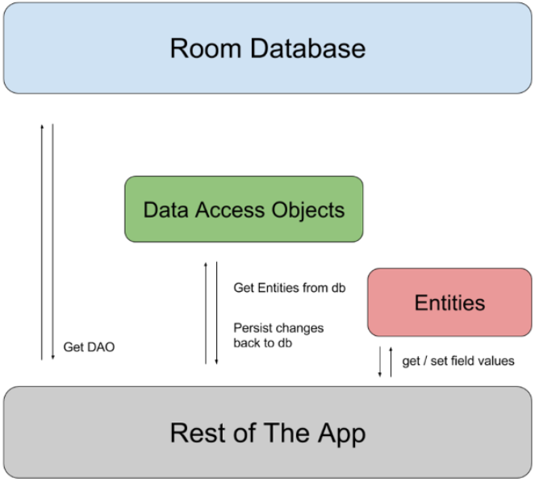

# JetPack

 **Jetpack** 是一个由 Google 开发的 Android 软件开发工具包 (SDK) 的集合。它包含一系列用于构建 Android 应用的库和工具 

## 一、ViewModel

> [viewmodel作用域与数据共享]
>
> [viewmodel如何恢复数据](https://juejin.cn/post/6986936609522319391)

### 1.概述

ViewModel是一个旨在以注重生命周期的方式存储和管理与UI相关的数据的类。它可以帮助开发者在配置更改（如屏幕旋转）时保留数据，从而避免数据丢失。 `ViewModel`类不依赖于Activity或Fragment的生命周期，因此**让数据可在发生配置更改(屏幕旋转)后继续留存，为Activity和Fragment保留数据**

```groovy
// ViewModel依赖
def lifecycle_version = "2.3.1"
implementation "androidx.lifecycle:lifecycle-viewmodel-ktx:$lifecycle_version"
```

> ### ViewModel和静态类的区别：
>
> 问：既然ViewModel不受acitivity生命周期影响，那用静态类也可以实现，两者有什么区别？
> 答：一般一个Activity / Fragment 对应着一个ViewModel，这样有利于模块化，当Activity finish 或 Fragment detached 才会失效，退出时会自动回调onClear方法清理内存，而static静态类是一个全局对象，所有类都可以共用，退出时需要手动管理对象内存

### 2.生命周期

ViewModel会***一直存在在内存中***直到限定其存在范围的Lifecycle永久消失：

- 对于 Activity，是在Activity完成时；
- 而对于 Fragment，是在 Fragment 分离时。

图 1 说明了 Activity 经历屏幕旋转一直到结束时所处的各种生命周期状态。该图Activity 生命周期的旁边显示了 ViewModel的生命周期。此图表说明了 Activity 的各种状态。这些基本状态同样适用于 Fragment 的生命周期。


### 3.实现加载器

**通过ViewModel和Room以及LiveData来实现加载器的功能**

> 在以前，可以使用`CursorLoader`加载器来观察数据库的内容，当数据库中的值发生更改时，加载器会自动触发数据的重新加载并更新界面。下图为加载器加载：
>
> 

`ViewModel`与`Room`和 `LiveData`一起使用可替换加载器。`ViewModel`确保数据在设备配置更改后仍然存在。`Room`在数据库发生更改时通知 `LiveData`，`LiveData`进而使用修订后的数据更新界面。


### 4.ViewModel简单使用

通过继承ViewModel类，并结合LiveData实现对数据保存，因为ViewModel有自己的生命周期，所以LiveData和ViewModel绑定就不会受Activity的影响，在***应用配置更改期间viewmodel对象不会销毁，所以可以为Activity和Fragment恢复数据***。

**例如：要在程序中保存用户列表信息**

```java
public class UserModel extends ViewModel {

    public final MutableLiveData<User> mUserLiveData = new MutableLiveData<>();

    public UserModel() {
        //模拟从网络加载用户信息
        mUserLiveData.postValue(new User(1, "name1"));
    }

    //模拟 进行一些数据骚操作
    public void doSomething() {
        User user = mUserLiveData.getValue();
        if (user != null) {
            user.age = 15;
            user.name = "name15";
            mUserLiveData.setValue(user);
        }
    }
}
```

然后可以在Activity访问该列表

```java
import androidx.fragment.app.FragmentActivity;
import androidx.lifecycle.Observer;
import androidx.lifecycle.ViewModelProviders;

public class MainActivity extends FragmentActivity {

    private TextView mContentTv;

    @Override
    protected void onCreate(Bundle savedInstanceState) {
        super.onCreate(savedInstanceState);
        setContentView(R.layout.activity_main);

        mContentTv = findViewById(R.id.tv_content);

        //构建ViewModel实例
        final UserModel userModel = ViewModelProviders.of(this).get(UserModel.class);

        //让TextView观察ViewModel中数据的变化,并实时展示
        userModel.mUserLiveData.observe(this, new Observer<User>() {
            @Override
            public void onChanged(User user) {
                mContentTv.setText(user.toString());
            }
        });

        findViewById(R.id.btn_test).setOnClickListener(new View.OnClickListener() {
            @Override
            public void onClick(View view) {
                //点击按钮  更新User数据  观察TextView变化
                userModel.doSomething();
            }
        });
    }
}
```

> **observe用于观察LiveData的更新**
>
> - 第一个参数owner，是为了感知这个参数的生命周期。
> - 第二个参数是回调，内部会帮你切换到主线程。


### 4.实现MVVM

viewmodel的设计出现就是为了能够实现MVVM架构，因为ViewModel一直存在内存中，方便对数据恢复，同时实现与数据绑定，起到了view和model的桥梁。

**下面用ViewModel、LiveData、DataBinding例子来实现登录功能：**

Model 层主要需要实现两个功能：一是通过网络请求实现登录，登录成功后会得到 UID；二是将登录账号保存到 SQLite，实现登录账号的缓存功能。(为了简便，我们不编写完整代码，就只用伪代码简单模拟一下实现流程)： 

```java
public class LoginRepository {
    ...
        public String login(String userName, String password) {
        // 调用网络请求
        String uid = apiService.login(userName, password);
        // 将userName缓存到本地数据库
        cache.save("userName", userName);

        return uid;
    }
    // 从缓存中获取登录账号
    public String getUserNameFromCache() {
        return cache.get("userName");
    }
}

```

**下面实现ViewModel代码**

```java
public class LoginViewModel extends ViewModel {
    public MutableLiveData<String> userName;
    public MutableLiveData<String> password;
    public MutableLiveData<String> uid;

    private LoginRepository repository;

    public LoginViewModel() {
        repository = new LoginRepository();
        userName.postValue(repository.getUserNameFromCache());
        password = new MutableLiveData<>("");
        uid = new MutableLiveData<>("0");
    }

    public void login() {
        String userId = repository.login(userName.getValue(), password.getValue());
        uid.postValue(userId);
    }
}
```

> LoginViewModel 并没有 Activity 或 Fragment 的引用，也没有像 MVP 所定义的 LoginView 的接口实例的引用。即是说，ViewModel 并不依赖于 View 层，所以，ViewModel 自然也更便于测试和复用。
>
> 将 **userName、password、uid** 三个变量声明为 **MutableLiveData** 类型，就可以实现自动将数据变化通知给界面。因此，上面代码中，数据变化后我们并没有再添加代码去通知界面更新 UI，其背后的机制已经自动帮我们完成了通知。 

**然后实现View层**

```java
public class LoginActivity extends AppCompatActivity {
    @Override
    protected void onCreate(Bundle savedInstanceState) {
        super.onCreate(savedInstanceState);
        // 初始化viewModel
        LoginViewModel viewModel = new ViewModelProvider(this).get(LoginViewModel.class);
        // 与布局文件进行绑定，这里通过databinding
        ActivityLoginBinding binding = DataBindingUtil.setContentView(this, R.layout.activity_login);
        binding.setLifecycleOwner(this);
        binding.setViewmodel(viewModel);
    }
}

```

**布局文件**

```xml
<?xml version="1.0" encoding="utf-8"?>
<layout xmlns:tools="http://schemas.android.com/tools"
    xmlns:android="http://schemas.android.com/apk/res/android"
    xmlns:app="http://schemas.android.com/apk/res-auto">
    <data>
        <variable
            name="vm"
            type="com.example.mvvm.LoginViewModel" />
    </data>
    <androidx.constraintlayout.widget.ConstraintLayout
        android:layout_width="match_parent"
        android:layout_height="match_parent">
        <EditText
            android:id="@+id/userName"
            android:layout_width="wrap_content"
            android:layout_height="wrap_content"
            android:text="@={vm.userName}"
            app:layout_constraintBottom_toTopOf="@+id/password"
            app:layout_constraintEnd_toEndOf="parent"
            app:layout_constraintStart_toStartOf="parent"
            app:layout_constraintTop_toTopOf="parent" />
        <EditText
            android:id="@+id/password"
            android:layout_width="wrap_content"
            android:layout_height="wrap_content"
            android:inputType="textPassword"
            android:text="@={vm.password}"
            app:layout_constraintBottom_toTopOf="@+id/login"
            app:layout_constraintEnd_toEndOf="parent"
            app:layout_constraintStart_toStartOf="parent"
            app:layout_constraintTop_toBottomOf="@+id/userName" />
        <Button
            android:id="@+id/login"
            android:layout_width="wrap_content"
            android:layout_height="wrap_content"
            android:onClick="@{() -> vm.login()}"
            android:text="Login"
            app:layout_constraintEnd_toEndOf="parent"
            app:layout_constraintStart_toStartOf="parent"
            app:layout_constraintTop_toBottomOf="@+id/password" />
        <TextView
            android:id="@+id/uid"
            android:layout_width="wrap_content"
            android:layout_height="wrap_content"
            android:text="@{vm.uid}"
            app:layout_constraintEnd_toEndOf="parent"
            app:layout_constraintStart_toStartOf="parent"
            app:layout_constraintTop_toBottomOf="@+id/login" />
    </androidx.constraintlayout.widget.ConstraintLayout>
</layout>
```

> data 内的 variable 标签定义的就是我们的 LoginViewModel，我将其命名为 vm，然后就可以在下面的控件中引用它。 
>
> 代码中分别设置为了 **@={vm.userName}、@={vm.password}、@{vm.uid}**
>
> - 如果**@后面不加等号，那就只是单向绑定**，只能由 ViewModel 将数据变化通知到界面。
> - 加了等号，才是双向绑定


## 二、LiveData

### 1.概述

> - LiveData是一个可观察的数据持有器类 ，持有可被观察的数据。
>  - LiveData是一种**可感知生命周期的组件**，仅仅在Activity、Fragment、Service等组件都处于活跃的生命周期状态的时候，才去更新app组件。
>  - 当LiveData的数据发生变化时，它会自动通知所有活动的观察者，从而更新UI 

### 2.优势

- **确保界面符合数据状态**

LiveData 遵循观察者模式。当底层数据发生变化时，LiveData 会通知 [`Observer`] 对象，可以在`Observer` 对象中更新界面。（类似于数据绑定？）

- **不会发生内存泄漏**

观察者会绑定到 [`Lifecycle`]对象，并在其关联的生命周期遭到销毁后进行自我清理。

- **不会因 Activity 停止而导致崩溃**

如果观察者的生命周期处于非活跃状态（如返回栈中的 Activity），则它不会接收任何 LiveData 事件。

- **不再需要手动处理生命周期**

界面组件只是观察相关数据，不会停止或恢复观察。LiveData 将自动管理所有这些操作，因为它在观察时可以感知相关的生命周期状态变化。

- **数据始终保持最新状态**

如果生命周期变为非活跃状态，它会在再次变为活跃状态时接收最新的数据。例如，曾经在后台的 Activity 会在返回前台后立即接收最新的数据。

- **适当的配置更改**

如果由于配置更改（如设备旋转）而重新创建了 Activity 或 Fragment，它会立即接收最新的可用数据。

- **共享资源**

您可以使用单例模式扩展 [`LiveData`](https://developer.android.google.cn/reference/androidx/lifecycle/LiveData) 对象以封装系统服务，以便在应用中共享它们。`LiveData` 对象连接到系统服务一次，然后需要相应资源的任何观察者只需观察 `LiveData` 对象。如需了解详情，请参阅[扩展 LiveData](https://developer.android.google.cn/topic/libraries/architecture/livedata#extend_livedata)。

### 3.使用

> 1. 在 [`ViewModel`]类中完成,创建 `LiveData` 的实例以存储某种类型的数据
> 2. 创建[`Observer`]对象，通过回调`onChange()`函数观察LiveData是否改变。
> 3. 使用 [`observe()`] 方法将 `Observer` 对象附加到 `LiveData` 对象。`observe()` 方法会采用 [`LifecycleOwner`] 对象。这样会使 `Observer` 对象订阅 `LiveData` 对象，以使其收到有关更改的通知。通常情况下，您可以在界面控制器（如 Activity 或 Fragment）中附加 `Observer` 对象。

当您更新存储在 `LiveData` 对象中的值时，它会触发所有已注册的观察者（只要附加的 `LifecycleOwner` 处于活跃状态）。

#### LiveData与MutableLiveData区别

> LiveData与MutableLiveData在概念上是一模一样的.唯一几个的区别如下:
>
> 1. MutableLiveData的父类是LiveData
> 2. LiveData在实体类里可以通知指定某个字段的数据更新.
> 3. MutableLiveData则是完全是整个实体类或者数据类型变化后才通知.不会细节到某个字段

**[`LiveData`]对象通常存储在 [`ViewModel`]对象中**，并可通过 getter 方法进行访问，如以下示例中所示：

```java
public class NameViewModel extends ViewModel {

    // Create a LiveData with a String
    private MutableLiveData<String> currentName;

    public MutableLiveData<String> getCurrentName() {
        if (currentName == null) {
            currentName = new MutableLiveData<String>();
        }
        return currentName;
    }

    // Rest of the ViewModel...
}
```

#### 观察Livedata

在大多数情况下，应该从 `onCreate()` 方法开始观察 [`LiveData`]对象，原因如下：

- 确保系统不会从 Activity 或 Fragment 的 `onResume()` 方法进行冗余调用。
- 确保 Activity 或 Fragment 变为活跃状态后具有**可以立即显示的数据。**一旦应用组件处于 [`STARTED`](https://developer.android.google.cn/reference/androidx/lifecycle/Lifecycle.State#STARTED) 状态，就会从它正在观察的 `LiveData` 对象接收最新值。只有在设置了要观察的 `LiveData` 对象时，才会发生这种情况。

LiveData发送更新的几种情况

- **LiveData 仅在数据发生更改时才发送更新，并且仅发送给活跃观察者。**
- 观察者从非活跃状态更改为活跃状态时也会收到更新。
- 此外，如果观察者第二次从非活跃状态更改为活跃状态，则只有在自上次变为活跃状态以来值发生了更改时，它才会收到更新。

以下示例代码说明了如何开始观察 `LiveData` 对象：

```java
public class NameActivity extends AppCompatActivity {

    private NameViewModel model;

    @Override
    protected void onCreate(Bundle savedInstanceState) {
        super.onCreate(savedInstanceState);

        // Other code to setup the activity...

        // Get the ViewModel.
        model = new ViewModelProvider(this).get(NameViewModel.class);

        // Create the observer which updates the UI.
        final Observer<String> nameObserver = new Observer<String>() {
            @Override
            public void onChanged(@Nullable final String newName) {
                // Update the UI, in this case, a TextView.
                nameTextView.setText(newName);
            }
        };

        // 观察viewmodel中getCurrentName方法，并且更新数据
        model.getCurrentName().observe(this, nameObserver);
    }
}
```

> **observe()方法用于观察LiveData的改变**
>
> 传入的第一个参数owner，是为了感知这个参数的生命周期。第二个参数是回调，内部会帮你切换到主线程。

#### 更新LiveData

> LiveData没有公开可用的方法来更新存储的数据，但是***MutableLiveData类公开了setValue(T)、postValue(T)方法来修改存储在LiveData对象中的值***

例如：当用户点击某个按钮时会触发所有观察者

```java
button.setOnClickListener(new OnClickListener() {
    @Override
    public void onClick(View v) {
        String anotherName = "John Doe";
        model.getCurrentName().setValue(anotherName);//此时onChanged()方法会触发
    }
});
```

> 必须调用 [`setValue(T)`]方法以从**主线程更新 `LiveData` 对象**。如果在工作器线程中执行代码，您可以改用 [`postValue(T)`]方法来更新 `LiveData` 对象。在所有情况下，调用 `setValue()` 或 `postValue()` 都会触发观察者并更新界面。

#### 拓展LiveData

```java
public class StockLiveData extends LiveData<BigDecimal> {
    private static StockLiveData sInstance;
    private StockManager stockManager;

    private SimplePriceListener listener = new SimplePriceListener() {
        @Override
        public void onPriceChanged(BigDecimal price) {
            setValue(price);
        }
    };

    @MainThread
    public static StockLiveData get(String symbol) {
        if (sInstance == null) {
            sInstance = new StockLiveData(symbol);
        }
        return sInstance;
    }

    private StockLiveData(String symbol) {
        stockManager = new StockManager(symbol);
    }

    @Override
    protected void onActive() {
        stockManager.requestPriceUpdates(listener);
    }

    @Override
    protected void onInactive() {
        stockManager.removeUpdates(listener);
    }
}
```

> 本示例中的价格监听器实现包括以下重要方法：
>
> - 当 `LiveData` 对象具有活跃观察者时，会调用 [`onActive()`] 方法。这意味着，您需要从此方法开始观察股价更新。
> - 当 `LiveData` 对象没有任何活跃观察者时，会调用 [`onInactive()`]方法。由于没有观察者在监听，因此没有理由与 `StockManager` 服务保持连接。
> - [`setValue(T)`]方法将更新 `LiveData` 实例的值，并告知活跃观察者。

可以在多个Activity和fragment使用

```java
public class MyFragment extends Fragment {
    @Override
    public void onViewCreated(@NonNull View view, @Nullable Bundle savedInstanceState) {
        super.onViewCreated(view, savedInstanceState);
        LiveData<BigDecimal> myPriceListener = ...;
        StockLiveData.get(symbol).observe(getViewLifecycleOwner(), price -> {
            // Update the UI.
        });
    }
}
```

> [`observe()`] 方法将与 Fragment 视图关联的 [`LifecycleOwner`] 作为第一个参数传递。这样做表示此观察者已绑定到与所有者关联的 [`Lifecycle`]对象，这意味着：
>
> - 如果 `Lifecycle` 对象未处于活跃状态，那么即使值发生更改，也不会调用观察者。
> - 销毁 `Lifecycle` 对象后，会自动移除观察者。

#### 转换LiveData

您可能希望在将 [`LiveData`]对象分派给观察者之前对存储在其中的值进行更改，或者您可能需要根据另一个实例的值返回不同的 `LiveData` 实例。

>  **Transformation.map()**
>
>  对存储在 `LiveData` 对象中的值应用函数，并将结果传播到下游。

```java
LiveData<User> userLiveData = ...;
LiveData<String> userName = Transformations.map(userLiveData, user -> {
    user.name + " " + user.lastName
});
```

> ****

> **Transformation.switchMap()**
>
> 与 `map()` 类似，对存储在 `LiveData` 对象中的值应用函数，并将结果解封和分派到下游。传递给 `switchMap()` 的函数必须**返回 `LiveData` 对象**

```java
private LiveData<User> getUser(String id) {
  ...;
}

LiveData<String> userId = ...;
LiveData<User> user = Transformations.switchMap(userId, id -> getUser(id) );
```


### Kotlin协程与LiveData

> 参考——https://blog.csdn.net/jzlhll123/article/details/119728380

#### 1.概述

> 持久性库在 SQLite 的基础上提供了一个抽象层，让用户能够在充分利用 SQLite 的强大功能的同时，获享更强健的数据库访问机制。
>
> 该库可帮助您在运行应用的设备上创建应用数据的缓存。此缓存充当应用的单一可信来源，使用户能够在应用中查看关键信息的一致副本，无论用户是否具有互联网连接。

```groovy
//依赖
dependencies {
    def room_version = "2.3.0"

    implementation "androidx.room:room-runtime:$room_version"
    annotationProcessor "androidx.room:room-compiler:$room_version"

    // optional - RxJava2 support for Room
    implementation "androidx.room:room-rxjava2:$room_version"

    // optional - RxJava3 support for Room
    implementation "androidx.room:room-rxjava3:$room_version"

    // optional - Guava support for Room, including Optional and ListenableFuture
    implementation "androidx.room:room-guava:$room_version"

    // optional - Test helpers
    testImplementation "androidx.room:room-testing:$room_version"
}
```


## 三、Room

> [Room使用](https://developer.android.google.cn/training/data-storage/room?hl=zh-cn)

### (1)概览

Room 持久性库在 SQLite 上提供了一个抽象层，具有以下优势：

- 针对 SQL 查询的编译时验证。
- 可最大限度减少重复和容易出错的样板代码的方便注解。
- 简化了数据库迁移路径。

> **使用Room框架的其中一个好处是，如果创建过程中有问题，在编译期间编辑器就会提示你，而不用等到程序运行时。**

### (2)主要组件

- [数据库类]，用于保存数据库并作为应用持久性数据底层连接的主要访问点。
- [数据实体]，用于表示应用的数据库中的表。
- [数据访问对象 (DAO)]，提供您的应用可用于查询、更新、插入和删除数据库中的数据的方法。



### (3)使用案例

```groovy
dependencies {
    def room_version = "2.5.0"

    implementation "androidx.room:room-runtime:$room_version"
    annotationProcessor "androidx.room:room-compiler:$room_version"

    // To use Kotlin annotation processing tool (kapt)
    kapt "androidx.room:room-compiler:$room_version"
    // To use Kotlin Symbol Processing (KSP)
    ksp "androidx.room:room-compiler:$room_version"

    // optional - RxJava2 support for Room
    implementation "androidx.room:room-rxjava2:$room_version"

    // optional - RxJava3 support for Room
    implementation "androidx.room:room-rxjava3:$room_version"

    // optional - Guava support for Room, including Optional and ListenableFuture
    implementation "androidx.room:room-guava:$room_version"

    // optional - Test helpers
    testImplementation "androidx.room:room-testing:$room_version"

    // optional - Paging 3 Integration
    implementation "androidx.room:room-paging:$room_version"
}
```

**数据实体**

以下代码定义了一个 `User` 数据实体。`User` 的每个实例都代表应用数据库中 `user` 表中的一行。

```java
@Entity
public class User {
    @PrimaryKey
    public int uid;

    @ColumnInfo(name = "first_name")
    public String firstName;

    @ColumnInfo(name = "last_name")
    public String lastName;
}
```

**数据访问对象**

`UserDao` 提供了应用的其余部分用于与 `user` 表中的数据交互的方法。

```java
@Dao
public interface UserDao {
    @Query("SELECT * FROM user")
    List<User> getAll();

    @Query("SELECT * FROM user WHERE uid IN (:userIds)")
    List<User> loadAllByIds(int[] userIds);

    @Query("SELECT * FROM user WHERE first_name LIKE :first AND " +
           "last_name LIKE :last LIMIT 1")
    User findByName(String first, String last);

    @Insert
    void insertAll(User... users);

    @Delete
    void delete(User user);
}
```

**数据库**

以下代码定义了用于保存数据库的 `AppDatabase` 类。 `AppDatabase` 定义数据库配置，并作为应用对持久性数据的主要访问点。数据库类必须满足以下条件：

- 该类必须带有 [`@Database`]注解，该注解包含列出所有与数据库关联的数据实体的 [`entities`] 数组。
- 该类必须是一个抽象类，用于扩展 [`RoomDatabase`]。
- 对于与数据库关联的每个 DAO 类，数据库类必须定义一个具有零参数的抽象方法，并返回 DAO 类的实例。

```java
@Database(entities = {User.class}, version = 1)
public abstract class AppDatabase extends RoomDatabase {
    private static final String DATABASE_NAME = "my_db";

    private static MyDataBase myDataBase;

    //单例模式
    public static synchronized MyDataBase getInstance(Context context){
        if(myDataBase==null){
            myDataBase = Room.databaseBuilder(context.getApplicationContext(),MyDataBase.class, DATABASE_NAME).build();
        }

        return myDataBase;
    }
    public abstract UserDao getUserdao();
}
```

> **注意**：
>
> ***①如果应用在单个进程中运行，在实例化 `AppDatabase` 对象时应遵循单例设计模式。***因为每个 `RoomDatabase` 实例的成本相当高。
>
> ②如果您的应用在多个进程中运行，请在数据库构建器调用中包含 `enableMultiInstanceInvalidation()`。这样，如果您在每个进程中都有一个 `AppDatabase` 实例，可以在一个进程中使共享数据库文件失效，并且这种失效会自动传播到其他进程中 `AppDatabase` 的实例。

**创建数据库实例**

```java
AppDatabase db = Room.databaseBuilder(getApplicationContext(),AppDatabase.class, "数据库名称").build();
```

**然后在 `AppDatabase` 中的抽象方法获取 DAO 的实例，转而可以使用 DAO 实例中的方法与数据库进行交互：**

```java
//对于数据库操作，不应该在UI线程进行
new Thread(){
    @Override
    public void run() {
        super.run();
        UserDao userDao = myDataBase.getUserdao();//获取UserDao实例
        userDao.insertUser(new UserEntity(1,"杨凯文"),new UserEntity(2,"文凯杨"));//插入数据
        List<UserEntity> userEntitys = userDao.getUsers();//获取数据
        //传递信息
        Message message = new Message();
        StringBuffer sb = new StringBuffer();
        for(UserEntity userEntity : userEntitys){
            sb.append(userEntity.getUseriId()+","+userEntity.getName()+"\n");
        }
        Bundle bundle = new Bundle();
        bundle.putString("数据库数据",sb.toString());
        message.setData(bundle);
        handler.sendMessage(message);
    }
}.start();

//接收处理信息
Handler handler = new Handler(new Handler.Callback() {
    @Override
    public boolean handleMessage(@NonNull Message msg) {

        textView.append(msg.getData().getString("数据库数据"));

        return true;
    }
});

```

```java
//也可以创建AsyncTask来后台完成数据库操作
private class QueryStudentTask extends AsyncTask<Void, Void, Void>
{
    public QueryStudentTask()
    {
 
    }
 
    @Override
    protected Void doInBackground(Void... arg0)
    {
        studentList.clear();
        studentList.addAll(myDatabase.studentDao().getStudentList());
        return null;
    }
 
    @Override
    protected void onPostExecute(Void result)
    {
        super.onPostExecute(result);
        studentAdapter.notifyDataSetChanged();
    }
}
```


### (4)具体组件解析

#### 1) 使用Room实体定义数据

想上面实例那样，定义一个实体

```java
@Entity
public class User {
    @PrimaryKey 
    public int id;

    public String firstName;
    public String lastName; //字段要公开，或者提供getter/setter方法，否则room无法访问
}
```


**定义表名称**

默认情况下，Room 将类名称用作数据库表名称。同样，字段名称也默认当做数据库中列的名称，如果想自定义，加上注解和属性

```java
@Entity(tableName = "users")
public class User {
    @PrimaryKey
    public int id;

    @ColumnInfo(name = "first_name")
    public String firstName;

    @ColumnInfo(name = "last_name")
    public String lastName;
}
```

> SqlLite中表和列名称不区分大小写

**复合主键**

```java
//定义复合主键
@Entity(primaryKeys = {"firstName", "lastName"})
public class User {
    public String firstName;
    public String lastName;
}
```

**忽略字段**

默认情况下，Room 会为实体中定义的每个字段创建一个列。 如果某个实体中有您不想保留的字段，则可以使用 [`@Ignore`](https://developer.android.google.cn/reference/androidx/room/Ignore?hl=zh-cn) 为这些字段添加注解，如以下代码段所示：

```java
@Entity
public class User {
    @PrimaryKey
    public int id;

    public String firstName;
    public String lastName;

    @Ignore
    Bitmap picture;
}
```

如果实体继承了父实体的字段，则使用 `@Entity` 属性的 [`ignoredColumns`]属性通常会更容易：

```java
@Entity(ignoredColumns = "picture")
public class RemoteUser extends User {
    @PrimaryKey
    public int id;

    public boolean hasVpn;
}
```


**全文搜索**

如果应用需要通过全文搜索 (FTS) 快速访问数据库信息，将 [`@Fts3`] 或 [`@Fts4`] 注解添加到给定实体：

```java
// Use `@Fts3` only if your app has strict disk space requirements or if you
// require compatibility with an older SQLite version.
@Fts4
@Entity(tableName = "users")
public class User {
    // 启用 FTS 的表始终使用 INTEGER 类型的主键且列名称为“rowid”。如果是由 FTS 表支持的实体定义主键，则必须使用相应的类型和列名称。
    @PrimaryKey
    @ColumnInfo(name = "rowid")
    public int id;

    @ColumnInfo(name = "first_name")
    public String firstName;
}
```


**将特定列编入索引**

如需为实体添加索引，请在 [`@Entity`]注解中添加 [`indices`]属性，列出要在索引或复合索引中包含的列的名称。

```java
@Entity(indices = {@Index("name"),@Index(value = {"last_name", "address"})})
public class User {
    @PrimaryKey
    public int id;

    public String firstName;
    public String address;

    @ColumnInfo(name = "last_name")
    public String lastName;

    @Ignore
    Bitmap picture;
}
```

为了指定列的唯一性，可以标记unique为true

```java
@Entity(indices = {@Index(value = {"first_name", "last_name"},unique = true)})
public class User {
    @PrimaryKey
    public int id;

    @ColumnInfo(name = "first_name")
    public String firstName;

    @ColumnInfo(name = "last_name")
    public String lastName;

    @Ignore
    Bitmap picture;
}
```


**添加基于AutoValue的对象**

> 什么是AutoValue：
>
> AutoValue是一个可以自动为值类（value type）生成诸如equals，hashCode，toString等模板方法的工具。这样就使得程序更加短小，简洁，以及更少的bug。
>
> > 参考——https://www.jianshu.com/p/d346188b4177

将带有 `@AutoValue` 注解的类用作实体时，必须在每次使用这些注解时添加 `@CopyAnnotations` 注解，以便 Room 可以正确解释这些方法的自动生成实现。

```java
@AutoValue
@Entity
public abstract class User {
    // Supported annotations must include `@CopyAnnotations`.
    @CopyAnnotations
    @PrimaryKey
    public abstract long getId();

    public abstract String getFirstName();
    public abstract String getLastName();

    // Room uses this factory method to create User objects.
    public static User create(long id, String firstName, String lastName) {
        return new AutoValue_User(id, firstName, lastName);
    }
}
```


#### 2)使用 Room DAO 访问数据

和springboot中的DAO类似，用来映射数据库操作，主要可以通过两种方式来设计接口：

- 可让您在不编写任何 SQL 代码的情况下插入、更新和删除数据库中行的便捷方法。

  > Room 提供了方便的注解，用于定义无需编写 SQL 语句即可执行简单插入、更新和删除的方法。
  >
  > **插入**：
  >
  > ```java
  > @Dao
  > public interface UserDao {
  > @Insert(onConflict = OnConflictStrategy.REPLACE) // 如果插入主键重复，则替换。还有其他的冲突解决机制
  > public void insertUsers(User... users);
  > 
  > @Insert
  > public void insertBothUsers(User user1, User user2);
  > 
  > @Insert
  > public void insertUsersAndFriends(User user, List<User> friends);
  > }
  > //@Insert 方法的每个参数必须是带有 @Entity 注解的 Room 数据实体类的实例或数据实体类实例的集合。调用 @Insert 方法时，Room 会将每个传递的实体实例插入到相应的数据库表中。
  > //如果 @Insert 方法接收单个参数，则会返回 long 值，这是插入项的新 rowId。如果参数是数组或集合，则该方法应改为返回由 long 值组成的数组或集合，并且每个值都作为其中一个插入项的 rowId。
  > ```
  >
  > **删除**:
  >
  > ```java
  > @Dao
  > public interface UserDao {
  > @Delete
  > public void deleteUsers(User... users);
  > }
  > ```
  >
  > **更新**：
  >
  > ```java
  > @Dao
  > public interface UserDao {
  > @Update
  > public void updateUsers(User... users);
  > }
  > ```

- 可让您编写自己的 SQL 查询以与数据库进行交互的查询方法。

  > 使用 [`@Query`]注解，您可以编写 SQL 语句并将其作为 DAO 方法公开。使用这些查询方法从应用的数据库查询数据，或者需要执行更复杂的插入、更新和删除操作。
  >
  > **简单查询：**
  >
  > ```java
  > @Query("SELECT * FROM user")
  > public User[] loadAllUsers();
  > ```
  >
  > **将函数参数绑定给查询：**
  >
  > ```java
  > @Query("SELECT * FROM user WHERE age > :minAge")
  > public User[] loadAllUsersOlderThan(int minAge);
  > ```
  >
  > ```java
  > @Query("SELECT * FROM user WHERE age BETWEEN :minAge AND :maxAge")
  > public User[] loadAllUsersBetweenAges(int minAge, int maxAge);
  > 
  > @Query("SELECT * FROM user WHERE first_name LIKE :search " +
  >  "OR last_name LIKE :search")
  > public List<User> findUserWithName(String search);
  > ```
  >
  > **传递一组长度未知参数：**
  >
  > ```java
  > @Query("SELECT * FROM user WHERE region IN (:regions)")
  > public List<User> loadUsersFromRegions(List<String> regions);
  > ```
  >
  > **多表查询：**
  >
  > ```java
  > @Query("SELECT * FROM book " +
  >  "INNER JOIN loan ON loan.book_id = book.id " +
  >  "INNER JOIN user ON user.id = loan.user_id " +
  >  "WHERE user.name LIKE :userName")
  > public List<Book> findBooksBorrowedByNameSync(String userName);
  > ```
  >
  > **简单对象查询特定的列：**
  >
  > ```java
  > @Dao
  > public interface UserBookDao {
  > @Query("SELECT user.name AS userName, book.name AS bookName " +
  >     "FROM user, book " +
  >     "WHERE user.id = book.user_id")
  > public LiveData<List<UserBook>> loadUserAndBookNames();
  > 
  > // You can also define this class in a separate file, as long as you add the
  > // "public" access modifier.
  > static class UserBook {
  >  public String userName;
  >  public String bookName;
  > }
  > }
  > ```

  **结合Paging分页查询**

  DAO 可以返回 [`PagingSource`]对象以便与 [Paging 3]搭配使用。

  ```java
  @Dao
  interface UserDao {
    @Query("SELECT * FROM users WHERE label LIKE :query")
    PagingSource<Integer, User> pagingSource(String query);
  }
  ```

  

#### 3)定义对象之间关系

- **中间数据类**

  > ```java
  > @Dao
  > public interface UserBookDao {
  > @Query("SELECT user.name AS userName, book.name AS bookName " +
  >     "FROM user, book " +
  >     "WHERE user.id = book.user_id")
  > public LiveData<List<UserBook>> loadUserAndBookNames();
  > }
  > 
  > public class UserBook {
  > public String userName;
  > public String bookName;
  > }
  > ```

- **多重映射**

  > ```java
  > @Query(
  > "SELECT * FROM user" +
  > "JOIN book ON user.id = book.user_id"
  > )
  > public Map<User, List<Book>> loadUserAndBookNames();
  > 
  > ```
  >
  > **更推荐该方法来替代中间类的方法**

- **嵌套对象**

  > ```java
  > public class Address {
  > public String street;
  > public String state;
  > public String city;
  > 
  > @ColumnInfo(name = "post_code") public int postCode;
  > }
  > 
  > @Entity
  > public class User {
  > @PrimaryKey public int id;
  > 
  > public String firstName;
  > 
  > @Embedded public Address address;
  > }
  > ```
  >
  > 表示 `User` 对象的表将包含具有以下名称的列：`id`、`firstName`、`street`、`state`、`city` 和 `post_code`。
  >
  > 如果某个实体具有相同类型的多个嵌套字段，可以通过设置 [`prefix`] 属性确保每个列的唯一性

- **定义不同的关系**

  > **一对一**
  >
  > 父实体的每个实例都恰好对应于子实体的一个实例，反之亦然。
  >
  > 假设有一个音乐在线播放应用，用户在该应用中具有一个属于自己的歌曲库。每个用户只有一个库，而且每个库恰好对应于一个用户。因此，`User` 实体和 `Library` 实体之间就应存在一种一对一的关系。
  >
  > ```java
  > @Entity
  > public class User {//父实例
  > @PrimaryKey public long userId;
  > public String name;
  > public int age;
  > }
  > 
  > @Entity
  > public class Library {//子实例
  > @PrimaryKey 
  > public long libraryId;
  > public long userOwnerId;
  > }
  > ```
  >
  > 然后创建一个对应关联两个实体的类
  >
  > ```java
  > public class UserAndLibrary {
  > @Embedded 
  > public User user;
  > 
  > @Relation(
  >    parentColumn = "userId",
  >    entityColumn = "userOwnerId"
  > )
  > public Library library;
  > }
  > 
  > //将 @Relation 注释添加到子实体的实例，
  > //同时将 parentColumn 设置为父实体主键列的名称，并将 entityColumn 设置为引用父实体主键的子实体列的名称。
  > ```
  >
  > 最后，向 DAO 类添加一个方法，用于返回将父实体与子实体配对的数据类的所有实例。
  >
  > ```java
  > @Transaction //应向该方法添加 @Transaction 注释，以确保整个操作以原子方式执行。
  > @Query("SELECT * FROM User")
  > public List<UserAndLibrary> getUsersAndLibraries();
  > ```
  >
  > 
  >
  > **一对多**
  >
  > 父实体的每个实例对应于子实体的零个或多个实例，但子实体的每个实例只能恰好对应于父实体的一个实例。
  >
  > ```java
  > @Entity
  > public class User {
  > @PrimaryKey public long userId;
  > public String name;
  > public int age;
  > }
  > 
  > @Entity
  > public class Playlist {
  > @PrimaryKey public long playlistId;
  > public long userCreatorId;//子实体必须包含一个变量，且该变量是对父实体的主键的引用。
  > public String playlistName;
  > }
  > ```
  >
  > 创建一对多的关系
  >
  > ```java
  > public class UserWithPlaylists {
  > @Embedded public User user;
  > @Relation(
  >    parentColumn = "userId",
  >    entityColumn = "userCreatorId"
  > )
  > public List<Playlist> playlists;
  > }
  > ```
  >
  > 执行
  >
  > ```java
  > @Transaction
  > @Query("SELECT * FROM User")
  > public List<UserWithPlaylists> getUsersWithPlaylists();
  > ```
  >
  > **多对多**
  >
  > 例如：在音乐在线播放应用示例中，再次考虑用户定义的播放列表。 每个播放列表都可以包含多首歌曲，每首歌曲都可以包含在多个不同的播放列表中。因此，`Playlist` 实体和 `Song` 实体之间应存在多对多的关系。
  >
  > ```java
  > @Entity
  > public class Playlist {
  > @PrimaryKey public long playlistId;
  > public String playlistName;
  > }
  > 
  > @Entity
  > public class Song {//子实体不存在对父实体的引用	
  > @PrimaryKey public long songId;
  > public String songName;
  > public String artist;  
  > }
  > 
  > @Entity(primaryKeys = {"playlistId", "songId"})
  > public class PlaylistSongCrossRef {
  > public long playlistId;
  > public long songId;
  > }
  > ```
  >
  > 建立实体之间的关系
  >
  > ```java
  > public class PlaylistWithSongs {
  > @Embedded public Playlist playlist;
  > @Relation(
  >    parentColumn = "playlistId",
  >    entityColumn = "songId",
  >    associateBy = @Junction(PlaylistSongCrossref.class)//使用 associateBy 属性来确定提供 Playlist 实体与 Song 实体之间关系的交叉引用实体。
  > )
  > public List<Song> songs;
  > }
  > 
  > public class SongWithPlaylists {
  > @Embedded public Song song;
  > @Relation(
  >    parentColumn = "songId",
  >    entityColumn = "playlistId",
  >    associateBy = @Junction(PlaylistSongCrossref.class)
  > )
  > public List<Playlist> playlists;
  > }
  > ```
  >
  > 添加查询方法
  >
  > ```java
  > @Transaction
  > @Query("SELECT * FROM Playlist")
  > public List<PlaylistWithSongs> getPlaylistsWithSongs();
  > 
  > @Transaction
  > @Query("SELECT * FROM Song")
  > public List<SongWithPlaylists> getSongsWithPlaylists();
  > ```
  >
  > > 如果Relation注解无法满足查询需求，需要手动使用Join查询来插入


### (5)异步Dao查询

https://developer.android.google.cn/training/data-storage/room/async-queries?hl=zh-cn


### (6)创建视图

2.1.0 及以上版本支持创建视图

```java
@DatabaseView("SELECT user.id, user.name, user.departmentId," +
              "department.name AS departmentName FROM user " +
              "INNER JOIN department ON user.departmentId = department.id")
public class UserDetail {
    public long id;
    public String name;
    public long departmentId;
    public String departmentName;
}
```

将视图和数据库关联

```java
@Database(entities = {User.class}, views = {UserDetail.class},
          version = 1)
public abstract class AppDatabase extends RoomDatabase {
    public abstract UserDao userDao();
}
```


### (7)数据库版本迁移

> 参考——https://developer.android.google.cn/training/data-storage/room/migrating-db-versions?hl=zh-cn

> SqLite迁移到Room——https://developer.android.google.cn/training/data-storage/room/sqlite-room-migration?hl=zh-cn
>
> 首先还是创建Room需要的实体类、Dao等
>
> 然后创建迁移类
>
> ```java
> static final Migration MIGRATION_1_2 = new Migration(1, 2) {
> @Override
> public void migrate(SupportSQLiteDatabase database) {
> // Empty implementation, because the schema isn't changing.
> }
> };
> ```
>
> 数据库实例化
>
> ```java
> db = Room.databaseBuilder(
>     context.getApplicationContext(),
>     UsersDatabase.class, "database-name"
>   )
>     .addMigrations(MIGRATION_1_2).build();
> ```
>
> 

### (8)Room对象引用

假设您需要在 Room 数据库中保留 [`Date`] 的实例。Room 不知道如何保留 `Date` 对象，因此您需要定义类型转换器：

```java
public class Converters {
  @TypeConverter
  public static Date fromTimestamp(Long value) {
    return value == null ? null : new Date(value);
  }

  @TypeConverter
  public static Long dateToTimestamp(Date date) {
    return date == null ? null : date.getTime();
  }
}

//接下来，将 @TypeConverters 注解添加到 AppDatabase 类，以便 Room 知道您已定义的转换器类：
@Database(entities = {User.class}, version = 1)
@TypeConverters({Converters.class})
public abstract class AppDatabase extends RoomDatabase {
  public abstract UserDao userDao();
}


@Entity
public class User {
  private Date birthday;
}

@Dao
public interface UserDao {
    //可以使用自定义类型
  @Query("SELECT * FROM user WHERE birthday = :targetDate")
  List<User> findUsersBornOnDate(Date targetDate);
}
```

```java
//还可以在创建database实例的时候添加转换器
AppDatabase db = Room.databaseBuilder(...)
  .addTypeConverter(exampleConverterInstance)
  .build();
```


## 四、LifeCycle

如果在生命周期函数调用大量的代码，可能会导致管理混乱，甚至出现onStop()函数以及调用结束，onStart()还在等待回调，例如下面例子：

```java
class MyActivity extends AppCompatActivity {
    private MyLocationListener myLocationListener;

    public void onCreate(...) {
        myLocationListener = new MyLocationListener(this, location -> {
            // update UI
        });
    }

    @Override
    public void onStart() {
        super.onStart();
        Util.checkUserStatus(result -> {
            // what if this callback is invoked AFTER activity is stopped?
            //还在等待回调
            if (result) {
                myLocationListener.start();
            }
        });
    }

    @Override
    public void onStop() {
        super.onStop();
        myLocationListener.stop();
    }
}
```


### androidx.lifecycle

**Lifecycle**是一个类，用于存储有关组件（如 activity 或 fragment）的生命周期状态的信息，并允许其他对象观察此状态。

#### ①DefaultLifecycleObserver

可以实现该接口，并且实现方法来监听组件的生命周期

```java
public class MyObserver implements DefaultLifecycleObserver {
    @Override
    public void onResume(LifecycleOwner owner) {
        connect()
    }

    @Override
    public void onPause(LifecycleOwner owner) {
        disconnect()
    }
}

myLifecycleOwner.getLifecycle().addObserver(new MyObserver());//实现lifeCycleOwner，然后通过addObserver方法添加实现的观察类
```


#### ②LifecycleOwner

该接口必须实现`getLifcycle()`

实现 `DefaultLifecycleObserver`的组件可与实现 `LifecycleOwner` 的组件完美配合，因为所有者可以提供生命周期，而观察者可以注册以观察生命周期。

**例子：**

可以让 `MyLocationListener` 类实现 `DefaultLifecycleObserver`，然后在 `onCreate()` 方法中使用 activity 的 `Lifecycle`对其进行初始化。这样，`MyLocationListener` 类便可以“自给自足”，这意味着，对生命周期状态的变化做出响应的逻辑会在 `MyLocationListener`（而不是在 activity）中进行声明。让各个组件存储自己的逻辑可使 activity 和 fragment 逻辑更易于管理。

```java
class MyActivity extends AppCompatActivity {
    private MyLocationListener myLocationListener;

    public void onCreate(...) {
        myLocationListener = new MyLocationListener(this, getLifecycle(), location -> {
            // update UI
        });
        Util.checkUserStatus(result -> {
            if (result) {
                myLocationListener.enable();
            }
        });
  }
}
```

```java
class MyLocationListener implements DefaultLifecycleObserver {
    private boolean enabled = false;
    public MyLocationListener(Context context, Lifecycle lifecycle, Callback callback) {
        ...
    }

    @Override
    public void onStart(LifecycleOwner owner) {
        if (enabled) {
            // connect
        }
    }

    public void enable() {
        enabled = true;
        if (lifecycle.getCurrentState().isAtLeast(STARTED)) {
            // connect if not connected
        }
    }

    @Override
    public void onStop(LifecycleOwner owner) {
        // disconnect if connected
    }
}
```


目前 26.1.0 及更高版本中的 Fragment 和 Activity 已实现 `LifecycleOwner`接口。如果自定义类并使其成为LifecycleOwner，可以使用如下:

```java
public class MyActivity extends Activity implements LifecycleOwner {
    private LifecycleRegistry lifecycleRegistry;

    @Override
    protected void onCreate(Bundle savedInstanceState) {
        super.onCreate(savedInstanceState);

        lifecycleRegistry = new LifecycleRegistry(this);
        lifecycleRegistry.markState(Lifecycle.State.CREATED);
    }

    @Override
    public void onStart() {
        super.onStart();
        lifecycleRegistry.markState(Lifecycle.State.STARTED);
    }

    @NonNull
    @Override
    public Lifecycle getLifecycle() {
        return lifecycleRegistry;
    }
}
```


## 五、WorkManager


## 六、JetPack Compose

> https://developer.android.com/jetpack/compose/documentation?hl=zh-cn

 Jetpack Compose 是一款新型工具包（ 是 Jetpack 中的一个库 ），旨在帮助简化界面开发。该工具包将**响应式编程模型**与简洁易用的 Kotlin 编程语言相结合，并采用完全声明式的代码编写方式，可以通过调用一系列函数来描述界面，这些函数会将数据转换为界面层次结构。当底层数据发生变化时，框架会自动重新执行这些函数，为您更新界面层次结构。 