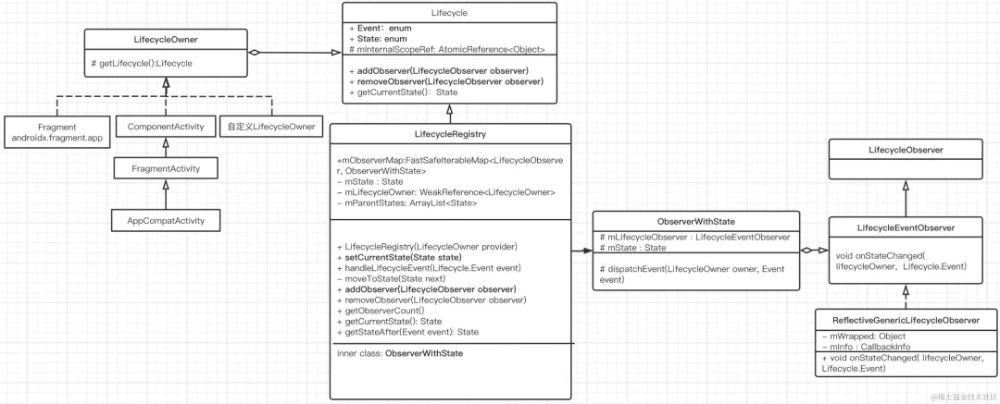
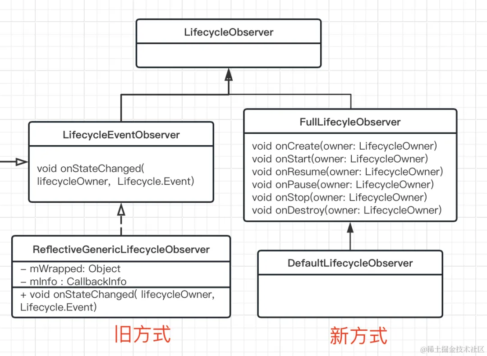
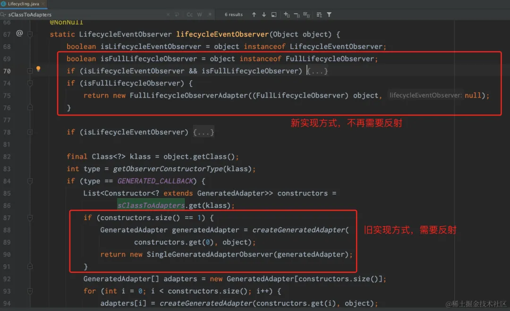
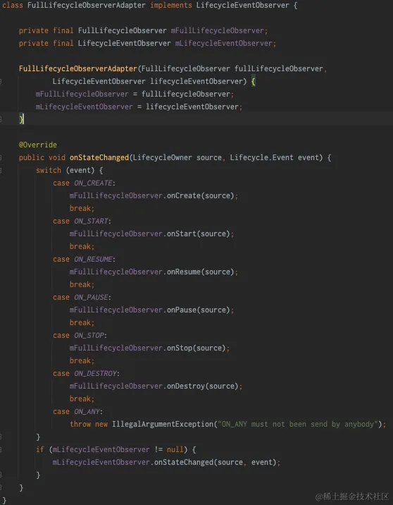

## LifeCycle

> [LifeCycle](https://github.com/jhbxyz/ArticleRecord/blob/master/articles/Jetpack/1Lifecycle%E5%9F%BA%E6%9C%AC%E4%BD%BF%E7%94%A8%E5%92%8C%E5%8E%9F%E7%90%86%E5%88%86%E6%9E%90.md)
>
> [LifeCycle新老版本使用](https://mp.weixin.qq.com/s/7hxuxGjU8vV13O8bNa17SA)

 Lifecycle可以将一个类或组件变成生命周期感知型的，并且可执行相应操作来响应另一个组件（如 activity 和 fragment）的生命周期状态的变化。Lifecycle使得代码更有条理性、精简、易于维护。 


如果在生命周期函数调用大量的代码，可能会导致管理混乱，甚至出现onStop()调用结束后，onStart()还在等待回调，例如下面例子：

```java
class MyActivity extends AppCompatActivity {
    private MyLocationListener myLocationListener;

    public void onCreate(...) {
        myLocationListener = new MyLocationListener(this, location -> {
            // update UI
        });
    }

    @Override
    public void onStart() {
        super.onStart();
        Util.checkUserStatus(result -> {
            // what if this callback is invoked AFTER activity is stopped?
            //还在等待回调
            if (result) {
                myLocationListener.start();
            }
        });
    }

    @Override
    public void onStop() {
        super.onStop();
        myLocationListener.stop();
    }
}
```


### **Lifecycle中的三个角色：**

1. **LifeCycle**: Lifecycle 是一个抽象类，用于存储有关组件（Act或Fragment）声明周期状态新的类，并允许其他对象观察此类。 
2. **LifecycleOwner**: 生命周期拥有者，如`Activity/Fragment`等类都实现了该接口并通过`getLifecycle()`获得`Lifecycle`，进而可通过`addObserver()`添加观察者。
3. **LifecycleObserver**: 生命周期观察者，实现该接口后就可以添加到`Lifecycle`中，从而在被观察者类生命周期发生改变时能马上收到通知。

每个可能的`Lifecycle`状态都在[`Lifecycle.State`](https://developer.android.google.cn/reference/androidx/lifecycle/Lifecycle.State)枚举中表示 。

- [`INITIALIZED`]
- [`CREATED`]
- [`STARTED`]
- [`RESUMED`]
- [`DESTROYED`]


### 使用方式

#### 老版本

老版本是在`lifecycleObserver`方法上添加注解使之成为可感知生命周期的方法

```kotlin
open class MyLifeCycleObserver : LifecycleObserver {

    @OnLifecycleEvent(value = Lifecycle.Event.ON_START)
    fun connect(owner: LifecycleOwner) {
        Log.e(JConsts.LIFE_TAG, "Lifecycle.Event.ON_CREATE:connect")
    }

    @OnLifecycleEvent(value = Lifecycle.Event.ON_STOP)
    fun disConnect() {
        Log.e(JConsts.LIFE_TAG, "Lifecycle.Event.ON_DESTROY:disConnect")
    }
}

//Activity中
class MainActivity : AppCompatActivity() {
    override fun onCreate(savedInstanceState: Bundle?) {
        super.onCreate(savedInstanceState)
        setContentView(R.layout.activity_main)
        //添加LifecycleObserver观察者
        lifecycle.addObserver(MyLifeCycleObserver())
    }
}
```

> 已经遗弃，不推荐使用

#### 新版本

**①DefaultLifecycleObserver**

新方式中已经没有 `@OnLifecycleEvent `注解，并且没有实现 `LifecycleObserver` 接口，而是实现了一个叫`DefaultLifecycleObserver`的接口 

```kotlin
open class MyLifeCycleObserver : DefaultLifecycleObserver {
    override fun onStart(owner: LifecycleOwner) {
        Log.e(KConsts.LIFE_TAG, "Lifecycle.Event.ON_START:connect")
    }

    override fun onStop(owner: LifecycleOwner) {
        Log.e(KConsts.LIFE_TAG, "Lifecycle.Event.ON_STOP:disConnect")
    }
}

//Activity/Fragment中的使用方式不变：
lifecycle.addObserver(MyLifeCycleObserver())
```


**②LifecycleOwner**

**继承该接口必须实现`getLifcycle()`**

对于自定义组件或模块，如果想让其具有可观察的生命周期，那么就可以实现`LifecycleOwner`。`owner`可以提供生命周期，而观察者可以注册以观察生命周期。

**例子：**

```java
public class Section implements LifecycleOwner {

    private LifecycleRegistry lifecycle;
    private Fragment fragment;

    public Section(){
        lifecycle = new LifecycleRegistry(this);
    }

    public void onCreate(){
        lifecycle.handleLifecycleEvent(Lifecycle.Event.ON_CREATE);
    }

    public void onStart(){
        lifecycle.handleLifecycleEvent(Lifecycle.Event.ON_START);
    }

    public void onResume(){
        lifecycle.handleLifecycleEvent(Lifecycle.Event.ON_RESUME);
    }


    public void init(){
        lifecycle.addObserver(new MyLifecycleObserver());
    }

    @NonNull
    @Override
    public Lifecycle getLifecycle() {
        return lifecycle;
    }
}
```

```java
public class MyLifecycleObserver implements DefaultLifecycleObserver {

    private final String TAG = this.getClass().getSimpleName();

    @Override
    public void onCreate(@NonNull LifecycleOwner owner) {
        DefaultLifecycleObserver.super.onCreate(owner);
        Log.d(TAG, "onCreate: ");
    }

    @Override
    public void onDestroy(@NonNull LifecycleOwner owner) {
        DefaultLifecycleObserver.super.onDestroy(owner);
        Log.d(TAG, "onDestroy: ");
    }

    @Override
    public void onPause(@NonNull LifecycleOwner owner) {
        DefaultLifecycleObserver.super.onPause(owner);
        Log.d(TAG, "onPause: ");
    }

    @Override
    public void onResume(@NonNull LifecycleOwner owner) {
        DefaultLifecycleObserver.super.onResume(owner);
        Log.d(TAG, "onResume: ");
    }

    @Override
    public void onStart(@NonNull LifecycleOwner owner) {
        DefaultLifecycleObserver.super.onStart(owner);
        Log.d(TAG, "onStart: ");
    }

    @Override
    public void onStop(@NonNull LifecycleOwner owner) {
        DefaultLifecycleObserver.super.onStop(owner);
        Log.d(TAG, "onStop: ");
    }
}
```


目前 26.1.0 及更高版本中的 Fragment 和 Activity 已实现 `LifecycleOwner`接口。如果自定义类并使其成为LifecycleOwner，可以使用如下:

```java
public class MyActivity extends Activity implements LifecycleOwner {
    private LifecycleRegistry lifecycleRegistry;

    @Override
    protected void onCreate(Bundle savedInstanceState) {
        super.onCreate(savedInstanceState);

        lifecycleRegistry = new LifecycleRegistry(this);
        lifecycleRegistry.markState(Lifecycle.State.CREATED);
    }

    @Override
    public void onStart() {
        super.onStart();
        lifecycleRegistry.markState(Lifecycle.State.STARTED);
    }

    @NonNull
    @Override
    public Lifecycle getLifecycle() {
        return lifecycleRegistry;
    }
}
```


#### 对比

  

LifecycleRegistry负责添加和管理各个LifecycleObserver，最终是从LifecycleOwner中的生命周期Event传到了LifecycleObserver中对应的方法。 

在旧的实现方式中，LifecycleObserver的最终实现类是ReflectiveGenericLifecycleObserver（见上图），当调用其对应的onStateChanged()方法后，是通过反射找到对应的@OnLifecycleEvent 注解并调用对应的方法的。那么新的实现方式最后如何调用观察者里对应的方法的呢？ 

  

 上图只把最后接收事件的地方放出来了，前面的不变，可以看到新方式中没有用到LifecycleEventObserver接口，那么如何触发onStateChanged()回调呢？看来需要个适配器了，一块看下源码中是如何处理的： 

  

`addObserver(LifecycleObserver observer)`添加观察者后，如果使用的新的方式，系统会将传入的 `FullLifecycleObserver` 转换成` FullLifecycleObserverAdapter`，从名字看就是一个适配器了，看看里面： 

  

果然，FullLifecycleObserverAdapter 实现了LifecycleEventObserver接口，从而也可以执行onStateChanged()方法了，在onStateChanged()中根据传入的Event事件回调FullLifecycleObserver中对应的生命周期方法，新方式不用再去反射调用，提高了性能。 


### 分析

#### LifeCycle

Lifecycle 是一个类，用于存储有关组件（Act或Fragment）声明周期状态新的类，并允许其他对象观察此类。 

其源码结构：

```kotlin
public abstract class Lifecycle {
  
    //协程拓展时使用，在协程背景下可以使用lifecycle.coroutineScope
    @RestrictTo(RestrictTo.Scope.LIBRARY_GROUP)
    public var internalScopeRef: AtomicReference<Any> = AtomicReference<Any>()
    //添加生命周期观察者
    @MainThread
    public abstract fun addObserver(observer: LifecycleObserver)
	//移除生命周期观察者
    @MainThread
    public abstract fun removeObserver(observer: LifecycleObserver)
	//获取当前状态
    @get:MainThread
    public abstract val currentState: State

    public enum class Event {
        ON_CREATE,ON_START,ON_RESUME,ON_PAUSE,ON_STOP,ON_DESTROY,ON_ANY;
        
        public val targetState: State
            get() {
                when (this) {
                    ON_CREATE, ON_STOP -> return State.CREATED
                    ON_START, ON_PAUSE -> return State.STARTED
                    ON_RESUME -> return State.RESUMED
                    ON_DESTROY -> return State.DESTROYED
                    ON_ANY -> {}
                }
                throw IllegalArgumentException("$this has no target state")
            }
        }
    }

    public enum class State {
        DESTROYED,INITIALIZED,CREATED,STARTED,RESUMED;
    }
}
```

**LifeCycle只有一个实现类：LifecycleRegistry**

```kotlin
public class LifecycleRegistry extends Lifecycle {

    // 生命周期观察者map,LifecycleObserver是观察者接口,ObserverWithState具体的状态分发的包装类
    private FastSafeIterableMap<LifecycleObserver, ObserverWithState> mObserverMap;
    // 当前生命周期状态
    private State mState = INITIALIZED;
    // 持有生命周期的提供商,Activity或者Fragment的弱引用
    private final WeakReference<LifecycleOwner> mLifecycleOwner;
    // 当前正在添加的观察者数量,默认为0,超过0则认为多线程调用
    private int mAddingObserverCounter = 0;
    // 是否正在分发事件
    private boolean mHandlingEvent = false;
    // 是否有新的事件产生
    private boolean mNewEventOccurred = false;
    // 存储主类的事件state
    private ArrayList<State> mParentStates = new ArrayList<>();

    @Override
    public void addObserver(@NonNull LifecycleObserver observer) {
        // 初始化状态,destory or init
        State initialState = mState == DESTROYED ? DESTROYED : INITIALIZED;
        // 📌 初始化实际分发状态的包装类
        ObserverWithState statefulObserver = new ObserverWithState(observer, initialState);
        // 将观察者添加到具体的map中,如果已经存在了则返回之前的,否则创建新的添加到map中
        ObserverWithState previous = mObserverMap.putIfAbsent(observer, statefulObserver);
        // 如果上一步添加成功了,putIfAbsent会返回null
        if (previous != null) {
            return;
        }
        // 如果act或者ff被回收了,直接return
        LifecycleOwner lifecycleOwner = mLifecycleOwner.get();
        if (lifecycleOwner == null) {
            return;
        }
        // 当前添加的观察者数量!=0||正在处理事件
        boolean isReentrance = mAddingObserverCounter != 0 || mHandlingEvent;
        // 📌 取得观察者当前的状态
        State targetState = calculateTargetState(observer);
        mAddingObserverCounter++;
        // 📌 如果当前观察者状态小于当前生命周期所在状态&&这个观察者已经被存到了观察者列表中
        while ((statefulObserver.mState.compareTo(targetState) < 0
                && mObserverMap.contains(observer))) {
            // 保存当前的生命周期状态
            pushParentState(statefulObserver.mState);
            // 返回当前生命周期状态对应的接下来的事件序列
            final Event event = Event.upFrom(statefulObserver.mState);
            ...
            // 分发事件
            statefulObserver.dispatchEvent(lifecycleOwner, event);
            // 移除当前的生命周期状态
            popParentState();
            // 再次获得当前的状态,以便继续执行
            targetState = calculateTargetState(observer);
        }

        // 处理一遍事件,保证事件同步
        if (!isReentrance) {
            sync();
        }
        // 回归默认值
        mAddingObserverCounter--;
    }
    ...
    static class ObserverWithState {
        State mState;
        LifecycleEventObserver mLifecycleObserver;

        ObserverWithState(LifecycleObserver observer, State initialState) {
            // 初始化事件观察者
            mLifecycleObserver = Lifecycling.lifecycleEventObserver(observer);
            mState = initialState;
        }

        void dispatchEvent(LifecycleOwner owner, Event event) {
            State newState = event.getTargetState();
            mState = min(mState, newState);
            mLifecycleObserver.onStateChanged(owner, event);
            mState = newState;
        }
    }
    ...
}
```


**每当我们调用 addObserver() 添加新的观察者时：**

内部都会对我们的观察者进行包装，并将其包装为一个具体的事件观察者 LifecycleEventObserver，以及生成当前的观察者对应的状态实例（内部持有LifecycleEventObserver），并将其保存到缓存 map 中。接着会去对比当前的 观察者的状态 和 lifecycle 此时实际状态，如果当前观察者状态<lifecycle对应的状态 ，则触发相应 Event 的通知，并更新此观察者对应的状态，不断轮训，直到当前观察者状态 >= lifecycle 对应状态。