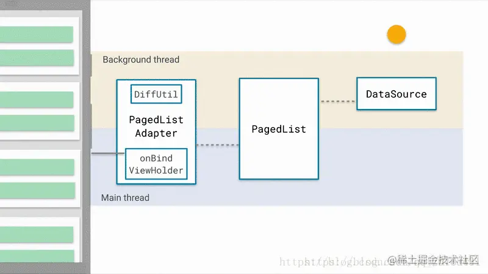

# Paging库

> [Paging](https://juejin.cn/post/7098390670150205477)

## 一、概览

**Paging**库就是用来进行分页展示的一个组件，主要涉及三个类：

1. PagedListAdapter：`RecyclerView.Adapter`基类，用于在`RecyclerView`显示来自`PagedList`的分页数据。
2. PagedList：`PagedList`负责通知`DataSource`何时获取数据，如加载第一页、最后一页及加载数量等。从DataSource获取的数据将存储在`PagedList`中。
3. DataSource：执行具体的数据载入工作，数据载入需要在工作线程中进行

## 二、功能

Paging 库包含以下功能：

- ***分页数据的内存中缓存***。该功能可确保您的应用在处理分页数据时高效利用系统资源。
- ***删除重复的内置请求信息***，可确保您的应用高效利用网络带宽和系统资源。
- 可配置[`RecyclerView`]适配器，会在用户滚动到已加载数据的末尾时自动请求数据。
- 对 Kotlin 协程和 Flow 以及 [`LiveData`] 和 RxJava 的一流支持。
- 内置对错误处理功能的支持，包括刷新和重试功能。


## 三、组件介绍

### 架构：

该库的组件在应用的三个层运行：

- 代码库层

  > 代码库层中的主要 Paging 库组件是 **[`PagingSource`]**。每个 `PagingSource` 对象都定义了数据源，以及如何从该数据源检索数据。`PagingSource` 对象可以从任何单个数据源（包括网络来源和本地数据库）加载数据。
  >
  > 另一个 Paging 库组件是 **[`RemoteMediator`]**。`RemoteMediator` 对象会处理来自分层数据源（例如具有本地数据库缓存的网络数据源）的分页。

- `ViewModel` 层

  > 将 `ViewModel` 层连接到界面的组件是 **[`PagingData`]**。`PagingData` 对象是用于存放分页数据快照的容器。它会查询 **[`PagingSource`]**对象并存储结果。

- 界面层

  > 界面层中的主要 Paging 库组件是 [`PagingDataAdapter`]，它是一种处理分页数据的 [`RecyclerView`]适配器。
  >
  > 此外，您也可以使用随附的 [`AsyncPagingDataDiffer`]组件构建自己的自定义适配器。


**Paging组件主要是下图所示原理：**

当一条新的item插入到数据库，DataSource会被初始化，LiveData后台线程就会创建一个新的PagedList。这个新的PagedList会被发送到UI线程的PagedListAdapter中，PagedListAdapter使用DiffUtil在对比现在的Item和新建Item的差异。当对比结束，PagedListAdapter通过调用RecycleView.Adapter.notifyItemInserted()将新的item插入到适当的位置



## 四、使用

### Paging 2

paging2已经弃用

> 参考——https://www.jianshu.com/p/8b8effb4324f
>
> https://developer.android.google.cn/topic/libraries/architecture/paging?hl=zh-cn

```groovy
dependencies {
  def paging_version = "2.1.2"

  implementation "androidx.paging:paging-runtime:$paging_version" // For Kotlin use paging-runtime-ktx

  // alternatively - without Android dependencies for testing
  testImplementation "androidx.paging:paging-common:$paging_version" // For Kotlin use paging-common-ktx

  // optional - RxJava support
  implementation "androidx.paging:paging-rxjava2:$paging_version" // For Kotlin use paging-rxjava2-ktx
}
```


#### 1.DataSource

DataSource<Key, Value>从字面意思理解是一个数据源，其中key对应加载数据的条件信息，Value对应加载数据的实体类。

根据分页机制的不同，Paing为我们提供了三种DataSource：

- PositionalDataSource：适用于可通过任意位置加载数据，且目标数据源数量固定的情况。
- PageKeyedDataSource：适合数据源以“页”的方式进行请求的情况。如获取数据携带`page`和`pageSize`时。
- ItemKeyedDataSource：适用于当目标数据的下一页需要依赖上一页数据中的最后一个对象中的某个字段作为key的情况，如评论数据的接口携带参数`since`和`pageSize`。

```java
public class UserPageKeyedDataSource extends PageKeyedDataSource<String, Repo> {

    private int pageNum = 0;
    private GithubService service;

    UserPageKeyedDataSource(GithubService service) {
        this.service = service;
    }

    @Override
    public void loadInitial(@NonNull LoadInitialParams<String> params, @NonNull LoadInitialCallback<String, Repo> callback) {
        pageNum = 0;
        try {
            Response<RepoSearchResponse> response = service.searchRepos("Android" + IN_QUALIFIER, pageNum, 20).execute();
            callback.onResult(response.body().getItems(), "", "");
        } catch (Exception e) {

        }
    }

    /**
     * 请求上一页数据(基本不用)
     */
    @Override
    public void loadBefore(@NonNull LoadParams<String> params, @NonNull LoadCallback<String, Repo> callback) {

    }

    /**
     * 请求下一页数据
     */
    @Override
    public void loadAfter(@NonNull LoadParams<String> params, @NonNull LoadCallback<String, Repo> callback) {
        pageNum++;
        try {
            Response<RepoSearchResponse> response = service.searchRepos("Android" + IN_QUALIFIER, pageNum, 20).execute();
            callback.onResult(response.body().getItems(), "");
        } catch (Exception e) {

        }
    }
}
```


#### 2.PagedList

PageList继承AbstractList，支持所有List的操作。PagedList会从Datasource中加载数据，更准确的说是通过Datasource加载数据， 通过Config的配置，可以设置一次加载的数量以及预加载的数量。 除此之外，PagedList还可以向RecyclerView.Adapter发送更新的信号，驱动UI的刷新。


#### 3.PagedListAdapter

PagedListAdapter是通过RecyclerView.Adapter实现，用于展示PagedList的数据。它本身并没有比adapter多多少东西。

**主要需要注意 AsyncPagedListDiffer 这个辅助类。它负责监听PagedList的更新， Item数量的统计等功能。当数据源变动产生新的PagedList,PagedAdapter会在后台线程中比较前后两个PagedList的差异，然后调用notifyItem…()方法更新RecyclerView。**

```java
public class MyPagedAdapter extends PagedListAdapter<Repo, MyPagedAdapter.UserHolder> {

    public MyPagedAdapter() {
        super(callback);
    }

    @NonNull
    @Override
    public MyPagedAdapter.UserHolder onCreateViewHolder(@NonNull ViewGroup parent, int viewType) {
        return new UserHolder(LayoutInflater.from(parent.getContext()).inflate(R.layout.layout, parent, false));
    }

    @Override
    public void onBindViewHolder(@NonNull MyPagedAdapter.UserHolder holder, int position) {
        holder.bind(getItem(position));
    }

    static class UserHolder extends RecyclerView.ViewHolder {

        TextView mText;

        public UserHolder(@NonNull View itemView) {
            super(itemView);
            mText = itemView.findViewById(R.id.txt);
        }

        public void bind(Repo repo) {
            mText.setText(repo.getFullName());
        }
    }

    /**
     * DiffCallback的接口实现中定义比较的规则，比较的工作则是由PagedStorageDiffHelper来完成
     */
    private static final DiffUtil.ItemCallback<Repo> callback = new DiffUtil.ItemCallback<Repo>() {
        @Override
        public boolean areItemsTheSame(@NonNull Repo oldItem, @NonNull Repo newItem) {
             // The ID property identifies when items are the same.
            return oldItem.getId() == newItem.getId();
        }

        @Override
        public boolean areContentsTheSame(@NonNull Repo oldItem, @NonNull Repo newItem) {
            // Don't use the "==" operator here. Either implement and use .equals(),
            // or write custom data comparison logic here.
            return oldItem.getFullName().equals(newItem.getFullName());
        }
    };
}
```


### Paging 3

paging可以配合Rxjava、Guava一起使用。

```groovy
dependencies {
  def paging_version = "3.1.1"
  implementation "androidx.paging:paging-runtime:$paging_version"

  //以下可选
  // alternatively - without Android dependencies for tests
  testImplementation "androidx.paging:paging-common:$paging_version"

  // optional - RxJava2 support
  implementation "androidx.paging:paging-rxjava2:$paging_version"

  // optional - RxJava3 support
  implementation "androidx.paging:paging-rxjava3:$paging_version"

  // optional - Guava ListenableFuture support
  implementation "androidx.paging:paging-guava:$paging_version"

  // optional - Jetpack Compose integration
  implementation "androidx.paging:paging-compose:1.0.0-alpha18"
}
```


#### 1.定义DataSource

通过`load()`指明如何从相应数据源检索分页数据

```java
class ExamplePagingSource extends ListenableFuturePagingSource<Integer, User> {
    @NonNull
    private ExampleBackendService mBackend;//提供数据的后端服务实例。
    @NonNull
    private String mQuery;//要发送到 backend 指示的服务的搜索查询。
    @NonNull
    private Executor mBgExecutor;

    //构造函数
    ExamplePagingSource(@NonNull ExampleBackendService backend,
                        @NonNull String query, 
                        @NonNull Executor bgExecutor) {
        mBackend = backend;
        mQuery = query;
        mBgExecutor = bgExecutor;
    }

    //LoadParams 对象包含有关要执行的加载操作的信息，其中包括要加载的键和要加载的项数。
    //LoadResult 对象包含加载操作的结果。
    @NotNull
    @Override
    public ListenableFuture<LoadResult<Integer, User>> loadFuture(@NotNull LoadParams<Integer> params) {
        // Start refresh at page 1 if undefined.
        Integer nextPageNumber = params.getKey();
        if (nextPageNumber == null) {
            nextPageNumber = 1;
        }

        //数据加载请求可能因多种原因而失败，特别是在通过网络加载时。通过从 load() 方法返回 LoadResult.Error 对象，可报告在加载过程中遇到的错误。
        //以下内容捕获和报告 ExamplePagingSource 中的加载错误：
        ListenableFuture<LoadResult<Integer, User>> pageFuture =
            Futures.transform(mBackend.searchUsers(mQuery, nextPageNumber),
                              this::toLoadResult, mBgExecutor);

        
        ListenableFuture<LoadResult<Integer, User>> partialLoadResultFuture =
            Futures.catching(pageFuture, HttpException.class,
                             LoadResult.Error::new, mBgExecutor);

        return Futures.catching(partialLoadResultFuture,
                                IOException.class, LoadResult.Error::new, mBgExecutor);
    }

    //LoadResult 是一个密封的类，根据 load() 调用是否成功，采用如下两种形式之一：
    //加载成功，则返回 LoadResult.Page 对象。
    //加载失败：则返回 LoadResult.Error 对象。
    private LoadResult<Integer, User> toLoadResult(@NonNull SearchUserResponse response) {
        return new LoadResult.Page<>(response.getUsers(),
                                     null, // Only paging forward.
                                     response.getNextPageNumber(),
                                     LoadResult.Page.COUNT_UNDEFINED,
                                     LoadResult.Page.COUNT_UNDEFINED);
    }

    
    //PagingSource 实现还必须实现 getRefreshKey() 方法，该方法接受 PagingState 对象作为参数，并且当数据在初始加载后刷新或失效时，该方法会返回要传递给 load() 方法的键。在后续刷新数据时，Paging 库会自动调用此方法。
    @Nullable
    @Override
    public Integer getRefreshKey(@NotNull PagingState<Integer, User> state) {
        // Try to find the page key of the closest page to anchorPosition, from
        // either the prevKey or the nextKey, but you need to handle nullability
        // here:
        //  * prevKey == null -> anchorPage is the first page.
        //  * nextKey == null -> anchorPage is the last page.
        //  * both prevKey and nextKey null -> anchorPage is the initial page, so
        //    just return null.
        Integer anchorPosition = state.getAnchorPosition();
        if (anchorPosition == null) {
            return null;
        }

        LoadResult.Page<Integer, User> anchorPage = state.closestPageToPosition(anchorPosition);
        if (anchorPage == null) {
            return null;
        }

        Integer prevKey = anchorPage.getPrevKey();
        if (prevKey != null) {
            return prevKey + 1;
        }

        Integer nextKey = anchorPage.getNextKey();
        if (nextKey != null) {
            return nextKey - 1;
        }

        return null;
    }
}
```


#### 2.PagedList


#### 3.PageListAdapter

